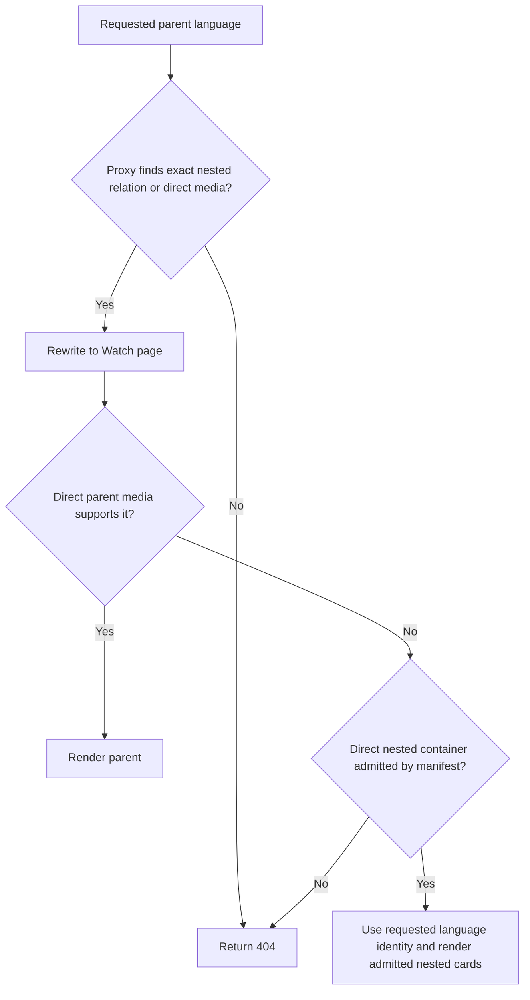

# Watch Parent Nested-Language Admission - Plan

## Goal Capsule

Allow a Watch parent collection to render for a requested language when at least one of its directly rendered nested collections or series is exactly admitted for that language.

The existing no-fallback rule remains: a parent with neither directly playable requested-language content nor an admitted nested container returns 404 instead of redirecting to another language.

---

## Product Contract

### Summary

This revision makes navigational parent collections available in English when they lead to an English collection or series, while keeping unavailable nested cards hidden.

### Problem Frame

FGE-47 correctly prevented English Watch URLs from silently resolving to Afrikaans, but the initial rule only considered direct playable children of the parent.

The Discipleship parent is a navigational container whose English content is one level deeper, so `/watch/discipleship.html` became a 404 even though an English nested collection exists.

### Requirements

#### Parent admission

- R1. A parent collection requested in a language it does not directly play must pass proxy admission and render when at least one directly rendered nested collection or series has an exact admitted route-manifest entry for that language.
- R2. The parent must continue to render for languages available through its direct playable children.
- R3. A parent with neither a directly available requested language nor an admitted nested container must return 404 and must not redirect or fall back to another language.

#### Nested card visibility

- R4. Only nested collection and series cards admitted for the selected language are rendered.
- R5. If the route manifest is missing or lacks the exact nested-container relation or language index, the nested card must remain hidden and cannot make the parent available.

### Acceptance Examples

- AE1. Given a parent with direct Afrikaans children and an English-admitted nested collection, requesting either canonical or explicit English Watch URL passes proxy admission, renders that parent, and gives its nested card the English route language.
- AE2. Given the same parent with a nested collection admitted only in Afrikaans, requesting English returns 404.
- AE3. Given a directly English-playable parent, its current language resolution and child-card behavior remain unchanged.

### Scope Boundaries

- The change applies to the parent page's directly rendered nested collections and series; it introduces a compact manifest relation for proxy admission but does not recursively traverse the content tree at request time.
- Direct deployment changes and content-inventory changes are outside this fix.
- Navigation-parent copy and download-call-to-action semantics are deferred because this fix preserves the existing collection presentation while correcting language admission and routing.

---

## Planning Contract

### Key Technical Decisions

- KTD1. Extend the cached Watch route manifest with a compact direct-parent-to-nested-container language index, and require an exact parent, nested child, and requested-language match for both proxy and page admission. (session-settled: user-directed — chosen over parent direct-child language inventory only: the parent must be admitted when an English nested collection is available.)
- KTD2. Build the parent language inventory as the union of direct playable languages and exact admitted languages from directly rendered nested containers, then pass that inventory to the existing client language controls. (session-settled: user-directed — chosen over returning 404 for every parent without direct English media: English navigational parent pages must lead to English nested collections.)
- KTD3. Keep the manifest check fail-closed for nested containers. (session-settled: user-approved — chosen over exposing unavailable cards or redirecting to Afrikaans: English must never silently fall back to Afrikaans.)
- KTD4. Suppress a selected trailer variant unless it matches the effective requested language, so a nested-only English parent cannot play an Afrikaans trailer. (session-settled: user-approved — chosen over retaining a mismatched decorative trailer: the no-fallback rule applies to visible language-specific media as well as navigation.)

### High-Level Technical Design

The server page first resolves its direct playable language as it does today.

Admin emits the direct nested-container relation with compact language indexes, so the proxy can admit canonical and explicit requested-language URLs without broadening route admission.

The server page augments direct playable languages with exact nested-record languages from the already-loaded manifest, so existing language resolution admits the requested canonical slug and the client language picker and grid receive that language.

It must keep the existing canonical-slug equality guard after resolution: the resolver's deterministic first-language fallback is not language admission.

### Sources / Research

- `apps/admin/src/services/watch-route-manifest.service.ts` owns the compact route-admission snapshot generated from published Core content.
- `apps/web/src/proxy.ts` enforces public Watch route admission before the server page executes.
- `apps/web/src/app/[locale]/[htmlLang]/[...rest]/page.tsx` resolves a series language from `childDubLanguages` and filters nested records through the Watch route manifest.
- `apps/web/src/app/[locale]/[htmlLang]/[...rest]/__tests__/page-routing.test.tsx`, `apps/web/src/proxy.test.ts`, and `apps/web/src/components/watch/__tests__/SeriesPageClient.test.tsx` provide the focused page, edge-route, and client-route assertions.
- `docs/roadmap/platform/feat-247-watch-nested-series-language-availability.md` records the original FGE-47 contract and will be amended with this discovered parent-container case.

## Implementation Units

### U1. Publish exact nested-container admission data

- **Goal:** Extend the admin-generated Watch route manifest with a compact direct-parent-to-nested-container language relation that the Web proxy and page can verify without runtime GraphQL fan-out.
- **Requirements:** R1, R3, R5, AE1, AE2.
- **Files:** `apps/admin/src/services/watch-route-manifest.service.ts`, `apps/admin/src/services/watch-route-manifest.service.test.ts`.
- **Approach:** Query only published direct child records labelled `collection` or `series` with playable language dubs, encode their parent/child/language relation as existing compact language indexes, and include it in the manifest version hash and payload validation.
- **Test Scenarios:** The relation is deterministic; it excludes leaf episodes; a nested English route is indexed even when the parent has only direct Afrikaans media.
- **Verification:** Run the focused admin manifest-service test file.

### U2. Admit the public parent route and render its requested language

- **Goal:** Make the proxy and Watch server page retain the requested language when a directly rendered nested collection or series is manifest-admitted for it.
- **Requirements:** R1, R2, R3, R4, R5, AE1, AE2, AE3.
- **Files:** `apps/web/src/lib/watch-route-manifest.ts`, `apps/web/src/proxy.ts`, `apps/web/src/proxy.test.ts`, `apps/web/src/app/[locale]/[htmlLang]/[...rest]/page.tsx`, `apps/web/src/app/[locale]/[htmlLang]/[...rest]/__tests__/page-routing.test.tsx`, `apps/web/src/components/watch/__tests__/SeriesPageClient.test.tsx`.
- **Approach:** Add one exact nested-container predicate shared by proxy and page logic; use it to admit canonical and explicit English URLs, merge only matching direct nested-record languages into the parent client inventory, keep the canonical-slug equality guard, and drop a mismatched selected trailer variant.
- **Test Scenarios:** A parent with direct Afrikaans and only nested English content passes proxy admission for both English URL shapes, renders in English, and sends English to each nested-card route; an otherwise identical parent without an English-admitted nested record returns 404; a nested child present globally but lacking the exact parent relation stays excluded; a mismatched Afrikaans trailer is not rendered for English.
- **Verification:** Run focused manifest, proxy, page-routing, and SeriesPageClient tests, plus relevant web type/lint checks.

### U3. Keep the FGE-47 roadmap contract accurate

- **Goal:** Reopen and complete the existing roadmap ticket with the corrected parent-container admission semantics and regenerate its index.
- **Requirements:** R1, R3.
- **Files:** `docs/roadmap/platform/feat-247-watch-nested-series-language-availability.md`, `docs/roadmap/README.md`.
- **Approach:** Reopen the completed ticket, record the direct nested-container exception without weakening the no-fallback rule, regenerate the roadmap index, format generated Markdown, and mark the ticket complete again after verification.
- **Test Scenarios:** The completed roadmap entry describes English admission through an exact nested manifest route and still describes 404 behavior when none exists.
- **Verification:** Run the repository roadmap generator and format check.

---

## Verification Contract

| Gate                          | Applies to | Done signal                                                                                                       |
| ----------------------------- | ---------- | ----------------------------------------------------------------------------------------------------------------- |
| Focused admin manifest test   | U1         | `pnpm --filter @forge/admin test -- watch-route-manifest.service.test.ts` passes.                                 |
| Focused Web route tests       | U2         | `pnpm --filter @forge/web test -- proxy.test.ts page-routing.test.tsx SeriesPageClient.test.tsx` passes.          |
| Web lint                      | U2         | `pnpm --filter @forge/web lint` passes.                                                                           |
| Web type check                | U2         | `pnpm --filter @forge/web typecheck` passes.                                                                      |
| Roadmap generation and format | U3         | The roadmap index is regenerated and `pnpm run format:check` passes.                                              |
| Browser regression check      | U2         | The affected public English parent route is rendered in the local Watch app and no browser errors are introduced. |

### Release sequencing

Deploy Admin first, refresh the persisted Watch route manifest, and verify that
the snapshot contains `nestedContainerAudioLanguageIndexesByParent` with a new
version before deploying Web. The Web admission path deliberately fails closed
for pre-feature snapshots because their episode pairs cannot distinguish a
nested collection from a leaf episode.

---

## Definition of Done

- The public canonical and explicit English parent collection URLs render when an exact English-admitted direct nested collection or series exists.
- The parent remains a 404 for English when neither direct media nor a nested container supports English.
- Unavailable nested cards remain hidden, and no route silently falls back to Afrikaans.
- Focused tests and the applicable lint, type, formatting, and browser checks pass.
- The existing FGE-47 roadmap ticket and generated index describe the corrected behavior.
- No abandoned experimental code or unrelated formatting churn remains in the change.
