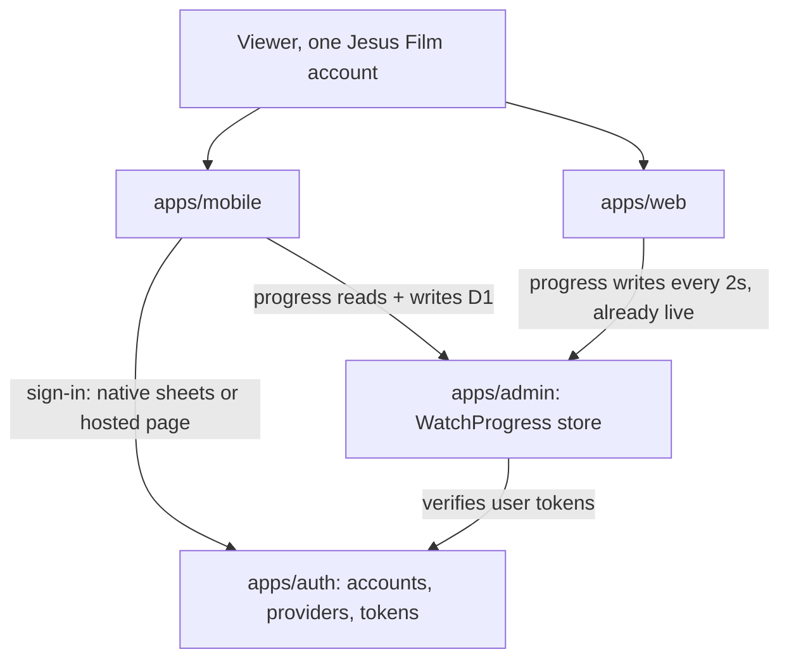
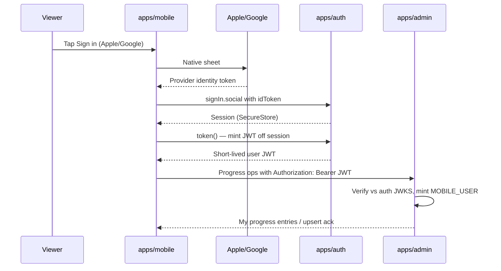
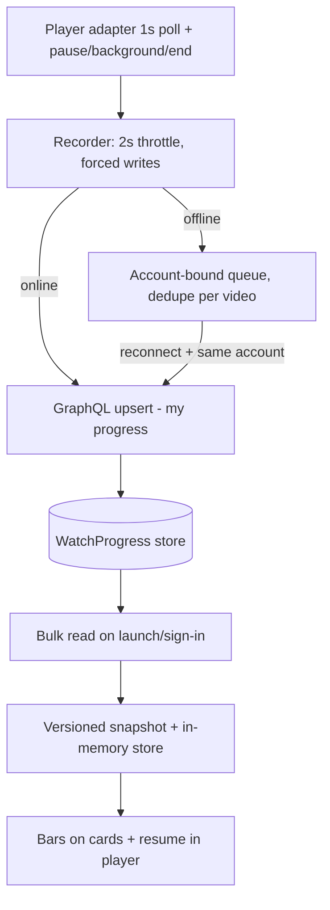

# Mobile Login and Continue Watching - Plan

## Goal Capsule

- **Objective:** Ship sign-in on `apps/mobile` using the same Jesus Film account as web, plus cross-device continue-watching (progress bars + resume-from-position on the shared per-account `WatchProgress` record) — building all three sides: the mobile app, admin's viewer-scoped progress surface, and the auth-service configuration.
- **Authority:** Urim builds the `apps/mobile`, `apps/admin`, and `apps/auth` changes in this plan; the admin and auth owners review those PRs (per-task waiver of the usual hand-off rule). Provider provisioning (Apple capability, Google OAuth client IDs) uses the existing developer accounts.
- **Stop conditions:** Stop and surface if U1 finds no claim that distinguishes the mobile client (admin could not bind acceptance) or native provider sign-in is rejected, since the fallback reopens the native-sheets Key Decision; if U1 finds no revocable Apple credential and no server-side way to obtain one, since in-app deletion gates the release; if an admin/auth owner rejects the cross-app approach in review; or if any session-settled decision is invalidated by new evidence.
- **Release gate (user-directed):** Nothing ships to stores until the whole chain works — sign-in, recording, bars, resume, and in-app account deletion. No login-only interim release.

---

## Product Contract

### Summary

Mobile users sign in with the same account they use on web — native Apple and Google sheets, with email/password and other providers via the hosted auth page — and get continue-watching across devices: partially-watched videos show a progress bar and resume from the last recorded position, whichever signed-in surface recorded it.

### Problem Frame

Mobile has no login. A person who watches half a video on web while signed in starts from zero in the app, and nothing the app does accrues to their account. Web already runs the full loop: signed-in playback syncs positions into a per-account watch-progress store in admin (position, duration, and completed state per user and video), and web renders progress bars, resume-from-position, and a watch-history page from that record. The gap is mobile: with no identity, the app can neither read that record nor add to it. The longer-term vision (history-informed search and recommendations) needs identity on mobile and a growing base of per-account watch signal; this is proactive groundwork with continue-watching as the first user-visible reason to sign in on mobile.

### Key Decisions

- **Native Apple and Google sign-in sheets; other providers via the hosted auth page.** (session-settled: user-directed — chosen over the hosted browser-sheet PKCE flow for all providers: the slicker native feel is worth the extra auth-side dependencies and per-provider release coupling it brings.)
  > **Superseded 2026-08-11:** `docs/plans/2026-08-11-001-feat-mobile-hosted-auth-login-plan.md` replaces this decision. The hosted page is now the only mobile login; the native Apple/Google/email flows are removed. The session store, watch progress, and JWT machinery from this plan stay live.
- **V1 bundles login with continue-watching.** (session-settled: user-approved — chosen over login-only groundwork: login alone has no visible perk on mobile, since downloads are ungated and no history UI exists.)
- **Continue-watching means progress bar plus resume-from-position.** (session-settled: user-approved — chosen over bar-only display and over adding a Continue Watching home shelf: this completes the cross-device loop without new Home surface or a list-shaped read API.)
- **Mobile downloads stay ungated.** (session-settled: user-directed — chosen over mirroring web's download gate: mobile downloads are offline in-app viewing, not raw MP4 access, so the divergence from web is intentional.)
- **Progress is signed-in only.** (session-settled: user-approved — chosen over local anonymous tracking with merge-at-sign-in: mirrors web's posture, which deferred anonymous event buffering and linking.) Correction: web's progress client does keep anonymous local progress and merges it into the account at sign-in — the deferral applied to anonymous watch events, not progress. Signed-in-only is therefore an intentional mobile divergence from web's behavior, recorded in Scope Boundaries.
- **Mobile becomes another client of the existing auth platform.** Accounts, providers, and tokens stay in the standalone identity service; sharing accounts with web requires this, so no alternative identity store was considered.

### Actors

- A1. Signed-in viewer — a person with a Jesus Film account watching across web and mobile.
- A2. Anonymous viewer — uses mobile without signing in; their experience is unchanged.
- A3. `apps/mobile` — the app: signs users in, records watch positions, displays progress and resume.
- A4. `apps/auth` — the identity service owning accounts, sign-in providers, and tokens (changes built here, owner-reviewed).
- A5. `apps/admin` — the GraphQL API that verifies user tokens, stores watch progress, and serves progress reads (changes built here, owner-reviewed).
- A6. `apps/web` — sibling client whose signed-in progress writes feed the same account (no changes).

### Key Flows

- F1. Sign in with Apple or Google
  - **Trigger:** A1 taps Sign in on the Profile tab and picks Apple or Google.
  - **Steps:** Native provider sheet completes; the app exchanges the provider credential with `apps/auth`; the same account used on web is matched or created; the app holds a signed-in session.
  - **Outcome:** Profile tab shows the account identity and a sign-out affordance.
  - **Covers:** R1, R2, R3.
- F2. Sign in with email/password or another provider
  - **Trigger:** A1 picks the email/other option.
  - **Steps:** The hosted auth sign-in page opens in a secure in-app browser sheet; the user completes any provider the page offers; the app receives the session through the standard code exchange.
  - **Outcome:** Same signed-in state as F1.
  - **Covers:** R1, R2, R3.
- F3. Record progress while watching
  - **Trigger:** A1 plays any video while signed in, streaming or downloaded.
  - **Steps:** The app records playback position to the shared account periodically and at pause, backgrounding, and end; when offline, events queue on device and flush when connectivity returns.
  - **Outcome:** The account's watch record reflects where this device stopped.
  - **Covers:** R6, R7.
- F4. Cross-device resume
  - **Trigger:** A1 opens a video they partially watched on any signed-in surface.
  - **Steps:** The card/detail shows a progress bar at the account's latest recorded position; pressing play resumes from that position, with a start-over option.
  - **Outcome:** Watching continues where it left off, regardless of which device recorded it.
  - **Covers:** R8, R9.
- F5. Sign out
  - **Trigger:** A1 taps Sign out on the Profile tab.
  - **Steps:** The app ends its own session and revokes this device's refresh credential at the identity service; progress bars disappear; a later sign-in shows a real account choice rather than silently resuming the previous identity.
  - **Outcome:** The device is back to the anonymous experience.
  - **Covers:** R3, R4, R10.
- F6. Delete account
  - **Trigger:** A signed-in user wants their account gone.
  - **Steps:** An entry point in the app's account area leads into the account-deletion capability provided by the identity service (D2); deletion also erases the account's watch-event and watch-progress records in admin (D1).
  - **Outcome:** App Store account-deletion mandate satisfied.
  - **Covers:** R5.

### Requirements

**Sign-in and session**

- R1. A person signs in on mobile with the same account they use on web; accounts created on either surface work on both. A native provider credential is accepted only when its assertion was issued to this app's own client identifier, and it links to an existing account only on a provider-verified email address.
- R2. Mobile offers native Apple and Google sign-in, and every other provider web offers (email/password, Facebook) remains reachable through the hosted auth page fallback.
- R3. A mobile session persists until explicit sign-out, and signed-in state (account identity, sign out) is visible from the Profile tab.
- R4. Signing out ends only the mobile app's session — revoking this device's refresh credential at the identity service, not just clearing local state — and the next sign-in must not silently resume the previous identity.
- R5. The app provides an in-app entry point to delete the account — an App Store requirement once account creation is offered; deletion also erases the account's watch-event and watch-progress records in admin (D1), and the deletion capability itself is D2.

**Watch progress**

- R6. Signed-in playback records positions to the shared account at resume-quality granularity: periodically during playback and at pause, backgrounding, and playback end.
- R7. Positions recorded while offline (downloaded playback) queue on device and flush when connectivity returns; queued positions are bound to the account that recorded them and are discarded rather than flushed if that account is not the signed-in account at flush time.
- R8. A partially-watched video shows a progress bar reflecting the account's latest recorded position, whichever device recorded it.
- R9. Playing a partially-watched video resumes from the last recorded position, with an option to start from the beginning.
- R10. Signed-out playback records nothing and shows no progress, and nothing merges into the account at a later sign-in.
- R11. Progress features fail open: when progress reads are unavailable (dependency not yet shipped, network failure), browsing and playback behave exactly as today.
- R12. Nothing currently public moves behind sign-in — watch, search, browse, and downloads stay available to anonymous users unchanged.

**Account control and integrity**

- R13. Progress read and write surfaces derive the account identity solely from the verified user token and reject any client-supplied user identifier; no bearer embedded in the app binary grants access to them, and admin's existing server-to-server watch-progress route stays unreachable from the app.
- R14. Session and refresh credentials are held in platform hardware-backed secure storage (iOS Keychain, Android Keystore), never plain app storage, and are excluded from device backups on both platforms — the this-device-only keychain attribute covers iOS; Android needs its own backup opt-out, since the secure-store blob is otherwise swept into auto-backup.
- R15. When a provider sign-in arrives with an email matching no existing account (for example Apple's Hide My Email relay address), the app surfaces that a new account was created rather than silently showing empty progress.
- R16. A signed-in user can clear the recorded position for an individual video from its card or detail surface, removing its progress bar; this does not require the deferred watch-history list.

**Sign-in discovery**

- R17. The app surfaces a dismissible, non-blocking sign-in prompt at the moment continue-watching would apply (reopening a partially-watched video while signed out), explaining that signing in keeps your place across devices **from that point on** — never implying the position just watched is recovered, since R10 discards it; the Profile tab remains the permanent entry point.

### Acceptance Examples

- AE1. **Covers R1, R8, R9.** Given a user watched a video to roughly half on web while signed in, when they sign in on mobile with the same account and open that video, then the card/detail shows a progress bar near the halfway mark and play resumes near that position — web already records resume-quality positions, so this works as soon as D1 and D2 land.
- AE2. **Covers R6, R8, R9.** Given a user watches part of a video signed in on mobile and force-quits the app, when they reopen it (or open a second mobile device on the same account), then the bar and resume position reflect the earlier session — requiring D1 but nothing from web.
- AE3. **Covers R7.** Given a user watches a downloaded video signed in while in airplane mode, when connectivity returns, then the queued positions flush — keyed by the video's slug, which the device has offline and admin resolves server-side — and the account's watch record reflects the offline viewing.
- AE4. **Covers R10.** Given a user watches half a video while signed out, when they then sign in, then that video shows no progress.
- AE5. **Covers R11.** Given the progress read surface is unavailable, when the user browses and plays videos, then the app behaves exactly as it does today with no user-facing errors.
- AE6. **Covers R3, R4.** Given a signed-in user signs out, when they later tap Sign in, then they are shown a real account choice (not silently returned to the previous identity), and until then the app behaves anonymously.

### Success Criteria

- Cross-device continuity — mobile-to-mobile and web-to-mobile — works end-to-end once D2 and D1 land; web already writes resume-quality positions, so no web work sits on the critical path.
- Mobile-recorded resume positions land within a few seconds of where playback actually stopped.
- Progress reads never block or slow first render; anonymous startup, browsing, and playback performance are unchanged.
- Mobile positions land in the same per-account `WatchProgress` record web reads and writes — one shared resume record per account. (Mobile watch-_event_ recording, the separate analytics log web writes, is deferred groundwork for the history/recommendations vision — no unit here grants or uses that permission.)
- At least 10 percent of active mobile users sign in within the first release cycle, and a majority of signed-in sessions that meet a partially-watched video choose resume over start-over. Both are measured from two Datadog RUM actions U11 emits (sign-in completed; resume vs start-over chosen) and reviewed at the end of that cycle to decide whether the sign-in incentive needs strengthening.

### Scope Boundaries

**Deferred for later**

- Progress bar on the Library downloads row — the row stores only a slug today, so the bar needs a migration-safe manifest change; deferred to follow-up work (user-directed 2026-08-04).
- Continue Watching shelf on Home (touches the Experience-driven Home layout; the list-shaped read the shelf needs already exists server-side).
- Visible watch-history list, saved videos, search-history capture, recommendations — the down-the-line vision, not v1.
- Mobile watch-_event_ recording (the analytics log, distinct from progress) — deferred groundwork for that same vision; MOBILE_USER carries no event-write permission in v1.
- Native Facebook sign-in sheet (Facebook stays reachable via the hosted page).
- Anonymous progress buffering with merge-at-sign-in — web's progress client already does this; mobile deliberately diverges in v1 (see the Key Decisions correction).
- TV login (expected to reuse this pattern later).

**Outside this plan's identity**

- Gating mobile downloads behind sign-in — intentional divergence from web; mobile downloads are offline in-app viewing.
- Any change to web's behavior — no web work is required for v1; web already records resume-quality positions.

### Dependencies / Assumptions

**Work packages formerly external, now built in this plan (owner-reviewed)**

- D1. `apps/admin` — viewer-scoped access to the existing per-user `WatchProgress` store: a bulk read of the signed-in user's entries, a viewer-scoped upsert, a new per-video delete (R16), and account-deletion erasure of watch data (R5). Identity always from the verified user token (R13). Built in U3–U4; admin owner reviews.
- D2. `apps/auth` — register mobile as a public OAuth client (no embedded secret; PKCE; exact-match redirect URIs); native Apple/Google credential acceptance; long-lived mobile sessions with revocation; token capability admin can verify; user-initiated account deletion with Apple token revocation. Built in U1–U2; auth owner reviews. Deletion remains release-blocking (see Goal Capsule).

**Assumptions**

- The admin and auth owners accept owner-reviewed PRs from this plan in place of building the pieces themselves; a rejection in review converts that package back into a handoff and re-opens the release timeline.
- Provider provisioning is reachable: Sign in with Apple capability on `org.jesusfilm.forgewatch`, and Google OAuth client IDs (iOS/Android/web) in the existing Google Cloud project.
- Admin's existing `WatchProgress` store is the source of truth for resume positions; mobile reads and writes that record, while watch events remain the separate analytics log.
- The installed identity framework (better-auth 1.6.2) supports native idToken sign-in and a JWT capability that composes with its OAuth-provider role — verified against current docs; the U1 spike proves it against the deployed version before anything depends on it.
- The hosted auth page is usable inside a mobile in-app browser sheet (F2 depends on it; verified during U6).

---

## Planning Contract

Product Contract preservation: unchanged except two tracked edits made with user direction during planning — Scope Boundaries gained the downloads-row deferral, and Dependencies / Assumptions was rewritten from external handoffs to in-plan cross-app work packages. All R/A/F/AE IDs and Key Decision annotations are untouched.

### Key Technical Decisions

- KTD1. **Token bridge: native sign-in + auth-issued JWT, verified by admin against auth's public keys.** Mobile signs in natively (Better Auth `signIn.social` with the provider's identity token — no browser), then obtains a short-lived JWT from auth's JWT capability; admin verifies it locally against auth's JWKS and mints a `MOBILE_USER` principal. Chosen over reusing web's browser-PKCE flow for token minting, which would reintroduce the hosted browser step the native-sheets Key Decision rejected (session-settled inheritance), and over introspection, which costs a network round-trip per request. The JWT capability already runs alongside the OAuth provider in auth's deployed config, and admin already verifies tokens against that JWKS endpoint elsewhere — so composition is settled; what U1 proves is the claim shape (see U1). Fallback if U1's claim-shape or provider results fail: browser-PKCE token minting via the existing OAuth-provider flow — a UX regression that re-opens the native-sheets decision with the user.
- KTD2. **Cross-app build.** (session-settled: user-directed — chosen over spec-and-handoff: this plan implements the `apps/admin` and `apps/auth` changes; their owners review PRs. Waives the standing do-not-edit-admin rule for this task.)
- KTD3. **Release gate: hold.** (session-settled: user-directed — chosen over shipping login-only under fail-open: no store release until sign-in, recording, bars, resume, and in-app deletion all work end-to-end.)
- KTD4. **Bar surfaces: everywhere except the Library downloads row.** (session-settled: user-directed — chosen over including the downloads row: the row lacks the video ID and needs a manifest migration; deferred to follow-up.) Surfaces in scope: video detail/player screen, Home shelf cards, series episode cards, Up Next carousel, search result cards, and the SDUI media-collection/carousel/card renderers.
- KTD5. **Recording rides the existing player adapter's 1-second poll; writes are batched, not per-tick.** `useManagedVideoPlayer` already polls `player.currentTime` every second (no native timeUpdate listener — deliberately, to sidestep the tvOS/Android timeUpdate asymmetry). The recorder samples that signal at web's 2-second granularity but **buffers intents in the store and sends at most one batched mutation every 30 seconds**, plus forced flushes on pause, app-backgrounding, unmount, and playback end. Per-tick mutations are not viable: admin's GraphQL rate limiter allows 30 mutations per minute per user, which one-write-per-2-seconds exhausts on its own — web escapes this only because it writes through its own server into a REST route the GraphQL limiter never sees. Batching preserves resume granularity (the batch input carries many entries) while staying an order of magnitude under the ceiling. The recorder lives inside the adapter and no-ops unless the caller passes an admin video id, so the muted hero pager and SDUI hero (which use raw `useVideoPlayer` and never reach the adapter) are excluded structurally; `app/video/[sectionKey].tsx` and `app/collection/[sectionKey].tsx` opt in by passing their block's video id.
- KTD6. **Web-parity playback thresholds.** Bar percent = position/duration; hidden below 1 percent; snapped to full at or above 90 percent; resume offered only between those bounds; resume seeks to at most one second before the end; resuming never autoplays. Same numbers web ships, so cross-device behavior feels identical.
- KTD7. **Admin surface is viewer-scoped GraphQL over the existing service — never the internal REST route.** New Pothos query/mutations backed by `watch-progress.service.ts`, gated by new own-data permission keys on the `MOBILE_USER` principal; the service gains a per-video delete (only a full per-user wipe exists today). The server-to-server route with its caller-supplied user id stays server-only (R13). Follows the repo's GraphQL change flow (Pothos → `schema:print` → `admin-graphql generate`).
- KTD8. **Mobile progress state: one versioned snapshot + account-bound offline queue, readable outside React.** A single versioned AsyncStorage snapshot (the watch-home snapshot pattern: version gate, byte ceiling, degrade-to-empty parsing) mirrors the server's up-to-200-entry record for instant cold-launch bars; an offline queue holds pending writes bound to the recording account (R7), pre-deduped per video before flush (client mirrors server dedupe — keep newest) and stamped with the device's recording time so the server's monotonic guard can actually reject stale entries. Offline (downloaded) playback has no admin video id on device — the downloads manifest stores only slugs — so queued offline entries carry the **slug**, which admin resolves server-side (U4); this is why no manifest migration is needed for recording, while the downloads-row _bar_ stays deferred. Fail-open reads reuse the last-good pattern, including the guard that an empty success never clobbers a good cache. The session/progress stores are plain modules readable from the Apollo link and player callbacks without a React dependency.
- KTD9. **Auth client: exact-version Better Auth Expo client + hardware-backed storage.** `@better-auth/expo` pinned exactly to the server's `1.6.2` (never `latest` — peer-dep skew is real today); `expo-secure-store` as the storage adapter with this-device-only accessibility so credentials never migrate through backups (R14); session lifetime extended server-side for mobile with sliding refresh; sign-out calls the auth service's session-revocation API (R4).
- KTD10. **User token rides only progress operations, attached by a separate async link.** `authHeadersForOperation` is synchronous and stays that way (its fleet-search branch and guard test are untouched); an additional async auth link sits ahead of it and, for the three progress operation names only, awaits the session module's refresh-if-expired before merging the Bearer header. Public queries never carry the token — same law as the fleet search bearer, enforced by a guard test. A synchronous extension could not await a refresh, which is why the retry path gets its own link rather than a branch in the pure header function.
- KTD11. **Pure-extraction test discipline.** `apps/mobile` has no component-render test infrastructure, so every behavioral decision (thresholds, queue, dedupe, account binding, fail-open, header scoping) lives in pure `src/lib` modules with unit tests; components stay thin. No new test dependencies.
- KTD12. **Deletion erasure via auth's post-delete hook calling admin server-to-server.** Auth's `deleteUser` capability is enabled with verification email; its after-delete hook revokes Apple tokens (App Store deletion guidance) and calls admin's internal watch-progress route (a legitimate server-to-server consumer) plus the watch-events erasure U4 adds, satisfying R5. For this call auth is the caller and admin the receiver, so the erasure surface and auth's credential for it ship before the hook is enabled (see the split deploy order in System-Wide Impact); the hook's admin base URL and erasure bearer are `.optional()` env vars on auth, degrading to progress-only erasure when absent rather than failing the deletion.
- KTD13. **Sign-in prompt: session-local trigger, device-local frequency cap.** A signed-out user who pauses or leaves mid-video gets the dismissible prompt, driven by in-memory state — no watch position is written, so R10's "records nothing" holds. The _dismissal_ does persist as a small device-local flag with a cooldown: R10 governs watch data, not prompt preferences, and a prompt that returns on every relaunch stops reading as the occasional nudge R17 intends. The cap is global per session, not per video, so browsing several partially-watched titles cannot re-prompt repeatedly. Prompt copy promises continuity _from here on_ rather than recovery of the position just watched — that position is genuinely not kept (AE4), and promising otherwise breaks the promise at the exact moment it converts someone.

### High-Level Technical Design

Sign-in and token flow (KTD1):

Progress data flow (KTD5, KTD8):

Deploy order is receiver-first **per direction**: for mobile→admin calls, auth ships first (JWT capability + mobile client seed), then admin (verifier + progress surface), then the mobile release. For the auth→admin deletion-erasure call the roles invert, so admin's erasure surface lands before auth's after-delete hook is enabled. Each earlier stage is inert without the later ones.

### Sequencing

U1 (spike) gates KTD1 and the deletion path. Then U2 (auth) → U3 → U4 (admin); U8 (progress core) runs independently from the start, and U5 (mobile foundation) follows U1. U6 needs U2, U5, U8; U7 additionally needs U4 (its erasure surface). U9 needs U5 and U8; U10 needs U4, U5, U8; U11 follows U8 and U10; U12 follows U9 and U11. U13 (verification) last.

---

## Implementation Units

| U-ID | Title                                                         | Key files                                                                                                                                                               | Depends on     |
| ---- | ------------------------------------------------------------- | ----------------------------------------------------------------------------------------------------------------------------------------------------------------------- | -------------- |
| U1   | Auth spike: claims, providers, Apple revocation, hosted sheet | apps/auth (branch-only)                                                                                                                                                 | —              |
| U2   | Auth service changes                                          | apps/auth/src/auth/config.ts, apps/auth/src/domain/apps.ts, apps/auth/src/services/app-registry.service.ts, apps/auth/src/domain/scopes.ts, apps/auth/src/config/env.ts | U1             |
| U3   | Admin mobile-user verification                                | apps/admin/src/auth/\*                                                                                                                                                  | U2             |
| U4   | Admin viewer-scoped progress surface                          | apps/admin/src/graphql/\*, apps/admin/src/services/watch-progress.service.ts                                                                                            | U3             |
| U5   | Mobile auth foundation                                        | apps/mobile package.json, src/lib/authSession.ts, app/\_layout.tsx                                                                                                      | U1             |
| U6   | Sign-in/out UI + session lifecycle                            | app/(tabs)/profile.tsx, sign-in sheet, src/components/profile/\*                                                                                                        | U2, U5, U8     |
| U7   | Account deletion flow                                         | mobile account UI + auth deleteUser wiring                                                                                                                              | U2, U4, U6, U8 |
| U8   | Progress core modules                                         | src/lib/watchProgress/\*                                                                                                                                                | —              |
| U9   | Recorder integration                                          | src/hooks/useManagedVideoPlayer.ts, src/components/watch/VideoPlayer.tsx                                                                                                | U5, U8         |
| U10  | Progress GraphQL ops + scoped bearer                          | src/lib/queries, src/lib/authHeaders.ts, apolloClient                                                                                                                   | U4, U5, U8     |
| U11  | Bars, resume, per-item clear UI                               | card components, app/watch/[slug].tsx                                                                                                                                   | U8, U10        |
| U12  | Contextual sign-in prompt                                     | player screen overlay                                                                                                                                                   | U9, U11        |
| U13  | End-to-end verification + release readiness                   | all                                                                                                                                                                     | all            |

### U1. Auth spike: claims, providers, Apple revocation, hosted sheet

- **Goal** - Settle the four things KTD1, KTD12, and the F2 fallback actually depend on and that the repo does not already answer.
- **Requirements** - KTD1 gate; supports R1, R2, R5, R13.
- **Dependencies** - none.
- **Files** - `apps/auth/src/auth/config.ts` (branch-only experiment; not merged from this unit), scratch verification script.
- **Approach** - Four questions, each with a written go/no-go. (a) **Claim shape:** does the JWT minted off a session carry anything that distinguishes the mobile client from any other auth session (`aud`, `azp`, scope, or app claim)? U3's acceptance check depends on the answer, and the JWT capability mints off _any_ session — including web, admin-dashboard, and agent sessions — so without a discriminator every one of those would resolve as a mobile user. (b) **Native provider acceptance:** does `signIn.social` with an Apple/Google identity token succeed against the audience arrays U2 will configure? (c) **Apple revocability:** does that native path persist a credential the after-delete hook can revoke, as Apple's deletion guidance requires — and if not, does capturing the Apple authorization code and exchanging it server-side produce one? Deletion is release-blocking, so this cannot wait for U7. (d) **Hosted page in a sheet:** does the auth sign-in page work inside an in-app browser sheet? It is both F2's path and KTD1's fallback, so discovering it late would remove both at once. Composition of the JWT and OAuth-provider plugins is _not_ in scope — that is already live in auth's deployed config.
- **Execution note** - Timeboxed; evidence is a decoded JWKS-verified JWT with its claims recorded, plus a yes/no on each of (b), (c), (d). On failure of (a) or (b), stop and surface the fallback decision (Goal Capsule stop condition).
- **Test scenarios** - Test expectation: none — spike; its output is a written go/no-go per question with claim shapes.
- **Verification** - All four answers recorded; claim shapes documented for U3; branch discarded or folded into U2.

### U2. Auth service changes

- **Goal** - Register mobile as a first-party public client and enable everything mobile needs from the identity service.
- **Requirements** - R1, R2, R3, R4, R5 (deletion capability), R14 (session semantics); KTD1, KTD9, KTD12.
- **Dependencies** - U1.
- **Files** - `apps/auth/src/auth/config.ts`, `apps/auth/src/domain/apps.ts` (seed model fields + MOBILE_APP_SEED), `apps/auth/src/services/app-registry.service.ts` (policy validation for origin-less scheme redirects), `apps/auth/src/domain/scopes.ts`, `apps/auth/src/config/env.ts` (admin internal base URL + erasure bearer, both `.optional()`), auth env/config tests.
- **Approach** - Extend the seed model first: `AppEnvironmentSeed` has no public-client or PKCE-required field today (every existing first-party seed is confidential), and its policy validator demands at least one `allowedOrigins` entry, which a `forgemobile://` client has none of. Add those fields plus an origin-less allowance for scheme redirects, then add `MOBILE_APP_SEED` to `FIRST_PARTY_APP_SEEDS` (public, PKCE-required, no secret, exact-match `forgemobile://` redirect) and run the seed per environment. The loopback client is not a template here — it is a hardcoded exemption with its own redirect hook, not a seed field. Configure Apple audience as an array (existing web Service ID + `org.jesusfilm.forgewatch`) and Google `clientId` array (web + iOS + Android); guard `mapProfileToUser` against Apple's repeat-sign-in omitting email (never overwrite a known email with undefined). Tighten `accountLinking`: link a provider identity to an existing account only when the provider asserts a verified email — today's trusted-provider config links on email match without that check, which R1 forbids and R15's new-account notice assumes; unverified assertions fall through to new-account creation. Add whatever claim U1 determines the mobile client needs so admin can bind acceptance (a scope or app claim) — the JWT capability mints off any session, so without one every web/admin/agent session would satisfy admin's mobile check. Session persistence for R3 comes from the Expo client's stored session plus the existing sliding refresh — the server's `session.expiresIn` is a single global setting shared with web, so any change to it is a web-affecting decision the auth owner signs off on explicitly, not a mobile-scoped tweak. Enable `deleteUser` with verification email; after-delete hook revokes Apple tokens (per U1's revocability answer) and calls admin's erasure (KTD12) using new `.optional()` env vars for admin's internal base URL and erasure bearer.
- **Patterns to follow** - Existing seeds in `apps/auth/src/domain/apps.ts`; scope entries in `scopes.ts`; the config conventions already in `apps/auth/src/auth/config.ts`.
- **Test scenarios** - The seeded DB row for mobile has no client secret and a code exchange without a PKCE verifier is rejected — asserted against the row, not the seed literal (happy + error). Apple repeat sign-in with missing email preserves stored email (edge). A provider assertion with an unverified email matching an existing account does not link — it creates a new account (edge, R1). Delete hook failure surfaces without leaving a half-deleted account (error). Erasure env vars absent → hook degrades to progress-only erasure rather than failing (error). Config tests follow auth's existing suites.
- **Verification** - `pnpm --filter auth test`; seeded client visible in local auth DB with public/PKCE properties; JWT minting works against the local service and carries the discriminating claim U1 identified.

### U3. Admin mobile-user verification

- **Goal** - Admin verifies auth-issued user JWTs locally and mints a `MOBILE_USER` principal with own-data progress permissions.
- **Requirements** - R13; KTD1, KTD7.
- **Dependencies** - U2.
- **Files** - new `apps/admin/src/auth/mobile-user-token.ts` + `apps/admin/src/auth/mobile-user-token.test.ts`, `apps/admin/src/auth/permissions.ts` (+ existing `permissions.test.ts`), `apps/admin/src/auth/principal.ts`, `apps/admin/src/graphql/context.ts`, `apps/admin/src/config/env.ts` (auth JWKS URL + accepted client/audience, `.optional()` per the env law).
- **Approach** - jose-based verification against auth's JWKS with the algorithm allowlist derived from the JWKS itself (never hardcoded — the hardened-OIDC learning) plus a floor rejecting `none` and symmetric algorithms, issuer/expiry checks, and — load-bearing — a check on the mobile-distinguishing claim U1 identified: without it, any session the auth service issues (web, admin dashboard, chat, agent) mints a token admin would accept as a mobile user, making the granted scopes decorative. Cache the JWKS with a bounded fetch timeout matching the existing 3-second auth-call budget and refetch on unknown key id so rotation self-heals. Fail closed with distinct non-PII reason codes per failure mode. Mint `MOBILE_USER` with exactly `{read:watch-progress:own, write:watch-progress:own, delete:watch-progress:own}` — additive next to `WEB_USER`, whose single-permission set is untouched; the new keys also need adding to the permission matrix and its enumerating test. Insert the branch immediately _before_ the web-user branch in the context chain — that branch introspects any unrecognized bearer over the network, so a later position would spend a wasted 3-second-budget round-trip on every mobile request and negate KTD1's no-round-trip rationale. Do not touch `AUTH_WEB_USER_CLIENT_IDS` (its default-vs-set env trap breaks web if mishandled); mobile acceptance uses its own env keys.
- **Patterns to follow** - `apps/admin/src/auth/web-user-token.ts` (chain position, test shapes); the mocked-shape-vs-real-contract discipline (real typed JWT fixtures, not message-shaped errors).
- **Test scenarios** - Valid JWT mints MOBILE_USER with exactly the three own-data permissions (happy). A JWT minted from a non-mobile session (no mobile claim) is rejected — the discriminating case (error). Expired/unknown-key/wrong-issuer JWTs each fail closed with their distinct reason code (error paths). A WEB_USER-shaped introspection token does not mint MOBILE_USER and vice versa — only-this-branch-matches tests (integration). A mobile JWT resolves without any introspection fetch — chain-position assertion (integration). JWKS endpoint unreachable → fail closed within the timeout budget, no principal (error).
- **Verification** - `pnpm --filter @forge/admin test`; local end-to-end: JWT from U2's local auth verifies and resolves the principal.

### U4. Admin viewer-scoped progress surface

- **Goal** - The GraphQL surface mobile consumes: bulk read, batch upsert, per-video clear — all scoped to the verified user.
- **Requirements** - R8, R9, R16, R5 (erasure), R13; KTD7.
- **Dependencies** - U3.
- **Files** - new Pothos types under `apps/admin/src/graphql/types/`, `apps/admin/src/services/watch-progress.service.ts` (per-video delete + watch-events erasure), `apps/admin/schema.graphql` (regenerated), `packages/admin-graphql/src/admin-graphql-env.d.ts` (regenerated).
- **Approach** - `myWatchProgress` (bulk, capped at the store's 200-entry contract, ordered by recency), `upsertMyWatchProgress` (batch input-object list per the Pothos input-list convention; service's existing clamp + monotonic guard apply), `clearMyWatchProgress(videoId)` (new service function — today only a full per-user wipe exists). All resolve the user from the principal, never from arguments. Two shape requirements the guard depends on: `updatedAt` is **required** on each upsert entry and carries the device's _recording_ time, not flush time — the service falls back to now-time when it is absent, which would make every stale offline entry look newest and defeat the monotonic guard; and the entry accepts a **video slug as an alternative key**, resolved to the video id inside the service, so offline playback can record without the id (the downloads manifest stores only slugs — see KTD8). Wire watch-events erasure into the deletion path used by KTD12. Run the GraphQL change flow: `pnpm --filter @forge/admin schema:print` then `pnpm --filter @forge/admin-graphql generate`; commit all artifacts together.
- **Patterns to follow** - Existing Pothos types and permission gating; `watch-progress.service.ts` shapes; input-object list over parallel arrays.
- **Test scenarios** - Read returns only the caller's entries; a second user's entries never appear (happy + isolation). Upsert batch clamps positions and rejects an entry whose `updatedAt` predates the stored row (edge — monotonic), with a separate case supplying vs omitting the timestamp so the guard is proven on the real contract, not the now-time fallback. Slug-keyed entry resolves to the right video; unknown slug is dropped, not misresolved (happy/error). Per-video clear removes one row, leaves the rest (happy). Erasure removes progress + events for the user (integration). Anonymous/consumer-bearer callers get no access — permission-denied path (error).
- **Verification** - Admin tests green; CI drift jobs (`admin-schema-drift`, `admin-graphql-generate`) clean; manual GraphQL smoke against local admin with a U2 JWT.

### U5. Mobile auth foundation

- **Goal** - The app can hold, refresh, and expose a session — no UI yet.
- **Requirements** - R3, R14; KTD9; System-Wide Impact (RUM attribute policy).
- **Dependencies** - U1 (claim shape and provider acceptance confirmed).
- **Files** - `apps/mobile/package.json` (deps + config plugins), `apps/mobile/src/lib/authSession.ts` + `apps/mobile/src/lib/__tests__/authSession.test.ts`, `apps/mobile/app/_layout.tsx` (provider), `apps/mobile/src/env.ts` (new `EXPO_PUBLIC_*` vars, `.optional()`, triple-declared), app config for Apple capability + Google URL scheme.
- **Approach** - Install `@better-auth/expo@1.6.2` (exact — the client must match the server's pinned version; `latest` drags in a peer-dep mismatch), `expo-secure-store`, `expo-apple-authentication`, `@react-native-google-signin/google-signin`, `expo-web-browser`; dev-client rebuild required (native modules — Expo Go cannot run them, consistent with downloads). `authSession.ts` is a pure module owning the Better Auth client, SecureStore adapter (this-device-only accessibility), JWT fetch/refresh-on-expiry, and a subscribable session snapshot readable without React (the Apollo link and recorder read it); the minted JWT is short-lived and held in memory, not persisted. App config: Apple capability, Google URL scheme, **and `android.allowBackup: false`** — R14's backup exclusion has no Android mechanism otherwise. `AuthProvider` follows the root layout's require-pattern and slots into the existing provider nesting; it identifies/clears the Datadog RUM user on sign-in/out with the **opaque auth subject id only — no email, no display name**, so signed-in sessions don't start exporting account PII to a third-party vendor as a side effect of web parity.
- **Patterns to follow** - `src/lib/watchHome/topUpFetch.ts` type-only Apollo import trick; `WatchPreferencesProvider` mount-read shape; root `_layout.tsx` require() pattern; env triple declaration in `src/env.ts`.
- **Test scenarios** - Session snapshot transitions signed-out → signed-in → signed-out; JWT refresh path when expired (happy/edge). SecureStore adapter round-trips and clears on sign-out (happy). RUM identify payload contains the subject id and no email or display name — asserted on the attribute set so a later parity change cannot widen it silently (edge). Session module never throws when storage is empty/corrupt — degrades to signed-out (error). StrictMode-safe: no hook-lifetime ref poisoning in the provider (pure-module state, per the remount-safety law).
- **Verification** - `pnpm --filter @forge/mobile typecheck && pnpm --filter @forge/mobile test`; dev client builds and boots with the provider mounted and no visual change.

### U6. Sign-in/out UI + session lifecycle

- **Goal** - Users can sign in (native sheets + hosted fallback), see who they are, and sign out with real revocation.
- **Requirements** - R1, R2, R3, R4, R15; F1, F2, F5.
- **Dependencies** - U2, U5, U8 (sign-out clears the progress store, snapshot, and queue U8 owns).
- **Files** - `apps/mobile/app/(tabs)/profile.tsx`, new `apps/mobile/app/sign-in.tsx` (formSheet), `apps/mobile/src/components/profile/AccountSection.tsx` (+ pure logic modules with tests).
- **Approach** - Profile tab gains an account section: signed-out CTA opening the sign-in sheet; signed-in identity + sign out + delete-account entry. Sheet offers Apple (iOS), Google, and "email or other" via `openAuthSessionAsync` against the hosted page (PKCE, `forgemobile://` redirect). Distinguish two failure classes: a user-initiated cancel returns quietly with no UI, while a failure _after_ the provider sheet succeeded (network drop during exchange, JWT mint failure, PKCE/state mismatch) surfaces a dismissible error with retry — the user just completed Face ID or an account picker and will otherwise not know whether they are signed in. After sign-in, compare account-creation state: a fresh account (e.g. Private Relay email) surfaces the R15 "new account created" notice with the hosted-page path to link/sign into an existing account. Sign-out calls revocation then clears local state (R4); progress store resets to anonymous.
- **Patterns to follow** - formSheet conventions from `app/watch/_layout.tsx`; `feedback.pressed`/ripple press states; system font; `dd-action-name` on Pressables.
- **Test scenarios** - Pure module: new-account detection triggers R15 notice exactly when the account was just created (happy/edge). Sign-out clears session + progress snapshot + queue (integration with U8 module). Cancelled native sheet leaves signed-out state unchanged and shows no error (edge). Post-provider-success exchange failure classifies as retryable-error, not cancel — the discriminating case (error). Hosted-fallback callback with mismatched state/PKCE rejects (error).
- **Verification** - Simulator: full sign-in with a real test account on dev client (native sheet on device where possible; hosted fallback in sim), sign out, re-sign-in shows account chooser; screenshots per the mobile verification discipline.

### U7. Account deletion flow

- **Goal** - In-app account deletion end to end (App Store mandate), including watch-data erasure.
- **Requirements** - R5; F6; KTD12.
- **Dependencies** - U2, U4 (admin's erasure surface must exist before the delete hook calls it), U6, U8 (local progress artifacts to clear).
- **Files** - `apps/mobile/src/components/profile/DeleteAccountFlow.tsx` (+ pure logic module), auth-side pieces landed in U2.
- **Approach** - Entry from the account section; explicit confirm; drive auth's deleteUser flow including the verification-email step. Because completion happens out of app, render an explicit pending-verification state after confirm ("check your email to finish deleting your account") with a resend affordance, and state in the copy that the account stays active until the link is clicked; the app clears local state when it observes the account gone (on next launch or session failure), not at confirm time. Erasure of admin-side watch data happens server-side via U2's after-delete hook — the app only reflects the outcome.
- **Test scenarios** - Confirm-cancel makes no changes (edge). Pending-verification state renders after confirm and survives app backgrounding (happy). Completed deletion signs the device out and clears all local progress artifacts (integration). Deletion API failure surfaces a retryable error, account intact (error).
- **Verification** - Dev-client walkthrough with a throwaway account: delete, confirm account gone (auth DB) and progress rows erased (admin DB).

### U8. Progress core modules

- **Goal** - All progress behavior as pure, unit-tested modules: thresholds, store, snapshot, offline queue, fail-open reads.
- **Requirements** - R6, R7, R8, R9, R10, R11, R16 (client side); KTD6, KTD8.
- **Dependencies** - none (parallel with auth track).
- **Files** - new `apps/mobile/src/lib/watchProgress/` — `thresholds.ts`, `store.ts`, `snapshot.ts`, `queue.ts`, `syncPlan.ts` (+ `__tests__/` for each).
- **Approach** - `thresholds.ts`: ratio, visible (≥1 percent), complete (≥90 percent snaps to full), resume-eligible (between), seek clamp (end minus 1s). `store.ts`: in-memory map keyed by videoId, subscribable, readable without React; account-tagged; also holds the buffered write intents KTD5's batching drains. `snapshot.ts`: versioned AsyncStorage persistence following the watch-home snapshot pattern (version gate, byte ceiling, degrade-to-empty). `queue.ts`: account-bound pending writes carrying either a video id or (offline) a slug, each stamped with its recording time; enqueue replaces older same-video entries (client mirrors server dedupe, keep newest); flush only when the queue's account matches the signed-in account, else discard (R7/R10); flush failures retain entries. `syncPlan.ts`: fail-open read planning with last-good reuse and the empty-success-never-clobbers guard, plus the batch cadence decision (when a buffered set is due).
- **Patterns to follow** - `watchHomePersistence.ts` (snapshot), `topUpFetch.ts` (fail-open discriminated union), `offlineManifest.ts` (pure parse/serialize, provider owns I/O).
- **Test scenarios** - Threshold table: 0, 0.5 percent, 1 percent, 89.9, 90, 100 percent → visibility/complete/resume outcomes (happy/edge). Queue: same-video enqueue dedupes to newest; account mismatch at flush discards; flush failure retains; slug-keyed offline entries survive a round-trip with their recording timestamp intact (edge/error). Batch cadence: buffered intents emit at most one send per 30-second window; pause/background/end force an immediate send regardless of the window (happy/edge). Snapshot: wrong version drops cleanly; over-ceiling refuses to write; corrupt JSON degrades to empty (error). Store: sign-out reset empties without touching the anonymous experience (integration with U6 semantics). Empty successful read does not clobber a populated last-good cache (edge).
- **Verification** - `pnpm --filter @forge/mobile test` — these modules carry the densest coverage in the plan.

### U9. Recorder integration

- **Goal** - Playback feeds the progress store and queue with web-parity triggers, streaming and offline alike.
- **Requirements** - R6, R7 (capture side), R10; F3; KTD5.
- **Dependencies** - U5 (the recorder reads the session snapshot to drop signed-out ticks), U8.
- **Files** - `apps/mobile/src/hooks/useManagedVideoPlayer.ts`, `apps/mobile/src/components/watch/VideoPlayer.tsx`, new `apps/mobile/src/lib/watchProgress/recorder.ts` + `apps/mobile/src/lib/watchProgress/__tests__/recorder.test.ts`.
- **Approach** - `recorder.ts` is a pure module receiving (identity, position, duration, source-kind, timestamp) ticks, sampling at 2-second granularity into buffered intents and emitting a send at most every 30 seconds plus forced sends on pause, background, unmount, and end (KTD5's rate-limit budget). Identity is a video id when known, a slug for offline playback. The adapter's existing 1-second poll, AppState background transition, unmount pause, and end-of-playback paths call into it; the recorder lives inside `useManagedVideoPlayer` and no-ops unless the caller passes an identity, so `app/video/[sectionKey].tsx` and `app/collection/[sectionKey].tsx` opt in by passing their block's video id and the hero surfaces (raw `useVideoPlayer`, never the adapter) are excluded structurally. Signed-out ticks are dropped at the recorder boundary (R10). Offline source-kind routes intents to the queue instead of the network.
- **Patterns to follow** - The adapter's poll/AppState wiring; the raw-`useVideoPlayer` guard's allowlist discipline.
- **Test scenarios** - Tick stream over two minutes of playback produces at most four sends, not sixty (happy — the rate-limit property). Pause/background/unmount each force an immediate send carrying the latest sampled position (happy). Signed-out ticks produce zero intents (edge — R10). A tick with no identity produces no intent — the hero/no-id no-op (edge). Offline ticks land in the queue keyed by slug with a recording timestamp, not the network path (integration with U8). End-of-playback writes a completed-range position (edge).
- **Verification** - Unit tests; simulator: watch 30s on `birth-of-jesus`, background the app, confirm a store entry at the right position (per the mobile player verification discipline).

### U10. Progress GraphQL ops + scoped bearer

- **Goal** - Mobile talks to U4's surface — hydrate on launch/sign-in, upsert from the recorder, clear per video — with the JWT riding only these operations.
- **Requirements** - R8, R11, R13 (client half), R16; KTD10.
- **Dependencies** - U4, U5, U8.
- **Files** - `apps/mobile/src/lib/watchProgressQueries.ts` (operations via `@forge/admin-graphql`), `apps/mobile/src/lib/authHeaders.ts` + `apps/mobile/src/lib/__tests__/authHeaders.test.ts` (guard case added), `apps/mobile/src/lib/watchProgress/sync.ts` + `apps/mobile/src/lib/watchProgress/__tests__/sync.test.ts`.
- **Approach** - Define `MyWatchProgress`, `UpsertMyWatchProgress`, `ClearMyWatchProgress` operations in mobile (operations never live in the client package). Add a new async auth link ahead of the existing header link that, for exactly these three operation names, awaits the session module's refresh-if-expired and merges the Bearer header; `authHeadersForOperation` stays pure and synchronous with its fleet-search branch and guard test untouched (KTD10). `sync.ts` orchestrates: hydrate on app start and sign-in (fail-open via U8's plan), flush queue on reconnect/foreground, drain buffered recorder intents on the batch cadence. Never select `dubs` anywhere near these fragments (standing guard).
- **Patterns to follow** - `authHeaders.ts` + its test; lean-fragment discipline; `getApolloClient` lazy init.
- **Test scenarios** - Guard: public operations with a live session still get empty user headers — the regression test that matters most (integration). Progress ops carry the JWT; expired JWT triggers one refresh then retry (happy/edge). Hydration failure leaves last-good bars intact and app fully usable (error — R11/AE5). Flush after reconnect empties the queue in order, newest-per-video only (integration).
- **Verification** - `pnpm --filter @forge/mobile test`; sim smoke against local admin+auth: sign in, watch, kill app, relaunch → bar present from snapshot then refreshed from server.

### U11. Bars, resume, per-item clear UI

- **Goal** - The visible feature: bars on every in-scope card surface, resume + start-over in the player, per-video clear on detail, plus the two RUM actions the adoption criterion measures.
- **Requirements** - R8, R9, R16; F4; KTD4, KTD6; Success Criteria (adoption instrumentation).
- **Dependencies** - U8, U10.
- **Files** - new `apps/mobile/src/components/watch/WatchProgressBar.tsx`, edits to `HomeCard.tsx`, `SeriesEpisodeCard.tsx`, `UpNextCarousel.tsx`, `SearchResultCard.tsx`, SDUI `MediaCollectionRenderer.tsx`/`VideoCarouselRenderer.tsx`/`VideoCardRenderer.tsx`, `app/watch/[slug].tsx` (resume + clear).
- **Approach** - One shared bar component (thin bottom overlay inside the card frame, `hexToRgba` gradients, no new decoder surfaces) subscribed to the U8 store by videoId — each surface already carries the admin video id (`documentId`/`videoId`/`result.id`); on the Experience-adapted Home path key off the hydrated card id, not the `coreId` the adapter carries alongside it. Fold progress into `accessibilityLabel` per the mobile a11y convention (divergence from web's silent bar, deliberate). Detail screen: resume-eligible entries render Resume (seek, no autoplay) + Start over; a clear-progress affordance on detail calls the per-video clear and removes the bar everywhere — give it a 44pt minimum hit area (hitSlop if the icon is smaller) with clear separation from Resume/Start over, and treat the clear as optimistic with the bar reappearing on the next hydrate if the mutation failed (consistent with R11's fail-open posture). Downloads row untouched (KTD4).
- **Patterns to follow** - `SeriesEpisodeCard` badge overlay + a11y composition; `card.badge` shared styles; `dd-action-name` for the two RUM actions the adoption criterion reads (sign-in completed, resume vs start-over); `pickCardImage` untouched.
- **Test scenarios** - Pure selector: entries below 1 percent/completed render no bar/full bar per KTD6 (happy/edge). Clear removes the entry and the bar state; a failed clear leaves the entry to reappear on next hydrate rather than vanishing permanently (happy/error). Signed-out store renders zero bars on all surfaces (edge — R10). Resume seek clamps near the end (edge). Covers AE1/AE2 display halves at module level.
- **Verification** - Simulator screenshots of every in-scope surface with seeded progress; resume on `birth-of-jesus` starts near the recorded position without autoplay.

### U12. Contextual sign-in prompt

- **Goal** - Signed-out viewers meet the perk at the moment it applies (R17) without violating signed-in-only progress.
- **Requirements** - R17; KTD13.
- **Dependencies** - U9, U11.
- **Files** - new `apps/mobile/src/components/watch/SignInPrompt.tsx`, session-local trigger module in `src/lib/watchProgress/` (+ tests), hook-in from the player screen.
- **Approach** - In-memory trigger: a signed-out session that pauses/backgrounds a video past the meaningful threshold arms a one-shot, dismissible prompt on return/next open, worded forward-looking — signing in keeps your place from here across your devices — never claiming the position just watched is recoverable (KTD13, AE4). Global once-per-session cap; dismissal writes a small device-local cooldown flag (no watch data, so R10 holds). Never blocks playback (R12).
- **Test scenarios** - Arms only when signed out and past threshold (happy). Fires at most once per session globally — a second partially-watched video in the same session does not re-prompt (edge). Dismissal suppresses within the cooldown window across relaunches (integration). Signing in disarms (integration). No watch position is written at any point (edge — R10). Copy assertion: the prompt string makes no claim about retaining the current position (edge).
- **Verification** - Sim: watch 60s signed out, background, reopen → prompt appears once; dismiss stays dismissed; unit tests cover the trigger.

### U13. End-to-end verification + release readiness

- **Goal** - Prove the whole chain and the release gate before store builds.
- **Requirements** - All AEs; R12; KTD3; Success Criteria.
- **Dependencies** - all prior units.
- **Files** - no production code; verification notes + any small fixes routed back to owning units.
- **Approach** - Dev-client runs against local stack, then preview against prod-like: AE1 (web half-watch → mobile bar + resume), AE2 (mobile→mobile via kill/relaunch), AE3 (airplane-mode downloaded playback → flush), AE4 (signed-out then sign-in → no progress), AE5 (admin surface down → app behaves as today), AE6 (sign out/in account chooser). Plus an explicit R12 anonymous pass on a full-feature build: browse, search, play, and start a download while signed out, confirming nothing moved behind sign-in. Performance evidence per the frontend page-load discipline: cold-launch timing with and without a populated snapshot, first-render unaffected for anonymous users. Store-readiness: Apple capability present, Google clients configured (including the Play App Signing certificate SHA-1 on the Android OAuth client — verified from an internal-testing-track install, since Play re-signs with a different key than the upload/EAS key), deletion flow live (release gate), deploy order honored per the split ordering in System-Wide Impact.
- **Execution note** - Cold-relaunch before judging player behavior (fast-refresh zombie player); use the dev client, not Expo Go.
- **Test scenarios** - Test expectation: none — this unit executes the acceptance examples and records evidence.
- **Verification** - All six AEs pass with evidence (screenshots/recordings); release-gate checklist signed off.

---

## Verification Contract

| Surface     | Command / gate                                                                                                                                                           | Applies to |
| ----------- | ------------------------------------------------------------------------------------------------------------------------------------------------------------------------ | ---------- |
| Mobile      | `pnpm --filter @forge/mobile typecheck && pnpm --filter @forge/mobile lint && pnpm --filter @forge/mobile test`                                                          | U5–U12     |
| Admin       | `pnpm --filter @forge/admin test`; `pnpm --filter @forge/admin schema:print` + `pnpm --filter @forge/admin-graphql generate` (drift-clean, artifacts committed together) | U3–U4      |
| Auth        | `pnpm --filter auth test`; seed run per environment                                                                                                                      | U1–U2      |
| Guards      | User-JWT-never-on-public-ops test in `authHeaders`; existing raw-`useVideoPlayer` and no-`dubs` guards stay green                                                        | U9–U10     |
| Behavior    | Simulator smoke per unit (dev client, Metro restarted after env changes); AE1–AE6 in U13 with recorded evidence                                                          | U6–U13     |
| Performance | Cold-launch timing unchanged for anonymous users; populated-snapshot launch adds no first-render blocking work                                                           | U11, U13   |

---

## Definition of Done

- All thirteen units landed; admin and auth PRs approved by their owners.
- AE1–AE6 verified with evidence on a dev client against a prod-like stack.
- Release gate satisfied: sign-in, recording, bars, resume, and in-app deletion all work end-to-end; deploy order auth → admin → mobile honored; no store submission before the deletion capability is live.
- Anonymous experience unchanged (R12) and startup performance regressions ruled out with timing evidence.
- New env vars are `.optional()` with runtime fallbacks; no secrets in the repo; the user JWT provably never rides public operations; the RUM identify payload carries no account PII.
- Dead-end and experimental code from abandoned approaches (including the U1 spike branch) removed.
- `apps/mobile/CLAUDE.md` updated with the auth + progress conventions this plan establishes (session module, operation-scoped JWT, progress store).

---

## Risks & Dependencies

- **Claim-shape risk (KTD1):** the JWT capability and OAuth provider already run together in auth's deployed config, so composition is not the risk — the open question is whether the minted JWT carries a claim that distinguishes the mobile client. If it does not, U3 cannot bind acceptance to mobile and U2 must add one. U1 answers this before U2 starts; the browser-PKCE fallback is named, with the explicit cost that it re-opens a settled decision.
- **Owner-review risk:** admin/auth owners may push back on the cross-app PRs (Goal Capsule stop condition); the packages are deliberately additive (new principal, new fields, new seeds) to minimize review friction.
- **Provisioning prerequisites:** Sign in with Apple capability and Google OAuth client IDs (iOS SHA-1/scheme details) need developer-console access before U5/U6 can be verified on device.
- **Dub-language overwrite (inherited):** `WatchProgress` keys one `languageSlug` per user+video; watching a different dub overwrites the other language's position. Same behavior web ships today; accepted for v1.
- **Slug drift on offline entries:** a downloaded title whose slug changed in admin since download will fail to resolve at flush; the entry is dropped rather than misresolved (U4), losing that one position. Rare and self-correcting on the next online play.
- **JWT lifetime vs revocation:** sign-out revokes the session at auth, but an already-minted JWT stays valid until it expires. Short expiry is what bounds the window — pin it in U2 and keep it short rather than relying on revocation alone.
- **Mutation budget:** admin's GraphQL limiter allows 30 mutations per minute per user, identified by principal id. KTD5's 30-second batching keeps steady playback near two mutations per minute, and an offline flush spends one call for many videos — but every authenticated write, live or flushed, draws on that same budget. If a device flushes several videos while also playing, the batch cadence is what keeps it clear; revisit if telemetry shows writes being rejected.
- **Session-revocation propagation:** revocation is immediate at auth, but any future admin-side caching of verified JWTs must respect short expiries (JWTs are short-lived by design in KTD1).
- **Env-var trap avoided by design:** mobile verification uses its own admin env keys; `AUTH_WEB_USER_CLIENT_IDS` (whose set-once default re-lists web's four IDs) is never touched.

---

## System-Wide Impact

- **Auth boundary:** admin gains a second user principal (`MOBILE_USER`, JWKS-verified) beside `WEB_USER` (introspection-verified); the bearer-resolution chain grows one branch. TV can reuse this principal and the whole client pattern later.
- **Deploy ordering (per direction, receiver-first each way):** for the mobile→admin direction, auth ships first (JWT capability + mobile client seed), then admin (verifier + progress surface), then the mobile release. For the auth→admin deletion-erasure direction the roles invert, so admin's erasure surface and auth's credential for it land _before_ the after-delete hook is enabled — otherwise a deletion in that window reports success while watch data survives. Reverse order on the first direction produces dead requests, not outages (mobile fails open).
- **Shipped-client compatibility covenant:** once the app is in the stores it cannot be rolled back, and old builds persist on devices for months. From that point auth's JWT claim shape, admin's `MOBILE_USER` verification, and the progress GraphQL surface are additive-only for every shipped client version; a breaking change to any of them requires a forced-update path, not just a coordinated deploy.
- **Observability:** Datadog RUM user identification on sign-in/out (web parity) means mobile sessions become account-attributable — pinned to the opaque subject id, no email or name, since viewing history in this product associates a person with religious content. Watch progress adds low-rate authenticated GraphQL traffic to admin, each request also costing a local JWT verification on admin's path.
- **Data lifecycle:** account deletion now erases admin-side watch data (progress + events) via auth's post-delete hook — the first cross-service deletion path in the platform.

---

## Sources / Research

- Identity service: `apps/auth` (better-auth 1.6.2 + OAuth provider plugin); providers configured in `apps/auth/src/auth/config.ts` (Google, Apple, Facebook, email/password); scope registry `apps/auth/src/domain/scopes.ts`; first-party client seeds in `apps/auth/src/domain/apps.ts` (public-client shape, seed command).
- Watch progress (resume source of truth): `WatchProgress` model in `apps/admin/prisma/schema.prisma`, service `apps/admin/src/services/watch-progress.service.ts` (monotonic guard, 200-entry cap, full-wipe delete only), server-to-server route `apps/admin/src/app/api/internal/watch-progress/route.ts`; web records via `apps/web/src/lib/watch-progress-client.ts` (2-second throttled writes, flushes on pause/hidden/unmount, anonymous-merge at sign-in) and renders `WatchProgressBar.tsx`, resume in `HeroPlayer.tsx`, and `WatchHistoryClient.tsx`.
- Watch events (analytics log, separate from progress): `recordWatchEvent` mutation in `apps/admin/schema.graphql`; web's analytics recorder `apps/web/src/components/watch/WatchEventRecorder.tsx` writes once per view at its meaningful threshold — this log does not feed the `WatchProgress` record.
- Admin user-token path: `apps/admin/src/auth/web-user-token.ts` (introspection, sole permission `write:watch-events`, client-id env CSV with the set-once default trap), `permissions.ts`, principal chain in `graphql/context.ts`.
- Mobile integration points: `useManagedVideoPlayer` 1-second poll + AppState handling; single player surface in `app/watch/[slug].tsx` (offline `file://` source chain); card surfaces all carrying admin video ids except `DownloadRow` (slug only); `authHeadersForOperation` operation-scoped bearer; `watchHomePersistence.ts` snapshot pattern; `topUpFetch.ts` fail-open pattern; root `_layout.tsx` require-pattern; scheme `forgemobile` in `app.json`; no RN render-test infrastructure (pure-extraction discipline).
- Framework verification (2026-08-04, live docs + npm registry): better-auth idToken sign-in API and Apple/Google audience config; `@better-auth/expo@1.6.2` exact-pin requirement; JWT plugin existence and its token-endpoint clash caveat; session expiry/revocation APIs; `deleteUser` capability; App Store guidelines 4.8 and 5.1.1(v) verbatim plus Apple's token-revocation deletion guidance; `expo-secure-store` this-device-only accessibility.
- Institutional learnings applied: operation-scoped fleet-bearer law; watch-progress user-isolation + staleness rules; hardened OIDC JWKS verification (alg allowlist from JWKS, fail-closed reason codes); force-login marker (hosted-fallback path only); client-mirrors-server-dedupe batch contract.
- Prior plans: `docs/plans/2026-05-11-001-jesus-film-auth-platform-plan.md`, `docs/plans/2026-07-02-001-feat-web-auth-watch-history-plan.md`, `docs/plans/2026-05-27-001-feat-web-user-accounts-download-gate-plan.md`.
- Vocabulary: `CONCEPTS.md` "User sign-in" (SSO Session, App-Local Session, Force-Login Marker), "Known-caller auth" (Consumer Bearer, Fleet Client, Viewer Id), and "Continue Watching".

## Amendment — 2026-08-10 (shipped behavior)

Additive record of where the shipped code diverges from the sections above.
The original text stands as the decision at the time; these are the outcomes.

- **R9 / KTD6 — resume UX.** "Option to start from the beginning" and
  "resuming never autoplays" are superseded by silent auto-resume plus
  autostart: the player seeks to the saved position and begins playing on
  source load, with no Resume/Start-over overlay (rationale in dd7f7267).
- **R16 — per-video clear.** Retired. Admin's `clearMyWatchProgress` mutation
  is retained server-side as a web-parity candidate; mobile's client half
  (operation, sync entry, store mutator) was removed.
- **Success criteria — adoption metric.** The `resume_selected` /
  `start_over_selected` RUM pair no longer exists; there is no choice left to
  measure. `autostart_applied` replaces it and fires only after a successful
  `play()`, so a released player cannot count as an autostart.
- **R2 — native Google.** Deferred pending OAuth client provisioning. Google
  remains reachable through the hosted auth page.
- **U7 — deletion intent.** The verification-email flow is replaced by strict
  fresh-session re-auth; no mailer exists platform-wide (auth-owner
  direction, 2026-08-04).
- **KTD8 — offline queue.** The queue is the failure path, not a first-write
  path: every write attempts the network first and persists only on failure.
  R7's outcome (no tick lost, flushed later) still holds.
- **U2 — mobile OAuth client.** The seed registers auth's own https self-RP
  callback rather than the plan's exact-match `forgemobile://` redirect — a
  deliberate substitute so any hosted sign-in method ends in a real session
  the Expo client can adopt.
- **R3 — session persistence.** "Persists until explicit sign-out" is bounded
  by the untouched global 7-day sliding window (`expiresIn` 7d, `updateAge`
  1d), which the plan requires leaving global. A device idle beyond that
  signs out silently.
