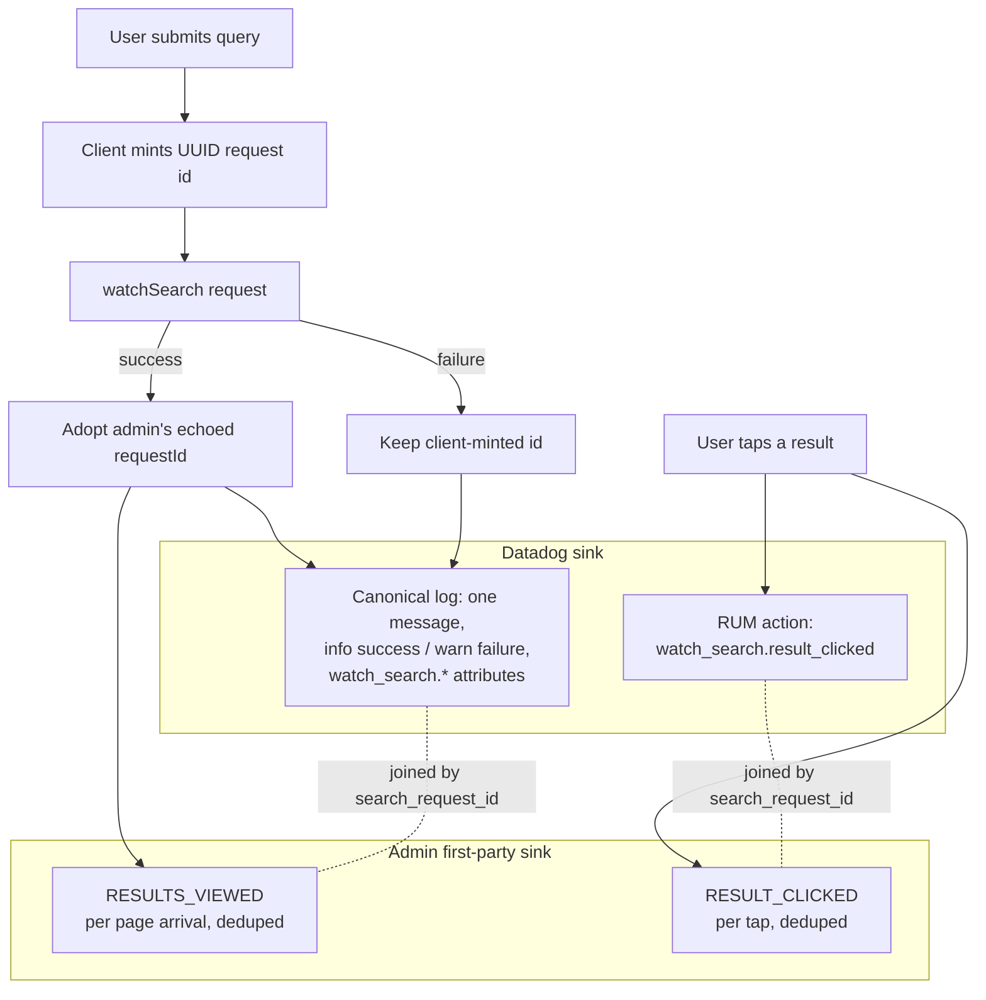

# Mobile Search Observability Parity - Plan

## Goal Capsule

- **Objective:** Bring `apps/mobile`'s Watch-search telemetry to parity with web's production methodology across both analytics sinks — the shared `watch_search.*` Datadog contract and admin's first-party search-event store — fix the live request-id corruption of admin's ops dashboard, make the operator runbook cover mobile, and add the first search-failure detection on any platform.
- **Product authority:** The Product Contract below is authoritative for scope and behavior (R1–R12). This plan absorbed the verified decisions of the exploratory branch `feat/mobile-search-analytics-parity` (deleted 2026-07-28); the plan is self-sufficient and needs nothing from that branch. Admin, web, and TV code changes are not in scope — findings on those surfaces are hand-offs.
- **Execution profile:** Code changes in `apps/mobile` plus operator docs. Test commands: `pnpm --filter @forge/mobile test`, `typecheck`, `lint`. Simulator verification against local admin is a required unit, not optional polish.
- **Stop conditions:** Stop and surface (don't improvise) if: admin's `recordWatchSearchEvent` shape rejects mobile's payload at implementation time (admin edits are out of scope); the correlation-chain check finds canonical logs carry no RUM `session_id` (a documented decision fork, not a silent attribute-widening); or evidence invalidates a session-settled decision.
- **Tail ownership:** Creating the failure monitor in the Datadog UI, calibrating its threshold against real traffic, and pointing its notification channel are post-merge operator steps owned by the plan's owner and written into the monitor spec (U10). Deadline: monitor live and firing-tested within 14 days of merge; the completion test is a synthetic burst of failed mobile searches paging the chosen channel. The third success criterion is gated on that checkpoint, not on merge.
- **Delivery sequencing:** The request-id fix is a shippable first increment — U1 alone stops the live dashboard corruption (R1), optionally with U2 and U6's echoed-id adoption (R2); it needs no docs, admin, or monitor work. The remaining units follow as a second increment.

---

## Product Contract

### Summary

Mobile's existing search telemetry is re-founded on web's production contract: globally unique request ids that join client records to admin's `SearchTrace`, one canonical per-search structured log speaking web's `watch_search.*` schema and vocabularies, result clicks as the shared RUM action plus first-party `RESULT_CLICKED`/`RESULTS_VIEWED` events to admin, an operator runbook that covers `forge-mobile`, and — deliberately beyond web parity — a Datadog monitor on mobile's otherwise-silent search failures.

### Problem Frame

Mobile's Watch search runs on the same admin `watchSearch` contract as web, but its telemetry does not, with three costs in descending severity.

First, mobile corrupts admin's ops data today. Its search request id is a per-process counter (`search-1`, `search-2`, …) that passes admin's id validator and is persisted to `SearchTrace.requestId`. The column is not unique-constrained, so every insert succeeds — the damage appears at the dashboard read layer, which groups traces and joins click events by request id: every install's first search fuses into one displayed "request", cross-contaminating both traces and event joins.

Second, mobile is invisible in both analytics sinks. Admin's first-party search-event store accepts `RESULT_CLICKED`/`RESULTS_VIEWED` from a public mutation and already carries `MOBILE` in its client enum, but mobile has never posted an event — mobile searches read as zero-click, dragging down measured search relevance. In Datadog, mobile logs flat bare keys (`term`, `outcome`, …) under its own message names with its own vocabularies, so every runbook query pinned to `watch_search.*` returns nothing for `service:forge-mobile`. Part of this is plan-versus-shipped drift: the merged mobile Datadog plan specified the shared `watch_search.result_clicked` RUM action and TV's event shape, but the shipped code diverged.

Third, nothing detects search failure anywhere. Mobile is the most exposed platform: its search failures arrive as 200-body GraphQL codes that RUM error tracking cannot see, so a full mobile search outage would today be visible only to users.

Web's analytics exist because of `docs/roadmap/content-discovery/feat-197-watch-search-query-outcome-logging.md` (complete, web-only). No ticket ever extended that methodology to mobile.

### Key Decisions

- **Copy web's production methodology wherever mobile's nature allows.** (session-settled: user-directed — chosen over a mobile-native telemetry design: web's setup is production-proven and cross-client joinability is the point; discrepancies forced by the platform are accepted explicitly.)
- **Client-emitted logs are mobile's canonical per-search record.** Web's canonical sink is a server-side log from its search server action; mobile has no server tier, so the faithful translation is client-emitted structured logs under the same contract. Server-only depth (lane internals, `result_source`) is the accepted discrepancy. (2026-08-04: web's own live search moved direct-to-client in #1808, bypassing the server action that emits its canonical log — web's emission is now dark and recorded as a hand-off below; mobile's client-emitted approach is unchanged and now matches the fleet-wide direction.)
- **Absorb the verified `feat/mobile-search-analytics-parity` design as the base.** (session-settled: user-directed — chosen over a delta-only plan or feedback-only handling after adversarial verification confirmed all ten of that design's load-bearing claims.) The branch was deleted on 2026-07-28; its decisions and task decomposition are fully absorbed into this plan. Two refinements from verification are folded in: the request-id collision damage lives at the dashboard read layer, not the DB write; and web's `latency_ms` carries client wall-clock on its failed path, so the "server-side on both clients" runbook wording needs a carve-out.
- **Alignment means vocabularies and mechanisms, not just key renames.** Outcomes become `completed | no_result | failed`, request types `search | load_more`, positions 1-based, and the click signal moves from a log entry to the shared RUM action — without these, renamed keys still land in mobile-only facet buckets.
- **Failure detection deliberately exceeds web parity.** (session-settled: user-approved — proposed with the trade-off stated that even web has no search-quality monitor; this is net-new methodology, not parity.) Scope is one monitor on mobile's failure outcome, not a dashboard suite.
- **Failures log at `warn`, not web's `error`.** Mobile's failure set includes benign rate-limit rejections; no runbook recipe filters on level, and `outcome` is the discriminator that matters.
- **Two latency fields.** `watch_search.latency_ms` carries admin's server-side measure (absent on failure); `watch_search.client_latency_ms` carries the round trip (always present). This is cleaner than web's own behavior, which substitutes client wall-clock into `latency_ms` on failures — the runbook documents that asymmetry rather than mobile copying it.
- **Impressions are page-arrival, matching web's denominator.** A viewport-true signal would be differently correct, and mixed denominators across clients make mobile's CTR incomparable — the exact failure this work exists to prevent. A truer signal may later be added alongside, never as a replacement.
- **Admin events go anonymous by construction.** The fleet bearer rides only on `WatchSearch`; event mutations carry no bearer and accept anonymous-bucket rate shedding (events fail silently, never affecting search or navigation).
- **The house log-naming style breaks only for cross-client search events.** Mobile's `domain.event_name` + bare-keys convention stays for mobile-only telemetry; search answers to an external contract shared with web and TV. The exception is stated where a maintainer will meet it and pinned by guard tests.

### Requirements

**Correlation integrity**

- R1. Every mobile search mints a globally unique request id accepted by admin's validator; the colliding per-process counter is retired.
- R2. All downstream telemetry for a search — log, RUM action, admin events — references admin's echoed request id when present, falling back to the client-minted id, so client records join the server trace; load-more pages reuse the initiating search's id.

**Canonical Datadog log**

- R3. One per-search structured log covers success and failure under the shared message and `watch_search.*` attribute contract, with web's outcome and request-type vocabularies; the separate failure message is retired.
- R4. The attribute set carries the always-present `event_name` facet (the join key the runbook query and monitor filter on) and the client-knowable slice of web's schema — counts, offset, degraded flag, response search mode, language slug, failure taxonomy — built through a whole-event allowlist, with the raw query under `watch_search.query` as the sole raw-text field (the signed-off R43 posture).
- R5. Server latency and client round-trip are separate attributes: `latency_ms` (absent on failure) and `client_latency_ms` (always present).

**Clicks and impressions**

- R6. Result taps emit the shared `watch_search.result_clicked` RUM action with a 1-based position and the search request id, and never carry query text.
- R7. Mobile posts first-party `RESULT_CLICKED` and `RESULTS_VIEWED` events to admin's search-event store as client `MOBILE` — anonymous, fire-and-forget, deduped per request, and capped at admin's visible-ids limit.
- R8. Impression events fire on page arrival with the ids that page added, matching web's denominator.

**Operator surface**

- R9. The watch-search analytics runbook covers `forge-mobile`: a broadened canonical query, the mobile-only attributes, the level difference, the click recipe with the first-party-events preference for counts, and the web failed-path `latency_ms` carve-out.
- R10. Forward-looking prose naming the retired mobile event names is corrected in the same change — including the fleet-ceiling calibration recipe, which also mislabels these client Logs as RUM.

**Detection**

- R11. A Datadog monitor fires on an elevated mobile search-failure rate (the `failed` outcome), with a documented threshold rationale — explicitly labeled as exceeding web parity.

**Regression pinning**

- R12. Guard tests pin the retirement (the old messages and bare keys cannot creep back) and the no-bearer property of the event mutation.

### Key Flows

- F1. Search succeeds
  - **Trigger:** User submits a query on the Watch tab.
  - **Steps:** Client mints a unique id → admin responds with results and its echoed request id → the echoed id becomes the search's id → one canonical log emits with the full attribute bag → an impressions event posts the page's ids to admin.
  - **Covers:** R1, R2, R3, R4, R5, R7, R8.
- F2. Search fails
  - **Trigger:** Admin rejects or errors (including rate-limit codes in a 200 body).
  - **Steps:** The same canonical log emits at `warn` with `outcome: failed`, the failure taxonomy, and client round-trip latency; no impressions event; the monitor's input rate increments.
  - **Covers:** R3, R4, R5, R11.
- F3. Result tapped
  - **Trigger:** User taps a search result.
  - **Steps:** RUM action emits with 1-based position and the search's id → a `RESULT_CLICKED` event posts to admin, deduped → navigation proceeds regardless of either outcome.
  - **Covers:** R2, R6, R7.

The canonical-log contract is one log per **settled** request: a search superseded by faster retyping (the screen's generation guard) emits nothing, matching today's behavior and web's — no new outcome value the other clients don't share.

### Acceptance Examples

- AE1. **Covers R1, R2.** Given two fresh installs, when each performs its first search, then admin's dashboard shows two distinct request rows — not one fused row.
- AE2. **Covers R3, R5.** Given a search that fails with a rate-limit code, then exactly one log emits under the shared message with `outcome: failed`, an error code, `client_latency_ms` present, and no `latency_ms`.
- AE3. **Covers R6, R7.** Given a tap on the first result, then the RUM action reports position 1 and a `RESULT_CLICKED` row lands with `client = mobile`, position 1, and the same request id as the search's trace row.
- AE4. **Covers R7, R8.** Given a load-more page, then the impressions event carries only that page's newly added ids, and repeated renders of the same page post nothing further.
- AE5. **Covers R9.** Given an operator running the runbook's canonical query, then mobile rows appear alongside web's without any undocumented filter.
- AE6. **Covers R11.** Given a sustained spike in failed mobile searches, then the monitor fires without anyone watching a dashboard.

### Success Criteria

- One documented query answers cross-client search questions, mobile included.
- Admin's ops dashboard shows mobile searches as distinct requests with non-zero click joins.
- A silent mobile search outage surfaces through the monitor rather than user reports (gated on the post-merge calibration checkpoint — see Goal Capsule tail ownership).

### Scope Boundaries

- No admin changes. Caller-platform identity in admin's search traces is recorded as a hand-off note for admin's owners; the dormant `shouldShedFleetRequest` (unwired on `main`, wired in the in-flight feat-240 branch) is that arc's concern.
- No web changes. Web's failed-path `latency_ms` substitution is documented in the runbook here; a separate client-latency field on web is a hand-off note for web's owners, not this scope.
- No TV changes. TV already speaks the shared Datadog contract but posts no first-party admin events and lacks the `event_name` attribute — both noted as a future TV follow-up, not fixed here.
- No search-functionality changes, no search-language picker, and no query-text kill switch — a baked `EXPO_PUBLIC_*` flag needs a store release; `exact_query_included` is emitted as constant `true` so the facet exists if a switch ever lands.
- No viewport-true impressions and no dashboard suite beyond the single failure monitor.
- No telemetry for superseded (typed-over) searches — see Key Flows.

### Dependencies / Assumptions

- Every admin surface consumed already exists and is public — verified 2026-07-28: `recordWatchSearchEvent` (`apps/admin/src/graphql/mutations/watch-search-events.ts`, `authScopes: { public: true }`, enum `WEB | MOBILE | TV`), the response scalars (`requestId`, `degraded`, `searchMode`, `latencyMs` on `WatchSearchResponse`), the id validator, `MAX_VISIBLE_RESULT_IDS = 50`, 30-day event retention (`expiresAt`), and the anonymous mutation rate limit (30/min per IP; shedding accepted). Mobile will be this mutation's first client-side caller (web still posts events from server actions; web's search call itself moved client-side in #1808) — acceptable because the resolver is public and IP rate-limited.
- Assumption to verify during implementation (U8): canonical logs carry RUM session context (`session_id`) on the current mobile SDK, which is what makes a search reconstructible end to end from Datadog alone. If it does not hold, stop and surface the decision — attach the session id explicitly or document the limitation — rather than silently widening the attribute bag.
- The exploratory branch this plan absorbed is deleted; nothing below depends on it.

### Outstanding Questions

- **Deferred to implementation-tail:** the monitor's numeric threshold, evaluation window, and notification channel — calibrated against real traffic after the log alignment ships (U10 documents the calibration procedure; the fleet-ceiling monitors doc is the pattern).

<!-- ce-section: work-relationships -->

### How This Work Fits Together

This plan owns mobile search observability parity plus its failure monitor. The surrounding picture is current understanding, not a committed roadmap:

- Extends: `docs/roadmap/content-discovery/feat-197-watch-search-query-outcome-logging.md` — web's completed analytics ticket, whose methodology this ports. Tracked as `docs/roadmap/content-discovery/feat-335-mobile-search-observability-parity.md` (renumbered twice after concurrent tickets on `main` claimed each id: feat-322 → feat-334 on 2026-08-04, feat-334 → feat-335 on 2026-08-05).
- Enables: accurate fleet-ceiling calibration (the corrected per-platform search-rate recipe) and any future cross-client search dashboard.
- Can proceed independently of: the feat-240/241 fleet abuse-ceiling arc and the `SEARCH_AUTH_REQUIRED` rollout.
- Hand-offs (owned by other surfaces' owners, recorded here so they aren't lost): admin-side caller-platform identity in search traces; a TV touch-up (shared-contract `event_name` attribute + first-party admin events, which TV also lacks); web adopting a separate client-latency field on its failed path; and — found 2026-08-04 — web's canonical search-analytics emission itself: #1808 moved web's live search direct-to-client, leaving `runSearch` (the emitting server action) with no callers, so web's canonical log is currently dark and its owners must re-wire it (possibly mirroring this plan's client-emitted approach).

### Sources / Research

- The absorbed design and 10-task plan originated on branch `feat/mobile-search-analytics-parity` (deleted 2026-07-28). All ten of its load-bearing claims were verified against `main` on 2026-07-28; its decisions, task decomposition, and hazard notes are carried in the Planning Contract and Implementation Units below.
- Verified code anchors (confirmed 2026-07-28; mobile anchors re-confirmed on `main` 2026-08-04): `apps/mobile/src/lib/watchSearchLog.ts:9-15` (counter id), `apps/mobile/app/(tabs)/watch.tsx:100,145,351,385,485,497` (emit sites and refs), `apps/mobile/src/lib/queries.ts:44-65,107` (`WATCH_SEARCH`, `SearchResponse`), `apps/mobile/src/components/search/SearchResultCard.tsx:77` (`dd-action-name`), `apps/mobile/src/lib/datadog.ts:211,216-223` (`reportDatadogAction`, `datadogLog`, both never-throw), `apps/admin/src/app/dashboard/ops-data.ts` (`tracesByRequestId` request-id grouping and event joins, ~2855 after #1815's pagination rework), `apps/web/src/lib/watch-search-analytics.ts` + `apps/web/src/lib/search-actions.ts` (target contract incl. failed-path latency substitution; see the #1808 hand-off note above), `apps/tv/src/lib/watchSearchLog.ts` (UUID precedent), `apps/mobile/src/lib/viewer-id.ts` (in-repo UUID-fallback pattern).
- Operator docs this work changes: `docs/operations/watch-search-analytics-datadog.md`, `docs/observability/datadog.md`, `docs/observability/fleet-ceiling-datadog-monitors.md` (also the monitor-spec template).
- Governing patterns: `docs/solutions/architecture-patterns/canonical-server-search-analytics-supplemental-rum-pattern.md` (no query text in RUM), `docs/solutions/best-practices/mobile-datadog-rich-posture-data-governance-20260714.md` (raw-term posture, R43), `docs/solutions/best-practices/admin-watch-search-production-rollout-20260720.md` (incremental viewed-results, click-against-visible-request, retention purge), `docs/solutions/best-practices/datadog-rum-deep-instrumentation-semantics.md` (action-name privacy), `docs/solutions/workflow-issues/mechanism-retirement-docs-prose-sweep.md`.

---

## Planning Contract

Product Contract preservation: R1–R12 unchanged from the requirements-only revision. Edits confined to provenance wording (the absorbed branch was deleted 2026-07-28), the superseded-search contract made explicit in Key Flows/Scope Boundaries (confirmed at the scoping synthesis), and web-item ownership rewording (hand-off, not follow-up).

### Key Technical Decisions

- KTD1. **Prefer admin's echoed `requestId` for every post-response signal.** Admin's two validators fail differently on a malformed id: the search path silently substitutes a fresh UUID (and echoes the substitute), while the event path throws. A client that keeps using its own id after a substitution writes events under an id that joins to nothing. Adopting `response.requestId ?? clientId` — set before any log, action, or event fires — is the join-integrity mechanism, not hygiene. On failure there is no echo; the client-minted id is correct and unavoidable.
- KTD2. **Mint client ids with the in-repo UUID pattern.** `crypto.randomUUID()` with an RFC4122-v4 `Math.random` fallback (Hermes lacks `randomUUID`), mirroring `apps/mobile/src/lib/viewer-id.ts` — no new dependency, 36 chars inside admin's `{8,80}` bound.
- KTD3. **Mirror web verbatim wherever the shared contract leaves a choice open.** (session-settled: user-approved — confirmed at the scoping synthesis over "improving" on web's choices.) Concretely: two separate dedup refs (a `Set` keyed `requestId:resultId:position` for clicks — position in the key so a re-listed item re-fires; a `Map<requestId, Set<resultId>>` for views), no `LOAD_MORE` admin events (the enum value exists; web doesn't emit it), incremental `RESULTS_VIEWED` per page arrival.
- KTD4. **Superseded searches emit nothing.** (session-settled: user-approved — confirmed at the scoping synthesis over adding an `outcome: superseded` value.) The screen's generation guard already drops state updates and logs for typed-over requests; the contract is one canonical log per settled request, and inventing an outcome value web/TV don't share would re-break facet joinability.
- KTD5. **Pure builders in `src/lib`, emits in the screen.** All new logic (attribute builder, RUM context builder, event payload builders/senders) lives in React-free modules unit-testable without Apollo or the native SDK; `app/(tabs)/watch.tsx` only wires them. Mirrors how TV splits the same concern and why mobile's existing tests need no native mocks.
- KTD6. **Anonymous events accept the per-IP bucket.** Admin caps anonymous mutations at 30/min per IP (`public:<ip>`); behind carrier NAT that sheds events at roughly 8–15 concurrent active users. Accepted at current fleet size — shed events fail without a RUM error and without touching search or navigation: the shared Apollo error link reports failed operations to Datadog, so U5 exempts the event operation from that reporting (shedding is the designed outcome, not a fault) and U7 pins the exemption. Mitigations (batching, revisiting the bearer rule) are named but deferred; the fleet bearer must never widen to these operations (`apps/mobile/CLAUDE.md` rule, pinned by U7).
- KTD7. **RUM-vs-admin click asymmetry is accepted and documented.** The RUM SDK batches locally (essentially always lands); the admin mutation can fail silently on network error with no retry. CTR from RUM runs slightly ahead of CTR from admin's table for the network-failure population — already true on web today; the runbook states it so it isn't mistaken for a mobile bug.
- KTD8. **The monitor ships as a spec document, created manually in Datadog.** The repo owns no monitor-as-code; `docs/observability/fleet-ceiling-datadog-monitors.md` is the established shape (per-monitor query/threshold/message/priority blocks, `@REPLACE_WITH_ALERT_CHANNEL` placeholder, calibrate-then-alert sequence). The failure monitor follows it: ship the aligned logs first, read a representative week's failure rate, then set the threshold and channel (tail ownership in the Goal Capsule).

### High-Level Technical Design

One search produces up to four signals across two sinks, all joined by `search_request_id`:

Prose is authoritative; the diagram orients. Admin-side, `SearchTrace` (from the search) and `WatchSearchEvent` rows (from the events) share the echoed request id — that join is what AE1/AE3 verify on a real database.

### Sequencing

U1 and U2 (independent, either order) → U3 (after U1, same module) → U4 and U5 (independent pure modules, either order) → U6 (wiring consumes all prior) → U7 (guards pin the result) → U8 (simulator proof) → U9 (docs describe verified behavior) → U10 (monitor spec). U9 runs after U8 on purpose: the runbook documents behavior U8 confirmed, not behavior the plan intends.

---

## Implementation Units

| U-ID | Title                                 | Key files                                                  | Depends on |
| ---- | ------------------------------------- | ---------------------------------------------------------- | ---------- |
| U1   | Unique request ids                    | `src/lib/watchSearchLog.ts`                                | —          |
| U2   | Select the response scalars           | `src/lib/queries.ts`, `src/lib/watchSearch.ts`             | —          |
| U3   | Shared vocabulary + attribute builder | `src/lib/watchSearchLog.ts`                                | U1         |
| U4   | RUM click-context builder             | `src/lib/watchSearchRum.ts` (new)                          | —          |
| U5   | Admin search-events module            | `src/lib/watchSearchEvents.ts` (new), `src/lib/queries.ts` | U2         |
| U6   | Wire the search screen                | `app/(tabs)/watch.tsx`                                     | U1–U5      |
| U7   | Guard the retirement                  | `src/lib/__tests__/`                                       | U6         |
| U8   | Simulator verification                | none (verification)                                        | U6, U7     |
| U9   | Operator docs + prose sweep           | `docs/operations/`, `docs/observability/`                  | U8         |
| U10  | Failure-monitor spec                  | `docs/observability/` (new file)                           | U9         |

All mobile paths below are relative to `apps/mobile/`.

### U1. Unique request ids

- **Goal:** Retire the per-process counter; every search mints an RFC4122 v4 UUID.
- **Requirements:** R1 (advances R2).
- **Files:** `src/lib/watchSearchLog.ts`, `src/lib/watchSearchLog.test.ts`.
- **Approach:** Replace `generateSearchRequestId()` (module-scope counter, lines 9–15) per KTD2. Delete the counter and its "monotonic per-process" comment.
- **Patterns to follow:** `src/lib/viewer-id.ts` (existing `crypto.randomUUID` + v4-fallback shape); `apps/tv/src/lib/watchSearchLog.ts` (sibling precedent).
- **Execution note:** Test-first — replace the existing `/^search-\d+$/` assertions; the old test must fail before the implementation lands.
- **Test scenarios:**
  - Two consecutive calls return distinct strings, both matching the v4 UUID shape.
  - The id satisfies admin's `/^[A-Za-z0-9_-]{8,80}$/` pattern.
  - With `crypto.randomUUID` absent (Hermes case): still returns a v4-shaped id (stub `globalThis.crypto` in the test, restore in `finally`).
- **Verification:** `pnpm --filter @forge/mobile test -- watchSearchLog` green.

### U2. Select the response scalars

- **Goal:** The search response carries what the telemetry needs: `requestId`, `latencyMs`, `degraded`, `searchMode`.
- **Requirements:** R2, R4, R5.
- **Files:** `src/lib/queries.ts` (`WATCH_SEARCH` selection + `SearchResponse` type), `src/lib/watchSearch.ts` (`mapWatchSearchResponse` passthrough), `src/lib/__tests__/watchSearch.test.ts`.
- **Approach:** All four are existing scalars on admin's `WatchSearchResponse` — a selection-set and mapping change only, no schema work. Nullable end to end; absence must not throw.
- **Test scenarios:**
  - Mapping carries all four fields through when present.
  - Mapping tolerates each field absent/null (older responses) without altering existing result mapping.
- **Verification:** `pnpm --filter @forge/mobile test -- watchSearch && pnpm --filter @forge/mobile typecheck` green.

### U3. Shared vocabulary + attribute builder

- **Goal:** One pure builder produces the full `watch_search.*` attribute bag for both success and failure, under web's vocabularies and the single shared message.
- **Requirements:** R3, R4, R5.
- **Files:** `src/lib/watchSearchLog.ts`, `src/lib/watchSearchLog.test.ts`; minimal call-site touch in `app/(tabs)/watch.tsx` only to keep typecheck green (U6 rewrites those blocks).
- **Approach:** `resolveWatchSearchOutcome` returns `completed | no_result | failed` (drop the `term` parameter — it never affected the outcome); error branch wins even when results are present and carries `parseSearchErrorCode`'s code. Add `WATCH_SEARCH_LOG_MESSAGE = "watch_search analytics"` and `buildWatchSearchLogAttributes(input)` producing exactly the allowlisted key set — every key `watch_search.`-prefixed; `latency_ms` omitted when null/absent; `added_result_count` present only on `load_more`; `exact_query_included` constant `true`; `event_name` (constant `"watch_search"`) present on both success and failure bags — it is the facet the canonical query and the monitor filter on; `failure_category`/`error_code` failures only. Anti-leak controls mirror U4: every attribute assigned by name — the response and the error object are never spread into the bag — and tests pin the exact key set of both bags, failure included (the failure path is where diagnostic detail creeps in). A comment at the builder states the deliberate house-style break (Key Decisions) so a reviewer doesn't normalize it back.
- **Execution note:** Test-first per builder case; this unit owns the contract the guard (U7) and runbook (U9) depend on.
- **Test scenarios:**
  - Covers AE2 (builder half). Failure input: the exact failure key set is pinned (not a subset) — keeps `client_latency_ms`, `error_code`, and `event_name`, drops `latency_ms`, `outcome: failed`.
  - Full success bag equals the exact expected key/value set (message constant asserted too).
  - Every emitted key starts with `watch_search.`.
  - `added_result_count` absent on `search`, present on `load_more` with `visible_result_count` = prior + appended.
  - Outcome mapping: non-empty → `completed`; empty/null → `no_result`; error (even with results present) → `failed` + parsed code.
- **Verification:** module tests + `typecheck` green.

### U4. RUM click-context builder

- **Goal:** A pure, PII-free context builder for the shared `watch_search.result_clicked` action.
- **Requirements:** R6.
- **Files:** `src/lib/watchSearchRum.ts` (new), `src/lib/watchSearchRum.test.ts` (new).
- **Approach:** Port `apps/tv/src/lib/watchSearchRum.ts`, widened for mobile's `EXPERIENCE` result type. Every key assigned by name — never a `{...result}` spread — so a future `SearchResult` field can't leak. Keys: `result_position` (1-based, floored to ≥1), `result_id`, `result_slug`, `result_title` (capped 160, newlines flattened), `result_type`, `search_request_id`, `search_language_slug`. `route_language_slug` deliberately absent (`buildWatchSearchInput` never sends it — reporting one would fabricate a request field). No query text, per the canonical-log/supplemental-RUM pattern doc.
- **Test scenarios:**
  - Covers AE3 (context half): 1-based position; zero/negative/fractional positions floor to 1.
  - `EXPERIENCE` result type carried as-is.
  - Title cap at 160 with flattened newlines and ellipsis.
  - No `watch_search.query`/snippet key; exact key count pinned (anti-leak).
- **Verification:** module tests green.

### U5. Admin search-events module

- **Goal:** Fire-and-forget senders posting `RESULT_CLICKED`/`RESULTS_VIEWED` to admin's existing public mutation as client `MOBILE`.
- **Requirements:** R7, R8.
- **Files:** `src/lib/queries.ts` (add `RECORD_WATCH_SEARCH_EVENT`), `src/lib/watchSearchEvents.ts` (new), `src/lib/watchSearchEvents.test.ts` (new), `src/lib/apolloClient.ts` (error-link exemption).
- **Approach:** Mirror web's operation shape (`apps/web/src/lib/search-actions.ts`) verbatim — same variables, `client: "MOBILE"`, `resultType` mapping `VIDEO | EXPERIENCE` (unknown → `VIDEO`) — with one platform-forced divergence: omit `occurredAt` entirely, letting admin stamp its own clock. Admin rejects timestamps more than 24h past or 5min future, and a device on a skewed clock (cold-booted emulator, manual time) would otherwise lose every event silently; web can send its clock because its server action runs on a server clock. Builders return `null` for unsendable payloads: a request id failing admin's `/^[A-Za-z0-9_-]{8,80}$/` (admin throws), and `RESULTS_VIEWED` with zero ids (admin would accept the empty row, but it inflates the CTR denominator — web guards client-side for the same reason). Cap `visibleResultIds` at 50 (admin's `MAX_VISIBLE_RESULT_IDS`). Senders use `getApolloClient().mutate` (lazy getter, safe outside React) with `fetchPolicy: "no-cache"` — matching how `WATCH_SEARCH` is issued — so event results don't accumulate in the long-lived `InMemoryCache`; they swallow every error and never surface to UI. Exempt this operation from the shared Apollo error link's Datadog error reporting (early-return on the operation name, commented as designed shedding — otherwise every shed event files a RUM error, KTD6). No bearer by construction — `authHeadersForOperation` returns `{}` for any operation not named `WatchSearch` (KTD6).
- **Patterns to follow:** web's `recordWatchSearchResultClick`/`recordWatchSearchResultsViewed`; jest-mock `./apolloClient` in tests to short-circuit the transitive native-SDK import chain (`offlineFileSystem.test.ts` shows the datadog-mock variant).
- **Test scenarios:**
  - Covers AE3 (payload half) and AE4 (builder half): full `RESULTS_VIEWED` and `RESULT_CLICKED` variable shapes; 80 ids cap to 50.
  - Builders return `null` on a malformed request id and on empty viewed-ids.
  - Result-type mapping incl. unknown → `VIDEO`.
  - Send path: mutation rejection swallowed; **synchronous** throw from the client getter swallowed (both — the fire-and-forget slot-leak law's sync-throw case).
  - Built variables carry no `occurredAt`.
- **Verification:** module tests + `typecheck` green.

### U6. Wire the search screen

- **Goal:** The four emit sites speak the new contract; clicks become RUM actions plus admin events; impressions fire per page arrival.
- **Requirements:** R2, R3, R5, R6, R7, R8. Implements KTD1, KTD3, KTD4.
- **Files:** `app/(tabs)/watch.tsx`.
- **Approach:** On search success, adopt `page.requestId ?? clientId` into `searchRequestIdRef` **before** any log/event fires (KTD1). Replace the four log call sites (search success/failure at ~351/385, load-more success/failure at ~485/497) with `datadogLog.info|warn(WATCH_SEARCH_LOG_MESSAGE, buildWatchSearchLogAttributes(...))` — `client_latency_ms` from the existing `startedAt` in **both catches** (net-new: failure paths log no timing today), `offset` on both load-more branches from `nextOffset`. Two dedup refs per KTD3; a `reportViewed` helper placed **below the ref block, above the `search` callback** — it reads the viewed-dedup ref and `searchRequestIdRef`, so it sits after those declarations (the repo's ESLint config does not enable `no-use-before-define`; misplacement would surface as a runtime hazard, not a lint error). Clear the viewed-map at the top of every new `search()` (bounds growth; each search mints a fresh id so nothing re-reports). In `handleSelectResult`: 1-based position (`indexOf + 1`), `reportDatadogAction(WATCH_SEARCH_RESULT_CLICKED_ACTION, buildWatchSearchResultClickContext(...))`, then `recordResultClicked` with the visible ids. The superseded-request generation guard is untouched (KTD4). The existing `dd-action-name: "search-result"` on `SearchResultCard` stays — it's the matched-set auto action; verify the typed prop still reaches the native Pressable (action-name privacy doc).
- **Execution note:** This unit is behavior-heavy but its logic lives in U1–U5's tested modules; keep the diff here to wiring.
- **Test scenarios:** Screen-level behavior is proven by U8 (simulator) plus the module tests above. `Test expectation: none beyond existing screen tests` — the screen has no jest harness today, and the pure modules carry the contract; U7/U8 pin the rest.
- **Verification:** `pnpm --filter @forge/mobile test && typecheck && lint` all green.

### U7. Guard the retirement

- **Goal:** A future edit cannot silently restore the old log shape or leak the fleet bearer onto the event mutation.
- **Requirements:** R12.
- **Files:** `src/lib/__tests__/watchSearchTelemetry.guard.test.js` (new), `src/lib/__tests__/authHeaders.test.ts` (append).
- **Approach:** Source-scan guard in plain JS (the RN tsconfig has no Node types; mirrors `watchSearchInput.guard.test.js`): walk `src/` + `app/`, fail on any non-comment line matching the retired emits (`"watch_search_failed"`, `"search.result_clicked"` word-boundary-anchored — `\bsearch\.` — so the new `watch_search.result_clicked` action name never matches, `datadogLog.info|warn("watch_search"`). Include an anti-vacuous floor (`files.length > 50`) and a positive-control case feeding synthetic violations. Bearer pins go in the existing TypeScript `authHeaders.test.ts` (it owns that invariant; a `.js` test requiring a `.ts` module is unproven in this package): `authHeadersForOperation("RecordWatchSearchEvent", …)` returns `{}`, and the mutation document's operation name is pinned to `RecordWatchSearchEvent` ≠ `SEARCH_OPERATION_NAME` — the gate matches on name, so a rename to `WatchSearch` would silently start spending the fleet key per tap. The same suite pins the RUM-error exemption's operation-name constant to the mutation document's name, so a rename can't silently re-enable error reporting on shed events (U5/KTD6).
- **Execution note:** Falsify the source-scan guard once — temporarily add a retired emit, confirm the guard fails naming the file, revert. A guard that has never failed is not known to work.
- **Test scenarios:**
  - Real-tree scan returns zero retired emits; scan floor proves the walk found real files.
  - Positive control: synthetic fixtures for each retired shape are flagged. Negative control: fixtures containing `watch_search.result_clicked` and the new shared-message emit are NOT flagged.
  - No-bearer property + operation-name pin (each fixture satisfies only its own branch — no string-shaped fixture that passes both).
- **Verification:** `pnpm --filter @forge/mobile test -- "watchSearchTelemetry|authHeaders"` green; falsification step observed failing then reverted.

### U8. Simulator verification

- **Goal:** Prove on-device what unit tests cannot: the mutation reaches admin, admin accepts the enums, attributes survive the native SDK, and the correlation chain holds.
- **Requirements:** AE1, AE2, AE3, AE4 end-to-end; the Dependencies/Assumptions session-context check.
- **Files:** none — verification only.
- **Approach:** Run against **local** admin so dev taps never write into prod's event store; use `localhost`, not `127.0.0.1` (the Android rewrite handles only `localhost`). Seed env (`bash scripts/setup-sim-env.sh mobile`), verify `.env.local` carries both `EXPO_PUBLIC_DATADOG_CLIENT_TOKEN` and `EXPO_PUBLIC_DATADOG_APPLICATION_ID` (the RUM config returns null without both and the Datadog checks silently no-op; the setup script asserts only the search token), start admin, start Metro detached (`nohup … &`; EXPO*PUBLIC*\* inline at bundler start). Search, tap a result, then check: (1) `watch_search_event` rows with `client = mobile`, UUID `request_id`, `position = 1`; (2) a `search_trace` row sharing that id (Covers AE1, AE3); (3) Datadog Logs: `service:forge-mobile env:development @watch_search.event_name:watch_search` shows the shared message with both latency fields (Covers AE2 shape); (4) the RUM action carries the same `search_request_id` and no query text. Then walk the correlation chain: log → RUM `session_id`/`view.id` → the session's `WatchSearch` resource → the click action. **If the log carries no `session_id`, stop and report** (Goal Capsule stop condition) — that decision gets made explicitly, not papered over. The resource → admin APM-span hop is deliberately not re-verified (local admin runs no Agent; that propagation shipped with the mobile Datadog plan) — note it in the PR.
- **Test scenarios:** the four numbered checks above, with `psql` outputs and a simulator screenshot captured as PR evidence.
- **Verification:** all four checks pass; evidence in the PR description; per repo law, the change is verified in the simulator before being reported done.

### U9. Operator docs + prose sweep

- **Goal:** An operator running the runbook sees mobile; no forward-looking prose names the retired shapes.
- **Requirements:** R9, R10.
- **Files:** `docs/operations/watch-search-analytics-datadog.md`, `docs/observability/datadog.md`, `docs/observability/fleet-ceiling-datadog-monitors.md`, `docs/solutions/best-practices/mobile-datadog-rich-posture-data-governance-20260714.md` (live R43 control — see Approach).
- **Approach:** Broaden the canonical query to `service:(forge-web OR forge-mobile)` with per-client notes (mobile is SDK-sampled, unlike web's server logs; TV emits a subset without the `event_name` attribute — add explicitly when comparing three). Document `client_latency_ms` (mobile-only) and the carve-out: `latency_ms` is server-side on both clients **except web's failed rows, which substitute client wall-clock**. Note the level difference (filter on `outcome:failed`, not status) and the first-party-events preference for click counts (unsampled) vs RUM (session/replay correlation) — plus the accepted RUM-ahead-of-admin asymmetry (KTD7) and an integrity caveat: the first-party rows come from an unauthenticated public mutation (client-declared `client` field, per-IP cap only), so an implausible CTR movement gets cross-checked against `SearchTrace` volume for the same request ids before being read as product signal. Then the prose sweep per the repo's retirement law: `git grep -nE '"watch_search"|watch_search_failed|\bsearch\.result_clicked' -- '*.md'` — the click pattern is word-boundary-anchored because `search.result_clicked` is a substring of the NEW shared action name (`watch_search.result_clicked`; the preceding `_` is a word character, so `\b` excludes it) — classify hits by content — historical records stay verbatim; the known forward-looking docs get corrected (`docs/observability/datadog.md` matched-surface sentence → the shared message name; the fleet-ceiling §5 calibration recipe → client **Logs** not RUM, message as the cross-client denominator, counts are a floor under SDK sampling). The R43 data-governance doc is the third correction and a LIVE control, not a historical record: its logged-data bullet and retention-table row name the retired messages and the `term` field — update them to the new message and `watch_search.query`, additively with a dated note, leaving the signed-off assessment and retention values untouched (a stale row would make a future data-deletion request keyed on `term` miss every log row). Re-run the grep for new hits. Check at this point whether web's canonical log is emitting again (dark since #1808 bypassed `runSearch`); if still dark, say so in the runbook rather than presenting the broadened query as covering both clients.
- **Execution note:** Prettier is two-pass non-idempotent on fenced markdown here — run `--write` twice then `--check` (CI runs `prettier --check .` over docs).
- **Test scenarios:** `Test expectation: none — documentation`; the verification is the grep sweep returning only classified-historical hits and prettier `--check` passing.
- **Verification:** Covers AE5 (the documented query works, per U8's evidence); sweep + prettier clean.

### U10. Failure-monitor spec

- **Goal:** The first search-quality monitor: elevated mobile search-failure rate pages an operator.
- **Requirements:** R11.
- **Files:** `docs/observability/watch-search-datadog-monitors.md` (new).
- **Approach:** Mirror the fleet-ceiling monitors doc structure (KTD8): background; precondition (aligned logs arriving under `service:forge-mobile` — U8's evidence); the log-event table; one monitor block with query on the failure facet (count of `@watch_search.outcome:failed` on `service:forge-mobile env:prod`, windowed rollup), `@REPLACE_WITH_ALERT_CHANNEL` placeholder, priority, renotify interval, and one deliberate departure from the template: `enable_logs_sample: false`, with the reason inline — the log carries `watch_search.query`, so an attached sample line would deliver raw user search terms into the alert channel, outside the R43-governed stores; the notification carries only the aggregate failure count. Then the calibration procedure — read a representative week's failure counts post-ship (rate-limit rejections are part of normal `failed` volume; the threshold must clear that baseline), then set the threshold and channel, firing-tested within 14 days of merge (Goal Capsule tail). State explicitly this exceeds web parity and that logs are SDK-sampled (threshold on a floor). The notification message's first triage step: the input is client-emitted under a bundle-extractable client token — confirm the failure volume against admin-side `SearchTrace` rows for the same window; no matching server-side movement means fabrication or misconfiguration, not an outage. Creation is manual in the Datadog UI — the repo owns no monitor-as-code (tail ownership per Goal Capsule).
- **Test scenarios:** `Test expectation: none — documentation/spec`; AE6 is satisfied at the operator tail when the monitor is created and calibrated.
- **Verification:** Spec doc exists, prettier-clean, names the calibration steps and placeholder channel; the roadmap ticket's operator tail references it.

---

## Verification Contract

| Gate                | Command / check                                                                            | Applies to     |
| ------------------- | ------------------------------------------------------------------------------------------ | -------------- |
| Unit tests          | `pnpm --filter @forge/mobile test`                                                         | U1–U7          |
| Typecheck           | `pnpm --filter @forge/mobile typecheck`                                                    | U2, U3, U5, U6 |
| Lint                | `pnpm --filter @forge/mobile lint`                                                         | U6             |
| Guard falsification | temporarily re-add a retired emit → guard fails → revert                                   | U7             |
| Simulator proof     | local-admin flow with `psql` + Datadog checks, evidence in PR                              | U8 (AE1–AE4)   |
| Docs format         | `npx prettier --write <docs> && npx prettier --write <docs> && npx prettier --check docs/` | U9, U10        |
| Prose sweep         | retirement grep over `*.md` returns only classified-historical hits                        | U9             |

The suite must be green as a whole (`pnpm --filter @forge/mobile test`), not only the named modules — U6 touches a screen other tests import.

## Definition of Done

- All units complete in dependency order; full mobile test suite, typecheck, and lint green.
- Simulator evidence captured (AE1–AE4): distinct dashboard rows per install, shared-message logs with both latency fields, RUM action + admin event rows joined by one request id.
- The runbook answers mobile search questions with a documented query (AE5); the prose sweep leaves no forward-looking reference to retired names.
- The monitor spec exists with query, calibration procedure, and placeholder channel; the post-merge operator tail (create in Datadog UI → calibrate a week → set threshold + channel, firing-test within 14 days of merge, AE6) is written in the spec and tracked on the feat-335 roadmap ticket.
- No dead or experimental code from abandoned approaches remains in the diff; the guard tests have each been observed failing once.
- Roadmap ticket `feat-335` reflects reality (in-progress until the operator tail completes).
