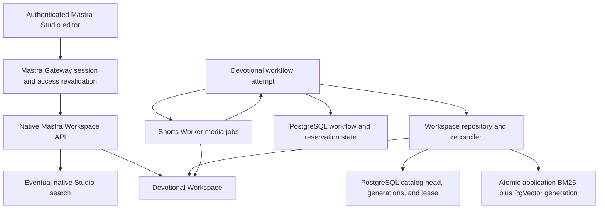
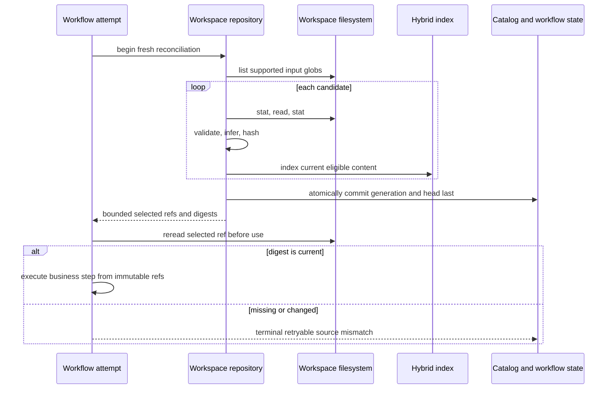
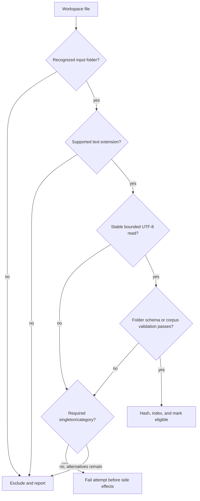
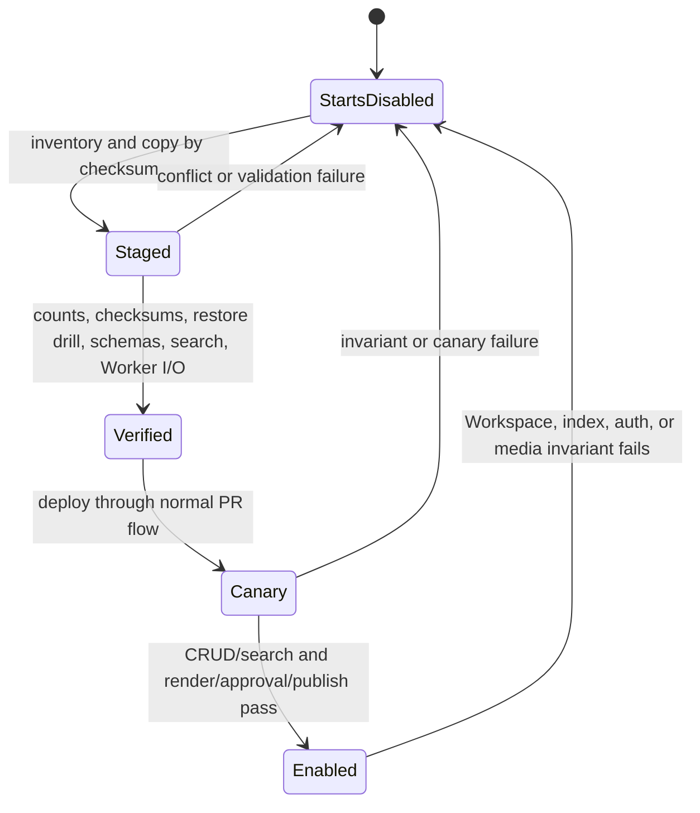

# feat: Add devotional Workspace data plane

## Summary

Register one writable Mastra Workspace backed by Railway object storage and make it the canonical file and search data plane for the video-first devotional workflow. Move human-authored inputs and generated artifacts out of workflow code and process-local storage while preserving PostgreSQL workflow state, fail-closed safety, authenticated Studio editing, and Shorts Worker media execution.

---

## Problem Frame

The current devotional pipeline mixes business logic with authored data: scripture mappings, reflection corpora, prompts, holidays, voice profiles, music prompts, render labels, and other editorial values are compiled into TypeScript or loaded from fixed local paths. Generated JSON/audio also uses local caches while video bytes use a separate Worker object namespace. Studio therefore has no Workspace to manage, a dropped source is not eligible without code or deployment changes, and retries can reuse stale local data.

The target is a single inspectable file hierarchy whose text inputs are searchable and whose media remains stream-safe. A workflow attempt must discover current files without embedding entire corpora in durable state. The implementation must also preserve the owner-approved exception: Mastra orchestrates, PostgreSQL persists lifecycle state, and Shorts Worker performs automated media-byte reads and writes.

---

## Requirements

### Workspace and editorial inputs

- R1. Mastra registers one writable Workspace named `Devotional Workspace`, backed by a Railway S3-compatible bucket in production and a local filesystem with the same directory contract in development and tests.
- R2. Existing authenticated Studio `admin` and `editor` users can browse, search, create, edit, upload, and delete all Workspace files through the existing Gateway without custom Workspace RBAC or approval steps; mutations are bounded, freshly authorized, and recorded in an append-only audit.
- R3. Human-authored scripture, reflection sources, video catalogs and passage mappings, prompts, safety rubrics, holidays, voice profiles and rotations, music metadata and prompts, narration connectors, render labels and settings, brand assets, and source-media references live under Workspace input/config paths rather than TypeScript values or fixed repository paths.
- R4. Markdown, plain text, JSON, YAML, and YML files dropped into recognized input folders become eligible on the next workflow attempt without a restart or manifest edit; PDF, DOCX, and newly dropped unreferenced audio/video remain ineligible and are reported.
- R5. Text files require no frontmatter or sidecar to become eligible; category comes from the canonical folder and title, attribution, language, themes, and scripture relationships are inferred from path/content where needed.

### Discovery, validation, and search

- R6. After start/retry idempotency deduplication, every newly created attempt performs a fresh bounded inventory, stable read, validation, digest, and index reconciliation before any model, narration, render, approval, or publish side effect; a replay returns the existing run/attempt without another reconciliation.
- R7. Devotional hybrid retrieval requires an application-owned BM25 engine, generation-scoped persistent vectors, and an embedder; native Studio Workspace search is a separate eventual discovery surface, and missing/degraded workflow hybrid capability fails closed.
- R8. Search results are accepted only when their normalized path and indexed digest match the current committed inventory, and stale vectors are reclaimed within bounded generations so repeated edits/deletes cannot make valid new sources unreachable.
- R9. A malformed optional source is excluded and reported when the category still has enough eligible alternatives; missing or invalid singleton configuration, missing required categories, unsafe paths, insufficient matching sources, or an inventory bound overflow fails the whole reconciliation before expensive work.
- R10. Corpus text is delimited and treated as source data, never as executable agent instructions; code retains schemas, hard safety floors/thresholds, bounds, allowed enums, deterministic algorithms, permissions, and final enforcement that editable rubric files cannot relax.

### Attempts, artifacts, and media ownership

- R11. An attempt reads the latest Workspace state at reconciliation time, carries only bounded path/digest references through durable workflow steps, and verifies the complete selected digest set before every irreversible side effect; a mismatch terminates the attempt as retryable and releases its reservation.
- R12. Every newly accepted explicit retry creates a fresh attempt with a fresh inventory while a durable `(parent, idempotency key)` record deduplicates identical request hashes and rejects key reuse with a different payload; replayed keys return the existing attempt without reconciling again.
- R13. Generated content, narration, render inputs, media sidecars, approval data, publication data, and an `inputs-used.json` provenance record are written under the attempt's Workspace run path; no source bodies or media bytes are stored in PostgreSQL workflow state.
- R14. Shorts Worker remains the only automated code path that streams MP3/MP4 bytes, uses create-only immutable attempt keys, validates its allowed Workspace media prefixes, and returns versioned opaque references with digest, size, and content type; Mastra writes searchable textual sidecars and never buffers rendered video.
- R15. Approval and playback bind to portrait/wide digests; overwrite or deletion after preview prevents publish, and post-publication mutation produces an integrity failure rather than silently serving bytes different from the approved artifact.
- R16. Used-clip reservations, retry identity, publication intent, and publication history move from local/derived state to constrained PostgreSQL tables so an upstream publish accepted before a process crash reconciles to exactly one clip-usage commit.

### Migration and operations

- R17. An idempotent manifest-driven migration uses an immutable run prefix, copies current authored inputs, clip-ledger state, and existing media with SHA-256 verification, reports conflicts without overwrite, and commits readiness in PostgreSQL only after validation and an independent backup/restore drill pass.
- R18. Cutover begins with new devotional starts disabled, drains or cancels active/suspended runs, keeps legacy refs available for status/playback only, verifies one Mastra replica and the Worker namespace, runs authenticated Workspace CRUD/search plus a real dual-aspect canary, and enables starts only after every gate passes.
- R19. The implementation keeps existing legal release gates; authenticated placement is the trusted editorial rights assertion for new files and records actor, timestamp, normalized path, and digest, while migration preserves any stronger existing scripture/reflection/voice/music/media clearance gates.
- R20. The implementation removes compiled or process-local devotional input fallbacks; unavailable Workspace content is an actionable failure, never a reason to use embedded defaults.

---

## Acceptance Examples

- AE1. Given an editor adds a valid reflection `.md` file, when the next run reconciles the reflection folder, then the file is eligible and searchable without a restart.
- AE2. Given an indexed source is edited or deleted, when the next hybrid query returns stale vector hits, then those hits are discarded by path/digest and cannot feed generation.
- AE3. Given one reflection JSON is malformed and other eligible reflections remain, when reconciliation runs, then the file appears in exclusions and generation may continue.
- AE4. Given the safety rubric is missing or invalid, when a run starts, then it fails before any LLM, TTS, Worker, approval, or publish call and does not use compiled safety text.
- AE5. Given a selected prompt changes between Source and Content, when Content attempts to read it, then the attempt ends as source-changed; a retry reconciles and uses the new digest.
- AE6. Given the same retry request is replayed with the same idempotency key, then it returns the same attempt; given a new retry key after an edit, then it creates a new attempt using the new Workspace generation.
- AE7. Given an editor overwrites a rendered MP4 after it is presented for approval, when approval resumes, then digest verification prevents publish and returns the run for rerender/review.
- AE8. Given an unauthenticated or revoked Studio user requests a Workspace mutation, then the Gateway redirects or rejects it; current `admin` and `editor` users receive identical default CRUD behavior.
- AE9. Given migration is rerun against identical objects, then it is a no-op; given a destination path has a different digest, then migration fails that path without overwriting it.
- AE10. Given hybrid search or object storage is unavailable, when a new run starts, then the run fails closed while existing status/playback surfaces remain available.

---

## Key Technical Decisions

| ID    | Decision                                                                                                                                                                                               | Rationale                                                                                                                                                                                         |
| ----- | ------------------------------------------------------------------------------------------------------------------------------------------------------------------------------------------------------ | ------------------------------------------------------------------------------------------------------------------------------------------------------------------------------------------------- |
| KTD1  | Use one global Mastra Workspace with `S3Filesystem` and a dedicated devotional Railway bucket, but disable all inherited agent file/search tools.                                                      | Global registration exposes native Studio files/search; devotional workflows use the repository programmatically and unrelated agents receive no Workspace mutation capability.                   |
| KTD2  | Use a local filesystem provider with the identical relative tree outside production.                                                                                                                   | Local/test behavior must exercise the same path and validation contracts without requiring Railway credentials.                                                                                   |
| KTD3  | Treat folder placement as category and let supported corpus files be content-only.                                                                                                                     | Immediate editorial eligibility does not require manifests, while singleton JSON/YAML config still receives folder-specific schema validation.                                                    |
| KTD4  | Treat a workflow attempt as the coherence boundary.                                                                                                                                                    | Each start/retry is live, but path/digest verification prevents one attempt from silently mixing pre-edit and post-edit inputs.                                                                   |
| KTD5  | Build an application-owned inventory and index reconciler rather than relying on `autoIndexPaths`.                                                                                                     | Mastra Core 1.36 auto-indexes only during initialization and exposes no public Workspace-wide stale-vector purge.                                                                                 |
| KTD6  | Build each workflow retrieval generation in an isolated application BM25 engine and generation-scoped PgVector namespace, then activate one PostgreSQL head.                                           | Mastra's native BM25 mutates process memory before vector completion, so it cannot provide atomic generations; workflow selection uses the activated engine while Studio search remains eventual. |
| KTD7  | Rebuild the committed BM25 generation from catalog rows after restart and retire old vector namespaces after no attempts reference them.                                                               | The derived search index may share PostgreSQL infrastructure without becoming content authority or accumulating stale rows indefinitely.                                                          |
| KTD8  | Fail when requested hybrid mode is unavailable or yields too few current results after bounded over-fetch, and rebuild/reclaim before stale rows exceed that bound.                                    | Mastra may degrade search mode, while unbounded stale rows would eventually hide valid newly dropped sources.                                                                                     |
| KTD9  | Preserve Worker media ownership as an automated execution contract, not an exclusive Studio permission boundary.                                                                                       | The user chose default writable Workspace access; mutation audit, upload limits, digest verification, and off-bucket recovery contain that bucket-wide trust decision.                            |
| KTD10 | Stream binaries directly between Worker and the dedicated Workspace bucket; exchange a versioned relative-key/digest/size/type/attempt reference with Mastra.                                          | This preserves current memory, trust, and Range-playback boundaries and provides a compatibility seam for pre-cutover artifact refs.                                                              |
| KTD11 | Store run provenance without copying source bodies into snapshots.                                                                                                                                     | Paths, digests, ETags, timestamps, and selection metadata explain consumption while preserving the chosen live-file semantics.                                                                    |
| KTD12 | Persist retry attempts before Mastra run creation with a unique parent/idempotency key, canonical request hash, attempt number, catalog generation, and provisioning state.                            | A later retry must see edits, while process restarts and duplicate network requests must not create competing attempts.                                                                           |
| KTD13 | Migrate with immutable checksum-verified staging, PostgreSQL readiness, an independent backup/restore path, and retained legacy sources.                                                               | Railway buckets have no versioning, object locks, or lifecycle rules, and an editor-writable readiness file would not be a trustworthy cutover gate.                                              |
| KTD14 | Keep runtime credentials and embedding infrastructure in environment configuration; keep editorial/model prompts and generation policy above immutable code-enforced safety floors in Workspace files. | The Workspace cannot bootstrap its own storage credentials, and editable policy must not be able to disable structural or final safety enforcement.                                               |

---

## High-Level Technical Design

### Component topology



The Workspace owns files and content. PostgreSQL owns durable workflow/reservation state plus derived catalog generations, reconciliation leases, retry idempotency, publication intent, and mutation audit. Workflow selection uses the atomic application index; native Studio search is an eventual browsing aid and does not decide source eligibility. Worker writes immutable binary media under validated prefixes; Studio editing remains unrestricted by custom Workspace role policy.

### Attempt reconciliation and consumption



### Eligibility and fail-closed branching



### Migration and rollout lifecycle



---

## Output Structure

```text
apps/mastra/
  devotional-workspace/
    README.md
    inputs/
      scripture/
      reflections/
      video/
      prompts/
      safety/
      calendar/
      voices/
      music/
      render/
      brand/
      media/
    _system/
      eligibility/
      readiness/
    runs/
  src/services/devotional/workspace/
    config.ts
    database.ts
    catalog-schema.ts
    catalog.ts
    schemas.ts
    inventory.ts
    reconciler.ts
    repository.ts
    provenance.ts
    state-schema.ts
    state.ts
    errors.ts
    *.test.ts
  migrations/
    001-devotional-workspace.sql
  src/scripts/
    migrate-devotional-database.ts
    migrate-devotional-database.test.ts
    migrate-devotional-workspace.ts
    migrate-devotional-workspace.test.ts
```

The tracked local tree documents and exercises the Workspace contract. Production content is migrated into Railway object storage and runtime code never imports tracked files as fallback modules.

---

## Implementation Units

### U1. Register the Workspace and infrastructure providers

- **Goal:** Construct a single writable Workspace with production S3, local parity, disabled agent tools, native Studio search, and an application hybrid-search foundation while leaving workflow storage and observability unchanged.
- **Requirements:** R1, R2, R7, R18, R20
- **Dependencies:** None
- **Files:** `apps/mastra/package.json`, `pnpm-lock.yaml`, `apps/mastra/src/config/env.ts`, `apps/mastra/src/config/env.test.ts`, `apps/mastra/src/services/devotional/workspace/config.ts`, `apps/mastra/src/services/devotional/workspace/config.test.ts`, `apps/mastra/src/services/devotional/workspace/database.ts`, `apps/mastra/src/services/devotional/workspace/database.test.ts`, `apps/mastra/src/services/devotional/workspace/audited-filesystem.ts`, `apps/mastra/src/services/devotional/workspace/audited-filesystem.test.ts`, `apps/mastra/migrations/001-devotional-workspace.sql`, `apps/mastra/src/scripts/migrate-devotional-database.ts`, `apps/mastra/src/scripts/migrate-devotional-database.test.ts`, `apps/mastra/src/mastra/index.ts`, `apps/mastra/src/mastra/workspace-registration.test.ts`, `apps/mastra/.env.example`, `apps/mastra/CLAUDE.md`, `docs/roadmap/media-generation/feat-322-devotional-workspace-data-plane.md`
- **Approach:** Pin a core-compatible `@mastra/s3` release and add direct `pg` access through one bounded devotional pool with versioned SQL migrations. Wrap the filesystem to append actor/action/path/pre-post digest mutation records while preserving native Workspace APIs. Configure a dedicated bucket, disable inherited Workspace tools for all agents, and expose fail-closed readiness without breaking unrelated Mastra surfaces. Keep starts disabled until schema migration and leave existing subtitle/general Worker storage unchanged.
- **Patterns to follow:** `apps/mastra/src/config/env.ts` optional feature configuration; `apps/shorts-worker/src/storage.ts` S3/local selection; `apps/mastra/src/mastra/video-first-devotional-route-registration.test.ts` source-wiring guards.
- **Test scenarios:**
  1. Complete dedicated production Railway credentials create an S3-backed writable Workspace with the expected prefix and virtual-hosted style without changing existing subtitle/general artifact storage.
  2. Local/test configuration creates the same relative tree without network access.
  3. A partial S3 tuple or missing embedder/vector capability reports Workspace unavailable and blocks devotional starts without crashing unrelated agents/routes.
  4. Mastra registration retains Postgres workflow storage and DuckDB observability, exposes exactly one Workspace, disables its inherited agent tools, and lets devotional workflows access the repository programmatically.
  5. SQL migrations are idempotent, pool capacity stays inside the service connection budget, and new code cannot enable starts before the expected schema version exists.
- **Verification:** Studio/runtime list the Workspace, local file operations work, and production readiness distinguishes storage, vector, and embedding failures.

### U2. Build bounded inventory, validation, and hybrid reconciliation

- **Goal:** Make current eligible Workspace files and a committed catalog generation the only authority for devotional search and selection.
- **Requirements:** R4-R10, R20; AE1-AE4
- **Dependencies:** U1
- **Files:** `apps/mastra/src/services/devotional/workspace/schemas.ts`, `apps/mastra/src/services/devotional/workspace/schemas.test.ts`, `apps/mastra/src/services/devotional/workspace/inventory.ts`, `apps/mastra/src/services/devotional/workspace/inventory.test.ts`, `apps/mastra/src/services/devotional/workspace/catalog-schema.ts`, `apps/mastra/src/services/devotional/workspace/catalog-schema.test.ts`, `apps/mastra/src/services/devotional/workspace/catalog.ts`, `apps/mastra/src/services/devotional/workspace/catalog.test.ts`, `apps/mastra/src/services/devotional/workspace/reconciler.ts`, `apps/mastra/src/services/devotional/workspace/reconciler.test.ts`, `apps/mastra/src/services/devotional/workspace/repository.ts`, `apps/mastra/src/services/devotional/workspace/repository.test.ts`, `apps/mastra/src/services/devotional/workspace/errors.ts`
- **Approach:** Enumerate recognized folders deterministically and fail the whole reconciliation above 10,000 files, 2,500 files per category, 8 MiB per text file, 256 MiB total decoded text, or the configured execution deadline. Enforce UTF-8, safe normalized paths/YAML, folder singleton schemas, and content-only inference. Coordinate with a PostgreSQL lease/CAS, build isolated application BM25 plus generation-scoped vectors, stage catalog rows, then atomically commit the catalog/head after both retrieval modes complete. Rebuild after restart, retire unreferenced generations, and materialize non-authoritative `_system/eligibility/latest.json` plus `_system/readiness/latest.json` reports for editors.
- **Execution note:** Implement the inventory and stale-result contracts test-first because current module caches and Mastra's deletion behavior make regressions easy to hide.
- **Patterns to follow:** `apps/mastra/src/services/devotional/bounded-response.ts` byte bounds; `apps/mastra/src/services/devotional/safety-gate.ts` strict validation; `docs/solutions/workflow-issues/bound-durable-workflow-step-payloads-before-persistence.md` bounded state.
- **Test scenarios:**
  1. Covers AE1. Each supported extension under a recognized folder is discovered, inferred, hashed, indexed, and eligible without restart.
  2. Empty, invalid UTF-8, oversized, unsafe, duplicate-normalized, alias-heavy YAML, unsupported, and unknown-folder files are excluded with typed reasons; exceeding aggregate/category/deadline bounds fails without committing a partial catalog.
  3. Covers AE3. One invalid reflection is excluded when valid alternatives remain; an invalid singleton safety file or empty required category fails reconciliation.
  4. Covers AE2. Repeated edit/delete cycles beyond the over-fetch bound reclaim stale vector rows, and current path/digest filtering remains a second safety gate.
  5. Crashes before indexing, between BM25/vector completion, and before/after head commit leave one authoritative generation; two independent reconcilers cannot publish competing heads.
  6. Requested workflow hybrid mode fails when application BM25, vector, or embedder capability is absent instead of degrading to keyword/vector-only search; native Studio search remains clearly labeled as eventual and non-authoritative.
  7. Text placed under generated run/output/index paths is never rediscovered as source material; unsupported stored files may appear in native Studio file search but never in the devotional retrieval index.
- **Verification:** Inventory metrics distinguish discovered, eligible, excluded, indexed, and stale-dropped counts, and representative keyword plus semantic queries return only current eligible paths.

### U3. Externalize devotional authored data and policy

- **Goal:** Replace compiled/fixed-path devotional content and generation policy with typed Workspace repository reads.
- **Requirements:** R3-R5, R9, R10, R19, R20
- **Dependencies:** U2
- **Files:** `apps/mastra/devotional-workspace/README.md`, `apps/mastra/devotional-workspace/inputs/**`, `apps/mastra/src/services/devotional/reflection-corpus.ts`, `apps/mastra/src/services/devotional/web-bible.ts`, `apps/mastra/src/services/devotional/jesus-film-catalog.ts`, `apps/mastra/src/services/devotional/jesus-film-passages.ts`, `apps/mastra/src/services/devotional/hook-picker.ts`, `apps/mastra/src/services/devotional/passage-scripture.ts`, `apps/mastra/src/services/devotional/reflection-modernizer.ts`, `apps/mastra/src/services/devotional/reflection-highlighter.ts`, `apps/mastra/src/services/devotional/spurgeon-ranker.ts`, `apps/mastra/src/services/devotional/devotional-copy.ts`, `apps/mastra/src/services/devotional/devotional-writer.ts`, `apps/mastra/src/services/devotional/safety-gate.ts`, `apps/mastra/src/services/devotional/voice-rotation.ts`, `apps/mastra/src/services/devotional/elevenlabs-voiceover.ts`, `apps/mastra/src/services/devotional/elevenlabs-music.ts`, `apps/mastra/src/services/devotional/devotional-audio.ts`, `apps/mastra/src/mastra/agents/devotional/*.ts`, `packages/shorts-compositions/src/devotional/styles.ts`, `packages/shorts-compositions/src/devotional/schema.ts`, colocated tests for every modified service and composition contract
- **Approach:** Move authored arrays, prose, prompts, mappings, profiles, labels, and rendering values into canonical Workspace files. Retain Zod schemas, immutable minimum safety verdicts/thresholds, enum bounds, deterministic selection, and prompt/source delimiting in code; Workspace rubrics may strengthen but never relax that floor. Record uploader/path/digest as the trusted editorial/rights assertion. Pass validated render/theme/brand configuration through typed Worker/composition inputs and remove module caches/repository-root fallback.
- **Patterns to follow:** Existing pure service seams and colocated Vitest suites; `apps/mastra/src/mastra/agents/devotional/instruction-resolver.ts` runtime instruction resolution; `packages/shorts-compositions/src/devotional/schema.ts` trusted render boundary.
- **Test scenarios:**
  1. Each former compiled data category loads from a recognized Workspace path and preserves its existing deterministic selection behavior.
  2. Adding a content-only reflection/scripture file changes the eligible set without changing TypeScript or restarting the process.
  3. Missing prompt, safety, passage mapping, voice profile, music, or render configuration fails at the correct pre-side-effect boundary with the responsible path/category.
  4. Corpus text or editable rubric content containing instruction-like text cannot replace agent/system instructions, lower code-enforced safety thresholds, or bypass final safety enforcement.
  5. Source guards confirm no authored prompt prose, catalog entries, holiday table, voice IDs/settings, music prompts, narration connectors, render labels/palettes, or corpus fallback remains compiled in the runtime modules.
  6. Render schemas reject malformed Workspace style/brand data before any Worker job, while valid configuration reaches both portrait and wide compositions.
  7. A new supported file records authenticated actor, request, timestamp, normalized path, pre/post digest, and trusted editorial-rights assertion without requiring frontmatter or a second approval flow.
- **Verification:** A repository scan finds only schemas/algorithms in workflow modules, and focused tests use Workspace fixtures rather than compiled devotional defaults.

### U4. Integrate live attempts, provenance, and transactional state

- **Goal:** Make every workflow start/retry consume a fresh Workspace generation, persist bounded provenance/artifacts, and move mutable clip state into PostgreSQL.
- **Requirements:** R6, R11-R13, R16, R20; AE5, AE6
- **Dependencies:** U2, U3
- **Files:** `apps/mastra/src/mastra/workflows/video-first-devotional.ts`, `apps/mastra/src/mastra/workflows/video-first-devotional.test.ts`, `apps/mastra/src/mastra/workflows/video-first-devotional-route.ts`, `apps/mastra/src/mastra/workflows/video-first-devotional-route.test.ts`, `apps/mastra/src/services/devotional/devotional-cache.ts`, `apps/mastra/src/services/devotional/devotional-cache.test.ts`, `apps/mastra/src/services/devotional/artifacts.ts`, `apps/mastra/src/services/devotional/artifacts.test.ts`, `apps/mastra/src/services/devotional/used-clips-ledger.ts`, `apps/mastra/src/services/devotional/used-clips-ledger.test.ts`, `apps/mastra/src/services/devotional/workspace/provenance.ts`, `apps/mastra/src/services/devotional/workspace/provenance.test.ts`, `apps/mastra/src/services/devotional/workspace/state-schema.ts`, `apps/mastra/src/services/devotional/workspace/state-schema.test.ts`, `apps/mastra/src/services/devotional/workspace/state.ts`, `apps/mastra/src/services/devotional/workspace/state.test.ts`
- **Approach:** Reconcile before reservation and pass only bounded selected refs, digests, and catalog generation through sub-workflows. Verify the complete selected set before each external or irreversible boundary. Replace reusable local cache reads with immutable per-attempt outputs. Persist attempt/idempotency/provisioning state before creating a Mastra run. Move reservations/usage to constrained PostgreSQL rows and require a verified receiver replay/status contract before publication-intent reconciliation can claim exactly-once local clip usage.
- **Execution note:** Add characterization coverage for current start/retry/reservation behavior before changing attempt identity.
- **Patterns to follow:** Current canonical start idempotency and lifecycle guards in `video-first-devotional-route.ts`; Postgres-backed Mastra state; `docs/solutions/workflow-issues/bound-durable-workflow-step-payloads-before-persistence.md`.
- **Test scenarios:**
  1. Repeated canonical start for a UTC date still attaches to one parent run and one reservation.
  2. Covers AE5. Changing/deleting/recreating a selected file between sub-workflows prevents the next consumer and records a typed retryable mismatch without calling downstream seams.
  3. Covers AE6. A new retry key creates a new attempt and fresh generation; replaying the same key/hash after restart deduplicates; reusing that key with a different payload conflicts.
  4. Run state contains bounded refs/digests only and rejects corpus bodies, full inventories, audio, or video payloads beyond the state-size ceiling.
  5. Generated JSON/audio/provenance writes land under the attempt run path and are not reused by a later attempt with changed inputs.
  6. Concurrent dates reserve distinct eligible clips transactionally; same-key replay, same-key/different-payload conflict, ambiguous timeout after receiver acceptance, and restart recovery reconcile to one local publication/clip-usage commit while other terminal outcomes release reservations.
- **Verification:** Workflow tests prove current start semantics, live retry behavior, bounded persisted state, and no dependency on process-local cache or JSON locking.

### U5. Unify the Worker media namespace and approval integrity

- **Goal:** Store source/generated media under Workspace-visible prefixes without transferring media-byte execution to Mastra, and bind review/publish to exact bytes.
- **Requirements:** R13-R15, R18; AE7
- **Dependencies:** U1, U3, U4
- **Files:** `apps/mastra/src/services/devotional/devotional-worker-client.ts`, `apps/mastra/src/services/devotional/devotional-worker-client.test.ts`, `apps/mastra/src/mastra/devotional-asset-route.ts`, `apps/mastra/src/mastra/devotional-asset-route.test.ts`, `apps/shorts-worker/src/config/env.ts`, `apps/shorts-worker/src/config/env.test.ts`, `apps/shorts-worker/src/storage.ts`, `apps/shorts-worker/src/storage.test.ts`, `apps/shorts-worker/src/routes/devotional-artifacts.ts`, `apps/shorts-worker/src/routes/devotional-artifacts.test.ts`, `apps/shorts-worker/src/devotional-render.ts`, `apps/shorts-worker/src/devotional-render.test.ts`, `packages/shorts-compositions/src/devotional/schema.ts`, `packages/shorts-compositions/src/devotional/schema.test.ts`
- **Approach:** Give Worker referenced credentials for the dedicated environment bucket and constrain automated keys to source-media, run-input, and content-addressed attempt-output prefixes. Use create-only writes: same-digest replay is a no-op and different-digest replay conflicts. Return a versioned opaque ref with relative key, digest, size, content type, and attempt identity, then commit the complete manifest last. Drain/cancel active and suspended legacy runs before cutover; translate legacy refs for status/playback only. Verify streamed digests before approval, publish, and later playback/status so post-publication mutation becomes an integrity failure.
- **Patterns to follow:** `apps/shorts-worker/src/storage.ts` streaming S3 adapter; `apps/shorts-worker/src/routes/devotional-artifacts.ts` bounded authenticated inputs and Range outputs; existing opaque artifact refs.
- **Test scenarios:**
  1. Worker writes valid audio/video only under allowed Workspace prefixes and rejects traversal, wrong prefix, MIME/size mismatch, different-digest overwrite, or digest mismatch.
  2. Mastra exchanges opaque refs and metadata only; MP4 bytes never enter workflow state or a Mastra buffer.
  3. Existing source media is readable by Worker, and newly dropped unreferenced binaries are stored but remain ineligible as generation sources.
  4. Covers AE7. Overwrite or deletion of either suspended artifact prevents publish; unchanged portrait and wide checksums approve normally; rerender creates immutable new keys and a new approval binding.
  5. Authenticated Range playback remains private, verifies the stored publication digest, and returns correct partial content; post-publication overwrite/delete returns an integrity error rather than different bytes.
  6. Duplicate Worker jobs, crash after one aspect upload, and cleanup after a failed retry cannot overwrite/delete earlier valid artifacts; the manifest becomes visible only when the pair is complete.
  7. Pre-cutover refs remain available for status/playback after drained/canceled cutover, migrated refs resolve to the same bytes, and no legacy resume crosses the storage migration.
- **Verification:** Unit tests prove prefix/digest contracts, and the real-binary smoke verifies portrait/wide outputs plus authenticated Range playback.

### U6. Preserve default Studio editing through the Gateway

- **Goal:** Reuse the native catch-all proxy so every current Studio editor gets bounded Workspace CRUD/search while direct Mastra stays private and revoked access fails closed.
- **Requirements:** R2, R4, R18; AE1, AE8
- **Dependencies:** U1, U2
- **Files:** `apps/mastra-gateway/src/app/api/[[...path]]/route.ts`, `apps/mastra-gateway/src/lib/mastra-proxy.ts`, `apps/mastra-gateway/src/lib/mastra-proxy.test.ts`, `apps/mastra-gateway/src/app/api/workspace-proxy.test.ts`, `apps/mastra-gateway/CLAUDE.md`
- **Approach:** Keep Mastra's default writable/no-approval Workspace behavior and reuse the existing catch-all streaming proxy. Classify native Workspace paths, freshly revalidate access, forward bounded actor/request headers for filesystem audit, and apply per-request/object size, MIME/extension, timeout, concurrency, and rate limits without role/path differences between `admin` and `editor`. Do not modify the Studio HTML route or generic proxy behavior beyond the options proven necessary for these bounds.
- **Patterns to follow:** Current Studio/API proxy implementation; `docs/solutions/integration-issues/mastra-studio-api-auth-guard.md` warning against global service-bearer guards that break Studio.
- **Test scenarios:**
  1. Covers AE8. Current `admin` and `editor` sessions can list, read, create, update, upload, search, and delete the same Workspace paths.
  2. Anonymous access redirects to login; a freshly revoked user receives 403 on the next Workspace request; cookies never reach Mastra.
  3. Direct public Mastra access and malformed Workspace paths remain unavailable.
  4. Text and binary uploads stream through the Gateway without whole-body buffering; oversized/chunked-limit bypass, MIME mismatch, timeout, concurrency, and request-flood attempts fail before unbounded storage use.
  5. Deletion of required config is allowed and audited but makes the next devotional attempt fail closed; generated eligibility/readiness reports are visible in Studio but remain non-authoritative projections of PostgreSQL state.
- **Verification:** Gateway contract tests enumerate native Workspace methods and limits, and deployed browser proof confirms default file operations plus loading, empty, exclusion, validation-error, readiness-blocked, revoked-session, and recovery states.

### U7. Migrate data and define fail-safe Railway cutover

- **Goal:** Move existing authored inputs and media into the Workspace with reproducible verification and an operational rollback boundary.
- **Requirements:** R17-R20; AE9, AE10
- **Dependencies:** U1-U6
- **Files:** `apps/mastra/src/scripts/migrate-devotional-workspace.ts`, `apps/mastra/src/scripts/migrate-devotional-workspace.test.ts`, `apps/mastra/package.json`, `apps/mastra/devotional-workspace/README.md`, `apps/mastra/railway.toml`, `apps/shorts-worker/railway.toml`, `apps/mastra/CLAUDE.md`, `apps/shorts-worker/CLAUDE.md`, `docs/runbooks/devotional-workspace-cutover.md`, `docs/roadmap/media-generation/feat-322-devotional-workspace-data-plane.md`
- **Approach:** Build an operator-supplied migrator with a unique immutable run prefix and manifest that inventories compiled/tracked/untracked sources, used-clip counts/timestamps, pending reservations, and existing Worker media. Verify destinations by streamed SHA-256, never overwrite/delete conflicts, validate required categories/hybrid/Worker I/O, and commit readiness against the manifest digest in PostgreSQL. Require drained/canceled reservations, scheduled immutable off-bucket backups with RPO/RTO and restore drills, coordinated Mastra/Worker credential rotation/revocation, and a rollback rule preventing an old build from generating until clip state is reconciled. Document Railway dashboard/configFile evidence and do not deploy directly from the worktree.
- **Patterns to follow:** Existing repo migration scripts; optional S3/local fallback learning in `docs/solutions/platform/optional-railway-s3-local-fallback.md`; deployment override checks in `docs/solutions/deployment/railway-dashboard-override-shadows-railway-toml-20260429.md`.
- **Test scenarios:**
  1. Covers AE9. First migration copies and verifies missing objects; an identical rerun is a no-op; a different destination digest is reported and never overwritten.
  2. Interrupted staging resumes idempotently, editor writes during migration cannot alter the immutable run, readiness is absent until the entire inventory and restore drill pass, and reports contain paths/counts/digests but no content or secrets.
  3. Missing referenced media, invalid required config, unavailable hybrid search, or failed Worker read/write blocks readiness and keeps new starts disabled.
  4. Used-clip ledger import preserves counts/timestamps and rejects unresolved reservations; a post-publish rollback cannot run an old build until new clip usage is exported/reconciled.
  5. Rollback before enablement reads legacy sources; rollback after enablement disables new starts, preserves status/playback, and retains migrated/legacy files for investigation.
  6. Static release checks prove one Mastra replica, the dedicated Railway `BUCKET`, correct endpoint style, private application access, dashboard `configFile` wiring, normal PR-to-main deployment flow, and no credentials in clients/logs.
  7. A coordinated credential rotation disables starts, updates both services, verifies required operations, revokes old values, and records the accepted bucket-wide boundary; scheduled backup alerts and restore drills meet documented RPO/RTO.
- **Verification:** A dry run and checksum report are reviewable, a staging-environment migration/canary passes, and every enable/disable gate has recorded evidence.

### U8. Prove end-to-end behavior and remove legacy fallbacks

- **Goal:** Demonstrate the complete Studio edit → next-attempt discovery → generation → Worker render → approval → publish flow and delete obsolete input/cache paths.
- **Requirements:** R1-R20; AE1-AE10
- **Dependencies:** U1-U7
- **Files:** `apps/mastra/src/mastra/workflows/video-first-devotional.test.ts`, `apps/mastra/src/mastra/workflows/video-first-devotional-route.test.ts`, `apps/mastra/src/mastra/workspace-registration.test.ts`, `apps/mastra-gateway/src/app/api/workspace-proxy.test.ts`, `apps/shorts-worker/src/routes/devotional-artifacts.test.ts`, `apps/shorts-worker/scripts/smoke.ts`, `apps/mastra/src/services/devotional/**`, `docs/plans/2026-07-10-001-feat-video-first-devotional-pipeline-plan.md`, `docs/roadmap/media-generation/feat-322-devotional-workspace-data-plane.md`
- **Approach:** Add an integration fixture that uses the real Workspace repository with mocked model/media seams, registration guards that forbid compiled content/local input fallbacks, and a staging browser/media proof. Preserve compatibility routes and state/status/playback behavior. Update the foundational devotional plan with the new content boundary and complete the dedicated roadmap ticket only after validation.
- **Patterns to follow:** Existing real workflow + `InMemoryStore` tests; source registration guards; architecture-exception release attestation in the video-first plan.
- **Test scenarios:**
  1. An authenticated Studio user adds, edits, searches, and deletes a supported source; separate next attempts observe each state without process restart, while Studio file search and devotional retrieval eligibility remain visibly distinct.
  2. Required-folder deletion is allowed in Studio but blocks new runs with an actionable eligibility report while existing status/playback remain available.
  3. Full safe attempt writes provenance/content/audio/sidecars, renders both outputs, binds approval to checksums, publishes, and records clip usage once.
  4. Unsupported PDF/DOCX and unreferenced new audio/video remain browsable/findable as stored files but are listed as ineligible and never reach the devotional retrieval index or generation.
  5. Repository guards find no use of `DEVOTIONAL_CORPUS_DIR`, repository-root devotional inputs, process-local devotional cache reads, local JSON used-clips locking, or compiled authored defaults.
  6. Failure injection across S3, embedder/vector, indexing, source changes, Worker, approval digest, and publish produces typed outcomes and never invokes a compiled fallback.
  7. Staging browser evidence covers loading, empty, success, exclusion, validation-error, readiness-blocked, revoked-session, and corrected-file recovery for create/edit/upload/search/delete and next-attempt eligibility.
- **Verification:** Scoped lint/typecheck/tests pass for Mastra, Gateway, Shorts Worker, and Shorts Compositions; browser proof and the real-binary canary satisfy the owner-approved architecture attestation.

---

## System-Wide Impact

- **Data lifecycle:** Workspace becomes the content authority; PostgreSQL retains state, derived index catalog, readiness, and append-only mutation audit. Existing process-local caches and JSON ledger files are retired after migration acceptance, while ongoing off-bucket backups provide recovery.
- **Authentication:** The Gateway remains the only browser trust boundary. Default Workspace writability expands editor capability but does not add a new role model.
- **Media boundary:** Worker remains the automated binary writer and renderer. Dedicated bucket credentials are shared by Mastra/Worker and prefixes are application contracts, not IAM isolation.
- **Search:** New embedding/index work adds PostgreSQL storage, refresh latency, and provider cost to each attempt; digest skips, batching, bounded reclamation/over-fetch, and metrics must keep the daily run predictable.
- **Operations:** Railway bucket traffic uses the public network and may incur egress. No object versioning, locks, lifecycle rules, or prefix credentials are available.
- **Stakeholders:** Devotional editors gain live file control; operations own bucket/vector readiness and cutover evidence; media owners retain Worker execution; reviewers must preserve doctrinal and licensing gates.

---

## Scope Boundaries

### Included

- One global Mastra Workspace and one canonical devotional folder hierarchy.
- Migration of current text/config/media plus Workspace storage for new generated artifacts.
- Immediate next-attempt discovery for supported text and required hybrid search.
- Default Studio editing for existing authenticated users.
- Live attempt semantics, fresh retries, checksum provenance, and fail-closed safety.

### Deferred to Follow-Up Work

- Automatic ingestion, extraction, transcription, or semantic eligibility for newly dropped audio/video.
- PDF/DOCX parsing and other document converters.
- Custom Workspace RBAC, protected folders, approvals, or exclusive Writer credentials by prefix.
- Input snapshots, object version history, reproducible historical reruns, retention automation, and garbage collection.
- Multi-replica Mastra remains out of scope; a PostgreSQL reconciliation lease still protects restarts and accidental overlap under the one-replica devotional exception.
- A public Workspace/media surface; files remain behind Studio/Gateway/Worker authentication.

---

## Risks and Mitigations

| Risk                                                             | Mitigation                                                                                                                                   |
| ---------------------------------------------------------------- | -------------------------------------------------------------------------------------------------------------------------------------------- |
| Stale vector rows survive file deletion.                         | Reclaim changed/deleted rows within bounded generations, then filter every hit against the committed digest catalog as defense in depth.     |
| Editors change inputs during a run.                              | Verify the full selected digest set before every irreversible boundary; fail, release, and retry on mismatch.                                |
| Shared bucket credentials blur service ownership.                | Use a dedicated devotional bucket, validate prefixes/opaque refs, audit keys, and describe ownership as an automated writer contract.        |
| Retry idempotency masks later Workspace edits.                   | Separate attempt identity from caller idempotency and refresh the inventory for every new retry key.                                         |
| Approval no longer matches current media bytes.                  | Bind suspension and publish to Worker-returned SHA-256 digests and require rerender/review after mutation.                                   |
| New required configuration takes down unrelated Mastra surfaces. | Keep feature configuration optional at service boot, expose readiness, and block only new devotional starts until provisioned.               |
| Railway provides no object rollback or lifecycle rules.          | Stage/verify before cutover, retain legacy inputs, and require an independent backup/export plus tested restore path.                        |
| Migration sources are untracked or absent from the checkout.     | Require an operator manifest, dry run, conflict report, and independently verified object inventory.                                         |
| Corpus or editable rubric files contain prompt-injection text.   | Delimit source data, disable global agent file tools, and keep immutable agent instructions plus minimum safety enforcement in code.         |
| Editor mutation destroys or alters canonical content.            | Record actor/path/pre-post digests, verify publication digests, alert on anomalies, and restore from scheduled immutable off-bucket backups. |
| Search refresh cost grows with the corpus.                       | Skip unchanged digests, batch embeddings, cap files/bytes, record refresh metrics, and fail explicitly on budget exhaustion.                 |

---

## Dependencies and Prerequisites

- Dedicated devotional bucket credentials must be referenced into both Mastra and Shorts Worker for the same environment, using the actual `BUCKET`, `ENDPOINT`, `REGION`, `ACCESS_KEY_ID`, and `SECRET_ACCESS_KEY` values without replacing existing general artifact credentials.
- PostgreSQL must support the selected `PgVector` schema/index and embedding dimension.
- The deployed Mastra service must remain at exactly one replica; reconciliation also uses a PostgreSQL lease/CAS so restarts and accidental overlap cannot publish competing generations.
- Owners must supply untracked reflection/scripture/media inputs and retain the existing NASB, Cru, ElevenLabs, and source-media rights approvals.
- Production changes must ship through the normal PR-to-main Railway flow; this plan does not authorize `railway up` or direct redeploys.

---

## Operational and Documentation Plan

- Document the folder contract, supported/unsupported formats, category schemas, editor behavior, exclusion reports, and live-attempt semantics in `apps/mastra/devotional-workspace/README.md`.
- Update Mastra and Worker environment tables with Workspace bucket, endpoint-style, vector, embedding, readiness, and kill-switch configuration.
- Add `docs/runbooks/devotional-workspace-cutover.md` with migration, recurring backup/restore, credential rotation/revocation, verification, canary, disable/drain, rollback, monitoring, and evidence collection.
- Emit structured metrics for reconciliation duration and discovered/eligible/excluded/indexed/stale-dropped counts without source text or secrets.
- Keep `docs/plans/2026-07-10-001-feat-video-first-devotional-pipeline-plan.md` aligned with the new Workspace/attempt/media boundary and release attestation.

---

## Sources and Research

- Repository boundary: `apps/mastra/AGENTS.md`, `apps/mastra/src/mastra/workflows/video-first-devotional.ts`, and `docs/plans/2026-07-10-001-feat-video-first-devotional-pipeline-plan.md`.
- Storage/search pitfalls: `docs/solutions/workflow-issues/bound-durable-workflow-step-payloads-before-persistence.md`, `docs/solutions/platform/optional-railway-s3-local-fallback.md`, and `docs/solutions/integration-issues/mastra-studio-api-auth-guard.md`.
- [Mastra Workspace overview](https://mastra.ai/docs/workspace/overview) and [Workspace search/indexing](https://mastra.ai/docs/workspace/search): global registration, file access, BM25/vector/hybrid requirements, and initialization-only auto-indexing.
- [Mastra S3Filesystem reference](https://mastra.ai/reference/workspace/s3-filesystem): provider package, prefix, endpoint, path-style, and writable defaults.
- [Railway Storage Buckets](https://docs.railway.com/storage-buckets) and [bucket billing](https://docs.railway.com/storage-buckets/billing): credential names, environment isolation, public-network egress, and unsupported versioning/lifecycle features.
- [AWS S3 consistency model](https://docs.aws.amazon.com/AmazonS3/latest/userguide/Welcome.html), [object integrity](https://docs.aws.amazon.com/AmazonS3/latest/userguide/checking-object-integrity-upload.html), and [conditional writes](https://docs.aws.amazon.com/AmazonS3/latest/userguide/conditional-writes.html): per-object atomic visibility, checksums, and conflict-safe migration options to verify against Railway.
