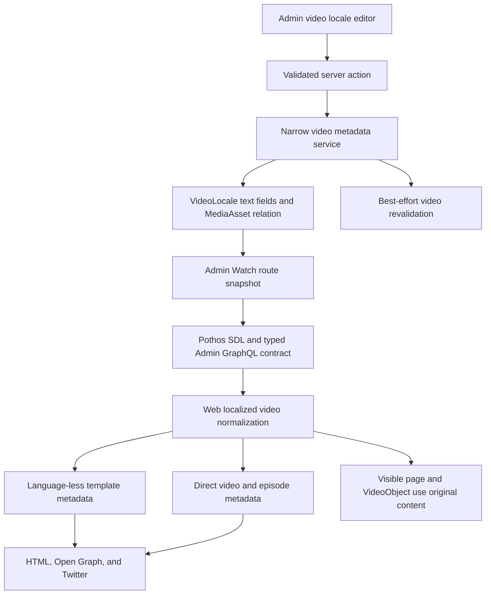

# Watch Video Search and Social Metadata - Plan

## Goal Capsule

- **Objective:** Let Admin operators set localized Search title, Search description, and a managed social image for playable Watch videos without changing visible video content.
- **Authority:** The Product Contract owns page behavior. The Planning Contract owns storage, permissions, propagation, and fallback mechanisms. Existing Forge security, Core-sync, Watch URL, caching, and generated-schema rules remain binding.
- **Execution profile:** Cross-cutting Prisma migration, Admin service and UI, Pothos schema, generated typed client, Web route projection, metadata, and browser verification.
- **Stop conditions:** Stop if the English JESUS locale cannot be identified deterministically, if a public Media Library URL cannot be resolved without authenticated Admin access, or if the override would require changing canonical URLs or visible video identity.
- **Tail ownership:** Complete focused and package-level validation, update `feat-323`, open a pull request, and leave merging to the normal repository flow.

---

## Product Contract

### Summary

Playable Watch pages gain reusable localized Search and Social metadata owned by Admin.
The fields change crawler and sharing presentation while the localized video title, description, player, visible heading, and structured `VideoObject` identity stay unchanged.
The English JESUS locale is initialized with the approved search-intent copy.

### Problem Frame

Watch currently builds page, Open Graph, and Twitter metadata from the same localized copy shown to viewers.
Editors therefore cannot improve search intent or social presentation without changing the video record itself.
The current video detail surface is read-only, and the reported language-less route has a metadata projection that differs from language-explicit and episode routes.

### Actors

- A1. An Admin operator with the existing video-write authority manages Search and Social metadata for an exact video locale.
- A2. A search crawler or social platform reads server-rendered HTML metadata.
- A3. A viewer sees the existing video title, description, player content, and structured video identity.
- A4. Core sync continues refreshing Core-owned localized video fields without clearing editor-owned Search and Social values.

### Requirements

**Localized editorial metadata**

- R1. Each `VideoLocale` can store nullable `searchTitle`, `searchDescription`, and a nullable managed social-image asset identity independently of its visible localized copy.
- R2. Search title and Search description control HTML, Open Graph, and Twitter text together for the selected locale.
- R3. The stored Search title is the complete final title, so an override that already includes `| Jesus Film Project` receives no second brand suffix.
- R4. A social image override must reference a managed `IMAGE` asset that is `READY`, `PUBLIC`, and resolvable through the crawler-safe public media route.
- R5. Empty text fields and a cleared image restore field-level fallback to localized video title/description/snippet and the existing Mux/poster/site image chain.

**Identity and publication safety**

- R6. Overrides do not change `VideoLocale.title`, `description`, `snippet`, the parent `Video`, visible page content, canonical URLs, robots, locale, site name, or structured `VideoObject` identity and media truth.
- R7. Saving preserves the locale publication status and uses best-effort video revalidation with the exact public language slug only when the locale is already `PUBLISHED`.
- R8. Core sync updates only Core-owned locale fields and preserves all three editor-owned override values.
- R9. The update path is narrowly permissioned and cannot become a general-purpose mutation of Core-owned video content.

**Admin workflow and initial rollout**

- R10. The video detail surface can find and load an exact locale beyond its bounded relation sample, show stored and effective values, select or clear a Media Library image, and retain form values on validation failure.
- R11. The English JESUS locale is initialized with Search title `Watch JESUS — Full Movie Free Online | Jesus Film Project`.
- R12. The same locale is initialized with Search description `Watch the JESUS film free online. Follow his life, teachings, miracles, death, and resurrection through the Gospel of Luke in more than 2,000 languages.`
- R13. No initial social image is assigned; the page keeps its current image fallback until an operator selects a managed asset.

### Key Flows

- F1. Edit one locale
  - **Trigger:** A1 opens a video detail and selects a locale.
  - **Steps:** Admin loads the exact locale, keeps its language name, code or slug, and publication status visible, shows stored and effective metadata, validates text and image input, writes only override fields, and refreshes the detail state. Switching locale or leaving with unsaved changes requires a Save, Discard, or Cancel decision.
  - **Outcome:** Draft metadata is stored without publication. Published metadata also emits best-effort `{ model: "video", entry: { slug, locale, languageSlug } }` revalidation and invalidates eligible language-less English paths.
  - **Covered by:** R1, R4, R5, R7, R9, R10
- F2. Render crawler metadata
  - **Trigger:** A2 requests a language-less, language-explicit, or episode Watch route.
  - **Steps:** The shared localized Watch snapshot carries root-video override fields through normalization. Each metadata path applies field-level override or fallback rules.
  - **Outcome:** HTML, Open Graph, and Twitter use the override while A3 sees unchanged content and structured video identity.
  - **Covered by:** R2, R3, R5, R6
- F3. Refresh Core content
  - **Trigger:** A4 runs localized video metadata sync after an editor save.
  - **Steps:** Sync updates its explicit Core-owned field set and does not write override columns.
  - **Outcome:** New Core display copy lands while Search and Social metadata remains intact.
  - **Covered by:** R8
- F4. Initialize JESUS metadata
  - **Trigger:** The forward database migration runs.
  - **Steps:** A guarded update matches stable JESUS and English Core identities, requires exactly one non-deleted candidate, then fills only the two new text fields.
  - **Outcome:** Existing deployments gain the approved copy; an absent JESUS row safely no-ops, ambiguity fails closed, and no image is assigned.
  - **Covered by:** R11, R12, R13

### Acceptance Examples

- AE1. Given the published English JESUS locale has the approved overrides, when `/watch/jesus.html` is rendered, then the server HTML title is exactly `Watch JESUS — Full Movie Free Online | Jesus Film Project`, the approved description appears in page/OG/Twitter metadata, and the visible title plus `VideoObject.name` remain the current video title.
- AE2. Given a localized row has null overrides, when any playable route uses that row, then its own visible localized copy and existing image chain are used rather than an English SEO override.
- AE3. Given A1 selects a private, non-ready, non-image, deleted, or otherwise non-publicly-resolvable asset, when the save is attempted, then the mutation rejects it and preserves the submitted form state.
- AE4. Given a published locale is saved, when Web revalidation is unavailable, then the database save still succeeds and the failure is logged; the existing Watch route ISR fallback bounds stale page metadata to one hour.
- AE5. Given a locale already has all three override values, when both the Core-sync create/update paths run, then those values remain unchanged.
- AE6. Given the override image later becomes unusable or is cleared, when metadata is rendered, then the page falls back to Mux, poster, or site default without exposing an authenticated Admin URL.

### Success Criteria

- Every playable route shape consumes the same localized Search and Social intent.
- The approved JESUS title is emitted once without a duplicate suffix.
- Admin stores only a Media Library identity and Web receives only public-safe image data.
- Published edits invalidate the exact Watch route through the existing best-effort cache boundary.
- Focused tests prove Core-sync preservation, permission enforcement, route parity, fallback behavior, and structured-data isolation.
- The change does not introduce request-time dynamic APIs or an N+1 asset lookup on the Watch snapshot path.
- The shipped guarantee is control of server-rendered source metadata. Google and other search engines may rewrite result titles or snippets, so displayed SERP copy and CTR improvement are measured separately in `feat-324` rather than claimed by this implementation.

### Scope Boundaries

- No changes to visible/player video titles or descriptions.
- No editable canonical, robots, locale, site name, hreflang, or structured-data identity fields.
- No separate Search-versus-social text fields and no separate SEO draft/publish lifecycle.
- No arbitrary external image URLs and no initial JESUS social-image assignment.
- No general `VideoLocale` editor and no widening of Core-owned `write:videos` behavior.
- Ordinary `EDITOR`-role access is deferred; this scope preserves the existing ADMIN-only video-write boundary unless implementation evidence proves an already-approved narrower permission exists.
- Search Console indexing, displayed-title, and CTR validation is tracked by `docs/roadmap/platform/feat-324-validate-watch-video-search-metadata.md`; automatic title generation remains separate follow-up work.

### Sources

- `docs/roadmap/platform/feat-323-watch-video-search-social-metadata.md`
- `docs/solutions/best-practices/admin-asset-backed-experience-media-picker-pattern-20260707.md`
- `docs/solutions/web/nextjs16-cachecomponents-isr.md`
- `docs/solutions/database-issues/admin-prisma-client-and-db-migration-drift-after-pull-20260603.md`
- `docs/solutions/best-practices/watch-single-video-template-pages-strapi-nextjs-2026-04-11.md`
- `docs/solutions/performance-issues/watch-hreflang-sitemap-manifest-20260612.md`

---

## Planning Contract

### Key Technical Decisions

- KTD1. Store editor-owned nullable fields on `VideoLocale`, with `socialImageAssetId` as a restrictive `MediaAsset` relation. (session-settled: user-directed — chosen over a one-off `/watch/jesus.html` override: operators need localized control for every playable video without a code deployment.) This implements R1 and R8 while leaving `source=CORE` and visible fields under Core sync. The relation must be cleared or replaced before normal asset deletion.
- KTD2. Treat `searchTitle` as a complete title and share the two text overrides across HTML, Open Graph, and Twitter. (session-settled: user-directed — chosen over HTML-only or separate social copy: consistent machine-facing intent avoids drift across crawlers and sharing clients.) This implements R2 and R3.
- KTD3. Persist only a managed asset identity and derive a public-safe image projection at the Admin read boundary. (session-settled: user-directed — chosen over arbitrary external URLs: managed assets provide validated lifecycle, visibility, and delivery ownership.) The service validates R4 at write time and the read path rechecks public resolvability before satisfying R5. An asset referenced as social art cannot be deleted or transitioned away from its public-ready state until every `VideoLocale` reference is cleared or replaced; the read-time fallback remains a defensive guard for legacy or externally inconsistent data.
- KTD4. Use a guarded forward migration to initialize only the English JESUS text overrides. (session-settled: user-approved — chosen over leaving the page on generic fallback copy after capability launch: the approved intent copy should take effect with the schema rollout.) Match video Core ID `1_jf-0-0`, slug `jesus`, and English language Core ID `529`; require exactly one non-deleted candidate before updating; assign no asset per R11-R13. Zero candidates no-op, while multiple candidates raise and abort the migration so ambiguous production data cannot pass silently.
- KTD5. Add a narrow update operation behind the existing ADMIN video-write boundary. In one transaction, the service loads an active locale, validates the asset, trims empty text to null, updates only the three override fields, and retrieves committed slug, locale, language slug, and status. It never changes source ownership or publication state. This implements R7 and R9 without a new role-policy decision.
- KTD6. Extend the existing post-commit video revalidation wire format additively to `{ model: "video", entry: { slug, locale, languageSlug } }` for published locales. Web validates `languageSlug` with the existing public-slug rule and uses it directly for the explicit Watch path; `locale` continues to control existing UI/internal-path behavior. Payloads without `languageSlug` retain the legacy locale-derived behavior during deployment overlap. Revalidation is fire-and-forget and cannot roll back the authoritative database save. This implements R7 and AE4.
- KTD7. Carry overrides through both playable metadata paths but keep page/social fields separate from structured-data fields. Language-less template resolution and direct video/episode resolution must both consume the override. `VideoObject` fields continue to use visible video copy and existing video media under R6.
- KTD8. Resolve social asset IDs only after the root exact/broad/English locale buckets have been selected. Hydrate unique IDs in one bounded batch and project a public-safe DTO. Never include the relation across the broad `allVideoIds` locale query; parent and child database rows plus GraphQL selections stay unchanged.
- KTD9. Generalize Media Library usage reporting into a discriminated usage shape that can represent `VideoLocale` ownership, then update its Pothos and inspector consumers. Count soft-deleted but recoverable locale references. The database FK uses `RESTRICT` so concurrent assignment and deletion cannot silently clear an override; operators clear or replace the relation before deletion.

### High-Level Technical Design

### Assumptions

- The English JESUS row is identifiable by stable video slug plus the English language/locale identity used by current Watch resolution.
- Existing last-write-wins Admin form behavior is acceptable; optimistic concurrency is not added in this scope.
- Title and description counters are advisory and do not reject the approved copy.
- Any valid public managed image is accepted; 1200×630 is guidance rather than a save blocker.
- Social-image alt text uses localized `imageAlt`, then visible video title, with the existing site fallback.

### System-Wide Impact

- **Persistent data:** Adds three nullable columns, one index, and one restrictive nullable foreign key. The migration uses an expansion-only, bounded-lock posture and performs one cardinality-guarded data update.
- **Core sync:** Field-level ownership becomes explicit because the row remains Core-sourced while the new overlay fields remain outside sync update objects.
- **Security:** Only the narrow Search and Social service can mutate these fields. Asset visibility and readiness are validated before persistence.
- **Media lifecycle:** Usage detection and its GraphQL/UI consumers gain video-locale references. Deletion and transitions away from the public-ready state are blocked while referenced; operators clear or replace locale references first. Private, non-ready, or otherwise unresolvable legacy data still degrades defensively to the existing image fallback.
- **GraphQL contract:** Pothos, committed SDL, gql.tada introspection, Watch fragment, and Web normalization change together.
- **Caching:** Published saves send the existing video webhook. Web retains static rendering and cache-tag behavior with no `headers()`, `cookies()`, or extra request-time fetch.
- **Performance:** Root locale asset hydration is batched. Parent/child locale buckets do not gain unused fields.
- **Deployment:** The nullable schema is backward compatible with old binaries. Release ordering is migration, Admin GraphQL producer, then Web consumer; application rollback leaves columns in place and any bad initializer copy is corrected with a targeted data migration rather than dropping schema.

### Risks and Mitigations

- **Wrong production row receives initial copy:** Guard by stable video and language Core IDs plus slug and deleted state; require cardinality one; test absent, duplicate, conflicting, and deleted fixtures. Reverse a bad initializer only with a targeted corrective migration.
- **Duplicate brand suffix:** Treat override title as final and test exact equality.
- **Authenticated image URL reaches crawlers:** Store only asset ID and expose only `publicMediaAssetPreviewUrl`-compatible output.
- **Core sync erases overrides:** Keep explicit sync update objects unchanged and add preservation regression coverage.
- **One route shape misses overrides:** Test language-less, exact-language-slug, language-explicit, and episode metadata paths independently.
- **JSON-LD identity drifts:** Keep structured fields separate in the metadata model and assert unchanged name, description policy, and thumbnail.
- **Snapshot payload or query count grows:** Select root override fields only and batch asset hydration.
- **Revalidation targets the wrong locale or fails:** Carry the exact public language slug, preserve save success, log the webhook outcome, and rely on established cache expiry fallback.
- **Cross-service deployment skew:** Deploy the additive migration and Admin schema before the Web selection. Verify old Admin/Web binaries still run against the expanded schema and do not remove columns during rollback.

### Sequencing

1. Add the expansion-only data model, migration, cardinality-guarded initial copy, and sync-preservation guard.
2. Add the transactional Admin service, Media Library lifecycle integration, and exact-language revalidation wire contract.
3. Add exact locale loading and the Admin editor.
4. Regenerate contracts and propagate the fields through Web normalization.
5. Apply both metadata paths, validate structured-data isolation, and complete browser/server-HTML proof.

---

## Implementation Units

### U1. Persist localized Search and Social metadata

- **Goal:** Add the nullable overlay fields, managed image relation, and guarded JESUS initializer while preserving Core ownership.
- **Requirements:** R1, R8, R11, R12, R13; F3, F4; AE5
- **Files:** `apps/admin/prisma/schema.prisma`, `apps/admin/prisma/migrations/0047_video_locale_search_social_metadata/migration.sql`, `apps/admin/src/services/core-sync/video-localized-metadata.ts`, `apps/admin/src/services/core-sync/video-localized-metadata.test.ts`, migration contract test colocated under `apps/admin/src` if the current suite has an established pattern.
- **Approach:** Add nullable mapped columns and a named restrictive `MediaAsset` relation with reciprocal collection and FK index. Use expansion-only DDL with a bounded-lock strategy. Keep Core sync update objects limited to existing source fields. Run a cardinality-guarded DML update for the approved text and no image.
- **Test scenarios:** Migration safely no-ops when JESUS is absent; exact-one match updates; conflicting slug/Core ID and deleted rows do not update; duplicate English candidates abort with no data change; exact approved copy is present; Core-sync refresh, stale marking, and resurrection preserve populated override values.
- **Verification:** Prisma generation succeeds, migration SQL and FK/index state match schema intent, orphan count is zero, only the intended row gains text, and focused sync tests show no override writes. In every target environment expected to contain JESUS, a post-migration release-readiness assertion must find exactly one active `VideoLocale` matching video Core ID `1_jf-0-0`, slug `jesus`, and English language Core ID `529`, with both approved text values exactly present. Zero or multiple rows emit the matched identities in an actionable diagnostic and block promotion even though the zero-row migration path itself remains a safe no-op.
- **Dependencies:** None.

### U2. Add the narrow Admin metadata domain and GraphQL contract

- **Goal:** Validate, save, read, and invalidate Search and Social metadata without exposing general video editing.
- **Requirements:** R4, R7, R9; F1; AE3, AE4, AE6
- **Files:** `apps/admin/src/services/video.service.ts` or a focused new service beside it, corresponding `*.test.ts`, `apps/admin/src/services/index.ts`, `apps/admin/src/auth/permissions.ts`, `apps/admin/src/services/revalidate-webhook.ts`, `apps/admin/src/services/media-asset.service.ts`, `apps/admin/src/services/media-asset.usage.ts`, `apps/admin/src/services/media-asset.usage.test.ts`, `apps/admin/src/graphql/types/mediaAsset.ts`, and the Media Library usage inspector component/tests.
- **Approach:** Authenticate and authorize at the server action and service entry before resource parsing or Prisma access, then run the Zod-validated transaction that validates an active locale and public ready image identity, trims blank text to null, updates only overlay fields, and returns committed route identity. Use a typed action-result envelope with allowlisted public codes for forbidden, invalid input, invalid asset, missing locale, and save failure; raw Prisma/storage details stay server-side. Emit exact-language video revalidation and a structured metadata-change audit event only after commit. The audit records actor, video/locale IDs, changed field names, selected asset ID, publication state, and result without submitted copy, secrets, or raw exceptions. Generalize usage reporting only for existing Experience and new `VideoLocale` consumers. Reuse that usage check in MediaAsset mutation paths so deletion or a status/visibility transition away from public-ready is rejected while referenced, with an operator-facing instruction to clear or replace the references first.
- **Test scenarios:** Unauthorized roles receive one forbidden result and perform zero locale/asset lookups; visible/source/status fields never enter the update; raw database/storage errors never reach action results; invalid or concurrently invalidated submitted assets reject the save, roll back every text/image change, and preserve form values; clear writes null; a concurrently deleted locale cannot update; draft save emits no webhook; published save emits exact slug/locale/language slug plus one redacted audit event; webhook failure does not fail save and ISR refreshes within the established one-hour fallback; active and recoverable soft-deleted asset usage is reported; referenced deletion and public-ready exit transitions fail, while both operations succeed after the locale reference is cleared.
- **Verification:** Focused service, transaction, permission, media usage, inspector, and revalidation tests pass.
- **Dependencies:** U1.

### U3. Build exact-locale Search and Social editing in Media Library

- **Goal:** Make the reusable metadata practical on videos with a large locale catalog.
- **Requirements:** R5, R10; F1; AE3
- **Files:** `apps/admin/src/app/dashboard/videos/page.tsx`, `apps/admin/src/app/dashboard/live-data.ts`, `apps/admin/src/app/dashboard/videos/video-detail-page.tsx`, new `apps/admin/src/app/dashboard/videos/video-search-social-editor.tsx`, new server action colocated with the video dashboard, `apps/admin/src/app/dashboard/experiences/experience-editor/image-picker-browser.tsx` only if a reusable prop is required, and colocated tests.
- **Approach:** Add exact locale selection/search outside the bounded detail sample. Each option and the selected editor header show human-readable language, stable code or language slug, and publication status. Separate read-only source copy, editable override, and effective crawler preview so fallback is explicit. Provide initial, loading, no-results, retryable load-error, and loaded states; disable or clear the editor while a new locale loads. Guard dirty locale changes and page exits with Save, Discard, or Cancel. Render advisory SEO counters within separate generous technical storage limits, public image dimensions, Select/Replace and Clear controls. Reuse Media Library presentation while filtering to public ready images and submit only asset identity.
- **Test scenarios:** A locale beyond the initial sample can be selected and disambiguated; loading clears or disables stale form controls; no-results and load-error/retry states are distinct and announced; empty values display fallback state; dirty switch/exit supports Save, Discard, and Cancel without cross-locale writes; approved copy round-trips; select and clear send ID/null only; private images are unavailable; failed save retains values; successful save refreshes persisted state; non-ADMIN users cannot access an enabled form.
- **Verification:** Component/action tests pass. Pending Save prevents duplicate submission; field errors use `aria-invalid` and `aria-describedby`; focus moves to the first error or summary; persistent live regions announce save results and locale loading. Picker tests preserve initial focus, containment, Escape dismissal, focus restoration, announced selection, and accessible Clear outcome. The detail page remains bounded on initial load and the narrow layout keeps the locale context, previews, and actions usable.
- **Dependencies:** U2.

### U4. Propagate overrides through the generated Watch data contract

- **Goal:** Carry root localized override fields and one public-safe image through Admin GraphQL and Web normalization without expanding parent/child payloads.
- **Requirements:** R1, R4, R5, R8; F2
- **Files:** `apps/admin/src/services/video.service.ts`, `apps/admin/src/services/video.service.test.ts`, `apps/admin/src/graphql/types/video.ts`, `apps/admin/src/graphql/schema.test.ts`, `apps/admin/schema.graphql`, `packages/admin-graphql/src/admin-graphql-env.d.ts`, `apps/web/src/lib/fragments/watch-video.ts`, `apps/web/src/lib/fragments/__tests__/watch-video.test.ts`, `apps/web/src/lib/content.ts`, `apps/web/src/lib/content.test.ts`, `apps/web/src/lib/__tests__/content-watch-merge.test.ts`.
- **Approach:** Extend only the public root locale snapshot shape, select root buckets before loading unique referenced assets in one bounded batch, print the SDL, regenerate gql.tada introspection, select fields on root exact/broad/English buckets, and preserve them on both `WatchVideoRecord` and `RouteVideo`. Apply field-level fallback within the selected localized row.
- **Test scenarios:** Exact/broad/English root locale normalization preserves overrides; null override falls back to the same row's copy; invalid image projection is absent; parent and child selection stays title-only; query count is bounded; generated types accept the fragment without casts.
- **Verification:** Admin snapshot tests, Web fragment/content tests, schema print, codegen, and typechecks pass with expected generated diffs only.
- **Dependencies:** U1, U2.

### U5. Apply metadata across all playable routes and prove isolation

- **Goal:** Emit approved crawler/social metadata on every playable route while leaving visible content, routing, caching, and JSON-LD unchanged.
- **Requirements:** R2, R3, R5, R6, R7, R11, R12; F2; AE1, AE2, AE4, AE6
- **Files:** `apps/web/src/lib/experience-metadata.ts`, `apps/web/src/lib/experience-metadata.test.ts`, `apps/web/src/lib/__tests__/experience-metadata-watch-page.test.ts`, `apps/web/src/app/[locale]/[htmlLang]/[...rest]/page.tsx`, `apps/web/src/app/[locale]/[htmlLang]/[...rest]/__tests__/page-metadata.test.tsx`, `apps/web/src/app/[locale]/[htmlLang]/[...rest]/__tests__/page-routing.test.tsx`, `apps/web/src/app/api/revalidate/route.ts`, `apps/web/src/app/api/revalidate/route.test.ts`.
- **Approach:** Use trimmed override text verbatim for page/social values, preserve existing suffix and description behavior only as fallback, and prefer valid managed social art before Mux/poster/default. Keep `structuredData*` fields sourced from visible copy and existing media. Cover both `resolveWatchPage` template metadata and direct video/episode metadata.
- **Test scenarios:** English language-less JESUS emits the exact title and approved description; language-explicit and episode routes match override semantics; title gets no duplicate suffix; blank localized override does not inherit English SEO; image override wins for OG/Twitter only; visible title and `VideoObject` values remain unchanged; canonical/robots/locale/site name stay equal to baseline; valid `languageSlug` drives the exact explicit path; missing `languageSlug` preserves legacy behavior; invalid slug is rejected.
- **Verification:** Focused metadata, route, structured-data, and revalidation suites pass. Server HTML and browser inspection show exact head tags, unchanged visible title, no console errors, and no frontend loading regression.
- **Dependencies:** U4.

---

## Verification Contract

| Gate                   | Command or evidence                                                                                                                                                                                                                                                                                                                                                                                                                                 | Units  | Done signal                                                                                                                                                                                                                                             |
| ---------------------- | --------------------------------------------------------------------------------------------------------------------------------------------------------------------------------------------------------------------------------------------------------------------------------------------------------------------------------------------------------------------------------------------------------------------------------------------------- | ------ | ------------------------------------------------------------------------------------------------------------------------------------------------------------------------------------------------------------------------------------------------------- |
| Prisma contract        | `pnpm --filter @forge/admin db:generate`                                                                                                                                                                                                                                                                                                                                                                                                            | U1-U3  | Client/DMMF includes the fields and relation.                                                                                                                                                                                                           |
| Seed release assertion | Run the environment-safe post-migration query against every target expected to contain JESUS                                                                                                                                                                                                                                                                                                                                                        | U1     | Exactly one active English JESUS locale matches the stable identities and contains the exact approved title/description; otherwise promotion is blocked with matched-row diagnostics.                                                                   |
| Admin focused tests    | `pnpm --filter @forge/admin exec vitest run src/services/core-sync/video-localized-metadata.test.ts src/services/video.service.test.ts src/services/media-asset.usage.test.ts src/graphql/schema.test.ts src/auth/permissions.test.ts` plus new editor/service test paths                                                                                                                                                                           | U1-U3  | Permission, asset, sync, revalidation, GraphQL, and UI scenarios pass.                                                                                                                                                                                  |
| Admin schema artifact  | `pnpm --filter @forge/admin schema:print`                                                                                                                                                                                                                                                                                                                                                                                                           | U2, U4 | `apps/admin/schema.graphql` is regenerated and drift-free.                                                                                                                                                                                              |
| Typed GraphQL artifact | `pnpm --filter @forge/admin-graphql generate`                                                                                                                                                                                                                                                                                                                                                                                                       | U4     | `admin-graphql-env.d.ts` is regenerated and fragment types resolve without casts.                                                                                                                                                                       |
| Web focused tests      | `pnpm --filter @forge/web exec vitest run src/lib/fragments/__tests__/watch-video.test.ts src/lib/content.test.ts src/lib/__tests__/content-watch-merge.test.ts src/lib/experience-metadata.test.ts src/lib/__tests__/experience-metadata-watch-page.test.ts 'src/app/[locale]/[htmlLang]/[...rest]/__tests__/page-metadata.test.tsx' 'src/app/[locale]/[htmlLang]/[...rest]/__tests__/page-routing.test.tsx' src/app/api/revalidate/route.test.ts` | U4, U5 | Both metadata pipelines, fallback, route parity, cache invalidation, and JSON-LD isolation pass.                                                                                                                                                        |
| Package quality        | `pnpm --filter @forge/admin typecheck && pnpm --filter @forge/admin lint && pnpm --filter @forge/admin test && pnpm --filter @forge/admin build`                                                                                                                                                                                                                                                                                                    | U1-U3  | Admin passes CI-sensitive checks.                                                                                                                                                                                                                       |
| Consumer quality       | `pnpm --filter @forge/admin-graphql typecheck` and `pnpm --filter @forge/web typecheck && pnpm --filter @forge/web lint && pnpm --filter @forge/web test && pnpm --filter @forge/web build`                                                                                                                                                                                                                                                         | U4, U5 | Contract and Web pass CI-sensitive checks with static Watch behavior intact.                                                                                                                                                                            |
| Format                 | `pnpm prettier --check` on every changed non-generated source and document                                                                                                                                                                                                                                                                                                                                                                          | U1-U5  | No formatting drift.                                                                                                                                                                                                                                    |
| Browser/server HTML    | Inspect language-less English JESUS plus one explicit locale and one episode route on the built branch                                                                                                                                                                                                                                                                                                                                              | U3, U5 | Exact head metadata, unchanged visible title and JSON-LD, working Media Library select/clear, a crawler-accessible public Admin media URL tested without an authenticated session, no browser errors, and no request-time dynamic-rendering regression. |

### Performance Guard

Compare the affected Watch route build/render behavior with the branch baseline.
The route must remain static/ISR-capable, the Admin snapshot must avoid per-locale asset lookups, and no parent/child locale payload expansion may appear in the GraphQL operation.

### Pull Request Validation

Run CI-sensitive checks for all touched packages before pushing.
Inspect generated SDL/introspection diffs and migration SQL manually.
Do not deploy directly or merge the pull request from this work item.

---

## Definition of Done

- U1 is complete when the migration, relation, exact JESUS copy, Core-sync preservation, and target-environment seed assertion are verified.
- U2 is complete when the narrow permissioned service, public-safe projection, Media Library usage/lifecycle guards, and published-locale revalidation are verified.
- U3 is complete when an Admin operator can find any exact locale, edit/clear all requested fields, and understand effective fallbacks.
- U4 is complete when generated contracts and Web normalization carry only the required root locale metadata with bounded query behavior.
- U5 is complete when every playable route shape emits the overrides while visible content, canonical policy, static caching, and `VideoObject` remain unchanged.
- All Verification Contract gates applicable to changed files pass or have an explicit evidence-backed environment limitation recorded in the pull request.
- `docs/roadmap/platform/feat-323-watch-video-search-social-metadata.md` is marked `complete` with final verification notes.
- Abandoned experiments, dead branches, temporary fixtures, and unrelated changes are absent from the final diff.
- A pull request is open, mergeable, and watched through its CI/review tail without direct production deployment.
