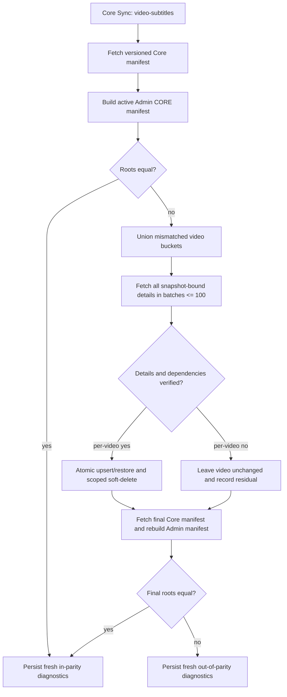

# Admin Subtitle Checksum Reconciliation - Plan

## Goal Capsule

Replace Admin's `Video.updatedAt`-driven subtitle sync with a versioned,
source-authoritative parity check from Core PR #9425. Repair only videos whose
checksums differ. Permit per-video deletion only after snapshot-bound details
prove the authoritative record set. Show workflow execution, parity freshness,
and data parity as independent operator facts.

The user's requirements and Core PR #9425 are the product authorities. Forge's
Admin data model, workflow ledger, and documented destructive-sync incident are
the implementation authorities. Stop if Core's deployed contract differs from
the pinned version 1 vectors, if a detail cannot be verified, or if a required
Admin relationship cannot be resolved safely.

Execution is one Forge PR against `main`. Core #9425 must deploy first. The PR
must leave the normal scheduled or manual Core Sync capable of restoring JESUS
video `1_jf-0-0`; it must not patch production data or deploy outside the normal
merge flow.

## Product Contract

### Summary

Admin will compare its active Core subtitle projection with Core's checksum
manifest on every subtitle sync phase. It will fetch and apply details only for
mismatched videos, persist the result, and expose honest operational health.

### Problem Frame

The current subtitle phase reads nested subtitle arrays through paginated
videos. Incremental runs filter on the parent video's update time, so a subtitle
change can be invisible. Full runs interpret an error-free fetch as complete
and soft-delete every unstamped subtitle across the table. That combination
removed valid JESUS English subtitles while the dashboard still labeled the
dataset healthy.

Transport success proves execution only. It does not prove the destination is
fresh or equal to Core. The Core manifest supplies an independent root,
per-video buckets, snapshot-bound details, and literal canonicalization vectors
so Admin can prove those states separately.

### Actors

- A1. The scheduled Core Sync checks and repairs subtitle parity nightly.
- A2. An Admin operator starts the same workflow manually and reads its three
  health dimensions.
- A3. Watch reads repaired active Admin subtitles after the existing manifest
  refresh path runs.

### Requirements

#### Source contract and comparison

- R1. Admin must require the configured Core token, send it as an interop
  credential without logging either auth header, require HTTPS for production
  Core URLs, reject redirects, and fail closed when the protected manifest is
  unavailable.
- R2. Admin must implement checksum version 1 byte-for-byte from Core #9425's
  literal vectors and reject any unsupported version before mutation.
- R3. Every `video-subtitles` phase must compare Core and Admin roots regardless
  of the incremental watermark.
- R4. Admin must identify mismatches from the union of Core and active Admin
  per-video buckets and request details only for those video IDs in batches of
  at most 100.

#### Reconciliation safety

- R5. Admin must validate all requested details against one discovered snapshot
  before it mutates any subtitle rows for that attempt.
- R6. Admin may delete active Core subtitles for one video only when its detail
  count, checksum, records, and video ID match the discovered manifest; an
  Admin-only video also requires the canonical explicit empty detail.
- R7. Reconciliation for one video must be atomic and must leave Manager-owned
  subtitles and all other videos unchanged. Any existing Manager-owned row
  with a requested Core ID makes that whole video residual, including a
  same-video collision.
- R8. Missing or ambiguous Video, Language, or VideoEdition mappings must leave
  that video unchanged and report residual drift.
- R9. One stale-snapshot response must restart discovery; a second stale
  snapshot must fail the phase without using unverified details.
- R10. A final Core manifest and fresh Admin checksum must match before data
  parity is reported healthy.

#### Diagnostics and operator truth

- R11. Persist parity version, check identity, timestamps, snapshots, roots,
  counts, initial mismatches, repairs, residuals, and bounded failure reasons
  in the existing sync state and per-run phase summary. The operator summary
  must disclose sample truncation and identify the persisted run/check used to
  inspect the full residual set.
- R12. Preserve execution success when a completed check finds residual drift;
  reserve phase errors for transport, contract, validation, or persistence
  failures.
- R13. Display Core Sync execution, subtitle parity freshness, and subtitle data
  parity as separately labelled, color-independent groups, and derive execution
  only from `core-sync` workflow rows. No combined banner may call Core Sync
  healthy when freshness or parity is unknown or unhealthy.
- R14. Treat a missing, malformed, incomplete, or unsupported parity diagnostic
  as unknown/unavailable and treat a completed check older than 36 hours as
  stale, while preserving the independent execution result.

#### JESUS repair and rollout

- R15. Restore the missing JESUS subtitle set through the same mismatch-only
  reconciler and the existing Watch manifest refresh trigger, not a manual data
  patch.
- R16. Deploy Core #9425 before Forge and verify the first normal sync without a
  direct production deploy from this worktree.
- R17. Every active Admin Core subtitle must be canonically projectable or
  reported as residual; an unprojectable row must prevent healthy parity.
- R18. Admin must fence every mutating per-video transaction and healthy-parity
  publication with lock ownership and lease validity checked inside the same
  database transaction.
- R19. Latest-attempt and last-completed parity evidence must retain one stable
  check identity, and a failed attempt must not erase the last known good check.

### Key Flows

- F1. Root match: fetch Core manifest, build Admin projection, compare equal,
  persist a fresh in-parity result, and issue no detail query or write. Covers
  R1-R4 and R10-R14.
- F2. Targeted repair: discover mismatch IDs, load every snapshot-bound detail,
  validate and resolve dependencies, reconcile each valid video transactionally,
  then perform the final parity check. Covers R4-R10 and R15.
- F3. Source churn: discard staged details and restart once after a snapshot
  mismatch; stop safely after retry exhaustion. Covers R5, R6, and R9.
- F4. Residual drift: leave an unresolvable video untouched, finish the check,
  and persist execution success plus out-of-parity data status. Covers R8 and
  R11-R14.
- F5. Operator review: filter workflow execution to Core Sync and show freshness
  and parity beside it without allowing unrelated backup failures to redefine
  Core Sync health. Covers R13 and R14.

### Acceptance Examples

- AE1. Given equal roots, the phase makes one Core manifest request and zero
  subtitle mutations. Covers R3 and R4.
- AE2. Given 101 mismatched videos, detail request batches contain at most 100
  unique IDs and all batches validate before the first write. Covers R4 and R5.
- AE3. Given an Admin-only video, only a snapshot-bound zero-count detail with
  the canonical empty checksum permits that video's Core rows to be soft
  deleted. Covers R6 and R7.
- AE4. Given one unresolved edition on a video, no row for that video is written
  or deleted and the parity result names it as residual. Covers R7, R8, and R12.
- AE5. Given the first stale snapshot, the phase restarts; given the second, it
  records an execution failure and performs no deletion from that attempt.
  Covers R5 and R9.
- AE6. Given JESUS `1_jf-0-0` with its English Core rows soft-deleted in Admin,
  the same reconciler restores them and reports subtitle changes that activate
  Watch manifest refresh. Covers R15.
- AE7. Given a failed `video-db-backup` workflow and a successful Core Sync, the
  System Status execution card reports the Core Sync result while the general
  Workflows page retains the backup failure. Covers R13.
- AE8. Given lock loss after details validate, no per-video write or deletion
  occurs and healthy parity is not published. Covers R18.
- AE9. Given a malformed manifest, an unprojectable active row, or a subtitle ID
  currently owned by another video, the phase reports a validation or residual
  result without cross-video mutation. Covers R5, R7, R17, and R19.

### Success Criteria

- Core and Admin roots match after a repair run or parity remains explicitly
  out-of-sync with residual IDs and reasons.
- No code path performs a phase-wide unstamped subtitle deletion.
- The no-drift nightly path performs one small Core request and one local scan
  of the active Core subtitle projection.
- The JESUS regression fixture proves restoration through the production
  reconciliation path.
- The System Status page cannot label unknown or stale subtitle parity healthy.

### Scope Boundaries

In scope are Admin Core transport headers, checksum canonicalization, subtitle
storage fields, the `video-subtitles` phase, persisted sync diagnostics, the
System Status page, Watch refresh verification, migration/runbook updates, and
the roadmap ticket.

Out of scope are changes to Core #9425, direct production deployment, manual SQL
repair, subtitle object-byte verification, other Core Sync datasets, and a
general checksum framework for every table.

### Dependencies

- Core PR #9425 must be merged and deployed with
  `videoSubtitleChecksumManifest` version 1.
- `CORE_API_TOKEN` must be the deployed Core interop token.
- Admin migrations must deploy before the new reconciler runs.

## Planning Contract

### Key Technical Decisions

- KTD1. Port Core's fixed-position JSON tuple serialization, UTF-8 byte sort,
  null handling, and SHA-256 prefix as a pure Admin helper. Pin the copied
  literal vectors in tests. This implements R2 without relying on JavaScript
  object-key order.
- KTD2. Perform root-first comparison on every subtitle phase and load details
  only for the union of mismatched buckets. (session-settled: user-directed —
  chosen over parent-update incremental reads and whole-table rewrites: hidden
  child changes require independent parity while targeted repair minimizes
  work) This implements R3 and R4.
- KTD3. Treat the initial manifest snapshot and each verified detail bucket as
  the only deletion authority. (session-settled: user-directed — chosen over
  deleting unstamped rows after an error-free fetch: an incomplete response can
  succeed and erase valid data) Before detail loading, also prove unique bucket
  IDs, nonnegative counts, bucket-count sum, and a locally recomputed root. This
  implements R5-R7 and R9.
- KTD4. Resolve Admin's required edition foreign key first from exact existing
  same-video Core subtitle or dub associations, including soft-deleted subtitle
  rows. Use a mismatch-scoped Core relation lookup only for unresolved edition
  pairs, and never use that lookup as deletion authority. This implements R8
  without requiring another Core contract change.
- KTD5. Add only the canonical values Admin cannot reconstruct today:
  `vttVersion` and `srtVersion`. Build edition and language identity from the
  required VideoEdition relationship and Language core ID instead of storing a
  second copy that can drift. Default legacy versions to 1; the first manifest
  run corrects guessed versions. This makes the local checksum projection
  reproducible for R2 and R3 without duplicating relationship-owned data.
- KTD6. Carry typed optional subtitle parity diagnostics inside `SyncStats`.
  Persist the latest copy in `SyncState.stats` and historical copies in
  `CoreSyncRun.phaseSummary`. Give each check an immutable ID and carry separate
  latest-attempt and last-completed evidence so a failure cannot overwrite the
  last known good result. This follows the existing workflow operations
  boundary and implements R11 and R19 without a parallel ledger.
- KTD7. Model parity mismatch as a successful completed check, not a workflow
  exception. (session-settled: user-directed — chosen over one Healthy flag
  based on error count: execution success does not prove freshness or data
  equality) This implements R12-R14.
- KTD8. Restore JESUS only when the deployed reconciler detects its bucket
  mismatch. (session-settled: user-directed — chosen over a one-off database
  patch: the incident must exercise and prove the durable repair path) This
  implements R15 and R16.
- KTD9. Treat the DB lock as a transaction-level mutation fence, not only a
  phase-entry guard. Lock and validate the ownership/lease row inside every
  mutating transaction and the transaction that publishes healthy parity.
  Treat a Core subtitle ID already attached to another Admin video, or any
  Manager-owned row with that ID, as residual rather than re-parenting or
  overwriting it. This implements R7, R18, and R19.

### High-Level Technical Design



All detail batches are staged and validated before `H`. Each video enters its
own transaction only after every record for that video has a safe local Video,
Language, and VideoEdition mapping. An explicit empty detail follows the same
validation path before deletion.

### Assumptions

- A36-hour threshold accurately represents stale data for the nightly schedule.
- Existing same-video subtitle and dub relationships resolve JESUS editions;
  the fallback relation lookup covers genuinely new subtitle editions.
- Sending `CORE_API_TOKEN` in both the existing bearer header and Core's
  `interop-token` header preserves old queries while authorizing the manifest.
- A normal Core Sync after Core-first and Forge-second deployment is the first
  authorized production repair attempt.

### Sequencing

1. Pin the external contract and extend the stored canonical projection.
2. Implement comparison, staged verification, dependency resolution, and
   per-video reconciliation.
3. Persist typed diagnostics through the existing sync state and run ledger.
4. Project the three health dimensions in the operator page.
5. Prove the JESUS repair path, Watch invalidation, migration, and rollout.

### System-Wide Impact

- Data lifecycle: the migration adds source version metadata without deleting
  rows. Existing relationships provide edition and language identity; later
  deletion is limited to one verified Core video.
- Workflow semantics: a parity residual can coexist with a succeeded workflow.
  Contract, transport, validation, and transaction failures still fail it.
- Caching: repaired subtitle stats continue through
  `refreshWatchRouteManifestAfterCoreSync`; no new Web endpoint is needed.
- Operations: System Status filters execution to Core Sync. General workflow
  history still shows backup and other workflow failures.
- Performance: the stable nightly path scans roughly 11,000 Admin rows and
  transfers the roughly 145 KiB Core manifest measured by #9425. Detail and
  relation requests scale only with mismatched videos in batches of 100.
- Security: the interop token stays server-only, transport rejects production
  HTTP and redirects, and neither auth header is logged or exposed through the
  dashboard diagnostics. Existing secret rotation remains the ownership path.

### Risks and Mitigations

- Core is not deployed first. The phase fails closed before writes and the
  dashboard shows execution failure or unknown parity.
- The first run detects broad version drift because old Admin rows default to
  version 1. Batch limits bound Core requests; final parity proves the repair.
- Core changes while details load. Snapshot mismatch discards staged details
  and permits one complete restart.
- An initial manifest is structurally corrupt. Local count and root validation
  fails before details or mutations.
- Relation metadata is incomplete. The affected video remains unchanged and
  appears as a residual instead of authorizing deletion.
- Lock ownership changes after validation. A row lock plus ownership/lease
  predicate inside the mutation transaction rejects the write and prevents a
  healthy terminal state without a check/write race.
- A legacy row cannot be projected or a subtitle ID belongs to another Admin
  video. Parity remains out-of-sync and the row is not silently excluded or
  re-parented.
- A process fails after a per-video transaction. Completed videos remain valid;
  the next root comparison re-detects all remaining drift.
- Diagnostic arrays become large on first rollout. Persist sorted full IDs for
  diagnosis but render only counts and a bounded sample.
- An application rollback restores the old destructive implementation. Do not
  roll application code back after this migration; disable the subtitle phase
  if needed and roll forward to a corrected reconciler. The additive schema
  columns do not require a schema rollback.

### Sources and Research

- Core contract and golden vectors: `https://github.com/JesusFilm/core/pull/9425`.
- Incident: `docs/solutions/integration-issues/core-sync-video-subtitles-soft-delete-wipes-on-incomplete-fetch.md`.
- Independent coverage precedent:
  `docs/solutions/integration-issues/admin-core-sync-flat-vs-nested-image-query-coverage-gap-20260519.md`.
- Data model and relationship constraints:
  `docs/solutions/platform/admin-core-sync-entity-coverage.md`.
- Operations ownership:
  `docs/solutions/best-practices/admin-postgres-workflow-operations-pattern-20260501.md`.
- Work tracker:
  `docs/roadmap/platform/feat-323-admin-subtitle-checksum-reconciliation.md`.

## Implementation Units

### U1. Pin the Core contract and canonical Admin projection

- Goal: Make Core manifest access and checksum version 1 independently
  testable.
- Requirements: R1, R2, and R4.
- Files:
  - `apps/admin/src/services/core-sync/core-client.ts`
  - `apps/admin/src/services/core-sync/core-client.test.ts`
  - `apps/admin/src/services/core-sync/video-subtitle-checksum.ts`
  - `apps/admin/src/services/core-sync/video-subtitle-checksum.test.ts`
  - `apps/admin/src/services/core-sync/schemas/video-subtitle-manifest.ts`
- Approach: Add the interop header without removing bearer compatibility. Port
  the Core types, serializers, builders, and golden vectors. Validate the
  manifest and detail response boundary before orchestration consumes it.
- Test scenarios: exact golden bucket/root bytes and hashes; empty bucket;
  Unicode byte ordering; null versus empty string; field/version changes;
  protected request headers; GraphQL errors.
- Verification: focused tests prove copied Core vectors and exact request
  authentication.

### U2. Store and migrate canonical subtitle source fields

- Goal: Make active Admin Core rows capable of reproducing Core's canonical
  projection without duplicating relationship-owned values.
- Requirements: R2, R3, R8, R11, and R17.
- Dependencies: U1.
- Files:
  - `apps/admin/prisma/schema.prisma`
  - `apps/admin/prisma/migrations/0047_video_subtitle_parity/migration.sql`
  - generated Prisma client artifacts as produced by the existing command
- Approach: Add the two version fields from KTD5 and default existing rows to
  version 1. Project edition and language core ID from current relationships;
  keep unresolved relationships visible as parity residuals.
- Test scenarios: schema validation; migrated legacy rows remain readable;
  detail writes preserve null URLs, empty URLs, and version integers; null or
  ambiguous legacy relationships produce counted residuals; no duplicate
  edition or language source columns are introduced.
- Verification: Prisma formatting, validation, and generation succeed; the SQL
  migration contains no destructive statement.

### U3. Replace subtitle sync with snapshot-safe targeted reconciliation

- Goal: Implement F1-F4 and repair only checksum mismatches.
- Requirements: R3-R12, R15, and R17-R19.
- Dependencies: U1 and U2.
- Files:
  - `apps/admin/src/services/core-sync/phases/sync-video-subtitles.ts`
  - `apps/admin/src/services/core-sync/phases/sync-video-subtitles.test.ts`
  - `apps/admin/src/services/core-sync/types.ts`
  - `apps/admin/src/services/core-sync/watermark.ts`
  - `apps/admin/src/services/core-sync/orchestrator.ts`
  - `apps/admin/src/services/core-sync/lock.ts`
- Approach: Ignore `since` for parity detection. Load the local projection,
  stage all detail batches, validate them, resolve mappings, and reconcile each
  valid video transactionally. Carry previous check timestamps into the typed
  parity diagnostic. Acquire and validate the lock row inside every mutation
  transaction and the healthy-publication transaction. Fetch a final root
  before choosing in-parity versus
  out-of-parity. Never omit malformed active Core rows from the parity verdict.
- Test scenarios: AE1-AE6; 100-ID batching; unsupported version; tampered or
  missing detail; snapshot retry exhaustion; empty verified deletion; no
  cross-video or Manager deletion; unresolved and ambiguous dependencies;
  final-root drift; process errors; deterministic diagnostics.
- Additional test scenarios: manifest count/root inconsistency; globally
  duplicated or extra details; unprojectable active rows; lock loss between
  validation and write; cross-video and same-video Manager Core-ID ownership;
  latest-attempt failure preserving the prior completed check ID.
- Verification: focused phase tests prove no global unstamped deletion remains
  and falsify each destructive gate.

### U4. Separate execution, freshness, and parity in System Status

- Goal: Make F5 honest and actionable for operators.
- Requirements: R11-R14 and R19.
- Dependencies: U3.
- Files:
  - `apps/admin/src/app/dashboard/ops-data.ts`
  - `apps/admin/src/app/dashboard/ops-data.test.ts`
  - `apps/admin/src/app/dashboard/system-status/page.tsx`
  - `apps/admin/src/app/dashboard/dashboard-ui.test.tsx`
- Approach: Filter the System Status workflow query to `core-sync`. Parse the
  typed subtitle diagnostic and project three independent health objects.
  Render an explicit matrix: execution is running/succeeded/failed/never run;
  freshness is fresh/stale/unknown; parity is in sync/out of sync/unavailable.
  Give each axis a text label, severity, supporting copy, and semantic heading;
  remove the blanket healthy claim. Rename the phase table to make its
  execution-only meaning explicit. Use a named 36-hour freshness threshold and
  unknown-first rendering. Show residual total plus “showing N of M”, check ID,
  completion timestamp, and the Core Sync run ledger as the full-detail lookup.
- Test scenarios: execution success with parity mismatch; fresh versus stale at
  the threshold; no, malformed, incomplete, or unsupported parity diagnostic;
  Core Sync success plus unrelated backup failure; residual counts, explicit
  truncation, check identity, and bounded sample; color-independent text and
  semantic groups at desktop and the supported narrow breakpoint; read-only
  operator view.
- Verification: data tests prove status composition and rendered HTML names all
  three dimensions without the old blanket healthy claim.

### U5. Prove JESUS repair, Watch invalidation, and rollout safety

- Goal: Complete R15 and R16 with durable regression and operator guidance.
- Requirements: R15 and R16.
- Dependencies: U3 and U4.
- Files:
  - `apps/admin/src/services/core-sync/phases/sync-video-subtitles.test.ts`
  - `apps/admin/src/services/watch-route-manifest-refresh.service.test.ts`
  - `apps/admin/docs/core-sync-recurring-job.md`
  - `docs/solutions/integration-issues/core-sync-video-subtitles-soft-delete-wipes-on-incomplete-fetch.md`
  - `docs/roadmap/platform/feat-323-admin-subtitle-checksum-reconciliation.md`
- Approach: Add a `1_jf-0-0` fixture whose Core English subtitles are absent or
  soft-deleted in Admin, then prove restore plus nonzero phase changes. Document
  Core-first rollout, safe normal-sync repair, parity verification, and Watch
  transcript verification. Supersede the old ratio-guard suggestion with the
  checksum-bound invariant.
- Rollout notes define roll-forward-only application recovery: disable the
  subtitle phase if rollback pressure arises, then deploy a corrected
  reconciler without restoring the old global delete path.
- Test scenarios: JESUS restore uses the same production code path; repaired
  stats request Watch manifest refresh; no direct repair script or SQL is added.
- Verification: focused tests and documentation grep establish the safe path
  from deployed Core manifest to Watch transcript data.

## Verification Contract

Run focused tests first:

```powershell
pnpm --filter @forge/admin test -- src/services/core-sync/core-client.test.ts src/services/core-sync/video-subtitle-checksum.test.ts src/services/core-sync/phases/sync-video-subtitles.test.ts src/services/watch-route-manifest-refresh.service.test.ts src/app/dashboard/ops-data.test.ts src/app/dashboard/dashboard-ui.test.tsx
```

Validate the migration and generated client:

```powershell
pnpm --filter @forge/admin exec prisma format
pnpm --filter @forge/admin exec prisma validate
pnpm --filter @forge/admin db:generate
```

Run the Admin quality gates:

```powershell
pnpm --filter @forge/admin test
pnpm --filter @forge/admin typecheck
pnpm --filter @forge/admin lint --max-warnings=0
pnpm run format:check
git diff --check
```

Use browser QA on the affected System Status page. Confirm the three health
dimensions render independently, unknown/stale does not render as healthy, and
an unrelated workflow failure is absent from the Core Sync incident list.
Inspect the browser console and Admin server logs for runtime errors. This
server-rendered status change adds no client initialization or media work, so a
network trace confirming no new client fetch is the page-load performance gate.

Inspect the migration's backfill counts in a representative database fixture.
Assert that the number of active Core subtitle rows equals the number of
canonically projectable rows plus explicitly diagnosed residual rows. Falsify
the manifest count/root validator, lock fence, and cross-video ownership guard
once each to prove the safety tests are discriminating.

After Core-first and Forge-second deployment, an authorized operator runs the
normal scheduled or manual Core Sync. They verify subtitle parity is in sync,
JESUS `1_jf-0-0` has active English subtitles in Admin, and
`https://www.jesusfilm.org/watch/jesus.html` renders the transcript. This is an
operator rollout check, not authorization for this PR to deploy itself.

## Definition of Done

- All requirements R1-R19 are implemented or represented by the documented
  post-deploy operator gate.
- U1-U5 satisfy their test scenarios and verification outcomes.
- Literal Core checksum vectors pass in Forge.
- No phase-wide or unverified deletion path remains.
- No active Core subtitle can disappear from checksum accounting; every row is
  projected or explicitly residual.
- Every destructive transaction and healthy terminal state are lock-fenced.
- Failed attempts preserve the immutable identity and timestamps of the last
  completed and last in-parity checks.
- Equal roots are the only healthy parity terminal state.
- JESUS restoration is proven by the production reconciler fixture and uses the
  existing Watch refresh path.
- Execution, freshness, and parity are visibly independent in System Status.
- Migration, focused tests, full Admin tests, typecheck, lint, format, diff, and
  browser QA pass.
- The roadmap ticket is complete and the incident learning reflects the new
  invariant.
- Dead-end, experimental, or superseded code is removed from the final diff.
- The Forge PR targets `main`, references Core #9425 and FGE-62, and contains no
  production deploy or manual database patch.
- Rollout documentation prohibits application rollback to the old destructive
  phase and provides a disable-then-roll-forward recovery path.
