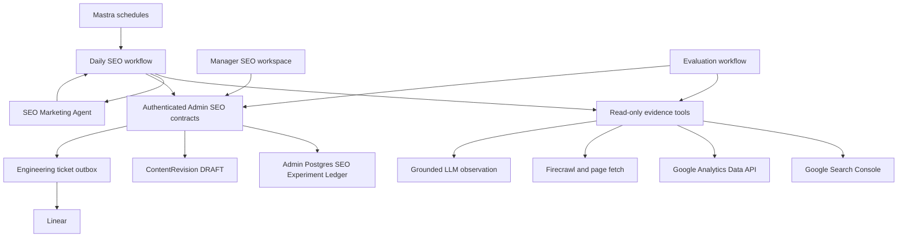
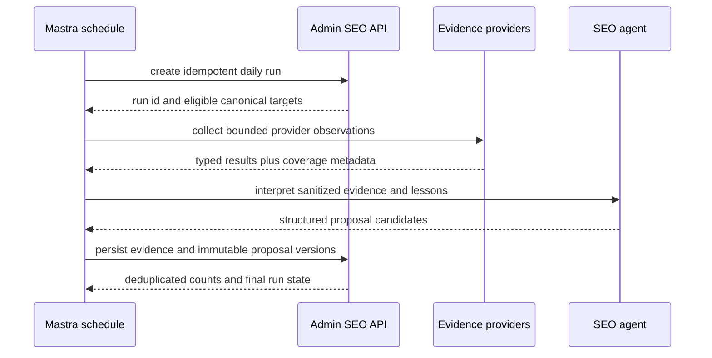
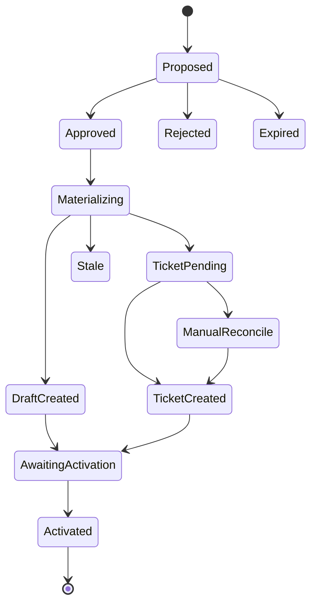
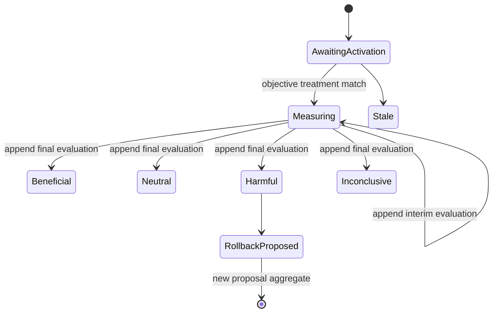
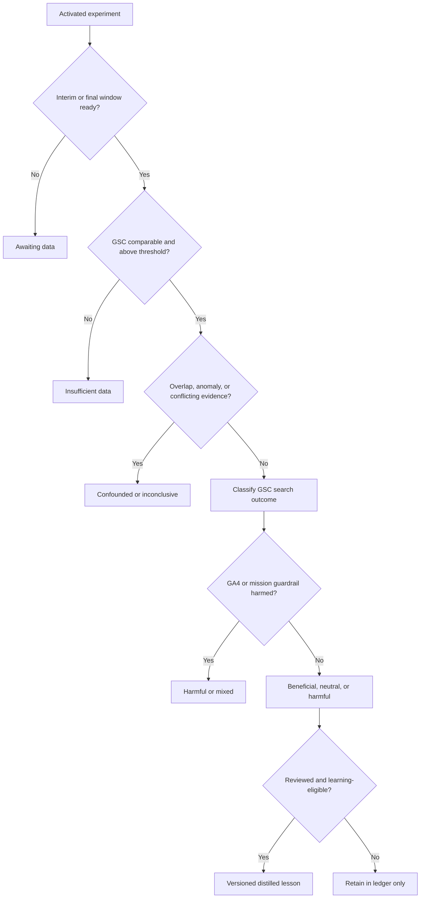

# feat: Add Mastra SEO marketing agent and Manager workspace

## Summary

Build a reusable Mastra SEO Marketing Agent that produces daily, evidence-backed editorial and engineering proposals for localized Watch and Experience pages. Add an authenticated Manager workspace where operators review those proposals, materialize approved editorial changes as Admin draft revisions, create approved engineering tickets, and follow experiments through activation, measurement, rollback, and reviewed learning.

---

## Problem Frame

Forge can author search metadata and page content, but it has no durable loop connecting Google Search performance, on-site behavior, fetched page state, external search observations, a proposed improvement, human approval, production activation, and a later outcome. The current tools are fragmented: web emits GA4 events but does not read the Data API, Mastra owns Firecrawl but has no SEO agent, and Admin can edit Watch and Experience content but its ordinary update paths may affect live content.

The April automation requirements correctly prohibited autonomous publishing and required scheduled, auditable review, but the current user decision materially expands that earlier brief. This plan intentionally adds Manager review, approval-gated draft and ticket materialization, experiment evaluation, rollback proposals, and reviewed learning while keeping recurring collection and analysis in Mastra. Emerging-topic discovery remains a separate product track.

---

## Requirements

### Evidence collection and recommendations

- R1. A daily scheduled workflow evaluates GSC-observed canonical Watch and Experience pages across indexed locales, records partial coverage honestly, and emits a configurable maximum of prioritized proposals.
- R2. Search Console snapshots preserve property identity, filters, dimensions, date state, Pacific-time windows, pagination, totals, and coverage caveats; an absent row remains unobserved rather than zero.
- R3. GA4, Firecrawl, direct page state, and grounded LLM responses remain distinct SEO Evidence Observations with provider, scope, retrieval time, quality metadata, and citations or source URLs.
- R4. Each SEO Proposal names one canonical page and locale, a query or intent/persona hypothesis, evidence and caveats, expected outcome, risk, verification plan, rollback material, and either an exact editorial field diff or an exact engineering ticket brief with a server-validated deployment probe or an explicit ticket-only designation.
- R5. Editorial recommendations may target titles, descriptions, headings, page copy, topics, internal links, and page structure; the system never recommends the ignored `meta keywords` tag as a ranking control.

### Authority and lifecycle

- R6. Scheduled and reusable agent execution is read-only; the model has no approval, draft-write, publish, deployment, Search Console mutation, or ticket-creation capability.
- R7. Only an authenticated interactive Manager operator may approve or reject an immutable proposal version, and the audit record derives the actor identity from the session rather than request data.
- R8. Editorial approval atomically validates the current base, preserves any existing human draft, and creates one AI-attributed Admin `ContentRevision` DRAFT without mutating canonical content, changing publish state, or triggering revalidation.
- R9. Engineering approval persists an idempotent outbox action before a configured ticket provider is called; delivery is effectively once, and ambiguous remote success pauses in reconciliation rather than risking an automatic duplicate.
- R10. Approval and materialization do not start measurement. An experiment becomes active only after an objective probe observes the canonical production content or deployed behavior matching the approved treatment.

### Experimentation and reuse

- R11. The SEO Experiment Ledger preserves append-only proposal versions, evidence, decisions, materialization, immutable pre-change and treatment snapshots, observed activation hashes, measurement windows, confounders, outcomes, and rollback links beyond the retention of generic content revisions.
- R12. Experiments receive a non-terminal seven-day check and a final evaluation after 28 days plus the minimum-impression threshold; GSC determines search-performance conclusions while GA4 and mission outcomes act as guardrails.
- R13. Overlapping page/locale/field or engineering-blast-radius changes require operator acknowledgement and mark the affected evaluation as confounded unless exposure can be separated.
- R14. Harmful outcomes generate an approval-required rollback proposal from the immutable pre-change snapshot; no automated rollback or publication occurs.
- R15. Only lessons explicitly reviewed by an interactive Manager operator from activated, sufficiently measured, non-confounded experiments may become active; harmful, neutral, and inconclusive outcomes remain visible so later analysis is not success-biased.
- R16. Other workflows and agents in the same Mastra runtime can reuse the registered SEO agent and structured read-only tools without adding an internal MCP or cross-service network hop.

### Operator experience and operations

- R17. `/dashboard/seo` shows provider availability, run coverage, prioritized proposal queues, exact diffs or ticket briefs, evidence provenance, overlap/staleness warnings, approval history, experiment status, and explicit unavailable or insufficient-data states.
- R18. Optional provider failure degrades one evidence lane without failing Mastra boot or converting missing evidence into a recommendation; secrets stay in Mastra configuration and never enter prompts, logs, Admin records, or Manager responses.
- R19. Daily runs and approval actions are deduplicated and retryable, with stable identifiers tying Admin ledger rows to Mastra workflow runs and external tickets.
- R20. Every fetch surface enforces HTTPS and configured host allowlists, blocks private/link-local/metadata destinations after DNS resolution and redirects, and never auto-fetches model-supplied citation URLs.
- R21. Provider content, query text, citations, errors, actor identity, logs, Manager responses, and ticket payloads follow an explicit redaction, access, and retention policy that excludes credentials, cookies, headers, signed query strings, IPs, and raw error bodies.
- R22. Automation mode is explicit and persisted: `off` performs no provider work, `dry_run` performs the same read-only collection and ranking but stores only a bounded would-propose report, and `live` may persist immutable proposals; the default is `off`.

---

## Assumptions

- A1. The daily workflow runs at `02:00 UTC`, after the existing discovery schedules, and produces at most 12 proposals and six grounded-LLM observations per run; all limits are environment-configurable.
- A2. Final evaluation uses matched 28-day windows, a seven-day lag before the interim check, at least 200 GSC impressions in both comparable windows, a 10% search lift/regression threshold, and a 15% GA4 or mission guardrail threshold; thresholds are versioned configuration rather than hard-coded product truth.
- A3. `final` Search Console data is the default. GSC dates remain in `America/Los_Angeles`; GA4 property dates are normalized only at canonical-page/date aggregation and never joined to query-level user behavior.
- A4. OpenAI Responses `web_search` is the single grounded-LLM client in v1 and emits the shared SEO Evidence Observation schema. A provider abstraction waits until a second provider is approved.
- A5. Linear is the first engineering ticket provider. If its credentials are absent, the action remains retryable; if success is ambiguous and cannot be reconciled conclusively, it enters `manual_reconcile` and cannot create again automatically.
- A6. The daily run uses a versioned fixed benchmark plus conversational variants of current high-impression GSC queries. GSC-observed canonical identities are intersected with the current Admin Watch manifest or Experience locale inventory before analysis.
- A7. Manager operators may approve any indexed locale. Language confidence and source provenance are visible but do not add a second authorization gate.
- A8. Watch contextual routes are evidence context only; experiments key on the standalone search canonical for the child Video and locale.
- A9. Raw provider bodies are never stored. Redacted bounded observations expire after 400 days, terminal outbox attempts after 180 days, proposal/decision/experiment snapshots and actor IDs after seven years, and distilled lessons when superseded or explicitly retired; active experiments and legal holds block purge.
- A10. The v1 queue is shared by all Manager operators, reviewed each business day, and proposals expire after 14 days or immediately on target drift. The workspace prioritizes harmful/rollback work, manual reconciliation, blocked approvals, then new proposals; assignment and escalation are follow-up capabilities if shared ownership proves insufficient.
- A11. Editorial experiments require an objectively comparable content hash. Engineering proposals must include a server-validated `page_text_hash`, `structured_data_path`, `response_header`, or `performance_budget` probe with allowlisted target, canonicalization version, expected value/hash, timeout, and evidence policy; otherwise they are ticket-only and cannot activate or produce lessons.

---

## Scope Boundaries

### In scope

- Read-only GSC Search Analytics and GA4 Data API clients, reuse of existing Firecrawl tools, one grounded OpenAI web-search adapter, and capability reporting.
- Daily proposal and experiment-evaluation workflows, a reusable agent/tool surface, durable Admin ledger contracts, Manager review/approval UI, draft revision creation, and Linear ticket outbox processing.
- Watch search/social metadata and Experience localized metadata or block content, plus engineering proposals for shared templates, page hierarchy, structured data, canonical behavior, rendering, and performance.

### Deferred to Follow-Up Work

- Additional grounded-LLM providers, Search Console URL Inspection or recrawl mutations, automated sitemap changes, randomized SEO cluster allocation, and automated deployment detection beyond canonical content/hash observation.
- Emerging-topic discovery and structured opportunity briefs beyond current GSC-observed pages and queries; this plan implements the SEO-review loop rather than the full April topic-discovery brief.
- Cross-service or public invocation of the agent, including a hosted MCP server. Add an authenticated route only when a concrete caller exists.
- Publishing from Manager or Mastra, deploying engineering changes, autonomous rollback, or direct edits to web templates. Human Admin editors retain the existing publish decision, including the Watch draft handoff in U10.

### Outside this product's identity

- Black-box rank scraping represented as authoritative Google position data, unrestricted crawling, cloaking, query-to-user conversion attribution, or any model-controlled approval/publishing capability.

---

## High-Level Technical Design

The diagrams define the intended boundaries and lifecycle; implementation may refine names while preserving the authority and evidence contracts.

### Component topology

### Daily proposal sequence

### Proposal and materialization lifecycle

### Experiment and evaluation lifecycle

### Evidence-to-verdict gates

---

## Key Technical Decisions

- KTD1. **Native Mastra tools before MCP:** use direct typed clients and registered tools inside `apps/mastra`; reuse the agent through `mastra.getAgent`, workflow registration, and a structured wrapper tool. This keeps credentials, telemetry, and failures in one runtime and avoids an internal MCP hop whose only consumer is Mastra itself.
- KTD2. **Admin owns the ledger:** persist SEO runs, observations, proposal versions, approvals, experiments, outbox actions, and lessons in Admin Postgres. Mastra runtime storage and Memory remain execution/conversation facilities, not business truth.
- KTD3. **Draft materialization uses `ContentRevision`:** approval writes a full versioned snapshot with `revisedByKind: AI` in the same locked transaction that validates the proposal and canonical base. Existing drafts are conflicts and canonical locale rows remain untouched.
- KTD4. **Activation is objectively observed:** the evaluation workflow compares the live canonical content/hash or a configured deployment probe with the immutable treatment hash before starting measurement. Operator confirmation may annotate an engineering proposal but cannot activate it by itself.
- KTD5. **Evidence precedence is executable:** GSC is authoritative for Google Search performance, GA4 is an engagement/mission guardrail, Firecrawl and browser checks are page-state evidence, and grounded LLM output is an observation. Missing or conflicting primary evidence produces abstention.
- KTD6. **Mutation authority is deterministic and separate:** the SEO agent receives read tools only and never writes Admin state. The orchestrating workflow uses disjoint ingest/evaluation capabilities, Manager approval calls decision services, and ticket dispatch consumes an approved outbox entry without expanding the proposal diff or brief.
- KTD7. **Providers degrade independently:** configuration exposes capabilities; missing credentials yield typed `unavailable` results, not boot failure. Retryable provider failures retain run coverage and never become zeros.
- KTD8. **Retry, version, and conflict identities are separate:** same-run idempotency includes run/window identity; immutable proposal versions use `(proposal_id, version)` plus a payload digest; a stable semantic conflict key uses target, locale, lane, and normalized affected scope. Approval recomputes the exact overlapping proposal set transactionally.
- KTD9. **Human approval uses delegated proof, not a generic service bearer:** Manager creates a versioned, canonical Ed25519-signed Admin-audience assertion bound to environment, key ID, actor, action, proposal ID/version/digest, nonce, and expiry after a session-only CSRF-protected request. Admin atomically consumes a hashed nonce once and rejects service credentials without matching proof; per-environment keys support overlapping verifier rotation and immediate revocation.
- KTD10. **Ticket delivery is fenced and effectively once:** outbox claims carry a fencing generation and current-token conditional completion. Native provider idempotency is used when available; otherwise exact-team/payload reconciliation runs before retry, and inconclusive results require manual resolution.
- KTD11. **Automation starts disabled and dry-run is a real boundary:** one persisted run mode controls scheduled behavior. Dry-run records eligible/selected counts, provider coverage, would-propose counts, and suppressed operations while actual proposal, draft, ticket, and experiment mutation counts remain zero.

---

## Implementation Units

### U1. Add roadmap and Admin SEO ledger domain

- **Goal:** Establish the tracked feature, relational lifecycle, migrations, service invariants, and domain vocabulary before external orchestration writes state.
- **Requirements:** R4, R7-R15, R18-R22
- **Dependencies:** None
- **Files:**
  - `docs/roadmap/platform/feat-344-mastra-seo-marketing-agent.md`
  - `docs/roadmap/platform/feat-324-validate-watch-video-search-metadata.md`
  - `CONCEPTS.md`
  - `apps/admin/prisma/schema.prisma`
  - `apps/admin/prisma/migrations/<timestamp>_add_seo_experiment_ledger/migration.sql`
  - `apps/admin/src/services/seo-experiment.service.ts`
  - `apps/admin/src/services/seo-experiment.service.test.ts`
  - `apps/admin/src/services/index.ts`
- **Approach:** Add explicit enums and models for persisted run mode/report, runs, observations, stable proposals plus append-only proposal versions, consumed approval nonces, approvals/materialization state, experiments, append-only evaluation events, ticket outbox entries, and lessons. Bind every decision, draft, experiment, rollback, and outbox action to one proposal version and payload digest. Enforce separate retry and semantic-conflict keys, one experiment per materialized proposal version, legal state transitions, distinct immutable pre-change/treatment snapshots, nullable revision links, and indexed Manager/evaluation queues. Use `RESTRICT` for immutable audit ownership, `SET NULL` for disposable revision/provider references, and controlled cascades only within run-owned ephemeral evidence. Store only redacted bounded observations with schema/version and expiry fields.
- **Patterns to follow:** `ManagerJobService` for durable operator workflows; offline search-eval models for run/result separation; `ContentRevision` for draft provenance; forward-only migration rules.
- **Test scenarios:**
  - Creating the same daily run or proposal idempotency key twice returns the original row and does not duplicate observations.
  - Illegal transitions such as rejected-to-approved, awaiting-activation-to-beneficial, or harmful-to-active lesson are rejected without partial writes.
  - A partial provider run records coverage and unavailable reasons while preserving successful observations.
  - Two concurrent transition attempts produce one winner and a stable conflict result.
  - Retention cleanup of generic content revisions does not remove ledger activation or rollback snapshots.
  - An approved version cannot change in place; a changed recommendation appends a new version and all existing decisions retain the original digest.
  - Purge ordering preserves proposal/decision/experiment digests, respects active experiments/legal holds, and removes expired observation or attempt detail without cascading audit history.
  - Dry-run reports retain would-propose and suppressed-operation counts while every actual proposal, materialization, ticket, and experiment count remains zero.
  - Hashed approval nonces are unique, expire safely, and cannot be replayed across proposals, actions, or environments.
- **Verification:** The migration applies to an empty and representative schema, domain tests prove transition/idempotency constraints, and the roadmap dependency links are bidirectional with `feat-324`.

### U2. Expose authenticated Admin SEO contracts and safe draft materialization

- **Goal:** Give Manager narrow decision and draft-materialization contracts without exposing ordinary live-content mutations or trusting model-supplied identities.
- **Requirements:** R6-R11, R13-R15, R17-R21
- **Dependencies:** U1
- **Files:**
  - `apps/admin/src/graphql/types/managerSeo.ts`
  - `apps/admin/src/graphql/types/managerSeo.test.ts`
  - `apps/admin/src/graphql/schema.ts`
  - `apps/admin/src/services/seo-target.service.ts`
  - `apps/admin/src/services/seo-target.service.test.ts`
  - `apps/admin/src/auth/seo-approval-assertion.ts`
  - `apps/admin/src/auth/seo-approval-assertion.test.ts`
  - `apps/admin/src/config/env.ts`
  - `apps/admin/src/auth/permissions.ts`
  - `apps/admin/schema.graphql`
  - `packages/admin-graphql/src/admin-graphql-env.d.ts`
- **Execution note:** Start with failing service tests for stale-base, existing-draft, concurrent approval, and repeat-approval behavior.
- **Approach:** Add Manager-session queries and decision mutations, including lesson review and manual ticket reconciliation. Verify a one-time short-lived delegated approval assertion bound to the exact environment/actor/action/proposal version/digest; a generic Manager service bearer is insufficient. In a fixed target-then-proposal lock order, atomically consume the nonce, compare canonical identity/hash and immutable version, recompute overlaps, reject any existing DRAFT revision, create the AI-attributed full snapshot, and link it to the ledger. Map the partial-unique draft race to the same stable conflict. Never call canonical Watch/Experience update or publish paths, and exempt active DRAFT revisions from historical/discarded revision cleanup.
- **Patterns to follow:** `managerReadModels` and `managerJob` for GraphQL/service separation; workflow bearer auth for Mastra; `ExperienceMcpService` snapshot envelopes; Pothos schema generation contract.
- **Test scenarios:**
  - An interactive `OPERATOR` can list proposals and approve an exact current version; service-bearer and anonymous callers cannot impersonate an approver.
  - Approval with a stale version, changed canonical URL/slug/locale/hash, or inactive target returns `stale` and creates no revision.
  - Approval when a human or AI draft already exists leaves that draft byte-for-byte unchanged and returns a visible conflict.
  - Two concurrent approvals create one revision; a repeat request returns the same revision ID.
  - Forged actor, wrong action/version/digest/audience, expired assertion, reused nonce, generic-service-bearer-only, and cross-capability requests are rejected.
  - Editorial materialization excludes publish/status/revalidation fields and preserves unrelated snapshot fields.
  - Engineering approval creates one outbox entry; rejection and expiry create no outbox work.
  - GraphQL schema exposes only bounded SEO fields and does not leak raw secrets, full model prompts, or publish operations.
  - Lesson review permits pending-to-active/superseded/retired transitions only for interactive operators and retains the source experiment, metrics, confounders, reviewer, and decision history.
  - Manual reconciliation can bind one exact verified Linear ticket or mark delivery failed, but cannot invoke a new ticket create or change the approved brief.
- **Verification:** Generated GraphQL schema/types match source, permission tests prove interactive and service boundaries, and transaction tests prove no canonical content changes across all failure paths.

### U3. Add bounded Google and grounded-observation clients

- **Goal:** Collect typed, read-only evidence from GSC, GA4, Firecrawl, and one grounded LLM provider with independent capability and failure states.
- **Requirements:** R1-R3, R6, R18-R19
- **Dependencies:** U1
- **Files:**
  - `apps/mastra/package.json`
  - `pnpm-lock.yaml`
  - `apps/mastra/src/config/seo.ts`
  - `apps/mastra/src/services/google-auth-client.ts`
  - `apps/mastra/src/services/google-search-console-client.ts`
  - `apps/mastra/src/services/google-search-console-client.test.ts`
  - `apps/mastra/src/services/google-analytics-client.ts`
  - `apps/mastra/src/services/google-analytics-client.test.ts`
  - `apps/mastra/src/services/grounded-search-client.ts`
  - `apps/mastra/src/services/grounded-search-client.test.ts`
  - `apps/mastra/src/services/seo-data-minimization.ts`
  - `apps/mastra/src/services/seo-data-minimization.test.ts`
  - `apps/mastra/src/mastra/tools/seo-evidence.ts`
  - `apps/mastra/src/mastra/tools/seo-evidence.test.ts`
- **Approach:** Use Google ADC with read-only scopes and exact allowlisted property IDs. Add bounded pagination, timeouts, retry/backoff, quota metadata, injectable transport, and typed no-throw unions. Reuse the existing Firecrawl client/tools and add a live-fetch option that preserves cache metadata. Enforce HTTPS/host allowlists, post-resolution private-network blocking, redirect revalidation, and body/time caps. Parse OpenAI Responses `web_search` calls, selected citations, and consulted sources into bounded observations but never auto-fetch cited URLs. Run one data-minimization pipeline before prompts, persistence, logs, Manager responses, and tickets to remove direct identifiers, credentials, signed values, unsafe free-form payloads, and query strings from URLs; prefer aggregate query metrics.
- **Patterns to follow:** `firecrawl-client.ts`, `mastra/tools/firecrawl.ts`, and the single-service result-union convention; environment configuration should not fail boot when optional provider credentials are absent.
- **Test scenarios:**
  - GSC pagination stops on an empty page, preserves top-row/truncation caveats, uses `type` rather than deprecated `searchType`, and distinguishes missing rows from zero-valued rows.
  - GSC exact URL-prefix and domain property IDs, Pacific inclusive dates, final versus incomplete data, 429, timeout, auth failure, and malformed response map to typed results.
  - GA4 compatibility failure, pagination, zero versus absent rows, thresholding/sampling metadata, quota exhaustion, retryable failures, and property-timezone metadata remain visible.
  - Grounded-search parsing supports multiple output items, current `queries`, citations, full sources, refusal, incomplete response, missing search call, and schema overflow.
  - Missing configuration marks only that provider unavailable; successful Firecrawl or Google observations still return.
  - Prompt-injection text in a fetched page is retained only as quoted evidence and never changes tool availability or requested actions.
  - Alternate IP encodings, IPv6 private ranges, DNS rebinding, redirects to metadata/private hosts, userinfo, non-web schemes, credential-bearing URLs, and malicious citation URLs are rejected.
  - Canary names, emails, phone numbers, credentials, signed URLs, cookies, headers, IPs, and raw provider errors do not appear in prompts, stored observations, GraphQL responses, logs, or ticket payloads.
- **Verification:** Unit tests use provider fixtures and injected transports, no test asserts nondeterministic model prose, and tool outputs contain bounded provenance/coverage without credentials.

### U9. Add narrow Admin workflow contracts

- **Goal:** Give Mastra disjoint, server-owned capabilities for evidence ingest, evaluation updates, and ticket-outbox claims without inheriting Manager approval or generic workflow authority.
- **Requirements:** R6, R10-R13, R18-R21
- **Dependencies:** U1
- **Files:**
  - `apps/admin/src/app/api/seo/ingest/route.ts`
  - `apps/admin/src/app/api/seo/ingest/route.test.ts`
  - `apps/admin/src/app/api/seo/evaluate/route.ts`
  - `apps/admin/src/app/api/seo/evaluate/route.test.ts`
  - `apps/admin/src/app/api/seo/tickets/route.ts`
  - `apps/admin/src/app/api/seo/tickets/route.test.ts`
  - `apps/admin/src/auth/seo-service-assertion.ts`
  - `apps/admin/src/auth/seo-service-assertion.test.ts`
- **Approach:** Use short-lived per-environment Ed25519 workload assertions bound to endpoint audience, capability, request digest, key ID, expiry, and one-time identifier rather than static workflow or Manager bearers. Each endpoint atomically consumes the assertion ID, accepts a strict field allowlist, and invokes server-owned transitions; ingest cannot approve, materialize, evaluate, or claim tickets; evaluation cannot edit proposal payloads; ticket dispatch cannot broaden approved briefs. Document overlapping verifier rotation, revocation, and compromise handling.
- **Patterns to follow:** Existing bearer parsing and bounded service-route failures, strengthened with `jose` signing/verification and persistent replay rejection for this narrower high-impact surface.
- **Test scenarios:**
  - Every key class succeeds only on its allowed endpoint and fails closed on the other two, approval mutations, draft creation, and unrelated workflow surfaces.
  - Wrong environment/audience/capability/body digest, unknown or retired key, expired assertion, replayed identifier, malformed payload, oversized observation, and mismatched proposal digest are rejected without partial state.
  - Provider error strings and observations are scrubbed before persistence and responses; canary credentials never cross the boundary.
- **Verification:** Route matrices prove least privilege and server-owned transitions, and no SEO service credential can approve, publish, or change immutable treatment content.

### U4. Register the reusable SEO agent and daily proposal workflow

- **Goal:** Produce daily structured proposals and evaluate activated experiments through registered, reusable Mastra components.
- **Requirements:** R1, R3-R6, R11, R13, R16, R18-R21
- **Dependencies:** U3, U9
- **Files:**
  - `apps/mastra/src/services/admin-seo-client.ts`
  - `apps/mastra/src/services/admin-seo-client.test.ts`
  - `apps/mastra/src/services/admin-seo-assertion.ts`
  - `apps/mastra/src/services/admin-seo-assertion.test.ts`
  - `apps/mastra/src/mastra/agents/seo-marketing-agent.ts`
  - `apps/mastra/src/mastra/agents/seo-marketing-agent.test.ts`
  - `apps/mastra/src/mastra/tools/seo-analysis.ts`
  - `apps/mastra/src/mastra/tools/seo-analysis.test.ts`
  - `apps/mastra/src/mastra/workflows/seo-daily-audit.ts`
  - `apps/mastra/src/mastra/workflows/seo-daily-audit.test.ts`
  - `apps/mastra/src/mastra/index.ts`
- **Approach:** Register a stateless agent with read-only evidence and structured analysis tools. Resolve it from workflows through the same Mastra instance. The daily workflow defaults to `off`; in enabled modes it creates its Admin run first, intersects GSC-observed canonicals with current Admin identities, ranks opportunities deterministically, loads reviewed lessons, runs a bounded number of model interpretations, and validates every claim against retained same-run observation IDs/source records. Dry-run stores only its report and stops before proposal persistence; live mode persists proposals through the ingest capability. The model cannot select routes, ticket destinations, provider parameters, markup, or executable content.
- **Patterns to follow:** scheduled discovery workflows for cron/default inputs; Firecrawl workflow for structured step schemas; offline search-eval orchestration for Admin-owned durable runs and Mastra registration tests.
- **Test scenarios:**
  - The daily workflow is registered with `0 2 * * *`, accepts empty scheduled input, and creates the ledger run before provider calls.
  - `off` makes no provider calls, `dry_run` records the bounded would-propose report with zero proposal writes, and `live` persists the same validated candidates without changing selection logic.
  - The same schedule retry deduplicates the run and proposals; a failed run resumes without repeating completed provider pages.
  - All eligible locales are traversed while proposal and LLM-probe caps limit output, and partial coverage reports skipped targets rather than claiming completion.
  - A high-impression/low-CTR query produces an editorial proposal whose title/description/headings match the stated intent and persona; a structural finding produces an engineering proposal.
  - The agent abstains when GSC evidence is absent or contradictory and never emits mutation instructions outside the schema.
  - The agent rejects fabricated citations, cross-run observation IDs, JSON-boundary attacks, remote-image/HTML/`javascript:` links, secret-exfiltration requests, and injected ticket destinations.
  - Registration tests resolve the agent and committed daily workflow by key and validate structured outputs.
- **Verification:** Focused workflow tests cover provider-to-ledger metadata preservation, deterministic scoring, retry/idempotency, and every terminal/insufficient state; the agent is callable by other workflows and via its wrapper tool.

### U8. Add activation and experiment evaluation workflow

- **Goal:** Detect objective activation, preserve separate rollback/treatment evidence, and evaluate experiments without conflating interim events with terminal verdicts.
- **Requirements:** R10-R15, R18-R21
- **Dependencies:** U3, U4, U9
- **Files:**
  - `apps/mastra/src/mastra/workflows/seo-experiment-evaluation.ts`
  - `apps/mastra/src/mastra/workflows/seo-experiment-evaluation.test.ts`
  - `apps/mastra/src/mastra/index.ts`
- **Approach:** Register a daily `30 2 * * *` due-experiment sweep with empty scheduled input, stable claim identity, lease ownership, and resumable activation/interim/final work. Compare production content or a server-validated immutable deployment probe with the treatment hash; record only observed activation hash/time and keep the pre-change snapshot separate. Ticket-only engineering work remains non-experimentable. Append interim and final evaluation events while the experiment remains measuring. Compute metrics and evidence precedence deterministically, then use the agent only for bounded interpretation. A rollback is a new proposal restoring the pre-change snapshot and can materialize only when current production still matches the treatment hash.
- **Patterns to follow:** offline search-eval run/result separation, durable evaluation workflows, and ContentRevision stale-base checks.
- **Test scenarios:**
  - Approval or operator annotation alone cannot activate; a matching objective probe activates once under competing evaluators.
  - The schedule is registered at `30 2 * * *`, accepts empty input, and lease/retry identity prevents two evaluators from processing the same due stage.
  - Invalid, changed, private-host, or unverifiable engineering probes remain ticket-only or awaiting activation without invoking arbitrary fetches.
  - Pre-change and treatment hashes remain distinct; rollback targets pre-change and becomes stale after later human edits.
  - Day seven appends a non-terminal event and keeps measuring; day 28 requires minimum impressions before final classification.
  - Positive GA4 or LLM evidence with missing/negative GSC cannot produce beneficial; harmed guardrails produce harmful/mixed.
  - Overlap or known anomalies mark evaluation confounded, and rejected, never-activated, confounded, or inconclusive work cannot produce an active lesson.
- **Verification:** Workflow tests prove objective activation, append-only evaluation history, evidence precedence, low-data behavior, and safe rollback proposal generation.

### U5. Add approval-gated engineering ticket dispatch

- **Goal:** Deliver approved engineering briefs effectively once while remaining safe under timeout, retry, ambiguous success, and missing configuration.
- **Requirements:** R4, R6-R7, R9, R13, R17-R21
- **Dependencies:** U1, U4, U9
- **Files:**
  - `apps/mastra/src/services/linear-ticket-client.ts`
  - `apps/mastra/src/services/linear-ticket-client.test.ts`
  - `apps/mastra/src/mastra/workflows/seo-ticket-dispatch.ts`
  - `apps/mastra/src/mastra/workflows/seo-ticket-dispatch.test.ts`
  - `apps/mastra/src/mastra/index.ts`
- **Approach:** Register a `*/10 * * * *` outbox sweep with empty scheduled input and stable claim identity. Claim approved entries with a lease token and fencing generation, send an exact non-model-authored ticket payload to server-configured team/project/labels, persist the remote ID/URL only under the current fence, and use provider-native idempotency when available. Otherwise reconcile by exact configured team, proposal marker, and payload digest. Inconclusive reconciliation becomes `manual_reconcile` and cannot create automatically again. Ticket creation never implies deployment or activation.
- **Patterns to follow:** durable Manager automation leases and run claims; typed provider result unions; stable external-reference fields used by sync services.
- **Test scenarios:**
  - Only an approved current engineering proposal can create an outbox claim; editorial, rejected, expired, stale, or unapproved proposals cannot dispatch.
  - The schedule is registered at `*/10 * * * *`, accepts empty input, and concurrent or replayed sweeps cannot claim the same fence generation.
  - A normal dispatch stores one Linear ID/URL and a repeat returns the stored result without another create call.
  - A remote success followed by local timeout is reconciled by configured team, proposal marker, and payload digest before retry; an inconclusive lookup pauses for manual resolution.
  - A stale worker, lease expiry mid-request, late success after fence loss, delayed search visibility, or unrelated spoofed marker cannot conditionally complete or trigger an automatic duplicate.
  - Missing credentials, 401/403, 429, 5xx, timeout, malformed response, and expired lease map to explicit retryable or terminal states without losing approval.
  - Ticket content matches the approved immutable brief and excludes raw model prompts, secrets, and unrelated evidence payloads.
- **Verification:** Provider fixtures prove fenced effectively-once behavior and safe ambiguity handling, and the workflow cannot claim or dispatch work without an approved ledger transition.

### U10. Add Admin Watch draft review and publish handoff

- **Goal:** Make approved Watch `VideoLocale` drafts visible, reviewable, publishable, and discardable by existing Admin editors without granting Manager or Mastra publish authority.
- **Requirements:** R7-R10, R14, R17-R18
- **Dependencies:** U2
- **Files:**
  - `apps/admin/src/services/video-search-social.service.ts`
  - `apps/admin/src/services/video-search-social.service.test.ts`
  - `apps/admin/src/app/dashboard/videos/video-search-social-actions.ts`
  - `apps/admin/src/app/dashboard/videos/video-search-social-actions.test.ts`
  - `apps/admin/src/app/dashboard/videos/video-search-social-editor.tsx`
  - `apps/admin/src/app/dashboard/videos/video-search-social-editor.test.tsx`
- **Approach:** Teach the Watch editor to discover the current DRAFT revision, render the canonical-versus-draft field diff and AI/approval provenance, edit or discard the draft, and publish through a permission-checked transaction that snapshots canonical to HISTORICAL, applies the selected DRAFT, marks it applied, and triggers existing revalidation. Manager links to this editor but cannot invoke these actions.
- **Patterns to follow:** Experience revision timeline/publish behavior and the existing Watch search/social editor's validation/revalidation path.
- **Test scenarios:**
  - An approved SEO draft appears with before/after title, description, and related supported fields while canonical content stays live until an authorized Admin editor publishes.
  - Publish snapshots canonical, applies exactly the chosen current draft, preserves unrelated locale data, marks provenance, and triggers existing revalidation once.
  - Discard preserves canonical content; stale base, concurrent human edit, missing draft, wrong locale/entity type, and insufficient permission fail without partial writes.
  - Active DRAFT rows remain retention-exempt and an externally missing revision is shown as `draft_missing` rather than silently published or recreated.
- **Verification:** Admin service/UI tests prove the complete Watch draft handoff and Manager/Mastra remain unable to publish.

### U6. Build the Manager SEO workspace and interactive approval routes

- **Goal:** Give operators one top-level place to understand evidence, review exact actions, approve or reject them, and monitor experiment outcomes.
- **Requirements:** R4, R7-R10, R13-R14, R17-R21
- **Dependencies:** U2, U4, U10
- **Files:**
  - `apps/manager/src/app/dashboard/seo/page.tsx`
  - `apps/manager/src/app/api/seo/proposals/[id]/approve/route.ts`
  - `apps/manager/src/app/api/seo/proposals/[id]/approve/route.test.ts`
  - `apps/manager/src/app/api/seo/proposals/[id]/reject/route.ts`
  - `apps/manager/src/app/api/seo/proposals/[id]/reject/route.test.ts`
  - `apps/manager/src/backend/admin-client.ts`
  - `apps/manager/src/backend/admin-client.test.ts`
  - `apps/manager/src/features/seo/seo-contract.ts`
  - `apps/manager/src/features/seo/seo-presenter.ts`
  - `apps/manager/src/features/seo/seo-presenter.test.ts`
  - `apps/manager/src/features/seo/seo-workspace.tsx`
  - `apps/manager/src/lib/seo-approval-assertion.ts`
  - `apps/manager/src/lib/seo-approval-assertion.test.ts`
  - `apps/manager/src/config/env.ts`
  - `apps/manager/src/features/shell/manager-shell.tsx`
- **Approach:** Add a responsive queue/detail workspace with Overview, Proposals, Experiments, Learnings, and Reconciliation views. Make Overview action-first: harmful/rollback work, manual reconciliation, blocked approvals, approvable proposals, provider/run exceptions, then passive totals. Proposal actions use explicit confirmation and interaction states; Experiment detail leads with state/next action, activation evidence, comparable GSC windows/thresholds, GA4 and mission guardrails, caveats/confounders, evaluation history, linked artifacts, and rollback. Learnings show pending review, active, superseded, and retired states with source evidence. Reconciliation shows immutable brief, attempts, and exact candidate tickets, and permits bind-existing or mark-failed only. Route decisions through a dedicated session-only guard that never accepts service keys, revalidates membership, requires JSON plus CSRF token and exact trusted origin, then signs the one-time Ed25519 assertion; Admin revalidates all state.
- **Patterns to follow:** existing Manager dashboard auth/layout, Agent automation status presentation, `admin-client.ts` schema parsing, and shell navigation/breadcrumb conventions.
- **Test scenarios:**
  - Anonymous, expired-session, service-key-only, and forged-actor approval requests are rejected; an authenticated operator can approve the current immutable version.
  - Missing/forged `Origin`, sibling-subdomain origin, missing/reused CSRF token, wrong content type, replayed assertion, and expired membership are rejected.
  - Editorial approval shows draft-created with an Admin editor link but never claims published; engineering approval shows ticket pending/created but never claims deployed.
  - Stale base, existing draft, already approved, concurrent transition, expired proposal, provider unavailable, partial run, and insufficient-data outcomes each render distinct recovery guidance.
  - An overlap warning blocks approval until acknowledged and persists the acknowledgement as a confounder.
  - Locale, canonical URL, query/intent, evidence sources, coverage caveats, expected result, risk, rollback, and verification plan remain visible without rendering executable HTML, remote images, or unsafe citation schemes.
  - Navigation and breadcrumbs identify SEO as a top-level workspace separate from Agents.
  - Empty queues and narrow screens remain usable without hiding status or approval consequences.
  - Approval/rejection states cover idle, confirmation, overlap acknowledgement, submitting with disabled controls, success, stale base, existing draft, already decided, expired, concurrent conflict, retryable transport failure, and terminal failure with a visible safe next action and focus destination.
  - Semantic navigation, full keyboard operation, visible focus, mutation focus transfer, live-region status announcements, text-plus-icon states, accessible diff labels, logical RTL layout, and 44-by-44-pixel targets work on desktop and narrow screens.
  - Manual reconciliation never exposes a create action, and lesson activation requires an explicit interactive review of final metrics and confounders.
- **Verification:** Route tests prove session-only authority, presenter tests cover every lifecycle state, and authenticated browser smoke captures the queue, proposal detail/diff, experiment, unavailable-provider, and insufficient-data views.

### U7. Document configuration, validate contracts, and close the feature

- **Goal:** Make the cross-service feature operable, reproducible, and safe to hand off.
- **Requirements:** R1-R22
- **Dependencies:** U1-U6, U8-U10
- **Files:**
  - `apps/mastra/.env.example`
  - `apps/mastra/CLAUDE.md`
  - `apps/manager/CLAUDE.md`
  - `apps/admin/CLAUDE.md`
  - `docs/roadmap/platform/feat-344-mastra-seo-marketing-agent.md`
  - `docs/solutions/architecture-patterns/mastra-seo-experiment-ledger-boundary.md`
- **Approach:** Document optional capabilities, workload and delegated-approval assertion issuance/custody, per-environment Ed25519 key identifiers, overlapping verifier rotation, revocation and compromise response, Google property access, ADC/Workload Identity preference, Linear setup, schedules/limits/thresholds, evidence limitations, provider-side retention/training expectations, redaction, retry/reconciliation, draft conflicts, activation, rollback, and no-publish authority. Deploy additively in order: ledger migration, Admin contracts, Mastra dry-run, read-only Manager queue, live proposal persistence, Manager decisions and Watch draft handoff, evaluation, then ticket dispatch. Tighten constraints only after observing compatible writes; rollback sets mode `off`, disables capabilities, and uses forward-fix migrations without dropping ledger data.
- **Patterns to follow:** package-local guides, generated GraphQL contract rules, and solutions frontmatter conventions.
- **Test scenarios:**
  - Test expectation: none -- this unit documents and validates behavior implemented in U1-U6 and U8-U9; behavioral coverage lives with those units.
- **Verification:** Admin schema/types are regenerated rather than hand-edited, Mastra/Admin/Manager focused suites plus typecheck/lint pass, the Manager page does not regress loading behavior, browser screenshots are retained, and the roadmap ticket is `complete` with any deferred work captured as separate features.

---

## System-Wide Impact

- **Data lifecycle:** Admin becomes the authority for SEO evidence, append-only proposal versions/evaluations, approvals, experiments, outbox state, and lessons. Derived evidence and attempts expire by class; immutable pre-change/treatment snapshots and audit digests outlive generic revision cleanup.
- **Authorization:** Manager interactive sessions use one-time delegated proof to decide proposals. Dedicated SEO service capabilities separately ingest evidence, update evaluations, or claim approved outbox work; generic workflow/Manager bearers and all Mastra tools lack approval/publication authority.
- **Content integrity:** Editorial materialization conflicts with any existing DRAFT and atomically validates canonical identity/hash. Publication remains in Admin's existing editorial flow and is detected later as activation.
- **Operations:** Four optional providers can fail independently. Capability status, quota/coverage, leases, retries, and reconciliation must be observable without logging credentials or raw unbounded content.
- **Performance:** Daily work is paginated, resumable, concurrency-bounded, and capped at the expensive LLM/proposal stages. Manager reads use indexed status/due-date queries and bounded evidence summaries.
- **Cross-interface parity:** Registered tools and workflows expose the same read-only evidence semantics used by the daily run. Manager approval adds human authority but does not create a privileged model path.

---

## Risks and Mitigations

- **False attribution:** ranking updates, seasonality, query mix, and overlapping changes can mimic impact. Persist matched windows, anomalies, overlap/confounders, position/query context, and use inconclusive states instead of forced verdicts.
- **Live-content mutation:** ordinary Watch/Experience update paths can refresh production. Use locked `ContentRevision` draft creation only and prove canonical rows are unchanged in tests.
- **Duplicate external effects:** ticket creation and local persistence cannot be atomic. Use an outbox, stable proposal marker, remote reconciliation, and stored provider IDs.
- **Human identity forgery or CSRF:** generic service credentials cannot approve. Bind short-lived delegated proof to exact proposal/action/digest, consume a nonce once, and require session-only same-origin CSRF-protected Manager requests.
- **SSRF and unsafe rendering:** allowlist every fetch host/scheme, revalidate DNS and redirects, cap fetches, never auto-fetch citations, and render model/provider content as escaped bounded data.
- **External prompt injection:** fetched content and cited results are untrusted. Project bounded observations into the agent context and enforce capability/authorization outside prompts.
- **Provider quota and incomplete data:** paginate conservatively, cache finalized GSC slices, request GA4 quota metadata, cap LLM probes, and expose partial coverage.
- **Draft dead ends:** an approved revision must be discoverable in Admin and activation must remain pending until an editor publishes it. U10 adds the missing Watch review/publish handoff, while editor links, retention exemption, and an explicit `draft_missing` state prevent silent loss.
- **Locale/canonical drift:** slug, locale, canonical, manifest, `noIndex`, redirect, or publish-state changes invalidate approval. Re-resolve the target under lock and return to review.

---

## Phased Delivery

- **Phase 1 — prove usefulness:** ship additive ledger storage, provider clients, default-off/dry-run execution, daily proposal analysis, and a read-only Manager queue. Enable live proposal persistence only after operators confirm the suggestions are actionable and the daily queue is supportable.
- **Phase 2 — enable bounded decisions:** add delegated interactive approval, Experience and Watch draft handoff, explicit proposal action states, and reviewed learning. Publication stays in Admin and experiment activation remains objective.
- **Phase 3 — close the feedback loop:** enable scheduled evaluation, rollback proposals, then fenced Linear dispatch and manual reconciliation. Each capability has an independent kill switch and can be disabled without deleting ledger data.

---

## Acceptance Examples

- AE1. Given a finalized GSC row with high impressions and low CTR for a localized Watch canonical, when the daily workflow also fetches current page evidence, then Manager receives a proposal with the exact title/description/headings diff, query intent/persona, evidence provenance, caveats, and no write action.
- AE2. Given an operator approves an unchanged editorial proposal with no existing draft, when Admin materializes it, then one AI-attributed DRAFT revision is created, canonical content and publish state are unchanged, and a repeat approval returns the same revision.
- AE3. Given canonical content changed or a human draft exists after proposal creation, when an operator approves, then the proposal becomes stale or conflict-visible, the existing draft remains unchanged, and no canonical or revision write occurs.
- AE4. Given an engineering proposal is approved and Linear may have succeeded after the local call times out, when reconciliation runs, then it stores the exact matching configured-team ticket or enters manual reconciliation without issuing another create request.
- AE5. Given a draft or ticket exists but production does not yet match the treatment, when evaluation runs, then the experiment remains awaiting activation and no measurement window or learning begins.
- AE6. Given a treatment has 28 days of comparable GSC data but fewer than the minimum impressions, when final evaluation runs, then the result is insufficient or inconclusive rather than beneficial, neutral, or harmful.
- AE7. Given GSC regresses while GA4 engagement and a grounded LLM observation look positive, when evaluation runs, then the experiment is harmful or conflicting and cannot become a positive lesson.
- AE8. Given an activated experiment is harmful, when evaluation completes, then a rollback proposal restores the immutable pre-change snapshot, waits for human approval, and becomes stale rather than reverting later human edits when production no longer matches the treatment hash.

---

## Documentation and Operational Notes

- Provision the Mastra identity with only `webmasters.readonly` and `analytics.readonly`, exact allowlisted GSC/GA4 properties, and preferably Workload Identity Federation; if Railway cannot provide federation, keep rotated service-account material only in its secret store.
- GSC dates and incomplete markers use Pacific time. GA4 uses the property timezone. Join only canonical landing-page/date aggregates and never infer query-to-user conversion paths.
- Firecrawl search/scrape and direct browser/HTTP checks are discovery/page-state evidence, not Google indexing proof. Label Firecrawl cache age and use a live fetch for post-change verification.
- OpenAI citations and complete consulted sources are stored as observations; visible Manager links must resolve to retained bounded source records.
- Production enablement should begin in dry-run mode, then enable scheduled proposal persistence, then interactive approvals, then ticket dispatch. Publication remains outside this rollout.
- Raw provider bodies are discarded after projection. Redacted observations, outbox attempts, proposal/decision/experiment audit records, and distilled lessons follow the retention periods in A9; purges preserve counts/digests and respect active experiments or legal holds.

---

## Sources and Research

- `apps/mastra/src/services/firecrawl-client.ts`, `apps/mastra/src/mastra/tools/firecrawl.ts`, and `apps/mastra/src/mastra/workflows/instagram-ai-christian-discovery.ts` establish bounded provider, tool, and scheduled-workflow patterns.
- `apps/admin/prisma/schema.prisma` documents the `ContentRevision` DRAFT contract; `apps/admin/src/services/experience-mcp.service.ts` establishes AI snapshot provenance; `apps/manager/src/backend/admin-client.ts` establishes the Manager-to-Admin contract boundary.
- `docs/solutions/architecture-patterns/mastra-offline-search-eval-orchestration-boundary-pattern.md` and `docs/solutions/integration-issues/manager-automation-dry-run-report-boundary-20260413.md` require Admin-owned durable state and a first-class dry-run boundary.
- [Mastra workflows and agents](https://mastra.ai/docs/workflows/agents-and-tools) supports same-instance agent lookup and structured workflow composition; [Mastra MCP](https://mastra.ai/docs/mcp/overview) supports later external interoperability without requiring MCP for internal reuse.
- [Search Analytics query](https://developers.google.com/webmaster-tools/v1/searchanalytics/query), [all-data guidance](https://developers.google.com/webmaster-tools/v1/how-tos/all-your-data), and [Search Console limits](https://developers.google.com/webmaster-tools/limits) define read-only scopes, pagination, final/incomplete data, Pacific dates, top-row coverage, and quota behavior.
- [GA4 Data API](https://developers.google.com/analytics/devguides/reporting/data/v1), [runReport](https://developers.google.com/analytics/devguides/reporting/data/v1/rest/v1beta/properties/runReport), and [reporting expectations](https://developers.google.com/analytics/devguides/reporting/data/v1/reporting-data-expectations) define pagination, compatibility, quota, thresholding, sampling, and timezone limits.
- [Firecrawl Search API](https://docs.firecrawl.dev/api-reference/endpoint/search), [Scrape API](https://docs.firecrawl.dev/api-reference/endpoint/scrape), and [v2 migration](https://docs.firecrawl.dev/migrate-to-v2) define bounded evidence, metadata, cache age, and v2 contracts.
- [OpenAI web search](https://developers.openai.com/api/docs/guides/tools-web-search) defines current `web_search` calls, citation annotations, and complete consulted-source inclusion.
- [Google Search testing guidance](https://developers.google.com/search/docs/crawling-indexing/website-testing) and [traffic-drop guidance](https://developers.google.com/search/docs/monitor-debug/debugging-search-traffic-drops) support pre-registered treatments, no cloaking, matched comparisons, and confounder-aware attribution.
