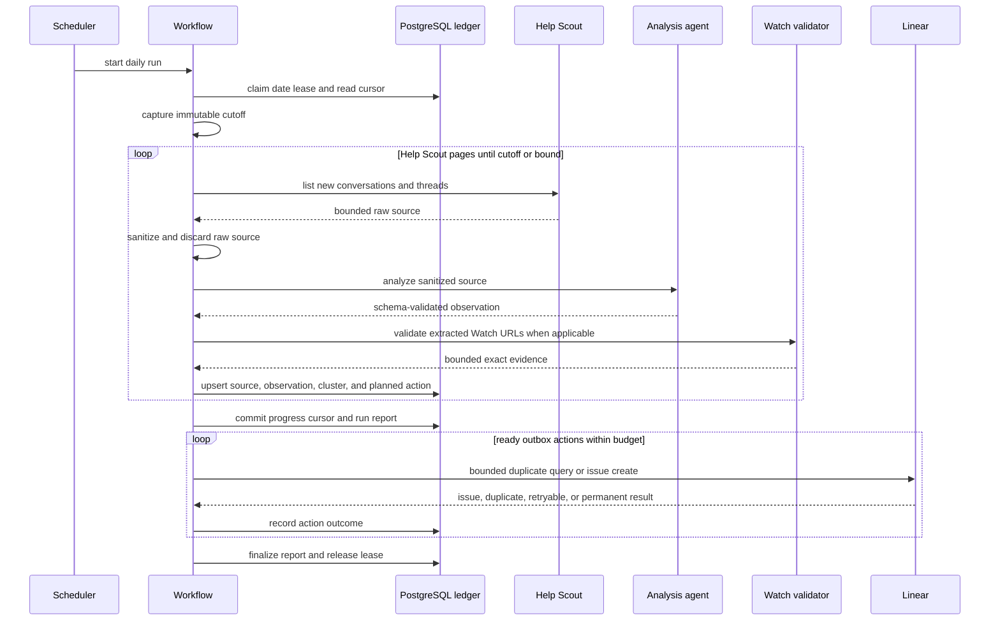
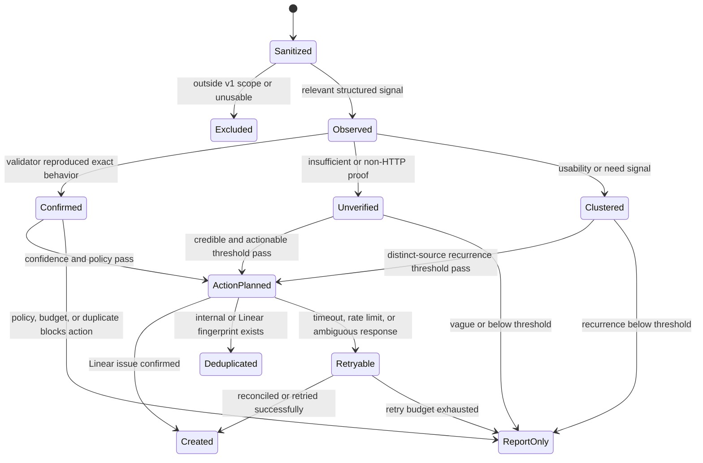

# feat: Add daily support and user research agent

## Summary

Add an opt-in Mastra agent and daily workflow that reads newly created Help Scout conversations, identifies feedback about the public Watch website and catalog experience, validates bug claims with bounded read-only checks, and turns trustworthy findings into deduplicated Linear issues plus a durable daily research report.

The first release is deliberately narrow. Help Scout is read-only, customer content is sanitized before model use or persistence, attachments are excluded, Linear writes are transparent and reversible, and no product code is changed automatically. Confirmed bugs become normal bug issues; credible but unverified reports become issues marked `Needs validation`; recurring actionable usability themes become improvement issues; the remaining observations stay in the daily report.

---

## Problem Frame

Support conversations contain product evidence, but today the evidence must be noticed, interpreted, reproduced, clustered, and translated into product work by a person. That delays bug discovery and leaves repeated confusion or unmet needs distributed across individual tickets. The support team also spends time on research and triage activities that can be bounded and performed by AI without allowing the system to act on customers' behalf.

The desired business outcome is greater support-team productivity and broader coverage of product feedback. The safe first implementation is an evidence pipeline, not an autonomous support representative: ingest new conversations, protect personal data, classify public Watch/catalog feedback, perform limited validation, preserve traceable observations, and propose or create well-scoped Linear work. Human support workflows and customer communication remain unchanged.

---

## Requirements

### Ingestion and scope

- R1. Run once per day on a fixed UTC schedule and support an operator-triggered Studio run using the same implementation.
- R2. Read every newly created Help Scout conversation from configured mailboxes between a durable cursor and a run cutoff, across all statuses and all API pages, without mutating Help Scout.
- R3. Sort ingestion by creation time, use a small overlap window, and combine a temporal high-water mark with unique source records so equal timestamps, cursor boundaries, retries, merged conversations, and overlapping runs neither lose nor duplicate conversations.
- R4. Bound conversations, pages, threads, characters, response bytes, and wall time per run. When a bound is reached, retain the backlog and advance only through the last durably processed source.
- R5. Include only feedback about the public Watch website and public catalog/media discovery experience in v1. Exclude Admin media-library operations, unrelated ministry requests, spam, and general support conversations.

### Privacy and model safety

- R6. Never download or pass attachments to the model in v1.
- R7. Remove HTML, quoted replies, signatures, email addresses, phone-like values, access tokens, and other direct identifiers before model use or persistence; preserve only bounded sanitized excerpts and deterministically extracted allowlisted Watch URLs.
- R8. Treat all customer content as untrusted data. It cannot modify agent instructions, select tools, introduce external URLs, or authorize side effects.
- R9. Never persist raw Help Scout message bodies or customer profiles. Logs, traces, errors, reports, and Linear descriptions must not contain secrets or unsanitized personal data.
- R26. Keep the capability disabled until the selected model provider, retention mode, and data-processing terms are approved for minimized support content. Sanitization reduces exposure but must not be represented as guaranteed anonymization.

### Analysis and validation

- R10. Produce schema-validated per-conversation observations containing relevance, feedback kind, affected surface, summary, expected and actual behavior when present, confidence, actionability, theme key, and validation recommendation.
- R11. Classify relevant signals as `bug`, `usability`, `need`, or `other`; classification must distinguish evidence quoted by the user from model inference.
- R12. Validate only allowlisted public Watch URLs using bounded read-only HTTP requests with redirect blocking, timeout and byte limits, exact incoming/status/final URL evidence, and safe page markers. Never submit forms, authenticate, or mutate a website.
- R13. A deterministic failed check can confirm only the behavior it directly observed. UI interaction, account state, device-specific, intermittent, or insufficiently specified claims remain unverified even when the model judges them credible.
- R14. Store each sanitized observation before deciding whether it deserves a Linear issue, and cluster observations using a stable product surface plus normalized theme fingerprint.

### Linear action policy

- R15. Create a normal Linear bug only when the reported behavior is directly reproduced by the bounded validator, classification confidence meets the configured threshold, and no existing action or recent Linear issue has the same fingerprint.
- R16. Create a Linear issue explicitly labeled and described as `Needs validation` when the report is relevant, specific, actionable, and credible above the configured threshold but cannot be directly reproduced by the allowed validator.
- R17. Create a Linear improvement issue for a usability or unmet-need cluster only after the configured number of distinct conversations within the rolling window and an actionability threshold are met.
- R18. Add an agent identity, source links, sanitized evidence, confidence, validation attempted, missing proof, fingerprint marker, and next human action to every generated issue. Never claim model inference as verified fact.
- R19. Use a durable action outbox and stable idempotency keys. Before a create retry, reconcile by fingerprint marker so a response-loss retry cannot create a duplicate issue.
- R20. Do not comment on, modify, close, prioritize, assign, or otherwise update existing Linear issues in v1. Do not create more than the configured product-action budget per UTC day or more than one daily summary.

### Reporting and operations

- R21. Persist one durable report for every completed, partial, disabled, or failed run with source counts, classification counts, validation outcomes, clusters, actions, backlog/cursor state, redaction counts, failures, and explicit evidence/inference labels.
- R22. When a run contains relevant findings, create one deduplicated daily summary issue in a configured rolling Linear support-insights project; keep the full report in PostgreSQL and the Linear summary concise.
- R23. Default the capability off. Missing or invalid Help Scout, Linear, mailbox, team, project, label, host, or budget configuration returns a typed disabled/configuration result and never prevents Mastra from booting.
- R24. Allow an operator dry run that performs ingestion, sanitization, analysis, validation, clustering, and reporting but suppresses every Linear mutation.
- R25. Expose enough structured telemetry to distinguish fetched, sanitized, relevant, validated, clustered, action-planned, action-created, deduplicated, deferred, capped, partial, and failed outcomes without logging raw content.

---

## Acceptance Examples

- AE1. Given three pages of new conversations in an allowlisted mailbox, when the daily workflow runs, then it reads all three pages and persists each source once before moving the cursor to the captured cutoff.
- AE2. Given the workflow stops after its configured conversation cap, when the report is written, then it is marked partial, the backlog count is visible, and the next run resumes after the last processed source rather than skipping to the original cutoff.
- AE3. Given a conversation contains a customer email, signature, quoted history, token-like text, attachment, and a Watch URL, when it reaches the agent, then only a bounded redacted excerpt and the normalized allowlisted Watch URL are present.
- AE4. Given a customer message instructs the agent to ignore its rules and create a high-priority ticket, when it is analyzed, then the text is treated only as feedback data and cannot select labels, priority, URLs, or side effects.
- AE5. Given a report says a Watch URL returns 404 and the validator observes 404 for that exact URL, when confidence is above threshold and no duplicate exists, then a normal bug issue is created with the exact check evidence.
- AE6. Given a report describes a broken playback control that a GET request cannot verify, when the report is specific, actionable, and above threshold, then an issue marked `Needs validation` may be created and states that the interaction was not reproduced.
- AE7. Given one vague statement that navigation is confusing, when no supporting cluster exists, then the observation appears in the daily report and no improvement issue is created.
- AE8. Given three distinct conversations within 30 days describe the same actionable language-selection confusion, when the cluster crosses threshold, then one deduplicated improvement issue is created with all three sanitized source links.
- AE9. Given Linear accepts a create mutation but the response is lost, when the outbox retries, then marker reconciliation finds the issue and records it instead of creating a second issue.
- AE10. Given Help Scout credentials, Linear credentials, or required routing IDs are missing, when Mastra starts and the schedule fires, then the runtime stays healthy and records a disabled/configuration outcome without external writes.
- AE11. Given two Mastra replicas start the same daily run, when both claim the run, then one receives the lease and the other exits as an already-running/no-op result.
- AE12. Given a dry run, when confirmed and inferred findings are produced, then the report contains proposed actions but Linear receives no mutation.

---

## Key Technical Decisions

| ID    | Decision                                                                                                                                                                                                      | Rationale                                                                                                                                                                                                                                                                                                                                                                                                                                                                      |
| ----- | ------------------------------------------------------------------------------------------------------------------------------------------------------------------------------------------------------------- | ------------------------------------------------------------------------------------------------------------------------------------------------------------------------------------------------------------------------------------------------------------------------------------------------------------------------------------------------------------------------------------------------------------------------------------------------------------------------------ |
| KTD1  | Implement the feature in `apps/mastra` as one dedicated analysis agent plus one scheduled workflow that owns orchestration.                                                                                   | The repo already registers agents and scheduled workflows in this runtime; keeping API, persistence, model, and reporting seams local avoids cross-app imports.                                                                                                                                                                                                                                                                                                                |
| KTD2  | Use Help Scout's OAuth client-credentials flow and reuse the bearer token until expiry or a 401, then query conversations with `status=all`, mailbox filters, a created-time window, and complete pagination. | Help Scout documents two-day access tokens, active-only defaults, time filters, and 25-item conversation pages; explicit token and pagination behavior prevents excess auth traffic and silent data loss ([authentication](https://developer.helpscout.com/mailbox-api/overview/authentication/), [conversations](https://developer.helpscout.com/mailbox-api/endpoints/conversations/list/), [pagination](https://developer.helpscout.com/mailbox-api/overview/pagination/)). |
| KTD3  | Fetch bounded conversation threads separately and never fetch attachment bytes.                                                                                                                               | Conversation listings do not contain the complete discussion; Help Scout thread bodies can contain customer data and attachments, so the client must paginate and sanitize them at the boundary ([threads](https://developer.helpscout.com/mailbox-api/endpoints/conversations/threads/list/)).                                                                                                                                                                                |
| KTD4  | Put a deterministic sanitizer before both the model and durable storage; pass only sanitized excerpts and allowlisted Watch URLs downstream.                                                                  | This makes privacy and prompt-injection controls code-enforced rather than prompt-dependent and prevents later reporters or clients from accidentally receiving raw support content.                                                                                                                                                                                                                                                                                           |
| KTD5  | Capture a run cutoff, request ascending creation-time order, process from a temporal high-water mark with overlap, and advance only through successfully persisted source records.                            | New conversations can arrive during pagination, multiple sources can share a timestamp, and a bounded run can end early; a fixed window plus source uniqueness makes ties, retries, and partial runs deterministic.                                                                                                                                                                                                                                                            |
| KTD6  | Use PostgreSQL as an Observation → Cluster → Action ledger with run leases, source uniqueness, fingerprints, reports, and an outbox.                                                                          | Durable intermediate evidence supports audit, aggregation, retries, and duplicate prevention across replicas without placing entire conversations in Mastra workflow state.                                                                                                                                                                                                                                                                                                    |
| KTD7  | Use one schema-constrained, tool-free analysis call per sanitized conversation and deterministic post-model policy.                                                                                           | A bounded call limits cross-ticket leakage and blast radius; code, not customer content or the model, controls thresholds, routing, and mutations.                                                                                                                                                                                                                                                                                                                             |
| KTD8  | Restrict automatic validation to exact allowlisted public Watch URLs with redirect disabled and response bounds.                                                                                              | This supplies useful HTTP evidence while preserving the existing SSRF and bearer-safety conventions. It does not overstate HTTP checks as proof of interactive or device-specific behavior.                                                                                                                                                                                                                                                                                    |
| KTD9  | Separate `confirmed` from `needs_validation` actions and encode the distinction in labels, descriptions, and report fields.                                                                                   | The user explicitly wants model judgment to surface credible unverified bugs, but operational truth requires the generated issue to state what was and was not reproduced.                                                                                                                                                                                                                                                                                                     |
| KTD10 | Deduplicate first against the internal ledger and then against a bounded recent Linear query using a hidden fingerprint marker.                                                                               | Internal uniqueness handles normal retries; external reconciliation handles a mutation accepted before the response was lost. Linear uses a GraphQL API whose HTTP response can contain mutation errors even with status 200 ([GraphQL](https://linear.app/developers/graphql), [pagination](https://linear.app/developers/pagination)).                                                                                                                                       |
| KTD11 | Create issues through a small typed raw GraphQL client instead of adding the Linear SDK.                                                                                                                      | The v1 contract needs bounded queries plus `issueCreate`; a local client follows the repo's one-service/result-union convention and avoids a broad dependency for a narrow surface.                                                                                                                                                                                                                                                                                            |
| KTD12 | Keep generated issues in the configured team's normal intake state and attach the configured project and labels; do not let the agent set urgency or ownership.                                               | Linear defaults new issues to triage or backlog and recommends transparent agent identity and human accountability ([GraphQL](https://linear.app/developers/graphql), [agent interaction guidelines](https://linear.app/developers/aig)).                                                                                                                                                                                                                                      |
| KTD13 | Apply per-run/per-day issue budgets and bounded filtered queries, and treat rate limits as retryable outbox failures.                                                                                         | Linear recommends filtered pagination and exposes `RATELIMITED`; budgets keep an upstream spike or model fault from flooding the team ([filtering](https://linear.app/developers/filtering), [rate limits](https://linear.app/developers/rate-limiting)).                                                                                                                                                                                                                      |
| KTD14 | Keep the entire capability default-off and configuration-tolerant at boot.                                                                                                                                    | External integrations must degrade at runtime when unprovisioned; rollout must be controlled independently of a Mastra deploy.                                                                                                                                                                                                                                                                                                                                                 |
| KTD15 | Treat Help Scout read-only behavior as a code capability boundary, not as an assumed OAuth scope.                                                                                                             | The v1 client exposes only token acquisition and allowlisted GET operations; no generic request or mailbox mutation method is reachable by the workflow, and tests reject other methods and paths.                                                                                                                                                                                                                                                                             |

---

## High-Level Technical Design

### Component and trust topology

```mermaid
flowchart LR
  Schedule["Daily Mastra schedule or Studio run"] --> Workflow["Support research workflow"]
  Workflow --> HelpScout["Read-only Help Scout client"]
  HelpScout --> Sanitize["Deterministic sanitizer and URL extractor"]
  Sanitize --> Agent["Tool-free support research agent"]
  Agent --> Policy["Deterministic classification and action policy"]
  Policy --> Validator["Allowlisted Watch validator"]
  Policy --> Ledger["PostgreSQL observation, cluster, report, and outbox ledger"]
  Validator --> Ledger
  Ledger --> Dispatcher["Budgeted Linear dispatcher"]
  Dispatcher --> Linear["Linear GraphQL API"]
  Ledger --> Report["Durable daily report"]

  Raw["Raw threads and customer identity"] -. "boundary only" .-> HelpScout
  HelpScout -. "never persist raw" .-> Sanitize
  Agent -. "no tools or side effects" .-> Policy
```

Only the Help Scout client and sanitizer may handle raw thread bodies, and only in memory for the duration of one bounded source. The model receives sanitized text. The validator receives code-extracted allowlisted URLs, not model-selected targets. Linear receives only policy-approved, sanitized evidence from the durable ledger.

### Daily run and cursor sequence

The workflow persists progress incrementally. A run that reaches a cap or loses an upstream dependency can finish `partial`; its report is durable and its cursor stops at the last committed source.

### Observation and action lifecycle

---

## Data Contracts

### Run

A run has a stable daily or operator idempotency key, immutable cutoff, temporal start/progress cursor, lease owner/expiry, dry-run flag, status, bounded counters, configuration fingerprint, and final report. `complete` means the captured window was processed; `partial` means progress was safely persisted but backlog remains; `disabled` and `failed` are explicit outcomes rather than missing reports. Equal-timestamp sources are replayed inside the overlap and deduplicated by source ID rather than ordered by ID.

### Observation

An observation stores a source fingerprint, Help Scout conversation ID and agent-safe web link, surface, feedback kind, sanitized summary/excerpt, extracted Watch URLs, expected/actual behavior, confidence, actionability, validation state/evidence, theme key, distinct-source count, first/last seen timestamps, and evidence/inference fields. It stores no customer name, email, full body, thread payload, or attachment metadata.

### Action

An action has a stable fingerprint and type (`confirmed_bug`, `needs_validation`, `ux_improvement`, `daily_summary`), policy decision, proposed title/description, configured team/project/label routing, outbox state, attempt count, retry time, Linear issue ID/URL, and terminal result. Description generation is deterministic from ledger fields; the model does not directly author GraphQL input or choose identifiers.

### Report

The report contains totals and grouped findings, not a transcript. Each item distinguishes user-reported evidence, automated validation evidence, and model inference. It also records caps, backlog, redaction counts, upstream failures, action budgets, duplicates, proposed dry-run actions, created issue URLs, and next operator actions.

---

## Implementation Units

### U1. Establish opt-in configuration, roadmap, and durable schema

- **Goal:** Create the safe runtime boundary and persistent ledger required before any external read or write.
- **Requirements:** R1, R3-R4, R14, R19, R21, R23-R26; AE2, AE9-AE12
- **Dependencies:** None
- **Files:** `docs/roadmap/platform/feat-326-daily-support-user-research-agent.md`, `docs/roadmap/README.md`, `apps/mastra/.env.example`, `apps/mastra/src/config/env.ts`, `apps/mastra/src/config/env.test.ts`, `apps/mastra/migrations/002-support-research.sql`, `apps/mastra/src/scripts/migrate-mastra-database.ts`, `apps/mastra/src/scripts/migrate-mastra-database.test.ts`, `apps/mastra/src/scripts/migrate-devotional-database.ts`, `apps/mastra/package.json`, `apps/mastra/src/services/support-research/schema.ts`, `apps/mastra/src/services/support-research/repository.ts`, `apps/mastra/src/services/support-research/repository.test.ts`
- **Approach:** Add default-off integration configuration with optional secrets, strict URL/host and positive-bound parsing, immutable default thresholds, approved-provider/retention readiness diagnostics, and no secret-value reporting. Extract the existing numbered/checksummed behavior into a generic Mastra migrator and retain the devotional script/command as a compatibility wrapper so deployed operations and imports do not break. Add constrained tables for runs, cursors, observations, source links, clusters, reports, and outbox actions. Use database uniqueness for daily run keys, source identity, cluster fingerprints, and action idempotency; use an expiring atomic lease for multi-replica execution. Add bounded retention that removes expired sanitized excerpts and report detail while retaining minimal fingerprints and external action identity needed for deduplication.
- **Patterns to follow:** Existing `env.ts` optional integration behavior; `migrate-devotional-database.ts` checksum/advisory-lock behavior; `docs/solutions/database-issues/db-lock-must-be-atomic-update-not-select-for-update.md`.
- **Test scenarios:**
  1. Unset configuration parses, Mastra can boot, and readiness reports `disabled` without revealing which secret values were supplied.
  2. Enabled configuration rejects non-HTTPS API URLs, disallowed hosts, missing routing IDs, non-positive timeouts/budgets, or unbounded values.
  3. Migration applies after `001`, preserves checksum drift protection, and a renamed generic entrypoint applies the same immutable migration set.
  4. Two claimants for the same date/run key produce one active lease; an expired lease can be reclaimed and a live lease cannot.
  5. Duplicate source and action fingerprints are idempotent; a changed payload cannot silently reuse an idempotency key.
  6. A partial run advances only to its last persisted creation timestamp; equal-timestamp replay is deduplicated, while complete and disabled outcomes retain their exact cutoff and counters.
  7. Retention removes expired sanitized text/report detail but preserves source/action fingerprints and Linear identity; a retention failure cannot delete live outbox work.
- **Verification:** Focused repository tests prove constraints, atomic claims, cursor progress, report persistence, and outbox retry state before API clients are introduced.

### U2. Build the read-only Help Scout boundary and sanitizer

- **Goal:** Fetch the complete bounded source window while ensuring raw customer content cannot cross the ingestion boundary.
- **Requirements:** R2-R9, R25-R26; AE1-AE4
- **Dependencies:** U1
- **Files:** `apps/mastra/src/services/support-research/help-scout-client.ts`, `apps/mastra/src/services/support-research/help-scout-client.test.ts`, `apps/mastra/src/services/support-research/sanitize-support-content.ts`, `apps/mastra/src/services/support-research/sanitize-support-content.test.ts`, `apps/mastra/src/services/support-research/ingest-support-conversations.ts`, `apps/mastra/src/services/support-research/ingest-support-conversations.test.ts`
- **Approach:** Implement a single-service client with injected fetch, token caching, one refresh on 401, timeout/byte limits, redirect errors, additive-tolerant response schemas, explicit page traversal, an allowlist of GET-only resource paths, and a typed no-throw result union. Query the captured created-time window in ascending order with `status=all` and configured mailboxes, then page threads. A merged-conversation redirect is not followed automatically: accept only a same-origin, expected conversation-target location, record the alias, and refetch by validated target ID; a deleted/not-found source becomes a terminal excluded record so it cannot jam the cursor. Stream each source through HTML-to-text normalization, quoted-history/signature removal, identifier/token redaction, allowlisted URL extraction, per-thread/per-conversation truncation, and attachment omission; immediately release raw fields. Source IDs and Help Scout web links remain traceability metadata, not model content.
- **Patterns to follow:** `docs/solutions/conventions/single-service-http-client-result-union-convention.md`; bounded-response services under `apps/mastra/src/services`; outbound timeout and redirect protections.
- **Test scenarios:**
  1. Token acquisition is reused until expiry; a 401 refreshes once; auth, 429, timeout, malformed JSON, oversized body, and GraphQL-like unexpected payloads map to typed safe failures.
  2. Conversation and thread pagination follows every page inside bounds and never calls a Help Scout mutation endpoint.
  3. Mailbox, status, created-time start/end, cutoff, and page parameters are URL-encoded and stable; a new source arriving after cutoff is deferred.
  4. HTML, quotes, signatures, emails, phones, tokens, control text, and oversized content are removed or redacted; attachment bytes and metadata never reach sanitized output.
  5. Only configured public Watch hosts survive URL extraction; credentials, localhost, private IPs, alternate ports, and lookalike hosts are rejected.
  6. Replayed overlap sources upsert once, and a cap persists a resumable last-source cursor with a partial reason.
  7. A same-origin merged-conversation location is validated and aliased, while off-origin redirects fail closed and deleted sources become report-visible terminal exclusions instead of blocking every future run.
- **Verification:** Fixtures demonstrate that raw PII markers and attachment fields are absent from model inputs, repository calls, telemetry, and error serialization.

### U3. Add the constrained research agent and Watch validator

- **Goal:** Convert one sanitized conversation into a traceable observation and gather only evidence the first-release validator can honestly prove.
- **Requirements:** R5, R8-R14; AE4-AE7
- **Dependencies:** U2
- **Files:** `apps/mastra/src/mastra/agents/support-research-agent.ts`, `apps/mastra/src/mastra/agents/support-research-agent.test.ts`, `apps/mastra/src/services/support-research/analyze-support-conversation.ts`, `apps/mastra/src/services/support-research/analyze-support-conversation.test.ts`, `apps/mastra/src/services/support-research/watch-validator.ts`, `apps/mastra/src/services/support-research/watch-validator.test.ts`
- **Approach:** Register a tool-free agent with instructions that delimit untrusted feedback, require evidence/inference separation, and return one strict bounded schema. Validate agent output again in the service, normalize surface/theme keys deterministically, and reject unsupported categories or URLs. The validator uses injected fetch and configured exact hosts, HTTPS/default port, redirect rejection, timeout/body bounds, content-type checks, and non-mutating requests. It records incoming URL, observed status, same URL/final URL, selected safe markers, and failure reason. Policy maps only direct observed contradictions to `confirmed`; all interactive or ambiguous claims remain `unverified`.
- **Patterns to follow:** Existing `Agent` registration in `apps/mastra/src/mastra/agents/web-research-agent.ts`; structured output in `multi-step-draft.ts`; SSRF and bounded-response conventions.
- **Test scenarios:**
  1. Public Watch/catalog bug, usability, unmet-need, unrelated, Admin-media-library, spam, and ambiguous fixtures map to the correct schema and v1 scope.
  2. Prompt-injection text cannot alter output schema, supported surfaces, confidence bounds, URLs, labels, or requested actions.
  3. Malformed/oversized model output, unknown enums, missing evidence, or unsupported URLs fails safely into report-only analysis failure without external writes.
  4. Exact 404, 5xx, wrong canonical destination, and missing expected safe marker can be recorded as direct HTTP evidence; successful page retrieval cannot confirm a playback-control or device bug.
  5. Redirects, DNS/private-host attempts, credentialed URLs, alternate ports, non-HTML bodies, byte overflow, timeout, and network failure are blocked and remain unverified.
  6. Agent calls receive sanitized excerpts only and cannot invoke tools.
- **Verification:** Tests prove that the normal-bug path requires deterministic evidence and that every other credible claim retains an explicit missing-proof explanation.

### U4. Cluster observations and dispatch deduplicated Linear actions

- **Goal:** Turn isolated evidence into controlled product work without flooding or overstating findings.
- **Requirements:** R14-R20, R22-R25; AE5-AE9, AE12
- **Dependencies:** U1, U3
- **Files:** `apps/mastra/src/services/support-research/action-policy.ts`, `apps/mastra/src/services/support-research/action-policy.test.ts`, `apps/mastra/src/services/support-research/linear-client.ts`, `apps/mastra/src/services/support-research/linear-client.test.ts`, `apps/mastra/src/services/support-research/linear-dispatcher.ts`, `apps/mastra/src/services/support-research/linear-dispatcher.test.ts`, `apps/mastra/src/services/support-research/daily-report.ts`, `apps/mastra/src/services/support-research/daily-report.test.ts`
- **Approach:** Aggregate distinct conversations by stable surface/theme fingerprint over the configured window. Apply deterministic action rules after persistence: confirmed bug, credible needs-validation bug, recurrence-gated improvement, or report-only. Render titles/descriptions from bounded fields and configured routing; include the agent disclosure and fingerprint marker. Build a typed GraphQL client with HTTP and GraphQL error handling, timeout/byte limits, redirect rejection, rate-limit metadata, bounded Relay pagination, and injected fetch. The dispatcher atomically claims outbox actions, checks local identity, queries recent project/team issues for the marker, creates only within budget, and stores accepted IDs. Dry runs render proposed actions without enqueueing live mutations.
- **Patterns to follow:** Single-service result-union convention; outbox/atomic-lock learnings; Linear's documented `issueCreate`, filters, pagination, and rate-limit response behavior.
- **Test scenarios:**
  1. Confirmed high-confidence evidence creates the configured normal bug action; credible non-HTTP evidence creates `Needs validation`; low-confidence or vague evidence remains report-only.
  2. One or two usability sources remain report-only; the configured third distinct source in the rolling window produces one improvement action; replay and repeated mentions do not inflate distinct-source count.
  3. Generated descriptions distinguish report, automated evidence, and inference, contain only sanitized source links/excerpts, and never set priority or assignee.
  4. Internal duplicate, recent Linear marker match, and accepted-response-loss retry all resolve to one recorded issue.
  5. HTTP 200 with GraphQL errors, 401/403, validation errors, 429/rate limit, timeout, response overflow, and malformed payloads produce typed permanent, retryable, or ambiguous outcomes without duplicate creation.
  6. Per-run and per-day budgets defer excess actions; concurrent dispatchers cannot both claim one action; dry run performs zero mutations.
  7. Daily summary creation is project-linked, date/fingerprint deduplicated, concise, and skipped when no relevant finding exists.
- **Verification:** Contract tests inspect exact GraphQL operation classes and sanitized variables, while repository assertions prove at-most-once durable action identity.

### U5. Compose and register the daily workflow

- **Goal:** Run the whole pipeline once daily, expose it safely in Studio, and produce an inspectable result for every outcome.
- **Requirements:** R1-R26; AE1-AE12
- **Dependencies:** U1-U4
- **Files:** `apps/mastra/src/mastra/workflows/daily-support-research.ts`, `apps/mastra/src/mastra/workflows/daily-support-research.test.ts`, `apps/mastra/src/mastra/index.ts`, `apps/mastra/src/mastra/support-research-registration.test.ts`
- **Approach:** Define a scheduled workflow with a small operator input (`dryRun`, optional bounded source limit, optional idempotency key) and a bounded result schema. A run checks readiness, claims its lease, captures cutoff, drains due retryable outbox actions within the current budget, ingests and persists each source, invokes analysis/validation, updates clusters and planned actions, commits progress, dispatches newly due work, creates the summary when needed, performs bounded retention, and finalizes the report in `finally`-equivalent paths. Dependency factories keep external clients and time injectable. Register both agent and workflow in Mastra. Schedule once daily in UTC and ensure disabled configuration returns a successful typed no-op rather than raising at import or boot.
- **Patterns to follow:** Scheduled workflow configuration and schedule-contract tests in `youtube-ai-christian-discovery.ts`; dependency factories in existing Mastra workflow tests; prompt-body redaction already registered in `mastra/index.ts`.
- **Test scenarios:**
  1. Schedule configuration resolves to one run per day in UTC and agent/workflow registration is present without changing existing registrations.
  2. The disabled path performs no Help Scout, model, validator, or Linear call and returns a durable disabled report.
  3. A complete multi-page run advances to cutoff and returns created/deduplicated/report-only counts and issue links.
  4. A source cap or retryable Help Scout failure after progress finalizes partial state and does not skip the unprocessed window.
  5. A model failure for one source records a per-source error and continues within error budget; systemic failure stops safely and retains prior progress.
  6. Linear failure cannot roll back observations/cursor progress; it leaves retryable outbox actions and a report-visible failure.
  7. Same daily key and overlapping replicas run once; operator dry-run keys are independently idempotent and never mutate Linear.
  8. Report/result payloads stay within defined bounds even with maximum observations and errors.
  9. Retryable outbox work from an earlier run is drained without re-ingesting its Help Scout source, and terminal retry exhaustion is visible in the current report.
- **Verification:** A workflow-level test executes the real pipeline with fake HTTP/model/clock dependencies and proves end-to-end ordering, persistence, no Help Scout mutations, and fail-safe reporting.

### U6. Document rollout, prove the release, and close the roadmap unit

- **Goal:** Make provisioning, privacy review, staged enablement, monitoring, rollback, and future-source expansion operationally explicit.
- **Requirements:** R1-R26
- **Dependencies:** U1-U5
- **Files:** `apps/mastra/AGENTS.md`, `apps/mastra/CLAUDE.md`, `docs/runbooks/support-research-agent.md`, `docs/roadmap/platform/feat-326-daily-support-user-research-agent.md`, `docs/roadmap/README.md`, `docs/solutions/ai-agents/support-research-evidence-pipeline.md`
- **Approach:** Document Help Scout credential/mailbox constraints and GET-only compensating controls, Linear service identity/routing, migration-before-enable order, model-provider data-processing approval, default thresholds/retention, dry-run inspection, telemetry, prompt/privacy review, action-budget alerts, stale lease/outbox recovery, disable switch, token rotation, and rollback. Roll out through the normal PR-to-main path: migrate schema, deploy disabled, provision secrets, approve the provider/retention boundary, run a bounded dry run, audit redaction and classification samples, enable with a low issue budget, then raise only after measured precision. Record durable implementation learnings and complete the roadmap ticket only after focused tests, lint, typecheck, build, and an operator-visible Studio workflow smoke pass.
- **Patterns to follow:** `apps/mastra/CLAUDE.md` operations guidance; normal Railway PR deployment boundary; existing runbooks and `docs/solutions/` frontmatter conventions.
- **Test scenarios:**
  1. Runbook covers credential scope/rotation, migration, dry run, enable, disable, rollback, lease recovery, outbox reconciliation, rate limits, budgets, and privacy incident response.
  2. A release checklist proves raw customer data and attachments are absent from fixtures, logs, traces, reports, database rows, and Linear variables.
  3. Build and registration smoke show the workflow and agent in authenticated Studio; a dry run displays disabled/complete/partial states without browser-facing application changes.
  4. Roadmap status changes from `in-progress` to `complete` only after evidence is recorded and its generated index is current.
- **Verification:** Package tests, typecheck, lint, build, Studio smoke, review findings, and rollout evidence are recorded in the roadmap and PR.

---

## System-Wide Impact

### Interaction graph

- Mastra schedule or Studio operator → workflow readiness and run lease → Help Scout read client → sanitizer → analysis agent → Watch validator → PostgreSQL ledger → Linear dispatcher → daily report.
- Failure in Help Scout stops or partially completes ingestion without Linear work for unpersisted sources.
- Failure in the model or validator remains attached to one source unless the configured systemic error budget is crossed.
- Failure in Linear leaves observations and reports durable and actions retryable; it never rolls the source cursor backward or re-reads Help Scout solely to recreate an action.

### Error propagation

- Configuration failures become `disabled` reports.
- Auth/permission/schema failures become actionable permanent integration errors and stop that integration path.
- Timeout, 429, and transient upstream failures become bounded partial/retryable states.
- Ambiguous Linear mutations enter reconciliation before retry.
- Privacy/sanitization invariant failures fail closed before model or persistence.
- Report finalization is attempted for every claimed run and contains safe structured error codes rather than raw upstream bodies.

### State lifecycle risks

- A captured cutoff prevents a moving ingestion window; overlap plus unique source identity protects the time boundary.
- Run leases and action claims must be atomic updates, not read-then-write locks.
- Observation fingerprints are versioned so normalization-policy changes do not silently merge historical themes.
- Source and action records are append-oriented; correction records or new analysis versions supersede rather than rewriting the evidence trail.
- Retention must remove expired sanitized excerpts and obsolete reports without deleting Linear identity/fingerprint records required for deduplication.

### API and compatibility

- No public Forge API or GraphQL schema changes.
- Help Scout and Linear are outbound-only integrations from Mastra.
- Existing Mastra agents, workflows, storage, Studio authentication, and observability remain registered.
- All new environment values are optional at boot and the feature gate defaults off.

### Observability

- Metrics: run duration/status, cursor lag, source pages/count, sanitation/redaction count, relevant rate, model failure rate, validation distribution, clusters, proposed/created/deduped/deferred actions, outbox age/retries, Linear budget use, and report size.
- Logs/traces: run IDs, source hashes/IDs, fingerprints, safe error codes, counts, and upstream status classes only; no prompt bodies, raw excerpts, credentials, customer identity, or response bodies.
- Alerts: cursor lag beyond threshold, repeated auth/config failures, stuck lease, old retryable outbox action, action-budget exhaustion, unexpected issue-volume spike, or sanitization invariant failure.

---

## Assumptions

These choices are implementation defaults because the user explicitly requested planning and implementation without further questions. They are configurable and documented rather than embedded as product claims.

- A1. “Master” refers to the Forge Mastra application, and the repository's remote default branch is `main`.
- A2. The schedule runs at `05:00 UTC` daily. Operators can run the same workflow manually from authenticated Studio.
- A3. Relevant public hosts start with explicitly configured production Watch hostnames; no host is inferred from ticket text.
- A4. A normal confirmed bug requires direct validator evidence and classification confidence at least `0.85`.
- A5. A `Needs validation` bug requires relevant, specific, actionable model judgment with confidence at least `0.85` even though the bounded validator cannot reproduce it.
- A6. A usability/need improvement requires at least `3` distinct Help Scout conversations in `30` days and actionability at least `0.80`.
- A7. The default run processes at most `200` conversations, `20` threads per conversation, and `12,000` sanitized characters per conversation, with stricter per-response byte and timeout bounds in each client.
- A8. The initial live action budget is `5` product issues plus `1` daily summary per UTC day; dry run is used before enabling live writes.
- A9. The configured Linear project is the rolling support-insights project. V1 creates a dated summary issue in that project rather than relying on an undocumented project-update mutation.
- A10. Support source links are safe for internal Linear viewers; sanitized excerpts are still minimized because issue visibility may be broader than Help Scout mailbox visibility.
- A11. Product code fixes, customer replies, Help Scout tags/notes/assignment/status changes, browser automation, and automatic prioritization remain human-controlled.
- A12. Five consecutive source-analysis failures stop the run as partial; isolated failures remain report-visible and do not prevent processing the next source.
- A13. Retryable Linear actions use capped exponential backoff, are reconsidered on each daily run, and become terminal/report-only after five failed attempts or seven days unless an operator reconciles them.
- A14. Sanitized excerpts and detailed daily reports default to 90-day retention. Minimal source/action fingerprints and Linear identity remain for duplicate prevention; operators can choose a shorter approved duration before enablement.

---

## First-Release Measures

The rollout must establish a baseline instead of claiming productivity gains from issue volume alone. For the first two live weeks, review a sample of every generated action and record confirmed-bug precision, `Needs validation` usefulness, duplicate rate, privacy violations, cursor freshness, issue-budget deferrals, and support-team triage time spent on the same work. Do not raise budgets or add sources unless privacy violations and duplicate creations remain zero and the support/product owners judge the generated actions materially useful. A lower-volume report-only outcome is preferable to inflated ticket production.

---

## Risks and Mitigations

| Risk                                                                                         | Mitigation                                                                                                                                                                                           |
| -------------------------------------------------------------------------------------------- | ---------------------------------------------------------------------------------------------------------------------------------------------------------------------------------------------------- |
| Customer PII or sensitive ministry content reaches the model, database, logs, or Linear.     | Code-enforced sanitizer before model/persistence, attachment exclusion, minimized excerpts, prompt-body redaction, safe error/result unions, invariant tests, retention policy, staged sample audit. |
| Prompt injection turns feedback into agent instructions or arbitrary network/Linear actions. | Tool-free agent, delimited untrusted input, deterministic URL extraction and host allowlist, code-owned policy/routing/thresholds, no model-authored GraphQL.                                        |
| A moving Help Scout window or cap skips tickets.                                             | Captured cutoff, complete pagination, overlap, unique source keys, incremental progress cursor, partial reports and cursor-lag alert.                                                                |
| Duplicate Linear issues appear after retries or concurrent replicas.                         | Run lease, source/action database uniqueness, outbox claim, marker reconciliation, bounded recent query, ambiguous-response state.                                                                   |
| Model misclassification floods Linear or presents inference as fact.                         | High thresholds, recurrence gate, explicit validation states, configured labels, agent disclosure, issue budgets, default-off staged rollout, no priority/assignee.                                  |
| HTTP validation is mistaken for browser or user-flow proof.                                  | Narrow confirmation contract and exact evidence; interactive, account, device, intermittent, and underspecified claims stay `Needs validation` or report-only.                                       |
| External failures break Mastra boot or lose observations.                                    | Optional configuration and runtime readiness, typed failures, durable ledger before action, partial run semantics, retryable outbox.                                                                 |
| Daily report becomes another unreviewed noise source.                                        | Concise summary issue only for relevant findings, clustered themes, action links, explicit backlog/failure state, and one rolling configured project.                                                |
| Long-term sanitized data becomes unnecessary retained customer content.                      | Store minimal excerpts, add configurable retention, keep non-content fingerprints/action identities for dedupe, and document deletion/reanalysis behavior.                                           |

---

## Rollout and Rollback

1. Apply the new immutable database migration using the generalized Mastra migrator.
2. Deploy through the normal PR-to-main Railway flow with the feature disabled.
3. Provision least-privilege Help Scout read credentials, exact mailbox IDs, Linear service identity, team/project/label IDs, and exact Watch host allowlist.
4. Run a small dry run and inspect sanitation, relevance, validation truthfulness, clusters, report size, cursor state, and proposed issue text.
5. Run a full-window dry run with live production pagination but no Linear mutations; resolve privacy or precision findings.
6. Enable live mode with the initial low action budget and monitor issue accuracy, duplicates, cursor lag, outbox age, and support-team usefulness.
7. Increase limits only after measured precision and team review; do not add new sources or Help Scout mutations under the v1 flag.

Rollback is the feature gate: disable new scheduled processing and Linear dispatch without removing the workflow or deleting evidence. Retryable outbox actions stay visible and are either reconciled or explicitly canceled by an operator. Database migration rollback is not required for service health; tables remain inert while the capability is disabled.

---

## Deferred Scope

- Beta tester form and general feedback form ingestion. Add each as a source adapter only after its ownership, authentication, cursor, retention, and deletion contracts are documented.
- Admin media-library feedback and operational support.
- Help Scout replies, notes, tags, assignments, status changes, or automated customer follow-up.
- Browser/device reproduction, authenticated Watch flows, synthetic user accounts, screenshots, or session replay.
- Automatic code changes, pull requests, deployments, Linear priority/assignment/state changes, or customer-facing release promises.
- Cross-source identity resolution, sentiment scoring, individual customer profiling, or support-agent performance evaluation.
- Backfilling the historical Help Scout corpus. V1 starts at an explicit deployment cursor or bounded operator-provided lookback.

---

## Resolved During Planning

- The public Watch website/catalog is the first-release surface; Admin media library is excluded.
- Help Scout is read-only.
- Directly reproduced high-confidence bugs create normal bug issues.
- Credible specific reports that cannot be reproduced by the bounded validator may create issues marked `Needs validation`.
- Usability and unmet-need observations are preserved individually and become improvement issues only after recurrence/actionability thresholds.
- Every run produces a durable report; relevant runs also create one concise, deduplicated Linear summary in a rolling project.
- The business goal is maximum safe AI coverage of repeatable support research and triage, while customer communication, product changes, and prioritization remain outside v1.

---

## Sources

- [Help Scout Mailbox API authentication](https://developer.helpscout.com/mailbox-api/overview/authentication/)
- [Help Scout list conversations](https://developer.helpscout.com/mailbox-api/endpoints/conversations/list/)
- [Help Scout pagination](https://developer.helpscout.com/mailbox-api/overview/pagination/)
- [Help Scout list threads](https://developer.helpscout.com/mailbox-api/endpoints/conversations/threads/list/)
- [Linear GraphQL API](https://linear.app/developers/graphql)
- [Linear pagination](https://linear.app/developers/pagination)
- [Linear filtering](https://linear.app/developers/filtering)
- [Linear rate limits](https://linear.app/developers/rate-limiting)
- [Linear agent interaction guidelines](https://linear.app/developers/aig)
- `apps/mastra/AGENTS.md`
- `apps/mastra/CLAUDE.md`
- `apps/mastra/src/mastra/index.ts`
- `apps/mastra/src/mastra/workflows/youtube-ai-christian-discovery.ts`
- `docs/solutions/conventions/single-service-http-client-result-union-convention.md`
- `docs/solutions/best-practices/outbound-timeout-shorter-than-caller-budget-20260506.md`
- `docs/solutions/security-issues/ssrf-defense-streaming-proxy-and-codeql-fp-20260504.md`
- `docs/solutions/database-issues/db-lock-must-be-atomic-update-not-select-for-update.md`
