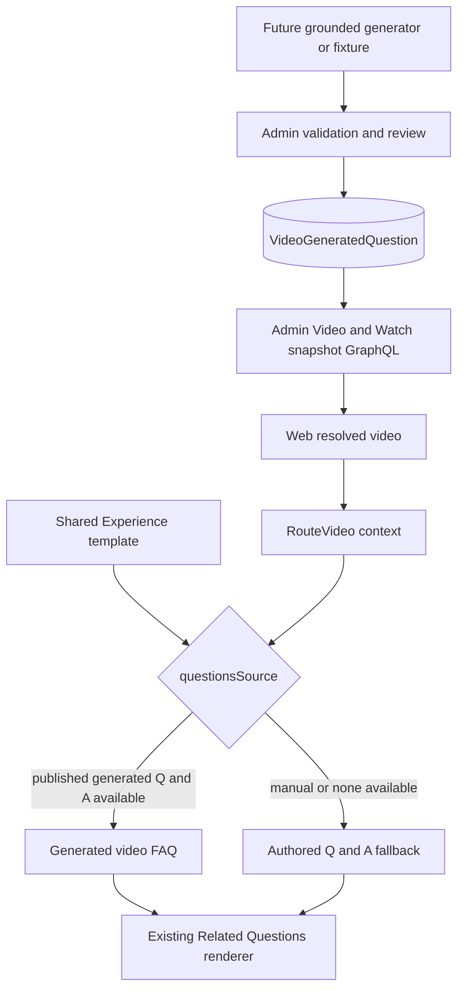
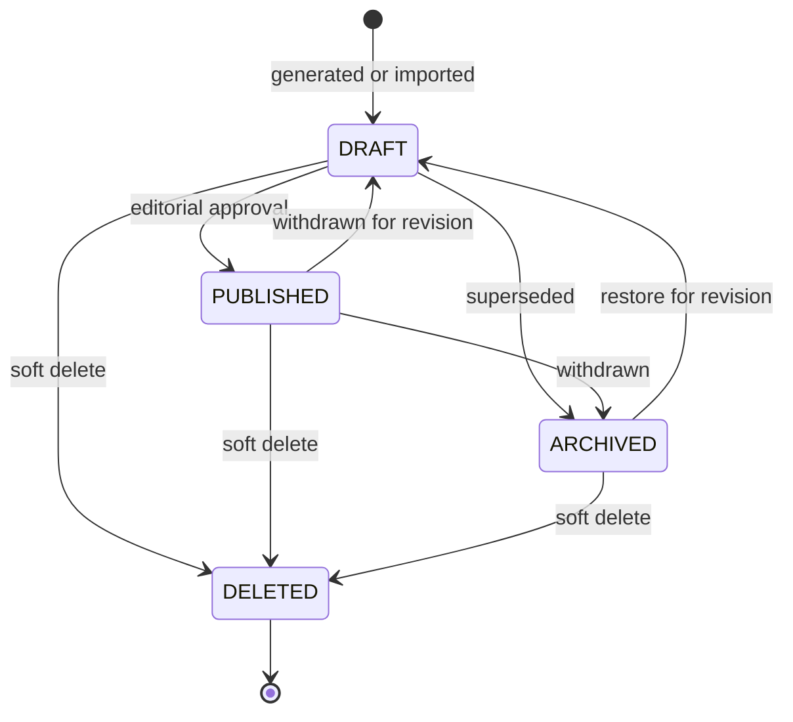

# Route-aware generated questions in the shared single-video Experience

## Summary

Add a published, localized per-video generated-Q&A read model and an explicit route-video source for Related Questions. One shared single-video Experience will load the current video's generated FAQ items by video ID and use its authored Q&A unchanged when no published generated items exist.

---

## Problem Frame

The shared default Experience now appends promotional copy, a Related Questions block, and follow-up CTAs to ordinary standalone and episode video pages. Its Related Questions content is authored once, so every page currently shows the same FAQ.

The resolved video already carries Core-sourced study-question prompts, but those prompts have no answers and are already displayed in the generated Watch body. Admin's video-anchored AI flow can compose grounded question-and-answer pairs, yet the accepted output only lives inside an authored Experience and has no reusable per-video published read model. Loading the existing study prompts into the new footer FAQ would duplicate the current page and would not deliver previously generated AI Q&A.

This change creates the missing read boundary: generated FAQ items can be stored once per video and locale, reviewed before publication, and selected by the shared template at render time. Generation and catalog backfill remain separate writers that can adopt the contract later.

---

## Requirements

**Generated FAQ data**

- R1. Admin stores localized generated question-and-answer pairs against a video with ordering, publication state, soft deletion, generation provenance, and a required trace to the grounding study question.
- R2. Public and consumer reads return only published, non-deleted generated FAQ items, while authorized editors can inspect draft items through the same Admin-owned boundary.
- R3. Generated FAQ lookup supports the Watch route's exact locale and language, broader locale, and English fallback ordering without changing the existing Core study-question contract.
- R4. The schema addition is additive and requires no production backfill for safe deployment.

**Block contract and authoring**

- R5. Related Questions supports an authored source and an explicit route-video generated-question source, with authored behavior remaining the default for existing blocks.
- R6. Admin exposes the source through its GraphQL block contract and provides an editor-visible route-bound Related Questions template with authored fallback Q&A.
- R7. Route-only generated-question blocks remain identifiable in the editor and are removed when route-only content is stripped from a non-template Experience.

**Watch rendering**

- R8. A route-bound Related Questions block renders the current video's published generated Q&A on standalone and episode pages without creating a per-video Experience.
- R9. If no published generated Q&A survives locale selection, or route context is unavailable, the block renders its authored Q&A fallback unchanged.
- R10. Manual Related Questions blocks on explicit Experiences and other surfaces retain their current questions, answers, CTA, styling, and disclosure behavior.
- R11. Resolving generated Q&A performs no browser-side Admin fetch and no runtime AI generation.

**Local demonstration and compatibility**

- R12. Local Web fixtures include distinct published generated Q&A for at least two videos, leave one video without generated Q&A, and configure the shared template FAQ for route-video sourcing with authored fallback content.
- R13. The generated single-video sections, canonical player, built-in study-question area, Bible content, sharing, and follow-up CTA blocks remain unchanged.

---

## Assumptions

- “Previously generated questions” means persisted question-and-answer output from a video-grounded generation workflow, not the existing Core `VideoStudyQuestion` prompt rows.
- No production writer or backfill is part of this change. Production pages use authored fallback until a later reviewed generation workflow publishes rows through the new contract.
- Generated answers are public only after an explicit published state; generation alone must not make model output visible.
- The route-aware FAQ supplements the built-in study-question area rather than replacing it, preserving the append-only single-video template rule.

---

## Key Technical Decisions

- KTD1. Add a dedicated `VideoGeneratedQuestion` model rather than adding answers to `VideoStudyQuestion`. Core sync owns the study-question rows, while generated answers need separate provenance, editorial lifecycle, and replacement semantics. Each generated row retains the grounding study-question identity so a later writer can enforce the existing no-invented-question rule.
- KTD2. Store normalized Q&A rows rather than a generated Experience per video. The shared template remains the layout authority, and later generators can replace or publish FAQ data without cloning page structure.
- KTD3. Add a `questionsSource` mode to the existing Related Questions block instead of introducing a template-only renderer. This follows the established route-source pattern and preserves manual blocks by default.
- KTD4. Carry published generated Q&A on the existing `RouteVideo` render context. Top-level and nested render paths can use one data injection mechanism without section-key conventions or client fetches.
- KTD5. Treat the block's authored `questions` as an atomic fallback. Generated and authored lists are not mixed, avoiding inconsistent tone and ambiguous partial-data ordering.
- KTD6. Keep the initial migration additive and empty. A missing writer or unpopulated production table results in fallback content, not route failure or blank UI.

The separate model costs one relation and one read path, but it avoids making Core-owned rows partially Admin-owned. A JSON block cache on `VideoLocale` was rejected because it would hide publication and provenance at item level, complicate replacement, and duplicate the canonical Related Questions block shape. Querying generated Experience JSON by embedded video ID was rejected because Experiences have no reliable one-to-one video ownership and JSON search would make fallback and locale selection ambiguous.

---

## High-Level Technical Design

The persistence model owns localized generated content and review state. Admin exposes it on both the general Video shape and the optimized Watch snapshot so current route resolution keeps its single server-side fetch boundary. Web normalizes the selected generated rows into the existing route context, and Related Questions chooses the full generated list or the full authored fallback list.

### Publication lifecycle

Public Watch reads include only non-deleted `PUBLISHED` rows. The additive migration creates no visible content by itself, so deployment and later generation/backfill can be sequenced independently.

---

## Key Flows

- F1. Route video has published generated Q&A
  - **Trigger:** A standalone or episode page renders the shared template.
  - **Actors:** Admin snapshot resolver, Watch route renderer, viewer.
  - **Steps:** Admin selects localized published items for the video; Web includes them in route context; the route-bound FAQ renders them in stored order.
  - **Outcome:** Different videos show different grounded FAQ content from one shared Experience.
  - **Covered by:** R2, R3, R8, R11, R13
- F2. Route video has no eligible generated Q&A
  - **Trigger:** The video has no rows, only draft/deleted rows, or no rows in the selected fallback chain.
  - **Actors:** Admin snapshot resolver, Experience renderer, viewer.
  - **Steps:** Admin returns an empty generated list; the renderer selects the block's authored Q&A without merging partial content.
  - **Outcome:** The supplemental FAQ remains useful and the page does not fail or disappear.
  - **Covered by:** R4, R9, R12
- F3. Manual Related Questions block
  - **Trigger:** An explicit Experience or shared block uses the authored source.
  - **Actors:** Admin editor, Experience renderer, viewer.
  - **Steps:** The renderer ignores route generated Q&A and uses the authored list.
  - **Outcome:** Existing Experiences do not change.
  - **Covered by:** R5, R10
- F4. Editor creates a route-bound FAQ
  - **Trigger:** An editor adds the route generated-questions variant to a template.
  - **Actors:** Admin editor.
  - **Steps:** The editor creates the route-bound variant, sees its route identity, and edits the authored fallback Q&A in the same block.
  - **Outcome:** The common template is configured once without per-video page authoring.
  - **Covered by:** R6, R7, R12
- F5. Generated FAQ query or data is invalid
  - **Trigger:** A row is unpublished, soft-deleted, blank, or the generated-data selection is empty.
  - **Actors:** Admin validation and resolver, Web renderer.
  - **Steps:** Invalid or non-public rows do not enter the public payload; an empty eligible result takes the authored fallback path.
  - **Outcome:** Unreviewed or malformed AI content does not leak to the viewer.
  - **Covered by:** R1, R2, R9

---

## Acceptance Examples

- AE1. **Covers R8, R12.** Given two fixture videos with different published generated Q&A and the same shared template, when each video page renders, then both the questions and expanded answers differ by video while the promo and CTA blocks remain shared.
- AE2. **Covers R2, R9.** Given a video with only draft or soft-deleted generated rows, when the public page renders, then none of those rows appear and the authored fallback Q&A renders.
- AE3. **Covers R3.** Given exact-language, broad-locale, and English generated rows, when a localized Watch route resolves, then it uses the same exact-to-broad-to-English precedence as other localized video content and does not combine tiers.
- AE4. **Covers R10.** Given a manual Related Questions block on an explicit Experience, when route-video context is present or absent, then its authored Q&A renders unchanged.
- AE5. **Covers R11, R13.** Given a route-bound FAQ on an ordinary video page, when the page renders, then no additional client request, runtime model call, or player block is introduced and existing generated sections retain their order.
- AE6. **Covers R4, R9.** Given the new table is empty immediately after migration, when any existing video page renders, then the shared authored fallback appears and the route stays healthy.

---

## Success Criteria

- One published shared template renders different generated question-and-answer pairs for two video IDs without any per-video Experience rows.
- A video with zero eligible generated rows renders the authored fallback without an error, blank section, mixed locale list, or client-side request.
- Draft, archived, soft-deleted, and blank generated rows never enter the public Watch payload; the required grounding relation prevents ungrounded rows from being created.
- The optimized Watch snapshot remains the single Admin request for ordinary video route content, and the browser payload contains only the selected generated list.

---

## Implementation Units

### U1. Track the route-generated FAQ follow-up

- **Goal:** Add the next topic-experiences roadmap item for this scope and mark it in progress before code changes.
- **Files:** `docs/roadmap/topic-experiences/feat-323-watch-route-video-generated-questions.md`, `docs/roadmap/README.md`
- **Requirements:** R1-R13
- **Verification:** Roadmap identifiers remain unique and the index entry matches the ticket metadata.

### U2. Add the generated-question persistence model

- **Goal:** Add the localized per-video generated Q&A model, review lifecycle, provenance fields, and query indexes through an additive migration.
- **Files:** `apps/admin/prisma/schema.prisma`, `apps/admin/prisma/migrations/0047_video_generated_questions/migration.sql`
- **Requirements:** R1-R4
- **Patterns:** Follow `LocaleStatus`, localized video identity, and `VideoSceneLocale` generation-provenance conventions while keeping generated rows separate from Core-synced study questions.
- **Test scenarios:** Empty-table migration is valid; draft and published rows can coexist; soft-deleted rows remain auditable; grounding study-question identity is retained; indexes cover video-plus-locale public reads.
- **Verification:** Prisma validation and Admin typecheck accept the schema; migration SQL is additive and has a clear rollback boundary before any writer is enabled.

### U3. Expose published generated Q&A through Admin

- **Goal:** Add locale-aware loaders, Video GraphQL fields, and Watch snapshot buckets for generated Q&A with public visibility filtering.
- **Files:** `apps/admin/src/graphql/loaders.ts`, `apps/admin/src/graphql/loaders.test.ts`, `apps/admin/src/graphql/types/video.ts`, `apps/admin/src/graphql/types/video.principal-filter.test.ts`, `apps/admin/src/graphql/schema.test.ts`, `apps/admin/src/services/video.service.ts`, `apps/admin/src/services/video.service.test.ts`, `apps/admin/schema.graphql`, `packages/admin-graphql/src/admin-graphql-env.d.ts`
- **Requirements:** R2-R4, R11
- **Patterns:** Mirror existing study-question locale buckets, preserve query passthrough, and filter publication based on the established consumer/editor visibility boundary.
- **Test scenarios:** Exact, broad, and English buckets remain separate; consumer reads omit draft, archived, deleted, and blank items; the required grounding relation prevents ungrounded records; editor reads can inspect non-deleted drafts; empty results serialize as an empty list.
- **Verification:** Focused loader/service/schema tests pass and both committed GraphQL artifacts regenerate without drift.

### U4. Add the Related Questions route source contract

- **Goal:** Extend Related Questions with a backward-compatible generated-question source and make the route-bound variant authorable.
- **Files:** `apps/admin/src/domain/blocks.ts`, `apps/admin/src/domain/blocks.test.ts`, `apps/admin/src/graphql/types/blocks.ts`, `apps/admin/src/graphql/types/blocks.test.ts`, `packages/admin-graphql/src/fragments/blocks/related-questions.ts`, `apps/admin/src/app/dashboard/experiences/experience-editor/block-helpers.ts`, `apps/admin/src/app/dashboard/experiences/experience-editor.tsx`, `apps/admin/src/app/dashboard/experiences/experience-editor.test.tsx`
- **Requirements:** R5-R7, R10
- **Patterns:** Follow existing route Video and route Video Carousel library variants; keep authored Q&A editable as fallback.
- **Test scenarios:** Missing source defaults to authored; both source values validate and appear in GraphQL; the route variant creates fallback items and a visible route badge; manual Questions remains unchanged; route-only cleanup recognizes the new variant.
- **Verification:** Focused block, GraphQL, and editor tests pass.

### U5. Normalize generated Q&A into Web route context

- **Goal:** Fetch and normalize generated Q&A on both Watch video query paths and pass the current route context into appended Experience blocks.
- **Files:** `apps/web/src/lib/fragments/watch-video.ts`, `apps/web/src/lib/content.ts`, `apps/web/src/lib/content.test.ts`, `apps/web/src/app/[locale]/[htmlLang]/[...rest]/page.tsx`, `apps/web/src/app/[locale]/[htmlLang]/[...rest]/__tests__/page-routing.test.tsx`, `apps/web/src/components/watch/WatchPageClient.tsx`, `apps/web/src/components/watch/WatchSectionRenderer.tsx`, `apps/web/src/components/watch/__tests__/WatchSectionRenderer.test.tsx`
- **Requirements:** R3, R8, R11, R13
- **Patterns:** Extend the existing server-resolved `RouteVideo` context and optimized Watch snapshot instead of adding a client action or a second query.
- **Test scenarios:** Standalone and episode routes carry the selected generated list; locale tiers do not mix; Experience blocks receive route context; the generated synthetic block order remains unchanged.
- **Verification:** Focused fragment, resolver, route, and Watch renderer tests pass without a new browser request.

### U6. Render generated Q&A with atomic fallback

- **Goal:** Let Related Questions select published route Q&A when configured and fall back to authored Q&A when unavailable.
- **Files:** `apps/web/src/components/sections/RelatedQuestions.tsx`, `apps/web/src/components/sections/RelatedQuestions.test.tsx`, `apps/web/src/components/sections/index.tsx`, `apps/web/src/components/sections/Section.tsx`, `apps/web/src/components/sections/Container.tsx`
- **Requirements:** R8-R10
- **Patterns:** Preserve the current disclosure semantics, markdown answers, CTA behavior, and nested route-context propagation.
- **Test scenarios:** Generated Q&A wins when present; empty route data falls back; missing route context falls back; manual source ignores generated data; route navigation resets stale expanded state; nested render paths pass context.
- **Verification:** Focused Web component and section-dispatch tests pass, including keyboard and disclosure assertions.

### U7. Seed a complete local example

- **Goal:** Seed distinct published generated Q&A and opt the shared fixture FAQ into route sourcing while retaining its generic authored fallback.
- **Files:** `apps/admin/src/scripts/web-fixtures.json`, `apps/admin/src/scripts/seed-web-fixtures.ts`, `apps/admin/src/scripts/seed-web-fixtures.test.ts`
- **Requirements:** R1, R2, R9, R12
- **Patterns:** Keep the fixture seeder idempotent with deterministic generated-question identities and derive locale/language identity from the existing language map.
- **Test scenarios:** Generated items seed once, reruns update without duplication, two videos carry different Q&A, a third has none, and the template retains authored fallback Q&A.
- **Verification:** Focused fixture tests and a local migration/reseed prove deterministic data.

### U8. Validate the end-to-end behavior

- **Goal:** Verify data visibility, types, schema, rendering, performance posture, and browser behavior for the complete change.
- **Files:** All files changed by U1-U7
- **Requirements:** R1-R13
- **Test scenarios:** Two fixture routes show different generated Q&A; a no-data route shows authored fallback; draft and deleted rows never render; an explicit Experience keeps manual Q&A; the page player and generated sections remain intact.
- **Verification:** Targeted tests, Prisma and GraphQL drift checks, Admin and Web typechecks/lints, and desktop/mobile browser smoke with screenshots, network inspection, and console inspection.

---

## System-Wide Impact

- **Data lifecycle:** Generated FAQ content becomes a first-class Admin-owned localized entity with draft, publication, archival, withdrawal, and soft-delete states. Its grounding reference remains attached for audit even when the source study question is later soft-deleted.
- **API contract:** Admin's Video and Watch snapshot public shapes gain generated-question fields; consumers remain backward compatible because the additions are nullable or list-valued.
- **Caching:** Generated rows travel through the existing video snapshot and video cache tags. A later writer must emit the normal video revalidation event after publish, withdrawal, or replacement.
- **Performance:** The Watch snapshot adds one indexed per-video localized relation. The client payload contains only the selected published Q&A list, not all locale tiers.
- **Trust:** Public output requires publication; provenance stays Admin-owned and can support later editorial review and regeneration decisions.

---

## Risks and Mitigations

- **No current production writer:** The new table will initially be empty outside fixtures. Authored fallback makes deployment independently safe; production value arrives when a later generation/backfill workflow publishes rows.
- **Unreviewed AI output exposure:** A generator could write drafts, but consumer resolvers must exclude draft, archived, deleted, and blank rows until a valid grounded set is published. The required study-question relation rejects ungrounded rows at persistence time, and tests cover the remaining exclusions.
- **Locale drift:** Generated Q&A could exist in English while the video plays in another language. Reuse the Watch exact-to-broad-to-English selection and select one tier atomically so mixed-language lists never appear.
- **Payload and query cost:** Loading all generated locale rows would widen the optimized snapshot. Query only the requested locale plus English, use a composite public-read index, and prune non-selected tiers before the client boundary.
- **Duplicate generated sets:** The read model permits replacement history, so a future writer must archive or soft-delete superseded published rows transactionally. This change orders all eligible rows deterministically but does not define writer replacement policy.
- **Schema rollout ordering:** Admin must deploy the additive migration before code reads the table. No Web behavior depends on populated rows because authored fallback remains available.

---

## Operational Notes

- Deploy the Admin migration and schema/read changes before or with Web; do not enable a generated-question writer first.
- The initial production verification should confirm the table can be empty without GraphQL or Watch errors and that authored fallback renders.
- Any later generation or backfill workflow must publish through an Admin service, retain provenance, replace a video's active set transactionally, and trigger existing video cache invalidation.
- Rollback before a writer exists is code-first: stop reading the new field and retain the additive table for audit. Dropping generated data is not part of routine rollback.
- Publish, withdrawal, archival, and deletion writers must emit the existing `video` revalidation event so Web's video, series, child-language, and home tags expire together.

---

## Scope Boundaries

### Deferred to Follow-Up Work

- Automatic AI generation, scheduler integration, bulk production backfill, and regeneration policy.
- Admin review and publish UI for generated FAQ rows beyond the GraphQL/editor visibility needed to verify the read model.
- Transactional replacement service for a future writer and provenance presentation to editors.

### Out of Scope

- No runtime AI or Mastra call on a public Watch request.
- No per-video Experience and no cloning of the shared template.
- No mutation of Core-owned `VideoStudyQuestion` rows.
- No replacement or removal of the built-in Watch body study-question surface.
- No attachment to series landing pages or non-Web clients.

---

## Sources and Research

- `docs/roadmap/topic-experiences/feat-322-watch-single-video-shared-experience-template.md` establishes the shared append-only template and defers route-aware generated content.
- `docs/roadmap/topic-experiences/feat-049-single-video-template-related-media-collection.md` establishes explicit route-data source modes with fail-soft rendering.
- `docs/solutions/best-practices/watch-single-video-template-pages-strapi-nextjs-2026-04-11.md` records route-context injection and authoring-validation patterns.
- `docs/brainstorms/2026-06-22-video-anchored-experience-generation-requirements.md` requires generated FAQ items to be grounded in real study questions and reviewed before public use.
- `apps/admin/src/app/dashboard/experiences/generate-section-action.ts` confirms current generated Q&A is staged into an Experience rather than persisted as reusable per-video data.
- `apps/admin/prisma/schema.prisma` confirms `VideoStudyQuestion` stores Core-sourced localized prompts without generated answers.
- `apps/admin/src/services/video.service.ts` provides the optimized exact, broad, and English Watch snapshot bucket pattern.
