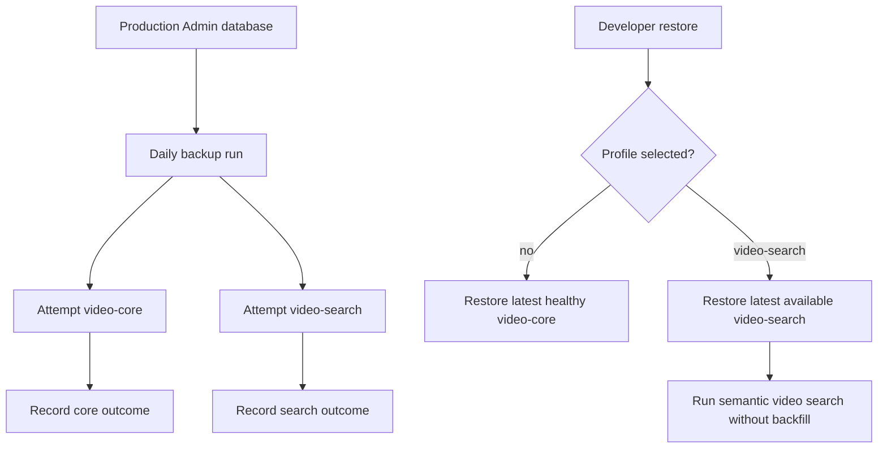
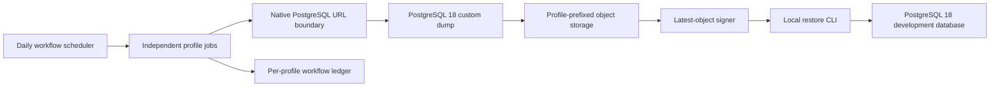
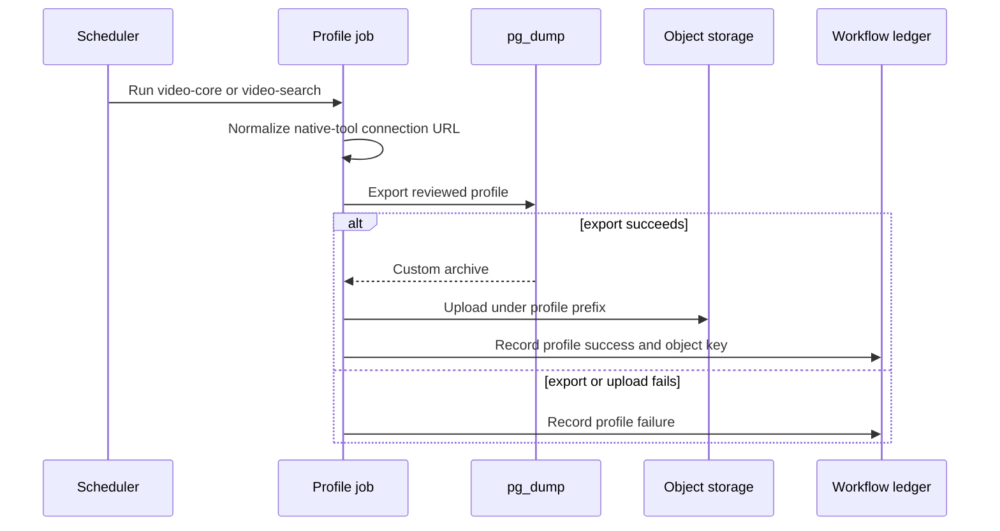
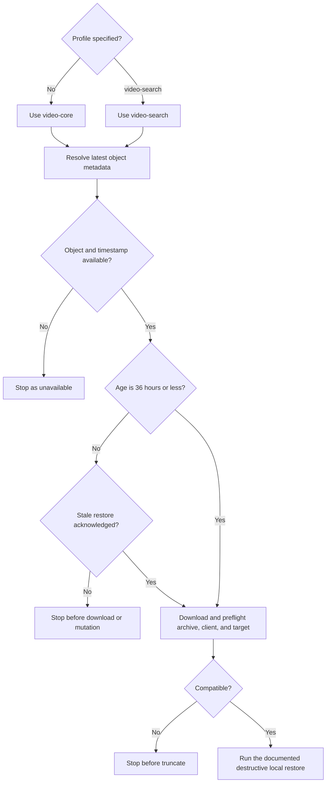

# Reliable Video Search Snapshots - Plan

## Goal Capsule

- **Objective:** Make the existing production video snapshot capability reliably publish both the lightweight catalog profile and the embedding-bearing search profile so local semantic video search does not require an Embedding Backfill.
- **Authority order:** Product Contract > Key Technical Decisions > Implementation Units.
- **Execution profile:** Code change delivered through the repository's normal pull-request-to-main path and normal production deployment automation.
- **Tail owner:** `ce-work` owns implementation, local verification, PR delivery, merge readiness, and the post-merge production smoke evidence defined by this plan.
- **Stop conditions:** Do not generate or backfill embeddings, add an embedding-readiness gate, run a destructive production restore, or use a manual production deployment path. Stop if a supported PostgreSQL 18 restore cannot be established without changing the Product Contract.
- **Open blockers:** None.

---

## Product Contract

### Summary

Restore and harden the existing two-profile scheduled snapshot capability so developers can optionally populate local development with the production video catalog and its Content Embeddings without generating embeddings locally.

### Problem Frame

Production already contains the transcript chunks and Content Embeddings needed for semantic video search, but the scheduled backup path is not producing a usable `video-search` artifact. The current production export attempts fail before upload because application-specific database connection options reach the native export client unchanged. Object storage therefore contains only older `video-core` artifacts and no `video-search` artifact.

The verified failure is at the database-client boundary, not in embedding generation or profile selection. The scheduler resolves `SOURCE_DATABASE_URL ?? DATABASE_URL`, passes that value unchanged to `pg_dump --dbname`, and receives `invalid URI query parameter: "connection_limit"`. Because libpq rejects the Prisma-only option before connecting, the command exits before any profile tables are read and before the upload step. The same path is shared by both scheduled profiles, which explains why both currently fail despite `video-search` already including the embedding-bearing tables.

A stored dump alone is not sufficient. Developers must be able to distinguish a fresh snapshot from a stale one, and the supported local PostgreSQL environment must be compatible with the production dump format. Otherwise local setup still requires manual database work or an expensive Embedding Backfill.

### Key Decisions

- **Keep two scheduled snapshot products with a lightweight default.** (session-settled: user-directed — chosen over one universal embedded snapshot: preserve the fast default while making semantic-search data available on demand) Governs R1, R2, R3, R9, R10.
- **Repair the existing snapshot capability.** (session-settled: user-approved — chosen over a parallel backup design: the repository already models the intended profile split) Governs R1, R4, R5, R9, R10.
- **Do not add an embedding-readiness gate.** (session-settled: user-directed — chosen over validating embedded rows before publication: this snapshot workflow should export production data as it exists) Governs R3, R6.
- **Treat end-to-end restore as the finish line.** (session-settled: user-approved — chosen over export-only success: a stored file is not useful unless it is fresh and restorable) Governs R4, R7, R8, R11, R12.
- **Require acknowledgement for snapshots older than 36 hours.** (session-settled: user-approved — chosen over warning-only stale restores: stale production data must not be consumed accidentally) Governs R7, R8, R10.

### Actors

- A1. **Developer:** Restores production-like video data into a local Admin database for catalog or semantic-search development.
- A2. **Backup runner:** Creates, stores, and reports scheduled profile artifacts from the production Admin database.
- A3. **Maintainer:** Reviews backup freshness and availability, and diagnoses a profile-specific failure without treating another profile's success as proof that both succeeded.

### Requirements

**Scheduled snapshot products**

- R1. The production schedule must attempt independently identifiable `video-core` and `video-search` artifacts on the established daily cadence.
- R2. `video-core` must contain the production-like video catalog and reference data while excluding the scene and transcript data used for semantic search.
- R3. `video-search` must extend the core catalog with the stored scene, transcript, Transcript Chunk, Content Embedding, and Embedding Provenance data needed to exercise local semantic video search without an Embedding Backfill.

**Reliability and availability**

- R4. Every scheduled run must report a separate success or failure outcome for each scheduled profile so one profile cannot mask the state of the other.
- R5. The native backup operation must receive a libpq-compatible source connection even when Admin's application database URL contains Prisma-only options such as `connection_limit` or `pool_timeout`; supported PostgreSQL connection semantics must be preserved for both scheduled profiles.
- R6. Publishing `video-search` must not require a separate Content Embedding completeness or provenance gate beyond successfully exporting the reviewed profile.
- R7. A missing artifact must be reported as unavailable, and an artifact older than 36 hours must be classified as stale rather than presented as a healthy latest snapshot.
- R8. Artifact freshness and availability must be visible before destructive local restore work begins, and restoring a stale latest artifact must require explicit acknowledgement.

**Local development**

- R9. Invoking the local snapshot restore without an explicit profile must select `video-core`.
- R10. A developer must be able to select `video-search` explicitly and restore the latest available artifact for that profile.
- R11. The supported local database environment and restore tooling must accept the production snapshot format and complete the selected restore end to end.
- R12. A successful `video-search` restore must provide enough catalog, transcript, Transcript Chunk, and vector data to run local semantic video search without invoking local embedding generation.

### Key Flows

- F1. **Scheduled publication**
  - **Trigger:** The established daily backup cadence fires.
  - **Actors:** A2, A3
  - **Steps:** The runner attempts both scheduled profiles, evaluates each outcome independently, publishes successful exports, and exposes freshness and availability per profile.
  - **Outcome:** Maintainers can tell whether each profile has a current usable artifact.
  - **Covered by:** R1, R4, R5, R6, R7, R8
- F2. **Default local catalog restore**
  - **Trigger:** A developer invokes the local snapshot restore without selecting a profile.
  - **Actors:** A1
  - **Steps:** The restore resolves the latest healthy `video-core` artifact, exposes any freshness issue, and restores it into the supported local database environment.
  - **Outcome:** The developer gets production-like catalog data through the lightweight default path.
  - **Covered by:** R2, R7, R8, R9, R11
- F3. **Opt-in local semantic-search restore**
  - **Trigger:** A developer explicitly selects `video-search`.
  - **Actors:** A1
  - **Steps:** The restore resolves the latest available `video-search` artifact, verifies compatibility before destructive work, and restores the embedding-bearing data.
  - **Outcome:** The developer can exercise semantic video search without running an Embedding Backfill.
  - **Covered by:** R3, R6, R7, R8, R10, R11, R12

### Acceptance Examples

- AE1. **Covers R2, R9.** Given healthy artifacts for both scheduled profiles, when a developer restores without specifying a profile, then the restore selects `video-core` and does not imply that embedding-bearing data is present.
- AE2. **Covers R3, R6, R10, R11, R12.** Given a fresh `video-search` artifact, when a developer selects that profile, then the restored database contains the production Transcript Chunks and Content Embeddings and local semantic video search works without a backfill.
- AE3. **Covers R1, R4, R5.** Given a production application database URL containing `connection_limit`, `pool_timeout`, and supported PostgreSQL connection options, when the daily backup runs, then Prisma-only options do not reach `pg_dump`, supported connection semantics remain effective, and both profile attempts report their own outcomes.
- AE4. **Covers R4, R7.** Given `video-core` succeeds while `video-search` fails, when the run completes, then core remains successful, search is visibly failed, and no new search artifact is presented as healthy.
- AE5. **Covers R7, R8, R10.** Given the newest `video-search` object is older than 36 hours, when a developer resolves the latest artifact without acknowledging staleness, then its age is explicit and restore stops before download or database mutation; acknowledging staleness permits the intentional historical restore.
- AE6. **Covers R11.** Given a snapshot produced by the production PostgreSQL version, when a developer follows the supported local restore path, then compatibility is established before destructive work and the restore completes against a compatible target.

### Success Criteria

- A production scheduled run creates new independently reported artifacts for both `video-core` and `video-search`.
- The published `video-search` artifact restores the profile's production transcript, Transcript Chunk, Content Embedding, and Embedding Provenance data without a separate publication gate.
- Clean local environments can restore either profile through the documented selection behavior, and the search profile supports semantic video search without local embedding generation.
- Missing, stale, and incompatible artifacts are distinguishable from a healthy latest artifact before restore.

### Scope Boundaries

- Content Embedding generation, Embedding Backfill behavior, Query Embeddings, search ranking, and relevance tuning are unchanged.
- No Content Embedding completeness or provenance gate is added to scheduled snapshot publication.
- `video-core` remains the default; the two scheduled products are not merged into one universal embedded snapshot.
- No new dashboard, arbitrary-table backup interface, or parallel snapshot mechanism is introduced.
- The unscheduled `video-full` profile, retention pruning, cross-application database snapshots, and non-video database data are outside this work.
- A `--with-embeddings` convenience alias is not required; the existing explicit profile selection remains the product contract.

### Dependencies and Assumptions

- The production Admin database remains the source of truth for snapshot contents, and backup access remains read-only.
- Production continues to own the Transcript Chunk embeddings and Embedding Provenance copied into the snapshot; snapshot creation does not repair or reclassify them.
- Profile-specific object storage has enough capacity for the larger `video-search` artifact; planning must measure its actual size and restore time before choosing operational guardrails.
- The supported local PostgreSQL major version must remain compatible with production-generated dumps; the current development sidecar mismatch is part of the restore-compatibility requirement.

### Outstanding Questions

**Deferred to Implementation**

- The first completed production `video-search` export establishes artifact size even if upload fails; the first successful publication and restore add upload and restore durations used to decide whether multipart upload, retention, cadence, or additional storage controls need follow-up work.

### Sources and Research

- `apps/admin/src/scripts/video-db-backup.ts` defines the reviewed profiles, defaults restore selection to `video-core`, schedules `video-core` and `video-search`, and currently passes the application database URL directly to the native backup client.
- `apps/admin/src/services/video-db-backup/job.ts` records per-profile workflow results and iterates the scheduled profiles independently.
- `apps/admin/src/scripts/video-db-backup.test.ts` verifies the profile manifests and raw URL forwarding only with a query-free test URL; service and workflow tests mock the backup runner, so the native-client URI parser is not exercised.
- `docs/roadmap/platform/feat-255-admin-video-search-backup-snapshot.md` establishes the original requirement to keep core backups and publish a `video-search` artifact for local semantic-search testing.
- `docs/plans/2026-05-13-001-feat-admin-video-db-backup-clone-plan.md` records the existing reviewed-profile, automated-backup, explicit-restore design.
- `docs/solutions/developer-experience/admin-prod-video-snapshot-local-restore-20260521.md` already documents both incompatibilities encountered by the native tools: Prisma-only URI parameters are rejected by `psql`, and a PostgreSQL 18 dump cannot be restored reliably with PostgreSQL 16 tooling.
- `.devcontainer/docker-compose.yml` currently configures a PostgreSQL 16 pgvector sidecar, while production and its backup tooling use PostgreSQL 18.
- Production read-only inspection on 2026-08-02 found 280,107 Transcript Chunks and 280,107 embedded chunks with consistent 1,536-dimension provenance, but object storage contained no `video-search` dump and the latest `video-core` dump was dated 2026-07-06.
- Production backup logs inspected on 2026-08-02 showed both scheduled exports failing because the native backup client rejected the application-only `connection_limit` URI parameter.
- A local command-level reproduction on 2026-08-02 confirmed that PostgreSQL 18 `pg_dump` rejects a URI containing `connection_limit` before attempting a network connection, while a URI using the supported `connect_timeout` option proceeds to the connection attempt.
- Git history traces the unchanged raw-URL handoff to the original May 2026 backup implementation; the July 2026 change added `video-search` to the schedule but did not introduce the connection handling defect. No repository issue or pull request currently tracks this exact failure.
- PostgreSQL 18 libpq connection documentation defines URI query keys as libpq connection parameters, while Prisma's PostgreSQL documentation identifies application-only URL options including `connection_limit`, `pool_timeout`, and `schema`.

**Product Contract preservation:** The confirmed brainstorm scope and stable IDs are preserved. The only behavioral refinement is the user-approved 36-hour stale-restore policy that resolves the previously deferred freshness question.

---

## Planning Contract

### Key Technical Decisions

- KTD1. Normalize a `postgres:` or `postgresql:` URL once, immediately after source or target environment precedence is resolved, by removing the reviewed Prisma-only query keys and preserving credentials, libpq-supported parameters, and unknown parameters. Store the normalized value in the snapshot plan so every native command uses the same boundary representation. Unknown keys remain visible to native-client validation so configuration mistakes are not silently hidden. This implements R5 without creating a general database URL abstraction.
- KTD2. Apply KTD1 to both explicit source or target URLs and the shared `DATABASE_URL` fallback for backup and restore. (session-settled: user-approved — chosen over a production-only environment override: one boundary contract prevents local restore from retaining the same defect) Covers R5 and R11.
- KTD3. Paginate the complete profile prefix, then use one pure video-snapshot freshness classifier for direct storage and signer discovery, returning timestamp and evaluation metadata without deciding user intent. The restore CLI owns acknowledgement enforcement and stops before a signed or direct download when an object exceeds the R7 threshold. No object is a deliberate not-found state; an object with unusable freshness metadata is an unavailable-metadata state, and neither yields a signed URL. (session-settled: user-approved — chosen over warning-only output: the user confirmed an enforced 36-hour policy) Covers R7, R8, and R10.
- KTD4. Before the existing destructive local restore path, validate archive readability, selected-profile table-data identity, target schema and pgvector prerequisites, and PostgreSQL 18 compatibility. Preserve production-target protection and the existing import transaction, while documenting that the preceding truncate is not part of that transaction. Failure-atomic slice replacement, dependency-closure discovery, and concurrent-restore locking are separate restore-hardening work rather than prerequisites for repairing scheduled snapshots. Covers R8, R11, and R12.
- KTD5. Restore the repository's previously accepted PostgreSQL 18 development architecture after its later merge regression: the PGDG PostgreSQL 18 client, `pgvector/pgvector:pg18`, and a PostgreSQL 18 data-directory volume. Do not change production builder configuration because production already runs the required PostgreSQL 18 native tools. Covers R11.
- KTD6. Keep the existing single-object upload and profile prefixes for the first repaired publication, but record the completed dump's byte size before upload so failure still produces cost and capacity evidence. Record export duration, upload duration, and restore duration, then calculate the incremental Railway run rate before deciding multipart upload, retention, or cadence changes. (session-settled: user-approved — chosen over speculative multipart upload and retention work: measurement should determine whether those controls are necessary) Covers R1, R3, R4, and R12.
- KTD7. Verify publication through independent production reads after the merged commit deploys to both Admin web and worker. Require a live scheduler, correlate each successful per-profile ledger result to its exact nonzero object key and run window, require the signer to resolve that same search key as fresh, and restore it into a pristine PostgreSQL 18 target. Covers R1, R4, R7, R11, and R12.

### High-Level Technical Design

These diagrams are directional. They show boundaries and ordering, not exact functions or command syntax.

**Scheduled publication components and data stages**

**Backup protocol**

**Latest restore decision flow**

### System-Wide Impact

- **Configuration boundary:** Scheduled backup and local restore continue to accept the established environment variables, but native tools receive a normalized representation. Printed plans must continue to redact credentials.
- **Artifact lifecycle:** Both profiles keep their current prefixes and cadence. Freshness classification affects discovery and restore authorization, not object retention.
- **Failure propagation:** URL parsing, missing metadata, stale acknowledgement, archive and profile inspection, and target compatibility fail before database mutation. The existing truncate and import remain separate transaction boundaries; per-profile production job failures remain independent in the workflow ledger.
- **Temporary-data boundary:** Scheduler-generated exports and restore-latest downloads contain production data. Generated paths use owner-only access and are deleted after every upload or restore attempt, including partial failures; an explicitly supplied developer path remains developer-owned.
- **Development environment:** Re-establishing PostgreSQL 18 may require a fresh local database volume when an existing PostgreSQL 16 volume cannot be opened by the new server. Documentation must call out the recoverable local reset path without deleting unrelated volumes.
- **Production rollout:** The merge uses normal deployment automation. Verification observes both Admin web and worker revisions, scheduler liveness, the workflow ledger, and object storage rather than treating application logs alone as proof.

### Sequencing and Constraints

1. Establish a tracked roadmap item and characterize the current URL, freshness, and restore ordering behavior.
2. Repair the native connection boundary before changing availability or compatibility behavior.
3. Add freshness enforcement and restore safety independently, then align the development environment.
4. Complete local gates, review, documentation, and PR delivery before normal production deployment.
5. Treat the next successful scheduled publication and a clean opt-in restore as the production smoke finish line.

- Backup access to production remains read-only.
- No manual production backup endpoint, arbitrary operator export command, or break-glass deployment is added for smoke testing.
- If the next scheduled cadence is required to prove publication, verification waits for that cadence instead of bypassing the scheduler.
- A merged PR, a healthy deployment, and a completed smoke are separate states. Tail ownership continues until the first eligible scheduled run and pristine search restore succeed.

### Risks and Mitigations

| Risk                                                                             | Mitigation                                                                                                                                                                            |
| -------------------------------------------------------------------------------- | ------------------------------------------------------------------------------------------------------------------------------------------------------------------------------------- |
| URL normalization strips a valid PostgreSQL option or hides a typo               | Remove only documented Prisma-only keys and preserve every other query key for native-client validation.                                                                              |
| A restore discovers archive or schema incompatibility only after truncation      | Validate archive identity, target schema, vector prerequisites, and PostgreSQL 18 compatibility first; continue to document that local restore is destructive and not failure-atomic. |
| Generated dumps remain on worker or developer filesystems                        | Use restrictive permissions and failure-safe cleanup for workflow-created and restore-latest files while preserving explicitly supplied developer paths.                              |
| PostgreSQL 18 container alignment cannot reuse a PostgreSQL 16 data directory    | Document an explicit local-only volume reset and resolve the exact scoped volume before any removal.                                                                                  |
| The search dump is too large for the existing upload path or practical local use | Record size before upload plus export, upload, and restore durations; open follow-up work only if evidence crosses operational limits.                                                |
| Daily search objects create an unbounded recurring bill without retention        | Calculate the measured run rate after the first run and surface the 12-month no-retention projection before closing the roadmap item.                                                 |
| A successful deployment is mistaken for a successful scheduled backup            | Require both service revisions, scheduler liveness, exact ledger-to-object correlation for both profiles, and a pristine search-profile restore.                                      |
| The fixed daily cadence delays proof or the scheduler is inactive                | Confirm a current heartbeat and expected `nextRunAt` before waiting; keep the change unclaimed until the eligible run completes and do not invent a manual trigger.                   |

### Deferred to Follow-Up Work

- Multipart upload, retention pruning, and storage policy changes remain deferred unless measured artifact behavior justifies them.
- Failure-atomic slice replacement, foreign-key truncate-closure enforcement, and concurrent restore locking belong in explicit restore-hardening follow-up work.
- General-purpose Prisma-to-libpq URL normalization outside the video snapshot scripts remains out of scope.
- Scheduler observability dashboards and manual production backup controls remain out of scope.

---

## Implementation Units

### U1. Native PostgreSQL connection boundary

- **Goal:** Make backup and restore plans safe for native PostgreSQL clients when application URLs contain Prisma-only options.
- **Requirements:** R5, R11; KTD1, KTD2; AE3.
- **Dependencies:** None.
- **Files:** `apps/admin/src/scripts/video-db-backup.ts`, `apps/admin/src/scripts/video-db-backup.test.ts`.
- **Approach:** Add characterization coverage for the current failure, then introduce a snapshot-local URL normalizer used once after source or target environment precedence is resolved. Assert that reviewed Prisma-only keys disappear, supported and unknown keys remain, encoded credentials survive, the normalized value is reused throughout the plan, and printable plans remain redacted. Give scheduler-generated exports owner-only access and delete them after every upload attempt.
- **Test scenarios:** A URL containing `connection_limit`, `pool_timeout`, `schema`, SSL parameters, encoded credentials, and an unknown key yields a native command URL without the reviewed Prisma keys while preserving all other semantics. Explicit source and target variables and the `DATABASE_URL` fallback follow the same rule. Invalid URLs fail with a redacted error before spawning a child process. Successful and failed upload attempts record completed dump size and remove generated dumps but do not delete an explicit developer-owned path.
- **Verification:** Focused script tests reproduce the former `pg_dump` parse failure and prove both backup and restore plan arguments now satisfy the boundary contract.
- **Execution note:** Start with the command-level regression case that fails under PostgreSQL 18 URI parsing.

### U2. Fresh latest-object contract and stale acknowledgement

- **Goal:** Prevent missing or stale latest artifacts from being treated as healthy restore inputs.
- **Requirements:** R7, R8, R9, R10; KTD3; AE1, AE4, AE5.
- **Dependencies:** None.
- **Files:** `apps/admin/src/scripts/video-db-backup.ts`, `apps/admin/src/scripts/video-db-backup.test.ts`, `apps/admin/src/app/api/internal/video-db-backups/presign/route.ts`, `apps/admin/src/app/api/internal/video-db-backups/presign/route.test.ts`.
- **Approach:** Paginate the complete profile prefix, then give direct and signer discovery one shared, pure freshness classification derived from object metadata. Keep classification and acknowledgement enforcement separate, carry evaluation metadata through signer and dry-run output, and require a dedicated stale acknowledgement before any download begins. Create restore-latest downloads with owner-only access and remove completed or partial generated files after every restore attempt.
- **Test scenarios:** Fresh core and search objects proceed even when the newest object appears after the first storage-listing page; an object exactly at the threshold remains fresh; an older object stops without acknowledgement and proceeds with it; no object produces the deliberate not-found contract; a present object with unusable timestamp produces the unavailable-metadata contract; neither failure signs or downloads an object. An explicit object key remains intentional and does not get misrepresented as a healthy latest object. Successful and failed latest restores remove generated download files while preserving explicitly supplied input paths.
- **Verification:** Route and script tests prove classification parity between signer and direct-storage paths, default core selection, opt-in search selection, and the no-download/no-mutation stale failure path.

### U3. Restore preflight and PostgreSQL 18 development parity

- **Goal:** Establish archive, client, and target compatibility before the existing destructive local restore phase.
- **Requirements:** R8, R11, R12; KTD4, KTD5; AE2, AE6.
- **Dependencies:** U1.
- **Files:** `apps/admin/src/scripts/video-db-backup.ts`, `apps/admin/src/scripts/video-db-backup.test.ts`, `.devcontainer/Dockerfile`, `.devcontainer/docker-compose.yml`, `docs/solutions/developer-experience/admin-prod-video-snapshot-local-restore-20260521.md`, `docs/solutions/platform/devcontainer-setup.md`.
- **Approach:** Prepend non-mutating archive, profile-manifest, target-schema, pgvector, and server-version checks to the documented restore execution. Align the development sidecar image, data directory, named volume, and installed PGDG client binaries with PostgreSQL 18, then reconcile the documented local reset procedure for incompatible PostgreSQL 16 volumes.
- **Test scenarios:** A correct profile archive and supported pristine target reach the existing restore path; an unreadable archive, wrong-profile archive, missing manifest table, stale target schema, absent vector support, or unsupported target major stops before cleanup. Production-target protection remains enforced, and dry-run output exposes preflight ordering with redacted connection data.
- **Verification:** Focused tests prove structural checks and failure ordering. A rebuilt development container reports PostgreSQL 18 client/server versions and restores a representative custom archive into a pristine database.
- **Execution note:** Treat configuration alignment as runtime behavior; verify it in a rebuilt container rather than relying on static file assertions alone.

### U4. Operational proof, documentation, and measured guardrails

- **Goal:** Ship the repair through the normal release path and prove both profile products work in production and local development.
- **Requirements:** R1-R4, R6-R12; KTD6, KTD7; F1-F3; AE1-AE6.
- **Dependencies:** U1, U2, U3.
- **Files:** `apps/admin/src/scripts/video-db-backup.ts`, `apps/admin/src/scripts/video-db-backup.test.ts`, `apps/admin/src/services/video-db-backup/job.ts`, `apps/admin/src/services/video-db-backup/job.test.ts`, `docs/roadmap/platform/feat-322-reliable-video-search-snapshots.md`, `apps/admin/AGENTS.md`, `apps/admin/CLAUDE.md`, `docs/solutions/developer-experience/admin-prod-video-snapshot-local-restore-20260521.md`.
- **Approach:** Add and maintain the repository roadmap record, document the two-profile restore and stale acknowledgement contract, and preserve the scheduled-only production posture. After merge and normal deployment, verify both Admin services at the merged revision with intended runner roles, confirm an active scheduler heartbeat and expected next run, and correlate each successful ledger result to its exact object. Restore the ledger-correlated search artifact into a pristine PostgreSQL 18 target, record export/upload/restore measurements, and calculate the incremental monthly and 12-month no-retention cost projections.
- **Test scenarios:** The default restore uses core; the explicit search restore contains catalog, transcript, Transcript Chunk, vector, and provenance rows; a semantic video search returns results without running `run-embeds`; a profile failure remains visible even if the other succeeds.
- **Verification:** PR checks pass, Admin web and worker match the merged commit, scheduler liveness is current, both scheduled ledger entries succeed, their exact keys exist with nonzero size and timestamps inside the run window, the signer returns the correlated search key, and the pristine search restore satisfies the row, semantic-search, and cost-measurement assertions.

---

## Verification Contract

### Local automated gates

- Run `pnpm --filter @forge/admin test src/scripts/video-db-backup.test.ts src/app/api/internal/video-db-backups/presign/route.test.ts src/services/video-db-backup/job.test.ts src/workflows/videoDbBackup.test.ts` and require all focused regression, route, job, and workflow tests to pass.
- Run `pnpm --filter @forge/admin typecheck` and require no TypeScript errors.
- Run `pnpm --filter @forge/admin lint` and require no lint errors in the affected package.
- Run repository formatting checks for every changed code, configuration, and markdown file using the existing package scripts.

### Development-container smoke

- Rebuild the supported development container and confirm `psql`, `pg_dump`, and `pg_restore` report PostgreSQL 18.
- Confirm the pgvector sidecar reports PostgreSQL 18 and accepts the repository's vector schema.
- Create a representative custom-format dump, resolve it through the latest-restore path, and restore it into a clean local database.
- Prove an incompatible archive or target fails before the reviewed tables are truncated.

### Post-merge production smoke

- Confirm normal deployments report the merged commit as the active revision for both Admin web and worker, with workflow execution enabled only in the intended worker role.
- Before waiting for cadence, require an active nonterminal scheduler runtime, a current heartbeat, and an expected `nextRunAt` for the first eligible 09:00 UTC run.
- Observe that run and require independently successful `video-core` and `video-search` ledger outcomes whose recorded profiles and upload keys match the attempted profiles.
- Read each exact ledger-reported key from object storage and require nonzero size plus a timestamp inside its run window; record key, timestamp, and size without recording signed URLs.
- Resolve the correlated search key through the signer and require available, fresh metadata for that same object.
- Restore that exact artifact into a pristine supported PostgreSQL 18 local target, confirm downloaded and stored sizes match, record duration, and record nonzero catalog, transcript, Transcript Chunk, vector-bearing row, and provenance counts.
- Exercise local semantic video search and require results without invoking `pnpm --filter @forge/admin run-embeds`.
- Use the measured artifact size and durations with current Railway service-egress, bucket-storage, CPU, and memory rates to record first-month and 12-month no-retention incremental cost projections. State separately that bucket downloads and S3 operations are free and that no embedding API calls occurred.
- Persist the merged SHA, deployment IDs and statuses, scheduler and ledger identifiers, object metadata, restore duration, and aggregate smoke results in the roadmap or solution document. Remove the temporary dump and smoke database afterward.

### Review and release gates

- Formal code review has no unresolved P0 or P1 findings and no unaddressed correctness, data-safety, or secret-redaction concern.
- Required GitHub checks pass before merge.
- Production smoke evidence comes from the workflow ledger and object store in addition to logs.
- If upload size, restore duration, or projected cost exposes a concrete operational limit, record the decision and follow-up work rather than silently changing cadence or retention during rollout.

---

## Definition of Done

### Global

- The merged change satisfies R1-R12 without adding embedding generation, an embedding-readiness gate, a new backup system, or a manual production deployment path.
- The implementation, plan, roadmap record, and operational documentation agree on the two profiles, default selection, freshness policy, and PostgreSQL 18 support.
- Local gates, formal review, required PR checks, normal deployment, scheduled publication, and the clean search-profile restore smoke all pass.
- The first search export records size even if upload fails; a successful run records export, upload, and restore durations plus first-month and 12-month no-retention Railway cost projections.
- No credentials appear in logs, tests, committed fixtures, plan output, or review artifacts.
- Generated production-data dumps and partial downloads use restrictive permissions and are removed after success or failure; explicitly supplied developer files are never deleted implicitly.
- Dead-end experiments, temporary dumps, and abandoned implementation code are removed before completion; user-owned unrelated work remains untouched.

### Per unit

- **U1:** Native backup and restore clients receive safe URLs across explicit and fallback environment paths, with supported connection semantics and redaction preserved.
- **U2:** Missing, fresh, and stale latest-object states are consistent across signer, direct storage, dry run, and actual restore, and stale restore cannot start without acknowledgement.
- **U3:** Archive identity and structural compatibility are established before mutation, and the supported development server and client toolchain are PostgreSQL 18.
- **U4:** Both Admin services and the scheduler are healthy at the merged revision, both production profiles publish independently to ledger-correlated objects, the opt-in search artifact restores to a pristine database, and semantic video search works locally without an embedding backfill.

---

## Appendix

### Implementation breadcrumbs

- `docs/solutions/best-practices/admin-postgres-workflow-operations-pattern-20260501.md` describes the repository's scheduled workflow and per-profile result conventions.
- `docs/solutions/platform/cms-database-snapshot-restore-automation.md` provides adjacent snapshot automation and restore safety patterns.
- `docs/solutions/best-practices/verify-infra-writes-via-independent-read-path-20260420.md` establishes the independent-read verification requirement used by KTD7.
- PostgreSQL 18 connection-string behavior: `https://www.postgresql.org/docs/18/libpq-connect.html`.
- PostgreSQL 18 dump and restore compatibility: `https://www.postgresql.org/docs/18/app-pgdump.html` and `https://www.postgresql.org/docs/18/app-pgrestore.html`.
- Prisma v6 PostgreSQL connection URL options: `https://docs.prisma.io/docs/orm/v6/overview/databases/postgresql`.

### Cost impact model

Railway currently charges service egress at `$0.05/GB`, bucket storage at `$0.015/GB-month`, CPU at `$20/vCPU-month`, and memory at `$10/GB-month`. Bucket API operations and bucket egress, including presigned downloads, are free; uploads from a Railway service to a bucket still incur service egress because buckets use the public network.

Let `S` be the measured search artifact size in billed GB. A daily search snapshot adds approximately `$1.50 × S` per month in worker upload egress. With no retention, first-month average storage adds about `$0.2325 × S`, while month-twelve storage adds about `$5.1825 × S`; compute is added from measured export and upload runtime. At `S = 1.6`, the directional total before compute is about `$2.77` in month one and `$10.69/month` in month twelve. At `S = 4`, it is about `$6.93` in month one and `$26.73/month` in month twelve.

The 280,107 current 1,536-dimension vectors occupy about `1.60 GiB` in pgvector's raw vector representation before transcript text, provenance, tuple overhead, indexes, and custom-dump compression. This is a sizing anchor, not an artifact-size claim; the first repaired export supplies the billable measurement. No embedding-provider cost is introduced because snapshot publication copies stored vectors rather than generating them.

- Railway pricing: `https://docs.railway.com/pricing/plans`.
- Railway bucket billing and public-upload egress behavior: `https://docs.railway.com/storage-buckets/billing`.
