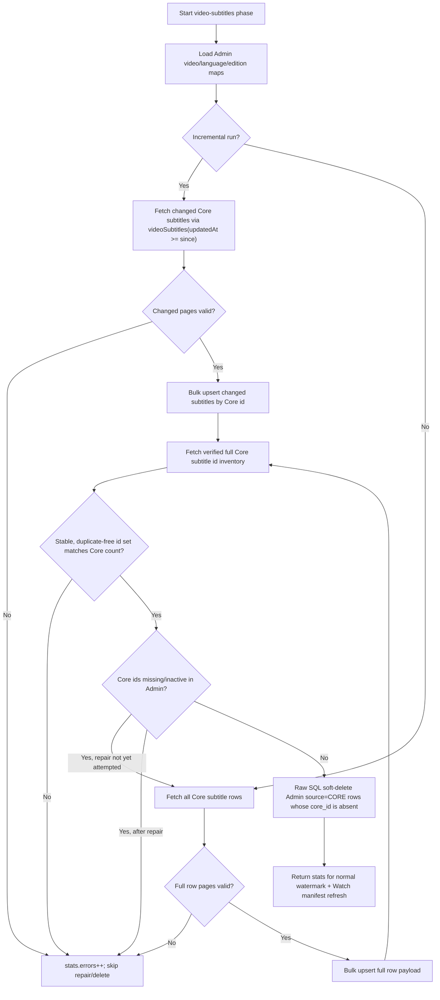

# fix: Replace subtitle checksum reconciliation with flat Core sync

## Overview

Replace the overbuilt subtitle checksum/manifest reconciliation approach with a Forge-only Core sync fix. Admin will read Core subtitles from the existing flat `videoSubtitles` GraphQL query, preserve the normal incremental fast path, and use a verified full Core inventory to decide when a full row-payload repair is required before deleting stale Core-owned Admin rows.

## Problem Frame

Production Core currently reports 11,317 subtitles, while Admin production reports 3,146 active Core-owned `VideoSubtitle` rows through `systemStatus.coverageAudit`. Specific JESUS videos confirm the drift: Core has English subtitle rows for `1_jf-0-0` and `1_jf6102-0-0`, while Admin production returns an empty `videoEdition.subtitles` list for the selected English `ot` edition.

The existing `video-subtitles` phase on `main` fetches subtitles through nested `videos { subtitles }` pages and then soft-deletes active Core-owned subtitle rows not restamped during a full run. That delete authority is unsafe when the nested fetch is incomplete. The open checksum PR fixes correctness but adds a new Core manifest contract and substantial reconciliation machinery. The simpler fix should use the flat Core subtitle table surface that already exists.

## Requirements Trace

- R1. Restore missing Core-owned subtitles in Admin through the normal `video-subtitles` sync path, including JESUS English subtitles.
- R2. Do not require any Core repository change or new GraphQL field.
- R3. Use the existing Core `videoSubtitles(where, offset, limit)` and `videoSubtitlesCount(where)` queries as the source API.
- R4. Preserve incremental sync by filtering Core subtitles on `updatedAt >= since`.
- R5. Soft-delete only Admin rows with `source = CORE`, `deletedAt IS NULL`, and `coreId` absent from a verified full Core subtitle ID inventory.
- R6. Never delete Manager-owned or non-Core subtitle rows.
- R7. Fail closed: skip all deletes if any Core page fails, parsing fails, duplicate IDs appear, fetched unique ID count does not equal `videoSubtitlesCount`, or local relationship resolution is unsafe.
- R8. Keep the implementation understandable and remove the checksum/manifest consumer complexity from Forge.
- R9. Restore already-missing, older Core subtitle rows by fetching full row payloads when a run is full/non-incremental or when the verified Core ID inventory contains active Core IDs absent from Admin.

## Scope Boundaries

- Do not modify JesusFilm/core or depend on Core PR #9425.
- Do not add checksum manifests, bucket hashes, snapshot tokens, or parity health dashboards.
- Do not perform direct production SQL repair in this PR.
- Do not change public Watch player subtitle behavior; restoring Admin subtitle rows should make existing consumers work.
- Do not touch generated GraphQL env outputs unless the Admin schema changes.

### Deferred to Separate Tasks

- Production operation: after merge and deploy, run or allow the scheduled Core sync to execute `video-subtitles`, then confirm Admin coverage count rises toward Core's 11,317 subtitle count.
- If operational visibility still needs improvement after this fix, add a lightweight alert or dashboard row comparing Admin active Core subtitle count to Core `videoSubtitlesCount` in a separate follow-up.
- Production verification: before rollout or as part of deployment verification, capture Core count, Admin active Core count, Core IDs missing from Admin, Admin Core IDs absent from Core, and missing parent counts. If missing parent counts are material, stop and fix parent sync before expecting subtitle coverage to converge.

## Context & Research

### Relevant Code and Patterns

- `apps/admin/src/services/core-sync/phases/sync-video-subtitles.ts` currently owns the subtitle phase and should remain the main implementation unit.
- `apps/admin/src/services/core-sync/schemas/video-subtitle.ts` validates Core subtitle payload shape and should be extended for root-query fields such as `videoId` and `updatedAt`.
- `apps/admin/src/services/core-sync/phases/sync-dubs.ts` demonstrates flat Core pagination, seen-ID tracking, and raw SQL array-bound soft-delete.
- `apps/admin/src/db/pgvector.ts` exposes `toPgArray()`, the repo pattern for passing unbounded ID sets to Postgres as one `text[]` bind.
- `apps/admin/src/services/core-sync/orchestrator.ts` advances watermarks only when phase stats have zero errors; keep this invariant.
- `apps/admin/src/services/core-sync/coverage-audit.ts` already counts active Core subtitles via `source: "CORE", deletedAt: null`.

### Institutional Learnings

- `docs/solutions/integration-issues/core-sync-video-subtitles-soft-delete-wipes-on-incomplete-fetch.md`: the known data-loss mechanism is incomplete fetch plus delete-not-restamped. The fix must make incomplete reads a first-class failure.
- `docs/solutions/database-issues/postgres-prepared-statement-bind-variable-limit-32767-20260504.md`: use raw SQL with `= ANY(${toPgArray(ids)}::text[])` for unbounded `IN`/`NOT IN` sets.
- `docs/solutions/platform/admin-core-sync-entity-coverage.md`: keep Core identity in `coreId`, preserve `VideoSubtitle -> VideoEdition`, never overwrite Manager rows, and treat GraphQL errors in 200 responses as sync failures.
- `docs/solutions/performance-issues/admin-core-sync-high-volume-root-phase-bulk-upsert-20260507.md`: root Core queries with `updatedAt` filters are preferred for high-volume entity classes when available; bulk page writes should avoid rewriting unchanged rows in incremental mode.

### External References

- Real Core production GraphQL verified during planning:
  - `videoSubtitlesCount` returns 11,317.
  - `videoSubtitles(where: { videoId: "1_jf-0-0" })` returns 263 rows, including English `languageId: "529"` for edition `ot`.
  - ID-only pages via `videoSubtitles(limit, offset) { id updatedAt }` return rows successfully.

## Key Technical Decisions

- Use flat Core `videoSubtitles`, not nested `videos { subtitles }`: the flat endpoint exists in production and directly represents the entity being synced.
- Keep deletes driven by a full Core ID inventory, not by `syncedAt < phaseStartedAt`: absence from a verified Core ID set is a clearer deletion authority than "not touched during this run."
- Run the ID inventory after the incremental upsert pass: this preserves the normal fast path for changed rows while giving the phase evidence to decide whether full row-payload repair is required.
- Fetch and upsert full subtitle row payloads when the run has no `since` watermark, or when the verified inventory shows Core subtitle IDs that are missing or inactive in Admin. An ID-only inventory can detect drift, but cannot recreate old rows by itself.
- Treat the inventory count check as a fail-closed heuristic rather than a true snapshot guarantee under concurrent Core writes. If practical, stabilize the delete authority by fetching the full ID set twice and requiring identical sets before any delete.
- Use the Prisma enum name `CORE` in TypeScript and the current database enum literal `'core'` in raw SQL predicates.
- Use raw SQL array membership for the delete tail: it is safe for 11k IDs now and remains safe if the corpus grows past Prisma's bind-variable limit.
- Remove checksum/manifest files and diagnostics from the Forge PR: the implementation should not retain a parallel complex path that operators do not need.

## Open Questions

### Resolved During Planning

- Does Core expose a flat subtitle query? Yes: `videoSubtitles(where, offset, limit)` and `videoSubtitlesCount(where)` exist on the production Core gateway.
- Can Core filter subtitles by update time? Yes: `VideoSubtitlesFilter.updatedAt` accepts `DateTimeFilter { gte, lte }`.
- How many Core subtitles exist? Core production reports 11,317.
- How many active Core subtitles are currently in Admin production? Admin production coverage audit reports 3,146.

### Deferred to Implementation

- Final page size: choose during implementation by following nearby Core sync phase page-size conventions and keeping test fixtures independent of the exact value.
- Whether to preserve `vttVersion`/`srtVersion` migration from the checksum PR: resolved as no. The flat sync repair does not need additional Admin columns.
- Exact log message names: align with current `core-sync.video-subtitle.*` naming when editing the phase.

## High-Level Technical Design

> _This illustrates the intended approach and is directional guidance for review, not implementation specification. The implementing agent should treat it as context, not code to reproduce._

## Implementation Units

- [x] **Unit 1: Replace Core subtitle fetch with flat paginated query**

**Goal:** Make `video-subtitles` read Core subtitles from the root `videoSubtitles` query instead of nested `videos { subtitles }`.

**Requirements:** R1, R2, R3, R4, R8

**Dependencies:** Plan approval only.

**Files:**

- Modify: `apps/admin/src/services/core-sync/phases/sync-video-subtitles.ts`
- Modify: `apps/admin/src/services/core-sync/schemas/video-subtitle.ts`
- Test: `apps/admin/src/services/core-sync/phases/sync-video-subtitles.test.ts`

**Approach:**

- Define one flat Core GraphQL query for subtitle row pages.
- Include the fields Admin needs to upsert: Core subtitle id, `updatedAt`, `videoId`, `languageId`, `edition`, `primary`, `vttSrc`, `srtSrc`, `value`, and the Core edition id through `videoEdition`.
- Use `where: { updatedAt: { gte: since } }` for incremental runs and omit `where` for full runs.
- Keep page-level error handling, but any failed page must increment `stats.errors` and prevent the delete tail.
- Resolve Admin `videoId`, `languageId`, and `videoEditionId` from existing Core-id maps before writing; unresolved required video or edition relationships should fail closed for that row/page rather than fabricate data.

**Execution note:** Start by characterizing the Core query variables and page failure behavior in `sync-video-subtitles.test.ts`, because the existing tests are built around the checksum branch and need to be realigned.

**Patterns to follow:**

- `apps/admin/src/services/core-sync/phases/sync-dubs.ts` for flat Core pagination.
- `apps/admin/src/services/core-sync/phases/sync-video-subtitles.ts` on `origin/main` for bulk insert shape and subtitle relationship mapping.

**Test scenarios:**

- Happy path: full run fetches two flat `videoSubtitles` pages, maps video/language/edition relations, and bulk-upserts every valid subtitle.
- Happy path: incremental run passes `updatedAt >= since` to Core and does not request the full row payload through nested `videos`.
- Edge case: a subtitle whose video or edition is missing in Admin is skipped or classified as an error according to existing phase behavior, and does not create an invalid row.
- Error path: a Core GraphQL error on any page increments `stats.errors` and prevents any delete call.
- Error path: malformed subtitle payload increments `stats.errors` and prevents any delete call.

**Verification:**

- Tests prove the Core query shape is root `videoSubtitles`, not nested `videos`.
- Incremental variables include `updatedAt` filtering on subtitles.

- [x] **Unit 2: Add full Core subtitle ID inventory, repair escalation, and safe Core-only delete**

**Goal:** Replace the unsafe "delete rows not restamped this run" tail with deletion based on a verified complete Core subtitle ID inventory, and use that same inventory to trigger a full row-payload repair when Admin is missing Core subtitles.

**Requirements:** R1, R5, R6, R7, R9

**Dependencies:** Unit 1.

**Files:**

- Modify: `apps/admin/src/services/core-sync/phases/sync-video-subtitles.ts`
- Test: `apps/admin/src/services/core-sync/phases/sync-video-subtitles.test.ts`

**Approach:**

- Fetch `videoSubtitlesCount` and an ID-only page walk from the flat Core endpoint. Prefer fetching the ID set twice and requiring identical sets before deletes if this can be implemented cleanly without excessive complexity.
- Dedupe fetched Core IDs and verify the unique count equals `videoSubtitlesCount`.
- Treat duplicate IDs, page failures, or count mismatch as sync errors and skip deletes.
- Load active Admin Core subtitle `coreId`s with `source: "CORE"` and `deletedAt: null`.
- If the run is full/non-incremental, or if any verified Core IDs are absent from the active Admin set, fetch all Core subtitle row payloads through the same flat endpoint and upsert them before evaluating deletes. Because Core does not expose `VideoSubtitlesFilter.id`, do not design a targeted by-ID fetch path.
- After any full row repair, reload the active Admin Core set. If Core IDs are still missing because parent video/language/edition relationships could not be resolved, record errors and skip deletes.
- Use `$executeRaw` with `toPgArray(coreIds)` and `NOT ("core_id" = ANY(...::text[]))` to soft-delete only rows where `source = 'core'`, `deleted_at IS NULL`, and `core_id` is absent from the verified ID set.
- Do not delete rows with `source = 'manager'` or null `core_id`.

**Patterns to follow:**

- `docs/solutions/database-issues/postgres-prepared-statement-bind-variable-limit-32767-20260504.md`
- `apps/admin/src/services/core-sync/phases/sync-dubs.ts`

**Test scenarios:**

- Happy path: a verified ID inventory soft-deletes only active Core-owned Admin subtitles absent from Core.
- Happy path: an incremental run that discovers Core IDs missing from Admin escalates to a full row-payload fetch and restores the missing rows.
- Happy path: a full run fetches all row payloads directly and repairs old missing rows without relying on `updatedAt`.
- Edge case: duplicate Core IDs in the inventory fail closed and no delete SQL runs.
- Edge case: fetched unique ID count differs from `videoSubtitlesCount`; no delete SQL runs.
- Edge case: two ID inventory passes differ; no delete SQL runs, if double-read stabilization is implemented.
- Error path: an ID inventory page error prevents deletes even if incremental upserts succeeded.
- Safety: Manager-owned subtitles and Core rows with null `coreId` are not targeted by the delete predicate.
- SQL shape: the delete uses `= ANY`, `text[]`, and a single array bind rather than Prisma `notIn`.

**Verification:**

- A full successful phase can repair deleted Core rows and prune truly removed Core rows.
- An incremental successful phase can repair older missing rows after inventory-drift detection.
- An incomplete Core read cannot delete anything.

- [x] **Unit 3: Remove checksum/manifest consumer complexity**

**Goal:** Strip the PR back to a Forge-only flat sync without Core manifest dependencies or parity dashboard surfaces.

**Requirements:** R2, R8

**Dependencies:** Units 1 and 2.

**Files:**

- Delete: `apps/admin/src/services/core-sync/video-subtitle-checksum.ts`
- Delete: `apps/admin/src/services/core-sync/video-subtitle-checksum.test.ts`
- Delete: `apps/admin/src/services/core-sync/schemas/video-subtitle-manifest.ts`
- Delete: `apps/admin/src/services/core-sync/phases/video-subtitle-reconciliation.ts`
- Modify: `apps/admin/src/services/core-sync/types.ts`
- Modify: `apps/admin/src/app/dashboard/ops-data.ts`
- Modify: `apps/admin/src/app/dashboard/ops-data.test.ts`
- Modify: `apps/admin/src/app/dashboard/system-status/page.tsx`
- Modify: `apps/admin/src/app/dashboard/dashboard-ui.test.tsx`

**Approach:**

- Remove manifest-specific diagnostics, parity health axes, and dashboard evidence added by the checksum PR.
- Preserve unrelated current-main dashboard behavior, including precise workflow incident details.
- Keep ordinary `SyncStats` fields (`created`, `updated`, `softDeleted`, `errors`) and existing system status watermarks.

**Patterns to follow:**

- `origin/main` dashboard/system-status behavior.
- The follow-up commit `fix(admin): preserve workflow incident details` should remain reflected if the checksum dashboard code is removed.

**Test scenarios:**

- Happy path: dashboard still displays core sync watermarks and workflow incidents after parity-specific types are removed.
- Regression: failed workflow rows show their stored `error` before their `summary`.
- Compile-time: no imports remain from deleted checksum/manifest modules.

**Verification:**

- No `videoSubtitleChecksumManifest` or `SubtitleParity` references remain in Forge code.

- [x] **Unit 4: Update docs and roadmap to the simpler repair model**

**Goal:** Align project documentation with the flat-sync + verified ID inventory approach.

**Requirements:** R2, R5, R6, R7, R8

**Dependencies:** Units 1-3.

**Files:**

- Modify: `docs/roadmap/platform/feat-323-admin-flat-core-subtitle-sync-repair.md`
- Modify: `docs/solutions/integration-issues/core-sync-video-subtitles-soft-delete-wipes-on-incomplete-fetch.md`
- Optional if implementation changes permanent operator guidance or removes existing public concepts: `docs/roadmap/README.md`, `CONCEPTS.md`, `apps/admin/docs/core-sync-recurring-job.md`, `apps/admin/CLAUDE.md`.

**Approach:**

- Rename or reframe `feat-323` around safe flat subtitle sync rather than checksum reconciliation.
- Document that Core already exposes the required flat query and no Core dependency is needed.
- Update the incident solution to say the durable resolution is flat `videoSubtitles` sync plus verified ID inventory, superseding checksum manifest guidance.
- Remove the "Subtitle Parity Check" concept only if no parity evidence remains in code and the concept was introduced by this branch.

**Test scenarios:**

- Test expectation: none for pure documentation, but run formatting checks and ensure roadmap counts remain consistent if status/title changes affect the generated index.

**Verification:**

- Docs no longer instruct operators to wait for Core #9425 before repairing JESUS subtitles.
- Docs explicitly preserve the source guard: delete only `source = CORE`.

- [x] **Unit 5: Validate and prepare PR handoff**

**Goal:** Prove the simpler implementation is safe and communicate the production repair path.

**Requirements:** R1-R9

**Dependencies:** Units 1-4.

**Files:**

- Modify: PR description or summary only if requested through GitHub tooling.

**Approach:**

- Run focused subtitle sync tests, dashboard tests touched by the cleanup, Admin typecheck, Admin lint, Prisma generation, and diff hygiene.
- Run a production-safe dry-run diagnostic after implementation if credentials remain available: Core count, Admin active Core count, Core IDs missing from Admin, Admin Core IDs absent from Core, and missing parent counts. Do not mutate production directly.
- Push the updated branch to the existing Forge PR once local validation is green.

**Test scenarios:**

- Integration scenario: focused test suite covers incremental upsert, full ID inventory delete, and fail-closed delete suppression.
- Regression scenario: typecheck catches any deleted checksum type/module references.

**Verification:**

- Existing PR #1797 now contains a one-sided Forge fix and no Core #9425 dependency.

## System-Wide Impact

- **Interaction graph:** Core API -> Admin core sync -> Admin `video_subtitle` table -> Admin GraphQL `videoBySlug(...).preferredPlayableDub.videoEdition.subtitles` -> Watch/TV subtitle consumers.
- **Error propagation:** Core query, parsing, relation-resolution, duplicate-ID, and count-mismatch failures must increment `stats.errors`; the orchestrator should not advance a healthy watermark when errors are present.
- **State lifecycle risks:** The only destructive operation is soft-delete. It must run only after a complete Core ID inventory and must target only `source = CORE` active rows.
- **API surface parity:** Public Admin GraphQL shape should remain unchanged. Core API usage changes to an existing endpoint only.
- **Integration coverage:** Unit tests mock Core and Prisma boundaries; production verification should compare Admin coverage count to Core count after deployment.
- **Unchanged invariants:** Manager-owned subtitles remain local authority and are never overwritten or deleted by Core sync. `VideoSubtitle` remains attached to `VideoEdition` for timing correctness.

## Risks & Dependencies

| Risk                                                                              | Mitigation                                                                                                             |
| --------------------------------------------------------------------------------- | ---------------------------------------------------------------------------------------------------------------------- |
| Offset pagination shifts while Core subtitles update during the ID inventory scan | Verify unique ID count against `videoSubtitlesCount`; skip deletes on mismatch or duplicate IDs.                       |
| Flat Core endpoint regresses or rate-limits under full inventory scans            | Page conservatively, treat page failures as errors, and skip deletes. The current production size is only 11,317 rows. |
| Raw SQL enum literal mismatch                                                     | Use DB enum value `'core'`, following the `sync-dubs` raw SQL pattern.                                                 |
| Existing checksum PR files leave stale imports or dashboard assumptions           | Remove checksum modules and run Admin typecheck plus focused dashboard tests.                                          |
| Missing Admin parent relation prevents restore for some Core rows                 | Keep relationship failures visible in `stats.errors`; do not create orphaned subtitle rows.                            |

## Documentation / Operational Notes

- After deployment, the normal Core sync `video-subtitles` phase should restore missing JESUS subtitles without direct SQL.
- Operators should expect Admin active Core subtitle coverage to rise from the current production count of 3,146 toward Core's 11,317 after a successful full subtitle phase.
- If count comparison still shows drift after this fix, inspect skipped/unresolved row diagnostics before considering any production DB patch.

## Sources & References

- Related incident doc: `docs/solutions/integration-issues/core-sync-video-subtitles-soft-delete-wipes-on-incomplete-fetch.md`
- Related roadmap: `docs/roadmap/platform/feat-323-admin-flat-core-subtitle-sync-repair.md`
- Core sync phase: `apps/admin/src/services/core-sync/phases/sync-video-subtitles.ts`
- Core GraphQL client: `apps/admin/src/services/core-sync/core-client.ts`
- Coverage audit: `apps/admin/src/services/core-sync/coverage-audit.ts`
- Bind-limit pattern: `docs/solutions/database-issues/postgres-prepared-statement-bind-variable-limit-32767-20260504.md`
- Core entity coverage pattern: `docs/solutions/platform/admin-core-sync-entity-coverage.md`
- High-volume sync pattern: `docs/solutions/performance-issues/admin-core-sync-high-volume-root-phase-bulk-upsert-20260507.md`
