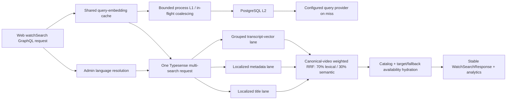

# Typesense Multilingual Hybrid Search Quality - Plan

## Goal Capsule

- **Objective:** Make MODERN Watch Search a fast, multilingual hybrid search candidate by separating localized catalog retrieval from transcript-vector retrieval, fusing them at the canonical-video boundary, accelerating the shared query-embedding cache, and replacing DEFAULT-parity-as-correctness with an absolute-quality evaluation baseline.
- **Authority:** PostgreSQL remains authoritative; Admin owns language interpretation, visibility, ranking orchestration, analytics, and the public GraphQL contract; Typesense owns indexed title, metadata, and vector retrieval. Existing Content Embeddings remain unchanged and available to other authorized semantic consumers.
- **Execution profile:** Add one small localized lexical serving collection, reuse the active 280,107-document transcript collection without re-embedding or routine vector rebuild, send title, metadata, and semantic subqueries in one Typesense multi-search request, fuse 70% lexical and 30% semantic evidence per canonical video, and validate remotely against development then held-out queries.
- **Stop conditions:** Stop if the work would require generating new corpus embeddings, loading the production-sized Typesense corpus on a developer machine, exceeding the 16 GiB search-service memory gates, weakening public visibility/watchability, changing the public response contract, or promoting a baseline that has not passed absolute relevance review.
- **Tail ownership:** Complete focused Admin and Mastra tests, typecheck/lint/schema checks, a remote shadow index refresh, measured RAM and latency gates, development-set tuning, held-out relevance evaluation, formal review, durable compounding, and the normal PR-to-main workflow.

---

## Product Contract

### Summary

MODERN search will use three multilingual logical retrieval lanes: localized title search, localized metadata search, and semantic transcript-vector search. Title and metadata lanes share one small physical lexical collection so translated text is indexed once; the vector lane remains the broad transcript collection. Admin will combine the three result lists at the canonical-video boundary with an explicit keyword-heavy blend, select one playable localized result, and preserve the existing Watch Search API, analytics, visibility, and degradation behavior.

The evaluation target changes at the same time. DEFAULT results remain useful rollback and comparison evidence, but they no longer define correctness. A versioned development set drives iteration; a separate held-out set and absolute relevance judgments decide whether a candidate is good enough to become the new baseline.

### Problem Frame

The current native-hybrid implementation copied every catalog title into transcript documents and inserted vectorless video documents into the transcript collection so Typesense could fuse keyword and vector scores at the document level. That design couples catalog refreshes to the largest serving collection, uses English-default tokenization for arrays containing many scripts, and ranks chunks/documents before canonical-video consolidation. Its measured MODERN relevance remains weak for product-title and scene-like cases even though Typesense engine time is usually small.

The current query-embedding cache is shared by DEFAULT and MODERN and already persists provider-bound vectors in PostgreSQL. A warm hit still enters the database and synchronously updates `last_used_at`, while concurrent misses for the same query can each call the provider. This leaves database-pool and provider-tail latency in MODERN's critical path.

The current Mastra comparison captures one backend's result list as a baseline and uses a pairwise judge against another list. That measures agreement and preference, not absolute intent satisfaction. It can preserve a poor result merely because DEFAULT returned it, and its high order-swap disagreement rate makes it unsuitable as the only release gate.

### Requirements

#### Multilingual catalog retrieval

- R1. MODERN has a localized title lane that gives normalized whole-title and exact-title matches priority in the query's resolved language while retaining controlled typo, joined-word, and fallback-language recovery.
- R2. MODERN has a separate localized metadata lane for descriptions and product context. Metadata evidence can fill and improve results but cannot outrank an equally watchable whole-title match.
- R3. The lexical serving projection covers every published catalog localization, not only the fixed Search Eval locales. Every valid two-letter ISO 639-1 base receives a schema-level Typesense locale field; longer and private BCP-47 language tags remain searchable in generic fields. Forge's unique language slug isolates each language; normalized locale is a fallback identity only for legacy rows without a slug.
- R4. A query such as `Jesus` can retrieve the relevant JESUS product family in English, and equivalent translated queries can retrieve the appropriate canonically related, playable result in Mandarin, Thai, and any other catalog language without requiring English terms in the query.

#### Semantic preservation and ranking

- R5. All accepted stored transcript Content Embeddings remain in the Typesense transcript collection and available for semantic retrieval. The indexer and this migration create no document embeddings; a routine refresh reuses the active transcript alias.
- R6. Public semantic retrieval filters `publiclyVisible:=true`, restricts evidence to resolved languages, groups by faceted canonical video identity before returning candidates, and retains transcript snippet/start-time evidence.
- R7. Title, metadata, and semantic subqueries travel in one Typesense multi-search HTTP request. Admin fuses their ranked canonical-video groups with a 70% lexical / 30% semantic policy; title has the majority share inside the lexical portion, metadata has a smaller fill share, and a normalized whole-title match remains an explicit first-order signal.
- R8. Canonical editions, aspect ratios, dubs, and localized variants emit at most one public result per canonical video. Hydration chooses the best target-audio, target-subtitle, or ordered related-language member without returning duplicate language variants.
- R9. If query embedding misses its deadline or the provider fails, title and metadata retrieval still return results, semantic lanes report honest degradation, and Admin does not issue a second embedding request.

#### Latency, caching, capacity, and contract

- R10. The existing provider/model/dimensions/query-hash PostgreSQL query-embedding cache gains a bounded process-local hot tier and in-flight coalescing shared by DEFAULT and MODERN. Cache infrastructure failures fail open to the configured query provider within the existing deadline, fulfilled vectors only are cached, raw queries are not logged or stored, and provider identity changes cannot reuse stale vectors.
- R11. A process-local hit performs no PostgreSQL or embedding-provider call. A durable-cache hit uses at most one synchronous database round trip. Concurrent identical misses share one durable lookup/provider request. MODERN starts this shared embedding lookup concurrently with language resolution, joining both only when it builds the retrieval request.
- R12. MODERN preserves stable public URLs, response fields, `searchMode`, request/analytics correlation, Watch Search Analytics, language interpretation, visibility/watchability, pagination, and lexical-only degradation. No browser receives a Typesense API key or calls Typesense directly.
- R13. The new lexical index reports indexed title/metadata bytes and a 2x-3x keyword-memory estimate. Remote release evidence records Typesense RSS, index memory, disk, and peak import memory; steady-state RSS must remain below 12 GiB, peak below 14 GiB, and at least 2 GiB of the 16 GiB service limit must remain available after publication.
- R14. Routine catalog/availability/lexical refreshes reuse the active transcript collection and do not patch copied titles into transcript chunks. Versioned collections, checked imports, aliases, advisory locking, cleanup, and rollback protection remain intact.

#### Absolute-quality evaluation

- R15. The public-watch query corpus is versioned and split before tuning into a development set and a held-out set covering product titles, metadata/topic intent, felt needs, scene-like semantic intent, typos, confusing/no-result queries, and the supported multilingual scripts.
- R16. Each absolute-quality case defines intent and deterministic relevance evidence using stable canonical identifiers or explicit acceptance predicates. Reports calculate at least success@1, success@10, MRR, NDCG@10, no-result rate, language correctness, canonical-duplicate rate, degradation rate, and latency slices.
- R17. Mastra adds an absolute, pointwise result-list judgment for the public-watch rubric. Only reviewed repository seed cases and public result projections may enter that judge; raw production queries, trace-derived prompts, credentials, private fields, code, and diffs are excluded. The existing bidirectional pairwise judge and DEFAULT overlap remain secondary diagnostic evidence; neither can independently pass or fail the candidate.
- R18. Development queries may be inspected and rerun during tuning. Held-out judgments are evaluated only at the release gate. Pre-registered minimums are overall NDCG@10 ≥0.80, MRR ≥0.85, success@10 ≥0.90, product-title success@1 ≥0.90, semantic-intent success@10 ≥0.80, multilingual success@10 ≥0.90, language correctness 100%, canonical-duplicate rate 0%, and at least 85% of pointwise judgments rated useful with no more than 5% rated unacceptable. Expected no-result cases are scored for honest restraint rather than forced recall. A new MODERN result snapshot is promoted as the baseline only after these metrics, operator sign-off on focused human review, multilingual checks, latency, memory, and failure gates pass.
- R19. Query fixtures and labels are small repository data. Search execution targets the deployed shadow Admin/Typesense service; no production-sized database restore, vector import, or local Typesense process is required.

### Acceptance Examples

- AE1. Given English query `Jesus`, the first page contains the canonical JESUS product family near the top, a whole-title `JESUS` member outranks broader title/description matches when watchability is equivalent, and only one canonical result is emitted.
- AE2. Given a Mandarin query written in Han characters with Mandarin as the resolved query/target language, the localized title lane uses Chinese tokenization, returns the relevant localized JESUS-family video when present, and hydration selects target audio before subtitle or related-language fallback.
- AE3. Given a Thai title or topic query with Thai resolved, the localized title and metadata fields are searchable without requiring spaces or an English transliteration, and the result card uses the best available Thai display/watchability projection.
- AE4. Given `someone feels ashamed and rejected but discovers God still comes close`, a video with no matching title words can rank through transcript semantic evidence, with snippet/start-time evidence retained.
- AE5. Given a mixed query with a strong product-title match and relevant transcript matches, the whole-title product result leads while useful semantic results fill the remaining page under the 70/30 fusion policy.
- AE6. Given several transcript chunks and physical language/aspect-ratio editions for one Core video, retrieval groups by canonical identity and the response contains one playable result rather than duplicate videos in different languages.
- AE7. Given an embedding timeout, one lexical multi-search completes, both semantic lanes are marked degraded/skipped with the existing contract, analytics are recorded, and no vector query is sent.
- AE8. Given two normalized-identical queries on one Admin process, the second embedding lookup is a process-local hit with no Prisma/provider call; given concurrent identical cold requests, only one provider call occurs and all callers receive cloned valid vectors; given a PostgreSQL cache outage, one provider call proceeds within the existing deadline instead of disabling semantic retrieval solely because the cache failed.
- AE9. Given a routine production search-index refresh, the terminal report says the transcript collection was reused, publishes a checked lexical generation, reports its byte/RAM estimate, and leaves all 280,107 transcript documents available without provider calls or a vector rebuild.
- AE10. Given a development candidate that improves DEFAULT overlap but fails absolute title, semantic, multilingual, duplicate, latency, or memory gates, no baseline is promoted and no traffic-selection change is made.
- AE11. Given a candidate that passes development tuning, the held-out run produces an immutable report with deterministic metrics, pointwise Mastra judgments, human-review notes, exact revision/backend identity, and enough evidence to approve or reject baseline promotion.

### Scope Boundaries

- This work changes MODERN retrieval, the shared query-embedding cache, the Typesense release projection, and the public-watch evaluation harness. It does not create a general replacement for every Admin or agent search surface.
- The physical serving layout is one localized lexical collection plus the existing catalog hydration, availability, and transcript collections. Title and metadata are logical lanes over the same lexical collection, not duplicate physical collections.
- Existing transcript vectors remain authoritative Content Embeddings. Fireworks or another configured provider may create a temporary query embedding on a cache miss; it does not create or update Typesense document embeddings.
- The active broad transcript collection may retain legacy title/video fields until a separately approved vector-schema maintenance rebuild. The new query ignores those fields; this plan does not force a 280k-vector re-import merely to reclaim a small amount of legacy lexical memory.
- DEFAULT remains available as rollback and diagnostic context. This change does not switch Web traffic or remove PostgreSQL search; traffic promotion requires the final evidence gate and a separate explicit rollout decision.
- Production-sized indexing and benchmarks run only on the isolated `@forge/admin/search` service after normal PR merge/deploy. Local work is limited to unit/type/schema/lint validation and small fixtures.
- No code or repository diff is sent to an external judging model. Only reviewed seed queries and public search result text are sent to the configured Mastra judge during an explicitly invoked evaluation run; trace-derived/raw production queries and generated candidates are disabled for baseline qualification.

---

## Planning Contract

### Key Technical Decisions

- KTD1. Use three logical retrieval lanes—localized title, localized metadata, and transcript semantic—while title and metadata share one physical localized lexical collection. (session-settled: user-directed — chosen over continuing to copy catalog text into transcript documents or provisioning separate title and metadata collections: retrieval responsibilities stay distinct without duplicating the small lexical index.) Governs R1-R8, R13-R14.
- KTD2. Keep the ranking blend keyword-heavy at 70% lexical and 30% semantic, with title owning most of the lexical share and whole-title match remaining an explicit precedence signal. (session-settled: user-directed — chosen over classifying every query as title-like or semantic-like: the user wants both intents served on every query through a stable blend.) Governs R1-R2, R7-R9.
- KTD3. Fuse ranked lists by canonical video in Admin using deterministic weighted reciprocal-rank fusion, then apply watchability and stable tie-breakers. Do not compare incomparable raw Typesense text and vector scores. One Typesense multi-search keeps network cost bounded. Governs R6-R9, R12.
- KTD4. Make multilingual lexical indexing schema-explicit and data-driven: emit one document per video/language identity, add one optional title and metadata field for every valid two-letter base locale present in that generation, and use generic fallback fields for longer/private tags. Filter every lexical request by Forge's unique language slug before canonical-video grouping; use normalized locale only for legacy rows without a slug. Never treat BCP-47 as language identity, search every language field, or mix long-tail languages on a request. Governs R1-R4, R13.
- KTD5. Extend the existing PostgreSQL query-embedding cache with a bounded in-process L1 and in-flight promise map; keep PostgreSQL as the cross-replica L2 and combine durable hit lookup/touch into one synchronous statement. (session-settled: user-directed — chosen over adding a new Redis cache: the durable provider-bound cache already exists and both search modes already consume it.) Governs R9-R11.
- KTD6. Reuse the active transcript alias during this rollout. Stop routine vectorless-video upserts and transcript-title patches after the lexical alias is active, but defer physical removal of legacy fields/documents until a separately measured maintenance window. (session-settled: user-directed — chosen over rebuilding 280k unchanged vectors on each release: catalog changes must not cause an hour-long vector import or duplicate-vector memory spike.) Governs R5-R6, R13-R14.
- KTD7. Treat absolute intent quality as the release authority. Development/held-out isolation, deterministic relevance metrics, pointwise Mastra scoring, and focused human review must agree before baseline promotion; DEFAULT pairwise results remain diagnostics only. (session-settled: user-directed — chosen over using agreement with DEFAULT as correctness: the new baseline should be better, not merely similar.) Governs R15-R19.
- KTD8. Keep all production-shaped evaluation remote. The repository stores only query definitions, labels, schemas, and summarized safe reports; the developer machine never hosts the production corpus. (session-settled: user-directed — chosen over recreating the full local comparison: the workstation does not have safe capacity for the 280k-vector corpus.) Governs R13, R18-R19.

### High-Level Technical Design

### Assumptions

- All published catalog localizations are in scope. The fixed Search Eval corpus remains a regression fixture, not an allowlist for production indexing.
- Base-language tokenization is suitable for regional BCP-47 variants, while the unique Forge language slug isolates retrieval. Chinese variants can share the `zh` tokenizer without sharing a language-identity filter; Thai uses `th`; three-letter and private tags use the generic tokenizer. BCP-47 is a search-execution label and is deliberately not assumed unique.
- Weighted reciprocal-rank fusion uses fixed declared lane weights and a stable rank constant. The exact title/metadata split inside the 70% lexical share is an implementation tuning constant measured on the development set, not a query classifier.
- The existing 16 GiB single-node shadow service remains the experimental topology for this change. Passing capacity gates establishes that this projection fits; high-availability topology remains a separate production-resilience decision.
- Stable canonical IDs required for qrels are available from existing Core IDs or `canonicalTypesenseVideoId`. Cases that intentionally admit multiple products use acceptance predicates rather than fragile result titles.
- The final baseline cannot be truthfully captured until the new code and lexical generation are running remotely. Implementation can deliver the harness and reviewed query labels locally; baseline promotion is an operational gate, not a fabricated repository fixture.

### Implementation Constraints

- Preserve PostgreSQL as source of truth and Typesense as a private, rebuildable projection behind Admin.
- Preserve aliases, checked JSONL import responses, advisory lock, generation publication ordering, stale-collection retirement, and DEFAULT rollback.
- Never log raw query text, cache vectors, API keys, or raw document embeddings in test/benchmark output.
- Exclude embeddings and large display JSON from candidate responses; fetch only bounded fields needed for grouping, evidence, and final hydration.
- Do not widen HNSW `k`/`ef`, candidate windows, or query count without a paired latency and distinct-canonical-video measurement.
- Keep the public GraphQL schema stable unless evaluation-only additive fields are necessary; regenerate checked schema/client artifacts for any additive contract change.

---

## Implementation Units

### U1. Add the multilingual lexical serving projection

- **Goal:** Give Typesense a small, locale-aware title/metadata index that can refresh independently of transcript vectors.
- **Requirements:** R1-R6, R13-R14; AE1-AE4, AE9; KTD1, KTD4, KTD6.
- **Dependencies:** None.
- **Files:** `apps/admin/src/services/typesense-client.ts`, `apps/admin/src/services/typesense-watch-search-schema.ts`, `apps/admin/src/services/typesense-watch-search-schema.test.ts`, `apps/admin/src/services/typesense-watch-search-indexer.ts`, `apps/admin/src/services/typesense-watch-search-indexer.test.ts`, `apps/admin/src/scripts/index-typesense-watch-search.ts`, `apps/admin/src/scripts/index-typesense-watch-search.test.ts`, and a focused locale-field helper/test under `apps/admin/src/services/`.
- **Approach:** Add a versioned `watch_search_lexical` alias. Project one document per viewer-visible physical-video language identity with canonical ID, unique language-slug identity, locale-specific title/metadata fields for every two-letter base tokenizer present in the catalog, generic fields for longer/private tags, and only the facets needed for grouping/filtering. Use normalized locale identity only for legacy rows without a slug. Keep display/card data in the existing catalog collection. Build lexical, catalog, and availability as one checked metadata generation while reusing transcripts. Report indexed string bytes plus the 2x-3x Typesense keyword estimate.
- **Patterns to follow:** Existing collection schema builders, `buildCatalogDocuments`, `canonicalTypesenseVideoId`, checked batch imports, alias rollback, advisory locking, transcript reuse, and stale managed-collection retirement.
- **Test scenarios:**
  1. Project English, Chinese, Thai, Arabic, Maori, three-letter, regional, and private locale rows into separate language-identity documents and expected locale-specific/fallback fields without duplicating a value across searchable fields. Prove that two distinct language slugs sharing one BCP-47 label remain isolated.
  2. Extend the Typesense schema client with the documented per-field `locale` option, mark canonical identity and locale/filter fields facetable, and keep display-only values unindexed.
  3. Exclude deleted, `noIndex`, unpublished, and locale-deleted videos exactly as the current public catalog does.
  4. Reuse an active legacy or modern transcript collection without loading or importing its embeddings and without upserting video documents or patching transcript titles.
  5. Bootstrap a missing transcript alias only under the established explicit behavior; reject unknown CLI arguments.
  6. Roll back all moved metadata aliases when lexical publication fails, preserve the reused transcript alias, and retire only safe managed collections after success.
  7. Calculate deterministic title/metadata byte totals and low/high RAM estimates from imported searchable values.
- **Verification:** Focused schema/indexer tests prove locale coverage, public eligibility, no embedding generation/import on reuse, checked publication, rollback, and capacity reporting.

### U2. Replace document-level native hybrid with canonical lane fusion

- **Goal:** Retrieve strong exact-title, metadata, and semantic candidates in one Typesense request and rank one result per canonical video.
- **Requirements:** R1-R9, R12; AE1-AE7; KTD1-KTD4.
- **Dependencies:** U1.
- **Files:** `apps/admin/src/services/typesense-watch-search.service.ts`, `apps/admin/src/services/typesense-watch-search.service.test.ts`, `apps/admin/src/services/typesense-watch-search-locales.ts`, `apps/admin/src/services/typesense-watch-search-locales.test.ts`, and `apps/admin/src/services/typesense-client.ts` only if grouped multi-search typing needs a narrow extension.
- **Approach:** Start the shared query-embedding lookup at request admission while Admin resolves language signals. After both settle, build one multi-search body containing a grouped localized-title request, grouped localized-metadata request, and grouped `q:"*"` vector request. Resolve locale-aware query fields from Admin's language interpretation. Convert every list to canonical-video ranks, merge members/evidence using weighted RRF, apply whole-title precedence and stable tie-breakers, then hydrate a bounded union of member IDs from catalog/availability to choose the best playable edition. Retain lexical-only degradation when no embedding is available.
- **Patterns to follow:** Existing `lexicalSearchRequests`, legacy catalog-plus-vector fallback, `group_by`/`group_limit`, `createTitleMatchClassifier`, watchability ranking, bounded multi-search hydration, and lane timing/status helpers.
- **Test scenarios:**
  1. English whole-title `JESUS` outranks broader title and description hits.
  2. Chinese, Thai, and any catalog two-letter locale select their locale-aware fields; longer/private locales search only their exact-locale generic document.
  3. Metadata-only and semantic-only candidates can enter the page while title evidence retains its declared share.
  4. A candidate present in lexical and semantic lists receives both contributions rather than discarding semantic evidence after lexical insertion.
  5. Repeated transcript chunks and physical variants collapse to one canonical group; hydration chooses target audio, then subtitle, then ordered related language.
  6. Embedding timeout sends title/metadata requests only, marks degradation once, and never embeds twice.
  7. Legacy/missing lexical alias fails safely to the established catalog lexical path during code-first deployment without changing the public response.
  8. Embedding/cache work overlaps language resolution on both hit and miss paths; its lane offsets and elapsed time remain attributable without double-counting total latency.
  9. Pagination, `hasMore`, snippets/start times, request IDs, analytics identity, and response fields remain stable.
- **Verification:** Service tests pin request count and fields, exact/metadata/semantic rank behavior, multilingual selection, canonical dedupe, watchability, degradation, pagination, and contract parity.

### U3. Accelerate and coalesce the shared query-embedding cache

- **Goal:** Remove provider and database-pool latency from repeated DEFAULT and MODERN queries while preserving provider-bound correctness.
- **Requirements:** R9-R12; AE7-AE8; KTD5.
- **Dependencies:** None; integrate before U2 remote benchmarks.
- **Files:** `apps/admin/src/services/watch-search.service.ts`, `apps/admin/src/services/watch-search.service.test.ts`, and a focused cache module/test under `apps/admin/src/services/` if extraction keeps responsibilities clear.
- **Approach:** Wrap the existing provider/model/dimensions/query-hash L2 with a bounded TTL L1 and an in-flight map keyed by the full cache identity. Return cloned vectors, remove promises on settlement, cache only valid fulfilled dimensions, and combine durable lookup plus `last_used_at` touch into one statement. Preserve startup prewarm and direct provider health checks. Emit cache-tier/coalescing detail through existing lane observability without raw query text.
- **Patterns to follow:** Existing `queryEmbeddingCacheKey`, `parseCachedEmbedding`, `defaultWatchSearchEmbedder`, `prewarmWatchSearchQueryEmbeddings`, provider identity, timeout/degradation handling, and process-global startup state used by instrumentation.
- **Test scenarios:**
  1. Normalize whitespace and provider identity into one key; a provider/model/dimension change misses both cache tiers.
  2. L1 hit returns a clone with zero Prisma/provider calls and refreshes bounded recency without exceeding max entries.
  3. L2 hit performs one synchronous statement, fills L1, and does not call the provider.
  4. Concurrent identical misses share one L2/provider/upsert operation; rejected or invalid results are not cached and the in-flight entry is cleared.
  5. TTL expiry, LRU eviction, and malformed durable rows recover safely; a database-cache failure falls through to the provider within the existing deadline, while provider failure and embedding timeout preserve current lexical-only degradation semantics.
  6. Prewarm fills the shared cache once and provider health still bypasses the cache.
- **Verification:** Focused tests prove bounded memory, cache identity, concurrency, failure cleanup, exact provider-call counts, and cache-tier lane details.

### U4. Add an absolute public-watch quality harness

- **Goal:** Evaluate whether MODERN satisfies user intent independently of DEFAULT and keep tuning separate from release judgment.
- **Requirements:** R15-R19; AE10-AE11; KTD7-KTD8.
- **Dependencies:** U2 for final remote runs; harness work can proceed in parallel with U1-U3.
- **Files:** `apps/mastra/src/services/offline-search-eval/types.ts`, `apps/mastra/src/services/offline-search-eval/seed-prompt-set.ts`, `apps/mastra/src/services/offline-search-eval/seed-prompt-set.test.ts`, `apps/mastra/src/services/offline-search-eval/judge.ts`, `apps/mastra/src/services/offline-search-eval/judge.test.ts`, `apps/mastra/src/services/offline-search-eval/runner.ts`, `apps/mastra/src/services/offline-search-eval/runner.test.ts`, `apps/mastra/src/services/offline-search-eval/report.ts`, `apps/mastra/src/services/offline-search-eval/report.test.ts`, `apps/mastra/src/services/offline-search-eval/artifacts.ts`, `apps/mastra/src/services/offline-search-eval/artifacts.test.ts`, and focused absolute-judgment/query-set modules and tests in the same directory.
- **Approach:** Version the public-watch cases with an immutable development/held-out split, intent categories, stable relevance judgments/acceptance predicates, and locale expectations. Add deterministic ranking metrics plus a pointwise public-watch result-list judge. Preserve pairwise comparison as a diagnostic mode. Baseline qualification forces seed-only input with generated and trace-derived candidates disabled, projects only public result fields, and records the judge provider/model/cost without secrets. Include backend/revision/query-set identity in every artifact and refuse baseline promotion when gates, operator review sign-off, or held-out isolation are violated.
- **Patterns to follow:** Existing caller-track rubric, artifact schemas, runner result normalization, bidirectional pairwise judge, native Mastra dataset/experiment projection, baseline portability validation, and safe summarized docs reports.
- **Test scenarios:**
  1. Every public-watch case belongs to exactly one split, has intent/category/locale coverage, and stable IDs cannot move splits without a prompt-set version change.
  2. Compute success@1/@10, MRR, NDCG@10, empty, language, canonical-duplicate, degradation, and latency metrics from known fixtures.
  3. Pointwise judge validates bounded schema output, handles overlong rationale safely, records provider/model/cost, and receives only reviewed seed queries plus public result projections—never raw/trace-derived production queries, credentials, repository code, or diffs.
  4. Development runs expose case-level failures for tuning; held-out artifacts reject partial/mixed revision or wrong-backend results.
  5. DEFAULT comparison cannot satisfy an absolute gate by itself, and a candidate with high overlap but failed qrels is rejected.
  6. Baseline promotion writes only after the pre-registered deterministic/judge thresholds, operator review sign-off, latency, and capacity gates pass.
- **Verification:** Mastra unit/workflow tests prove split integrity, metric math, pointwise/pairwise separation, artifact safety, backend identity, and promotion refusal.

### U5. Run remote capacity, relevance, and latency gates and document the decision

- **Goal:** Produce trustworthy evidence for or against making MODERN the public Watch Search baseline without stressing the developer workstation.
- **Requirements:** R3-R19; AE1-AE11; KTD6-KTD8.
- **Dependencies:** U1-U4 merged and deployed to the isolated shadow service through the normal process.
- **Files:** `docs/operations/typesense-watch-search-local.md`, `docs/operations/typesense-watch-search-production-readiness.md`, `docs/roadmap/content-discovery/feat-334-watch-search-typesense-parallel-backend.md`, `docs/solutions/best-practices/precomputed-hybrid-search-serving-index-20260803.md`, a new safe summarized report under `docs/search-eval-reports/`, and existing remote benchmark/eval scripts where revision/backend/cache metadata is missing.
- **Approach:** Refresh only lexical/catalog/availability on `@forge/admin/search`, verify transcript reuse and collection counts, capture before/peak/after Typesense memory/disk metrics, then run cold/warm cache latency, 100 MODERN server calls, 100 full GraphQL calls, and the development query loop. Freeze the candidate, run the held-out deterministic and pointwise Mastra gates once, complete focused human review, and promote a new baseline only if every quality/capacity/latency condition passes. Record DEFAULT only as rollback/comparison context.
- **Patterns to follow:** Production readiness runbook, unique `clientRequestId` analytics correlation, isolated vs public latency separation, warmed repeated query methodology, safe report redaction, and versioned baseline artifacts.
- **Test scenarios:**
  1. Routine refresh reports transcript reuse, accepted broad transcript count, public subset, lexical/catalog/availability counts, checked imports, no retirement failures, and RAM estimates.
  2. Measured steady/peak memory and disk satisfy R13 before relevance or load traffic begins.
  3. Run 100 accepted MODERN requests with analytics IDs and separate embedding, language, retrieval, watchability, server, network, queue/pool, and full-round-trip timings; repeat warm to expose cache effect.
  4. Development metrics meet the declared bar after bounded tuning without increasing server p95 over the retained candidate.
  5. Held-out metrics, multilingual slices, semantic cases, title cases, duplicates, judge outputs, and human review all pass on one exact revision; otherwise no baseline/traffic change occurs.
  6. Disable MODERN or select DEFAULT without moving/deleting Typesense aliases to prove traffic rollback remains independent of index rollback.
- **Verification:** A safe committed report and private raw artifacts identify the exact revision, backend, collections, counts, RAM, latency, analytics, absolute metrics, judge model/cost, review outcome, and baseline decision.

---

## Verification Contract

| Gate                    | Applies to | Command or evidence                                                                                                                                                                                                                                                                                                                            | Done signal                                                                                                                                                                                              |
| ----------------------- | ---------- | ---------------------------------------------------------------------------------------------------------------------------------------------------------------------------------------------------------------------------------------------------------------------------------------------------------------------------------------------- | -------------------------------------------------------------------------------------------------------------------------------------------------------------------------------------------------------- |
| Admin focused behavior  | U1-U3      | `pnpm --filter @forge/admin test -- src/services/typesense-watch-search-schema.test.ts src/services/typesense-watch-search-indexer.test.ts src/scripts/index-typesense-watch-search.test.ts src/services/typesense-watch-search-locales.test.ts src/services/typesense-watch-search.service.test.ts src/services/watch-search.service.test.ts` | Locale projection, release lifecycle, fusion, cache, contract, and failure cases pass without a local Typesense corpus.                                                                                  |
| Admin typecheck         | U1-U3      | `pnpm --filter @forge/admin typecheck`                                                                                                                                                                                                                                                                                                         | Admin compiles with the new schema, grouped results, cache, and metrics.                                                                                                                                 |
| GraphQL contract        | U2         | `pnpm --filter @forge/admin schema:print` and `pnpm --filter @forge/admin-graphql generate` followed by `pnpm --filter @forge/admin-graphql typecheck`                                                                                                                                                                                         | Generated artifacts are current and the existing public Watch Search shape remains compatible.                                                                                                           |
| Mastra focused behavior | U4         | `pnpm --filter @forge/mastra test -- src/services/offline-search-eval/seed-prompt-set.test.ts src/services/offline-search-eval/judge.test.ts src/services/offline-search-eval/runner.test.ts src/services/offline-search-eval/report.test.ts src/services/offline-search-eval/artifacts.test.ts`                                               | Split integrity, metric math, absolute judge, artifacts, and promotion gates pass on small fixtures.                                                                                                     |
| Mastra typecheck        | U4         | `pnpm --filter @forge/mastra typecheck`                                                                                                                                                                                                                                                                                                        | Evaluation schemas and workflows compile.                                                                                                                                                                |
| Lint and diff integrity | U1-U4      | `pnpm --filter @forge/admin lint`, `pnpm --filter @forge/mastra lint`, `pnpm format:check`, and `git diff --check`                                                                                                                                                                                                                             | Touched source/docs conform and unrelated untracked files remain intact.                                                                                                                                 |
| Remote index/capacity   | U1, U5     | Shadow-service index report plus Typesense metrics before, during, and after publication                                                                                                                                                                                                                                                       | Transcript alias is reused; counts are correct; no retirement failures; steady RSS <12 GiB, peak <14 GiB, and ≥2 GiB headroom.                                                                           |
| Remote latency          | U2-U3, U5  | 100 MODERN server calls and 100 full GraphQL calls, cold and warm, with stage/APM/analytics correlation                                                                                                                                                                                                                                        | Server p95 is no worse than the retained candidate and targets ≤250 ms; full-round-trip p95 targets ≤550 ms; cache hits show no provider/DB lane; zero unexplained fallback/degradation in the warm run. |
| Development relevance   | U2, U4-U5  | Versioned development-set deterministic report, pointwise Mastra report, and case review                                                                                                                                                                                                                                                       | Declared title, semantic, multilingual, duplicate, no-result, and latency gates pass before the candidate is frozen.                                                                                     |
| Held-out baseline gate  | U4-U5      | One held-out run on the frozen revision plus focused human review                                                                                                                                                                                                                                                                              | Absolute metrics and review pass with no material slice regression; only then is a new MODERN baseline promoted.                                                                                         |
| Rollback proof          | U1-U2, U5  | Switch the experimental caller to DEFAULT/disable MODERN without alias mutation; separately verify previous metadata aliases can be restored                                                                                                                                                                                                   | Public traffic rollback and index rollback remain independent, and PostgreSQL search stays available.                                                                                                    |

---

## Definition of Done

- MODERN retrieves multilingual title, metadata, and transcript semantic evidence through separate logical lanes in one Typesense multi-search request.
- Locale-aware title/metadata documents cover every published catalog localization; two-letter languages receive schema-level locale fields and longer/private tags remain exactly isolated in bounded generic fields.
- Admin performs deterministic 70/30 canonical-video fusion, emits one playable localized result per canonical video, and preserves semantic snippets/start times.
- Routine metadata releases reuse all stored transcript embeddings and stop copying/patching catalog text in transcript documents; no embedding provider creates document vectors.
- The shared query-embedding cache has bounded L1 reuse, cross-replica PostgreSQL L2 reuse, in-flight coalescing, one-round-trip durable hits, honest telemetry, and failure-safe degradation.
- Versioned development and held-out query sets, deterministic absolute metrics, pointwise Mastra scoring, pairwise diagnostics, and guarded baseline promotion are implemented and tested.
- Focused Admin/Mastra tests, typechecks, schema/client generation, lint, format, and diff checks pass without starting a production-sized local index.
- The remote shadow refresh proves transcript reuse, correct counts, checked imports, retirement health, and the declared 16 GiB memory headroom.
- The frozen remote candidate passes the latency, multilingual, exact-title, semantic, canonical-deduplication, no-result, and absolute-quality gates; otherwise the report explicitly rejects baseline/traffic promotion.
- DEFAULT and existing public URLs, analytics, API contract, visibility/watchability, and rollback remain intact until a separately authorized traffic decision.
- Operations, roadmap, safe eval report, and durable solution learning reflect the final measured behavior and any deferred legacy-transcript cleanup.

---

## Sources and Research

- `apps/admin/src/services/typesense-watch-search-schema.ts`, `apps/admin/src/services/typesense-watch-search-indexer.ts`, and `apps/admin/src/services/typesense-watch-search.service.ts` show the current catalog/availability/transcript aliases, copied transcript titles/vectorless video documents, native document-level hybrid request, and legacy split-query fallback.
- `apps/admin/src/services/watch-search.service.ts` and `apps/admin/prisma/migrations/0045_query_embedding_cache/migration.sql` show that DEFAULT and MODERN already share a provider-bound PostgreSQL query-embedding cache, but no process-local or in-flight tier exists.
- `apps/admin/src/services/search-language-resolution.ts` and `apps/admin/src/services/search-eval-locale-profiles.ts` provide canonical language signals and the fixed 30-locale corpus, including Han-script detection and Thai/Chinese locale coverage.
- `apps/mastra/src/services/offline-search-eval/` establishes caller tracks, the 104-case public-watch seed set, pairwise judge, artifact store, native Mastra projection, and current snapshot-baseline workflow.
- `docs/solutions/best-practices/precomputed-hybrid-search-serving-index-20260803.md` records the serving-index boundaries, 280,107-vector corpus, current relevance experiments, and the need to stop treating overlap as absolute quality.
- `docs/solutions/performance-issues/admin-search-result-preserving-latency-optimization.md` establishes provider-bound cache identity, bounded process-cache/coalescing expectations, and result-preserving latency discipline.
- `docs/solutions/performance-issues/typesense-watch-search-payload-projection-latency.md` separates engine, Admin, network, projection, queue, and pool latency and requires steady-state alias rebuilds before benchmarking.
- `docs/solutions/performance-issues/typesense-transcript-rebuild-memory-exhaustion.md` records the 16 GiB duplicate-generation failure, 7.67 GiB stabilized process, transcript-reuse contract, and prohibition on routine vector rebuilds.
- [Typesense multi-search](https://typesense.org/docs/30.2/api/federated-multi-search.html) supports multiple collection queries in one HTTP request; separate result lists avoid union-sort compatibility constraints and allow Admin's explicit lane fusion.
- [Typesense search](https://typesense.org/docs/30.2/api/search.html) documents weighted query fields, exact-match priority, grouping by faceted fields, bounded grouped pagination, response field projection, and multi-search cache placement.
- [Typesense locale-specific search](https://typesense.org/docs/guide/locale.html) requires schema-level locale configuration for ICU tokenization and calls out Chinese, Thai, Arabic, and other non-English scripts.
- [Typesense vector search](https://typesense.org/docs/30.2/api/vector-search.html) documents external query vectors, `k`, `ef`, distance thresholds, and hybrid alpha; this plan retains external query embeddings but performs cross-collection fusion in Admin.
- [Typesense system requirements](https://typesense.org/docs/guide/system-requirements.html) sizes keyword indices at roughly 2x-3x searchable field bytes and vectors at 7 bytes × dimensions × records, while requiring the search index in RAM.
- [Typesense v30.2 release notes](https://typesense.org/docs/latest/api/) identify v30 synonym/curation/analytics behavior changes. This plan does not add those resources; deployment must remain pinned and snapshot-tested before any server upgrade.
