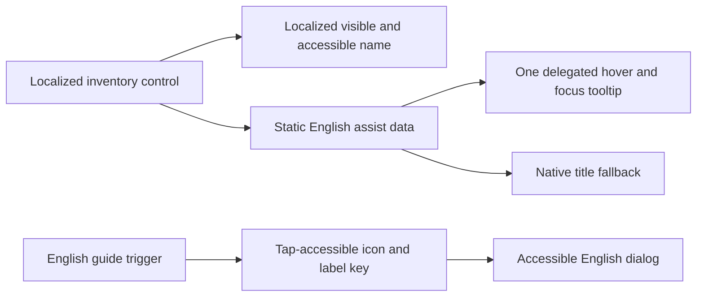

# feat: Add English assistance to localized Watch inventories

## Summary

Add an optional English assistance layer to localized Watch language inventory pages without changing the selected interface language. English-speaking ministry users get action guidance on hover, keyboard focus, and touch while seekers continue to see localized labels, routes, titles, and accessible names.

## Problem Frame

The localized Watch inventory is designed for seekers and search discovery in their own language and script. English-speaking ministry users also work across many of those inventories, but changing the whole interface to English would undo the localized experience; they instead need a lightweight way to understand controls and page structure while leaving the local-language page intact.

## Requirements

- R1. Keep existing visible interface text, content titles, routes, and primary accessible names in the selected locale; limit visible English to the on-demand tooltips and compact English guide affordance defined below.
- R2. Give every inventory-specific interactive control a concise English action description on pointer hover and keyboard focus.
- R3. Render visual tooltip and guide content with `lang="en" dir="ltr"`, preserve localized accessibility semantics on described controls, and retain native `title` attributes as a fallback rather than the only help mechanism.
- R4. Provide one clearly discoverable, tap-accessible English guide that explains the page's important labels, availability states, and universal icons without intercepting the first tap on a video, collection, or navigation control.
- R5. Keep tooltip content non-interactive, hoverable, dismissible with Escape, and free of automatic timeouts.
- R6. Preserve the existing inventory read model, localized message catalogs, URL contracts, media availability behavior, and language picker behavior.
- R7. Add focused component coverage for semantics and interactions, then verify representative localized pages across desktop keyboard, touch-sized, non-Latin, and RTL layouts.
- R8. Add no data requests and keep a constant number of hydrated assistance roots independent of inventory item count.

## Assumptions

- English assistance covers controls and structural labels owned by the Watch language inventory, not the global header, shared home sections, player chrome, or the existing multilingual language-picker modal.
- English assistance describes actions and states; it does not create parallel English metadata for localized video or collection titles.
- The touch equivalent is the page-level English guide because changing a media link's first tap into a tooltip would make navigation less predictable.

## Key Technical Decisions

- KTD1. Preserve localized names and attach English as a description: this supports multilingual operators without replacing the experience intended for local seekers or creating a language mismatch for assistive technology.
- KTD2. Use one event-delegated client tooltip controller for page-owned elements marked with static English-assist data: dense inventories get one collision-aware overlay instead of a client root per control.
- KTD3. Keep localized control names unchanged and do not attach persistent English `aria-describedby` content: localized assistive-technology users should not receive unrequested bilingual output, while sighted keyboard users still see the focus tooltip.
- KTD4. Use the existing Base UI dialog wrapper for the English guide: touch and assistive-technology users get an explicit accessible help surface without changing the first tap on links or turning labels into focus targets.
- KTD5. Store the operator-facing English copy in a typed local dictionary: the assistance is intentionally English and should not multiply keys across every localized message catalog.
- KTD6. Make no Admin or GraphQL changes: action guidance does not need additional inventory data, and fetching parallel English titles would expand the bounded inventory read model.
- KTD7. Keep the inventory server-rendered and isolate interactive help behavior in one tooltip controller and one guide dialog root: client initialization remains constant as inventory rows grow.
- KTD8. Suppress a target's native `title` only while its custom pointer tooltip is active, then restore it: JavaScript-enhanced browsers show one tooltip, while the HTML fallback remains available if the controller does not run.

## High-Level Technical Design

Inventory controls keep their existing content, accessibility props, event handlers, and navigation while adding static assist data and an English `title` fallback. One client controller observes pointer and focus events from those targets, renders one portalled tooltip at a time, suppresses the active target's native pointer tooltip, restores the fallback on dismissal, and dismisses on pointer leave, blur, or Escape. The English guide uses the existing accessible dialog pattern and presents the same vocabulary in one touch-friendly surface, including labels and audio/subtitle availability states that are not themselves interactive.

## English Guide Contract

Place one compact `CircleHelp` plus `EN` trigger in the hero utility row immediately before the section shortcuts. Its visible text, `title`, and accessible name are `English help`, marked `lang="en" dir="ltr"`; this is the only persistent English affordance on the page.

The trigger opens the existing `apps/web/src/components/ui/dialog.tsx` pattern with click, touch, Enter, or Space. The dialog has an English title, an explicit close control, focus containment, viewport-bounded scrolling, Escape and backdrop dismissal, and focus return to the trigger.

| Page element or state             | English explanation                          |
| --------------------------------- | -------------------------------------------- |
| Language collection selector      | Choose a language collection                 |
| New section shortcut              | Go to new releases                           |
| Video Bible section shortcut      | Go to Video Bible                            |
| BibleProject section shortcut     | Go to BibleProject                           |
| Sports section shortcut           | Go to sports videos                          |
| Collections section shortcut      | Go to collections                            |
| Subtitles-only section shortcut   | Go to subtitles-only videos                  |
| Previous / next carousel controls | Show the previous / next section             |
| Linked video card or compact row  | Open video                                   |
| Linked collection card or action  | Open collection                              |
| New badge                         | Recently added in this language              |
| Audio availability                | Dubbed audio is available                    |
| Subtitle availability             | Subtitles are available                      |
| Subtitles-only status             | Subtitles are available without dubbed audio |
| Newest-first label                | Videos are ordered from newest to oldest     |

## Scope Boundaries

In scope are the inventory language switcher, section shortcuts, carousel navigation, video and collection links, compact rows, collection overview actions, inventory-specific availability indicators, section labels, and the English guide. Out of scope are translated English content titles, new locale settings, Admin schema or query changes, global navigation, player controls, shared Watch home sections, and replacement of the existing multilingual language-picker tooltip.

## Implementation Units

### U1. Establish the tracked contract and English assistance primitives

Create `docs/roadmap/content-discovery/feat-335-watch-language-inventory-english-assist.md`, then add the typed English copy, event-delegated tooltip controller, and guide dialog under `apps/web/src/components/watch-language-inventory/`. Cover static assist attributes, fallback titles, unchanged accessible names and callbacks, hover/focus behavior, Escape dismissal, one-tooltip-at-a-time behavior, and dialog open/dismiss/focus-return semantics in focused tests.

### U2. Cover inventory interactions and structural labels

Update `apps/web/src/components/watch-language-inventory/LanguageInventoryPage.tsx` so inventory-owned shortcuts, cards, compact rows, collection actions, and carousel controls receive English descriptions without changing localized labels or destinations. Add the page-level English guide for touch and structural-label explanations, then extend `LanguageInventoryPage.test.tsx` with representative video, collection, audio, subtitle, and section assertions.

### U3. Cover the language collection switcher

Update `apps/web/src/components/watch-language-inventory/LanguageCollectionSwitcher.tsx` through the combobox trigger wrapper so the localized language selector keeps its existing name and behavior while exposing English assistance. Extend `__tests__/LanguageCollectionSwitcher.test.tsx` to verify the localized name, English description, fallback title, and unchanged selection callback.

### U4. Verify, review, and document completion

Run focused tests, web type checking, formatting, and production build checks appropriate to the touched surface. Exercise a representative localized inventory with mouse, keyboard, Escape, and touch-sized viewport behavior; capture screenshots for Latin, RTL, and non-Latin layouts; compare page-loading behavior for added requests or hydration regressions; complete the roadmap ticket; and record any durable accessibility pattern in `docs/solutions/` if it is not already covered.

## Acceptance Examples

- AE1. Given a Malagasy inventory, when an English-speaking user focuses a video card, the card keeps its Malagasy title and accessible name while an English visual tooltip explains that the link opens the video.
- AE2. Given a localized language selector, when a keyboard user focuses it, an English tooltip appears; when Escape is pressed, the tooltip closes without closing or changing the selector.
- AE3. Given a touch-sized viewport, when a user taps a video or collection, navigation happens on the first tap; when they activate the `English help` trigger, an accessible English dialog opens, and dismissal returns focus to the trigger.
- AE4. Given an Arabic inventory, the English guide and tooltips use `lang="en" dir="ltr"` while the page layout, localized labels, and right-to-left direction remain intact.
- AE5. Given an inventory render before and after the change, the page performs no additional Admin or GraphQL request for English assistance.

## Risks and Mitigations

- Assist attributes can accidentally replace existing ARIA or event props; focused tests verify unchanged names and callbacks before browser validation.
- Too many visible English affordances could compete with localized content; only one guide trigger is persistently visible, while per-control help appears on demand.
- Native touch browsers do not provide reliable tooltip behavior; the guide disclosure is the supported touch path and `title` remains only a fallback.
- Portalled overlays can expose direction or clipping defects on RTL and small screens; representative RTL and touch viewport checks are required before handoff.
- A delegated tooltip can mis-handle nested targets or pointer transitions; tests cover closest-target resolution, one-tooltip-at-a-time behavior, native-title suppression and restoration, tooltip hover persistence, and unchanged native activation.

## Verification

- `pnpm --filter @forge/web test -- src/components/watch-language-inventory/LanguageInventoryPage.test.tsx src/components/watch-language-inventory/__tests__/LanguageCollectionSwitcher.test.tsx`
- Run the focused test for the new English assistance primitive.
- `pnpm --filter @forge/web typecheck`
- Run the repo formatter and CI-sensitive checks for all changed files.
- Run a production web build or the narrowest repo-native equivalent that validates the changed client boundary.
- Browser smoke the localized inventory with hover, focus, Escape, first-tap navigation, and guide disclosure at desktop, 320 CSS pixels, 200% zoom, and compact-landscape viewports.
- Capture visual proof for a Latin-script locale, an RTL locale, and a non-Latin locale.
- Confirm tooltips and the guide remain inside the viewport with no horizontal page scroll, the guide trigger is at least 24 by 24 CSS pixels or has equivalent spacing, and English content clears mobile safe areas.
- Confirm the page makes no new data request, the dense inventory stays server-rendered, and the number of hydrated assistance roots does not increase with card count.

## Sources

- `CONCEPTS.md` — Watch Language Inventory domain contract.
- `docs/solutions/design-patterns/watch-language-player-chrome-layout-20260609.md` — universal-icon and multilingual-control precedent.
- `docs/solutions/architecture-patterns/watch-localized-index-flat-admin-read-model-20260616.md` — bounded inventory read-model constraints.
- `apps/web/src/components/watch-language-inventory/LanguageInventoryPage.tsx` — current inventory interaction and label surface.
- `apps/web/src/components/watch-language-inventory/LanguageCollectionSwitcher.tsx` — current language switcher integration point.
- [WAI-ARIA Authoring Practices tooltip pattern](https://www.w3.org/WAI/ARIA/apg/patterns/tooltip/) — focus, Escape, and non-interactive tooltip behavior.
- [WCAG 2.2 Understanding Content on Hover or Focus](https://www.w3.org/WAI/WCAG22/Understanding/content-on-hover-or-focus.html) — dismissible, hoverable, persistent overlay requirements.
- [Base UI Tooltip documentation](https://base-ui.com/react/components/tooltip) — installed primitive behavior and touch limitation.
- [WHATWG `title` attribute](https://html.spec.whatwg.org/multipage/dom.html#the-title-attribute) — advisory fallback semantics.
