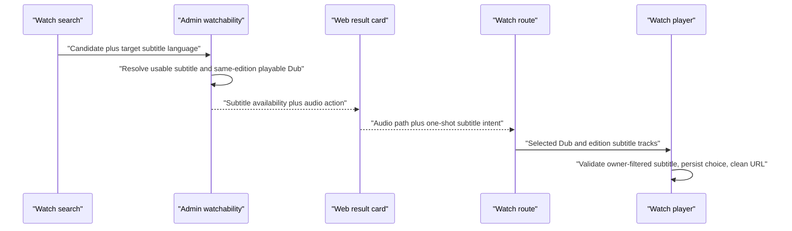
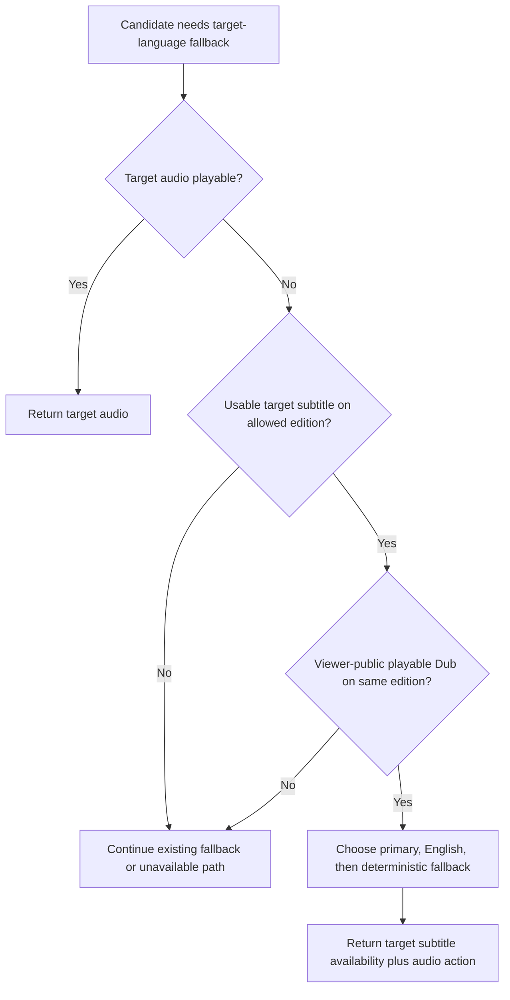

# Fix Watch search subtitle-only playback handoff

## Summary

Repair Watch search results whose requested language is available only as a
subtitle. Admin will keep the requested subtitle language as availability truth,
but choose a viewer-public playable Dub from the same Video Edition for the
watch action. Web will route with that audio language and carry the requested
subtitle as a validated one-shot intent so the player enables and persists the
translated subtitle explicitly.

The production example is the Russian query `мария`: the `perfect-2` result has
Russian subtitles but only English/Arabic audio. Today search emits
`/watch/perfect-2.html/russian.html`, which is correctly rejected by the route
manifest because Russian is not a playable audio language. After this change the
result will link to an admitted audio route and separately request Russian
subtitles.

---

## Problem Frame

Watch has two independent language identities:

- a Dub language, which is the playable language encoded in the public URL;
- a subtitle language, which belongs to the selected Dub's Video Edition and is
  applied as an explicit player preference.

The current subtitle-only search path collapses those identities.
`watchabilityFromSubtitle` returns the subtitle slug as
`action.hrefLanguageSlug` while leaving `playbackId`, `videoDubId`, and duration
empty. Both Web search clients then use that action slug as the audio route. The
route manifest and proxy correctly 404 the resulting URL because it has no
matching playable Dub.

This also leaves a stale contract elsewhere: playable `target_subtitle` rows are
documented as structurally unreachable because the producer currently returns
no playback. Once a same-edition fallback Dub is attached, those rows become
production-reachable and the comments/tests that call them synthetic must be
corrected.

---

## Requirements

- **B1 — Preserve availability truth.** A result with Russian subtitles and no
  Russian audio remains `availability.kind = target_subtitle`,
  `availability.languageSlug = russian`, `audio = false`, and
  `subtitles = true`.
- **B2 — Emit a playable action.** A `target_subtitle` result may expose a watch
  action only through a published, non-deleted, HLS-playable Dub on the same
  public Video and Video Edition as the usable target subtitle.
- **B3 — Select the Dub deterministically.** Prefer the Video's primary audio
  language, then English, then other compatible Dubs by longest duration,
  language slug, and stable Dub id. This matches the established Watch language
  inventory fallback policy.
- **B4 — Respect candidate editions.** When search evidence supplies an edition
  id, target-subtitle hydration must stay on that edition. Keyword/title
  candidates without an edition may select a compatible edition using B3.
- **B5 — Keep DEFAULT and MODERN aligned.** PostgreSQL-backed and Typesense-backed
  Watch search must produce the same dual-language result shape. Typesense must
  store the compatible fallback action in its compact per-language availability
  projection, not reintroduce all-language option JSON into the steady-state
  request path.
- **B6 — Preserve subtitle ownership at the player boundary.** Project each
  subtitle's existing nullable Video owner in the Watch payload and filter the
  selected edition's tracks to edition-wide or current-Video-owned subtitles
  before language reconciliation. A direct-video subtitle must never be
  replaced by a sibling Video's same-language track.
- **B7 — Carry subtitle intent explicitly.** Web's local `SearchResult` keeps the
  playable audio route slug and target subtitle slug as separate fields. A
  subtitle-only card href includes a validated one-shot
  subtitle intent while its path is built exclusively from the audio action
  slug.
- **B8 — Reconcile at the player.** `WatchPageClient` gives a valid one-shot
  subtitle intent precedence over the stored preference, verifies that the
  language slug exists after current-Video ownership filtering, enables it
  as an explicit v2 translated-subtitle preference, and removes the parameter
  with `history.replaceState`. Invalid or unavailable intents are removed without
  overwriting a valid stored preference.
- **B9 — Preserve navigation semantics.** The subtitle intent must work for a
  normal click, modified click, refresh, and new tab without a click interceptor.
  Copying the card href before navigation preserves the intent; after the page
  consumes and cleans it, copying the address bar intentionally shares the audio
  route only. Existing result-click analytics still fire once on the current
  click path.
- **B10 — Fail closed.** Deleted/unpublished Dubs, empty HLS values, deleted
  editions, unusable subtitle files, mismatched direct-video subtitles, and
  malformed language slugs must never create a watch action or preference.
- **B11 — Correct stale reachability documentation.** Update the agent-tools
  fixture comments and the dated roadmap/plan/solution notes that currently say
  playable `target_subtitle` rows cannot be emitted.
- **B12 — Prove the reported journey.** Browser verification must search
  `мария`, inspect/click `perfect-2`, reach a 200 audio route, and show Russian
  as the enabled subtitle without an extra player-data fetch or console error.

### Requirements traceability

| Bug contract | Origin requirements             | Implementation | Primary verification                                               |
| ------------ | ------------------------------- | -------------- | ------------------------------------------------------------------ |
| B1-B4, B10   | R18, R18a, R18c, R19, R22c      | U2             | DEFAULT watchability unit/service cases                            |
| B5           | R18, R18a, R18c, R19            | U3             | MODERN indexer/service parity cases                                |
| B6-B9        | R12, R19, R22a, R22c            | U4             | GraphQL contract, Web mapping, route, player, and navigation cases |
| B11          | R18c                            | U1             | Prose sweep and agent-tools regression case                        |
| B12          | R19 and origin success criteria | U5             | Page-level browser journey and proof capture                       |

---

## Scope

### In scope

- Admin DEFAULT watchability hydration.
- Admin MODERN/Typesense availability projection and response parity.
- Existing Watch-video GraphQL projection and Web normalization changes required
  to preserve direct subtitle ownership across the handoff.
- Existing Admin search result and agent-tools tests affected by the newly
  reachable shape.
- Web server/direct Watch search mapping, route serialization, and player
  one-shot subtitle reconciliation.
- Roadmap tracking and stale contract documentation directly invalidated by the
  producer change.
- Focused unit, type, lint, formatting, and real-browser validation.

### Out of scope

- Changing the `(AI-generated)` text embedded in the source VTT/transcript.
- Correcting source subtitle provenance or `aiGenerated` content metadata.
- Search ranking, snippets, language detection, or result-card visual design.
- Redesigning the global subtitle preference model or native Mux captions.
- Mobile/TV client adoption.
- Enabling MODERN traffic or performing any production deployment/index swap.

---

## Assumptions

- The selected annotation authorizes an explicit translated-subtitle selection
  when a viewer follows a subtitle-only search result.
- A one-shot URL parameter is preferable to setting a cookie in the card click
  handler because it survives a copied card href, modified clicks, and new tabs
  while keeping the audio route canonical after hydration cleanup. Copying the
  cleaned address bar later shares audio only; changing global sharing behavior
  is out of scope.
- The existing explicit v2 subtitle preference is the authoritative Web
  persistence mechanism and already reconciles exact language slugs against the
  selected edition's tracks.
- MODERN remains an explicit shadow/experimental mode. Its metadata generation
  will be rebuilt through the existing versioned index workflow before any
  rollout; code must remain safe during the old-alias compatibility window.
- The observed `perfect-2` route and availability snapshot are production
  evidence for the bug, not fixtures to hardcode.

---

## Key Technical Decisions

### KTD1 — Reuse the existing two-axis search GraphQL contract

Admin already exposes both values needed by Web. For a subtitle-only result:

| Field                                   | Value in the Russian/English example |
| --------------------------------------- | ------------------------------------ |
| `availability.kind`                     | `TARGET_SUBTITLE`                    |
| `availability.languageSlug`             | `russian`                            |
| `availability.audio`                    | `false`                              |
| `availability.subtitles`                | `true`                               |
| `action.hrefLanguageSlug`               | `english`                            |
| result `playbackId` / `durationSeconds` | English Dub values                   |

The slug and action fields model the two language axes. Exact direct-video
ownership is enforced where the Watch payload is normalized by selecting the
existing `VideoSubtitle.video` relation and excluding subtitles owned by sibling
Videos. This avoids widening the public search schema or coupling a public URL
to an internal subtitle record id.

### KTD2 — Bind subtitle and playback through Video Edition

The fallback Dub is not arbitrary. It must reference the edition that owns the
target subtitle. This is the synchronization boundary used by the Watch page:
the selected Dub resolves its edition, and that edition supplies the available
subtitle tracks after edition-wide/current-Video ownership filtering.

### KTD3 — Carry one-shot subtitle intent in the href

Extend the shared Watch route `BuildOptions` with a branded subtitle language
slug and serialize it as a one-shot query parameter. `VideoCard` remains a
normal `Link`; it does not mutate global state on click. `WatchPageClient`
validates and consumes the intent, writes the established explicit v2
preference only after confirming that track exists, then removes the parameter
without a router navigation.

### KTD4 — Keep Typesense hydration compact

Make MODERN availability edition-aware and extend each target-subtitle document
with the same-edition fallback action slug/playback/duration chosen at index
time. Transcript candidates retain their
winning edition id through fusion and hydration; keyword/title candidates may
use a deterministic compatible edition. The final MODERN multi-search still
fetches only catalog rows plus target/configured-fallback availability records.
It must not fetch `audioOptionsJson` on the steady-state path, preserving the
payload-projection latency fix.

### KTD5 — A playable target subtitle remains subtitle availability

Attaching playback enables navigation but does not reclassify the requested
language as audio. Downstream consumers that accept only target audio must keep
filtering on `availability.kind`; consumers that filter only on non-null
playback will now correctly see a production-reachable subtitle fallback.

---

## High-Level Technical Design

These sketches describe the required boundaries and ordering. They are
directional: implementation should follow existing repository helpers and types
rather than copy the diagrams as literal APIs.

### Search-to-player handoff

### Subtitle-only admission decisions

---

## Implementation Units

### U1 — Track the fix and correct invalidated contract notes

**Goal:** Establish the roadmap scope before code changes and remove stale
claims made false by the producer repair.

**Files:**

- Create: `docs/roadmap/content-discovery/feat-336-watch-search-subtitle-audio-routing.md`
- Modify: `docs/roadmap/README.md`
- Modify: `docs/roadmap/ai-chat/feat-326-admin-agent-tools-availability-kind.md`
- Modify: `docs/plans/2026-08-02-001-feat-seeker-video-featuring-plan.md`
- Modify: `docs/solutions/best-practices/mocked-shape-vs-real-contract-discipline-20260506.md`
- Modify: `apps/admin/src/services/experience-ai/agent-tools.service.ts`
- Modify: `apps/admin/src/services/experience-ai/agent-tools.service.test.ts`

**Approach:**

- Add `feat-336` in the Content Discovery lane with `status: "in-progress"`
  before implementation and add its README index row/count updates.
- Replace the synthetic/unreachable wording with a dated additive correction:
  the same-edition fallback now makes the shape reachable; the agent-tools
  endpoint still reports availability without owning Seeker's target-audio
  policy.
- Keep historical descriptions intact where useful, but ensure no present-tense
  assertion contradicts the new producer behavior.
- Project playable `languageSlug` from `action.hrefLanguageSlug` for agent
  results so callers do not receive the target subtitle slug as an audio route.

**Test scenarios:**

- Repository prose search finds no active claim that
  `watchabilityFromSubtitle` hardcodes null playback or that playable
  `target_subtitle` remains unreachable.
- Agent-tools test retains target-audio and subtitle-fallback rows and asserts
  the latter uses the playable action language rather than the availability
  language.

### U2 — Hydrate DEFAULT subtitle-only results with a compatible Dub

**Goal:** Make PostgreSQL-backed Watch search emit a valid action without
changing availability classification.

**Files:**

- Modify: `apps/admin/src/services/search-watchability.ts`
- Modify: `apps/admin/src/services/search-watchability.test.ts`
- Modify: `apps/admin/src/services/hybrid-search-retrievers.ts`
- Modify: `apps/admin/src/services/hybrid-search-retrievers.test.ts`
- Modify: `apps/admin/src/services/watch-search.service.ts`
- Modify: `apps/admin/src/services/watch-search.service.test.ts`

**Approach:**

- Extend the subtitle candidate row with its edition and selected Dub id,
  playback id, duration, and audio language while retaining its existing exact
  subtitle id internally.
- Replace the broad edition membership join with a bounded candidate-first SQL
  query that filters candidate video/edition pairs, usable target subtitles,
  public Video state, and same-edition playable Dubs before deterministic
  selection.
- Enforce direct subtitle ownership so a Video-scoped subtitle cannot leak to a
  sibling that merely shares the edition.
- Retain `video_edition_id` in semantic evidence rows, mixed semantic winners,
  `VideoSemanticResult`, and semantic watchability candidates so edition-scoped
  evidence cannot lose its cut before hydration.
- Populate `hrefLanguageSlug`, `playbackId`, `videoDubId`, and duration from the
  fallback Dub while keeping target subtitle identity and flags unchanged.
- Leave target audio first in the precedence ladder; only unresolved candidates
  enter subtitle hydration.

**Test scenarios:**

- Russian target audio exists: it remains `target_audio` and wins.
- Russian subtitle + same-edition English/Arabic Dubs: primary wins; otherwise
  English wins; otherwise deterministic duration/slug/id fallback wins.
- Russian subtitle + only a Dub from another edition: no subtitle watch action.
- Direct-video subtitle on a shared edition does not leak to another Video.
- Deleted/unpublished/empty-HLS Dub, deleted edition, deleted language, missing
  slug, or unusable subtitle file cannot produce an action.
- Exact/title candidate without edition can select a compatible edition;
  edition-bearing semantic candidate cannot drift to another cut.
- Mixed transcript/scene evidence retains the winning evidence row's edition.
- Watch search result keeps Russian availability while returning the fallback
  audio href and playback material.

### U3 — Preserve subtitle action parity in MODERN search

**Goal:** Make Typesense return the same production-reachable shape without
regressing its compact hydration boundary.

**Files:**

- Modify: `apps/admin/src/services/typesense-watch-search-schema.ts`
- Modify: `apps/admin/src/services/typesense-watch-search-indexer.ts`
- Modify: `apps/admin/src/services/typesense-watch-search-indexer.test.ts`
- Modify: `apps/admin/src/services/typesense-watch-search.service.ts`
- Modify: `apps/admin/src/services/typesense-watch-search.service.test.ts`

**Approach:**

- Make subtitle indexing start from usable subtitles joined to public,
  same-edition playable Dubs and enforce `(vs.video_id IS NULL OR
vs.video_id = vd.video_id)` before choosing the established deterministic
  fallback per `(video, edition, subtitle language)`.
- Retain `videoEditionId` in transcript documents and semantic candidates. Key
  subtitle availability by video, edition, and language so edition-bearing
  candidates hydrate only their own cut; exact/title candidates without an
  edition select the deterministic compatible record.
- Add the target subtitle's English label plus compatible action slug, playback
  id, duration, and edition id to the compact availability projection.
- Preserve target-audio precedence when an availability document has both audio
  and subtitles in the same language.
- Have both steady-state and legacy compatibility resolvers populate
  `target_subtitle` playback/action fields only when the indexed projection
  actually carries them. Never synthesize the subtitle slug as an audio href.
- Add the compact action field to final availability `include_fields`; keep
  all-language option JSON out of the normal request.
- Treat an old availability alias that rejects a newly projected field as a
  compatibility condition: make one bounded retry through the existing legacy
  catalog resolver. Keep this distinct from the missing-alias fallback, and do
  not retry arbitrary 4xx/5xx failures.

**Test scenarios:**

- New availability document for Russian subtitles carries English fallback
  action/playback and edition id and resolves to
  `target_subtitle` with separate slugs.
- Audio+subtitle in Russian resolves to target audio.
- Old alias/legacy subtitle record lacking action metadata does not emit Russian
  as an audio href.
- An old alias that returns an unknown-field error for the new compact
  projection takes exactly one legacy retry; unrelated errors still fail.
- Direct-video Russian subtitle on a shared edition is never indexed for the
  sibling Video, and semantic edition evidence cannot hydrate another cut.
- Related-language fallback priority remains unchanged.
- Query batching and include/exclude fields remain bounded; steady-state final
  hydration does not request `audioOptionsJson` or `subtitleOptionsJson`.

### U4 — Carry and consume the subtitle intent on Web

**Goal:** Route to playable audio and intentionally enable the target subtitle
for every normal browser navigation mode.

**Files:**

- Modify: `apps/web/src/lib/search.ts`
- Modify: `apps/web/src/lib/search.test.ts`
- Modify: `apps/web/src/lib/watch-search-client.ts`
- Create: `apps/web/src/lib/watch-search-client.test.ts`
- Modify: `apps/web/src/lib/fragments/watch-video.ts`
- Modify: `apps/web/src/lib/fragments/__tests__/watch-video.test.ts`
- Modify: `apps/web/src/lib/content.ts`
- Modify: `apps/web/src/lib/content.test.ts`
- Modify: `apps/web/src/lib/routes.ts`
- Modify: `apps/web/src/lib/routes.test.ts`
- Modify: `apps/web/src/components/search/VideoCard.tsx`
- Modify: `apps/web/src/components/search/VideoCard.test.tsx`
- Modify: `apps/web/src/components/watch/WatchPageClient.tsx`
- Modify: `apps/web/src/components/watch/__tests__/WatchPageClient.download.test.tsx`

**Approach:**

- Select `availability.languageSlug` in both Web search operations.
- Add `subtitleLanguageSlug` to Web's local `SearchResult` only for
  `TARGET_SUBTITLE`; keep `languageSlug` sourced from the action audio slug.
- Select the existing nullable owner relation on Watch edition subtitles and
  normalize only edition-wide subtitles or tracks owned by the current Video.
  Prefer current-Video-owned tracks before edition-wide tracks when the same
  language has both, then preserve the existing deterministic dedupe.
- When a subtitle-only result lacks a valid action slug, do not fall back to the
  availability/root language or assume English; return the safe Watch-home
  fallback rather than constructing a speculative content route.
- Add a branded optional subtitle language to route `BuildOptions` and serialize
  it deterministically alongside existing one-shot parameters.
- Have `defaultHrefBuilder` validate both slugs and emit the playable audio path
  plus subtitle intent for subtitle-only rows.
- At player initialization, prefer a valid URL subtitle intent over the cookie,
  require an exact language-slug match in the ownership-filtered selected
  edition subtitles, enable it with
  explicit translated-preference semantics, persist it through
  `writeSubtitlePreference`, and strip the parameter with
  `history.replaceState`.
- If the intent is malformed or unavailable, strip it and apply the existing
  stored/default reconciliation without mutation.

**Test scenarios:**

- Server and direct clients map English action + Russian availability into
  `languageSlug = english` and `subtitleLanguageSlug = russian`.
- Subtitle-only card href is `/perfect-2.html?subtitles=russian` for canonical
  English audio, or the equivalent explicit non-English audio route.
- Target-audio and related-language cards do not add subtitle intent.
- Invalid audio/subtitle slugs and subtitle languages absent from the
  ownership-filtered loaded edition do not enter a route or preference.
- Route builders preserve stable ordering with `t`, `autoplay`, `_lr`, and the
  subtitle parameter.
- Valid URL intent enables Russian, writes the explicit `v2:russian`
  preference, and cleans the visible URL without router navigation.
- Missing/malformed/unavailable intent is cleaned and does not overwrite a
  valid existing preference.
- Explicit URL intent beats a different stored translated-subtitle preference.
- Existing result-click callback/analytics behavior remains exactly once.

### U5 — Validate the real journey and complete tracking

**Goal:** Prove the reported failure no longer exists and close the scoped
roadmap work.

**Files:**

- Modify: `docs/roadmap/content-discovery/feat-336-watch-search-subtitle-audio-routing.md`
- Modify: `docs/roadmap/README.md`

**Approach:**

- Run focused Admin and Web tests, then app-scoped typecheck/lint and repository
  formatting checks.
- Start the appropriate local Admin/Web stack with production-shaped search
  data using repo workflows.
- Through the page-level Watch search modal, search `мария`, inspect the
  `perfect-2` href, click it, and verify the audio route, player, selected
  Russian subtitle, cleaned URL, and browser console/network state.
- Confirm the API result retains `TARGET_SUBTITLE` classification. No new
  result-card availability badge is required by this fix.
- Capture a screenshot as visual proof and compare page-load requests/timing to
  ensure the new client intent does not add a data fetch or hydration loop.
- Set `feat-336` to `complete` only after validation passes; record any genuine
  residual as a separate follow-up ticket rather than widening this fix.

---

## Verification Contract

### Focused tests

- Run the Admin unit files named in U1-U3 together so producer, result mapping,
  MODERN parity, and agent-tools reachability are exercised in one focused pass.
- Run the Web unit files named in U4 together so both search clients, route
  serialization, card hrefs, and player reconciliation are exercised in one
  focused pass.

### Static validation

- Run repo-native Admin and Web typechecks.
- Run app-scoped Admin and Web lint.
- Run the repository formatting check after documentation updates settle.

### Browser scenarios

1. Open the page-level search modal on the local Watch surface.
2. Search `мария` with Russian as the resolved target language.
3. Confirm the `perfect-2` API result remains classified as
   `TARGET_SUBTITLE` and its href path uses a playable same-edition audio
   language; this fix does not add a visible availability badge to the card.
4. Open the card normally and in a new tab; both routes return 200.
5. Confirm the player uses the fallback audio Dub and Russian is enabled as the
   selected Forge subtitle.
6. Confirm the subtitle query parameter disappears after hydration while the
   explicit v2 preference remains.
7. Reload and confirm Russian restores only because it is a supported explicit
   translated preference.
8. Confirm no console/page errors, no additional player-data request caused by
   the intent, and no page-loading regression.

### Regression scenarios

- Target-audio results retain their current canonical route and subtitle
  defaults.
- Related-language results retain their existing action and classification.
- A subtitle record with no same-edition playable Dub cannot create a broken
  route.
- A stale URL subtitle intent cannot select an arbitrary first translated
  track.
- The MODERN path does not reintroduce all-language final hydration payloads.

---

## System-Wide Impact

- **Admin producer:** `target_subtitle` becomes a playable result shape when a
  compatible Dub exists. Search ranking/classification stays unchanged.
- **GraphQL:** no schema change; Web selects the existing subtitle owner relation
  in its Watch-video operation and the existing availability language field in
  search operations.
- **Web routing:** public path continues to encode audio only; one-shot subtitle
  state is query-carried and removed after consumption.
- **Player state:** validates the subtitle slug against ownership-filtered tracks,
  then persists via the existing exact-slug, explicit-v2 preference model.
- **Agent tools:** subtitle fallbacks now pass the existing non-null playback
  gate; downstream kind filters become operationally relevant rather than
  synthetic.
- **Typesense operations:** the next versioned metadata/availability rebuild
  must populate the compact fallback action before MODERN parity is measured.
- **Performance:** DEFAULT adds no post-hydration N+1 query; MODERN keeps bounded
  target-language availability hydration. Browser intent parsing adds no
  network request.

---

## Risks and Mitigations

- **Wrong-edition captions:** An arbitrary fallback Dub could desynchronize
  subtitles. Mitigation: preserve semantic edition identity, enforce matching
  `video_edition_id` in DEFAULT and index-time MODERN selection, and filter the
  Watch payload by current-Video ownership, with cross-edition negative tests.
- **Direct subtitle leakage:** A subtitle explicitly scoped to one Video could
  be inherited by siblings sharing the edition. Mitigation: enforce the direct
  `video_id` predicate and test the shared-edition case.
- **Code-first Typesense deploy:** New code may query an old alias without the
  compact action fields. Mitigation: recognize the specific unknown-field error,
  take one bounded legacy retry, and never fall back to using the subtitle slug
  as audio; MODERN remains non-default until the versioned rebuild completes.
- **Preference corruption:** A malformed/stale query could overwrite the user's
  subtitle preference. Mitigation: exact-slug validation against
  ownership-filtered loaded tracks before persisting; otherwise clean the URL
  and retain the existing preference.
- **Canonical/query loops:** Removing a one-shot through router navigation could
  refetch or re-enter proxy logic. Mitigation: mirror existing
  `history.replaceState` cleanup and assert no router push/network request.
- **Downstream behavior expansion:** Agent tools will begin receiving playable
  subtitle fallbacks. Mitigation: update reachability tests/comments and verify
  target-audio-only consumers filter the availability kind.

---

## Rollback

- Revert the Admin/Web commit through the normal PR flow. There is no database
  migration or GraphQL schema rollback.
- Keep `watchSearch` omitted/`DEFAULT` routing unchanged during any MODERN index
  issue; MODERN remains an explicit experiment.
- Typesense metadata/availability collections are versioned and alias-swapped;
  roll back catalog and availability aliases together while leaving transcript
  vectors untouched.
- A partial rollback must not leave Web emitting subtitle query intent while
  Admin has reverted to subtitle slugs as route actions. Prefer reverting the
  coordinated PR as one unit.

---

## Source Grounding

- Requirements origin:
  `docs/brainstorms/2026-07-14-universal-multilingual-watch-search-requirements.md`
- Prior implementation contract:
  `docs/plans/2026-07-14-001-feat-watch-universal-multilingual-search-plan.md`
- Domain vocabulary: `CONCEPTS.md` (`Dub`, `Video Edition`, `Language`).
- Subtitle intent precedent:
  `docs/solutions/ui-bugs/watch-caption-language-availability-20260615.md`
- Public audio-route precedent:
  `docs/solutions/ui-bugs/watch-local-links-must-preserve-route-language.md`
- Exact language identity precedent:
  `docs/solutions/best-practices/language-identity-on-slug-not-bcp47-20260605.md`
- MODERN payload boundary:
  `docs/solutions/performance-issues/typesense-watch-search-payload-projection-latency.md`
- Same fallback order precedent:
  `apps/admin/src/services/video.service.ts` (`fallback_dub`).

---

## Planning Confidence

- The root cause is directly observed in live behavior and current producer/
  consumer code.
- The existing two language axes remain sufficient; filtering the Watch payload
  through its existing subtitle owner relation closes the independently reviewed
  ownership gap without widening the search contract.
- Each implementation unit names exact files, invariants, failure cases, and
  validation.
- The plan preserves the originating multilingual-search decisions: Admin owns
  watchability/action truth, target subtitles remain labeled fallback, and Web
  does not infer media availability.
- The main implementation risk—edition and direct-subtitle alignment—is explicit
  and tested on both search backends and at the player handoff.
