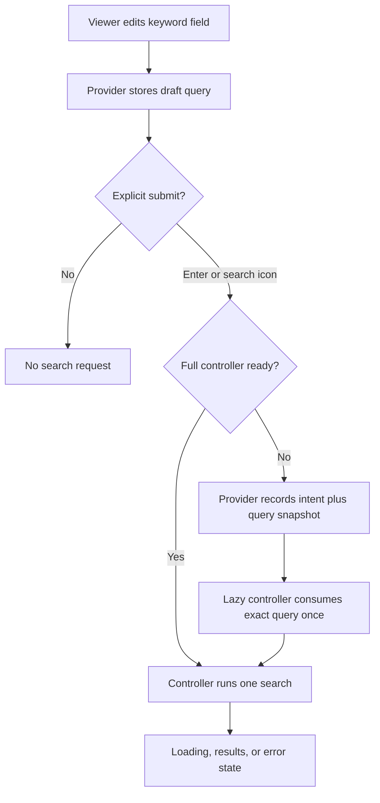

# feat: Add explicit Watch search submission

## Summary

Make the Watch keyword field update locally while a viewer types and run keyword searches only from an explicit submit action. Enter, the mobile keyboard Search action, and a visible search icon will share one accessible submission path across the instant shell and full overlay; category and language controls retain their existing explicit actions.

---

## Problem Frame

The current overlay starts a request 300 ms after every input change even though the current Watch contract says viewers type a query and submit it. This creates avoidable searches for partial queries and makes the search icon decorative. The lazy instant shell also prevents Enter without preserving that submit intent for the full controller.

---

## Requirements

### Preserved origin contract

- R1. A viewer can type a query, press Enter, and receive results without changing the page URL.
- R2. A viewer can edit the draft, submit again, and replace the result set without navigation.
- R3. Category clicks continue to populate the field and run their explicit search.
- R4. Load more continues from the active in-memory query, language selection, source, and offset.
- R5. Empty, loading, skeleton, error, no-results, and stale-request behavior remain tied to the current request lifecycle.
- R7. Opening, closing, and searching do not add, remove, or rewrite `q` in the URL.
- R9. Search interactions do not modify unrelated URL parameters.
- R10. Route language and search-language selection continue to influence requests.
- R11. Result links continue to use Watch route builders and public audio-language slugs.
- R12. The modal remains the canonical Watch search surface.

### Explicit submission extension

- R13. Typing, pasting, or editing the keyword field updates draft UI state without issuing a search request.
- R14. Enter, the virtual-keyboard Search action, and the visible search icon submit the current non-empty query through one semantic form path.
- R15. Each explicit submit dispatches at most one initial-page search; empty or whitespace-only input cannot dispatch a server request.
- R16. A cold-shell submit is preserved and consumed once after the lazy controller becomes ready, while shell typing alone never triggers a search on mount.
- R17. The field uses native search semantics and the icon has an accessible name, visible focus, disabled state, and a target of at least 44 by 44 CSS pixels.
- R18. Desktop and narrow-mobile layouts retain the white-pill geometry, autofocus, lazy loading, metadata caching, and stable persistent-header position.

---

## Assumptions

- Category and search-language controls remain immediate search actions because they are already explicit choices and the origin contract requires category clicks to run a search.
- Existing results remain visible while the viewer edits the draft query; only a submit replaces the active result set.
- The existing leading magnifier becomes the submit control so the field gains an action without crowding the clear affordance or changing header width.
- Existing translated search labels are sufficient for the icon's accessible name; no new message-catalog key is required.

---

## Key Technical Decisions

- **Use a native search form:** A `<form>` with a search input and submit button gives pointer, hardware-keyboard, and virtual-keyboard actions one browser-native event boundary. This follows the HTML search-control and `enterkeyhint="search"` contracts instead of emulating Enter with component-specific keydown handlers.
- **Choose explicit results submission for this surface:** Apple recommends live results when feasible, but the Watch origin contract already defines a submit step and each query can invoke language resolution plus remote retrieval. Draft-only typing avoids partial-query requests while keeping categories and filters available as explicit accelerators.
- **Separate input mutation from request dispatch:** The overlay will remove its debounce request path; `onChange` will only update provider-owned query state. The controller's request-id and lifecycle guards remain the single search execution boundary.
- **Queue the cold-shell query snapshot in the provider:** A provider-owned submit intent will carry both a monotonic identity and the exact query present when the viewer submits. The lazy controller consumes the latest unhandled intent once, so later draft edits cannot change the queued request and ordinary rerenders cannot replay it.
- **Preserve the current visual system:** The existing pill, typography, spacing tokens, and focus language remain authoritative. The magnifier gains a persistent circular button treatment, 44-pixel target, and hover, active, disabled, and focus states instead of introducing a second visual system or crowding the custom clear control.

---

## High-Level Technical Design

---

## Implementation Units

### U1. Track the scoped roadmap work

- **Goal:** Create the next content-discovery ticket before runtime edits and close it when delivery is verified.
- **Requirements:** R1-R5, R7, R9-R18
- **Dependencies:** None
- **Files:** `docs/roadmap/content-discovery/feat-336-watch-search-explicit-submit.md`
- **Approach:** Record the current entry points, explicit-submit contract, mobile constraints, and focused verification. Start as `in-progress`; flip to `complete` only after code, browser proof, and review pass.
- **Patterns to follow:** `docs/roadmap/content-discovery/feat-244-search-modal-instant-shell.md`, `docs/roadmap/content-discovery/feat-250-watch-search-close-reset.md`
- **Test expectation:** none -- this unit records and closes delivery status rather than changing runtime behavior.
- **Verification:** The ticket follows the content-discovery format, uses the next global ID, and matches the shipped scope.

### U2. Make the shared field a semantic submit surface

- **Goal:** Give the full overlay and instant shell the same native search and icon-submit interaction.
- **Requirements:** R1, R2, R13-R15, R17, R18
- **Dependencies:** U1
- **Files:** `apps/web/src/components/FloatingSearchField.tsx`, `apps/web/src/components/SearchOverlay.tsx`, `apps/web/src/components/SearchOverlayInstantShell.tsx`, `apps/web/src/components/__tests__/FloatingSearchProvider.test.tsx`
- **Approach:** Render the shared field as a search form, keep the input controlled, use native search and virtual-keyboard hints, and turn the leading magnifier into a visually distinct circular submit button with empty, hover, active, and focus states.
- **Execution note:** Add focused interaction assertions before replacing the existing keydown-only behavior.
- **Patterns to follow:** Existing `FloatingSearchFieldInput` visual tokens and focus styles; `docs/solutions/ui-bugs/watch-search-first-open-lazy-shell-autofocus.md`
- **Test scenarios:**
  - Type a non-empty query and verify no request runs before submission.
  - Submit by Enter and verify one request uses the complete query.
  - Submit by the icon and verify one request uses the complete query.
  - Leave the query empty or whitespace-only and verify the submit control cannot dispatch.
  - Inspect the input and button attributes for search semantics, virtual-keyboard Search intent, accessible naming, and a 44-pixel target class.
- **Verification:** Both overlay owners expose equivalent form semantics without changing field/header geometry.

### U3. Enforce explicit dispatch in the full overlay

- **Goal:** Remove live-as-you-type requests while preserving the existing search lifecycle after submission.
- **Requirements:** R1-R5, R7, R9, R10, R13-R15
- **Dependencies:** U2
- **Files:** `apps/web/src/components/SearchOverlay.tsx`, `apps/web/src/components/FloatingSearchController.tsx`, `apps/web/src/components/__tests__/FloatingSearchProvider.test.tsx`
- **Approach:** Make input change draft-only, route form submission to the existing guarded controller search method, and remove debounce/pending-query effects that can dispatch partial queries. Keep category, language, clear, retry, pagination, and stale-request behavior on their existing explicit paths.
- **Execution note:** Convert debounce-based tests to explicit submission tests and add a discriminating no-request-before-submit assertion.
- **Patterns to follow:** Request ownership and stale-response guards in `FloatingSearchController`; `docs/solutions/ui-bugs/watch-search-url-hydration-perpetual-loading.md`
- **Test scenarios:**
  - Advance timers beyond the old debounce window after typing and verify no request runs.
  - Submit an edited query and verify only the final value replaces the result set.
  - Clear the field and verify local results reset without an empty server request.
  - Select a category or search language and verify its existing explicit action still searches.
  - Load more after a submitted query and verify the active search signature still supplies offset and language context.
- **Verification:** Focused tests prove that ordinary input events cannot reach the network while all post-submit lifecycle states still work.

### U4. Preserve a cold-shell submit across lazy loading

- **Goal:** Make the first mobile interaction reliable even when the full search controller has not loaded.
- **Requirements:** R1, R2, R5, R16, R18
- **Dependencies:** U2, U3
- **Files:** `apps/web/src/components/FloatingSearchProvider.tsx`, `apps/web/src/components/FloatingSearchController.tsx`, `apps/web/src/components/SearchOverlayInstantShell.tsx`, `apps/web/src/components/__tests__/FloatingSearchProvider.test.tsx`
- **Approach:** Record a provider-owned intent containing a monotonic identity and the submitted query snapshot, pass it into the lazy controller, consume each intent once, and remove the mount-time behavior that searches any non-empty shell query without a submit.
- **Execution note:** Characterize the cold shell directly before changing the handoff signal.
- **Patterns to follow:** Provider-owned shell/controller handoff in `FloatingSearchProvider`; `docs/solutions/ui-bugs/watch-search-first-open-lazy-shell-autofocus.md`
- **Test scenarios:**
  - Type in the instant shell, allow the controller to mount, and verify no search runs.
  - Submit from the instant shell before controller readiness and verify exactly one search runs after handoff.
  - Edit the draft again before handoff completes and verify the request still uses the submitted snapshot rather than the later draft.
  - Trigger repeated state renders without a new intent and verify the queued submit is not replayed.
  - Close and reopen after submission and verify query/results reset while language metadata remains cached.
- **Verification:** A cold first open behaves like a warmed open and does not add eager controller loading or reopen metadata requests.

---

## Acceptance Examples

- AE1. **Draft-only typing**
  - **Given:** Search is open with categories or existing results visible.
  - **When:** The viewer types `jesus` and pauses longer than 300 ms.
  - **Then:** The input shows `jesus` and no search request runs.
  - **Covers:** R13, R15
- AE2. **Keyboard submit**
  - **Given:** The draft query is `jesus`.
  - **When:** The viewer presses Enter or the mobile Search key.
  - **Then:** One search runs for `jesus` and the URL does not change.
  - **Covers:** R1, R2, R7, R9, R14, R15, R17
- AE3. **Icon submit**
  - **Given:** The draft query is non-empty.
  - **When:** The viewer activates the magnifier by touch, pointer, or keyboard.
  - **Then:** One search runs through the same submit path and focus remains operable.
  - **Covers:** R2, R14, R15, R17
- AE4. **Cold first-open submit**
  - **Given:** The search controller bundle is still loading.
  - **When:** The viewer types and submits in the instant shell.
  - **Then:** The controller consumes that submit once after handoff and renders the result lifecycle.
  - **Covers:** R5, R16, R18

---

## Scope Boundaries

- No search ranking, provider, API, result-card, pagination-size, or URL-contract changes.
- No new full-page search route, suggestions, recent searches, voice search, or native mobile-app work.
- No eager loading of the full controller and no removal of the instant shell or metadata cache.
- No broad redesign of the Watch floating header or search-language selector.

---

## Risks & Dependencies

- **Duplicate cold-submit risk:** The instant shell and full overlay are separate input owners. Mitigate with a monotonic provider-owned intent consumed once by the controller and a rerender replay test.
- **Browser chrome risk:** Native `type="search"` can add a second clear affordance. Retain the product's custom clear control and suppress conflicting user-agent styling only when browser proof observes it.
- **Coverage drift risk:** Existing helpers treat timer advancement as submission. Replace them with semantic form actions, then retain discriminating pagination, language, reset, and stale-request assertions so the conversion does not shrink coverage.
- **Mobile proof limit:** DOM focus does not prove the software keyboard or its Search label on Mobile Safari. Use the input attributes as deterministic contract proof and a real narrow-mobile browser smoke for focus, geometry, and touch operation.
- **Loading-performance risk:** Moving submit ownership could tempt eager controller mounting. Keep the controller disabled until first open and verify the cold shell plus zero additional metadata requests on reopen.

---

## Documentation / Operational Notes

- Validate the focused provider suite, Web typecheck, lint/format-sensitive checks, and one desktop plus one narrow-mobile browser smoke.
- Capture a screenshot of the open modal and DOM proof for no request before submit, one request after submit, the 44-pixel icon target, and the search input attributes.
- Confirm page-loading behavior is unchanged: the lazy controller remains disabled until first search open and reopening does not add a language metadata request.

---

## Sources & Research

- Product contract: `docs/brainstorms/2026-06-24-watch-search-local-state-requirements.md`
- Existing local UI lifecycle: `apps/web/src/components/FloatingSearchProvider.tsx`, `apps/web/src/components/SearchOverlay.tsx`, `apps/web/src/components/SearchOverlayInstantShell.tsx`
- Prior local learnings: `docs/solutions/ui-bugs/watch-search-url-hydration-perpetual-loading.md`, `docs/solutions/ui-bugs/watch-search-first-open-lazy-shell-autofocus.md`
- HTML search semantics and virtual-keyboard intent: <https://html.spec.whatwg.org/multipage/input.html>, <https://html.spec.whatwg.org/dev/interaction.html>
- Search-field composition guidance: <https://developer.apple.com/design/human-interface-guidelines/search-fields>
- Explicit Return-key search precedent: <https://developer.android.com/develop/ui/views/search/search-dialog>
- Touch target guidance: <https://www.w3.org/WAI/WCAG22/Understanding/target-size-enhanced>
