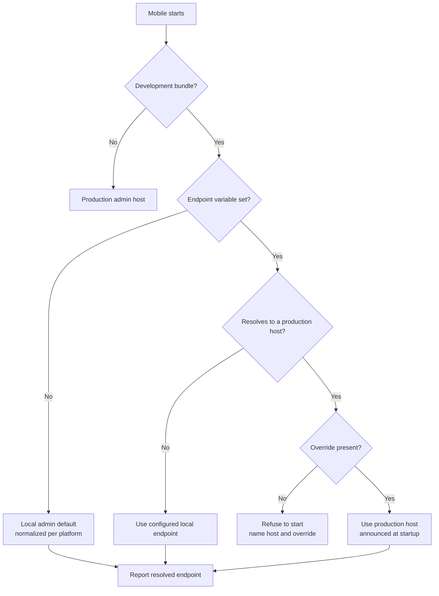
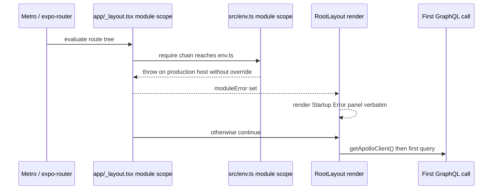

# Mobile Local Admin Endpoint - Plan

## Goal Capsule

- **Objective:** Make `apps/mobile` development builds talk to a local admin instance by default, so no local session reaches production admin without a deliberate, visible override.
- **Authority:** Urim owns `apps/mobile` and builds this. No `apps/admin` code changes. The Product Contract below is settled — planning may not widen it.
- **Execution profile:** One PR. U1-U4 are code in `apps/mobile`; U5 is documentation; U6 is an Expo dashboard action with no diff; U7 touches one npm script plus the docs that reproduce it; U8 is the roadmap ticket.
- **Stop conditions:** Stop and surface if the refusal cannot be raised at env module evaluation without breaking an unrelated surface; if the implementer's `eas-cli` differs from the version KTD5 was checked against and does not inject `EXPO_NO_DOTENV=1`; or if satisfying R11 would require a production-admin change.
- **Tail ownership:** U6 leaves EAS dashboard state that no commit records. Whoever runs it pastes the pre-mutation capture and the values set into the PR, so a reviewer can confirm R11 landed — and roll it back — without dashboard access.
- **Open blockers:** None. Every requirement is buildable today.

---

## Product Contract

### Summary

Mobile development builds resolve the admin GraphQL endpoint to a local admin instance by default, refuse to start against a production admin host unless explicitly overridden, and name the resolved endpoint at startup. A per-machine override lives in a file that neither the secrets fetch nor release bundling can touch. Two env-file hazards on the release path are removed alongside it.

### Problem Frame

Mobile reaches production admin whenever the endpoint variable is unset, because `apps/mobile/src/lib/config.ts` falls back to a hardcoded production URL with no signal. The variable is set to a local endpoint in the main checkout today, hand-added — but that is the fragile state, not a safe one: it is absent on a fresh clone, absent in a fresh worktree, and removed by the next `fetch-secrets`. Each of those returns the app to production silently. `apps/tv` does not share this shape — its endpoint variable is required with no fallback.

The cost is no longer only read traffic. Since `#1823`, mobile issues `RecordWatchSearchEvent`, a public mutation that writes rows into admin's `watchSearchEvent` table. Admin separately writes two rows per search on the read path — an unconditional `searchTraceAggregate` upsert plus a `searchTrace` row whose retention gate returns true on every production branch — and the stored query text is only pattern-redacted, so ordinary queries persist verbatim. Opening the Discover tab fires six searches unattended per cold launch, before anyone types. A development session therefore contributes both client-issued mutations and server-side analytics rows to production.

Configuration drift is the second half of the problem, and every instance of it is silent. `pnpm --filter @forge/mobile fetch-secrets` replaces `.env.local` wholesale from Doppler rather than merging, so a hand-added endpoint line does not survive. That is not hypothetical: a recent run of that command restored dead Strapi-era variables and dropped the admin endpoint, which is why it had to be hand-added back. `scripts/setup-sim-env.sh` copies `.env.local` into new worktrees, propagating whichever endpoint the main checkout carries. Metro inlines `EXPO_PUBLIC_*` at bundler startup, so an edit made after boot appears to work and does not. None of these produce an error.

There is a leak direction too. `eas update` runs `expo export` on the developer's machine in production mode, and production mode reads `.env.local` — unless `--environment` is passed, which `update:preview` does not do today. A local endpoint placed in `.env.local` can therefore be inlined into a bundle delivered to preview testers. The only thing currently standing between that and a shipped build is `update:preview` swapping in `apps/mobile/.env.production`, which carries dead Strapi configuration, no admin endpoint, no search bearer, and no Datadog variables — so the swap that prevents the leak also strips a published preview of telemetry and its rate-limit bucket.

### Key Decisions

- **Local admin is expected to serve production-shaped content, not fixture data.** (session-settled: user-directed — chosen over a fixture-only seed and over keeping production as the read source: a fixture admin has no dubs, images, or downloads, so Home falls through to its frozen fallback and most screens render empty, which makes the local default something a developer routes around rather than uses.) Getting that content in place is deferred — see the next decision — but it is the assumed end state, and the endpoint switch is worth shipping before it arrives.

- **A development build fails closed against production admin.** (session-settled: user-directed — chosen over a warn-only startup banner and over a silent default with a CI-only guard: rollback for a local development build is editing one file and restarting Metro, so the enforcement point can sit at startup without risking an unrecoverable state.)

- **Two independent layers, failing safe in opposite directions.** (session-settled: user-approved — chosen over either layer alone: a code-level default alone leaves the leak path open, because the endpoint variable never passes through the development flag and can still be inlined by `expo export`; a file-based override alone leaves a fresh clone or a wiped secrets file pointing at production. The mode-scoped file contains the leak, the code default removes the setup step.)

- **The per-machine override lives in a mode-scoped env file.** (session-settled: user-approved — chosen over `.env.local` and over adding the value to Doppler: `.env.development.local` is loaded only in development mode and is never written by the secrets fetch, so it both survives the wipe and cannot reach a production export. Doppler would couple a per-machine value to a shared secret store.)

- **Internally distributed development builds inherit the local default, and that is accepted.** (session-settled: user-directed — chosen over narrowing the default below the development flag and over pinning an explicit endpoint for shared builds: anyone running a development build is expected to stand up local admin first, the same due diligence the repo already assumes for local work. No mechanism keeps a teammate's build on production.)

- **The local-content runbook is out of this plan and belongs to `feat-328`.** (session-settled: user-directed — chosen over shipping the runbook here as unverified steps: its central step restores a production snapshot that does not currently exist, because the job producing it is broken under `feat-328`, and there is no manual trigger. Whoever fixes that job will have a working snapshot in front of them and can write accurate steps; writing them here would mean guessing at details and leaving this plan waiting on another owner's timeline.)

- **The two release-path env hazards ship with this plan.** (session-settled: user-directed — chosen over deferring them to a separate ticket: both sit on the same `.env.local` lifecycle this plan changes, and the preview publish path is the concrete route by which a local endpoint could reach testers.)

Endpoint resolution after this plan:

### Requirements

**Endpoint resolution**

- R1. A development bundle resolves the admin GraphQL endpoint to a local admin instance by default, with no environment file present.
- R2. A development bundle that resolves to a production admin host refuses to start, and the failure names both the resolved host and the way to override it.
- R3. An explicit override lets a development bundle use a production admin host.
- R4. Endpoint resolution normalizes local host spellings so one configured value works on both the iOS simulator and the Android emulator.
- R5. A development bundle reports its resolved admin endpoint at startup, on every path including the override path.
- R6. Release bundles are unaffected: their endpoint resolution, and their production default, are unchanged.
- R12. A development bundle whose resolved endpoint is unreachable says so unmistakably, naming the endpoint it tried, so a frozen-fallback Home cannot be mistaken for a loaded one.

**Non-production hosts**

- R13. Only a known production admin host triggers the refusal. A LAN address, an emulator alias, a tunnel, or any other non-production host resolves normally, so the documented physical-device workflow keeps working.

**Durable per-machine configuration**

- R7. The documented per-machine override slot is a file that `pnpm --filter @forge/mobile fetch-secrets` does not overwrite.
- R8. The documented per-machine override slot is a file that production-mode bundling never loads, which covers `expo export` and every `eas update` that names an environment.

**Release-path hygiene**

- R9. No script or build path depends on the dead Strapi-era production env file, and every in-repo document that reproduces the old recipe is corrected. The file itself is gitignored, so its deletion is a documented local step, not a diff.
- R10. Every publish path names its EAS environment explicitly and cannot read a developer's local env files, on the production channel as well as preview.
- R11. Every EAS environment used for publishing carries the variables a published bundle needs at a visibility `eas update` can read, and carries no dead Strapi credentials.
- R14. A scripted production publish path exists, so shipping a hotfix is never a hand-typed command.

### Key Flows

- F1. Fresh clone or fresh worktree
  - **Trigger:** A developer runs Metro in a checkout with no mobile environment file.
  - **Steps:** Endpoint resolution finds no configured value; the development default resolves to local admin, normalized for the running platform; the resolved endpoint is reported at startup.
  - **Outcome:** The session is pointed at local admin with nothing to remember or seed.
  - **Covered by:** R1, R4, R5

- F2. Secrets fetch wipes the environment file
  - **Trigger:** A developer runs `fetch-secrets`, which replaces `.env.local` wholesale.
  - **Steps:** The per-machine override file is untouched; endpoint resolution still finds the local value, or falls to the local default if no override file exists.
  - **Outcome:** The endpoint survives the wipe. This is the drift that occurred in the current checkout.
  - **Covered by:** R1, R7

- F3. A developer needs production content temporarily
  - **Trigger:** A developer sets the endpoint to production admin in a development build.
  - **Steps:** Resolution detects a production host; without the override the build refuses to start and names the fix; with the override it proceeds and announces the production endpoint at startup.
  - **Outcome:** Reaching production is possible but never accidental or quiet.
  - **Covered by:** R2, R3, R5

- F4. Publishing a preview build
  - **Trigger:** A developer publishes an update to the preview channel.
  - **Steps:** The publish path reads its environment from EAS Environments with the environment named explicitly; no local file is copied over `.env.local`; the per-machine override file is not loaded in production mode.
  - **Outcome:** A local endpoint cannot reach preview testers.
  - **Covered by:** R8, R9, R10

### Acceptance Examples

- AE1. Development default with no configuration
  - **Covers R1, R5.**
  - **Given** a checkout with no mobile environment file, **when** Metro starts a development bundle, **then** the app queries local admin and the startup report names that endpoint.

- AE2. Production host in a development bundle
  - **Covers R2.**
  - **Given** the endpoint variable set to a production admin host and no override, **when** a development bundle starts, **then** it refuses to start and the message names the resolved host and the override.

- AE3. Override present
  - **Covers R3, R5.**
  - **Given** the same production host with the override set, **when** a development bundle starts, **then** it runs against production admin and the startup report names that endpoint.

- AE4. Android emulator reachability
  - **Covers R4.**
  - **Given** the same configured local endpoint value used on the iOS simulator, **when** a development bundle runs on the Android emulator, **then** requests reach local admin without editing the configured value.

- AE5. Release bundle unchanged
  - **Covers R6.**
  - **Given** a preview or production bundle, **when** it starts with no endpoint variable set, **then** it uses the production admin host and neither the refusal nor the startup report fires.

- AE6. Secrets fetch does not revert the endpoint
  - **Covers R7.**
  - **Given** a per-machine override file naming local admin, **when** `fetch-secrets` runs and replaces `.env.local`, **then** the next development bundle still resolves to local admin.

- AE7. A local endpoint cannot reach a published bundle
  - **Covers R8, R10.**
  - **Given** a developer machine whose per-machine override file names local admin, **when** an update is published on either channel, **then** the bundle resolves to the production admin endpoint and contains no reference to the local host.

- AE8. Publishing is safe even when `.env.local` names a local endpoint
  - **Covers R10, R14.**
  - **Given** `.env.local` carrying a local admin endpoint — the state the main checkout is in today — **when** a production update is published through its script, **then** the local host does not reach the bundle. Production is the channel that matters: a bad update there self-installs on every beta tester's next launch.

- AE9. Telemetry and the rate-limit bucket survive a publish
  - **Covers R11.**
  - **Given** a published update on either channel, **when** the bundle runs on a device, **then** it carries the search bearer and the Datadog variables — the values the old file-swap stripped, leaving published previews untelemetered and in the shared rate-limit bucket.

- AE12. A hotfix does not require a hand-typed command
  - **Covers R14.**
  - **Given** a JavaScript-level defect in a shipped beta build, **when** an operator ships the fix, **then** a single scripted command publishes it with the environment named — no flag to remember under pressure.

- AE10. Local admin is not running
  - **Covers R12.**
  - **Given** a development bundle resolved to local admin with nothing listening on that port, **when** the app starts and the first query fails, **then** it says the endpoint is unreachable and names it, over whatever Home renders, so the fallback cannot be mistaken for a loaded state.

- AE11. A LAN address is not treated as production
  - **Covers R13.**
  - **Given** the endpoint set to a LAN address for physical-device work, **when** a development bundle starts without the override, **then** it runs normally and the refusal does not fire.

### Scope Boundaries

- Getting production-shaped content into local admin is tracked against `feat-328`, not here. Until it lands, a local admin holds whatever the developer has already restored, and a fixture-only or empty one makes Home fall through to its frozen fallback. That degrades what a local session can exercise; it does not affect whether the endpoint switch works. When those steps are written, they need a verification that exercises Experience-driven shelves rather than the hero, because the hero renders identically against any admin.
- Media bytes stay on production. Streams and card art are absolute Mux and Cloudflare URLs carried in admin's rows, and the client hard-allowlists the Mux streaming host, so a local admin serving production-copied rows still fetches media from production CDNs. "Nothing points at production" is not literally achievable and is not the goal.
- The client-owned hero is unchanged. Its slides are hardcoded playback IDs, so it renders identically against any admin.
- `apps/tv` is out of scope and unchanged. Its endpoint variable is required with no fallback, so it does not carry this bug; it also has no production-host refusal, and adding one is a separate decision. Neither the defect nor the fix transfers by copying — TV reads a differently named variable.
- No CI guard test. A test asserting the development default never resolves to a production host was offered alongside the startup refusal and not selected; environment validation is skipped in CI, so such a guard would have to be a separate test rather than schema-level.
- Making physical-device work easier is out of scope, but R13 keeps it working: a LAN address must not trip the refusal. The existing documented flow — a LAN address in the per-machine slot — continues unchanged.
- The endpoint value is not added to Doppler. It is per-machine, not a shared secret.

### Dependencies / Assumptions

- Local admin runs on port 3003 and needs a pgvector-capable PostgreSQL. Redis, S3, and Mux are not required to serve the queries mobile makes.
- Every root field mobile queries, including the new search-event mutation, is a public resolver. Pointing at local admin needs no token provisioning; a mismatched bearer degrades to the public rate-limit bucket rather than failing.
- `pnpm install` is required before local admin will boot: a recent change added a runtime database-adapter dependency that is in the lockfile but not installed in this tree.
- The development flag is false in preview and production bundles, verified against a real export artifact in the tree. Release builds cannot inherit a local endpoint through the code default.
- R10 and R11 depend on EAS Environment state, which lives in the Expo dashboard and not in this repo. Verified 2026-08-06: the `preview` environment defines no admin endpoint and still carries dead Strapi-era variables. `EXPO_PUBLIC_*` values must be at sensitive or plain-text visibility, because secret-visibility values are unavailable during `eas update`.
- R10 does not depend on R11. Passing `--environment` makes `eas-cli` inject `EXPO_NO_DOTENV=1` into the export subprocess, which disables dotenv loading outright — so `.env.local` becomes unreachable rather than merely outranked. R11 is sequenced first for explicitness, not because R10 is unsafe without it. Without R11 a published bundle falls through to the in-code production default, which is the correct endpoint but an implicit one.
- The risk is live today: `apps/mobile/.env.local` currently names a local admin endpoint, and because `update:preview` passes no `--environment`, the file copy is the only thing keeping that value out of a preview bundle.
- Nothing in this plan requires a change to production admin, its database, or its PostgreSQL version. The version floor that appears on the deferred hydration path is a local-side requirement — production already runs PostgreSQL 18, which is why older client tools cannot read its dumps.

### Sources / Research

- Endpoint resolution and its production fallback: `apps/mobile/src/lib/config.ts`, `apps/mobile/src/env.ts`. The contrasting required-variable shape is `apps/tv/src/lib/config.ts`.
- A second admin GraphQL transport outside the Apollo chain calls the same resolver: `apps/mobile/src/hooks/useVideoThumbnails.ts`.
- The search-event mutation and its admin-side persistence: `apps/mobile/src/lib/watchSearchEvents.ts`, `apps/admin/src/graphql/mutations/watch-search-events.ts`.
- Search-trace writes on the read path: `apps/admin/src/graphql/queries/watch-search.ts`, `apps/admin/src/services/search-trace.service.ts`.
- Unattended searches on the Discover surface: `apps/mobile/src/hooks/useCategoryThumbnails.ts`, `apps/mobile/src/lib/browseTopics.ts`.
- Environment file precedence, the secrets-fetch replace behavior, and the per-machine override slot: `docs/solutions/mobile/expo-env-file-handling.md`, `apps/mobile/package.json`.
- Worktree environment propagation: `scripts/setup-sim-env.sh`.
- Local admin setup: `apps/admin/CLAUDE.md`. The deferred content path is `apps/admin/src/scripts/seed-watch-homepage-experience.ts` (local-only by construction) restoring on top of `apps/admin/src/scripts/video-db-backup.ts`, tracked under `docs/roadmap/platform/feat-328-reliable-video-search-snapshots.md`.
- An existing development-versus-production base URL switch with platform normalization already in this app: `apps/mobile/src/lib/resolveImageUrl.ts`.
- Host-normalization prior art under the same function name, which transfers directly: `apps/tv/src/lib/config.ts` rewrites `localhost` to `10.0.2.2` under development on Android. It matches `localhost` only. R4 must settle a live contradiction: `docs/solutions/mobile/expo-env-file-handling.md` prescribes `127.0.0.1` over `localhost` because `localhost` loops through admin's dev auth-host proxy, while the only working implementation recognizes `localhost` alone. Neither spelling works everywhere untouched.
- The reason `update:preview` carries a `touch src/env.ts` step, and what breaks when environment values go missing from a published update: `docs/solutions/runtime-errors/metro-env-inlining-eas-update-white-screen-20260410.md`.
- The enforcement-point law behind KTD1, and the opt-in env-var law behind KTD2: `docs/solutions/architecture-patterns/fail-closed-enforcement-point-follows-rollback-capability.md`, `docs/solutions/runtime-errors/required-env-var-without-default-broke-railway-deploy-20260511.md`.
- The testing-discipline law behind the accepted risk in KTD7: `docs/solutions/best-practices/mocked-shape-vs-real-contract-discipline-20260506.md` (the feat-304 row is this plan's exact shape).
- Datadog reserved log-attribute names that a startup report must avoid: `docs/solutions/conventions/datadog-reserved-log-attribute-name-shadowing.md`, enforced by `apps/mobile/src/lib/__tests__/datadogReservedAttributes.guard.test.js`.

---

## Planning Contract

**Product Contract preservation:** changed. Problem Frame and Dependencies corrected after verifying `eas-cli` behavior; R12 and R13 added after review found an unhandled unreachable-endpoint path and a classifier that would have refused every LAN address; R14, AE12 added and R10, R11, AE7-AE9 reworded when the user directed keeping EAS Update on the production channel. Every change is user-directed or a defect fix under the settled release-path decision; no settled decision was reopened.

### Key Technical Decisions

- KTD1. **The production-host refusal is raised at `apps/mobile/src/env.ts` module evaluation, not inside `getGraphQLUrl()`.** The three callers are `apps/mobile/src/lib/apolloClient.ts:225`, `apps/mobile/src/lib/datadog.ts:98`, and `apps/mobile/src/hooks/useVideoThumbnails.ts:82`. They handle a synchronous throw three different ways: the thumbnails caller swallows it in a bare catch at `:110`; the Datadog caller only runs when credentials are provisioned; the Apollo caller throws from `RootLayout`'s own body, outside the ErrorBoundary rendered in its returned tree, and other `getApolloClient()` call sites catch it. So a refusal raised in the shared accessor is inconsistent at best and invisible at worst. Module scope in `env.ts` runs before any render and before all three, and `apps/mobile/app/_layout.tsx` already wraps that require in a try/catch that renders a full-screen selectable Startup Error panel showing the thrown message verbatim. R2 therefore needs no new UI.

  > **Correction — 2026-08-07 (post-implementation, code review).** The final sentence's mechanism is wrong, though its conclusion holds. `_layout.tsx`'s try/catch does **not** reliably catch this throw: expo-router evaluates route modules eagerly, and `useWatchHome.ts` reaches `env.ts` through a static import chain outside that guarded `require`. Observed on the iOS simulator: the refusal surfaced as the dev error overlay with the stack `env.ts -> config.ts -> apolloClient.ts -> useWatchHome.ts`, not as the Startup Error panel. R2 is still satisfied and still needs no new UI — the overlay shows the message verbatim and selectable — and the refusal is `__DEV__`-gated, so no release bundle can reach it. Whether the panel _also_ renders behind the overlay was not determined. The choice of enforcement point (env module scope rather than `getGraphQLUrl()`) is unaffected; only the claim about which surface displays it is corrected.

- KTD2. **Both the endpoint variable and the new override stay `.optional()` in the zod schema; the refusal is a runtime policy function.** A required variable would not break CI, jest, typecheck, or EAS — it would crash at launch on a device, which no pre-merge gate can see. It also contradicts R1, which promises a working default with no environment file present. This applies the repo's opt-in env-var law; the enforcement-point law licenses a throw, never a required variable.

- KTD3. **Host normalization recognizes both `localhost` and `127.0.0.1` and rewrites either to `10.0.2.2` on Android under development. The in-code default is `http://localhost:3003/api/graphql`.** The documented contradiction turned out to be stale on one side. Measured 2026-08-07 against a running local admin: `curl -X POST http://localhost:3003/api/graphql` and the `127.0.0.1` equivalent both return HTTP 200, and `apps/admin` has no `middleware.ts`, so the auth-host proxy that `docs/solutions/mobile/expo-env-file-handling.md` warns about no longer exists. Accepting both spellings means neither document's guidance breaks a session; the constant uses `localhost` because it matches `.env.ci` and is the spelling the TV prior art's rewrite recognizes. The stale warning gets a dated supersession note in U4 rather than a silent contradiction.

- KTD8. **The refusal keys on a known production host list, not on "not local".** A binary local-versus-production classifier would refuse a LAN address, killing the documented physical-device workflow, and would tell the developer to set a production-override variable to fix a non-production endpoint — advice that is wrong for that case. `classifyAdminHost` returns local, production, or other; only `production` refuses. The production set is the hosts in `DEFAULT_ADMIN_GRAPHQL_URL` — today `admin.jesusfilm.org`.

- KTD9. **An unreachable resolved endpoint gets its own dev-only surface — not the Startup Error panel.** Making local the default makes connection-refused the likeliest failure, and today it is silent: a failed Home fetch falls through to the frozen `fallbackConfig` and emits one console line, so the app looks like it loaded. The panel cannot be reused for it — `moduleError` in `app/_layout.tsx` is a module-private `let` assigned once inside the require try/catch and read once during render, with no setter, so nothing can raise it after boot. Use a distinct dev-only in-app notice plus a loud console error, both gated so neither exists in a release bundle.

- KTD4. **The startup report is a plain console line under `__DEV__`, and nothing else.** The Datadog half is dropped: `datadog.ts` imports `env.ts` transitively, so emitting from env module scope closes a cycle, and the native SDK has not initialized at that point anyway — the log would be lost. A dev-only console line is the whole requirement; R5 says report, not telemeter. It fires once at env module evaluation rather than inside `getGraphQLUrl()`, which is re-invoked on every render of the Datadog provider. No attribute may be named `host`, `source`, `service`, `status`, `message`, or `trace_id` — Datadog drops those silently and `datadogReservedAttributes.guard.test.js` fails the build. Namespace them under `admin_endpoint.*`.

- KTD5. **Both publish scripts name their environment, set `EXPO_NO_DOTENV=1` explicitly, and keep `--message`.** Naming an environment makes `eas-cli` inject `EXPO_NO_DOTENV=1`, which `@expo/env` honors, so dotenv files become unreachable rather than merely outranked — verified 2026-08-07 against the installed CLI; pin the version in the PR. Setting the variable explicitly as well costs one token and removes the dependency on a CLI internal that `eas.json` floors only at `>= 16.0.0`. `--message` stays because omitting it makes a fire-and-forget script prompt on stdin. `touch src/env.ts` stays as belt-and-braces: `--environment` does imply a cache clear on the installed CLI, so the touch is no longer load-bearing, but the repo's own incident note records a real white-screen caused by stale Metro cache and the step costs nothing.

- KTD10. **The EAS environments deliberately do not define the admin endpoint.** With dotenv disabled, resolution falls through to `DEFAULT_ADMIN_GRAPHQL_URL` — which is already the production endpoint, already correct, and already code-reviewed. Provisioning it in the dashboard would move a compiled constant into unversioned state and open a device-side crash surface: `skipValidation` is `CI && !EAS_BUILD` and neither is inlined at runtime, so zod's `.url()` runs on the device — a scheme-less host, an empty string, or stray whitespace typed into the dashboard throws at module scope and shows every beta tester a Startup Error panel. The endpoint stays in code; only the variables code cannot supply live in EAS.

- KTD11. **Host parsing never throws; an unparseable value classifies as `other`.** `classifyAdminHost` and `normalizeAdminHost` run in release bundles, so an exception in either reaches a beta tester as a hard failure. Every `new URL` call in this app already sits in a try/catch — `validateUrl.ts`, `resolveImageUrl.ts`, `validateLocalMediaUrl.ts` — and these must match that idiom. `other` is the safe classification because only `production` refuses.

- KTD6. **The file placement is the durable control; the publish flags are the second layer.** A local endpoint kept in `.env.development.local` cannot be read by production-mode bundling at all, so it protects even a hand-typed `eas update` with no flags — the exact command an operator reaches for under pressure, and the one with no script to get it right. The flags protect the reverse case, where someone puts an endpoint in the wrong file. Neither layer depends on the other, and the leak needs both to fail.

- KTD7. **No source-grep guard test.** (session-settled: user-directed — chosen over adding one alongside the startup refusal: the refusal is the control the user asked for, and a guard adds a second surface to maintain.) Accepted risk, recorded because a documented law argues the other way: this is an environment-conditional policy whose tests inject `__DEV__` as a literal, the shape `mocked-shape-vs-real-contract-discipline` names as needing a source pin. A one-line revert of the dev default would compile, typecheck, and leave the suite green. Revisit if that revert ever happens unnoticed.

### Boot sequence the refusal depends on

The refusal and the report both sit at the `Env` step — the earliest app-owned code, and the only seam guaranteed to run before every one of `getGraphQLUrl()`'s three callers.

> **Correction — 2026-08-07 (post-implementation).** The `Layout` lane above is idealized: expo-router evaluates route modules eagerly, so `useWatchHome.ts -> apolloClient.ts -> config.ts` reaches `Env` outside `_layout.tsx`'s guarded require. In practice `moduleError` is not what displays the refusal — the dev error overlay is. See the correction under KTD1. The `Env`-step placement itself is unchanged and still correct.

### Assumptions

- `__DEV__` is false in preview and production bundles. Verified 2026-08-06 against a local `expo export` artifact under `apps/mobile/dist` (gitignored, produced 2026-06-12): the `__DEV__`-only branch strings are absent from the shipped bundle. Re-runnable with `pnpm --filter @forge/mobile exec expo export` plus a string scan; the artifact is not committed, so a reviewer must reproduce it rather than inspect it.
- `apps/mobile/src/env.ts` is `jest.mock`'d by `datadog.test.ts` and `apolloClient.test.ts` with a literal factory exporting only `env` and `DEFAULT_ADMIN_GRAPHQL_URL`. Any new symbol `config.ts` imports from `env.ts` returns `undefined` in both suites, so U1 names where each constant lives and updates both mocks.
- `skipValidation` is `!!process.env.CI && !process.env.EAS_BUILD` — skipped in GitHub Actions, enforced on an EAS builder. A zod refinement is therefore unenforceable in CI specifically, which is why KTD2 makes the refusal a runtime function.
- `.env.development.local` already has a documented owner: `docs/solutions/mobile/expo-env-file-handling.md` assigns it to the physical-device LAN address. The slot is shared, not claimed — both uses are a single per-machine endpoint override, and KTD8 keeps a LAN value working.

### Sequencing

U1 → U2 → U3 → U4 are ordered: the leaf module U1 introduces is what U2 refuses on, U3 reports, and U4 classifies failures against. U5 depends on U2 because it documents the override variable U2 introduces. U6 precedes U7 per KTD6. U8 is a PR-time deliverable with no code dependency.

Two units edit `apps/mobile/CLAUDE.md` in different sections — U5 the simulator section, U7 the publish path. Land them in that order to keep the diff clean.

### Rollback

- U1-U4: revert the commit and restart Metro. These surfaces are dev-only and cannot reach a release bundle.
- U6: capture `npx eas env:list` for all three environments **before** mutating and paste them into the PR — the dashboard keeps no history, so unrecorded prior state is unrecoverable.
- U7: `eas update:rollback --channel preview`. Do one throwaway publish-and-rollback before the real one.
- Holders of an internally distributed development build cannot edit a file to recover — their endpoint is inlined at build time. Reissue the build rather than asking them to reconfigure.

---

## Implementation Units

### U1. Endpoint resolution: leaf module, dev default, normalization, classifier

- **Goal:** A dependency-free module owns the local default, host normalization, and host classification, so `env.ts` and `config.ts` can both consume it without a cycle.
- **Requirements:** R1, R4, R6, R13
- **Dependencies:** none
- **Files:** `apps/mobile/src/lib/adminEndpoint.ts` (new), `apps/mobile/src/lib/config.ts`, `apps/mobile/src/lib/__tests__/adminEndpoint.test.ts` (new), `apps/mobile/src/lib/datadog.test.ts`, `apps/mobile/src/lib/apolloClient.test.ts`
- **Approach:** Create `adminEndpoint.ts` as a leaf — it imports nothing from `env.ts` or `config.ts`, which is what makes the U2 refusal and U3 report placeable at env module scope without a cycle. It exports the local default constant `http://localhost:3003/api/graphql` (KTD3), `normalizeAdminHost(url, platform, isDev)`, `classifyAdminHost(url)` returning `local`, `production`, or `other`, and `resolveAdminGraphqlUrl(configured, isDev, platform)` composing default-selection and normalization. `getGraphQLUrl()` and the startup report both call the composed resolver, so the reported endpoint cannot diverge from the one actually used. Classification matches on the parsed hostname, never a URL substring. `local` covers `localhost`, `127.0.0.1`, `::1`, and `10.0.2.2`; `production` is the host set in `DEFAULT_ADMIN_GRAPHQL_URL`, today `admin.jesusfilm.org`; everything else — LAN addresses, tunnels, a teammate's host — is `other` and boots normally (KTD8). `getGraphQLUrl()` keeps its signature and delegates. Both existing suites hand-mock `../env` with a literal factory, so any symbol they do not return comes back `undefined` — putting the constants in a leaf module they do not mock avoids touching that, but verify both suites still pass and extend the mocks if the import graph shifts.
- **Patterns to follow:** `apps/mobile/src/lib/resolveImageUrl.ts` for the dev/prod plus platform switch; `apps/tv/src/lib/config.ts` for the Android rewrite, noting it matches one spelling where this must match both.
- **Test scenarios:**
  - Covers AE1. No env var + development resolves to the local default.
  - No env var + release resolves to the production default.
  - Covers AE5. A configured production URL under release is returned verbatim.
  - Covers AE4. `localhost` and `127.0.0.1` each rewrite to `10.0.2.2` on Android under development; both unchanged on iOS.
  - Neither rewrites when not development, on either platform.
  - Classifier: `admin.jesusfilm.org` is `production`; all four local aliases are `local`.
  - Covers AE11. A LAN address, a tunnel host, and a host whose name merely contains the production string as a substring all classify `other`, not `production`.
  - Malformed input never throws (KTD11): an empty string, `undefined`, a scheme-less host, and a garbage string each classify `other` and return unchanged rather than raising.
- **Verification:** New tests pass; the existing mobile suite stays green.
- **Rollback:** Revert the commit. These two functions execute in release bundles, so the malformed-input tests carry the most weight — they are what stops a parse error reaching a beta tester.

### U2. Fail-closed refusal against a production admin host

- **Goal:** A development bundle resolving to a production admin host stops at startup naming the host and the override; the override lets it proceed; nothing else is refused.
- **Requirements:** R2, R3, R6, R13
- **Dependencies:** U1
- **Files:** `apps/mobile/src/env.ts`, `apps/mobile/src/lib/adminEndpoint.ts`, `apps/mobile/src/lib/__tests__/adminEndpoint.test.ts`
- **Approach:** Add `EXPO_PUBLIC_ALLOW_PRODUCTION_ADMIN` as an optional string, wired through all three places `env.ts` requires — the `_inlined` block, the zod `client` schema, and `runtimeEnvStrict` — or Metro will not inline it. Put the allow/refuse decision in `adminEndpoint.ts` as a pure function of resolved URL, dev flag, and override; call it once at `env.ts` module scope and throw on refuse. **The function must return `allow` on its first line when the dev flag is false, before any parsing or classification** — it is called unconditionally at module scope in every build, so a non-dev short-circuit is what keeps release bundles out of the parsing path entirely. Only `classifyAdminHost === "production"` refuses. The thrown message surfaces through the existing Startup Error panel (KTD1); add no new UI. **[Corrected 2026-08-07: the message surfaces on the RN dev error overlay, not that panel — see the correction under KTD1. The "add no new UI" conclusion still stands.]**
- **Test scenarios:**
  - Covers AE2. Development + production host + no override returns refuse; the message contains the host and the override name.
  - Covers AE3. Development + production host + override returns allow.
  - Covers AE5. Release + production host returns allow — the refusal never fires in a release bundle.
  - Development + local host returns allow.
  - Covers AE11. Development + LAN address + no override returns allow.
  - An empty-string override is treated as absent, matching `emptyStringAsUndefined`.
- **Verification:** Tests pass, plus the manual cold-restart check in the Verification Contract.
- **Rollback:** Revert the commit and restart Metro.

### U3. Startup endpoint report

- **Goal:** Every development launch states which admin endpoint it resolved, on all three resolution paths.
- **Requirements:** R5
- **Dependencies:** U1, U2
- **Files:** `apps/mobile/src/env.ts`, `apps/mobile/src/lib/adminEndpoint.ts`, `apps/mobile/src/lib/__tests__/adminEndpoint.test.ts`
- **Approach:** Emit once at `env.ts` module scope, right after the U2 check passes — not inside `getGraphQLUrl()`, which the Datadog provider re-invokes on every render. Console line under `__DEV__` only, per KTD4. Do not import `datadog.ts` from `env.ts` — that closes a cycle, and the native SDK has not initialized at env-evaluation time regardless.
- **Test scenarios:**
  - Covers AE1. The report names the resolved endpoint on the no-configuration development path.
  - The report names the resolved endpoint on the configured-local path.
  - Covers AE3. The report names the production endpoint on the override path.
  - Covers AE5. Nothing is emitted when `__DEV__` is false.
  - No attribute is named `host`, `source`, `service`, `status`, `message`, or `trace_id`.
  - `env.ts` evaluates cleanly with the Datadog native module absent.
- **Verification:** Tests pass; `datadogReservedAttributes.guard.test.js` stays green; the line appears once per Metro start, not per query.
- **Rollback:** Revert the commit.

### U4. Unreachable-endpoint surfacing

- **Goal:** A development bundle whose resolved endpoint refuses connections says so, instead of rendering the frozen fallback Home as though it loaded.
- **Requirements:** R12
- **Dependencies:** U1, U3
- **Files:** `apps/mobile/src/lib/adminEndpoint.ts`, `apps/mobile/src/lib/apolloClient.ts`, `apps/mobile/src/components/DevEndpointNotice.tsx` (new), `apps/mobile/app/_layout.tsx`, `apps/mobile/src/lib/__tests__/adminEndpoint.test.ts`
- **Approach:** Classify the first GraphQL network failure in a development bundle. React Native's fetch does not expose a connection-refused or DNS discriminator, so state the test negatively — not a `CombinedGraphQLErrors`, not a client abort (both already distinguished in `apolloClient.ts`) — and treat the remainder as unreachable-endpoint. It is a configuration problem, not a content problem, and must not be absorbed silently by the Home fallback path. Emit a one-shot message naming the endpoint it tried, plus a dev-only notice rendered by a new `DevEndpointNotice` component mounted inside the existing require try/catch block in `app/_layout.tsx`, so a release build never pulls it in. The link chain is outside React, so carry the signal through a module-scope subscribable in `adminEndpoint.ts` rather than component state. Not the Startup Error panel — it cannot be raised after boot (KTD9). The notice sits over the fallback Home rather than replacing it; displacing Home is out of scope. **The emit site rides `createErrorLink()`, which is in the link chain of every build, so the dev gate must be a structural early return at the top of the handler, not merely an assertion in a test.** Keep the classifier pure and testable.
- **Test scenarios:**
  - Covers AE10. A connection-refused error against the resolved endpoint classifies as unreachable-endpoint and produces a message naming that endpoint.
  - A GraphQL error inside an HTTP 200 body does not classify as unreachable.
  - A client-initiated abort does not classify as unreachable.
  - The message emits once per launch, not once per failed query.
  - Nothing emits when `__DEV__` is false.
- **Verification:** Tests pass, plus the manual local-admin-down check in the Verification Contract.
- **Rollback:** Revert the commit; the Home fallback path returns to today's behavior.

### U5. Document the durable per-machine override slot

- **Goal:** `.env.development.local` is the documented place for a per-machine endpoint, the override variable is discoverable, and the docs that teach the old arrangement say so.
- **Requirements:** R7, R8
- **Dependencies:** U2
- **Files:** `apps/mobile/.env.example`, `apps/mobile/.env.ci`, `apps/mobile/CLAUDE.md`, `scripts/setup-sim-env.sh`, `docs/solutions/mobile/expo-env-file-handling.md`
- **Approach:** Move the endpoint guidance to `.env.development.local` and say why the slot is chosen — the secrets fetch replaces `.env.local` wholesale, and production-mode bundling never loads a development-scoped file. Document `EXPO_PUBLIC_ALLOW_PRODUCTION_ADMIN` commented-out with the reason it exists, so R2's message points at something a developer can find. Reconcile the spelling across `.env.example` and `.env.ci`. **Install the control rather than only describing it:** delete the endpoint line from `apps/mobile/.env.local` in the main checkout — KTD6 calls that file the leak surface, and leaving the value there means the durable control is documented but never applied — and stop `scripts/setup-sim-env.sh` from propagating an endpoint into new worktrees, since the code default now covers it. Add a dated supersession note — additive, not a rewrite — to `expo-env-file-handling.md` covering three things now stale: the slot is shared with the physical-device LAN address rather than reserved for it, both spellings are accepted, and the `localhost` auth-proxy caveat no longer reproduces (measured 2026-08-07, no `middleware.ts` in `apps/admin`).
- **Test scenarios:** `Test expectation: none — documentation only.`
- **Verification:** `.env.development.local` is gitignored; `.env.example` and `.env.ci` agree; the supersession note names its date.
- **Rollback:** Revert the commit.

### U6. Audit the EAS environments and clear dead credentials

- **Goal:** Every environment used for publishing carries what a published bundle needs at a readable visibility, and carries no dead Strapi credentials.
- **Requirements:** R11
- **Dependencies:** none
- **Files:** none — Expo dashboard state, no diff.
- **Approach:** **Capture `npx eas env:list` for `development`, `preview`, and `production` before mutating anything** and paste all three into the PR; the dashboard keeps no history. Audit rather than provision: confirm the search bearer and the Datadog variables are present at sensitive or plain-text — never secret, which `eas update` cannot read. Verified 2026-08-07: both `preview` and `production` already satisfy this, so the expected outcome is a confirmation, not a change. Then delete `EXPO_PUBLIC_GRAPHQL_URL_ANDROID`, `EXPO_PUBLIC_GRAPHQL_URL_IOS`, and `EXPO_PUBLIC_STRAPI_TOKEN` from all three environments — **and from Doppler `forge-mobile/dev` too**, capture-before-mutate as above. Clearing EAS alone leaves `fetch-secrets` rewriting the dead Strapi token onto every developer's disk. **Do not set `EXPO_PUBLIC_ADMIN_GRAPHQL_URL` in any environment** (KTD10) — the in-code default is already the production endpoint, and a dashboard-typed URL would run zod on-device and can throw for every tester.
- **Test scenarios:** `Test expectation: none — external configuration state.`
- **Verification:** `npx eas env:list <env>` for all three shows the three Strapi variables gone and no admin endpoint defined; `preview` and `production` still show the bearer and Datadog variables readable at publish time.
- **Rollback:** Restore from the pre-mutation capture. Deleting the Strapi variable does not revoke that token — rotation is a separate action named in the PR.

### U7. Scripted publish paths for both channels, and retire the dead recipe

- **Goal:** Both channels publish through a script that names its environment and cannot read a developer's local env files, and no in-repo text still teaches the old recipe.
- **Requirements:** R9, R10, R14
- **Dependencies:** U6
- **Files:** `apps/mobile/package.json`, `apps/mobile/CLAUDE.md`, `docs/solutions/runtime-errors/metro-env-inlining-eas-update-white-screen-20260410.md`, `docs/solutions/mobile/eas-update-stakeholder-preview-setup.md`
- **Approach:** Rewrite `update:preview` and **add `update:production`, which does not exist today** — that gap is the real hazard, because a production hotfix is currently a hand-typed command with no flags, reaching every beta tester. Both take the shape `EXPO_NO_DOTENV=1 eas update --channel <c> --environment <c> --message "<msg>"`, with `touch src/env.ts` retained as belt-and-braces. Drop the `.env.production` copy and its restore trap from the preview script. Per KTD5 each element is deliberate: the environment flag pulls EAS values and disables dotenv, the explicit variable removes reliance on a CLI internal, and `--message` stops the script prompting on stdin. The dead env file is gitignored, so R9 means removing the last executable reference plus a dated supersession note on the solutions doc that reproduces the old script verbatim. Note in the PR that the file holds a live-looking Strapi token needing rotation — deleting a local copy does not revoke it.
- **Test scenarios:** `Test expectation: none — npm scripts and documentation; proven by the manual sentinel publishes.`
- **Verification:** The two manual sentinel publishes in the Verification Contract, one per channel.
- **Rollback:** `eas update:rollback --channel <c>`. Do one throwaway publish-and-rollback on preview before the first production publish.

### U8. Roadmap ticket

- **Goal:** The work is tracked where the repo expects it.
- **Requirements:** none — repo convention.
- **Dependencies:** none
- **Files:** `docs/roadmap/platform/feat-338-mobile-local-admin-endpoint.md`
- **Approach:** Author from the finished plan. Owner `urim`, `status: in-progress`, tags `mobile` and `infrastructure`, no `depends_on`. Note that `docs/roadmap/` already contains duplicate ids within single lanes, so sequential-max is not a reliable allocator — check the id directly.
- **Test scenarios:** `Test expectation: none — roadmap document.`
- **Verification:** `git fetch origin main && git ls-tree -r --name-only origin/main -- docs/roadmap | grep -c 'feat-338'` returns 0 before creating; frontmatter matches the root CLAUDE.md schema.
- **Rollback:** Delete the file.

---

## Verification Contract

| Gate       | Command                                               | Applies to     |
| ---------- | ----------------------------------------------------- | -------------- |
| Unit tests | `pnpm --filter @forge/mobile test`                    | U1 U2 U3 U4    |
| Types      | `pnpm --filter @forge/mobile typecheck`               | U1 U2 U3 U4    |
| Lint       | `pnpm --filter @forge/mobile lint`                    | all code units |
| Formatting | `npx prettier --check` on changed markdown            | U5 U7 U8       |
| EAS state  | `npx eas env:list <development\|preview\|production>` | U6             |

Seven checks cannot be automated:

- **The refusal.** Set the endpoint to production in `.env.development.local`, **cold-restart Metro**, confirm the panel names the host and the override; set the override and confirm boot. A reload proves nothing — values inline at bundler startup.
- **Local admin reachable, iOS.** Cold-start against a running local admin and confirm a real query landed, by admin's request log rather than by the app looking populated. Only proof of AE1; the unit tests prove a string, not a request.
- **Local admin reachable, Android emulator.** The same on Android, confirming the rewrite reaches the host. Only proof of AE4.
- **Local admin down.** Stop local admin, launch, confirm the unreachable notice names the endpoint instead of the fallback Home appearing. Proof of AE10.
- **Sentinel publish, preview channel.** Write `http://127.0.0.1:39999/api/graphql` — a value that can appear nowhere else — into `.env.local`, publish through the script, then grep the exported bundle for that exact string. Absent proves AE7; grep the same export for the Datadog application id and the bearer prefix, present, to prove AE9. **Setting the sentinel is a step, not an assumption:** this worktree carries no local endpoint, so skipping setup makes the check vacuous.
- **Sentinel publish, production path — to a throwaway branch, never the live channel.** Publish with `--branch sentinel-check --environment production` rather than `--channel production`: identical environment resolution, zero clients. Publishing unmerged branch JavaScript to the live production channel as a verification step would install it on every beta tester's next launch. Grep the export for the sentinel host, absent, and for the Datadog application id and bearer prefix, present. Proves AE8, AE9 and AE12. Separately, exercise `eas update:rollback` once on preview so the recovery path is familiar before it is needed.

- **The secrets fetch does not revert the endpoint.** Run `pnpm --filter @forge/mobile fetch-secrets`, confirm `.env.development.local` is untouched, and cold-start Metro to confirm the endpoint still resolves local. Proves AE6 — this is the drift that actually occurred in this repo, and no unit test can reach it.

`datadogReservedAttributes.guard.test.js` must stay green — it is what catches a startup report using a reserved attribute name.

---

## Definition of Done

- R1-R14 satisfied, each traceable to a unit.
- AE2, AE3, AE5, AE11 covered by automated tests. AE1, AE4, AE6, AE7, AE8, AE9, AE10, AE12 confirmed by the manual checks above — the plan claims no automated coverage it does not have.
- The existing mobile suite is green with no test weakened to accommodate the refusal.
- No new required environment variable — both remain optional per KTD2.
- Host parsing cannot throw: malformed, empty, and undefined inputs classify `other` and are covered by tests (KTD11). These functions run in release bundles.
- The refusal returns allow on its first line when the dev flag is false, before any parsing.
- The unreachable notice is structurally gated at the top of the error handler, not merely asserted in a test — that handler is in the link chain of every build.
- A release bundle's endpoint resolution is unchanged, confirmed by AE5's test.
- No LAN address, tunnel, or emulator alias triggers the refusal, confirmed by AE11's test.
- No admin endpoint is defined in any EAS environment (KTD10), and the three dead Strapi variables are gone from all three.
- Both publish scripts exist, name their environment, and set `EXPO_NO_DOTENV=1`; a rollback has been exercised once on preview; the production sentinel went to a throwaway branch, never the live channel.
- The endpoint line is gone from `apps/mobile/.env.local` and `scripts/setup-sim-env.sh` no longer propagates one — KTD6's control is installed, not merely described.
- The dead Strapi variables are gone from Doppler as well as from all three EAS environments.
- No executable in-repo reference to the dead env file remains, and both affected solutions docs carry dated supersession notes.
- The PR records the pre-mutation `eas env:list` capture for all three environments and that the Strapi token needs rotating.
- `feat-338` exists with valid frontmatter.
- No abandoned or experimental code remains from approaches that did not pan out.
