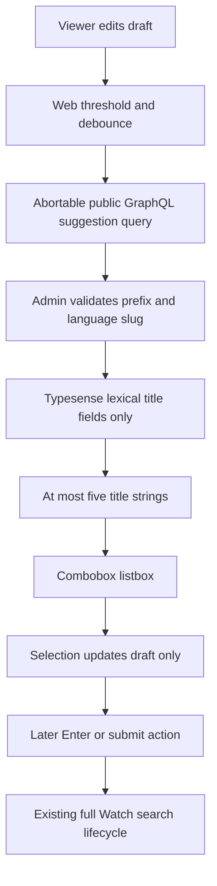
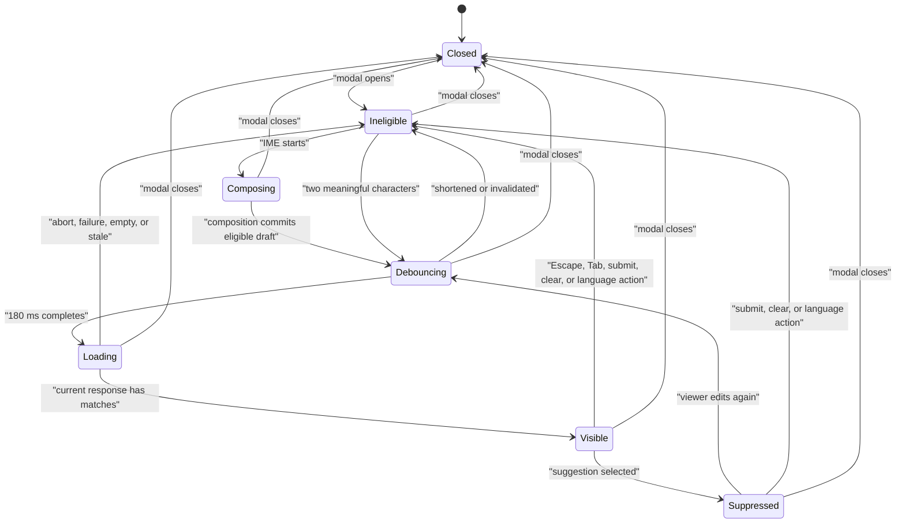

# feat: Add language-aware Watch search suggestions

## Summary

Add a language-aware title-suggestion lane to the Watch search modal without restoring live full-result search. A bounded public Admin query will read only the Typesense lexical title projection, while the existing Enter and visible search action remain the only full-search boundary.

---

## Problem Frame

The explicit-submit field now lets viewers finish a phrase before starting the expensive Watch result pipeline, but it offers no help completing known Watch titles. Reusing the full `watchSearch` contract for suggestions would undo that benefit because the modern service starts query embedding, joins multiple retrieval lanes, and hydrates result-card and watchability data.

The suggestion path therefore needs its own cheap contract and transient UI lifecycle. It must respect the selected search language, remain useful on touch and keyboard devices, and fail without interfering with normal search.

---

## Requirements

### Suggestion retrieval

- R1. A trimmed draft with at least two Unicode letter or number characters schedules one suggestion request after a 180 millisecond trailing debounce only when composition is inactive, a valid public language slug exists, the draft differs from the active submitted query, and the value is not selection-suppressed; shorter or punctuation-only drafts schedule none.
- R2. Admin returns at most five unique raw title values from `watch_search_lexical`, using the exact public language slug to derive the existing locale-aware title fields plus their fallback field; canonical IDs remain internal to grouping and deterministic deduplication.
- R3. The Typesense request uses title fields, prefix matching, exact-first ranking, canonical-video grouping, and a minimal title-only projection.
- R4. Suggestion retrieval never invokes embeddings, metadata or transcript lanes, catalog or availability hydration, result-card mapping, submitted-search traces, click analytics, or query-popularity data.
- R5. Missing Typesense configuration, timeouts, network failures, malformed responses, and zero matches resolve to no visible suggestions while full explicit search remains available.

### Interaction and accessibility

- R6. Typing and suggestion selection update only the draft query; they do not replace results, mutate pagination state, change the URL, or run a full search.
- R7. Enter, the mobile keyboard Search action, and the visible submit action still run at most one full search for the current non-empty draft.
- R8. Pointer or touch selection fills the draft, closes the suggestion list, and preserves input focus; Enter on an intentionally active suggestion does the same without submitting, so a later Enter or submit-action activation performs the search.
- R9. The input exposes `role="combobox"`, `aria-autocomplete="list"`, `aria-expanded`, `aria-controls`, `aria-busy`, and `aria-activedescendant` only while its referenced option exists; the popup and rows expose stable listbox and option IDs, `role="option"`, `aria-selected`, Arrow Up and Arrow Down navigation, and no suggestion options in the Tab order.
- R10. Escape closes suggestions before it can close the modal, Tab closes suggestions and moves normally, and ordinary text-editing keys retain native behavior.
- R11. IME composition does not request suggestions or submit search until composition commits; both the composition ref and the keyboard event's composing state consume the candidate-commit Enter, and only the later committed input value becomes eligible.
- R12. Suggestion rows remain at least 44 CSS pixels tall. On narrow and software-keyboard-reduced viewports, placement measures Visual Viewport space above and below, uses the side with more room, caps the internally scrollable list to the available space with at least one complete row, and recomputes on viewport resize and scroll.
- R13. Blur, outside click, Tab, selection, submit, clear, category action, language action, and modal close all close the list. Closing the list itself never changes the active result set; submit, clear, category, and language actions then retain their existing R7 and R15 result behavior.

### Existing Watch contracts

- R14. Search-language selection continues to use the exact public language slug as identity; query text does not trigger frontend language detection.
- R15. Category selection, language selection, clear, retry, result navigation, load more, close and reopen, and cold instant-shell submission retain their current explicit behaviors.
- R16. The full controller remains lazy until search first opens, and the instant shell does not create a second suggestion requester or replay stale suggestions during handoff.
- R17. The additive Admin schema and generated Admin GraphQL client contract ship together.

---

## Assumptions

- The initial threshold is two Unicode letter or number code points after trimming, not JavaScript string length; this keeps Latin, Arabic, and Han input on one explicit rule.
- The initial debounce is 180 milliseconds and the server cap is five suggestions.
- Admin caps the normalized prefix at 200 Unicode code points before counting meaningful characters or constructing a Typesense request.
- A keyboard-highlighted suggestion requires a later Enter or submit-action activation to search, matching pointer selection and the user-requested draft-first contract.
- The instant shell remains request-free. When the full controller mounts, it evaluates the current draft through the normal debounce lifecycle.
- The popup opens only for a draft that differs from the active submitted query. Existing result data stays intact behind the transient popup and becomes visible again when the popup closes.
- A selected suggestion is suppressed for its resulting controlled draft value, so filling the input cannot immediately re-request and reopen the same list; a later user edit re-enables suggestions.
- Suggestion language precedence is explicit selector slug, then the controller's resolved route/browser/default slug. The client waits rather than issuing an unscoped request while no valid public slug is available.
- Supported tokenizer locales use their dedicated `title_*` field; other languages use the existing `title_fallback` projection rather than adding a new index schema.
- Suggestions are an optional accelerator. No empty-state fallback substitutes categories, recent searches, or popular searches when the lexical lane has no response.

---

## Key Technical Decisions

- **Add a dedicated public GraphQL query:** `watchSearchSuggestions` will expose a small title-only contract instead of routing partial drafts through `watchSearch` or a server action. Canonical IDs remain internal to Admin grouping and deterministic deduplication. This preserves the established browser-to-public-Admin GraphQL path and makes cancellation effective at the caller.
- **Keep language identity on the public slug:** Web sends the selected or resolved search-language slug. Admin resolves its BCP-47 value only for tokenizer-field selection, avoiding the known collisions that make BCP-47 unsafe as language identity.
- **Isolate a title-only Typesense service boundary:** The suggestion service queries `watch_search_lexical` directly and does not call `TypesenseWatchSearchService.search()`. This makes the absence of embeddings and hydration structural rather than conditional.
- **Use abort plus freshness identity:** Each debounce generation owns a fresh `AbortController`, timeout, normalized prefix, and language slug. Cleanup aborts obsolete work, while a monotonic generation check prevents late parsing or abort-insensitive mocks from committing stale rows.
- **Use manual-selection combobox behavior:** No option is auto-selected. Arrow keys move the active descendant, selection changes the draft only, and form submission remains a separate explicit action. Blur and outside click close without selection.
- **Fail closed for suggestions and open for search:** Suggestion errors produce an empty popup without an inline blocking error. The full search action never waits for suggestions or Typesense readiness.
- **Keep prefix traffic outside search analytics:** Only committed searches belong to existing Admin traces and Web result analytics. This prevents partial text from becoming a popularity corpus or changing analytics meaning.

---

## High-Level Technical Design

---

## Implementation Units

### U1. Track the suggestion scope and dependencies

- **Goal:** Create a new content-discovery roadmap ticket and preserve bidirectional dependency metadata.
- **Requirements:** R1-R17
- **Dependencies:** None
- **Files:** `docs/roadmap/content-discovery/feat-337-watch-search-suggestions.md`, `docs/roadmap/content-discovery/feat-334-watch-search-typesense-parallel-backend.md`, `docs/roadmap/content-discovery/feat-336-watch-search-explicit-submit.md`
- **Approach:** Record this as the next suggestion-specific scope, dependent on the lexical projection and explicit-submit work. Start the new ticket as `in-progress`, add its ID to each dependency's `blocks`, and mark only the new ticket complete after review and browser proof; do not close the broader Typesense production-readiness ticket.
- **Patterns to follow:** `docs/roadmap/content-discovery/feat-336-watch-search-explicit-submit.md`
- **Test expectation:** none -- roadmap metadata records delivery state rather than runtime behavior.
- **Verification:** The new ticket uses the next global ID, describes the bounded title-only contract, and has matching forward and reverse dependencies.

### U2. Add bounded lexical title suggestions in Admin

- **Goal:** Return deterministic localized title strings without entering the full Watch search service.
- **Requirements:** R1-R5, R14
- **Dependencies:** U1
- **Files:** `apps/admin/src/services/typesense-watch-search-suggestions.ts`, `apps/admin/src/services/typesense-watch-search-suggestions.test.ts`, `apps/admin/src/services/index.ts`
- **Approach:** Add a small service that caps the normalized prefix at 200 Unicode code points before meaningful-character validation, resolves the exact public language slug to its locale label, and sends one minimal multi-search request to the lexical alias. Disable typo tolerance for predictable prefix completion. Select the highest-ranked raw localized title that matches the normalized prefix, keep the canonical video ID internal, case-fold deduplicate, and use canonical ID as the stable tie-break before capping at five.
- **Execution note:** Start with request-shape and negative-path tests so embeddings, non-title aliases, hydration, and under-threshold work are proven absent before implementation.
- **Patterns to follow:** `apps/admin/src/services/typesense-watch-search-locales.ts`, `apps/admin/src/services/typesense-watch-search-lexical.ts`, `apps/admin/src/services/typesense-watch-search.service.ts`
- **Test scenarios:**
  - A one-character, whitespace-only, or punctuation-only prefix returns no suggestions and performs no Typesense or language lookup.
  - Two-character Latin, Arabic, and Han prefixes choose the expected locale-aware title fields; an unsupported tokenizer locale adds only `title_fallback`.
  - A colliding BCP-47 fixture proves the exact public slug determines the language row before tokenizer selection.
  - The request contains title fields, prefix matching, zero typo tolerance, exact prioritization, canonical grouping, one grouped hit per video, and no metadata, transcript, vector, catalog, or availability fields.
  - Returned values are raw titles rather than highlighted markup, and a title array whose best match is not first still returns the matching value.
  - Duplicate casing and duplicate canonical videos return stable unique values, never more than five.
  - Overlong input is capped before meaningful-character counting, while Typesense unavailability returns an empty suggestion response.
- **Verification:** Focused tests can distinguish this path from every full-search lane and prove a single bounded title-only request.

### U3. Publish the additive GraphQL contract

- **Goal:** Expose the suggestion service through an additive public query and regenerate consumer artifacts.
- **Requirements:** R1-R5, R14, R17
- **Dependencies:** U2
- **Files:** `apps/admin/src/graphql/queries/watch-search.ts`, `apps/admin/src/graphql/queries/watch-search.test.ts`, `apps/admin/src/graphql/public-resolvers.regression.test.ts`, `apps/admin/schema.graphql`, `packages/admin-graphql/src/admin-graphql-env.d.ts`
- **Approach:** Add a public input carrying query and exact language slug plus a minimal response containing raw title values. Delegate directly to the isolated service, return an empty list when Typesense is not configured, register the new field in `INTENDED_PUBLIC_RESOLVERS`, and deliberately omit submitted-search trace recording.
- **Execution note:** Add resolver delegation and trace-isolation assertions before regenerating the schema artifacts.
- **Patterns to follow:** Existing `watchSearch` field wiring and the Admin schema-print plus Admin GraphQL generation contract.
- **Test scenarios:**
  - The resolver passes normalized public input to the suggestion service and returns its values unchanged.
  - Missing Typesense configuration returns an empty response without calling the default or modern full-search service.
  - A suggestion request never calls `recordWatchSearchTraceSafely`.
  - The public-resolver manifest, committed SDL, and generated gql.tada environment include the new additive field without changing `watchSearch`.
- **Verification:** Schema drift checks and Admin GraphQL type generation agree with the resolver contract.

### U4. Add an abortable browser suggestion client

- **Goal:** Give the modal a narrow direct client with real cancellation and strict response validation.
- **Requirements:** R1, R2, R5, R14, R16
- **Dependencies:** U3
- **Files:** `apps/web/src/lib/watch-search-suggestions-client.ts`, `apps/web/src/lib/watch-search-suggestions-client.test.ts`
- **Approach:** Post the additive operation to the existing public Admin GraphQL URL with no credentials. Accept a caller-owned signal, compose it with a manual bounded timeout compatible with the Next.js browser floor, validate HTTP, GraphQL, and payload shape, and return title strings only.
- **Patterns to follow:** `apps/web/src/lib/watch-search-client.ts`, React effect cleanup guidance, and the repo's StrictMode remount-safety learning.
- **Test scenarios:**
  - The request serializes query and exact language slug without full-search fields, public tuning parameters, or privileged headers.
  - A caller abort reaches fetch and is reported as a silent cancellation path.
  - The timeout aborts a hung request without relying on `AbortSignal.any`.
  - HTTP failure, GraphQL errors, missing data, and malformed values resolve through the caller's empty-suggestion failure path.
- **Verification:** Client tests prove cancellation, timeout cleanup, and a contract that cannot hydrate result cards.

### U5. Render the accessible suggestion combobox

- **Goal:** Show useful title completions on desktop and mobile while preserving explicit search submission.
- **Requirements:** R1, R5-R16
- **Dependencies:** U4
- **Files:** `apps/web/src/components/SearchOverlay.tsx`, `apps/web/src/components/FloatingSearchField.tsx`, `apps/web/src/components/__tests__/FloatingSearchProvider.test.tsx`
- **Approach:** Keep transient suggestion state in the mounted full overlay. Derive the explicit-selector or controller-resolved public search-language slug, pause during IME composition using both ref and keyboard-event guards, debounce eligible drafts, and give every generation its own controller plus stale guard. Hide stale rows while loading, expose only a quiet busy state, clear active state whenever rows are replaced or closed, and suppress the controlled value produced by selection until the viewer edits again. Commit pointer selection on `pointerdown` with its focus-changing default prevented. Render a field-aligned listbox using the roomier side of the existing language control, a Visual Viewport-aware internally scrollable height, up to five 44-pixel rows, the full manual active-descendant contract, `dir="auto"` on the input, and bidirectional-isolated title text using the existing localized suggestion labels.
- **Execution note:** Add discriminating interaction and race tests before wiring the network effect; use the frontend-design skill's focus, state, spacing, and touch-target guidance during styling.
- **Patterns to follow:** `apps/web/src/components/watch/LanguageCombobox.tsx`, `docs/solutions/ui-bugs/watch-search-modal-close-reset.md`, `docs/solutions/ui-bugs/watch-search-overlay-stacked-control-breakpoints-20260708.md`
- **Test scenarios:**
  - Typing fewer than two meaningful characters, pausing during IME composition, or returning to the submitted query produces no suggestion request.
  - A two-character draft performs no request at 179 milliseconds and one at 180 milliseconds in the selected/default public language; an edit resets the timer.
  - Editing again aborts the prior request; a late prior response cannot replace current suggestions even when the mock ignores abort.
  - Pointer selection and Arrow plus Enter both fill the draft, close the popup, retain input focus, and produce zero full-search or submitted-search analytics calls.
  - Pointer down commits exactly one selection before blur or click can unmount the popup.
  - The next ordinary Enter, mobile Search action, or visible submit activation performs exactly one full search for the selected title.
  - Arrow navigation updates a mounted active descendant, Escape closes the list before the modal, Tab exits without selecting, and text-editing keys remain native.
  - Loading, response replacement, language change, failure, empty response, and every close path clear stale active-descendant state; IME candidate Enter cannot leak into form submission.
  - Blur and outside click close without selection, mixed-direction titles preserve row layout, and the active row scrolls into the bounded viewport.
  - LTR and RTL UI locales keep control ordering stable while Arabic, Latin, and mixed-direction selected titles render correctly in the input and rows.
  - Selecting a suggestion does not re-request or reopen the list for that controlled value; the next user edit re-enables suggestions.
  - Clear, category selection, language selection, close, result navigation, and reopen abort or invalidate suggestions and cannot repopulate the closed modal.
  - The instant shell does not request suggestions; controller handoff evaluates the latest draft once without replaying a stale list or duplicating a submitted search.
- **Verification:** Focused Web tests prove request timing, explicit-submit separation, ARIA relationships, mobile target classes, and all close/reset transitions.

### U6. Verify browser, performance, and fallback behavior

- **Goal:** Prove the feature works in the real overlay without regressing page loading or full search.
- **Requirements:** R1-R17
- **Dependencies:** U3, U4, U5
- **Files:** `docs/roadmap/content-discovery/feat-337-watch-search-suggestions.md`
- **Approach:** Exercise desktop, narrow mobile, and software-keyboard-reduced layouts; capture request and visual proof; then close the roadmap ticket. Verify the controller is still absent before first open and Typesense-unavailable behavior leaves explicit search usable.
- **Patterns to follow:** Existing Watch browser-smoke and screenshot conventions.
- **Test expectation:** none -- runtime assertions live with U2-U5; this unit validates their integration in a real browser.
- **Verification:** Browser proof shows correct layering, focus, keyboard and touch selection, 44-pixel rows, one debounced title-only request, no full search before explicit submit, and unchanged initial loading behavior.

---

## Acceptance Examples

- AE1. **Below-threshold draft**
  - **Given:** The Watch search modal is open.
  - **When:** A viewer types one meaningful character or punctuation and pauses.
  - **Then:** No suggestion or full-search request runs.
  - **Covers:** R1, R4, R6
- AE2. **Language-aware suggestions**
  - **Given:** French is the selected Search language.
  - **When:** A viewer types `je` and pauses for the debounce.
  - **Then:** One request uses the French public slug and renders no more than five localized lexical title suggestions.
  - **Covers:** R1-R5, R14
- AE3. **Pointer selection then submit**
  - **Given:** Suggestions are visible for a draft.
  - **When:** A viewer taps a suggestion.
  - **Then:** The phrase fills the field and the list closes without changing results; activating the visible search action then runs one full search for that phrase.
  - **Covers:** R6-R8, R12
- AE4. **Keyboard selection then submit**
  - **Given:** Suggestions are visible and no option is active.
  - **When:** A viewer presses Arrow Down and Enter, then presses Enter again.
  - **Then:** The first Enter fills the draft without searching and the second Enter runs one full search.
  - **Covers:** R7-R10
- AE5. **IME composition**
  - **Given:** A viewer is composing text with an IME.
  - **When:** Enter commits a composition candidate.
  - **Then:** Search does not submit; suggestions become eligible only from the committed input value.
  - **Covers:** R1, R10, R11
- AE6. **Stale response**
  - **Given:** A request for `je` is in flight.
  - **When:** The viewer changes language or types `jes` before it resolves.
  - **Then:** The old request is aborted and cannot replace suggestions for the new language and prefix.
  - **Covers:** R1, R5, R14
- AE7. **Optional backend unavailable**
  - **Given:** Typesense is missing or the suggestion request fails.
  - **When:** The viewer submits the current draft with Enter or the search action.
  - **Then:** No suggestion popup blocks the interaction and the normal full-search lifecycle proceeds.
  - **Covers:** R5, R7, R15

---

## Scope Boundaries

- No popular-search, recent-search, search-history, personalization, query-log serving, or curated fallback pipeline.
- No change to full-result ranking, semantic retrieval, page size, result cards, watchability resolution, pagination, or full-search analytics.
- No frontend query-language detection, language preference persistence, or change to the Search language filter.
- No new search page, shareable search URL, router navigation, or query-parameter state.
- No native mobile-app or TV implementation.
- No eager loading of the full search controller and no redesign of the floating header outside the suggestion popup.

### Deferred to Follow-Up Work

- Measure suggestion usefulness before considering editorial phrases, typo tolerance, single-character language exceptions, caching, or popularity-based ranking.
- Broaden per-language title isolation only if the current tokenizer-locale plus fallback projection proves insufficient for unsupported locales.

---

## System-Wide Impact

- **API contract:** Admin gains one additive public field and Web gains one browser-direct consumer; generated SDL and gql.tada artifacts keep the producer and consumer synchronized.
- **Language identity:** The public slug remains the cross-layer identity. BCP-47 is derived inside Admin only to select Typesense analyzer fields.
- **Performance:** Each eligible draft can add one small CORS GraphQL POST after debounce. The response is capped and title-only, and cleanup cancels superseded browser work.
- **Privacy and analytics:** Partial prefixes are transient serving inputs. They are not written to submitted-search traces, Watch search events, RUM result analytics, or a popularity table.
- **Accessibility:** The search input becomes an editable combobox only while retaining its native search form and explicit submit control.

---

## Risks & Dependencies

- **Typesense readiness:** The lexical alias is optional while the broader production-readiness ticket remains open. Return no suggestions when it is unavailable and never gate full search on it.
- **Fallback-locale ambiguity:** Unsupported tokenizer locales share `title_fallback`, so language-aware behavior is best-effort outside dedicated analyzer fields. Keep the exact language slug in the contract and document this projection boundary.
- **Title extraction mismatch:** A grouped document may hold multiple localized titles. Prefer the value matching the normalized prefix and cover array ordering and deduplication so the UI never displays an unrelated first value.
- **Suggestion/result mismatch:** The title-only lane intentionally skips watchability hydration, so a suggestion may later produce no playable result. Preserve the normal submitted no-results flow rather than expanding suggestion cost.
- **Public request volume:** Prefix requests add load to the public GraphQL and Typesense services. The two-character threshold, 180 millisecond debounce, five-row cap, cancellation, and existing public rate limits bound the initial release.
- **StrictMode and stale state:** Effect cleanup can be replayed on the same hook instance. Create a new controller per effect setup and retain an independent stale-generation guard.
- **Mobile viewport:** The language control and software keyboard reduce available space. Use bounded viewport-aware placement and validate the keyboard-reduced layout rather than relying on desktop screenshots.
- **Cold-shell split ownership:** The instant shell and full overlay own the field at different times. Keep suggestions full-overlay-only and prove handoff does not create duplicate work.

---

## Documentation / Operational Notes

- Regenerate the committed Admin SDL and Admin GraphQL environment after the Pothos change.
- Run focused Admin service/resolver tests, Web client/provider tests, affected typechecks, lint, formatting, and generated-contract drift checks.
- Browser proof should include desktop keyboard navigation, narrow touch layout, a keyboard-reduced mobile viewport, network request counts, and a Typesense-unavailable fallback.
- Confirm the page-load bundle and network remain unchanged before the first search open.

---

## Sources & Research

- Product baseline: `docs/plans/2026-08-05-003-feat-watch-search-explicit-submit-plan.md`, `docs/brainstorms/2026-06-24-watch-search-local-state-requirements.md`
- Typesense serving boundary: `apps/admin/src/services/typesense-watch-search-schema.ts`, `apps/admin/src/services/typesense-watch-search-lexical.ts`, `apps/admin/src/services/typesense-watch-search-locales.ts`
- Existing client and overlay patterns: `apps/web/src/lib/watch-search-client.ts`, `apps/web/src/components/SearchOverlay.tsx`, `apps/web/src/components/watch/LanguageCombobox.tsx`
- Institutional learnings: `docs/solutions/performance-issues/typesense-watch-search-payload-projection-latency.md`, `docs/solutions/best-practices/language-identity-on-slug-not-bcp47-20260605.md`, `docs/solutions/ui-bugs/watch-search-modal-close-reset.md`
- Accessible combobox behavior: <https://www.w3.org/WAI/ARIA/apg/patterns/combobox/>, <https://www.w3.org/WAI/ARIA/apg/patterns/listbox/>
- Async cleanup and IME events: <https://react.dev/reference/react/useEffect>, <https://react.dev/reference/react-dom/components/common>
- Native search submission and mobile keyboard intent: <https://html.spec.whatwg.org/multipage/form-control-infrastructure.html#implicit-submission>, <https://html.spec.whatwg.org/multipage/interaction.html#input-modalities:-the-enterkeyhint-attribute>
- Mobile target sizing: <https://www.w3.org/WAI/WCAG22/Understanding/target-size-minimum.html>
