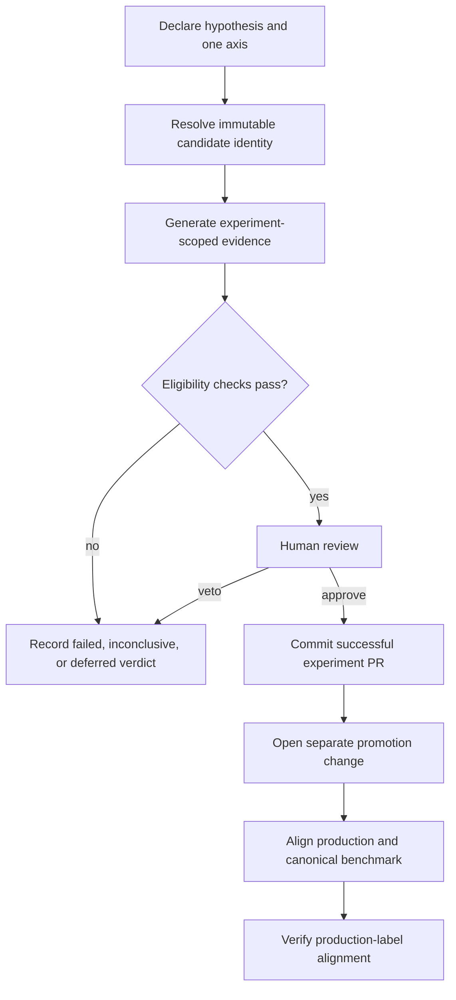
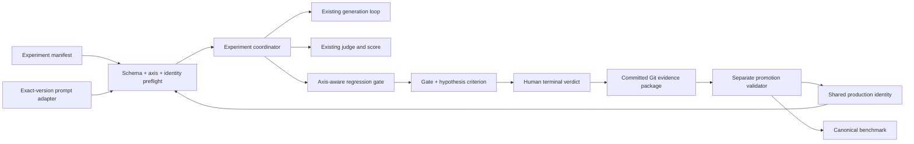
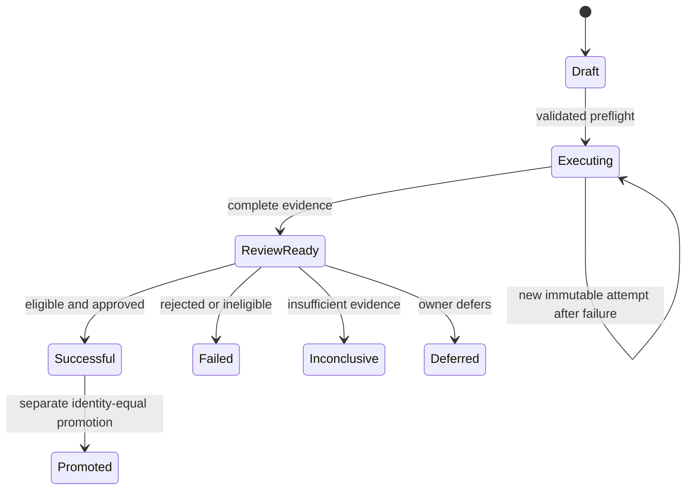
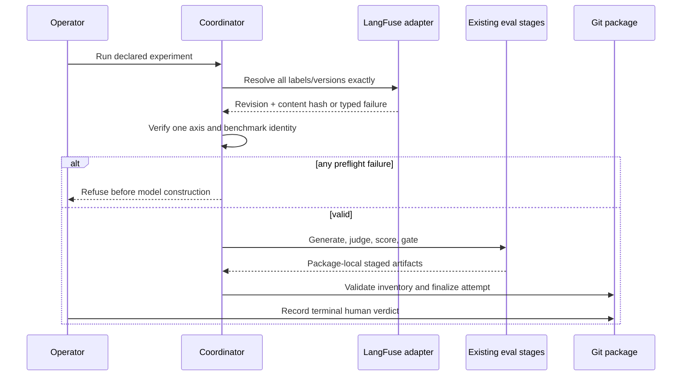

# Seeker Eval Experiment Workflow - Plan

## Goal Capsule

- **Objective:** Establish a repository-native workflow for durable Seeker prompt and model experiments, with production-aligned benchmarks and a separate promotion path.
- **Product authority:** Git is the authoritative experiment ledger and production configuration record; LangFuse supplies managed prompt versions, and Mastra remains the agent runtime.
- **Execution profile:** Deep, test-first where contracts are pure, with live LangFuse proof reserved for the exact-version integration and official benchmark capture.
- **Tail ownership:** The experiment workflow lands first. Production promotion and canonical benchmark replacement land through a separate PR that consumes committed experiment evidence.
- **Stop conditions:** Stop before paid generation if manifest validation, exact prompt resolution, content-hash validation, baseline compatibility, or one-axis validation fails. Stop promotion if the experiment is not committed, terminal-successful, automatically eligible, and identity-equal to the proposed production configuration.
- **Open blockers:** None for implementation. Real LangFuse credentials and immutable prompt versions remain operational prerequisites for official runs.

---

## Product Contract

### Summary

Forge will treat each Seeker prompt or model experiment as a committed evidence package with a predeclared hypothesis, one comparison axis, immutable configuration identity, scoped results, and a human verdict. Only eligible experiments may feed a separate promotion change that updates production and its canonical benchmark to the same configuration.

### Problem Frame

The current Seeker eval can call the production prompt helper, but its canonical committed benchmark was generated from the repository fallback rather than a LangFuse-managed prompt. The runner records useful prompt and model metadata, yet working runs are transient and there is no durable experiment lifecycle, hypothesis record, experiment-scoped evidence bundle, or promotion relationship.

Movable LangFuse labels are useful for finding candidates but cannot identify historical experiments reliably. Prompt versions are immutable while they exist, so experiments need to resolve labels into exact versions and preserve the resolved identity without committing managed prompt text.

Prompt management, agent execution, evaluation, and tracing may evolve independently. An experiment record coupled to one vendor's labels, datasets, or UI would make a future move between LangFuse, Mastra, or another provider unnecessarily disruptive.

### Key Decisions

- **Repository-native experiment packages.** (session-settled: user-approved — chosen over a provider-neutral engine or Mastra-first experiment store: it delivers durable evidence with the least new infrastructure.) Governs R1-R5, R15, R16.
- **One causal axis per experiment.** (session-settled: user-approved — chosen over prompt-by-model matrices: holding the other production dimension fixed keeps results attributable.) Governs R6-R8.
- **Immutable prompt version as identity.** (session-settled: user-approved — chosen over labels as durable selectors: labels can move or disappear.) Governs R9-R12.
- **Code-pinned production prompt version.** (session-settled: user-directed — chosen over runtime label following: a reviewed version change prevents accidental untested prompt promotion.) Governs R18-R21.
- **Automated eligibility with an asymmetric human veto.** (session-settled: user-approved — chosen over a human bypass for red gates: evaluation remains a real production constraint.) Governs R13, R14, R17.
- **Commit every completed experiment.** (session-settled: user-directed — chosen over summary-only or success-only retention: failed and inconclusive work remains durable evidence.) Governs R4, R5, R16.
- **Alert-only production-label synchronization.** (session-settled: user-directed — chosen over blocking deployment: the code pin controls traffic while label timing is operational bookkeeping.) Governs R20, R21.

### Actors

- A1. **Experiment owner:** declares the hypothesis, chooses candidates, reviews evidence, and records the verdict.
- A2. **Eval runner:** validates experiment identity, resolves inputs, executes the Seeker eval, and produces scoped evidence.
- A3. **Reviewer:** reviews the complete experiment package and approves or rejects its conclusions through the experiment PR.
- A4. **Promoter:** prepares the separate production change, proves it consumes an eligible experiment, and completes LangFuse label synchronization.
- A5. **Prompt provider:** currently LangFuse; resolves a candidate selector into prompt text and immutable provenance.
- A6. **Agent runtime:** currently Mastra; runs the production-shaped Seeker agent under the resolved experiment configuration.

### Requirements

**Experiment record and lifecycle**

- R1. Every experiment has a unique repository identity, owner, hypothesis, predeclared success criterion, comparison axis, production benchmark reference, candidate set, and lifecycle state.
- R2. Workflow state and verdict are separate: work moves through draft, execution, and review before receiving a terminal verdict of successful, failed, inconclusive, or deferred.
- R3. All generated artifacts for an experiment stay within that experiment's repository-scoped evidence package.
- R4. A completed experiment commits its manifest, generated answers, tool transcripts, judge verdicts, scores, comparison report, and human verdict.
- R5. Managed prompt bodies, credentials, and external trace payloads never enter the evidence package.

**Controlled comparison**

- R6. An experiment declares exactly one comparison axis: prompt or model.
- R7. A prompt experiment holds the production model configuration fixed while comparing one or more prompt candidates.
- R8. A model experiment holds the production prompt version fixed while comparing one or more model candidates.
- R9. Every run records complete comparison identity for the prompt, model, decoding behavior, question set, criteria, judge, retrieval fixtures, and relevant runtime configuration.
- R10. The runner refuses a comparison when any identity dimension outside the declared axis differs from the production benchmark.

**Prompt resolution**

- R11. A prompt experiment may use an experiment-specific LangFuse label for candidate intake, but the runner resolves it once to an immutable prompt version and content hash before generation.
- R12. Official experiment and benchmark runs require a live, non-stale managed prompt resolution; fallback, stale, missing, deleted, or mismatched prompt selections fail before answer-generation spend.

**Success and verdict**

- R13. Automated promotion eligibility requires both a green production-regression gate and satisfaction of the experiment's predeclared hypothesis criterion.
- R14. A human may veto, defer, or mark inconclusive an automatically eligible experiment, but cannot make an automatically ineligible experiment promotable.
- R15. Every terminal verdict records human reasoning and links it to the evidence that supports the decision.
- R16. Failed, inconclusive, and deferred experiments follow the same commit-and-review path as successful experiments.
- R17. A faulty gate or unsuitable success criterion is corrected through an explicit policy or evaluation change followed by a new run; prior results are not rewritten into eligibility.

**Production promotion and benchmark**

- R18. Promotion occurs through a separate change that references one successful, promotion-eligible experiment and identifies the exact accepted candidate.
- R19. The canonical benchmark represents the exact prompt version, model configuration, and other relevant identity currently serving production.
- R20. Production retrieves the Seeker prompt by an exact version pinned in the repository; the LangFuse `production` label is a deployment marker that should resolve to the same version but does not select live traffic.
- R21. Pre-promotion validation proves the pinned prompt version exists and matches the accepted experiment; a post-merge mismatch between the repository pin and `production` label produces an actionable alert without failing deployment.
- R22. An accepted experiment may supply the new canonical benchmark without another paid run only when its full identity exactly matches the promoted production configuration.
- R23. Any change between the accepted experiment and the production change requires a fresh qualifying benchmark.
- R24. The existing fallback-based canonical benchmark is replaced by a production-shaped run that proves it used an exact managed prompt version.

**Provider portability**

- R25. Persisted experiment identities describe provider, prompt identity, immutable revision, and content hash without making LangFuse label semantics part of the core experiment lifecycle.
- R26. Prompt resolution is isolated from experiment execution so another prompt provider can replace LangFuse without changing historical evidence packages.
- R27. External experiment stores, trace systems, and richer provider UIs may supplement the workflow but cannot become authoritative over the committed experiment ledger.

### Key Flows



- F1. **Create an experiment.** A1 declares the hypothesis, criterion, axis, benchmark, and candidates. A2 validates the record before execution. Covers R1, R2, R6-R8.
- F2. **Resolve and execute a candidate.** A2 resolves immutable inputs, refuses invalid provenance or off-axis drift, executes the production-shaped agent, and writes evidence inside the experiment package. Covers R3-R5, R9-R12, R25, R26.
- F3. **Conclude an experiment.** A1-A3 evaluate both eligibility conditions, perform human review, record a terminal verdict and reasoning, and commit the full package through a PR. Covers R13-R17.
- F4. **Promote an accepted candidate.** A3-A5 verify the accepted identity, update production, establish the matching benchmark, merge through the normal flow, and verify the LangFuse marker. Covers R18-R24.

### Acceptance Examples

- AE1. **Managed prompt experiment.** Given a prompt experiment names an experiment label and fixes the production model, when the runner resolves it to version 42 and a content hash, then every cell uses that exact prompt and reruns select version 42 directly. Covers R7, R11, R12.
- AE2. **Missing or stale prompt.** Given LangFuse cannot return a fresh requested version, when an official experiment or benchmark begins, then it fails before generation and does not grade fallback or stale text. Covers R12.
- AE3. **Model comparison.** Given a model experiment compares candidates, when all candidates share the production prompt and other identity, then it runs; prompt mismatch refuses it. Covers R6, R8-R10.
- AE4. **Human veto.** Given both eligibility conditions pass, when review finds unacceptable behavior, then the reviewer records failed, inconclusive, or deferred with reasoning and the experiment is not promotable. Covers R13-R16.
- AE5. **Red gate cannot be waived.** Given the hypothesis passes but the regression gate is red, when the owner prefers the candidate, then it remains ineligible and any policy change requires a new run. Covers R14, R17.
- AE6. **Promotion reuses accepted evidence.** Given an accepted candidate exactly matches proposed production, when promotion is prepared, then its evidence may become the benchmark without another paid run; any identity change requires a fresh benchmark. Covers R18-R23.
- AE7. **Label synchronization lags.** Given production serves pinned version 42 while the `production` label points to 41, when verification runs, then production remains healthy and an actionable alert persists until alignment. Covers R20, R21.
- AE8. **Provider replacement.** Given Forge later replaces prompt management or experiment tooling, when the new provider is introduced, then historical repository packages remain readable and authoritative. Covers R25-R27.

### Success Criteria

- An official benchmark cannot be produced from fallback or stale prompt content.
- A reviewer can reconstruct what was tested, why, under which immutable configuration, what happened, and why the terminal verdict was chosen using only the repository package.
- Prompt and model experiments compare against production without unrelated configuration drift.
- No red-gate experiment can enter promotion.
- After promotion, the canonical benchmark and production configuration carry the same complete identity.
- Replacing LangFuse, Mastra experiment storage, or tracing does not invalidate historical experiment records.

### Scope Boundaries

**Deferred for later**

- A database-backed experiment registry, experiment browser, or cross-experiment analytics UI.
- Automatic LangFuse prompt creation, label mutation, or label cleanup.
- Automatic post-merge remediation when the LangFuse `production` label drifts.
- Mastra-native datasets, experiments, scorers, or provider-side comparison as the execution backend.
- Automatic trace ingestion or long-term trace retention inside experiment packages.
- Multi-axis prompt-by-model matrices and automated statistical conclusions beyond the current measured gate policy.
- Cell-level reuse within a partial official attempt; the first version restarts an immutable attempt and may reuse only complete validated stages.

**Outside this product's identity**

- Making LangFuse, Mastra, or another external service the authoritative experiment ledger.
- Committing managed prompt bodies, credentials, or unrestricted trace payloads.
- Allowing an experiment PR to mutate production or combining experiment evidence and production promotion into one PR.
- Allowing human approval to convert automated ineligibility into promotion eligibility.

### Dependencies and Assumptions

- Exact-version retrieval is supported by LangFuse but is not exposed by Forge's current managed-prompt helper.
- Prompt versions are immutable while present, but deletion remains possible; committed evidence remains reviewable even when exact reruns become impossible.
- Production preserves its current fallback availability if the pinned prompt version cannot be fetched, but emits a distinct critical degraded-state alert. Official experiments and benchmarks never use that fallback.
- The fixed production model identity is the serialized ordered production route chain, including routing-affecting configuration, rather than a single model slug.
- The eval's production-shaped loop, frozen fixtures, judge, deterministic checks, and three-state gate remain the starting measurement system.
- The normal PR-to-main deployment flow remains the only production release path.

### Product Contract Preservation

Product Contract unchanged. The confirmed planning defaults only clarify recovery granularity and production outage behavior; they do not change the settled experiment or promotion requirements.

---

## Planning Contract

### Key Technical Decisions

- KTD1. **Add exact-version retrieval below the resilient label helper.** Extend the hardened LangFuse HTTP client with mutually exclusive label/version selectors and a provider-neutral success identity. Preserve Basic auth, allowed-host validation, redirect refusal, response byte caps, and no-throw failure unions. Official resolution calls this layer directly and rejects every degraded outcome before model construction. This implements R11, R12, R20, R25, and R26 without weakening production's separate fallback path.
- KTD2. **Create one repository-pinned production configuration identity.** A shared configuration module describes the exact prompt provider/name/version/hash and the ordered production model route chain, including routing-affecting flags and provider-default decoding. Production Seeker construction, official experiments, comparison, and promotion all consume the same serializable identity. This closes the current mismatch between label-following production, the environment-dependent production model chain, and the eval's single hard-coded model.
- KTD3. **Use a provider-neutral experiment schema with LangFuse provenance as an adapter detail.** Persist provider, logical prompt name, immutable revision, and content hash. Retain the intake label only as optional provenance. Never use a movable label as a durable comparison key.
- KTD4. **Put a thin coordinator over the existing leaf eval stages.** One validated experiment-directory argument owns manifest validation, package-local paths, exact identity resolution, stage sequencing, and completion checks. Generation, judging, scoring, reporting, and the three-state gate remain independently testable and rerunnable.
- KTD5. **Validate the entire official run before paid generation.** Parse the manifest, validate the one-axis contract, resolve every prompt identity, verify the baseline, and refuse off-axis drift before dynamically importing or constructing the agent. One invalid candidate aborts the official run with zero generated cells.
- KTD6. **Treat attempts as immutable evidence.** Each official attempt writes into its own package-local directory through staged outputs. Failed attempts remain inspectable. A retry starts a new attempt and may reuse only a complete upstream stage whose full identity matches; it never appends cells to or overwrites a partial attempt.
- KTD7. **Make comparison policy explicitly axis-aware.** Prompt experiments exempt only prompt identity. Model experiments exempt only the answering-model route identity. Both compare question set, criteria, judge, fixtures, decoding, runtime configuration, and every other stamped dimension. Preserve existing `full` and `generation` pairing semantics.
- KTD8. **Compose eligibility; do not replace the gate.** A named, versioned hypothesis-criterion registry evaluates persisted measurements. Promotion eligibility is true only when the existing gate is green and that criterion passes. Unknown or unavailable measurements are ineligible and conclude as inconclusive unless the owner chooses failed or deferred.
- KTD9. **Keep machine eligibility and human verdict separate.** Gate and criterion output are immutable evidence. A distinct verdict action records actor, timestamp, terminal verdict, reasoning, and evidence references. It may veto or defer an eligible result but cannot create eligibility.
- KTD10. **Sanitize committed evidence at its writer.** Package transcripts retain prompt provider/name/revision/hash and tool activity but omit resolved managed prompt text, credentials, and unrestricted trace payloads. Optional local prompt-body debugging must use an explicitly gitignored scratch artifact.
- KTD11. **Make promotion a separate validator/materializer.** A promotion command consumes a committed experiment path, candidate, attempt, and Git commit identity. It verifies terminal success, eligibility, package integrity, and exact proposed production identity. Exact accepted evidence may materialize the new benchmark; any drift requires a fresh official run. It never mutates experiment evidence or LangFuse labels.
- KTD12. **Keep label alignment observable but non-authoritative.** Pre-promotion validates that the pinned version exists. Runtime/startup health compares the pinned revision with the `production` label and emits deduplicated mismatch and recovery events without changing traffic or failing deployment.

### High-Level Technical Design







### Output Structure

```text
apps/mastra/evals/experiments/
└── <experiment-id>/
    ├── manifest.json
    ├── attempts/
    │   └── <attempt-id>/
    │       ├── resolved-identity.json
    │       ├── candidates/<candidate-id>/
    │       │   ├── answers.json
    │       │   ├── transcripts.json
    │       │   ├── judged.json
    │       │   └── score.json
    │       ├── comparison.json
    │       ├── gate-report.json
    │       └── completion.json
    └── verdict.json
```

The exact filenames may be adjusted during implementation if the schemas remain explicit, package-local, and traceable. The per-unit file lists are authoritative.

### Sequencing and Landing Strategy

1. Land the experiment workflow and its tests without changing production traffic or the canonical benchmark.
2. Run and commit official exact-version experiment evidence through its own review PR.
3. Land a separate promotion PR that updates the shared production pin and canonical benchmark together, with the promotion validator proving identity equality.
4. Verify the LangFuse `production` label after merge. Label lag alerts but does not roll back or divert traffic.

### Sources and Research

- `apps/mastra/src/evals/seeker/DECISION.md` defines the production-shaped loop, three-state gate, and confirmation policy.
- `apps/mastra/src/evals/seeker/run-loop.ts` provides single prompt resolution, per-cell agent construction, billing-key preflight, and run identity stamping.
- `apps/mastra/src/evals/seeker/types.ts` and `gate.ts` provide identity refusal and green/red/refused behavior to extend.
- `apps/mastra/src/services/langfuse-prompt-client.ts` provides the hardened direct HTTP client and resilient label-cache helper.
- `docs/solutions/tooling-decisions/langfuse-prompt-api-contract-and-sdk-rejection.md` requires the existing auth, redirect, byte-cap, additive parsing, and leak-control invariants.
- `docs/solutions/design-patterns/serve-stale-cache-permanent-failure-exit-and-degraded-serve-provenance.md` explains why official runs need a strict non-degraded resolution path.
- `docs/solutions/architecture-patterns/stochastic-eval-gates-need-confirmation-and-refusal.md` requires confirmed stochastic regressions and refusal for incomplete evidence.
- `docs/solutions/tooling-decisions/langfuse-vs-mastra-native-management-layer-20260805.md` supports provider-neutral Git evidence while retaining LangFuse prompt provenance.
- [LangFuse prompt version control](https://langfuse.com/docs/prompt-management/features/prompt-version-control) confirms exact version selection and movable labels.
- [LangFuse prompt core concepts](https://langfuse.com/docs/prompt-management/data-model) confirms immutable versions, label pointers, and cache behavior.

---

## Implementation Units

### U1. Exact managed-prompt version resolution

**Goal:** Add a strict exact-version prompt retrieval contract without changing the existing resilient production helper yet.

**Requirements:** R11, R12, R20, R25, R26; F2; AE1, AE2.

**Dependencies:** None.

**Files:**

- `apps/mastra/src/services/langfuse-prompt-client.ts`
- `apps/mastra/src/services/langfuse-prompt-client.test.ts`
- `apps/mastra/src/services/langfuse-prompt-client.smoke.test.ts`

**Approach:**

1. Extend the low-level request input with mutually exclusive label and version selectors while preserving the direct HTTP client invariants.
2. Return a provider-neutral immutable prompt identity and verify requested version plus content hash at the official-run boundary.
3. Keep stale-cache and repository-fallback behavior inside the existing label helper; exact official resolution never calls that path.

**Execution note:** Start with failing contract tests for exact version query shape and every fail-before-spend outcome. Use the opt-in smoke only for the real LangFuse contract.

**Patterns to follow:** `fetchLangfusePrompt` typed result unions and response caps; `langfuse-prompt-client.smoke.test.ts` credential-gated integration shape.

**Test scenarios:**

- Covers AE1. A label resolves to version 42; the persisted exact selector later retrieves 42 after the label moves.
- Covers AE2. Missing, deleted, unauthorized, timed-out, malformed, empty, or wrong-version responses return typed official-resolution failure without exposing prompt text.
- A cached stale version exists but exact retrieval fails; official resolution refuses instead of serving stale content.
- Supplying both label and version is rejected before fetch; a version selector reaches LangFuse as the documented version query.
- A successful response preserves Basic auth, allowed-host checks, redirect refusal, byte caps, text-only validation, and additive-field tolerance.
- The real smoke fetches a configured exact version and verifies version and content hash without printing or snapshotting the body.

**Verification:** Focused unit tests prove the no-degraded contract; the opt-in smoke proves the current LangFuse API behavior.

### U2. Shared production prompt and model identity

**Goal:** Define one serializable repository-pinned production identity consumed by Seeker runtime, eval, and promotion.

**Requirements:** R7-R10, R19-R21, R25; F2, F4; AE3, AE7.

**Dependencies:** U1.

**Files:**

- `apps/mastra/src/mastra/agents/seeker-production-config.ts`
- `apps/mastra/src/mastra/agents/seeker-production-config.test.ts`
- `apps/mastra/src/mastra/agents/seeker-agent.ts`
- `apps/mastra/src/mastra/agents/seeker-agent.test.ts`
- `apps/mastra/src/config/env.ts`
- `apps/mastra/src/config/env.test.ts`
- `apps/mastra/CLAUDE.md`

**Approach:**

1. Store the prompt provider/name/exact version/expected hash and ordered production model routes in a repository-reviewed configuration module.
2. Include routing-affecting gateway flags, provider/model identifiers, fallback order, and provider-default decoding in the serialized identity.
3. Make the production instruction resolver request the pinned exact version. Preserve fallback availability on failure, but emit distinct critical degraded provenance.
4. Retire the default-label environment variable as a production traffic selector while retaining labels for candidate intake and health comparison.

**Execution note:** Characterize the current model route chain and fallback behavior before replacing its configuration source.

**Patterns to follow:** `buildSeekerModelList` behavior and `seeker-agent.test.ts` source-pin discipline; typed environment parsing in `apps/mastra/src/config/env.ts`.

**Test scenarios:**

- Production and eval serialize byte-equal production identities for the same repository configuration.
- Gateway enabled/disabled and configured route variations are represented in identity rather than collapsing to one model slug.
- Production requests the repository-pinned prompt version and validates its hash instead of following `LANGFUSE_PROMPT_DEFAULT_LABEL`.
- Exact prompt failure preserves repository fallback availability, stamps fallback/degraded provenance, and emits one critical alert without leaking prompt or credentials.
- A repository pin change changes identity and requires review; unrelated environment values do not silently alter the fixed comparison identity.

**Verification:** Tests prove runtime behavior remains available while prompt and model identity becomes explicit, stable, and shared.

### U3. Experiment package schema and one-axis validation

**Goal:** Define the durable provider-neutral manifest, attempt, artifact inventory, lifecycle, and comparison contracts.

**Requirements:** R1-R10, R25-R27; F1, F2; AE3, AE8.

**Dependencies:** U2.

**Files:**

- `apps/mastra/src/evals/seeker/experiments/types.ts`
- `apps/mastra/src/evals/seeker/experiments/types.test.ts`
- `apps/mastra/src/evals/seeker/experiments/manifest.ts`
- `apps/mastra/src/evals/seeker/experiments/manifest.test.ts`
- `apps/mastra/src/evals/seeker/types.ts`
- `apps/mastra/src/evals/seeker/types.test.ts`

**Approach:**

1. Add strict schemas for manifest, immutable resolved identity, attempt completion, hypothesis criterion, eligibility, and verdict references.
2. Validate unique package identity, candidate identity, repository-contained paths, lifecycle transitions, and exactly one prompt-or-model axis.
3. Add explicit axis-aware mismatch policy without weakening existing full/generation semantics or the current prompt gate call sites.

**Execution note:** Implement the schemas and pure mismatch policy test-first before connecting paid execution.

**Patterns to follow:** Existing run artifact types and `identityMismatch`; Zod schemas used across Mastra service boundaries.

**Test scenarios:**

- A complete prompt manifest with production model identity validates; a complete model manifest with pinned production prompt validates.
- Missing hypothesis, owner, criterion, benchmark, candidates, or lifecycle fields fail with bounded actionable diagnostics.
- Zero axes, both axes, duplicate candidate IDs, and candidate changes on multiple axes fail before execution.
- Prompt-axis comparison ignores only prompt revision/hash; model, decoding, question, criterion, judge, fixture, or runtime drift refuses.
- Model-axis comparison ignores only model route identity; prompt revision/hash or any other drift refuses.
- Package or artifact paths using traversal, absolute paths, or another experiment root are rejected.
- Legacy full/generation/gate tests retain their current behavior until experiment call sites explicitly select the new axis policy.

**Verification:** Pure schema and identity tests enumerate every accepted transition and refusal dimension.

### U4. Experiment coordinator and scoped evidence writer

**Goal:** Orchestrate the existing eval stages into immutable package-local attempts with all official preflight before generation spend.

**Requirements:** R1-R12, R16, R25, R26; F1, F2; AE1-AE3.

**Dependencies:** U1, U2, U3.

**Files:**

- `apps/mastra/src/evals/seeker/experiments/runner.ts`
- `apps/mastra/src/evals/seeker/experiments/runner.test.ts`
- `apps/mastra/src/evals/seeker/experiments/artifacts.ts`
- `apps/mastra/src/evals/seeker/experiments/artifacts.test.ts`
- `apps/mastra/src/evals/seeker/run-loop.ts`
- `apps/mastra/src/evals/seeker/run-loop.test.ts`
- `apps/mastra/src/evals/seeker/run-judge.ts`
- `apps/mastra/src/evals/seeker/run-score.ts`
- `apps/mastra/src/evals/seeker/run-report.ts`
- `apps/mastra/src/evals/seeker/run-gate.ts`
- `apps/mastra/src/evals/seeker/cli.ts`
- `apps/mastra/src/evals/seeker/cli.test.ts`
- `apps/mastra/package.json`

**Approach:**

1. Add a coordinator command that accepts one experiment directory and derives every official input/output beneath it.
2. Resolve and validate all candidate and benchmark identities before dynamic agent import, model construction, or answer generation.
3. Reuse the existing generation, judge, score, report, and gate functions with explicit paths rather than shared defaults.
4. Stage files atomically, validate the expected inventory, and finalize completion only after schemas and identity links pass.
5. Retain failed attempts. A new attempt may reuse a complete matching upstream stage but never mix or overwrite partial evidence.

**Execution note:** Preserve the existing billing-key-before-import and resolve-once-before-grid tests while adding the official coordinator path.

**Patterns to follow:** `run-loop.ts` single-resolution and dynamic-import sequencing; shared CLI loaders in `cli.ts`; package-local artifact writing in offline search eval.

**Test scenarios:**

- Covers AE2. Any manifest, exact prompt, hash, benchmark, or off-axis failure produces zero agent constructions and zero generated cells.
- Every stage reads and writes only under the selected experiment and attempt; another experiment's artifact is rejected.
- Direct leaf execution and coordinator execution produce schema- and identity-equivalent artifacts.
- A stage failure retains diagnostics without a completion marker and cannot advance to review-ready or eligibility.
- Retry creates a new immutable attempt; it may reuse a complete full-identity-matching stage and refuses partial or mismatched reuse.
- Completed evidence cannot be silently overwritten, and concurrent/stale manifest revision is refused.
- Ad hoc existing scripts may use explicit gitignored scratch directories but their artifacts are marked non-promotable.

**Verification:** Coordinator integration tests prove preflight ordering, package isolation, atomic completion, and leaf-stage parity.

### U5. Evidence sanitization and completeness

**Goal:** Make every terminal experiment package safe and sufficient for repository review without managed prompt text or secrets.

**Requirements:** R3-R5, R9, R15, R16; F2, F3.

**Dependencies:** U4.

**Files:**

- `apps/mastra/src/evals/seeker/experiments/artifacts.ts`
- `apps/mastra/src/evals/seeker/experiments/artifacts.test.ts`
- `apps/mastra/src/evals/seeker/run-loop.ts`
- `apps/mastra/src/evals/seeker/run-loop.test.ts`
- `apps/mastra/.gitignore`

**Approach:**

1. Remove resolved managed prompt text from committed transcript shape while retaining immutable identity and tool activity.
2. Define completeness by validated inventory and checksums, not by a mutable status field alone.
3. Permit explicit gitignored local debug output for prompt bodies only when it cannot enter the package path.

**Execution note:** Add a regression test against the current transcript-body leak before changing the writer.

**Patterns to follow:** Existing prompt-client leak-control tests and safe artifact projections.

**Test scenarios:**

- Committed transcript serialization contains provider/name/revision/hash but not managed prompt text, fallback text, keys, or unrestricted traces.
- A representative prompt sentinel and credential sentinel do not occur anywhere in a finalized package.
- Missing, corrupt, cross-linked, or checksum-mismatched artifacts prevent completion.
- Failed, inconclusive, and deferred packages include all produced evidence plus explicit unavailable/failure metadata rather than fabricated empty files.
- Local debug prompt text can only target the gitignored scratch location and path traversal cannot redirect it into a package.

**Verification:** Artifact tests scan the full serialized package and prove completeness and leak controls.

### U6. Eligibility and human terminal verdict

**Goal:** Combine the existing regression gate with a predeclared hypothesis criterion and record a non-bypassable human verdict.

**Requirements:** R13-R17; F3; AE4, AE5.

**Dependencies:** U3, U4, U5.

**Files:**

- `apps/mastra/src/evals/seeker/experiments/eligibility.ts`
- `apps/mastra/src/evals/seeker/experiments/eligibility.test.ts`
- `apps/mastra/src/evals/seeker/experiments/verdict.ts`
- `apps/mastra/src/evals/seeker/experiments/verdict.test.ts`
- `apps/mastra/src/evals/seeker/experiments/cli.ts`
- `apps/mastra/src/evals/seeker/experiments/cli.test.ts`
- `apps/mastra/package.json`

**Approach:**

1. Implement a small named/versioned criterion registry over existing persisted gate, score, and comparison measurements.
2. Persist criterion outcome and gate outcome separately, then derive machine eligibility from both.
3. Record human verdict through a separate command that validates evidence references and enforces veto-only semantics.

**Execution note:** Build the eligibility truth table and transition tests before the CLI.

**Patterns to follow:** Pure `evaluateGate` policy and green/red/refused distinction; existing CLI typed loader conventions.

**Test scenarios:**

- Green gate plus passing criterion is eligible; green plus failed/unknown/unavailable criterion is ineligible.
- Red gate remains ineligible even when the criterion passes and the human requests success.
- Refused/incomplete gate cannot become eligible and can conclude only with a non-success verdict.
- Covers AE4. An eligible candidate may be vetoed to failed, inconclusive, or deferred with actor, time, reasoning, and evidence links.
- Covers AE5. Changing a criterion or gate policy cannot rewrite prior eligibility; a new run is required.
- Every terminal verdict produces a commit-ready package, including failed, inconclusive, and deferred outcomes.

**Verification:** Truth-table and CLI tests prove automated eligibility is immutable and human review is asymmetric.

### U7. Promotion validator, production-label health, and benchmark materialization

**Goal:** Validate a separate promotion change, align the production pin with the benchmark, and surface label drift without changing traffic.

**Requirements:** R18-R24; F4; AE6, AE7.

**Dependencies:** U2, U3, U6.

**Files:**

- `apps/mastra/src/evals/seeker/experiments/promotion.ts`
- `apps/mastra/src/evals/seeker/experiments/promotion.test.ts`
- `apps/mastra/src/evals/seeker/experiments/cli.ts`
- `apps/mastra/src/evals/seeker/experiments/cli.test.ts`
- `apps/mastra/src/services/seeker-prompt-health.ts`
- `apps/mastra/src/services/seeker-prompt-health.test.ts`
- `apps/mastra/evals/results/seeker-baseline/answers.json`
- `apps/mastra/evals/results/seeker-baseline/judged.json`
- `apps/mastra/evals/results/seeker-baseline/score.json`
- `apps/mastra/evals/results/seeker-baseline/transcripts.json`
- `apps/mastra/src/mastra/agents/seeker-production-config.ts`
- `apps/mastra/CLAUDE.md`

**Approach:**

1. Require experiment path, candidate, attempt, and committed Git revision. Validate the package content at that revision rather than trusting the working tree alone.
2. Reject nonterminal, unsuccessful, ineligible, vetoed, incomplete, altered, or identity-mismatched evidence.
3. Materialize exact accepted artifacts as the new benchmark only when every production identity dimension matches; otherwise require a fresh official qualifying run.
4. Compare the pinned prompt revision with the `production` label in a bounded health check and emit deduplicated mismatch/recovery events without label mutation.

**Execution note:** Test promotion as a read-only validator first; only then allow benchmark/config materialization.

**Patterns to follow:** Existing canonical baseline loaders, plain-string bounded operational logs, and normal PR-to-main production flow.

**Test scenarios:**

- Covers AE6. A committed successful eligible exact-match candidate validates and materializes the benchmark with source experiment/candidate/attempt linkage.
- Any prompt, model route, decoding, question, criteria, judge, fixture, or runtime identity drift rejects benchmark reuse and requests a fresh run.
- Promotion rejects dirty/uncommitted or changed package content, non-success verdicts, red/refused gates, human veto, and missing evidence.
- Promotion never mutates the source package or LangFuse labels.
- Covers AE7. A lagging `production` label emits a bounded actionable mismatch event while pinned traffic continues; alignment emits a recovery event and suppresses repeated noise.
- A missing/deleted pinned version blocks pre-promotion validation; runtime retains fallback availability with a distinct critical degraded-state event.

**Verification:** Promotion tests prove exact-evidence consumption and two-PR isolation; the health test proves alert-only label synchronization.

### U8. Official managed-prompt benchmark and workflow documentation

**Goal:** Replace the fallback benchmark with production-shaped exact-version evidence and document the operator workflow.

**Requirements:** R4, R12, R18-R24; F2-F4; AE1, AE2, AE6, AE7.

**Dependencies:** U1-U7.

**Files:**

- `apps/mastra/evals/experiments/<experiment-id>/manifest.json`
- `apps/mastra/evals/experiments/<experiment-id>/attempts/<attempt-id>/resolved-identity.json`
- `apps/mastra/evals/experiments/<experiment-id>/attempts/<attempt-id>/candidates/<candidate-id>/answers.json`
- `apps/mastra/evals/experiments/<experiment-id>/attempts/<attempt-id>/candidates/<candidate-id>/transcripts.json`
- `apps/mastra/evals/experiments/<experiment-id>/attempts/<attempt-id>/candidates/<candidate-id>/judged.json`
- `apps/mastra/evals/experiments/<experiment-id>/attempts/<attempt-id>/candidates/<candidate-id>/score.json`
- `apps/mastra/evals/experiments/<experiment-id>/attempts/<attempt-id>/comparison.json`
- `apps/mastra/evals/experiments/<experiment-id>/attempts/<attempt-id>/gate-report.json`
- `apps/mastra/evals/experiments/<experiment-id>/attempts/<attempt-id>/completion.json`
- `apps/mastra/evals/experiments/<experiment-id>/verdict.json`
- `apps/mastra/evals/results/seeker-baseline/answers.json`
- `apps/mastra/evals/results/seeker-baseline/judged.json`
- `apps/mastra/evals/results/seeker-baseline/score.json`
- `apps/mastra/evals/results/seeker-baseline/transcripts.json`
- `apps/mastra/src/evals/seeker/REVIEW.md`
- `apps/mastra/src/evals/seeker/DECISION.md`
- `apps/mastra/CLAUDE.md`

**Approach:**

1. Run the repository-pinned production identity through the official coordinator with real LangFuse and eval credentials.
2. Review and commit the complete terminal experiment package regardless of outcome.
3. If successful and eligible, use a separate promotion change to materialize the exact accepted attempt as the canonical benchmark and confirm label-health signaling.
4. Document package creation, retry, review, promotion, and label-remediation responsibilities without embedding secrets or exact prompt content.

**Execution note:** This is operational proof. Do not substitute mocked tests for the real exact-version run, and do not combine experiment evidence with its production promotion.

**Patterns to follow:** Existing `REVIEW.md`, `DECISION.md`, and canonical baseline review practices.

**Test scenarios:**

- The official preflight proves a fresh exact managed prompt before any paid cell runs.
- The finalized experiment package passes schema, completeness, identity, and leak scans and is reviewable from Git alone.
- Successful, failed, inconclusive, and deferred outcomes all remain commit-ready; only successful eligible evidence reaches promotion.
- The promoted benchmark identity equals the repository production identity and no fallback/stale prompt provenance remains.
- Post-merge label mismatch alerts without affecting pinned traffic, and alignment clears the alert.

**Verification:** A reviewed experiment PR plus a separate validated promotion PR demonstrate the full lifecycle and replace the fallback benchmark.

---

## System-Wide Impact

- **Runtime:** Seeker prompt selection changes from label-following to a repository-reviewed exact version, with current fallback availability retained only as degraded behavior.
- **Evaluation:** Existing leaf stages remain reusable, but official runs gain package-scoped paths, immutable attempts, and axis-aware comparison.
- **Security and privacy:** Prompt bodies, credentials, and unrestricted traces are excluded from Git packages. Exact-version fetch retains the hardened outbound HTTP boundary.
- **Operations:** Paid generation is protected by complete preflight. Label drift and pinned-version failure become distinct observable events.
- **Review:** Experiment and promotion remain separate PRs. Git commit identity binds promotion to immutable reviewed evidence.
- **Agent/operator parity:** Humans, scripts, and coding agents use the same manifest, commands, package state, and evidence. No UI or MCP-only hidden workflow is introduced.

---

## Risks and Dependencies

- LangFuse may delete an immutable version. Historical evidence remains valid, but rerun and promotion must fail closed; runtime uses fallback only as an alerted availability measure.
- An incomplete production model identity would make prompt experiments falsely attributable. The ordered route chain and routing-affecting configuration are therefore part of the pin.
- Generalizing the existing prompt-specific gate scope could regress current behavior. Axis-aware comparison is additive and explicitly selected by experiment call sites.
- Partial-cell reuse can corrupt stochastic independence and evidence attribution. It is deferred until a separate design proves safe identity and sampling semantics.
- Paid official proof requires valid LangFuse and eval credentials. Mock tests are necessary but cannot satisfy the live contract or benchmark replacement.
- The current branch predates the merged requirements artifact and eval suite changes. Implementation must begin from current `main` or rebase before touching the planned files.

---

## Verification Contract

Run verification against a branch based on the latest `main`.

- Focused Vitest coverage for every touched Seeker experiment, gate, agent, environment, and prompt-client test file.
- `pnpm --filter @forge/mastra test`
- `pnpm --filter @forge/mastra typecheck`
- `pnpm --filter @forge/mastra lint`
- Repository format check for all touched TypeScript, JSON, Markdown, and package files.
- Credential-gated exact-version LangFuse smoke proving version selection and hash validation without logging prompt content.
- An official coordinator preflight with an intentionally stale/fallback/mismatched prompt proving zero answer-generation calls.
- A real production-shaped official experiment package followed by the separate promotion validator.
- A full-package secret/prompt-body scan and schema/completeness validation before committing evidence.
- PR-focused CI checks for the Mastra paths and documentation changed by each PR.

---

## Definition of Done

- U1-U8 verification outcomes pass on a branch based on current `main`.
- The requirements-only artifact is implementation-ready and retains the original Product Contract meaning and stable R/A/F/AE IDs.
- Official runs cannot spend before complete identity preflight and cannot use fallback, stale, missing, deleted, or mismatched prompt content.
- Prompt and model experiments enforce exactly one axis against the shared production identity.
- Every terminal outcome produces a safe, complete, commit-ready Git evidence package.
- Automated ineligibility cannot be overridden by human verdict.
- Promotion consumes committed successful exact-match evidence through a separate PR and updates production plus benchmark together.
- The canonical benchmark no longer carries fallback prompt provenance.
- Label drift is observable and non-authoritative; pinned-version failure is separately critical and production fallback remains explicitly degraded.
- No managed prompt body, credential, unrestricted trace payload, abandoned attempt code, or superseded implementation remains in the final diff.
- Roadmap ticket `feat-340` is set to `complete` with its required Resolution section and AI-chat README update only in the final feature PR.
