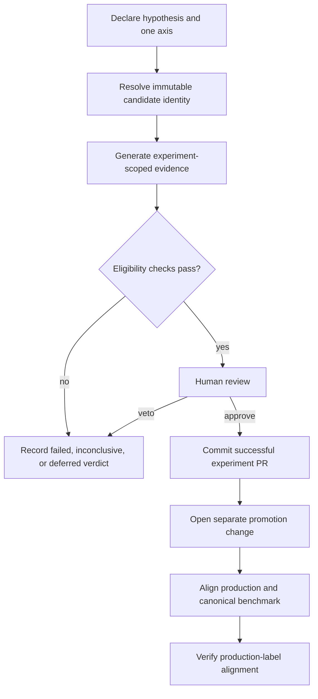

# Seeker Eval Experiment Workflow - Plan

## Goal Capsule

- **Objective:** Establish a repository-native workflow for durable Seeker prompt and model experiments, with production-aligned benchmarks and a separate promotion path.
- **Product authority:** Git is the authoritative experiment ledger and production configuration record; LangFuse supplies managed prompt versions, and Mastra remains the agent runtime.
- **Open blockers:** None for planning. Real LangFuse credentials and prompt versions remain operational prerequisites for official runs.

---

## Product Contract

### Summary

Forge will treat each Seeker prompt or model experiment as a committed evidence package with a predeclared hypothesis, one comparison axis, immutable configuration identity, scoped results, and a human verdict.
Only eligible experiments may feed a separate promotion change that updates production and its canonical benchmark to the same configuration.

### Problem Frame

The current Seeker eval can call the production prompt helper, but its canonical committed benchmark was generated from the repository fallback rather than a LangFuse-managed prompt.
The runner records useful prompt and model metadata, yet working runs are transient and there is no durable experiment lifecycle, hypothesis record, experiment-scoped evidence bundle, or promotion relationship.

Movable LangFuse labels are useful for finding candidates but cannot identify historical experiments reliably.
Prompt versions are immutable while they exist, so experiments need to resolve labels into exact versions and preserve the resolved identity without committing managed prompt text.

Prompt management, agent execution, evaluation, and tracing may evolve independently.
An experiment record coupled to one vendor's labels, datasets, or UI would make a future move between LangFuse, Mastra, or another provider unnecessarily disruptive.

### Key Decisions

- **Repository-native experiment packages.** (session-settled: user-approved — chosen over a provider-neutral engine or Mastra-first experiment store: it delivers durable evidence with the least new infrastructure.) Governs R1-R5, R15, R16.
- **One causal axis per experiment.** (session-settled: user-approved — chosen over prompt-by-model matrices: holding the other production dimension fixed keeps results attributable.) Governs R6-R8.
- **Immutable prompt version as identity.** (session-settled: user-approved — chosen over labels as durable selectors: labels can move or disappear.) Governs R9-R12.
- **Code-pinned production prompt version.** (session-settled: user-directed — chosen over runtime label following: a reviewed version change prevents accidental untested prompt promotion.) Governs R18-R21.
- **Automated eligibility with an asymmetric human veto.** (session-settled: user-approved — chosen over a human bypass for red gates: evaluation remains a real production constraint.) Governs R13, R14, R17.
- **Commit every completed experiment.** (session-settled: user-directed — chosen over summary-only or success-only retention: failed and inconclusive work remains durable evidence.) Governs R4, R5, R16.
- **Alert-only production-label synchronization.** (session-settled: user-directed — chosen over blocking deployment: the code pin controls traffic while label timing is operational bookkeeping.) Governs R20, R21.

### Actors

- A1. **Experiment owner:** declares the hypothesis, chooses candidates, reviews evidence, and records the verdict.
- A2. **Eval runner:** validates experiment identity, resolves inputs, executes the Seeker eval, and produces scoped evidence.
- A3. **Reviewer:** reviews the complete experiment package and approves or rejects its conclusions through the experiment PR.
- A4. **Promoter:** prepares the separate production change, proves it consumes an eligible experiment, and completes LangFuse label synchronization.
- A5. **Prompt provider:** currently LangFuse; resolves a candidate selector into prompt text and immutable provenance.
- A6. **Agent runtime:** currently Mastra; runs the production-shaped Seeker agent under the resolved experiment configuration.

### Requirements

**Experiment record and lifecycle**

- R1. Every experiment has a unique repository identity, owner, hypothesis, predeclared success criterion, comparison axis, production benchmark reference, candidate set, and lifecycle state.
- R2. Workflow state and verdict are separate: work moves through draft, execution, and review before receiving a terminal verdict of successful, failed, inconclusive, or deferred.
- R3. All generated artifacts for an experiment stay within that experiment's repository-scoped evidence package.
- R4. A completed experiment commits its manifest, generated answers, tool transcripts, judge verdicts, scores, comparison report, and human verdict.
- R5. Managed prompt bodies, credentials, and external trace payloads never enter the evidence package.

**Controlled comparison**

- R6. An experiment declares exactly one comparison axis: prompt or model.
- R7. A prompt experiment holds the production model configuration fixed while comparing one or more prompt candidates.
- R8. A model experiment holds the production prompt version fixed while comparing one or more model candidates.
- R9. Every run records complete comparison identity for the prompt, model, decoding behavior, question set, criteria, judge, retrieval fixtures, and relevant runtime configuration.
- R10. The runner refuses a comparison when any identity dimension outside the declared axis differs from the production benchmark.

**Prompt resolution**

- R11. A prompt experiment may use an experiment-specific LangFuse label for candidate intake, but the runner resolves it once to an immutable prompt version and content hash before generation.
- R12. Official experiment and benchmark runs require a live, non-stale managed prompt resolution; fallback, stale, missing, deleted, or mismatched prompt selections fail before answer-generation spend.

**Success and verdict**

- R13. Automated promotion eligibility requires both a green production-regression gate and satisfaction of the experiment's predeclared hypothesis criterion.
- R14. A human may veto, defer, or mark inconclusive an automatically eligible experiment, but cannot make an automatically ineligible experiment promotable.
- R15. Every terminal verdict records human reasoning and links it to the evidence that supports the decision.
- R16. Failed, inconclusive, and deferred experiments follow the same commit-and-review path as successful experiments.
- R17. A faulty gate or unsuitable success criterion is corrected through an explicit policy or evaluation change followed by a new run; prior results are not rewritten into eligibility.

**Production promotion and benchmark**

- R18. Promotion occurs through a separate change that references one successful, promotion-eligible experiment and identifies the exact accepted candidate.
- R19. The canonical benchmark represents the exact prompt version, model configuration, and other relevant identity currently serving production.
- R20. Production retrieves the Seeker prompt by an exact version pinned in the repository; the LangFuse `production` label is a deployment marker that should resolve to the same version but does not select live traffic.
- R21. Pre-promotion validation proves the pinned prompt version exists and matches the accepted experiment; a post-merge mismatch between the repository pin and `production` label produces an actionable alert without failing deployment.
- R22. An accepted experiment may supply the new canonical benchmark without another paid run only when its full identity exactly matches the promoted production configuration.
- R23. Any change between the accepted experiment and the production change requires a fresh qualifying benchmark.
- R24. The existing fallback-based canonical benchmark is replaced by a production-shaped run that proves it used an exact managed prompt version.

**Provider portability**

- R25. Persisted experiment identities describe provider, prompt identity, immutable revision, and content hash without making LangFuse label semantics part of the core experiment lifecycle.
- R26. Prompt resolution is isolated from experiment execution so another prompt provider can replace LangFuse without changing historical evidence packages.
- R27. External experiment stores, trace systems, and richer provider UIs may supplement the workflow but cannot become authoritative over the committed experiment ledger.

### Key Flows

- F1. **Create an experiment.**
  - **Trigger:** A1 wants to test a prompt hypothesis or compare production-capable models.
  - **Actors:** A1, A2
  - **Steps:** Declare the hypothesis, success criterion, one axis, benchmark, and candidates; validate the record before execution.
  - **Outcome:** The experiment is ready to run without inventing success conditions after results are visible.
  - **Covered by:** R1, R2, R6-R8.
- F2. **Resolve and execute a candidate.**
  - **Trigger:** A2 starts an official experiment run.
  - **Actors:** A2, A5, A6
  - **Steps:** Resolve and validate immutable inputs, refuse invalid provenance or off-axis drift, execute the production-shaped agent, and write evidence inside the experiment package.
  - **Outcome:** Every candidate result is attributable to one complete, durable configuration identity.
  - **Covered by:** R3-R5, R9-R12, R25, R26.
- F3. **Conclude an experiment.**
  - **Trigger:** Candidate evidence and comparisons are complete.
  - **Actors:** A1, A2, A3
  - **Steps:** Evaluate both eligibility conditions, perform human review, record a terminal verdict and reasoning, then commit the full package through a PR.
  - **Outcome:** The repository preserves the result whether or not the candidate may be promoted.
  - **Covered by:** R13-R17.
- F4. **Promote an accepted candidate.**
  - **Trigger:** A successful experiment is selected for production.
  - **Actors:** A3, A4, A5
  - **Steps:** Verify the accepted identity, update the production prompt version or model configuration, establish the matching canonical benchmark, merge through the normal production flow, and verify the LangFuse deployment marker.
  - **Outcome:** Production and the benchmark describe the same tested configuration, with label drift surfaced separately.
  - **Covered by:** R18-R24.

### Acceptance Examples

- AE1. **Managed prompt experiment.**
  - **Covers R7, R11, R12.**
  - **Given:** A prompt experiment names an experiment-specific LangFuse label and keeps the production model fixed.
  - **When:** The runner resolves the label to version 42 and a content hash.
  - **Then:** Every cell uses that resolved prompt, the evidence records version 42 and its hash, and later reruns select version 42 directly.
- AE2. **Missing or stale prompt.**
  - **Covers R12.**
  - **Given:** LangFuse cannot return the requested version as a fresh managed result.
  - **When:** An official experiment or benchmark begins.
  - **Then:** The run fails before generation and does not grade the repository fallback or stale cached text.
- AE3. **Model comparison.**
  - **Covers R6, R8-R10.**
  - **Given:** A model experiment compares three candidates against production.
  - **When:** The runner detects that all candidates share the production prompt and other comparison identity.
  - **Then:** It runs and compares the models; a prompt mismatch would refuse the experiment.
- AE4. **Human veto.**
  - **Covers R13-R16.**
  - **Given:** Both automated eligibility conditions pass.
  - **When:** Human review finds an unacceptable qualitative behavior.
  - **Then:** The reviewer records failed, inconclusive, or deferred with reasoning, the experiment is committed, and it is not promotable.
- AE5. **Red gate cannot be waived.**
  - **Covers R14, R17.**
  - **Given:** A candidate meets its hypothesis criterion but the production-regression gate is red.
  - **When:** The owner prefers the candidate despite the regression.
  - **Then:** The experiment remains ineligible; changing the gate or quality policy requires explicit work and a new experiment run.
- AE6. **Promotion reuses accepted evidence.**
  - **Covers R18-R23.**
  - **Given:** A successful experiment's accepted candidate exactly matches the proposed production configuration.
  - **When:** The promotion change is prepared.
  - **Then:** Its evidence becomes the new canonical benchmark without another paid run; any identity change instead requires a fresh benchmark.
- AE7. **Label synchronization lags.**
  - **Covers R20, R21.**
  - **Given:** Production serves the repository-pinned version 42 while the LangFuse `production` label still points to version 41.
  - **When:** Post-merge verification runs.
  - **Then:** Production remains healthy on version 42 and an actionable alert remains until the label is corrected.
- AE8. **Provider replacement.**
  - **Covers R25-R27.**
  - **Given:** Forge later replaces LangFuse prompt management or runs experiments through Mastra.
  - **When:** The new provider resolves prompts or retains richer run data.
  - **Then:** Existing repository experiment packages remain readable and authoritative without migration to the new provider's label or experiment model.

### Success Criteria

- An official benchmark cannot be produced from fallback or stale prompt content.
- A reviewer can reconstruct what was tested, why, under which immutable configuration, what happened, and why the terminal verdict was chosen using only the repository package.
- Prompt and model experiments compare against production without allowing unrelated configuration drift.
- No red-gate experiment can enter the promotion workflow.
- After promotion, the canonical benchmark and production configuration carry the same complete identity.
- Replacing LangFuse, Mastra experiment storage, or the tracing backend does not invalidate historical experiment records.

### Scope Boundaries

**Deferred for later**

- A database-backed experiment registry, experiment browser, or cross-experiment analytics UI.
- Automatic LangFuse prompt creation, label mutation, or label cleanup.
- Automatic post-merge remediation when the LangFuse `production` label drifts.
- Mastra-native datasets, experiments, scorers, or provider-side comparison as the execution backend.
- Automatic trace ingestion or long-term trace retention inside experiment packages.
- Multi-axis prompt-by-model matrices and automated statistical conclusions beyond the current eval's measured gate policy.

**Outside this product's identity**

- Making LangFuse, Mastra, or another external service the authoritative experiment ledger.
- Committing managed prompt bodies, credentials, or unrestricted trace payloads.
- Allowing an experiment PR to mutate production or combining experiment evidence and production promotion into one PR.
- Allowing a human approval to convert automated ineligibility into promotion eligibility.

### Dependencies and Assumptions

- Exact-version retrieval is supported by LangFuse but is not exposed by Forge's current managed-prompt helper.
- Prompt versions are immutable while present, but deletion remains possible; committed evidence remains reviewable even when exact reruns become impossible.
- The eval's existing production-shaped agent loop, frozen retrieval fixtures, judge, deterministic checks, and gate remain the starting measurement system.
- Model identity must expand beyond a bare provider model ID wherever routing or parameters can alter served behavior.
- The normal PR-to-main deployment flow remains the only production release path.

### Sources and Research

- `apps/mastra/src/evals/seeker/DECISION.md` — current Seeker eval intent, production-shaped loop, gate policy, and benchmark role.
- `apps/mastra/src/evals/seeker/run-loop.ts` — current single prompt resolution, per-cell injection, model selection, and run identity stamping.
- `apps/mastra/src/evals/seeker/types.ts` — current comparison identity and mismatch scopes.
- `apps/mastra/src/evals/seeker/run-gate.ts` — canonical benchmark location and gate entry point.
- `apps/mastra/evals/results/seeker-baseline/` — canonical benchmark; currently stamped as fallback rather than LangFuse-managed.
- `apps/mastra/src/services/langfuse-prompt-client.ts` — label-resolved managed prompt retrieval, fallback/stale semantics, and provenance.
- `docs/plans/2026-07-20-001-feat-langfuse-prompt-helper-plan.md` — managed-prompt helper decisions and retrieval-only boundary.
- `docs/roadmap/ai-chat/feat-272-seeker-langfuse-managed-prompt-integration.md` — production prompt integration history and governance concerns.
- LangFuse prompt version control and core concepts documentation — immutable versions, movable labels, custom experiment labels, and protected-label behavior.
- Mastra datasets, experiments, scorers, gates, verdicts, and OpenTelemetry-compatible observability documentation — future provider capabilities considered but deferred.
