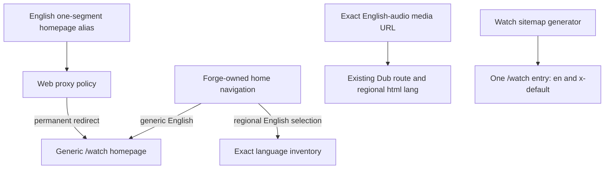

# Consolidate English Watch Homepages - Plan

## Goal Capsule

- **Objective:** Make `/watch` the only indexable English Watch homepage while preserving every exact English Dub, inventory, video, and episode route.
- **Authority:** The user-approved international-English product direction governs behavior. `docs/roadmap/platform/feat-341-consolidate-english-watch-homepages.md` tracks delivery. Existing Watch routing, sitemap, and language contracts constrain implementation.
- **Execution profile:** A focused Web route-policy migration with regression coverage, browser proof, and no Admin or schema change.
- **Stop conditions:** Stop if consolidation requires deleting a Language or Dub, redirecting a language inventory or media route, or adding page-head hreflang. Surface evidence if `/watch` cannot represent the same homepage content without regional targeting.
- **Tail ownership:** Complete the branch through a reviewed, green pull request. Do not deploy directly to production.

---

## Product Contract

### Summary

Forge will treat public English audio slugs as media identities, not independent homepage markets. Their one-segment homepage aliases converge on `/watch`; exact inventory and playback URLs remain language-bearing.

### Problem Frame

Watch currently admits every public audio-language slug as a localized homepage. The English aliases reuse the international ministry homepage rather than publishing materially different regional content, yet those URLs can render, self-canonicalize, and enter the sitemap as distinct search targets. The shipped British-English cluster therefore turns Dub taxonomy into unsupported regional SEO targeting and divides signals that belong to one English homepage.

### Requirements

**Homepage identity and migration**

- R1. `/watch` is the sole indexable and self-canonical English Watch homepage.
- R2. Every current one-segment English audio homepage alias redirects directly to `/watch` with a permanent HTTP status before manifest admission or page rendering.
- R3. Redirects preserve the incoming query string and do not admit a caller-spoofed internal rewrite to the retired page.
- R4. Forge-owned homepage links stop emitting retired English homepage aliases.

**Language and media preservation**

- R5. Exact English audio slugs remain valid Language and Dub identities for inventory, video, episode, picker, and manifest behavior.
- R6. British and other regional English audio documents retain their current BCP-47 HTML language identity.
- R7. A regional or accent-specific English selection that needs a language-scoped landing destination opens its existing inventory; generic English opens `/watch`.
- R8. Non-English localized homepages and all media URL shapes remain unchanged.

**Crawler signals and documentation**

- R9. The Watch sitemap contains one homepage `<loc>` for `/watch`, with `en` and `x-default` both targeting `/watch` and no regional English homepage alternate.
- R10. Watch page HTML continues to omit page-head hreflang.
- R11. Repository guidance records that the completed two-home cluster is historical and that the successor policy consolidates English homepages.

### Key Decisions

- **One international-English homepage** (session-settled: user-approved — chosen over an indexable generic-English and `en-GB` homepage cluster: the ministry does not publish materially different UK- or US-targeted homepage content). Governs R1-R4 and R9-R11.
- **Separate Dub identity from landing-page identity** (session-settled: user-approved — chosen over inferring regional landing pages from the Language taxonomy: accent-specific audio can remain selectable without creating a separate homepage market). Governs R5-R8.

### Acceptance Examples

- AE1. Given `/watch/english-british.html?utm_source=qa`, when the request reaches Web, then one permanent redirect lands at `/watch?utm_source=qa` without a route-manifest lookup or page render. Covers R1-R3.
- AE2. Given the generated English audio-home aliases, when each one-segment `.html` homepage URL is requested, then each redirects to `/watch` while its `/videos` and playable media forms do not redirect. Covers R2, R5, and R8.
- AE3. Given the Watch sitemap manifest, when homepage entries are rendered, then exactly one `/watch` location carries `en` and `x-default` self-targets and no regional English homepage URL appears. Covers R9.
- AE4. Given a user selects British English from the global fallback picker on a surface without a verified playable alternative, when navigation resolves, then the user reaches the British inventory instead of bouncing through a retired homepage. Covers R4-R7.
- AE5. Given a British-audio media URL, when it renders, then the URL retains `english-british`, the selected Dub remains British English, and `<html lang="en-GB">` remains correct. Covers R5-R6.
- AE6. Given the generic Watch homepage, when `/watch` renders, then it remains self-canonical and its page head contains no hreflang links. Covers R1 and R10.

### Scope Boundaries

- Do not delete, merge, rename, or reclassify Languages or Dubs.
- Do not change language inventories, standalone video paths, contextual episode paths, or route-manifest data.
- Do not change non-English localized homepage availability or missing-home fallback behavior.
- Do not add HTML hreflang or move Watch hreflang ownership out of sitemap XML.
- Do not rewrite completed historical plans or tickets as if their original implementation never shipped; add dated supersession context where forward-looking guidance would mislead.

---

## Planning Contract

Within `apps/web`, `/` is the base-path-relative pathname whose public URL is `/watch`. Technical redirect and link targets below use `/` only in that internal representation; public crawler and acceptance language uses `/watch`.

### Key Technical Decisions

- KTD1. **Centralize the retired English-home policy.** Define an exact, edge-safe predicate for the current English audio slugs in `apps/web/src/lib/locale.ts`. Do not infer the policy from fallback UI locale because unsupported languages can also fall back to English chrome.
- KTD2. **Redirect at the proxy boundary.** Match the exact lowercase one-segment English homepage aliases before canonicalization, manifest admission, or rendering. Return a direct `308` through the existing redirect helper, preserve query parameters, normalize the visible internal locale form directly to `/`, and reject marked internal rewrites that claim a retired alias. Next.js retains ownership of its existing leading trailing-slash normalization before the proxy runs.
- KTD3. **Make internal navigation destination-aware.** Homepage/logo destinations for every consolidated English alias point directly to `/`. The global fallback language switcher sends generic English to `/` and regional or accent-specific English to its language inventory so the choice still has a visible language-scoped result.
- KTD4. **Keep one self-inclusive homepage sitemap group.** Emit one `/watch` entry with distinct `en` and `x-default` annotations that share the same target. This preserves the generator and auditor invariants without manufacturing a regional alternate.
- KTD5. **Retain regional document identity below the homepage.** Keep the `english-british` HTML-language override and all exact-slug media routing. Update homepage-specific comments or test names that would otherwise misdescribe the surviving behavior.

### Assumptions

- The current consolidated alias set is `english`, `english-african`, `english-british`, and `english-north-american-indigenous`. A future English audio slug requires an explicit product decision and policy-test update rather than automatic locale-family inference.
- Uppercase extensions, bare no-extension aliases, and trailing-slash normalization retain their current framework behavior; this migration owns the canonical lowercase `.html` aliases.
- Redirect cache headers retain the existing proxy policy. Production cache-policy changes are outside this scope.
- Regional English global-picker fallback to the exact inventory is the safest unvalidated navigation default because it preserves the selected audio identity without restoring a regional homepage.

### High-Level Technical Design

The redirect and navigation policy converge homepage traffic without changing the exact-slug inventory and media branches.

### Risks and Mitigations

- **Future alias drift:** A new English audio slug could become an indexable homepage. Keep the explicit predicate and enumerate the generated corpus in focused tests.
- **Selection appears ignored:** Redirecting a regional choice straight to generic `/watch` would erase its visible intent. Route fallback selection to the exact inventory.
- **Internal rewrite bypass:** A forged rewrite header could try to reach the retired static route. Reject retired claims and test the proxy seam.
- **Crawler-contract drift:** Removing the British location without preserving the default entry could remove the homepage from the Watch sitemap. Keep one `en` plus `x-default` self-inclusive group and run sitemap/auditor coverage.
- **Frontend loading regression:** A late page-level redirect could fetch manifests or render an ISR page. Assert the proxy returns before those calls and run the production build plus browser proof.

### Sources and Research

- `docs/solutions/performance-issues/watch-hreflang-sitemap-manifest-20260612.md` establishes sitemap XML as the only Watch hreflang owner.
- `docs/solutions/performance-issues/watch-static-locale-rewrite-route-manifest-admission-20260529.md` establishes proxy admission before force-static rendering.
- `docs/solutions/best-practices/language-identity-on-slug-not-bcp47-20260605.md` separates exact Language identity from locale labels.
- `docs/solutions/best-practices/nextjs-route-shape-migration-cross-cutting-contract-drift-20260430.md` requires cross-surface route migration coverage.
- [Google localized-version guidance](https://developers.google.com/search/docs/specialty/international/localized-versions?hl=en) limits hreflang to actual language or regional variations and requires self-inclusive reciprocal sets.
- [Google URL-move guidance](https://developers.google.com/search/docs/crawling-indexing/site-move-with-url-changes) recommends direct server-side permanent redirects, updated annotations, and new-only sitemaps for consolidated URLs.
- [Next.js redirect guidance](https://nextjs.org/docs/app/guides/redirecting) supports permanent `308` responses at the Proxy boundary before rendering.

---

## Implementation Units

### U1. Consolidate English homepage routing and navigation

- **Goal:** Make every current English homepage alias converge on `/watch` while regional English inventories and media routes remain exact-slug destinations.
- **Requirements:** R1-R8; KTD1-KTD3 and KTD5.
- **Dependencies:** None.
- **Files:** `apps/web/src/lib/locale.ts`, `apps/web/src/lib/locale.test.ts`, `apps/web/src/proxy.ts`, `apps/web/src/proxy.test.ts`, `apps/web/src/lib/watch-language-switcher.ts`, `apps/web/src/lib/watch-language-switcher.test.ts`, `apps/web/src/components/FloatingSearchProvider.tsx`, `apps/web/src/components/__tests__/FloatingSearchProvider.test.tsx`, `apps/web/src/lib/watch-url-probe.ts`, `apps/web/src/lib/watch-url-probe.test.ts`.
- **Approach:**
  1. Add the exact English-home policy beside public Watch language identity helpers and characterize its current corpus.
  2. Apply the policy to public aliases, visible internal prefixes, and internal rewrite validation before any data-bearing admission path.
  3. Update internal homepage/logo and global fallback destinations per KTD3 without changing inventory or playable-language route builders.
  4. Teach the cutover URL probe that each retired homepage is an intentional one-hop redirect to `/watch`.
  5. Preserve the regional HTML-language override and rename only stale homepage-specific wording.
- **Patterns to follow:** Reuse `buildRedirect`, the structural `ProxyRequest` test harness, exact `LocaleSlug` identity, `languageVideosIndexPath`, and existing route-surface registration tests.
- **Test scenarios:**
  1. Covers AE1. Each exact English homepage alias returns `308` to `/`, preserves query parameters, sets the established redirect cache header, and does not produce an internal rewrite.
  2. The visible locale-prefixed form reaches `/` in one redirect, and the framework-normalized trailing-slash form then follows the same retired-alias redirect.
  3. A request carrying the internal rewrite header for a retired alias is rejected rather than admitted.
  4. Proxy spies prove alias requests do not fetch the route manifest or homepage availability.
  5. Covers AE2 and AE5. British inventory, standalone video, and episode requests retain their exact slug, existing internal route, and `en-GB` identity; another non-English localized homepage retains its current behavior.
  6. Covers AE4. Generic English fallback targets `/`; each regional English fallback targets its inventory; language, history, and inventory utility surfaces remain language-bearing.
  7. A regional English media page's floating home/logo link targets `/` directly instead of a retired alias.
  8. Cutover-probe fixtures cover all four retired aliases and fail if any preview misses `/watch` or adds a redirect hop.
- **Verification:** Focused locale, proxy, language-switcher, Floating Search provider, and URL-probe suites prove both the redirect boundary and preserved deep routes.

### U2. Collapse the homepage sitemap cluster

- **Goal:** Publish one generic English/default Watch homepage location and remove regional English homepage crawler signals.
- **Requirements:** R1 and R9; KTD4.
- **Dependencies:** U1.
- **Files:** `apps/web/src/lib/watch-sitemap.ts`, `apps/web/src/lib/watch-sitemap.test.ts`, `apps/web/src/lib/watch-sitemap-audit.test.ts`, `apps/web/src/app/sitemap.test.ts`.
- **Approach:** Replace the current two-location homepage group with one `/watch` location containing `en` and `x-default` self-targets. Leave video-route alternate generation unchanged so exact English Dubs can remain valid deep-media alternates.
- **Patterns to follow:** Preserve `groupForEntries`, shared alternate XML within a group, serialized byte accounting, duplicate-location detection, and sitemap-only ownership.
- **Test scenarios:**
  1. Covers AE3. Entry projection returns exactly one homepage location with `en` and `x-default` targeting `/watch`.
  2. No consolidated English homepage alias appears as a homepage `<loc>` or alternate target.
  3. A manifest with no video groups still emits the one homepage entry.
  4. Chunk counts and byte-limit fixtures reflect the one-entry group without weakening shard ceilings.
  5. Reciprocity, self-inclusion, duplicate-hreflang, and target-existence audit fixtures accept the one-location group.
  6. A deep-media manifest alternate for a regional English Dub remains untouched.
- **Verification:** Focused sitemap generation, sitemap route, and auditor suites pass with the revised expected totals and unchanged safety invariants.

### U3. Record supersession and validate the public contract

- **Goal:** Keep repository guidance and runtime proof aligned with the consolidated homepage policy.
- **Requirements:** R10-R11; AE6.
- **Dependencies:** U1 and U2.
- **Files:** `docs/roadmap/platform/feat-302-watch-home-hreflang-sitemap-cluster.md`, `docs/roadmap/platform/feat-341-consolidate-english-watch-homepages.md`, `docs/roadmap/README.md`, `docs/plans/2026-07-25-001-fix-watch-language-less-english-canonical-plan.md`.
- **Approach:** Keep the completed two-home ticket and earlier canonical migration as historical records, but add dated supersession notes where their forward-looking `en-GB` homepage guidance would be read as current. Complete the successor ticket and regenerate the roadmap index after implementation proof.
- **Test expectation:** None — this unit updates documentation and generated roadmap state; behavioral proof belongs to U1-U2 and the Verification Contract.
- **Verification:** The roadmap dependency is bidirectional, `feat-341` is complete, the generated index includes it, and prose searches distinguish retired homepage guidance from surviving regional media behavior.

---

## Verification Contract

| Gate               | Command or evidence                                                                                                                                                                                                                                                                                                                                                                                          | Proves                                                                                           |
| ------------------ | ------------------------------------------------------------------------------------------------------------------------------------------------------------------------------------------------------------------------------------------------------------------------------------------------------------------------------------------------------------------------------------------------------------ | ------------------------------------------------------------------------------------------------ |
| Focused behavior   | `pnpm --filter @forge/web test -- src/proxy.test.ts src/lib/locale.test.ts src/lib/watch-language-switcher.test.ts src/components/__tests__/FloatingSearchProvider.test.tsx src/lib/watch-sitemap.test.ts src/lib/watch-sitemap-audit.test.ts src/app/sitemap.test.ts src/lib/watch-url-probe.test.ts`                                                                                                       | Redirect, internal navigation, regional media preservation, cutover probe, and sitemap contracts |
| Type safety        | `pnpm --filter @forge/web typecheck`                                                                                                                                                                                                                                                                                                                                                                         | Route and branded-path changes remain type-correct                                               |
| Static quality     | `pnpm --filter @forge/web lint`                                                                                                                                                                                                                                                                                                                                                                              | CI-sensitive lint and generated locale checks pass                                               |
| Production compile | `pnpm --filter @forge/web build`                                                                                                                                                                                                                                                                                                                                                                             | Proxy, App Router, and static route integration compile without adding page-load work            |
| Roadmap index      | `pnpm --filter @forge/roadmap generate:readme`                                                                                                                                                                                                                                                                                                                                                               | Successor ticket and status totals are regenerated from source tickets                           |
| Diff hygiene       | `git diff --check`                                                                                                                                                                                                                                                                                                                                                                                           | No whitespace or patch-format defects remain                                                     |
| Browser proof      | Request each retired English homepage alias and confirm a direct permanent redirect to `/watch`; inspect `/watch` for its self-canonical URL and zero page-head hreflang; open a known British-audio inventory and media URL and confirm the explicit slug plus `html lang="en-GB"`; exercise the language picker and one client-side Search open/close control; inspect browser errors and loading behavior | Public crawler/user behavior and unchanged frontend initialization                               |

---

## Definition of Done

- Every current English audio homepage alias redirects directly and permanently to `/watch`, with query preservation and no render or manifest fetch.
- Forge-owned navigation does not emit a retired English homepage URL; generic English uses `/watch` and regional English can still reach exact inventories and Dubs.
- The Watch sitemap has one `/watch` homepage location with `en` and `x-default`, no regional English homepage target, and unchanged deep-media alternate behavior.
- Page-head hreflang remains absent; `/watch` remains self-canonical; regional English inventory and media documents retain exact slugs and BCP-47 HTML identity.
- Focused tests, typecheck, lint, production build, roadmap generation, diff hygiene, and browser proof pass.
- Superseded repository guidance is dated, the successor roadmap ticket is complete, and generated roadmap state is current.
- Abandoned experiments, unused helpers, stale comments, and test-only scaffolding are absent from the final diff.
