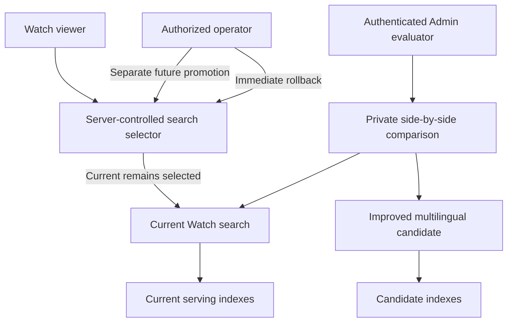
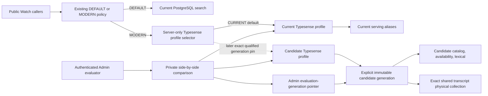
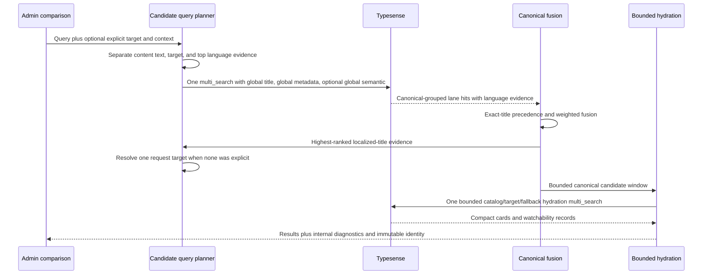
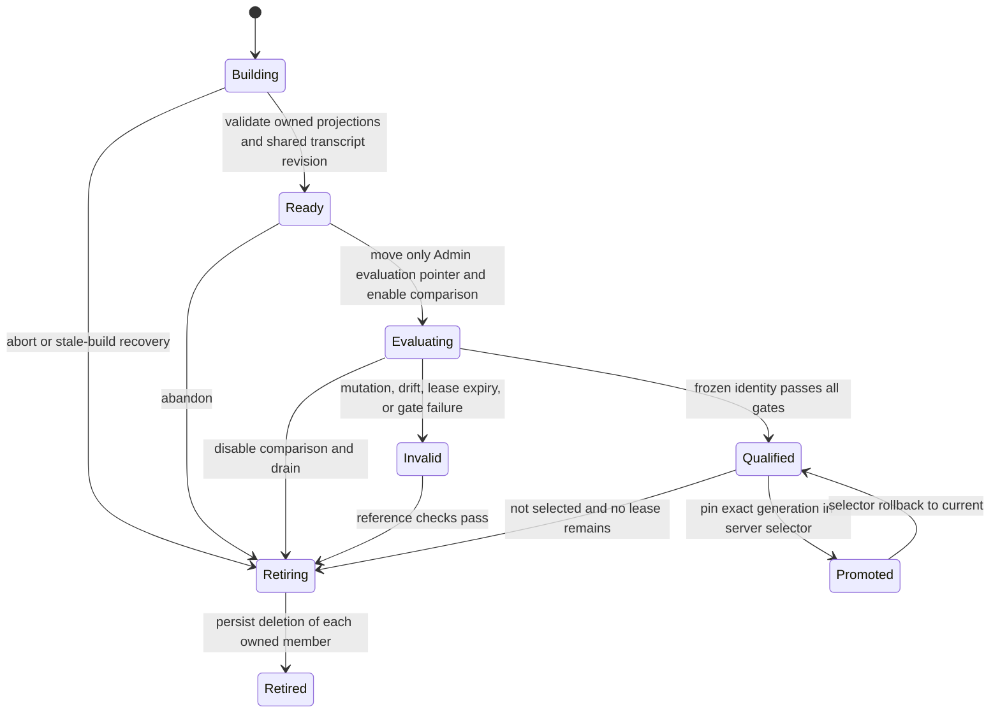

# Native-Language Watch Search Candidate - Plan

## Goal Capsule

- **Objective:** Produce a production-deployable improvement to the existing Typesense Watch search that retrieves videos reliably across languages, while the current search continues serving every public Watch request until a separate promotion decision.
- **Product authority:** Admin owns query interpretation, retrieval, canonical-video fusion, watchability, candidate evaluation, and the future server-controlled traffic selector; the public Watch surfaces retain their current request and response behavior.
- **Evaluation surface:** Authenticated Admin users compare the current and candidate result lists for the same query on a private side-by-side page.
- **Authority hierarchy:** The Product Contract owns behavior and scope; the Planning Contract owns implementation choices; Implementation Units may refine mechanics but cannot weaken either contract.
- **Execution profile:** Implement the candidate as a disabled-by-default server-owned profile of the existing search pipeline, publish candidate-owned projections independently, and qualify it before any public selector change.
- **Stop conditions:** Stop rather than promote if the candidate requires a public Watch contract change, a second transcript-vector generation on the current 16 GiB node, wider unbounded fan-out, or an exception to any relevance, latency, capacity, isolation, or reliability gate.
- **Tail ownership:** Implementation owns code, migrations, tests, private Admin evaluation, benchmark tooling, and runbooks through a merge-ready state. Production qualification and any later public promotion remain explicit operator decisions.
- **Open blockers:** None. The physical index shape, isolation boundary, promotion control, language plan, and measurable gates are resolved below.

---

## Product Contract

### Summary

Improve the existing Typesense Watch search so native-language, mixed-language, title, topic, and semantic queries find the correct canonical content before playback language is selected.
Deploy the improvement beside the current search, evaluate both through private Admin, and keep public Watch traffic on the current search until a separate explicit switch.

### Problem Frame

Current multilingual retrieval chooses a query locale and language identity before localized title and metadata retrieval.
When that early choice is wrong, the corresponding Typesense filter removes the correct localized title before ranking can consider it.
The Chinese JESUS search exposed this failure: searchable Simplified- and Traditional-Chinese titles and playable Mandarin audio use different language identities.

The same shape is broader than Chinese.
Cyrillic, Arabic, Han, Devanagari, and Latin scripts are shared by multiple languages, and short queries often do not contain enough information for one reliable language classification.
Forge already stores translated titles, unique Language slugs, BCP-47 execution labels, localized language names, country-language relationships, and curated language fallbacks, but current named-language resolution and pre-retrieval filtering do not use that information as a complete evidence set.

The improvement needs production-shaped evaluation without exposing an unproven ranker to viewers.
Deploying candidate code and indexes must therefore remain separate from choosing which search serves public Watch traffic.

### Key Decisions

- **Improve the existing Watch search rather than create a separate search product.** (session-settled: user-directed — chosen over a separate search product: the candidate must become a safe improvement to the search Watch already uses.) Governs R1, R16, R20.
- **Deploy current and candidate search side by side before promotion.** (session-settled: user-directed — chosen over keeping the candidate outside production: production-shaped evaluation is required before deliberately switching public traffic.) Governs R14-R19, R21.
- **Find canonical content before selecting playback language.** (session-settled: user-approved — chosen over hard language-first retrieval: an incorrect language guess must not hide an otherwise valid title match.) Governs R2-R4, R8-R11.
- **Use existing language metadata instead of adding script identity properties.** (session-settled: user-directed — chosen over adding `scriptCodes`: Forge already owns language identity, locale, localized-name, country, and fallback metadata.) Governs R5-R7, R10.
- **Evaluate the complete search job.** (session-settled: user-directed — chosen over a title-only experiment: the candidate must also preserve topic, felt-need, metadata, and semantic discovery.) Governs R1-R4, R12, R23.
- **Use a private Admin side-by-side comparison.** (session-settled: user-directed — chosen over candidate-only output: the same query must make wins and regressions visible against the current search.) Governs R13-R17.
- **Defer Algolia comparison.** (session-settled: user-directed — chosen over including Algolia in this scope: any Algolia research or migration will be scoped separately.) Governs R25.

### Requirements

**Search behavior**

- R1. The candidate must perform the same complete user job as current Watch search across known titles, mixed-language title-plus-language queries, localized metadata, felt-need or topic queries, and transcript-semantic discovery.
- R2. Published localized titles must remain eligible for first-stage candidate retrieval without requiring one inferred language identity to admit them.
- R3. Exact and whole-title canonical matches must outrank weaker metadata or semantic similarity.
- R4. Title, metadata, and semantic evidence must fuse at canonical Video identity so translated or physical duplicates return as one content result.
- R5. Query interpretation must keep content text, query-language candidates, target watch Language, display Language, evidence Language, and availability Language as separate signals.
- R6. A Language explicitly selected by the viewer is the hard target-watch constraint, not a first-stage content-recall filter; a Language named in the query is a strong target preference when no conflicting explicit selection exists.
- R7. Named-language recognition must use existing English, native, and localized Language names plus stable public slugs; BCP-47, country context, current watch context, route locale, and browser locale may contribute weaker evidence.
- R8. Script and statistical language detection may narrow or rank multiple query-language candidates, but an inferred single Language must not exclude otherwise valid localized-title matches.
- R9. Ambiguous short or shared-script queries must preserve multiple plausible language interpretations until retrieval evidence and user context can distinguish them.
- R10. A matched localized title may provide strong playback-language evidence, while curated Language fallbacks bridge a localized-title Language to an available Dub Language when their identities differ.
- R11. Playback selection must happen after canonical retrieval and preserve the existing order of target audio, target subtitles, related-language audio, and unavailable fallback.
- R12. Candidate retrieval must preserve public-search visibility, canonical deduplication, bounded candidate windows, bounded availability hydration, degradation behavior, failure isolation, and the authority of strong lexical matches over semantic evidence. It must not regress the current production baselines for search latency, Typesense query count or fan-out, application CPU or memory, index capacity, or serving reliability beyond planning-defined tolerances.

**Private production evaluation**

- R13. Only authenticated Admin users may access the comparison page; no public Watch, mobile, TV, or anonymous Admin route may expose it.
- R14. One Admin submission must run the same query, language selection, and relevant search context through the current and candidate searches.
- R15. The comparison page must present current and candidate result lists side by side with enough evidence to inspect canonical identity, displayed title, matched-title or evidence Language, target Language, selected audio or subtitle outcome, degradation, and latency.
- R16. The candidate must use the existing Watch search request and result meaning so comparison measures a search improvement rather than a new product contract.
- R17. Admin-initiated comparisons may exercise the candidate against production-shaped data, but ordinary viewer requests must not invoke the candidate automatically.
- R18. Candidate code and candidate search indexes may deploy to production without changing the public traffic selector from the current search.
- R19. Publishing, rebuilding, failing, or removing candidate indexes must not move, overwrite, retire, or invalidate the current search indexes.
- R20. The public Watch search contract and every existing Watch search surface must remain unchanged while the candidate is under evaluation.

**Promotion, rollback, and removal**

- R21. Public promotion must require a separate server-controlled action after reviewed evidence; deploying application code or publishing candidate indexes must never promote the candidate implicitly.
- R22. The traffic selector must retain the current search as an immediate rollback target after a future candidate promotion.
- R23. Candidate qualification must cover canonical relevance, target-language correctness, native and mixed-language quality, topic and semantic usefulness, duplicate prevention, and degradation on one identified application-and-index generation. It must also compare the candidate against the current search under equivalent production-shaped load and prove that p50, p95, and p99 latency, Typesense query count and fan-out, availability-hydration bounds, application CPU and memory, index capacity, failure isolation, and serving reliability remain within planning-defined non-regression gates.
- R24. The candidate, comparison page, candidate configuration, and candidate indexes must be removable without changing or rebuilding the current serving search.
- R25. This work must not depend on Algolia behavior, Algolia indexes, or an Algolia comparison baseline.

### Actors

- A1. **Admin evaluator:** An authenticated staff member who submits representative queries and judges current and candidate results side by side.
- A2. **Current search:** The existing Typesense Watch search that continues serving public traffic and provides the comparison baseline.
- A3. **Candidate search:** The improved version of the same Watch search contract, invoked only by private evaluation until promotion.
- A4. **Watch viewer:** A public Web, mobile, or TV user whose search behavior must remain unchanged during evaluation.
- A5. **Search operator:** The authorized person or deployment process that publishes candidate indexes and controls later promotion or rollback.

### Search and Rollout Shape

The diagram illustrates R13-R22: private comparison may invoke both versions, while public traffic reaches only the version deliberately selected by the server-controlled promotion boundary.

### Key Flows

- F1. Candidate deployment without traffic replacement
  - **Trigger:** A reviewed candidate revision and candidate index generation are ready for production-shaped evaluation.
  - **Actors:** A3, A5
  - **Steps:** The operator deploys the candidate and publishes only its isolated indexes; the public selector remains on A2; A4 continues receiving current results.
  - **Outcome:** The candidate is testable in production without serving viewers.
  - **Covers:** R17-R21, R24.
- F2. Private side-by-side evaluation
  - **Trigger:** A1 submits a query and optional target Language on the private Admin page.
  - **Actors:** A1, A2, A3
  - **Steps:** The page sends equivalent intent to both searches, presents both result lists, and exposes the evidence and playback decisions needed for review.
  - **Outcome:** The evaluator can identify relevance wins, language errors, regressions, degradation, and latency differences for the same query.
  - **Covers:** R13-R17, R23.
- F3. Multilingual candidate retrieval
  - **Trigger:** A3 receives an Admin comparison query.
  - **Actors:** A3
  - **Steps:** The candidate separates content and language signals, preserves global localized-title recall, gathers bounded metadata and semantic evidence, groups by canonical Video, and then resolves watchability.
  - **Outcome:** The result identifies the correct content independently from the Language ultimately selected for playback.
  - **Covers:** R1-R12.
- F4. Candidate failure or removal
  - **Trigger:** Candidate search, indexing, or evaluation fails or is abandoned.
  - **Actors:** A1, A2, A3, A5
  - **Steps:** The comparison surface reports the candidate failure without altering the current result list; the operator may remove candidate code and indexes while leaving the current serving generation untouched.
  - **Outcome:** Public search remains available and the experiment leaves no serving dependency behind.
  - **Covers:** R17-R20, R24.
- F5. Future promotion and rollback
  - **Trigger:** A separate reviewed decision approves the candidate after R23 evidence passes its planning-defined gates.
  - **Actors:** A2, A3, A5
  - **Steps:** The operator deliberately moves the server-controlled selector to A3; A2 remains a rollback target; an operator can restore A2 without rebuilding it.
  - **Outcome:** Promotion and rollback are operational decisions independent from code deployment and index publication.
  - **Covers:** R21-R23.

### Acceptance Examples

- AE1. **Covers R1, R5-R7, R10-R11.** Given no explicit target Language, when an evaluator searches `Jesus Japanese`, the candidate treats `Jesus` as content intent, treats Japanese as the named target preference, returns the canonical JESUS film, and prefers a Japanese Dub or subtitle according to watchability rules.
- AE2. **Covers R1, R5-R7, R10-R11.** Given the same content intent written as `Jesus 日本語`, the candidate recognizes the native Language name and produces the same canonical and playback outcome as AE1.
- AE3. **Covers R2-R4, R8-R11.** Given the localized-title query `イエス`, the candidate retrieves the canonical JESUS film through Japanese title evidence without requiring Japanese to be selected before retrieval.
- AE4. **Covers R2-R4, R8-R11.** Given `Иисус`, the candidate retrieves the canonical JESUS film while preserving multiple plausible Cyrillic-language interpretations until evidence and user context select playback.
- AE5. **Covers R2-R4, R8-R11.** Given `耶稣` or `耶穌`, the candidate retrieves the canonical JESUS film through Simplified- or Traditional-Chinese title evidence and may select a related playable Mandarin Dub through the curated fallback relationship.
- AE6. **Covers R1, R5, R8-R12.** Given a native-language felt-need or topical query with no exact title, the candidate may use localized metadata and semantic evidence without allowing those lanes to outrank an exact canonical-title match.
- AE7. **Covers R2, R8-R9.** Given a short query in a script shared by several Languages, an incorrect top language guess does not make a matching localized title in another plausible Language ineligible.
- AE8. **Covers R4, R12.** Given several localized or physical hits for the same Video family, the candidate returns one canonical result with the strongest evidence rather than duplicate cards.
- AE9. **Covers R13-R17.** Given an authenticated evaluator submits one query, the Admin page displays current and candidate results side by side and identifies which Language and playback evidence drove each candidate result.
- AE10. **Covers R17-R21.** Given candidate code and indexes have deployed, a normal public Watch query still executes only the current search until an authorized operator performs the separate promotion action.
- AE11. **Covers R17-R20, R24.** Given candidate search or indexing is unavailable, the private page may show candidate failure while the current comparison pane and all public Watch requests continue working.
- AE12. **Covers R21-R24.** Given a future promotion is rolled back or the experiment is removed, the current search resumes or remains primary without rebuilding its serving indexes.
- AE13. **Covers R25.** Given Algolia is unavailable or unconfigured, candidate indexing, private comparison, qualification, promotion, and rollback remain fully functional because this work has no Algolia dependency.
- AE14. **Covers R12, R17-R19, R23.** Given current and candidate searches are exercised under equivalent production-shaped load, the candidate cannot qualify for promotion if it exceeds any planning-defined latency, query-fan-out, hydration, CPU, memory, index-capacity, failure-isolation, or serving-reliability non-regression gate; candidate evaluation must not consume enough shared capacity to degrade the current public search.

### Success Criteria

- The private Admin page can compare the current and candidate searches for the same production-shaped query and language context without exposing the candidate publicly.
- Reviewed evaluation demonstrates that the candidate finds the expected canonical content and appropriate playback outcome across exact title, mixed-language, native-title, topical, semantic, ambiguous, and degraded-query categories.
- Candidate deployment, index publication, failure, and removal do not change which search serves public Watch traffic.
- Candidate evaluation and retrieval preserve the current search's latency, bounded-work, resource-usage, failure-isolation, and serving-reliability baselines within explicit non-regression gates, and comparison traffic does not degrade the current public search.
- A future promotion requires one explicit server-controlled action, and rollback restores the preserved current search without a rebuild.
- Candidate evidence is tied to one application revision and one candidate index generation so results cannot be approved from a mixed deployment.

### Scope Boundaries

**In scope**

- The complete improved Typesense Watch search candidate using the existing Watch search meaning and catalog authority.
- Private authenticated Admin comparison of current and candidate results.
- Production deployment of isolated candidate code and indexes without public traffic replacement.
- A separate promotion boundary and preserved rollback target.
- Evaluation coverage and diagnostics sufficient to decide whether the candidate is safe to promote later.

**Deferred for later**

- The decision and operational act that make the candidate the public primary search.
- Removing the current search after a promoted candidate has proven stable.
- Learning-to-rank or click-trained relevance models based on future production evidence.
- Any separately scoped Algolia comparison or migration work.

**Outside this work**

- A new search product, a second public search interface, or changes to Watch result-card interaction.
- Automatic candidate execution for every public query during the evaluation period.
- Adding `scriptCodes` or treating one Unicode script as one Forge Language.
- Mobile, TV, or public Web UI work beyond preserving their existing search contract and behavior.

<!-- ce-section: work-relationships -->

### How This Work Fits Together

This plan owns the production-deployable candidate, the private Admin comparison, and the promotion boundary that keeps the current search primary.

- **Enables:** A later promotion decision can use the candidate evidence and deliberately move public traffic when approved.
- **Depends on:** Current Watch search remains a preserved serving and rollback target throughout evaluation.
- **Can proceed independently of:** Algolia research, public result-card changes, and learning from future clicks.
- **Still to decide later:** When evidence is sufficient to promote and when the preserved current implementation may be retired.

### Dependencies and Assumptions

- PostgreSQL remains the source of truth, and Typesense remains a rebuildable serving projection.
- Candidate evaluation uses the same public-visibility and watchability authority as the current search.
- Existing Language, LanguageLocale, CountryLanguage, and LanguageFallback data are sufficiently populated to generate aliases and priors; missing or ambiguous metadata must degrade to multiple candidates rather than a false hard decision.
- Production has capacity for isolated candidate indexes and bounded comparison queries without affecting current serving capacity; planning must capture the current production performance and resource baselines, define tolerances, and prove this assumption before candidate deployment.
- Admin authentication and authorization can restrict the comparison page to staff without creating a public search route.

### Outstanding Questions

**Resolve Before Planning**

- None.

**Resolved by Planning**

- KTD3 and the Performance and Qualification Gates define bounded global localized-title, metadata, and semantic recall plus the required recall, memory, and latency proof.
- KTD2 defines candidate index identity, naming, publication, retention, ownership, and cleanup without moving current aliases.
- KTD9 defines the private exact-generation promotion selector and immediate rollback without changing the public caller-selectable mode contract.
- KTD8 defines the Admin-only comparison diagnostics, authorization, admission, and failure-isolation boundary.
- KTD10 and the Performance and Qualification Gates define the query sets, immutable evidence identity, numeric relevance, language-correctness, latency, bounded-work, capacity, isolation, and reliability requirements.

### Sources and Research

- `docs/brainstorms/2026-07-14-universal-multilingual-watch-search-requirements.md` defines the existing separation between query, target-watch, display, evidence, and availability Languages.
- `docs/solutions/logic-errors/watch-search-chinese-lexical-playback-language-conflation.md` records the production failure caused by filtering localized title identity through playback identity.
- `docs/plans/2026-08-05-001-feat-typesense-multilingual-hybrid-quality-plan.md` documents the current localized lexical, canonical fusion, availability hydration, and semantic-lane boundaries.
- `apps/admin/src/services/typesense-watch-search.service.ts` contains the current locale-selected lexical request, `languageIdentity` filtering, canonical grouping, and bounded availability hydration.
- `apps/admin/src/services/search-language-resolution.ts` contains the current script hints and named-language resolution behavior.
- `apps/admin/prisma/schema.prisma` defines Language identity, localized Language names, country-language relationships, and curated Language fallbacks.
- `apps/admin/src/graphql/queries/watch-search.ts` owns the public Watch search routing boundary that must remain unchanged during candidate evaluation.
- `docs/operations/typesense-watch-search-local.md` demonstrates the existing practice of comparing search implementations without switching Web traffic.
- `docs/operations/typesense-watch-search-production-readiness.md` supplies measured p50/p95, 16 GiB memory, 50 GiB disk, vector-generation, absolute-gate, and operational thresholds used by KTD2 and KTD10.
- `docs/solutions/best-practices/precomputed-hybrid-search-serving-index-20260803.md` supplies the compact projections, canonical grouping, absolute relevance thresholds, and immutable candidate-identity pattern.
- `docs/solutions/performance-issues/typesense-watch-search-payload-projection-latency.md` shows why candidate counts alone do not bound response bytes or private wall time and drives call-boundary instrumentation.
- `docs/solutions/performance-issues/admin-search-pool-and-keyword-first-fanout.md` supplies the bounded-fan-out and shared-capacity constraints for comparison admission.
- `docs/solutions/architecture-patterns/internal-diagnostic-search-modes-need-mode-aware-eval-identity.md` requires privileged candidate execution and mode-aware evidence without enlarging the public mode contract.

---

## Planning Contract

### Key Technical Decisions

- KTD1. Use one Typesense Watch search service with injected collection bindings and a server-owned retrieval profile. `current` keeps today's aliases and behavior; `candidate` uses an immutable candidate generation and the multilingual query plan. (session-settled: user-approved — chosen over a separate search implementation: the candidate must improve the existing search and remain directly comparable.) Covers R1, R14, R16, R20-R22.
- KTD2. Publish candidate catalog, availability, and lexical collections under candidate-only physical prefixes and record them in a PostgreSQL candidate-generation ledger. Create the durable `BUILDING` owner before any external collection, derive all candidate-owned projections from one repeatable-read source snapshot, validate them, then use compare-and-swap to mark the immutable tuple ready. Reuse the exact transcript physical collection read-only, but pair it with a monotonic transcript projection revision because its documents can change in place. The generation records application revision, source epoch/digests, physical names, tokenizer fields, ownership, counts, capacity evidence, and lifecycle state. (session-settled: user-approved — chosen over duplicating every Typesense collection: isolated non-vector projections freeze a coherent tuple while a second broad vector generation has already exhausted the current 16 GiB node.) Covers R18-R19, R23-R24.
- KTD3. Preserve the current three-lane retrieval shape in one Typesense `multi_search`: one global localized-title subsearch, one global localized-metadata subsearch, and zero or one global semantic subsearch. Title and metadata query every manifest-declared lane field without a `languageIdentity` admission filter; semantic retrieval does not hard-filter transcript Language. At most three ordered Language candidates may boost evidence and guide playback, but they never exclude recall. This prevents one query per Language while allowing every indexed localization to compete. (session-settled: user-directed — chosen over top-three Language filtering after confidence review: bounded guesses cannot guarantee native topic recall across shared scripts, so all-language admission is required and promotion remains conditional on the non-regression gates.) Covers R1-R3, R6-R9, R12.
- KTD4. Introduce a candidate query-language plan rather than changing the current resolver in place. It recognizes stable slugs, BCP-47 labels, compatibility names, and active `LanguageLocale` values with Unicode-normalized, span-aware matching. Natural localized names may match bare phrases; short slugs or BCP-47 values require explicit syntax, full-query context, or trusted UI/context evidence before removal from content text. The planner returns up to three ordered evidence candidates with reasons and confidence for boosting and playback. Script hints, route locale, browser locale, current-watch context, and actual country context remain priors, never retrieval filters. Covers R5-R10.
- KTD5. Resolve one stable request-level playback target with this precedence: explicit selected Language, unambiguous Language named in the query, deterministic consensus from exact or whole localized-title evidence, current-watch/route/browser context, then the strongest remaining query-language candidate. Derive inferred target evidence from the unsliced bounded canonical window before applying pagination, then reuse that target across pages. Each result applies the existing target-audio, target-subtitle, curated-related-audio, unavailable order. This avoids per-result hydration fan-out and pagination drift. Covers R5-R11.
- KTD6. Preserve current canonical fusion and projection bounds. Title, metadata, and semantic evidence group by `canonicalVideoId`, exact and whole-title evidence remains first-order, and weighted reciprocal-rank fusion operates on bounded grouped windows. Preview payloads remain compact; final catalog and availability hydration remains limited to the final candidate window and the target plus curated fallback Languages. Covers R3-R4, R10-R12.
- KTD7. Add an internal diagnostic result around the shared service rather than extending the public GraphQL response. Diagnostics include canonical identity, matched localized title and Language, ordered language evidence, effective target, playback outcome, lane/work/latency details, application revision, and exact binding. Existing Search Trace sampling bearer keys cannot invoke candidate execution or receive candidate topology. Remote qualification uses a dedicated disjoint credential bound to fixed current-versus-candidate semantics, the same kill switch/admission lease, strict rate limits, and privacy projection. Public `WatchSearchInput`, `WatchSearchResponse`, `DEFAULT | MODERN`, and browser transport remain unchanged. Covers R13-R17, R20, R23.
- KTD8. Host comparison at an Admin-only dashboard route and enforce `requireAdminSession()` plus current database-role revalidation in both the page and every Server Action submission. Normalize one request once, run current then candidate with independent error capture, and display both panes even when candidate search fails. Acquire one deployment-wide, renewable, no-queue comparison lease plus a local guard and per-actor fixed-window limit; shared-admission failure returns busy and candidate execution fails closed. Recheck the kill switch immediately before candidate work and emit a privacy-safe actor/outcome audit event. UI latency is diagnostic only; controlled paired benchmarks are qualification authority. (session-settled: user-approved — chosen over a public or Editor-accessible experiment: the candidate must be testable in production without becoming a viewer-facing surface.) Covers R13-R17, R20, R23.
- KTD9. Keep `WATCH_SEARCH_PRIMARY_MODE=DEFAULT|MODERN` unchanged and add a private Typesense selector beneath `MODERN`, shaped as `CURRENT | CANDIDATE:<qualified-generation-id>` and defaulting to `CURRENT`. Candidate publication may move a separate Admin evaluation pointer but can never change the public pin. Promotion validates the exact generation, qualification record, transcript revision, and application compatibility; rollback resets the selector to `CURRENT`, while `DEFAULT` remains the independent PostgreSQL emergency rollback. Covers R18, R20-R22, R24.
- KTD10. Qualification is fail-closed and runs under a renewable evaluation lease that pins exact current physical bindings, candidate generation, transcript projection revision, and application revision. The paired harness uses physical names rather than moving aliases. Current publication, candidate cleanup, and transcript mutation must refuse to alter leased members. Any non-warmup failure, unexplained degradation, mixed identity, expired lease, stale generation, missing reviewed qrels, current-search impact, or threshold breach rejects qualification. (session-settled: user-directed — chosen over accepting a relevance/latency trade-off: the existing Typesense optimization and serving reliability may not be degraded.) Covers R12, R17-R19, R21-R23.

### High-Level Technical Design

The diagrams describe boundaries and ordering, not exact implementation syntax.

### Query and Playback Rules

1. Normalize the query once and match Language aliases by class and longest span. Duplicate aliases and non-unique BCP-47 values remain multiple candidates; the database's stable Language slug remains identity. Short slug/BCP-47 collisions remain content unless explicit syntax, full-query intent, or trusted context makes them unambiguous.
2. If removing a Language phrase empties content text, retain the original query as content text while keeping the Language as target evidence. If an explicit selection conflicts with a named Language, the explicit selection remains the target and the named Language remains evidence only.
3. Build global title and metadata field lists from the published candidate generation, including both fallback fields. Locale-specific fields have equal authority within their lane; fallback fields have lower weight. Do not fetch or discover collection schemas on the hot path.
4. Run metadata and semantic retrieval globally without `languageIdentity` or transcript-Language admission filters. At most three Language candidates may add bounded boosts and playback evidence. Missing or ambiguous candidates remove those boosts; they never remove globally indexed evidence.
5. Preserve exact-title and whole-title classification, canonical grouping, lane weights, candidate windows, `group_limit`, pagination bounds, visibility, and final watchability behavior unless a separately measured tuning change passes the same gates.
6. Candidate-only projection or manifest failure is visible as a candidate failure. It must not silently retry against current aliases, because that would make baseline results appear to be candidate evidence.

### Candidate Generation and Ownership Rules

- The candidate and current publishers share one advisory lock so metadata builds, transcript mutation, publication, and retirement cannot race or compete for the same node's CPU and memory.
- Publication is a crash-recoverable saga. Commit a `BUILDING` owner with exact collision-proof names first; create/import/validate external collections second; compare-and-swap to `READY` and move only the evaluation pointer last. Stale builds remain resumable or idempotently retireable.
- Candidate-owned catalog, availability, and lexical documents come from one read-only repeatable-read PostgreSQL snapshot. The generation stores deterministic counts and content digests so a mixed source projection cannot qualify.
- Candidate physical names use prefixes that cannot match current retirement prefixes. Exact immutable ledger ownership—not a prefix—is deletion authority; the prefix is a secondary guard.
- Runtime search uses a search-only Typesense credential. Candidate/current publishers and cleanup use a separate operator credential. Cleanup revalidates exact server-generated names, current-prefix exclusion, aliases, pins, leases, and references rather than trusting a stored ownership flag alone.
- Candidate publication validates checked imports, expected public counts/digests, schema fields, a read smoke test, projection byte estimates, and live Typesense capacity before readiness.
- Candidate requests resolve an explicit generation once and use its physical names directly. A bounded cache may retain immutable generations by ID; pointer refresh cannot mix members or bypass lifecycle/version checks.
- The transcript member is shared and non-owned, identified by physical collection plus monotonic projection revision. Every in-place transcript mutation invalidates referencing evaluation candidates before the write and advances the revision after success. A failed mutation leaves the candidate invalid, which is safe.
- A transcript rebuild aborts while any publicly selected generation or renewable evaluation lease references the transcript. For evaluation-only references, disable/invalidate and drain before alias movement or deletion. Do not pin a second broad vector generation on the 16 GiB node.
- Lifecycle transitions use expected-state/version compare-and-swap. Identity and ownership freeze after `BUILDING`; `INVALID` is non-reactivatable and may transition only to `RETIRING`, while `RETIRED` is terminal. Historical tombstones and qualification evidence remain durable.
- Removal is resumable and reference-aware: return public selection to current, verify live replicas, disable comparison, enter `RETIRING`, block new candidate work, wait at least 35 seconds (the 30-second serving cache TTL plus the 2-second Typesense request timeout and safety margin) with zero executions/leases, delete exact owned members one at a time while persisting completion, then mark `RETIRED`. Never delete the tombstone or shared transcript.

### Performance and Qualification Gates

Qualification runs under the renewable identity lease from KTD10. It pre-registers equal per-case quotas and collects at least 1,000 paired non-warmup attempts in aggregate and in every gated exact-title, mixed-language, native-title, topical, semantic, and broad-title slice; samples may count in multiple slices. If a stratified paired confidence bound is inconclusive, sampling may expand append-only under the same protocol rather than restarting for a favorable run.

Performance evidence comes from three separate experiments: alternating single-flight pairs for latency, matched fixed-offered-load current-only and candidate-only epochs for CPU/RSS/throughput, and public-current probes while the fleet runs the maximum qualified Admin comparison load. All epochs use the same warmup, duration, production-derived request rate/concurrency, and cache mix.

The candidate qualifies only when all gates pass:

- Relevance retains the existing `public-watch-absolute/v2` thresholds: NDCG@10 at least 0.80, MRR at least 0.85, success@10 at least 0.90, product-title success@1 at least 0.90, semantic-intent success@10 at least 0.80, multilingual success@10 at least 0.90, no-result accuracy 1.00, language correctness 1.00, zero canonical duplicates, at least 85% useful pointwise judgments, and at most 5% unacceptable judgments.
- The pre-registered latency rule requires candidate internal-route server and caller-observed p50, p95, and p99 point estimates no worse than the paired current profile in aggregate and every critical slice, with the one-sided 95% confidence upper bound no more than 5% above current. The 5% bound is a noise ceiling; a worse point estimate still fails.
- Before promotion, compare both profiles through the protected internal HTTP surface because public GraphQL remains current. Existing server p95 at most 250 ms applies there. Public-current GraphQL must retain its p50/p95/p99 and p95 at most 550 ms under comparison load. The candidate GraphQL 550 ms canary runs only during a later explicit selector flip and rolls back immediately on breach.
- Every attempted non-warmup request remains in the denominator. Reports count attempts, successes, timeouts, HTTP errors, malformed responses, degradation, and identity mismatch; any such failure or unexplained degradation fails qualification rather than disappearing from accepted samples.
- Retrieval remains one Typesense `multi_search` HTTP call with exactly two or three logical subsearches; final hydration remains one bounded `multi_search`. Per-page and fused candidates remain at most 250, group limit remains 3, semantic `k` remains 80, and target plus curated fallback Languages remains at most 13. Compatibility retries count as additional work and fail candidate qualification.
- Diagnostics record title/metadata field count, `query_by` bytes, request/parsed-response bytes, Typesense `search_time_ms`, Admin-to-Typesense wall time, every HTTP call/retry, grouped hits, unique canonical candidates, hydrated catalog IDs, availability Language IDs, and hydration subsearches. A changed searchable-field manifest creates a new generation identity and requires requalification. Candidate preview response bytes and hydrated counts may not exceed the matched current case.
- Current-profile p50, p95, p99, error, degradation, timeout, database-pool wait, and throughput under the deployment-wide maximum comparison lease are no worse than its unloaded matched baseline under the same point-estimate/confidence rule.
- Candidate steady-state incremental non-vector footprint is at most 1.0 GiB; total steady Typesense memory and disk stay below 70%; build/overlap memory and disk stay below 80%; the 50 GiB volume retains at least 10 GiB free; swap remains zero; and no second transcript-vector generation is resident.
- Application and Typesense CPU, Admin RSS, and search error rates show no increase greater than 5% across any pre-registered five-minute rolling post-warmup window and remain below existing operational warning thresholds. Throughput shows no decrease greater than 5% across those same windows. Candidate build, publication, and retirement run current-search canaries and abort before readiness if the same gates breach.
- Every sample names the leased application revision, frozen current physical bindings, candidate generation, and transcript projection revision. Publisher, mutation, cleanup, or lease drift makes the entire report invalid.

### Sequencing

1. Land candidate generation identity and owned projection publication before candidate retrieval can be invoked.
2. Refactor the shared service around default-current collection bindings before adding candidate query behavior; current tests must remain unchanged at this seam.
3. Add the language plan and candidate retrieval together so global title, metadata, and semantic evidence can participate without early Language exclusion.
4. Add internal diagnostics and comparison orchestration only after both profiles can execute independently.
5. Add the private Admin surface and server profile selector while preserving public negative assertions.
6. Complete paired evaluation tooling, operational safeguards, and removal documentation before enabling production comparison.
7. Treat remote candidate publication, production comparison enablement, qualification, and future public promotion as separate reviewed operations.

### Resolved During Planning

- Global localized lexical recall uses one multi-field title and one multi-field metadata subsearch, while semantic recall remains globally eligible; Language candidates boost and guide playback rather than admit evidence.
- Candidate isolation uses candidate-owned non-vector projections plus one exact shared transcript collection, not a duplicate vector corpus.
- An immutable PostgreSQL generation plus transcript revision is the candidate publication and evidence identity, not a sequence of candidate aliases.
- Public callers cannot name the candidate. Promotion pins an exact qualified generation beneath the existing `MODERN` mode; the Admin evaluation pointer is separate.
- The comparison page is Admin-only, independently failure-tolerant, admission-controlled, and informational for latency; qualification comes from the paired harness.
- Script inference remains weak evidence. Existing Language metadata and localized title hits determine target playback without requiring new `scriptCodes`.

### Implementation Constraints

- PostgreSQL remains source of truth; Typesense projections remain disposable and rebuildable.
- No public Web, mobile, TV, GraphQL schema, or Watch result-card implementation changes.
- No Algolia dependency, comparison, or migration work.
- No new statistical language-identification dependency in this iteration. The planner uses existing Forge metadata and current script hints as weak priors.
- No raw query text, vectors, API keys, or unredacted internal documents in benchmark artifacts or logs.
- No candidate execution through existing Search Trace sampling credentials. Dedicated remote-evaluation credentials are revocable, narrowly scoped, rate-limited, and never browser-visible.
- No all-language card payloads or availability JSON in preview hits. Include only identity and evidence fields needed before bounded hydration.
- No candidate compatibility fallback to current aliases. Missing candidate state remains an explicit diagnostic failure.
- No widening of candidate windows, vector `k`, HNSW parameters, timeouts, or query counts without a separately reviewed paired measurement.

---

## Implementation Units

### U1. Add immutable candidate generation identity and ownership

- **Goal:** Give candidate publication, evaluation, invalidation, and cleanup one durable identity that cannot move current serving indexes.
- **Requirements:** R18-R19, R23-R24; F1, F4; AE10-AE12, AE14; KTD2, KTD10.
- **Dependencies:** None.
- **Files:** `apps/admin/prisma/schema.prisma`, `apps/admin/prisma/migrations/0048_watch_search_candidate_generations/migration.sql`, new `apps/admin/src/services/typesense-watch-search-candidate-generation.ts`, new `apps/admin/src/services/typesense-watch-search-candidate-generation.test.ts`, `apps/admin/src/services/typesense-client.ts`, and `apps/admin/src/services/typesense-client.test.ts`.
- **Approach:** Add an immutable generation ledger, separate Admin evaluation pointer, qualification record, transcript projection revision, and renewable comparison/evaluation leases. Legal lifecycle changes use expected-state/version compare-and-swap; one pointer update cannot mutate identity. Record application/source revisions, exact owned/shared members, field manifests, digests/counts, capacity evidence, deletion progress, and invalidation reason. Add direct collection-schema lookup for publication validation; hot requests read stored manifests.
- **Patterns to follow:** Existing Prisma migration naming, immutable Search Candidate Identity in `CONCEPTS.md`, checked Typesense request errors, and generation metadata described in `docs/operations/typesense-watch-search-production-readiness.md`.
- **Test scenarios:**
  1. Create a `BUILDING` owner, compare-and-swap through legal states, and move the evaluation pointer only after full validation without exposing a partial tuple.
  2. Reject missing physical members, empty field manifests, mismatched schema fields, shared members marked owned, illegal/stale transitions, and concurrent pointer races.
  3. Resolve one explicit immutable generation per request and retain invalidated/retired tombstones and qualification evidence without reactivation.
  4. Fetch one collection schema with timeout/error normalization and never perform schema discovery during search.
  5. Invalidate generations when physical transcript or projection revision changes, and reject serving/qualification when application compatibility or revision is wrong.
  6. Acquire, renew, expire, and release comparison/evaluation leases without waiting; referenced publishers and cleaners fail fast.
  7. Pin qualification and later serving to one exact generation while publishing a newer evaluation generation leaves the pin unchanged.
- **Verification:** Migration and focused service/client tests prove lifecycle integrity, distinct pointers, leases, exact qualification identity, and safe invalidation.

### U2. Publish and retire candidate-owned Typesense projections safely

- **Goal:** Build production-shaped candidate catalog, availability, and lexical collections without moving, overwriting, or retiring current search state.
- **Requirements:** R2, R12, R17-R19, R23-R24; F1, F4; AE10-AE12, AE14; KTD2-KTD3.
- **Dependencies:** U1.
- **Files:** `apps/admin/src/services/typesense-watch-search-schema.ts`, `apps/admin/src/services/typesense-watch-search-schema.test.ts`, `apps/admin/src/services/typesense-watch-search-lexical.ts`, `apps/admin/src/services/typesense-watch-search-lexical.test.ts`, `apps/admin/src/services/typesense-watch-search-indexer.ts`, `apps/admin/src/services/typesense-watch-search-indexer.test.ts`, new `apps/admin/src/scripts/index-typesense-watch-search-candidate.ts`, new `apps/admin/src/scripts/index-typesense-watch-search-candidate.test.ts`, and `apps/admin/package.json`.
- **Approach:** Under the shared advisory lock, commit U1's `BUILDING` owner first, read catalog/availability/lexical inputs from one repeatable-read snapshot, derive deterministic digests and field manifests, then create/import/validate collision-proof `watch_search_candidate_*` collections. Reuse the exact transcript physical collection and current projection revision without vector work. Compare-and-swap to ready and move only the evaluation pointer after checks. Cleanup uses exact ledger ownership, persisted per-member progress, reference/lease checks, and prefix guards.
- **Patterns to follow:** Existing catalog/availability/lexical builders, `typesenseWatchTokenizerLocales`, checked JSONL imports, advisory locking, alias rollback tests, transcript reuse, memory estimation, and stale-generation cleanup.
- **Test scenarios:**
  1. Concurrent source writes produce a complete before-snapshot or after-snapshot candidate tuple, never mixed catalog, availability, and lexical projections; counts and digests reproduce deterministically.
  2. Build candidate projections with every catalog tokenizer locale plus fallback fields and record the exact searchable-field manifest.
  3. Reuse the active transcript physical collection plus projection revision with zero embedding generation, transcript import, transcript alias movement, or transcript ownership.
  4. Failpoints after owner creation, each collection create/import, validation, and pointer publication recover or resume without ownerless collections or partial readiness.
  5. Candidate publication never calls current `upsertAlias`, `deleteAlias`, or `deleteCollection` targets.
  6. Transcript mutation/rebuild invalidates evaluation references before writes, advances revision after success, and aborts while public pins or evaluation leases remain.
  7. Retirement stops for stale replicas, live executions, pins, or leases; resumes after each persisted owned-member deletion; never targets current names or shared transcript.
  8. Report document counts, searchable bytes, estimated keyword RAM, measured pre/build/post RSS, disk, and current-search canaries without secrets.
  9. Forged/corrupt ledger ownership that names a current alias, current prefix, shared transcript, or referenced collection is rejected independently of its stored owned flag.
- **Verification:** Focused indexer/script tests prove crash-recoverable ownership, snapshot consistency, transcript revision safety, resumable cleanup, and current-index immunity.

### U3. Refactor the shared search service around profiles and collection bindings

- **Goal:** Make current and candidate behavior independently invocable through the same service contract while keeping current behavior byte-for-byte compatible at the public boundary.
- **Requirements:** R12, R14, R16-R20, R22; F1-F4; AE9-AE12; KTD1-KTD2, KTD6-KTD7.
- **Dependencies:** U1.
- **Files:** `apps/admin/src/services/typesense-watch-search.service.ts`, `apps/admin/src/services/typesense-watch-search.service.test.ts`, `apps/admin/src/services/typesense-watch-search-schema.ts`, new `apps/admin/src/services/typesense-watch-search-profile.ts`, new `apps/admin/src/services/typesense-watch-search-profile.test.ts`, and `apps/admin/src/services/index.ts`.
- **Approach:** Replace hard-coded collection constants inside request construction and hydration with an injected immutable binding. Default public construction uses existing aliases and current behavior. Candidate construction requires an explicit ready/qualified generation and transcript revision and disables legacy/current compatibility fallback. Qualification resolves current aliases once to physical names and executes both sides through a renewable frozen lease. Add internal diagnostics without changing `search()` or public response types.
- **Patterns to follow:** Existing service dependency injection, lane-status/degradation reporting, bounded missing-projection compatibility for current only, and service registry factories.
- **Test scenarios:**
  1. Current profile generates the same collection names, language filters, lane count, ranking inputs, hydration limits, and public result shape as before the refactor.
  2. Candidate profile uses only physical names and transcript revision from one explicit generation across lexical, semantic, catalog, and availability requests.
  3. Missing or invalid candidate state fails the candidate execution explicitly and never reads current aliases as fallback.
  4. Current and candidate failures remain isolated when invoked in the same process.
  5. Frozen qualification bindings survive current alias movement; current publication refuses to retire leased physical members and an expired/drifted lease invalidates the run.
  6. Internal diagnostics count fields/bytes, retrieval calls, logical subsearches, candidates, and hydrated records without adding public fields.
  7. Search execution succeeds with the read-only key and cannot perform collection mutation; publisher/cleanup credentials are not present in runtime search dependencies.
- **Verification:** Service/profile tests establish current compatibility, immutable candidate binding, explicit candidate degradation, and unchanged public types.

### U4. Build the candidate language plan and global multilingual retrieval

- **Goal:** Find canonical content from native and mixed-language queries without requiring one correct Language classification before title retrieval.
- **Requirements:** R1-R12; F3; AE1-AE8; KTD3-KTD6.
- **Dependencies:** U1, U3.
- **Files:** `apps/admin/src/services/search-language-resolution.ts`, `apps/admin/src/services/search-language-resolution.test.ts`, new `apps/admin/src/services/typesense-watch-search-query-plan.ts`, new `apps/admin/src/services/typesense-watch-search-query-plan.test.ts`, `apps/admin/src/services/typesense-watch-search-locales.ts`, `apps/admin/src/services/typesense-watch-search-locales.test.ts`, `apps/admin/src/services/typesense-watch-search.service.ts`, and `apps/admin/src/services/typesense-watch-search.service.test.ts`.
- **Approach:** Build a bounded cached alias index from Language slug, BCP-47, compatibility names, and active localized names. Parse aliases by class and longest normalized span, preserving duplicates and content collisions. Produce content text, explicit/named target evidence, and at most three boosting/playback Languages. Candidate title and metadata retrieval query every manifest lane field without a language filter; semantic retrieval remains global. Feed returned Language evidence into target resolution from the unsliced canonical window, then reuse canonical fusion and bounded watchability.
- **Patterns to follow:** Existing target/fallback context caches, Chinese lexical/playback separation, locale-specific Typesense fields, `canonicalVideoId` grouping, exact-title classifier, weighted reciprocal-rank fusion, and preview/hydration projections.
- **Test scenarios:**
  1. `Jesus Japanese` and `Jesus 日本語` produce content `Jesus`, a strong Japanese target preference, one canonical JESUS result, and Japanese watchability when available.
  2. `イエス`, `Иисус`, `耶稣`, and `耶穌` admit matching localized titles globally even when initial script evidence is ambiguous or maps to a different playable Language.
  3. A title Language and playable Language with different slugs connect through curated fallback only after canonical retrieval.
  4. An explicit Spanish selection with `Jesus Japanese` remains Spanish target; Japanese remains evidence and does not filter out the title.
  5. Duplicate localized Language names, non-unique BCP-47 values, shared scripts, unsupported tokenizer locales, and multiple named Languages preserve deterministic top-three boosts rather than arbitrary first-row selection.
  6. Natural Language names remove only confirmed spans; short/common slug or BCP-47 aliases remain content without explicit/full-query/context evidence; a Language-only query retains non-empty content text.
  7. Title and metadata requests include every manifest lane field plus fallback, have no `languageIdentity` filter, and remain one grouped subsearch each. Semantic search has no transcript-Language admission filter.
  8. Exact and whole-title groups outrank weaker metadata/semantic groups; multiple physical/localized hits return one canonical result.
  9. Target evidence is derived before offset slicing, so offset pages reuse the same decision and stable canonical ordering without wider hydration or per-Language search.
  10. Embedding timeout degrades to bounded lexical lanes without hiding global title matches; absent Language evidence still runs the global semantic subsearch without a Language boost or transcript-Language filter.
- **Verification:** Query-plan and service tests prove multilingual recall, ambiguity preservation, target precedence, canonical ordering, bounded fan-out, and existing watchability semantics.

### U5. Add internal comparison diagnostics and tracing

- **Goal:** Produce trustworthy, side-specific evidence for current and candidate executions without polluting public analytics or changing public responses.
- **Requirements:** R13-R17, R20, R23; F2, F4; AE9, AE11, AE14; KTD7-KTD8, KTD10.
- **Dependencies:** U3, U4.
- **Files:** new `apps/admin/src/services/typesense-watch-search-comparison.service.ts`, new `apps/admin/src/services/typesense-watch-search-comparison.service.test.ts`, `apps/admin/src/services/typesense-client.ts`, `apps/admin/src/services/typesense-client.test.ts`, `apps/admin/src/services/search-trace.service.ts`, `apps/admin/src/services/search-trace.service.test.ts`, `apps/admin/src/services/search-trace-privacy.ts`, `apps/admin/src/services/search-trace-privacy.test.ts`, new `apps/admin/src/auth/candidate-search-eval-bearer.ts`, new `apps/admin/src/auth/candidate-search-eval-bearer.test.ts`, new `apps/admin/src/app/api/internal/search-eval/candidate-compare/route.ts`, and new `apps/admin/src/app/api/internal/search-eval/candidate-compare/route.test.ts`.
- **Approach:** Normalize input once and execute current then candidate under one comparison ID, deployment-wide lease, and independent outcomes. Add an evaluation/comparison trace role excluded from public aggregates and sampling. Instrument Typesense call boundaries for fields, bytes, engine/wall time, calls/retries, groups, candidates, and hydration. Keep existing sampling bearer behavior unchanged; expose remote paired execution only through a dedicated credential and fixed server-side comparison route that shares the kill switch, admission, privacy, and rate controls.
- **Patterns to follow:** Existing Search Trace caller tracks, privacy projection, lane status, internal eval identity, and failure-isolated shadow semantics.
- **Test scenarios:**
  1. Both sides receive identical normalized content, target, locale, pagination, and request context while retaining their own resolver/retrieval profile.
  2. Candidate timeout, invalid manifest, missing collection, or malformed response yields a candidate error while current results and diagnostics remain available.
  3. Diagnostics expose canonical and Language reasoning required by R15 without credentials, vectors, unrestricted document text, or public response changes.
  4. Comparison traces are correlated, identity-aware, privacy-safe, and excluded from primary/shadow product aggregates.
  5. Browser-supplied profile, collection, revision, or generation values are ignored/rejected.
  6. Existing sampling bearer keys cannot invoke candidate comparison or receive physical topology; dedicated credentials cannot choose arbitrary profiles/generations.
  7. Multi-replica lease contention, per-actor rate excess, admission-authority failure, and a mid-action kill-switch change all fail candidate work closed without affecting current search.
- **Verification:** Comparison, Typesense instrumentation, credential, trace, privacy, and route tests prove equivalent intent, bounded work, independent outcomes, safe diagnostics, and analytics isolation.

### U6. Build the Admin-only side-by-side evaluation page

- **Goal:** Let authorized staff inspect current and candidate results for the same query in production without creating a public search surface.
- **Requirements:** R13-R17, R20; F2, F4; AE9, AE11; KTD7-KTD8.
- **Dependencies:** U5.
- **Files:** new `apps/admin/src/app/dashboard/search/compare/page.tsx`, new `apps/admin/src/app/dashboard/search/compare/comparison-actions.ts`, new `apps/admin/src/app/dashboard/search/compare/comparison-actions.test.ts`, new `apps/admin/src/app/dashboard/search/compare/watch-search-comparison.tsx`, new `apps/admin/src/app/dashboard/search/compare/page.test.tsx`, `apps/admin/src/app/dashboard/search/page.tsx`, and `apps/admin/src/components/admin-nav.ts` only if nested-route activation needs correction.
- **Approach:** Add an Admin-only nested search page and a Server Action that repeats session authorization, revalidates the principal's current database role, validates bounded inputs, and acquires U5's deployment-wide no-queue lease plus actor rate limit. Recheck the server kill switch before candidate execution and record a redacted audit event. Render aligned panes with canonical/evidence/playback/latency/identity details; a failed pane remains visible alongside the successful pane.
- **Patterns to follow:** `requireAdminSession`, `DashboardPageHeader`, `PageSection`, existing search result tables, and Server Action error projection.
- **Test scenarios:**
  1. ADMIN can load and submit; EDITOR, unauthenticated, and anonymous requests cannot load the page or invoke the action.
  2. The page is absent/unavailable when comparison is disabled, while enabling it does not alter public search routing.
  3. One submission renders aligned current/candidate results and diagnostic evidence for identical input.
  4. Candidate failure renders a clear candidate error and complete current pane; current failure does not mislabel candidate output.
  5. Concurrent submissions across replicas, repeated submissions by one actor, unavailable shared admission, and a disabled mid-action kill switch reject candidate work immediately without a queue.
  6. An Admin demoted or deleted after login cannot invoke the action; replayed/forged action inputs fail; audit metadata contains actor/outcome/identity but not raw query or result documents.
  7. Query length, locale, target slug, page, and per-page validation enforce current search bounds.
- **Verification:** Page, action, authorization, and component tests prove private access, bounded admission, independent panes, and no public route.

### U7. Add the private promotion seam and prove public isolation

- **Goal:** Deploy and evaluate the candidate with the current Typesense profile still serving `MODERN`, then retain one-setting promotion and rollback without exposing a caller-selectable candidate mode.
- **Requirements:** R17-R22, R24; F1, F4-F5; AE10-AE13; KTD1, KTD7-KTD9.
- **Dependencies:** U3, U5.
- **Files:** `apps/admin/src/config/env.ts`, `apps/admin/src/config/env.test.ts`, `apps/admin/.env.example`, `apps/admin/src/services/index.ts`, `apps/admin/src/graphql/queries/watch-search.ts`, `apps/admin/src/graphql/queries/watch-search.test.ts`, and `apps/web/src/lib/watch-search-client.test.ts`.
- **Approach:** Add disabled-by-default comparison enablement, separate search-only/operator/evaluation credentials, and a `CURRENT | CANDIDATE:<qualified-generation-id>` server selector beneath existing `MODERN`. Validate the exact pin, qualification, transcript revision, and application compatibility when selected. Keep the Admin evaluation pointer separate. Preserve `DEFAULT | MODERN`, omitted browser mode fields, GraphQL inputs, and every public surface. Publication cannot mutate the public pin.
- **Patterns to follow:** Existing environment schemas, server-owned Watch Search policy, PostgreSQL `DEFAULT` rollback, and Web negative transport assertions.
- **Test scenarios:**
  1. Missing configuration defaults to current Typesense; deploying candidate code and publishing a manifest does not change public routing.
  2. Public GraphQL rejects/does not define raw candidate mode values and cannot activate candidate through unrecognized input.
  3. `MODERN + CURRENT` invokes current; a deliberate exact qualified-generation pin invokes only that candidate; publishing generation B while generation A is pinned leaves A serving.
  4. Missing, invalid, unqualified, transcript-drifted, or application-incompatible generation IDs fail validation rather than silently serving another candidate/current profile.
  5. `DEFAULT` remains an independent PostgreSQL rollback, and the browser continues omitting `mode` and `shadowMode`.
  6. Runtime search credentials cannot create/import/delete collections; operator credentials are unavailable to browser/runtime search paths; existing sampling credentials cannot execute candidate comparison.
- **Verification:** Environment, resolver, service registry, and Web transport tests prove deployment/promotion separation and both rollback layers.

### U8. Add paired qualification, capacity evidence, and removal operations

- **Goal:** Decide promotion from versioned relevance and matched production performance evidence while proving comparison traffic and candidate resources do not degrade current search.
- **Requirements:** R12, R17-R19, R21-R24; F1-F5; AE1-AE14; KTD8-KTD10.
- **Dependencies:** U2, U4-U7.
- **Files:** `apps/admin/src/scripts/benchmark-watch-search-production.ts`, `apps/admin/src/scripts/benchmark-watch-search-production.test.ts`, new `apps/admin/src/scripts/benchmark-watch-search-candidate.ts`, new `apps/admin/src/scripts/benchmark-watch-search-candidate.test.ts`, `apps/admin/src/services/typesense-client.ts`, `apps/admin/src/services/typesense-client.test.ts`, `apps/admin/src/app/api/internal/search-eval/candidate-compare/route.ts`, `apps/admin/package.json`, `apps/mastra/src/services/offline-search-eval/absolute-query-set.ts`, `apps/mastra/src/services/offline-search-eval/absolute-query-set.test.ts`, `apps/mastra/src/services/offline-search-eval/absolute-relevance-judgments.ts`, `apps/mastra/src/services/offline-search-eval/absolute-runner.test.ts`, `apps/mastra/src/mastra/workflows/absolute-search-eval.test.ts`, `docs/operations/typesense-watch-search-local.md`, `docs/operations/typesense-watch-search-production-readiness.md`, and a safe summarized report under `docs/search-eval-reports/`.
- **Approach:** Extend the production probe to p99 and add a lease-backed paired harness with frozen physical bindings, transcript revision, field/work/byte counters, every attempted outcome, and result signatures. Run alternating latency pairs, fixed-load profile epochs, and current-under-comparison interference as distinct experiments. Use Typesense/platform telemetry for CPU/RSS/disk/build peaks. Run the reviewed absolute gate against the same identity. Document enable, invalidate, promote, rollback, mutation/rebuild, lease/drain, kill-switch, and resumable removal procedures; do not fabricate a passing production report.
- **Patterns to follow:** Existing 104-case absolute gate, production correlation IDs, safe report redaction, `@forge/admin/search` capacity runbook, Search Eval caller tracks, and fail-closed candidate identity.
- **Test scenarios:**
  1. Paired runs alternate order with at least 1,000 attempted pairs in aggregate and every gated slice, predeclared quotas, stratified confidence bounds, append-only expansion, and rejection of incomplete/mixed/expired identity.
  2. Reports retain every attempt and preserve canonical top-k, Language/playback signatures, field/query bytes, engine/wall time, calls/retries/subsearch/hydration counts, lane outcomes, and response bytes without raw queries or secrets.
  3. Candidate qualification fails when any relevance, exact-title, multilingual, language, duplicate, latency, query-bound, hydration, CPU, memory, capacity, failure-isolation, or reliability gate fails.
  4. Current search under maximum comparison admission remains within matched p50/p95/p99, error, degradation, CPU, and pool-wait gates; otherwise the kill switch is exercised and candidate qualification fails.
  5. Capacity evidence proves the 1 GiB incremental cap, memory/disk below 70% steady and 80% peak, at least 10 GiB free, zero swap, build-time current canaries, and no duplicate transcript vectors.
  6. Publishing/cleanup/transcript mutation during a live evaluation lease aborts without mutation; expiry or revision drift rejects the report.
  7. An unreviewed qrel set, mixed identity, missing operator review, non-warmup failure, or unexplained degradation fails closed.
  8. The runbook verifies replica drain and zero references, then resumes per-member removal without moving/rebuilding current indexes or deleting tombstones/shared transcripts.
- **Verification:** Benchmark/eval tests prove metric math and fail-closed gating; a production-shaped report tied to one immutable identity is required before qualification, but not fabricated as part of code implementation.

---

## System-Wide Impact

### Interfaces and Entry Points

- Public Web-to-Admin GraphQL input/output, `DEFAULT | MODERN`, result cards, mobile, and TV remain unchanged. Tests retain negative assertions that browsers cannot select current/candidate profiles.
- Admin gains one private page and Server Action. Remote qualification uses a separate fixed-semantics route and credential; existing Search Trace sampling credentials and routes remain unable to invoke candidate execution or receive candidate topology.
- Service construction gains collection bindings and a retrieval profile. All existing callers default to current behavior unless server code explicitly requests candidate execution.
- Indexing gains a candidate-specific command and manifest publication path. Current index commands remain authoritative for current aliases.

### State, Caching, and Data Integrity

- The candidate ledger, evaluation pointer, qualification record, transcript revision, and leases are durable control state, not search content. PostgreSQL transactions govern their own transitions; the external collection saga is crash-recoverable rather than falsely atomic.
- Language alias data and immutable generations may use bounded TTL/LRU caches. Cache keys include generation and transcript revision; drain periods cover maximum cache/request lifetime before deletion.
- Current and candidate publishers share an advisory lock. Exact ledger ownership, server-generated prefixes, aliases, pins, leases, and references all guard deletion; shared transcript state is never candidate-owned.
- A candidate becomes unqualified when its application revision, owned projections, transcript revision, source digest, or field manifest changes. New evidence requires a new immutable identity.

### Failure Propagation

- Candidate build or search failure stops at candidate publication/evaluation and cannot move public selectors or current aliases.
- Comparison current/candidate panes fail independently. Busy/rate-limited/shared-admission-unavailable outcomes fail candidate work closed and never queue.
- Semantic embedding failure preserves bounded lexical behavior. Candidate manifest/projection failure remains explicit and cannot fall through to current data.
- Selector validation fails closed when an exact candidate pin is absent, invalid, unqualified, transcript-drifted, or application-incompatible; rollback remains a server configuration change to `CURRENT` or `DEFAULT`.

### Security and Privacy

- Page rendering and every Server Action submission require Admin authorization plus live database-role revalidation; dashboard-level Editor access and stale demoted/deleted Admin cookies are insufficient.
- The browser supplies search intent only. Profile, collection names, candidate identity, and revision are resolved server-side.
- Runtime search, publisher/cleanup, and remote evaluation use separate least-privilege Typesense/API credentials. No runtime/browser path receives collection mutation authority.
- Diagnostic and benchmark artifacts follow existing Search Trace privacy rules and exclude credentials, vectors, raw query text, and unrestricted documents. Evaluation traces are excluded from public analytics; redacted audit events retain actor/key fingerprint, comparison ID, generation, outcome, and timestamp.

### Performance and Operations

- Field discovery occurs at build/publication time. Search requests consume the manifest and never list Typesense schemas on the hot path.
- The candidate preserves one retrieval network boundary, fixed logical fan-out, compact preview projections, and bounded final hydration.
- Production comparison is kill-switchable, no-queue, deployment-wide admission-controlled, and per-actor rate-limited. The qualification harness separately measures current search at that exact maximum load.
- Capacity evidence covers steady state, candidate build peak, disk, and shared-vector ownership. Application deployment alone is not capacity proof.

---

## Risks & Dependencies

| Risk or dependency                                                                                                       | Consequence                                                                                    | Mitigation and gate                                                                                                                                                    |
| ------------------------------------------------------------------------------------------------------------------------ | ---------------------------------------------------------------------------------------------- | ---------------------------------------------------------------------------------------------------------------------------------------------------------------------- |
| Querying every localized title and metadata field plus global semantic evidence increases Typesense CPU or tail latency. | Reliable all-language recall could undo the production optimization work.                      | Three bounded subsearches, manifest-cached fields, compact payloads, per-field/byte/work diagnostics, paired p50/p95/p99 and CPU gates; failure blocks qualification.  |
| Candidate metadata projections consume more memory than estimates.                                                       | Shared Typesense capacity could pressure current search.                                       | Duplicate no vectors, enforce 1.0 GiB incremental cap plus 70%/80% thresholds, measure build and steady state before comparison enablement.                            |
| A shared transcript collection mutates in place.                                                                         | One physical name could denote different evidence during a run.                                | Pair name with monotonic projection revision, invalidate before mutation, lease frozen bindings, abort referenced rebuilds, and require requalification.               |
| Localized Language aliases are incomplete or ambiguous.                                                                  | Named-language parsing may select the wrong playback target.                                   | Preserve multiple boosts, never filter global retrieval by them, use deterministic pre-pagination precedence, surface diagnostics, and fail language-correctness gate. |
| Language names or short codes overlap genuine title words.                                                               | Span removal could corrupt content intent.                                                     | Alias classes, explicit/full-query rules for short codes, ambiguity preservation, non-empty fallback, and collision tests.                                             |
| Admin comparison load competes with public traffic.                                                                      | Public current latency or reliability could regress even though the candidate is private.      | Admin-only live-role checks, deployment-wide no-queue lease, per-actor rate limit, kill switch, sequential sides, and current-under-load gate.                         |
| A public caller discovers a candidate selector.                                                                          | The experiment would become an unreviewed production surface.                                  | No public enum/value, server-owned profile selection, page/action auth, negative GraphQL/Web transport tests.                                                          |
| Existing sampling credentials gain candidate powers.                                                                     | A lower-trust key could bypass Admin controls and expose topology or consume cluster capacity. | Keep sampling routes current-only; use a disjoint fixed-semantics evaluation credential under the same admission, rate, kill-switch, and privacy controls.             |
| Runtime search has collection mutation authority.                                                                        | Compromise of Admin search could alter/delete serving indexes.                                 | Separate search-only and operator keys; adversarial cleanup validation rejects forged ownership/current names regardless of stored flags.                              |
| Candidate results silently use current fallback data.                                                                    | Comparison and qualification evidence becomes invalid.                                         | Disable compatibility fallback for candidate profile and report missing candidate state as an explicit pane failure.                                                   |
| Publication or removal crashes between PostgreSQL and Typesense operations.                                              | Orphaned collections, partial readiness, or unsafe deletion could result.                      | Durable `BUILDING` owner, failpoint-tested saga, exact ownership, compare-and-swap lifecycle, persisted deletion progress, and retained tombstones.                    |
| p99 or confidence calculations are under-sampled.                                                                        | Noise could be mistaken for non-regression.                                                    | Require at least 1,000 attempted pairs per gated slice, stratified paired bounds, predeclared quotas, and append-only inconclusive expansion.                          |
| Reviewed qrels do not yet exist for the frozen candidate.                                                                | Absolute promotion authority remains unavailable.                                              | Keep the gate fail-closed; implementation delivers the harness and identity, while reviewed judgments and named operator review remain required production evidence.   |

---

## Verification Contract

### Repository Gates

| Gate                                   | Command                                                                                                                                                                                                                                                                                                                                                                                                                                                                           | Required outcome                                                                                                                                                                                  |
| -------------------------------------- | --------------------------------------------------------------------------------------------------------------------------------------------------------------------------------------------------------------------------------------------------------------------------------------------------------------------------------------------------------------------------------------------------------------------------------------------------------------------------------- | ------------------------------------------------------------------------------------------------------------------------------------------------------------------------------------------------- |
| Candidate generation and indexing      | `pnpm --filter @forge/admin test -- src/services/typesense-client.test.ts src/services/typesense-watch-search-candidate-generation.test.ts src/services/typesense-watch-search-schema.test.ts src/services/typesense-watch-search-lexical.test.ts src/services/typesense-watch-search-indexer.test.ts src/scripts/index-typesense-watch-search-candidate.test.ts`                                                                                                                 | Lifecycle/lease races, source-snapshot consistency, crash recovery, checked publication, transcript revision, exact ownership, and resumable cleanup pass.                                        |
| Query planning and retrieval           | `pnpm --filter @forge/admin test -- src/services/search-language-resolution.test.ts src/services/typesense-watch-search-query-plan.test.ts src/services/typesense-watch-search-locales.test.ts src/services/typesense-watch-search-profile.test.ts src/services/typesense-watch-search.service.test.ts`                                                                                                                                                                           | Global title/metadata/semantic admission, bounded boosts, alias collisions, pre-pagination target precedence, canonical fusion, watchability, and current compatibility pass.                     |
| Comparison, auth, and public isolation | `pnpm --filter @forge/admin test -- src/services/typesense-watch-search-comparison.service.test.ts src/services/search-trace.service.test.ts src/services/search-trace-privacy.test.ts src/auth/candidate-search-eval-bearer.test.ts src/app/api/internal/search-eval/candidate-compare/route.test.ts src/app/dashboard/search/compare/comparison-actions.test.ts src/app/dashboard/search/compare/page.test.tsx src/graphql/queries/watch-search.test.ts src/config/env.test.ts` | Live Admin authorization, dedicated evaluation credential, independent panes, privacy/audit, fleet admission, rate/kill-switch failure, exact promotion pin, and unchanged GraphQL behavior pass. |
| Web negative transport                 | `pnpm --filter @forge/web test -- src/lib/watch-search-client.test.ts`                                                                                                                                                                                                                                                                                                                                                                                                            | Browser requests still cannot select a search implementation or candidate profile.                                                                                                                |
| Paired benchmark math                  | `pnpm --filter @forge/admin test -- src/scripts/benchmark-watch-search-production.test.ts src/scripts/benchmark-watch-search-candidate.test.ts`                                                                                                                                                                                                                                                                                                                                   | p50/p95/p99, alternating pairs, confidence bounds, identity checks, work counters, and fail-closed thresholds pass on fixtures.                                                                   |
| Absolute Search Gate                   | `pnpm --filter @forge/mastra test -- src/services/offline-search-eval/absolute-query-set.test.ts src/services/offline-search-eval/absolute-artifacts.test.ts src/services/offline-search-eval/absolute-runner.test.ts src/mastra/workflows/absolute-search-eval.test.ts`                                                                                                                                                                                                          | Versioned cases, reviewed-qrel enforcement, immutable identity, metric thresholds, and promotion refusal pass.                                                                                    |
| Prisma client                          | `pnpm --filter @forge/admin db:generate`                                                                                                                                                                                                                                                                                                                                                                                                                                          | Candidate-generation schema generates successfully.                                                                                                                                               |
| Static checks                          | `pnpm --filter @forge/admin typecheck && pnpm --filter @forge/admin lint && pnpm --filter @forge/mastra typecheck && pnpm --filter @forge/mastra lint`                                                                                                                                                                                                                                                                                                                            | No type or lint errors in affected applications.                                                                                                                                                  |
| Production build                       | `pnpm --filter @forge/admin build`                                                                                                                                                                                                                                                                                                                                                                                                                                                | Prisma generation and Next production build, including the private Admin route, complete successfully.                                                                                            |

### Behavioral Verification

- Exercise the private page as a live ADMIN and verify same-input panes, all-language evidence, target/playback explanation, canonical IDs, failure isolation, audit, rate limit, and fleet busy admission. Verify EDITOR, demoted/deleted Admin, unauthenticated, stale/replayed, and limiter-failure denial.
- Prove existing sampling keys cannot invoke candidate work. Exercise the dedicated fixed-semantics evaluation credential and verify kill-switch, lease, rate, privacy, and server-owned generation enforcement.
- Exercise public Watch with candidate code deployed, comparison enabled/disabled, missing candidate state, and multiple published generations. Public routing remains current until an exact qualified pin; publishing B cannot replace pinned A.
- Verify removal in a production-shaped environment: return selector to current, verify replica drain, disable comparison, enter retiring, reject live references, resume per-member deletion, and demonstrate current aliases/results plus tombstone/shared transcript remain intact.

### Production Qualification

- Capture lease-frozen internal current/candidate latency pairs from the same representative region with at least 1,000 non-warmup attempts in aggregate and every gated slice. Report all outcomes, p50/p95/p99, stratified bounds, engine/wall timing, fields/bytes, calls/retries/subsearch/hydration work, and canonical/language signatures.
- Run matched fixed-load current-only/candidate-only resource epochs and public-current probes at maximum fleet comparison load. Capture per-replica application and single-node Typesense CPU/RSS, disk/free space, swap, throughput/errors, pool wait, build peak, and build-time current canaries. Apply KTD10; UI timing is not evidence.
- Run the frozen candidate through reviewed `public-watch-absolute/v2`. The report identifies the leased application revision, current physical tuple, candidate generation, transcript revision, and field manifest and satisfies every relevance, language, duplicate, judge, latency, capacity, and operator-review threshold.
- A failed gate produces a rejection report and leaves both public selectors unchanged. Passing code tests alone does not qualify or promote the candidate.

---

## Definition of Done

### Global Completion

- The artifact's Product Contract remains satisfied without changes to public Watch clients, GraphQL input/output, or result-card behavior.
- Current and candidate profiles execute the same search contract through independently identified collection bindings; current remains the default and rollback target.
- Every localized title, localized metadata record, and transcript embedding can enter candidate retrieval without a hard inferred-Language filter, while network calls, logical lanes, candidate windows, payloads, and hydration remain bounded.
- Candidate code and owned indexes can deploy, fail, invalidate, and be removed without moving, rebuilding, or retiring current search indexes.
- The Admin-only side-by-side page works with independent diagnostics/failures, live-role authorization, fleet admission, actor rate limits, audit, and a kill switch; Editor/anonymous/public/sampling-key callers cannot activate it.
- The server-only promotion seam pins one exact qualified generation, is disabled by default, cannot be selected publicly, cannot move on later publication, and rolls back to current without an index rebuild.
- Repository gates pass. Production qualification remains fail-closed until one leased identity passes the full relevance, p50/p95/p99, fields/bytes/work, hydration, CPU, memory/disk, isolation, security, and reliability contract.
- Runbooks cover build, enablement, comparison, invalidation, transcript replacement, qualification, promotion, rollback, kill switch, and removal.
- Abandoned experiments, unused fields, obsolete compatibility branches, temporary indexes, and dead-end code from implementation are removed before the work is declared complete.

### Unit Completion

- U1 is done when lifecycle, pointers, qualification, transcript revision, and renewable leases preserve one immutable generation under races and stale workers.
- U2 is done when snapshot-consistent candidate projections publish/recover/retire without current mutation, vector duplication, ownerless partials, or unsafe deletion.
- U3 is done when current behavior remains compatible and candidate/qualification execution uses exact revisioned bindings with no current fallback.
- U4 is done when acceptance query classes pass with global title/metadata/semantic recall, bounded boosts/work, canonical fusion, pre-pagination target precedence, and current watchability ordering.
- U5 is done when comparison diagnostics, dedicated credentials, admission, instrumentation, traces, and audit are identity-aware, privacy-safe, and isolated from sampling/public analytics.
- U6 is done when the Admin page enforces live authorization, fleet/actor controls, side-by-side results, kill-switch changes, and failure independence.
- U7 is done when deployment, evaluation pointer, exact-generation promotion, least-privilege credentials, Typesense rollback, and PostgreSQL rollback are separate tested controls.
- U8 is done when tested leased benchmark/eval tooling enforces every declared gate and can produce a truthful pass or rejection report for one immutable revisioned identity. Running production qualification and producing its report remain separate operator prerequisites for promotion.
