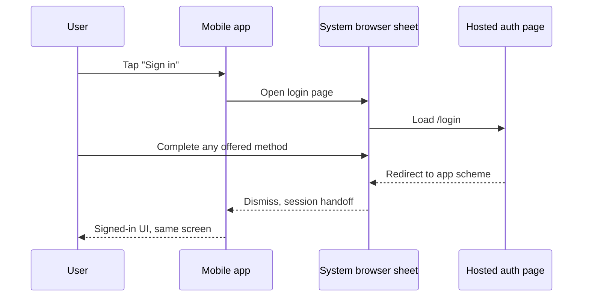
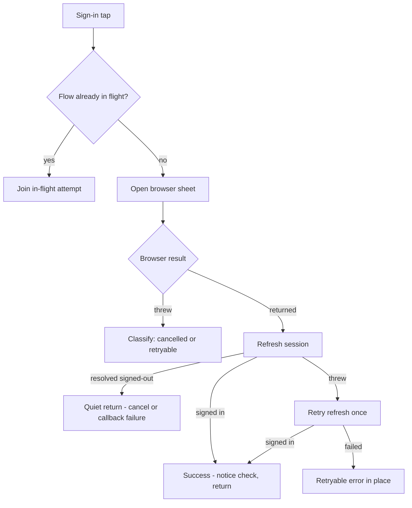

# Mobile Login via Hosted Auth Page - Plan

## Goal Capsule

- **Objective:** Replace every native sign-in flow in `apps/mobile` with one flow: the hosted auth platform login page, opened in an in-app system browser sheet.
- **Product authority:** This Product Contract, confirmed with the mobile owner on 2026-08-11. It supersedes the native-sheet decision in `docs/plans/2026-07-28-002-feat-mobile-login-continue-watching-plan.md`; that plan's hosted-page fallback (F2) becomes the whole login.
- **Execution profile:** One PR touching `apps/mobile`, a static config field plus a docs note in `apps/auth`, and three docs files. Harden the surviving hosted flow first (U1-U4), delete the native surface last (U5). Single-release atomicity (harden and delete in one release) is chosen over a two-release staging — an interim release that keeps native code resembles the rejected dormant fallback.
- **Stop conditions:** Surface a blocker instead of guessing if the hosted flow cannot satisfy a requirement without `apps/auth` changes beyond the approved `prompt` field and the R9 docs note, or if App Store guidance contradicts R9.
- **Open blockers:** None.

---

## Product Contract

### Summary

Every "Sign in" tap opens the hosted `auth.jesusfilm.org` login page in an in-app system browser sheet, and the completed session lands in the app's existing secure store. All native sign-in code — the Apple button, the email form, the dormant Google flow, and the sign-in screen — is deleted. New auth methods then reach mobile by enabling them on the auth platform, with no app release.

### Problem Frame

The mobile app maintains three sign-in flows in parallel: a native Apple sheet, an inline email form, and a hosted-page fallback. Native Google is a fourth, dormant flow that still waits on OAuth client provisioning. The hosted auth page already owns all of these methods for web and admin, plus Facebook and Okta.

Each new authentication capability — passkeys, two-factor — would repeat this cost: native work per app, per platform, per release. The team wants one auth surface, one place to add methods, and a login that looks the same everywhere.

### Key Decisions

- **The hosted page becomes the only mobile login.** (session-settled: user-directed — chosen over keeping the July native-sheet approach: one auth surface, and future methods such as passkeys and two-factor arrive from the platform without app releases.) Accepted consequence: iOS Sign in with Apple changes from the native one-tap sheet to the web flow inside the browser sheet — added taps and a page load on the primary iOS sign-in path.
- **A system browser sheet hosts the page.** (session-settled: user-approved — chosen over an embedded webview: Google's OAuth policy rejects embedded webviews with `disallowed_useragent`, and webview passkey support needs fragile per-platform and server mitigations; also chosen over a full browser app switch, which visibly leaves the app.) Governs R1.
- **All native flows are removed, with no dormant fallback.** (session-settled: user-approved — chosen over keeping native Apple or a hidden fallback path: a kept path preserves the maintenance this change exists to remove.) Accepted consequence: no kill switch — a hosted-page outage takes mobile login down until a revert ships through app review. Governs R7.
- **Sign-in entry points launch the sheet directly.** (session-settled: user-approved — chosen over a minimal native landing screen: fewer taps, and cancel returns the user in place.) Governs R2.
- **After sign-out, the next sign-in always shows the login form.** (session-settled: user-approved — chosen over instant re-login from remembered web session state: account switching stays possible and deletion re-auth stays meaningful.) Governs R5.

<!-- ce-section: work-relationships -->

### How This Work Fits Together

This plan owns one area: swapping the mobile login surface to the hosted page. The surrounding items are the current understanding, not a committed roadmap.

- Supersedes the native-sheet portion of `docs/plans/2026-07-28-002-feat-mobile-login-continue-watching-plan.md`. The session store, watch progress, and JWT machinery from that work stay live.
- Enables auth-platform passkey and two-factor work to reach mobile with no app release.
- Still to decide (separate, auth-owned): removal of the auth-side native-mobile entry points this change orphans — the `idToken` branches in `resolveSessionClientKind` and the `mobileAppleCredentialPlugin` stop receiving calls only as installed pre-hosted app versions drain, so their removal waits for that drain.
- Can proceed independently of TV sign-in (`docs/plans/2026-08-05-001-feat-tv-device-grant-sign-in-plan.md`).

### Requirements

**Login flow**

- R1. The app performs all sign-in through the hosted auth login page, rendered in an in-app system browser sheet (`ASWebAuthenticationSession` on iOS, Custom Tabs on Android). The app renders no credential UI of its own.
- R2. Every sign-in entry point opens the sheet directly on tap. Cancel returns the user to where they were, with no error UI. A failed launch or failed flow shows a retryable message in place.
- R3. A completed login lands the session in the app's existing secure session store, and the user returns signed in to the screen where they started.
- R4. Every method the hosted page enables is usable from mobile on both platforms. Adding a method on the auth platform requires no mobile change and no release.

**Sign-out and account integrity**

- R5. After sign-out, the next sign-in presents the login form. The flow never silently re-signs the user in from remembered web session state, and a shared device can switch accounts.
- R6. Account deletion keeps its fresh-session contract: a stale-session deletion attempt sends the user through the hosted sheet to re-authenticate, then retries the deletion.

**Removal and preservation**

- R7. The native sign-in surface leaves the app: the sign-in screen, the native Apple flow, the email form, the dormant Google flow, and their native dependencies. No dormant fallback remains.
- R8. Signed-in behavior is unchanged: watch-progress recording, the operation-scoped user JWT, the offline queue's account binding, RUM identity, the `sign_in_completed` RUM action, and the new-account notice work as before.

**Operational constraint**

- R9. The hosted page keeps Sign in with Apple enabled while the app is live in the App Store (App Store guideline 4.8). This constraint moves from app code to auth-platform configuration and must be recorded where auth operators see it.

### Key Flows

- F1. Sign in
  - **Trigger:** The user taps any "Sign in" button.
  - **Steps:** The sheet opens over the app with the hosted login page. The user completes any offered method. The page redirects to the app's scheme. The sheet dismisses. The app refreshes its session.
  - **Outcome:** The user is signed in, on the screen where they started.
  - **Covers:** R1, R2, R3, R4.
- F2. Cancel
  - **Trigger:** The user dismisses the sheet.
  - **Outcome:** The prior screen, with no error UI.
  - **Covers:** R2.
- F3. Switch accounts
  - **Trigger:** The user signs out, then taps "Sign in".
  - **Outcome:** The hosted page shows the login form; the user can sign in to any account.
  - **Covers:** R5.
- F4. Delete account with a stale session
  - **Trigger:** The user confirms deletion after the session aged out.
  - **Outcome:** The app asks for re-authentication through the hosted sheet, then retries and completes the deletion.
  - **Covers:** R6.

### Acceptance Examples

- AE1. **Covers R1, R3, R4, R8.** Given a signed-out user, when they tap "Sign in" and complete Google on the hosted page, then the sheet closes, the app shows them signed in, and watch-progress recording works.
- AE2. **Covers R2.** Given the sheet is open, when the user cancels it, then the app shows the prior screen with no error message.
- AE3. **Covers R5.** Given a user who signed out moments ago, when they tap "Sign in", then the hosted page shows the login form, and they can sign in as a different account.
- AE4. **Covers R6.** Given a stale session, when the user confirms account deletion, then the app routes them through the hosted sheet to re-authenticate and completes the deletion afterward.
- AE5. **Covers R4.** Given the auth platform enables a new method, when a mobile user opens the sheet, then the method is usable with no app update.
- AE6. **Covers R2.** Given no network, when the user taps "Sign in", then the app shows a retryable message in place.
- AE7. **Covers R6.** Given a stale-session deletion attempt, when the user re-authenticates as a different account than the one being deleted, then no deletion runs and the app explains that a different account signed in.

### Scope Boundaries

- Enabling passkeys or two-factor on the auth platform is separate auth-side work. This plan only removes the mobile obstacle to it.
- Auth-side cleanup of orphaned native-mobile entry points is a follow-up for the auth owner, not this plan.
- Web, admin, and TV login flows do not change.
- The hosted page's visual design does not change.

#### Deferred to Follow-Up Work

- Persisting a pending-deletion intent across process death. If the OS kills the app while the re-auth sheet is open, the user reopens deletion manually; the deletion never auto-fires after a cold start.
- Recovering a sign-in interrupted by process death. Android can reclaim the app while the Custom Tab is open, and the cookie-bearing redirect then reaches a cold-started app unconsumed — the login is dropped and the user signs in again.
- Forwarding an account-chooser hint (`select_account`) to upstream identity providers. Until then, a second user on a shared device who taps Google can land in the prior user's Google-linked account — R5's switching guarantee holds at the hosted form, not at upstream IdP sessions. Verify first whether the hosted page's Google button already inherits the `select_account` set on the Google provider config; if it does, this deferral is already satisfied.
- Evaluating a verified https callback (Android App Links) for the session handoff in place of the custom scheme (see Risks & Dependencies).

### Dependencies / Assumptions

- The hosted flow is live and verified: the current "More sign-in options" button uses it (`apps/mobile/src/lib/authActions.ts`), and the hosted page renders correctly in the in-app sheet (verified during the July login work).
- Mobile login availability now equals hosted-page availability. There is no fallback (accepted in Key Decisions).
- App Store review accepts web-based login when the page offers Sign in with Apple (guideline 4.8).

### Sources / Research

Repo (verified against source 2026-08-11):

- `apps/mobile/src/lib/authActions.ts` — `signInWithHostedPage()` (the flow this plan promotes), `completeSignIn()` (new-account notice wiring that must move before removal), native flows to delete.
- `apps/mobile/app/sign-in.tsx` — the native sheet this plan removes; native Google is noted as disabled pending provisioning.
- `apps/mobile/src/lib/authSession.ts` — Better Auth Expo client, SecureStore session storage, and the `jwtFetch` single-flight pattern U2 mirrors.
- `apps/mobile/src/lib/accountDeletion.ts` and `apps/mobile/src/components/profile/DeleteAccountFlow.tsx` — the fresh-session deletion contract behind R6 and its `needsReauth` UI.
- `apps/auth/src/auth/config.ts` — the `jfp` self-RP OAuth provider (`jfpMobileSelfProvider`) and Expo plugin that carry the flow.
- `apps/auth/src/app/login/login-page-data.ts` — hosted-page providers: facebook, google, apple, okta, plus email.
- `docs/plans/2026-07-28-002-feat-mobile-login-continue-watching-plan.md` — the superseded native-sheet decision and the hosted fallback's verification.
- `docs/solutions/architecture-patterns/post-sign-out-force-login-marker-oidc-relying-apps.md` — prior art for post-sign-out forced login against this auth platform; confirms `prompt=login` is honored with a live session.

Installed-library findings (better-auth 1.6.2, @better-auth/expo 1.6.2, @better-auth/oauth-provider 1.6.2; verified 2026-08-11; re-verify on upgrade):

- The generic-oauth client body schema (`dist/plugins/generic-oauth/routes.mjs:16-25`) has no `prompt` field; `prompt` is read only from the server-registered provider config. This forces KTD1's server-side placement.
- The OIDC provider's authorize endpoint redirects to `loginPage` when `prompt=login`, even with a valid session cookie (`@better-auth/oauth-provider/dist/index.mjs:3763-3766, 3883-3891`).
- `expoClient()` forwards `webBrowserOptions` to `openAuthSessionAsync` (`@better-auth/expo/dist/client.js:268`); `preferEphemeralSession` is iOS-only per `expo-web-browser` types. A browser cancel does not throw — the plugin returns without a session, so cancel manifests as a session-less refresh.

External (verified 2026-08-11):

- Google's OAuth policy forbids embedded user-agents; enforcement returns `disallowed_useragent`. See <https://developers.google.com/identity/protocols/oauth2/policies> and <https://developers.googleblog.com/upcoming-security-changes-to-googles-oauth-20-authorization-endpoint-in-embedded-webviews/>.
- Passkeys in webviews: iOS allows WKWebView WebAuthn only with an Associated Domains relationship (iOS 16+); Android WebView needs `androidx.webkit` support, and the server must accept `apk-key-hash` origins. See <https://passkeys.dev/docs/reference/ios/> and <https://developer.android.com/identity/sign-in/credential-manager-webview>.

---

## Planning Contract

**Product Contract preservation:** restructured, no scope change — R8 now names the new-account notice and the `sign_in_completed` RUM action (existing behavior the hosted flow must keep alive); AE7 added as a protective clarification of R6 (same-account guard); four deferrals and two accepted-consequence notes added (review-sourced); the former Outstanding Questions resolved into KTD1, KTD2, KTD6, and KTD7 and removed. All R/F/AE IDs are unchanged.

### Key Technical Decisions

- KTD1. **R5 mechanism: `prompt: "login"` on the `jfp` provider config in `apps/auth`.** (session-settled: user-approved — chosen over a separate precondition auth PR and over iOS-only `preferEphemeralSession`, which leaves Android's shared Custom-Tabs cookies silently re-authenticating: one static field, tolerated by the existing config test, and honored by the OIDC provider even with a live session.) Governs R5. Deploys with the merge; old app versions only see the hosted fallback start showing the form — safe ordering, no coupling window.
- KTD2. **Browser sessions stay non-ephemeral.** (session-settled: user-approved — chosen over `preferEphemeralSession`: saved Google/Facebook logins keep one-tap sign-in inside the sheet, and the flag is iOS-only anyway. Cost: the one-tap iOS consent alert before the sheet.) A second accepted cost: app sign-out revokes only the app-side session, so the authenticated hosted web session persists in the shared system browser until its 7-day expiry — a shared-device residual. Cites R1, R5.
- KTD3. **New-account notice detection moves to the session payload, on server clocks.** Surface the user and session creation timestamps from the get-session payload (additive fields through `userFromSessionResult`), and mark the notice when the user's creation time sits within the existing new-account window of the session's own creation time — both server clocks, so the device clock never participates. Reuse `newAccountNotice.ts`'s marking machinery and its existing 5-minute window constant; do not introduce a new window. Chosen over the generic-oauth `newUserCallbackURL` redirect, whose final URL the Expo client consumes internally. Cites R8.
- KTD4. **Single-flight at the flow layer.** One module-level in-flight guard in `authActions.ts` (mirroring `authSession.ts`'s `jwtFetch` single-flight) instead of per-component busy flags — iOS rejects a second concurrent `ASWebAuthenticationSession`, and three independent component guards drift. Cites R2.
- KTD5. **Deletion auto-retry is gated on identity.** Capture the signed-in user id when deletion hits `fresh-session-required`; after re-auth, auto-retry only when the same id signed back in, and route a mismatch to a non-destructive explanatory state. Cites R6. Owns AE7's behavior.
- KTD6. **A failed post-handoff refresh is not a cancel.** A thrown refresh right after the browser handoff means a network fault while the cookie may already be stored — retry the refresh once, then surface a retryable error. A session-less resolved refresh covers a user cancel and also a server-side callback failure: the installed Expo client returns identically for a cancel and a cookie-less success redirect. U2 determines whether the error redirect is distinguishable — if yes it routes to the retryable branch, if no the silent-failure path is recorded as an accepted residual in Risks & Dependencies. Cites R2, R3.
- KTD7. **Stale `forgemobile://sign-in` links fall through to the router's default unknown-route handling.** No stub route: the app has no known producers of that link, and a hidden redirect route would contradict the direct-launch decision. Cites R7.

### High-Level Technical Design

Post-handoff outcome classification (KTD4, KTD6):

Deletion re-auth state machine (KTD5):

```mermaid
stateDiagram-v2
    [*] --> confirming
    confirming --> deleting: user confirms
    deleting --> done: success
    deleting --> needsReauth: SESSION_EXPIRED - capture user id
    needsReauth --> sheetOpen: Sign in again
    sheetOpen --> needsReauth: cancelled
    sheetOpen --> needsReauth: retryable error - distinct message
    sheetOpen --> retrying: signed in, same id
    sheetOpen --> wrongAccount: signed in, different id
    retrying --> done: success
    wrongAccount --> needsReauth: try again
    wrongAccount --> [*]: no deletion; explain
```

Unit order: U1 and U2 are independent; U3 needs U2; U4 needs U2 and U3; U5 runs last.

### System-Wide Impact

- **Cross-app deploy:** the `apps/auth` config field deploys on merge via Railway; the mobile change reaches users only through a later EAS release. No ordering hazard.
- **Auth-side dead code:** the `idToken` branches of `resolveSessionClientKind` and `mobileAppleCredentialPlugin` in `apps/auth` stop receiving calls only as installed pre-hosted app versions drain. Hand off to the auth owner (already in Scope Boundaries) with that drain condition; nothing breaks meanwhile.
- **App Store review:** removing the native Apple button is compliant only while the hosted page offers Sign in with Apple (R9). Add a review note citing guideline 4.8 when submitting the release.

### Risks & Dependencies

- **Version-pinned library findings.** KTD1/KTD6 rest on better-auth 1.6.2 behavior read from installed source. Re-verify the generic-oauth body schema and the `prompt=login` authorize branch on any better-auth upgrade.
- **IdP-side auto-select.** With warm IdP cookies, Google may one-tap back into the same Google account after our form shows. Accepted; the account-chooser forwarding deferral in Scope Boundaries is the revisit path.
- **Session handoff over a custom scheme.** The completed flow returns the session cookie on the `forgemobile://` redirect. Any installed Android app can claim a custom scheme, and PKCE protects only the code exchange, not this cookie handoff; iOS binds the callback to the initiating app. Accepted for this release; the Android App Links evaluation in Scope Boundaries is the mitigation path.
- **Mid-video sheet transitions.** `ASWebAuthenticationSession` (same-process modal) and Custom Tabs (separate task) fire different AppState transitions; playback pause/resume behavior around the sheet is unverified. Covered by a required simulator scenario in the Verification Contract.

---

## Implementation Units

### U1. Force fresh login on the jfp provider

- **Goal:** The hosted authorize flow always lands on the login form, even with a live browser-session cookie.
- **Requirements:** R5 (KTD1); F3, AE3.
- **Dependencies:** None.
- **Files:** `apps/auth/src/auth/config.ts`, `apps/auth/src/auth/config.test.ts`, `apps/auth/CLAUDE.md`.
- **Approach:** Add `prompt: "login"` to `jfpMobileSelfProvider`. Extend the existing provider-shape test so it pins the exact value — the current `toMatchObject` block tolerates absence, so without the pin a one-line revert stays green. Record R9 on the auth side: a comment on the conditional apple provider block and an `apps/auth/CLAUDE.md` note stating that Sign in with Apple must stay enabled on the hosted page while the mobile app is live (guideline 4.8) — an expired Apple client secret now takes down mobile's entire login, not only native Apple sign-in.
- **Test scenarios:**
  - Config test asserts `jfpMobileSelfProvider.prompt === "login"` (reverting the field fails the test).
- **Verification:** Auth unit tests pass. AE3 behavior is proven in the Verification Contract's simulator pass.

### U2. Harden the hosted flow

- **Goal:** `signInWithHostedPage()` is robust enough to be the only login: no double-launch, no false cancels, and the new-account notice stays alive.
- **Requirements:** R2, R3 (KTD4, KTD6); R8 (KTD3); AE1, AE2, AE6.
- **Dependencies:** None.
- **Files:** `apps/mobile/src/lib/authActions.ts`, `apps/mobile/src/lib/authSession.ts` (additive only), `apps/mobile/src/lib/__tests__/authActions.test.ts`, `apps/mobile/src/lib/__tests__/authSession.test.ts`, `apps/mobile/src/lib/__tests__/newAccountNotice.test.ts`.
- **Approach:**
  1. Add a module-level single-flight guard: a second `signInWithHostedPage()` call while one is in flight joins the in-flight promise (per KTD4).
  2. Split the post-handoff outcomes per KTD6. `refresh()` swallows failures by design, so add an additive outcome-reporting session read on the store (returns the signed-in user or null; propagates thrown failures) and classify outcomes from that read — `refresh()` keeps its degrade contract for all other callers.
  3. Surface the user and session creation timestamps (additive `AuthUser` fields mapped in `userFromSessionResult`; verify early that the get-session payload carries both), and on a completed hosted sign-in mark the new-account notice per KTD3.
  4. Keep the existing `sign_in_completed` Datadog action on the hosted path.
  5. Determine whether the callback's error redirect is distinguishable from a cancel in the installed `@better-auth/expo` handoff; route it to the retryable-error outcome with a test if it is, and record the silent-failure path as an accepted residual in Risks & Dependencies if it is not (per KTD6).
- **Execution note:** Write the outcome-disambiguation tests first — those branches are the regression-prone seam.
- **Patterns to follow:** `jwtFetch`'s single-flight in `authSession.ts`; the existing quiet-cancel contract in `signInWithHostedPage`.
- **Test scenarios:**
  - Covers AE2. Concurrent second call while the sheet is open joins the in-flight attempt; only one browser session opens.
  - Covers AE2. Refresh resolves signed-out → outcome `cancelled`, no error surfaced.
  - Refresh throws once, retry resolves signed-in → outcome `success` (no false cancel).
  - Covers AE6. Refresh throws twice → retryable error outcome, not `cancelled`.
  - Thrown browser-open error still classifies through the existing failure classifier.
  - New user (user-vs-session creation delta inside the window, server clocks only) → notice marked; established user → not marked; timestamps absent → not marked, no crash.
  - `userFromSessionResult` maps the creation timestamp when present (additive session-store case).
- **Verification:** `authActions` / `authSession` / `newAccountNotice` suites green; no change to the JWT operation-gate guard test.

### U3. Rewire the three sign-in entry points

- **Goal:** Every "Sign in" tap launches the hosted sheet directly; nothing navigates to the sign-in route.
- **Requirements:** R2 (KTD4); F1, F2; AE2, AE6.
- **Dependencies:** U2.
- **Files:** `apps/mobile/src/components/profile/AccountSection.tsx`, `apps/mobile/src/components/watch/SignInPrompt.tsx`, `apps/mobile/src/components/profile/DeleteAccountFlow.tsx` (button handler only; retry logic is U4), `apps/mobile/src/lib/watchProgress/signInPrompt.ts`, `apps/mobile/src/lib/watchProgress/__tests__/signInPrompt.test.ts`.
- **Approach:**
  1. Replace each `router.push("/sign-in")` with an awaited `signInWithHostedPage()` call, keeping the existing `dd-action-name` attributes.
  2. `SignInPrompt`: add a busy guard, and on a cancelled outcome re-arm the banner within the session — only an explicit dismiss persists the cooldown. Re-arming needs a new exported re-arm function in `signInPrompt.ts`; the session shot is currently one-way.
  3. On a retryable-error outcome, `AccountSection` and `SignInPrompt` render an inline retryable message — adapt the dismissible warning-card pattern from `app/sign-in.tsx`'s error state before U5 deletes that file. `DeleteAccountFlow`'s failure handling lands in U4.
- **Patterns to follow:** `AccountSection`'s existing busy-state handling.
- **Test scenarios:**
  - Cancelled hosted attempt from the prompt re-arms the banner in-session; explicit dismiss still persists the cooldown (existing case unchanged).
  - Prompt tap during an in-flight attempt does not launch a second flow.
  - Covers AE6. A retryable-error outcome renders a dismissible inline message in `AccountSection`, and separately in `SignInPrompt`.
- **Verification:** Suites green; simulator taps on all three entry points open the sheet.

### U4. Deletion re-auth auto-retry with identity guard

- **Goal:** After re-auth, deletion completes without a manual re-tap — and never against a different account.
- **Requirements:** R6 (KTD5); F4, AE4, AE7.
- **Dependencies:** U2, U3.
- **Files:** `apps/mobile/src/components/profile/DeleteAccountFlow.tsx`, a new colocated test under `apps/mobile/src/components/profile/__tests__/`.
- **Approach:**
  1. Capture the signed-in user id when `deleteAccount()` returns `fresh-session-required`.
  2. "Sign in again" runs `signInWithHostedPage()`; on success compare the refreshed user id to the captured id.
  3. Same id → auto-retry the deletion through the existing busy-guarded path; different id → a non-destructive `wrongAccount` state that explains and offers Try again (back to `needsReauth`, mirroring the flow's existing error-phase retry button); cancelled → stay in `needsReauth`; a retryable sign-in failure → stay in `needsReauth` with a message distinct from the deletion-failure copy, because the deletion never ran (per R2).
  4. Extract the retry decision into a small pure helper for direct testing, and keep at least one component-level wiring test so the seam that arms it is covered.
- **Test scenarios:**
  - Covers AE4. Same-account re-auth → exactly one deletion retry.
  - Covers AE7. Different-account re-auth → no `deleteUser` call; `wrongAccount` state rendered.
  - Cancel from the sheet → still `needsReauth`, no retry.
  - Retryable re-auth failure → still `needsReauth`, message distinct from the deletion-failure copy.
  - Wrong-account state offers Try again and returns to `needsReauth`.
  - Manual delete tap during an in-flight auto-retry is a no-op (busy-guarded).
- **Verification:** Suites green; simulator run of the stale-session deletion path.

### U5. Remove the native sign-in surface

- **Goal:** The native sheet, its flows, dependencies, and prose references are gone; the hosted flow is all that remains.
- **Requirements:** R7 (KTD7); R1; R9 (docs note).
- **Dependencies:** U2, U3, U4.
- **Files:** Delete `apps/mobile/app/sign-in.tsx`, `apps/mobile/src/components/auth/EmailAuthForm.tsx`, `apps/mobile/src/lib/emailAuth.ts`, `apps/mobile/src/lib/__tests__/emailAuth.test.ts`. Edit `apps/mobile/app/_layout.tsx` (drop the sign-in `Stack.Screen` registration), `apps/mobile/src/lib/authActions.ts`, `apps/mobile/src/lib/authFlows.ts`, `apps/mobile/src/env.ts`, `apps/mobile/package.json`, `apps/mobile/app.json`, `apps/mobile/src/lib/__tests__/authActions.test.ts`, `apps/mobile/src/lib/__tests__/authFlows.test.ts`, `apps/mobile/CLAUDE.md`, `docs/roadmap/platform/feat-349-mobile-hosted-auth-login.md`.
- **Approach:**
  1. Delete the four dead files and the route registration.
  2. `authActions.ts`: remove `signInWithApple`, `signInWithGoogle`, `signInWithEmail`, `signUpWithEmail`, `lookupLoginMethod`, `completeEmailAuth`, and `completeSignIn` (its notice wiring moved in U2).
  3. `authFlows.ts`: remove the provider cancel codes and `appleNameForIdToken`; keep the generic unknown-failure → retryable classification.
  4. `env.ts`: remove the two Google client-id vars at all three declaration spots (the `_inlined` block, the zod `client` schema, `runtimeEnvStrict`).
  5. `package.json` / `app.json`: drop `expo-apple-authentication` (dependency + plugin entry), the `ios.usesAppleSignIn` capability flag, and `@react-native-google-signin/google-signin` (dependency only; it has no plugin entry).
  6. Prune the email describes from `authActions.test.ts` and the provider-code and Apple-name cases from `authFlows.test.ts`; keep the generic retryable case.
  7. Docs sweep per the repo's retired-mechanism discipline: update `apps/mobile/CLAUDE.md`'s auth section to describe hosted-only login; fix the roadmap ticket's constraints (record the approved `prompt` carve-out; correct the imprecise "browser-cancel handling stays in CANCEL_CODES" note); `git grep -niE 'expo-apple-authentication|google-signin|EmailAuthForm|native.*sign-in sheet' -- '*.md'` and stamp supersession notes on forward-looking instructions only.
- **Test scenarios:** Test expectation: deletions plus pruning — the surviving suites and the jest guards must stay green; no new behavior in this unit.
- **Verification:** Typecheck and full mobile suite green; `grep -rE 'expo-apple-authentication|react-native-google-signin|usesAppleSignIn' apps/mobile/package.json apps/mobile/app.json` returns nothing; a stale `forgemobile://sign-in` link falls to the router default (KTD7) without crashing.

---

## Verification Contract

| Check                                 | Command / method                                                                                                                          | Applies to |
| ------------------------------------- | ----------------------------------------------------------------------------------------------------------------------------------------- | ---------- |
| Mobile typecheck                      | `pnpm --filter @forge/mobile typecheck`                                                                                                   | U2-U5      |
| Mobile unit suite (incl. jest guards) | `pnpm --filter @forge/mobile test`                                                                                                        | U2-U5      |
| Auth unit suite                       | `pnpm --filter @forge/auth test`                                                                                                          | U1         |
| Dependency absence                    | `grep -rE 'expo-apple-authentication\|react-native-google-signin\|usesAppleSignIn' apps/mobile/package.json apps/mobile/app.json` → empty | U5         |
| Simulator smoke, iOS + Android        | Worktree's own Metro after `bash scripts/setup-sim-env.sh mobile`; Android emulator with `-memory 4096`                                   | U1-U5      |

Simulator smoke must demonstrate, on both platforms: AE1 (Google via the sheet, then progress recording), AE2 (cancel returns quietly — iOS Cancel button and Android back button separately), AE3 (sign out → form shows → different account possible), AE4/AE7 (stale-session deletion re-auth, same- and different-account), AE6 (offline tap → retryable message), and the mid-video entry point (playback state survives the sheet open/close on both platforms). Capture screenshots per the repo's verification discipline.

---

## Definition of Done

- All five units land; mobile typecheck and full suite green; auth suite green.
- Every acceptance example demonstrated: AE-linked unit tests green, and the simulator smoke above completed on both platforms with evidence captured. AE5 is demonstrated by construction (R4's zero-app-change property), not by a live new method.
- No native sign-in remnant: dependency-absence grep is empty, the sign-in route is gone, and `authActions.ts` exports only hosted-flow, sign-out, and deletion functions.
- Docs updated: `apps/mobile/CLAUDE.md` auth section, roadmap ticket constraints, and the prose sweep's supersession notes.
- The App Store review note for guideline 4.8 (hosted Sign in with Apple) is drafted alongside the release checklist.
- Abandoned experimental code from dead-end approaches is removed from the diff.
