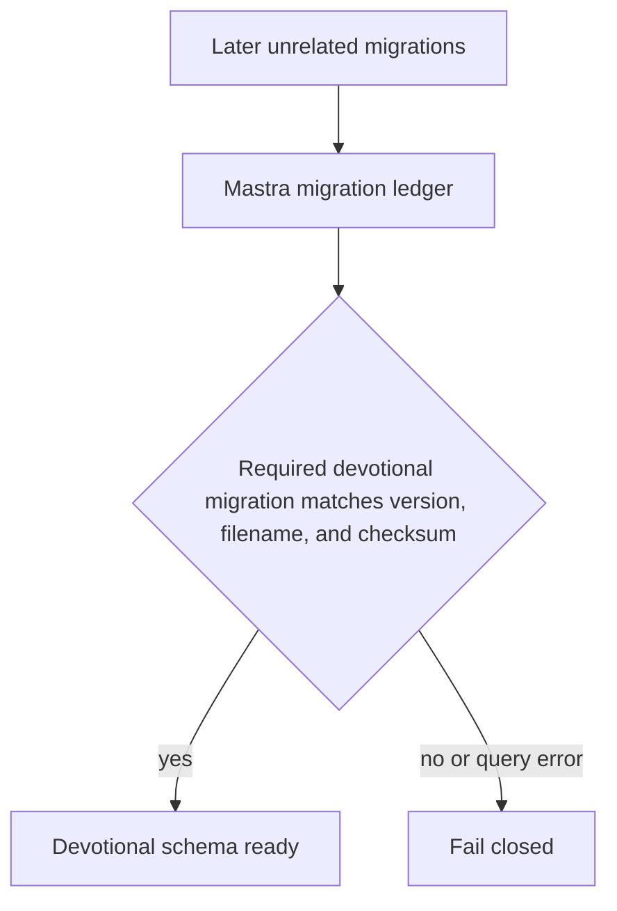
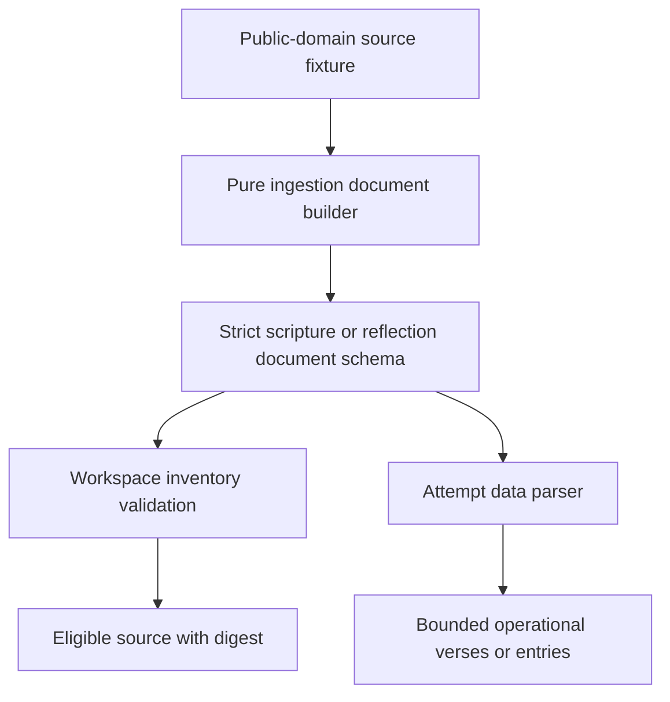

# fix: Align devotional readiness and corpus contracts

## Summary

Remove the known code blockers to the guarded Devotional Workspace migration by isolating devotional schema readiness from unrelated Mastra migrations and aligning the public-domain corpus generators with the strict runtime document parsers. Add regression coverage at both integration seams while leaving the separate operator prerequisites unsatisfied and production unchanged.

During implementation, PR #1901 landed the migration-readiness repair on
`origin/main`. This work preserves and validates that newer implementation and
delivers the remaining corpus, Workspace, and producer-consumer contract
repairs without introducing a competing readiness path.

---

## Problem Frame

The generalized Mastra migrator records devotional migration `001` and support-research migration `002` in one immutable ledger. Devotional readiness currently reads the highest ledger version and requires it to equal `1`, so a fully migrated database is reported as unready.

The WEB, Ryle, Matthew Henry, and Spurgeon ingestion scripts also emit provenance and navigation fields that the strict Workspace parsers reject. Existing tests cover parsers and generators independently, so they remain green while generated source documents cannot enter the Workspace inventory.

This blocks the guarded production cutover described in `docs/plans/2026-07-31-001-feat-devotional-workspace-data-plane-plan.md`. The production migration, corpus upload, backup/restore attestation, reconciliation, Studio verification, canary, and run enablement remain separate operator actions.

---

## Requirements

### Migration readiness

- R1. Devotional readiness succeeds when the required immutable devotional migration is recorded, even when later unrelated Mastra migrations are also recorded.
- R2. Devotional readiness fails closed when the required migration row is missing, malformed, or unavailable.
- R3. The generalized migrator continues to apply and checksum-verify every Mastra migration without rewriting existing migration history.
- R12. Required devotional migration identity includes version, filename, and SHA-256; future devotional schema changes must extend the component-scoped readiness contract explicitly.

### Corpus contracts

- R4. Runtime scripture and reflection parsers remain strict while explicitly accepting the bounded provenance metadata emitted by the repository ingestion scripts.
- R5. Parsers return only the operational scripture or reflection data consumed by devotional business logic; provenance remains in the Workspace document rather than leaking into workflow state.
- R6. Actual generator output for WEB, Ryle, Matthew Henry, and Spurgeon validates through the same parser used by Workspace inventory and attempt loading.
- R7. Content-only files and the existing minimal JSON shapes remain valid so Studio editors can continue dropping supported sources without a deployment.
- R8. When a document declares `count` or `verseCount`, the declared value must match the validated payload.
- R14. Content-only scripture uses a canonical single-verse path to derive its OSIS key and is loaded into the same verse map as JSON corpora.

### Delivery safety

- R9. Focused tests prove both repaired seams and the Mastra package passes typecheck, lint, formatting, and relevant build validation.
- R10. Documentation no longer describes devotional readiness as the latest global migration version.
- R11. This change performs no production database mutation, Workspace seed, generated full-corpus commit, production corpus-data commit, credential rotation, or run enablement; compact test fixtures remain allowed.
- R13. Corpus CLIs require an explicit external Workspace staging root and write only to canonical `inputs/scripture` or `inputs/reflections` paths beneath it.

---

## Assumptions

- The provenance fields currently emitted by the four ingestion scripts are intentional editorial evidence and should be explicitly modeled rather than discarded at generation time.
- Generated full corpora remain operator-supplied migration inputs outside Git; this fix validates their shape but does not add large generated data files to the repository.
- The existing shared migration ledger remains authoritative. Splitting support-research migrations into a new ledger would widen the change without improving devotional capability detection.

---

## Key Technical Decisions

- KTD1. Check the required devotional migration by capability-specific version, filename, and SHA-256 rather than the maximum global version. Future devotional migrations remain an explicit readiness change while unrelated migrations compose safely.
- KTD2. Keep Zod documents strict, enumerate bounded provenance and navigation fields, and refine declared counts against payload sizes. Using passthrough schemas would hide future generator drift; stripping or trusting metadata would discard or misstate source evidence.
- KTD3. Export pure document-building seams from the ingestion scripts and validate their exact results through runtime parsers in tests. This exercises the producer-consumer contract without network access or writing full corpora during CI.
- KTD4. Preserve the parser return types used by business logic. Runtime callers receive `verses` or normalized reflection entries while the source document retains its richer editorial envelope.
- KTD5. Preserve current migration checksums and SQL files. The defect is readiness interpretation, not applied schema content.
- KTD6. Require corpus generators to receive a Workspace staging root and derive their canonical category paths beneath it. An explicit external root avoids silently writing ignored legacy files or committing full corpora while giving operators migration-ready paths.
- KTD7. Derive content-only scripture identity from `/inputs/scripture/<book>/<chapter>-<verse>.<ext>`. A strict single-verse path supplies the reference that prose lacks and composes with the existing OSIS-keyed verse map without inventing frontmatter.

---

## High-Level Technical Design

### Migration capability detection

### Corpus producer-consumer contract

---

## Implementation Units

### U1. Make devotional migration readiness capability-specific

**Integration outcome:** Completed on the rebased base by PR #1901 and retained
unchanged after conflict review.

- **Goal:** Detect the required devotional schema migration independently from later Mastra migrations.
- **Requirements:** R1, R2, R3, R10, R12.
- **Dependencies:** None.
- **Files:** `apps/mastra/src/services/devotional/workspace/database.ts`, `apps/mastra/src/services/devotional/workspace/database.test.ts`, `apps/mastra/src/scripts/migrate-devotional-database.test.ts`.
- **Approach:** Query the shared migration ledger for the required devotional identity and validate version, immutable filename, and SHA-256. Keep query errors and missing or mismatched rows fail-closed. Preserve the generalized migrator and migration SQL unchanged, and prove the identity matches the immutable migration file.
- **Execution note:** Start with the regression where migration versions `1` and `2` are present but devotional readiness must still succeed.
- **Patterns to follow:** Immutable filename and checksum validation in `apps/mastra/src/scripts/migrate-mastra-database.ts`; result-union readiness handling in `apps/mastra/src/services/devotional/workspace/database.ts`.
- **Test scenarios:**
  - A matching devotional migration row reports ready even though the ledger also contains a later support-research version.
  - An empty result reports not ready with a missing-required-migration reason.
  - A row with the expected version but a different filename reports not ready.
  - A row with the expected version and filename but a different or malformed checksum reports not ready.
  - The configured required checksum equals the digest of `001-devotional-workspace.sql`.
  - A ledger query failure reports schema unavailable and never throws through the readiness probe.
- **Verification:** Applying the complete current migration set no longer makes devotional readiness regress from ready to false.

### U2. Define strict generated corpus document contracts

- **Goal:** Accept the intentional metadata emitted by corpus ingestion while retaining strict runtime validation and stable operational return types.
- **Requirements:** R4, R5, R7, R8, R14.
- **Dependencies:** None.
- **Files:** `apps/mastra/src/services/devotional/reflection-corpus.ts`, `apps/mastra/src/services/devotional/reflection-corpus.test.ts`, `apps/mastra/src/services/devotional/web-bible.ts`, `apps/mastra/src/services/devotional/web-bible.test.ts`, `apps/mastra/src/services/devotional/workspace/schemas.ts`, `apps/mastra/src/services/devotional/workspace/inventory.test.ts`, `apps/mastra/src/services/devotional/workspace/attempt-data.test.ts`.
- **Approach:** Extend the document envelopes and reflection-entry schemas with explicit bounded provenance and navigation fields already emitted by the generators. Keep unknown fields rejected. Parse and return only the existing business-logic shapes.
- **Execution note:** Add characterization coverage for the legacy minimal shapes before extending the document schemas.
- **Patterns to follow:** Strict Zod documents and bounded strings in the existing devotional parsers; source-data separation in `apps/mastra/src/services/devotional/workspace/schemas.ts`.
- **Test scenarios:**
  - A minimal `{ verses }` WEB document remains valid.
  - A WEB document containing translation, abbreviation, license, source URL, books, verse count, and verses is valid and returns only verses.
  - A reflection document containing corpus provenance plus Ryle/Henry entry IDs, book, chapter, and references is valid and returns normalized entries.
  - A Spurgeon document containing calendar navigation fields is valid and returns normalized entries without calendar-only fields.
  - A content-only reflection and the existing minimal `{ entries }` reflection JSON shape remain valid.
  - Content-only scripture at `/inputs/scripture/john/3-16.md` normalizes into the `John.3.16` verse map and loads for an attempt.
  - Content-only scripture with a noncanonical or unsupported reference path is excluded as invalid rather than silently ignored.
  - A declared reflection count or WEB verse count that differs from the payload is invalid.
  - Unknown top-level or entry fields remain invalid.
- **Verification:** Parser contracts accept every intentional producer field without weakening rejection of unrecognized data.

### U3. Prove actual ingestion output crosses the Workspace boundary

- **Goal:** Prevent future producer-consumer drift by testing the document objects produced by all four ingestion scripts through runtime validation.
- **Requirements:** R6, R9, R13.
- **Dependencies:** U2.
- **Files:** `apps/mastra/src/scripts/ingest-web-bible.mjs`, `apps/mastra/src/scripts/ingest-web-bible.test.mjs`, `apps/mastra/src/scripts/ingest-ryle-matthew.mjs`, `apps/mastra/src/scripts/ingest-ryle-matthew.test.mjs`, `apps/mastra/src/scripts/ingest-matthew-henry-gospels.mjs`, `apps/mastra/src/scripts/ingest-matthew-henry-gospels.test.mjs`, `apps/mastra/src/scripts/ingest-spurgeon-morning-evening.mjs`, `apps/mastra/src/scripts/ingest-spurgeon-morning-evening.test.mjs`, `apps/mastra/src/services/devotional/workspace/inventory.test.ts`, `apps/mastra/src/services/devotional/workspace/attempt-data.test.ts`.
- **Approach:** Extract pure document builders from each script while keeping command-line fetching and file writes at the edge. Require a caller-provided Workspace staging root, derive the category-specific output path beneath it, and replace obsolete committed-runtime-corpus instructions in every script header. Use compact saved fixtures or in-memory source objects so tests call the real builder and then the Workspace parser without network access.
- **Execution note:** Build producer-consumer contract tests before changing generated document construction.
- **Patterns to follow:** Existing exported `decode` helpers and direct-run guards in the reflection ingestion scripts; in-memory filesystem fixtures in `apps/mastra/src/services/devotional/workspace/inventory.test.ts`.
- **Test scenarios:**
  - Each reflection builder emits at least one representative entry whose complete document is accepted by `parseReflectionDocument`.
  - The WEB builder emits representative Gospel/Acts verses whose complete document is accepted by `parseWebBibleDocument`.
  - Workspace inventory treats generated WEB and reflection documents as eligible rather than `invalid-content`.
  - Attempt authored-data loading consumes generated WEB and reflection documents through verified Workspace reads.
  - Each CLI rejects a missing staging root, writes beneath the correct canonical category, and cannot escape the staging root.
  - Importing a generator in tests does not fetch remote sources or write files.
- **Verification:** A change to any generator field that is not reflected in the strict parser fails the producer-consumer contract test.

### U4. Record the repair and validate the affected surface

- **Goal:** Leave the roadmap and operator documentation aligned with the repaired contracts and demonstrate package-level readiness.
- **Requirements:** R9, R10, R11.
- **Dependencies:** U1, U2, U3.
- **Files:** `docs/roadmap/media-generation/feat-352-devotional-readiness-corpus-contracts.md`, `docs/roadmap/README.md`, `apps/mastra/devotional-workspace/README.md`, `apps/mastra/CLAUDE.md`, `docs/plans/2026-08-11-001-fix-devotional-readiness-corpus-contracts-plan.md`.
- **Approach:** Document capability-specific readiness and the generator-parser contract, including the canonical corpus staging root and content-only scripture path. Regenerate the roadmap index and mark the roadmap item complete only after focused and package validation pass. Keep the production cutover sequence unchanged and disabled.
- **Patterns to follow:** `docs/roadmap/media-generation/feat-322-devotional-workspace-data-plane.md` and `docs/runbooks/devotional-workspace-cutover.md`.
- **Test scenarios:**
  - Documentation names `migrate:database` as the current command and does not imply the highest global migration must equal one.
  - The repository diff contains no generated full corpus, database credentials, production manifests, or attestation claims.
- **Verification:** The affected Mastra tests, full Mastra test suite, typecheck, lint, formatting, and Studio build are green before PR handoff.

---

## System-Wide Impact

- **Database lifecycle:** The shared migration ledger remains unchanged; only devotional capability interpretation changes.
- **Workspace ingestion:** Strict parser behavior expands only for explicitly modeled producer fields. Arbitrary JSON remains rejected.
- **Workflow state:** No source metadata or corpus body is added to PostgreSQL or durable workflow input.
- **Operations:** The fix removes code blockers but does not satisfy corpus backup, restore attestation, authenticated Studio, reconciliation, canary, or enablement gates.

---

## Risks and Mitigations

- **False-ready migration state:** Query both version and immutable filename, preserve query-error fail closure, and cover missing/mismatched rows.
- **Schema over-permissiveness:** Enumerate known metadata fields under strict schemas rather than using passthrough behavior.
- **Generator test side effects:** Separate pure builders from fetch/write entry points and assert imports perform no I/O.
- **Obsolete corpus destination:** Remove ignored `devo/corpus` defaults and require a canonical external Workspace staging root.
- **Accidental repository bloat:** Use compact fixtures and verify no generated full corpus enters the diff.
- **Premature cutover:** Keep `DEVOTIONAL_NEW_RUNS_ENABLED=false` and perform no production mutations in this change.

---

## Acceptance Examples

- AE1. Given migrations `001` and `002` are recorded, when devotional readiness runs, then it reports the required devotional migration ready.
- AE2. Given only migration `002` is recorded, when devotional readiness runs, then it fails closed because the required devotional migration is absent.
- AE3. Given a generated WEB corpus document with provenance metadata, when Workspace inventory validates it, then it is eligible and its verses load for an attempt.
- AE4. Given a generated Ryle, Matthew Henry, or Spurgeon document, when Workspace inventory validates it, then the document is eligible and its operational entries load.
- AE5. Given an unknown field is added to a generated corpus document, when the contract test runs, then strict parsing rejects it until the producer-consumer contract is deliberately updated.
- AE6. Given migration `001` has the right version and filename but the wrong checksum, when devotional readiness runs, then it fails closed as divergent.
- AE7. Given an operator runs a corpus CLI with an external Workspace staging root, when generation completes, then the document is written beneath its canonical `inputs` category and is immediately valid for migration inventory.
- AE8. Given an editor drops `/inputs/scripture/john/3-16.md`, when the next attempt loads authored data, then `John.3.16` contains that verified file content.

---

## Scope Boundaries

### In scope

- Repair readiness interpretation and corpus producer-consumer contracts.
- Add integration regressions using compact local fixtures.
- Correct affected developer and operator documentation.

### Deferred to guarded production cutover

- Enable `pgvector` and apply production migrations.
- Generate or upload the complete scripture and reflection corpora.
- Create the migration manifest and independent backup/restore attestation.
- Reconcile search, validate authenticated Studio CRUD/search, run the canary, and enable new devotional starts.

### Out of scope

- Splitting the shared Mastra migration ledger.
- Relaxing Workspace validation with passthrough schemas.
- Changing devotional business logic, Worker ownership, authentication, or production configuration.
