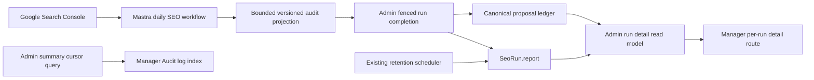

# feat: Add bounded SEO run audit logs

## Summary

Turn the existing Admin-owned `SeoRun.report` into one structured audit log per SEO job, then expose a paginated all-runs index and a lazy per-run detail view in Manager. Current detailed reports explain the safe Search Console request scope, bounded decision-stage query evidence, selection reasons, proposal references, provider caveats, and dry-run suppression; failed, legacy, malformed, unsupported, and compacted reports expose a typed availability state and only their safely preserved fields. No report stores raw provider responses or requires another database model.

---

## Problem Frame

The live SEO workflow already persists a terminal `SeoRun` for each claimed job, but its report contains only aggregate counts and coarse provider coverage. Operators can see that proposals exist, yet cannot inspect which Search Console requests produced the evidence, which queries reached the decision stage, why the deterministic selector chose or rejected them, or how those machine decisions relate to later human decisions. Search Console observations retain some provider metadata only in live mode, are intentionally minimized, and are not an appropriate unbounded audit stream. The feature needs one readable log per job and one view across jobs while preserving Admin as the durable authority and keeping the workflow bounded, private, and fast.

---

## Requirements

### Audit production and persistence

- R1. Every terminal claimed SEO run in `live` or `dry_run` mode stores a strict, versioned audit report. Environment-level `SEO_AUTOMATION_MODE=off` continues to create no run; a run downgraded by Admin's least-permissive persisted OFF gate remains visible as a suppressed terminal OFF run.
- R2. The report records the exact logical Search Console request scope and coverage needed to understand the run: property, date range, dimensions, search type, data state, sanitized filters, configured row cap, returned row/page and attempt counts, cap-reached state, typed outcome, aggregation metadata, incomplete-date state, and truncation or partial-coverage caveats. Timezone and response metadata are labeled separately from request parameters; individual HTTP requests are not logged.
- R3. The report records bounded decision-stage query entries with target, locale, query, clicks, impressions, CTR, position, deterministic score, `selectionOutcome`, and a stable reason code. Selected entries are retained first; rejected entries are a deterministic bounded sample with aggregate omitted counts by reason. It also records considered/selected/rejected query totals and a versioned selection-policy ID while preserving the existing target-level `selectedCount` meaning.
- R4. The report records proposal references with `would_propose`, `persisted_new`, or `reused_existing` disposition. Mastra submits proposed ID/digest references; for live runs, Admin canonicalizes the disposition, proposal version, and originating run inside fenced completion after persistence or reuse is known. The report does not duplicate mutable human decisions or experiment state.
- R5. Live and dry-run use the same evidence and selection logic. Dry-run records would-propose outcomes while retaining zero proposal, observation, materialization, ticket, activation, or publish writes.
- R6. Unexpected post-claim failures make a best effort to terminalize the run with a sanitized failed report when Admin remains reachable; no claimed run is intentionally left running because report construction failed. Running, reclaimed, and failed lifecycle states remain distinguishable, and a stale claim cannot overwrite an accepted terminal report. `PARTIAL` is a terminal run status derived from incomplete provider coverage, while the report retains provider-specific coverage reasons separately.
- R7. Mastra validates and minimizes the report before transport; Admin independently validates, minimizes, and redacts it before persistence.
- R7a. In production, Admin persists query-level report detail only while the existing retention health check is healthy. When retention is stale or missing, completion still terminalizes the run but stores a compact `detail_suppressed_retention_unhealthy` summary.

### Privacy, integrity, and retention

- R8. Reports and process logs never contain credentials, tokens, assertions, headers, raw provider bodies, thrown objects/messages, signed URLs, query text in error output, IP addresses, or model chain-of-thought. Provider failures and logs use bounded reason codes, provider/run/correlation IDs, retryability, and operator-safe caveats only.
- R9. Every bounded collection and string has a declared limit. Reports expose `truncated` and omitted counts so absence is not misread as zero, and have deterministic ordering and stable reason codes.
- R10. Query-level detail expires 29 days after terminal `completedAt` and is rewritten by the existing Admin retention workflow into a compact `detail_expired` report that preserves schema and policy versions, scalar totals, coverage, proposal refs and digests, suppression state, detail expiry, and compaction timestamp. Only terminal runs are eligible; canonical run and proposal ledger rows are not deleted.
- R10a. The 29-day query-detail ceiling applies even when a linked experiment has legal hold; canonical proposal, decision, experiment, and evaluation records retain their separate legal-hold policy. Supported reports preserve allowlisted compact fields, while legacy, malformed, or unsupported reports are replaced wholesale with a minimal tombstone derived only from trusted `SeoRun` columns and canonical proposal joins.
- R10b. Detail reads independently enforce expiry: once `completedAt + 29 days` has passed, Admin never returns query/request detail and synchronously attempts idempotent compaction for that run. Retention health exposes and alerts on overdue eligible reports so a scheduler that fails after a healthy write cannot silently extend operator exposure.
- R11. Human approval, rejection, materialization, and a bounded current experiment/evaluation summary with omitted counts are composed at read time from the canonical Admin ledger rather than copied back into the report; full histories remain on existing proposal and experiment surfaces.

### Admin and Manager read model

- R12. Admin exposes an authenticated, permission-gated, newest-first paginated run-summary query that never returns report JSON and a separate ID-scoped run-detail query that returns typed report fields plus canonical proposal outcomes. Legacy `{}`, unversioned, malformed, compacted, and unsupported-version reports return explicit availability states rather than failing the route.
- R13. Pagination has stable opaque `(startedAt DESC, id DESC)` ordering, a maximum page size, and an explicit next cursor; “all jobs” includes suppressed persisted OFF runs and means the operator can page through all retained summaries, not that one unbounded response loads every run.
- R14. Manager adds a Runs audit-log view under `/dashboard/seo` whose presentation keeps five axes independent: mode, lifecycle/terminal status, reclaim indicator, report availability, and list emptiness. Combinations such as a partial dry-run with expired detail remain representable without inventing a single combined state enum.
- R15. Each run has a stable detail route under `/dashboard/seo/runs/[runId]` that shows request scope, candidate decisions and reasons, proposal/human outcomes, caveats, truncation, and retention state when those fields are available; other report states show their typed availability and preserved fields without adding mutation or publish controls.
- R16. Detail navigation is accessible by keyboard and screen reader, preserves the cursor-bearing return URL, scroll/focus history, and distinguishes unavailable evidence from a measured zero. Server transitions expose pending/error status through `aria-live`, prevent duplicate activation, and move focus to the results or detail heading after completion.
- R16a. Manager validates an interactive `ManagerRole.OPERATOR` session for summary and detail page loaders before using the shared Admin transport bearer. V1 summary and query-detail access remain Manager-backend-only; detail also requires a dedicated Manager audit-detail permission unavailable to Mastra and other agent/workflow principals.

### Validation and operations

- R17. Admin GraphQL schema and `packages/admin-graphql` generated contracts remain synchronized.
- R18. Focused tests cover live, dry-run, failed, partial, truncated, redacted, expired, unauthorized, empty, and paginated paths.
- R19. Browser validation proves list and detail rendering in authenticated Manager. `view=runs` performs one summary call of at most 25 rows and 64 KB and does not call `managerSeoWorkspace`; detail performs one bounded call of at most 256 KB. Same-environment median server timing must not regress more than 20% from the pre-change SEO route, and query report JSON never loads outside detail.

---

## Assumptions

- The existing `SeoRun.report` JSON column is the durable per-job log; no new table or Prisma migration is needed.
- “Exact queries” means the bounded set that entered deterministic SEO decision evaluation, not all rows returned by a provider and not every rejected pre-filter row.
- The selection algorithm and proposal semantics are not changed by this feature. The audit projection explains current behavior but does not tune thresholds, deduplicate proposals, or grant the agent new authority.
- Existing `selectedCount` remains a selected-target count for compatibility. The v1 report adds separately named query funnel totals so target and query units cannot be conflated.
- Existing reports and rolling deploys require compatibility: Admin accepts both the legacy count-only completion shape and v1, normalizes each to a typed read state, and keeps legacy ingestion until a later coordinated cleanup after old Mastra callers are gone.
- Only aggregate GSC queries meeting the existing high-traffic decision threshold can enter row-level detail. A query-specific deterministic pipeline redacts email, phone, IP, credential patterns, embedded HTTP(S) URLs including signed-URL parameters, and suspicious token-like values anywhere in the string before persistence; if safe projection fails, it stores a typed redacted placeholder with metrics rather than query text. Arbitrary model-based sensitivity classification is not added to the deterministic ranking path.
- Existing `read:manager-seo` authorization is correct for summaries. Detail adds a narrower Manager-only audit-detail permission and retains the interactive OPERATOR session check at the Manager page boundary.
- The current Admin search-trace retention scheduler is the execution mechanism for detail compaction; the feature extends its SEO results and health-tested behavior rather than adding another scheduler.

---

## Key Technical Decisions

- **Reuse `SeoRun.report`:** It already participates in fenced run completion for live and dry-run modes, preserves one terminal artifact per job, and avoids synchronization problems introduced by a second event-log table.
- **Store an operator projection, not an event stream:** The report captures stable inputs, decision outputs, and bounded reasons. Raw provider payloads and runtime traces would be larger, more sensitive, harder to version, and unnecessary for explaining the job.
- **Version and validate at both trust boundaries:** Mastra owns report construction, but Admin owns durable data. Mirrored strict schemas plus minimization/redaction prevent a compromised or outdated caller from persisting arbitrary JSON. Admin suppresses query-level detail when retention health is not proven.
- **Prefer selected-first bounded evidence:** Define an explicit funnel of parse, target match, threshold eligibility, ranking, and proposal-cap selection. Parse, unmatched-target, impression-threshold, and CTR-threshold exclusions are mutually exclusive aggregate counts in that precedence order; only ranked candidates emit selected-first bounded row-level decisions, with `proposal_limit_reached` for non-selected ranked candidates. Aggregate omitted reasons preserve funnel meaning without coupling report size to the Search Console row cap.
- **Compose human outcomes on read:** After terminal completion, the report is never updated with human outcomes; the only permitted mutation is the idempotent 29-day retention rewrite to a schema-valid `detail_expired` report. Admin joins proposal versions and their current canonical decision/materialization/experiment/evaluation state for the detail response.
- **Split list and detail:** Selecting Runs uses Next router navigation to a route-driven server-rendered `view=runs` page that requests one cursor page and does not fetch the existing workspace. Pagination is next-only; browser Back and a cursor-bearing return link provide reverse navigation. An ID query fetches one report only on the nested detail route. This follows Forge's lean-bulk/lazy-detail GraphQL pattern and protects SEO workspace load performance.
- **Compact details after 29 days:** Keep scalar run history, proposal disposition/linkage, digests, schema/policy versions, and suppression state indefinitely while replacing query text and request detail with a recognizable tombstone. This matches the short-lived raw-search privacy boundary and avoids deleting runs referenced by proposal versions.
- **Keep the UI read-only and human-scoped:** Audit views add visibility only. Manager page loaders require an interactive OPERATOR session, and only the Manager audit-detail principal can receive query text. V1 does not add agent/workflow read permissions. Proposal approvals and other guarded mutations remain on their existing routes and retain replay protection and human authority.

---

## High-Level Technical Design

The workflow creates one terminal report that is immutable except for the single idempotent retention rewrite. Admin serves small run summaries separately from detail and composes mutable human outcomes only when one run is read. Retention later compacts the report without changing run identity or proposal history.

---

## Implementation Units

### U1. Create the versioned Mastra audit projection

- **Goal:** Produce a bounded, truthful explanation of each SEO workflow run without changing selection behavior.
- **Requirements:** R1-R9
- **Dependencies:** None
- **Files:** `docs/roadmap/platform/feat-355-seo-run-audit-log.md`, `docs/roadmap/platform/feat-344-mastra-seo-marketing-agent.md`, `docs/roadmap/README.md`, `apps/mastra/src/mastra/tools/seo-analysis.ts`, `apps/mastra/src/mastra/tools/seo-analysis.test.ts`, `apps/mastra/src/services/google-search-console-client.ts`, `apps/mastra/src/services/google-search-console-client.test.ts`, `apps/mastra/src/services/admin-seo-client.ts`, `apps/mastra/src/services/admin-seo-client.test.ts`, `apps/mastra/src/mastra/workflows/seo-daily-audit.ts`, `apps/mastra/src/mastra/workflows/seo-daily-audit.test.ts`
- **Approach:** Add a strict report schema with explicit limits and stable selection/provider reason codes. Extend analysis output with the explicit parse/match/threshold/rank/cap funnel, aggregate pre-rank exclusions, and a selected-first bounded ranked-candidate trace while leaving proposals byte-for-byte equivalent for the same input. Project safe GSC request/coverage metadata from the client, construct identical proposed-reference structure for live and dry-run, and best-effort complete claimed failures with sanitized diagnostics. Admin, not Mastra, fills canonical live persistence/reuse disposition after proposal persistence is known.
- **Patterns to follow:** `apps/mastra/src/services/seo-data-minimization.ts` for recursive limits; `apps/mastra/src/services/google-search-console-client.ts` for provider coverage; `apps/mastra/src/mastra/workflows/seo-daily-audit.ts` for fenced claim/completion behavior.
- **Test scenarios:**
  1. High-impression low-CTR rows retain their exact decision metrics and selected reason without changing proposal order or payload; target and query count invariants reconcile independently under a versioned selection policy.
  2. Ranked non-selected rows receive `proposal_limit_reached` in deterministic order; overflow increments the omitted total.
  3. Parse, unmatched-target, low-impression, and high-CTR rows increment exactly one aggregate funnel stage under the declared precedence and do not force row-level records.
  4. A row-cap partial response records the configured cap, returned rows/pages, partial status, and truncation caveat.
  5. Live and dry-run reports have the same safe evidence structure; dry-run marks proposal references as would-propose and emits zero proposal, observation, materialization, ticket, activation, and publish writes. Mastra's live request carries ID/digest proposals without claiming persistence outcomes.
  6. Provider and unexpected failures retain typed reason codes, provider/run/correlation IDs, and retryability but do not persist or log raw exception text, thrown objects, bodies, headers, tokens, assertions, query text, URLs, or signed URLs.
  7. A post-claim failure calls terminal completion when Admin remains reachable and preserves the original failure if completion also fails; a reclaimed or replayed claim cannot overwrite a terminal run.
- **Verification:** Mastra SEO analysis, client, and workflow tests prove boundedness, deterministic semantics, live/dry-run parity, sanitization, and terminal failure behavior; Mastra typecheck, lint, format, and build pass.

### U2. Harden Admin persistence, retention, and run read models

- **Goal:** Make Admin the defensive authority for audit storage and provide efficient permission-gated summary/detail access.
- **Requirements:** R7-R13, R17-R18
- **Dependencies:** U1
- **Files:** `apps/admin/src/services/seo-experiment.service.ts`, `apps/admin/src/services/seo-experiment.service.test.ts`, `apps/admin/src/services/search-trace-retention.service.ts`, `apps/admin/src/services/search-trace-retention.service.test.ts`, `apps/admin/src/services/search-trace-retention/job.ts`, `apps/admin/src/services/search-trace-retention/job.test.ts`, `apps/admin/src/graphql/types/managerSeo.ts`, relevant Manager SEO GraphQL permission/schema tests, `apps/admin/schema.graphql`, `packages/admin-graphql/src/admin-graphql-env.d.ts`
- **Approach:** Accept the legacy count-only completion shape and v1 during additive rollout, normalize both to typed read states, apply existing SEO minimization/redaction, and reject oversized or unknown fields from new v1 input without stranding the run. During fenced live completion, have proposal persistence return disposition, canonical version, and originating run so Admin can canonicalize report references before storing the report. Add stable cursor summary pagination with no report field and an ID-scoped detail method that joins proposal versions and canonical decision, materialization, experiment, and evaluation outcomes. Extend retention with fixed-size oldest-first batches: select eligible terminal reports, build supported or minimal fallback tombstones, and update each by ID plus expected report/detail state inside a short transaction so reruns and concurrent workers are idempotent.
- **Patterns to follow:** `redactSeoJson` and SEO input schemas in `seo-experiment.service.ts`; existing Manager Pothos auth in `managerSeo.ts`; proposal/decision seven-year redaction in `search-trace-retention.service.ts`; lean-bulk/lazy-detail GraphQL conventions.
- **Test scenarios:**
  1. Legacy count-only and valid v1 reports both complete during rolling deployment; v1 persists after defensive minimization and reads back with the same schema version and safe evidence.
  2. Unknown fields, unbounded strings/arrays, and secret/direct-identifier-shaped values are rejected or redacted before persistence; email, phone, IP, credentials, embedded standalone/signed URLs, and suspicious token-like cases never survive in query detail, and unprojectable queries retain metrics with a redacted placeholder.
  3. Run summaries are newest-first with ID tie-breaking, stable cursors, explicit `hasNextPage`, and no report JSON.
  4. Live completion canonicalizes new/reused proposal dispositions, versions, and originating runs inside the fenced transaction; detail composes proposal decisions, materializations, experiments, and evaluations by exact identity without writing human outcomes into the report.
  5. Unknown run IDs return an authorized not-found result; missing summary permission or the narrower Manager audit-detail permission is rejected at service and GraphQL layers.
  6. Bounded retention batches rewrite report detail after 29 days, preserve safe summary/proposal references, replace malformed/unsupported reports from trusted columns, skip newer reports, and remain idempotent under concurrent workers.
  7. Existing terminal proposal/legal-hold behavior remains unchanged because runs are compacted rather than deleted.
  8. Legacy `{}`, current unversioned, malformed v1, and unknown future-version reports return typed availability states without exposing raw JSON or breaking run summaries.
  9. Unhealthy production retention causes completion to store `detail_suppressed_retention_unhealthy`; stale health cannot leave query text durably stored beyond the ceiling.
  10. A report written while retention is healthy is hidden and compacted on detail read after day 29 even if the scheduler later stops; overdue-report health becomes degraded and alertable.
- **Verification:** Focused service, retention, GraphQL, permission, and schema-generation checks pass; generated Admin SDL and gql.tada contracts have no drift; Admin typecheck, lint, format, and build pass.

### U3. Add the Manager audit index and per-run detail view

- **Goal:** Let operators scan every SEO job and understand one job's evidence and outcomes without loading all report JSON.
- **Requirements:** R12-R19
- **Dependencies:** U2
- **Files:** `apps/manager/src/features/seo/seo-contract.ts`, `apps/manager/src/features/seo/seo-presenter.ts`, `apps/manager/src/features/seo/seo-presenter.test.ts`, `apps/manager/src/features/seo/seo-workspace.tsx`, `apps/manager/src/features/seo/seo-workspace.test.ts`, `apps/manager/src/backend/admin-client.ts`, `apps/manager/src/backend/admin-client.test.ts`, `apps/manager/src/features/seo/seo-admin-client.ts`, `apps/manager/src/features/seo/seo-admin-client.test.ts`, `apps/manager/src/app/dashboard/seo/page.tsx`, `apps/manager/src/app/dashboard/seo/page.test.tsx`, `apps/manager/src/app/dashboard/seo/loading.tsx`, `apps/manager/src/app/dashboard/seo/runs/[runId]/page.tsx`, `apps/manager/src/app/dashboard/seo/runs/[runId]/page.test.tsx`, `apps/manager/src/app/dashboard/seo/runs/[runId]/loading.tsx`
- **Approach:** Add `runs` to the workspace view model and make tab selection perform Next router navigation to `view=runs`, whose server loader fetches exactly one bounded summary cursor page and skips `managerSeoWorkspace`; popstate and direct refresh resolve from the URL. Next-only pagination server-renders the next cursor page with retryable route error handling. Link each summary to a stable detail route whose loader fetches one response and whose return link retains the source Runs URL. Present request scope, selection metrics/reasons, current decision/materialization, and a bounded current experiment/evaluation summary with omitted counts; link to existing proposal/experiment surfaces for full history. Add route loading UI with `aria-live`, duplicate-navigation protection, focus restoration, and wrapping/scroll treatment for long query text and wide metrics. Keep machine `selectionOutcome` separate from `humanDecision` and keep existing proposal mutations separate.
- **Patterns to follow:** current SEO workspace tabs for navigation and status language; automation run history for readable structured data; Manager server loaders and authenticated Admin client for request boundaries.
- **Test scenarios:**
  1. Empty index states that no retained runs exist without implying providers were healthy.
  2. Live, dry-run, partial, failed, and expired summaries use distinct text and status treatment.
  3. Route pagination navigates without duplicate rows, exposes a next control only when present, preserves a retryable cursor URL on failure, and uses browser Back or the stored return URL for reverse navigation without a browser-to-Admin or new Manager API path.
  4. Detail renders exact safe request scope and bounded selected/rejected query decisions with accessible tables/lists.
  5. Proposal references show would-propose, pending human decision, approved, rejected, materialized, and a bounded current experiment/evaluation summary with omitted counts from canonical data; full history stays in existing views.
  6. Missing, revoked/non-operator, unauthorized service principal, legacy, malformed, unsupported-version, and expired detail states do not expose raw JSON or crash the SEO workspace.
  7. Keyboard tab navigation, pending/error announcements, focus restoration, browser Back, and the cursor-bearing detail return path preserve route state; long queries and metric tables remain readable at narrow viewport.
- **Verification:** Manager unit/contract/client tests pass. Authenticated browser smoke covers index, pagination, run detail, dry-run, partial, failed, and expired states at desktop and narrow viewport.

### U4. Verify operational behavior and document the boundary

- **Goal:** Prove the audit log is bounded, observable, and non-disruptive in the normal PR-to-production path.
- **Requirements:** R8-R10, R17-R19
- **Dependencies:** U1-U3
- **Files:** `apps/mastra/CLAUDE.md`, `apps/admin/CLAUDE.md`, `apps/manager/CLAUDE.md`, `docs/roadmap/platform/feat-355-seo-run-audit-log.md`
- **Approach:** Document the report contract, safe/forbidden fields, detail-expiry policy, and troubleshooting states. Record browser/network evidence showing the SEO workspace loads summaries only and a run report is fetched only on detail navigation. Use the existing guarded deployment flow; no direct Railway publish or feature-authority change belongs to this work.
- **Patterns to follow:** existing SEO runbook language, page-load verification guidance, and PR-to-main deployment controls.
- **Test scenarios:** Test expectation: none -- runtime behavior is covered by U1-U3; this unit records and reviews operational proof.
- **Verification:** Targeted package checks and repository PR checks are green; schema/codegen diff is intentional; measured landing-page request count and payload exclude report bodies; run detail adds exactly one bounded Admin request; roadmap status is complete only after evidence is recorded.

---

## Acceptance Examples

- AE1. Given a dry-run evaluates Search Console rows and selects two proposals, when an operator opens that run, then the page shows the safe request scope, two would-propose entries, sampled non-selected queries with reason codes, explicit omissions, and zero durable proposal writes.
- AE2. Given a live run reaches the configured provider row cap, when the operator opens the audit index and detail, then both show partial coverage and the detail explains the cap, returned rows/pages, and omitted evidence without presenting missing rows as zero.
- AE3. Given a proposal from a prior run is later approved and materialized, when the operator reopens that run, then the terminal machine report has not been updated with human outcomes and the current human/materialization outcome is composed beside its proposal reference; the only allowed report rewrite is later detail compaction.
- AE4. Given more runs exist than the page limit, when the operator requests the next page, then summaries continue in stable newest-first order without duplicate or missing cursor-boundary rows and no report JSON is included.
- AE5. Given a run report is older than 29 days, when retention executes, then the run remains in the index, its detail shows that query evidence expired, scalar counts and proposal references remain, and repeated retention is a no-op.
- AE6. Given an unauthorized caller requests run summaries or detail, when Admin evaluates the request, then it rejects access under the existing Manager SEO permission and returns no audit data.
- AE7. Given the SEO landing page loads, when network evidence is inspected, then it requests only the summary projection; navigating to one run performs one additional bounded detail request.

---

## System-Wide Impact

- **Mastra workflow lifecycle:** Report construction becomes part of terminal completion for both live and dry-run. Running rows have no terminal report; reclaimed claims remain identifiable; failure handling must avoid masking the originating error, accepting stale terminal replay, or leaving a claimed run running when safe completion is possible.
- **Provider semantics:** Search Console pagination remains authoritative for returned coverage. The audit log describes a bounded decision projection and never claims completeness beyond the provider response or configured cap.
- **Admin data integrity:** `SeoRun` remains the parent for observations and proposal versions. Report compaction updates JSON in place but does not alter run status, digests, counts, proposal references, decisions, experiments, or legal holds.
- **GraphQL contract:** New summary and detail queries are additive. Generated schema artifacts must ship with resolvers. Summary types intentionally omit report JSON to enforce the performance boundary structurally.
- **Manager loading:** Selecting Runs triggers router navigation rather than the current client-only tab switch. The route-driven page requests one bounded summary cursor page only for `view=runs` and skips the normal workspace query; detail is route-scoped and not prefetched. Direct links fetch one detail, pagination failures retain a retryable URL, and return navigation retains cursor/focus context. Existing proposal/experiment/learning interactions retain their current loaders and mutations.
- **Security and privacy:** Summaries are service-readable under `read:manager-seo`; query detail is shared among authenticated Manager operators only, with no per-operator row scope, and requires a narrower Manager audit-detail principal plus an interactive OPERATOR page session. Mirrored schemas, allowlisted reconstruction, direct-identifier redaction, minimization, bounded actor identifiers, healthy retention, and safe-error rules apply before any provider-produced value reaches durable storage, logs, or typed GraphQL output.
- **Agent boundary:** V1 run summaries and detail are Manager-backend-only. The reusable SEO agent remains available through its existing Mastra tools/workflows; exposing audit-log data to other agents is deferred to a separately reviewed redacted capability so query text cannot enter model context or downstream provider telemetry.

---

## Risks & Dependencies

- **Sensitive query retention:** Search queries and URLs can contain personal data. Mitigation: decision-stage only, string/collection caps, strict forbidden-field tests, Admin redaction, operator authorization, and 29-day detail compaction.
- **Retention health failure:** A scheduler can fail after a healthy detailed write. Mitigation: production completion fail-closes when health is already stale, detail reads enforce expiry and attempt compaction independently, retention health counts overdue reports for alerting, and tests cover scheduler failure after write as well as recovery.
- **Misleading completeness:** A capped provider response or sampled rejection set could look exhaustive. Mitigation: explicit coverage status, configured/returned counts, `truncated`, omitted totals by reason, and UI language that separates unavailable from zero.
- **Report schema drift:** Mastra and Admin can deploy at different times. Mitigation: deploy Admin legacy-plus-v1 ingestion first, then Manager typed reads, then Mastra v1 production; retain legacy ingestion until a later coordinated cleanup, alongside feature-safe failure terminalization and generated contract tests.
- **Legacy report compatibility:** Existing runs contain `{}` or unversioned count-only reports. Mitigation: explicit typed legacy/malformed/unsupported availability states; summaries remain readable and raw JSON is never passed through as a fallback.
- **Terminalization regression:** Extra report construction can throw after a run is claimed. Mitigation: pure bounded builders, schema tests, sanitized fallback report, best-effort failure completion, and code-only safe diagnostics in process logs.
- **Retention rewrite cost:** JSON updates can grow if applied without a bounded predicate. Mitigation: fixed batch size, oldest-first terminal predicate, per-row trusted projection, compare-and-set report/detail guard, short transaction, idempotency tests, and result counts in retention health output.
- **Cross-run proposal reuse:** A matching proposal version can belong to an earlier run, so joining by current run ID alone loses the later run's explanation. Mitigation: retain exact proposal ID/digest/version disposition and originating run through compaction, then resolve canonical outcomes by that identity.
- **Landing-page slowdown:** Returning reports in the workspace query would scale with job history. Mitigation: `view=runs` skips `managerSeoWorkspace`, caps summary pages at 25 rows/64 KB, caps detail at 256 KB, uses one Admin call per route, verifies same-environment median timing within 20%, and never makes an unbounded “all jobs” request.
- **Mutable outcome confusion:** Copying human state into report JSON would go stale. Mitigation: immutable machine report plus read-time canonical composition, with labels that distinguish machine selection from human decision.
- **Deployment dependency:** The Manager UI depends on additive Admin GraphQL fields and generated contracts. Mitigation: deploy through the normal merged monorepo pipeline and verify Admin compatibility before production browser validation.

---

## Documentation / Operational Notes

The audit log grants no new write, publish, deploy, or provider authority. Operators should use it to answer what the workflow evaluated and decided, then use the existing proposal and experiment surfaces for human actions. Production verification must confirm that live and dry-run reports remain bounded, provider partial states are visible, summary requests omit report bodies, detail access is permission-gated, and the retention scheduler compacts eligible detail. If the report schema cannot be parsed after a partial deploy, fail closed in detail rendering with an unavailable state while preserving scalar run summaries and existing SEO workflow behavior.

---

## Sources & Research

- `docs/solutions/architecture-patterns/mastra-seo-experiment-ledger-boundary.md` establishes Admin-owned durable truth and bounded operator projections.
- `docs/solutions/integration-issues/manager-automation-dry-run-report-boundary-20260413.md` establishes identical dry-run analysis with explicit suppressed operations.
- `docs/solutions/workflow-issues/bound-durable-workflow-step-payloads-before-persistence.md` requires bounded durable workflow payloads.
- `docs/solutions/best-practices/workflow-report-operator-actionable-projection-pattern-20260506.md` distinguishes operator reports from raw event streams.
- `docs/solutions/platform/admin-search-trace-retention-pattern.md` establishes short-lived raw search evidence and independent retention health.
- `docs/solutions/design-patterns/lean-bulk-lazy-per-item-graphql-fetch-20260604.md` establishes summary-only bulk reads and lazy per-item detail.
- `docs/solutions/conventions/frontend-change-page-load-performance-verification.md` requires request, byte, server-time, and interaction measurements for frontend changes.
- `docs/roadmap/platform/feat-344-mastra-seo-marketing-agent.md` defines the existing SEO agent authority, evidence semantics, and Manager/Admin boundary.
