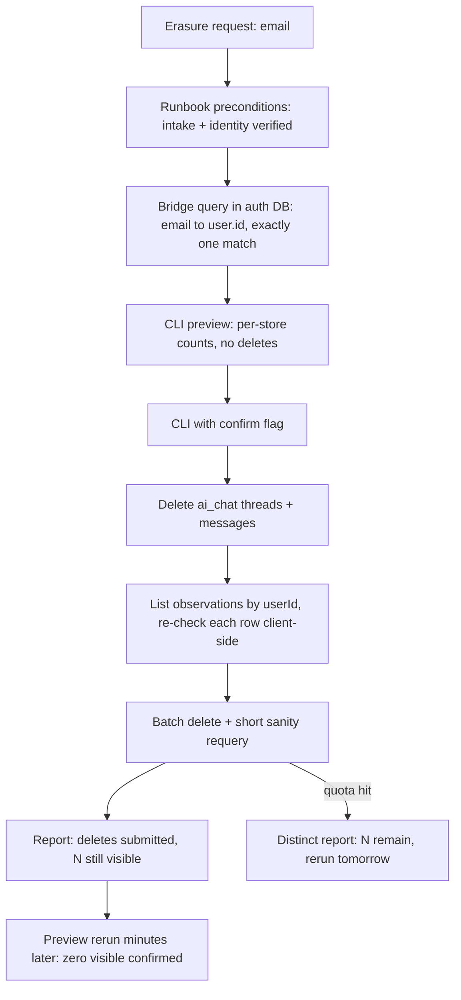
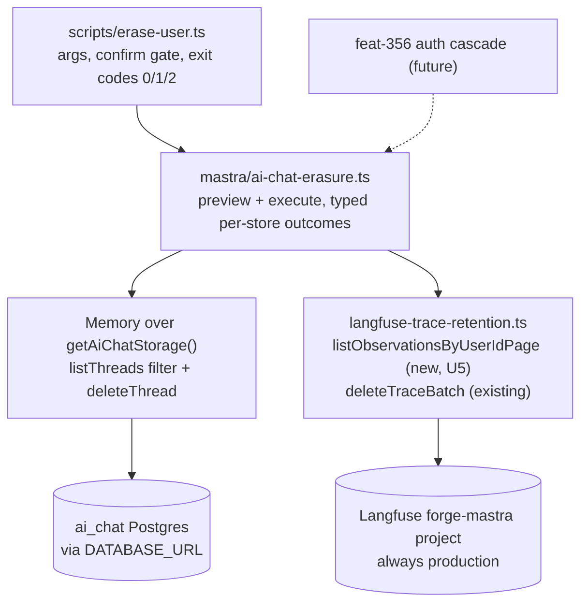
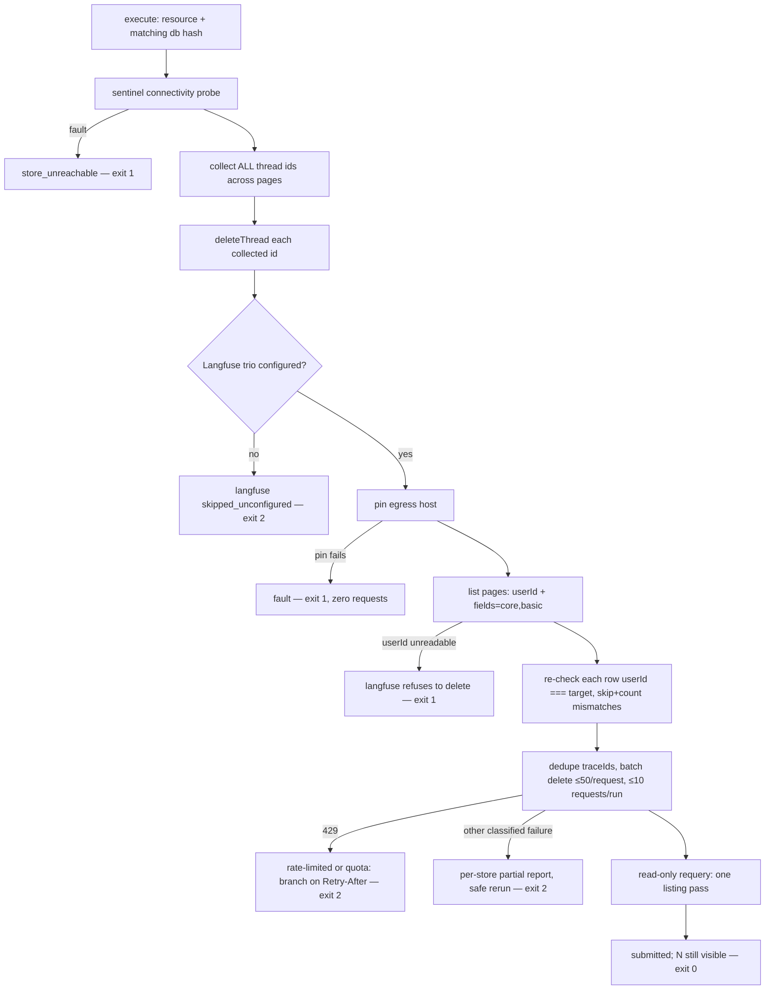

# Per-User Erasure Capability - Plan

## Goal Capsule

- **Objective:** Ship feat-337 (`docs/roadmap/ai-chat/feat-337-per-user-erasure-capability.md`) — an on-demand operator CLI that erases one resource's Seeker data from both stores (`ai_chat` Postgres and Langfuse traces), plus the docs deliverables that make erasure requests serviceable and keep the roadmap honest.
- **Product authority:** The feat-337 ticket as amended by the brainstorm's owner decisions (Key Decisions below). The apps/auth account-deletion cascade is NOT active scope — it becomes follow-up ticket feat-356.
- **Authority hierarchy:** Product Contract Key Decisions KD1–KD12 are owner-settled — do not re-litigate them during implementation. Each carries its `session-settled` annotation except KD10, which is a recorded design lean whose final call belongs to feat-356. KTD-level `session-settled` labels are equally settled. Requirements win on product behavior; KTDs win on mechanism within their cited R constraints.
- **Stop conditions:** Surface as blocked (do not guess) if a build-time confirmation in Dependencies / Assumptions turns out false — operator lacks auth-DB access, no intake channel exists, the execution locus cannot reach production Postgres — or if the Langfuse listing cannot return `userId` in practice (R7's refusal case at build time).
- **Execution profile:** Two PRs — PR 1 Postgres half + all docs deliverables (U1–U4), PR 2 Langfuse half (U5–U7) expected immediately after (KD7). No interim-window runbook wording.
- **Open blockers:** None. feat-321 (Langfuse tracing) and feat-336 (retention sweep) are complete and the sweep is confirmed deployed on Railway.

---

## Product Contract

Product Contract preservation: changed — R14 gains one research-discovered accepted limitation (v2-read-surface visibility bound); Dependencies gain two verified vendor facts (`fields=core,basic`, legacy-ingestion invisibility); Outstanding Questions' four deferred-to-planning items are resolved into KTD1/KTD2/KTD3/KTD6. Review corrections: the R14 DuckDB limitation is scoped to its factual (historical) extent, and F2's completion horizon is stated as measured-at-smoke-time rather than an unmeasured "≤2 runs" promise. Owner ruling 2026-08-17: the project-identity probe is dropped (keys are project-scoped), R14 records the key-pair-determines-project assumption as an accepted limitation. All other R/KD/F/AE meaning and IDs unchanged.

### Summary

Build `erase-user`, an on-demand operator CLI in `apps/mastra` that deletes one resource's Seeker threads, messages, and Langfuse traces by exact resourceId match — read-only count preview by default, deletion behind an explicit confirm flag, count-only output. Delivered as two PRs (Postgres half, then Langfuse half) with the operator runbook, roadmap-hygiene edits, and a new follow-up ticket for the auth account-deletion cascade riding along.

### Problem Frame

A subject-erasure request ("delete my data") must remove a user's Seeker data everywhere it lives. Since feat-321, that is two stores: the `ai_chat` Postgres schema (threads + messages keyed by `resourceId`) and the `forge-mastra` Langfuse project (traces keyed by the same value in `userId`, carrying raw conversation text — special-category personal data). Today the Postgres half is coverable only via a manual SQL runbook in `apps/mastra/CLAUDE.md`, and the Langfuse half only via a manual console bulk-delete. There is also no documented way to turn what an operator actually receives — an email address — into the resourceId the stores are keyed by, so even the manual paths are rediscovered under time pressure.

Retention does not make this capability redundant, and the two stores differ in why. The `ai_chat` Postgres purge is keyed to last activity (`updatedAt`), so a thread the subject keeps using never ages out — the CLI is that store's only erasure path. Langfuse traces do age out on fixed event time at 25 days, so the Langfuse half buys speed of erasure inside the statutory deadline and keeps raw conversation text out of a browser session, with the console bulk-delete as the manual cover in the interim.

### Key Decisions

- KD1. **No Postgres spend-claim ledger.** (session-settled: user-directed — chosen over building erasure-side delete-quota spend recording: the sweep/erasure quota collision is unrealistic at dogfood scale and fails soft — a quota-hit erasure reruns the next day, inside any statutory deadline.) Governs R5, R11.
- KD2. **The Langfuse 30-day visibility wall is out of code scope.** (session-settled: user-approved — chosen over building past-wall handling: the 25-day retention sweep keeps all data inside the listable window while healthy; the tier-upgrade escape hatch is documented in the runbook only.) Governs R10.
- KD3. **Quota posture is headroom-by-convention.** (session-settled: user-approved — chosen over enforced reservation: the feat-336 sweep caps itself at 40 of the org's 50 delete requests/day, leaving ≥10/day for erasure; the CLI reports a quota hit distinctly instead of coordinating spend.) Governs R5.
- KD4. **Erasure accepts any full resourceId, including `anon:*`.** (session-settled: user-approved — chosen over refusing non-`user:` resources: anon erasure is rare but there is no reason to block an operator who holds the exact key.) One named exception: the shared fallback resource, per R2. Governs R2.
- KD5. **Terminal output only; no durable erasure record.** (session-settled: user-approved — chosen over appending a durable count-only log: completion is recorded wherever the erasure request itself is tracked; feat-339 gains a register line to investigate whether public release needs a durable record.) Governs R4, R12.
- KD6. **Running without the confirm flag is a read-only count preview.** (session-settled: user-approved — chosen over refusing outright: the operator sees the blast radius before committing.) Governs R3.
- KD7. **Two PRs: Postgres half first, Langfuse half second.** (session-settled: user-approved — chosen over one combined PR: each lands reviewable and independently useful; the ticket's owner had left one-vs-two open.) Docs deliverables (R9–R14) ride PR 1. PR 2 is expected to land immediately after PR 1 (owner, 2026-08-12), so the runbook documents the end state without interim-window caveats.
- KD8. **Plainly delete the feat-336 Resolution clause naming feat-337 as designer of erasure-side spend recording.** (session-settled: user-directed — chosen over adding a dated supersession note: the clause was written against the owner's instruction and never reflected an agreed plan; the deferred-mitigation record and its build triggers stay intact.) Governs R11.
- KD9. **The apps/auth account-deletion cascade is deferred to new ticket feat-356.** (session-settled: user-approved — chosen over folding it into feat-337 or building it now: it is user-initiated deletion through a different door, which the ticket's constraints already defer; auth's strict prove-or-abort hook contract cannot be honored against async-no-receipt Langfuse deletion; the gap it leaves is bounded at 25 days by retention for a tiny allowlisted audience.) Governs R13, R14.
- KD10. **The cascade's recorded design lean is best-effort for BOTH stores.** Both Seeker stores self-clean within 25 days once activity stops, so strictness buys only "immediately vs within 25 days" — not worth a Mastra outage blocking account deletion (auth already carries exactly one such blocking dependency). Recorded in feat-356 as the lean; final call belongs to that ticket. Governs R13.
- KD11. **The overstated apps/mobile deletion copy is deferred to a feat-339 tripwire.** (session-settled: user-directed — chosen over softening the copy now: it is mobile-app copy outside this lane; the public-release gate must not pass with the claim still overstated.) Governs R12.
- KD12. **The Langfuse UI bulk-delete is documented as break-glass fallback.** (session-settled: user-approved — the traces table can be filtered by User ID and bulk-deleted; whether UI deletions count against the API delete quota is unverified and checked at build time.) Documented with exact-match and count-check discipline per R10. Governs R10.

### Requirements

**CLI erasure tool**

- R1. An operator CLI in `apps/mastra` (house tsx-script pattern) erases one resource's Seeker data from both stores: `ai_chat` threads + messages, and `forge-mastra` Langfuse traces whose `userId` equals the resourceId.
- R2. Erasure is keyed by full resourceId value equality — never prefix, pattern, or cross-user matching — and accepts any full resourceId shape (`user:*`, `anon:*`), with one named exception: the CLI refuses the shared fallback resourceId `seeker-dogfood` (`SEEKER_DEFAULT_RESOURCE_ID`, stamped on every internal caller that omits a resourceId), because key equality does not bound that key's blast radius to one subject; any break-glass override must be documented, not default.
- R3. Without the explicit confirm flag the CLI performs a read-only per-store count preview and deletes nothing; with it, the CLI deletes and reports per-store counts.
- R4. Output and logs are enum-and-count only: never conversation text, titles, trace content, upstream response bodies, or caught exception text. Failures are reported as classified reason enums, and an unhandled rejection must never print a raw error.
- R5. A Langfuse delete-quota rejection is reported distinctly from other failures, with remaining-count and rerun-tomorrow guidance; the CLI never coordinates or records quota spend.
- R6. The erasure logic lives in a plain reusable function the CLI thinly wraps, so the future auth-facing surface (feat-356) calls the same code.
- R7. The Langfuse half lists the resource's traces by user via `GET /api/public/v2/observations` with an exact-match `userId` filter (verified against the vendor's OpenAPI spec, 2026-08-12 — never the deprecated `/api/public/traces` list the retention client bans), re-checks every listed row's own `userId` client-side for exact equality before its id may enter a delete batch — a row that fails or lacks a readable `userId` is skipped and counted, and if the listing cannot return `userId` at all the Langfuse half refuses to delete — then batch-deletes within the vendor's per-request id ceiling, reusing the feat-336 client's HTTP posture and delete surface. The listing must never buffer raw conversation text.
- R8. No new env vars: the CLI runs on the existing `DATABASE_URL` plus the optional Langfuse credential trio, and degrades clearly when the trio is absent. (Opt-in test-only smoke gates follow the established `*_SMOKE_TEST` precedent and are not runtime configuration; see KTD8.)
- R15. Verification semantics are honest about async deletion: the in-run requery is a short bounded sanity check, not sized to converge — Langfuse deletion is ~15 minutes async with no completion receipt, so the normal terminal state is "deletes submitted; N still visible", reported as a distinct non-failure state. The zero-visible-traces evidence comes from re-running the no-flag preview minutes later. A run against a key with no data in either store reports "no data found for this exact key" as a distinct outcome, never a successful erasure. (feat-336 removed its own in-process requery for process-lifetime reasons that do not apply to a single CLI invocation; the async latency is why convergence is still not expected in-run.)

**Docs deliverables (ride PR 1)**

- R9. The `apps/mastra/CLAUDE.md` operator runbook is updated, opening with the request lifecycle rather than the tooling: the named intake channel erasure requests arrive on; verification that the requester controls the email address through the account's own authenticated channel before any destructive run; the email→sub bridge (one query against the auth database — the Seeker `sub` is the apps/auth `user.id` verbatim, so the key is `user:` + that id) with a single-match rule — zero or multiple matches abort the erasure and escalate, never operator choice; where the request and its completion are recorded; and the response deadline the operator works against. The CLI is the normal path; the raw SQL stays as break-glass. A 0/0 preview means re-derive the key before recording anything.
- R10. The runbook also records: console bulk-delete discipline (an exact-equality filter operator on User ID — never contains/starts-with — and verifying the filtered count against the CLI preview count before confirming, noting the path is unaudited and open to anyone with Langfuse project access); where the CLI runs and with which credentials, with the bridge query executed by someone already authorized for the auth database — erasure duty does not by itself confer auth-DB access; the accepted limitations (R14) at point of use, including the sentence the operator can send back to the requester; the verify-later caveat (the CLI proves "zero VISIBLE traces", ~15 min async, per R15); and the temporary tier-upgrade escape hatch for past-wall records with lead time inside the statutory deadline.
- R11. The feat-336 ticket's Resolution drops the clause naming feat-337 as designer of erasure-side spend recording (per KD8), leaving the deferred spend-claim-ledger mitigation and its build triggers standing.
- R12. The feat-339 register gains three erasure lines: investigate whether a durable erasure record is needed before public release; the apps/mobile "deletes your account everywhere" copy overstates Seeker erasure and must be resolved before release; investigate whether the feat-356 cascade is needed before release or not.
- R13. New ticket feat-356 is created in the ai-chat lane (ID re-verified as next free at creation time): the apps/auth account-deletion cascade to the Seeker stores, blocked by feat-337, recording the best-effort-both-stores lean (KD10), the auth hook's existing config-absent skip carve-out as the posture to match, and that a chat-only user currently has no self-serve deletion path at all. The PR 1 docs pass also corrects the feat-337 ticket's stale `GET /api/public/traces` endpoint reference (see Dependencies).
- R14. Accepted limitations are recorded in feat-337's completion docs AND in the runbook at point of use, worded hard:
  - Once an auth account is deleted the `sub` is unrecoverable, so a later erasure request cannot be serviced at all — the data can only age out over ≤25 days and deletion cannot be confirmed to the requester.
  - `anon:*` resources are unreachable by any cascade design; retention is their only deletion path.
  - A subject's Seeker data may span several resourceIds (a second account, a pre-sign-in `anon:<uuid>` no query can link to an email, turns under the shared fallback resource) — completion is only ever claimed for the keys erased, never for "this person".
  - No individual behind the shared `seeker-dogfood` fallback resource can be individually erased; retention is that data's only deletion path.
  - The local DuckDB observability store retains redacted seeker spans stamped `userId = <resourceId>` and `sessionId = <threadId>` with no retention job — no conversation content, but that identifier-and-timing record survives erasure. Scope: while `LANGFUSE_TRACING_ENABLED="true"` the routed seeker turns write nothing to DuckDB (the `langfuse-seeker` observability config registers no storage exporter), so this residue is historical — spans from flag-off periods plus agent calls outside the seeker route.
  - The Langfuse half sees only what the v2 observations read surface indexes: records ingested via the legacy batch ingestion API never materialize there and cannot be listed or deleted by the CLI (today that set is test sentinels only — production tracing is OTel-ingested and does index); a trace with no v2-indexed observation is the same class. Completion is claimed as "zero traces visible on the read surface", never "every trace that ever existed".
  - Langfuse keys are project-scoped, so the environment's key pair determines WHICH project the Langfuse half operates on. A completion claim assumes that pair is the `forge-mastra` pair — guaranteed by construction at the console locus, an operator-hygiene assumption at the workstation fallback (owner-accepted, 2026-08-17).

### Key Flows

- F1. Operator erasure
  - **Trigger:** An erasure request arrives (as an email address, typically).
  - **Steps:** Operator runs the runbook preconditions (intake recorded, requester identity verified, bridge query resolves to exactly one account) → derives `user:` + auth `user.id` → runs the CLI plain and reads the per-store count preview → reruns with the confirm flag → CLI deletes Postgres threads + messages, then lists, re-checks, and batch-deletes Langfuse traces, ending "deletes submitted; N still visible" → minutes later the operator reruns the preview to confirm zero visible traces.
  - **Outcome:** Postgres reports zero synchronously; Langfuse deletion is submitted in-run and confirmed by the later preview rerun showing zero visible traces; the operator records completion — claimed per-key, never per-person — wherever the request is tracked.
  - **Covers:** R1–R4, R7, R9, R15.
- F2. Quota-hit erasure
  - **Trigger:** Langfuse rejects a delete request for the org's daily quota mid-erasure.
  - **Steps:** CLI reports the quota hit distinctly with the remaining trace count and rerun-tomorrow guidance; Postgres deletions already done stay done; rerunning next day is safe (exact-key deletes are idempotent).
  - **Outcome:** Erasure completes across successive daily runs — typically ≤2 at dogfood trace volumes, a bound the U7 read smoke measures rather than assumes — and the quota-hit report prints the remaining count with the implied days-to-complete so the operator sees the real horizon against the statutory deadline.
  - **Covers:** R5.

### Acceptance Examples

- AE1. **Covers R2.** Given threads exist for `user:abc` and `user:abcd`, when the operator erases `user:abc`, then `user:abcd`'s data is untouched in both stores.
- AE2. **Covers R3.** Given a resource with data in both stores, when the CLI runs without the confirm flag, then both stores' row/trace counts print and nothing is deleted.
- AE3. **Covers R5.** Given Langfuse rejects a delete for quota, when the erasure runs, then the CLI reports the quota hit distinctly (not as a generic failure) with the remaining count, and a rerun the next day completes the erasure.
- AE4. **Covers R15.** Given Langfuse deletion is still propagating, when the sanity requery ends at its bounded ceiling, then the CLI reports "submitted, not yet converged" as a distinct non-failure state — and a later preview rerun showing zero visible traces is the completion evidence.
- AE5. **Covers R2, R8.** Given a resourceId `anon:<uuid>`, when the operator erases it with the Langfuse trio absent, then the Postgres half completes, and the Langfuse half is reported as skipped/unconfigured rather than silently succeeding.
- AE6. **Covers R7.** Given a listing response that ignores or mangles the `userId` filter and returns other users' rows, when the Langfuse half runs, then no delete request is issued for any row whose `userId` does not exactly equal the target.
- AE7. **Covers R15, R9.** Given a resourceId with no data in either store, when the CLI runs, then it reports "no data found for this exact key" as a distinct outcome — never a successful erasure.
- AE8. **Covers R2.** Given the shared fallback resourceId `seeker-dogfood`, when an operator attempts erasure, then the CLI refuses.

### Scope Boundaries

- The apps/auth account-deletion cascade and any network-callable erasure surface — feat-356.
- Self-serve (user-initiated) deletion in any app — deferred beyond feat-356's cascade design.
- Past-wall Langfuse records — no code handling; runbook escape hatch only (KD2).
- The local DuckDB observability store — no code changes: it holds no Seeker conversation content (feat-321 Langfuse-only decision), though it does retain redacted `userId`-stamped span metadata with no retention job, recorded as an accepted limitation (R14).
- Any spend-claim ledger or quota coordination (KD1).
- The apps/mobile deletion-copy change itself — feat-339 tripwire only (KD11).
- `ai_chat.mastra_resources` — the table does not exist (working memory never landed); the runbook's parenthetical stands, and `deleteThread` does not touch it (KTD1).
- Extraction of the repo-wide shared Langfuse/HTTP client module — the convention doc's own tracked follow-up, not this ticket (KTD4).

### Dependencies / Assumptions

- feat-321 (tracing) and feat-336 (retention sweep) are complete; the sweep is deployed and firing — its health is what keeps KD2 valid. A firing sweep is NOT evidence that tracing is enabled: the sweep gates on the Langfuse credential trio and is deliberately independent of `LANGFUSE_TRACING_ENABLED`.
- **Verified (owner-confirmed, 2026-08-12):** `LANGFUSE_TRACING_ENABLED="true"` on the production Mastra service — production traces exist and the Langfuse half operates on real data.
- **Verified (2026-08-12, vendor OpenAPI spec + `@langfuse/core` 5.10.0 generated typings):** `GET /api/public/v2/observations` — the retention client's proven listing endpoint — accepts an exact-match `userId` filter; R7 lists observations and dedupes trace ids. `userId` is returned only when the `basic` field group is requested, so the erasure listing sends `fields=core,basic` — the `io` group (the only group carrying conversation input/output) is never requested, so R7's no-conversation-text rule holds. The deprecated `GET /api/public/traces` list (which the feat-337 ticket currently names) sits in the vendor's tightest rate bucket and is banned by the retention client's own header; the ticket's endpoint reference is corrected in the PR 1 docs pass (R13).
- **Verified (2026-08-11, feat-336 first real-API contact):** records ingested via the legacy `POST /api/public/ingestion` batch API never materialize on the v2 observations read surface; production OTel traces do. Grounds the new R14 visibility limitation and the smoke design (KTD8).
- **Assumption (build-time check, R10/KD12):** whether Langfuse UI bulk-deletes count against the API delete quota.
- **Assumption (build-time confirmation, R9):** the operator running the CLI has access to the auth database for the bridge query — if not, that is an operational blocker to surface, not a doc gap.
- **Assumption (build-time confirmation, R9):** a named intake and tracking channel for erasure requests exists, with an owner — if not, that is an operational blocker to surface, not a doc gap.
- **Assumption (build-time confirmation, R10):** the CLI's execution locus is named — Railway service shell vs operator workstation — and per locus: network reachability to Mastra's production Postgres, and which Langfuse key pair supplies the trio (the Railway key never leaves Railway; the local-dev pair shares the same project). An unreachable locus is an operational blocker.
- The Langfuse half always targets the single shared `forge-mastra` project regardless of which `DATABASE_URL` the Postgres half points at — a local run with real credentials deletes production traces, and every delete-capable run (tests included) spends the same org-wide 50/day delete quota.
- **Assumption (believed, verify at build time):** auth and mastra run separate Postgres instances; the bridge query targets auth's, the CLI targets mastra's.
- The chat OAuth client is not pairwise, so the ID token `sub` is the raw apps/auth `user.id` — the bridge mapping survives email changes and needs no join. (A future pairwise flip via `OauthClient.subjectType` would silently invalidate the bridge; the runbook notes this.)

### Outstanding Questions

- **Resolve Before Planning:** none.
- The brainstorm's four deferred-to-planning questions are resolved in the Planning Contract: CLI argument names and confirm-token shape (KTD3), Postgres deletion mechanism (KTD1), sanity-requery scope and pacing (KTD6), reusable-function location (KTD2).
- Remaining build-time confirmations stay in Dependencies / Assumptions — they are operational preconditions to check during implementation, not design questions.

<!-- ce-section: work-relationships -->

### How This Work Fits Together

This plan owns feat-337 only. The surrounding lane understanding, current not committed:

- feat-339 (public-release readiness register)
  - **Depends on** feat-337 completing (existing ticket relationship), and gains three erasure register lines via R12.
- feat-356 (auth account-deletion cascade — created by this work, R13)
  - **Depends on** feat-337's reusable erasure function (R6, KTD2).
  - **Still to decide:** its final strictness posture (lean recorded per KD10), surface shape, and cross-app key discipline — all in that ticket.
- feat-336 (retention sweep, complete)
  - **Shares** the Langfuse client surface: `langfuse-trace-retention.ts` gains the exported by-userId listing (KTD4) and lends `deleteTraceBatch`; the ticket receives the R11 Resolution edit.

### Sources

- `docs/roadmap/ai-chat/feat-337-per-user-erasure-capability.md` — the ticket this plan amends (its `GET /api/public/traces` endpoint, `fields=core` advice, and "pg-failmode harness" claims are stale; corrected by U4).
- `docs/roadmap/ai-chat/feat-336-langfuse-trace-retention-job.md` — quota split, visibility-wall reality, deferred ledger, the R11 clause.
- `apps/mastra/CLAUDE.md` — "Operator deletion runbook" and "Langfuse-only export" (the canonical scope statement).
- `apps/mastra/src/mastra/langfuse-trace-retention.ts` — list/delete mechanics, quota constants (`MAX_TRACE_IDS_PER_DELETE_REQUEST = 50`, `MAX_DELETE_REQUESTS_PER_RUN = 40`), endpoint ban, async-deletion caveats, failure enums, byte-capped reader, leak-control conventions to reuse.
- `apps/mastra/src/mastra/ai-chat-retention.ts` — Memory-over-`getAiChatStorage()` acquisition, collect-then-delete pagination, connectivity probe (`RETENTION_PROBE_THREAD_ID`), bounded deletes, count-only logging.
- `apps/mastra/src/mastra/ai-chat-memory.ts` — `getAiChatStorage()`, the `AI_CHAT_MEMORY_BACKEND` kill switch KTD1 must bypass.
- `apps/mastra/src/mastra/langfuse-tracing.ts` + the observability config in `apps/mastra/src/mastra/index.ts` — span `userId`/`sessionId` stamping and the default DuckDB exporter behind the R14 metadata limitation.
- `apps/mastra/src/mastra/ai-chat-thread-ownership.ts` — the resourceId prefix-only contract (never split on `:`), `AI_CHAT_MAX_THREADS_PER_RESOURCE = 200` (fail-open), `listThreads` fault-swallowing note.
- `apps/mastra/src/mastra/agents/seeker-route.ts` — `SEEKER_DEFAULT_RESOURCE_ID = "seeker-dogfood"` definition and stamping.
- `apps/auth/src/services/account-deletion.service.ts` + `apps/auth/src/auth/config.ts` — the beforeDelete hook feat-356 will extend; ordering, strictness rationale, config-absent skip carve-out.
- `apps/admin/src/scripts/backfill-video-relation-order.ts` — the strongest in-repo destructive-CLI confirm gate (dry-run default, `--execute`, `--confirm-database=<hash>` checked before client construction).
- `apps/mastra/src/scripts/check-devotional-database-readiness.ts` — the testable-CLI-core shape (exported run function returning an exit code, injectable seams, thin `main()`); `apps/mastra/src/evals/seeker/cli.ts` — the `flag(argv, name)` arg-parsing idiom.
- `apps/mastra/src/mastra/ai-chat-pg-failmode-contract.test.ts` — the unreachable-store contract test (NOT a seeded-DB harness; see KTD8).
- `docs/solutions/architecture-patterns/diy-retention-sweep-three-controls-visibility-walled-store.md` — the feat-337 caveat section (per-subject completeness, visibility wall as erasure boundary).
- `docs/solutions/best-practices/per-run-caps-vs-per-day-quota-claims-restart-refreshed-jobs.md` — the 40/50 quota split and headroom convention.
- `docs/solutions/conventions/single-service-http-client-result-union-convention.md` — result-union client shape; names the byte-cap-reader `TimeoutError` defect fixed only in `langfuse-trace-retention.ts` (KTD4 reuses that fixed copy).
- `docs/solutions/tooling-decisions/destructive-embedding-cleanup-cli-safety-contract.md` — the repo's destructive-CLI safety contract (dry-run-first, explicit execute, count-only reports).

---

## Planning Contract

### Key Technical Decisions

- KTD1. **Postgres half deletes through the Memory API with collect-then-delete pagination.** List thread ids with `listThreads({ filter: { resourceId } })` (a store-side exact-match filter — the key-equality primitive R2 needs), draining ALL pages into a collected id list before the first delete, then `deleteThread` per id — `deleteThread` also removes the thread's messages and orphaned vectors, which the runbook SQL misses. Collect-then-delete is the retention purge's proven discipline; interleaving deletes with pagination shifts pages and can silently skip threads, which for erasure is a completeness failure with no next-day sweep to catch it. The Memory instance is constructed directly over `getAiChatStorage()` — never `getAiChatMemory()`, whose `AI_CHAT_MEMORY_BACKEND=memory` kill switch would report success while Postgres rows survive. `DATABASE_URL` is asserted explicitly; the `getMastraDatabaseUrl()` silent local fallback is refused for a destructive tool. Chosen over mirroring the runbook SQL: same rows, plus vector cleanup, no hand-rolled SQL casing traps.
- KTD2. **Reusable module at `apps/mastra/src/mastra/ai-chat-erasure.ts`; CLI is a thin wrapper at `apps/mastra/src/scripts/erase-user.ts`.** The module exports plain functions returning typed per-store result unions — the seam feat-356 builds on (R6): apps/auth cannot import apps/mastra source, so the cascade will call a mastra-side surface (shape deferred to feat-356) that wraps these same functions and consumes the typed results, never the CLI's exit codes. Matches the flat `ai-chat-*` module convention beside the two modules it composes. `src/scripts/lib/` does not exist and is not created.
- KTD3. **CLI surface: `--resource=<resourceId>` required; bare run = read-only preview; deletion requires `--execute --confirm-database=<hash>`.** (instantiates KD6, session-settled: user-approved; governs R3 — the token shape was the brainstorm's deferred-to-planning question, resolved here.) The preview prints per-store counts, the Langfuse host it would target, and the target-identity hash (sha256 prefix, the `backfill-video-relation-order` precedent extended across both stores); execute mode refuses a missing or mismatched hash BEFORE any store client is constructed. The hash covers target identity only — never counts, so an active user cannot deadlock the confirm loop; execute re-reports its own execute-time counts so preview→execute drift is visible rather than hidden. Target identity spans BOTH stores AND the subject — the redacted Postgres connection identity, the Langfuse host, and sha256(resourceId) — because the Langfuse half is always production and a token attesting only to WHERE would still let a hash minted while previewing one subject authorize `--execute` against another: execute recomputes and refuses a mismatch on any component. The subject enters pre-hashed so the printed token carries no identifier (R4), and unlike a count it is stable, so the no-deadlock rationale holds. The Langfuse component is the host, not a project id: keys are project-scoped, so the environment's key pair determines the project — an owner-accepted assumption (2026-08-17) recorded in R14, guaranteed by construction at the console locus. Chosen over a bare `--confirm` boolean: an irreversible cross-store erasure warrants pinning WHICH targets and WHOM, and the hash forces a preview-first flow that F1 already prescribes.
- KTD4. **Langfuse listing is a new exported `listObservationsByUserIdPage` colocated in `langfuse-trace-retention.ts`.** The existing `listExpiredObservationsPage` is not reusable (hardcodes `fields=core`, requires a cutoff, strips `userId`), and the HTTP helper family it uses (`endpoint`, `readJsonBodyCapped`, `basicAuthHeader`, status/throw classification) is module-private — colocating the new function reuses those helpers with zero export-surface churn, including the module's fixed byte-cap reader (the one copy with the `TimeoutError` rethrow fix). The new function sends the `userId` query param (never the structured `filter` param, which would take precedence) with `fields=core,basic` and widens the row schema by exactly `userId`; `io` is never requested. Timeouts come from `getLangfuseTraceRetentionConfig()` (15s default — the 3s prompt default times out real batch deletes). Chosen over exporting the helper family or extracting the shared client now: extraction is the convention doc's tracked follow-up, not this ticket.
- KTD5. **Outcome taxonomy: retention failure enums plus a stage discriminator and per-run caps; three CLI exit codes.** Classification reuses the retention module's reasons (401/403→`auth_failed`, 429→`rate_limited` + Retry-After, other 4xx→`rejected`, 5xx→`network_error`, malformed→`parse_error`, plus `timeout` from the module's deliberate `TimeoutError` rethrow); U5 exports the composed union (`LangfuseTraceRetentionFailureReason | "rate_limited"`) because the exported alias alone cannot represent `rate_limited`. Every Langfuse outcome carries `stage: "list" | "delete"` (the retention module's own discriminator): a list-stage 429 is a transient read-bucket throttle reported as "retry after N seconds" — never daily-quota wording; a delete-stage 429 branches on Retry-After magnitude — short (minutes) → retry-shortly guidance, day-scale or absent → the R5 quota outcome with remaining count and implied days at the headroom rate. The Langfuse half is bounded per run: a list-page cap (the retention module's `MAX_LIST_PAGES_PER_RUN` rationale) and a delete-request cap of 10 — the KD3 headroom share — so one heavy erasure can never consume the sweep's allocation; a cap hit routes to the same incomplete outcome. The module returns independent per-store outcomes; PR 1's unbuilt Langfuse slot is `not_implemented` — never `skipped_unconfigured`, which keeps exactly one meaning (trio absent). CLI exit codes: 0 — preview, no-data-found, and full-submission runs including "submitted, not yet converged" (R15's non-failure state); 2 — incomplete-but-safe-to-rerun (rate-limit or quota, cap hit, any classified Langfuse failure after the Postgres half, `skipped_unconfigured` or `not_implemented` while data may exist); 1 — hard refusal or fault (bad args, refused resourceId, missing `DATABASE_URL`, connectivity-probe failure, listing cannot return `userId`, egress-pin refusal). Every exit-2 report names the per-store state and that rerun is safe (exact-key deletes are idempotent). Postgres-side additions shipped in PR 1: the listing is re-checked client-side — each listed row's `resourceId` during collect, and each thread re-read and ownership-proven immediately before its delete — with either check failing CLOSED (`filter_mismatch` / `unreadable_rows` stop the run; never skip-and-continue), and the page drain carries an `ERASURE_MAX_LIST_PAGES` loop guard whose cap hit is a loud failure. PR-1 exit posture: every `--execute` exits 2 — including a no-data execute — because the Langfuse slot is `not_implemented` and no PR-1 run may imply "erased everywhere"; the no-data → 0 mapping applies to previews now and to executes once U6 lands.
- KTD6. **The post-delete sanity requery is strictly read-only: one listing pass, count still-visible, never re-submit deletes.** (instantiates R15's settled semantics.) A delete-capable requery would double quota spend on traces already pending async deletion, eroding the ≥10/day headroom KD3 assumes. Completion evidence is the operator's later preview rerun (F1).
- KTD7. **A store-connectivity probe guards every count that could read as "no data".** `listThreads` swallows store faults into empty results (documented in `ai-chat-thread-ownership.ts` and `ai-chat-retention.ts`); a false "no data found for this exact key" is worse for erasure than a false purge-complete is for retention. The module runs the retention purge's sentinel `getThreadById` probe pattern (an erasure-owned sentinel id) before the preview counts and again before the confirmed delete; a probe failure is a distinct fault outcome (exit 1), never a zero count. Guards R15/AE7.
- KTD8. **Smokes are net-new opt-in suites; the ticket's two verification claims are stale and corrected in U4.** The cited `ai-chat-pg-failmode-contract.test.ts` is an unreachable-store contract test, not a seeded-DB harness — no seeded real-Postgres harness exists in apps/mastra. PR 1 adds `ai-chat-erasure.smoke.test.ts` gated by `AI_CHAT_ERASURE_SMOKE_TEST=1` (schema-validated like the retention smoke gate) against a caller-supplied throwaway `DATABASE_URL`. The ticket's Langfuse smoke ("seed a sentinel trace, erase, verify-by-requery") is impossible as written — ingestion-seeded sentinels never appear on the v2 read surface — so PR 2's opt-in Langfuse smoke is READ-ONLY: it proves the real listing contract (`fields=core,basic` actually returns `userId`, the empirical claim the typings make) against real project data and spends no delete quota; the delete surface stays proven by feat-336's smoke plus unit wire-shape tests. Test-only gates follow the established `*_SMOKE_TEST` precedent and do not violate R8.
- KTD9. **Scripts stay process-env-only.** No dotenv loading and no import of the evals-local `loadEnvFiles()` across the `evals/` boundary (no precedent). The runbook's execution-locus entry (R10) documents credential sourcing, including the smoke-documented `set -a; source <(grep '^LANGFUSE_' apps/mastra/.env); set +a` idiom for workstation runs.
- KTD10. **The email→sub bridge query is normalized, not byte-exact, and identity is verified against the resolved account.** The auth `user.email` column is DB-unique on the exact string, so a byte-exact query false-zero-matches on case differences from free-text intake; the runbook documents a case-folded, trimmed match (`lower(email) = lower(trim(<input>))` shape). Whether two case-variant accounts can actually coexist depends on auth's write-path normalization (unverified), so the runbook keeps R9's abort-and-escalate rule for zero and multiple matches regardless. Ordering: the bridge resolves the account first, then R9's requester-identity verification runs against the RESOLVED account's stored address through that account's authenticated channel — and a resolved row whose stored email is not byte-identical to the requester-supplied string is an escalation, never a silent single match. This closes the wrong-subject path where a case-variant address resolves to a different person's account.
- KTD11. **Langfuse egress pin.** Before any Langfuse request the module asserts the base URL is https and its host is allowlisted — against `LANGFUSE_ALLOWED_HOSTS` when set, else a pinned expected-host constant (the env.ts production boot guard never fires in a workstation tsx process, and the secret key grants read access to raw conversation text). A failed pin is a distinct fault outcome (exit 1), never a zero count. No project-identity probe (owner ruling, 2026-08-17): Langfuse keys are project-scoped, so the key pair itself determines the project — the wrong-project false-completion path exists only via a wrong key pair in the environment, which the console locus rules out by construction; the workstation-fallback assumption is recorded in R14.

### High-Level Technical Design

Component composition — the module is the seam; the CLI and the future cascade are both thin callers:

Confirmed-run pipeline and outcome states (directional; prose and KTDs are authoritative):

### Sequencing

- **PR 1 (Postgres half + docs):** U1 → U2 → U3, U4. Independently useful: automates the runbook SQL path with the confirm gate, and lands every docs deliverable.
- **PR 2 (Langfuse half):** U5 → U6 → U7, immediately after PR 1 (KD7).

---

## Implementation Units

### U1. Erasure module — Postgres half and shared spine

- **Goal:** `ai-chat-erasure.ts` exports the reusable preview/execute functions with typed per-store outcomes, covering the Postgres store end-to-end.
- **Requirements:** R1 (Postgres half), R2, R4, R6, R15 (no-data + probe honesty). KTD1, KTD2, KTD5, KTD7.
- **Dependencies:** none.
- **Files:** `apps/mastra/src/mastra/ai-chat-erasure.ts`, `apps/mastra/src/mastra/ai-chat-erasure.test.ts`, `apps/mastra/src/mastra/ai-chat-thread-ownership.ts` (constant relocation), `apps/mastra/src/mastra/agents/seeker-route.ts` (re-export only).
- **Approach:**
  1. Exported functions (preview and execute; injectable memory/config/log seams) returning a typed result union per store — Postgres outcome now, a Langfuse outcome slot that U6 fills (PR 1 reports it `not_implemented`, per KTD5 — distinct from `skipped_unconfigured`).
  2. Refusal-first validation: empty/whitespace resourceId and the exact `SEEKER_DEFAULT_RESOURCE_ID` value are refused before any store access. Relocate the constant to `ai-chat-thread-ownership.ts` (the documented resource-contract owner) and re-export it from `seeker-route.ts` so existing importers and test pins are unaffected — importing `seeker-route.ts` from the erasure module would eagerly construct the whole seeker agent (module-scope `buildSeekerAgent()`), including the kill-switch-resolved Memory KTD1 refuses, and would break the no-store-on-refusal test pin.
  3. Sentinel `getThreadById` connectivity probe (erasure-owned sentinel id, retention's pattern) before preview counts and again before deletes (KTD7).
  4. Collect-then-delete per KTD1; report threads-deleted count (messages and vectors ride `deleteThread`'s cascade — no separate count is claimed).
  5. Logging: `[ai-chat-erasure] event=<name> key=value` plain-string, enum/count-only (R4); caught errors are classified, never printed.
- **Patterns to follow:** `ai-chat-retention.ts` (probe, collect-then-delete, Memory-over-storage construction, log shape); result unions per `single-service-http-client-result-union-convention.md`.
- **Test scenarios:**
  - Covers AE8. The exact `seeker-dogfood` value → refused outcome; no store constructed, no store call made.
  - Empty and whitespace-only resourceId → refused; no store call.
  - Covers AE2 (Postgres half). Preview: `listThreads` called with filter exactly `{ resourceId: target }` (assert the argument — the key-equality seam), `deleteThread` never called, thread count returned.
  - Probe rejection → `store_unreachable` fault outcome; `listThreads` never consulted; outcome is not a zero count.
  - Covers AE7 (Postgres half). Probe succeeds, zero threads → distinct no-data outcome for the store.
  - Collect-then-delete: two pages of threads → every `listThreads` call completes before the first `deleteThread`; each id deleted exactly once.
  - `deleteThread` rejection mid-sequence → classified fault with deleted-so-far count; asserted log lines contain enums/counts only, never the thrown message.
  - Seam pin: the Memory used is constructed over `getAiChatStorage()` even when `AI_CHAT_MEMORY_BACKEND=memory` (the kill switch must not swallow an erasure).
- **Verification:** unit suite green; module exports consumable without the CLI (feat-356 seam visible in types).

### U2. `erase-user` CLI wrapper

- **Goal:** The operator-facing script: argument parsing, confirm gate, output, exit codes.
- **Requirements:** R1, R3, R4. KTD3, KTD5.
- **Dependencies:** U1.
- **Files:** `apps/mastra/src/scripts/erase-user.ts`, `apps/mastra/src/scripts/erase-user.test.ts`, `apps/mastra/package.json` (script entry `erase-user`, house `pnpm --dir ../.. exec tsx …` shape).
- **Approach:**
  1. Exported testable run core returning an exit code with injectable seams; thin `main()` sets `process.exitCode`; the portable `pathToFileURL(process.argv[1]).href === import.meta.url` main guard (NOT the fragile `file://` string variant).
  2. `flag(argv, "resource")`-style parsing (`--name=value` idiom); `--execute` boolean; `--confirm-database=<hash>`.
  3. Assert the database target via `env.DATABASE_URL` from `src/config/env.ts` (post-`emptyToUndefined`) — a blank sourced value must refuse loudly, never resolve to `LOCAL_DATABASE_URL`; the confirm hash derives from this same value (KTD1, KTD3).
  4. Preview output: per-store counts, the Langfuse host, and the target-identity hash covering both stores (KTD3); the PR 1 build's Langfuse line states the half is `not_implemented` and points at the KD12 console fallback.
  5. Confirm gate checked before any store client is constructed (admin precedent); exit-code map per KTD5.
- **Patterns to follow:** `check-devotional-database-readiness.ts` (testable core + colocated test), `backfill-video-relation-order.ts` (hash gate), `evals/seeker/cli.ts` (`flag` helper).
- **Test scenarios:**
  - Covers AE2. `--resource` only → preview path invoked, nothing deleted, exit 0.
  - `--execute` without `--confirm-database`, and with a mismatched hash → refusal, exit 1, refused before store construction (constructor spy).
  - `--execute` with a hash minted against a different Langfuse target (host or project changed since preview) → refused before any client is constructed (KTD3's both-stores coverage).
  - `--execute` with the matching hash → execute path; output re-reports execute-time counts, labeled distinctly from preview counts.
  - Covers AE8. `seeker-dogfood` → exit 1.
  - Missing `DATABASE_URL` → exit 1 with a classified reason, no fallback connection attempt.
  - Exit-code map: no-data → 0 with distinct enum line; submitted-not-converged → 0; quota-hit and store-partial results → 2; probe fault → 1.
  - Output lines are `[erase-user] event=… key=value` enum/count-only — a scenario feeding an error with a sensitive message asserts the message never appears.
- **Verification:** `pnpm --filter @forge/mastra erase-user -- --resource=user:x` runs the preview path locally against a dev DB.

### U3. Real-Postgres erasure smoke (opt-in)

- **Goal:** Prove the erasure contract against a real seeded Postgres — the coverage mocked SQL-shape tests cannot give.
- **Requirements:** AE1, AE7 real-store halves. KTD8.
- **Dependencies:** U1.
- **Files:** `apps/mastra/src/mastra/ai-chat-erasure.smoke.test.ts`, `apps/mastra/src/config/env.ts` (schema entry `AI_CHAT_ERASURE_SMOKE_TEST: z.enum(["1"]).optional()`).
- **Approach:** `describe.skipIf(!RUN_SMOKE)` on the gate (retention-smoke idiom); seed two prefix-adjacent throwaway resources via the Memory API against the caller-supplied `DATABASE_URL`; erase one; assert the neighbor intact and the target empty. Inject an explicitly-unconfigured Langfuse seam so the smoke exercises the Postgres half only — the operator shell running it may hold real production Langfuse credentials (KTD9's sourcing idiom). Deliberately out of CI.
- **Test scenarios:**
  - Covers AE1. Seed `user:erasure-smoke-a` and `user:erasure-smoke-ab` with threads + messages; erase the first; the second's threads and messages are untouched.
  - Target's threads and messages are gone after execute; a follow-up preview reports 0.
  - Covers AE7. Rerun against the erased key → distinct no-data outcome.
  - The smoke issues zero Langfuse requests (unconfigured seam asserted, mirroring U7's by-construction read-only pin).
  - Suite skips (not fails) when the gate var is unset.
- **Verification:** documented one-line invocation in the suite header; run once against a throwaway DB before PR 1 merges.

### U4. PR 1 docs pass

- **Goal:** Land every docs deliverable: runbook, ticket hygiene, register lines, and the feat-356 ticket.
- **Requirements:** R9, R10, R11, R12, R13, R14 (runbook copy). KD8, KD9, KD10, KD11, KD12, KTD9, KTD10.
- **Dependencies:** U1, U2 (exact CLI names and outputs).
- **Files:** `apps/mastra/CLAUDE.md`, `docs/roadmap/ai-chat/feat-336-langfuse-trace-retention-job.md`, `docs/roadmap/ai-chat/feat-339-seeker-public-release-register.md`, `docs/roadmap/ai-chat/feat-337-per-user-erasure-capability.md`, new `docs/roadmap/ai-chat/feat-356-auth-account-deletion-seeker-cascade.md`, `docs/roadmap/ai-chat/README.md`.
- **Approach:**
  1. Runbook rewrite per R9/R10, request-lifecycle first; the bridge query documented in KTD10's normalized shape with the single-match abort rule and resolved-account verification ordering (byte-mismatch between stored and supplied email → escalation); the authorized-operator set for destructive runs and the compensating actor record — the session log at the chosen locus, with a locus that produces none being an escalation (KD5 forbids an in-tool ledger; this names what substitutes); an operator-side residue step (run the bridge query with history disabled, clear shell/psql history and the terminal transcript after completion is recorded — those artifacts carry the subject's email and key); CLI as normal path (exact flags from U2), SQL as break-glass; execution locus + credential sourcing (KTD9); R14 limitations at point of use including the requester-facing sentence; verify-later caveat; tier-upgrade escape hatch; the pairwise-`sub` caveat from Dependencies.
  2. feat-336 Resolution: delete the clause naming feat-337 as spend-recording designer (KD8/R11) — the deferred-ledger mitigation and build triggers stay.
  3. feat-339 register § "Data & privacy": the three R12 lines, dated and attributed per the register's format.
  4. feat-356 ticket per R13 (re-verify next free ID at creation; `depends_on: feat-337`; record the KD10 lean, the auth config-absent-skip posture to match — `apps/auth/src/services/account-deletion.service.ts` — and the no-self-serve-path fact); add its README row and recompute the counts block per the lane CLAUDE.md.
  5. feat-337 ticket: status → `in-progress` (lane rule: starting work), and correct the stale claims — `GET /api/public/traces` → the v2 observations listing, `fields=core` → `fields=core,basic`, and the pg-failmode "harness pattern" citation → the U3 opt-in smoke.
- **Patterns to follow:** `docs/roadmap/ai-chat/CLAUDE.md` (README upkeep, ID allocation, status rules); the feat-339 register entry format.
- **Test scenarios:** Test expectation: none — docs-only unit. Verification is the checklist below.
- **Verification:** grep proves the R11 clause is gone and no other feat-336 Resolution text changed; feat-356 frontmatter valid, ID confirmed free at creation time, README counts re-add correctly; feat-337 ticket carries no remaining reference to the deprecated traces list.

### U5. Langfuse by-userId listing

- **Goal:** The exported `listObservationsByUserIdPage` in the retention module — the R7 listing primitive.
- **Requirements:** R7 (listing half). KTD4.
- **Dependencies:** none (parallel to PR 1; lands in PR 2).
- **Files:** `apps/mastra/src/mastra/langfuse-trace-retention.ts`, `apps/mastra/src/mastra/langfuse-trace-retention.test.ts`.
- **Approach:** new exported function beside `listExpiredObservationsPage`, reusing the module-private helper family and byte-capped reader; `userId` query param + `fields=core,basic` + cursor/limit pagination; row schema widened by exactly `userId` (zod strip stays the leak control); export the composed failure union (`LangfuseTraceRetentionFailureReason | "rate_limited"`) for the erasure module (KTD5); module header updated to name the second consumer and why `basic` is safe (no `io`). Do not alter `listExpiredObservationsPage`.
- **Execution note:** before building, run one read-only `fields=core,basic` listing against the real project (zero delete-quota cost) to confirm `userId` actually comes back — the claim is typings-verified only until U7 pins it; then mirror the suite's `fakeFetch` request-recorder pattern — the tests assert the exact wire shape sent, not just the parsed result.
- **Test scenarios:**
  - Wire shape: URL carries `userId=<exact value>`, `fields=core,basic`, `limit`; the cursor rides follow-up pages; the structured `filter` param is never sent.
  - Schema: rows strip to the declared fields; injected `input`/`output` keys in the response never surface in the return value.
  - Rows missing a readable `userId` are surfaced in the page result (the R7 refusal signal for U6), not silently dropped.
  - 429 → `rate_limited` with parsed Retry-After seconds; 401/403 → `auth_failed`; 5xx → `network_error`; malformed JSON → `parse_error`.
  - Pagination drains until the cursor ends.
  - Over-cap response body → the graceful `parse_error` path via the existing capped reader.
- **Verification:** retention suite still green untouched; new cases named for the erasure consumer.

### U6. Erasure module — Langfuse half and CLI wiring

- **Goal:** Fill the module's Langfuse outcome slot: list → re-check → dedupe → batch delete → read-only requery, with the full outcome taxonomy.
- **Requirements:** R1 (Langfuse half), R4, R5, R7, R8, R15. KTD4, KTD5, KTD6, KTD11. AE3–AE7.
- **Dependencies:** U1, U5.
- **Files:** `apps/mastra/src/mastra/ai-chat-erasure.ts`, `apps/mastra/src/mastra/ai-chat-erasure.test.ts`, `apps/mastra/src/scripts/erase-user.ts` + test (output/exit wiring only).
- **Approach:**
  1. Gate on `isLangfuseTraceRetentionConfigured()` → `skipped_unconfigured` distinct outcome when the trio is absent (AE5).
  2. Egress pin per KTD11 — a failed pin is a fault outcome with zero list/delete requests issued.
  3. List pages via U5 up to the per-run page cap; per-row client-side `userId === target` re-check, skip-and-count mismatches; refuse the whole Langfuse half if `userId` is unreadable across the listing (R7).
  4. Dedupe traceIds; delete via the existing `deleteTraceBatch` in ≤50-id requests, at most 10 delete requests per run, with `getLangfuseTraceRetentionConfig()` timeouts (KTD5).
  5. Stage-discriminated 429 handling and cap hits per KTD5 (list-stage → retry-shortly; delete-stage quota → remaining count + implied-days horizon, F2); other classified failures → per-store partial report, safe-rerun guidance (exit 2).
  6. One read-only requery pass → "submitted; N still visible" non-failure state (KTD6).
  7. Order: Postgres half first, then Langfuse (F1).
- **Test scenarios:**
  - Covers AE6. Listing returns rows for `user:other` → their ids appear in no delete request; skipped count reported.
  - Rows lacking `userId` → skipped and counted; a listing that cannot return `userId` at all → Langfuse half refuses, Postgres outcome unaffected, exit 1.
  - The egress pin refuses (non-https or non-allowlisted host) → distinct fault outcome, exit 1, zero list/delete requests — never a no-data outcome (KTD11 scenario mirroring U1's `store_unreachable`).
  - List-stage 429 → retry-shortly guidance carrying the Retry-After seconds; the daily-quota wording never appears in the output (assert on the report text).
  - Covers AE3. Delete-stage 429 with absent or day-scale Retry-After → distinct quota outcome with remaining trace count and implied-days horizon; no further delete requests; exit 2. A short Retry-After instead produces retry-shortly guidance.
  - Delete-request cap (10) reached with traces remaining → incomplete outcome, remaining count, exit 2, no request beyond the cap.
  - Covers AE4. All batches accepted, requery still sees N → "submitted, not yet converged" non-failure; the requery issues zero delete requests (assert on the recorded fetch calls).
  - Covers AE5. Trio absent → Postgres completes, Langfuse `skipped_unconfigured`, exit 2.
  - Covers AE7. Zero threads and zero visible traces (probe healthy) → "no data found for this exact key", exit 0.
  - Partial: Postgres deleted N, Langfuse `auth_failed` → both per-store states in the report, safe-rerun wording, exit 2.
  - Dedupe: several observations per trace → each traceId once across all batches; chunking splits at 50.
- **Verification:** full CLI run against mocked seams walks F1 end-to-end; unit suites green.

### U7. Langfuse read smoke + PR 2 completion docs

- **Goal:** Pin the one empirical vendor claim unit tests cannot (the real listing returns `userId` under `fields=core,basic`), and close the ticket.
- **Requirements:** KTD8 (smoke), lane completion rules.
- **Dependencies:** U6.
- **Files:** `apps/mastra/src/mastra/ai-chat-erasure.langfuse.smoke.test.ts`, `apps/mastra/src/config/env.ts` (gate `AI_CHAT_ERASURE_LANGFUSE_SMOKE_TEST: z.enum(["1"]).optional()`), `docs/roadmap/ai-chat/feat-337-per-user-erasure-capability.md`, `docs/roadmap/ai-chat/README.md`.
- **Approach:** read-only smoke against the real project with real credentials, discovering its subject at runtime (the retention smoke's discovery pattern — never a committed real `user:` literal, which would embed a real person's stable identifier in the repo and rot as the sweep drains their traces): one unfiltered `fields=core,basic` listing, take a `userId` from a returned row, re-query filtered by it, assert exact equality; loud skip when the project has no rows; the discovered value never appears in assertion messages or logs (R4). Also record the observed traces-per-userId spread (max and p95, zero delete-quota cost) into the feat-337 ticket's Resolution so F2's completion horizon is measured, not assumed. Then flip feat-337 to `complete` with a `## Resolution` (both PR links, deviations, the R14 limitations as residuals), and update the README row and counts.
- **Test scenarios:**
  - Discovered-subject listing returns ≥1 row whose `userId` field is present and equals the re-queried value (the `fields=core,basic` empirical pin).
  - Nonsense key returns zero rows — the no-data path against the real contract.
  - Suite skips loudly when the project has no rows; suite makes no non-GET request (assert by construction — no delete helper imported); no discovered identifier in output.
- **Verification:** one documented smoke run before PR 2 merges; ticket Resolution present; README counts agree with frontmatter.

---

## Verification Contract

| Gate                                                             | Command                                                                                                                                                                                  | Applies to      |
| ---------------------------------------------------------------- | ---------------------------------------------------------------------------------------------------------------------------------------------------------------------------------------- | --------------- |
| Unit + contract tests                                            | `pnpm --filter @forge/mastra test`                                                                                                                                                       | U1, U2, U5, U6  |
| Typecheck                                                        | `pnpm --filter @forge/mastra typecheck`                                                                                                                                                  | every code unit |
| Lint                                                             | `pnpm --filter @forge/mastra lint`                                                                                                                                                       | every code unit |
| Real-Postgres smoke (opt-in, out of CI)                          | `AI_CHAT_ERASURE_SMOKE_TEST=1 pnpm --filter @forge/mastra test -- ai-chat-erasure.smoke` against a throwaway `DATABASE_URL`                                                              | U3              |
| Langfuse read smoke (opt-in, out of CI, zero delete-quota spend) | `AI_CHAT_ERASURE_LANGFUSE_SMOKE_TEST=1 pnpm --filter @forge/mastra test -- ai-chat-erasure.langfuse` with real credentials                                                               | U7              |
| Manual preview check                                             | `pnpm --filter @forge/mastra erase-user -- --resource=<real id>` read-only against production data, per the runbook's execution-locus entry                                              | U2, U6          |
| Docs checks                                                      | R11 clause absent from feat-336 (grep); feat-356 ID free at creation + README counts re-add; feat-337 names the deprecated traces list only as an explicit ban (never as an instruction) | U4, U7          |

Notes: every AE (AE1–AE8) is enforced by at least one named test scenario above — AE1/AE7 get real-store halves in U3. Delete-capable runs (including any ad-hoc manual execute) spend the org-wide 50/day quota; the read smoke and preview runs do not, and the read smoke additionally records the traces-per-userId spread that grounds F2's horizon claim. Frontend page-load verification does not apply (no frontend surface).

---

## Definition of Done

- **PR 1:** U1–U4 complete; unit suites, typecheck, lint green; the Postgres smoke has passed once against a throwaway DB; every docs deliverable (R9–R14) landed and verifiable per the docs checks; feat-337 ticket `in-progress`.
- **PR 2:** U5–U7 complete; the read smoke has passed once with real credentials; feat-337 flipped `complete` with its Resolution citing both PRs; README row + counts updated in the same PR.
- **Global:** R1–R15 each traceable to a unit or docs deliverable; AE1–AE8 each mapped to a named test; no new runtime env vars (the two `*_SMOKE_TEST` gates are test-only, per KTD8); no abandoned experimental code in either diff; the reusable module's typed result union is the documented feat-356 seam (KTD2, KTD5).
