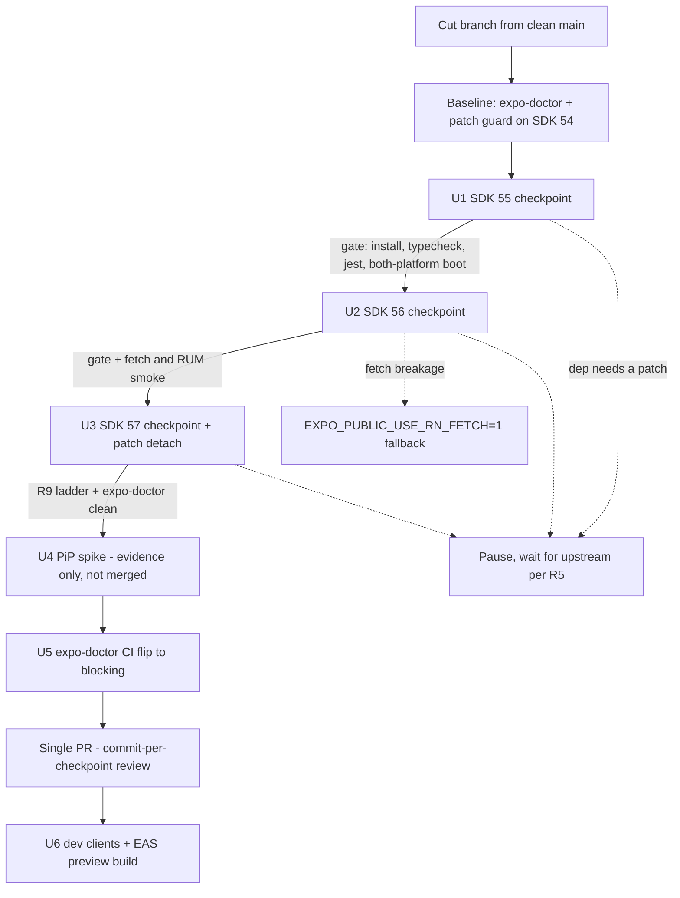

# Mobile Expo SDK 57 Upgrade - Plan

## Goal Capsule

- **Objective:** Move `apps/mobile` from Expo SDK 54 / React Native 0.81.5 to Expo SDK 57 / React Native 0.86 through staged checkpoints. End state: mobile consumes zero pnpm patches, and a spike build proves Android Picture-in-Picture works.
- **Product authority:** This plan owns the platform bump for `apps/mobile` only. The user-facing PiP feature, any `apps/tv` change, and a later SDK 58 bump are not active scope. Requirements own product behavior; Key Technical Decisions own mechanism; repo conventions and user preferences override the plan's landing details.
- **Stop conditions:** Pause and report when a native dependency cannot run on the target SDK without a local patch (per R5), or when a change would alter product scope. Do not publish any EAS update from the branch.
- **Execution profile:** Solo developer. Three checkpoint commits with manual device gates, one throwaway spike, one PR.
- **Open blockers:** None. Both brainstorm-time unknowns are resolved (see Dependencies / Assumptions).

---

## Product Contract

### Summary

Upgrade `apps/mobile` to Expo SDK 57 (React Native 0.86, React 19.2) on one branch with a verified checkpoint commit at each SDK step (55, 56, 57), landing as a single PR. The unit is done when the app runs on SDK 57, no pnpm patch applies to mobile's dependency graph, and a throwaway spike proves Android PiP on the video-details player.

### Problem Frame

Picture-in-Picture is wanted on the video-details player. The PiP API exists on SDK 54, but Android PiP there has known defects: PiP exits immediately after auto-enter from fullscreen, layout breaks on return, and `FullscreenPlayerActivity` / `PictureInPictureHelperFragment` crashes. The fixes shipped across expo-video 55.x and 56.x, so reliable Android PiP needs at least SDK 56.

Two more motivations shape the work. Mobile currently consumes one pnpm patch (`@datadog/mobile-react-native@3.5.2`, a tvOS fix shared with `apps/tv`) and carries a local config-plugin workaround for the background downloader; the user wants mobile off patches as a hygiene matter. And staying near the current React Native release keeps the platform fresh. No external deadline forces this: SDK 54 already satisfies Google Play's API 36 requirement and Apple's Xcode 26 floor. The work is elective and value-driven.

### Key Decisions

- **Target is Expo SDK 57 / RN 0.86, not literal-latest RN 0.87.** RN newer than the Expo pairing has no confirmed support; freshness becomes a cadence — SDK 58 will pair RN 0.87+ and lands cheaply from 57. Governs R1.
- **Staged jump: checkpoint commits, single landing.** Chosen over a one-pass jump (loses per-SDK failure attribution) and over three landed PRs (triple verification cost for intermediate states nobody ships). Governs R2, R3.
- **PiP is proven, not shipped, in this unit.** A spike supplies the evidence; player UX ships as its own ticket. Governs R8.
- **"Zero patches" means mobile stops consuming them.** The `@datadog/mobile-react-native@3.5.2` patch file stays in the repo for `apps/tv`; deleting it is TV's follow-up. Governs R6, R7.
- **Block on upstream rather than patch around a broken dependency.** A new mobile patch would defeat the unit's own goal. Governs R5.
- **The `expo-doctor` CI job becomes blocking in this unit.** Its advisory sunset (2026-05-01) has passed, and a blocking job makes every later SDK bump cheaper. Governs R10.

### Requirements

**Platform bump**

- R1. `apps/mobile` runs Expo SDK 57 with React Native 0.86 and React 19.2. All Expo packages and the toolchain (`jest-expo`, `babel-preset-expo`, `eslint-config-expo`, `@types/react`) move to their SDK 57 releases.
- R2. The branch carries one checkpoint commit per SDK step (55, 56, 57). Each checkpoint passes a clean install, typecheck, the full jest suite, and a boot smoke on both platforms from a freshly built dev client before the next step begins.
- R3. The unit lands as one PR. `apps/tv` pins and all other workspace packages stay unchanged; only the shared lockfile moves.

**Dependency risk and failure posture**

- R4. The three flagged native dependencies are proven working at or before the SDK 56 checkpoint, not at final verification: `@better-auth/expo` sign-in, `@kesha-antonov/react-native-background-downloader`, and `@datadog/mobile-react-native` 3.5.4.
- R5. If a dependency cannot run on the target SDK without a local patch, the work stops and waits for upstream. No new pnpm patch for mobile enters the repo.

**Patch elimination**

- R6. After landing, no `pnpm.patchedDependencies` entry applies to mobile's dependency graph. Mobile's Datadog packages move to 3.5.3 or newer, unpatched. The 3.5.2 entry and patch file remain for `apps/tv`, and the `patched-deps-guard` CI job stays green.
- R7. The local `plugins/withBackgroundDownloaderAppDelegate` plugin is deleted when the installed upstream release places the background-session handler on the real `UIApplicationDelegate`. Otherwise it stays registered after the package's own plugin and is re-verified against the SDK 57 native template.

**PiP proof**

- R8. A throwaway spike on top of the upgrade branch enables expo-video's PiP configuration and proves Android PiP on the video-details player in both layouts — inline and the app's custom fullscreen overlay: enter PiP, background the app, return, and playback continues correctly. Evidence (recording or screenshots) attaches to the PR or the follow-up ticket. The spike configuration does not merge.

**Final verification**

- R9. The SDK 57 checkpoint gets the full ladder on both platforms: sign-in (Apple, Google, email), downloads, watch search, the standard birth-of-jesus playback check, watch-progress recording, Home render, and the sign-in and download sheets. `npx expo-doctor` passes clean.

**CI**

- R10. The `expo-doctor` job in `.github/workflows/ci.yml` becomes blocking: the `continue-on-error` line is removed in this unit.

**Rollout**

- R11. After merge, fresh dev-client builds are produced for both platforms and one EAS preview build is published. No update-cutover handling is needed: no TestFlight or internal-preview build is installed anywhere (user-confirmed 2026-08-13). Production and store builds wait for the beta-program start.

### Key Flows

- F1. Staged upgrade
  - **Trigger:** Branch cut from a clean `main`.
  - **Steps:** (1) SDK 55 checkpoint: align versions, pass the R2 gate, commit. (2) SDK 56 checkpoint: apply the Expo Router fork codemod, bump the Datadog pair to 3.5.4, audit the fetch call sites and Datadog RUM network events, verify the R4 flagged dependencies, pass the gate, commit. (3) SDK 57 checkpoint: final versions, prove the patch detachment, run the R9 ladder, commit. (4) Run the R8 PiP spike in both layouts, capture evidence, then drop the spike. (5) Open the PR; review maps commit-by-commit to SDK steps.
  - **Outcome:** `main` on SDK 57 with a bisectable history; R6 patch state holds; R11 builds follow.
  - **Covers:** R2, R4, R6, R8, R9.

### Acceptance Examples

- AE1. **Covers R7.** Given the installed background-downloader release places the handler on the real `UIApplicationDelegate`, when prebuild runs without the local plugin, then a download survives app suspension and the plugin file is deleted.
- AE2. **Covers R7.** Given upstream has not fixed the handler placement, when the SDK 57 template renders, then the local plugin stays registered after the package plugin and the downloads smoke passes.
- AE3. **Covers R5.** Given a native dependency cannot run on the target SDK without a local patch and no fixed upstream release exists, when its checkpoint hits, then the branch pauses, no pnpm patch is added, and the blocker is reported with the upstream issue link.
- AE4. **Covers R6.** Given mobile moves to Datadog 3.5.3+ while `apps/tv` stays on patched 3.5.2, when CI runs, then `patched-deps-guard` passes and mobile's iOS build no longer applies the patch.
- AE5. **Covers R8.** Given the spike build on an Android device or emulator, when PiP is entered on the details player from the inline layout and from the custom fullscreen overlay (tap or auto-enter on background), then video continues in the PiP window and returning restores the same in-app layout without the SDK 54 defects (immediate exit, broken layout, crash).

### Scope Boundaries

Deferred for later:

- The user-facing PiP feature: player chrome, details-page UX, and shipping the PiP configuration.
- SDK 58 / RN 0.87 — the next cadence bump once Expo pairs it.
- Production and store distribution — starts with the beta program, not this unit.
- `apps/tv` Datadog bump and deletion of the 3.5.2 patch file — TV's own follow-up, blocked on the upstream tvOS fix merging.

Non-goals:

- Any `apps/tv` change in this unit.
  > **Superseded in part, 2026-08-13 (execution-time review finding 1).** Commit `488dcd95f` adds two protective pins to `apps/tv/package.json` (`@expo/metro-runtime ~6.1.2`, `react-native-safe-area-context ~5.6.2`). TV never declared these packages; it borrowed mobile's resolved instances, and mobile's SDK 57 pins re-keyed TV's lockfile graph. The pins restore the exact versions main resolved, serving this non-goal's intent (TV runtime unchanged) by breaking its letter. Residual drift main did not have: `@babel/core` keys 7.29.0 (build-time) and `@expo/dom-webview` / `masked-view` appear as resolved optional peers (inert under TV's SDK 54 classic autolinking). Drop that commit to choose verify-and-accept instead. This note also amends R3, U3's "TV pins verified untouched" gate, the "TV untouched" Verification Contract row, and the DoD's "byte-unchanged" clause: each now reads as "`apps/tv/package.json` carries only the two protective pins; all other TV pins byte-unchanged; `git diff main -- apps/tv` shows only those two lines."
- Feature work riding the upgrade branch; the diff stays platform-only.
- New Architecture work — the app is already New-Architecture-only; SDK 55's mandate is a no-op here.
- Migrating the download engine off `expo-file-system/legacy` — the subpath still exists at SDK 57; migration is separate work.
- Adding component-rendering tests — the jest suite stays logic-only; UI proof stays manual at the gates.

### Dependencies / Assumptions

- The better-auth SDK 56 crash class is closed: it was an Expo Metro regression in expo 56.0.10–56.0.11, fixed in expo 56.0.12. The SDK 56 checkpoint must land on expo ≥ 56.0.12.
- The background-downloader handler bug is verified unfixed at v4.6.1 (plugin source inspected 2026-08-12): its config plugin still inserts the handler on the wrong class. Expect R7's keep-arm; the local plugin's regex-anchored transform must be re-verified against the SDK 57 `AppDelegate.swift` template.
- The Datadog tvOS fix (dd-sdk-reactnative PR #1361) is still unmerged, so the 3.5.2 patch file stays for TV regardless of this unit.
- Mobile file-system code imports eight legacy functions in `apps/mobile/src/lib/offlineFileSystem.ts` plus `readAsStringAsync` in `apps/mobile/src/components/watch/SubtitleOverlay.tsx`, all via `expo-file-system/legacy`. That subpath is still exported by `expo-file-system@57.0.2`, so no migration is forced; the downloads smoke treats this surface as first-class.
- Mobile source has zero direct `@react-navigation/*` imports; the SDK 56 Expo Router fork lands inside `expo-router` plus the provided codemod.
- jest stays on the 29 line at SDK 57; `jest-expo` must be ≥ 57.0.3 (57.0.0 shipped a broken peer pin).
- Xcode: SDK 56 requires 26.4+; the build machine runs 26.5 (verified 2026-08-07). The EAS SDK 57 iOS image resolves automatically (Xcode 26.6).
- `eas.json`'s CLI floor (`>= 16.0.0`) is stale but functional; bump opportunistically, not as scope.
- Whether a mobile-only lockfile diff marks `@forge/tv` affected in CI is unverified; observe on the first checkpoint push. TV CI cost is acceptable if it triggers.
- The target stays SDK 57 even if SDK 58 ships mid-unit; the cadence bump is separate work.

### Outstanding Questions

Deferred to implementation:

1. Exact SDK-aligned versions for the non-Expo natives come from `npx expo install --fix` at each checkpoint. The SDK 57 bundled targets recorded in KTD1 are the expected answers, not constraints.

<!-- ce-section: work-relationships -->

### How This Work Fits Together

This plan owns the `apps/mobile` platform bump. The surrounding breakdown is the current understanding, not a committed roadmap.

- Enables: the PiP user feature on the video-details player — its own ticket, blocked on this landing.
- Enables: the SDK 58 / RN 0.87 cadence bump — cheap from 57, picked up when Expo pairs it.
- Shares: Datadog version findings with a possible `apps/tv` bump. The upstream tvOS fix (dd-sdk-reactnative PR #1361) is still open, so TV keeps the 3.5.2 patch for now. Still to decide: whether TV bumps once the fix merges.
- Can proceed independently of: current mobile feature work; `main` is clean and no branch overlaps.

### Sources / Research

- Expo changelogs: [SDK 55](https://expo.dev/changelog/sdk-55), [SDK 56](https://expo.dev/changelog/sdk-56), [SDK 57](https://expo.dev/changelog/sdk-57). SDK 57 pins RN 0.86 / React 19.2 and ships no user-facing breaking changes.
- [React Native 0.87 release post](https://reactnative.dev/blog/2026/08/11/react-native-0.87) — released 2026-08-11; ahead of every Expo pairing, which drove the R1 target decision.
- expo-video changelog (expo/expo repo, `packages/expo-video/CHANGELOG.md`) — Android PiP fixes in 55.0.10, 56.0.0, and 56.1.0; the basis for "reliable PiP needs at least SDK 56".
- [better-auth issue #10028](https://github.com/better-auth/better-auth/issues/10028) — closed 2026-06-15 as upstream; root cause fixed in expo 56.0.12 via [expo/expo#46870](https://github.com/expo/expo/pull/46870).
- Background-downloader plugin source at the v4.6.1 tag — the handler still lands on the wrong class; basis for the R7 keep-arm expectation.
- [expo/expo#45668](https://github.com/expo/expo/issues/45668) — open Android `FullscreenPlayerActivity` crash near the fullscreen/PiP path; a named risk for the U4 spike.
- [Expo Router SDK 55→56 migration guide](https://docs.expo.dev/router/migrate/sdk-55-to-56/) — the codemod named in U2; a known report says it misses ~25% of import sites, so U2 grep-verifies after running it.
- `packages/expo/bundledNativeModules.json` on the expo `sdk-57` branch — the version targets in KTD1.
- Repo anchors: `apps/mobile/app.json` (plugin order, `runtimeVersion.policy: sdkVersion`), root `package.json` (`pnpm.patchedDependencies`), `scripts/check-patched-deps.mjs` (guard checks patch keys against all lockfile-resolved versions), `.github/workflows/ci.yml` (`expo-doctor` job at lines ~256-275), `apps/mobile/metro.config.js` (custom `resolveRequest` singleton pins), `apps/mobile/src/components/watch/VideoPlayer.tsx` (the PiP spike target; custom fullscreen overlay).
- Institutional learnings to read before starting: `docs/solutions/build-errors/expo-doctor-sdk54-health-checks-mobile-v2-20260409.md`, `docs/solutions/developer-experience/metro-watchfolders-monorepo-refresh-storm-20260415.md`, `docs/solutions/best-practices/bottom-sheet-migration-expo-sdk54-pitfalls-20260527.md`, `docs/solutions/runtime-errors/metro-node-crawler-rangerror-missing-watchman-20260622.md`, `docs/solutions/integration-issues/datadog-mobile-rum-tvos-integration.md`.

---

## Planning Contract

Product Contract preservation: restructured, no scope change — R2 tightened to a both-platform fresh-build gate and R8/AE5 widened to cover both player layouts (user-approved 2026-08-13); AE3's subject genericized from better-auth to any native dependency; R11's zero-installs assumption widened to also cover the internal-preview channel (user-confirmed); brainstorm Outstanding Questions 1–2 resolved in place by research.

### Key Technical Decisions

- KTD1. **Align versions with `npx expo install` / `expo install --fix` at every checkpoint; never bare `pnpm add` for Expo-ecosystem packages.** `expo install` consults the SDK compatibility matrix; bare adds caused the SDK 54 doctor failures on record. Expected SDK 57 targets: `react-native` 0.86.2, `react` 19.2.3, `react-native-screens` ~4.26.0, `react-native-safe-area-context` ~5.7.0, `react-native-webview` 13.16.1, `@react-native-async-storage/async-storage` 2.2.0, `jest-expo` ≥ 57.0.3, `@datadog/mobile-react-native` + session-replay 3.5.4, `@react-native-google-signin/google-signin` unchanged at 16.1.4.
- KTD2. **Checkpoint gate = fresh native builds on both platforms.** (session-settled: user-approved — chosen over the contract's earlier one-simulator-boot gate: with ~24 native packages, a single-platform boot loses the per-SDK failure attribution the staging exists for.) Governs the mechanics of R2: delete the stale local `ios/`/`android/` dirs, run `npx expo run:ios` and `npx expo run:android` from a clean prebuild, then typecheck, jest, and a boot smoke that covers the sign-in/download sheets, the `[admin-endpoint]` startup line, and the production-admin refusal check (point the dev build at the production admin host, confirm it refuses to start, restore the local endpoint — the failure mode is silent, so every checkpoint repeats it). Weight effort at 55 and 56; 57 is characterized upstream as breaking-change-free.
- KTD3. **Ride SDK 56's `expo/fetch` default; do not preemptively opt out.** (session-settled: user-approved — chosen over pre-setting the RN-fetch fallback: stay on the supported path.) Smoke the six fetch call sites (`src/lib/apolloClient.ts`, `src/lib/authSession.ts`, `src/lib/authActions.ts`, `src/hooks/useVideoThumbnails.ts`, `src/hooks/useBibleVerses.ts`, `src/components/watch/SubtitleOverlay.tsx`) and confirm Datadog RUM resource events still populate at the 56 checkpoint — the new fetch bypasses XHR, which is the exact mechanism that broke Sentry's instrumentation. `EXPO_PUBLIC_USE_RN_FETCH=1` is the sanctioned fallback if something breaks: env-level, no patch, honors R5. Activating it is a two-place action — set it for the dev loop AND in the EAS `preview` environment (EAS builds read EAS Environments, not local env files), and document it in `apps/mobile/.env.example` — so a shipped build runs the same fetch path the checkpoints verified. Watch `useBibleVerses`' `cache: "force-cache"` option — native fetch may start honoring it.
- KTD4. **Patch detachment is a mobile-only Datadog bump to 3.5.4, landed at the SDK 56 checkpoint.** Bumping at U2 exercises the flagged dependency before R4's deadline; U3 proves the result. The `patched-deps-guard` stays green because it checks patch keys against all lockfile-resolved versions and TV keeps 3.5.2 resolved (`scripts/check-patched-deps.mjs`). The guard is repo-wide, so U3 adds a mobile-scoped proof: `pnpm why @datadog/mobile-react-native --filter @forge/mobile` must show only 3.5.4.
- KTD5. **Keep the local AppDelegate plugin.** Upstream v4.6.1 verified unfixed (Governs the R7 keep-arm). Re-verify the plugin's transform output in the generated `AppDelegate.swift` at the 57 checkpoint, and prove behavior with a real backgrounded download (start, background the app, return, completion lands).
- KTD6. **Rollback is `git revert` of the merged PR.** No installed runtime users exist, and `eas update:rollback` cannot undo a native/runtime change. No EAS update is published from the branch.

### High-Level Technical Design

---

## Implementation Units

### U1. SDK 55 checkpoint

- **Goal:** `apps/mobile` runs Expo SDK 55 (RN 0.83, React 19.2) with a green gate.
- **Requirements:** R1, R2, R3, R5.
- **Dependencies:** None.
- **Files:** `apps/mobile/package.json`, `pnpm-lock.yaml`, `apps/mobile/app.json` (remove `newArchEnabled`).
- **Approach:**
  1. Baseline before any bump: run `npx expo-doctor` in `apps/mobile` and `node scripts/check-patched-deps.mjs` on SDK 54, so later failures are attributable to the bump (per KTD2's clean-start rule).
  2. `npx expo install expo@^55` then `npx expo install --fix` (KTD1).
  3. Remove the `newArchEnabled` key from `app.json` — SDK 55 deletes the flag; the app is already New-Architecture-only.
  4. Move `jest-expo`, `babel-preset-expo`, `eslint-config-expo`, `@types/react` to their 55-line releases. `eslint-config-expo` is unwired (no local eslint config consumes it) — version-only, expect no lint change.
  5. Confirm `apps/mobile/metro.config.js` customizations still compose: spread `watchFolders`, the `resolveRequest` singleton pins, and the `cjs` source extension.
  6. Run the KTD2 gate.
- **Patterns to follow:** `docs/solutions/build-errors/expo-doctor-sdk54-health-checks-mobile-v2-20260409.md` (expo install discipline), `docs/solutions/developer-experience/metro-watchfolders-monorepo-refresh-storm-20260415.md`.
- **Test scenarios:**
  - Full jest suite passes unchanged (the suite is logic-only; no snapshot churn expected at 55).
  - Boot smoke on both platforms: Home renders, hero plays, sign-in sheet and a download sheet present correctly (`react-native-screens` jumps toward 4.2x here).
  - The `[admin-endpoint]` startup line prints and the dev-refusal guard still fires when pointed at production admin (import-order fragility check).
- **Verification:** KTD2 gate green; checkpoint commit created; `node scripts/check-patched-deps.mjs` passes.
- **Execution note:** Smoke-first unit; no new unit tests expected. If any dependency fails to build, stop per R5/AE3 — do not patch.

### U2. SDK 56 checkpoint

- **Goal:** `apps/mobile` runs Expo SDK 56 (RN 0.85, React 19.2) with the router fork and fetch flip absorbed.
- **Requirements:** R1, R2, R4, R5.
- **Dependencies:** U1.
- **Files:** `apps/mobile/package.json`, `pnpm-lock.yaml`; app code only if the codemod rewrites imports (expected: none).
- **Approach:**
  1. `npx expo install expo@^56` then `--fix`; the resolved expo version must be ≥ 56.0.12 (the Metro dynamic-import fix).
  2. Run `npx expo-codemod sdk-56-expo-router-react-navigation-replace`, then grep for `@react-navigation` — the codemod misses ~25% of sites in reports; mobile expects zero direct imports either way.
  3. Bump `@datadog/mobile-react-native` and `@datadog/mobile-react-native-session-replay` to 3.5.4 — mobile only; `apps/tv` pins stay byte-identical (KTD4). Landing the bump here puts the flagged dependency on-device before R4's deadline, and the RUM check below runs on the final version.
  4. Fetch audit per KTD3: exercise sign-in (better-auth `$fetch`), an Apollo query and mutation, thumbnails, Bible verses, and subtitle load.
  5. Datadog RUM check per KTD3: confirm resource/network events for the smoke session appear in the dev Datadog org.
  6. Run the KTD2 gate, including a downloads sanity pass (background-session handler still relocated by the local plugin).
- **Patterns to follow:** KTD3's fallback discipline; `apps/mobile/CLAUDE.md` Observability section for RUM verification.
- **Test scenarios:**
  - Sign-in with each provider path available in dev completes and a session persists across an app restart.
  - One Apollo query (Home) and one mutation (watch-progress write) round-trip against local admin.
  - Datadog RUM shows resource events from the session (not only views/actions) — the XHR-bypass check.
  - A download started in foreground completes after backgrounding and returning.
  - jest suite green; expect possible babel/transform churn at this checkpoint per the jest-expo 56.x changelog — resolve config, do not weaken tests.
  - The dev-refusal guard still fires when pointed at production admin — this checkpoint is where the transform churn that could break it lands (per KTD2's gate).
- **Verification:** KTD2 gate green; checkpoint commit created. If fetch behavior breaks and `EXPO_PUBLIC_USE_RN_FETCH=1` is used, record it in the PR and in this plan's KTD3 as the active posture, and set it in the EAS `preview` environment in the same action (KTD3's two-place rule).
- **Execution note:** This is the highest-risk checkpoint; budget verification time here, not at 57.

### U3. SDK 57 checkpoint and patch detachment

- **Goal:** `apps/mobile` runs Expo SDK 57 (RN 0.86.2, React 19.2.3), consumes zero pnpm patches, and passes the full ladder.
- **Requirements:** R1, R2, R4, R6, R7, R9.
- **Dependencies:** U2.
- **Files:** `apps/mobile/package.json`, `pnpm-lock.yaml`, `apps/mobile/plugins/withBackgroundDownloaderAppDelegate.test.js` (fixture refresh), `apps/mobile/CLAUDE.md` (stack line: SDK 54 → 57).
- **Approach:**
  1. `npx expo install expo@^57` then `--fix`; pin `jest-expo` ≥ 57.0.3 (KTD1).
  2. Prove patch detachment (the Datadog pair moved to 3.5.4 at U2): `node scripts/check-patched-deps.mjs` green AND `pnpm why @datadog/mobile-react-native --filter @forge/mobile` shows only 3.5.4 (Covers AE4).
  3. Check the resolved `@kesha-antonov/react-native-background-downloader` release's config-plugin source — the `^4.5.5` range can resolve past the audited 4.6.1. If the handler now lands on the real `UIApplicationDelegate`, take AE1's delete arm: remove `./plugins/withBackgroundDownloaderAppDelegate` from `app.json`, delete the plugin and its test, and prove a backgrounded download still completes.
  4. Otherwise (keep arm): re-verify the local plugin's output in the freshly generated `AppDelegate.swift`, and regenerate the plugin test's `AppDelegate.swift` fixture from the SDK 57 prebuild output so the jest gate asserts against the template the app actually builds on (KTD5, Covers AE2).
  5. Run the full R9 ladder on both platforms, including the replay-masking check: open the Account screen signed in, then confirm in the dev Datadog org that the recorded session replay shows the identity block masked. `npx expo-doctor` clean in `apps/mobile`.
  6. Update the `apps/mobile/CLAUDE.md` stack line.
- **Patterns to follow:** KTD1 version targets; `docs/solutions/best-practices/bottom-sheet-migration-expo-sdk54-pitfalls-20260527.md` for the downloads/share smoke shape.
- **Test scenarios:**
  - R9 ladder, both platforms: sign-in (Apple, Google, email), watch search, birth-of-jesus playback, watch-progress recording visible on a card bar, Home render, sign-in/download sheets.
  - Covers AE2: download started, app backgrounded, completion lands after return.
  - Covers AE4: guard green with TV on patched 3.5.2 while mobile resolves only 3.5.4.
  - Datadog RUM session from the ladder appears with resource events and correct app version.
  - Session replay from the ladder shows the Account screen's identity block masked (the masking wrapper survived the replay-SDK and RN view-layer bumps).
  - The dev-refusal guard still fires when pointed at production admin (final repeat of the per-checkpoint check).
- **Verification:** Ladder green; doctor clean; checkpoint commit created; TV pins verified untouched (`git diff main -- apps/tv` empty; amended 2026-08-13 — see the Non-goals supersession note: the diff now shows exactly the two protective pins).
- **Execution note:** Prefer runtime smoke evidence over new unit coverage; the diff should stay dependency-and-config only.

### U4. Android PiP spike (throwaway)

- **Goal:** Evidence that Android PiP works on the video-details player at SDK 57, in both layouts.
- **Requirements:** R8.
- **Dependencies:** U3.
- **Files (spike-only, never merged):** `apps/mobile/app.json` (expo-video plugin gains `supportsPictureInPicture: true`), optionally `apps/mobile/src/components/watch/VideoPlayer.tsx` (`startsPictureInPictureAutomatically` to test auto-enter).
- **Approach:**
  1. On a spike branch off the U3 checkpoint, add the config flag and rebuild the Android dev client.
  2. On an Android device or emulator: enter PiP from the inline layout and from the custom fullscreen overlay (`VideoPlayer.tsx`'s JS-driven fullscreen, not native fullscreen); also test auto-enter on background, and record the series-detail trailer surface (it renders the same shared player).
  3. Return from PiP each time; confirm layout restores (the SDK 54 defect classes) and watch for the still-open `FullscreenPlayerActivity` crash (expo/expo#45668).
  4. Record a screen capture covering both entry states; attach to the PR and the PiP follow-up ticket; drop the spike commits.
- **Test scenarios:**
  - Covers AE5: PiP entry, background, return — both layouts, no immediate-exit, no broken layout, no crash.
  - Blast-radius check: `allowsPictureInPicture` sits on the shared `src/components/watch/VideoPlayer.tsx`, which backs both the video-details page and the series-detail trailer — record the trailer's PiP behavior so the follow-up ticket inherits the true surface set. The Home and section heroes use bare `VideoView` without the prop and must stay PiP-ineligible.
- **Verification:** Evidence file attached; `git log` of the PR shows no spike commits.
- **Test expectation:** none beyond the recorded evidence — spike code is discarded.

### U5. Flip expo-doctor CI to blocking

- **Goal:** `expo-doctor` failures block CI for mobile-affecting PRs.
- **Requirements:** R10.
- **Dependencies:** U3 (doctor must be clean at 57 first).
- **Files:** `.github/workflows/ci.yml`.
- **Approach:**
  1. Check whether a newer `expo-doctor` release than the pinned 1.18.17 exists with SDK 57 awareness; bump the `npx expo-doctor@<version>` pin if so.
  2. Remove the `continue-on-error: true` line from the `expo-doctor` job.
- **Test scenarios:** `Test expectation: none — CI configuration change; proof is the job turning required and green on this PR.`
- **Verification:** The upgrade PR's own CI run shows `expo-doctor` as a blocking, passing job.

### U6. Rollout: builds and publish

- **Goal:** The team can run SDK 57 builds; the preview channel serves the new runtime.
- **Requirements:** R11.
- **Dependencies:** U3, U5 (post-merge).
- **Files:** None — operational.
- **Approach:**
  1. Build fresh dev clients for both platforms from `main`.
  2. Run one EAS preview build (`preview` profile; image resolves automatically to the SDK 57 stack).
  3. Publish one `pnpm --filter @forge/mobile update:preview` and confirm the new build receives it (runtime 57).
  4. Confirm the Datadog sourcemap upload ran in the EAS build logs (`eas-build-on-success.sh`).
  5. Confirm fetch-posture parity: if KTD3's fallback was activated, `EXPO_PUBLIC_USE_RN_FETCH=1` is present in the EAS `preview` environment, so the preview build runs the fetch path the checkpoints verified.
  6. The PR description carries the teammate note: rebuild dev clients from a fresh `pnpm install`; stale SDK 54 clients cannot run this branch.
- **Test scenarios:** `Test expectation: none — operational unit; proof is the preview build booting on a device with RUM events flowing.`
- **Verification:** Preview build installs and boots; update lands on it; sourcemaps uploaded; fetch posture matches the checkpoints.

---

## Verification Contract

| Gate               | Command / check                                                                                                                               | Applies                                                  |
| ------------------ | --------------------------------------------------------------------------------------------------------------------------------------------- | -------------------------------------------------------- |
| Typecheck          | `pnpm --filter @forge/mobile typecheck`                                                                                                       | Every checkpoint (U1–U3)                                 |
| Unit tests         | `pnpm --filter @forge/mobile test`                                                                                                            | Every checkpoint (U1–U3)                                 |
| Lint               | `pnpm --filter @forge/mobile lint`                                                                                                            | Every checkpoint (U1–U3)                                 |
| Expo doctor        | `npx expo-doctor` from `apps/mobile`                                                                                                          | Baseline before U1; clean at U3; blocking in CI after U5 |
| Patch guard        | `node scripts/check-patched-deps.mjs`                                                                                                         | Baseline and after every dependency bump                 |
| Mobile patch scope | `pnpm why @datadog/mobile-react-native --filter @forge/mobile`                                                                                | U3 — must show only 3.5.4                                |
| Native boot        | `npx expo run:ios` and `npx expo run:android` from a clean prebuild (stale `ios/`/`android/` deleted first)                                   | Every checkpoint (KTD2)                                  |
| Device ladder      | R9 list, both platforms                                                                                                                       | U3                                                       |
| Replay masking     | Signed-in Account screen recorded; replay in the dev Datadog org shows the identity block masked                                              | U3                                                       |
| Admin refusal      | Dev build pointed at production admin refuses to start; local endpoint restored after                                                         | Every checkpoint (KTD2)                                  |
| PiP evidence       | Screen recording, both layouts, Android                                                                                                       | U4                                                       |
| TV untouched       | `git diff main -- apps/tv` shows only the two protective pins (amended 2026-08-13, see Non-goals note); TV CI green if the matrix triggers it | PR                                                       |

Watchman must be installed on the dev machine before any Metro-based verification (`docs/solutions/runtime-errors/metro-node-crawler-rangerror-missing-watchman-20260622.md`).

---

## Definition of Done

- `apps/mobile/package.json` pins Expo SDK 57 / RN 0.86.x / React 19.2.x; every checkpoint commit is present and gated.
- No `pnpm.patchedDependencies` entry applies to mobile's graph; the mobile-scoped `pnpm why` proof is recorded; the 3.5.2 patch file is byte-unchanged, and `apps/tv/package.json` carries only the two protective pins (amended 2026-08-13, see Non-goals note).
- PiP evidence covering both layouts is attached to the PR or follow-up ticket; no spike commit is merged.
- The `expo-doctor` CI job is blocking and green; the full R9 ladder passed on both platforms.
- `apps/mobile/CLAUDE.md` stack line names SDK 57.
- Fresh dev clients exist for both platforms; one EAS preview build is published and receives an update; Datadog sourcemaps uploaded.
- No EAS update was published from the branch before merge.
- Abandoned experiments and dead-end diffs are removed; the PR contains only the checkpoint, CI, and doc changes.
