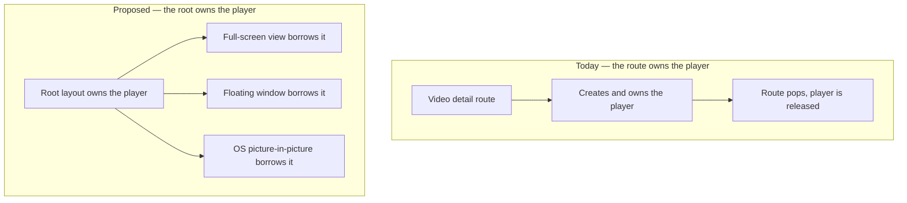
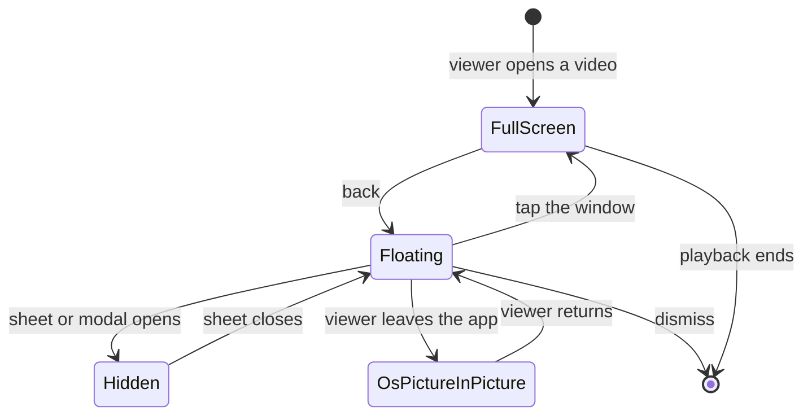

# Mobile Mini Player - Plan

## Goal Capsule

- **Objective.** Give `apps/mobile` a floating mini player that keeps a video playing while the viewer browses the rest of the app, and enable operating-system picture-in-picture so playback also survives leaving the app.
- **Product authority.** A leadership feature request, relayed by the owner of `apps/mobile`. The reference behaviour is the YouTube app's mini player.
- **Open blockers.** An Expo SDK upgrade from 54 to 57 is a hard prerequisite and has no ticket yet. Implementation does not start until it lands, and every SDK-dependent claim below is re-derived against the upgraded packages first.

---

## Product Contract

### Summary

Pressing back from a video shrinks the player into a small floating window that keeps playing while the viewer browses. The window can be dragged to any corner, expanded back to the full screen, or dismissed. Native picture-in-picture ships in the same release, so playback also continues when the viewer leaves the app.

### Problem Frame

Today a video ends the moment the viewer leaves it. The player is created inside the route, so popping the route destroys the player, the watch session, and the position. A viewer who wants to look for the next thing while a talk plays has to choose between the two.

The request arrived from leadership rather than from a support ticket, an analytics signal, or an observed session. No user-side evidence was produced for it, and none was found in the repo. That does not make it wrong, but it does mean the definition of success is "leadership recognises the YouTube behaviour", not a measured improvement.

The request also carried a second half — that backing out should return the viewer to the previous screen at the scroll position and search state they left. Device verification showed that already happens. That half is closed, and the work below is only the playback half.

### Key Decisions

- KD1. **The mini player is an in-app floating window, not the operating system's picture-in-picture window.** (session-settled: user-directed — chosen over a docked bottom bar, an audio-only resume bar, and native picture-in-picture alone: the OS window has no positioning API on either platform, and on Android it shrinks the whole activity and blanks the app's UI, so there is no app left to browse.) Governs R1, R2, R3.
- KD2. **One player is owned above the screens; the full view and the floating window both borrow it.** (session-settled: user-directed — chosen over turning the video screen into a root overlay, and over seeding a second player at the departing timestamp, which re-buffers and produces an audible gap.) Governs R1, R4, R16, R17.
- KD3. **The mini player wins the decoder; Home's hero yields to it.** (session-settled: user-directed — chosen over rendering both surfaces, hiding the window on Home, and retiring hero autoplay outright.) Governs R9, R10.
- KD4. **The whole feature is sequenced behind an Expo SDK upgrade to 57, after which picture-in-picture ships alongside the mini player.** (session-settled: user-directed — chosen over shipping the mini player plus iOS picture-in-picture now as an EAS Update, over shipping both on SDK 54 with known Android defects, and over carrying a pnpm patch: four Android picture-in-picture fixes exist only on the SDK 55 line and have no backport route to SDK 54.) Governs R13, R14, R15.
- KD5. **Back-navigation state restoration is out of scope because it already works.** Verified on device: the tab screens are never unmounted on a push, so their state was never lost. See Sources.

The change KD2 describes is where the player instance lives:

### Requirements

**The mini player**

- R1. Pressing back from a video detail screen shrinks the player into a floating window, and playback continues without a pause, a gap, or a black frame.
- R2. The viewer can drag the window, which settles into one of the four screen corners.
- R3. The window persists across tab changes and further route pushes until the viewer dismisses it.
- R4. Tapping the window returns to the full video screen at the position playback has reached.
- R5. The window carries a play-pause control and a dismiss control.
- R6. Dismissing the window stops playback and removes the window.
- R7. The window can always be moved off content the viewer needs, and it never covers a tab bar tap target.
- R8. Assistive technology can reach, describe, and dismiss the window, and the window does not trap focus.

**Coexistence with the rest of the app**

- R9. Home's hero shows its poster and stays silent while the window is active, and resumes its normal behaviour once the window is gone.
- R10. Exactly one video decoder is live at any moment.
- R11. The window hides while a sheet or modal is presented, and returns when that sheet closes.
- R12. Starting a different video replaces what the window is playing.

**Native picture-in-picture**

- R13. Playback continues in the operating system's picture-in-picture window when the viewer leaves the app, superseding the app's existing pause-on-background rule for that video.
- R14. The native-control surfaces already present on `apps/mobile/app/video/[sectionKey].tsx` and `apps/mobile/app/collection/[sectionKey].tsx` behave consistently with R13 on both platforms.
- R15. Android never presents a picture-in-picture affordance the app manifest cannot honour.

**Playback bookkeeping**

- R16. Watch progress flushes against the video the viewer actually left, on an explicit signal rather than on component teardown.
- R17. Playback-quality telemetry attributes a session to the video that produced it, and reports abandonment only when the viewer abandoned it.

**Degradation and exclusions**

- R18. Where a device cannot render live video inside the floating window, the window shows the video's poster and audio continues.
- R19. Video embedded in an SDUI experience page is excluded from the mini player and behaves exactly as it does today.
- R20. Downloaded playback and series episodes use the mini player like any other video.

The states the window moves through, and what carries playback in each:

### Key Flows

- F1. Shrink to the window
  - **Trigger:** The viewer presses back on a video detail screen while a video is loaded.
  - **Steps:** The full-size view releases the video surface, the floating window takes it in the same commit, the previous screen appears beneath at the state the viewer left it, and Home's hero yields if the viewer lands on Home.
  - **Outcome:** Playback has not stopped, restarted, or stalled.
  - **Covered by:** R1, R9, R10.
- F2. Return to the full screen
  - **Trigger:** The viewer taps the floating window.
  - **Steps:** The video detail screen for that video opens, the full-size view takes the video surface, and the window disappears.
  - **Outcome:** Playback continues from the position it had reached, and Home's hero returns to normal.
  - **Covered by:** R4, R9.
- F3. Leave the app
  - **Trigger:** The viewer backgrounds the app while the floating window or the full screen is playing.
  - **Steps:** Playback moves into the operating system's picture-in-picture window.
  - **Outcome:** Playback continues outside the app, and returning to the app restores the state the viewer left.
  - **Covered by:** R13, R14, R15.
- F4. Dismiss
  - **Trigger:** The viewer activates the window's dismiss control.
  - **Steps:** Playback stops, watch progress flushes for that video, telemetry closes the session, and the window is removed.
  - **Outcome:** The app is in the same state as if the viewer had never opened the video, except that progress is recorded.
  - **Covered by:** R6, R16, R17.

### Acceptance Examples

- AE1. Back onto Home while the hero is playing
  - **Covers R1, R9, R10.**
  - **Given** a video is playing and Home's hero was autoplaying before the viewer opened it,
  - **When** the viewer presses back,
  - **Then** the floating window keeps the video playing, the hero shows its poster and makes no sound, and no second decoder is live.
- AE2. Back onto an active search
  - **Covers R1, R3.**
  - **Given** the viewer reached the video from Discover with a query typed and results on screen,
  - **When** the viewer presses back,
  - **Then** the query, the results, and the list position are unchanged, and the window plays over them.
- AE3. A second video is started
  - **Covers R12.**
  - **Given** the window is playing video A,
  - **When** the viewer opens video B,
  - **Then** video A stops and its progress is recorded, and the session becomes video B.
- AE4. A sheet opens over the window
  - **Covers R11.**
  - **Given** the window is active,
  - **When** a sheet is presented — sign-in, language, subtitle, download, or delete confirmation —
  - **Then** the window is not visible over the sheet and does not paint through it, and it returns when the sheet closes.
- AE5. The viewer leaves the app
  - **Covers R13.**
  - **Given** the window is playing,
  - **When** the viewer goes to the device home screen,
  - **Then** playback continues in the operating system's picture-in-picture window.
- AE6. A device that cannot render live video in the window
  - **Covers R18.**
  - **Given** a device that cannot present a second video surface,
  - **When** the viewer presses back,
  - **Then** the window shows the video's poster, audio continues without interruption, and nothing renders as a black rectangle.
- AE7. Video inside an experience page
  - **Covers R19.**
  - **Given** the viewer is playing a video embedded in an SDUI experience page,
  - **When** the viewer navigates away,
  - **Then** no window appears and the app behaves exactly as it does today.
- AE8. A downloaded video
  - **Covers R20.**
  - **Given** the viewer is playing a downloaded video with the device offline,
  - **When** the viewer presses back,
  - **Then** the window keeps the local file playing and dismissal records progress exactly as it does for a streamed video.
- AE9. Dismissal records what was watched
  - **Covers R6, R16, R17.**
  - **Given** the window has been playing for several minutes,
  - **When** the viewer dismisses it,
  - **Then** watch progress for that video is recorded at the position reached, and the quality session is attributed to that video.

### Success Criteria

- Leadership can be shown the YouTube behaviour on a real device on both platforms.
- The full-to-floating transition shows no video gap, stall, or black frame on either platform.
- Watch-progress and quality-telemetry records for a session that ends through the floating window match what the same session produces today.

### Scope Boundaries

- Preserving scroll position and search state across back-navigation. Verified working on device; see Sources.
- A docked bottom bar as the shipping form. Considered and rejected in favour of the floating window.
- Adopting `apps/mobile/src/components/watch/MiniPlayerBar.tsx`. It is a full-width docked bar with a poster thumbnail and no video surface, no drag, and no dismiss control — the shape this work rejected — and it has no import sites. It is deleted as part of this work, after its fade-then-unmount pattern and its accessibility labels are carried across.
- Changing fullscreen playback. Back from fullscreen exits fullscreen to the video screen, as it does today; the floating window arises only from a back press on that screen.
- A queue or Up Next redesign. The floating window is a natural home for one later; it is not this work.
- A continue-watching shelf on Home. Previously ruled out for this app and unchanged here.

### Dependencies / Assumptions

- The request has no user-observed evidence behind it. Success is recognition of the reference behaviour, not a measured metric.
- The reference is the YouTube app's current mini player, which has been a floating, draggable window since May 2025. Documentation describing a bottom-docked bar describes the older design.
- The Expo SDK upgrade is the prerequisite, and it is a monorepo decision. `apps/mobile` and `apps/tv` both run SDK 54; current is 57.0.12. Expo supports one SDK step at a time, so the route is 54 → 55 → 56 → 57 with verification at each step. `react-native-tvos` publishes through `0.86-stable`, so the fork does not gate the upgrade.
- The two committed pnpm patches are version-keyed and must be re-created per React Native version: `react-native-tvos@0.81.5-2` and `@datadog/mobile-react-native@3.5.2`. pnpm only warns on a stale patch key, so a missed re-key drops the fix silently.
- Four Android picture-in-picture fixes exist only on the SDK 55 line and drove KD4: a crash when exiting picture-in-picture with more than one video view present, `onFirstFrameRender` firing when a player moves to a new view, and two picture-in-picture exit layout fixes. Two video views plus picture-in-picture is exactly this design, and the first-frame signal is what drops the poster after a handoff.
- Only Android needs a native config change for picture-in-picture, not both platforms. The expo-video config plugin enables iOS background audio when either `supportsBackgroundPlayback` or `supportsPictureInPicture` is set, and `supportsBackgroundPlayback: true` is already set, so the flag produces a byte-identical iOS `Info.plist`.
- Android additionally requires `smallestScreenSize` in the main activity's `configChanges`, or the activity relaunches on every picture-in-picture transition. The Expo template omits it and the expo-video plugin does not add it, so a local config plugin is needed. `apps/mobile/plugins/withBackgroundDownloaderAppDelegate.js` is the in-repo precedent.
- Picture-in-picture cannot be verified on an iPhone simulator. Verification needs an iPad simulator or physical hardware on both platforms.
- Android cannot mount two video views against one player, so the full-to-floating transition is a single handoff rather than a cross-fade.
- Neither `react-native-reanimated` nor `react-native-gesture-handler` is available to app source, and repo convention forbids adding the latter. The drag runs on the primitives the app already uses.
- Android renders the video surface above all other views, so the window's own controls and any modal above it need explicit handling.
- Three surfaces set `allowsPictureInPicture` today, not two: `apps/mobile/src/components/watch/VideoPlayer.tsx`, `apps/mobile/app/video/[sectionKey].tsx`, and `apps/mobile/app/collection/[sectionKey].tsx`. The first is inert because it disables native controls; the other two expose a picture-in-picture button on iOS in production. All three arrived with the app's original scaffold rather than from a feature decision, so R14 closes the gap deliberately rather than treating it as existing intent.
- Home hero playback is excluded from the mini player by construction, not by rule: heroes never reach the player adapter, so no requirement is needed to keep them out.
- Downloaded playback runs on local files keyed by slug rather than the streaming path, so R20 carries more risk than the other included classes.
- No roadmap ticket exists for this work. The next available identifier is `feat-357`.

### Outstanding Questions

**Resolve Before Planning**

1. The Expo SDK upgrade to 57 has no ticket. It is the prerequisite for this work per KD4, and it owns its own risk budget, its own regression pass, and the decision about whether `apps/tv` moves with `apps/mobile` or after it.
2. Every SDK-dependent claim in this document was derived against SDK 54 and expo-video 3.0.16. Re-derive them on the upgraded packages before implementation — in particular the Android video-surface constraints, the picture-in-picture API surface, and the poster-handoff mechanism, all of which the four Android fixes change.

**Deferred to Planning**

- How the watch-progress flush and the quality-telemetry finalize are re-keyed away from component teardown.
- How the per-video reset inside the watch session becomes explicit once the player outlives the route.
- Whether the floating view needs a different video surface type on Android, and how device capability is detected for R18.
- Drag physics, corner-snap thresholds, and the window's size.
- Whether the operating-system picture-in-picture window and the floating window can both be reachable without producing two competing mental models.

### Sources / Research

- Device verification, iPhone 17 simulator against local admin, 2026-08-12: Home scrolled past the LUMO shelf, pushed a video, popped back — scroll position pixel-identical. Discover with the query `forgiveness`, results scrolled, pushed a result, popped back — query, results, and list position all pixel-identical. This is the basis for KD5.
- `apps/mobile/app/_layout.tsx` — the root stack hosts the tabs group as a sibling of the detail routes, which is why the tab screens are never unmounted on a push.
- `apps/mobile/app/(tabs)/watch.tsx` — Discover's query, results, and paging cursors are screen-local state that survives because the screen survives.
- `apps/mobile/src/hooks/useManagedVideoPlayer.ts` — three behaviours are coupled to component teardown: player pause, the watch-progress flush, and the quality-telemetry finalize that reports abandonment. These are what R16 and R17 re-key.
- `apps/mobile/src/components/home/HomeHeroPager.tsx` — the app already hands one player between pages, which is the pattern KD2 generalises.
- `apps/mobile/app.json` — the video plugin sets background playback and carries no picture-in-picture key; the Android block has no picture-in-picture manifest configuration.
- `apps/mobile/src/components/watch/Scrubber.tsx` — the existing precedent for a drag gesture built without a gesture library, and the in-code record of why one is not available.
- Commits `dadb71a8d` (the original SDUI app) and `1da19c00c` (the collection player) introduced the picture-in-picture and native-control properties. Neither commit is about picture-in-picture, which is the basis for treating them as scaffold rather than intent.
- `docs/plans/2026-05-26-001-feat-mobile-video-detail-page-plan.md` — an earlier plan chose a fixed bottom bar over a floating overlay because of Android's video surface ordering. That constraint still holds and is why R11 and R18 exist.
