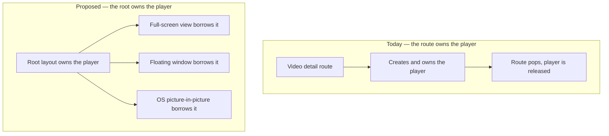
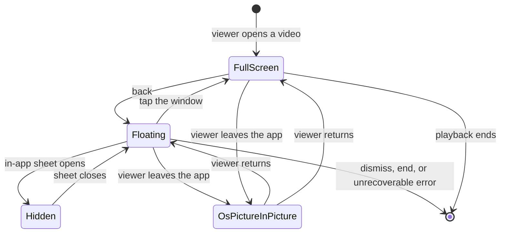
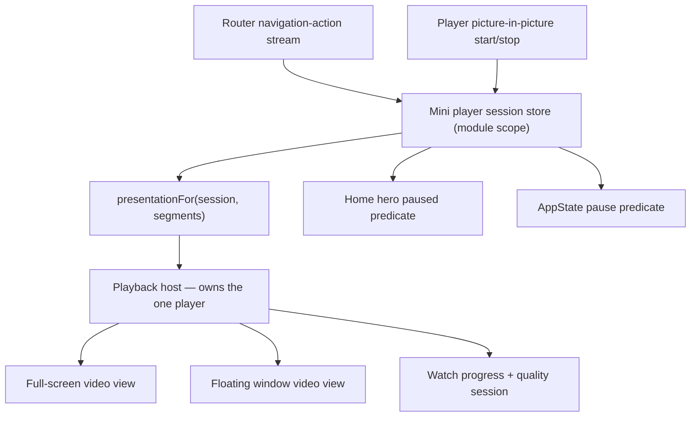
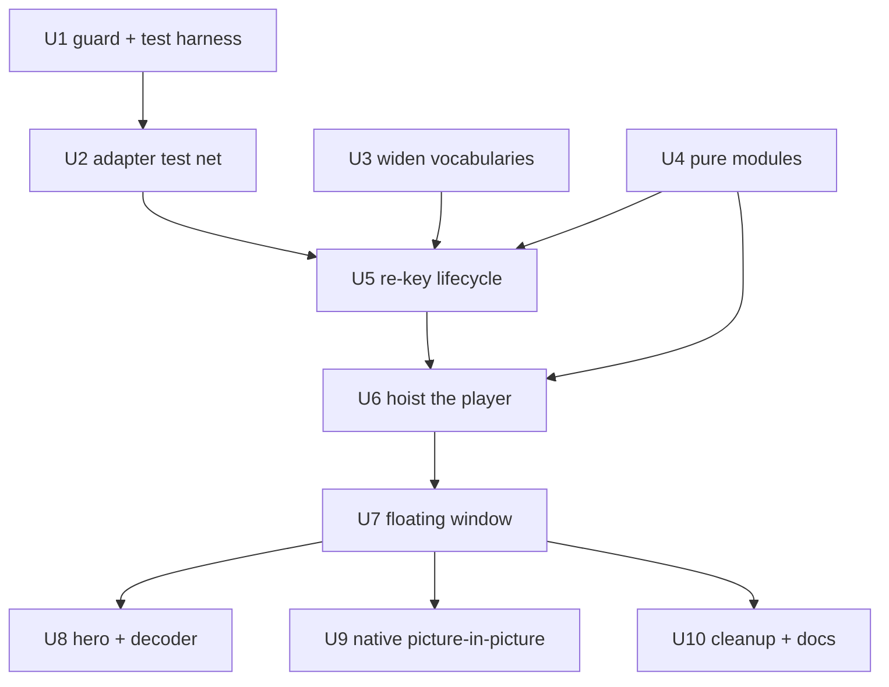

# Mobile Mini Player - Plan

## Goal Capsule

- **Objective.** Give `apps/mobile` a floating mini player that keeps a video playing while the viewer browses the rest of the app, and enable operating-system picture-in-picture so playback also survives leaving the app.
- **Product authority.** A leadership feature request, relayed by the owner of `apps/mobile`. The reference behaviour is the YouTube app's mini player. Requirements own product behaviour; Key Technical Decisions own mechanism; repo conventions and user preferences override the plan's landing details.
- **Execution profile.** U1 and U2 build the test net before anything changes behaviour. U5 rewrites the most load-bearing hook in the video stack and carries an explicit test-first note. Android hardware is required before U7 can be called done.
- **Stop conditions.** Stop and ask if the Android surface handoff (U7) cannot be made to paint a live first frame, if the Android poster fallback proves unusable (issue #1928), or if re-keying the adapter (U5) would change what a session reports for an unchanged code path.
- **Open blockers.** None. Expo SDK 57 landed in `91028058a`, which also proved Android picture-in-picture on a throwaway spike.
- **Tail ownership.** The roadmap ticket, the device acceptance run, and copying the picture-in-picture spike evidence into the repo are owned by this plan and listed in Definition of Done.

---

## Product Contract

### Summary

Pressing back from a video shrinks the player into a small floating window that keeps playing while the viewer browses. The window can be dragged to any corner, expanded back to the full screen, or dismissed. Native picture-in-picture ships in the same release, so playback also continues when the viewer leaves the app.

### Problem Frame

Today a video ends the moment the viewer leaves it. The player is created inside the route, so popping the route destroys the player, the watch session, and the position. A viewer who wants to look for the next thing while a talk plays has to choose between the two.

The request arrived from leadership rather than from a support ticket, an analytics signal, or an observed session. No user-side evidence was produced for it, and none was found in the repo. That does not make it wrong, but it does mean the definition of success is "leadership recognises the YouTube behaviour", not a measured improvement.

The request also carried a second half — that backing out should return the viewer to the previous screen at the scroll position and search state they left. Device verification showed that already happens. That half is closed, and the work below is only the playback half.

### Key Decisions

- KD1. **The mini player is an in-app floating window, not the operating system's picture-in-picture window.** (session-settled: user-directed — chosen over a docked bottom bar, an audio-only resume bar, and native picture-in-picture alone: the OS window has no positioning API on either platform, and on Android it shrinks the whole activity and blanks the app's UI, so there is no app left to browse.) Expo Router's `bottomAccessory` is separately disqualified by mechanism, not by maturity — see KTD9. Governs R1, R2, R3.
- KD2. **One player is owned above the screens; the full view and the floating window both borrow it.** (session-settled: user-directed — chosen over turning the video screen into a root overlay, and over seeding a second player at the departing timestamp, which re-buffers and produces an audible gap.) Governs R1, R4, R16, R17.
- KD3. **The mini player wins the decoder; Home's hero yields to it.** (session-settled: user-directed — chosen over rendering both surfaces, hiding the window on Home, and retiring hero autoplay outright.) Governs R9, R10.
- KD4. **Picture-in-picture ships alongside the mini player, on Expo SDK 57.** (session-settled: user-directed — chosen over shipping the mini player plus iOS picture-in-picture immediately on SDK 54 as an EAS Update, over shipping both on SDK 54 with known Android defects, and over carrying a pnpm patch.) The upgrade landed in `91028058a` and the four Android fixes are present at expo-video 57.0.2, so the precondition is met. Governs R13, R14, R15, R24.
- KD5. **Back-navigation state restoration is out of scope because it already works.** Verified on device: the tab screens are never unmounted on a push, so their state was never lost. See Sources.

The change KD2 describes is where the player instance lives:



### Requirements

**The mini player**

- R1. Pressing back from a video detail screen shrinks the player into a floating window, and playback continues without a pause, a gap, or a black frame.
- R2. The viewer can drag the window, which settles into one of the four screen corners.
- R3. The window persists across tab changes and further route pushes until the viewer dismisses it, and playback continues while it is suppressed.
- R4. Tapping the window returns to the full video screen at the position playback has reached.
- R5. The window carries a play-pause control, a dismiss control, and a non-interactive playback-position indicator.
- R6. Dismissing the window stops playback and removes the window.
- R7. The window can always be moved off content the viewer needs, and it never covers a tap target in the app's live top or bottom chrome.
- R8. Assistive technology can reach, describe, and dismiss the window, and the window does not trap focus.

**Coexistence with the rest of the app**

- R9. Home's hero and the series-detail trailer each show their poster and stay silent while the window holds live playback, and resume their normal behaviour once the window stops holding a video surface or is dismissed.
- R10. Exactly one video decoder is live at any moment, where live means a mounted video view rather than an unpaused player.
- R11. The floating window hides while an in-app sheet is presented, and returns to the corner it occupied when that sheet closes. Suppression never applies to the full-screen view.
- R12. Starting a different video replaces what the window is playing.

**Native picture-in-picture**

- R13. Playback continues in the operating system's picture-in-picture window when the viewer leaves the app, superseding the app's existing pause-on-background rule for that video.
- R14. Every surface that renders a picture-in-picture affordance behaves consistently with R13 on the platform that renders it.
- R15. Neither platform presents a picture-in-picture affordance the app manifest cannot honour.

**Playback bookkeeping**

- R16. Watch progress flushes against the video the viewer actually left, on an explicit signal rather than on component teardown.
- R17. Playback-quality telemetry attributes a session to the video that produced it, and distinguishes ended, replaced, dismissed, and abandoned.

**Degradation and exclusions**

- R18. Where a device cannot render live video inside the floating window, the window shows the video's poster and audio continues.
- R19. Video reached from an SDUI experience page is excluded from the mini player and behaves exactly as it does today.
- R20. Downloaded playback and series episodes use the mini player like any other video.

**Lifecycle edges**

- R21. When playback reaches the end while the window is floating, the window releases the decoder rather than holding a frozen last frame.
- R22. On an unrecoverable stream failure while floating, the window replaces the video surface with the video's poster, shows a failure label, keeps its dismiss and tap-to-expand controls operable, and closes the quality session with a failure reason.
- R23. Pressing back at a tab root while the window is active dismisses the window instead of leaving the app.
- R24. While the operating system's picture-in-picture window is showing, the app performs no video-view mount, unmount, or handoff.
- R25. A change of signed-in subject — sign-out, account switch, or account deletion — ends the session, stops playback, and clears the window.

The states the window moves through, and what carries playback in each:



### Key Flows

- F1. Shrink to the window
  - **Trigger:** The viewer presses back on a video detail screen while a video has started.
  - **Steps:** The navigation action arms the window before the pop commits; the floating view mounts with its poster covering it; the player moves to the floating view; the poster drops on that view's own first-frame event; Home's hero yields if the viewer lands on Home.
  - **Outcome:** Playback has not stopped, restarted, or stalled.
  - **Covered by:** R1, R9, R10.
- F2. Return to the full screen
  - **Trigger:** The viewer taps the floating window.
  - **Steps:** The video detail screen for that video opens, the full-size view takes the player, and the window disappears without re-arming the autostart veil.
  - **Outcome:** Playback continues from the position it had reached, and Home's hero returns to normal.
  - **Covered by:** R4, R9.
- F3. Leave the app
  - **Trigger:** The viewer backgrounds the app while the floating window or the full screen is playing.
  - **Steps:** The picture-in-picture latch arms from the player's own start event; the app suppresses its background pause for that video; no view mounts or unmounts until the latch clears.
  - **Outcome:** Playback continues outside the app, and returning to the app restores the state the viewer left.
  - **Covered by:** R13, R14, R15, R24.
- F4. Dismiss
  - **Trigger:** The viewer activates the window's dismiss control.
  - **Steps:** Playback stops, watch progress flushes for that video, telemetry closes the session as dismissed, and the window is removed.
  - **Outcome:** The app is in the same state as if the viewer had never opened the video, except that progress is recorded.
  - **Covered by:** R6, R16, R17.

### Acceptance Examples

- AE1. Back onto Home while the hero is playing
  - **Covers R1, R9, R10.**
  - **Given** a video is playing and Home's hero was autoplaying before the viewer opened it,
  - **When** the viewer presses back,
  - **Then** the floating window keeps the video playing, the hero shows its poster and makes no sound, and only one video view is mounted.
- AE2. Back onto an active search
  - **Covers R1, R3.**
  - **Given** the viewer reached the video from Discover with a query typed and results on screen,
  - **When** the viewer presses back,
  - **Then** the query, the results, and the list position are unchanged, and the window plays over them.
- AE3. A second video is started
  - **Covers R12, R17.**
  - **Given** the window is playing video A,
  - **When** the viewer opens video B,
  - **Then** video A stops, its progress is recorded, its quality session closes as replaced, and the session becomes video B.
- AE4. A sheet opens over the window
  - **Covers R11.**
  - **Given** the window is active,
  - **When** one of the six in-app group sheets is presented — language, subtitle or download, from either the watch or the series group —
  - **Then** the window is not visible over the sheet and does not paint through it on Android, audio continues throughout, and it returns to the same corner when the sheet closes.
- AE5. The viewer leaves the app
  - **Covers R13, R24.**
  - **Given** the window is playing,
  - **When** the viewer goes to the device home screen,
  - **Then** playback continues in the operating system's picture-in-picture window, and the app performs no view mount or unmount while it is showing.
- AE6. A device that cannot render live video in the window
  - **Covers R18.**
  - **Given** a device on which the floating view reports no first frame within the release budget,
  - **When** the viewer presses back,
  - **Then** the window shows the video's poster, audio continues without interruption, and nothing renders as a black rectangle.
- AE7. Video inside an experience page
  - **Covers R19.**
  - **Given** the viewer is playing a video reached from an SDUI experience page,
  - **When** the viewer navigates away,
  - **Then** no window appears and the app behaves exactly as it does today.
- AE8. A downloaded video
  - **Covers R20.**
  - **Given** the viewer is playing a downloaded video with the device offline,
  - **When** the viewer presses back,
  - **Then** the window keeps the local file playing and dismissal records progress exactly as it does for a streamed video.
- AE9. Dismissal records what was watched
  - **Covers R6, R16, R17.**
  - **Given** the window has been playing for several minutes,
  - **When** the viewer dismisses it,
  - **Then** watch progress for that video is recorded at the position reached, and the quality session closes as dismissed rather than abandoned.
- AE10. Back while the video is still loading
  - **Covers R1.**
  - **Given** the viewer opened a video and playback has not started,
  - **When** the viewer presses back,
  - **Then** no window appears and the app behaves exactly as it does today.
- AE11. Playback ends while floating
  - **Covers R21, R17.**
  - **Given** the window is playing and the video reaches its end,
  - **When** no further input arrives,
  - **Then** the window stops holding a video surface and the quality session closes as ended.
- AE12. Dismiss while picture-in-picture is showing
  - **Covers R24.**
  - **Given** the operating system's picture-in-picture window is showing,
  - **When** a dismiss is requested,
  - **Then** nothing mounts or unmounts until picture-in-picture stops, and returning to the app shows the full interface rather than a blank screen.
- AE13. Back at a tab root
  - **Covers R23.**
  - **Given** the window is active and the viewer is on a tab root,
  - **When** the viewer presses the Android back button,
  - **Then** the window is dismissed and the app stays open.
- AE14. Back onto a series screen with a trailer
  - **Covers R9, R10.**
  - **Given** the window is playing,
  - **When** the viewer opens a series detail screen whose trailer normally autostarts,
  - **Then** the trailer shows its poster and stays silent, and only the window holds a video surface.
- AE15. The stream fails while floating
  - **Covers R22.**
  - **Given** the window is playing and the stream fails unrecoverably,
  - **When** the failure is reported,
  - **Then** the window shows the video's poster with a failure label, dismiss and tap-to-expand still respond, and the quality session closes with a failure reason.
- AE16. Signing out while a video floats
  - **Covers R25.**
  - **Given** the window is playing and the viewer is signed in,
  - **When** the viewer signs out from Profile,
  - **Then** playback stops, the window is removed, and no progress is written for the signed-out account afterwards.
- AE17. Carrying a session onto an excluded route
  - **Covers R3, R19.**
  - **Given** the window is playing,
  - **When** the viewer opens an SDUI experience page,
  - **Then** the window keeps playing over it — exclusion governs where a session may be created, not where it may be seen.

### Success Criteria

- Leadership can be shown the YouTube behaviour on a real device on both platforms.
- The full-to-floating transition paints a live frame in the floating window on Android hardware, sampled on a motion-rich part of the video after a cold relaunch.
- Watch-progress and quality-telemetry records for a session that ends through the floating window match what the same session produces today, with the reason distinguishing dismissal from abandonment.

### Scope Boundaries

- Preserving scroll position and search state across back-navigation. Verified working on device; see Sources.
- A docked bottom bar as the shipping form. Considered and rejected in favour of the floating window.
- Adopting `apps/mobile/src/components/watch/MiniPlayerBar.tsx`. It is a full-width docked bar with a poster thumbnail and no video surface, no drag, and no dismiss control, and it has no import sites. It is deleted in U10 after its fade-then-unmount pattern and its accessibility labels are carried across. Its backplate choice does not carry across — see KTD8.
- Changing fullscreen playback. Back from fullscreen exits fullscreen to the video screen, as it does today; the floating window arises only from a back press on that screen.
- Surviving a process restart. The window does not, and the last recorded position is whatever the batching interval or the background flush had already written.
- A queue or Up Next redesign, and a continue-watching shelf on Home.
- Migrating `apps/mobile/app/(tabs)/_layout.tsx` off the deprecated `Tabs` import.

### Dependencies / Assumptions

- The request has no user-observed evidence behind it. Success is recognition of the reference behaviour, not a measured metric.
- The reference is the YouTube app's current mini player, which has been a floating, draggable window since May 2025. Documentation describing a bottom-docked bar describes the older design.
- `apps/mobile` runs Expo SDK 57.0.12, expo-video 57.0.2, expo-router 57.0.12, React Native 0.86.2 and React 19.2.3. `apps/tv` stays on SDK 54, so the monorepo carries a deliberate SDK split and no shared module travels with these tests.
- `apps/mobile` resolves zero pnpm patches. Both committed patches are keyed to versions only `apps/tv` resolves.
- The four Android picture-in-picture fixes that drove KD4 are present at 57.0.2, and their implementations are readable in the installed Kotlin — see Sources.
- Android picture-in-picture is already proven on this SDK by the upgrade's throwaway spike, on a Pixel 9a running Android 15. **The evidence is not in the repo and not on any remote:** the local-only branch `spike/mobile-pip-evidence` (commits `ff09ea35b` for the config and `3414471eb` for the pause skip, on top of `a144b318d`), and written findings plus screenshots at `~/Documents/forge-pip-evidence-u4/FINDINGS.md`. A single `git branch -D` destroys it. U9 copies it in.
- Only Android needs a native config change. The expo-video plugin enables iOS background audio when either `supportsBackgroundPlayback` or `supportsPictureInPicture` is set, and the former is already set, so the flag produces a byte-identical iOS `Info.plist`.
- On Android, mounting two video views against one player is still unsupported at 57.0.2, and the library asserts single ownership. The transition is a single ownership move, not a cross-fade.
- On React Native 0.86 Android, the default `surfaceView` decodes but never composites inside a layered, absolutely-positioned stack. `textureView` is mandatory for the floating window, not preferential.
- Neither `react-native-reanimated` nor `react-native-gesture-handler` is resolvable from app source, and both are excluded at autolinking level. Removing an entry from that exclude list re-arms an Android class-load crash.
- Three surfaces set `allowsPictureInPicture` across four render sites: the shared watch player (which backs both the watch screen and the series-detail trailer), and the two `[sectionKey]` screens. Two are inert because they disable native controls; two expose an iOS button in production.
- `isPictureInPictureSupported()` inspects neither manifest, so R15 cannot be enforced by that function.
- Picture-in-picture cannot be verified on an iPhone simulator. iOS verification needs an iPad simulator or hardware, and no iOS verification exists yet.
- A component-render test harness now exists with no new dependency, so much of this feature is provable in CI. See the Verification Contract.
- Home hero playback is excluded from the mini player by construction: heroes never reach the player adapter and their video views carry no picture-in-picture prop.
- Downloaded playback runs on local files keyed by slug rather than the streaming path, so R20 carries more risk than the other included classes.
- No roadmap ticket exists for this work. `feat-357` is already used twice on `main`; the next free identifier is `feat-361`, and it should be re-checked when the ticket is created.

### Outstanding Questions

**Deferred to Planning**

- The window's corner-snap thresholds and its exact dimensions above the minimum KTD6 sets.
- Whether `smallestScreenSize` appears in the generated Android manifest after prebuild. Three research passes disagreed; U9 settles it by reading the generated artifact.

### Sources / Research

- Device verification, iPhone 17 simulator against local admin, 2026-08-12: Home scrolled past the LUMO shelf, pushed a video, popped back — scroll position pixel-identical. Discover with the query `forgiveness`, results scrolled, pushed a result, popped back — query, results, and list position all pixel-identical. This is the basis for KD5.
- `apps/mobile/app/_layout.tsx` — root stack `:279-358`, seven screens; `</Stack>` `:358`; `</ExperienceShell>` `:359`; the `moduleError` early return `:176-210`; the second `!hydrated` early return `:262-264`; `DevEndpointNotice` `:368`.
- `apps/mobile/src/contexts/ExperienceShell.tsx:38-53` — the launch-time element-type swap that makes anything mounted inside it remount once per cold launch. This is why KTD1 places the window outside it.
- `apps/mobile/src/hooks/useManagedVideoPlayer.ts` — byte-identical since `89c8bb316`. AppState listener `:232-260` with the unconditional pause at `:253` inside the else-branch `:248-257`; progress flush `:133-150` (`:147`); teardown pause `:262-270`; quality finalize `:349-351`; the existing swap-boundary re-key `:165-166` that U5 generalises.
- `apps/mobile/src/components/home/HomeHeroPager.tsx` — one player handed between views: creation `:155-160`, `player={player}` `:546`, video view `:688-697` with `surfaceType` at `:696`, poster crossfade `:650-664` with the re-arm restoring opacity at `:662-663`.
- `apps/mobile/src/components/watch/Scrubber.tsx` — the drag precedent: `PanResponder.create` `:112-162`, the set-value-not-set-state rule `:43-47`, geometry `:82-86`, claim predicate `:117-120`, `accessible` `:182`. It is JS-driven and passes no `useNativeDriver`.
- `apps/mobile/src/components/ui/PlatformBlur.tsx:15-20` — records that `GlassView` renders nothing inside an animated-opacity ancestor, falsified with a 90% tint.
- `apps/mobile/src/components/home/__tests__/homeHeroAndroidCompositing.guard.test.ts:16-17,30-47` — the existing guard that owns the Android `textureView` invariant.
- `apps/mobile/node_modules/expo-video/android/src/main/java/expo/modules/video/managers/PictureInPictureManager.kt` — candidate election `:68-85`, background policy `:172-206`, enter/exit layout `:265-298`, and the unguarded `onVideoViewUnregistered` `:162-170` that motivates R24.
- `apps/mobile/node_modules/expo-video/android/.../player/FirstFrameEventGenerator.kt:54-115` — the two latches that make the first-frame event re-fire per media item and per target view.
- `docs/plans/2026-08-12-001-chore-mobile-expo-sdk-57-upgrade-plan.md` — the upgrade this plan depends on, and the spike that proved Android picture-in-picture.
- `docs/plans/2026-05-26-001-feat-mobile-video-detail-page-plan.md` section U4 — an earlier plan chose a fixed bottom bar over a floating overlay to avoid Android surface ordering. That mitigation worked by having no video surface at all, so it does not transfer; R11 and R18 exist because the constraint is now load-bearing.
- `docs/solutions/ui-bugs/android-home-hero-black-refreshcontrol-surfaceview-compositing.md` — the RN 0.86 compositing failure behind the mandatory `textureView`.
- `docs/solutions/best-practices/expo-glass-effect-glassview-invisible-under-animated-opacity-ancestor.md` — behind KTD8.
- `docs/solutions/ui-bugs/tvos-appstate-inactive-vs-background-video-teardown.md` — branch on `background`, never on `!== active`; a test covering only `active` and `background` passes for both the correct and the buggy implementation.
- `docs/solutions/developer-experience/android-emulator-gfxstream-session-degradation-black-video.md` and `docs/solutions/developer-experience/expo-dev-client-cached-bundle-verification.md` — two false-positive twins for this feature's symptoms.

---

## Planning Contract

### Key Technical Decisions

- KTD1. **The window and the player mount after `</ExperienceShell>`, inside `<DownloadsProvider>` — a sibling of `ExperienceShell`, not of `<Stack>`.** `ExperienceShell` returns a different element type once its slug resolves, so anything mounted inside it remounts once per cold launch. The slot still sits inside the error boundary, Apollo, safe-area, preferences, auth and downloads, and still paints above the stack. Root hooks are declared between the `moduleError` return and the `!hydrated` return, so the window cannot exist during the pre-hydration frame. Governs R1, R3.
- KTD2. **Session state is published through a module-scope subscribable store, not React context.** The window shows a position updating at the adapter's one-second poll; a root context would re-render every consumer beneath it on each tick, including Home's list. The store is also readable without React, which the picture-in-picture latch and the AppState handler need. Context carries only stable action handles. Governs R3, R5, R13.
- KTD3. **The poster drops on the floating view's own first-frame event, paired with an unconditional time-based release.** The event re-fires per media item and per target view, so the latch is keyed on video and surface rather than treated as one-shot. The time-based release is not redundant: on iOS the underlying flag can already be true at mount, and on Android the event is suppressed until surface layout matches. Governs R1, R18.
- KTD4. **The shrink is armed from the router's navigation-action stream, and back is never intercepted to produce it.** Presentation is derived from route state so swipe-back, deep links and tab changes behave uniformly; a separate pre-pop arming signal exists only to order the Android ownership move. The router API is `unstable_`-prefixed, so it is wrapped in one app-owned module with a documented fallback. R23 is the single deliberate exception: while a session is active the window host registers one Android hardware-back handler that claims the press only when the navigator cannot go back. Governs R1, R16, R23.
- KTD5. **The drag stays JS-driven, matching the existing scrubber precedent.** The scrubber passes no native-driver flag and ships on low-end Android today. `Animated.event` with the native driver fails silently under `PanResponder` — no warning, no throw, a frozen window — so it is forbidden outright. Position is written with `setValue` from inside the pan handler, never through component state. Governs R2.
- KTD6. **The window's minimum size derives from its controls, not from taste.** Two controls at the accessibility minimum plus spacing plus the video area set the floor. The snap geometry insets the window inside both the live top chrome and the live bottom chrome, so all four corners stay reachable; the excluded-corner parameter is reserved for a corner with insufficient clearance. The default corner is the one that obscures no focusable control. Governs R2, R7.
- KTD7. **The floating view sets `textureView` on Android and the full view already does.** Both surfaces therefore share a native view class and the ownership move cannot also swap classes. The literal is pinned in the existing Android compositing guard rather than in a new one. Governs R1, R10, R18.
- KTD8. **Any frosted treatment uses `PlatformBlur`, never `GlassView`.** The window fades through an animated opacity value, which is exactly the ancestor condition under which `GlassView` renders nothing and reports no error. Governs R5.
- KTD9. **Expo Router's `bottomAccessory` is rejected on mechanism.** `react-native-screens` renders the accessory twice simultaneously, once per placement, which would mount two video views against one player — the thing Android asserts against. Its iOS-26-only, unstable-import status is secondary. Governs R1.
- KTD10. **`<Activity mode="hidden">` is not used for R11.** Hidden mode tears down the subtree's effects, and the adapter's teardown pauses the player, so hiding the window would stop playback. It also applies `display: none` to a video view, which is the surface-removal class the repo already records as a black-out hazard. Suppression stays on app state. Governs R11.
- KTD11. **The window takes a navigate callback as a prop and never imports the router.** The router cannot be imported unmocked in this repo's jest setup, and injecting the callback makes R4's target directly assertable. Governs R4.
- KTD12. **Picture-in-picture is tracked by a latch fed from the video view's `onPictureInPictureStart` and `onPictureInPictureStop` callbacks, and it is a hold state.** These are view props, not player events, so every view that can enter picture-in-picture feeds the same latch. The AppState handler consults the latch and must not pause on `background` while it is set — Android reports picture-in-picture entry as `background`, not `inactive`. While the latch is set, no view mounts, unmounts, or changes owner. Governs R13, R24.
- KTD13. **Session end reasons and flush triggers are widened, and the existing cleanups stay as safety nets.** Both vocabularies are unrepresentable today. The explicit end signal runs first; the idempotent cleanups remain as safety nets for error paths. They no longer cover sign-out, because a root-scoped host does not unmount when the viewer signs out — R25 owns that path explicitly. The defect being fixed is reason attribution, not double-fire. Governs R16, R17.

- KTD14. **All new modules live under `apps/mobile/src/`.** Metro pins only `react` and `react-native` as singletons, so a workspace package importing expo-video can resolve a second copy and a second native module instance, breaking the single-player invariant. Governs R1.
- KTD15. **The session store subscribes to the auth session directly and ends on a subject change.** The auth session is already readable without React, which is what a module-scope store needs. Account deletion ends the session before the delete request rather than after, so no write races the deletion. Governs R25.
- KTD16. **The floating window and the operating system's picture-in-picture window are never both live.** Entering picture-in-picture suppresses the floating window; leaving it restores the window to its corner. Android has no exit affordance, so the app never offers one. Governs R13, R24.

### High-Level Technical Design

Ownership and signal flow once the player is hoisted:



The ownership move on back, which is the load-bearing sequence:

```mermaid
sequenceDiagram
  participant V as Viewer
  participant N as Navigation stream
  participant S as Session store
  participant M as Floating view
  participant F as Full view
  V->>N: press back
  N->>S: arm window (before pop commits)
  S->>M: mount, poster opaque, no player yet
  Note over F,M: pop commits; full view unmounts
  S->>M: assign player (single ownership move)
  M->>M: first frame event, or time-based release
  M->>M: fade poster out, unmount poster
```

### Assumptions

- The floating view's first-frame event fires on a live surface swap on real Android hardware. If it does not, KTD3's time-based release becomes the only mechanism and the poster hold lengthens.
- The Android poster layer paints inside a floating video view. Issue #1928 records that the hero poster layer was not observed to paint in any SDK 57 session, which would make R18's fallback unusable on Android. U7 proves this before relying on it.
- The three behaviours U5 re-keys have no behavioural tests today, so U2 writes them first and the re-key lands as a refactor under a net.

### Sequencing

U1 and U2 are pure additions and can land first without touching behaviour. U3 widens types. U4 builds pure modules with no wiring. U5 changes the adapter under U2's net. U6 hoists the player. U7 builds the window on top of U6. U8, U9 and U10 are independent of one another once U7 lands.



---

## Implementation Units

| U-ID | Title                                         | Key files                                                                         | Depends on |
| ---- | --------------------------------------------- | --------------------------------------------------------------------------------- | ---------- |
| U1   | Player-creation guard and shared test harness | `src/hooks/__tests__/useManagedVideoPlayer.guard.test.js`, `src/test-utils/`      | —          |
| U2   | Behavioural test net over the player adapter  | `src/hooks/__tests__/useManagedVideoPlayer.test.tsx`                              | U1         |
| U3   | Widen session-end and flush vocabularies      | `src/lib/videoQoe.ts`, `src/lib/watchProgress/recorder.ts`                        | —          |
| U4   | Pure mini-player modules                      | `src/lib/miniPlayer/*`                                                            | —          |
| U5   | Re-key lifecycle onto explicit signals        | `src/hooks/useManagedVideoPlayer.ts`, `src/lib/navigationEvents.ts`               | U2, U3, U4 |
| U6   | Hoist the player to the root                  | `app/_layout.tsx`, `src/components/watch/VideoPlayer.tsx`, `app/watch/[slug].tsx` | U4, U5     |
| U7   | The floating window                           | `src/components/watch/MiniPlayerWindow.tsx`                                       | U6         |
| U8   | Hero and decoder coordination                 | `src/components/home/HomeScreen.tsx`, `HomeHeroPager.tsx`                         | U7         |
| U9   | Native picture-in-picture                     | `app.json`, `src/components/watch/VideoPlayer.tsx`                                | U7         |
| U10  | Cleanup, guards and documentation             | `MiniPlayerBar.tsx`, `CLAUDE.md`, roadmap                                         | U7         |

### U1. Player-creation guard and shared test harness

- **Goal:** Close the guard hole that would let this feature create a second player unnoticed, and give every later unit one expo-video test stub.
- **Requirements:** Enables verification of R10; no product requirement.
- **Dependencies:** none.
- **Files:**
  - `apps/mobile/src/hooks/__tests__/useManagedVideoPlayer.guard.test.js` — widen the detector at `:22` to match `createVideoPlayer` as well, and add a `createVideoPlayer` case to the positive control at `:66-92`.
  - `apps/mobile/src/test-utils/expoVideoMock.ts` — new; a `makeFakePlayer()` factory and the module-factory body, so the window, the full player and the picture-in-picture suites share one shape.
  - `apps/mobile/src/test-utils/rnTestRenderer.ts` — correct the stale doc comment at `:2-6` which tells the reader a per-file react re-point preamble is required. It is not.
- **Approach:** expo-video still exports `createVideoPlayer`, which is the API a "player must outlive the route" implementation reaches for, and the current detector is a bare-word match on `useVideoPlayer` only. Without this, KTD2's central invariant ships with no enforcement.
- **Test scenarios:**
  - The positive control fails the guard when a fixture uses `createVideoPlayer`, including an aliased import.
  - The positive control still fails for `useVideoPlayer`.
  - The guard passes on the tree as it stands.
  - `makeFakePlayer()` returns an object satisfying the properties the adapter reads.
- **Verification:** `pnpm --filter @forge/mobile test` passes with a higher suite count than the 110 recorded on this branch.

### U2. Behavioural test net over the player adapter

- **Goal:** Cover the three behaviours U5 re-keys, before U5 changes them.
- **Requirements:** Covers R16, R17 as a regression net.
- **Dependencies:** U1.
- **Files:** `apps/mobile/src/hooks/__tests__/useManagedVideoPlayer.test.tsx` — new. There is no existing suite for this hook; the prior research asserted one that has never existed.
- **Approach:** Render the real `apps/mobile/src/components/watch/VideoPlayer.tsx` with the adapter running for real, mocking only expo-video via U1's stub, and assert call counts and reasons on the recorder and the quality session. Note that the render registers two AppState listeners — the component has its own beside the adapter's — so assertions must name the one they mean.
- **Execution note:** Write these before U5 touches the hook, so the re-key lands as a refactor under a net.
- **Test scenarios:**
  - Unmounting the host flushes progress once with the current trigger and finalizes the quality session once.
  - A source change flushes progress under the re-key path and opens a new quality session.
  - Backgrounding flushes progress and pauses the player.
  - An `inactive` AppState transition pauses the player today. This is the case that separates correct from buggy after U5, and the only one that does.
  - Reaching the end flushes progress with the end trigger.
- **Verification:** All five pass against the unmodified hook.

### U3. Widen session-end and flush vocabularies

- **Goal:** Make R16 and R17 representable.
- **Requirements:** Covers R17; enables R16.
- **Dependencies:** none.
- **Files:**
  - `apps/mobile/src/lib/videoQoe.ts` — widen the reason union at `:6` beyond `ended | abandoned`.
  - `apps/mobile/src/lib/watchProgress/recorder.ts` — widen the flush trigger union at `:27`.
  - `apps/mobile/src/lib/videoQoe.test.ts` and `apps/mobile/src/lib/watchProgress/__tests__/recorder.test.ts` — extend.
- **Approach:** Today a dismissal either emits nothing or is stamped as abandonment. Keep the existing idempotent cleanups; they become safety nets rather than the primary path, per KTD13.
- **Test scenarios:**
  - Each new reason round-trips through the quality session and appears in its emitted summary.
  - Each new flush trigger round-trips through the recorder.
  - A falsification case per reason: removing the reason from the dismiss path turns the dismissal into an abandonment report and the test red.
  - No new log attribute collides with the reserved Datadog names the repo's guard already pins.
- **Verification:** `pnpm --filter @forge/mobile test` green, including the reserved-attribute guard.

### U4. Pure mini-player modules

- **Goal:** Put every decision this feature makes into react-native-free modules that CI can prove.
- **Requirements:** Covers R2, R7, R11, R13, R19, R25 at the logic level.
- **Dependencies:** none.
- **Files (all new, all under `apps/mobile/src/lib/miniPlayer/` except the last):**
  - `store.ts` — the subscribable session store per KTD2, with explicit end reasons.
  - `presentation.ts` — pure `full | floating | hidden | none` selector over session and route segments.
  - `layout.ts` — pure corner-snap geometry over safe-area insets and the live bottom chrome, with the excluded-corner set as a parameter.
  - `suppression.ts` — the R11 predicate over the six in-app group sheet routes plus a counter for the two non-route sheets, which are `apps/mobile/src/components/library/DeleteConfirmSheet.tsx` (hosted at `apps/mobile/app/(tabs)/library.tsx:408`) and the modal in `apps/mobile/src/components/sections/QuizButtonRenderer.tsx`.
  - `apps/mobile/src/lib/pipPolicy.ts` — pure `shouldPauseOnAppStateChange(nextState, pipActive)`.
- **Approach:** Model the selector on the existing pure host-selector used by the hero pager, which is the in-repo precedent for "exactly one surface hosts at a time". Derive the route table by reading `apps/mobile/app/_layout.tsx:279-358`, `app/watch/_layout.tsx` and `app/series/_layout.tsx` directly — this suite passes vacuously if the table is written from prose.
- **Test scenarios:**
  - The selector returns `none` only when no session exists, which is the case for a video opened from an excluded route. Exclusion is keyed on where the session originated, not on where the viewer currently is.
  - A live session carried onto an SDUI experience route or either `[sectionKey]` route still returns `floating`, because R3 promises persistence.
  - The selector returns `floating` for each tab root and `full` for the watch route, table-driven over the real route list including `series/[slug]`.
  - The selector returns `full` for the three watch-group sheet routes, because the full-screen view sits behind those sheets, and `hidden` for the three series-group sheet routes.
  - The non-route counter suppresses the window while either named sheet is open and restores it when the count returns to zero.
  - Corner snap places the window in each of the four corners from a drag release, per safe-area inset set.
  - The window insets inside both the live top and live bottom chrome, and a corner with insufficient clearance is excluded while the other three stay reachable.
  - The pause predicate does not pause on `background` while picture-in-picture is active, and does not pause on `inactive` at all.
  - The pause predicate does pause on `background` when picture-in-picture is not active.
  - A change of signed-in subject ends the session and clears the store, and no write is accepted for the previous subject afterwards.
  - A falsification case per module: deleting the branch under test turns a case red.
- **Verification:** `pnpm --filter @forge/mobile test`; each module has at least one case that fails when its branch is removed.

### U5. Re-key lifecycle onto explicit signals

- **Goal:** Make the adapter's session boundaries explicit rather than coupled to React teardown, and stop it pausing playback that picture-in-picture is carrying.
- **Requirements:** Covers R13, R16, R17.
- **Dependencies:** U2, U3, U4.
- **Files:**
  - `apps/mobile/src/hooks/useManagedVideoPlayer.ts` — route the AppState branch at `:248-257` through U4's predicate; re-key the progress flush at `:133-150` and the quality finalize at `:349-351` onto an explicit end signal, generalising the swap-boundary re-key that already exists at `:165-166`.
  - `apps/mobile/src/lib/navigationEvents.ts` — new; the single app-owned wrapper over the router's unstable navigation-action stream, with a documented fallback.
- **Approach:** One session-start entry point implicitly ends the previous session with a replaced reason, so no call site has to remember to stop the old one first. Keep both existing cleanups; they are already idempotent by construction.
- **Execution note:** U2's suite must be green before and after.
- **Test scenarios:**
  - Every U2 scenario still passes except the `inactive` pause, which this unit deliberately inverts. Update that one scenario here rather than leaving two contradictory expectations in the suite.
  - An `inactive` transition does not pause, whether or not picture-in-picture is active.
  - A `background` transition does not pause while picture-in-picture is active, and does pause when it is not.
  - An explicit dismiss flushes progress once with the dismiss trigger and finalizes the session as dismissed, not abandoned.
  - Starting a second video ends the first as replaced and flushes its progress once.
  - The navigation wrapper reports a back action, and reports nothing when the underlying stream is unavailable.
- **Verification:** `pnpm --filter @forge/mobile test`; the dismiss-reason falsification case from U3 goes red when the reason is removed.

### U6. Hoist the player to the root

- **Goal:** Make the player outlive the route without changing what a viewer sees.
- **Requirements:** Covers R1, R4, R12, R20.
- **Dependencies:** U4, U5.
- **Files:**
  - `apps/mobile/app/_layout.tsx` — mount the playback host per KTD1 between `:359` and `:360`; declare its hooks in the `:212-260` window.
  - `apps/mobile/src/components/watch/VideoPlayer.tsx` — accept an injected player instead of creating one at `:98-110`; keep `surfaceType` at `:408` and the autostart veil intact.
  - `apps/mobile/app/series/[slug].tsx` — the component's second render site, at `:425-436`. Its trailer must either adopt the injected-player contract or be explicitly opted out; leaving it to create its own player reintroduces a second decoder.
  - `apps/mobile/app/watch/[slug].tsx` — publish the identity snapshot the window needs (source `:288-292`, progress identity `:512-523`, resume `:262-270`) into U4's store instead of passing it only as props; define the admission predicate.
- **Approach:** The watch session provider stays group-scoped and keeps owning the rich per-video editing state that only the full screen needs; the route pushes a bounded snapshot up rather than the root pulling provider state down. Admission is keyed on playback having started, not on a source string existing — five pre-playback states accept a back press today.
- **Test scenarios:**
  - The watch screen renders and plays with an injected player, with the autostart veil behaving as it does today.
  - Backing out before playback starts publishes no session.
  - Backing out after playback starts publishes a session carrying the video identity and position.
  - Expanding does not re-arm the autostart veil when the player is already playing.
  - Opening a second video replaces the published session.
  - A session published from a slug-keyed local file carries the same identity and position shape as a streamed source.
  - The series-detail trailer creates no player of its own.
- **Verification:** `pnpm --filter @forge/mobile test`; then a simulator run of the watch screen confirming playback, seek, language switch and fullscreen are unchanged.

### U7. The floating window

- **Goal:** The window itself — mount, drag, controls, accessibility, and the ownership handoff.
- **Requirements:** Covers R1, R2, R3, R4, R5, R6, R7, R8, R11, R18, R20, R21, R22, R23.
- **Dependencies:** U6.
- **Files:**
  - `apps/mobile/src/components/watch/MiniPlayerWindow.tsx` — new. `accessible={true}` on the root view, `accessibilityActions` for play-pause, dismiss and move-to-corner handled through `onAccessibilityAction`, `surfaceType="textureView"` on Android, the picture-in-picture props and latch callbacks that U9 defines, a `PanResponder` plus `Animated.ValueXY`, a navigate callback prop, `PlatformBlur` for any frosted treatment.
  - The window host also registers the single Android hardware-back handler KTD4 carves out for R23, armed only while a session is active.
  - `apps/mobile/app/(tabs)/library.tsx` and `apps/mobile/src/components/sections/QuizButtonRenderer.tsx` — increment and release U4's non-route sheet counter where each sheet opens and closes.
  - `apps/mobile/src/components/watch/__tests__/MiniPlayerWindow.test.tsx` — new render suite.
  - `apps/mobile/src/components/home/__tests__/homeHeroAndroidCompositing.guard.test.ts` — add the window's `textureView` literal to the guard that already owns this invariant.
- **Approach:** Do not reuse `PlayerControls`; its inline branch docks a full-width grab strip along the bottom edge that would fight the drag responder. The window's tap-to-expand target and its chrome share one predicate with an unconditional time-based release, per the repo's chrome-gating rule. Never set `pointerEvents="none"` on a video view. The drag arbitrates against Home's capture-phase responder: touches that begin inside the window belong to the window.
- **Execution note:** Prove the Android first frame on hardware before building the rest of the chrome. If the poster layer does not paint, R18's Android arm needs a different design and that is a stop condition.
- **Test scenarios:**
  - The root view exposes `accessible`, a button role, a label and a dismiss action; the node count is exactly one.
  - The window sets nothing of the focus-containment shape, so it cannot trap focus.
  - The control set is exactly play-pause and dismiss, found by label.
  - Pressing play-pause flips the label.
  - The play-pause control seeds from the live player state on every mount, not from a default.
  - The responder claims a drag and rejects a tap.
  - Release commits to the snapped corner from U4's geometry.
  - Presentation `hidden` renders zero matching nodes; presentation `none` renders nothing.
  - Tapping the window calls the injected navigate callback with the current video.
  - The poster is mounted opaque at mount and unmounts only after the fade completes.
  - The window carries `surfaceType="textureView"` on Android, and the picture-in-picture props U9 defines.
  - Each declared accessibility action is present by name, and invoking play-pause and move-to-corner produces the same effect as the visible control.
  - Playback reaching its end unmounts the window's video surface and closes the quality session as ended, per AE11.
  - An unrecoverable stream error swaps the video surface for the poster, shows the failure label, and leaves dismiss and tap-to-expand operable, per R22.
  - A back press at a tab root dismisses the window and reports the press as handled; the same press with no active session is not claimed.
  - A local-file source plays in the window and records progress on dismissal, per AE8.
  - The position indicator updates from the store on the adapter's one-second poll.
- **Verification:** `pnpm --filter @forge/mobile test`; then an Android hardware run proving a live first frame after a cold relaunch, sampled on a motion-rich part of the video.

### U8. Hero and decoder coordination

- **Goal:** One decoder, and a Home screen that yields to the window.
- **Requirements:** Covers R9, R10.
- **Dependencies:** U7.
- **Files:**
  - `apps/mobile/src/components/home/HomeScreen.tsx` — compose window-active into the existing paused predicate at `:440`; do not add a pager suspend reason, which is a single-slot union whose clear is unconditional.
  - `apps/mobile/src/components/home/HomeHeroPager.tsx` — gate the video view mount at `:688-697` rather than pausing, because a paused player still holds its surface.
  - `apps/mobile/src/components/sections/CuratedHomeLayout.tsx` — its blur handler only mutes.
  - `apps/mobile/app/series/[slug].tsx` — the series-detail trailer autostarts at `:427-434` and is the second video the one-decoder rule must govern; suppress its autostart and unmount its video view while a session is active, mirroring the hero rule.
  - `apps/mobile/src/components/sections/VideoHeroRenderer.tsx` — the SDUI hero, which R19 excludes from the window but which still competes for the decoder.
- **Approach:** Hero resume is gated on window-absent as well as focus, because the pop that creates the window fires Home's focus listener in the same commit.
- **Test scenarios:**
  - The paused predicate is true when the window is active, when Home is blurred, and when the hero is scrolled away, independently and in combination.
  - The hero video view is unmounted, not merely paused, while the window is active.
  - Leaving Home and returning while the window is active leaves the hero showing its poster.
  - Dismissing the window restores the hero's normal behaviour, and so does playback ending while floating — the hero must not stay frozen because the session was never dismissed.
  - The series-detail trailer does not autostart and mounts no video view while a session is active.
- **Verification:** `pnpm --filter @forge/mobile test`; then a device check that only one video surface is mounted while the window is over Home.

### U9. Native picture-in-picture

- **Goal:** Ship the configuration the spike proved, without the spike's hack.
- **Requirements:** Covers R13, R14, R15, R24.
- **Dependencies:** U7.
- **Files:**
  - `apps/mobile/app.json` — add the picture-in-picture flag to the expo-video plugin block at `:50-55`.
  - `apps/mobile/src/components/watch/VideoPlayer.tsx` — add automatic picture-in-picture entry beside the existing prop at `:404`, and wire the view's start and stop callbacks into U4's latch.
  - `apps/mobile/src/components/watch/MiniPlayerWindow.tsx` — the floating window's own video view carries the same picture-in-picture props and feeds the same latch. Without this, AE5 cannot pass from the floating state.
  - `apps/mobile/app/video/[sectionKey].tsx` and `apps/mobile/app/collection/[sectionKey].tsx` — reconcile their picture-in-picture affordances with R15 and feed the same latch.
  - A copy of the spike's findings, brought into the repo. Review it for anything machine-specific before committing — it came from a home directory, not from the repo.
- **Precondition:** confirm an iOS device or iPad simulator is available before starting. iOS picture-in-picture has never been verified and cannot be on an iPhone simulator.
- **Approach:** The spike proved exactly three edits, one of which disabled background pause for every video everywhere; U5 replaces that one properly. The shared player component backs both the watch screen and the series-detail trailer, so any prop set on it applies to both — R14's Android blast radius is that pair. Every manual start call is wrapped, because an unsupported device throws.
- **Test scenarios:**
  - The generated Android manifest carries the picture-in-picture attribute after a prebuild, with a negative control so a no-op change fails.
  - The generated manifest's activity config-changes list is read and recorded; the local config plugin is added only if the required entry is absent.
  - No affordance is presented on a platform whose manifest cannot honour it.
  - A manual start call on an unsupported device is caught rather than crashing.
  - While the latch is set, no mount, unmount or owner change is issued.
  - The floating window's video view exposes the picture-in-picture props and its callbacks reach the latch.
  - Setting `staysActiveInBackground` on the hoisted player when the latch arms produces automatic iOS entry, and the muted Home hero's audio session is unchanged. Record the result either way — this settles a question the Product Contract deferred.
- **Verification:** `pnpm --filter @forge/mobile exec expo prebuild --platform android --clean`, then read the generated manifest — never trust the plugin alone. Then an Android hardware run: enter picture-in-picture, background, return, confirm the interface restores. iOS verification needs an iPad simulator or hardware and has never been done.

### U10. Cleanup, guards and documentation

- **Goal:** Leave the repo without a dead component, a dangling reference, or eight files asserting something that is no longer true.
- **Requirements:** none directly; protects R10 and the verification contract.
- **Dependencies:** U7.
- **Files:**
  - `apps/mobile/src/components/watch/MiniPlayerBar.tsx` — delete, after carrying across its fade-then-unmount pattern at `:38-60` and its labels at `:73` and `:90`.
  - `apps/mobile/src/hooks/useControlsVisibility.ts:81` — repoint the comment that names the deleted component at `apps/mobile/src/components/library/DeleteConfirmSheet.tsx:49-51`.
  - `apps/mobile/CLAUDE.md` — record the root-owned session rule, the mandatory Android `textureView` for the window, and the cross-platform sheet suppression rule whose paint-through hazard is Android-only.
  - Every file that asserts this repo has no component-render testing. Derive the list at implementation time by grepping tracked markdown and `apps/mobile` test files for the claim rather than working from a fixed count — the population has already been undercounted once. Stamp dated supersession notes naming the CLAUDE.md section as successor on `apps/mobile`-scoped statements only; `apps/tv` statements remain true, because TV stays on SDK 54. Do not rewrite the historical reasoning.
  - `docs/roadmap/platform/feat-361-mobile-mini-player.md` — new; re-check the identifier when creating it.
- **Approach:** The prose sweep is the part a code-symbol grep cannot find, and it is what sends the next agent down the wrong path.
- **Test scenarios:** none — no behavioural change. Test expectation: none, this unit removes dead code and corrects prose.
- **Verification:** `pnpm --filter @forge/mobile test` and `npx prettier --check 'docs/**/*.md'` both green; a grep for the deleted component returns nothing.

---

## Verification Contract

| Gate                           | Command                                                                                                       | Applies to |
| ------------------------------ | ------------------------------------------------------------------------------------------------------------- | ---------- |
| Unit tests                     | `pnpm --filter @forge/mobile test`                                                                            | every unit |
| Types                          | `pnpm --filter @forge/mobile typecheck`                                                                       | every unit |
| Lint                           | `pnpm --filter @forge/mobile lint`                                                                            | every unit |
| Docs format                    | `npx prettier --check 'docs/**/*.md'`                                                                         | U10        |
| Android manifest               | `pnpm --filter @forge/mobile exec expo prebuild --platform android --clean`, then read the generated manifest | U9         |
| Simulator smoke                | `bash scripts/setup-sim-env.sh mobile`, then run the app                                                      | U6, U7, U8 |
| Android hardware               | manual acceptance run                                                                                         | U7, U8, U9 |
| iOS hardware or iPad simulator | manual acceptance run                                                                                         | U7, U9     |

**Baseline:** 110 suites, 1567 tests green on this branch. The test script passes with no tests, so a suite that never loads exits zero — a suite count that did not rise is the only detector that a new file is being collected.

**Evidence classes.** Each requirement is proved by render tests, pure-module tests, or a device. Unit tests green is not admissible evidence for a device row.

- Provable by render test: R3 persistence across simulated route changes, R4, R5, R6 stop-and-flush ordering, R8 props, R11 presentation, R12 replacement, R13 pause behaviour, R16, R17, R18 poster mounting, R19, R22's reachable exit, R23's handled back press, R25's end-on-subject-change.
- Provable by pure-module test: R2 geometry, R7 inset arithmetic, R13 predicate, R19 route table.
- Device only: R1's gapless handoff and live first frame, R7's real clearance, R8's real accessibility tree, R9 and R10's single decoder including the series trailer, R11's Android paint-through, R13, R14, R15, R20's picture-in-picture aspect ratio on a local file, R18's fallback, R21's decoder release, R24's hold behaviour.

**Two false-positive twins to rule out before believing any device failure.** A long-running Android emulator reproduces identical black video with correct code, and the dev client can relaunch on a cached bundle after a force-stop. Cold-boot the emulator, and confirm a fresh bundle line in the bundler log. Separately, cold-relaunch the app after any edit to a player file before judging playback, and sample a motion-rich part of the video so a frozen surface and a playing one must differ.

**Never edit the jest module-name-mapper block** in `apps/mobile/package.json`. With only the file-extension mapping, 105 of 110 suites fail, and the failure reads as though this feature broke everything.

**Four render-test rules that are not guessable.** The harness is new and every one of these is hit in U1, U2 or U7.

1. **`expo-video` must be mocked in any suite rendering a component that imports it as a value.** A bare import throws at module scope: `VideoPlayer.tsx` patches a native prototype at import time, and jest-expo's mock does not model it. Stub `VideoView`, `useVideoPlayer`, `createVideoPlayer` and `isPictureInPictureSupported`. U1 owns the shared stub so this is written once.
2. **`jest.mock("expo", …)` must be partial** — spread the actual module. The full-replacement form works only in a suite whose component imports nothing else native, and the window renders a poster, so it will break the moment the pattern is copied.
3. **`expo-router` cannot be imported unmocked at all.** This is why KTD11 injects a navigate callback instead.
4. **The per-file react re-point preamble in the existing suites is no longer required** — the global pins cover it. `apps/mobile/src/test-utils/rnTestRenderer.ts` still instructs otherwise in its doc comment; U1 corrects it.

Model new suites on `apps/mobile/src/components/watch/__tests__/PlayerControls.test.tsx`.

---

## Definition of Done

**Global**

- Every requirement R1-R25 is either satisfied or explicitly deferred in writing.
- Every gate in the Verification Contract passes for the units it applies to.
- An Android hardware acceptance run covers AE1, AE5, AE12, AE13 and AE14, with evidence attached.
- An iOS hardware or iPad-simulator acceptance run covers AE1 and AE5, with evidence attached. Neither has ever been done on iOS.
- The picture-in-picture spike evidence exists inside the repo, not only on one machine.
- A roadmap ticket exists and its identifier was re-checked at creation.
- No abandoned or experimental code remains in the diff. This plan carries a live stop condition on the Android surface handoff, so a dead-end attempt is a realistic outcome and must be removed rather than left behind.
- `apps/mobile/CLAUDE.md` records the three new standing rules.

**Per unit**

- U1: the guard fails on a `createVideoPlayer` fixture and passes on the tree.
- U2: five behavioural scenarios pass against the unmodified adapter.
- U3: each new reason and trigger has a falsification case.
- U4: each pure module has a case that goes red when its branch is deleted.
- U5: every U2 scenario still passes, and picture-in-picture suppression holds for both `inactive` and `background`.
- U6: the watch screen is unchanged to a viewer, proven in the simulator.
- U7: the floating window paints a live first frame on Android hardware after a cold relaunch.
- U8: only one video surface is mounted while the window is over Home.
- U9: the generated Android manifest carries the attribute, and a hardware run restores the interface on return.
- U10: the deleted component has no remaining references and the prose sweep is complete.

---

## Implementation Findings (added 2026-08-14, after U1-U6)

This section is additive and records what execution learned. It does not rewrite the units above. Where a finding CONTRADICTS a unit, that is stated explicitly — the finding wins, because it was measured.

### Status

U1-U6 are shipped on branch `worktree-mobile-pip-mini-player`, draft PR #1937, CI green at commit `49b9c2df7`. Tests went from 110 suites / 1567 to 126 / 1806. U7-U10 remain.

**The feature is INERT.** Nothing calls `store.start()`, so `PlaybackHost` renders null and the watch screen is unchanged. Confirmed at runtime on the Android emulator by media-session count: 1 on Home (hero), 2 on the watch screen (hero paused + watch playing), 0 after leaving. A host-owned player would have added a third.

### U6 deliberately stops short of the route wiring

The plan lists the watch route's publish under U6. It is NOT done, on purpose. Publishing a session while the watch route still owns its own player creates two players on one HLS URL, each prebuffering 8 seconds on every watch open. The route-side publish and the surface swap must land together, in U7. Wiring only the publish half ships the double decoder.

### U7 GATE: CLEARED, and it changed the design

U7's execution note required proving the Android first frame before building the chrome. A throwaway spike answered it on the emulator on 2026-08-14.

**Both arms survive.** A floating VideoView paints live frames: 90.8-93.3% pixel delta between consecutive captures, against a static control swatch that read exactly 0.00% across all 20+ measurements. The expo-image poster paints fully opaque over it, and its sampled mean RGB matched the host-fetched thumbnail, so the actual image is on screen. **Issue #1928 did NOT reproduce** in the floating window. R18's Android arm is viable.

**But attach order is a hard constraint.** A VideoView that FIRST attaches to a player which has already been playing surfaceless gets a permanently DEAD surface: 0.00% delta AND 100% black, while `player.currentTime` keeps advancing one second per wall-clock second. That is dead, not frozen — a frozen last frame would be 0% and NON-black. Every recovery lever failed: `pause()` then `play()`, seek then `play()`, `replaceAsync()`, and unmount then remount (one transient bright frame, then black again). `textureView` versus `SurfaceView` made no difference to this. Only creating a new player recovers it.

Unmount then remount of a view that once attached correctly is fine (93.1%), so U7's happy path — watch route, back, window — is safe.

**The reachable hazard.** `presentationFor` returns `hidden` for open sheets and for active picture-in-picture, and `none` before any surface exists. So a session that STARTS with no surface mounted — resuming a Continue Watching item straight into the mini window, or starting one while a sheet is open — leaves the player surfaceless. The window then mounts onto a permanently video-dead player: audio playing, black rectangle, unrecoverable.

**This contradicts what U6 shipped.** Today's `floating` slot in `PlaybackHost.tsx` is a zero-size invisible View that mounts NO VideoView at all. U7 must reconcile that. Two fixes, (a) is smaller:

- (a) Keep a 1x1 or opacity-0 VideoView mounted in the host for the `hidden` and `none` presentations, so the player is never surfaceless.
- (b) Make session start require a mounted surface, and recreate the player when the window mounts onto one that never had a surface.

Wire the poster regardless. It paints over a dead surface, so it covers the black-rectangle mode while video state resolves.

Keep `surfaceType={Platform.OS === "android" ? "textureView" : undefined}` on every floating surface. It cost nothing in the spike, and an emulator's SurfaceFlinger is the weakest possible evidence that SurfaceView layering is safe on real hardware.

**Still owed: a HARDWARE run.** The attach-order finding is ExoPlayer lifecycle behaviour and is likely portable. The SurfaceView LAYERING result specifically must not be trusted off-emulator.

### Sequencing correction: land U8's trailer suppression WITH U7

The plan sequences U8 after U7. That ordering is wrong. `presentationFor` returns `floating` for `["series","[slug]"]`, and the series trailer's `autostart` is unconditional. The day the window ships, opening any series with a trailer over a live session gives two decoders and two simultaneous audio streams. U7's and U6's test-scenario lists both omit this; only U8 covers it.

Related pre-existing defect, not introduced by this work: the series trailer keeps PLAYING under a pushed watch route today. Native-stack keeps the previous screen mounted and neither `app/series/[slug].tsx` nor the player component has any focus handling — a repo-wide grep for `useIsFocused`/`useFocusEffect` returns zero hits, and `addListener("blur")` exists only in `HomeScreen.tsx` and `app/collection/[sectionKey].tsx`.

### Close before the U7 publisher lands

`MiniPlayerStore.update()` has an asymmetric merge. Spreading session then input protects `durationSeconds` from an omitted input but nothing else, so a publisher that builds one input object per render with an explicitly-`undefined` `posterUrl`, `title` or `languageSlug` wipes that field on a re-point. Tests are the only callers today; the U7 publisher is exactly what hits it.

### Decisions made during execution (do not re-litigate without new evidence)

- **The series trailer keeps its OWN player.** It passes no `progressIdentity`, so borrowing the session's player would advance the saved bookmark of an unrelated episode through the shared recorder, and a 90% tick would mark that episode complete. Nothing on that screen asserts progress, so no test could catch it. `VideoPlayer` therefore keeps its self-owning form; `VideoPlayerSurface` is the injectable one. U8 governs the decoder by unmounting the trailer's surface, not by sharing a player.
- **`languageSlug` does NOT key the player.** A language switch is a `replaceAsync` swap inside one player, and the adapter already re-keys only the progress recorder. Keying the player boundary on language releases and recreates the player — the audible gap R1 forbids.
- **The streaming URL is NOT part of session identity.** One session legitimately changes URL twice: the downloads manifest hydrates a `file://` copy after cold launch, and a seed URL resolves to the canonical one. Re-publishing on either emits a bogus `replaced` record and a spurious swap flush.
- **Admission is a one-way latch on FIRST playback, not source existence.** The watch route has seven distinct pre-playback states that accept a back press, and three of them look identical to a healthy player (chrome up, scrubber at 0:00): a load that errored, a load that hit the 12s watchdog, and an autostart declined because the app was backgrounded through the load window. Reading the instantaneous playing state is wrong in the other direction — it is false after any pause, which is the commonest way anyone reaches a mini player.

### Constraints discovered by reading the real files

- `app/_layout.tsx` resolves EVERY dependency through `require()` inside one try/catch, deliberately, so a module-level throw degrades to a Startup Error panel instead of a white screen. Do not add a static top-level import there.
- Hooks in `RootLayout` must be declared BEFORE the `if (!hydrated)` early return. `hydrated` starts TRUE on every default dev run because `EXPO_PUBLIC_FORGE_CACHE_PERSIST` is unset, so a misplaced hook is INVISIBLE in the simulator and only crashes in an EAS build.
- Do not call `useSegments()` in `RootLayout`; it subscribes the root to the router store and re-renders every provider on each navigation. Keep it in a leaf.
- iOS native `formSheet` screens present ABOVE the RN root view, so an absolutely-positioned sibling of the Stack CANNOT paint over them. The suppression rules in `presentation.ts` are structural, not cosmetic.
- There are THREE production adapter consumers besides the watch surface: `app/video/[sectionKey].tsx`, `app/collection/[sectionKey].tsx`, and `PlaybackHost.tsx`. "One player above the screens" is true only when scoped to the watch session.
- `pipLatch` has NO production feeder yet, and there are three `allowsPictureInPicture` sites. U9's wiring is a three-site job.
- The auth store starts SIGNED_OUT and commits a real user only after an async refresh. A session started in that cold-launch window is stamped with a null subject; the store now ADOPTS it when auth resolves rather than ending it.

### Verification still owed

- **Cold-launch timing is UNMEASURED, not measured-as-fine.** Root CLAUDE.md requires load-timing evidence for changes to client-side initialization, and the root layout now evaluates expo-video at boot. Only the static graph was measured: moving `applyWatchBufferOptions` to a leaf took the boot graph from 52 to 32 local modules and 16 to 10 native packages, pinned by `PlaybackHost.coldLaunch.guard.test.js`. TIMING could not be measured: a dev client cold launch has a plus/minus 6 second noise floor (five runs: 19.8s, 31.6s, 27.0s, 28.8s, 27.8s to `home_feed_ready`), which is two orders of magnitude above the expected effect. A real answer needs a RELEASE build and the Datadog `js_tti` RUM timing the app already emits.
- **iOS picture-in-picture has NEVER been verified** on this app and cannot be on an iPhone simulator. U9's precondition is an iPad simulator or hardware.
- **Android hardware** for U7 and U9, per the Verification Contract.

### Roadmap id correction

Commits on this branch cite `feat-357`, which is already claimed by a different feature. U10 above names `feat-361` — also taken, as is `feat-362`. **The next free id is `feat-363`.** Re-check at creation time; the worktree can be behind main, which is how the wrong id was derived in the first place.

### Environment notes for the next session

- Run `bash scripts/setup-sim-env.sh mobile` BEFORE starting Metro. Expo inlines `EXPO_PUBLIC_*` at bundler startup, so seeding afterwards needs a restart.
- Launch the Android emulator with `-memory 4096`. The default lets Android's lowmemorykiller silently sweep a React Native dev build.
- **Port trap, cost real time twice.** Port 8081 is often owned by the MAIN checkout's Metro, and `expo run:android` silently auto-attaches to it. The app boots and looks perfect while running main's bundle, so a worktree smoke test verifies the wrong branch and reports PASS. Run this worktree's Metro on its own port, `adb reverse --remove tcp:8081` so no fallback exists, and confirm `Starting project at <worktree path>` plus a fresh `Android Bundled` line in that Metro's log before believing any result. Restore the reverse afterwards.
- Before diagnosing black video, check `adb shell date` against the host. Snapshot clock skew causes `CertificateNotYetValid`, which kills all HLS.

### Residual accepted

Roughly 55 JSDoc blocks in branch-authored files exceed the repo's 3-line inline-comment cap. Left as-is: rewriting them risked damaging the explanations, and untouched mobile files carry around 350 of the same shape.

### Review coverage caveat

An eight-persona review ran over this branch and all actionable findings are fixed. Its adversarial lens ran same-family rather than cross-model — the peer route was available but skipped for context budget — so treat the adversarial findings as less independent than the rest.

---

## Implementation Findings, update 2 (added 2026-08-14, after U7 and U8)

Supersedes parts of update 1 above. Where the two disagree, this one wins.

### Status

U1-U8 are shipped on branch `worktree-mobile-pip-mini-player`, draft PR #1937.
Tests went from 110 suites / 1567 at the start to **138 / 2017**. U9 (native
picture-in-picture) and U10 (cleanup, docs, roadmap ticket) remain.

**The feature is now LIVE, not inert.** The watch route publishes a session on
first playback and borrows the hoisted player, so the window appears on back.

### Corrections to update 1

- The `store.update()` asymmetric-merge trap is FIXED. Undefined-valued keys are
  dropped generically; `null` still writes through.
- The keep-alive description is stale. The host does not mount a zero-size view
  for `floating` only. See the next section.
- `sessionIdentityKey` now names ONE field, `slug:` first, `id:` second. With
  the old two-field key the route's claim starts slug-only and gains `videoId`
  when the query resolves, so the key changed under running video and expanding
  filed a `replaced` against the session being expanded.

### The architecture, as built

**A claim is not a session.** This is the load-bearing distinction. The route
must borrow a player BEFORE playback starts, or playback cannot start; but
`admitsSession` must not publish until it HAS started. So `hostPlayer.ts` carries
two channels and no position:

- claim (route to host): "the foreground route wants the host to own a player
  for this video"
- player handle (host to route)

`store.start` still fires only on the admission latch. The claim is a TOKEN
REGISTRY, not a single slot: the last registration owns the player, a re-point
keeps its place, and a release hands the player back. A single anonymous slot
let two mounted watch routes clobber each other, and a stale route's unmount
clobbered the foreground claim.

`PlaybackHost` mounts as a sibling of `<Stack>` (KTD1), so it cannot provide a
React context any route can read. That is why the seam is a module-scope
subscribable, matching `store.ts` / `pipLatch.ts` / `endRegistry.ts`.

**Surface ownership.** The window and the keep-alive slot are ONE root whose
testID, style and pan handlers switch on presentation, with the VideoView as the
first child in every branch, so React reconciles it in place rather than
detaching and re-attaching. `windowHoldsSurface(presentation)` is the single
predicate, read by the window's render gate and by the host when it publishes.

### Attach order: still the constraint that shapes everything

The spike's finding stands: a VideoView that FIRST attaches to a player already
playing with no surface is permanently dead. Nine paths were traced in the
render tree (cold open, back with and without a session, expand, second video
over a floating one, sheets, watch-group sheet, source going null, session
ending while mounted). The claim outlives the route's own views by one commit in
each direction, so the handoff is sequential rather than a cross-fade.

**Residual: paths "back with a session" and "expand" rely on React committing
the release before the acquire. Proven in the render tree; the native Android
mount ordering is still a hardware claim.**

### Verification technique worth keeping

A tree inspected after `act()` shows only the LAST commit, so a second surface
that lives for ONE commit — the exact shape of a decoder handoff bug — is
invisible to a testID count. The expo-video stub now tracks mount and unmount
and exposes `peakMountedSurfaces()` and `peakSurfacesPerPlayer()`. React flushes
every passive destroy of a commit before any passive create, so a same-commit
handoff peaks at one and a real double-attach peaks at two.

Equally important: **decoder assertions must render the host and the route
together.** Every assertion in the repo was scoped to a single renderer, which is
structurally blind to a second subtree — and that is how the two-decoder states
survived review.

### Two React behaviours found while building the crash rig

- `useSyncExternalStore` SWALLOWS a throwing snapshot read, so a rigged store
  never reaches an error boundary. The throw must come from render.
- React RETRIES a failed render once and swallows the error if the retry
  succeeds, so a rig armed with a throw COUNT arms nothing. Key it on catches
  actually observed.

### Owner decision recorded: SDUI section routes

`app/video/[sectionKey].tsx` and `app/collection/[sectionKey].tsx` each build
their own player. Playing one of those videos now ENDS the mini player session
("replaced"). One decoder always; the viewer's most recent explicit choice wins.
The accepted cost is that the window does not survive those two routes.

Keyed on the TRANSITION into playing, not a lifetime latch: a native stack keeps
these routes mounted under a pushed watch route, so a lifetime latch would let a
second decoder back on a return visit.

Honest about the counts: the peak is 2 surfaces BEFORE playback starts, because
both routes mount their VideoView unconditionally on arrival. That overlap is
structural and is the accepted cost. What the change guarantees is one surface
per player and one live surface after the yield.

### Still owed before this ships to anyone

1. **Android hardware.** Everything above is jest evidence plus one emulator
   spike. The Verification Contract wants a live first frame after a cold
   relaunch, sampled on a motion-rich part of the video. The SurfaceView
   LAYERING result specifically must not be trusted off-emulator.
2. **iOS.** Picture-in-picture has never been verified on this app and cannot be
   on an iPhone simulator. U9's precondition is an iPad simulator or hardware.
3. **Cold-launch timing.** Still unmeasured, not measured-as-fine. The dev
   client has a plus/minus 6 second noise floor; a real answer needs a release
   build and the Datadog `js_tti` the app already emits.
4. **U9 and U10.** `pipLatch` still has no production feeder, and there are
   THREE `allowsPictureInPicture` sites, so U9's wiring is a three-site job.
5. **The roadmap ticket.** `feat-357`, `feat-361` and `feat-362` are all taken.
   Next free is `feat-363`. Re-check at creation; a worktree behind main is how
   the wrong id was derived the first time.

### Residual accepted

Roughly 55 JSDoc blocks in branch-authored files exceed the repo's 3-line
inline-comment cap. Left deliberately: rewriting them risked damaging the
explanations, and untouched mobile files carry around 350 of the same shape.
