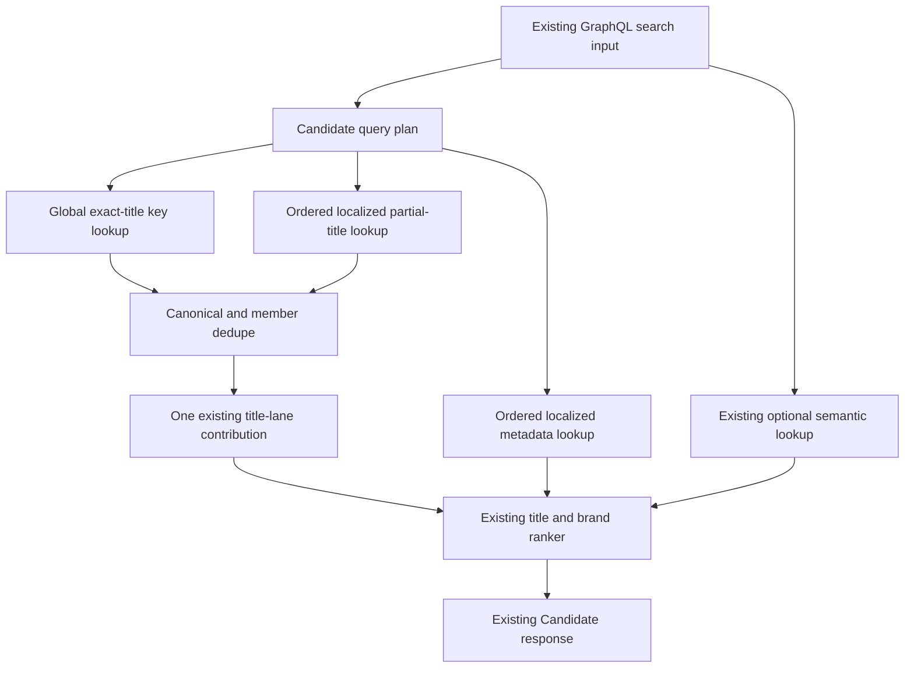
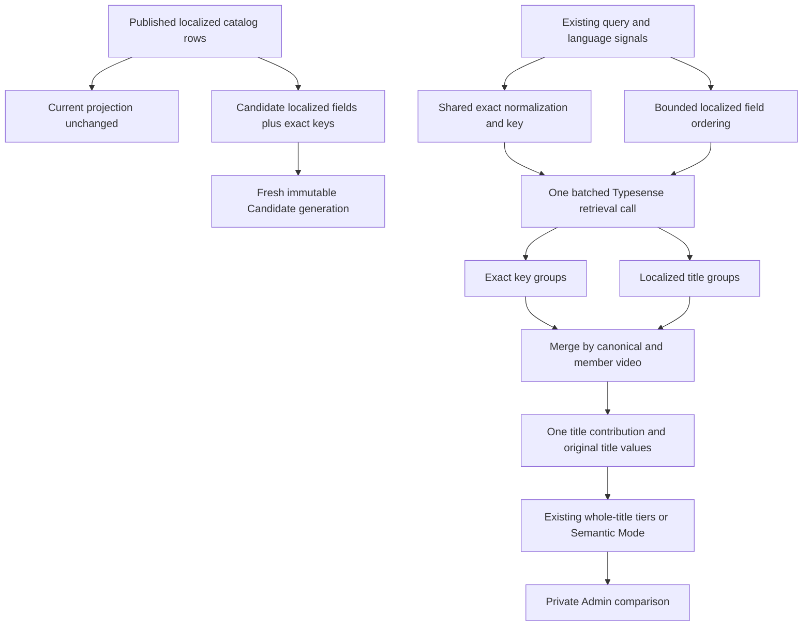

# Candidate Native-Language Query Routing - Plan

## Goal Capsule

- **Objective:** Make Candidate retrieve and rank exact localized titles without depending on one unreliable language guess.
- **Product authority:** Admin Candidate search owns this change. The existing GraphQL contract, public Watch frontend, Current search, and playback behavior stay unchanged.
- **Execution profile:** Add one Candidate-only global exact-title lookup. Retain localized partial-title, metadata, and optional semantic retrieval. Feed exact proof into the existing title-ranking system.
- **Evaluation surface:** Authenticated evaluators use the private Admin comparison page with identical Current and Candidate inputs.
- **Stop conditions:** Stop if exact-title relevance weakens, conceptual semantic searches change without title evidence, public behavior changes, any latency percentile is slower than Current, or a bounded resource gate fails.
- **Tail ownership:** Build a new Evaluation generation and qualify it privately. Do not select it for Serving in this work.

---

## Product Contract

### Summary

Add a small global exact-title path for Candidate while keeping the existing localized title path for partial and typo-tolerant matching.
Use exact retrieval only as stronger evidence for the existing title ranker.
Keep metadata and semantic retrieval available, keep language signals advisory, and leave public search untouched.

### Problem Frame

Candidate stores localized titles and metadata in fields configured for different Typesense locales.
Typesense parses a query with the locale of the first `query_by` field.
Candidate currently sends all localized title fields in one request, so a later field such as Russian can miss an indexed exact title when an earlier field supplies a different tokenizer.

A Typesense 30.2 preflight disproved the original plan to replace localized title fields with one locale-neutral title field.
That field passed exact recall across representative scripts, but it regressed required partial or typo behavior for Han, Kana, Cyrillic, or Latin cases depending on the selected locale.
Infix passed the test matrix but was rejected because its full-corpus index cost was not qualified.

UI language, requested content language, query language, tokenizer locale, and playback language are different concepts.
An English-interface user may want Russian content to share, while a Russian-interface user may want Russian content without a manual selection.
Route, browser, script, and query hints therefore cannot become hard content filters.

The fix must improve exact native-title recall without replacing the ranking system.
Exact proof must activate the existing title-first ranking tiers, while semantic search remains the supporting and fallback path for conceptual queries.

### Key Decisions

- **Keep the fix server-side and Candidate-only.** (session-settled: user-directed — chosen over frontend or playback changes: this iteration must improve retrieval without altering public Watch behavior.) Governs R1, R13, R14.
- **Add a global exact-title path and retain localized partial-title retrieval.** (session-settled: user-approved — chosen over one global tokenized title field: the Typesense 30.2 preflight found cross-script partial or typo regressions.) Governs R2-R5.
- **Feed exact proof into the existing title-ranking system.** (session-settled: user-approved — chosen over a second scoring system: exact title evidence must outrank semantic results without double-scoring a video.) Governs R4-R6.
- **Use language signals as ordered evidence.** (session-settled: user-approved — chosen over treating UI or browser language as the requested content language: interface language and sharing intent can differ.) Governs R7-R9.
- **Defer an external statistical language detector.** (session-settled: user-approved — chosen over adding GlotLID or fastText now: coverage does not remove short-query accuracy, model-size, and latency costs.) Governs R10.
- **Make latency a hard acceptance gate.** (session-settled: user-directed — chosen over accepting slower retrieval for better relevance: Candidate must match or beat Current under equivalent queries.) Governs R11, R12.
- **Keep Current and public traffic unchanged.** (session-settled: user-directed — chosen over replacing public search during development: Candidate must be evaluated privately before any separate promotion decision.) Governs R13, R14.

### Requirements

**Query recall and ranking**

- R1. Candidate must accept the existing Watch search GraphQL input without frontend or contract changes.
- R2. Every published localized title in the Candidate generation must remain eligible for global exact whole-title recall without one inferred language admitting it.
- R3. Candidate must retain localized title fields for tokenizer-aware partial and supported typo matching.
- R4. Exact and partial title hits for the same canonical video and member video must merge before scoring and must receive one title-lane contribution.
- R5. Trusted exact evidence must enter the existing title lane with its original title values so the ranker can classify it as `NORMALIZED_WHOLE_TITLE`.
- R6. An exact normalized whole-title match must outrank metadata, semantic, partial-title, and typo-tolerant evidence. When multiple canonical videos share the exact title, the existing general ranking signals and reviewed relevance judgment determine the result; this work must not add a title-specific rule.

**Language signal precedence**

- R7. A user-selected search language must be the strongest field-ordering signal while global exact-title recall remains intact.
- R8. A language named in the query and query-language evidence must outrank display, route, and browser hints when no explicit selection conflicts.
- R9. Ambiguous, unsupported, or low-confidence query-language evidence must retain global exact and fallback lexical recall instead of excluding languages.
- R10. This iteration must use language metadata and query evidence already available to the server without a new language-identification model.

**Performance and isolation**

- R11. Candidate p50, p95, and p99 end-to-end query latency must each be no higher than Current in equivalent production-shaped comparison runs.
- R12. Candidate must add exactly one logical exact-title subsearch inside the existing first Typesense multi-search call. It must keep HTTP retrieval-call count, retry behavior, hydration bounds, timeouts, and serving reliability unchanged, and it must remain inside the pre-registered request, response, RAM, disk, import-peak, and build-time budgets in KTD9.
- R13. The change must affect only the Candidate retrieval profile used by private Admin comparison.
- R14. Current search, public Watch traffic, result rendering, language controls, playback selection, and watchability behavior must remain unchanged.

### Query Flow

- F1. Candidate native-language retrieval
  - **Trigger:** The private comparison service submits a Candidate search.
  - **Steps:** Candidate computes the exact key, orders localized fields from bounded language evidence, performs one batched exact/title/metadata retrieval with the existing optional semantic retrieval, and merges exact and partial title hits before existing fusion.
  - **Outcome:** An exact localized title activates existing whole-title ranking without a frontend, playback, or scoring-system change.
  - **Covered by:** R1-R10, R13, R14.
- F2. Semantic fallback
  - **Trigger:** A query has no trusted exact or strong title anchor.
  - **Steps:** Existing metadata and semantic evidence are fused and ranked using current Candidate behavior.
  - **Outcome:** Conceptual searches keep semantic ordering.
  - **Covered by:** R4-R6, R10, R14.
- F3. Performance qualification
  - **Trigger:** The revised Candidate is available as a fresh Evaluation generation.
  - **Steps:** Equivalent production-shaped queries run through Current and Candidate under paired latency, bounded-work, payload, and capacity checks.
  - **Outcome:** The generation remains Evaluation-only in this work; every gate must pass before any separate future promotion decision.
  - **Covered by:** R11-R14.

### Acceptance Examples

- AE1. Native exact title on a different UI language
  - **Covers R2-R9.**
  - **Given:** The UI and route are English and no search language was selected.
  - **When:** The user enters an exact localized title in another language.
  - **Then:** Candidate classifies the expected canonical video as a normalized whole-title match and ranks it above weaker title, metadata, or semantic results.
- AE2. Exact and partial duplicate
  - **Covers R4-R6.**
  - **Given:** The same video is returned by both exact and localized partial-title lookups.
  - **When:** Candidate fuses the batch.
  - **Then:** The video receives exact title proof and one title-lane contribution, not an extra exact-lane score.
- AE3. Conceptual semantic query
  - **Covers R4-R6.**
  - **Given:** The query has no exact or strong title anchor.
  - **When:** Semantic results express the query meaning better than title or metadata results.
  - **Then:** Candidate stays in Semantic Mode and preserves the existing semantic order.
- AE4. Explicit selected language
  - **Covers R7-R9.**
  - **Given:** The UI is English and the user explicitly selected Russian search.
  - **When:** The user submits a Russian, English, or mixed-language query.
  - **Then:** Russian localized fields are searched first, but global exact-title and remaining localized fields are not removed.
- AE5. Ambiguous query
  - **Covers R8-R10.**
  - **Given:** A short query could belong to several languages that share a script or tokenizer family.
  - **When:** Candidate cannot identify one language confidently.
  - **Then:** Candidate keeps global exact, localized title, fallback metadata, and semantic recall instead of applying a language filter.
- AE6. Duplicate exact titles
  - **Covers R6.**
  - **Given:** Multiple canonical videos share the same normalized localized title.
  - **When:** Exact retrieval returns all of them.
  - **Then:** Existing general ranking evidence selects the reviewed expected canonical result without a title-specific rule.
- AE7. Latency and capacity non-regression
  - **Covers R11, R12.**
  - **Given:** Current and Candidate receive equivalent production-shaped query samples and fixed-load resource runs.
  - **When:** Their latency distributions, work counts, payloads, RSS, disk, import peak, and build time are compared.
  - **Then:** Candidate is rejected if a latency percentile is slower, work exceeds the one-subsearch allowance, or a reviewed capacity budget fails.

### Scope Boundaries

- No public Watch frontend, Admin comparison UI, language-selector, or UI-language behavior changes.
- No GraphQL input or result-contract changes.
- No playback-language, Dub, subtitle, watchability, or result-link changes.
- No change to Current search and no automatic Candidate promotion to public traffic.
- No GlotLID, fastText, CLD3, Algolia, hosted detector, or custom language model in this iteration.
- No language or script hard filters for Candidate title recall.
- No per-language or per-script request fan-out.
- No new exact-lane weight, RRF contribution, or title-specific promotion rule.
- Candidate-owned query and index mechanics may change only when they satisfy R11-R14.

### Dependencies and Assumptions

- The existing request continues to provide explicit search-language selection, named-query language, display language, route language, current Watch language, browser language, and a separate playback/result target when available.
- Candidate generation continues to use immutable physical collections and a separate Evaluation pointer.
- The private comparison path remains the qualification surface and does not serve ordinary public requests.

### Sources and Research

- `apps/admin/src/services/typesense-watch-search.service.ts` owns Candidate request batching, canonical fusion, exact-title classification, title evidence, semantic fallback, diagnostics, and profile isolation.
- `apps/admin/src/services/typesense-watch-search-ranking.ts` owns normalized whole-title evidence, title-first mode, semantic fallback, and general tie-breaking.
- `apps/admin/src/services/typesense-watch-search-lexical.ts`, `apps/admin/src/services/typesense-watch-search-schema.ts`, and `apps/admin/src/services/typesense-watch-search-indexer.ts` own Candidate lexical documents, indexed fields, digests, and keyword-memory estimates.
- `apps/admin/src/services/typesense-client.ts` fails a full multi-search batch when any subsearch returns an error. Candidate therefore fails closed on exact-field incompatibility while the comparison service keeps Current valid.
- `apps/admin/src/scripts/benchmark-watch-search-candidate.ts` already measures paired p50, p95, p99, confidence, request count, payload, candidate window, and hydration limits.
- `docs/solutions/logic-errors/typesense-watch-search-rrf-brand-ranking-regression.md` requires exact proof to use the existing title-ranking tiers and conceptual searches without an anchor to remain semantic.
- `docs/solutions/logic-errors/watch-search-chinese-lexical-playback-language-conflation.md` requires lexical language, tokenizer locale, and playback target to stay separate.
- `docs/solutions/performance-issues/typesense-watch-search-payload-projection-latency.md` requires engine, network, application, and payload measurements to remain separate.
- `docs/solutions/integration-issues/watch-search-candidate-generation-stable-application-revision.md` requires deliberate compatibility revisions and fresh Candidate qualification after query/index contract changes.
- A local Typesense 30.2 preflight found that no tested single-field locale preserved the complete exact, partial, punctuation, case, and supported-typo matrix across Cyrillic, Han, Kana, Arabic, and Latin. This evidence rejects the former `title_global` architecture.

---

## Planning Contract

**Product Contract preservation:** Changed R2-R6 and R12 after implementation preflight disproved the single global tokenized title field. The approved user outcome and scope are unchanged.

### Key Technical Decisions

- KTD1. **Retain localized titles and add one fixed-size exact key.** (session-settled: user-approved — chosen over replacing localized fields with one global tokenized field: the preflight found cross-script partial or typo regressions.) Candidate lexical documents keep their existing `title_<locale>` fields and add a collision-resistant key for each deterministically normalized whole title. Do not duplicate full title text. Covers R2-R3.
- KTD2. **Share the exact-key normalizer and verify ranker compatibility.** Indexing and query code call one locale-neutral helper for Unicode compatibility normalization, case, punctuation, symbols, and whitespace before key derivation. Empty normalized titles create no key. Ranking retains its existing normalization contract and verifies returned original titles before granting whole-title evidence. Shared multilingual fixtures must prove the two contracts agree on every supported exact-match variant. Covers R2, R5-R6.
- KTD3. **Add one logical subsearch, not one network call.** Candidate batches exact key, localized partial title, localized metadata, and optional semantic searches in the existing first Typesense `multi_search` HTTP call. Hydration remains the second retrieval call. Covers R11-R12.
- KTD4. **Merge exact proof into the existing title lane before scoring.** (session-settled: user-approved — chosen over a separate exact score: title ranking must beat semantic without double-counting.) Merge exact and partial groups by canonical and member video identity. Exact proof supplies original title values, sets exact/whole-title evidence, and shares one title rank/contribution with the merged partial result. Keep title, metadata, semantic weights and score normalization unchanged. Covers R4-R6.
- KTD5. **Order localized fields with bounded evidence but never filter them.** (session-settled: user-approved — chosen over making UI or browser language a content filter: language signals guide routing but cannot remove global recall.) Apply this order: explicit search-language selection, named language, query-language evidence, script evidence, current Watch language, display language, route language, browser language. Preferred tokenizer fields move first, generic fallback follows, and all remaining manifest fields stay eligible. Covers R7-R10.
- KTD6. **Keep retrieval language separate from result language.** (session-settled: user-directed — chosen over playback changes: this iteration changes query retrieval only.) An exact key hit may rank a video but cannot invent a target language. A returned language identity may confirm only a candidate already present in the bounded query plan. Covers R7-R10, R14.
- KTD7. **Fail Candidate closed on an invalid exact path.** The shared Typesense client treats any failed subsearch as a failed batch. Missing fields, malformed exact requests, or incompatible generations therefore fail Candidate while the comparison service keeps Current valid. Do not hide schema drift by silently dropping the exact path. Covers R12-R14.
- KTD8. **Use Candidate compatibility boundaries.** The schema, document projection, and retrieval contract change together, so bump the Candidate application revision, build a fresh immutable generation, and move only the Evaluation pointer. Update ranking identity only if implementation changes ranking semantics beyond supplying existing evidence. Covers R12-R14.
- KTD9. **Qualify one extra subsearch under strict latency and bounded resources.** (session-settled: user-directed — chosen over accepting a relevance/latency trade-off: Candidate must match or beat Current.) Candidate must use exactly Current plus one logical subsearch and must keep HTTP calls equal. Reject any worse p50, p95, or p99 across caller, Admin server, Typesense wall, or Typesense server measurements. Keep the configured paired sample, alternating order, and one-sided paired 95% upper-ratio limit of 1.05. Pre-register the capacity budgets below before inspecting Candidate measurements. Covers R11-R12.

#### Candidate Capacity Budgets

| Dimension                             | Hard limit                                                                      |
| ------------------------------------- | ------------------------------------------------------------------------------- |
| HTTP retrieval calls                  | Equal to Current                                                                |
| Logical subsearches                   | Exactly Current plus one                                                        |
| Total first-request bytes             | At most 32 KiB                                                                  |
| Additional parsed response            | At most 256 KiB per query above Current                                         |
| Exact-key searchable bytes            | At most 32 stored ASCII bytes per distinct normalized indexed title             |
| Estimated exact-key RAM               | At most three times exact-key searchable bytes                                  |
| Candidate incremental non-vector disk | At most 1 GiB                                                                   |
| Typesense steady memory and disk      | Below 70% of provisioned capacity                                               |
| Build/import peak memory and disk     | Below 80% of provisioned capacity, with zero swap and at least 10 GiB free disk |
| Build/import duration                 | At most 1.10 times the matched Current projection build                         |

- KTD10. **Keep duplicate exact-title ranking general.** Resolve exact-title ties with existing non-title-specific ranking evidence and reviewed relevance judgments. Do not add a Jesus-specific or language-specific promotion rule. Covers R6, R14.

### High-Level Technical Design

The new lookup improves recall and then hands control back to the existing title ranker.

### Assumptions

- A1. A deterministic fixed-size key adds less index data than duplicating full localized titles. Full-corpus resource qualification must verify this.
- A2. Collision risk can be made negligible with a collision-resistant key. Tests must still prove deterministic output, empty handling, and distinct representative normalized titles.
- A3. Existing original localized title fields provide the title values the ranker needs to verify exact proof and construct its anchor.

### Implementation Constraints

- Implement on top of current `origin/main`.
- Keep PostgreSQL as source of truth and Candidate Typesense projections disposable.
- Keep the existing search-only runtime credential and operator-only indexing credential split.
- Preserve two retrieval HTTP calls, candidate windows, hydration bounds, retry behavior, timeouts, semantic vector limits, and ranking weights.
- Project the smallest exact result needed for grouping, member identity, language confirmation, and title evidence.
- Do not log raw queries, normalized titles, keys, result text, vectors, or credentials in qualification evidence.

### Alternative Approaches Considered

- **One locale-neutral global title field:** Rejected by the Typesense 30.2 preflight because no tested locale preserved the required cross-script partial and typo matrix.
- **One localized title subsearch per tokenizer:** Correct but rejected because work grows with language coverage and fails the latency and fan-out contract.
- **Infix on a global title field:** Passed the local relevance matrix but rejected until full-corpus index, RAM, import, and latency costs are qualified.
- **Duplicate every full title into an exact field:** Simple but rejected because a fixed-size key has a smaller and bounded projection.
- **Choose one language and hard-filter:** Fast but rejected because ambiguous queries and cross-language sharing intent would lose valid titles.
- **Retune global RRF weights:** Rejected because semantic retuning cannot recover a title excluded during retrieval and can damage conceptual searches.
- **Add a statistical detector first:** Deferred because short-query accuracy, coverage, model memory, and latency require separate evaluation.

### Risks and Dependencies

| Risk                                                    | Impact                                                 | Mitigation                                                                            |
| ------------------------------------------------------- | ------------------------------------------------------ | ------------------------------------------------------------------------------------- |
| Exact and partial results both add score                | Exact videos receive an artificial double boost        | Apply KTD4 and assert one title contribution per canonical group                      |
| Exact-key and ranking normalization drift               | Retrieval claims exact but the ranker cannot verify it | Apply KTD2 and test both contracts with the same multilingual fixtures                |
| Key collision                                           | An unrelated title appears as exact evidence           | Use a collision-resistant key, verify returned titles, and test distinct inputs       |
| Exact result omits title values                         | Existing ranker stays in Semantic Mode                 | Project populated localized title fields and assert `NORMALIZED_WHOLE_TITLE` evidence |
| Weak language hint controls the first partial tokenizer | Partial recall skews toward UI or route language       | Apply KTD5, keep the complete manifest, and test ambiguous/unsupported queries        |
| One exact subsearch fails                               | The Candidate batch fails                              | Apply KTD7 so incompatibility is visible while Current comparison remains valid       |
| Extra indexed keys or hits create capacity pressure     | RSS, disk, import peak, payload, or tail latency grows | Apply KTD9 and reject the generation when a reviewed budget or latency gate fails     |
| Old Evaluation generation remains selected              | Candidate fails or mixes incompatible contracts        | Apply KTD8 and require a fresh application revision and Evaluation generation         |

### System-Wide Impact

- **Data projection:** Candidate lexical documents gain fixed-size exact keys while keeping localized title and metadata fields. Current documents and shared transcript members remain unchanged.
- **Ranking:** No new score or weight is introduced. Exact retrieval supplies stronger evidence to existing title tiers; no-anchor queries keep Semantic Mode.
- **Compatibility:** The Candidate application revision changes. Old Candidate generations remain durable but cannot execute with the new code.
- **Serving:** Current aliases, public GraphQL behavior, and the Serving pointer remain untouched.
- **Operations:** A new Evaluation generation must be built, checked in the private comparison page, and benchmarked before any future promotion discussion.

---

## Implementation Units

### U1. Add the Candidate exact-title key projection

- **Goal:** Add small global exact-title keys while preserving all existing localized Candidate and Current fields.
- **Requirements:** R2-R3, R12-R14; F1; AE1, AE5; KTD1-KTD2; A1-A3.
- **Dependencies:** None.
- **Files:** `apps/admin/src/services/typesense-watch-search-exact-title.ts`, `apps/admin/src/services/typesense-watch-search-exact-title.test.ts`, `apps/admin/src/services/typesense-watch-search-lexical.ts`, `apps/admin/src/services/typesense-watch-search-lexical.test.ts`, `apps/admin/src/services/typesense-watch-search-schema.ts`, `apps/admin/src/services/typesense-watch-search-schema.test.ts`, `apps/admin/src/services/typesense-watch-search-indexer.ts`, `apps/admin/src/services/typesense-watch-search-indexer.test.ts`.
- **Approach:** Centralize deterministic normalization and collision-resistant key derivation. Add a Candidate-specific projection wrapper and Candidate schema extension that decorate the unchanged shared Current document builder and schema with exact keys. Retain localized title and metadata fields byte-for-byte. Include exact-key bytes in projection digests and keyword-memory estimates.
- **Execution note:** Add normalization and Current-projection characterization tests before changing the Candidate projection.
- **Patterns to follow:** `normalizeWatchSearchTitle`, `buildTypesenseWatchLexicalDocuments`, `candidateWatchCollectionSchemas`, `buildTypesenseWatchCandidateProjectionSnapshot`, and `estimateTypesenseKeywordMemory`.
- **Test scenarios:**
  1. Cyrillic, Han, Kana, Arabic, and Latin whole titles produce deterministic Candidate exact keys while retaining localized fields.
  2. NFKC-equivalent, case, punctuation, symbol, and whitespace variants expected to be exact produce the same key and verify against returned titles.
  3. Empty or punctuation-only normalized values create no exact key.
  4. Distinct representative normalized titles create distinct keys.
  5. Candidate projection digests change when an exact title changes and remain deterministic across input order.
  6. Keyword-memory estimates include exact keys explicitly.
  7. Current lexical documents and schema remain unchanged.
  8. Malformed or identity-less locale rows continue to fail closed.
- **Verification:** Candidate adds one fixed-size key per distinct normalized localized title without removing localized fields or changing Current output.

### U2. Route and merge Candidate retrieval

- **Goal:** Retrieve exact titles globally, preserve tokenizer-aware partial recall, and feed one title evidence stream into existing ranking.
- **Requirements:** R1-R10, R12-R14; F1-F2; AE1-AE6; KTD2-KTD7; A3.
- **Dependencies:** U1.
- **Files:** `apps/admin/src/services/typesense-watch-search-query-plan.ts`, `apps/admin/src/services/typesense-watch-search-query-plan.test.ts`, `apps/admin/src/services/typesense-watch-search-locales.ts`, `apps/admin/src/services/typesense-watch-search-locales.test.ts`, `apps/admin/src/services/typesense-watch-search.service.ts`, `apps/admin/src/services/typesense-watch-search.service.test.ts`, `apps/admin/src/services/typesense-client.test.ts`.
- **Approach:** Compute the exact key and prepend its minimal request to Candidate's existing first multi-search batch. Order localized title and metadata fields per KTD5, followed by fallback and the untouched manifest remainder. Remove Candidate lexical language filters. Parse exact/title/metadata/optional-semantic results by explicit lane identity rather than brittle offsets. Merge exact and partial hits before `buildFusedCandidateGroups`, and provide one title rank, contribution, original title values, and verified whole-title evidence. Preserve Current request construction and ranking weights.
- **Execution note:** Start with service tests that reproduce an exact Cyrillic miss under an English UI and prove exact-plus-partial deduplication.
- **Patterns to follow:** `buildTypesenseWatchSearchQueryPlan`, `watchLexicalManifestQueryFields`, `lexicalLaneRequest`, `createCandidateTitleMatchClassifier`, `buildFusedCandidateGroups`, and `rankWatchSearchGroups`.
- **Test scenarios:**
  1. Covers AE1. Exact Cyrillic, Han, Kana, Arabic, and Latin titles are retrieved without script branches and classify as `NORMALIZED_WHOLE_TITLE`.
  2. Covers AE2. The same video in exact and partial results receives one title-lane contribution and retains exact proof.
  3. Covers AE3. A conceptual query with no title anchor remains in Semantic Mode with unchanged semantic ordering.
  4. Covers AE4. Explicit Russian selection moves Russian partial-title and metadata fields first while exact recall and all remaining fields stay eligible.
  5. Named query language and query evidence outrank display, route, and browser hints when no explicit selection exists.
  6. Covers AE5. Ambiguous or unsupported text retains exact, fallback, and complete manifest recall without a language filter.
  7. Covers AE6. Duplicate exact titles use existing general ranking evidence and deterministic tie-breaking.
  8. An exact hit cannot create a playback/result target or override an explicit or unambiguous existing playback/result target.
  9. Candidate submits exact, title, metadata, and optional semantic searches in one first HTTP call, followed by unchanged hydration.
  10. A missing exact field or exact subsearch error fails Candidate; Current remains valid through comparison isolation.
  11. Current title fields, filters, result order, and response contract remain unchanged.
- **Verification:** Candidate exact titles activate existing title-first ranking, partial and semantic behavior remain intact, and diagnostics show one added logical search with unchanged HTTP calls.

### U3. Bind the contract to a fresh Candidate generation

- **Goal:** Prevent new query code from using a Candidate generation with the old lexical schema.
- **Requirements:** R12-R14; F3; KTD8.
- **Dependencies:** U1, U2.
- **Files:** `apps/admin/src/services/typesense-watch-search-candidate-identity.ts`, `apps/admin/src/services/typesense-watch-search-candidate-identity.test.ts`, `apps/admin/src/scripts/index-typesense-watch-search-candidate.ts`, `apps/admin/src/scripts/index-typesense-watch-search-candidate.test.ts`.
- **Approach:** Bump the semantic Candidate application revision. Publish the new schema and documents through the immutable generation lifecycle. Validate the exact field manifest, counts, digest, memory estimate, and read smoke before moving only the Evaluation pointer. Keep the ranking revision unchanged only if U2 preserves existing ranking semantics as required by KTD4.
- **Patterns to follow:** `candidateWatchSearchApplicationRevision`, `publishTypesenseWatchSearchCandidate`, generation compare-and-swap, capacity evidence, and exact compatibility checks in Candidate profile resolution.
- **Test scenarios:**
  1. The application revision differs from the old projection contract and remains stable across unrelated deploys.
  2. A generation without exact keys fails compatibility before Candidate search runs.
  3. Candidate publication imports localized fields and exact keys, records the exact manifest and digest, and completes count checks.
  4. Capacity evidence includes the revised exact-key keyword estimate and build RSS.
  5. Publication moves only Evaluation and does not touch Serving or Current aliases.
  6. A partial build, stale generation, revision mismatch, or pointer race fails closed and remains recoverable.
- **Verification:** A fresh ready Evaluation generation resolves under the new revision, while the prior generation is rejected without fallback to Current aliases.

### U4. Qualify relevance, latency, and resource use

- **Goal:** Prove the native-language improvement without accepting slower or unbounded Candidate search.
- **Requirements:** R6, R11-R14; F2-F3; AE1-AE7; KTD9-KTD10; A1-A3.
- **Dependencies:** U2, U3.
- **Files:** `apps/admin/src/scripts/benchmark-watch-search-candidate.ts`, `apps/admin/src/scripts/benchmark-watch-search-candidate.test.ts`, `docs/operations/typesense-watch-search-production-readiness.md`.
- **Approach:** Amend the bounded-work rule to require Candidate exactly one more logical subsearch than Current while keeping HTTP retrieval calls equal. Preserve the paired identity lease, configured sample and repeat counts, alternating order, failure accounting, percentile and confidence rules, candidate and hydration bounds, and privacy projection. Enforce the pre-registered KTD9 capacity budgets. Extend production-shaped qrels for representative exact, partial, semantic, ambiguous, and duplicate-title cases without title-specific rules.
- **Patterns to follow:** `PRODUCTION_CASES`, `evaluateCandidateQualification`, `boundedWorkReasons`, Candidate capacity evidence, and the native-language Candidate operations runbook.
- **Test scenarios:**
  1. Covers AE7. Any worse Candidate p50, p95, or p99 for caller, Admin server, Typesense wall, or Typesense server fails qualification.
  2. Candidate uses the same retrieval HTTP calls as Current and exactly one extra logical subsearch; any additional search, retry, or larger hydration window fails.
  3. Request/response, exact-key bytes, steady RSS, disk, import peak, or build/import duration above the reviewed budget fails qualification.
  4. Exact Russian, Simplified and Traditional Chinese, Japanese, Arabic, and representative Latin titles place the reviewed canonical video first without title-specific rules.
  5. Partial native titles, punctuation variants, and supported typo cases do not regress against the reviewed baseline.
  6. Conceptual semantic, mixed-language, broad-title, no-result, duplicate, and language-correctness slices retain their gates.
  7. Benchmark evidence binds the exact Current tuple, Candidate generation, application revision, ranking revision, transcript revision, and reviewed qrels revision.
  8. The private comparison page completes both sides for the representative query set and public Current traffic remains unchanged.
- **Verification:** Reviewed relevance passes and every latency, confidence, bounded-work, payload, capacity, failure, and Current-interference gate passes for the exact Evaluation generation.

---

## Verification Contract

| Gate                                      | Applies to | Verification                                                                                                                                                                                                                                            | Done signal                                                                                                                                  |
| ----------------------------------------- | ---------- | ------------------------------------------------------------------------------------------------------------------------------------------------------------------------------------------------------------------------------------------------------- | -------------------------------------------------------------------------------------------------------------------------------------------- |
| Exact key, projection, and schema tests   | U1         | `pnpm --filter @forge/admin test -- src/services/typesense-watch-search-exact-title.test.ts src/services/typesense-watch-search-lexical.test.ts src/services/typesense-watch-search-schema.test.ts src/services/typesense-watch-search-indexer.test.ts` | Candidate exact keys are deterministic and Current snapshots remain unchanged                                                                |
| Query planning, fusion, and ranking tests | U2         | `pnpm --filter @forge/admin test -- src/services/typesense-watch-search-query-plan.test.ts src/services/typesense-watch-search-locales.test.ts src/services/typesense-watch-search.service.test.ts src/services/typesense-client.test.ts`               | Exact and partial hits contribute once, exact titles activate title mode, and no-anchor queries remain semantic                              |
| Generation compatibility tests            | U3         | `pnpm --filter @forge/admin test -- src/services/typesense-watch-search-candidate-identity.test.ts src/scripts/index-typesense-watch-search-candidate.test.ts`                                                                                          | Old generations fail closed and Evaluation-only publication remains intact                                                                   |
| Qualification harness tests               | U4         | `pnpm --filter @forge/admin test -- src/scripts/benchmark-watch-search-candidate.test.ts`                                                                                                                                                               | The one-subsearch allowance is exact and every excess-work or capacity case fails closed                                                     |
| Static quality                            | U1-U4      | `pnpm --filter @forge/admin typecheck` and `pnpm --filter @forge/admin lint`                                                                                                                                                                            | Admin typecheck and lint pass without unrelated suppressions                                                                                 |
| Private relevance check                   | U2-U4      | Authenticated Admin comparison against the exact Evaluation generation                                                                                                                                                                                  | Representative exact titles return the expected canonical video first, conceptual searches retain semantic behavior, and Current stays valid |
| Production-shaped qualification           | U4         | `pnpm --filter @forge/admin benchmark:watch-search-candidate`                                                                                                                                                                                           | Candidate is no slower at p50, p95, or p99 and uses exactly one allowed extra logical search                                                 |
| Resource and isolation check              | U3-U4      | Fixed-load Typesense RSS/disk/import/build evidence plus existing payload, retry, Current-interference, and pointer checks                                                                                                                              | All reviewed capacity budgets pass with no public-serving regression                                                                         |

---

## Definition of Done

- U1 is complete when Candidate retains localized title/metadata fields, adds one fixed-size key per distinct normalized localized title, counts its bytes, and leaves Current projection unchanged.
- U2 is complete when exact and partial hits merge before scoring, exact proof activates `NORMALIZED_WHOLE_TITLE`, each video receives one title contribution, no-anchor semantic order is unchanged, and Candidate uses one extra logical search inside the existing HTTP call.
- U3 is complete when the application revision is bumped, old generations fail closed, and a fresh compatible generation is published to Evaluation only.
- U4 is complete when reviewed native-title, partial-title, duplicate-title, and semantic cases pass and all latency, confidence, resource, failure, and Current-interference gates pass.
- Public Watch, Current Typesense search, GraphQL, result rendering, language controls, playback, watchability, and the Serving pointer have no behavior change.
- No title-specific ranking rule, per-script branch, statistical detector, second scoring system, experimental dead code, or abandoned projection remains in the final diff.
