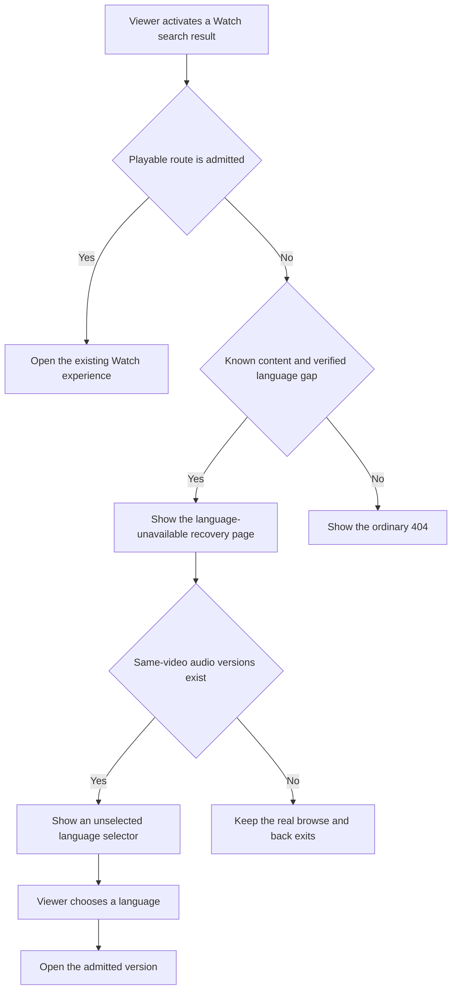
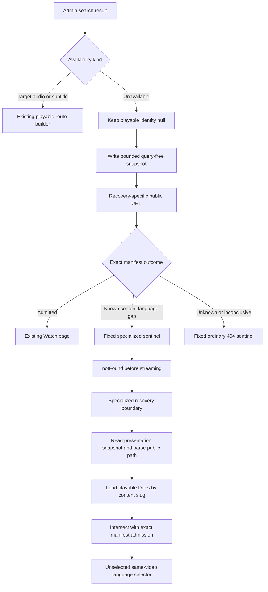
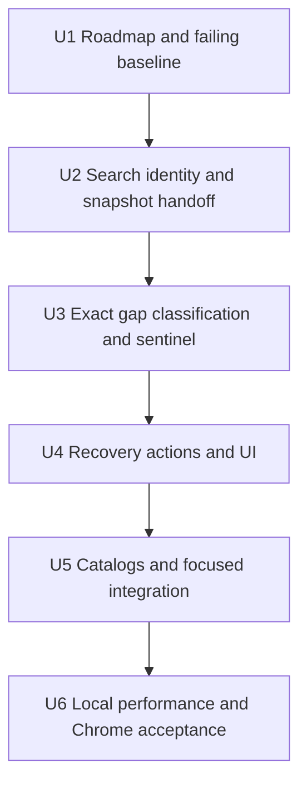

# Watch Search Unavailable-Language Recovery - Plan

## Goal Capsule

- **Objective:** Replace the dead-end generic 404 reached from a relevant Watch search result that lacks the viewer's selected language with a localized recovery experience that offers only real next destinations.
- **Product authority:** This contract governs unavailable-result behavior across all Watch languages, the recovery page, and local acceptance. It does not redesign search relevance, ordinary 404 behavior, or language fallback policy.
- **Execution profile:** Local, test-first Web implementation. Create the roadmap record, capture the current failure, implement the recovery path, and stop after automated and Chrome acceptance.
- **Authority order:** Product Requirements and session-settled decisions override technical convenience. Existing public playback-route, App Router not-found, route-manifest, i18n, and performance conventions remain binding.
- **Stop conditions:** Stop if the change requires an Admin GraphQL/schema change, weakens exact playback admission, restores query-driven search URLs, makes the recovery response indexable, or needs production data mutation.
- **Tail ownership:** Review skills, commit, push, PR, deployment, production verification, and Slack remain deferred until the user approves the local behavior and UI.

---

## Product Contract

### Summary

Keep relevant but unavailable Watch results visible, preserve their null playback identity, and route their clicks to a dedicated current-language-unavailable not-found experience. The page explains the gap and lets the viewer explicitly select a real audio-language version of the same video through a Watch-style language selector.

### Problem Frame

Watch search can truthfully classify a matching video as unavailable when it has no playable version for the viewer's selected language. The Admin contract leaves its playback and action language empty, but the current Web mapping can fill that empty language with the resolved search language and the card then constructs a public Watch URL from it. Route admission correctly rejects that nonexistent content-and-audio combination, so the viewer reaches a generic 404 after clicking a relevant result.

This failure was discovered during a Chinese-speaker review, but the unavailable classification is shared by all languages. PR #1867 solved a different case: a result with requested-language subtitles and a valid audio route. It did not make an unavailable result playable.

### Key Decisions

- **Use a dedicated recovery page.** (session-settled: user-directed — chosen over a Toast or silent English fallback: a page-level explanation preserves the viewer's language choice.) Governs R2, R4, R9.
- **Treat the failure as language-agnostic.** (session-settled: user-directed — chosen over a Chinese-only patch: the same unavailable contract applies to every Watch language.) Governs R1, R4, R14.
- **Keep relevant unavailable results discoverable.** (session-settled: user-approved — chosen over hiding the result: the viewer can still learn that the matching content exists and choose a valid alternative.) Governs R1, R2.
- **Offer same-video audio languages through one selector.** (session-settled: user-directed — chosen over same-search video cards or a new language grid: the existing Watch selector style avoids repeated artwork and stays usable when a video has many Dubs.) Governs R6, R7, R12.
- **Require an explicit language choice.** (session-settled: user-approved — chosen over preselecting English or the first result: the page must not turn an available fallback into the viewer's intent.) Governs R7, R9.
- **Use a helpful 404 without replacing ordinary 404s.** (session-settled: user-approved — chosen over a successful error-like page: invalid language URLs must remain non-indexable while known content can offer recovery.) Governs R10, R11.
- **Reuse the Watch visual language.** (session-settled: user-approved — chosen over a new error-page design system: the existing cinematic shell and language-selection interaction already fit the experience.) Governs R12, R13.
- **Complete and approve the experience locally first.** (session-settled: user-directed — chosen over moving immediately into review and PR workflows: behavior and UI must be satisfactory before handoff.) Governs R15, R16, R17.

<!-- ce-section: work-relationships -->

### How This Work Fits Together

This plan owns the F3 unavailable-result failure identified in the broader Chinese-speaker Watch review. The broader review remains a separate feedback activity rather than active scope here.

- **Builds on:** PR #1867's separation of requested subtitle language from playable audio-route language.
- **Shares:** The existing Watch search availability contract and public route-admission rules.
- **Can proceed independently of:** Other Chinese-speaker findings such as topic-card localization and language-picker keyboard scrolling.
- **Defers:** PR review, repository learning capture, and production validation until the local behavior and UI are accepted.

### Actors

- A1. **Viewer:** A person searching Watch in any supported language.
- A2. **Watch Search:** The system that returns relevant results and states whether each result is playable in the requested language.
- A3. **Watch routing and recovery experience:** The system that admits real playback routes, preserves true not-found behavior, and presents valid recovery actions.
- A4. **Search engine:** A crawler that must not interpret a nonexistent language version as an indexable video page.

### Requirements

**Search-result behavior**

- R1. A relevant result may remain visible when its availability is `unavailable`, regardless of the requested language.
- R2. Activating an unavailable result must open the dedicated language-unavailable experience rather than imply that the requested language is playable.
- R3. Results with admitted target-audio or target-subtitle playback must retain their existing destinations and behavior.

**Recovery experience**

- R4. The page must identify the matched video and explain, in the active UI language, that it is unavailable in the viewer's selected language.
- R5. The page should use the matched video's artwork and identity when available without representing the requested language version as playable.
- R6. The page must offer only published, playable, and admitted audio-language versions of the same matched video; other search results and subtitle-only choices are excluded.
- R7. The language selector must begin unselected, and its watch action remains unavailable until the viewer explicitly chooses a language version.
- R8. When no other audio-language version can be offered, the selector is hidden; browsing videos in the requested language remains available, and returning to search is shown only when search context exists.
- R9. The experience must not automatically redirect to English or another language.

**Not-found and discovery behavior**

- R10. The specialized recovery experience may replace the generic 404 only when the system can verify that the content exists and the requested language version is unavailable; unknown content, malformed routes, and unverifiable combinations keep the ordinary 404.
- R11. The unavailable language URL must return a true not-found response and must not enter sitemaps, hreflang sets, canonical video discovery, or video structured data; every recovery link must target an admitted route.

**Visual, responsive, and localization quality**

- R12. The page must reuse the existing cinematic Watch shell, brand-red and glass actions, and established language-selector presentation, while omitting the ordinary page's oversized `404` treatment.
- R13. The page must remain readable and operable at desktop and phone widths, including visible keyboard focus, logical heading structure, and stacked mobile actions.
- R14. New copy must follow the existing UI-catalog and fallback policy for every supported locale rather than shipping Chinese- and English-only strings.

**Local acceptance**

- R15. Before behavior changes, local testing must capture the current unavailable classification, generated destination, resulting generic 404, and a screenshot as the regression baseline.
- R16. Automated coverage must fail on the current behavior and then protect unavailable mapping, destination generation, same-video language selection, empty-version behavior, ordinary 404 separation, and existing target-subtitle routing.
- R17. The completed local experience must be exercised in the user's Chrome at desktop and phone widths and receive user approval before review, commit, PR, or production work begins.

**Privacy, integrity, and performance**

- R18. Recovery context must be versioned, target-bound, reusable only within the originating tab for no more than five minutes, limited to 16 KiB, and contain no other search results, exact query, snippets, evidence, raw hrefs, playback URLs, or analytics identifiers. Valid context survives refresh; stale, malformed, oversized, or target-mismatched context is removed.
- R19. An unavailable result must retain null playable and action language identity in every Web search mapping; the requested recovery language is a separate value and must not become `SearchResult.languageSlug`.
- R20. Unavailable source links and recovery-page language-version destinations must not be prefetched during the local-first implementation.
- R21. A direct, modified-click, expired, or otherwise context-free recovery visit must use a safe slug-derived video label and generic artwork, but it may still discover same-video audio versions from the video slug. A same-tab refresh may reuse a still-valid R18 snapshot.
- R22. Every selector option must correspond to a directly admitted audio route for the selected content; child-derived container availability is not inferred.

### Key Flows

- F1. **Normal playable result**
  - **Trigger:** A1 activates a result with admitted audio or subtitle playback.
  - **Steps:** A2 supplies the playable action; A3 opens the existing Watch destination.
  - **Outcome:** Playback behavior remains unchanged.
  - **Covers:** R3.
- F2. **Unavailable result from search**
  - **Trigger:** A1 activates a relevant result classified as unavailable.
  - **Steps:** A3 shows the localized recovery experience, loads admitted audio languages for the matched video, and waits for an explicit selection.
  - **Outcome:** A1 can continue without encountering a generic dead end or being silently moved to another language.
  - **Covers:** R2, R4, R6, R7, R8, R9.
- F3. **Unavailable URL without valid search context**
  - **Trigger:** A1 directly opens a verifiable unavailable content-and-language combination, uses a modified/new-tab click, or refreshes after the bounded context expires.
  - **Steps:** A3 uses safe fallback identity, discovers admitted audio versions from the content slug, and exposes only real language, browse, and contextual back exits.
  - **Outcome:** The shared URL stays useful to a person while remaining not-found for discovery systems.
  - **Covers:** R6, R7, R8, R10, R11, R21.
- F4. **Unknown or malformed URL**
  - **Trigger:** A1 or A4 requests a route whose content or language gap cannot be verified.
  - **Steps:** A3 retains the existing ordinary 404 behavior.
  - **Outcome:** The recovery experience does not become a catch-all replacement for true 404s.
  - **Covers:** R10.
- F5. **Local acceptance loop**
  - **Trigger:** The requirements are ready for implementation.
  - **Steps:** Capture the regression baseline, add protective automated coverage, implement the experience, and inspect desktop and phone states in Chrome.
  - **Outcome:** Review and PR work remain paused until the user approves local behavior and UI.
  - **Covers:** R15, R16, R17.

### Acceptance Examples

- AE1. **Unavailable result with other audio versions**
  - **Covers R1, R2, R4, R6, R7, R11.**
  - **Given:** A viewer searches in Simplified Chinese and activates a relevant video with no playable Simplified Chinese version, while admitted audio versions of the same video exist.
  - **When:** The recovery page opens.
  - **Then:** It explains the Chinese availability gap, shows an unselected selector containing only admitted same-video audio languages, and remains a true not-found response.
- AE2. **Explicit version selection**
  - **Covers R6, R7, R9, R22.**
  - **Given:** The same video has English, Spanish, and Russian audio versions.
  - **When:** The page opens and the viewer has not selected a version.
  - **Then:** No version is preselected, the watch action is unavailable, and choosing Russian enables navigation only to the admitted Russian version.
- AE3. **No other audio versions**
  - **Covers R8, R9, R10.**
  - **Given:** A viewer opens a verifiable unavailable language URL and no other admitted audio version exists.
  - **When:** The page renders.
  - **Then:** The language selector is absent, the real browse exit remains, back-to-search appears only with search context, and no redirect occurs.
- AE4. **True unknown route**
  - **Covers R10.**
  - **Given:** The content slug is unknown or the language gap cannot be verified.
  - **When:** The route is requested.
  - **Then:** The existing ordinary 404 renders instead of the specialized recovery page.
- AE5. **Existing subtitle-only result**
  - **Covers R3, R16.**
  - **Given:** A result is playable through admitted audio with subtitles in the requested language.
  - **When:** The viewer activates it.
  - **Then:** The existing audio route and subtitle intent remain intact and the recovery page does not appear.

### Success Criteria

- The locally reproducible F3 click no longer ends at the generic 404 and never presents an unavailable language as playable.
- Ordinary 404, target-audio, and target-subtitle behavior remain intact under automated and browser testing.
- Every selectable language version and visible action on the recovery page resolves to an admitted destination.
- New page copy passes the repository's all-locale catalog parity checks.
- The snapshot contains no query text, survives only the bounded handoff window, and fails safely when storage is unavailable, stale, oversized, malformed, or tampered.
- An ordinary 404 gains no new client request or bundle path; the specialized recovery performs only the bounded requests needed to verify the gap and load same-video audio options, initializes no Mux preview, and issues no link-prefetch requests.
- Desktop and phone states are approved locally before any review or PR workflow starts.

### Scope Boundaries

**In scope**

- Watch search-result behavior for the shared unavailable classification.
- The all-language recovery page, same-video audio-language selector, explicit version navigation, and empty-version exits.
- Not-found discovery behavior, localization, accessibility, responsive UI, and local regression testing.

**Out of scope**

- Changing search relevance, ranking, query-language inference, or the Admin availability classification.
- Automatically selecting another playable language, mixing subtitle-only choices into the selector, or building a new recommendation service.
- Persisting or reconstructing the original search query, or guaranteeing contextual recovery for modified-click and new-tab navigation.
- Adding canonical-title or artwork lookups for context-free visits, or inferring descendant audio availability for series and collections.
- Redesigning ordinary 404s or weakening Watch route admission so unavailable combinations appear playable.
- Review skills, commits, PR creation, deployment, production verification, or Slack communication during the local-first phase.

### Dependencies / Assumptions

- The Admin availability classification remains the authority for whether a search result is unavailable.
- Existing admitted audio and target-subtitle routes remain the authority for every visible playback destination.
- Same-video playable Dub options can be resolved from the content slug without search context; search context remains presentation-only.
- The existing Watch not-found shell, language-selection interaction, button language, and locale catalog workflow are suitable foundations for the new state.
- Roadmap ID `feat-361` is the next global feature ID and belongs in `docs/roadmap/content-discovery/` with `status: "in-progress"` before code changes.

### Sources / Research

- `apps/admin/src/services/search-watchability.ts:79` defines unavailable results with no playable language, playback ID, or href language.
- `apps/web/src/lib/watch-search-client.ts:270` and `apps/web/src/lib/watch-search-client.ts:372` show the current resolved-language fill that also reaches unavailable results.
- `apps/web/src/components/search/VideoCard.tsx:43` builds destinations for search cards and currently has no unavailable-specific branch.
- `apps/web/src/lib/watch-route-manifest.ts:263` and `apps/web/src/proxy.ts:676` preserve exact content-and-audio admission and true not-found behavior.
- `docs/solutions/logic-errors/watch-search-subtitle-playback-contract.md` documents the separate availability, action, and evidence language contract established by PR #1867.
- `apps/web/src/components/WatchNotFound.tsx` is the localized cinematic not-found precedent.
- `apps/web/src/components/home/WatchHomeCard.tsx` and `apps/web/src/components/ui/video-thumbnail-interaction-frame.tsx` provide the established Watch card and interaction patterns.
- `apps/web/src/lib/content.ts:1742` resolves published, playable Dubs by video slug and deduplicates them by exact language slug.
- `apps/web/src/components/watch/LanguagePickerModal.tsx:298` and `apps/web/src/components/watch/LanguageCombobox.tsx:21` provide the established Watch language-selection pattern and native/English language presentation.
- `apps/web/src/lib/watch-route-manifest.ts:323` proves exact content-and-audio routes but does not enumerate subtitle-language options.
- `apps/web/src/i18n/__tests__/messages-parity.test.ts:151` enforces catalog key parity across supported UI locales.
- `docs/solutions/integration-issues/nextjs-proxy-not-found-sentinel-preserves-app-router-navigation.md` requires a statusless proxy rewrite followed by `notFound()` at a fixed App Router sentinel so direct and soft navigation retain a final true not-found response.
- `docs/solutions/ui-bugs/watch-search-url-hydration-perpetual-loading.md` forbids restoring `?q=` or other URL-owned modal state for this handoff.
- `docs/solutions/architecture-patterns/admin-owned-watch-route-manifest-20260530.md` limits the route manifest to admission proof rather than rendering data.
- `docs/solutions/conventions/frontend-change-page-load-performance-verification.md` requires network and mount-window evidence in addition to screenshots.

---

## Planning Contract

### Key Technical Decisions

- KTD1. **Keep unavailable navigation identity null.** `withResolvedLanguageSlug` and its server-path equivalent must skip `unavailable`; the selected recovery language is passed from the active search signature to the card as a separate value. This implements R2, R3, R19 and preserves PR #1867.
- KTD2. **Use a recovery-specific route builder.** Add an explicitly named builder for the intentional content/requested-language not-found URL instead of calling `watchVideoPath` with a non-playable language. Normal audio and subtitle builders remain unchanged. This implements R2, R3, R11, R19.
- KTD3. **Use a bounded, query-free session handoff.** (session-settled: user-approved — a five-minute same-tab snapshot is chosen over one-shot consumption, URL query synchronization, or durable search storage so refresh preserves recovery without making exact search intent a URL or long-lived browser record.) A dedicated client-safe module owns the R18 schema, validator, write, read, expiry, and invalid-context removal behavior. The snapshot stores only target presentation hints; same-search candidates are removed.
- KTD4. **Classify a language gap only from exact manifest evidence.** Add a closed admission outcome for `known-content-language-gap`. It requires an existing content slug, an exact per-content audio index, and absence of the requested audio slug after all normal exact, nested-container, and redirect admissions fail. Missing manifests, legacy manifests without exact indexes, unknown slugs, malformed paths, and inconclusive states stay ordinary not-found. This implements R10, R11, R22.
- KTD5. **Use a second fixed statusless not-found sentinel.** (session-settled: user-approved — chosen over a normal successful recovery route: the unavailable public URL must stay non-indexable.) Proxy rewrites a verified gap to one fixed internal sentinel without setting status on the rewrite. The sentinel calls `notFound()` before streaming, and its nearest `not-found.tsx` renders the specialized UI. The client parses the retained public pathname. This implements R10, R11 and follows the existing soft-navigation pattern.
- KTD6. **Resolve and admit same-video audio options server-side.** Load the existing published-HLS Dub options by content slug, intersect them with exact per-content manifest admission, and return only language identity plus a normal Watch destination. Subtitle-only languages, child-derived availability, stored hrefs, and same-search candidates never enter the result. This implements R6, R11, R22.
- KTD7. **Keep context-free identity cheap while still loading language options.** (session-settled: user-approved — chosen over canonical-title and artwork lookup: direct/shared recovery remains useful without adding presentation-detail work.) Use the parsed slug as the fallback label and generic cinematic artwork, while KTD6 remains available because it needs only the content slug. This implements R4, R5, R8, R21.
- KTD8. **Keep recovery copy route-scoped.** The specialized server not-found boundary resolves the new message namespace and passes strings into the client component. Do not add the namespace to the global Watch client-message payload. Generate all catalog entries through the scoped translation workflow and treat structural parity as separate from language-quality browser sampling. This implements R4, R12, R13, R14.
- KTD9. **Disable speculative and media work.** Unavailable source links and selector destinations do not prefetch. The recovery page renders no video-card rail or Mux preview, and ordinary 404 behavior remains byte/request-equivalent. This implements R13, R20, R21.
- KTD10. **Use existing click telemetry as the recovery signal.** Preserve current bounded result-click analytics, including availability and requested-language context, and do not add query text or a new server log path during local implementation. Expected recovery traffic can be distinguished by the existing unavailable click record without broadening observability scope.

### Availability Contract

| Availability       | Playable audio identity   | Requested-language identity                  | Source destination                        | Recovery behavior                                      |
| ------------------ | ------------------------- | -------------------------------------------- | ----------------------------------------- | ------------------------------------------------------ |
| `target_audio`     | `action.hrefLanguageSlug` | Same target language                         | Existing admitted audio route             | Existing behavior; recovery does not appear            |
| `target_subtitle`  | `action.hrefLanguageSlug` | `availability.languageSlug` in `?subtitles=` | Existing audio route plus subtitle intent | Existing behavior; not added as a selector-only option |
| `related_language` | Existing action identity  | Different from selected language             | Existing behavior                         | Existing behavior; not copied into recovery            |
| `unavailable`      | Null                      | Separate active search language              | Recovery-specific unavailable URL         | Same-video audio selector; source prefetch off         |

### High-Level Technical Design

The public URL remains the browser-visible content/requested-language combination. Internal rendering stays bounded to one specialized sentinel and one ordinary sentinel. Neither content slug nor requested language becomes an internal static route key.

### System-Wide Impact and Negative-Effect Controls

| Risk                    | Possible negative effect                                                    | Required control and proof                                                                                                              |
| ----------------------- | --------------------------------------------------------------------------- | --------------------------------------------------------------------------------------------------------------------------------------- |
| Route misclassification | Typos or unknown content receive a misleading recovery page                 | Exact per-content proof; fail closed for missing/legacy manifests; proxy matrix tests                                                   |
| SEO soft 404            | Unavailable combinations become indexable video pages                       | Final true not-found response, automatic/explicit `noindex`, no canonical video metadata, no JSON-LD, no sitemap entry                  |
| App Router regression   | Status-bearing middleware response breaks soft navigation                   | Statusless rewrite plus fixed `notFound()` sentinel; direct and Link-navigation browser checks                                          |
| Cache cardinality       | Crawler-created invalid URLs allocate ISR/Data Cache entries                | Fixed internal sentinel; no request APIs or per-content internal segments; no content-detail resolver                                   |
| Search privacy          | Query, candidate results, or evidence leaks into URL, storage, logs, or RUM | R18 validator, storage inspection, query/candidate-absence assertions, existing bounded click telemetry only                            |
| Storage tampering       | Arbitrary links or image origins appear in recovery                         | Never store/read hrefs; validate route components server-side; allow only application-approved artwork or generic fallback              |
| PR #1867 regression     | Subtitle-only results again use requested subtitle as audio route           | Mapping and card tests for target-subtitle audio plus `?subtitles=`; browser smoke with a subtitle-only fixture                         |
| Variant false positive  | Selector includes a removed, unpublished, or child-only Dub                 | Published-HLS filtering plus exact per-content manifest admission; fail closed on disagreement                                          |
| Implicit fallback       | English or the first option appears selected without viewer intent          | Empty initial selection and disabled watch action until an explicit choice                                                              |
| Link prefetch noise     | Expected 404s are fetched before intent and pollute logs/cache              | `prefetch={false}` on unavailable and recovery links; waterfall assertion before click                                                  |
| Rendering cost          | Client bundle, GraphQL, artwork, or hover media slow an error path          | Route-scoped client boundary, one bounded language-options action, no presentation-detail fetch or Mux preview, before/after comparison |
| Localization quality    | Catalog parity passes while copy is wrong or layout overflows               | Scoped translation provenance plus CJK, RTL, and Latin desktop/phone browser sampling                                                   |
| Accessibility           | Focus is lost after soft navigation or mixed-direction titles read poorly   | One `h1`, `<bdi dir="auto">`, labelled actions/rail, visible focus, keyboard and route-announcement checks                              |
| Existing 404 regression | Ordinary unknown paths gain recovery scripts or requests                    | Separate nearest boundary and ordinary-404 DOM/network snapshot comparison                                                              |

### Sequencing

Do not begin the visual layer until the final-status and ordinary-404 separation tests pass. This prevents polishing an architecture that fails the SEO or App Router contract.

---

## Implementation Units

### U1. Roadmap record and regression baseline

- **Goal:** Establish the tracked feature and capture the current failure before changing behavior.
- **Requirements:** R15, R16.
- **Files:** `docs/roadmap/content-discovery/feat-361-watch-search-unavailable-language-recovery.md`, `docs/qa/watch-search-unavailable-language-recovery-local-2026-08-13.md`, focused existing test files.
- **Approach:** Create `feat-361` as `in-progress` with owner `urim`, P1 priority, no dependencies, exact entry points, constraints, and local verification. Record the selected-language search payload, current generated URL, final generic 404 response, network behavior, and baseline screenshot. Add failing characterization tests before production code changes.
- **Test scenarios:** Simplified Chinese unavailable result; Russian or another non-Chinese unavailable result; one target-audio control; one target-subtitle control from PR #1867.
- **Verification:** The new tests fail only on the intended unavailable mapping/destination or missing specialized classification. The baseline document links its artifacts and contains no credentials or exact private query history beyond the approved reproduction term.

### U2. Search identity and bounded recovery handoff

- **Goal:** Preserve null unavailable playback identity while constructing the recovery click from separate requested-language context.
- **Requirements:** R1, R2, R3, R18, R19, R20.
- **Files:** `apps/web/src/lib/watch-search-client.ts`, `apps/web/src/lib/search.ts`, `apps/web/src/lib/search-result-language.ts`, `apps/web/src/lib/routes.ts`, `apps/web/src/lib/watch-unavailable-recovery-context.ts`, `apps/web/src/components/FloatingSearchController.tsx`, `apps/web/src/components/SearchOverlay.tsx`, `apps/web/src/components/search/VideoCard.tsx`, and colocated tests.
- **Approach:** Stop unavailable normalization before it writes `languageSlug`. Thread the active resolved requested language to search rendering without changing playable result identity. Add the KTD2 route builder. Implement the R18 storage schema and write it synchronously only for unmodified unavailable navigation before the overlay closes. Preserve the existing analytics callback.
- **Test scenarios:** All four availability kinds; explicit and inferred requested language; malformed content/language slugs; normal click; keyboard activation; modified click; unavailable prefetch off; storage denied, oversized, and quota-failure behavior; no query, href, or candidate results in serialized data.
- **Verification:** Focused mapping and card tests pass. Target-audio and target-subtitle snapshots and hrefs are unchanged. Storage inspection proves R18.

### U3. Exact language-gap classification and specialized sentinel

- **Goal:** Route only verified content-language gaps to a second fixed not-found boundary while preserving ordinary 404 and normal admission.
- **Requirements:** R10, R11, R16, R21, R22.
- **Files:** `apps/web/src/lib/watch-route-manifest.ts`, `apps/web/src/proxy.ts`, `apps/web/src/app/[locale]/[htmlLang]/unavailable/layout.tsx`, `apps/web/src/app/[locale]/[htmlLang]/unavailable/not-found.tsx`, `apps/web/src/app/[locale]/[htmlLang]/unavailable/404/page.tsx`, and focused tests.
- **Approach:** Add an exact proof helper and a `known-content-language-gap` admission result. Preserve every existing admit/redirect/nested-container branch before gap classification. Rewrite only the proven gap to the fixed internal sentinel with the requested language's message locale and HTML language. Keep the rewrite statusless. Admit its internal rewrite claim only when reclassification produces the same proven gap. The sentinel calls `notFound()` before streaming.
- **Test scenarios:** Exact admitted route; exact explicit-language gap; implicit-English one-segment gap; unknown content; malformed path; unsupported public language; duplicate/alias episode; nested-container admission; missing manifest; legacy manifest without exact indexes; forged internal headers; sequential soft navigations.
- **Verification:** Proxy unit tests expect an intermediate statusless rewrite. A running production-mode local server proves the final specialized document is not-found and keeps its public URL. The same test proves ordinary unknown URLs still render `WatchNotFound`.

### U4. Same-video language selection and cinematic UI

- **Goal:** Render the selected design with only verified same-video audio versions and real browse/back exits.
- **Requirements:** R4, R5, R6, R7, R8, R9, R12, R13, R18, R21, R22.
- **Files:** `apps/web/src/lib/watch-unavailable-recovery-actions.ts`, `apps/web/src/lib/watch-unavailable-recovery-context.ts`, `apps/web/src/components/watch/WatchUnavailableLanguage.tsx`, `apps/web/src/components/watch/WatchUnavailableLanguageClient.tsx`, the existing Watch language-selection components where reuse is appropriate, and colocated tests.
- **Approach:** Render localized static structure on the specialized boundary. After hydration, parse the retained public path, read the target-only snapshot, and call one bounded server action. Resolve the content's published-HLS Dubs, retain only exact manifest-admitted routes, and return language display data plus destinations. Render one initially empty selector and enable its watch action only after an explicit selection. Remove the standalone English and choose-language actions, all same-search candidate handling, and the video-card rail. Use safe slug identity and generic art when presentation context is absent. Never auto-redirect.
- **Test scenarios:** Contextual title/art; valid same-tab refresh; no-context fallback; direct/expired/modified-click visit; many, one, and zero admitted audio versions; English as an ordinary option; unpublished, HLS-less, duplicate, subtitle-only, child-only, malformed, and manifest-rejected exclusion; initial empty selection; enabled action after selection; stale and tampered snapshot; artwork failure; one heading, bidirectional language names, labelled control, focus, keyboard operation, mobile stacking.
- **Verification:** Component and action tests prove every selector destination is admitted from current server evidence, the selector never preselects a language, and the zero-option state renders no disabled control. No client test can introduce a stored href or same-search candidate. The ordinary 404 component remains unchanged.

### U5. Locale catalogs and focused integration

- **Goal:** Ship structurally valid recovery copy for every supported UI locale without increasing the global Watch client-message payload.
- **Requirements:** R4, R12, R13, R14, R16.
- **Files:** `apps/web/messages/*.json`, `docs/i18n/watch-ui-provisional-catalogs.json`, translation-policy/provenance outputs when generated, `apps/web/src/i18n/__tests__/messages-parity.test.ts`, and recovery integration tests.
- **Approach:** Add one English namespace with concise, context-rich keys. Run the scoped catalog translator for only those keys. Keep provisional and human-reviewed ownership intact. Resolve strings in the specialized server boundary and pass them to the client component. Do not add the namespace to the global client-message allowlist.
- **Test scenarios:** Key and placeholder parity; ICU formatting; English fallback policy; Simplified Chinese, Traditional Chinese, Arabic or another RTL locale, and one Latin locale; long labels; mobile overflow; mixed-direction content title.
- **Verification:** `check:ui-locales`, provisional-catalog checks, message parity, recovery tests, typecheck, and lint pass. Browser sampling records language quality as human-observed, separate from structural test success.

### U6. Local integration, performance, and user acceptance

- **Goal:** Prove the complete local experience and stop for user approval.
- **Requirements:** R3, R10, R11, R13, R15, R16, R17, R20, R21.
- **Files:** `docs/qa/watch-search-unavailable-language-recovery-local-2026-08-13.md` plus test or fixture refinements required by evidence.
- **Approach:** Build and run the production-mode Web app with a controlled manifest/search fixture where needed. Exercise the real search click, direct load, refresh, back/forward, sequential unavailable results, normal playable result, target-subtitle result, and ordinary unknown URL. Use the user's Chrome for desktop and phone screenshots and network inspection. Compare ordinary 404 and specialized recovery request count, transferred JS, image work, prefetch behavior, and layout shifts.
- **Test scenarios:** Chinese and a non-Chinese unavailable result; contextual and context-free recovery; many/one/zero same-video audio options; storage disabled; stale context; keyboard-only selection; phone portrait; RTL; existing generic 404; subtitle-only search route.
- **Verification:** The local QA record contains HTTP, DOM/head, network, responsive, accessibility, and screenshot evidence. No review, commit, push, PR, deploy, production action, or Slack message occurs before the user approves the result.

---

## Verification Contract

| Gate                     | Command or method                                                                                                                                                                                                                                                                   | Proves                                                                                                                            |
| ------------------------ | ----------------------------------------------------------------------------------------------------------------------------------------------------------------------------------------------------------------------------------------------------------------------------------- | --------------------------------------------------------------------------------------------------------------------------------- |
| Search mapping           | `pnpm --filter @forge/web test -- src/lib/watch-search-client.test.ts src/lib/search.test.ts`                                                                                                                                                                                       | R3, R19 and PR #1867 parity                                                                                                       |
| Card and snapshot        | `pnpm --filter @forge/web test -- src/components/search/VideoCard.test.tsx src/lib/watch-unavailable-recovery-context.test.ts`                                                                                                                                                      | R2, R18, R20                                                                                                                      |
| Manifest and proxy       | `pnpm --filter @forge/web test -- src/lib/watch-route-manifest.test.ts src/proxy.test.ts`                                                                                                                                                                                           | R10, R11, R22 and fixed-sentinel admission                                                                                        |
| Recovery UI/action       | `pnpm --filter @forge/web test -- src/components/watch/WatchUnavailableLanguage.test.tsx src/lib/watch-unavailable-recovery-actions.test.ts`                                                                                                                                        | R4-R9, R12, R13, R21, R22                                                                                                         |
| Catalog integrity        | `pnpm --filter @forge/web check:ui-locales && pnpm --filter @forge/web check:provisional-ui-catalogs && pnpm --filter @forge/web test -- src/i18n/__tests__/messages-parity.test.ts src/lib/__tests__/watch-ui-provisional-catalogs.test.ts`                                        | R14 structural integrity and provenance                                                                                           |
| Package quality          | `pnpm --filter @forge/web typecheck && pnpm --filter @forge/web lint`                                                                                                                                                                                                               | Type and lint compatibility                                                                                                       |
| Format                   | `pnpm exec prettier --check apps/web docs/roadmap/content-discovery/feat-361-watch-search-unavailable-language-recovery.md docs/qa/watch-search-unavailable-language-recovery-local-2026-08-13.md docs/plans/2026-08-13-001-fix-watch-search-unavailable-language-recovery-plan.md` | Repository formatting for touched scope                                                                                           |
| Final response semantics | Production-mode local HTTP probes plus Chrome hard and soft navigation                                                                                                                                                                                                              | Final not-found status, noindex, original URL, specialized/ordinary body split, no stale canonical or JSON-LD                     |
| Performance              | Chrome Network and Performance measurements before click and across recovery mount                                                                                                                                                                                                  | No speculative 404, one bounded options action, no Mux preview, no ordinary-404 regression, no material mount-window layout shift |
| Responsive and a11y      | Chrome at desktop, phone portrait, keyboard-only, CJK, RTL, and Latin samples                                                                                                                                                                                                       | R12-R14, R17                                                                                                                      |

Focused tests run after their owning unit. The full Web test suite and build run only after focused tests, typecheck, lint, and catalog checks pass. If an environment-dependent existing suite failure appears, record it separately and do not weaken a new assertion to make the suite green.

---

## Definition of Done

- U1 is done when `feat-361` is in progress and the current generic-404 failure has reproducible payload, URL, response, network, and screenshot evidence.
- U2 is done when unavailable playback/action identity remains null, recovery language is separate, R18 validation is exhaustive, and existing playable/subtitle mappings are unchanged.
- U3 is done when exact known gaps reach one specialized fixed sentinel, ordinary misses stay on the original fixed sentinel, final not-found semantics pass through hard and soft navigation, and invalid URLs create no per-content internal cache identity.
- U4 is done when contextual and context-free recovery states render the approved UI, every selector option is a current admitted same-video audio route, no language is preselected, and the selector disappears when no option exists.
- U5 is done when all locale catalogs and provenance checks pass without adding recovery copy to the global client-message payload, and sampled CJK, RTL, and Latin layouts are readable.
- U6 is done when focused and full local checks pass, performance evidence meets KTD9, and the user approves desktop and phone behavior in Chrome.
- Global completion requires no Admin schema change, no search-rank change, no automatic language fallback, no query persistence, no abandoned experimental code, and no unrelated user files modified.
- Completion stops locally. The roadmap ticket remains `in-progress` until the user authorizes the later review/PR tail or explicitly accepts local completion as the feature completion boundary.
