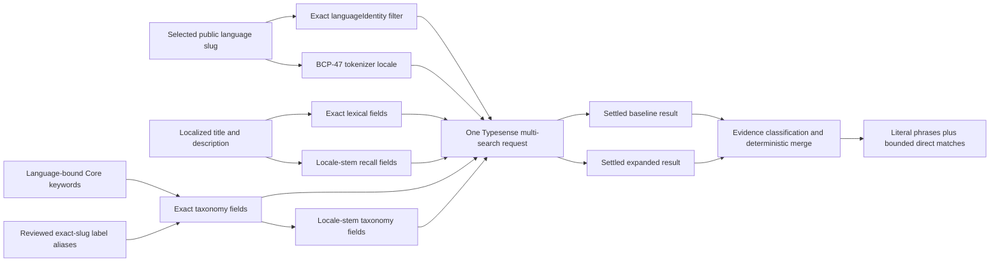
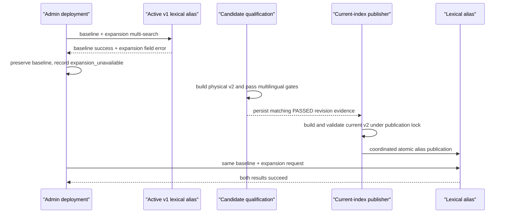

# Multilingual Watch Suggestion Recall

## Goal Capsule

### Why

Production Watch suggestions are empty for ordinary grammatical variants such
as English `shorts` because autocomplete is a literal zero-typo prefix search.
The same failure mode exists in every supported language, and structural terms
such as a localized word for “short film” cannot retrieve a video unless the
word already appears in its title or description.

### Outcome

Watch autocomplete retrieves relevant direct content matches from exact text,
locale-aware morphology, and localized taxonomy while preserving the selected
public language exactly. Literal title matches remain first, expansion failures
fall back to the current result set, and explicit full-search submission remains
unchanged.

### Authoritative context

- User report: production returns an empty suggestion panel for `shorts` in
  English.
- User direction: solve the class generically for other languages, not with an
  English-only special case.
- User approval: include both grammatical/morphological matching and localized
  taxonomy vocabulary.
- Roadmap owner: `docs/roadmap/content-discovery/feat-363-multilingual-watch-suggestion-recall.md`.
- Existing architecture: Watch suggestions are an Admin-owned, bounded lexical
  lane over the Typesense `watch_search_lexical` alias.

## Product Contract

### Session-settled decisions

- **Use a locale-selected analyzer pipeline.** _(session-settled: user-directed —
  chosen over an English-only `shorts -> short` rewrite because the reported bug
  is one instance of a multilingual recall problem.)_ Governs R1-R4 and R8.
- **Include morphology and localized taxonomy.** _(session-settled:
  user-approved — chosen over morphology alone because category intent may not
  be present in localized titles or descriptions.)_ Governs R2-R5 and R9.

### Requirements

- **R1 — Exact public-language identity.** Retrieval and phrase validation
  filter on the selected public `Language.slug` encoded as `languageIdentity`;
  merge/deduplication preserve that admitted identity, and hydration may load
  only IDs from the identity-scoped candidate set. BCP-47 selects the tokenizer
  only; it never broadens document admission or deduplication.
- **R2 — Morphological recall.** For each Typesense-supported tokenizer locale,
  the projection exposes separate stemmed title and metadata fields. Existing
  exact fields remain unchanged so literal evidence and proper names retain
  their current semantics. The engine contract covers the full fixed analyzer
  manifest; launch-quality fixtures initially cover `english`,
  `spanish-castilian`, `arabic-egyptian`, `japanese`, `korean` plus
  `korean-sign-language`, and unsupported-locale `maori`. A language outside
  that qualification cohort receives the same engine and Core-keyword support,
  but no manually authored category alias until a reviewed fixture promotes it.
- **R3 — Localized taxonomy recall.** Language-bound Core `Keyword` values
  attached to a video are projected into the matching exact public-language
  document. Only when the frozen acceptance corpus proves Core lacks a required
  structural term may a reviewed Admin registry add the missing `VideoLabel`
  alias for that qualified language. Registry entries are keyed by exact public-
  language identity and are never inherited from English or automatically shared
  by BCP-47.
- **R4 — Unsupported analyzer fallback.** Languages outside the supported
  Typesense locale set retain Unicode exact-prefix title, metadata, and taxonomy
  fields. They do not silently switch to another language or receive guessed
  stemming. Analyzer resolution must check membership in the fixed supported
  locale manifest rather than treating every two-letter base code as supported.
- **R5 — Explicit ranking contract.** Direct matches rank by match class:
  literal title, literal taxonomy, stemmed title, literal metadata, stemmed
  taxonomy, then stemmed metadata. Within a class, preserve raw Typesense
  relevance and use canonical video ID only as the final deterministic tie-break.
- **R6 — Evidence-aware post-filtering.** Analyzer and taxonomy candidates are
  admitted using Typesense matched-field evidence. Raw `startsWith` logic is
  retained only to classify literal matches and may not discard a valid expanded
  hit.
- **R7 — Literal phrase suggestions.** Query phrase rows continue to come only
  from literal localized title/description values and must pass the existing
  dependent validation. Taxonomy aliases and stemmed forms retrieve content but
  do not fabricate visible query phrases.
- **R8 — Locale-scoped phrase rules.** This change keeps current literal phrase
  tokenization, but the English edge-stop-word list applies only to the English
  analyzer. Other languages receive no implicit English stop-word suppression.
  Script-aware `Intl.Segmenter` phrase generation is tracked separately and is
  not required for morphology/taxonomy direct-match recall.
- **R9 — Fail-soft expansion.** Exact and expanded retrieval are independent
  results inside one Typesense multi-search HTTP request. An expanded-result
  error or an old alias missing the new fields preserves baseline suggestions;
  a total backend failure keeps the existing optional empty fallback and never
  blocks Enter/Search.
- **R10 — Stable public contract and bounds.** No GraphQL or Web shape changes.
  Keep 25 candidate groups, six query suggestions, six direct matches, the
  750-millisecond phrase-validation deadline, the process bulkhead, and current
  browser debounce/timeout behavior.
- **R11 — Immutable rollout.** The changed schema/projection increments the
  stable candidate application revision and qualifies a fresh candidate physical
  collection. The existing current-index publisher may build and atomically move
  the current aliases to that revision only after matching qualification evidence
  exists; the candidate builder never publishes serving aliases itself.
- **R12 — Full-search isolation.** This work changes autocomplete only. It does
  not alter submitted Watch search ranking, semantic/transcript lanes, playback
  language selection, analytics, or query-language detection.

### Success criteria

1. In selected English, `shorts` returns relevant short-film direct content
   matches even when no indexed title/description literally begins with
   `shorts`.
2. Representative supported non-English grammatical variants and localized
   taxonomy terms return relevant content from the exact selected language.
3. A public language sharing the same BCP-47 locale with another language never
   receives its sibling’s titles, keywords, or aliases.
4. Literal exact results keep current ordering ahead of morphological or
   taxonomy expansion, with no canonical video duplicates.
5. A missing expansion schema or failed expansion sub-result still returns the
   healthy exact baseline from the same multi-search response.
6. Phrase validation, visible caps, Web interaction behavior, and page-loading
   performance remain unchanged.

### Scope boundaries

In scope:

- Admin Typesense catalog-to-lexical projection and schema.
- Language-bound keyword taxonomy and reviewed structural aliases.
- Suggestion retrieval, evidence classification, deterministic merge,
  language-scoped phrase rules, validation-versioning, and observability.
- Candidate generation/qualification and focused Admin/browser regression tests.

Out of scope:

- Submitted/full Watch search relevance.
- Semantic, transcript, popularity, history, personalization, or query-log
  serving.
- Frontend contract or visual changes.
- Automatic translation of category aliases or a claim of complete taxonomy
  coverage for every public language.
- Browser/script inference as a hard language admission rule.

### Acceptance examples

- **AE1 — English morphology:** `shorts` + `english` admits a stemmed title or
  taxonomy match for short-film content; literal title-prefix results, if any,
  remain first.
- **AE2 — Supported non-English morphology:** a plural or grammatical variant in
  `spanish-castilian` matches its singular localized title/keyword through `es`
  analyzer fields and returns no other Spanish identity.
- **AE3 — Localized taxonomy:** a reviewed Arabic or Spanish short-film term can
  retrieve a `SHORT_FILM` video even when the term is absent from title and
  description.
- **AE4 — Shared locale isolation:** `korean-sign-language` and `korean` share
  tokenizer locale `ko` in a fixture, but the wrong identity appearing first in
  Typesense cannot survive the exact `languageIdentity` filter.
- **AE5 — Unsupported locale:** `maori` receives exact Unicode title/keyword
  prefix matches from fallback fields and never receives English expansion.
- **AE6 — Phrase isolation:** CJK/no-space, RTL, diacritics, apostrophes, and
  hyphens keep current bounded literal phrase behavior, and no non-English
  analyzer applies the English edge-stop-word list.
- **AE7 — Proper-name negative:** locale stemming does not cause a proper name or
  unrelated term to match content merely because the exact title lane was
  duplicated into a recall field.
- **AE8 — Mixed-version rollout:** a multi-search response with a successful
  baseline result and an expansion sub-result error returns the baseline rows.

## Implementation Sketch

### Key technical decisions

- **KTD1 — Keep exact and recall fields separate.** _(inherits the
  session-settled user-directed analyzer decision; R2, R4-R6.)_ Add
  `title_stem_<locale>` and `metadata_stem_<locale>` fields with the same locale
  plus `stem: true`; retain `title_<locale>` and `metadata_<locale>` unchanged.
  Add exact `taxonomy_<locale>` and stemmed `taxonomy_stem_<locale>` fields.
  Unsupported locales use `taxonomy_fallback` only.
- **KTD2 — Project taxonomy at the owned indexing boundary.** _(inherits the
  session-settled user-approved taxonomy decision; R3-R4, R9.)_ Extend the
  indexer’s `Video` query with published `VideoKeyword -> Keyword -> Language`
  data, normalize/dedupe values by Unicode text, and add them to the matching
  locale entry inside `localesJson`. The catalog field shape remains stable; the
  lexical projection consumes the richer JSON.
- **KTD3 — Keep reviewed aliases data-driven and exact-slug scoped.** _(inherits
  the session-settled user-approved taxonomy decision; R3, R9.)_ Add an
  Admin-owned taxonomy module only for structural gaps demonstrated after Core
  keyword projection. Its registry key is `languageIdentity` and values map
  `VideoLabel` to reviewed localized aliases for the qualification cohort. The
  API accepts any safe exact slug, so later reviewed languages are data-only.
  Never import `apps/web` message catalogs and never fall back from a selected
  language to English.
- **KTD4 — Add a tolerant multi-search result API.** _(R9-R10.)_ Preserve the
  existing strict `TypesenseClient.multiSearch()` behavior for current callers
  and add a settled variant returning each result as success or typed error. The
  suggestions service sends baseline and expanded searches in one HTTP request,
  consumes them independently, and logs a versioned expansion-unavailable
  reason without erasing baseline results. Typesense returns an error in only the
  invalid sub-search result when v1 lacks v2 fields, so the baseline sub-search
  is the compatibility mechanism; no request-time schema lookup or second
  retrieval HTTP call is required.
- **KTD5 — Classify with Typesense match evidence.** _(R5-R7.)_ Extend the local
  hit type for Typesense `highlights`/`matched_tokens`, map matched field names to
  internal provenance, use raw-prefix comparison only for literal tiers, and
  choose the localized title as the display value for taxonomy hits. Do not add
  provenance to the public GraphQL type.
- **KTD6 — Merge by policy, not compensating boosts.** _(R5-R6, R10.)_ Convert
  baseline/expanded hits into canonical candidates with a match-class ordinal,
  raw text score, original grouped order, and canonical ID. Sort lexicographically
  by those values and deduplicate on canonical video ID before applying the
  existing six-row cap.
- **KTD7 — Version the analyzer contract.** _(R7-R8, R11.)_ Increment phrase
  validation cache keys from the fixed `v1` token to the new lexical analyzer
  revision, include that revision and lane outcome in structured logs, and bump
  `TYPESENSE_WATCH_SEARCH_CANDIDATE_APPLICATION_REVISION` so a candidate is
  generated and qualified from the new schema/projection.

### Request and data flow



### Immutable rollout sequence



## Implementation Units

### U1 — Track the work and preserve roadmap dependencies

**Files**

- `docs/roadmap/content-discovery/feat-363-multilingual-watch-suggestion-recall.md`
- `docs/roadmap/content-discovery/feat-337-watch-search-suggestions.md`
- `docs/roadmap/content-discovery/feat-352-watch-search-suggestion-result-validation.md`
- `docs/roadmap/README.md`

**Work**

1. Keep `feat-363` `in-progress` while implementation is active.
2. Record `feat-337` and `feat-352` as dependencies and add reverse `blocks`
   entries.
3. At completion, mark `feat-363` `complete`, add `completed_date`, update the
   README status, and record concise completion evidence.

**Verification**

- Frontmatter parses and dependencies are bidirectional.
- `rg -n 'feat-363' docs/roadmap` returns the ticket, README row, and both reverse
  dependency entries.

### U2 — Add language-bound taxonomy to the lexical projection

**Files**

- `apps/admin/src/services/typesense-watch-search-indexer.ts`
- `apps/admin/src/services/typesense-watch-search-schema.ts`
- `apps/admin/src/services/typesense-watch-search-lexical.ts`
- `apps/admin/src/services/typesense-watch-search-taxonomy.ts` (new only when the
  frozen corpus demonstrates a structural Core-keyword gap)
- `apps/admin/src/services/typesense-watch-search-indexer.test.ts`
- `apps/admin/src/services/typesense-watch-search-schema.test.ts`
- `apps/admin/src/services/typesense-watch-search-lexical.test.ts`
- `apps/admin/src/services/typesense-watch-search-taxonomy.test.ts` (new)

**Work**

1. Before fixing field and cap constants, census a production-shaped source
   snapshot: localized documents per video; title/metadata bytes; keyword rows
   and bytes per video at p50/p95/p99/max; and projected searchable bytes by
   locale and field family. Default to at most 32 normalized taxonomy terms and
   4,096 taxonomy UTF-8 bytes per localized document; change those defaults only
   when the recorded census proves they are unsafe or unrepresentative.
2. Extend the index query to select non-deleted attached keywords with their
   language slug and BCP-47 value. Ignore keywords without a safe exact language
   identity instead of leaking them into fallback documents.
3. Extend the locale JSON projection type with normalized taxonomy values and
   merge only values whose keyword language identity equals that locale row’s
   identity.
4. Run the taxonomy acceptance slice against the Core-keyword projection first.
   For each missing structural term that blocks an approved acceptance case,
   implement a reviewed alias keyed by exact language identity and video label.
   Keep normalization, deduplication, and per-document cap ordering deterministic:
   source-backed keywords first, then reviewed aliases, each sorted by normalized
   value before the term/byte cap is applied.
5. Add exact/stemmed taxonomy and duplicated title/metadata recall fields to the
   lexical schema and documents. Extend the local Typesense field type with
   `stem?: boolean`. Keep the schema manifest fixed at 25 tokenizer locales × six
   declared field families plus three exact fallback fields: 153 searchable
   string-array fields. A new tokenizer locale requires an application-revision
   bump and refreshed capacity evidence.
6. Report UTF-8 searchable bytes by family—baseline title/metadata, duplicated
   stem title/metadata, exact taxonomy, and stem taxonomy—plus aggregate 2×–3×
   memory bounds. Keep lexical import batches at no more than 100 documents and
   1 MiB serialized JSONL, whichever limit is reached first.
7. Increment the stable candidate application revision because the schema,
   projection, and retrieval field contract changed.

**Tests**

- Keywords attach only to the matching language row, including adversarial
  same-BCP47 slug fixtures.
- Reviewed aliases are exact-slug scoped, Unicode-normalized, deduplicated, and
  have no implicit English fallback.
- Supported locales receive exact and `stem: true` recall fields; unsupported
  locales receive exact fallback fields only.
- Searchable byte estimates include the duplicated recall and taxonomy values.
- Index snapshots/digests change deterministically when taxonomy changes.
- A high-fan-out page fixture proves constant database query count, deterministic
  cap/truncation, unchanged page size, and byte-bounded imports without per-video
  or per-locale queries.
- Schema tests assert the exact 153-field searchable manifest and reject dynamic
  locale field creation.

### U3 — Retrieve baseline and expanded lanes without losing the baseline

**Files**

- `apps/admin/src/services/typesense-client.ts`
- `apps/admin/src/services/typesense-client.test.ts`
- `apps/admin/src/services/typesense-watch-search-locales.ts`
- `apps/admin/src/services/typesense-watch-search-suggestions.ts`
- `apps/admin/src/services/typesense-watch-search-suggestions.test.ts`

**Work**

1. Generalize lexical field helpers from `title | metadata` to exact/stemmed
   title, metadata, and taxonomy lanes while always returning locale-selected
   fields plus the appropriate exact fallback.
2. Make the analyzer-profile resolver return a tokenizer locale only when the
   normalized BCP-47 base belongs to the fixed manifest. Cover a two-letter
   unsupported locale such as `mi`; a three-letter-only fixture cannot detect
   this failure.
3. Add a settled multi-search API that preserves per-result Typesense errors;
   keep the current strict method as a compatibility wrapper.
4. Build one request with a baseline search over the current exact title and
   metadata fields and an expansion search over exact taxonomy plus stemmed
   recall fields. Both searches retain `group_by: canonicalVideoId`, 25 groups,
   zero typos, and the exact `languageIdentity` filter.
5. Extend hit typing for highlight evidence and classify candidates by the
   matched field. Expanded candidates do not pass through raw-prefix admission.
6. Merge, sort, canonical-dedupe, and cap direct matches. Expansion error returns
   the baseline; total error retains existing fail-empty behavior.
7. Emit structured lane outcomes (`baseline_empty`, `expansion_empty`,
   `expansion_unavailable`, and total unavailable) with the analyzer/index
   revision, without logging sensitive request data.
8. Pin the per-keystroke request envelope: exactly two retrieval sub-searches,
   no retry, 25 groups per sub-search, no more than four baseline `query_by`
   fields and five expansion `query_by` fields, at most 4,096 combined
   `query_by` bytes, and at most 32,768 serialized request bytes. Helpers select
   only the active locale and applicable fallback fields; unrelated locale fields
   never enter a request.

**Tests**

- Exact request shape remains bounded and the expanded sub-search shares one HTTP
  multi-search call.
- `shorts` admits `Short Film` through a stemmed field without a raw prefix.
- Taxonomy-only matches display the localized title and do not create query
  phrase rows.
- Baseline survives an expansion sub-result error and keeps ordering/caps.
- Ranking tiers and canonical deduplication are deterministic.
- Exact slug isolation remains effective even when Typesense returns a wrong
  sibling first.
- A worst-fanout case has both lanes return 25 distinct groups, all six literal
  phrases require uncached validation, taxonomy reaches its cap, hydration
  reaches six rows, and concurrent callers reach the existing bulkhead. It still
  makes one retrieval HTTP call and at most one validation HTTP call, emits at
  most six phrase/six direct rows, and does not retry or duplicate canonical IDs.
- The same maximal baseline survives an expansion error without repeating
  retrieval or hydration.

### U4 — Keep phrase validation language-scoped and expansion-consistent

**Files**

- `apps/admin/src/services/typesense-watch-search-suggestions.ts`
- `apps/admin/src/services/typesense-watch-search-suggestions.test.ts`
- `apps/admin/src/services/bounded-ttl-promise-cache.test.ts`

**Work**

1. Pass tokenizer locale into phrase extraction and apply the existing English
   edge-stop-word set only under the explicit English analyzer. Preserve current
   token/window behavior for every script in this feature.
2. Generate phrases only from literal title/metadata candidates and continue to
   validate them against exact localized fields with the same language identity.
3. Include the analyzer contract revision in positive/negative validation cache
   keys; never cache transport or malformed-result failures.

**Tests**

- Existing English, accented Latin, apostrophe/hyphen, CJK, and RTL literal
  phrase snapshots remain stable except that English stop words are no longer
  removed for a non-English analyzer.
- An English stop word is not removed in another language.
- Stemmed/taxonomy hits survive as direct matches even when no literal phrase can
  be validated.
- Validation remains one dependent multi-search with `per_page: 1`, exact slug,
  zero typos, and 750-millisecond timeout.

### U5 — Qualify and document the new serving generation

**Files**

- `apps/admin/src/scripts/index-typesense-watch-search-candidate.ts`
- `apps/admin/src/scripts/benchmark-watch-search-candidate.ts`
- `apps/admin/src/scripts/benchmark-watch-search-suggestions-candidate.ts` (new,
  unless extending the existing benchmark keeps submitted-search and suggestion
  metrics unambiguously separate)
- `apps/admin/src/services/typesense-watch-search-suggestions.ts`
- `apps/admin/src/services/typesense-watch-search-indexer.ts`
- `apps/admin/src/services/typesense-watch-search-indexer.test.ts`
- `apps/admin/src/services/typesense-watch-search-candidate-generation.ts`
- `apps/admin/src/services/typesense-watch-search-candidate-generation.test.ts`
- `apps/admin/src/services/typesense-watch-search-publication-lock.ts`
- Candidate fixture/report files already owned by those scripts, if the current
  corpus cannot express morphology/taxonomy provenance.
- `docs/solutions/design-patterns/watch-search-draft-suggestion-submit-separation.md`
- `docs/solutions/best-practices/precomputed-hybrid-search-serving-index-20260803.md`
- `docs/roadmap/content-discovery/feat-363-multilingual-watch-suggestion-recall.md`

**Work**

1. Capture the active v1 alias targets/revision and build the candidate v2
   physical collection from one source snapshot without changing any serving
   alias. Candidate generation publishes only evaluation state and qualification
   evidence.
2. Extend candidate pre-publication validation to compare v2 with v1 for total
   lexical document count, per-exact-identity counts, canonical-video coverage,
   duplicate canonical IDs, zero import errors, exact schema/analyzer/revision
   hash, and unexplained source-snapshot deltas.
3. Add a frozen multilingual qualification slice organized by behavior: regular
   inflection, irregular/domain dictionary case if measured, localized taxonomy,
   diacritics, punctuation, CJK/no-space, RTL, unsupported analyzer, shared-locale
   identity collision, and proper-name negative control.
4. Add an internal lexical-collection binding to the suggestion service,
   defaulted to the production serving selection. Candidate qualification injects
   the exact physical v2 lexical collection; public GraphQL never receives or
   chooses this override.
5. Qualify the physical collection directly, exercising baseline-only,
   expansion-only, and merged ordering for every fixture. Require 100% exact
   language-identity correctness, 100% v1 baseline parity, zero unexpected
   taxonomy-derived phrase rows, zero import/schema errors, and every fixed
   request/response cap from U3.
6. Add a suggestion-specific benchmark over retrieval, validation, hydration,
   and total service time, separating cold/warm validation cache and alternating
   v1/v2 order. Record p50/p95/p99 and reject any v2 regression from the frozen
   v1 baseline; total p99 must remain below Web’s 3,500-millisecond timeout.
7. Measure actual collection disk/RAM, settled process RSS, and peak RSS while v1
   and v2 coexist. Require at least 40% of the 16 GiB service limit free at rebuild
   peak and 50% free after settling; predicted versus imported searchable size
   may differ by at most 10%, with per-family attribution for any breach.
8. Make the existing current-index rebuild the sole serving publication owner.
   Before it starts, require a PASSED candidate qualification for the exact v2
   application/analyzer revision. Preserve its shared session advisory lock for
   the full rebuild/import operation, its coordinated current-alias swap, and its
   compensating alias rollback. Record lock duration as evidence rather than
   imposing a short bound that conflicts with the existing full-operation lock.
9. After the current publisher moves the aliases, immediately rerun the frozen
   smoke set through the aliases and verify the served revision is v2.
10. Update durable solution documentation with the dual identity/analyzer model,
    literal-versus-expanded ranking policy, and mixed-version fail-soft pattern.
11. Mark the roadmap ticket complete only after focused validation and browser
    smoke evidence are recorded.

**Tests and operational checks**

- Candidate generation builds a fresh physical collection and does not mutate an
  active collection in place.
- Candidate generation never changes current serving aliases; the current-index
  publisher refuses the new revision without matching PASSED qualification.
- Pre-publish representative searches include `shorts` and at least one
  supported non-English morphological and taxonomy case.
- Rollback uses the current publisher’s captured alias set: restoring v1 returns
  baseline suggestions and records expansion unavailable.
- Search/on-call owns the go/no-go and rollback decision. Actively observe the
  first 30 minutes and compare 24 hours with the immediately preceding equivalent
  traffic window. Roll back for any cross-identity result, sustained total-empty
  or total-error increase, baseline-lane error spike, p95/p99 budget breach,
  memory-headroom breach, or material direct-match/click-through collapse.
- Retain v1 and failed v2 artifacts through the rollback window. After rollback,
  verify the alias revision, baseline fixtures, full-search Enter behavior, and
  absence of v2 expansion influence before any cleanup is approved.

## System Impact

### Call graph

`watchSearchSuggestions` GraphQL resolver → suggestion service → one tolerant
Typesense retrieval multi-search → literal phrase extraction → one bounded
phrase-validation multi-search on cache misses → existing Prisma direct-match
hydration. The frontend call graph and explicit submit path are unchanged.

### Error propagation

- Baseline result error + expanded success: use expanded direct matches only when
  exact identity filtering and hydration succeed, record the degraded state only
  in structured lane telemetry, and return no phrase rows. The public response
  shape does not change. This state is a pre-publish no-go even though the
  production path fails soft.
- Expanded result error + baseline success: return baseline suggestions and emit
  `expansion_unavailable`.
- Retrieval request failure: preserve current `[]` optional suggestion response.
- Phrase-validation failure: omit query phrase rows and preserve direct matches.
- Hydration failure: preserve current fail-soft service boundary.

### State and lifecycle risks

- The catalog JSON payload shape changes without a catalog schema field change;
  physical lexical application revision still changes because generated fields
  and searchable bytes change.
- Old Admin code can read the new collection because exact fields remain. New
  Admin code can read the old collection because Typesense returns the missing
  expansion fields as an errored sub-result while the exact baseline sub-result
  remains consumable.
- Positive/negative validation cache entries are revision-keyed, preventing stale
  verdict reuse after analyzer/taxonomy updates.

### API surface parity

No Pothos schema, `schema.graphql`, `packages/admin-graphql`, or Web client changes
are expected. If implementation discovers that provenance must be public, stop
and split that contract expansion into a follow-up rather than silently widening
this PR.

### Observability

Record lane outcome, tokenizer locale, exact language identity hash/value under
existing safe logging conventions, application revision, candidate counts, and
duration. Do not record full free-form query text in a new logging surface.

## Risks and Mitigations

| Risk                                                   | Impact                       | Mitigation                                                                                                                                                           |
| ------------------------------------------------------ | ---------------------------- | -------------------------------------------------------------------------------------------------------------------------------------------------------------------- |
| Stemming causes proper-name or broad false positives   | Relevance regression         | Duplicate into lower-ranked recall fields; keep literal lanes and negative fixtures                                                                                  |
| Taxonomy leaks between languages sharing BCP-47        | Wrong-language content       | Project/filter by exact slug identity; registry is exact-slug keyed; collision tests                                                                                 |
| Query code reaches v1 alias before reindex             | Suggestions fail empty       | Tolerant per-result multi-search; baseline fields remain a healthy sub-search                                                                                        |
| Expanded hit is retrieved then discarded in JavaScript | Original bug persists        | Use matched-field evidence; raw prefix only classifies literal tiers                                                                                                 |
| Global English token rules corrupt other languages     | Missing/malformed phrases    | Apply the existing English stop-word list only to the English analyzer; use no implicit English suppression elsewhere; track script-aware segmentation in `feat-364` |
| Taxonomy data is unreviewed or incomplete              | Misleading category matches  | Core language-bound keywords first; reviewed registry only; no automated Web catalog import                                                                          |
| Larger lexical projection increases memory/latency     | Serving cost/regression      | Census before constants; cap terms/bytes/import batches; compare predicted/imported size; enforce v1/v2 p50/p95/p99 and rebuild-peak headroom gates                  |
| One bad expansion result erases exact matches          | Empty panel during incidents | Consume baseline/expansion as settled results and expose versioned degradation metrics                                                                               |

## Verification Plan

### Focused automated checks

```powershell
pnpm --filter @forge/admin test -- src/services/typesense-client.test.ts src/services/typesense-watch-search-schema.test.ts src/services/typesense-watch-search-lexical.test.ts src/services/typesense-watch-search-indexer.test.ts src/services/typesense-watch-search-taxonomy.test.ts src/services/typesense-watch-search-suggestions.test.ts src/services/bounded-ttl-promise-cache.test.ts
pnpm --filter @forge/admin typecheck
pnpm --filter @forge/admin lint
pnpm exec prettier --check apps/admin/src/services/typesense-client.ts apps/admin/src/services/typesense-client.test.ts apps/admin/src/services/typesense-watch-search-schema.ts apps/admin/src/services/typesense-watch-search-schema.test.ts apps/admin/src/services/typesense-watch-search-lexical.ts apps/admin/src/services/typesense-watch-search-lexical.test.ts apps/admin/src/services/typesense-watch-search-indexer.ts apps/admin/src/services/typesense-watch-search-indexer.test.ts apps/admin/src/services/typesense-watch-search-locales.ts apps/admin/src/services/typesense-watch-search-taxonomy.ts apps/admin/src/services/typesense-watch-search-taxonomy.test.ts apps/admin/src/services/typesense-watch-search-suggestions.ts apps/admin/src/services/typesense-watch-search-suggestions.test.ts docs/plans/2026-08-13-1954-multilingual-watch-suggestion-recall-plan.md docs/roadmap/README.md docs/roadmap/content-discovery/feat-337-watch-search-suggestions.md docs/roadmap/content-discovery/feat-352-watch-search-suggestion-result-validation.md docs/roadmap/content-discovery/feat-363-multilingual-watch-suggestion-recall.md
```

### Candidate qualification

```powershell
pnpm --filter @forge/admin index:typesense-watch-search-candidate
pnpm --filter @forge/admin benchmark:watch-search-candidate
```

Run these only with the required candidate environment and credentials. Never
publish or deploy to production from the worktree; normal PR-to-main and the
existing immutable candidate/alias workflow remain authoritative.

### Browser smoke

With local Admin, Web, and Typesense available, open `/watch`, select English,
type `shorts`, and verify a relevant direct match appears while Enter/Search is
still the only full submission. Repeat with one supported non-English
morphological query and one localized taxonomy term. Inspect browser errors,
Admin logs, and page-loading metrics; confirm opening/closing Search and language
selection remain unchanged.

## Sources

### Repository

- `docs/solutions/design-patterns/watch-search-draft-suggestion-submit-separation.md`
- `docs/solutions/best-practices/language-identity-on-slug-not-bcp47-20260605.md`
- `docs/solutions/logic-errors/watch-search-chinese-lexical-playback-language-conflation.md`
- `docs/solutions/logic-errors/canonical-language-boundaries-and-lexicographic-search-ranking.md`
- `docs/solutions/best-practices/precomputed-hybrid-search-serving-index-20260803.md`
- `apps/admin/src/services/typesense-watch-search-suggestions.ts`
- `apps/admin/src/services/typesense-watch-search-lexical.ts`
- `apps/admin/src/services/typesense-watch-search-schema.ts`
- `apps/admin/src/services/typesense-watch-search-indexer.ts`
- `apps/admin/prisma/schema.prisma`

### Primary external documentation

- [Typesense search parameters and highlighting](https://typesense.org/docs/30.0/api/search.html)
- [Typesense locale-specific indexing](https://typesense.org/docs/guide/locale.html)
- [Typesense stemming](https://typesense.org/docs/guide/stemming.html)

## Plan Readiness

- Requirements are explicit and traceable to implementation units.
- Product/session decisions are separated from implementation choices.
- Exact public language identity, analyzer selection, fallback, ranking, and
  failure behavior are specified.
- Mixed-version rollout and rollback do not require an unsafe in-place schema
  mutation or a second application deploy.
- Tests cover morphology, taxonomy, script families, identity collisions,
  unsupported analyzers, proper-name negatives, and degraded behavior.
- No blocking product or technical decision remains for implementation.
