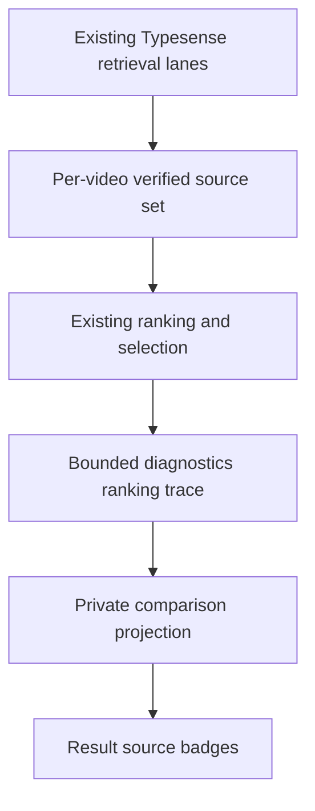

# Admin Search Retrieval Sources - Plan

## Goal Capsule

- **Objective:** Show which retrieval lanes found each result on the private Admin Watch search comparison page.
- **Authority:** This plan and the existing Candidate ranking contract govern the change.
- **Scope:** Diagnostic provenance and private comparison UI only.
- **Stop conditions:** Stop if the implementation changes ranking, adds retrieval work, alters the public GraphQL contract, or touches the public Watch frontend.
- **Tail ownership:** Run focused service and page tests, Admin type checking, and formal code review before completion.

---

## Product Contract

### Summary

The private comparison page will show every captured retrieval lane that contributed to each Current and Candidate result. An operator will be able to distinguish the global exact-title lookup from the normal localized title lookup without treating a multi-lane result as if it had one exclusive source. When the bounded trace cannot establish provenance, the page will say that the sources were not captured.

### Problem Frame

The current card shows winning evidence such as `exact_title`, but that value does not identify the retrieval path. A normal title lookup can produce exact-title evidence, and the global exact-title lookup can find the same result as other lanes. Operators therefore cannot verify whether the new recall path helped a result.

### Requirements

**Retrieval provenance**

- R1. Each successful comparison result shows every captured retrieval source that contributed to its canonical result.
- R2. The source set distinguishes global exact-title, localized title, metadata, and semantic retrieval.
- R3. Global exact-title provenance is granted only to a member whose exact-key hit passed the existing per-locale title-field verification.
- R4. A result found by multiple lanes shows all sources once and retains one existing title contribution.

**Safety and scope**

- R5. The change remains inside diagnostics and the private Admin comparison page.
- R6. Public GraphQL output, public Watch UI, query construction, ranking, scores, and result order remain unchanged.
- R7. The change adds no Typesense call, logical subsearch, hydration, index field, or database write.
- R8. Missing, truncated, or compatibility-fallback trace data produces `Not captured` instead of inferring provenance from winning evidence.

### Acceptance Examples

- AE1. **Covers R1-R4.** Given a Candidate result found by both the verified global exact-title lookup and the normal title lookup, when the comparison renders, then the card shows both sources and the score remains unchanged.
- AE2. **Covers R2-R3.** Given an exact-key hit whose per-locale title field fails verification, when diagnostics are produced, then the result does not claim global exact-title provenance.
- AE3. **Covers R5-R8.** Given a Current result or a result without a matching trace entry, when the comparison renders, then the card remains usable and no public search contract changes.

### Scope Boundaries

- Do not change Candidate relevance, ranking weights, evidence tiers, or semantic behavior.
- Do not add retrieval-source fields to the public Watch GraphQL schema.
- Do not persist raw query-derived values, exact keys, tokens, vectors, or transcript text.
- Do not modify the normal Admin search analytics pages outside the private comparison surface.

---

## Planning Contract

### Key Technical Decisions

- KTD1. **Use diagnostic ranking trace as the boundary.** Add a fixed retrieval-source enum to the per-result ranking trace instead of changing `WatchSearchResponse.results[].evidence`; evidence describes the winning match, while trace data can describe every contributing lane. (session-settled: user-approved — chosen over exposing another public result field: the requested information is operator-only.)
- KTD2. **Verify per member, report per canonical result.** Capture separate global exact-title and localized-title membership sets before those groups merge. Verify exact-title provenance on the physical video that matched, then union the verified sources across the canonical group. This reports every lane that helped retrieve or rank the displayed canonical result even when playback selection chooses a different language or edition sibling.
- KTD3. **Render multi-source labels.** Join each card to diagnostics by `selectedVideoId`, not array position, and show each captured source once in this order: `Global exact title`, `Localized title`, `Metadata`, `Semantic`. Rename the existing card field to `Winning evidence` so it is not confused with retrieval provenance. A missing trace shows `Not captured`; a capped trace shows `Not captured — trace truncated`.
- KTD4. **Keep public execution allocation-free.** Collect the extra provenance only when `searchWithDiagnostics()` requests trace evidence; normal public `search()` does not need the source arrays.

### High-Level Technical Design

The source set is observational. It follows existing candidates into the canonical group but does not enter any score, playback-member selection, or ordering calculation.

### Sequencing

Add and test the diagnostic contract first. Render it only after member-level attribution and no-ranking-change behavior are proven.

---

## Implementation Units

### U1. Preserve verified retrieval sources in diagnostics

- **Goal:** Add verified canonical-result retrieval provenance to each selected result's ranking trace.
- **Requirements:** R1-R7; AE1, AE2.
- **Dependencies:** None.
- **Files:**
  - `apps/admin/src/services/typesense-watch-search.service.ts`
  - `apps/admin/src/services/typesense-watch-search.service.test.ts`
- **Approach:**
  1. Define the fixed diagnostic source values for global exact-title, title, metadata, and semantic retrieval.
  2. Add source membership to internal candidates only when diagnostics are collected.
  3. Record separate member sets for the verified global exact-title and localized-title results before title groups merge.
  4. Union sources during duplicate-member fusion, then across the canonical group, without changing contributions or winner selection.
  5. Include the canonical result's ordered source set in the selected result's bounded ranking trace.
- **Patterns to follow:** Existing `laneEvidence`, `selectedVideoId`, and `MAX_RANKING_TRACE_ENTRIES` diagnostics in `apps/admin/src/services/typesense-watch-search.service.ts`.
- **Test scenarios:**
  - Covers AE1. A verified global exact-title hit also found by the title lane reports both sources once and keeps the existing title contribution and final order.
  - Covers AE2. A stale or colliding exact-key hit that fails per-locale title-field verification does not report global exact-title.
  - An exact-only result reports global exact-title without localized title.
  - A partial title result reports title without global exact-title.
  - Metadata-only, semantic-only, and combined results report their applicable source values.
  - An exact-title sibling can contribute global exact-title provenance to the canonical result even when another playable sibling is selected; the exact claim must still be verified on the matching member.
  - Current search does not report global exact-title.
- **Verification:** Focused Typesense Watch search service tests prove source attribution and unchanged ranking values.

### U2. Show retrieval sources on private comparison cards

- **Goal:** Make the diagnostic source set clear and readable for Admin evaluators.
- **Requirements:** R1, R2, R5, R6, R8; AE1, AE3.
- **Dependencies:** U1.
- **Files:**
  - `apps/admin/src/app/dashboard/search/compare/watch-search-comparison.tsx`
  - `apps/admin/src/app/dashboard/search/compare/page.test.tsx`
  - `apps/admin/src/services/search-trace-privacy.test.ts`
- **Approach:**
  1. Match each result to its trace entry through `selectedVideoId`.
  2. Render visible-text badges for all returned sources in the KTD3 order and allow the group to wrap inside narrow cards.
  3. Give the badge group an accessible `Retrieval sources` label.
  4. Render the KTD3 unavailable label when no trace entry exists, the trace is truncated, or compatibility fallback cannot distinguish title from metadata.
  5. Keep `Winning evidence` separate and preserve the existing bounded privacy projection, trace cap, query redaction, and result cap.
- **Patterns to follow:** Existing `StatusPill`, comparison result cards, and `projectWatchSearchComparisonResult` boundary.
- **Test scenarios:**
  - Covers AE1. A result with exact-title and title provenance renders both badges.
  - Covers AE3. A result without a trace entry renders `Not captured` and the pane remains visible.
  - A result missing because the trace cap was reached renders `Not captured — trace truncated`.
  - A compatibility-fallback lexical result does not infer title or metadata provenance.
  - Metadata and semantic source combinations render distinct labels.
  - A result with all four sources wraps all visible-text badges within the card and exposes the accessible group label.
  - Trace matching works when result and trace arrays use different orders.
  - The comparison projection preserves only the fixed enum values and retains existing privacy bounds.
- **Verification:** Static page rendering and privacy projection tests prove the private UI contract without touching public search output.

---

## Verification Contract

| Gate                                   | Applies to | Done signal                                                                            |
| -------------------------------------- | ---------- | -------------------------------------------------------------------------------------- |
| Focused Vitest service tests           | U1         | Retrieval sources are correct and ranking assertions are unchanged.                    |
| Focused comparison and privacy tests   | U2         | Source badges, fallback behavior, and bounded projection pass.                         |
| `pnpm --filter @forge/admin typecheck` | U1, U2     | Admin TypeScript compiles with the extended diagnostics contract.                      |
| Diff audit                             | U1, U2     | No public GraphQL, Watch frontend, query, score, index, or persistence change appears. |
| Formal `ce:review`                     | U1, U2     | No unresolved correctness, privacy, performance, or regression finding remains.        |

---

## Definition of Done

- Each private comparison result clearly shows captured global exact-title versus normal title retrieval and any other captured lanes, or explicitly says the source was not captured.
- Exact provenance is verified on the matching physical member, reported for the canonical result, and never inferred from `evidence.kind` alone.
- Multi-lane attribution does not double-score the title lane or change ordering.
- Public search behavior and contracts remain unchanged.
- Existing retrieval-call, logical-subsearch, hydration, and trace bounds remain unchanged.
- Focused tests, Admin type checking, and formal review pass.
- Abandoned implementation attempts and unused diagnostic fields are removed from the final diff.
