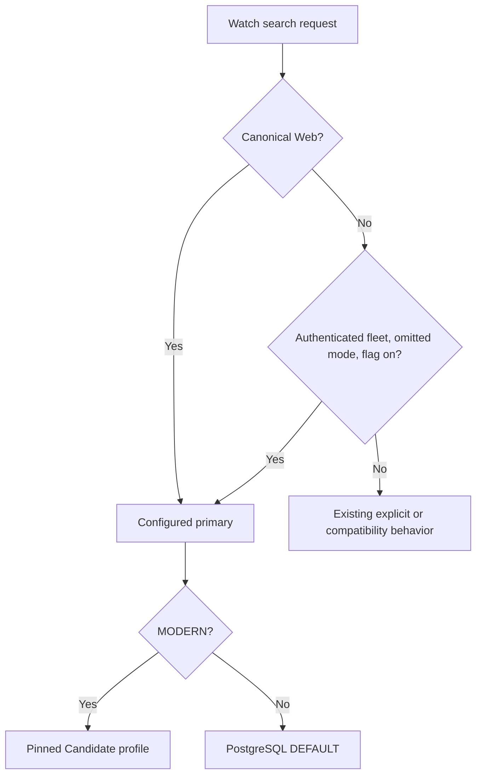

# Watch Search Candidate Promotion - Plan

## Goal Capsule

- **Objective:** Make the cumulative Candidate the production search for server-identifiable first-party Watch surfaces—canonical Web and authenticated fleet—then rebuild the Mastra baselines from that exact serving generation.
- **Authority:** This plan, the Candidate identity contracts, and the user's explicit 2026-08-16 acceptance of the measured Candidate govern the launch.
- **Scope:** Admin server/query routing, audited promotion, production verification, and Mastra baseline capture. No Watch, mobile, TV, or Admin frontend changes.
- **Stop conditions:** Stop if Candidate identity drifts, evidence cannot be cryptographically bound, the Serving pointer cannot be updated atomically, a pre-registered production smoke case fails, production requests fail, or rollback controls are unavailable. The old automatic relevance/latency thresholds are recorded as not met; they are not launch blockers because the reviewer explicitly accepted the observed result.
- **Tail ownership:** Merge and deploy the promotion support, record the audited acceptance, pin and activate the exact Candidate for Web, verify production, enable omitted-mode authenticated fleet routing, then archive and rebuild baselines from the Serving endpoint.

---

## Product Contract

### Summary

Candidate is one cumulative search implementation. It includes every approved Candidate improvement, including multilingual global exact-title recall; this is not a V1/V2/V3 split.

The old automated release policy did not pass: the 104-case Mastra run produced 43.3% useful-or-excellent, 13.5% unacceptable, p95 caller latency of 2.689 seconds, and p95 Admin latency of about 683 milliseconds. The suite also has known rubric gaps, and manual comparison showed Candidate was materially better for the intended multilingual use case. The reviewer has explicitly accepted that evidence and requested launch.

The system must represent that decision honestly. It records an `OPERATOR_ACCEPTED` decision with the real results, known limitations, reviewer/operator identities, exact Candidate identity, and immutable artifact digests. It must never relabel the run as an automatic `PASSED` qualification.

### Requirements

**Truthful, immutable promotion**

- R1. Promotion and serving must bind the same immutable generation, application revision, ranking revision, transcript projection revision, explicit evaluation revision, frozen Current bindings, and evidence bundle.
- R2. Serving may be authorized by either a fully automated `PASSED` qualification or an explicit `OPERATOR_ACCEPTED` decision; the two states remain distinguishable in persistent evidence and operator output.
- R3. An `OPERATOR_ACCEPTED` decision must contain the observed Mastra relevance and latency results, failed or waived gates, known limitations, acceptance rationale, reviewer identity, operator identity, timestamp, and the byte length plus SHA-256 of one self-contained frozen evidence bundle.
- R4. Recording approval and CAS-pinning Serving remain separate operations. Both must reject stale identity, stale pointer versions, altered artifacts, incompatible application/ranking revisions, or changed Current bindings.
- R5. Current physical bindings must be re-read and checked while the publication lock is held through the Serving-pointer update.
- R6. Pointer versions accept only canonical non-negative decimal safe integers; whitespace, signs, hex, decimal fractions, and exponent forms are rejected.

**Production routing**

- R7. Canonical Web uses the exact pinned Candidate when `WATCH_SEARCH_PRIMARY_MODE=MODERN` and `WATCH_SEARCH_TYPESENSE_PROFILE=CANDIDATE:<generation-id>`; the public GraphQL shape and frontend remain unchanged.
- R8. Authenticated fleet requests with omitted mode may inherit the configured primary only after a separate server-side flag is enabled. Explicit fleet modes remain explicit, anonymous noncanonical behavior remains unchanged, and fleet requests never produce Web shadow searches.
- R9. `WATCH_SEARCH_TYPESENSE_PROFILE=CURRENT` remains the normal Typesense rollback and `WATCH_SEARCH_PRIMARY_MODE=DEFAULT` remains the emergency PostgreSQL rollback. Neither Current nor Candidate collections are deleted.
- R10. Verification must read back the Serving pointer, qualification decision, profile selector, application/ranking/transcript/evaluation revisions, and real response identity; `searchMode` alone is insufficient. The unchanged public response is correlated by `requestId` to server-side trace metadata containing the exact Typesense profile and revisions.

**Evaluation and baselines**

- R11. A separately authenticated no-analytics endpoint must evaluate the exact `SERVING` generation. It must not follow Current aliases or the mutable `EVALUATION` pointer, and Mastra must use dedicated Serving URL/key configuration so existing Current, catalog, Candidate-list, and devotional evaluation calls remain unchanged.
- R12. The existing pre-Candidate baseline must be exported under an immutable dated name before the default baseline is replaced.
- R13. Post-launch baseline capture is all-or-nothing and uses the exact Serving endpoint. Every seed response must carry the same non-null Serving revision, and baseline metadata must persist it. First capture a dated Candidate baseline, validate it, then refresh `seed-baseline` from the same generation.
- R14. The 104-case development and held-out absolute suites must be rerun against Serving, with exact generation/revision identity and caller/Admin latency retained in the launch artifact.

**Promotion authorization**

- R15. Promotion must use the existing authenticated production-operator boundary. The frozen bundle must include the dated user-acceptance record and merged PR/commit review trail bound to the decision ID and exact Candidate identity; the executing operator identity is derived from the authenticated operator context, not a caller-supplied label.
- R16. If the accepted evidence must be rerun, the replacement measurements require a new explicit user acceptance bound to the new bundle and decision ID. Before replacing the default baseline, material post-launch relevance or latency deltas from the accepted bundle require explicit reviewer acknowledgement retained in the baseline artifact.

### Acceptance Examples

- AE1. **Covers R1-R6.** A report with the actual 43.3% useful-or-excellent result and explicit waived gates records as `OPERATOR_ACCEPTED`; it cannot record as automated `PASSED`.
- AE2. **Covers R1-R6.** Changing an artifact byte, Candidate revision, Current binding, audit identity, or pointer version between record and pin makes pinning fail closed.
- AE3. **Covers R5.** A Current publication attempt racing Serving pinning cannot leave a pointer qualified against obsolete Current bindings.
- AE4. **Covers R7-R10.** A canonical production Web request's `requestId` resolves to trace metadata for the exact Candidate generation after activation; switching the profile to `CURRENT` restores Current after the service cache/drain window.
- AE5. **Covers R8.** With the fleet flag enabled, omitted authenticated fleet requests use the configured primary without shadowing; explicit modes and anonymous noncanonical requests retain their previous behavior.
- AE6. **Covers R11-R14.** The Serving evaluation endpoint returns the pinned generation revision, and both dated and default baseline captures refuse partial writes if any search fails.
- AE7. **Covers R15.** An authenticated production operator can record/pin a decision only when the bundle contains the merged review trail and dated user acceptance for that exact Candidate; caller-supplied operator identity, unmerged approval evidence, and unauthorized principals fail closed.
- AE8. **Covers R16.** A rerun or materially changed post-launch result cannot inherit the old acceptance or replace `seed-baseline`; it proceeds only with a new acknowledgement bound to the exact changed evidence.

### Scope Boundaries

- Do not change Candidate retrieval, scoring, title ranking, semantic behavior, or index schema.
- Do not modify any frontend, GraphQL SDL, or generated client.
- Do not fabricate qrels, passing gates, qualification rows, or evidence.
- Do not overwrite or delete the pre-launch baseline before exporting it.
- Do not activate Candidate through raw SQL or an unguarded environment-only bypass.
- Do not delete Current or PostgreSQL rollback paths.
- Do not describe anonymous noncanonical clients as promoted; they remain an explicit compatibility cohort for a separately scoped frontend/client migration.

---

## Planning Contract

### Key Technical Decisions

- KTD1. **Use audited acceptance, not fake qualification.** Add `OPERATOR_ACCEPTED` as a distinct persistent status and make Serving accept it only when its exact evidence and identity checks pass. (session-settled: user-approved; rejected waiting for the old automated thresholds because the user explicitly accepted the observed Candidate.)
- KTD2. **Keep the existing two-step safety boundary.** An operator records the reviewed decision, then separately CAS-pins Serving. No benchmark or baseline run promotes traffic automatically.
- KTD3. **Digest one self-contained bundle.** Store the acceptance report, raw Mastra outputs, latency summary, known limitations, and dated user acceptance in one bounded JSON evidence bundle; record its byte length and SHA-256. A digest of only a summary containing mutable references is insufficient, while a reusable multi-file manifest subsystem is unnecessary for this launch.
- KTD4. **Lock Current identity through pinning.** Current bindings are re-read under the publication lock and compared with the report before the pointer update.
- KTD5. **Stage fleet routing behind a server flag.** The code can ship while fleet remains unchanged; the flag is enabled only after Web verification. (session-settled: user-directed; rejected frontend changes and an immediate unflagged fleet cutover.)
- KTD6. **Measure what is actually serving.** A new Serving-bound internal endpoint is the sole source for the replacement baseline and post-launch absolute run. (session-settled: user-directed; rejected evaluating Current or the mutable Evaluation pointer after launch.)
- KTD7. **Preserve history before reset.** Export the old default baseline, create a dated Candidate baseline, validate it, then replace the default baseline from the same Serving identity. (session-settled: user-approved; rejected overwriting the only pre-launch baseline before the new capture is verified.)
- KTD8. **Retain two rollback levels.** Profile rollback selects Current Typesense; primary-mode rollback selects PostgreSQL.

### High-Level Technical Design

```mermaid
flowchart LR
  A["Immutable Candidate evidence"] --> B["Record OPERATOR_ACCEPTED"]
  B --> C["Lock publication and re-check Current"]
  C --> D["CAS-pin exact Candidate to SERVING"]
  D --> E["Select CANDIDATE generation"]
  E --> F["Verify canonical Web"]
  F --> G["Enable omitted fleet routing"]
  G --> H["Evaluate exact SERVING generation"]
  H --> I["Archive old baseline"]
  I --> J["Capture dated and default baselines"]
```

### Assumptions

- The ready Evaluation generation used by the comparison page is still compatible with `watch-search-candidate/v2` and the current ranking revision.
- The retained Mastra output in `/tmp/forge-candidate-mastra-eval-20260816/` can be copied into an immutable launch evidence location before promotion. If it is unavailable or invalid, the same suite is rerun and the replacement bundle must receive a new explicit user acceptance before recording.
- Authenticated first-party mobile/TV requests carry `fleet: true`; tokenless noncanonical clients remain out of scope without frontend changes.
- The reviewer identity is the user who explicitly accepted the Candidate; the executing operator identity is recorded separately.

---

## Implementation Units

### U1. Harden Candidate evaluation and promotion foundations

- **Goal:** Resolve known reliability findings before the promotion authority is used.
- **Requirements:** R1, R4-R6; AE2, AE3.
- **Dependencies:** None.
- **Files:**
  - `apps/admin/src/services/typesense-watch-search-candidate-evaluation.service.ts`
  - `apps/admin/src/services/typesense-watch-search-candidate-evaluation.service.test.ts`
  - `apps/admin/src/services/typesense-watch-search-candidate-generation.ts`
  - `apps/admin/src/services/typesense-watch-search-candidate-generation.test.ts`
  - `apps/admin/src/scripts/qualify-typesense-watch-search-candidate.ts`
  - `apps/admin/src/scripts/qualify-typesense-watch-search-candidate.test.ts`
- **Approach:** Verify application and ranking revisions in record and pin flows; parse pointer versions strictly; renew/check the Candidate evaluation lease after search before returning success; make cleanup failures observable and bounded; and move authoritative Current-binding validation under the publication lock through CAS pinning.
- **Test scenarios:** stale revisions, malformed pointer values, expired/lost lease, cleanup failure, altered Current bindings, and concurrent publication all fail safely.
- **Verification:** Focused script/service tests and Admin typecheck pass.

### U2. Add truthful audited operator acceptance

- **Goal:** Represent this approved launch without claiming that the automatic gates passed.
- **Requirements:** R1-R6, R15; AE1-AE3, AE7.
- **Dependencies:** U1.
- **Files:**
  - `apps/admin/prisma/schema.prisma`
  - new Admin Prisma migration
  - `apps/admin/src/services/typesense-watch-search-candidate-qualification.ts`
  - `apps/admin/src/services/typesense-watch-search-candidate-generation.ts`
  - `apps/admin/src/scripts/qualify-typesense-watch-search-candidate.ts`
  - corresponding tests
  - `docs/operations/typesense-watch-search-production-readiness.md`
- **Approach:** Add `OPERATOR_ACCEPTED` to the qualification status enum. Define one bounded, versioned, self-contained JSON evidence bundle containing exact identity, actual measured summary, waived gates, limitations, reason, raw Mastra outputs, dated user acceptance, and merged PR/commit review trail. Verify the exact bundle byte length and SHA-256 before both record and pin. Reuse the existing authenticated production-operator boundary and derive the executing operator identity from that context rather than a CLI label. Serving resolution accepts `PASSED` or `OPERATOR_ACCEPTED`, but operator output and stored evidence preserve which path authorized launch. Use an explicit evaluation revision such as `none:operator-accepted:<decision-id>` rather than pretending reviewed qrels exist.
- **Test scenarios:** honest acceptance records; acceptance cannot parse as `PASSED`; missing rationale/measurements/waived gates or unmerged review evidence fails; bundle mutation/size mismatch fails; caller-supplied operator identity and unauthorized principals fail; identity/CAS failures remain fail-closed.
- **Verification:** Prisma validation/migration checks, focused qualification tests, and append-only readback pass.

### U3. Add a Serving-bound no-trace evaluation seam

- **Goal:** Ensure new baselines measure the exact production Candidate.
- **Requirements:** R10-R14; AE6.
- **Dependencies:** U2.
- **Files:**
- `apps/admin/src/services/typesense-watch-search-candidate-evaluation.service.ts`
- new `apps/admin/src/app/api/internal/search-eval/serving-search/route.ts`
- corresponding route/service tests
- `apps/mastra/src/config/env.ts` and tests
- **Approach:** Generalize the Candidate evaluator to an explicit `EVALUATION` or `SERVING` source. The Serving factory resolves the Serving pointer, requires an exact accepted/passed record and current runtime revisions, and returns the same response contract plus deterministic serving revision. Reuse dedicated Candidate evaluation authentication, body/rate limits, lease protection, and no product analytics writes. Add dedicated `ADMIN_SEARCH_EVAL_SERVING_URL` and `ADMIN_SEARCH_EVAL_SERVING_API_KEY`; only Serving baseline/absolute calls use them, while all existing Admin evaluation integrations keep their current URL/key.
- **Test scenarios:** Serving and Evaluation pointers deliberately differ; the route returns only Serving, rejects missing acceptance or drift, returns exact revision, and never calls trace/event sinks.
- **Verification:** Route/service contract tests prove profile identity and no-analytics behavior.

### U4. Stage omitted-mode authenticated fleet routing

- **Goal:** Let Web, authenticated mobile, and authenticated TV use the configured primary without client changes.
- **Requirements:** R7-R9; AE4, AE5.
- **Dependencies:** None; activation depends on U6 Web verification.
- **Files:**
- `apps/admin/src/config/env.ts`
- `apps/admin/src/config/env.test.ts`
- `apps/admin/src/graphql/queries/watch-search.ts`
- `apps/admin/src/graphql/queries/watch-search.test.ts`
- `apps/admin/src/services/typesense-watch-search.service.ts`
- `apps/admin/src/services/search-trace.service.ts`
- corresponding trace/service tests
- **Approach:** Add a default-off `WATCH_SEARCH_FLEET_PRIMARY_ENABLED`. When enabled, only authenticated fleet requests with omitted mode inherit the configured primary. Explicit fleet modes, canonical Web authority/shadowing, non-fleet consumer behavior, and anonymous noncanonical behavior remain unchanged. Attach server-only retrieval identity to the internal Typesense response and persist profile, generation, application, ranking, and transcript revisions in existing search-trace metadata keyed by `requestId`; do not expose new GraphQL fields.
- **Test scenarios:** full canonical/fleet/non-fleet/anonymous and omitted/explicit matrix under both primary modes and both flag states; Current/Candidate trace metadata is exact and PostgreSQL responses do not claim Candidate identity.
- **Verification:** Focused resolver tests, SDL diff audit, and Admin typecheck pass.

### U5. Review, merge, and deploy the promotion support

- **Goal:** Land all server-side safeguards without changing public traffic.
- **Requirements:** R1-R14.
- **Dependencies:** U1-U4.
- **Approach:** Rebase onto current `origin/main`, retain PR #1943's equivalent Candidate endpoint once, run simplification and formal review, fix all P0/P1 findings, run focused tests/typecheck/lint/browser regression for the private comparison page, open a PR, and merge only after CI is green. New env controls remain Current/default-off at deploy.
- **Verification:** Production comparison remains healthy and canonical public search still reads Current immediately after deployment.

### U6. Record, pin, activate, and verify production

- **Goal:** Make the accepted Candidate the canonical Web search with immediate rollback.
- **Requirements:** R1-R10, R15-R16; AE1-AE5, AE7-AE8.
- **Dependencies:** U5 deployed.
- **Approach:** Copy and freeze the accepted evidence; if a rerun is necessary, obtain new user acceptance bound to its exact bundle before proceeding. Record `OPERATOR_ACCEPTED`; CAS-pin the exact generation; read back decision and pointer; configure matching transcript/evaluation revisions; set `WATCH_SEARCH_TYPESENSE_PROFILE=CANDIDATE:<generation-id>` while primary remains `MODERN`; wait through deployment and the 30-second Candidate service cache. Run a pre-registered smoke matrix containing representative multilingual exact-title and semantic queries, expected canonical asset IDs, and maximum acceptable ranks, while also observing failures, degradation, caller/Admin latency, and resource headroom. Hold or roll back before fleet/baselines if any smoke case or technical check fails. After Web is healthy, enable the fleet flag and verify authenticated omitted-mode mobile/TV plus explicit-mode controls.
- **Verification:** Independent database/config/profile readback and real production responses prove exact Candidate identity across the supported surfaces.

### U7. Archive and rebuild Mastra baselines from Serving

- **Goal:** Make the shipped Candidate the new reference without erasing the old evidence.
- **Requirements:** R11-R14, R16; AE6, AE8.
- **Dependencies:** U6 verified.
- **Files:**
  - `apps/mastra/src/services/offline-search-eval/runner.ts`
  - `apps/mastra/src/services/offline-search-eval/types.ts`
  - `apps/mastra/src/services/offline-search-eval/artifacts.ts`
  - corresponding tests
- **Approach:** Export the existing `seed-baseline` to a dated immutable pre-Candidate artifact. Use the dedicated Mastra Serving URL/key. Require every seed response to carry one expected non-null Serving revision, abort before any write on null/mixed revisions, and persist that revision in baseline/report metadata. Capture a uniquely named `watch-search-candidate-serving-2026-08-16` public-Watch baseline; validate generation/revisions and ensure no failed seed query. Rerun the 104-case development and acknowledged held-out suites, compare their relevance and latency with the frozen accepted bundle, and retain explicit reviewer acknowledgement for any material delta. Only then recapture `seed-baseline` from the same Serving identity. Keep the dated baseline, old export, absolute reports, and latency series.
- **Verification:** Baseline artifacts are all-or-nothing, identity-consistent, readable by the comparison workflow, and the old export remains recoverable.

---

## System-Wide Impact

- **Persistent data:** One enum migration adds an explicit operator-accepted qualification state; records remain append-only.
- **Admin API:** Adds a separately authenticated Serving evaluation endpoint; public GraphQL SDL is unchanged.
- **Routing:** Canonical Web changes through existing server configuration. Authenticated omitted-mode fleet routing is separately flagged; no frontend deploy is needed.
- **Latency/RAM:** No retrieval lane or index is added. Per-request Candidate cost is unchanged. Evaluation endpoints are rate-limited and off the product path; fleet activation increases Candidate traffic, so production latency/RAM must be observed and rollback remains live.
- **Mastra:** Baselines are captured from Serving rather than Current/Evaluation. Historical artifacts are preserved.
- **Operations:** A non-empty Serving pointer blocks incompatible Current publication until explicitly cleared; rollback must account for the 30-second service cache/drain window.

---

## Verification Contract

| Gate                               | Applies to | Done signal                                                                                                                                            |
| ---------------------------------- | ---------- | ------------------------------------------------------------------------------------------------------------------------------------------------------ |
| Qualification and generation tests | U1-U2      | Acceptance/PASSED distinction, artifact binding, revision checks, publication lock, and CAS paths pass.                                                |
| Serving evaluation tests           | U3         | Exact Serving identity, auth, limits, lease, response schema, and no analytics pass.                                                                   |
| Routing tests                      | U4         | Flagged fleet/canonical/explicit/anonymous matrix passes without SDL changes.                                                                          |
| Admin standards                    | U1-U5      | Focused tests, typecheck, lint, Prisma schema/migration checks, and formal review pass.                                                                |
| Private comparison regression      | U5         | Existing private comparison works after deployment and public traffic is still Current.                                                                |
| Production Web/fleet smoke         | U6         | Public `requestId` correlation proves exact Candidate identity and every pre-registered asset/rank case passes; rollback controls/readback are proven. |
| Mastra baseline capture            | U7         | Old baseline exported; dated and default baselines complete from the same Serving revision.                                                            |
| Mastra absolute suite              | U7         | Development and held-out runs finish without search/judge failures and retain quality/latency results.                                                 |

---

## Risks & Dependencies

- **Reviewer acceptance is below the previous release bar.** Mitigation: store the actual numbers and waived gates under `OPERATOR_ACCEPTED`; preserve the pre-launch evidence; keep instant rollback.
- **A serving baseline could silently target the wrong profile.** Mitigation: use only the Serving-bound endpoint and require generation/revision identity in every artifact.
- **Shared Mastra credentials could break unrelated eval flows.** Mitigation: add dedicated Serving URL/key configuration and leave existing evaluation credentials untouched.
- **Direct Railway variables may drift from Doppler.** Mitigation: prefer the authoritative configuration source; if an emergency Railway mutation is used, mirror it back and independently read deployed values.
- **Promotion identity could be self-asserted.** Mitigation: derive the operator from the existing authenticated production boundary and bind the dated user acceptance plus merged PR/commit review trail to the exact decision and Candidate.
- **Candidate traffic can expose capacity issues not visible in comparison traffic.** Mitigation: stage Web then fleet, observe latency/RAM/error/degradation, and keep fleet behind a separate flag.
- **Current aliases can race promotion.** Mitigation: authoritative binding read and comparison occur under the publication lock through the pointer CAS.
- **Evidence can move or mutate.** Mitigation: store one self-contained bundle in the durable launch location and verify its byte length and SHA-256 before record and pin.
- **Post-launch results can drift from the accepted evidence.** Mitigation: compare the new run to the frozen bundle and require explicit acknowledgement before replacing the default baseline.

---

## Open Questions

### Resolved During Planning

- The Candidate is cumulative, not separate search versions.
- The reviewer accepts the observed Candidate and wants it shipped despite the old automatic thresholds.
- The acceptance is recorded explicitly; it is not relabeled as a passing automated qualification.
- No frontend or playback behavior changes are included.
- Web activates first, authenticated omitted-mode fleet follows behind a server flag, and anonymous noncanonical clients remain unchanged.
- This release promotes only canonical Web and authenticated fleet. Anonymous noncanonical clients remain a named compatibility cohort for a separate client/frontend migration.
- Baselines are rebuilt after activation from the exact Serving generation, while old baselines remain archived.

---

## Sources & References

- `docs/operations/typesense-watch-search-production-readiness.md`
- `docs/solutions/best-practices/precomputed-hybrid-search-serving-index-20260803.md`
- `docs/solutions/architecture-patterns/typesense-global-exact-title-recall-with-localized-tokenizers.md`
- `docs/solutions/architecture-patterns/mastra-offline-search-eval-orchestration-boundary-pattern.md`
- `docs/solutions/integration-issues/watch-search-candidate-generation-stable-application-revision.md`
- `docs/solutions/performance-issues/typesense-watch-search-payload-projection-latency.md`
- `/tmp/forge-candidate-mastra-eval-20260816/candidate-development-1786920370564.json`
- `/tmp/forge-candidate-mastra-eval-20260816/candidate-held-out-1786920535284.json`
- `/tmp/forge-candidate-mastra-eval-retry-20260816/candidate-development-1786920647695.json`

---

## Definition of Done

- The exact Candidate has a truthful, immutable `OPERATOR_ACCEPTED` record with actual measurements, known limitations, reviewer/operator attribution, and complete evidence digests.
- That exact generation is CAS-pinned to Serving and activated for canonical Web with independent identity readback.
- Authenticated omitted-mode fleet routing is enabled only after Web verification; explicit modes and anonymous compatibility remain unchanged.
- Anonymous noncanonical clients are explicitly reported as not promoted by this release.
- Public GraphQL and all frontend code remain unchanged.
- Real production smoke tests show healthy multilingual exact-title and semantic results with recorded latency/RAM/error/degradation observations.
- Every pre-registered smoke query returns the expected canonical asset within its accepted rank before fleet activation or baseline replacement.
- The old default baseline is archived, dated Candidate and refreshed default baselines come from the exact Serving endpoint, and the 104-case suite is rerun.
- Current Typesense and PostgreSQL rollback paths remain present, tested, and documented.
- Formal CE simplification, review, browser regression, PR/CI, merge, deployment verification, and baseline artifacts are complete.
