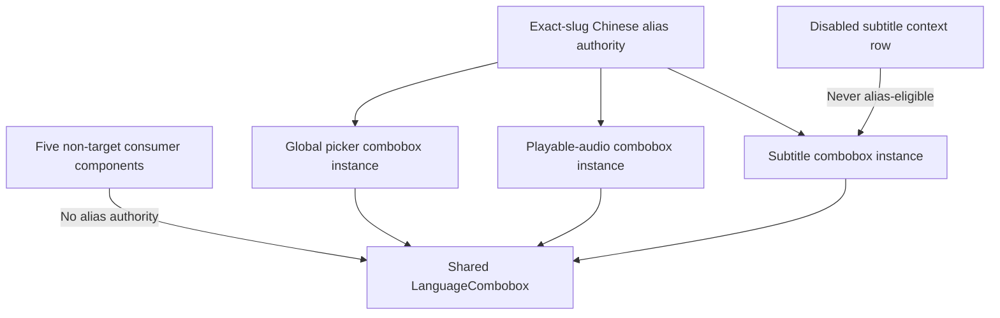
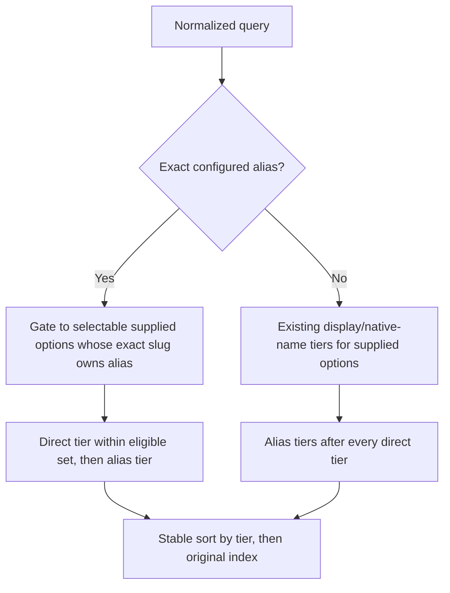

# Watch Language Picker Chinese Search Aliases - Plan

## Goal Capsule

- **Goal:** Let Chinese-speaking users find real language options in the global language, playable-audio, and subtitle pickers by using familiar Chinese language names.
- **Authority order:** Product Contract R-IDs govern product behavior; Planning Contract KTD-IDs govern implementation; repository rules govern validation and delivery.
- **Execution scope:** Change only `apps/web` language-alias metadata, shared filtering logic, and related tests, and create the corresponding roadmap ticket.
- **Stop condition:** Stop and re-scope if implementation requires BCP-47 prefix inference for language identity, changes language availability, or changes playback or subtitle routing.
- **Delivery boundary:** Implement and validate locally from fresh `origin/main`; do not push or open a PR without explicit user approval.
- **Unresolved blockers:** None.

---

## Product Contract

### Summary

Add consistent Chinese search-alias behavior to the three target Watch language pickers.
Aliases only help users discover options that already exist in each picker; they never create or imply unavailable audio or subtitles.

### Problem Frame

The shared language picker currently searches only a language's display name and native name.
Chinese-speaking users commonly search with names such as `普通话`, `粤语`, `简体中文`, and `繁體中文`, but those terms are not always present in those fields, so real language options can appear unavailable.

The global Watch language picker, playable-audio picker, and subtitle picker all use the same shared component.
That component also has other consumers, so Chinese aliases must be enabled explicitly by the three target pickers rather than changing every consumer globally.

### Key Decisions

- **Use the same alias behavior in all three target pickers.** (session-settled: user-approved — chosen over limiting the fix to the global picker because each target picker already limits results to its own available options.) Governs R1-R2.
- **Bind aliases and language groups to exact public language slugs.** (session-settled: user-approved — chosen over BCP-47 prefix inference because related Chinese locale tags do not represent interchangeable language identities.) Governs R3-R4, R11, R13.
- **Treat `中文` as a broad discovery query.** (session-settled: user-directed — chosen over routing it to one default Chinese option because the term does not identify a single language variant.) Governs R11.
- **Use relevance first and backend order as the tie-breaker.** (session-settled: user-directed — chosen over both a frontend-maintained popularity list and a backend-only result order.) Exact slug ownership controls eligibility; direct display/native-name matches rank before supplemental alias-only matches, and the backend or caller order resolves ties. Governs R3-R4, R11.
- **Do not map `台語` until an accurate Taiwanese Hokkien option exists.** (session-settled: user-approved — chosen over mapping it to Taiwan Mandarin or another Hokkien variety because either result would mislabel the requested language.) Governs R12.

### Actors

- A1. A Chinese-speaking Watch user who knows a familiar Chinese language name but not the English name used by the language catalog.

### Requirements

**Shared picker behavior**

- R1. The global language, playable-audio, and subtitle pickers must use the same Chinese search aliases.
- R2. Alias matching may return only options already supplied to the current picker; it must not create or imply unavailable audio or subtitles.
- R3. Every alias must bind explicitly to one or more public language slugs; no alias may be inferred from a BCP-47 prefix or locale family.
- R4. Direct display-name and native-name matches must rank ahead of supplemental alias-only matches; results within the same tier must preserve the picker's original backend or caller order.
- R5. Empty queries and queries without a configured alias match must preserve current picker behavior.

**Minimum Chinese alias coverage**

| ID  | Exact language slug   | Required accepted input                            |
| --- | --------------------- | -------------------------------------------------- |
| R6  | `mandarin-china`      | `普通话`, `普通話`                                 |
| R7  | `mandarin-taiwan`     | `国语`, `國語`, `台湾华语`, `台灣華語`, `臺灣華語` |
| R8  | `cantonese`           | `粤语`, `粵語`                                     |
| R9  | `chinese-simplified`  | `简体`, `簡體`, `简体中文`, `簡體中文`             |
| R10 | `chinese-traditional` | `繁体`, `繁體`, `繁体中文`, `繁體中文`             |

**Broad Chinese discovery and accuracy**

- R11. `中文` must match all currently supplied options that belong to this manually maintained group: `cantonese`, `chinese-guiliu`, `chinese-hokkien-amoy`, `chinese-qinghai`, `chinese-sichuan`, `chinese-simplified`, `chinese-traditional`, `chinese-yunnan-kunming`, `foochow`, `hainanese`, `hakka`, `hui`, `mandarin-china`, `mandarin-taiwan`, `penang-hokkien`, `pontianak-hakka`, `shanghainese`, `teochew`, and `xiang`.
- R12. `台語` and `臺語` must not match `mandarin-taiwan`, `chinese-hokkien-amoy`, or `penang-hokkien`.
- R13. A new Chinese-related language identity must be explicitly reviewed before it is added to an alias or to the R11 group.

### Key Flows

- F1. Find a language by a familiar Chinese name
  - **Trigger:** A1 opens one of the three target Watch language pickers and enters a configured Chinese alias.
  - **Steps:** The picker checks only its supplied options, ranks direct display/native-name matches before supplemental alias-only matches, and preserves backend or caller order within each relevance tier.
  - **Outcome:** A1 can select a real language option without knowing its catalog English name.
  - **Covers:** R1-R10.

- F2. Browse Chinese-related options
  - **Trigger:** A1 enters `中文` in any target Watch language picker.
  - **Steps:** The picker finds members of the manually maintained Chinese group among its supplied options.
  - **Outcome:** The global picker can show the broader catalog, while audio and subtitle pickers show only currently available members.
  - **Covers:** R2-R4, R11.

### Acceptance Examples

- AE1. **Covers R1, R6.** Given that the global picker contains `mandarin-china`, when A1 enters `普通话`, Mandarin, China appears as a selectable result.
- AE2. **Covers R1-R2, R8.** Given that a video's audio picker does not contain `cantonese`, when A1 enters `粤语`, Cantonese does not appear.
- AE3. **Covers R1-R2, R10.** Given that a video's subtitle picker contains `chinese-traditional`, when A1 enters `繁體中文`, Chinese Traditional appears without adding any other subtitle language.
- AE4. **Covers R4, R11.** Given that the current picker contains several Chinese-group members, when A1 enters `中文`, an eligible option whose native name is `中文` ranks first, followed by alias-only owners in backend or caller order.
- AE5. **Covers R12.** Given that the picker contains `mandarin-taiwan` and Hokkien variants, when A1 enters `台語`, none appears as an accurate match.
- AE6. **Covers R3, R5.** Given that an option shares a `zh` BCP-47 prefix with another language but has no configured alias, when A1 enters the other language's Chinese alias, the shared prefix alone does not add the option.

### Scope Boundaries

- Do not rename language options or display search aliases as new official language names.
- Do not change public language slugs, BCP-47 mappings, UI locale resolution, URLs, playback routing, subtitle routing, or language availability.
- Do not change Watch content search, query-language detection, or Chinese metadata retrieval.
- Do not automatically enable Chinese aliases for other `LanguageCombobox` consumers.
- Do not add non-Chinese aliases in this work; the pending Russian discoverability issue remains separate.
- Do not add a Taiwanese Hokkien identity or treat Taiwan Mandarin as Taiwanese Hokkien.
- Do not change message JSON; aliases are invisible search metadata, not UI copy.

### Dependencies and Assumptions

- The current picker's supplied options remain the sole authority for availability; alias search filters that list and never queries or synthesizes a second language list.
- The Chinese-language group is explicitly configured. New or corrected public Chinese-related identities require human review before the group changes.
- `feat-364` was the next roadmap ID on `origin/main` when this plan was written; recheck that it is still free before implementation.

### Sources and Research

- `apps/web/src/components/watch/LanguageCombobox.tsx` owns display-name and native-name matching, ranking, keyboard active state, and virtualization.
- `apps/web/src/components/watch/GlobalLanguagePickerModal.tsx` builds global language-catalog options.
- `apps/web/src/components/watch/LanguagePickerModal.tsx` builds playable-audio and subtitle options.
- `apps/web/src/components/watch/__tests__/LanguageCombobox.test.tsx` is the main regression suite for filtering, ranking, keyboard, and ARIA behavior.
- `docs/roadmap/platform/feat-169-watch-language-picker-search-ranking.md` defines the existing name-prefix, word-prefix, and substring ranking rules.
- `docs/solutions/best-practices/language-identity-on-slug-not-bcp47-20260605.md` establishes exact slug as the language-identity boundary.
- `docs/solutions/conventions/frontend-change-page-load-performance-verification.md` requires page-load evidence proportional to frontend behavior risk.
- `.context/compound-engineering/todos/018-pending-p2-fix-language-picker-search-aliases-for-russian.md` records a similar but separate non-Chinese discoverability issue.

---

## Planning Contract

### Product Contract Preservation

Product Contract unchanged.

### Key Technical Decisions

- KTD1. **Make alias authority an opt-in `LanguageCombobox` capability.** (session-settled: user-approved — chosen over globally enabling aliases for every LanguageCombobox consumer because the user confirmed only the global, audio, and subtitle pickers.) The shared combobox accepts an optional exact-slug alias authority; only the three target instances, owned by `GlobalLanguagePickerModal` and `LanguagePickerModal`, receive it. The options supplied to each instance remain the availability boundary. Governs R1-R2.
- KTD2. **Use one client-safe alias authority keyed by exact slug.** (session-settled: user-approved — chosen over BCP-47 or locale-prefix inference because distinct Forge Languages can share locale tags.) Both target components pass the same read-only authority rather than maintaining separate mappings. Governs R3, R6-R13.
- KTD3. **Treat exact configured aliases as authoritative and rank supplemental aliases after every direct tier.** If a normalized query exactly equals a configured alias, only selectable supplied options whose exact slug owns that alias are eligible; BCP-47-derived native labels and disabled context rows cannot bypass this gate. Among eligible results, display-name and native-name prefix, word-prefix, and substring tiers rank before alias prefix, word-prefix, and substring tiers; original backend or caller order breaks same-tier ties. The frontend adds no popularity or "common Chinese" tier. Governs R3-R5, R11-R13.
- KTD4. **Keep the new production runtime data small.** The alias authority is a leaf containing only manually maintained slugs and aliases, with no runtime dependency on `PUBLIC_WATCH_LANGUAGE_SLUGS`, `LANGUAGE_BCP47_MAP`, URL aliases, or messages; public-slug integrity is validated only in tests. The implementation must not introduce a second copy of an existing corpus or map into the client bundle. Removing existing language datasets from client chunks is separate work. Governs R3, R11, R13.
- KTD5. **Do not reuse existing maps with different semantics.** `language-aliases.ts` remains for legacy URLs, `TOOLTIP_LANGUAGE_ALIASES` remains for tooltip language selection, and message JSON remains for visible copy.

### High-Level Technical Design

### Sequencing

1. Create an isolated worktree from fresh `origin/main` and create the new platform roadmap ticket.
2. Establish the exact-slug alias authority and structural tests first.
3. Extend shared filtering, then pass the authority only to the three target combobox instances.
4. Run focused tests, browser validation for all three pickers, non-Chinese regression checks, and page-load validation; then mark the roadmap ticket complete.

### Risks and Mitigations

- **Affecting other pickers:** `LanguageCombobox` has seven production component consumers, while only two components build the three target option sets. Use optional per-option aliases and test that behavior is unchanged when aliases are absent.
- **Misidentifying a language:** BCP-47 is not unique. Key aliases by exact slug and validate keys against the public slug corpus in tests.
- **Drift in the `中文` group:** Keep membership manually maintained; structural tests validate current members, and R13 prevents automatic inclusion of new languages.
- **Increasing client payload:** Do not let the new alias module import the full language corpus or BCP-47 map at runtime. Confirm that the implementation introduces no second corpus/map copy, no new request, and only the bounded alias-table byte delta in the affected client chunk.
- **Overwriting newer behavior from an old branch:** The current worktree is behind `origin/main`. Start implementation in a new worktree from fresh `origin/main` so unrelated branch changes are not carried into this fix.

---

## Implementation Units

### U1. Establish the exact-slug alias authority

- **Goal:** Create the single Chinese alias source, structural tests, and the corresponding roadmap ticket.
- **Requirements:** R3, R6-R13; AE5-AE6.
- **Dependencies:** None.
- **Files:**
  - `docs/roadmap/platform/feat-364-watch-language-picker-chinese-search-aliases.md`
  - `apps/web/src/lib/watch-language-search-aliases.ts`
  - `apps/web/src/lib/watch-language-search-aliases.test.ts`
- **Approach:**
  1. Create the platform roadmap ticket and set it to `in-progress` before editing code.
  2. Add a small, client-safe alias table keyed by exact slug.
  3. Export a read-only authority for the two target components and a normalized configured-alias vocabulary for exact-query gating; unknown slugs return an empty alias collection.
  4. Validate in tests that every configured key belongs to the public Watch language slug set, without importing that full corpus into the production client module.
  5. Leave `台語` and `臺語` unconfigured to avoid mapping them incorrectly to Taiwan Mandarin or another Hokkien variant.
- **Execution note:** Write the alias-table structure and boundary tests before filling in configuration values.
- **Patterns to follow:**
  - Follow the static, read-only mapping style in `apps/web/src/lib/language-aliases.ts`, without reusing its URL semantics.
  - Follow the test-only public-slug validation pattern in `apps/web/src/lib/locale.test.ts`.
- **Test scenarios:**
  1. Each exact slug in R6-R10 owns exactly its required Simplified and Traditional aliases.
  2. Covers F2 / AE4. Every manually maintained R11 slug owns `中文`, while no out-of-group slug does.
  3. Covers AE5. `mandarin-taiwan`, `chinese-hokkien-amoy`, and `penang-hokkien` do not own `台語` or `臺語`.
  4. An unknown slug returns an empty alias collection.
  5. Every alias-table key exists in `PUBLIC_WATCH_LANGUAGE_SLUGS`.
- **Verification:** There is one leaf alias authority, and the production module has no runtime dependency on the full language catalog, the BCP-47 map, URL aliases, or message catalogs.

### U2. Integrate opt-in alias matching across the three pickers

- **Goal:** Support exact-slug-governed alias matching in the shared combobox and enable it only in the global, audio, and subtitle instances.
- **Requirements:** R1-R5; F1-F2; AE1-AE6; KTD1-KTD5.
- **Dependencies:** U1.
- **Files:**
  - `apps/web/src/components/watch/LanguageCombobox.tsx`
  - `apps/web/src/components/watch/LanguageCombobox.aliases.test.tsx`
  - `apps/web/src/components/watch/GlobalLanguagePickerModal.tsx`
  - `apps/web/src/components/watch/LanguagePickerModal.tsx`
  - `apps/web/src/components/watch/LanguagePickerModal.aliases.test.tsx`
  - `apps/web/src/components/watch/__tests__/LanguageCombobox.test.tsx`
  - `apps/web/src/components/watch/__tests__/GlobalLanguagePickerModal.test.tsx`
  - `apps/web/src/components/watch/GlobalLanguagePickerModal.aliases.test.tsx`
  - `apps/web/src/components/watch/__tests__/LanguagePickerModal.test.tsx`
- **Approach:**
  1. Add an optional exact-slug alias-authority prop to `LanguageCombobox` without changing option values, displayed names, or submitted slugs.
  2. Add KTD3's exact-alias gate and lower-priority partial-alias tiers to the existing memoized filter, retaining original indices as same-tier tie-breakers.
  3. Pass the U1 authority to the global, playable-audio, and subtitle combobox instances. Alias matching must require a selectable supplied option, so `currentLanguageUnavailableSubtitleOption` remains visible for existing empty/direct-name behavior but cannot appear through an alias.
  4. Do not pass the authority from the other five consumers: `SearchOverlay`, `LanguageCollectionSwitcher`, `CollectionDownloadModal`, `SeriesPageClient`, and `WatchUnavailableLanguageClient`. Their options continue through the existing search behavior.
  5. Leave active-index, Enter selection, ARIA active descendant, keyboard scrolling, and virtualization code unchanged.
- **Execution note:** Add failing behavior tests before changing shared matching logic and the three option projections.
- **Patterns to follow:**
  - Follow the `searchMatchTierForText` tiers and original-index stable sort in `apps/web/src/components/watch/LanguageCombobox.tsx`.
  - Preserve the direct-match priority defined by `docs/roadmap/platform/feat-169-watch-language-picker-search-ranking.md` for non-exact and partial queries.
- **Test scenarios:**
  1. Covers AE1. A new global-picker integration test uses the real `LanguageCombobox`: `mandarin-china` appears for `普通话` or `普通話`, can be selected, and Apply submits exactly `mandarin-china`. Keep the existing mocked lifecycle suite separate.
  2. Covers AE2. If the audio picker lacks `cantonese`, entering `粤语` or `粵語` does not synthesize that option.
  3. Covers AE3. If the subtitle picker contains `chinese-traditional`, entering `繁體中文` filters the existing subtitles without adding another subtitle.
  4. Covers R2. If current audio is `mandarin-china` but only other-language subtitles exist, `普通话` yields no subtitle result; empty query and direct `Mandarin` search still expose the existing disabled placeholder as context.
  5. Covers AE4. An alias-prefix option placed earlier in caller order still ranks after a direct-substring option, proving every direct tier precedes every alias tier.
  6. An eligible direct native-name match ranks before exact alias-only owners; alias-only ties preserve backend or caller order.
  7. Covers AE5. `台語` and `臺語` display no match rather than selecting an approximate language.
  8. Covers AE6. An unconfigured option with an unrelated name, no explicit native name, and `bcp47: "zh-Hant-XX"` is excluded for `中文`; its BCP-47-derived native label cannot bypass exact-slug authority.
  9. After alias filtering, index 0 is active, `aria-activedescendant` references the mounted first result, and Enter selects that result's slug.
  10. Starting from a scrolled virtualized list, alias filtering resets scroll to zero, shows the correct filtered window, and keeps Arrow Up and Arrow Down bounded to filtered results.
  11. A combobox instance without alias authority preserves empty-query, English, Russian, and native-name behavior; existing `russi` ranking remains unchanged in target instances.
  12. None of the five non-target consumer components imports or passes the alias authority.
- **Verification:** All three target instances use one alias authority imported only by `GlobalLanguagePickerModal.tsx` and `LanguagePickerModal.tsx`; other consumers, routing, playback, and subtitle availability have no functional change.

---

## Verification Contract

| Gate                  | Command or evidence                                                                                                                                                                                                                                                                                                                                                                                                                                      | Completion signal                                                                                                                                                                                                                                                      |
| --------------------- | -------------------------------------------------------------------------------------------------------------------------------------------------------------------------------------------------------------------------------------------------------------------------------------------------------------------------------------------------------------------------------------------------------------------------------------------------------- | ---------------------------------------------------------------------------------------------------------------------------------------------------------------------------------------------------------------------------------------------------------------------- |
| Roadmap               | `pnpm --filter roadmap generate:readme`, then inspect the generated diff                                                                                                                                                                                                                                                                                                                                                                                 | The command parses and lists the new ticket. Do not retain `docs/roadmap/README.md` when the generator also rewrites unrelated existing roadmap entries; keep that repo-wide drift outside this F1 fix.                                                                |
| Focused tests         | `pnpm --filter @forge/web test -- src/lib/watch-language-search-aliases.test.ts src/components/watch/LanguageCombobox.aliases.test.tsx src/components/watch/__tests__/LanguageCombobox.test.tsx src/components/watch/__tests__/GlobalLanguagePickerModal.test.tsx src/components/watch/GlobalLanguagePickerModal.aliases.test.tsx src/components/watch/LanguagePickerModal.aliases.test.tsx src/components/watch/__tests__/LanguagePickerModal.test.tsx` | Alias, ranking, availability-boundary, keyboard, and three-picker integration scenarios for U1-U2 pass.                                                                                                                                                                |
| Type safety           | `pnpm --filter @forge/web typecheck`                                                                                                                                                                                                                                                                                                                                                                                                                     | The optional alias-authority prop and all three target instances pass strict TypeScript checks.                                                                                                                                                                        |
| Lint                  | `pnpm --filter @forge/web lint`                                                                                                                                                                                                                                                                                                                                                                                                                          | Web lint and the UI-locale drift gate pass.                                                                                                                                                                                                                            |
| Formatting            | `pnpm format:check`                                                                                                                                                                                                                                                                                                                                                                                                                                      | Planned code and documentation conform to repository formatting.                                                                                                                                                                                                       |
| Production build      | `pnpm --filter @forge/web build` plus before/after dependency and chunk-size evidence                                                                                                                                                                                                                                                                                                                                                                    | The new alias module adds no runtime dependency edge to `PUBLIC_WATCH_LANGUAGE_SLUGS`, `LANGUAGE_BCP47_MAP`, URL aliases, or messages; it adds no second corpus/map copy or network request, and the affected chunk changes only by the bounded alias-authority delta. |
| Browser behavior      | Run `ce-test-browser` against the local production build                                                                                                                                                                                                                                                                                                                                                                                                 | Chinese alias scenarios pass in the global, audio, and subtitle pickers; non-Chinese queries such as English and Russian still follow existing rules.                                                                                                                  |
| Locale coverage       | Browser-smoke English, Simplified Chinese, Traditional Chinese, and Russian Watch routes                                                                                                                                                                                                                                                                                                                                                                 | Alias search is independent of UI locale, and selection always submits the real language slug.                                                                                                                                                                         |
| Availability boundary | On a video with limited audio/subtitle options, search for an unavailable configured alias                                                                                                                                                                                                                                                                                                                                                               | No synthetic audio or subtitle option appears.                                                                                                                                                                                                                         |
| Page-load performance | Compare the affected Watch route before/after using production-build and browser-network evidence                                                                                                                                                                                                                                                                                                                                                        | No new request or dynamic load is introduced, and initial page load has no abnormal growth.                                                                                                                                                                            |

### Browser Scenarios

1. In the global picker on `/watch`, search separately for `普通话`, `粵語`, `简体中文`, `繁體中文`, and `中文`; verify results and ordering against R6-R11.
2. On `/watch/jesus.html/mandarin-china.html`, open the player's audio picker and confirm Chinese aliases return only Dubs that are actually playable for that video.
3. In the subtitle picker for the same video, search Simplified and Traditional aliases and confirm only real subtitles on the current Video Edition appear.
4. Repeat at least one Chinese alias search on English, Simplified Chinese, Traditional Chinese, and Russian UI routes; confirm that UI locale does not change slug matching.
5. Search for `English`, `russi`, and an existing native name; confirm direct-match ranking, keyboard selection, and scrolling have not regressed.

---

## Definition of Done

- All U1 and U2 test scenarios pass.
- The three target pickers support the R6-R11 Chinese aliases while showing only options already supplied to each picker.
- Direct display-name and native-name matches remain ahead of aliases; empty and non-Chinese query behavior remains unchanged.
- `台語` and `臺語` do not map incorrectly to Taiwan Mandarin or another Hokkien variant.
- Other `LanguageCombobox` consumers do not receive unrequested Chinese alias behavior.
- No URL, playback routing, subtitle routing, language availability, Watch content search, or message JSON changes are made.
- Focused tests, typecheck, lint, formatting, production build, browser QA, and page-load evidence all pass.
- The roadmap ticket is `in-progress` before implementation and `complete` after all verification passes. The roadmap generator is run, but unrelated repo-wide README drift is not retained in this F1 diff.
- The final diff contains no local screenshots, temporary debugging files, abandoned implementation code, or unrelated F1 changes.
- Local verification is handed to the user for review; pushing or opening a PR requires explicit approval.
