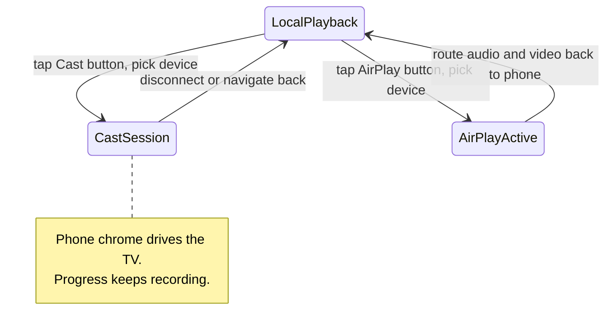
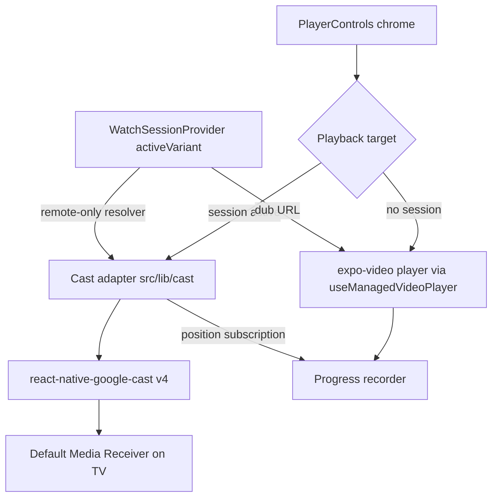
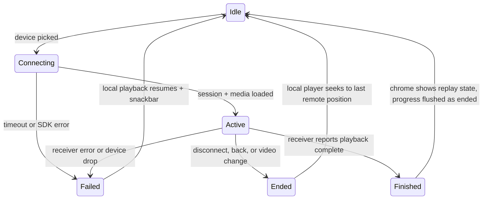

# Mobile Player Casting - Plan

## Goal Capsule

- **Objective:** Add Google Chromecast and AirPlay casting to the video-details player in `apps/mobile`, so a viewer watches the selected dub on an external screen with watch progress preserved.
- **Authority hierarchy:** Product Contract requirements (R-IDs) govern behavior. Planning Contract KTDs govern mechanism within those requirements. Repo conventions in `apps/mobile/CLAUDE.md` govern style and tooling.
- **Execution profile:** Work happens on branch `worktree-feat-mobile-player-casting`. U2 requires new EAS dev-client builds on both platforms before later units can be device-verified. Final acceptance runs on physical hardware (a Chromecast device and an Apple TV). Landing order: this plan lands before the mini-player draft PR (#1937); before U4 starts, re-derive KTD4's player-ownership anchor and KTD7's unmount end-trigger against whatever has merged.
- **Stop conditions:** Stop and surface if the U2 hardware spike shows the production dub streams cannot play on the Default Media Receiver — the fallback is admin-side stream work outside this plan's ownership. Stop and surface if `react-native-google-cast` v4 proves broken under the New Architecture on either platform.
- **Tail ownership:** The implementer opens the PR and verifies on hardware. TestFlight distribution of the rebuilt clients stays with the user.

---

## Product Contract

Product Contract preservation: changed — added R12–R15 (session gap-fill behaviors from flow analysis, confirmed at the scoping synthesis), extended the F3 trigger to include opening a different video, resolved KD6's compatibility caveat and the two Outstanding Questions into the Planning Contract, and removed the Expo Go dependency line (superseded by KTD10). R1–R11 meaning unchanged. A post-review pass added R16 (the connecting state), AE7 (hardware volume), and R2's permission-denied caveat.

### Summary

Add two buttons to the video-details player chrome: AirPlay (iOS only) and Google Cast (iOS and Android). Either route plays the currently selected dub's stream on the external screen while the existing player controls keep working and watch progress keeps recording. Both buttons ship together in one TestFlight release.

### Problem Frame

Many people who install the mobile app do not install the TV app, but they own a TV or monitor that supports AirPlay or Chromecast. Today the only way to reach that screen from the app is system screen mirroring, which gives poor quality and no in-app control. The product lead requested casting as part of making the player match the YouTube app player, which supports both routes.

### Key Decisions

- KD1. **Cast depth is a standard remote on the player screen only.** Chosen over a YouTube-level persistent session; this keeps the work clear of the in-flight mini-player PR. Governs R7, R10, R15.
- KD2. **One release carries both buttons.** The app is distributed only through TestFlight with no users yet, so the native rebuild that Chromecast forces is cheap and no AirPlay-first phasing is needed.
- KD3. **v1 uses Google's stock media receiver.** No Cast console registration is needed; the TV shows a generic splash during connect. A branded receiver is deferred.
- KD4. **A cast device always receives the remote stream of the selected dub.** Local downloaded files are never served to the receiver. Governs R3, R6.
- KD5. **AirPlay uses native external playback, not mirroring.** The local player keeps running, so controls and progress need no AirPlay-specific work. Governs R4, R5.
- KD6. **Chromecast integrates through the Google Cast SDK's standard React Native wrapper (`react-native-google-cast`).** A foundational pick: it adds a native module, which forces new dev-client and TestFlight binaries. KTD1 records the verified version and architecture posture.

### Requirements

**Buttons and availability**

- R1. The video-details player chrome shows a Google Cast button on iOS and Android, and an AirPlay button on iOS only.
- R2. The Cast button appears only while at least one Cast device is reachable, per Google's Cast design convention. A denied local-network permission is the exception: it shows a disabled Cast button with a short explainer instead of hiding — the gate must not hide the only recovery affordance.
- R3. Without internet connectivity the Cast path is unavailable, while AirPlay stays available — including for downloaded videos playing from local storage.
- R14. Both buttons are usable as soon as the player screen is interactive, including before local playback has started.

**AirPlay behavior**

- R4. The AirPlay button opens the system route picker, and selecting a device moves video output to that device through native external playback.
- R5. While AirPlay is active, the player area indicates that playback is on the external device, and every existing control keeps working unchanged.

**Chromecast session behavior**

- R6. Selecting a Cast device starts a session that plays the currently selected dub's remote stream on the TV from the current playback position.
- R7. During a session the phone shows the poster plus "Casting to \<device name\>", and the existing controls (play/pause, skip, scrubber, time) drive the TV.
- R8. Hardware volume buttons set the cast device volume during a session.
- R9. Switching the dub during a session switches the TV to the new dub's stream at the same position.
- R10. Ending the session — disconnect from the Cast button, or navigating back off the player — stops TV playback and returns the phone player to the TV's last position.
- R12. Locking or backgrounding the phone during a session does not interrupt TV playback.
- R13. A session failure — the receiver fails to load the stream, the device drops, or connecting hangs — ends the session and returns to local playback at the last known position with the standard error snackbar.
- R15. Opening a different video (for example through Up Next) ends the session the same way navigating back does.
- R16. While a session is connecting, the player area shows a distinct connecting state with the device name, and transport controls hold until the receiver confirms playback; a hanging connect resolves through R13.

**Progress**

- R11. Watch progress records during Chromecast and AirPlay sessions with the same semantics as local playback, so continue watching reflects the position reached on the external screen.

### Key Flows

- F1. Start casting to a Chromecast
  - **Trigger:** Viewer taps the Cast button during playback.
  - **Steps:** Device list opens; viewer picks a device; the connecting state shows (R16); the local player pauses; the TV plays the selected dub from the current position; the chrome enters remote mode.
  - **Outcome:** Standard remote per KD1.
  - **Covers:** R6, R7, R16.
- F2. Watch and control from the phone
  - **Trigger:** A cast session is active.
  - **Steps:** Viewer seeks, pauses, resumes, or switches the dub from the normal chrome; hardware volume buttons set the TV volume.
  - **Outcome:** The TV follows every command; progress keeps recording.
  - **Covers:** R7, R8, R9, R11.
- F3. End the session
  - **Trigger:** Viewer disconnects via the Cast button, navigates back off the player, or opens a different video.
  - **Steps:** TV playback stops; the phone player syncs to the TV's last position; progress flushes.
  - **Outcome:** The viewer continues on the phone, or leaves, with nothing lost.
  - **Covers:** R10, R11, R15.
- F4. AirPlay a video
  - **Trigger:** Viewer taps the AirPlay button (iOS).
  - **Steps:** The system route picker opens; viewer picks a device; video output moves to the device; the player area indicates external playback.
  - **Outcome:** Controls and progress behave exactly as in local playback.
  - **Covers:** R4, R5, R11.

### Acceptance Examples

- AE1. **Covers R6, R7.** Given a video playing with a non-default dub (for example French) at 10:00, when the viewer casts to "Living Room TV", then the TV plays the same video with French audio from 10:00 and the phone shows the poster plus "Casting to Living Room TV".
- AE2. **Covers R11.** Given a signed-in viewer casting a film, when the film plays to the end on the TV, then continue watching shows the film as finished without further viewer action.
- AE3. **Covers R3, R6.** Given a downloaded video playing from local storage with internet available, when the viewer starts a cast session, then the TV plays the remote stream of the same dub.
- AE4. **Covers R3.** Given the device has no internet connection, when the viewer plays a downloaded video, then the Cast path is unavailable and the AirPlay button still plays the video on an Apple TV.
- AE5. **Covers R10, R11.** Given an active cast session at 42:00, when the viewer navigates back off the player, then the TV stops and the video's saved progress is 42:00.
- AE6. **Covers R12.** Given an active cast session, when the viewer locks the phone or switches to another app, then TV playback continues without interruption.
- AE7. **Covers R8.** Given an active cast session, when the viewer presses the hardware volume buttons, then the cast device volume changes and the phone's media volume does not.

### Success Criteria

- Each route is verified on physical hardware — a real Chromecast device and a real Apple TV. Simulators cannot exercise device discovery.
- Normal playback behavior is unchanged when no session is active.

### Scope Boundaries

**Deferred for later**

- A branded Cast receiver (JFP splash on the TV) per KD3.
- Casting entry points beyond the video-details player, and any persistent in-app "casting" bar — revisit after the mini-player work lands.
- On-TV queue, autoplay-next, or next-episode behavior.

**Not in scope**

- Subtitles on the external screen. The phone renders subtitles as an app-layer overlay, and that overlay does not travel to the TV.
- Serving local downloaded files to a Cast device (KD4).
- Changes to `apps/web` or `apps/tv`.

**Deferred to Follow-Up Work**

- Migrate to `react-native-google-cast` v5 when it ships, per the KTD1 decision rule.
- Propose a Metro-bundle CI job — two prior incidents show CI stays green while real bundles break (see `docs/solutions/build-errors/pnpm-hidden-hoist-phantom-dependency-worklets-babel-metro-bundle-failure.md`).

### Dependencies / Assumptions

- Sequencing: this plan lands before the mini-player draft PR (#1937), which rebases on it (declared in the Goal Capsule). A mini player that survives the screen must re-derive KTD7's unmount end-trigger, or the TV keeps playing after the viewer walks away.
- iOS Cast discovery triggers the local-network permission prompt; the required `Info.plist` entries arrive through the SDK's config plugin at build time.

---

## Planning Contract

### Key Technical Decisions

- KTD1. **Integrate `react-native-google-cast` v4.9.1 now; keep the v5 door open.** v4.9.1 runs on the New Architecture in the maintained interop mode; v5 (the Nitro rewrite) is beta-ready upstream but untagged. All SDK access goes through one adapter module (KTD3), so a v5 swap stays cheap. Decision rule: if a v5 beta with a migration guide is published before U2 starts — the point where the version-specific config, plugin mod, and dev-client builds are spent — the implementer may adopt v5 instead. Pin `androidPlayServicesCastFrameworkVersion` to a concrete version — the plugin default floats. (session-settled: user-approved — chosen over waiting for the v5 beta: v4 ships now and the adapter isolation makes the later swap cheap.)
- KTD2. **Raise the iOS deployment target to 16.0 via `expo-build-properties`.** The current `google-cast-sdk` pod (4.8.6) requires iOS 16+; the app today sits on React Native's 15.1 default. (session-settled: user-approved — chosen over pinning an older Cast pod: TestFlight-only distribution means nobody is stranded.) Reach note: the floor persists past TestFlight — a public release excludes iOS-15-max devices (iPhone 6s, 7, original SE), and reversing it later means dropping the Cast pod.
- KTD3. **A small cast layer owns every `react-native-google-cast` import: pure logic in `src/lib/cast/`, the one hook at `src/hooks/useCastPlayback.ts`.** `src/lib/` holds no hooks today and never imports from components — keep that layering: the pure reducer, the media resolver, and the imperative SDK adapter live in `src/lib/cast/`; the hook lives with the other hooks. A jest guard test (the repo's fs-scanning guard convention, with the anti-vacuous file-count check) bans SDK imports outside that two-entry allowlist. Session and media state changes route through pure reducers with tests — async native callbacks racing chrome fades is a known defect class here (see `docs/solutions/design-patterns/mobile-auto-hide-overlay-fade-race-ref-sync.md`). Render tests exist (the re-point pattern) and U4 uses them for dispatch assertions; race coverage lives in the reducer tests.
- KTD4. **Command routing is a `PlaybackTarget` facade selected inside `VideoPlayer`, not a fake player object.** `useManagedVideoPlayer` is called in `VideoPlayer.tsx`, so dual-dispatch and remote-mode UI live there. The screen (`app/watch/[slug].tsx`) owns session lifecycle, the remote-only resolver, end triggers, and the snackbar — it already holds the variant, the offline source, and the snackbar state. A single pure selector yields `{ isPlaying, currentTime, duration, ended, play, pause, seekTo }` for `PlayerControls` and the double-tap side seek; `ended` comes from the local player's end event when no session is active and from the session's Finished state during one. `VideoView`, `useControlsVisibility`, and `SubtitleOverlay` keep the real player. The controls cannot take a swapped `player` prop — they use it as an event emitter and a settable property bag. While a session is active the local player stays paused with its source frozen — the freeze is caller-side: the screen pins the player's source prop to the pre-session URL and releases it at session end, so a dub chosen mid-session flows through the existing swap machinery on disconnect (a hook-side freeze could never replay it). `useManagedVideoPlayer` gains a `castActive` option — mirrored into a ref, because the AppState effect registers once per player and a plain option is a stale closure — that suppresses the AppState play/pause pair and the stall watchdog. The load-bearing race: cast starts, the pause lands, the viewer backgrounds before `playingChange` arrives, and the foreground handler would resume local audio over the TV. The background progress flush stays on — KTD6 keeps its position fresh. Governs the mechanism for R7, R9, R12.
- KTD5. **The cast media resolver never sees the offline source.** The session loads `activeVariant?.hls ?? video?.streamingUrl ?? seedStreamingUrl` — the screen's own chain minus only the `offlineSource ??` prefix, so casting works in the seed-only window before the detail query resolves — with contentType `application/x-mpegURL`, title and poster metadata, and a start position from the local player (or the pending resume position when local playback never started). Implements KD4; governs R3, R6, AE3.
- KTD6. **Cast positions feed the existing progress recorder through a ref-stable facade.** `useManagedVideoPlayer` returns a stable `progressFeed` (`onTick`/`flush`) that dereferences the current recorder at call time — the recorder is rebuilt on every dub switch, so a captured instance would write into a flushed, dead recorder. While `castActive` is set the hook skips its own local tick, so double-write prevention is structural, not caller discipline. The session's ~1s position subscription drives `onTick`; session end forces a flush; the receiver's finished status maps to the same "ended" handling (`flush("end")` plus the chrome's replay state). Rejected alternative: moving recorder ownership up to the screen — that loses the structural hero exclusion and duplicates the re-key lifecycle. Limit: the position feed is JavaScript and does not run while the app is suspended, so U5 reconciles on return to foreground; an app the OS terminates while suspended keeps only its last background flush. Signed-in-only and batching semantics carry over unchanged. Governs the mechanism for R11, AE2.
- KTD7. **Session lifetime keys on navigation, never AppState.** The session ends on explicit disconnect, player-screen unmount, or a change of video identity (the decoded slug) — and on nothing else. Unmount alone is not enough: Up Next navigates with a same-route replace that reuses the screen. The source URL is the wrong key: a dub switch changes it but must keep the session (R9). `iosSuspendSessionsWhenBackgrounded: false` in the plugin config keeps the TV playing when the phone locks (the SDK default would pause it). App kill leaves the TV playing, matching platform norms. Governs the mechanism for R10, R12, R15. AppState is not a session signal (see `docs/solutions/ui-bugs/tvos-appstate-inactive-vs-background-video-teardown.md`).
- KTD8. **iOS hardware volume routes to the TV via a local config-plugin mod.** `physicalVolumeButtonsWillControlDeviceVolume = true` on `GCKCastOptions` is not exposed by the vendor plugin, so a small local plugin (the `plugins/withBackgroundDownloaderAppDelegate.js` pattern: guarded require, pure string-transform functions, own test) amends the vendor plugin's AppDelegate injection. Android needs nothing. Governs the mechanism for R8.
- KTD9. **External routes are mutually exclusive, and the subtitle overlay hides while either is active.** Starting a cast session while AirPlay is active routes playback back to the phone first — cast start sets the player's `allowsExternalPlayback` to false (the only lever expo-video exposes to end an active AirPlay route) and session end restores it — and AirPlay activation while casting ends the cast session. The phone-side subtitle overlay does not render during any external route — there is no video on the phone to caption.
- KTD10. **No Expo Go guard for the Cast native module.** Imports are plain and unguarded, matching the repo's only native-module precedent (the download engine); verification happens in dev clients. (session-settled: user-approved — chosen over a guarded-require pattern: inventing a guard convention for one feature would be inconsistent with the codebase.)

### High-Level Technical Design

Component shape — where commands and positions flow:

Cast session lifecycle (the internal states behind the Product Contract's user-level diagram):

Every `Connecting` and `Active` state carries an unconditional release path (timeout or SDK callback) — no gate may depend on a success-or-error pair alone (see `docs/solutions/logic-errors/mobile-watch-autostart-veil-gate-missing-release-path.md`).

### Risks

- **Tokenized Mux streams fail on the Default Media Receiver** (open upstream bug, `react-native-google-cast#559`). Our URLs appear unsigned — `src/lib/muxThumbnail.ts` builds bare `stream.mux.com/{playbackId}.m3u8` URLs — so this likely does not apply. The U2 hardware spike settles it before deeper work; if it reproduces, stop per the Goal Capsule (the fallback is admin-side).
- **v4 interop edge cases on Android.** The maintainer noted Android view-config issues under the New Architecture in mid-2025, believed fixed in 4.9.0 but never pinned by a regression test. Mitigation: prefer the imperative device-dialog API over the native `CastButton` view, and smoke on Android hardware early.
- **Vendor config plugin under pnpm.** Config plugins that assume hoisted `node_modules` break silently in this monorepo (see `docs/solutions/integration-issues/datadog-mobile-rum-tvos-integration.md`). Inspect the plugin's output after prebuild; the established fallback is a committed pnpm patch. Unverified until U2: whether the vendor plugin's iOS mod targets a Swift AppDelegate (this app's is Swift) — an Objective-C-template mod would silently no-op, leaving KTD8 nothing to amend and U2 authoring the whole context setup. After any `pnpm patch-commit`, re-run `pod install` and clear DerivedData.
- **Metro hidden-hoist regression.** A new native module can shift pnpm's hidden-hoist winners with green CI. U2 includes a real bundle smoke on both platforms.
- **CocoaPods trunk goes read-only 2026-12-02.** The v5 effort tracks SPM migration upstream (`react-native-google-cast#606`); no action in this plan.
- **Same-file conflicts with the mini-player draft PR (#1937).** Landing order declared: this plan first (Goal Capsule); the rebase must re-derive the KTD4/KTD7 anchors.

---

## Implementation Units

### U1. AirPlay button and external-playback handling

- **Goal:** iOS viewers can AirPlay from the chrome; the phone indicates external playback and hides the subtitle overlay.
- **Requirements:** R1 (AirPlay half), R4, R5, R11 (AirPlay path), KD5, KTD9 (overlay hiding; mutual exclusion arrives with U4).
- **Dependencies:** none — expo-video already ships everything needed.
- **Files:** `apps/mobile/src/components/watch/PlayerControls.tsx`, `apps/mobile/src/components/watch/VideoPlayer.tsx`, `apps/mobile/src/lib/externalRoute.ts` (new), `apps/mobile/src/lib/__tests__/externalRoute.test.ts` (new), `apps/mobile/src/components/watch/__tests__/PlayerControls.test.tsx`.
- **Approach:**
  1. Render `VideoAirPlayButton` (iOS only) beside the fullscreen button in both chrome layouts — the portrait corner row and the fullscreen icon row — wrapped in the existing `Frosted` backplate, sized to the existing 44×44 icon-button style, tinted to match the chrome. Give it `accessibilityRole="button"` and a state-aware `accessibilityLabel`, matching the labels every existing chrome button carries.
  2. Subscribe to the player's `isExternalPlaybackActiveChange` event; while active, show an external-playback indicator in the player area and hide `SubtitleOverlay` (per KTD9). `allowsExternalPlayback` defaults true — no static setting; U4 toggles it for mutual exclusion (KTD9).
  3. Extract the "an external route is active" predicate into a small pure module (`externalRoute.ts`, the `autoHide.ts` extraction shape). U4 extends this same notion for cast remote mode instead of rewriting the indicator.
  4. Progress needs no change: the local player keeps running during AirPlay.
- **Patterns to follow:** the `Pressable` + `Frosted` + icon triplet in `PlayerControls.tsx`; the in-file react re-point pattern for render tests.
- **Test scenarios:**
  - AirPlay button renders on iOS in both portrait and fullscreen layouts, and does not render on Android.
  - External playback becoming active shows the indicator and hides the subtitle overlay; becoming inactive restores both.
  - The AirPlay button carries a role and a state-aware accessibility label (parity with the existing chrome buttons).
  - Covers AE4 (AirPlay half): the button remains present and functional when the source is a local downloaded file.
- **Verification:** jest suites pass; on an iOS device with an Apple TV, video and the selected dub play on the TV while phone controls and the progress bar keep working.

### U2. Cast foundation: dependency, config, builds, and the stream spike

- **Goal:** The Cast SDK is installed and configured, dev clients are rebuilt, and a real production dub stream is proven to play on a physical Chromecast.
- **Requirements:** R8 (mechanism per KTD8), KTD1, KTD2, KTD7 (config half), KTD10; gates the R6 stream contract, AE1, and AE7.
- **Dependencies:** none.
- **Files:** `apps/mobile/package.json`, `apps/mobile/app.json`, `apps/mobile/plugins/withCastOptionsVolume.js` (new), `apps/mobile/plugins/__tests__/withCastOptionsVolume.test.js` (new).
- **Approach:**
  1. Add `react-native-google-cast` pinned to 4.9.1 (apply the KTD1 decision rule first).
  2. Configure its plugin in `app.json`: default receiver (omit `receiverAppId`), `iosSuspendSessionsWhenBackgrounded: false`, a pinned `androidPlayServicesCastFrameworkVersion`, and an `NSLocalNetworkUsageDescription` string in the app's voice. Keep discovery autostart on (`iosStartDiscoveryAfterFirstTapOnCastButton: false`): R2 gates the button on discovered devices, so tap-deferred discovery could never receive its first tap, and the local-network prompt therefore lands on first launch of the rebuilt client.
  3. Add `expo-build-properties` with iOS `deploymentTarget: "16.0"` (KTD2).
  4. Switch `runtimeVersion` from the `sdkVersion` policy to `fingerprint` in `app.json`. Under the old policy, an EAS Update published after this unit merges would deliver a cast-importing bundle to binaries that lack the native module and hard-crash every installed tester. The switch also cuts every binary built before it off from EAS Update and `update:rollback` — no over-the-air fix reaches installed testers until the rebuilt clients and a new TestFlight build are distributed.
  5. Add the local `withCastOptionsVolume` plugin after the vendor plugin, amending the injected `GCKCastOptions` with `physicalVolumeButtonsWillControlDeviceVolume = true` (KTD8), following the `withBackgroundDownloaderAppDelegate.js` shape. The transform throws when the vendor injection is absent, so vendor-plugin drift fails prebuild instead of silently dropping the flag.
  6. Prebuild locally and inspect: the resolved `google-cast-sdk` pod version, the AppDelegate injection including the volume flag, `MainActivity`'s base class, and the Android manifest meta-data.
  7. Rebuild dev clients on both platforms; run a Metro bundle smoke (`expo export` for iOS and Android) — CI cannot catch hidden-hoist breaks.
  8. Spike on hardware: from a throwaway dev entry point, cast a real production dub HLS URL to a physical Chromecast and confirm video plus the selected dub's audio play. Remove the throwaway code afterward.
- **Execution note:** Run the hardware spike before starting U3. If the stream fails to load on the receiver, stop and surface per the Goal Capsule.
- **Patterns to follow:** `plugins/withBackgroundDownloaderAppDelegate.js` (guarded require, pure transform functions, own test); the committed-pnpm-patch fallback if the vendor plugin misbehaves under pnpm.
- **Test scenarios:**
  - `withCastOptionsVolume` transform inserts the volume flag into a representative injected-AppDelegate fixture and is idempotent on re-run.
  - Transform throws on an AppDelegate without the vendor injection (asserted in its own test) — a silent no-op would let hardware-volume support vanish on a library bump with CI green.
- **Verification:** both dev clients build and boot; `expo export` succeeds for both platforms; the spike video plays with correct audio on a physical Chromecast; the local-network permission prompt appears once on iOS.

### U3. Cast session adapter and state machine

- **Goal:** One tested module owns Cast session lifecycle, media loading, transport commands, position updates, and telemetry.
- **Requirements:** R2, R13 (mechanics), KTD3, KTD5, KTD7; the finished-state mapping that AE2 needs.
- **Dependencies:** U2.
- **Files:** `apps/mobile/src/lib/cast/castAdapter.ts` (new — the imperative SDK wrapper), `apps/mobile/src/lib/cast/castSessionReducer.ts` (new), `apps/mobile/src/lib/cast/castMediaResolver.ts` (new — the KTD5 resolver), `apps/mobile/src/hooks/useCastPlayback.ts` (new), `apps/mobile/src/lib/cast/__tests__/castSessionReducer.test.ts` (new), `apps/mobile/src/lib/cast/__tests__/castMediaResolver.test.ts` (new), `apps/mobile/src/lib/cast/__tests__/castImports.guard.test.js` (new).
- **Approach:**
  1. Wrap the SDK hooks (`useCastState`, `useCastSession`, `useRemoteMediaClient`, `useStreamPosition`) into one `useCastPlayback()` hook at `src/hooks/useCastPlayback.ts` exposing: session state, device name, position/duration, `load`, `play`, `pause`, `seekTo`, `end`, and a devices-available flag for button visibility (R2). Pure logic stays in `src/lib/cast/` per KTD3 — `src/lib/` gets no hooks.
  2. Drive state through a pure reducer implementing the HTD lifecycle diagram: `Idle / Connecting / Active / Failed / Ended / Finished`, with a connect timeout (unconditional release) and receiver media-status mapping (finished → `Finished`).
  3. Media loading per KTD5: remote-only resolver, contentType `application/x-mpegURL`, title and poster metadata, explicit start position parameter.
  4. Telemetry via `datadogLog` under a `cast.*` namespace with reserved-attribute-safe keys (`cast_state`, `error_message` — never `status`/`source`/`message`).
  5. Guard test bans SDK imports outside the KTD3 allowlist (the `src/lib/cast/` prefix plus `src/hooks/useCastPlayback.ts`), copying the existing guard shape including the anti-vacuous file-count assertion. Its positive control lives inside `src/lib/cast/`, proving the prefix allowlist does not swallow the scan.
- **Technical design (directional):** the reducer takes `(state, event)` where events are SDK callbacks (`sessionStarted`, `sessionEnded`, `mediaStatus(finished|failed)`, `timeout`, `userEnd`, `videoChanged`) — no `useState` side-channels.
- **Test scenarios:**
  - Reducer: every transition in the HTD diagram, including connect timeout to `Failed`, device drop during `Active`, finished mapping, and end-by-video-change.
  - Reducer: events arriving in an unexpected state (for example `mediaStatus` in `Idle`) do not throw and do not transition.
  - Guard test flags a planted out-of-allowlist import fixture (falsify once, then remove the plant).
  - Resolver: returns the variant stream, else the video stream, else the seed stream, and never a local file path — one case per input combination, including the seed-only window where the variant and the video are both null.
  - Telemetry payloads contain no Datadog reserved attribute names.
- **Verification:** jest suites pass; the module compiles with no imports of the SDK anywhere else.

### U4. Remote-control mode in the player screen

- **Goal:** The Cast button lives in the chrome, and an active session turns the existing controls into the TV remote.
- **Requirements:** R1 (Cast half), R2, R3, R6, R7, R9, R10, R12 (app-side half), R13, R14, R15, R16, KTD4, KTD7, KTD9 (mutual exclusion).
- **Dependencies:** U1, U3.
- **Files:** `apps/mobile/app/watch/[slug].tsx`, `apps/mobile/src/components/watch/VideoPlayer.tsx`, `apps/mobile/src/components/watch/PlayerControls.tsx`, `apps/mobile/src/hooks/useManagedVideoPlayer.ts`, `apps/mobile/src/hooks/useControlsVisibility.ts`, `apps/mobile/src/lib/playbackTarget.ts` (new — the KTD4 selector), `apps/mobile/src/lib/__tests__/playbackTarget.test.ts` (new), `apps/mobile/src/hooks/__tests__/useCastPlayback.test.ts` (new), `apps/mobile/src/components/watch/__tests__/PlayerControls.test.tsx`.
- **Approach:**
  1. Cast button (an icon-set glyph inside `Frosted`, opening the SDK's device dialog imperatively) next to the fullscreen and AirPlay buttons in both layouts; visible only when devices are reachable (R2); rendered so the autostart veil does not gate it (R14). Give it a role and a state-aware accessibility label (idle vs "Casting to \<device name\>").
  2. On session start: pause the local player; set `castActive` on `useManagedVideoPlayer` (new option, ref-mirrored per KTD4), which freezes the source (no `replaceAsync`) and suppresses the AppState play/pause pair and the stall watchdog — the background progress flush stays on. Load media at the current position, or the pending resume position when local playback never started.
  3. Remote mode UI: while connecting, the distinct R16 state (device name shown, transport held); once live, poster plus "Casting to \<device name\>" in the video area. The chrome stays visible with no new gate: the visibility hook keeps reading the local player, which the session holds paused, so the hide timer cannot arm — do not add a cast field to the hide gate; no reachable state could exercise it. Works in both portrait and fullscreen without forcing an orientation change.
  4. Dual-dispatch per KTD4: a pure `playbackTarget` selector in `VideoPlayer.tsx` hands one target to `PlayerControls` and the double-tap side seek; while a session is active they read from and write to the cast session. The scrubber reconciles its optimistic position against the next remote media status.
  5. Dub switch while active: the session loads the new dub's remote URL at the current position; the frozen local player does not reload (R9, KTD4).
  6. End paths per KTD7: key the end trigger on the decoded slug changing or the screen unmounting — never on the source URL. Releasing the caller-side source pin lets a dub chosen mid-session reload the local player before the seek to the last remote position applies; the player keeps the session's play/pause state. Failures follow R13 into the existing snackbar.
  7. Mutual exclusion: starting cast while AirPlay is active routes playback back to the phone first; AirPlay activation while casting ends the session (KTD9). Extend U1's `externalRoute.ts` notion for the cast state rather than adding a parallel predicate.
  8. Permission-denied state: when discovery is blocked by a denied local-network permission (distinct from "no devices found"), show the disabled Cast button with a short explainer per R2 — never a silent absence.
  9. R3's cast half is a composition, not a new sensor (the repo deliberately has none): no Wi-Fi means no discovered devices, so the button hides per R2; a LAN without internet fails at receiver stream-load and follows R13. Record this in AE4's hardware walk (Wi-Fi and cellular both off).
- **Patterns to follow:** the resume-seek path (`applySeek`) for the disconnect seek; reducer-routed visibility changes for keep-chrome-visible; `hexToRgba` for any translucent fill.
- **Test scenarios:**
  - Covers AE1: connect at a position with a non-default dub loads that dub's URL at that position (assert the resolver output and start position; device audio is hardware verification).
  - Covers AE3: with an offline source active locally, the session's load call receives the remote URL, never the local file path.
  - Covers AE5: back-navigation ends the session and the local player receives a seek to the last remote position.
  - Dub switch while casting calls the session load with the new URL and the local player's `replaceAsync` is not called.
  - Dub switch then disconnect: the local player receives the new dub's URL and the seek lands at the last remote position.
  - Backgrounding while casting triggers no local pause/resume; the background flush still fires and carries the last remote position.
  - Render test: with a session active, pressing play/pause invokes the cast target and never the local player (the re-point render pattern).
  - The double-tap side seek routes to the cast target while a session is active, never the paused local player.
  - The chrome shows Replay when the receiver reports finished (the target's `ended` field).
  - The connecting state renders between device pick and media-loaded, and transport controls hold (R16).
  - Cast button hidden with no devices available; visible with devices; usable while the autostart veil is up; disabled with an explainer when permission is denied.
  - Covers AE4 (Cast half): no discovered devices hides the button; a receiver load failure follows the R13 snackbar-and-resume path.
  - Session failure surfaces the snackbar and returns controls to the local target.
  - Opening a different video through the same-route replace (Up Next) ends the session; a dub switch does not.
  - Both new buttons carry state-aware accessibility labels.
- **Verification:** jest suites pass; on hardware, AE1, AE3, AE5, and AE6 hold, and the chrome drives the TV for every control.

### U5. Progress recording during cast

- **Goal:** Continue watching reflects what played on the TV, including finishing there.
- **Requirements:** R11, AE2, KTD6.
- **Dependencies:** U3, U4.
- **Files:** `apps/mobile/src/hooks/useManagedVideoPlayer.ts`, `apps/mobile/src/lib/watchProgress/recorder.ts` (only if a flush-trigger label needs extending), `apps/mobile/app/watch/[slug].tsx`, `apps/mobile/src/hooks/__tests__/useManagedVideoPlayer.progressFeed.test.ts` (new — the hook's first behavioral suite; only a guard test exists for it today).
- **Approach:**
  1. Expose a ref-stable `progressFeed` (`onTick`, `flush`) on the hook's return value that dereferences the current recorder at call time (KTD6 — the recorder is rebuilt on dub switch); it is a no-op when no progress identity exists.
  2. While a session is active, drive `onTick(remotePosition, remoteDuration)` from the adapter's ~1s position subscription, and send one immediate tick when the session's media loads — `flush` writes nothing until at least one tick has landed.
  3. While `castActive` is set the hook skips its own local tick — double-write prevention lives inside the hook, not in the caller (KTD6).
  4. Flush on session end and screen unmount; map the receiver's finished status to the same handling as local `playToEnd` — `flush("end")` plus the chrome's replay state.
  5. Reconcile on foreground return: with a live session, read the receiver's position and finished status, feed one tick, and flush — the position subscription is JavaScript and does not run while the app is suspended (KTD6 records the OS-termination limit).
- **Patterns to follow:** the existing 2s-sample semantics inside the recorder (feed it raw ticks; do not re-batch upstream).
- **Test scenarios:**
  - Covers AE2: a finished media status forces an end-flush at full duration, given at least one prior cast tick (the load-time tick guarantees one).
  - Cast ticks reach the recorder with the same sampling behavior as local ticks.
  - Disconnect forces a flush at the last remote position; backgrounding mid-cast also flushes at the last remote position.
  - A dub switch mid-cast rebuilds the recorder, and later feed calls land in the new recorder, not the flushed old one.
  - Signed-out: cast ticks write nothing (existing recorder behavior holds through the new feed).
  - No double-write: with `castActive` set, the local poll contributes no ticks.
  - Foreground return with a live session feeds a reconcile tick and flushes at the receiver's position.
- **Verification:** jest suites pass; on hardware, finishing a film on the TV marks it finished in continue watching with no further interaction (AE2), and a mid-film disconnect saves the TV position (AE5).

---

## Verification Contract

| Check                | Command / method                                       | Applies to                          |
| -------------------- | ------------------------------------------------------ | ----------------------------------- |
| Unit and guard tests | `pnpm --filter @forge/mobile test`                     | all units                           |
| Types                | `pnpm --filter @forge/mobile typecheck`                | all units                           |
| Lint                 | `pnpm --filter @forge/mobile lint`                     | all units                           |
| Metro bundle smoke   | `npx expo export` (iOS and Android) from `apps/mobile` | U2, and after any dependency change |
| Dev-client builds    | `eas build --profile development` per platform         | U2                                  |
| Hardware acceptance  | AE1–AE7 walked on a physical Chromecast and Apple TV   | U1, U2, U4, U5                      |

The jest guard suites (`useManagedVideoPlayer.guard.test.js`, `datadogReservedAttributes.guard.test.js`, and the new cast-imports guard) must stay green — they encode this plan's choke-point invariants.

---

## Definition of Done

- Every requirement R1–R16 is implemented and its covering tests pass; AE1–AE7 are verified on physical hardware for both routes.
- `pnpm --filter @forge/mobile test`, `typecheck`, and `lint` are green; the Metro bundle smoke passes on both platforms.
- No `react-native-google-cast` import exists outside `src/lib/cast/` and `src/hooks/useCastPlayback.ts` (guard-enforced).
- The U2 spike's throwaway entry point and any abandoned-approach code are removed from the diff.
- Dev clients are rebuilt and the PR notes that TestFlight builds must ship before the feature reaches testers.
- No EAS Update publish targets the old runtime: U2's `fingerprint` runtime policy is in the merged config before any post-merge `update:preview` or `update:production` run. Until the rebuilt binaries are distributed, no over-the-air fix or rollback can reach installed testers — schedule hotfixes accordingly.
- Non-cast playback paths show no behavior change (Success Criteria).

---

## Sources / Research

- `apps/mobile/src/components/watch/PlayerControls.tsx` — the live chrome; the corner/icon rows are the button slots; `Frosted` is the backplate.
- `apps/mobile/src/components/watch/VideoPlayer.tsx` — `VideoView` with native controls disabled; the autostart veil gate; the resume-seek path (`applySeek`); native subtitle tracks actively suppressed in favor of `SubtitleOverlay`.
- `apps/mobile/src/hooks/useManagedVideoPlayer.ts` — player lifecycle adapter: frozen source + `replaceAsync`, AppState handling, 1s stall/progress poll, private recorder.
- `apps/mobile/src/lib/watchProgress/recorder.ts` — `onTick(position, duration)` + `flush(trigger)`; source-agnostic; signed-in only.
- `apps/mobile/app/watch/[slug].tsx` — `playerSource = offlineSource ?? activeVariant?.hls ?? video?.streamingUrl ?? seedStreamingUrl`; the cast resolver drops the offline prefix.
- `apps/mobile/plugins/withBackgroundDownloaderAppDelegate.js` — the local config-plugin template for KTD8.
- Installed `expo-video@57.0.2` ships `VideoAirPlayButton`, `allowsExternalPlayback` (default true), and `isExternalPlaybackActiveChange` — verified in the installed package.
- `react-native-google-cast`: npm latest 4.9.1 (2025-07-26); v5 Nitro rewrite beta-ready upstream, untagged (tracking issue #583); plugin options verified from `src/plugin/withGoogleCast.ts`; signed-Mux-URL receiver bug #559 (open); Android GMS crash fixed in 4.9.1 (#550); SPM/CocoaPods-sunset tracking #606.
- Google Cast: iOS Sender SDK 4.8.6 requires iOS 16+ (CocoaPods trunk + Google setup docs); Android Sender 22.3.1; Default Media Receiver alive, no sunset; HLS on CAF receivers requires CORS on manifest and segments.
- `src/lib/muxThumbnail.ts` builds bare unsigned `stream.mux.com/{playbackId}.m3u8` URLs — evidence the signed-URL bug likely does not apply here.
- Institutional learnings applied: veil-gate release paths (`docs/solutions/logic-errors/mobile-watch-autostart-veil-gate-missing-release-path.md`), fade-race pure-reducer discipline (`docs/solutions/design-patterns/mobile-auto-hide-overlay-fade-race-ref-sync.md`), pnpm/CocoaPods native-module traps (`docs/solutions/integration-issues/datadog-mobile-rum-tvos-integration.md`), Metro-bundle CI blind spot (`docs/solutions/build-errors/pnpm-hidden-hoist-phantom-dependency-worklets-babel-metro-bundle-failure.md`), AppState coarse-check trap (`docs/solutions/ui-bugs/tvos-appstate-inactive-vs-background-video-teardown.md`).
- `MiniPlayerBar.tsx` on main is an unwired remnant from an old PR; the real mini-player work lives in draft PR #1937 and is not merged.
