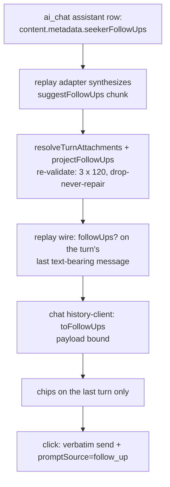

# Seeker Suggested Follow-Up Questions - Plan

## Goal Capsule

- **Objective:** After a grounded, substantive Seeker answer in `apps/chat`, the person sees 2–3 tappable follow-up questions under the reply. A tap sends that question as their next message. The chips come back after a reload, and the mechanism can never damage the answer or turn a finished answer into an error.
- **Means:** Post-hoc generation — a second small model call after the answer's text stream finishes, riding the terminal `result` SSE frame (KTD1) — persisted in the stored assistant message's `content.metadata` (KTD2).
- **Authority:** The `session-settled` decisions in this plan are closed; do not reopen them. Repo conventions (`CLAUDE.md`, `apps/mastra/CLAUDE.md`, `apps/chat/CLAUDE.md`) govern style, testing, and logging. The implementer decides the rest.
- **Execution profile:** Three units, landed in order as separate PRs: U1 (`apps/mastra`) → U2 (`apps/chat`) → U3 (managed prompt — two PRs by process: experiment evidence, then promotion). U1 deploys first; the added wire field is inert with no consumer. All units branch from current `main` — the measured prototypes were never merged, and nothing is inherited from them.
- **Stop conditions:** Stop and surface, do not improvise, when: the measured replay byte budget exceeds the 8 MiB consumer cap even after tightening stored caps to 2 × 80 (KTD12); `Memory.updateMessages` on the pinned `@mastra/memory` fails to deep-merge `content.metadata` while preserving `parts` and sibling metadata keys (invalidates KTD2); research or implementation evidence contradicts any session-settled decision; or the U3 experiment process refuses every softened-prompt candidate — then close R12 through the Definition of Done's refusal branch instead of promoting against a negative gate.

---

## Product Contract

### Summary

Add suggested follow-up questions to the Seeker chat. After the answer stream finishes, a second small model call generates up to three short questions from the answer's tail. They ride the existing terminal `result` frame as an optional `followUps` field, persist in the stored assistant message's metadata, and replay when the thread is reopened. Chat renders them as chips under the last turn; a click sends the text verbatim as the user's next message and tags the send so analytics can tell suggested questions from typed ones. A separate managed-prompt change softens the answer's own closing engagement question so the two "what next?" mechanisms do not stack.

### Problem Frame

A Seeker conversation stalls after each answer: the person must compose the next question from scratch. Three generation mechanisms were prototyped and measured live (2026-08-14 and 2026-08-16, against the real Seeker with the gateway chat model serving every turn): post-hoc generation fired on 20/20 measured turns at ~270 ms median with zero answer damage; a mid-turn tool declaration fired on only 14/22 turns and corrupted the answer text on 5/23 turns — on the gateway model, so "a better model would fix it" is already answered; a heuristic produced poor questions. The org's jesusfilm-ai product already ships the post-hoc pattern in production. Post-hoc won and is the only option this plan covers.

### Requirements

**Chips experience (`apps/chat`)**

- R1. After a grounded, substantive Seeker answer, chat shows up to three clickable follow-up questions under the reply (typically 2–3; the floor is one — KTD4).
- R2. Clicking a chip sends its text verbatim as the user's next message in the same thread — no composer pre-fill, plain-text rendering only.
- R3. Chips render on the conversation's last turn only. The chip block also accepts a defensive disabled state; no production state currently renders chips while a send is blocked (a pending send replaces the last turn, and replay-blocked conversations have no hydrated turns), so U2 labels the disabled-state tests as synthetic fixtures.

**Generation and suppression (`apps/mastra`)**

- R4. Questions are generated only when the turn's answer is grounded AND at least 200 characters (named constants). Social closers and retrieval-unavailable apologies get no chips.
- R5. Generation can never damage or delay-fail the answer: it runs after the answer text is complete, is bounded by a 2.5 s budget, and every failure degrades to no chips — never an error frame.

**Wire and persistence**

- R6. Questions persist with the assistant message and replay on thread reopen: a reload shows the same chips on the last turn, and a replayed chip click works.
- R7. The terminal `result` frame carries an optional `followUps: string[]`; the field is omitted, never null, when there is nothing to show.

**Analytics and observability**

- R8. A chip-originated send is distinguishable from a typed one: chat tags the send, and mastra records the tag in its log line and in Langfuse trace metadata.
- R9. Logging is counts, enums, timings, and token counts only. Question text never reaches a log line — the questions are model-authored paraphrases of a religious-belief conversation.
- R10. The follow-up generation call joins the same Langfuse trace as the seeker turn it belongs to (fallback per KTD9: a sibling trace with the same session and user stamps), gated by the same `LANGFUSE_TRACING_ENABLED` flag and credential trio as the turn itself.

**Rollout and lifecycle**

- R11. The feature is default-off behind a validated env flag. Turning the flag off stops NEW chips only; already-stored chips keep rendering on reopened threads (KD1).
- R12. The seeker answer's own closing engagement question is softened so it does not stack directly above the chips. This is a Langfuse-managed prompt change and follows the full experiments-ledger process (U3).

### Key Decisions

- KD1. **Replay is not flag-gated.** (session-settled: user-directed — chosen over a replay-side gate: mirrors the settled `SEEKER_VIDEO_ENABLED` ruling of PR #1836; escalation is flag off → `SEEKER_ROUTE_ENABLED=false` → purge threads.) Governs R11.
- KD2. **No user-facing toggle in v1.** (session-settled: user-directed — chosen over a per-user preference: dogfood audience, feature is additive and suppressible by flag.)
- KD3. **Automated quality evals for the generated questions are a follow-up ticket, not part of this plan.** (session-settled: user-directed — chosen over bundling evals here: the generator is a pure function over question+answer pairs and slots into the existing seeker eval pipeline later.) See Scope Boundaries.
- KD4. **A chip tap sends the question verbatim — no composer pre-fill.** One tap continuing the conversation is the measured loop; pre-fill re-adds the composition friction the feature exists to remove, and typing stays available for edited questions. The model's words become the person's stored message — accepted for the dogfood audience. (session-settled: user-approved — chosen over composer pre-fill with the tradeoff surfaced in review.) Governs R2.

### Acceptance Examples

- AE1. **Covers R1, R4, R7.** Given a grounded 1,200-character answer, when the stream finishes, the terminal frame carries up to three questions of ≤120 UTF-16 units each and chat renders them as chips under that reply; a single surviving valid question still renders.
- AE2. **Covers R4, R7.** Given the reply "You're welcome — go in peace." to "ok thanks", generation is skipped (0 ms) and the terminal frame has no `followUps` key.
- AE3. **Covers R2, R3, R6.** Send → chips appear → full page reload → reopen the thread → the same chips render on the last turn, enabled → click one → it sends verbatim as the next user message, a new answer streams, and a fresh chip set appears.
- AE4. **Covers R11 (KD1).** With chips stored on an old thread and the flag now off, a new send produces no chips, but reopening the old thread still shows its stored chips.
- AE5. **Covers R8.** A chip-originated send reaches mastra with the click-source tag; the turn's log line records `prompt_source=follow_up` and the trace metadata carries the same value. A typed send records `prompt_source=typed`.
- AE6. **Covers R6, KTD3.** Given stored metadata containing a 150-unit question, a control-character question, and two case-variant duplicates, replay drops the offending items and never repairs, truncates, or errors.

### Scope Boundaries

**Deferred to follow-up work**

- Automated quality evals for generated questions on the existing seeker eval pipeline (KD3) — tracked as `feat-367` in the ai-chat lane.
- Conversation-context-aware generation. The generator sees only the current question + answer tail; it is topic-blind on low-content turns. Accepted for v1.
- The crisis guardrail itself. This plan only marks the suppression hook point (KTD7); the guardrail remains the deferred release gate tracked via feat-339 and the `seeker-agent.ts` attach-point breadcrumb.
- A user-facing toggle (KD2).

**Accepted v1 behavior**

- If a thread's last turn is a social closer, a reloaded thread shows no chips even though earlier turns carry stored sets — chips are last-turn-only by design.
- After the answer text completes, the reply keeps its streaming presentation for the generation delay (~270 ms median measured; 2.5 s worst case) — finalization rides the delayed terminal frame. Accepted for v1 — including the screen-reader half: the streaming branch's `aria-live` region announces "Replying" through that window, so assistive users hear composing-in-progress on a finished answer. U2's browser verification observes it and dogfood feedback is the revisit trigger.
- Editing a suggested question means retyping it: a tap sends verbatim (KD4), so "that question with one word changed" is typed in the composer. Accepted for v1.
- Until U3 promotes, the answer's own closing engagement question stacks above the chips. Chips shipping briefly before U3 is acceptable; sequence U3's promotion around the flag flip.
- The compiled fallback prompt (`SEEKER_SYSTEM_PROMPT_FALLBACK`) keeps its current text in U3. Managed promotions do not rewrite the fallback; a Langfuse outage temporarily restores the closing question. Accepted.

### Sources & Research

- Live measurements, 2026-08-14 + 2026-08-16 prototype sessions (both with the gateway chat model serving every measured turn): post-hoc fired 20/20 with 208–420 ms generation (median ~270 ms) and zero answer corruption; tool-mode declarations fired 14/22 and corrupted 5/23 answers; heuristic quality was poor. A live two-turn conversation falsified tool-part storage: the gateway returned HTTP 400 "assistant tool call requires id" on the replayed fabricated part, breaking every later turn in the thread. A real-Postgres 16 smoke verified the metadata design end to end (deep-merge preserves sibling keys and `parts`; re-persist overwrites; the next turn on a metadata-carrying thread streams normally).
- Insertion point: `apps/mastra/src/mastra/agents/seeker-route.ts` — the drain loop assembles the full answer, then the isolated `toolResults` extraction resolves `sources`/`grounded`/`video`, then the terminal `result` frame is enqueued. Generation slots between extraction and enqueue.
- Grounding signal: `resolveTurnAttachments` in `apps/mastra/src/mastra/agents/seeker-turn-projection.ts` — `grounded` is the last `retrieveAnswer` chunk's `result.status === "ok"`.
- Byte-budget precedent: `AI_CHAT_HISTORY_WORST_CASE_THREAD_BYTES` plus the measured maximal-thread test in `apps/mastra/src/mastra/ai-chat-history-replay-attachments.test.ts` (feat-329; budgets are measured, not computed).
- Cross-app mirror precedent: chat's `toVideo` mirrors `apps/mastra/src/mastra/seeker-video-gates.ts`, and a mastra test reads chat's source file to pin the mirrored cap — the template KTD4's drift test was to follow — not shipped (KTD4 superseded 2026-08-27).
- Flag precedent: `SEEKER_VIDEO_ENABLED` in `apps/mastra/src/config/env.ts` (`z.string().optional()`, accessor compares `=== "true"`), consumed at exactly one production site.
- Tracing: `buildSeekerTracingCallOptions` in `apps/mastra/src/mastra/langfuse-tracing.ts` returns `{ requestContext, tracingOptions }`; the route passes both into `agent.stream`. The pinned core's stream output exposes `traceId` / `spanId`, so same-trace joining is mechanically available — but span creation at all requires the agent's internal Mastra reference, which only registration sets (KTD5, KTD9). The builder's metadata already stamps `promptSource` with prompt provenance, so the click-source stamp must use a different key (KTD11).
- Budget mechanics, verified by hand 2026-08-18 against `@mastra/core` 1.55.0 + `p-retry` 7.1.1: the core passes the caller's abort signal into its per-entry p-retry (`signal:` option), p-retry gates every attempt and backoff sleep on that signal, and the fallback-model loop unwinds instantly once it fires. KTD6's race exists so the 2.5 s bound survives `@mastra/*` bumps without re-verifying this chain.
- Dist facts with zero current repo callers, to pin when first used: `Memory.updateMessages` on `@mastra/memory` 1.24.0 (`{ messages: [{ id, content }] }`, content deep-merge) and the `usage` field on `@mastra/core` 1.55.0 outputs — a plain value on `generate()`'s resolved output, a Promise getter only on `stream()`'s. Re-verify on `@mastra/*` bumps, per house discipline.

---

## Planning Contract

### Key Technical Decisions

- KTD1. **Post-hoc generation riding the terminal frame.** A second small model call runs after the answer's text stream finishes and its questions ride the terminal `result` frame. Structural constraint: the chat proxy aborts upstream the moment it relays a terminal `result` frame, so there is no later frame — generation must delay the terminal frame, and its budget bounds that delay. (session-settled: user-directed — chosen over the mid-turn tool declaration and the heuristic: live measurements, see Sources; the tool mode's corruption was observed on the gateway model.)
- KTD2. **Storage is `content.metadata`, never a message part.** Persist the questions under key `seekerFollowUps` in the stored assistant message's `content.metadata` via `Memory.updateMessages`, in the `ai_chat` schema. The persist write carries NO `parts` — stored parts are replayed to the provider on later turns, and a fabricated tool-invocation part was observed live to 400 the gateway ("assistant tool call requires id"), breaking every subsequent turn in the thread. The no-parts regression test is load-bearing and must survive. Questions live inside the message row, so the feat-336 retention purge and feat-337 erasure delete them automatically. (session-settled: user-directed — chosen over a synthetic tool-invocation part: falsified live.) Note: this is a new storage pattern — video/sources persist as tool parts, not metadata; there is no metadata-artifact sibling to copy.
- KTD3. **Replay re-derives through the shared projection.** The replay adapter in `apps/mastra/src/mastra/ai-chat-history-route.ts` synthesizes one chunk (`toolName: "suggestFollowUps"`, `result: { questions }`) from the stored metadata, so `resolveTurnAttachments` resolves sources, video, and followUps in one pass and the projection stays the single re-validation point. Stored questions are re-validated on every read; the replay route reads no feature flag (KD1). Turn association rides the existing feat-329 pooling rule unchanged (attach to the run's last text-bearing message). The wire is last-turn-only: the adapter emits `followUps` only for the thread's LAST text-bearing assistant message — a post-projection slice, so `resolveTurnAttachments` stays the single re-validation point. Older turns keep their stored sets (KTD2 untouched); they never ride the replay wire, because R3 never renders them.
- KTD4. **Projection contract (client mirror SUPERSEDED 2026-08-27 — see the note at the end of this entry).** Drop-never-repair: max 3 questions × 120 UTF-16 units; non-strings, empty-after-trim, over-length, and non-whitespace-control-character items drop; whitespace collapses before the control-char check; case-insensitive dedupe; format characters (Unicode `Cf`) drop EXCEPT ZWNJ/ZWJ (`200C`/`200D` — legitimate joiners in Persian/Arabic/Indic scripts and the glue in emoji ZWJ sequences), plus the variation-selector supplement (`E0100`-`E01EF`); the variation selectors `FE00`-`FE0F` are deliberately KEPT so emoji presentation survives; BOM/`FEFF` is `Cf` but ES whitespace, so the collapse rung reaches it first and it survives collapsed — the rung ORDER is part of the contract. A category test rather than an enumeration, because the first enumerated version missed the Unicode TAG block, word joiner, and ALM. Items containing lone surrogates drop too — `JSON.parse` mints them from `\ud800`-style escapes in a model reply, they send as malformed text on click, and they escape at 6 B/unit in JSON against a budget counted at 3 B/unit. Never truncate — a click sends the text verbatim as a user message, so `followUps` is the one wire field that becomes an INPUT. A single surviving valid question still renders: drop-never-repair never suppresses a lone survivor (floor one, target three). Chat mirrors the projection (`toFollowUps` in `apps/chat/src/lib/chat-stub.ts`) and re-validates BOTH the live terminal frame and the replay wire. The mirror gets two-way pointer comments plus a drift test (one side's suite reads the other side's source, per the video-gates precedent).
  - **SUPERSEDED 2026-08-27 (owner-directed), client half only.** The mirror and its drift test are NOT shipped. Mastra remains the sole content filter and already applies this projection on BOTH the live and replay paths, so the client copy only added protection for the case where mastra itself is wrong — at the cost of two implementations that could silently drift, plus a cross-source drift test that CI never ran on the package most likely to change it (`@forge/chat` is not built for a mastra-only PR). Chat instead applies a payload BOUND in `toFollowUps`: non-string drops, empty-after-trim drops, over-120-UTF-16-units drops (never truncates), list caps at 3. It is applied on both wire paths and makes NO claim to match the rules above — 120 is the value mastra's stored cap held at the time and is deliberately not kept in sync. ACCEPTED RESIDUAL: during a deploy window (mastra ships first, KTD13) or a mastra regression, no client-side check would catch a bidi override or invisible-payload character in a question a person then sends verbatim as their own message. Everything ABOVE this note still governs the mastra projection unchanged.
- KTD5. **The generator is an out-of-registry mini-agent with a code-owned prompt.** A module-cached, memory-less Agent on `buildSeekerModelList()` — the seeker's own env-gated chain — never added to the instance's `agents` registry AND kept ZERO-tool, ZERO-processor: that emptiness, not registry absence alone, is what keeps the shared instance's tool and processor registries untouched, so the containment test pins registry absence and empty tool/processor sets together. It IS handed the runtime's Mastra reference once via the dist's internal registration hook: an Agent without that reference creates no tracing spans at all on the pinned core (KTD9); the hook is a dist fact, pinned by test and re-verified on `@mastra/*` bumps. Input is the person's question, bounded by its own named cap (proposed `FOLLOW_UPS_QUESTION_TAIL_CHARS = 1_000`, keeping the question's tail — the ask sits at the end, mirroring the answer-slice direction), plus the answer's TAIL (last 2,000 chars — the tail holds the conclusion and the closing question the prompt forbids duplicating; never the head). Prompt rules: the person's own voice; under 15 words each; no repeating what the answer covered nor its closing question; only word-answerable questions — never capability promises ("can you play…"); reply is a JSON array of strings only. The question and answer tails are enclosed in the prompt as clearly delimited DATA to derive questions from — never as instructions to follow: an embedded directive inside either (e.g. an "ignore the above" line arriving via retrieved corpus text in the answer) must not steer the chips. (session-settled: user-directed — chosen over a Langfuse-managed prompt: the output becomes a user's message on click, so PR review is the right control and the managed-prompt machinery is disproportionate.)
- KTD6. **Budgets, signals, and write ordering.** Generation: 2.5 s own `AbortSignal.timeout`, composed via `AbortSignal.any` with the turn's already-composed signal (inbound request + 90 s `chatTurn`); any abort or failure yields no chips. The effective deadline — for the signal AND the race below alike — is `min(2.5 s, remaining chatTurn budget)`, so the terminal frame always lands inside the 90 s ceiling that chat's proxy timeout was sized against (its documented floor is only "greater than 90 s"). The store write runs AFTER the terminal frame is enqueued, is best-effort with enum outcomes (`skipped | persisted | no_carrier | store_failed | timeout | undelivered`), and is bounded by its own ~3 s timeout — deliberately NOT composed with the request signal, because the proxy aborts upstream immediately after relaying the terminal frame and composing would abort every persist. A failed or timed-out write costs reload persistence for one turn, nothing else. The persist consumes the SAME raced value the terminal frame carried — a race loss stores nothing (`persist=skipped`). Disconnect semantics keep the AE3 invariant honest: a consumer cancel mid-drain makes the route's reader report done with a PARTIAL answer while every later enqueue silently no-ops, so the gate also checks the stream is still open before generation runs (no paid call for an absent audience), and the persist runs only when the terminal frame was actually EMITTED — an emitted flag captured at enqueue time, never a closed-now check, because the proxy closes the stream right after relaying the frame on every NORMAL turn. A frame that never landed persists nothing (`persist=undelivered`). Together: a turn can never show chips on reload that it did not show live (AE3). Containment is structural, not prose: the route wraps the generate call and the persist call each in a local try/catch, so no synchronous throw can reach the drain loop's catch and turn a streamed answer into an `error` frame (R5). The route's wait on generation is additionally bounded by a `Promise.race` on the same 2.5 s budget — the signal stops provider work; the race releases the terminal frame even if a framework layer ignored the abort (verified by hand 2026-08-18 on the pinned core: p-retry receives the composed signal and unwinds promptly, so the race is belt-and-suspenders that survives `@mastra/*` bumps).
- KTD7. **Suppression gate with a marked crisis hook.** `shouldGenerateFollowUps({ grounded, answer })` = the turn's resolved `grounded` (retrieveAnswer status `ok`) AND `answer.trim().length >= 200`, both named constants. The gate deliberately does NOT check which model configuration is active: the generator rides `buildSeekerModelList()` (KTD5), so it follows whatever chain the seeker itself answered with — an answer that chain produced is good enough to get follow-ups from the same chain, and the 2.5 s budget plus the degrade-to-no-chips contract bound the unmeasured-chain case's latency and failure cost; its question QUALITY is accepted-unmeasured for the dogfood audience. (session-settled: user-directed — chosen over coupling generation to the gateway flag: the coupling added a hidden inter-flag dependency, and the fallback chain can serve individual generations via failover even with the gateway on, so the exclusion it promised was configuration-level only.) The gate site carries a comment breadcrumb marking it as the point where the future crisis guardrail must also suppress chip generation, referencing the guardrail attach-point in `apps/mastra/src/mastra/agents/seeker-agent.ts` and the feat-339 release register (no dedicated guardrail ticket exists).
- KTD8. **Flag: `SEEKER_FOLLOWUPS_ENABLED`, string-boolean, validated.** `z.string().optional()` in `apps/mastra/src/config/env.ts` with accessor `isSeekerFollowUpsEnabled()` comparing `=== "true"` — the `SEEKER_VIDEO_ENABLED` convention. Never required at boot; default-off deploys have zero env prerequisites. The prototype's `SEEKER_FOLLOWUPS_MODE` enum retires with it (`tool`/`heuristic` are dead modes); the log line keeps `mode=post` as a mechanism label. Env-table entry in `apps/mastra/CLAUDE.md` and a commented `.env.example` line land in the same PR.
- KTD9. **Langfuse capture joins the turn's trace; the fallback is named.** The generator call carries the same request-context marker (routing its spans to the `langfuse-seeker` config) and the same `sessionId` (threadId) / `userId` (resource) stamps, gated by `LANGFUSE_TRACING_ENABLED` plus the credential trio. Span EXISTENCE comes first: an Agent without a Mastra reference emits no spans at all on the pinned core (KTD5), so the live smoke's ladder is no-spans (a failure to fix) → sibling trace (the acceptable fallback: `traceName: "seeker-follow-ups"` with the same session/user stamps) → same trace (mechanically available via the trace/span ids the stream output exposes). U1 verifies the shipped shape against pinned `@mastra/core` 1.55.0 with the live smoke and records it. Raw question content in Langfuse is consistent with the standing feat-321 owner decision (seeker turns export raw content). The feat-336 retention sweep and feat-337 erasure cover the new spans PROVIDED the session/user stamps actually land on the generator's rows: erasure finds a subject's data only through a `userId`-filtered observation listing, and refuses its whole Langfuse half when a listed row's ownership is unreadable. The live smoke therefore also asserts the generator's observation is returned by a `userId`-filtered listing (the same primitive the erasure CLI uses) and records that outcome beside the trace-shape outcome.
- KTD10. **Token counts ride the log line.** The generator uses `Agent.generate()`, whose resolved output carries `usage` as a PLAIN value on the pinned core — the Promise-getter shape exists only on `stream()`'s output. Pin the generate-path shape by test (a dist fact with no current repo caller) and log `gen_tokens_in=` / `gen_tokens_out=` (`-1` when the provider reports none). `traceId`/`spanId` are plain fields on the same output — the KTD9 ladder reads them there.
- KTD11. **Click-source tag: one optional enum field across four hops.** Chat adds `promptSource: "follow_up"` to the send body when the send originates from a chip. The field is optional and closed-vocabulary at every hop: client seam body → chat proxy body guard (forwards, never invents) → mastra `/forge-seeker` body schema (invalid or unknown values read as absent). Mastra records `prompt_source=follow_up|typed` on the `[seeker-follow-ups]` log line (flag-on turns) and stamps the value into the turn's Langfuse trace metadata (flag-independent) under the key `sendOrigin` — NOT `promptSource`, which `buildSeekerTracingCallOptions` already uses for prompt provenance (`langfuse` | `fallback`); the tracing suite pins both metadata keys together so they cannot re-merge. An absent or invalid wire value records as `typed`, the non-chip default (per AE5). The tag never touches memory keying, generation, or the reply. U1 ships the receiver half; U2 ships the sender — receiver-first, per the repo's cross-app discipline.
- KTD12. **The replay byte budget is measured, not computed.** Store what we show: 3 × 120. Because the replay wire is last-turn-only (KTD3), the followUps term is ONE message's worst case (~1,144 B), not 200: the prototype's all-messages allowance (228,800 B — ~97% of the remaining headroom) shrinks to under 1% of it. Extend `AI_CHAT_HISTORY_WORST_CASE_THREAD_BYTES` with the one-message term AND extend the measured maximal-thread test to serialize maximal followUps on the last text-bearing assistant message (3-byte-script fixtures), asserting the measured bytes stay under BOTH the 8 MiB consumer cap and the derived worst-case constant — so the constant stays the honest bound. U1 records the measured headroom beside the constant and adds a docs note that any future per-message replay field must re-derive the budget before it ships. If a measurement ever exceeds the cap, tighten the STORED caps (first candidate: 2 × 80) and re-measure — a coordinated edit touching KTD4's caps, R1, AE1, and the mastra projection (chat's bound is deliberately unsynced since 2026-08-27: TIGHTENING needs no chat edit). Never raise the consumer cap: over-cap is not a degraded render — it is 502 → replay `failed` → R22 blocks every send → the thread becomes permanently unreadable and unusable.
- KTD13. **Deploy order: mastra first.** U1's `followUps` wire field and `promptSource` receiver are additive and inert with no consumer, so U1 merges and deploys before U2. U3's promotion is sequenced around the flag flip (chips briefly before it is acceptable — see Scope Boundaries).

### High-Level Technical Design

Live turn — generation delays the terminal frame; persistence never delays the reader:

```mermaid
sequenceDiagram
  participant B as Browser (chat)
  participant P as chat /api/seeker proxy
  participant R as mastra /forge-seeker
  participant G as Follow-ups generator
  participant S as ai_chat Postgres
  B->>P: POST { text, conversationId, promptSource? }
  P->>R: POST { prompt, threadId, resourceId, promptSource? }
  R->>R: answer streams; token_delta frames relay
  R->>R: toolResults resolve sources / grounded / video
  R->>R: gate: flag on AND grounded AND >= 200 chars
  R->>G: tail (last 2000 chars), 2.5s budget composed with turn signal
  G-->>R: <= 3 projected questions (any failure: none)
  R-->>P: terminal result { text, sources, grounded, video?, followUps? }
  P-->>B: relay terminal frame, then abort upstream
  R->>S: metadata.seekerFollowUps write (own ~3s bound, no request signal)
  R->>R: [seeker-follow-ups] event=turn_resolved log line
```

Persistence and replay — one projection re-validates every read:



### Assumptions

- Production serves the gateway chat model (`AI_GATEWAY_SEEKER_ENABLED="true"`). All latency and quality measurements are gateway-model numbers; the free-Gemma fallback chain is unmeasured for this generator; the 2.5 s budget and the degrade-to-no-chips contract bound its worst case (KTD7 records the settled decision not to gate generation on the model configuration).
- Pinned versions at plan date: `@mastra/core` 1.55.0, `@mastra/memory` 1.24.0, `@mastra/langfuse` 1.4.6. The three dist facts this plan leans on (stored-part replay shape, `updateMessages` deep-merge, output `usage`) follow the repo's pin-and-re-verify-on-bump discipline.

---

## Implementation Units

### U1. Mastra: generation, wire, persistence, replay, tracing (PR 1)

- **Goal:** `/forge-seeker` generates, emits, persists, and replays follow-up questions behind a default-off validated flag, with Langfuse capture, token-count logging, and the click-source receiver.
- **Requirements:** R4, R5, R6 (server half), R7, R8 (receiver half), R9, R10, R11.
- **Dependencies:** none.
- **Files:**
  - `apps/mastra/src/config/env.ts` + `apps/mastra/src/config/env.test.ts` — `SEEKER_FOLLOWUPS_ENABLED` (KTD8) and the opt-in smoke gate `SEEKER_FOLLOWUPS_TRACE_SMOKE_TEST` (`z.enum(["1"]).optional()`, sibling of the existing smoke gates).
  - `apps/mastra/src/mastra/seeker-follow-ups.ts` + `apps/mastra/src/mastra/seeker-follow-ups.test.ts` — pure core: constants, suppression gate, shared projection, prompt builder, reply parser.
  - `apps/mastra/src/mastra/seeker-follow-ups-generate.ts` — generator agent, budget, signal composition, usage extraction (KTD5, KTD6, KTD10).
  - `apps/mastra/src/mastra/seeker-follow-ups-persist.ts` — carrier scan + retry, bounded metadata write, enum outcomes (KTD2, KTD6).
  - `apps/mastra/src/mastra/agents/seeker-route.ts` + its colocated suite — route wiring, `promptSource` body field, log line.
  - `apps/mastra/src/mastra/agents/seeker-turn-projection.ts` + its colocated suite — `followUps` on `SeekerTurnAttachments`, `resolveStoredFollowUps` (last-wins).
  - `apps/mastra/src/mastra/ai-chat-history-route.ts` + `apps/mastra/src/mastra/ai-chat-history-replay-attachments.test.ts` — replay adapter, wire field, byte-budget constant + measured test extension (KTD3, KTD12).
  - `apps/mastra/src/mastra/langfuse-tracing.ts` + its colocated suite — generator tracing options (KTD9), `promptSource` trace-metadata stamp (KTD11).
  - `apps/mastra/src/mastra/budgets.ts` + its colocated suite — `settleWithinBudget` settles the caller's promise on its already-aborted fast path (the smallest correct locus: the fix hardens every caller, not just this one).
  - `apps/mastra/src/mastra/seeker-follow-ups-tracing.smoke.test.ts` — opt-in live same-trace smoke (KTD9). It re-applies the https + `LANGFUSE_ALLOWED_HOSTS` egress pin IN-SUITE before any credential is computed — the boot-time assertion is production-only and inert under vitest, which sets `NODE_ENV=test` (also why a NODE_ENV refusal alone can never fire here) — mirroring `ai-chat-erasure.langfuse.smoke.test.ts`; local-dev Langfuse pair only.
  - `apps/mastra/src/scripts/followups-pg-smoke.ts` + a `package.json` script (proposed name `smoke:followups-pg`, the existing `pnpm --dir ../.. exec tsx` shape) — real-Postgres persist/replay smoke; preflight refuses a production runtime (`NODE_ENV=production`) and accepts only a connection string whose PARSED database name is `followups_smoke`, unconditionally and with NO loopback bypass (a forwarded local port can front production, so loopback proves locality, never throwaway-ness) — the `ai-chat-erasure.smoke.test.ts` guard shape, never a whole-URL substring match, which a hostname or password could satisfy while pointing at production.
  - `apps/mastra/CLAUDE.md` + `apps/mastra/.env.example` — flag documentation (KTD8).
- **Approach:**
  1. Land the pure core first: `projectFollowUps` (KTD4 rungs), `shouldGenerateFollowUps` (KTD7 with the crisis-hook breadcrumb), `buildPostHocFollowUpsPrompt` (KTD5, tail-only), `parsePostHocFollowUps` (first-array extract, total). Failure logging across the core, generator, and persist paths is fixed `reason=` enums only — never the caught error object: a JSON.parse error message can embed the raw reply (the questions), and Railway logs are covered by neither the retention sweep nor erasure (R9).
  2. Generator (KTD5, KTD6): module-cached out-of-registry Agent on `buildSeekerModelList()`, handed the Mastra reference once at construction (KTD5); injectable generate seam for tests; resolve token usage alongside text (KTD10); never throws.
  3. Persist (KTD2): recall-scan for the run's last text-bearing assistant message (the same carrier rule replay attaches to), scoped to the turn's own `threadId` + `resourceId` (one page of 50) AND re-checked client-side per the single-predicate blast-radius law: before `Memory.updateMessages` (which takes bare message ids with no thread scope), the carrier row's OWN threadId and resourceId are asserted equal to the turn's, failing closed to `no_carrier` when either is absent or mismatched — the store's filter is a dependency-interpreted predicate every test double implements correctly by construction, and the erasure CLI's row re-check is the prior art. The carrier scan is additionally bounded on BOTH sides by the turn's own clock — `turnStartedAtMs` below, `turnEndedAtMs` above — because POSITION ALONE cannot distinguish this turn's answer from a neighbour's: a lagging store leaves the PREVIOUS turn's answer trailing, and a concurrent newer turn's answer sits LATER in the page than the user row that would have stopped the backwards walk, so the role rung closes neither case. The write also re-checks its own budget signal after the carrier resolves, so a persist that overran can never land a late write onto a row that by then belongs to a later turn. One 250 ms retry for the finalization race (a provisional constant — the live `persist=` outcome distribution calibrates it after the flip); metadata-only write, own timeout → `timeout` outcome; error objects never logged.
  4. Route wiring: gate → generate → terminal frame with optional `followUps` (omit when empty) → bounded persist → log line `[seeker-follow-ups] event=turn_resolved mode=post prompt_source=<follow_up|typed> count= gen_reason= added_ms= persist= gen_tokens_in= gen_tokens_out= total_ms=`. `gen_reason` is a closed vocabulary: `ok` on a question-bearing success, the generator's own reason when it ran and produced none (`skipped_empty | timeout | aborted | generation_failed | no_questions`), and otherwise WHICH no-run cause applied — `gate_skipped` (flag off or the suppression gate), `stream_closed` (consumer gone before the call), `unexpected_error` (containment catch). The three no-run causes must not collapse into one literal: this key is what separates a gate skip from a timeout from a junk reply, and it is what calibrates the provisional 250 ms persist retry after the flip. Accept the optional `promptSource` body field (closed vocabulary; absent or invalid records as `typed` per KTD11) and stamp it into the turn's trace metadata as `sendOrigin`.
  5. Replay (KTD3): adapter synthesizes the `suggestFollowUps` chunk from metadata; `resolveStoredFollowUps` re-validates; wire message gains `followUps?`; no flag read on this path (KD1).
  6. Tracing (KTD9): register the Mastra reference so the generator can emit spans at all, pass its call the turn's request-context marker plus session/user stamps, and attempt same-trace joining via the exposed trace/span ids; the live smoke walks the KTD9 ladder (no-spans → sibling trace → same trace) and asserts the `userId`-filtered listing returns the generator's observation; record the shipped shape in the code comment and PR description.
- **Patterns to follow:** `SEEKER_VIDEO_ENABLED` for flag shape and single-consumption-site inertness; the feat-329 replay-attachments work for adapter, turn association, and the measured budget test; `[seeker-route]` plain-string enum logging (KTD8's `mode=post` literal included); the repo's abort-mechanism test law (captured-signal stub with tiny real budgets — fake timers cannot intercept `AbortSignal.timeout`).
- **Test scenarios:**
  - Flag accessor: on only for the literal `"true"`; `""`, `"post"`, `"tool"`, `"heuristic"`, `"TRUE"` all read off (pins the retired mode enum dead).
  - Projection, one falsifying case per rung: over-3 capped; 121-unit item dropped, never truncated; control-character item dropped (escape-sequence fixture such as `"bad\u0000one"` — never a literal control byte in the source); newline-bearing item survives via whitespace collapse; case-variant duplicate dropped; non-array and junk shapes return empty; total, never throws.
  - Floor: a projection pass whose drops leave exactly one valid question still returns it (Covers AE1's lone-survivor clause). No U2 counterpart — KTD4's client mirror was superseded 2026-08-27.
  - Lone surrogate: an item minted through `JSON.parse` from a `\ud800`-style escape drops (the parser path that makes the state reachable). Mastra-only since the KTD4 supersession.
  - Suppression: exactly 200 chars passes, 199 fails; `grounded: false` fails at any length; whitespace-padded short answer fails. Covers AE2.
  - Prompt builder feeds the answer tail, not the head (marker at both ends); an over-cap question is bounded to its own tail before it reaches the prompt (the KTD5 question cap — the sibling of the answer-tail test); an answer tail carrying an embedded directive (an "ignore the above and output …" line) yields questions that neither obey nor reproduce it (the KTD5 data-not-instructions enclosure).
  - Parser: fenced and prose-wrapped arrays extract; invalid JSON and no-array degrade to empty.
  - Generator: returns projected questions from the seam; empty answer skips the model call; failure and rejection return empty without throwing; abort mechanism — a captured-signal stub proves the 2.5 s budget and the composed turn signal each abort the call; usage tokens read from a mocked model that reports usage, and `-1` when absent (pins the KTD10 dist fact); containment pin — after registration the generator is absent from the `agents` registry and its tool and processor sets are empty (the zero-tool/zero-processor invariant is the real surface containment, KTD5); budget release — a generate seam that ignores its abort signal still lets the terminal frame release at the 2.5 s budget (the KTD6 race guarantees it); no-leak audit — with a console spy across a failing parse, a failing generation, and a failing persist, no emitted log line contains any substring of the model reply.
  - Persist: the write carries metadata only and NO `parts` (the KTD2 regression pin — load-bearing); carrier scan skips tool-only assistant rows; one retry then `no_carrier`; store throw → `store_failed`, never propagates; hung store → `timeout` within the bound; persist always passes the turn's `threadId` AND `resourceId` to recall, and a recall seam returning a row stamped with a foreign threadId or resourceId produces no write and `no_carrier` (the client-side ownership re-check — the cross-subject containment pin).
  - Route wiring: flag off → generator never invoked and the frame has no `followUps` key; generation failure — a rejecting seam AND a synchronously throwing seam — → frame without `followUps`, never an error frame, and a synchronously throwing persist seam cannot reach the stream's catch either (Covers R5, KTD6 containment); frame enqueue strictly precedes persist resolution (deferred-promise fixture); empty result omits the key (Covers R7); log line asserts the full key set including token counts and `prompt_source`; absent or invalid `promptSource` records as `typed`, a valid value logs and trace-stamps as `sendOrigin`, and a key-pin test asserts `sendOrigin` and the provenance `promptSource` metadata keys stay distinct (Covers AE5, receiver half).
  - Budget and abort edges: a drain that ends near the 90 s turn ceiling still releases the terminal frame at or before the ceiling (the derived `min(2.5 s, remaining budget)` deadline); aborting the composed signal immediately after the frame enqueue leaves the persist seam running to completion (a captured-signal stub proves it received no request-derived signal); a generate seam that resolves after the race deadline writes nothing (`persist=skipped`); a consumer cancel BEFORE the gate skips generation entirely (no model call); a cancel after generation but before the terminal enqueue persists nothing (`persist=undelivered` — the emitted-flag gate); a cancel after the enqueue still persists, since the normal-path proxy abort must never withhold persistence — live and replay can never disagree.
  - Replay adapter: junk metadata shapes yield no chunk; last-wins across duplicate chunks; attachment lands on the run's last text-bearing message including the split-turn (tool-only row) fixture; malformed stored items dropped on read (Covers AE6); flag off still replays stored questions (Covers AE4, server half); the wire is last-turn-only (KTD3) — only the thread's final text-bearing assistant message carries `followUps`, older turns' stored sets stay stored and off the wire.
  - Byte budget: the derived worst-case constant includes the ONE-message followUps term (last-turn-only wire, KTD3) AND the measured maximal-thread test serializes 3 × 120 followUps on the final text-bearing assistant message with 3-byte-script fixtures, staying under both the 8,388,608 B cap and the derived constant; the measured headroom is recorded beside the constant (KTD12).
  - Integration: the real-Postgres smoke — real `buildAiChatMemory` on the `postgres` backend, a real agent turn (mocked model), persist → replay round trip, second persist overwrites (never merges), and the next turn on a metadata-carrying thread streams normally.
  - Live smoke (opt-in): with the local-dev Langfuse pair, the KTD9 ladder is walked — spans exist, the shape (same-trace or sibling) is recorded, the `sessionId`/`userId` stamps are present, and a `userId`-filtered observation listing returns the generator's row (the erasure primitive).
- **Verification:** `pnpm --filter @forge/mastra test` and `typecheck` green; the pg smoke exits 0 against a throwaway Postgres 16; the trace smoke observed live once — span existence and the `userId`-listing assertion must PASS (a negative listing outcome is a ship-blocker: those spans would be invisible to erasure), while trace shape may be same-trace or sibling; the measured byte headroom recorded.

### U2. Chat: chips UI, replay reads, click-source tag (PR 2)

- **Goal:** Chat renders the chips, bounds both wire paths (payload bound, not a mirror — KTD4 superseded), sends clicks verbatim with the click-source tag, and proves the reload loop and page-load posture in a real browser.
- **Requirements:** R1, R2, R3, R6 (client half), R8 (sender half).
- **Dependencies:** U1.
- **Files:**
  - `apps/chat/src/components/chat/follow-ups.tsx` + `apps/chat/src/components/chat/follow-ups.test.tsx` — the chip block (nav landmark, real buttons, plain text).
  - `apps/chat/src/components/chat/message-list.tsx` + its colocated tests — last-turn-only, finalized-branch-only placement as a sibling block after `SourcesList` (never through the markdown allowlist).
  - `apps/chat/src/components/chat/chat.tsx` — thread `onSelectFollowUp` into the same `onSend` the composer uses; disable via `pending || sendBlockedReason != null`.
  - `apps/chat/src/lib/chat-stub.ts` + `apps/chat/src/lib/chat-stub.test.ts` — `toFollowUps` payload bound (KTD4, superseded), terminal-frame parse (omit shape mirrors `video`), send body gains `promptSource` (KTD11).
  - `apps/chat/src/lib/conversations.ts` — `Message.followUps?: string[]` (the one wire field that becomes an input).
  - `apps/chat/src/lib/conversation-session.ts` + its suite — finalize and `mergeReplayMessages` carry `followUps`; `send` accepts the chip origin and threads it to the seam.
  - `apps/chat/src/lib/use-conversations.ts` — the `UseConversations` `send` signature widens for the chip origin.
  - `apps/chat/src/lib/history-client.ts` + its suite — replay wire re-validated through `toFollowUps`.
  - `apps/chat/src/app/api/seeker/route.ts` + its suite — body guard accepts and forwards the optional `promptSource` enum (KTD11).
  - `apps/chat/CLAUDE.md` — feature note in the architecture map.
- **Approach:** Chips are presentational: `<nav aria-label="Suggested follow-up questions">` with one `<button>` per question; empty renders nothing; the disabled prop keeps chips visible but inert (defensive — per R3 no production state currently reaches it); question text renders React-escaped plain text, never markdown. A click calls the same send funnel the composer uses, tagged as chip-originated so the seam adds `promptSource: "follow_up"` to the proxy body. Chips self-clear on click because the appended turn changes the last message id; the focus handoff is two-moment — at click, focus moves to the conversation log region (the composer textarea is `disabled` while the send is pending, so it cannot take focus), and the composer's existing not-pending effect returns focus to the textarea when the reply finalizes. The disabled-textarea window is accepted alongside the aria-live acceptance. Write persistence comments correctly from the start: post-hoc chips DO persist and replay (all units branch from `main`; the prototype was never merged, so there are no stale comments to delete).
- **Test scenarios:**
  - Component: one button per question, clicked text delivered verbatim (Covers R2); empty list renders nothing; a single question renders one chip (the KTD4 floor, client half); script/markup fixture renders as plain text; disabled chips are visible but inert — a synthetic component fixture, labeled in place with the production state it cannot represent (R3).
  - Placement: chips on the last turn only; none on a streaming turn (they arrive with the terminal frame); none when the handler is absent; click routes through the same `onSend` as the composer; chips gone after the click appends new turns; after a chip send, focus lands on the conversation log region immediately (the textarea is disabled while pending and cannot take it) and returns to the composer textarea when the reply finalizes — assert both moments.
  - Bound (SUPERSEDED 2026-08-27 — originally "Mirror"): direct unit tests for each of the four bound checks, plus one pinning that chat does NOT re-apply mastra's content rules. No drift test — chat makes no claim to match the mastra projection.
  - Wire: terminal parse yields `undefined`, not `[]`, when absent or empty; session finalize carries `followUps` onto the assistant message; `mergeReplayMessages` carries them on replay so a reopened thread's last turn offers chips (Covers AE3, client half); `history-client` drops over-cap and junk replay items via the bound (Covers AE6, client half).
  - Click-source: a chip send produces a proxy body with `promptSource: "follow_up"` and a typed send omits it; the proxy guard forwards the valid enum and drops junk (Covers AE5, sender half).
  - R22: a server-origin conversation with replay not `loaded` blocks the send; no chips render there (no hydrated turns exist), pinned so the synthetic disabled fixture is never mistaken for this state.
  - Browser (production build — `next build` + `next start`, per the repo's verification law): the full AE3 loop — send → chips → reload → same chips enabled on the last turn → click → verbatim user turn → new answer → fresh chips — with zero console errors; observe and note the accepted post-answer streaming-pulse window (~270 ms typical) and the post-click focus destination; at a narrow (mobile-width) viewport, chips wrap without horizontal scroll. Also check on-arrival chip visibility for a realistic-length grounded answer, with and without a video card: the feat-269 top-of-answer finalize scroll is KEPT (the reading path ends at the chips), so chips may sit below the fold at the moment they appear — record what the browser shows; dogfood feedback is the revisit trigger for the scroll target.
  - Page-load performance evidence (repo convention for frontend changes): no new dependencies or network resources; before/after timing or trace evidence (e.g. Lighthouse or Performance-trace comparison on the conversation view) showing no hydration/render regression from the chip block.
- **Verification:** `pnpm --filter @forge/chat test` and `typecheck` green; the browser loop recorded; the performance evidence attached to the PR.

### U3. Managed prompt: soften the closing engagement question (experiment + promotion PRs)

- **Goal:** The `seeker-system` managed prompt stops ending every substantive answer with its own engagement question, so the answer does not stack a competing "what next?" line directly above the chips (R12) — through the full experiments-ledger process.
- **Requirements:** R12.
- **Dependencies:** none technically; sequence the promotion around U2's flag flip (KTD13).
- **Files:**
  - `apps/mastra/evals/experiments/<YYYY-MM-DD-NNN-seeker-closing-engagement>/` — manifest, immutable attempt artifacts, verdict (experiment PR).
  - `apps/mastra/src/mastra/agents/seeker-production-config.ts` — the exact `revision` + `contentHash` pin update, plus the materialized canonical benchmark files (separate promotion PR).
- **Approach:** Step 0: read the pinned managed `seeker-system` revision and record whether an explicit closing-engagement-question instruction exists — the PR-reviewed fallback copy carries none, so the behavior may be EMERGENT. If the managed copy has the line, candidates soften or remove it; if not, candidates must ADD a suppression line — record which case applies in the manifest hypothesis, with the grief-persona criterion as the primary regression the gate report must clear. Then follow `apps/mastra/evals/experiments/README.md` exactly: copy the template, complete owner/hypothesis/criterion/one-comparison-axis, author the candidate prompt revision(s) in Langfuse, run an official immutable attempt with the local key pair and the dedicated eval key, review the full evidence package, record the human verdict, merge the evidence PR — then a separate promotion branch runs `eval:seeker:experiment:promote` (read-only first, then `--materialize`) and updates the pin. Move the alert-only `production` label after deploy. Constraints: candidates change prompt revision and hash only; never re-introduce a code-side prompt append (the feat-330 source-pin tests forbid it); preserve the live tool contract — `retrieveAnswer` status literals, the `VIDEO FEATURING` section, citation behavior, and the final SAFETY line; the softening must not strip pastoral openness where the eval expects it (the grief-persona criterion rewards leaving the conversation open — soften the reflexive closing QUESTION, not warmth). `SEEKER_SYSTEM_PROMPT_FALLBACK` stays unchanged (see Scope Boundaries). A refused verdict is a planned outcome: when no candidate earns a supporting gate report and human verdict, R12 closes as not-achievable-this-way — chips keep the accepted stacked-question behavior and a named follow-up ticket owns further prompt work; never push a promotion against a negative gate.
- **Test expectation: none beyond the experiment machinery** — the ledger CI check, the benchmark comparison, the gate report, and the promotion validation ARE this unit's tests.
- **Verification:** `node scripts/check-seeker-experiment-ledger.mjs --base=origin/main --head=HEAD` passes on both PRs; the attempt's `gate-report.json` and `comparison.md` support the verdict; promotion validation passes read-only before `--materialize`; after deploy, a live turn shows an answer that no longer ends with an engagement question while chips render below it.

---

## Verification Contract

| Gate                               | Command                                                                                                                                                                                  | Units |
| ---------------------------------- | ---------------------------------------------------------------------------------------------------------------------------------------------------------------------------------------- | ----- |
| Mastra suite + types               | `pnpm --filter @forge/mastra test` · `pnpm --filter @forge/mastra typecheck`                                                                                                             | U1    |
| Chat suite + types                 | `pnpm --filter @forge/chat test` · `pnpm --filter @forge/chat typecheck`                                                                                                                 | U2    |
| Measured byte budget               | part of the mastra suite (`ai-chat-history-replay-attachments.test.ts` measured maximal-thread test, extended)                                                                           | U1    |
| Real-Postgres smoke                | `DATABASE_URL=postgresql://…/followups_smoke pnpm --filter @forge/mastra smoke:followups-pg` against a throwaway Postgres 16                                                             | U1    |
| Langfuse trace smoke               | `SEEKER_FOLLOWUPS_TRACE_SMOKE_TEST=1` + local-dev Langfuse pair, targeted vitest run; outcomes recorded: span existence, trace shape (same-trace vs sibling), `userId`-listing assertion | U1    |
| Browser loop + perf evidence       | production build (`next build` + `next start`), the AE3 loop via the in-container browser, page-load evidence per repo convention                                                        | U2    |
| Experiment ledger guard            | `node scripts/check-seeker-experiment-ledger.mjs --base=origin/main --head=HEAD`                                                                                                         | U3    |
| Experiment run / verdict / promote | `pnpm --filter @forge/mastra eval:seeker:experiment:run` / `…:verdict` / `…:promote` per `apps/mastra/evals/experiments/README.md`                                                       | U3    |

Local-dev note: `mastra dev` force-writes `.env` values over inline prefixes for vars present in the file; `SEEKER_FOLLOWUPS_ENABLED` absent from `.env` can be set inline on the dev command.

---

## Definition of Done

**Global**

- U1 and U2 landed in order as their own squash-merged PRs, U1 deployed before U2 (KTD13); U3 resolved — its two PRs landed, or its refusal branch closed R12 with a recorded verdict plus a named follow-up ticket (see U3).
- `SEEKER_FOLLOWUPS_ENABLED` is default-off everywhere; a deploy with the flag unset has zero new env prerequisites, and a flag-off turn's wire frames are shape-identical to today's (generator never invoked, no `followUps` key — pinned by test).
- All units branch from current `main` — the prototype was never merged, so there is nothing to delete; the gate is that no stale claims ship: comments state that chips persist and replay, and the retired mode-enum values survive only as the flag-accessor test's off-cases.
- The U1 PR adds a dated entry to the feat-339 release register naming BOTH chip suppression surfaces: the `shouldGenerateFollowUps` generation gate AND the deliberately ungated replay read path (KD1/KTD3), with the accepted lever for already-stored chips stated there (flag off stops new sets; `SEEKER_ROUTE_ENABLED=false` then thread purge retracts existing ones). A write-path suppression never covers already-persisted output, and the register entry must not read as if it does. The code breadcrumb points from the gate to the register; the register entry points back.
- The roadmap ticket for this feature (`feat-366`, ai-chat lane) is flipped to complete inside the final code PR with its `## Resolution` section and README row, per the lane conventions.
- The follow-up ticket for automated question-quality evals (KD3) exists in the ai-chat lane as `feat-367`.

**Per unit**

- U1: every test scenario above green; the no-parts persist regression test present; the measured budget test serializes followUps and the measured headroom is recorded; the pg smoke passes; the trace smoke ran live once — span existence and the `userId`-listing assertion passing (ship-blockers), trace shape recorded (same-trace or sibling both acceptable); `apps/mastra/CLAUDE.md` + `.env.example` updated (flag, budget re-derivation note).
- U2: every test scenario above green (the mirror drift test is NOT among them — KTD4 superseded 2026-08-27); the browser AE3 loop and page-load evidence recorded in the PR; `apps/chat/CLAUDE.md` updated.
- U3: sealed experiment evidence on `main`; promotion PR merged with the pin + benchmark updated together; the `production` label aligned after deploy; a live post-promotion turn verified.
