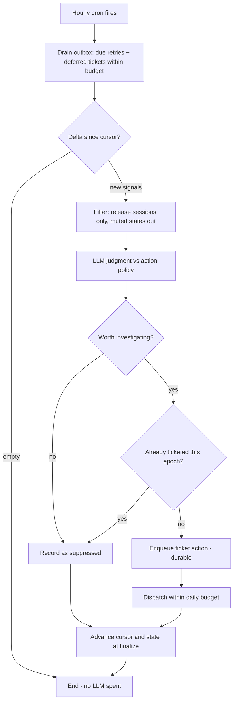
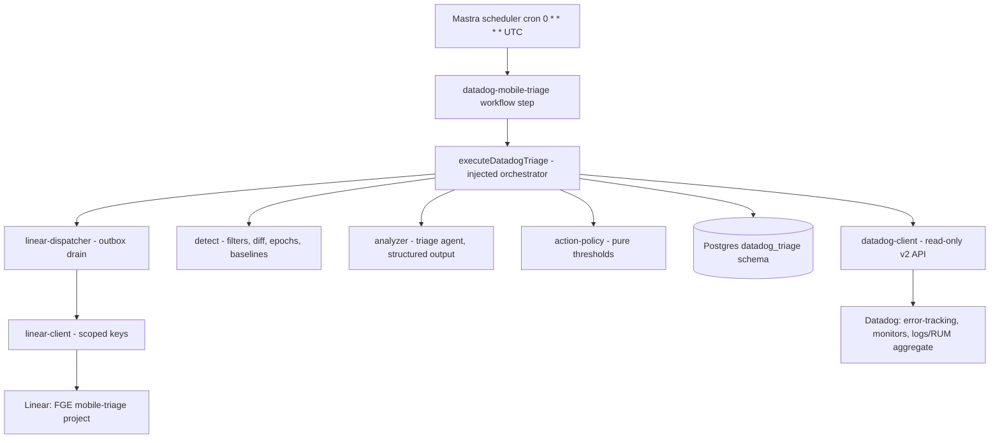
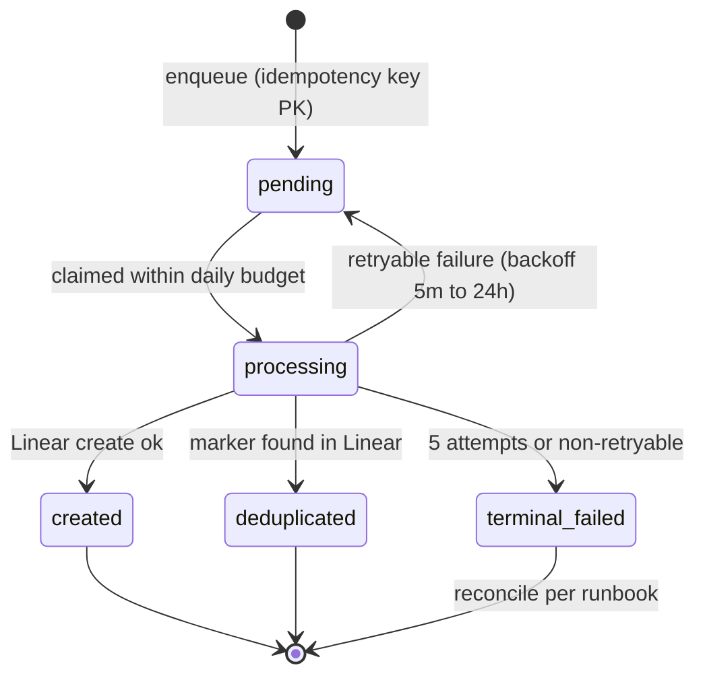

# Datadog Mobile Triage - Plan

## Goal Capsule

- **Objective:** An hourly, delta-gated Mastra workflow that triages mobile Datadog telemetry and files researched, deduplicated Linear tickets, cloned from the proven `daily-support-research` pipeline.
- **Product authority:** urim (mobile owner). Stage 1 only — detection through ticket filing. The pipeline code lives in `apps/mastra`, so the PR needs the mastra owner's review.
- **Execution profile:** build in `apps/mastra` on this worktree branch; everything ships default-off behind `DATADOG_TRIAGE_ENABLED`; no production behavior changes until an operator enables the flag per the runbook.
- **Stop conditions:** stop and surface if the support-research patterns this plan mirrors have materially changed on `main`, or if a unit requires mutating Datadog or writing outside `apps/mastra` + `docs/`.
- **Tail ownership:** enabling the flag, provisioning secrets, and creating the Linear project are operator steps in the runbook (U8), not implementation steps.

---

## Product Contract

**Product Contract preservation:** changed at plan synthesis with user confirmation — R2, R3, R8, R10, R14 reworked; R11 removed (daily summary dropped); R17, R18 added (dev-session exclusion, Datadog-state mute); F2 removed; AE1, AE4 rewritten; AE7–AE9 added.

### Summary

An hourly Mastra workflow sweeps mobile Datadog telemetry for new errors, anomalies, and inefficiencies, judges what is worth investigating, and files deduplicated Linear tickets in the FGE team's conventions. Quiet hours cost no LLM tokens. There is no daily summary.

### Problem Frame

Nobody observes mobile's Datadog telemetry today, so nothing is actioned. The mobile app ships RUM, logs, and playback QoE under the `forge-mobile` service, and errors sit unnoticed until a person happens to look. The believed precedent — the web app monitored overnight by agents — has no artifact in this repo; the web team's "Forge - Watch" Linear project was filled by a manual QA pass. The real in-repo prior art is the feat-326 support-research pipeline, which already solved scheduling, thresholds, dedup, budgets, and Linear dispatch for a different signal source. Live verification (2026-08-18) confirmed Error Tracking is active for `forge-mobile` — and that its stream is currently dominated by development-session noise, which detection must exclude.

### Key Decisions

- KD1. **Build in Mastra as a feat-326 clone.** (session-settled: user-directed — chosen over a Claude Code cron on the owner's machine and a staged migration: team-grade, unattended, and durable from day one, accepting coordination with the mastra owner.) Governs R1, R12.
- KD2. **Hourly delta-gated sweep over monitor-webhooks.** (session-settled: user-directed — chosen over a 9am daily sweep, which leaves up to 23h of latency, and over Datadog monitor webhooks, which only detect predefined conditions and add an inbound surface.) Governs R2, R3.
- KD3. **Error-Tracking-first detection.** (session-settled: user-approved — Datadog's own clustering supplies stable issue fingerprints, so the agent spends judgment on triage, not on re-clustering raw logs.) Governs R4, R8.
- KD4. **Stage 1 only.** (session-settled: user-directed — the sweep-and-ticket stage is worth shipping alone; the eventual stage 2 output shape is a feasibility comment, with the user as decision-maker.) Governs Scope Boundaries.
- KD5. **Coverage is mobile plus the admin API path mobile depends on; admin-path ships designed but dormant until the overlap check passes.** (session-settled: user-directed — chosen over holding planning or dropping the admin path.) Governs R5.
- KD6. **Tickets land in a new, dedicated mobile-triage Linear project in the FGE team.** (session-settled: user-directed — chosen over reusing an existing project or the bare team backlog: contains agent-filed tickets and keeps them easy to review or mute.) Governs R9.
- KD7. **No daily summary.** (session-settled: user-directed — dropped at plan synthesis; chosen over a 9am weekday summary workflow: one workflow, no timezone surface; liveness moves to a runbook check.) Governs R2, R10.

### Requirements

**Detection and cadence**

- R1. The pipeline is a scheduled Mastra workflow cloned from the `daily-support-research` shape: default-off gating, an action-policy judgment step, and outbox-based Linear dispatch.
- R2. The sweep runs hourly, every day.
- R3. Each run delta-gates the expensive path: it fetches only signals new or changed since the previous run's cursor, and an empty delta means zero LLM calls — but the outbox dispatch sweep still runs every run, so pending retries and deferred tickets never wait on a new signal.
- R4. Detection reads Datadog Error Tracking issues and monitor states as the primary signals, plus one bounded log/RUM aggregate spike check for signal classes Error Tracking does not cover.
- R5. Coverage is a configured service list — mobile telemetry (`forge-mobile`) always, plus the admin API path mobile depends on, which activates only after the overlap check with the web owner confirms no existing coverage.

**Judgment and ticketing**

- R6. An LLM judgment step decides "worth investigating" through an action policy with thresholds (confidence, recurrence, actionability) that live in configuration, not code.
- R7. Every ticket carries its evidence: what fired, counts, sample messages, the time range, and a deep link to the Datadog view it came from.
- R8. Dedup is epoch-scoped per issue fingerprint: within an epoch a signal never produces a second ticket — including when a human has closed the ticket while the issue merely continues; a qualifying regression (R14) mints a new epoch and may ticket once more.
- R9. Tickets are filed into a dedicated mobile-triage project in the FGE team and follow its observed conventions: bracketed surface prefix and `[P#]` severity in the title, a Bug-class label, and no writes to Linear's priority or assignee fields.
- R10. A daily UTC ticket budget caps issues filed per day; over-budget qualifying findings stay queued in the outbox and dispatch under a later day's budget — never silently dropped.

**Safety and rollout**

- R12. The workflow ships default-off behind an env flag; rollback is the flag, never schema teardown.
- R13. The workflow is read-only toward Datadog and writes nothing to product code or the repo.
- R14. Baselines are per service: the first run covering a service records its standing issue set and activity rates and files nothing for them; later runs ticket only new signals, or baselined signals whose activity meaningfully regresses past the configured thresholds (which mints a new epoch per R8).
- R15. Datadog access uses a dedicated read-only API client, following mastra's hand-rolled-client convention for unattended workflows; the interactive Datadog MCP server is not the vehicle.
- R16. Linear dispatch uses its own scoped env keys (API key, team, project), separate from the support-research and SEO integrations.
- R17. Detection excludes non-release sessions: an error originating from a development or simulator session must never produce a ticket.
- R18. Issues an operator sets to ignored or excluded state in Datadog are skipped by detection — this is the mute lever, and it keeps the pipeline read-only.

### Key Flows

- F1. **Hourly sweep.** **Trigger:** cron. **Steps:** drain due outbox actions first; resolve an absolute delta window from the cursor; if empty, end; otherwise filter (R17, R18), judge each signal against the action policy, skip already-ticketed epochs, enqueue durable ticket actions, dispatch within budget, then advance cursor and seen-state at finalize. **Covers:** R2–R4, R6–R8, R10, R17, R18.
- F3. **First enablement / new service.** **Trigger:** the env flag turns on, or a service first appears in the coverage list. **Steps:** record that service's standing issues, monitor states, and activity rates as its baseline; file no tickets; subsequent runs proceed per F1. **Covers:** R5, R12, R14.

### Acceptance Examples

- AE1. **Covers R3.** **Given** a quiet hour with no new or changed signals, **when** the sweep runs, **then** it ends after the delta check with zero LLM calls — and any due outbox actions were still dispatched.
- AE2. **Covers R2, R4, R6–R8.** **Given** a new crash cluster first seen at 10:07, **when** the 11:00 sweep runs, **then** a single ticket exists with evidence and a Datadog deep link — latency under one hour.
- AE3. **Covers R8.** **Given** that cluster recurs the next day at similar rates, **when** the sweep runs, **then** no second ticket is created.
- AE4. **Covers R10.** **Given** the daily budget is exhausted, **when** a sixth qualifying finding appears, **then** its action is enqueued and dispatches under a later day's budget.
- AE5. **Covers R14.** **Given** first enablement with a standing backlog of recurring errors, **when** the first run completes, **then** zero tickets exist and the baseline is recorded.
- AE6. **Covers R5.** **Given** the overlap check is not yet confirmed, **when** an admin-path error appears, **then** it is not ticketed.
- AE7. **Covers R17.** **Given** an error from a Metro/simulator development session, **when** the sweep runs, **then** it is excluded before judgment and never becomes a candidate.
- AE8. **Covers R18.** **Given** an operator has set an issue to ignored in Datadog, **when** it later fires again, **then** no ticket is created.
- AE9. **Covers R8, R14.** **Given** a ticket was filed and closed, and the issue later regresses meaningfully past its baseline, **then** a new epoch is minted and exactly one new ticket is filed.

### Success Criteria

- A human can verify any ticket's claim in Datadog in one click from the ticket body.
- After two weeks enabled, knowing mobile's production health requires reading the triage tickets, not opening Datadog manually.
- Zero duplicate tickets within an epoch and zero tickets on quiet days across the calibration period.

### Scope Boundaries

**Deferred for later**

- Stage 2: agents that pick up filed tickets and validate feasibility against the repo, producing feasibility comments (verdict, suspected cause, entry points); the user remains the decision-maker. No repo-validation precedent exists in mastra today, so this is new design surface for its own plan.
- Any summary or heartbeat surface (daily digest, liveness alert on the pipeline itself). Dropped from v1; liveness is a documented runbook check.
- Datadog monitor → webhook triggering for minutes-level paging of crash-spike-class signals.
- Platform-wide coverage (web, TV, other services) beyond the configured service list.
- Cross-run root-cause merging (grouping differently-fingerprinted signals that share a cause across hours) — a human close-as-duplicate today, a natural stage-2 capability later.

**Outside this product's identity**

- Auto-writing code or opening PRs.
- Mutating anything in Datadog (the mute lever is a human action in Datadog's UI; the pipeline only reads states).
- Setting Linear priority or assignee fields.

### Dependencies / Assumptions

- Linear workspace, team, and API access are ready (user-confirmed); the dedicated mobile-triage project must be created in the FGE team before first enablement.
- Admin-path activation precondition: a one-line confirmation from the web owner that no existing automation covers admin's Datadog errors (per R5).
- A Datadog API key + application key must be provisioned to mastra's Railway environment with read scopes: `logs_read_data`, `rum_apps_read`, `monitors_read`, plus whatever Error Tracking search requires (its scope name is not documented; verify empirically during provisioning). Check that the org's "Restrict Access by Scope" setting is enabled, or the application key inherits its creator's full permissions. Mint the application key under a dedicated least-privilege Datadog identity, never a personal admin account; if scope restriction cannot be enabled, do not enable `DATADOG_TRIAGE_ENABLED` until the key's effective permissions are limited to the listed read scopes.
- Assumption: the Error Tracking issue-search response carries per-issue occurrence counts for the queried window. The live check verified issue IDs and first/last-seen timestamps only — counts are unverified; U3 verifies at implementation, with the per-issue log/RUM aggregate over the delta window as the named fallback.
- Error Tracking is active for `forge-mobile` with stable issue IDs and `first_seen`/`last_seen` timestamps — verified live 2026-08-18 via the Datadog MCP.
- `apps/mastra` is not owned by the product authority; the PR needs the mastra owner's review, and migration 003 must be deployed before the flag is enabled.
- The Mastra runtime persists `createWorkflow` schedules at boot and fires them wall-clock-anchored (feat-326 precedent; a `*/10 * * * *` workflow already runs in production). Verify at implementation that a restart does not backfill missed windows.

### Sources / Research

- `docs/roadmap/platform/feat-326-daily-support-user-research-agent.md` and `docs/runbooks/support-research-agent.md` — the template pipeline and its runbook shape.
- `apps/mastra/src/mastra/workflows/daily-support-research.ts` — `createWorkflow` schedule field, thin `createStep` adapter over an exported dependency-injected orchestrator, runtime readiness gating, UTC day-key budget windows.
- `apps/mastra/src/services/support-research/` — `repository.ts` (raw `pg`, SQL-side budget/claim CTEs with advisory locks, lease tokens), `linear-client.ts` + `linear-dispatcher.ts` (marker-based dedup via `findIssueByMarker`, exponential backoff capped 24h, terminal after 5 attempts), `action-policy.ts` (pure threshold gating over LLM structured output; `safeLinearText` sanitizer — note it strips URLs), `analyze-support-conversation.ts` (injected analyzer interface, untrusted-evidence delimiters).
- `apps/mastra/src/services/devotional/bounded-response.ts` — shared byte-capped body readers; pair with the TimeoutError-rethrow fix proven in `apps/mastra/src/mastra/langfuse-trace-retention.ts` (5 of 6 older copies swallow mid-body timeouts as `parse_error`).
- `apps/mastra/src/config/env.ts` — per-integration optional env blocks, `<PREFIX>_ENABLED` string-enum flags, `DEFAULT_*` constants, `csvValues` helper, `get<Integration>Config()` accessors.
- Institutional learnings: `docs/solutions/architecture-patterns/support-research-evidence-ledger-pattern-20260801.md` (cursor-with-overlap + dedupe-by-source-id; evidence/inference separation; outbox marker reconciliation), `docs/solutions/conventions/single-service-http-client-result-union-convention.md`, `docs/solutions/best-practices/outbound-timeout-shorter-than-caller-budget-20260506.md`, `docs/solutions/best-practices/buffered-http-response-byte-cap-oom-guard-20260629.md`, `docs/solutions/runtime-errors/required-env-var-without-default-broke-railway-deploy-20260511.md`, `docs/solutions/best-practices/per-run-caps-vs-per-day-quota-claims-restart-refreshed-jobs.md`, `docs/solutions/best-practices/mocked-shape-vs-real-contract-discipline-20260506.md`.
- Datadog API (official docs, 2026-08-18): Error Tracking `POST /api/v2/error-tracking/issues/search` + `GET /api/v2/error-tracking/issues/{id}` (covers RUM+logs+APM; state filter param; sortable by `FIRST_SEEN`; no server-side "changed since" — client-side diff required); Logs `POST /api/v2/logs/events/search` + `/api/v2/logs/analytics/aggregate` (cursor pagination, page max 1000, 10k bucket cap; documented pitfall: resolve relative time ranges to absolute timestamps before paginating); RUM `POST /api/v2/rum/events/search` + aggregate (`meta.status: "timeout"` returns 200 with partial data — must check); Monitors `GET /api/v1/monitor` with `group_states`; auth via `DD-API-KEY` + `DD-APPLICATION-KEY`; site-specific base hosts (`api.datadoghq.com` etc. — env-configured); rate limits surfaced only via `X-RateLimit-*` response headers.
- Live Error Tracking sample for `forge-mobile` (2026-08-18): 28+ issues/7d, dominated by dev-session noise — Metro `127.0.0.1` stack frames, `dev=true` bundle URLs, ad-hoc versions (`fixcheck-20260805`, `sdk57-regression-20260813`) — the empirical basis for R17.
- Linear reference project "Forge - Watch" (FGE team) — ticket conventions: bracketed surface prefixes, `[P#]` in titles, Bug/QA-Fix labels, PR links.

---

## Planning Contract

### Key Technical Decisions

- KTD1. **One workflow, one step, injected orchestrator.** A single `datadog-mobile-triage` workflow (`schedule: { cron: "0 * * * *", timezone: "UTC" }`) whose `createStep` is a thin adapter constructing real dependencies and calling an exported, dependency-injected `executeDatadogTriage` — the shape that makes the pipeline testable without mocking Mastra. (session-settled: user-directed — per KD1/KD7; single workflow after the summary was dropped.) Governs R1, R2.
- KTD2. **Delta = absolute window + client-side diff; state advances only at finalize.** No Datadog API offers "changed since", so each run resolves, per source, an absolute window `[that source's cursor − overlap, now − lag]` (lag ≈ a few minutes for ingestion; overlap re-read deduped by source ID), diffs against the seen-state tables, and commits cursors + seen-state only after the corresponding action rows are durable — a crash can re-process a signal (idempotency absorbs it) but can never lose one. Cursors are per-source (a `cursors` table keyed by source): each source's cursor advances independently at finalize, so a failed source's window is retried next run while healthy sources move on. Each run judges at most the configured per-run candidate cap, in deterministic order; capped-out signals are not written to seen-state and their source's cursor holds at the earliest unjudged point so they re-enter the next window. Governs R3, R4.
- KTD3. **Per-source partial semantics.** The three sources (issues search, monitors list, spike aggregate) fetch and fail independently; a failed or partial source (RUM/logs `meta.status: "timeout"`) never updates its baselines or state and is recorded as a partial-run reason, while healthy sources proceed. Governs R4, R14.
- KTD4. **Dev-session discriminator is config, pinned empirically.** R17's filter (candidate discriminators: `version` patterns, env tag, session attributes) is expressed in the detection query + a config allowlist/denylist; the exact discriminator is chosen against live data during implementation. The filter operates at issue granularity and fails open toward coverage: an issue is excluded only when its windowed activity is entirely dev-shaped — any release-session activity keeps it in. A filter change requires a paired baseline re-seed (a loosened filter makes old noise "new"). Governs R17.
- KTD5. **Datadog client per the result-union convention.** Modeled on `linear-client.ts` + `jesusfilm-rag-client.ts`: closed failure enum with `{retryable, ambiguous}`, `config_missing` short-circuit, `failureForStatus`, `AbortSignal.timeout` shorter than the step budget, `redirect: "error"`, https host allowlist from the site config, injectable `fetchImpl`, `.passthrough()` zod parsing, byte-capped body reads using the shared bounded-response readers **with** the TimeoutError-rethrow fix (langfuse pattern, not the stale copies). Rate-limit headers (`X-RateLimit-*`) are captured and a 429 defers the source to the next run. Governs R13, R15.
- KTD6. **Signal identity model.** Error Tracking: fingerprint = `issue_id`, dedup key = `issue_id` + epoch; an epoch mints when a baselined issue's windowed activity exceeds the configured regression multiplier of its stored baseline rate. Monitors: signal = `monitor_id` + alert-episode start, with a per-monitor cooldown so a flapping monitor cannot storm the budget; the monitors fetch is scoped to the coverage list via a per-service tag query (template in config, e.g. monitors tagged `service:forge-mobile`), never the org's full monitor list. Spike check: signal identity = service + spike class, evaluated per window against a trailing baseline, with a per-service cooldown mirroring the monitor cooldown so a recurring benign surge cannot re-ticket within the cooldown. Governs R8, R14.
- KTD7. **Outbox with budget in the SQL claim; dispatch decoupled from detection.** Ticket intents are outbox rows (idempotency key as primary key, `on conflict do nothing`); the claim CTE enforces the per-UTC-day budget under an advisory lock, exactly as support-research does; the dispatcher's marker search against Linear runs before every create. The dispatch sweep runs at the top of every hourly run regardless of delta (R3), so retries and deferrals drain on schedule. Governs R3, R8, R10.
- KTD8. **Judgment = injected analyzer + pure policy; links never pass through the sanitizer.** A `datadogTriageAgent` (model from env) is consumed through a narrow analyzer interface returning structured output; a pure `decideTriageAction` applies thresholds. Datadog-sourced text (error messages, stacks, monitor names) is untrusted: it is wrapped in untrusted-evidence delimiters for the LLM and passed through the sanitizer for the ticket body. Deep links are built from a trusted URL template + validated IDs — never extracted from Datadog text — because the sanitizer strips URLs. Governs R6, R7, R17.
- KTD9. **Coverage and baselines are per-service config.** `DATADOG_TRIAGE_SERVICES` (CSV, default `forge-mobile`) drives detection queries; a service's first appearance triggers its own baseline seed (F3). Admin-path activation is adding the service to the CSV after the overlap check — config, not code: the bracketed surface prefix and the release-session filter's applicability are per-service config entries (mobile: filter on, prefix `[Mobile]`; admin: filter off or admin-shaped, prefix `[Admin]`), so activation truly requires no code. (session-settled: user-directed — instantiates KD5.) Governs R5, R14.
- KTD10. **Scoped env blocks, all `.optional()`.** `DATADOG_TRIAGE_*` (enabled flag as `z.enum(["true","false"]).default("false")`, site, api/app keys, services CSV, thresholds, budget, timeout/byte caps, model id) and `LINEAR_DATADOG_TRIAGE_*` (api key, team, project, label) follow the per-integration pattern: optional at schema level, completeness checked by a runtime readiness function, `DEFAULT_*` constants documented in `apps/mastra/CLAUDE.md`. Governs R12, R16.

### High-Level Technical Design

Component topology — one workflow, one new service module, two external systems:

Outbox action lifecycle (mirrors support-research):

**Sequencing:** U1 → U2, U3 (parallel) → U4 → U5, U6 (parallel) → U7 → U8.

### Risks & Mitigations

- **Silent pipeline death is the worst failure mode.** An expired key, a Datadog API change, or a mastra platform upgrade can stop the sweep while everyone believes coverage exists — and the summary that would have been the natural heartbeat was dropped (KD7). Mitigation: the runbook's per-source cursor-lag liveness check (U8) is mandatory content with a named owner and cadence, and a richer heartbeat (a Datadog monitor on the workflow's own logs) is named deferred work.
- **Trust decays if thresholds mis-calibrate.** Noisy tickets teach readers to ignore the project. Mitigation: default-off rollout with a small budget and a manual-review period (U8), thresholds in config for deploy-free tuning (R6), and the budget capping blast radius (R10).
- **Thresholds and baselines go stale at audience jumps.** Beta-scale calibration is wrong at wide release. Mitigation: recalibration is a named operator task in the runbook, keyed to release milestones, not an emergent surprise.
- **Datadog re-clustering mints "new" fingerprints for old problems.** Re-symbolication or a new release can re-key an issue, producing an occasional duplicate ticket. Mitigation: epoch dedup (KTD6) absorbs most; residual duplicates are a human close-as-duplicate; cross-run root-cause merging is explicitly deferred (Scope Boundaries).
- **Cross-app ownership tax.** The workflow lives in `apps/mastra`; platform refactors there can break it in ways the mastra suite doesn't cover. Mitigation: clone proven shapes (KTD1), schedule-shape tests that pin the registered cron (U7), and the CLAUDE.md architecture entry (U8) that makes the workflow visible to future mastra work.
- **Unverified externals.** The Error Tracking search scope name, the scheduler's no-backfill restart behavior, and per-issue windowed occurrence counts in the issue-search response are unverified (Dependencies). Mitigation: all are explicit provisioning/implementation verification steps (U8 runbook; U7 execution check; U3 first step); the SQL-side budget (KTD7) bounds damage even if restarts double-fire.
- **Log content drifts toward tickets.** Future log fields could carry data that should not reach Linear. Mitigation: the sanitizer covers all evidence text (KTD8), and the runbook names ticket-content review as part of raising budgets.

### U1. Env config block and readiness

- **Goal:** Declare the `DATADOG_TRIAGE_*` and `LINEAR_DATADOG_TRIAGE_*` env surfaces and typed config accessors.
- **Requirements:** R5, R12, R16 (KTD9, KTD10).
- **Dependencies:** none.
- **Files:** `apps/mastra/src/config/env.ts` (+ existing colocated env test file).
- **Approach:** Mirror the support-research block: `DEFAULT_*` constants, `.optional()` zod fields, string-enum enabled flag, `csvValues` for the service list, `getDatadogTriageConfig()` + `getLinearDatadogTriageConfig()` accessors; thresholds, budget, per-run candidate cap (`DATADOG_TRIAGE_MAX_CANDIDATES_PER_RUN`, mirroring `SUPPORT_RESEARCH_MAX_CONVERSATIONS`, default 200), timeout, byte cap, overlap/lag, regression multiplier, monitor cooldown, and per-service surface prefix / filter applicability all config with defaults.
- **Test scenarios:**
  - Module imports cleanly with every new var unset (`vi.stubEnv`-scoped) — boot safety.
  - Enabled flag defaults to `"false"`; config accessor reports not-ready when keys are missing.
  - CSV service list parses with trimming and empty-entry filtering; default is `forge-mobile` alone.
  - Numeric fields fall back to their `DEFAULT_*` constants and reject non-numeric input.
- **Verification:** `pnpm --filter @forge/mastra test` green; typecheck passes with no new required env in CI.

### U2. Migration and repository

- **Goal:** The `datadog_triage` Postgres schema and its repository: runs lease, seen-issues with epochs and baseline rates, monitor states, spike baselines, and the actions outbox with SQL-side budget claim.
- **Requirements:** R3, R8, R10, R14 (KTD2, KTD6, KTD7).
- **Dependencies:** none (parallel with U1).
- **Files:** `apps/mastra/migrations/003-datadog-triage.sql`, `apps/mastra/src/services/datadog-triage/schema.ts`, `apps/mastra/src/services/datadog-triage/repository.ts`, `apps/mastra/src/services/datadog-triage/repository.test.ts`.
- **Approach:**
  1. Migration: `create schema if not exists datadog_triage`; tables `runs` (lease token/expiry), `cursors` (per-source cursor + last-success timestamp, mirroring `support_research.cursors`), `seen_issues` (issue_id PK, service, epoch, baseline_rate, last_activity), `monitor_states`, `spike_baselines`, `actions` (idempotency_key PK, status, attempts, next_attempt_at, payload, created_at) — all additive/idempotent like `002`.
  2. Repository mirrors `PostgresSupportResearchRepository`: parameterized single-statement CTEs; `claimDueActions` enforces the per-UTC-day budget under `pg_advisory_xact_lock`; write-ordering helpers so seen-state commits only after action rows are durable (KTD2).
- **Patterns to follow:** `apps/mastra/src/services/support-research/repository.ts`; zod row round-tripping from `schema.ts`.
- **Execution note:** the budget/claim CTEs need a real-Postgres smoke, not only mocked shapes — `support-research/repository.test.ts` is fake-database-only and has no real-DB path to copy; build a new opt-in smoke following `apps/mastra/src/mastra/ai-chat-erasure.smoke.test.ts` (env-flag-gated `describe.skipIf`, throwaway-`DATABASE_URL` target guard, excluded from CI by default). Mocked SQL-shape tests do not prove PG function resolution.
- **Test scenarios:**
  - Claim respects the daily budget: with budget 5 and 6 pending actions, exactly 5 claim in a UTC day; the 6th claims after the day rolls (Covers AE4).
  - Idempotency: enqueueing the same key twice yields one row.
  - Crash ordering: a seen-issue write helper refuses to run ahead of its action row (unit-level contract test).
  - Lease: a second concurrent run cannot claim while a live lease exists; an expired lease can be taken over.
  - Backoff fields: attempts increment and `next_attempt_at` follows the 5min→24h doubling schedule.
  - Per-source cursors: a failed monitors fetch leaves the monitors cursor and its state unmoved while the issues cursor advances.
- **Verification:** repository suite green including the real-DB smoke path; migration applies idempotently twice in a row.

### U3. Datadog read-only client

- **Goal:** A hardened, typed client for the four read surfaces: Error Tracking issue search + detail, monitors list, logs aggregate, RUM aggregate.
- **Requirements:** R4, R13, R15 (KTD3, KTD5).
- **Dependencies:** U1 (config shape).
- **Files:** `apps/mastra/src/services/datadog-triage/datadog-client.ts`, `apps/mastra/src/services/datadog-triage/datadog-client.test.ts`.
- **Approach:** Result-union convention per KTD5. Endpoints and params per the Sources brief (absolute from/to always; `page.limit` ≤ 1000; state filter on issue search; `group_states` on monitors, scoped by KTD6's per-service tag query). Site-configured base host validated against an allowlist of known Datadog API hosts. Response schemas `.passthrough()`-parse only the fields detection consumes (issue id/state/counts/first_seen/last_seen/service, monitor id/state, aggregate buckets + `meta.status`). First implementation step: verify the issue-search response carries per-issue occurrence counts for the queried window; if not, implement the fallback per-issue log/RUM aggregate grouped by issue over the delta window (Dependencies).
- **Patterns to follow:** `apps/mastra/src/services/support-research/linear-client.ts` (result union, failureForStatus), `apps/mastra/src/mastra/langfuse-trace-retention.ts` (TimeoutError-correct bounded reads), `apps/mastra/src/services/devotional/bounded-response.ts`.
- **Test scenarios:**
  - Per-status mapping: 401/403 → auth_failed non-retryable; 429 → rate_limited retryable (and the source defers); 5xx → network_error retryable; other 4xx → rejected.
  - Malformed body → parse_error; a mid-body timeout classifies as timeout, not parse_error (real typed shape, per the mocked-vs-real law).
  - Byte cap: an over-cap streamed body aborts via `reader.cancel()` (observable-flag stub) and maps to the graceful failure path.
  - Aggregate response with `meta.status: "timeout"` surfaces as partial, not success.
  - Config-missing short-circuits before any fetch; non-allowlisted host refuses.
- **Verification:** client suite green; no raw upstream text in any log assertion.

### U4. Detection: filters, diff, epochs, baselines

- **Goal:** Pure detection logic turning raw client responses + stored state into candidate signals and state updates.
- **Requirements:** R3–R5, R14, R17, R18 (KTD2, KTD3, KTD4, KTD6).
- **Dependencies:** U2, U3.
- **Files:** `apps/mastra/src/services/datadog-triage/detect.ts`, `apps/mastra/src/services/datadog-triage/detect.test.ts`.
- **Approach:** Pure functions over injected inputs: window resolution (cursor, overlap, lag), release-session filter (KTD4), muted-state exclusion (ignored/excluded), per-service new-vs-baselined split, epoch/regression qualification against stored baseline rates, monitor episode identity with cooldown, spike-vs-trailing-baseline check, per-source partial handling (a failed source yields no state updates for that source).
- **Test scenarios:**
  - Covers AE1: empty delta yields no candidates and no LLM invocation flag.
  - Covers AE5: unseen service yields baseline-seed actions only, zero candidates.
  - Covers AE6: a signal from a service not in the list is ignored entirely.
  - Covers AE7: a dev-session signal (fixture built from the live noise shapes: `dev=true` bundle URL, ad-hoc version) is excluded before judgment; a release-session sibling passes. Falsify per gate: the release fixture differs from the dev fixture in only the discriminator field.
  - Covers AE8: an ignored-state issue is excluded even when its counts regress.
  - Covers AE9: a baselined issue exceeding the regression multiplier mints a new epoch exactly once.
  - Overlap re-read: a signal present in two consecutive windows produces one candidate.
  - Partial source: monitors fetch failure leaves monitor state untouched while issue candidates still flow.
  - Flapping monitor inside cooldown produces one episode signal, not one per hour.
  - Mixed issue: a fixture whose windowed activity holds both dev-shaped and release-session events is not excluded — the filter fails open toward coverage (per KTD4).
  - Per-service filter applicability: a covered service without mobile-shaped session attributes is not excluded by the release-session filter (per KTD9).
  - Per-run cap: with more new signals than the candidate cap, exactly cap-many candidates emit in deterministic order and the source cursor holds at the earliest unjudged signal.
- **Verification:** detection suite green; every AE listed above has a directly-named test.

### U5. Judgment, policy, and ticket drafting

- **Goal:** The triage agent, the analyzer seam, the pure action policy, and the evidence-bearing ticket draft.
- **Requirements:** R6, R7, R9 (KTD8).
- **Dependencies:** U1, U4 (candidate types).
- **Files:** `apps/mastra/src/mastra/agents/datadog-triage-agent.ts`, `apps/mastra/src/services/datadog-triage/analyze.ts`, `apps/mastra/src/services/datadog-triage/action-policy.ts`, `apps/mastra/src/services/datadog-triage/ticket-draft.ts`, colocated tests.
- **Approach:** Agent = plain `new Agent` with model from config, no tools, registered in `index.ts`. `analyze.ts` defines the narrow analyzer interface (structured output schema: classification, confidence, suspected area, proposed severity) and wraps Datadog-sourced text in untrusted-evidence delimiters. `action-policy.ts` is pure threshold gating (confidence, recurrence, actionability) returning a discriminated decision. `ticket-draft.ts` builds the FGE-convention title (the service's configured surface prefix + `[P#]`, per KTD9), evidence body (counts, window, sample messages through the sanitizer), the trusted-template deep link, and embeds the idempotency marker comment.
- **Patterns to follow:** `analyze-support-conversation.ts` (analyzer seam + delimiters), `action-policy.ts` (pure gates, `safeLinearText`, `draftAction`).
- **Test scenarios:**
  - Per-gate falsification: for each policy gate, a fixture failing only that gate is rejected with that gate's reason (anti-vacuous companions included).
  - Prompt-injection fixture: an error message containing instruction-shaped text stays inside delimiters and cannot alter the structured output schema contract.
  - Sanitizer scope: evidence text is sanitized (URLs stripped) while the deep link — built from the template — survives intact in the body (Covers the one-click success criterion).
  - Title conventions: bracketed surface + `[P#]` present; no priority/assignee fields in the create payload.
- **Verification:** suites green; a rendered draft fixture visually reviewed once in the PR.

### U6. Linear client and dispatcher

- **Goal:** Scoped Linear integration: idempotent issue creation with marker dedup, retry backoff, and budgeted drain.
- **Requirements:** R8–R10, R16 (KTD7).
- **Dependencies:** U1, U2.
- **Files:** `apps/mastra/src/services/datadog-triage/linear-client.ts`, `apps/mastra/src/services/datadog-triage/linear-dispatcher.ts`, colocated tests.
- **Approach:** Copy the support-research client/dispatcher pair with this integration's config scope and marker prefix (`datadog-triage-key:`); drain loop claims via U2's budgeted CTE, marker-searches before every create, marks created/deduplicated/retry/terminal.
- **Patterns to follow:** `support-research/linear-client.ts`, `support-research/linear-dispatcher.ts` — including ambiguous-failure reconciliation semantics.
- **Test scenarios:**
  - Sequencing: claim → marker search → create only when absent; marker hit marks deduplicated without create (Covers AE3).
  - Backoff: schedule follows 5min→24h doubling; 5th failure goes terminal.
  - Ambiguous timeout: action stays reconcilable, not duplicated on retry (marker search on the retry catches a created-but-unconfirmed issue).
  - Budget exhaustion: unclaimed actions remain pending and dispatch next day (Covers AE4).
- **Verification:** dispatcher suite green with stubbed repository + client.

### U7. Workflow assembly and registration

- **Goal:** The scheduled workflow wiring everything together, registered in the Mastra instance.
- **Requirements:** R1–R3, R12 (KTD1, KTD2, KTD7).
- **Dependencies:** U2–U6.
- **Files:** `apps/mastra/src/mastra/workflows/datadog-mobile-triage.ts`, `apps/mastra/src/mastra/workflows/datadog-mobile-triage.test.ts`, `apps/mastra/src/mastra/index.ts`.
- **Approach:** Exported pure `executeDatadogTriage(deps)` orchestrator: readiness short-circuit → outbox drain → window resolution → fetch (per-source) → detect → judge → enqueue → dispatch → finalize (advance cursor/state). Thin `createStep` adapter constructs pool/repository/clients/analyzer, `finally` closes the pool. `createWorkflow` with `schedule: { cron: "0 * * * *", timezone: "UTC" }`; register in `index.ts` workflows and agents maps.
- **Test scenarios:**
  - Schedule shape: registered schedules equal `[{ cron: "0 * * * *", timezone: "UTC" }]` with no `id`/`inputData` keys (mirrors the instagram schedule test).
  - Not-ready config: orchestrator exits without touching any client (flag off ⇒ inert; Covers R12).
  - Empty-delta run still calls the dispatcher (Covers AE1's dispatch clause).
  - Finalize ordering: cursor advances only after enqueue results are durable; a mid-run failure leaves the cursor unmoved (stub repository asserts call order).
  - End-to-end orchestration with all stubs: one new signal flows fetch → detect → judge → enqueue → dispatch → finalize (Covers AE2).
- **Verification:** workflow suite green; `pnpm --filter @forge/mastra typecheck` clean.

### U8. Runbook, docs, and roadmap ticket

- **Goal:** Operator documentation and repo bookkeeping.
- **Requirements:** R12, R17, R18 and the Dependencies section's operator preconditions.
- **Dependencies:** U1–U7 (documents what shipped).
- **Files:** `docs/runbooks/datadog-mobile-triage.md`, `apps/mastra/CLAUDE.md`, a new `docs/roadmap/platform/feat-NNN-datadog-mobile-triage.md`.
- **Approach:** Runbook mirrors the support-research structure: purpose/safety boundary; provisioning (Datadog app-key scopes incl. the empirical Error Tracking scope check and the Restrict-by-Scope org setting, Linear project creation, secrets into mastra's Railway env); migration rollout with independent readback; dry-run; dry-run = flag on with the daily budget at zero (actions enqueue but never claim), operator reviews pending outbox rows, go-live purges unwanted rows (documented step) or raises the budget; live rollout starting with a small budget and a manual-review period; operator levers (mute = ignore/exclude in Datadog; closed-ticket/epoch semantics; filter-change ⇒ paired re-seed; audience-jump recalibration; admin-path activation: record the web owner's no-existing-coverage confirmation, then append the admin service to `DATADOG_TRIAGE_SERVICES` — F3 seeds its baseline automatically); liveness check owned by the mobile owner on a weekly cadence: query each source's last-success lag, act when it exceeds a few hours, and state that ticket silence is not evidence of pipeline health until the deferred heartbeat ships; rollback = flag. CLAUDE.md gains the env table rows and an architecture bullet. Roadmap ticket: allocate feat-NNN by scanning all origin branches for the true max ID, not main alone.
- **Test scenarios:** Test expectation: none — documentation; CI `format` requires `prettier --write` run twice plus `--check` over the touched markdown.
- **Verification:** prettier check passes; runbook sections mirror the template's headings; CLAUDE.md env table matches U1's actual var names.

---

## Verification Contract

| Gate | Command | Applies to |
|---|---|---|
| Unit + integration tests | `pnpm --filter @forge/mastra test` | U1–U7 |
| Types | `pnpm --filter @forge/mastra typecheck` | all code units |
| Lint | `pnpm --filter @forge/mastra lint` | all code units |
| Docs formatting | `prettier --write` ×2 then `--check` on touched `.md` | U8 |
| Real-DB smoke | opt-in real-Postgres suite following the `ai-chat-erasure.smoke.test.ts` pattern (env-gated, throwaway-DB guard, out of CI) | U2 |
| Migration idempotence | apply `003` twice against a dev database | U2 |

Operational verification (runbook, pre-enable, not CI): a live scoped-key smoke against each Datadog endpoint confirming scopes and recording actual `X-RateLimit-*` headers; a dry-run window with the flag on and the daily budget at zero — actions enqueue but never dispatch — ending with a documented purge-or-raise step before the first real ticket.

---

## Definition of Done

- All eight units complete with their listed test scenarios; the three repo gates (test, typecheck, lint) green.
- Every acceptance example (AE1–AE9) is enforced by at least one named test.
- Boot safety proven: mastra imports and starts with none of the new env vars set.
- Migration 003 applies idempotently; the deploy-migration-before-enable order is stated in the runbook and the env vars' purpose strings.
- Runbook, CLAUDE.md env table, and roadmap ticket exist and match the shipped names.
- The Product Contract preservation note reflects the final state; no abandoned-attempt code remains in the diff.
- Flag stays off: merging this plan's PR changes nothing in production until an operator follows the runbook.
