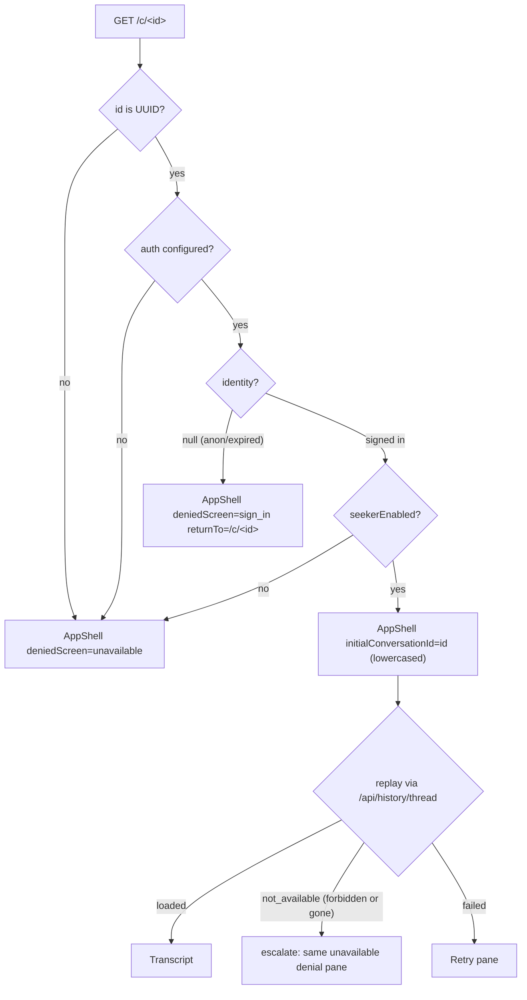
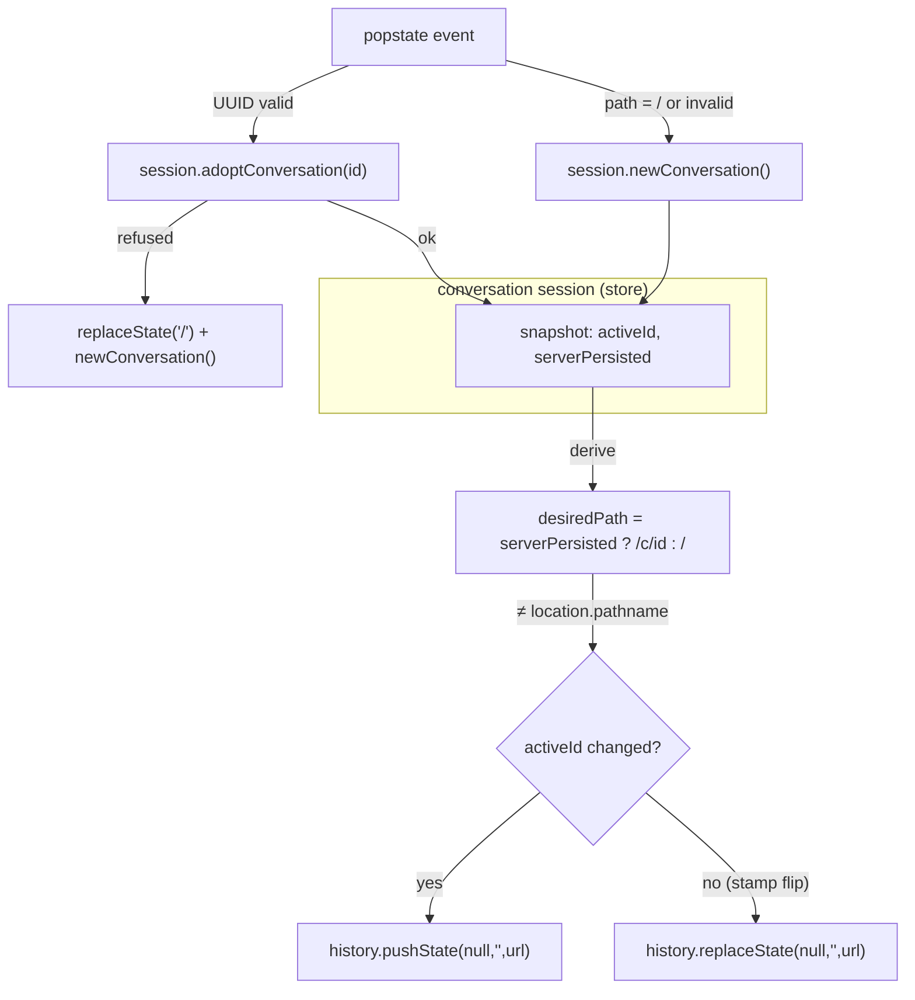

# Chat Per-Conversation URLs - Plan

## Goal Capsule

- **Objective:** Every gate-granted chat conversation has an address a user can bookmark, paste, and deep-link back into, with browser back/forward walking their conversations. Every failed deep link resolves to one of two explicit screens instead of a broken or adopted state. (History/bookmark entries are deliberately not self-describing — see Scope Boundaries; the sidebar stays the conversation-discovery surface.)
- **Means:** A real `/c/[id]` route as the deep-link entry only, with in-app URL changes done through shallow `history.pushState` driven by the conversation session (KTD1, KTD2).
- **Authority:** This plan's Product Contract governs behavior; the roadmap ticket (`docs/roadmap/ai-chat/feat-209-chat-per-conversation-urls.md`) is amended in the same change where this plan supersedes it (KTD5 supersedes its item 4; the minting condition narrows to gate-granted). `apps/chat/CLAUDE.md` conventions bind all code.
- **Stop conditions:** Stop and surface if implementation finds (a) the Next 16 history patch behaving differently than KTD1 records (a remount, hard navigation, or reload on the shallow path in the browser), or (b) the adopt-by-id seam requiring changes to `mergeServerThreads` semantics beyond the ordering tweak in KTD3 — both invalidate settled decisions rather than detail.
- **Execution profile:** Single PR. Implement units in dependency order; browser verification runs under `next build` + `next start`, never `next dev`.
- **Tail ownership:** The implementing session owns test/lint/typecheck green and browser verification. Ticket completion mechanics (status flip, `## Resolution`, lane README row, `apps/chat/CLAUDE.md` update) land inside the implementation PR per lane convention — they are listed in Definition of Done, not as units.

---

## Product Contract

### Summary

Give each gate-granted conversation a `/c/<id>` URL: minted when its server thread provably exists (first send), updated on sidebar selection via shallow pushState, restorable by deep link through the existing replay path, with back/forward walking conversations. Anonymous and non-granted users keep today's behavior at `/`. Two denial screens cover every failed deep link. No Mastra, proxy, or server data-surface changes.

### Problem Frame

Conversations restore via the sidebar (feat-241) but have no address: they can't be deep-linked, bookmarked, or reopened from browser history. The original ticket predates the conversation session module (feat-281), the env allowlist gate (feat-239), per-user erasure (feat-337), and the two-screen denial ruling from the 2026-08-18 planning session, so this plan re-derives the design against the current code.

### Key Decisions

- **URLs are gate-scoped, not merely signed-in.** (session-settled: user-approved — chosen over minting for all signed-in users: history and replay exist only for gate-granted users until feat-236, so a non-granted user's URL could never restore.) Governs R1, R2.
- **Two denial screens, not one.** (session-settled: user-directed — chosen over the ticket item 4's single unified "sign in to continue" screen: signing in cannot help a signed-in wrong-identity or deleted-thread case, and prompting sign-in to a signed-in user reads as broken.) Governs R6, R7. The ticket is amended with a dated supersession note at item 4.
- **Anonymous UX is untouched.** No URL is ever minted for an anonymous conversation, and anonymous chat keeps its root-URL ephemeral behavior. Governs R3.
- **No conversation sharing.** A URL opened by a different identity is always denied; an intentional share feature would be its own ticket. Governs R7.

### Requirements

**URL lifecycle**

- R1. Selecting a conversation whose server thread exists updates the URL to `/c/<id>` for gate-granted (`seekerEnabled`) users; selecting or creating a local unsent conversation returns the URL to `/`. Each selection adds a history entry, so back/forward walks conversations.
- R2. A new conversation's URL is minted when its `serverPersisted` stamp flips true (first send reaching the server), replacing the current history entry rather than adding one.
- R3. For anonymous and non-gate-granted users the URL never changes; chatting, refresh, and reset behave exactly as today.

**Deep-link restore**

- R4. Opening `/c/<id>` as the thread's gate-granted owner loads the app shell with that conversation active and its transcript replayed through the existing feat-241 replay path. The thread need not be in the first history page.
- R5. In-app URL transitions never remount the conversation pane and never drop an in-flight reply stream.

**Denial UX**

- R6. Opening `/c/<id>` with no valid session (anonymous, expired, or tampered cookie) renders the sign-in screen: "Sign in to view this conversation", with a sign-in action that returns to the same `/c/<id>` after a completed sign-in — including a sign-in attempt that fails and is retried. Every sign-in affordance visible on that screen carries the return target, the sidebar's rail-foot control included.
- R7. Opening `/c/<id>` signed-in but denied — another identity's thread, a deleted/erased/expired thread, a gate-denied account, or a malformed id — renders the unavailable screen: "This conversation is no longer available.", with identical wording across those causes and never adoption of the thread. The route decides the malformed-id and gate-denied causes server-side; the thread-level causes resolve through the replay path and escalate to the same screen for the deep-link conversation (KTD5).
- R8. Denial screens replace the conversation pane inside the app shell (sidebar remains rendered); no composer and no starter questions render behind them, and the rail's session-mutating controls become real navigations while a denial screen shows. "Start new conversation" on a denial screen is a real navigation to `/`.

**Preserved invariants**

- R9. An identity change still resets conversation state: sign-out while viewing `/c/<id>` lands on `/` (existing 303), and a stale `/c/<id>` reached after an identity change resolves through the denial screens, never adoption — including a back/forward-cache restore of the pre-sign-out document, which the U3 `pageshow` guard forces through a fresh server resolution.
- R10. The session module's existing contracts are unchanged in behavior for all existing paths: feat-241's R22 send-block, its R16 mid-session silent access fallback, single-flight replay, and the StrictMode re-arm cycle. (Those IDs are the chat codebase's earlier feature rulings, recorded in `apps/chat/CLAUDE.md` — external contracts, distinct from this plan's own R/KTD numbering; same for feat-207's R12 sign-in-failure notice and feat-241's KTD10 `serverPersisted` predicate cited below.)

### Scope Boundaries

- No new Mastra or proxy surfaces; deep-link restore reuses feat-241's replay path and its server-side scoping. The only proxy-adjacent code change is the auth-callback failure redirect (KTD8).
- No conversation sharing, no anonymous URLs, no anonymous restore.
- No thread delete/rename (feat-247), no anonymous-to-account migration (feat-248), no sign-in nudge on the mid-session access path (R16, deferred to feat-236).
- No per-conversation `document.title` and no thread titles in metadata: every history entry keeps the static layout title (thread titles in browser history/session-restore would leak special-category conversation context). Consequence, named deliberately: browser-history and bookmark entries are not self-describing — identical titles over opaque ids — so the in-app sidebar remains the only conversation-discovery surface; history/bookmarks serve returning to a known conversation, not finding one.
- Accepted residuals (deliberate, do not "fix"): rapid back-traversal can fire one replay fetch per distinct server row (session-cached, cannot repeat); two tabs on one conversation interleave server-side and reconcile on reload; back/forward does not restore scroll position; back to a known-dead `/c/<id>` re-renders its cached "no longer available" pane (uniform push wins over scrubbing the entry); a zero-token stopped first send can mint a URL for a thread Mastra may not have created (see KTD4); thread ids appear in Cloudflare and Railway HTTP access logs for every `/c/<id>` GET (see KTD9) — retention there is platform-controlled, outliving the feat-336 25-day window and outside feat-337 erasure, accepted because a thread id is not a capability (ownership is enforced server-side per resource); a visitor who completes sign-in from the sign-in screen with a non-granted or wrong-identity account lands on the unavailable screen — a completed sign-in can still end in denial, which is the two-screen model working as designed, not a bug; and the new `/c/[id]` route inherits chat's recorded un-rate-limited v1 posture (each open is one gate resolution and one `[seeker-gate]` log line) — the feat-236 step-0 per-caller cap covers this route too.

#### Deferred to Follow-Up Work

- feat-236 (public release) widens the minting condition from gate-granted to signed-in when the dogfood gate is removed. The ticket amendment records this.
- A11y polish beyond the popstate announcement (e.g., focus management into the pane on traversal) if dogfood feedback asks for it.

### Acceptance Examples

- AE1. **Given** a gate-granted user with conversations A (persisted) and B (persisted), **when** they select A then B then press Back, **then** the pane shows A without remounting, the URL reads `/c/A`, and any reply still streaming into B keeps landing in B.
- AE2. **Given** a gate-granted user on `/` who sends a first message, **when** the reply finalizes (or fails after partial text, or is stopped), **then** the URL becomes `/c/<id>` via replace — Back still leaves the app, not the conversation.
- AE3. **Given** a signed-out visitor opening `/c/X` owned by account P, **when** they sign in as P from the screen's action, **then** they land back on `/c/X` with the transcript replayed. **When** they instead sign in as Q, **then** the unavailable screen renders with the standard wording.
- AE4. **Given** a gate-granted owner whose thread was erased (feat-337) or aged out (feat-336), **when** they open its bookmarked URL, **then** the unavailable screen renders — same wording as the wrong-account case.
- AE5. **Given** an anonymous user chatting at `/`, **when** they send messages and refresh, **then** the URL never changed and the conversation resets as today.
- AE6. **Given** a deep-linked thread outside the first history page, **when** the owner opens `/c/<id>`, **then** the thread is adopted, replays, and appears at the top of the rail while active (not bottom-sorted).

---

## Planning Contract

### Key Technical Decisions

- KTD1. **Shallow history writes; the real route exists only as the deep-link entry.** (session-settled: user-approved — chosen over router navigations between `/` and `/c/[id]`: App Router pages remount on dynamic-segment navigation (layouts persist, pages do not — RFC #50711), so with the shell mounted from the page, navigation would recreate the session instance and abort in-flight streams. The rejected alternative's real cost, recorded for feat-247: it is not that App Router navigation inherently destroys session state — hoisting AppShell into a shared layout above the segment would preserve it — but that relocation gives up the page-level `searchParams` read and restructures the shell for no user-visible gain.) Mechanics, verified against the installed `next@16.2.4` runtime and official docs: Next patches `window.history.pushState`/`replaceState`; calling `pushState(null, "", url)` dispatches `ACTION_RESTORE` (updates `usePathname`, no RSC fetch, no remount). Pass `null` as the state argument — passing `window.history.state` takes the patch's `__NA` early-return and skips the canonical-URL update (the `apps/web` WatchPageClient form; wrong here), and an empty string crashes (next#68015). Every entry must go through the patched functions or Next's own popstate handler hard-reloads. `useParams()` never reflects shallow writes — the session store is the sole source of the active id. Next's own popstate listener coexists and ours drives the store, but the traverse is NOT assumed free: the 16.2.4 restore path (`restore-reducer` → `startPPRNavigation` under `FreshnessPolicy.HistoryTraversal` → `spawnDynamicRequests`, falling back to a hard navigation when the task is null) can issue one dynamic RSC request to the restored `/c/<id>` per back/forward step on a `force-dynamic` route — each re-running the gate resolution and emitting a `[seeker-gate]` line. Browser-matrix row 1 measures the per-traverse request count; a non-zero count is recorded as a residual with its server cost named, and a hard navigation or reload trips the Goal Capsule stop condition.
- KTD2. **One derived-path sync effect, not separate select/mint mechanisms.** The URL layer derives `desiredPath = activeConversation.serverPersisted ? "/c/" + activeId : "/"` from each snapshot (gate-granted sessions only), compares it to `window.location.pathname`, and writes only on difference: push when `activeId` changed since the last sync, replace otherwise. The last-synced `activeId` updates on EVERY effect run, including runs that write nothing — "changed since the last sync" always means changed since the previous snapshot the effect observed, never since the last write (the last-write reading would push instead of replace after a no-write popstate to `/`, breaking AE2's Back-leaves-the-app promise). Rationale: a background conversation's finalize must never rewrite the URL of the conversation on screen (the stamp lands on the send-time target, up to 95s later); a single derivation also eliminates popstate echo, duplicate entries from re-selecting the active row, and stale URLs after a no-op `newConversation()`. URLs are rebuilt via `new URL(window.location.href)` mutating only `pathname`, so `?signin=failed` stripping and any future query params survive.
- KTD3. **Adopt-by-id = construction seed + runtime adopt-or-refuse.** (session-settled: user-approved for the operation; the refusal shape is plan-derived.) `ConversationSessionDeps` gains optional `initialConversationId`; construction seeds `{ id, title: "", messages: [], origin: "server", serverPersisted: true, replay: "idle" }` as the active row (`lastActivityAt` omitted so hydration's `updatedAt` fills it — `mergeServerThreads` prefers the existing value), and `activate()`'s existing `maybeStartReplay()` fires the replay with the StrictMode rollback already covering it. Adopted rows carry an internal adopted marker (cleared when a hydration page merges the same id). A new `adoptConversation(id): boolean` method backs the popstate path: select when the id exists; seed-and-replay when it doesn't; **refuse** (return false) when `history.phase` is already `"denied"` — the existing terminal phase `revertToClientOnly()` sets, reused instead of a parallel flag (it already survives `deactivate()` and stays invisible in the snapshot, preserving feat-241's R16 silence; two states meaning one thing would drift). Never call `selectConversation` with an unknown id: a dangling `activeId` makes `send()` silently drop the user's message (`appendMessage` matches nothing while the pane renders the fallback row). Three adopted-row lifecycle rules: (1) `revertToClientOnly()` EXEMPTS the adopted row from its empty-server-row deletion and sets its replay to `"not_available"` in the same pass — a mid-flight access denial on a deep link resolves to the unavailable state, never a silently vacated pane; (2) a deselected adopted row whose replay resolved `"not_available"` is dropped from the list (it was never proven part of the user's history, and feat-247 offers no delete affordance to clear it); (3) ordering pins a `lastActivityAt`-less server-origin row with the fresh-empty pins only WHILE ACTIVE (the ordering decision receives `activeId`) — deselected, it falls to last position, so a six-week-old bookmark never sits above today's conversations after the user moves on. URL minting deliberately continues after a mid-session revert: kept rows still render their client copy, minted entries still resolve on traverse (adopt-by-id selects existing rows regardless of phase), and a reload re-resolves server-side to the correct screen — freezing or rewriting the URL would make the R16-silent loss visible for no safety gain.
  > **Amendment (2026-08-18, implementation):** lifecycle rule 1's `"not_available"` flip is guarded on `replay !== "loaded"`. A loaded replay already proved ownership server-side, so a loaded adopted row caught in a revert keeps its transcript as kept client state (this KTD's own "kept rows still render their client copy" / R16-silence sentence); an unconditional flip would also let rule 2's deselect-drop discard a proven transcript — worse than the vacated pane rule 1 exists to prevent. Rule 1's flip therefore applies to idle/loading/failed adopted rows only. Pinned by the "keeps a LOADED adopted row's transcript through a revert" session test.
  > **Amendment (2026-08-19, code review):** two review-validated corrections to this KTD's mechanics. (a) Rule 1's protection is keyed to the DEEP-LINK id itself, not only the adopted marker: a hydration page that lists the deep-link id clears the marker while the row is still message-less, and a replay `access` result landing after that would have vacated the pane — the exact outcome rule 1 exists to prevent. `revertToClientOnly()` therefore permanently exempts `initialConversationId`'s row from removal (flip-to-`not_available` still guarded on `replay !== "loaded"`). (b) Rule 2's deselect-drop deleted the deadness cache, so Back into a dropped dead entry re-fetched the replay on every traverse, contradicting this plan's own "session-cached, cannot repeat / re-renders its cached pane" residual. A session-internal dead-adopted-ids cache now records rule-2 drops; re-adopting a session-dead id seeds `"not_available"` without fetching (a hydration page listing the id clears the cache — a listed row is live). Both pinned by session tests.
- KTD4. **Mint predicate is `serverPersisted`, all three of the session's stamp sites (feat-241's KTD10 predicate).** (session-settled: user-approved for "mint at first send"; the exact trigger is plan-derived.) The derived path in KTD2 makes minting automatic when the stamp flips on the active conversation; a stamp landing on a background conversation simply doesn't mint until that conversation is next selected. Accepted residual: a zero-token user-stop stamps optimistically (that predicate's own design), so it can mint a URL for a thread Mastra may not have created — Mastra creates the thread row before generating, so the URL is usually valid, and the failure cost is one honest "no longer available" on reload. Rejected alternative: a separate proven-thread flag minting only from the success-finalize and partial-text paths — more session state for the StrictMode rollback to cover, for a rare cosmetic gain.
- KTD5. **Two-screen denial, decided server-side where possible, escalated client-side for the rest.** (session-settled: user-directed — chosen over the ticket item 4's unified sign-in screen: sign-in only helps when there is no session.) `app/c/[id]/page.tsx` resolves auth config + identity + gate exactly as `page.tsx` (force-dynamic): auth unconfigured → unavailable screen (a deploy with no auth can never own a conversation, and a sign-in prompt there is a dead-end — the login route refuses to start a flow, the exact trap `chatAuthConfigured()` exists to prevent); invalid UUID → unavailable; `identity === null` → sign-in screen; signed-in but `!seekerEnabled` → unavailable; granted → AppShell with `initialConversationId`. The thread-level causes (403 `thread_forbidden` / 404 `thread_not_found`, folded to `not_available` by `history-client.ts`) are only knowable client-side after replay — when the DEEP-LINK conversation's replay resolves `not_available`, AppShell escalates to the same unavailable denial pane (identical wording AND identical chrome: no composer), while a mid-session rail selection keeps today's in-pane `chat.tsx` state with its disabled composer. Without the escalation, browser-matrix row 5's "no composer" claim cannot hold — `chat.tsx` renders a disabled composer in every replay state. Conflict note from research, recorded not adopted: the proxy wire already distinguishes `thread_forbidden` from `thread_not_found` to any caller (pre-existing — feat-241's accepted day-one existence oracle), so identical UI wording is a UX-uniformity choice rather than the enumeration control; a distinct wrong-account pane with a switch-account action was considered and rejected under this ruling. The `access` reason keeps its silent client-only fallback on every mid-session path — the sign-in screen exists only on the server-decided entry path, so R16 is not reopened.
- KTD6. **Denial screens replace `Chat` as a sibling in AppShell.** A `deniedScreen: "sign_in" | "unavailable"` prop renders the pane in place of `<Chat>` (no composer, no starter questions — a live stub composer under a sign-in wall would start an unrelated conversation on the first keystroke), and the same pane mounts when KTD5's client-side escalation fires on the deep-link conversation. Not a new branch inside `chat.tsx`, which would disturb its `isEmpty` logic and test prop surface. "Start new conversation" and the sign-in action are real anchors (`/` and `/api/auth/login?returnTo=/c/<id>`), so leaving a denial is a clean navigation — and while a denial screen shows, the SIDEBAR's session-mutating controls follow the same rule: the rail's New-conversation control renders as an anchor to `/` (otherwise it mutates session state behind a frozen pane and reads as a dead click — the affordance a returning user reaches for first). The URL-sync layer is inert in server-decided denial shells (they are never gate-granted), so Back into a denied entry is a cross-document navigation that re-resolves server-side — the denial state needs no client persistence.
  > **Amendment (2026-08-19, code review):** "they are never gate-granted" was false as first implemented for one branch — a GRANTED user opening `/c/<malformed-id>` resolved `unavailable` while the route passed the gate's `seekerEnabled` through, leaving the URL hook, hydration, and rail live behind the frozen pane (the mount effect even rewrote the address bar to `/`). Enforced structurally now, at both layers: the route passes `seekerEnabled = (entry.kind === "granted")`, and AppShell derives inertness from `deniedScreen` for both the session's gate flag and the hook's `enabled`. Pinned by the flag-on denial-shell test (the flag-off denial tests were vacuous for this combo). One scope note: the anchor-not-button rule for the rail's New control applies to server-decided denial shells; the client-side ESCALATED pane keeps the working button deliberately — there the session is live and the button's action (fresh conversation) is the correct recovery, while a hard navigation would discard granted session state.
- KTD7. **UUID validation in a new shared pure module.** (session-settled: user-approved — chosen over passing raw URL ids upstream.) `lib/conversation-id.ts` owns the UUID pattern; `auth/anon-id.ts` imports it (it cannot be imported the other way: `anon-id.ts` is transitively `server-only` via `config/env` → `lib/server/mastra-upstream`). The route validates before rendering AppShell (invalid → unavailable screen, no fetch); the popstate handler validates before calling `adoptConversation` (invalid → treat as `/`). Both callers LOWERCASE the validated id before it becomes a conversation key — the pattern is case-insensitive but Mastra thread ids and `mergeServerThreads`' exact-string dedupe are lowercase, so an uppercase deep link would otherwise seed a duplicate row and tell the owner their own thread is gone. The module carries a tighten-only covenant in its header: `isValidAnonId` (the anon-cookie trust gate) is a consumer, so the pattern may only ever be tightened, never relaxed to admit a new URL id shape — the feat-328 slug-gate discipline, pinned by a cookie-side rejection test.
- KTD8. **A failed sign-in keeps the deep link, and every sign-in affordance carries it.** The callback's failure redirect currently discards the already-validated `returnTo` and hardcodes `/?signin=failed`; change it to redirect to `returnTo` with the `signin=failed` marker appended, and mirror `page.tsx`'s `searchParams`/`isSignInError` read (and the strip effect's coverage) on `/c/[id]` — otherwise the marker never strips there and the sign-in-failure notice (feat-207's R12) never shows on the deep-link path. The sidebar's rail-foot "Sign in" control gets the same treatment: it currently hardcodes a bare `/api/auth/login`, which `resolveChatReturnToURL` resolves to home — so a signed-out visitor on the sign-in screen who clicks the FAMILIAR rail control instead of the pane's CTA would authenticate and silently land on `/` with the conversation gone. Thread the current path into `sidebar-account.tsx`'s sign-in href so both affordances on the same screen agree (R6).
- KTD9. **Privacy posture named honestly — one surface changes.** Chat's own application logs (`[history-proxy]`, `[chat-auth]`, `[seeker-gate]`) and the history proxies' fetch URLs/bodies still never carry thread ids — the POST-shaped proxies are untouched. But the deep-link GET necessarily puts the id in the request path, so every `/c/<id>` open (and any RSC traverse request, per KTD1) lands in Cloudflare and Railway HTTP access logs — the exact surface the proxies were made POST-shaped to avoid. That exposure is an accepted residual (recorded in Scope Boundaries): platform log retention is independent of the feat-336 25-day window and outside feat-337 erasure, and it is accepted because a thread id is not a capability — ownership is enforced server-side per resource. The code comment where the URL is built states this SCOPED claim, never the absolute one, so a future auditor is pointed at the access-log surface instead of past it. `/c/[id]` exports `robots: { index: false, follow: false }` metadata and no `generateMetadata` (no thread titles in the head, per the title rule above).
- KTD10. **Behavioral claims about the history patch are browser-verified, not unit-tested.** jsdom suites never mount Next's `AppRouter`, so the patch is absent under test — unit tests exercise the raw history API and dispatch `PopStateEvent` directly; the patch-interaction claims (no remount on traverse, stream survival, no reload) are proven in headless Chromium under `next build` + `next start` (`next dev`'s HMR reload invalidates exactly this class of check; use the `window` sentinel technique to prove no reload occurred).

### Assumptions

- The Railway/Cloudflare path serves `/c/<uuid>` to the chat service unchanged (no WAF rule keyed to chat paths). This is UNVERIFIED pre-merge — the browser matrix runs against a local `next build` + `next start` and never traverses the Cloudflare edge. Prior art narrows the risk (chat already serves non-`/api` paths like `/brand/*` through the same fronted hostname), and Definition of Done carries the closing check: one post-deploy request to the production `/c/<uuid>` from outside the network.

### System-Wide Impact

- **Auth boundary:** the only auth-surface change is U6's failure-redirect target, and it stays inside `resolveChatReturnToURL`'s origin validation — no new redirect authority is created. The feat-240 force-login marker lifecycle is untouched.
- **Privacy surface:** thread ids move into new places — the address bar, browser history, session-restore state, and (via the deep-link GET) Cloudflare/Railway HTTP access logs. Application logs, proxy fetch URLs/bodies, and page metadata still never carry them (KTD9 has the scoped claim and the accepted access-log residual); browser history entries keep the static title, so history reveals that chat was used, never what was said.
- **History/back-button surface:** the app now participates in browser history. Every entry must be created through Next's patched `pushState` (KTD1) or back/forward hard-reloads; this constraint binds any future feature that touches the URL (e.g., feat-247 delete flows).
- **Test infrastructure:** `renderShell`/`renderSeeker` harness signatures change (U4), touching both app-shell suites; the adopted id is prop-injected specifically so suites stay URL-isolation-safe.
- **Session module consumers:** `ConversationSession` gains one method and one dep; the snapshot shape is unchanged, so `sidebar-projection`, `Chat`, and existing adapter consumers need no changes beyond U4's threading.

### High-Level Technical Design

Deep-link entry decision (server, `app/c/[id]/page.tsx`):

Shallow URL sync loop (client, gate-granted shells only):

Prose rule the diagrams compress: the popstate handler never pushes (only the derivation effect writes forward entries), always closes the mobile drawer (mirroring the click path), and announces the destination through a polite live region (history-driven changes have no click feedback).

---

## Implementation Units

### U1. Shared conversation-id module

- **Goal:** One home for the UUID shape check usable from both server and client code, with the id canonicalized for consumers.
- **Requirements:** R7 (malformed ids), KTD7.
- **Dependencies:** none.
- **Files:** `apps/chat/src/lib/conversation-id.ts` (new), `apps/chat/src/lib/conversation-id.test.ts` (new), `apps/chat/src/auth/anon-id.ts` (import the pattern instead of owning it), `apps/chat/src/auth/anon-id.test.ts` (one added covenant case).
- **Approach:** Move the existing `UUID_PATTERN` + a `isConversationId(value: unknown): value is string` guard into the new pure module (no React, no server-only imports), plus a `toConversationId` helper that validates AND lowercases (KTD7's canonical form); `anon-id.ts` re-uses the pattern so it has one owner. Module header carries KTD7's tighten-only covenant naming `isValidAnonId` (the anon-cookie trust gate) as a security-critical consumer.
- **Patterns to follow:** `lib/is-https-url.ts` (one pure gate, one home, shared by consumers); the feat-328 slug-gate covenant comment style.
- **Test scenarios:**
  - Accepts a canonical lowercase UUID; an uppercase UUID validates and canonicalizes to lowercase.
  - Rejects: empty string, non-string, UUID with a trailing path segment, 35-char near-miss, a `%`-encoded value.
  - Covenant case in `anon-id.test.ts`: the cookie gate still rejects a non-UUID value — a future loosening made for URL ids fails at the cookie boundary instead of passing silently.
  - `anon-id.test.ts` otherwise passes unchanged (the move is behavior-preserving).
- **Verification:** `pnpm --filter @forge/chat test` green; no `server-only` build error importing the module from a client file (typecheck proves it once U3 imports it).

### U2. Session adopt-by-id

- **Goal:** The session can start on, or adopt at runtime, a server thread id it has never seen, safely.
- **Requirements:** R4, R10, AE6, KTD3.
- **Dependencies:** none (parallel with U1).
- **Files:** `apps/chat/src/lib/conversation-session.ts`, `apps/chat/src/lib/conversation-session.test.ts`.
- **Approach:**
  1. Add optional `initialConversationId` to `ConversationSessionDeps`; construction seeds the adopted row (shape per KTD3, internal adopted marker set) as the only row and active id. Construction stays side-effect-free; `activate()`'s existing `maybeStartReplay()` starts the replay.
  2. Add `adoptConversation(id): boolean` to `ConversationSession`: existing id → same semantics as `selectConversation`; unknown id → seed + select + `maybeStartReplay()`; refused (returns false) when `history.phase === "denied"` (KTD3 — reuse the existing terminal phase, no new flag).
  3. `revertToClientOnly()` exempts the adopted row from deletion and sets its replay to `"not_available"` (KTD3 lifecycle rule 1); a deselected adopted row with replay `"not_available"` is dropped (rule 2); hydration-merge clears the adopted marker.
  4. `orderConversations` (or `listConversations`, whichever cleanly receives `activeId`): a `lastActivityAt`-less server-origin row pins with the fresh-empty pins only while active; deselected it sorts last (KTD3 lifecycle rule 3).
  5. Adopted-row state must be covered by `deactivate()`'s rollback exactly as replay `"loading"` → `"idle"` already is — add nothing the rollback does not restore.
- **Patterns to follow:** the existing `makeSession` test factory, `deferred()`/`flush()` helpers, and the `describe("activate → deactivate → activate (the StrictMode contract)")` block; React-free module contract (file header).
- **Test scenarios:**
  - Covers AE6. Construction with `initialConversationId` + `activate()` fires exactly one `fetchHistoryThread` for that id; `loaded` fills messages and backfills the title from the first user turn.
  - Adopted row + later hydration page containing the same id: no duplicate row; messages/replay untouched; server `updatedAt` fills `lastActivityAt`; server title wins over the fallback.
  - Adopted row ordering: active adopted row with undefined `lastActivityAt` sorts above hydrated rows; after selecting a different conversation, the same row no longer pins (falls to last) — the pin is active-scoped, matching AE6's "while active".
  - `adoptConversation` on an existing id selects it and does not re-fetch a `loaded` replay (single-flight/session-cache preserved) — and still selects it after a revert (kept client rows stay traversable; refusal covers unknown ids only).
  - `adoptConversation` on an unknown id seeds a server-origin row and starts a replay; feat-241's R22 blocks sends until `loaded`.
  - `adoptConversation` on an unknown id after a 401-driven `revertToClientOnly()` returns false and adds no row.
  - Mid-flight access denial on the deep link: construction with `initialConversationId`, then a first-page `access` result — the adopted row survives `revertToClientOnly()` with replay `"not_available"`, never a silently vacated pane (KTD3 rule 1).
  - Deselecting an adopted row whose replay resolved `"not_available"` drops it from the list; an adopted row that hydration later merges loses the marker and is never dropped (KTD3 rule 2).
  - StrictMode contract: activate → deactivate → activate with an in-flight adopted replay re-arms (rollback covers the seeded row); the `denied` history phase survives the cycle only when set by a real denial, not by deactivation.
  - Replay `not_available` on the adopted row renders state reachable by the pane (state check only; the shell-level escalation is U4's test).
  - Existing suites unchanged: constructing without `initialConversationId` is byte-identical in behavior (pin with an explicit test that the default construction still seeds exactly one local row).
- **Verification:** full session suite green, including the pre-existing feat-241 stamp-predicate/send-block/merge cases untouched.

### U3. URL-sync layer

- **Goal:** One client hook owning both URL directions: snapshot → history writes, popstate → session actions.
- **Requirements:** R1, R2, R3, R5, R9, KTD1, KTD2.
- **Dependencies:** U1 (id guard), U2 (`adoptConversation`).
- **Files:** `apps/chat/src/lib/use-conversation-url.ts` (new, `'use client'`), `apps/chat/src/lib/use-conversation-url.test.tsx` (new), `apps/chat/src/lib/use-conversation-url.strictmode.test.tsx` (new).
- **Approach:**
  1. Signature ~`useConversationUrl({ enabled, activeId, serverPersisted, adoptConversation, newConversation, onHistoryNavigation })` — plain values/functions from the `useConversations` return, so the hook stays testable without the shell. `enabled` is `seekerEnabled`; when false the hook does nothing (R3).
  2. Sync effect per KTD2: derive `desiredPath`, compare with `window.location.pathname`, `pushState(null, "", url)` on activeId change / `replaceState` otherwise, always via `new URL(window.location.href)` with only `pathname` mutated.
  3. `popstate` listener: parse `window.location.pathname`; `/c/<id>` with a valid UUID → lowercase it (U1's canonical form) → `adoptConversation(id)`, refusal → `replaceState` to `/` + `newConversation()`; `/` or anything else → `newConversation()`. Never `pushState` from the handler. Invoke `onHistoryNavigation()` so the shell can close the mobile drawer and announce the change.
  4. `pageshow` listener: `event.persisted === true` → `location.reload()` (R9's bfcache guard — a back/forward-cache restore of a pre-sign-out document would replay the previous identity's transcript without ever reaching the server; Chrome's no-store eviction masks this, Safari/Firefox do not, so the guard is the cross-engine mechanism, not the matrix row).
  5. StrictMode-safe per the repo learning: setup restores everything cleanup mutates; the last-synced ref is re-derived in setup, not trusted across the cycle; no decision made in cleanup from a state-mirroring ref.
- **Execution note:** write the popstate cases test-first — there is zero popstate precedent in the repo, so the tests define the contract.
- **Patterns to follow:** `use-sidebar-chrome.ts` (extracted UI-mechanics hook), `app-shell.tsx`'s existing `replaceState` effect (the `null` state argument and URL-object construction), `use-conversations.strictmode.test.tsx` (`renderHook` + `{ reactStrictMode: true }` option — never a wrapper).
- **Test scenarios:**
  - Covers AE1 (URL half): activeId change with `serverPersisted` pushes `/c/<id>`; re-render with same activeId writes nothing (no duplicate entries).
  - Covers AE2: `serverPersisted` flipping on the active conversation replaces (not pushes) to `/c/<id>`.
  - Background flip: a `serverPersisted` change while `activeId` points elsewhere writes nothing.
  - Selecting a local unsent conversation pushes `/`; repeated `/` derivations write nothing.
  - `enabled: false`: no writes, no listener effects on dispatch of `PopStateEvent`.
  - Query/hash preservation: with `?signin=failed&keep=1` present, a push keeps the query string intact.
  - popstate `/c/<valid-uuid>` calls `adoptConversation` (uppercase path segment arrives lowercased); refusal replaces to `/` and calls `newConversation`; popstate `/c/<garbage>` and `/` call `newConversation` without touching `adoptConversation`.
  - popstate never pushes (assert `pushState` spy not called from the handler path).
  - Sync-semantics case (KTD2): popstate to `/` (no write — paths already match), then `serverPersisted` flips on the new active conversation → `replaceState`, not `pushState` (pins "since the last sync" = since the last observed snapshot).
  - `pageshow` with `persisted: true` triggers a reload (spy on `location.reload`); `persisted: false` does not.
  - StrictMode suite: mount → double-cycle leaves exactly one live listener per event and the sync still fires after re-arm; URL restored in `afterEach` (the leak lesson from the feat-207 sign-in-marker suite).
- **Verification:** hook suites green; `pushState`/`replaceState` asserted via spies; no reliance on jsdom's async `history.back()`.

### U4. Shell wiring

- **Goal:** AppShell accepts the deep-link inputs and composes the URL hook, denial pane (server-decided and escalated), sidebar denial behavior, drawer-close, and announcement.
- **Requirements:** R5, R8, KTD6; plus two shell behaviors this unit owns: popstate-driven navigation closes the mobile drawer (mirroring the row-click path), and announces the destination through an `sr-only` polite live region — history traversal gives none of the implicit feedback a click does.
- **Dependencies:** U2, U3.
- **Files:** `apps/chat/src/components/shell/app-shell.tsx`, `apps/chat/src/lib/use-conversations.ts`, `apps/chat/src/components/chat/denial-screens.tsx` (new, presentational — no `'use client'`), `apps/chat/src/components/chat/denial-screens.test.tsx` (new), `apps/chat/src/components/shell/sidebar.tsx`, `apps/chat/src/components/shell/sidebar-new-conversation.tsx`, `apps/chat/src/components/shell/sidebar-account.tsx` (returnTo threading, KTD8), `apps/chat/src/components/shell/app-shell-test-harness.tsx`, `apps/chat/src/components/shell/app-shell.test.tsx`, `apps/chat/src/components/shell/app-shell.history.test.tsx` (new cases).
- **Approach:**
  1. `useConversations(seekerEnabled, initialConversationId?)` threads the new dep; returns `adoptConversation` alongside the existing 16 fields.
  2. AppShell props gain `initialConversationId?: string` and `deniedScreen?: "sign_in" | "unavailable"` (with the denied id for the returnTo link). `deniedScreen` renders `denial-screens.tsx` in place of `<Chat>`; the same pane also mounts via KTD5's escalation — when the conversation matching `initialConversationId` has replay `"not_available"`, AppShell renders the unavailable pane instead of `<Chat>` (deep-link conversation only; rail selections keep the in-pane state).
  3. Denial screens: sign-in screen (heading + "Sign in to view this conversation" + anchor `/api/auth/login?returnTo=/c/<id>` + "Start new conversation" anchor to `/`); unavailable screen reuses the exact "This conversation is no longer available." string + anchor to `/`. `text-ash` tone, no `role="alert"` (a denial is not an error), copy charter per `empty-state.tsx` (second person, no exclamation marks).
  4. Sidebar on denial shells (KTD6): the New-conversation control renders as an anchor to `/`; no session-mutating control remains reachable. Sidebar sign-in href carries the current path as `returnTo` (KTD8) on every `/c/<id>` render.
  5. Mount `useConversationUrl` with `onHistoryNavigation` closing the mobile drawer and updating the live region. Announcement text: "Opened <label>" where label uses the sidebar's own row-label rule (non-empty title, else `fallbackTitle(lastActivityAt)`) — a freshly adopted row announces "Opened Conversation", never a blank. Popstate-driven changes only; clicks stay silent (they have their own feedback).
  6. Extend `renderShell`/`renderSeeker` harness signatures for the new props; the adopted id always arrives as a prop, never read from `window.location` at construction (test isolation: suites leak URLs between renders).
- **Patterns to follow:** presentational components without `'use client'` (`sidebar-*.tsx` rule); `chat.tsx`'s full-pane replay states for layout/tone; `data-` attributes for test hooks (`data-denial="sign_in" | "unavailable"`).
- **Test scenarios:**
  - Covers AE1 (shell half, jsdom scope): select A then B via the rail, dispatch popstate back; pane shows A's transcript, no remount assertion is claimed here (KTD10 sends that to the browser), stream-into-B continues (existing multi-conversation streaming fixture).
  - `deniedScreen="sign_in"`: no composer, no starter questions, BOTH sign-in anchors (pane CTA and rail-foot control) carry the encoded returnTo, `Start new conversation` is an anchor to `/`, and the rail's New control is an anchor (no session-mutating handler reachable).
  - `deniedScreen="unavailable"`: exact copy match with `chat.tsx`'s pane string (single source or literal-equality test so they cannot drift).
  - Escalation (KTD5): a shell seeded with `initialConversationId` whose replay resolves `not_available` renders the unavailable denial pane — no composer in the DOM; a rail-selected conversation resolving `not_available` keeps the in-pane state (disabled composer, today's behavior).
  - Mobile drawer open + popstate → drawer closes (mirrors the click path).
  - Popstate-driven selection updates the live region ("Opened <label>"; empty-title adopted row announces "Opened Conversation"); click-driven selection does not.
  - Existing app-shell suites green with the harness extension, `<AppShell seekerEnabled={…} />` renders byte-identical without the new props.
- **Verification:** all shell suites green under the extended harness, including the StrictMode-wrapped renders.

### U5. Deep-link route

- **Goal:** `/c/<id>` exists as a real, force-dynamic entry that resolves gate + identity and branches per KTD5.
- **Requirements:** R4, R6, R7, R8, KTD5, KTD9.
- **Dependencies:** U4.
- **Files:** `apps/chat/src/app/c/[id]/page.tsx` (new), `apps/chat/src/lib/deep-link-entry.ts` (new, pure), `apps/chat/src/lib/deep-link-entry.test.ts` (new).
- **Approach:**
  1. The branch precedence lives in a pure resolver, `resolveDeepLinkEntry({ idValid, authConfigured, identity, seekerEnabled }) → { kind: "unavailable" | "sign_in" | "granted" }`: invalid id → unavailable (before the identity check — sign-in cannot fix a malformed id); auth unconfigured → unavailable (before the identity branch — the login route refuses to start a flow, so a sign-in prompt is a dead-end, KTD5); no identity → sign_in; not gate-granted → unavailable; else granted.
  2. The page mirrors `page.tsx` exactly: `export const dynamic = "force-dynamic"`, async page, `const { id } = await params` (Next 16 has no sync fallback), `const identity = authConfigured ? await getChatIdentity() : null`, plus the `searchParams` `signin=failed` read (KTD8's mirror) — then maps the resolver result onto AppShell props, lowercasing the id via U1's canonical form before it becomes `initialConversationId`.
  3. `export const metadata = { robots: { index: false, follow: false } }`; no `generateMetadata`, no thread titles.
- **Patterns to follow:** `apps/chat/src/app/page.tsx` (resolution order and props threading); `apps/web/src/app/[locale]/[htmlLang]/history/page.tsx` (force-dynamic per-user dynamic route, no ISR trio); the demo-recommendations page's render-a-component-not-`notFound()` denial shape (chat has no `not-found.tsx` chrome).
- **Test scenarios (on the resolver — the page itself stays a thin server component proven by the browser matrix):**
  - Covers AE3/AE4 precedence: invalid id + anonymous → unavailable (not sign_in).
  - Valid id + auth unconfigured → unavailable (never sign_in, whatever the other inputs).
  - Valid id + auth configured + null identity → sign_in.
  - Valid id + identity + `seekerEnabled: false` → unavailable.
  - Valid id + identity + `seekerEnabled: true` → granted.
  - An uppercase path segment yields a lowercase `initialConversationId` (pinned wherever the page's mapping is testable — at minimum via U1's `toConversationId` cases).
- **Verification:** resolver suite green; browser matrix in the Verification Contract exercises all four branches through the real page; `pnpm --filter @forge/chat typecheck` proves the Promise-typed params contract.

### U6. Sign-in returnTo through failure

- **Goal:** A failed sign-in attempt from a deep link retries into the same conversation instead of discarding it.
- **Requirements:** R6, KTD8.
- **Dependencies:** none (parallel; U5 consumes it).
- **Files:** `apps/chat/src/app/api/auth/callback/route.ts`, `apps/chat/src/app/api/auth/callback/route.test.ts`.
- **Approach:** On the single failure path, redirect to the already-validated `returnTo` (in scope from the cookie) with the `signin=failed` marker appended, instead of the hardcoded home URL. The force-login marker stays armed on failure exactly as today (feat-240 consume-on-success is untouched).
- **Patterns to follow:** the existing `homeWithSignInError()` helper shape; KTD7 non-PII logging unchanged.
- **Test scenarios:**
  - Failure with a stashed `returnTo=/c/<uuid>` redirects to `/c/<uuid>?signin=failed`.
  - Failure with no/invalid stashed returnTo falls back to home + marker (today's behavior).
  - Success path unchanged (existing tests stay green); marker consumption on success untouched.
- **Verification:** callback suite green; no new redirect target escapes `resolveChatReturnToURL`'s origin validation.

---

## Verification Contract

| Gate                    | Command / method                                                                                                                                                  | Proves                                                                          |
| ----------------------- | ----------------------------------------------------------------------------------------------------------------------------------------------------------------- | ------------------------------------------------------------------------------- |
| Unit + component suites | `pnpm --filter @forge/chat test`                                                                                                                                  | All unit scenarios above; no existing suite deleted or skipped                  |
| Lint / types            | `pnpm --filter @forge/chat lint && pnpm --filter @forge/chat typecheck`                                                                                           | Conventions; server-only boundaries; Promise-typed params                       |
| Browser matrix          | headless Chromium (chrome-devtools MCP) against `next build` + `next start` (never `next dev`), gate-granted via the local minted-cookie recipe                   | See matrix below                                                                |
| Page-load posture       | route timing / no new blocking resources on `/` and `/c/<id>` first load (per `docs/solutions/conventions/frontend-change-page-load-performance-verification.md`) | The routing layer added no load regression; `/c/[id]` is force-dynamic like `/` |

Browser matrix (each row is a required pass; stamp a `window` sentinel before any step that could reload and assert it survived):

1. Select A → B → C in the rail: URL walks `/c/A→/c/B→/c/C` with push; Back/Forward walks the panes both directions; sentinel proves no reload or hard navigation; a reply streaming in B keeps landing in B throughout (AE1, R5). With network recording on, count requests to `/c/<id>` (RSC or document) per traverse step, both directions, twice — a non-zero count is recorded as a residual naming the per-traverse server cost (gate re-resolution + one `[seeker-gate]` line per step), per KTD1.
2. First send on `/`: URL becomes `/c/<id>` via replace at finalize; Back leaves the app (AE2).
3. Deep link as owner, thread outside page 0: transcript replays, row pinned at rail top while active and unpinned after selecting elsewhere (AE6); reload at each replay state (loading/loaded/failed) behaves.
4. Deep link signed-out → sign-in screen → complete sign-in as owner → lands on `/c/<id>` replayed (AE3 first half) — once via the pane CTA and once via the rail-foot sidebar control (both carry returnTo, KTD8). Fail the sign-in once → back on `/c/<id>` with the sign-in-failure notice (feat-207's R12), marker stripped from the URL (KTD8).
5. Deep link signed-out → sign-in screen → complete sign-in as a NON-granted account → unavailable screen (the accepted completed-sign-in-can-still-deny residual, rendered as designed).
6. Deep link as wrong account, as gate-denied account, with a malformed id, and to an erased thread → identical unavailable screen, no composer in the DOM (AE3 second half, AE4, R7, R8, KTD5's escalation).
7. Anonymous: chat at `/`, URL never changes, refresh resets (AE5); anonymous open of `/c/<id>` → sign-in screen.
8. Sign out while viewing `/c/<id>` → lands `/` anonymous; Back to the stale `/c/<id>` entry → full-page re-resolution into a denial screen, never adoption (R9). This row proves Chromium only; the cross-engine mechanism is U3's `pageshow` guard, unit-pinned.
9. Mobile viewport: open drawer, press Back → drawer closes, conversation change announced through the live region (U4's shell behaviors).

---

## Definition of Done

- All six units implemented; every suite, lint, and typecheck green; no existing test deleted or skipped.
- Browser matrix rows 1–9 pass under a production build; results (including the sentinel evidence and per-traverse request count for row 1) recorded in the PR body.
- Post-deploy: one request to the production `/c/<uuid>` from outside the network returns the chat shell with a 200 (a denial screen is a pass) — closing the unverified Cloudflare-path assumption; recorded in the PR.
- The roadmap ticket carries the dated supersession notes (item 4 → KTD5; "signed-in" → gate-granted; adopt-by-id acknowledged; erasure noted) and, in the implementation PR, flips to `complete` with a `## Resolution`, the lane README row, and the `apps/chat/CLAUDE.md` update (feat-209 references in "Intentionally Absent" and the header) — per lane convention, in the same PR.
- No abandoned experimental code in the diff; the only proxy-adjacent change is U6's redirect target.
- `/ce-code-review` run before push (sensitive surface: auth callback + new world-reachable route) and actionable findings resolved.
