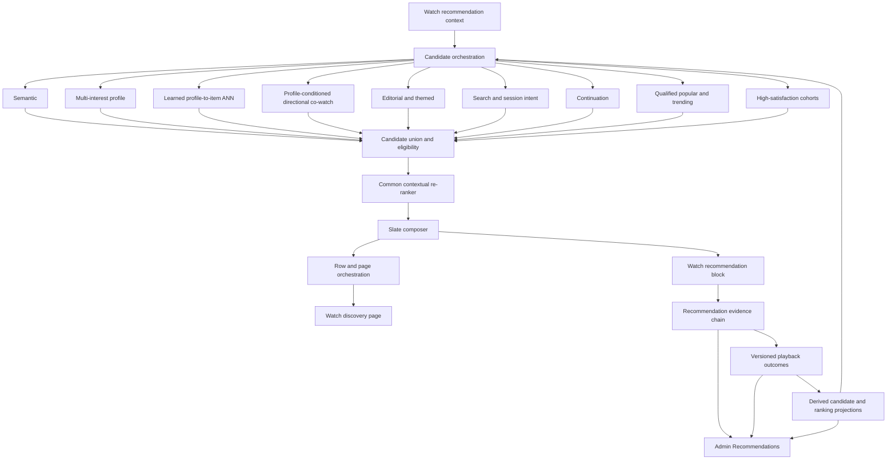
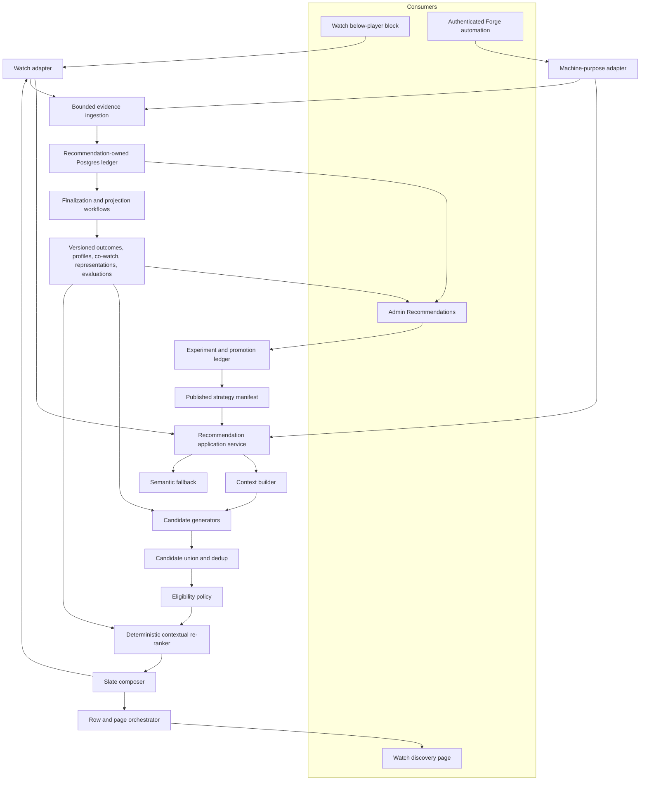

# Watch Recommendation Learning System - Plan

## Goal Capsule

- **Objective:** Establish the complete product contract for a production Watch recommendation system that begins with a semantic baseline, adds governed hybrid personalization, and can evolve toward learned viewer/item representations and personalized page orchestration through observable vertical slices.
- **Product authority:** This contract owns viewer and operator behavior, evidence requirements, candidate and ranking scope, signal-graduation policy, and the Admin proof required for every slice. Planning owns concrete schemas, interfaces, deployment topology, thresholds, and ticket decomposition within these boundaries.
- **Open blockers:** None block implementation planning. Statistical methods, metric thresholds, retention periods, jurisdiction-specific consent behavior, and rollout percentages are deferred to planning or later calibration without changing the product contract.
- **Product Contract preservation:** R1-R46 remain unchanged. R47-R50 append source-neutral preference evidence, explicit title feedback, learned representation, and page-orchestration contracts without weakening the settled semantic, consent, privacy, evidence, or fallback boundaries.
- **Execution profile:** Deliver in dependency order through independently verifiable roadmap tickets. Every ticket must produce a Watch, machine-caller, or operator outcome plus an Admin Evidence Gate.
- **Tail ownership:** The implementing agent owns migrations, generated GraphQL artifacts, focused tests, browser verification, operational notes, and ticket-local reconciliation proof. It must stop for a scope-changing product decision rather than invent one.

---

## Product Contract

### Summary

Forge will launch semantic recommendations below the Watch player as the control and last-known-good fallback, measure their full journey, and expose a bounded anonymous multi-interest profile challenger after its integrity, privacy, shadow, and rollback gates pass.
Each signal or recommendation strategy will move from collection to shadow evaluation, controlled exposure where eligible, and an explicit promote, revise, retire, or durable inconclusive decision that is visible in Admin with its reason and reevaluation condition.

### Problem Frame

Forge already has a pgvector-backed semantic recommendation path consumed by a Watch demo, but the production recommendations block is not hydrated and the current behavior is not personalized.
Admin-authored media collections already provide strong editorial sets, but their impressions and selections are not part of a Forge-owned recommendation evidence chain.

Search records partial result exposure and selection while playback records a separate one-time meaningful-playback event.
The ledgers do not preserve a durable request-to-playback lineage, most other Watch discovery surfaces do not record eligible impressions, and the current `30 seconds OR 25%` rule uses player position rather than finalized active attention.
Forge therefore cannot determine which recommendation source, ranking decision, placement, or acquisition path contributed to a useful outcome.

The long-term system needs semantic, behavioral, profile, editorial, intent, continuation, popularity, and satisfaction-aware candidates without shipping them as an inseparable bundle.
If several signals change together, the team cannot learn which one helped, harmed, or merely duplicated the semantic baseline.
The product needs a repeatable way to observe each signal in shadow, compare multi-outcome evidence, expose it safely, and retire it when it fails to demonstrate value.

### Key Decisions

- **Launch with semantic control plus a bounded anonymous-profile challenger.** (session-settled: user-directed — chosen over a semantic-only production launch: the first live baseline must produce real personalization and outcome evidence while retaining an attributable control.) Governs R1, R16-R18, R23-R25, R28, R35-R40.
- **Own normalized recommendation evidence.** (session-settled: user-directed — chosen over expanding `WatchEvent` and `WatchSearchEvent`: recommendation facts require independent semantics, lifecycle, recomputation, and erasure.) Governs R6-R14.
- **Serve recommendations in Watch and verify them in Admin.** (session-settled: user-directed — chosen over making Admin the recommendation product or placing its UI in the serving path: viewers use Watch while operators observe and control.) Governs R3, R4, R41-R44.
- **Require an Admin Evidence Gate for every vertical slice.** (session-settled: user-directed — chosen over backend-only completion: every delivered capability must prove its facts, derived result, and data quality.) Governs R41.
- **Evaluate every signal without promising to promote it.** (session-settled: user-directed — chosen over giving every collected signal a production weight: evidence may justify promotion, revision, or retirement.) Governs R24, R35-R37.
- **Judge value through multiple outcomes.** (session-settled: user-directed — chosen over optimizing meaningful watch or mission actions alone: operational engagement, mission value, reported value, longer-term value, and guardrails remain distinct.) Governs R12, R36.
- **Make anonymous profile persistence consent-aware.** (session-settled: user-directed — chosen over durable profiling by default and account-only persistence: session context can work immediately while cross-visit learning remains controllable.) Governs R16-R18.
- **Use hybrid promotion.** (session-settled: user-directed — chosen over fully manual or fully autonomous promotion: automation may stage and roll back an approved challenger while a person authorizes the permanent default.) Governs R37-R40, R43.
- **Treat view quality as a versioned derivation.** (session-settled: user-approved — chosen over treating one raw duration threshold as universal quality: raw playback evidence must remain recomputable for each use.) Governs R10-R13.
- **Treat RRF as a benchmark, not the final relevance model.** (session-settled: user-approved — chosen over using rank fusion as the final personalized ranker: it discards score magnitude, confidence, context, and outcome features.) Governs R24, R30-R32.
- **Reuse Forge's editorial collections.** (session-settled: user-approved — chosen over creating a second editorial recommendation system: existing Admin-authored sets remain the editorial authority.) Governs R5, R29.
- **Treat semantic multi-interest medoids as the first profile model, not the final definition of a viewer.** (session-settled: user-directed — chosen over freezing transcript similarity as the permanent personalization architecture: a later learned sequential profile/item space may improve retrieval only after source-neutral evidence, privacy, readiness, and shadow gates pass.) Governs R14, R16-R20, R23-R28, R32, R47-R49.
- **Separate one-slate composition from row and page orchestration.** (session-settled: user-directed — chosen over expanding the slate composer into a monolithic homepage model: row eligibility, row ordering, cross-row deduplication, and device-aware page budgets require distinct evidence and policy.) Governs R5, R8, R23-R35, R41-R44, R50.

The system has a delivery plane and an evidence plane joined by versioned attribution:



### Actors

- A1. **Anonymous viewer:** Uses Watch without an account and may grant consent for a durable first-party interest profile.
- A2. **Signed-in viewer:** Can carry consenting preferences, history, saved work, and recommendation controls across devices.
- A3. **Find-to-share or course builder:** Searches for content to share, organize, teach, or add to a course; a mission action may be more meaningful than a long personal watch.
- A4. **Authenticated machine caller:** Uses search or recommendation interfaces for an automated experience and does not contribute human satisfaction or profile evidence.
- A5. **Admin operator, editor, or researcher:** Authors editorial sets, inspects evidence, reviews experiments, approves permanent promotion, and rolls strategies back.
- A6. **Recommendation runtime:** Generates, ranks, composes, serves, attributes, and safely falls back between versioned strategies.
- A7. **Evaluation and promotion runtime:** Finalizes outcomes, evaluates approved challengers, advances bounded exposure, and performs automatic rollback.

### Requirements

**Production delivery and provenance**

- R1. The first live recommendation surface must render semantic recommendations below the production Watch player and carry the full evidence chain through its Admin proof.
- R2. Every recommendation response must identify its request, surface, strategy version, classifier version, and per-item candidate provenance through durable attribution carried into selection and playback.
- R3. Recommendation failure must never prevent the selected video from loading or playing, and the delivery plane must have a documented last-known-good fallback.
- R4. The Admin UI must remain outside the online recommendation serving path while the existing Admin backend may continue supplying Watch data through its public contracts.
- R5. Editorial content must support fixed authored order, ranking within an editor-approved pool, or pinned positions with personalized fill, and the selected policy must be visible rather than silently reordering authored narratives.

**Recommendation evidence and playback outcomes**

- R6. Acquisition, request, served item, eligible impression, selection, playback episode, content action, survey, integrity, experiment, and promotion facts must live in recommendation-owned normalized storage rather than extending the current Watch ledgers into generic event stores.
- R7. Canonical recommendation facts must use versioned contracts, stable identities, idempotent ingestion, bounded values, explicit retention, and deletion behavior.
- R8. Every click-bearing Watch surface must record its eligible visible impressions and selections with surface, block, placement, item, position, presentation, and available recommendation context.
- R9. Acquisition provenance, immediate discovery provenance, and candidate-generator provenance must remain independent so Google, a shared link, semantic search, and a later co-watch recommendation can all be represented in one journey.
- R10. Playback evidence must preserve attempt, successful start, manual or automatic play, active foreground time, elapsed time, duration, progress, completion, and end reason as raw facts.
- R11. Playback evidence must separately preserve pause, forward and backward seek, skip, replay, startup delay, buffering, playback error, subtitle use, audio-language changes, and re-entry where the platform can measure them reliably.
- R12. Content actions such as share, save, course-add, continuation, and reported value must remain separate outcomes rather than being collapsed into watch duration.
- R13. A finalized playback episode must produce a versioned `qualifiedView` decision and a continuous `viewQualityWeight` with contributing reasons while retaining every raw fact needed for recomputation.
- R14. Candidate generators and online ranking must consume bounded derived projections rather than querying raw playback events directly.
- R15. Semantic-search evidence must join request, eligible result impression, selection, successful playback, finalized outcome, reformulation, and available mission actions without treating every query as durable personal taste.

**Identity, intent, privacy, surveys, and integrity**

- R16. Session context may personalize the current visit immediately, but a durable anonymous profile must require the applicable personalization choice or consent and use a first-party opaque identifier rather than storing profile contents in the cookie.
- R17. Anonymous profiles must support reset, deletion, consent withdrawal, expiry, and an explicit optional merge into a signed-in profile without making the anonymous identifier a general account credential.
- R18. Long-term interests, current session intent, explicit persona or preferences, negative evidence, and account identity must remain distinct and must be editable or reset where they affect recommendations.
- R19. Human, anonymous, signed-in, machine, internal, test, and integrity-limited activity must remain distinguishable before evidence becomes eligible for profiles, co-watch edges, experiments, or training.
- R20. Integrity decisions must rely on reproducible behavior and manipulation evidence rather than viewpoint, preserving genuine criticism and negative survey responses.
- R21. Surveys must use versioned, localized, respectful sampling and expose response propensity, dismissal, and cohort coverage before reported value is generalized to non-responders.
- R22. Requests for profile information or persona selection must be optional and paired with immediate viewer value such as continuity, saved work, course tools, language preferences, or recommendation controls.

**Candidate-generation portfolio**

- R23. The portfolio must support independently measurable semantic, multi-interest profile, profile-conditioned directional co-watch, editorial or themed, search or session intent, continuation, qualified popular or trending, and high-satisfaction similar-interest cohort generators.
- R24. Every generator must retain source rank, source score, evidence, eligibility result, and rejection reason so source quotas, score normalization, and an RRF benchmark can be compared without losing provenance.
- R25. The first production launch must keep semantic candidates as the control and last-known-good fallback while exposing only an approved multi-interest profile challenger through bounded controlled exposure; every other generator begins in shadow and cannot affect viewers until its governed evaluation path permits exposure.
- R26. Directional co-watch must learn ordered `A → B` relationships from integrity-eligible qualified episodes and account for view-quality weight, distinct-viewer support, time gap, recency, confidence, and popularity-corrected lift.
- R27. Profile-conditioned co-watch must keep the population graph independently observable while using a viewer's interest clusters and session intent to select anchors, retrieve neighbors, and influence final ranking.
- R28. Multi-interest profiles must represent several long-term interests plus short-term session intent rather than averaging the viewer into one vector, and anonymous session profiles must remain useful when durable persistence is unavailable.
- R29. Editorial candidates must reuse Admin-authored media collections and preserve experience, section, authored position, policy, locale, and published-version provenance.

**Re-ranking and slate composition**

- R30. Candidate processing must follow a common sequence of source-aware union, eligibility and deduplication, feature hydration, contextual re-ranking, and final slate composition.
- R31. The first common re-ranker must be transparent and deterministic, preserve source contribution, and support comparison against the semantic-only control before a learned implementation is eligible.
- R32. A learned re-ranker may be introduced only after trustworthy impression, position, outcome, identity, and integrity evidence exists, and it must predict distinct outcomes rather than one opaque engagement score.
- R33. The slate composer must operate after item ranking to enforce playability, locale, deduplication, editorial policy, interest and source coverage, diversity, recent-ignore suppression, and familiar-versus-discovery balance.
- R34. Bounded exploration may enter the slate only through a versioned policy with logged assignment probabilities, exposure caps, safety constraints, and a deterministic fallback.

**Evaluation, experiments, and hybrid promotion**

- R35. Every signal, generator, ranking feature, classifier candidate, and composition policy must have a verifiable lifecycle of collect, derive, shadow, inspect, experiment where eligible, and promote, revise, retire, or durably conclude that evidence is inconclusive; retirement with conclusive evidence or an inconclusive result with a recorded reason and reevaluation condition completes the slice.
- R36. Promotion evidence must use a versioned, surface-specific multi-outcome policy covering operational engagement, mission actions, reported value, longer-term value, uncertainty, and guardrails rather than CTR or watch time alone.
- R37. Experiments must distinguish assignment from actual exposure, retain a semantic control, remain sticky for an eligible viewer or session, detect sample and attribution failures, and produce pass, fail, inconclusive, or data-unhealthy decisions.
- R38. Automation may advance a pre-approved challenger through bounded exposure stages and automatically return to the last-known-good strategy when a guardrail fails.
- R39. An authorized person must approve the permanent default, and automation must not redefine outcome classifiers, objective policies, integrity rules, traffic ceilings, or its own promotion authority.
- R40. Strategy, experiment, evaluation, exposure, promotion, rollback, and operator decisions must be immutable and auditable with the exact versions and evidence window that produced them.

**Admin evidence and operating model**

- R41. A vertical slice is complete only when its canonical facts, derived result, and data-quality state are visible and reconcilable in the authorized Admin Recommendations area.
- R42. Admin Recommendations must expose request traces, funnels, surface and block performance, acquisition, search outcomes, playback outcome distributions, profile and co-watch projections, candidate overlap and contribution, ranking, slate composition, experiments, promotions, integrity, privacy, and ingestion health as their slices land.
- R43. The hybrid-promotion workflow must teach the operator through plain-language readiness, a recommended next action, impact preview, permanent-default confirmation, rollback controls, and an audit trail without requiring statistical expertise.
- R44. Admin must distinguish zero activity from missing instrumentation, late outcomes, dropped or duplicate evidence, classifier lag, projection staleness, and insufficient experiment power.
- R45. The initial architecture must use Postgres as the operational authority, pgvector for available embedding retrieval, and durable background workflows for finalization, projection, evaluation, and promotion while keeping those implementations replaceable behind stable seams.
- R46. Evidence ingestion and serving must be asynchronous where appropriate, batch-capable, partition-friendly, deletion-aware, and resilient on low-bandwidth Watch clients; queues, warehouses, feature stores, or specialized vector systems graduate only when a measured constraint identifies their purpose.

**Representation and page evolution**

- R47. Every consent- and integrity-eligible finalized Watch outcome must be eligible for preference projection under one source-neutral policy regardless of recommendation, search, direct, shared-link, acquisition, or editorial discovery; source remains independent provenance and may be a versioned feature, never the eligibility gate.
- R48. Explicit title feedback must preserve distinct `more_like_this`, `not_for_me`, `hide_title`, `already_watched`, and `reset_influence` meanings, support undo and deletion, and never infer one action from completion, short playback, or another action.
- R49. The portfolio may add a shared learned sequential profile/item representation only as a versioned, privacy-fenced projection that consumes recommendation-owned eligible evidence, publishes bounded profile and item embeddings for ANN retrieval, retains semantic medoids as control/fallback, and begins in shadow behind a data-readiness decision.
- R50. Personalized Watch discovery pages must treat typed row generation, row eligibility, within-row title ranking/composition, row selection/order, cross-row deduplication/diversity, and device-aware presentation as separately attributable decisions; the first row/page policy is deterministic and learned row ordering requires later page-level exposure evidence.

### Vertical Slice Portfolio

Every row is a separately verifiable roadmap candidate governed by R41.
This is the accepted product capability portfolio. The dependency-correct implementation order is owned by the Planning Contract and Implementation Units below; it deliberately introduces the common candidate seam before non-semantic generators.

| Order | Vertical slice                            | Viewer or operator outcome                                                                                                             | Minimum Admin proof                                                                                                                                 | Depends on                                           |
| ----: | ----------------------------------------- | -------------------------------------------------------------------------------------------------------------------------------------- | --------------------------------------------------------------------------------------------------------------------------------------------------- | ---------------------------------------------------- |
|     1 | Production semantic tracer                | A viewer sees semantic recommendations below the player and can select and watch one without affecting playback reliability.           | One trace joins request, served item, eligible impression, selection, successful start, finalized outcome, classifier version, and data quality.    | Existing semantic demo path                          |
|     2 | Active-playback proxy evidence            | Operators compare observable foreground-playing intervals with elapsed time and player position without inferring cognitive attention. | Duration-stratified active-time distributions, missingness, finalization lag, and comparison with the legacy rule.                                  | Slice 1                                              |
|     3 | Playback navigation signals               | Pause, seek, skip, replay, progress, completion, and end reason can be evaluated independently.                                        | Per-signal coverage and outcome distributions with classifier contribution and ambiguity visible.                                                   | Slices 1-2                                           |
|     4 | Playback quality of experience            | Startup delay, buffering, and playback errors cannot masquerade as content rejection.                                                  | Start-success and QoE funnels by device, network context, video, and recommendation strategy.                                                       | Slice 1                                              |
|     5 | Subtitle and audio behavior               | Language and accessibility interactions can inform context without being treated as satisfaction alone.                                | Subtitle and audio-change coverage, timing, locale breakdown, and downstream-outcome comparison.                                                    | Slices 1-2                                           |
|     6 | Mission-value actions                     | Share, save, course-add, continuation, and related actions become distinct attributable outcomes.                                      | Action funnels from impression and playback with source, surface, intent, and join-failure evidence.                                                | Slice 1                                              |
|     7 | All-surface impression and CTR            | Editors can compare eligible exposure and selection across every click-bearing Watch block.                                            | Surface, block, placement, position, presentation, impressions, selections, CTR, and instrumentation gaps.                                          | Slice 1                                              |
|     8 | Acquisition and shared-link attribution   | Google, Forge shares, campaigns, partners, referrals, and direct visits remain visible through later discovery and playback.           | Acquisition-to-outcome funnels with unknown rate and independent discovery and candidate provenance.                                                | Slices 1, 6-7                                        |
|     9 | Semantic-search downstream outcomes       | Search owners see whether an exposed and selected result leads to playback, value, or reformulation.                                   | Query-request, eligible-impression, selection, playback, mission-action, reformulation, and unmatched-event views.                                  | Slices 1-8                                           |
|    10 | Consent-aware anonymous continuity        | Session personalization works immediately and consenting viewers can retain or reset an anonymous profile.                             | Session versus durable-profile coverage, consent transitions, reset, deletion, expiry, and merge health.                                            | Slices 1-2                                           |
|    11 | Intent and explicit profile controls      | Viewers may state a current purpose or preferences and receive immediate, reversible value.                                            | Prompt adoption, edits, resets, missingness, declared-versus-inferred context, and outcome differences.                                             | Slices 9-10                                          |
|    12 | Integrity and training eligibility        | Manipulative, machine, internal, and test activity is separated without suppressing authentic negative feedback.                       | Reason-coded exclusions and caps, before-and-after metrics, anomaly concentrations, and eligible evidence counts.                                   | Slices 1-11                                          |
|    13 | Reported-value surveys                    | A respectful sample can validate behavioral proxies and mission outcomes.                                                              | Assignment, response, dismissal, latency, localization, cohort balance, response propensity, and proxy calibration.                                 | Slices 2-6, 10-12                                    |
|    14 | Experiment assignment and evaluation      | Approved challenger strategies can be compared with semantic-only using actual exposure and multi-outcome evidence.                    | Experiment registry, assignment-versus-exposure, sample checks, uncertainty, outcomes, guardrails, and terminal decision.                           | Slices 1-13                                          |
|    15 | Hybrid promotion and rollback             | Automation can stage and roll back approved challengers while a person controls the permanent default.                                 | Rollout state, readiness explanation, exposure history, automatic decisions, operator approvals, fallback, and kill switch.                         | Slice 14                                             |
|    16 | Multi-interest profile candidates         | Anonymous session interests and consenting durable interests produce profile candidates in shadow and controlled exposure.             | Interest-cluster evidence, candidate coverage, novelty, overlap, consent cohort, counterfactual slate, and experiment result.                       | Slices 10-15                                         |
|    17 | Profile-conditioned directional co-watch  | Qualified ordered viewing behavior produces independently observable co-watch candidates personalized by current interests.            | Edge direction, support, lift, confidence, decay, quality weight, anchor interest, contamination checks, and experiment result.                     | Slices 2, 10, 12, 14-16                              |
|    18 | Editorial candidate source                | Existing themed sets can remain fixed, form an approved pool, or provide pinned positions without losing authorial provenance.         | Experience, section, authored position, policy, published version, candidate contribution, and outcome comparison.                                  | Slices 7, 14-15                                      |
|    19 | Search and session-intent candidates      | Current query and session behavior can retrieve candidates without becoming permanent taste by default.                                | Intent evidence, candidate coverage, expiry, profile separation, overlap, and experiment result.                                                    | Slices 9-15                                          |
|    20 | Continuation candidates                   | Resume, series, course, and authored sequence candidates can be distinguished from fresh discovery.                                    | Continuation reason, sequence authority, manual versus automatic transition, coverage, and experiment result.                                       | Slices 6-7, 14-15                                    |
|    21 | Qualified popular and trending candidates | Popularity reflects integrity-eligible, quality-weighted outcomes rather than raw plays.                                               | Support, time window, decay, locale, popularity concentration, quality components, and experiment result.                                           | Slices 2-6, 12, 14-15                                |
|    22 | High-satisfaction cohort candidates       | Videos with strong outcomes among similar-interest cohorts can be evaluated without exposing unsafe small groups.                      | Cohort eligibility, suppression, confidence, candidate provenance, popularity correction, and experiment result.                                    | Slices 10, 12-16, 21                                 |
|    23 | Candidate union and eligibility           | Multiple generators form one explainable candidate pool without losing source evidence.                                                | Source coverage, overlap, contribution, normalized scores, quotas, RRF benchmark, rejections, latency, and fallbacks.                               | Slices 16-22                                         |
|    24 | Transparent contextual re-ranker          | Candidate order responds to viewer, session, surface, provenance, and outcome features through an inspectable baseline.                | Per-feature score explanation, source contribution, cohort behavior, counterfactual order, and semantic-only comparison.                            | Slice 23                                             |
|    25 | Slate composer                            | The final block balances relevance, editorial intent, interests, sources, diversity, and recent exposure.                              | Pre- and post-composition order, removals, diversity, coverage, pins, policy version, and outcome comparison.                                       | Slices 18, 23-24                                     |
|    26 | Learned multi-outcome re-ranker           | A learned challenger predicts distinct outcomes and competes against the transparent ranker.                                           | Training eligibility, feature health, calibration by outcome, shadow comparison, experiment result, and fallback use.                               | Slices 13-15, 23-25                                  |
|    27 | Bounded exploration                       | Underexposed candidates receive limited, attributable exposure without escaping product guardrails.                                    | Assignment probability, cap use, long-tail coverage, outcomes, integrity, guardrail breaches, and automatic fallback.                               | Slices 14-15, 25-26                                  |
|    28 | Privacy and scale graduation              | The system remains erasable, understandable, reliable, and affordable as evidence and traffic grow.                                    | Retention and deletion exercises, access audits, storage growth, ingestion SLOs, backlog, serving latency, and evidence for infrastructure changes. | Applies throughout; formal review after prior slices |
|    29 | Learned profile and item representations  | Eligible sequences and catalog evidence produce a shared, versioned retrieval space without replacing the semantic profile baseline.   | Readiness, snapshot lineage, drift, ANN quality, semantic overlap, privacy fencing, latency, fallback, deletion, and terminal decision.             | Slices 2, 10, 12, 16-17, 27-28                       |
|    30 | Personalized row and page orchestration   | Watch presents a deterministic device-aware set of typed rows with explainable within-row and cross-row decisions.                     | Candidate/selected rows, row and item order, cross-row dedupe/diversity, exposure, device policy, fallback, latency, and terminal decision.         | Slices 7, 18, 20-21, 25, 28                          |

<!-- ce-section: work-relationships -->

### How This Work Fits Together

This contract owns the recommendation learning program as one coherent capability; the slice portfolio is the current product sequence and may be refined by planning without changing the Admin Evidence Gate.

- **Semantic spine and outcome truth**
  - Enables Slices 1-9 by establishing the production surface, attribution chain, playback interpretation, discovery exposure, acquisition, and search outcomes.
- **Identity, reported value, and defensibility**
  - Depends on the evidence chain and enables Slices 10-13 through consent-aware identity, intent, integrity, and surveys.
- **Controlled learning**
  - Depends on trustworthy outcomes and enables Slices 14-15 through exposure-aware experiments and hybrid promotion.
- **Candidate signal ladder**
  - Depends on controlled learning and introduces each candidate source independently in Slices 16-22.
- **Ranking and composition**
  - Depends on the candidate portfolio and advances from transparent union and ranking to slate composition, learned ranking, and bounded exploration in Slices 23-27.
- **Learned representation evolution**
  - Depends on source-neutral eligible sequences, the existing profile/co-watch projections, and bounded exploration evidence. Slice 29 adds a reusable profile/item retrieval space while semantic medoids remain the inspectable control and fallback.
- **Row and page orchestration**
  - Depends on typed candidate sources and the one-slate composer. Slice 30 selects and orders rows, deduplicates across them, and adapts presentation to device without moving source or item-ranking authority into one monolith.
- **Privacy and scale graduation**
  - Shares every stage through retention, erasure, access control, reliability, cost, and the infrastructure review in Slice 28; the checkpoint repeats when Slices 29-30 introduce new projections and page-level serving load.

### Key Flows

- F1. **Semantic recommendation to verified outcome**
  - **Trigger:** A1 or A2 opens a production Watch page with an eligible below-player recommendation block.
  - **Actors:** A1 or A2, A5, A6, A7
  - **Steps:** Forge serves semantic candidates, records eligible exposure and selection, preserves attribution into playback, finalizes the episode, derives versioned outcomes, and shows the reconciled trace in Admin.
  - **Outcome:** The first live strategy is available to viewers and measurable end to end; incremental viewer value remains unclaimed until evaluated against a comparator.
  - **Covers:** R1-R4, R6-R15, R41-R44
- F2. **New signal enters the ladder**
  - **Trigger:** A signal owner proposes a playback, profile, candidate, ranking, or composition signal.
  - **Actors:** A5, A6, A7
  - **Steps:** Forge collects and validates the signal, derives a versioned projection, runs it in shadow, exposes its quality and counterfactual behavior in Admin, and records a promote, revise, retire, or inconclusive result.
  - **Outcome:** Collection does not silently become production influence.
  - **Covers:** R7, R13-R14, R24, R35-R37, R41-R44
- F3. **Anonymous viewer controls profile persistence**
  - **Trigger:** A1 begins a session, makes the applicable personalization choice, resets personalization, withdraws consent, signs up, or requests deletion.
  - **Actors:** A1, A2, A5, A6
  - **Steps:** Session context remains usable, durable persistence follows the active choice, profile state can reset or expire, and any account merge is explicit and auditable.
  - **Outcome:** Personalization provides continuity without turning an anonymous cookie into an account credential.
  - **Covers:** R16-R18, R22, R41-R44
- F4. **Candidate generator competes with semantic control**
  - **Trigger:** A candidate generator has sufficient integrity-eligible shadow evidence.
  - **Actors:** A5, A6, A7
  - **Steps:** Admin shows coverage, provenance, overlap, novelty, diversity, and projected outcomes; an approved experiment exposes a bounded cohort; the evaluator produces a versioned multi-outcome decision.
  - **Outcome:** The generator earns greater influence, returns for revision, remains inconclusive, or is retired.
  - **Covers:** R23-R29, R35-R37, R41-R44
- F5. **Hybrid automatic promotion**
  - **Trigger:** An approved challenger passes the next stage's evaluation contract.
  - **Actors:** A5, A6, A7
  - **Steps:** Automation advances bounded exposure, continues monitoring, rolls back on guardrail failure, explains the decision in Admin, and waits for a person before permanent-default promotion.
  - **Outcome:** Routine progression and emergency rollback are automatic while permanent product authority stays human.
  - **Covers:** R36-R40, R43-R44
- F6. **External acquisition or semantic search to value**
  - **Trigger:** A viewer arrives through Google, a Forge share, a referral, direct navigation, or selects a semantic-search result.
  - **Actors:** A1-A4, A5, A6
  - **Steps:** Forge retains acquisition, discovery, and candidate provenance independently, links eligible exposure to playback and mission actions, and excludes machine behavior from human learning where required.
  - **Outcome:** Search and acquisition can improve without overwriting recommendation causality or personal taste.
  - **Covers:** R2, R8-R9, R12, R15, R19, R41-R44
- F7. **Editorial set enters personalized delivery**
  - **Trigger:** A5 enables an Admin-authored collection for a recommendation surface.
  - **Actors:** A5, A6
  - **Steps:** The editor chooses fixed order, approved-pool ranking, or pinned fill; Forge retains authored provenance; the re-ranker and composer obey the policy; Admin compares positions and outcomes.
  - **Outcome:** Personalization augments editorial intent without silently rewriting it.
  - **Covers:** R5, R29-R33, R41-R44
- F8. **Eligible sequence becomes a learned retrieval projection**
  - **Trigger:** Source-neutral preference evidence, the semantic-medoid profile, and item/co-watch features meet a recorded data-readiness gate.
  - **Actors:** A1-A2, A5-A7
  - **Steps:** Background training builds point-in-time profile and item representations, validates and atomically publishes a privacy-fenced generation, evaluates profile-to-item ANN candidates in shadow, and preserves semantic medoids as control/fallback.
  - **Outcome:** Forge gains a reusable learned retrieval signal without reading raw history online or making the model authoritative for evidence, identity, consent, or item truth.
  - **Covers:** R14, R16-R20, R23-R28, R35-R49
- F9. **Typed rows become a device-aware Watch page**
  - **Trigger:** Watch requests a discovery page with eligible continuation, interest, popular/trending, editorial, or discovery row sources.
  - **Actors:** A1-A2, A5-A6
  - **Steps:** Forge proposes typed rows, filters row eligibility, ranks/composes titles inside each row, selects and orders rows, applies cross-row deduplication/diversity and device budgets, then records row/item exposure and selection.
  - **Outcome:** The page is explainable at both row and title level, while each source and the one-slate composer retain their own authority.
  - **Covers:** R5, R8, R23-R35, R41-R44, R50

### Acceptance Examples

- AE1. **Covers R1-R4, R6-R15, R41-R44.** Given a viewer sees the first semantic recommendation card and selects it, when playback starts and later ends, then Admin can reconcile the request, impression, selection, successful start, raw episode, classifier version, derived outcome, and any missing or late evidence.
- AE2. **Covers R8, R41-R44.** Given a recommendation is returned but remains below the viewport, when no visibility policy is satisfied, then it is not counted as an eligible impression and Admin distinguishes the returned candidate from an exposure.
- AE3. **Covers R9, R15.** Given a viewer arrives from Google, performs semantic search, selects a result, and later selects a co-watch recommendation, when the journey is inspected, then acquisition, search discovery, and co-watch candidate provenance remain separate and joinable.
- AE4. **Covers R10-R13.** Given a viewer seeks past the current meaningful-playback position and exits, when the episode is finalized, then the raw seek and active-time facts remain visible and a classifier cannot claim equivalent active consumption merely from player position.
- AE5. **Covers R16-R18, R22.** Given an anonymous viewer declines durable personalization, when they continue watching in the same session, then session intent may adapt while no cross-visit interest profile is retained.
- AE6. **Covers R19-R21.** Given a genuine viewer reports a negative experience or criticism, when integrity and survey evidence are processed, then the response remains eligible unless reproducible manipulation behavior—not viewpoint—justifies exclusion or capping.
- AE7. **Covers R25-R28, R35-R37.** Given a profile, co-watch, or later generator remains in shadow, when Watch serves the semantic control for an unassigned session, then Admin shows its counterfactual candidates and reasons without allowing it to change the live slate.
- AE8. **Covers R26-R28.** Given a viewer has several interest clusters, when directional co-watch retrieval runs, then the population edge remains inspectable and the chosen anchors reveal which current or long-term interest affected candidate retrieval.
- AE9. **Covers R35-R40.** Given a signal improves CTR but harms qualified outcomes or a guardrail, when its experiment completes, then it does not graduate and its conclusive retirement satisfies the slice's decision requirement.
- AE10. **Covers R37-R40, R43-R44.** Given an approved challenger passes a bounded stage, when automation raises exposure, then Admin explains the evidence and next stage; if a guardrail later fails, traffic returns to the last-known-good strategy without waiting for a person.
- AE11. **Covers R5, R29-R33.** Given an editor marks a collection as fixed order, when its videos enter the recommendation pipeline, then neither the re-ranker nor slate composer changes that authored sequence.
- AE12. **Covers R32-R34.** Given a learned re-ranker or exploration policy cannot load, when a recommendation is requested, then the request falls back to the last eligible deterministic strategy and the fallback is visible in Admin.
- AE13. **Covers R47.** Given two consented, integrity-eligible viewers produce equivalent qualified outcomes after recommendation and direct/shared discovery, when preference projection runs, then both outcomes pass the same eligibility policy while their distinct source provenance remains inspectable.
- AE14. **Covers R18, R48.** Given a viewer marks one title `not_for_me` and another `already_watched`, when the next request is composed, then the first changes preference influence, the second changes completion/continuation state, and either action can be undone without treating short playback as an equivalent signal.
- AE15. **Covers R14, R49.** Given a learned profile/item generation is missing, stale, withdrawn, deleted, or fails its shadow/readiness gate, when ANN retrieval is requested, then semantic medoids remain available and Admin exposes the reason without raw vectors or history.
- AE16. **Covers R8, R33, R41-R44, R50.** Given the same video is nominated into several eligible rows, when a constrained mobile page is orchestrated, then the deterministic policy keeps required editorial/continuation authority, removes or refills duplicates with reasons, and reconciles row and item exposure separately.

### Success Criteria

- The first production slice proves the complete chain `request → served item → eligible impression → selection → successful start → finalized outcome → versioned classification → Admin reconciliation` without making recommendation collection a playback dependency.
- The production launch keeps semantic as a measurable control and exposes the approved profile challenger to a bounded eligible cohort without increasing the 1.5-second recommendation response contract.
- Every signal family and candidate generator named in this contract has an Admin-verifiable vertical slice and an explicit promote, revise, retire, or inconclusive decision path.
- No production strategy is judged solely by CTR, elapsed watch time, completion, or a universal meaningful-watch threshold.
- Operators can understand why a strategy is or is not ready, preview the next exposure change, approve the permanent default, and restore the last-known-good version without specialist statistical knowledge.
- Profile, experiment, and training evidence excludes ineligible machine, test, or manipulation activity while preserving authentic negative feedback.
- Equivalent consented qualified outcomes can influence preferences regardless of discovery source, and explicit title actions retain distinct reversible meanings.
- Learned profile/item retrieval can be evaluated and rolled back independently of semantic medoids, ranking, and page orchestration.
- Operators can explain row choice, row order, title order, cross-row removals, and device policy for a personalized Watch discovery page.
- A planner can decompose the portfolio into tickets without inventing the actors, signal semantics, promotion behavior, evidence gate, or product success model.

### Scope Boundaries

- The first delivery roadmap owns Watch web and the Admin Recommendations area; mobile and TV adoption are deferred while the contracts remain portable.
- This contract does not promise that every evaluated signal becomes a production feature or ranking weight.
- This contract does not define one universal duration threshold as satisfaction, mission success, or the permanent meaning of a qualified view.
- Raw playback facts do not become direct online candidate queries, and recommendation events do not turn the current Watch ledgers into generic stores.
- The Admin UI does not serve recommendations, although the existing Admin backend may remain part of Watch's data path.
- A separate vector database, Kafka, warehouse, feature store, real-time model-training platform, or reinforcement-learning stack is not required before a measured constraint establishes its role.
- Automatic promotion cannot change success definitions, integrity policy, privacy policy, permanent-default authority, or deploy arbitrary unapproved code or models.
- User criticism, disagreement, or negative survey responses are not detractor classifications and cannot by themselves make a person ineligible.
- Canceled FPMC and two-tower roadmap artifacts are historical idea sources rather than active implementation authority.
- A learned profile/item representation is a future projection and candidate source, not permission to replace semantic fallback, raw evidence, consent/integrity policy, independently inspectable co-watch truth, or the multi-outcome re-ranker.
- The recommendation slate composer owns one final list; page-level row selection and cross-row policy remain a separate orchestration layer.

### Dependencies and Assumptions

- The current pgvector semantic recommendation path is a usable baseline, but planning must wire it from the demo into the production below-player surface.
- Existing Admin-authored media collections remain the editorial source of truth and can supply fixed or bounded candidate pools.
- Traffic may be insufficient for some experiments; `inconclusive` is a valid durable result and must not be coerced into promotion or failure.
- Applicable privacy review may require different consent presentation or persistence behavior by jurisdiction while preserving the consent-aware product rule.
- Video embeddings, locale availability, playability, catalog relationships, and authored ordering remain available as upstream candidate and eligibility inputs.
- Public industry evidence supports multi-stage retrieval, contextual ranking, slate composition, and multi-outcome evaluation but does not disclose a universal algorithm, feature set, or meaningful-watch threshold that Forge can copy.
- The first learned representation proceeds only after the ticket records adequate eligible sequence volume, catalog coverage, privacy readiness, offline evaluation, serving cost, and a defensible shadow comparator.

### Planning Questions Resolved Below

These product questions do not block execution. KTD1-KTD24 and the Verification Contract resolve their implementation mechanism while keeping configurable policy values visible and versioned.

- What exact recommendation-owned schemas, event contracts, and retention windows satisfy R6-R14 and R46?
- Which visibility policy defines an eligible impression for each Watch presentation without conflating rendering with exposure?
- Which initial classifier candidates and contribution explanations should Admin compare before any proxy becomes eligible for co-watch, profiles, reporting, or training?
- Which statistical method, evidence-maturity window, cohort checks, and minimum sample rules implement pass, fail, inconclusive, and data-unhealthy decisions?
- What exposure stages, traffic ceilings, and emergency guardrails implement hybrid promotion for the initial traffic level?
- How should each surface version its multi-outcome utility policy while preserving comparable raw outcomes?
- Which consent presentation, expiry, reset, merge, export, and erasure behavior is required in each operating jurisdiction?
- What serving latency and ingestion reliability budgets protect low-bandwidth Watch clients and trigger later infrastructure graduation?

### Sources and Research

- `docs/research/recommendation-candidate-generation-and-reranking.md` — primary-source research and Forge-specific conclusions for candidate retrieval, profile-conditioned co-watch, re-ranking, and slate composition.
- `apps/admin/src/services/scene-recommendations-retriever.ts` and `apps/web/src/lib/recommendations.ts` — current semantic retrieval and Watch consumption path.
- `apps/web/src/components/sections/index.tsx` — production recommendations block currently awaits hydration.
- `apps/admin/src/domain/blocks.ts` and `apps/web/src/components/sections/MediaCollection.tsx` — existing editorial media-collection authority and Watch rendering.
- `apps/admin/prisma/schema.prisma`, `apps/web/src/components/watch/WatchEventRecorder.tsx`, and `apps/web/src/lib/search-actions.ts` — current unjoined playback and search evidence.
- `apps/admin/src/workflows/searchTraceRetention.ts` and `apps/admin/src/services/search-trace-retention/job.ts` — current durable background-workflow and scheduler pattern.
- `docs/roadmap/content-discovery/feat-090-watch-event-collection.md`, `feat-091-fpmc-video-page-recommendations.md`, and `feat-092-two-tower-neural-recommendations.md` — canceled historical designs that require replanning against the current architecture.
- [YouTube two-stage candidate generation and ranking](https://research.google/pubs/deep-neural-networks-for-youtube-recommendations/) and [YouTube multi-task ranking](https://research.google/pubs/recommending-what-video-to-watch-next-a-multitask-ranking-system/) — public evidence for retrieval/ranking separation and multiple objectives.
- [Amazon's recommendation-algorithm history](https://www.amazon.science/the-history-of-amazons-recommendation-algorithm) and [Prime Video page composition](https://www.amazon.science/publications/customer-long-term-propensity-driven-prime-video-page-composition) — item-to-item behavioral retrieval, popularity correction, diversity, and controlled experimentation.
- [Netflix recommender system architecture](https://doi.org/10.1145/2843948) and [Netflix recommendation foundation model](https://netflixtechblog.com/foundation-model-for-personalized-recommendation-1a0bd8e02d39) — specialized retrieval/ranking, page composition, member/entity representations, and cold-start metadata.
- [Netflix recommendation controls and inputs](https://help.netflix.com/en/node/100639), [foundation-model integration into personalization applications](https://netflixtechblog.com/integrating-netflixs-foundation-model-into-personalization-applications-cf176b5860eb), and [personalized homepage learning](https://netflixtechblog.com/learning-a-personalized-homepage-aa8ec670359a) — recent history weighting, reusable member/item representations, specialized downstream applications, and separate row/title/page decisions.
- [LinkedIn multi-source candidate generation](https://www.linkedin.com/blog/engineering/recommendations/candidate-generation-in-a-large-scale-graph-recommendation-system-people-you-may-know), [Pinterest PinnerSage](https://medium.com/pinterest-engineering/pinnersage-multi-modal-user-embedding-framework-for-recommendations-at-pinterest-bfd116b49475), and [Spotify intent and satisfaction](https://research.atspotify.com/2021/07/user-intents-and-satisfaction-with-slate-recommendations) — generator provenance, multi-interest profiles, and intent-conditioned evaluation.

## Planning Contract

### Key Technical Decisions

- KTD1. **Admin owns a recommendation domain with normalized Postgres tables.** (session-settled: user-directed — chosen over adding columns to `WatchEvent` and `WatchSearchEvent`: recommendation evidence has independent validation, recomputation, retention, and erasure semantics.) The data-boundary table below is the target logical domain, not a requirement to create every model in U1. Each unit adds only the normalized tables it uses. Keep the legacy ledgers as compatibility inputs only. Governs R6-R14, R40, R45-R46.
- KTD2. **Server-known facts are canonical; browser facts are correlated supplemental evidence.** Admin commits the request and complete ordered served-item set in one transaction before returning an envelope. Watch submits visibility, selection, and playback facts with short-lived signed tokens bound to request, item, session or actor class, surface, strategy, allowed event kinds, nonce, audience, and key version. An event ID identifies one immutable payload digest: identical replay succeeds, conflicting replay is quarantined and counted, and late out-of-order evidence remains valid. Public ingestion enforces same-origin/CORS and CSRF policy, pre-parse byte and event-count limits, bounded timestamps, provisional learning ineligibility, rate and contribution caps, and visible loss, conflict, replay, and lateness health. Tokens never enter URLs, referrers, logs, or telemetry. Governs R2-R3, R7-R15, R19, R41-R46.
- KTD3. **A new versioned recommendation envelope wraps the existing semantic retriever without replacing its compatibility API.** Preserve the transcript-backed pgvector retrieval, locale and playability rules, parent/child exclusions, and video deduplication. Keep `sceneRecommendations` available while Watch adopts the new envelope. Return a unique request envelope with strategy and candidate provenance outside shared `unstable_cache` state. Cache only content- and version-keyed candidate pools; mint fresh request identity and evidence tokens per delivery and recheck cached candidates for locale and playability. Never cache a viewer-specific slate. Governs R1-R5, R23-R25, R30-R31, R45.
- KTD4. **Production Watch inserts the first semantic block automatically.** (session-settled: user-approved — chosen over requiring an editor to author the first block on every page: the production baseline needs consistent eligible exposure.) Hydrate a synthetic below-player block on eligible Watch video routes through generated Admin GraphQL operations and same-origin server boundaries; Web never imports Admin internals. It loads lazily and never delays the player. The fallback ladder is reason-coded: use the pinned semantic manifest when a later stage fails; use a version-compatible cached semantic pool when fresh retrieval fails; otherwise render unavailable/empty. Every state records its effective manifest and renders explicit loading, timeout, fallback, and instrumentation-degraded behavior. Editorial collections remain separate candidate authority. Governs R1, R3-R5, R41-R44, R46.
- KTD5. **A versioned surface registry owns eligible-impression policy.** Each click-bearing Watch presentation declares its surface, block, placement, presentation, viewport and dwell policy, and identity fields. A shared `IntersectionObserver` primitive records one eligible impression per item exposure window and distinguishes served, rendered, visible, obscured, repeated, and selected states. Governs R8-R9, R15, R37, R41-R44.
- KTD6. **Playback is a source-neutral append-only episode state machine finalized by a durable workflow.** Every eligible Watch arrival receives a server playback context bound to media and operational session; recommendation, search, share, acquisition, editorial, or direct discovery remains optional provenance. The context exchanges for a narrowly scoped episode token with a bounded late-event horizon. Immutable facts preserve attempt, start, exact foreground-playing intervals, pause source, seeks, skips, replay, re-entry, route exit, media/language changes, QoE, error, end, timeout, and late evidence. Active time unions the exact intervals so overlap, replay, wall-clock delay, player position, seeking, hidden time, and background time cannot inflate it. Each outcome revision cites one classifier version, exact input watermark and digest, supersedes rather than mutates prior output, and publishes with generation fencing. The first tracer retains the legacy `30 seconds OR 25%` position rule as `legacy-position-v0` only for comparison. `active-watch-proxy-v1` remains observable proxy evidence with a per-proxy readiness decision, not attention, satisfaction, or permission for live ranking use. Governs R10-R14, R21, R26, R32, R36.
- KTD7. **Recommendation identity is separate from Mux and legacy progress identity.** Use an ephemeral session identifier immediately. After the applicable personalization choice or consent, issue a host-only `Secure`, `HttpOnly`, `SameSite` pseudonym and rotate it on consent changes, authentication, merge, or suspected compromise. Persist only a one-way digest of the raw cookie value and exclude the raw value from logs, traces, telemetry, and URLs. Token possession can support same-origin personalization and reset/withdraw/delete, but detailed export, raw inspection, and account merge require authenticated ownership and step-up verification. Store profile state server-side; use an idempotent canonical-identity and alias ledger rather than copying evidence during merge. A withdrawal/delete transition synchronously revokes tokens, increments a privacy generation, and fences stale projection publication before asynchronous erasure proceeds. Do not reuse the cross-visit `viewer-id` or anonymous watch-progress storage as profile consent. Governs R16-R18, R22, R41-R46.
- KTD8. **Authenticated machine callers share the recommendation core through a purpose-aware adapter.** (session-settled: user-approved — chosen over a second machine-only ranker: shared retrieval and eligibility prevent policy drift.) The initial adapter supports Forge's internal authenticated automation. Server-side credential configuration derives caller identity, environment, allowed purposes, catalog scope, and quota before retrieval. Credentials are audience-bound, hashed at rest, rotatable, revocable, and redacted. Request IDs, idempotency keys, pagination, caches, and receipts are caller-bound. Machine facts remain ineligible for human profiles, co-watch, surveys, experiments, satisfaction, and training. External partner credentials are deferred. Governs R2, R7, R12, R19, R24, R30-R32, R41-R45.
- KTD9. **The common candidate seam lands before any non-semantic generator.** A side-effect-free bounded generator returns nominations with source evidence, canonical video identity, playable locale/dub presentation, intent-specific action such as scene start or resume offset, and editorial fixed/pinned constraints. Union groups nominations without discarding source contributions; centralized hydration and eligibility select the playable presentation before deterministic contextual scoring and minimal composition. Orchestration owns deadlines, persistence, and fallback. Every generator declares supported surfaces and task purposes and returns source rank, score, evidence, and rejection reasons. RRF is retained only as a comparison benchmark. Governs R23-R31, R41-R45.
- KTD10. **Each generator enters through a generic shadow projection.** Shadow runs use the same request context and eligibility policy as live serving but cannot change the viewer slate. Store bounded counterfactual candidates and aggregate coverage, overlap, novelty, latency, eligibility, and cohort quality. A generator ticket ends with a durable promote-to-experiment, revise, retire, or inconclusive decision. A controlled-exposure ticket may be pre-scoped, but it cannot activate until the shadow decision makes the generator eligible. Governs R23-R29, R35-R37, R41-R44.
- KTD11. **Experiments and promotion use an immutable Admin business ledger.** Store strategy identity separately from immutable payload/version identity. One experiment/version has one assignment per eligible unit, created with its exact probability and configuration digest before response; exposure refers to that assignment. Evaluations append immutable revisions with closed event-time windows, ingestion watermarks, outcome and eligibility versions, and input digests. Late evidence creates a superseding evaluation; a material guardrail change triggers explicit review or automatic rollback under the governing policy. Guardrail failure blocks promotion, CTR cannot override qualified-outcome or mission-value harm, and unresolved conflicts are inconclusive. Promotion/rollback event and active-strategy compare-and-swap commit in one transaction. Separate viewer, experiment-operation, workflow, rollback, and permanent-approval principals; permanent approval requires recent authentication, while emergency rollback remains independently authorized. Governs R35-R40, R43-R45.
- KTD12. **Admin Recommendations is decision-first and permission-separated.** Reuse the server-rendered dashboard and request-detail patterns. Add distinct permissions for aggregate evidence, privacy-safe trace inspection, experiment operation, integrity review, rollback, and permanent-default approval. Admin must show canonical facts, derived projections, freshness, missingness, duplicates, loss, lag, and zero-activity states without exposing raw viewer profiles or secrets. Governs R4, R19-R22, R37-R44.
- KTD13. **Durable workflows finalize and project; they do not own business truth.** Create business-ledger truth before dispatch and attach workflow identity afterward. Build each projection into an unpublished immutable generation with source windows, watermarks, classifier, integrity and consent generations, code/build and input digests. Validate it, then switch the active pointer atomically; retain last-known-good until rollback expiry. Use coarse idempotent steps, least-privilege system principals, generation fencing, worker heartbeat, retry visibility, and replay-safe writes. Separate workflow runtime state from recommendation strategy, evaluation, and promotion truth. Governs R13-R14, R35-R40, R44-R46.
- KTD14. **Privacy and deletion are owned where data becomes purpose-specific.** Source-neutral playback collection does not branch on recommendation consent, add recommendation-specific privacy or retention schema, or decide preference eligibility; it exposes versioned finalized outcomes through a stable consumer boundary. Each downstream data-bearing unit declares its purpose, identity class, retention, access, aggregate boundary, cascade/tombstone behavior, deletion propagation deadline, and consent/integrity eligibility at that boundary. Withdrawal/deletion fences future purpose-specific influence and stale workers without changing the playback facts that were collected identically across consent states. Restore procedures replay applicable downstream tombstones before traffic. Permitted audit facts are non-relinkable and never reactivate influence. Governs R7, R16-R22, R40-R47.
- KTD15. **Postgres and pgvector remain the initial authority.** (session-settled: user-approved — chosen over prebuilding Kafka, a warehouse, feature store, or separate vector database: the repo already has the required operational and semantic primitives.) Measure complete-service latency, payload bytes, candidate windows, ingestion rate, workflow backlog, storage growth, deletion cost, and full-corpus capacity. A later graduation review may conclude that no infrastructure change is needed; any new index is a rebuildable, versioned projection with atomic publication and rollback. Governs R45-R46.
- KTD16. **Watch performance and accessibility are acceptance conditions, not cleanup.** Recommendation loading stays below the player startup critical path. Evidence uses bounded batches, keepalive where appropriate, capped offline retries, and idempotent replay. Viewer controls, surveys, recommendation cards, fallback states, and profile reset meet the repository's WCAG 2.1 AA floor, keyboard and screen-reader behavior, reduced-motion expectations, and low-end-device constraints. Governs R1, R3, R8, R16-R18, R21-R22, R41, R46.
- KTD17. **Editorial policy enters at the correct stage.** Fixed-order collections are authored slates and bypass item re-ranking. Approved pools enter the common re-ranker. Pinned-fill collections become slate-composition constraints. All retain experience, section, authored position, locale, and published-version provenance. Governs R5, R24, R29-R33, R41-R44.
- KTD18. **Request purpose influences eligibility and objectives before ranking.** Separate `watch`, `find_to_share`, `course_build`, and `experience_generation` contexts from long-term profile interests and transient session intent. Purpose comes from a verified product surface or authenticated caller contract, not a client-asserted persona. Surface-specific outcome policies can value a mission action without treating a short personal watch as failure. Governs R2, R9, R12, R15, R18-R19, R22-R24, R30-R36.
- KTD19. **Aggregate projections retain exact contribution units.** Each eligible outcome revision contributes at most once to a profile, co-watch edge, popularity window, cohort, evaluation, or training snapshot. A contribution row identifies the projection policy, source outcome revision, target, viewer-support unit, weight, and privacy generation so a revision, integrity reversal, or deletion performs an exact replace/remove delta. Candidate nominations stay separate from deduplicated candidates so multi-source provenance remains intact. Governs R13-R14, R19-R20, R24, R26-R28, R32, R35-R40, R45-R46.
- KTD20. **Schema rollout uses expand, activate, and later contract.** Add tables, constraints, and compatible readers first; activate writers and serving second; perform destructive cleanup only in a later ticket after the rollback window. Do not backfill legacy Watch ledgers into recommendation truth by default. Any approved historical import is versioned, rerunnable, labeled imported, and excluded from production evaluation until reviewed. Large indexes and constraints use staged validation with lock-budget evidence. Application rollback precedes schema rollback, and N-1 remains compatible throughout the rollback window. Governs R6-R7, R40, R45-R46.
- KTD21. **One immutable strategy manifest pins the complete serving decision.** A manifest records generator, eligibility, feature-set, ranker, composer, page-orchestrator where applicable, outcome-policy, and fallback version digests. Each request pins one manifest plus published projection watermarks from request creation through evidence attribution. Promotion changes only a compare-and-swap active pointer; serving never reads raw evidence, mutable strategy parts, or half-built projections. Governs R2-R3, R14, R24-R40, R41-R46, R50.
- KTD22. **The first live profile strategy is one hybrid pipeline, not a profile-only lane.** The approved consented request retrieves semantic and bounded published profile nominations through the common candidate seam, unions their provenance, applies eligibility/ranking/composition once, and keeps semantic-only as Essential-only behavior, experiment control, and last-known-good fallback. Selection may update bounded consented session intent; durable interest influence requires a consented, integrity-eligible finalized outcome. The complete request stays within the existing 1.5-second deadline. Governs R1-R3, R14, R16-R18, R23-R25, R28, R30-R31, R35-R46.
- KTD23. **Semantic medoids are the profile v1 baseline; a learned profile/item space is an independently governed projection.** Training uses point-in-time source-neutral eligible sequences and versioned item inputs, publishes immutable privacy-fenced profile/item embedding generations, and exposes only bounded ANN nominations behind the common generator seam. Durable batch state and a bounded session update remain separately versioned. Raw histories and vectors never cross Watch/Admin response contracts. Missing, stale, sparse, withdrawn, deleted, failed, or not-ready learned state falls back to semantic medoids. The learned re-ranker consumes representation scores through its feature contract but does not own either tower. Governs R14, R16-R20, R23-R28, R30-R32, R35-R49.
- KTD24. **Page orchestration is a layer above one-slate composition.** Each typed row retains its source authority and invokes the published within-row ranking/composition contract; the page layer owns row eligibility, row selection/order, cross-row deduplication/diversity, device budgets, and row/item exposure. Start deterministic and inspectable. A later learned row ranker requires page-level exposure evidence and its own governed experiment. Governs R5, R8, R23-R35, R41-R44, R50.

### High-Level Technical Design



The online serving path performs bounded retrieval, eligibility, ranking, and composition. It does not query raw playback facts. Background workflows turn raw evidence into versioned projections that the next request may consume.

The first live strategy is semantic-only. The common candidate seam initially has one source so its latency, fallback, provenance, and explanation behavior are proven before other generators arrive. The approved profile pilot adds semantic and profile nominations to one hybrid request while semantic remains control/fallback. Later learned representations enter as another shadow generator, and page orchestration consumes completed per-row slates without moving source or item-ranking authority into the page layer.

### Recommendation-Owned Data Boundaries

| Boundary               | Initial records                                                                                                                                                                                                  | Authority and lifecycle                                                                                                                                                              |
| ---------------------- | ---------------------------------------------------------------------------------------------------------------------------------------------------------------------------------------------------------------- | ------------------------------------------------------------------------------------------------------------------------------------------------------------------------------------ |
| Delivery               | `RecommendationRequest`, `RecommendationServedItem`, `RecommendationImpression`, `RecommendationSelection`, versioned row/page decisions                                                                         | Server-created request/item/row identity; client visibility and selection accepted only with signed attribution and idempotency                                                      |
| Playback and value     | `RecommendationPlaybackEpisode`, `RecommendationPlaybackFact`, `RecommendationOutcome`, `RecommendationContentAction`                                                                                            | Raw episode facts remain recomputable; outcomes cite classifier versions and contributing reasons                                                                                    |
| Identity and trust     | `RecommendationSession`, `RecommendationProfile`, `RecommendationProfileInterest`, `RecommendationConsentTransition`, `RecommendationIntegrityDecision`                                                          | Session context is ephemeral; durable profile state is consent-aware; actor and eligibility classes are independently auditable                                                      |
| Learning               | `RecommendationCandidateRun`, `RecommendationCandidateNomination`, `RecommendationProjectionVersion`, `RecommendationProjectionContribution`, `RecommendationCoWatchEdge`, profile/item representation artifacts | Rebuildable generations cite exact input windows, policy/model versions, contribution units, and privacy generation; raw evidence and vectors are forbidden in Watch/Admin responses |
| Evaluation and control | `RecommendationStrategyManifest`, `RecommendationExperiment`, `RecommendationAssignment`, `RecommendationExposure`, `RecommendationEvaluation`, `RecommendationPromotionEvent`                                   | Append-oriented business truth with immutable manifests, optimistic concurrency, workflow fencing, human authority, and last-known-good rollback                                     |
| Reported value         | `RecommendationSurveyAssignment`, `RecommendationSurveyResponse`                                                                                                                                                 | Versioned, localized, frequency-capped, retention-bound, and analyzed with response propensity rather than generalized blindly                                                       |

Exact Prisma names may be adjusted to existing naming conventions during a unit, but the boundaries may not be collapsed into one generic event table.

### Sequencing and Release Strategy

1. Prove one thin but complete semantic evidence chain in production Watch and Admin.
2. Improve playback and discovery evidence without changing the live semantic ranking strategy.
3. Establish machine separation, consent-aware identity, integrity eligibility, and reported-value calibration.
4. Evaluate the semantic control, then introduce the common candidate and deterministic ranking seam.
5. Add generic shadow comparison, exposure-aware experiments, and hybrid promotion.
6. Expose the approved multi-interest profile source only through the governed hybrid pipeline while semantic remains Essential-only behavior, control, and fallback.
7. Add each later candidate generator independently in shadow. Create a separate exposure ticket only after its terminal shadow decision says it is eligible.
8. Add advanced slate policy, learned ranking, and bounded exploration after their evidence prerequisites exist.
9. Add learned sequential profile/item representations only after a data-readiness decision and evaluate their ANN generator in shadow beside semantic medoids.
10. Add deterministic typed-row/page orchestration after its source rows and one-slate composer are available; defer learned row ranking until page-level exposure evidence exists.
11. Run and repeat formal scale reviews after observing new serving projections and page-level load. A review may retain Postgres and pgvector.

### System-Wide Impact

- **Data lifecycle:** New anonymous evidence, profile, projection, and audit data requires purpose labels, retention jobs, erasure propagation, aggregate boundaries, and access logs from its first migration.
- **Model lifecycle:** Profile/item representations add snapshot lineage, artifact retention/revocation, atomic publication, drift and staleness health, deletion fencing, and restore-time tombstone replay without making model artifacts browser/Admin trace data.
- **Page serving:** Typed row and page decisions add bounded payload/device policy, row-level exposure, cross-row deduplication, and a fallback path that preserves Watch availability and source authority.
- **Authorization:** Public Watch ingestion trusts server-issued attribution, not client actor/provenance fields. Machine credentials are quota-bound and revocable. Admin read and mutation permissions are enforced server-side as well as in navigation.
- **Caching:** Candidate pools may be cached, but request identity, assignment, viewer context, slate, and evidence tokens are issued per delivery. Rollback changes the active strategy pointer and bypasses incompatible cached generations.
- **Static Watch routes:** Runtime assignment or kill-switch decisions use a narrow dynamic no-store boundary so static or ISR page output cannot pin an obsolete strategy.
- **Generated contracts:** GraphQL changes update Pothos source, `apps/admin/schema.graphql`, and `packages/admin-graphql/src/admin-graphql-env.d.ts` in the same unit.
- **SEO and acquisition:** Acquisition is captured once at landing with a privacy-safe origin classification. Forge-generated shares add an opaque attribution token without carrying profile or query contents.
- **Accessibility and localization:** Viewer and Admin text is localized. Recommendation controls and surveys preserve focus, landmarks, touch target sizing, screen-reader names, and reduced-motion behavior.

### Risks and Mitigations

- **Sparse traffic produces false confidence.** Use shadow coverage checks, confidence intervals, explicit minimum-data rules, and durable inconclusive decisions. Do not widen traffic to manufacture significance.
- **Client telemetry can be forged or replayed.** Bind evidence to short-lived server-issued item tokens, enforce bounded values and monotonic episode sequences, rate-limit by privacy-safe operational keys, and separate integrity eligibility from ingestion acceptance.
- **Exposure bias makes observed winners self-reinforcing.** Preserve served-but-not-visible and visible-but-not-selected facts, position and presentation, discovery provenance, semantic control, and logged assignment probability before learning from negatives.
- **A proxy becomes an objective by accident.** Keep raw outcomes separate, name watch measures as proxies, version the surface-specific outcome policy, and require Admin to show trade-offs rather than one opaque score.
- **Deletion leaves derived influence behind.** Track projection lineage and tombstones, rebuild affected profile/co-watch projections, and test removal from future evaluation and training snapshots.
- **A rollback only changes new traffic.** Define the lifetime of served caches, assignments, stored slates, projections, and workflow claims. Rollback must stop new influence and leave prior evidence inspectable without reactivating it.
- **Admin reveals sensitive traces.** Default to aggregates, gate trace detail by permission, suppress small cohorts, sanitize acquisition/search values, and log access.
- **The first vertical slice becomes horizontal infrastructure work.** It is not complete until a real viewer can see and select the production block and an authorized operator can reconcile the finalized outcome in Admin.
- **A learned representation becomes an uninspectable profile authority.** Keep source evidence, semantic medoids, co-watch features, explicit feedback, model inputs, shadow comparisons, and fallback independently versioned; expose bounded lineage and metrics rather than raw vectors or history.
- **One homepage model erases product intent.** Keep row type/source policy, within-row ranking, row ordering, and page composition as separate decisions with deterministic controls and page-level evidence.

### Resolved Planning Questions

- **Schemas and retention:** KTD1, KTD2, KTD13, and KTD14 define the boundary. Each data-bearing unit sets an explicit retention value after privacy review and cannot ship raw capture without purge health.
- **Eligible visibility:** KTD5 owns a versioned per-presentation policy based on actual viewport exposure, document visibility, dwell, and one-shot exposure identity.
- **Initial classifiers:** KTD6 preserves the legacy rule only as a comparator, introduces an active-playback proxy, and requires Admin sensitivity comparison before it can influence co-watch, profiles, reporting, or training.
- **Experiment decisions:** KTD11 requires surface-specific multi-outcome policies, uncertainty, minimum-data checks, sample health, and explicit pass, fail, inconclusive, or data-unhealthy states.
- **Hybrid stages:** Exposure ceilings remain strategy configuration, not hard-coded product truth. Automation may move only through pre-approved stages and rolls back on guardrail failure.
- **Consent and erasure:** KTD7 and KTD14 make jurisdictional presentation configurable while preserving session-only default behavior and deletion propagation.
- **Performance budgets:** U1 records the existing semantic control budget before rollout. Each later serving unit may consume only an explicitly allocated portion; U29 decides whether measured constraints justify new infrastructure.
- **Learned representation readiness:** KTD23 and U31 require explicit data sufficiency, point-in-time lineage, privacy/deletion proof, semantic-medoid comparison, shadow quality, and serving capacity before any exposure ticket exists.
- **Page orchestration:** KTD24 and U32 keep one-slate composition separate from row/page policy and require row/item exposure before a learned row ranker can be planned.

## Implementation Units

The Unit Index is the dependency-correct roadmap order. Stable U-IDs are not renumbered when research moves a unit earlier or later. Every unit has an Admin Evidence Gate and a ticket-local privacy, deletion, ingestion-health, accessibility, and rollback check where applicable.

**Vertical-slice boundary.** A unit is vertical when it delivers a complete path from a Watch, machine-caller, or operator action through canonical evidence and derived state to an independently reconcilable Admin result. It does not need one ticket per internal module. U3 deliberately keeps playback navigation and playback quality-of-experience on their shared episode path, while Admin and verification prove the two signal families independently. U15 deliberately keeps nomination, union, eligibility, deterministic ranking, and minimal composition in one semantic-parity request path, while Admin reconciles every stage separately. Splitting either unit by internal layer would create horizontal infrastructure tickets without a complete observable outcome.

**Signal-readiness boundary.** Every signal-bearing unit ends with an Admin-visible decision for each signal family: `eligible-for-shadow-evaluation`, `revise`, `retire`, or `inconclusive` with a reason and reevaluation condition. This decision proves collection and derivation quality only. It never authorizes the signal to influence live ranking; live use still requires a versioned strategy, shadow evidence, controlled exposure where eligible, and the promotion ledger.

### Unit Index

| Unit | Roadmap ticket | One-line outcome                                        | Primary paths                                                                                                                    | Depends on                                |
| ---- | -------------- | ------------------------------------------------------- | -------------------------------------------------------------------------------------------------------------------------------- | ----------------------------------------- |
| U1   | feat-368       | Production semantic recommendation tracer               | `apps/admin/src/services/recommendations/`, `apps/web/src/components/sections/`, `apps/admin/src/app/dashboard/recommendations/` | Existing semantic path                    |
| U2   | feat-369       | Playback episodes and active-playback proxy evidence    | `apps/web/src/components/watch/`, `apps/admin/src/workflows/`, `apps/admin/prisma/schema.prisma`                                 | U1                                        |
| U3   | feat-370       | Playback navigation and QoE signals                     | `apps/web/src/components/watch/`, `apps/admin/src/services/recommendations/`                                                     | U2                                        |
| U4   | feat-371       | Subtitle and audio behavior                             | `apps/web/src/components/watch/`, `apps/admin/src/app/dashboard/recommendations/`                                                | U2                                        |
| U5   | feat-372       | Mission-value actions                                   | `apps/web/src/`, `apps/admin/src/services/recommendations/`                                                                      | U1, U2                                    |
| U6   | feat-373       | All-surface eligible impressions and CTR                | `apps/web/src/components/`, `apps/admin/src/services/recommendations/`                                                           | U1                                        |
| U7   | feat-374       | Acquisition and Forge-share attribution                 | `apps/web/src/lib/`, `apps/admin/src/services/recommendations/`                                                                  | U1, U5, U6                                |
| U8   | feat-375       | Semantic-search downstream outcomes                     | `apps/web/src/components/SearchOverlay.tsx`, `apps/web/src/lib/search-actions.ts`, `apps/admin/src/services/recommendations/`    | U1, U2, U5-U7                             |
| U12  | feat-376       | Integrity and evidence eligibility                      | `apps/admin/src/services/recommendations/`, `apps/admin/src/app/dashboard/recommendations/`                                      | U1, U2, U5                                |
| U9   | feat-377       | Authenticated machine recommendation parity             | `apps/admin/src/app/api/internal/`, `apps/mastra/src/services/`, `apps/admin/src/services/recommendations/`                      | U1, U5, U12                               |
| U10  | feat-378       | Consent-aware anonymous continuity                      | `apps/web/src/lib/`, `apps/admin/src/services/recommendations/`, `apps/admin/prisma/schema.prisma`                               | U1, U2, U12                               |
| U11  | feat-379       | Intent and explicit profile controls                    | `apps/web/src/components/`, `apps/admin/src/services/recommendations/`                                                           | U8, U10, U12                              |
| U13  | feat-380       | Reported-value surveys                                  | `apps/web/src/components/`, `apps/admin/src/services/recommendations/`                                                           | U2, U5, U10-U12                           |
| U14  | feat-381       | Semantic-control evaluation                             | `apps/admin/src/services/recommendations/`, `apps/admin/src/app/dashboard/recommendations/`                                      | U1, U2, U5, U12                           |
| U15  | feat-382       | Common candidate and deterministic ranking platform     | `apps/admin/src/services/recommendations/`                                                                                       | U1, U12, U14                              |
| U16  | feat-383       | Generic shadow-candidate evaluation                     | `apps/admin/src/services/recommendations/`, `apps/admin/src/workflows/`                                                          | U12, U14, U15                             |
| U17  | feat-384       | Exposure-aware experiment spine                         | `apps/admin/src/services/recommendations/`, `apps/admin/src/workflows/`                                                          | U12, U14, U16                             |
| U18  | feat-385       | Hybrid promotion and rollback                           | `apps/admin/src/services/recommendations/`, `apps/admin/src/app/dashboard/recommendations/`                                      | U17                                       |
| U19  | feat-386       | Multi-interest profile candidates in shadow             | `apps/admin/src/services/recommendations/candidates/`                                                                            | U10-U12, U15, U16                         |
| U30  | feat-447       | Live consent-aware hybrid personalization rollout       | `apps/admin/src/services/recommendations/`, `apps/web/src/components/recommendations/`                                           | U17-U19                                   |
| U20  | feat-387       | Profile-conditioned directional co-watch in shadow      | `apps/admin/src/services/recommendations/candidates/`, `apps/admin/src/workflows/`                                               | U2, U12, U15, U16, U19                    |
| U21  | feat-388       | Editorial candidates in shadow                          | `apps/admin/src/domain/blocks.ts`, `apps/admin/src/services/recommendations/candidates/`                                         | U6, U15, U16                              |
| U22  | feat-389       | Search and session-intent candidates in shadow          | `apps/admin/src/services/recommendations/candidates/`                                                                            | U8, U11, U12, U15, U16                    |
| U23  | feat-390       | Continuation candidates in shadow                       | `apps/admin/src/services/recommendations/candidates/`                                                                            | U2, U5, U15, U16                          |
| U24  | feat-391       | Qualified popular and trending candidates in shadow     | `apps/admin/src/services/recommendations/candidates/`, `apps/admin/src/workflows/`                                               | U2, U3, U5, U12, U15, U16                 |
| U25  | feat-392       | High-satisfaction cohort candidates in shadow           | `apps/admin/src/services/recommendations/candidates/`, `apps/admin/src/workflows/`                                               | U2, U5, U10, U12, U13, U15, U16, U19, U24 |
| U26  | feat-393       | Advanced slate composer                                 | `apps/admin/src/services/recommendations/slate.ts`                                                                               | U15, U16, U21                             |
| U32  | feat-449       | Personalized Watch row and page orchestration           | `apps/admin/src/services/recommendations/`, `apps/web/src/app/[locale]/[htmlLang]/`, `apps/web/src/lib/watch-home.ts`            | U6, U21, U23, U24, U26                    |
| U28  | feat-394       | Bounded exploration                                     | `apps/admin/src/services/recommendations/`, `apps/admin/src/workflows/`                                                          | U17, U18, U26                             |
| U31  | feat-448       | Learned sequential profile and item representations     | `apps/admin/src/services/recommendations/`, `apps/admin/src/workflows/`                                                          | U2, U10, U12, U16, U20, U28               |
| U27  | feat-395       | Learned multi-outcome re-ranker                         | `apps/admin/src/services/recommendations/rankers/`, `apps/admin/src/workflows/`                                                  | U13, U17, U18, U26, U28                   |
| U29  | feat-396       | Privacy, capacity, and infrastructure graduation review | `apps/admin/src/services/recommendations/`, `docs/operations/`                                                                   | U1-U28, U30-U32                           |

### U1. Production semantic recommendation tracer

- **Goal:** Deliver the first complete production chain from semantic request through visible recommendation, selection, successful start, finalized outcome, versioned classification, and Admin reconciliation.
- **Requirements:** R1-R15, R41-R46; F1; AE1-AE4, AE12; KTD1-KTD6, KTD12-KTD16.
- **Dependencies:** Existing Admin semantic retriever and Watch video route. No new roadmap dependency.
- **Files:** `apps/admin/prisma/schema.prisma`; a new migration; `apps/admin/src/services/recommendations/`; Admin GraphQL schema and generated client artifacts; `apps/web/src/lib/recommendations.ts`; `apps/web/src/components/sections/VideoRecommendations.tsx`; Watch route composition; `apps/admin/src/app/dashboard/recommendations/`.
- **Approach:** Wrap the existing semantic candidate path in the request envelope without removing the compatibility query. Add only the delivery and minimal episode tables this slice uses. Commit each request and complete served-item set atomically, mint tokens after commit, keep accepted evidence provisionally ineligible for learning, insert the automatic below-player block, preserve `legacy-position-v0` only as a visible comparator, and add Admin overview plus request detail. Record retention, purge heartbeat, ingestion loss/conflict, latency, payload size, and reason-coded fallback from day one.
- **Test scenarios:** Production Watch renders cards with canonical locale/playability; below-viewport cards are not impressions; selection carries the server item token into playback; request/item transaction failures return no partial envelope; identical replay deduplicates while conflicting replay preserves the first fact and is quarantined; cross-session/item/surface token use, cross-origin writes, malformed input, and oversized batches fail; missing embeddings and Admin timeouts do not delay playback; an anonymous session completes the trace without durable profiling; keyboard and screen-reader navigation remains usable.
- **Verification:** Focused Admin service, migration, GraphQL, and permission tests; focused Watch route, block, exposure, and recorder tests; generated GraphQL diff; browser proof on a production Watch route; Admin request totals reconcile with sampled raw rows and show loss/lag separately from zero activity.

### U2. Playback episodes and active-playback proxy evidence

- **Goal:** Replace the one-shot legacy event with recomputable episodes and an observable active-playback proxy.
- **Requirements:** R10-R14, R21, R26, R32, R36, R41-R47; F2; AE4, AE13; KTD2, KTD6, KTD13-KTD16.
- **Dependencies:** U1.
- **Files:** `apps/web/src/components/watch/WatchEventRecorder.tsx` or its replacement; player integration; recommendation episode services and workflows; Prisma models; Admin outcome views.
- **Approach:** Issue source-neutral playback context for every eligible Watch arrival, exchange any valid served-item attribution for an episode-scoped token when present, record immutable episode facts, union foreground-playing intervals, and finalize through a fenced idempotent workflow. Outcome revisions cite exact input watermarks/digests and supersede rather than mutate. Equivalent consent- and integrity-eligible finalized outcomes use one preference-eligibility policy across recommendation, search, direct, share, acquisition, and editorial discovery while source remains provenance. Compare `legacy-position-v0` with `active-watch-proxy-v1` by duration cohort before the new proxy becomes eligible downstream.
- **Test scenarios:** Background playback does not add active time; seeking past the threshold does not simulate consumption; a long watch and delayed terminal batch work within the episode horizon; token reuse against another media/session or after closure fails; route exit and cleanup finalize; racing finalizers produce one revision per watermark; overlapping intervals and late evidence do not double-count; short complete and long partial videos remain distinguishable.
- **Verification:** Recorder/state-machine tests, workflow dispatch and replay tests, migration tests, and Admin distributions for active time, finalization lag, revision rate, missingness, and classifier sensitivity.

### U3. Playback navigation and quality-of-experience signals

- **Goal:** Make pause, seek, skip, replay, startup, buffering, and errors independently observable so technical failure is not interpreted as content rejection.
- **Requirements:** R10-R14, R35-R36, R41-R46; F2; KTD2, KTD6, KTD13-KTD16.
- **Dependencies:** U2.
- **Files:** Watch player adapters, episode fact contract, recommendation ingestion and projection services, Admin playback/QoE views.
- **Approach:** Add bounded reason-coded events and versioned projections without inserting raw signals directly into ranking. Keep navigation and QoE on the same episode lifecycle so one playback can be interpreted correctly, but preserve separate event families, projections, health states, and readiness decisions. Separate user pause from scroll/system pause where observable, preserve unknown causes, and expose per-device/network signal coverage before classifier contribution.
- **Test scenarios:** Forward and backward seek, replay, manual skip, autoplay transition, startup timeout, recoverable buffer, fatal playback error, duplicate events, unsupported browser signal, and constrained-network batching.
- **Verification:** Player adapter tests, ingestion validation tests, projection recomputation tests, and Admin funnels that independently reconcile navigation behavior and QoE failures against attempts, starts, and final outcomes. Either signal family can be marked revise, retire, or inconclusive without hiding the other's state; neither can affect ranking from this unit.

### U4. Subtitle and audio behavior

- **Goal:** Record language and accessibility interactions as context without labeling their use as satisfaction.
- **Requirements:** R11, R13-R14, R18, R35-R36, R41-R46; F2; KTD2, KTD6, KTD14, KTD16, KTD18.
- **Dependencies:** U2.
- **Files:** Watch subtitle/audio controls, episode fact contracts, projection services, Admin Recommendations outcome views.
- **Approach:** Capture track availability, explicit enable/disable, audio-language changes, timing relative to playback, active locale, and unsupported/missing states. Derive coverage and context projections separately from quality outcomes.
- **Test scenarios:** Default versus explicitly enabled subtitles, mid-episode audio switch, unavailable preferred track, repeated track events, keyboard control, screen-reader announcement, and locale fallback.
- **Verification:** Watch control and payload tests, projection tests, and Admin coverage/timing comparisons with missingness and locale breakdown.

### U5. Mission-value actions

- **Goal:** Attribute share, save, course-add, continuation, and related mission actions without collapsing them into watch duration.
- **Requirements:** R9, R12-R15, R18, R22, R35-R36, R41-R46; F6; AE3, AE9; KTD1-KTD2, KTD14, KTD18.
- **Dependencies:** U1, U2.
- **Files:** Watch share/save/course/continuation entry points, recommendation content-action service and models, Admin action funnels.
- **Approach:** Use idempotent action receipts with request, served item, episode, discovery, purpose, and destination artifact references when available. Keep human action, machine disposition, and reported value as distinct eligibility classes.
- **Test scenarios:** A short watch followed by share/course-add remains mission-valued; duplicate actions do not inflate counts; action after direct navigation has no false recommendation attribution; deleted destination artifacts preserve only allowed audit linkage.
- **Verification:** Component/action tests, ingestion and join tests, erasure tests, and Admin impression-to-action and playback-to-action funnels with unmatched-event counts.

### U6. All-surface eligible impressions and CTR

- **Goal:** Instrument every click-bearing Watch block through one surface registry and actual-exposure policy.
- **Requirements:** R2, R7-R9, R15, R35-R37, R41-R46; F2, F6; AE2-AE3; KTD2, KTD5, KTD14, KTD16.
- **Dependencies:** U1.
- **Files:** Shared Watch card/link components, MediaCollection and carousel renderers, search and home surfaces, surface registry, recommendation ingestion and Admin surface views.
- **Approach:** Register surface, block, placement, item, position, presentation, and policy version. Reuse one exposure primitive across static lists, carousels, below-player recommendations, and search; migrate surfaces incrementally while Admin shows registered versus missing instrumentation.
- **Test scenarios:** Rendered below fold, carousel item moved into view, repeated intersection, hidden tab, obscured card, responsive position change, selection before impression, and navigation replay.
- **Verification:** Registry completeness check, focused component tests per presentation family, bounded payload tests, and Admin surface/block CTR with instrumentation-gap and duplicate-rate views.

### U7. Acquisition and Forge-share attribution

- **Goal:** Preserve privacy-safe acquisition separately from immediate discovery and candidate provenance.
- **Requirements:** R2, R7-R9, R12, R15, R19, R41-R46; F6; AE3; KTD2, KTD14, KTD18.
- **Dependencies:** U1, U5, U6.
- **Files:** Watch landing context, `apps/web/src/lib/share.ts`, referrer sanitization, journey linkage models/services, Admin acquisition funnels.
- **Approach:** Capture acquisition once per landing/session and store only an allowlisted class, a normalized registrable domain where justified, and bounded opaque share/campaign IDs. Never store full referrer URLs, paths, query strings, credential-bearing origins, or token values, and never overwrite acquisition with later semantic search or recommendation discovery.
- **Test scenarios:** Google arrival then search then recommendation; Forge share across a new session; generic external referral; direct navigation; stripped/expired token; malicious referrer; share token contains no profile/query data.
- **Verification:** Sanitization and share-link tests, journey-join tests, privacy inspection, and Admin unknown-rate plus acquisition-to-outcome reconciliation.

### U8. Semantic-search downstream outcomes

- **Goal:** Join semantic-search request, eligible result exposure, selection, playback, mission action, and reformulation without making every query durable taste.
- **Requirements:** R8-R9, R12, R15, R18-R19, R35-R37, R41-R46; F6; AE3; KTD2, KTD5, KTD14, KTD18.
- **Dependencies:** U1, U2, U5-U7.
- **Files:** `apps/web/src/components/SearchOverlay.tsx`; `apps/web/src/lib/search-actions.ts`; a short-lived same-origin discovery handoff; recommendation evidence join services; Admin search outcome views.
- **Approach:** Replace rendered-as-visible search logging with the shared exposure primitive. Carry only an opaque search request/discovery token to the selected Watch page, keep raw query in its short-lived search boundary, normalize and encode all Admin display fields, record reformulation and mission actions, and expire session intent independently from long-term profile interest.
- **Test scenarios:** Result rendered but not viewed, selected in same tab, selected in new tab when supported, expired handoff, query reformulation, no-result query, Google acquisition plus search, and machine search excluded from human taste.
- **Verification:** Search UI and handoff tests, server request reconciliation, expiry/privacy tests, and Admin query-to-value funnels with unmatched, no-result, reformulation, and instrumentation-health views.

### U9. Authenticated machine recommendation parity

- **Goal:** Let Forge automation retrieve semantic recommendations and report use through the shared core without contaminating human learning.
- **Requirements:** R2, R7, R12, R19, R23-R25, R30-R32, R41-R45; F6; KTD2-KTD3, KTD8-KTD9, KTD12, KTD18.
- **Dependencies:** U1, U5, U12.
- **Files:** Admin internal recommendation routes and authentication, shared recommendation service, Mastra client/service, machine disposition models, Admin actor-class views.
- **Approach:** Add a server-configured caller class, caller-bound request ID, allowed purpose, locale, seed/query, catalog constraints, pagination, strategy/provenance response, and idempotent selected/used-in-artifact receipts. Authenticate and consume atomic quota before expensive retrieval; bind caches, cursors, and receipts to the caller; expose aggregate machine utility without viewer profiles or raw operator traces.
- **Test scenarios:** Retry with one request ID, purpose escalation, cross-caller replay, response isolation, credential rotation/revocation, quota breach before retrieval, pagination, secret redaction, fallback, artifact-use linkage, and proof that machine actions never change human learning.
- **Verification:** Auth and route tests, Watch-versus-machine parity fixtures, Mastra client tests, eligibility queries, and Admin actor-separated counts plus contamination checks.

### U10. Consent-aware anonymous continuity

- **Goal:** Use session context immediately and enable controllable cross-visit personalization only after the applicable choice or consent.
- **Requirements:** R16-R18, R22, R41-R46; F3; AE5; KTD7, KTD12, KTD14, KTD16.
- **Dependencies:** U1, U2, U12.
- **Files:** Recommendation session/profile models and services, Watch personalization controls, consent transition and erasure workflows, Admin privacy health views.
- **Approach:** Create a session-scoped recommendation identity by default, issue the protected pseudonym after choice/consent, and implement reset/withdraw/delete/expire plus authenticated export and explicit merge. Withdrawal/delete atomically tombstones the current privacy generation, revokes the token, invalidates assignments/caches, and fences stale workers before asynchronous erasure. Merge records aliases without copying evidence. Add a deletion drill before profile-derived candidates can ship.
- **Test scenarios:** Declined durable personalization with same-session adaptation; consent grant and later withdrawal; fixation/substitution/stolen-cookie attempts; CSRF; reset creates a new generation; concurrent merge remains idempotent; cross-account merge fails; a paused worker cannot publish after deletion; restore replays the tombstone before traffic; permitted audit facts cannot relink the viewer.
- **Verification:** Identity lifecycle, authorization, erasure, and merge tests; low-bandwidth and accessibility checks for controls; Admin transition, failure, expiry, and deletion-propagation views.

### U11. Intent and explicit profile controls

- **Goal:** Let viewers state or reset a current purpose and preferences in exchange for immediate, reversible value.
- **Requirements:** R15-R18, R22, R28, R30-R31, R35-R36, R41-R46, R48; F3; AE5, AE8, AE14; KTD7, KTD12, KTD14, KTD16, KTD18.
- **Dependencies:** U8, U10, U12.
- **Files:** Watch purpose/preference controls, recommendation context builder, profile/session projections, Admin adoption and comparison views.
- **Approach:** Treat surface-derived purpose, optional explicit purpose, long-term interests, session intent, and negative evidence as separate inputs. Add reversible `more_like_this`, `not_for_me`, `hide_title`, `already_watched`, and `reset_influence` title actions with distinct profile, presentation, and continuation meanings. Explain the immediate effect, offer undo/reset, and expire transient purpose without silently rewriting durable taste or inferring explicit feedback from playback length.
- **Test scenarios:** Find-to-share, course-building, ordinary watching, purpose reset, inferred-versus-declared conflict, declined prompt, negative feedback, anonymous session-only use, and accessible keyboard/screen-reader flow.
- **Verification:** Viewer control tests, context-builder tests, profile/session separation tests, and Admin adoption, reset, missingness, disagreement, and outcome comparisons.

### U12. Integrity and evidence eligibility

- **Goal:** Decide which activity may contribute to profiles, co-watch, experiments, and training without classifying criticism or disagreement as abuse.
- **Requirements:** R7, R19-R21, R26, R32, R35-R37, R41-R46; F2, F6; AE6; KTD2, KTD8, KTD11-KTD14, KTD18.
- **Dependencies:** U1, U2, U5. U1 keeps all accepted evidence provisionally ineligible; this unit supplies the first policy that can make it learning-eligible.
- **Files:** Recommendation integrity policy and decisions, actor classification, ingestion validation, eligibility projections, Admin integrity views.
- **Approach:** Derive actor class from verified auth or server session, preserve evidence acceptance separately from versioned learning eligibility, and apply reason-coded per-identity/content-pair contribution caps, distinct-support floors, velocity/replay checks, concentration/correlation detection, quarantine, and small-cohort suppression. Pre-U12 facts require explicit reclassification and never become eligible merely because a later projection reads them. Viewpoint and negative survey content are never integrity features.
- **Test scenarios:** Human negative feedback remains eligible; machine/test/internal traffic remains inspectable but excluded; replay storm is capped; many low-rate anonymous sessions cannot independently move aggregates or trigger promotion; a later decision recomputes exact eligibility; pre-policy evidence stays pending until explicitly classified.
- **Verification:** Policy fixtures, adversarial ingestion tests, projection exclusion tests, permission tests, and Admin before/after counts, anomaly concentrations, reason codes, and contamination checks.

### U13. Reported-value surveys

- **Goal:** Calibrate behavioral proxies through respectful reported-value evidence without blocking viewing or overgeneralizing responders.
- **Requirements:** R12-R13, R19-R22, R35-R37, R41-R46; F2; AE6, AE9; KTD6-KTD7, KTD12, KTD14, KTD16, KTD18.
- **Dependencies:** U2, U5, U10-U12.
- **Files:** Survey assignment/response services and models, localized Watch survey component, sampling workflow, Admin calibration views.
- **Approach:** Start with structured localized responses, frequency caps, dismiss/never-ask controls, accessible non-modal interaction, and propensity-aware reporting. Link assignment and response to eligible episodes without storing unrestricted sensitive free text by default.
- **Test scenarios:** Dismissal, no response, response after short mission-valued watch, negative response, locale fallback, consent withdrawal, machine exclusion, keyboard/screen-reader use, and cohort suppression.
- **Verification:** Sampling and cap tests, component accessibility tests, privacy/retention tests, and Admin assignment, response, dismissal, latency, cohort balance, propensity, and proxy-calibration views.

### U14. Semantic-control readiness

- **Goal:** Establish that the semantic-only path is ready to act as an experiment control; this unit does not claim incremental viewer value without a comparator.
- **Requirements:** R13-R15, R25, R31, R35-R37, R41-R46; F1-F2; AE1, AE9; KTD6, KTD11-KTD16, KTD18.
- **Dependencies:** U1, U2, U5, U12.
- **Files:** Recommendation evaluation services, outcome-policy configuration, scheduled evaluation workflow, Admin baseline/readiness views.
- **Approach:** Define the surface-specific semantic control, evidence window, minimum-data and uncertainty rules, operational/mission/guardrail outcomes, and data-unhealthy state. Produce `ready`, `not-ready`, `inconclusive`, or `data-unhealthy` from delivery, attribution, outcome maturity, and policy behavior without claiming causal viewer value or waiting for profiles, surveys, or every optional signal.
- **Test scenarios:** Low traffic produces inconclusive; attribution mismatch produces data-unhealthy; CTR up with qualified outcomes down does not pass; mission action offsets short watch only under the declared surface policy; machine evidence is excluded.
- **Verification:** Deterministic evaluation fixtures, workflow and fencing tests, cohort/uncertainty calculations, and Admin readiness explanations with exact input window and policy versions.

### U15. Common candidate and deterministic ranking platform

- **Goal:** Route semantic candidates through the permanent candidate, eligibility, deterministic ranking, and minimal composition seams before adding generators.
- **Requirements:** R2-R5, R14, R23-R31, R33, R41-R46; F4, F7; AE7, AE11-AE12; KTD3, KTD9, KTD15-KTD18.
- **Dependencies:** U1, U12, U14.
- **Files:** New candidate, union, eligibility, ranker, slate, context, and orchestration modules under `apps/admin/src/services/recommendations/`; semantic adapter; public envelope; Admin explanation view.
- **Approach:** Define one provenance-rich nomination contract, reuse watchability and canonical-video deduplication, normalize semantic scores, keep an RRF benchmark, apply a transparent versioned score, enforce a minimal playable/locale/dedup slate, and preserve semantic-only output and fallback parity. Treat this as one vertical semantic-parity path rather than independent infrastructure launches: a request must traverse nomination, union, eligibility, ranking, and minimal composition or fall back safely. Run semantic A/A parity through the new execution path and publish a new ready semantic-control manifest before U17 can use it.
- **Test scenarios:** Duplicate nomination, ineligible locale/playback, source rejection, deterministic tie, unsupported purpose, semantic retriever failure, stale cache generation, and last-known-good semantic fallback.
- **Verification:** Contract and module tests, load-bearing SQL/eligibility tests, before/after semantic candidate comparison, complete-service latency/payload benchmark, and Admin stage reconciliation for nominated, deduplicated, rejected, scored, ordered, and composed items. The unit closes only when candidate/eligibility parity and deterministic-ranker parity are each independently visible inside the complete request trace.

### U16. Generic shadow-candidate evaluation

- **Goal:** Let any candidate generator run counterfactually and reach a durable decision without changing the live semantic slate.
- **Requirements:** R23-R29, R35-R37, R41-R46; F2, F4; AE7-AE8; KTD9-KTD10, KTD12-KTD15.
- **Dependencies:** U12, U14, U15.
- **Files:** Candidate-run and candidate models, shadow orchestration and projection workflow, Admin candidate comparison and terminal-decision UI.
- **Approach:** Execute a generator against sampled live contexts with the same eligibility rules. Persist bounded nominations plus sampling, context/projection, eligibility, retention, and privacy-generation references—not raw queries, profile vectors, or cohort membership. Aggregate coverage, overlap, novelty, diversity, rejection, latency, and cohort quality, then record promote-to-experiment, revise, retire, or inconclusive with a reevaluation condition.
- **Test scenarios:** Shadow cannot change live order; identical candidates preserve multiple-source provenance; low coverage can retire or remain inconclusive; late workflow claims are fenced; deleted viewer context does not remain in projection inputs.
- **Verification:** Live-versus-shadow isolation tests, projection replay tests, retention/deletion tests, workflow heartbeat, and Admin candidate overlap/contribution plus terminal-decision audit.

### U17. Exposure-aware experiment spine

- **Goal:** Compare approved challengers with semantic control using assignment, actual exposure, multi-outcome evidence, and trustworthy terminal decisions.
- **Requirements:** R35-R40, R43-R46; F4-F5; AE9-AE10; KTD2, KTD5, KTD11-KTD16.
- **Dependencies:** U12, U14, U16.
- **Files:** Experiment, assignment, exposure, and evaluation models/services; dynamic Watch assignment boundary; evaluation workflow; Admin experiment views.
- **Approach:** First compare two behaviorally equivalent semantic manifests. Add sticky eligible session/profile assignment, signed assignment context, actual-exposure attribution, sample-ratio and contamination checks, policy-versioned outcomes, uncertainty, guardrails, optimistic concurrency, and pass/fail/inconclusive/data-unhealthy states. Use intent-to-treat as the primary estimate and exposed-only analysis as secondary. Keep semantic as the control.
- **Test scenarios:** Concurrent assignment returns one immutable assignment; assigned but never exposed remains intent-to-treat; duplicate exposure does not spend probability twice; cross-device signed-in and anonymous-session stickiness; sample mismatch; late outcome creates a superseding evaluation; conflicting outcomes; guardrail failure; deletion during experiment; missing instrumentation; and machine exclusion.
- **Verification:** Real mutation endpoint and database-uniqueness tests, static-route cache bypass, evaluation-manifest fixtures, workflow fencing, and Admin reconciliation of assignment, probability, exposure, input watermark, evaluation revision, uncertainty, and guardrails.

### U18. Hybrid promotion and rollback

- **Goal:** Automate bounded stages and emergency rollback while keeping the permanent default under human authority.
- **Requirements:** R35-R40, R43-R46; F5; AE10, AE12; KTD11-KTD16.
- **Dependencies:** U17.
- **Files:** Strategy/promotion ledger, promotion workflow, active-strategy pointer, kill-switch endpoint, Admin readiness/approval/rollback UI, permissions and audit.
- **Approach:** First advance a behaviorally equivalent semantic challenger through one bounded stage and rehearse an injected guardrail rollback. Pre-approve manifest digests and exposure ceilings, use compare-and-swap transitions and generation fencing, record approval, effective activation, and first eligible exposure separately, and require authorized confirmation for permanent default. Define what happens to caches, assignments, stored slates, and pending workflows.
- **Test scenarios:** Concurrent approval, CSRF/recent-auth failure, viewer or workflow principal attempting permanent approval, stale workflow claim, automatic rollback, manual kill switch, cached candidate generation, late evidence after stage/permanent approval, unavailable challenger, repeated rollback, and immutable audit replay.
- **Verification:** Real mutation endpoint, transition-matrix, database-role, and authorization tests; atomic promotion-event/pointer failure injection; dispatch—not only direct workflow—tests; rollback across caches, assignments, stored slates, workflows, and restored backups; and Admin plain-language readiness, impact preview, superseding decision, audit, and restore proof.

### U19. Multi-interest profile candidates in shadow

- **Goal:** Nominate candidates from several long-term interests plus short-term session intent without averaging the viewer into one vector.
- **Requirements:** R16-R18, R22-R25, R28, R30-R31, R35-R37, R41-R46; F3-F4; AE5, AE7-AE8; KTD7, KTD9-KTD10, KTD14-KTD16, KTD18.
- **Dependencies:** U10, U12, U15, U16.
- **Files:** Profile-interest projection workflow, profile candidate generator, context builder, Admin interest and candidate views; `docs/roadmap/content-discovery/feat-386-multi-interest-profile-candidates.md`; focused projection, generator, consent, erasure, and Admin candidate tests beside the owning modules.
- **Approach:** Derive bounded interest centroids/medoids and a separate session vector from eligible evidence, preserve explicit and negative evidence separately, nominate per-interest semantic ANN candidates with provenance, and run only through shadow evaluation.
- **Test scenarios:** Two unrelated interests remain distinct; session intent temporarily dominates without rewriting long-term interests; no-consent viewer uses session-only context; reset/delete removes influence; sparse profile falls back to semantic.
- **Verification:** Projection and generator tests, consent/erasure tests, interest-level provenance, and Admin cluster stability, coverage, novelty, overlap, cohort quality, and terminal decision.

<!-- U30 is sequenced here because it promotes the U19 source through U17-U18 before later generator work. -->

### U30. Live consent-aware hybrid personalization rollout

- **Goal:** Serve an authorized anonymous profile directly through one semantic-plus-profile pipeline while semantic remains the cold-start and last-known-good fallback.
- **Requirements:** R1-R3, R7-R8, R10-R19, R23-R25, R28, R30-R31, R35-R46; F1-F5; AE1-AE5, AE7, AE9-AE10, AE12; KTD1-KTD7, KTD9-KTD16, KTD18-KTD22.
- **Dependencies:** U19 profile publication and candidate evidence. Historical U17-U18 assignment, exposure, and promotion evidence remains inspectable when present but is not consulted by ordinary direct-profile delivery.
- **Files:** Recommendation profile/candidate/experiment/admin-ops services and workflows; GraphQL contracts; Watch session, recommendation, playback, and consent controls; Admin request trace; `docs/roadmap/content-discovery/feat-447-live-anonymous-profile-personalization-pilot.md`.
- **Approach:** Retrieve semantic and authorized published-profile nominations in parallel, union source provenance, apply eligibility/ranking/composition once, and compose six unique playable titles when inventory permits. A missing or unusable profile is ordinary contextual cold start, not an assignment or fallback failure. Selection affects bounded short-lived intent, while durable influence requires a qualified finalized outcome. Preserve generation fencing, semantic refill/fallback, reset/withdraw/delete controls, and the unchanged 1.5-second complete-service contract. Current delivery records execution mode and profile lineage directly; assignment and exposure are optional historical evidence.
- **Test scenarios:** Automatic first-use profile establishment; cold semantic delivery before a usable profile; same-session and qualified durable adaptation; selection without qualified playback; exact-six refill; current/recent-repeat suppression; sparse/stale/withdrawn/deleted profile fallback; idempotent evidence; concurrent withdrawal and projection publication; machine/test exclusion; and accessible low-bandwidth Watch personalization controls. A failed initial grant never restores the removed cookie banner.
- **Verification:** Use a vector-bearing production snapshot for cold/warm latency. Reconcile Watch request, final contributors, impression, selection, successful start, finalized outcome, superseding profile generation, later hybrid request, semantic fallback, and privacy-safe Admin trace. Verify that direct profile requests normally have no experiment assignment while historical assignment/exposure evidence remains inspectable when present.

### U20. Profile-conditioned directional co-watch in shadow

- **Goal:** Retrieve trustworthy ordered A-to-B neighbors and select anchors using the viewer's active interests without hiding the population graph.
- **Requirements:** R13-R14, R19-R20, R23-R28, R30-R31, R35-R37, R41-R47, R49; F4, F8; AE7-AE8, AE13, AE15; KTD6-KTD7, KTD9-KTD10, KTD13-KTD15, KTD18, KTD23.
- **Dependencies:** U2, U12, U15, U16, U19.
- **Files:** Co-watch edge projection workflow and models, directional generator, profile-anchor selector, Admin graph and candidate views.
- **Approach:** Build exact contribution rows from distinct integrity-eligible outcome revisions, then publish edges by immutable generation with direction, bounded gap, pair/session deduplication, recency decay, quality weight, distinct-viewer support, shrinkage, confidence, and popularity-corrected lift. Expose a reusable versioned feature contract carrying support, confidence, lift, recency weight, quality weight, and generation for candidate, ranker, and future item-representation consumers. Keep population edges inspectable; profile/session interests choose anchors and become rank features rather than rewriting edges.
- **Test scenarios:** A-to-B differs from B-to-A; repeated A-to-B within one session follows the declared dedup rule; global popular video is corrected; replay and revision apply one replace delta; one manipulator cannot create an edge; sparse edge backs off to semantic; deletion exactly removes future contribution and equals a fresh rebuild.
- **Verification:** Projection math fixtures, replay and contamination tests, generator latency/coverage tests, and Admin edge evidence, anchor provenance, overlap, confidence, contamination, and terminal decision.

### U21. Editorial candidates in shadow

- **Goal:** Reuse published Admin media collections as explicit candidates while preserving fixed, approved-pool, and pinned-fill intent.
- **Requirements:** R5, R23-R25, R29-R33, R35-R37, R41-R46; F4, F7; AE11; KTD9-KTD10, KTD14, KTD16-KTD17.
- **Dependencies:** U6, U15, U16.
- **Files:** `apps/admin/src/domain/blocks.ts`; media-collection GraphQL projections; editorial candidate adapter; slate policy types; Admin editorial comparison view.
- **Approach:** Convert published collection items into provenance-rich authored slate, approved-pool, or pinned-fill representations. Run candidate contribution in shadow while fixed order remains directly testable and cannot be silently reranked.
- **Test scenarios:** Fixed order unchanged, approved pool rankable, pinned positions preserved, unpublished version excluded, locale mismatch, duplicate video across collections, and editor update creates new published-version provenance.
- **Verification:** Domain/schema and GraphQL tests, candidate/slate policy fixtures, Watch authored rendering regression tests, and Admin authored-versus-counterfactual position and terminal-decision proof.

### U22. Search and session-intent candidates in shadow

- **Goal:** Use current semantic-search and session evidence for retrieval without making transient queries permanent taste by default.
- **Requirements:** R9, R15, R18-R19, R22-R25, R28, R30-R31, R35-R37, R41-R46; F4, F6; AE3, AE7; KTD7, KTD9-KTD10, KTD14, KTD18.
- **Dependencies:** U8, U11, U12, U15, U16.
- **Files:** Session-intent projection, intent candidate generator, context builder, Admin intent/candidate comparison views.
- **Approach:** Build short-lived query/session representations from eligible interactions, retain query-to-playback evidence separately, nominate semantic candidates with expiry and provenance, and prohibit automatic promotion into durable interests without the profile policy.
- **Test scenarios:** Reformulated query replaces short-lived intent, machine query excluded, no-result query does not become positive interest, intent expires, consent withdrawal leaves session behavior only, and semantic control remains live.
- **Verification:** Expiry and separation tests, generator coverage/latency tests, privacy review, and Admin intent evidence, overlap, novelty, expiry, and terminal decision.

### U23. Continuation candidates in shadow

- **Goal:** Distinguish resume, next episode, course progression, and authored sequence from fresh discovery.
- **Requirements:** R12, R18, R23-R25, R30-R31, R33, R35-R37, R41-R46; F4, F7; KTD6, KTD9-KTD10, KTD14, KTD17-KTD18.
- **Dependencies:** U2, U5, U15, U16.
- **Files:** Continuation candidate generator, sequence authority adapters, context builder, Admin continuation comparison views.
- **Approach:** Nominate each continuation reason independently, preserve sequence authority and manual/autoplay state, and expose whether the viewer is resuming, advancing, or leaving an authored path. Shadow evaluation compares continuation with semantic discovery rather than blending them invisibly.
- **Test scenarios:** Resume incomplete video, next authored episode, course next step, completed series, deleted/unplayable next item, manual versus automatic transition, and conflicting sequence authorities.
- **Verification:** Generator and sequence fixtures, playability/fallback tests, and Admin reason, coverage, authority, outcome, overlap, and terminal-decision views.

### U24. Qualified popular and trending candidates in shadow

- **Goal:** Build locale- and surface-aware popularity from integrity-eligible quality-weighted outcomes rather than raw plays.
- **Requirements:** R13-R14, R19-R20, R23-R25, R30-R31, R35-R37, R41-R46; F2, F4; AE9; KTD6, KTD9-KTD10, KTD13-KTD15, KTD18.
- **Dependencies:** U2, U3, U5, U12, U15, U16.
- **Files:** Popularity/trending projection workflow, generator, Admin distribution and candidate views.
- **Approach:** Write one exact contribution per eligible outcome revision and window before aggregating distinct viewers, view-quality projections, mission outcomes, locale, surface, freshness, decay, support, and concentration caps into an unpublished generation. Preserve separate popular, rising, and trending reasons and run them in shadow.
- **Test scenarios:** Bot plays excluded, one viral item capped, locale-specific trend, low-traffic fallback, insufficient support, workflow replay, revised outcome and integrity reversal apply exact deltas, deletion equals a fresh rebuild, QoE correction, and late-outcome recomputation.
- **Verification:** Aggregation math and replay tests, integrity and erasure tests, generator benchmarks, and Admin support, window, decay, concentration, quality components, overlap, and terminal decision.

### U25. High-satisfaction cohort candidates in shadow

- **Goal:** Retrieve videos with strong multi-outcome evidence among similar-interest cohorts while suppressing unsafe or weak groups.
- **Requirements:** R12-R14, R16-R21, R23-R25, R28, R30-R32, R35-R37, R41-R46; F4; AE6-AE9; KTD6-KTD7, KTD9-KTD10, KTD12-KTD15, KTD18.
- **Dependencies:** U2, U5, U10, U12, U13, U15, U16, U19, U24.
- **Files:** Cohort definition/projection workflow, satisfaction-cohort generator, suppression policy, Admin cohort comparison views.
- **Approach:** Define cohorts from consent-eligible interest generations, store exact versioned contributions, require minimum distinct support and confidence, combine behavioral, mission, and reported outcomes without one opaque label, correct for popularity, suppress small cohorts, and publish only aggregate generations in shadow.
- **Test scenarios:** Small cohort suppressed, survey non-response visible, negative feedback retained, popularity corrected, replay/revision/deletion equals a fresh rebuild, profile reset removes membership, conflicting outcomes remain inconclusive, and no raw viewer list or membership snapshot is exposed.
- **Verification:** Cohort privacy and math fixtures, propensity and uncertainty tests, generator coverage/latency tests, and Admin cohort eligibility, suppression, outcome vector, overlap, and terminal decision.

### U26. Advanced slate composer

- **Goal:** Apply final-list policy after item ranking for diversity, coverage, editorial pins, repetition, and familiar-versus-discovery balance.
- **Requirements:** R5, R24, R29-R34, R35-R37, R41-R46; F4, F7; AE11-AE12; KTD9-KTD11, KTD15-KTD18.
- **Dependencies:** U15, U16, U21. Every later generator ticket verifies its nominations remain compatible with the published composer contract.
- **Files:** `apps/admin/src/services/recommendations/slate.ts`; policy configuration and versions; Admin pre/post composition view.
- **Approach:** Extend the minimal composer with transparent MMR-style diversity, source/interest coverage, recent-ignore suppression, repetition limits, calibrated familiar/discovery balance, and authored fixed/pinned rules. Evaluate policies in shadow before any controlled exposure ticket.
- **Test scenarios:** Near-duplicate videos, same series/speaker saturation, fixed order, pinned fill, sparse locale, all candidates filtered, repeated ignored item, deterministic fallback, and policy load failure.
- **Verification:** Composition fixtures and property tests, latency benchmark, fallback test, and Admin pre/post order, removals, pins, diversity, source/interest coverage, and terminal decision.

### U32. Personalized Watch row and page orchestration

- **Goal:** Build an explainable deterministic Watch discovery page from typed rows while keeping candidate-source authority, within-row ranking/composition, and page-level policy separate.
- **Requirements:** R5, R8-R9, R12, R23-R35, R41-R46, R50; F2, F4, F7, F9; AE2, AE11-AE12, AE16; KTD5, KTD9-KTD10, KTD12-KTD18, KTD21, KTD24.
- **Dependencies:** U6, U21, U23, U24, U26.
- **Files:** Typed row contracts, row-source adapters, row/page orchestration policy, Watch discovery page rendering and exposure, Admin row/page decision views, `docs/roadmap/content-discovery/feat-449-personalized-watch-row-page-orchestration.md`.
- **Approach:** Propose `continue_watching`, `because_you_watched`, `interest`, `popular`, `trending`, `editorial`, and `new_for_you` rows; apply row eligibility; rank/compose titles per row through existing contracts; then deterministically select/order rows and apply cross-row deduplication, diversity, and device budgets. Preserve fixed editorial/continuation authority and record row/item served, rendered, visible, and selected states. Learned row ordering is deferred until page-level evidence exists.
- **Test scenarios:** Every row type, sparse/empty source, fixed editorial row, continuation priority, duplicate title across rows, refill/suppression, locale/playability exclusion, stable tie-breaking, mobile/desktop budgets, constrained network, accessibility, instrumentation failure, and deterministic fallback.
- **Verification:** Property and integration tests for policy constraints and row/item attribution, payload/latency checks by device, a real responsive Watch page journey, and Admin reconciliation from candidate rows through final row/title order and exposure.

### U27. Learned multi-outcome re-ranker

- **Goal:** Train and evaluate an interpretable learned challenger that predicts distinct outcomes and falls back to the deterministic ranker.
- **Requirements:** R14, R19-R20, R24, R30-R32, R35-R40, R41-R49; F2, F4-F5, F8; AE9-AE10, AE12, AE15; KTD9-KTD16, KTD18, KTD23.
- **Dependencies:** U13, U17, U18, U26, U28.
- **Files:** Training snapshot builder, feature/outcome definitions, ranker adapter, model registry, evaluation workflow, Admin model views.
- **Approach:** Begin with logistic regression or gradient-boosted trees using one versioned feature definition shared by training and serving and separate targets combined only through the explicit surface policy. The contract accepts semantic score; interest weight/support/stability/freshness; co-watch lift/confidence; continuation; optional profile/item and session representation scores; and request context with explicit missing/stale semantics. Build point-in-time train/validation/test snapshots with exact feature, policy, code, eligibility, privacy cutoff, and U28 propensity lineage. Deletion prevents future snapshot inclusion; whether a material deletion revokes an already published model is an explicit privacy-policy field in its manifest. Publish model artifacts atomically, calibrate each outcome, and keep the deterministic ranker as control and fallback. U27 consumes but does not own the profile/item representation. A controlled-exposure ticket is created only if shadow evidence passes.
- **Test scenarios:** Target leakage check, missing feature, stale model, model load failure, calibration drift, cohort regression, counterfactual bias, deletion from future snapshots, and deterministic fallback.
- **Verification:** Snapshot lineage and leakage tests, offline calibration/ranking metrics by outcome and cohort, reproducible training artifact, serving latency/fallback tests, and Admin feature health, calibration, shadow comparison, and terminal decision.

### U28. Bounded exploration

- **Goal:** Give eligible underexposed candidates limited measurable exposure without escaping product or integrity guardrails.
- **Requirements:** R19-R20, R24, R30, R33-R40, R41-R46; F4-F5; AE9-AE10, AE12; KTD9-KTD16.
- **Dependencies:** U17, U18, U26.
- **Files:** Exploration policy, assignment probability and cap ledger, slate integration, evaluation workflow, Admin exploration views.
- **Approach:** Start with one eligible exploration slot after safety and cap checks; never displace fixed editorial pins. Log final action propensity, candidate-set digest, policy and manifest versions, caps, holdout, and fallback. Exploration cannot redefine objectives or promote itself and supplies the bias-correction evidence U27 requires.
- **Test scenarios:** Cap exhaustion, zero-probability control, ineligible item, integrity anomaly, guardrail failure, offline replay, fallback, and missing propensity.
- **Verification:** Probability and cap tests, experiment/rollback integration, bias-aware evaluation fixtures, and Admin exposure budget, long-tail coverage, outcomes, guardrails, and terminal decision.

### U31. Learned sequential profile and item representations

- **Goal:** Learn a reusable sequential profile/item retrieval space from recommendation-owned eligible evidence while semantic medoids remain the inspectable production baseline and fallback.
- **Requirements:** R7, R13-R20, R23-R28, R30-R32, R35-R49; F2-F4, F8; AE5-AE10, AE12-AE15; KTD6-KTD16, KTD18-KTD23.
- **Dependencies:** U2, U10, U12, U16, U20, U28. U27 may consume the published feature contract later but does not block representation shadow evaluation.
- **Files:** Point-in-time snapshot builder, profile/item encoders, model/artifact registry, atomic projection publication, pgvector ANN generator, Admin representation views, `docs/roadmap/content-discovery/feat-448-learned-sequential-profile-item-representations.md`.
- **Approach:** Gate work on eligible sequence volume and privacy/serving readiness. Train the profile representation from source-neutral qualified sequences, completions, explicit feedback, session context, semantic medoids, eligible search intent, and language/context. Train the item representation from identity, transcript/metadata, themes, series/course/format, language/duration, and versioned co-watch features, with future multimodal extension points. Publish immutable batch profile/item generations plus a separately bounded session update, nominate profile-to-item ANN candidates in shadow, and preserve semantic-medoid fallback.
- **Test scenarios:** Point-in-time/source-neutral examples; optional/missing features; cold start; two distinct interests and sequential recency; snapshot/artifact reproducibility; atomic publication and stale-worker fencing; withdrawal/deletion/restore; ANN coverage and provenance; sparse/stale fallback; and no raw vectors/history in Watch/Admin responses.
- **Verification:** Data-readiness record, offline retrieval/representation metrics by cohort and outcome, leakage and privacy tests, real-Postgres/pgvector recall and latency, rebuild/deletion equivalence, and Admin lineage, drift, overlap, fallback, and terminal shadow-decision proof.

### U29. Privacy, capacity, and infrastructure graduation review

- **Goal:** Prove lifecycle and operational health across the delivered system and decide whether a specialized queue, warehouse, feature store, or vector service has a measured job.
- **Requirements:** R7, R14, R16-R22, R35-R50; F2-F5, F8-F9; AE5-AE6, AE10, AE12-AE16; KTD12-KTD16, KTD22-KTD24.
- **Dependencies:** U1-U28 and U30-U32. Privacy obligations remain acceptance gates on every prior unit. Formal lifecycle/capacity checkpoints also run after U2, U10, U18, U30, U31, and U32; this unit is the final cross-system decision, not the first drill or the only time an observed bottleneck may be addressed.
- **Files:** Recommendation retention/erasure and capacity services, workflow/scheduler health, Admin operations views, `docs/operations/` runbooks and decision record.
- **Approach:** Run access, consent-withdrawal, erasure, projection rebuild, workflow recovery, cache rollback, full-corpus semantic retrieval, ingestion/load, storage-growth, and complete-service latency exercises. Attribute any breach to a specific bottleneck and document retain/optimize/split decisions. `No infrastructure change` is a valid outcome.
- **Test scenarios:** Backlog recovery, retention job failure, profile deletion with co-watch contribution, large candidate window, burst ingestion, low-bandwidth client, stale projection, cache generation rollback, and worker outage.
- **Verification:** Production-like capacity report, erasure and access-audit evidence, SLO/error-budget review, Admin operations reconciliation, and an ADR or roadmap follow-up naming the measured constraint and chosen response.

## Verification Contract

### Unit-Level Gates

Every unit runs the focused tests named in its ticket before broader gates. Data-bearing units also prove idempotency, replay, bounds, retention, purge health, erasure impact, and Admin reconciliation. Signal-bearing units publish separate readiness decisions per signal family; `eligible-for-shadow-evaluation` is not permission for live ranking use. Viewer-facing units include keyboard, screen-reader, responsive, reduced-motion, low-bandwidth, loading, empty, error, fallback, and instrumentation-degraded behavior where relevant.

### Repository Gates

Run the gates for every application changed by the unit:

```bash
pnpm --filter @forge/admin test -- <focused test files>
pnpm --filter @forge/admin typecheck
pnpm --filter @forge/admin lint
pnpm --filter @forge/web test -- <focused test files>
pnpm --filter @forge/web typecheck
pnpm --filter @forge/web lint
pnpm --filter @forge/mastra test -- <focused test files>
pnpm --filter @forge/mastra typecheck
pnpm --filter @forge/mastra lint
```

When GraphQL changes, run:

```bash
pnpm --filter @forge/admin schema:print
pnpm --filter @forge/admin-graphql generate
pnpm --filter @forge/admin typecheck
pnpm --filter @forge/web typecheck
```

When Prisma changes, generate the client, run schema/migration tests, and execute the ticket's real-Postgres smoke. Mocked SQL-shape tests are not sufficient for pgvector, join, locale, deduplication, retention, or erasure behavior.

Real-Postgres concurrency and corruption-injection tests cover partial request/item transactions, identical versus conflicting replay, finalizer races, late outcome revision, withdrawal racing projection publication, profile-merge replay, projection failure before atomic publication, aggregate reversal/deletion equivalence to a full rebuild, concurrent assignment/promotion, committed-ledger dispatch failure, worker reclaim, and application rollback against the expanded schema.

When a unit changes the production Watch route, run a real browser journey against an eligible video and retain proof of the Watch outcome and matching Admin evidence. The browser journey must exercise at least one anonymous session on a constrained viewport/network profile. It must confirm that player startup succeeds when recommendation serving and evidence ingestion fail.

Before closing a roadmap ticket, regenerate and validate the roadmap index:

```bash
pnpm --filter roadmap generate:readme
pnpm --filter roadmap lint
```

### Cross-System Reconciliation

- Server request counts reconcile with served-item totals and bounded ingestion-loss counters.
- Eligible impressions never exceed served items after known retry deduplication.
- Selections without eligible impressions are visible and reason-coded, not silently discarded.
- Playback episodes reconcile with starts, finalizations, late revisions, and missing terminal evidence.
- Machine, internal, test, and integrity-limited evidence is visible but absent from human learning projections.
- Consent withdrawal and deletion propagate through profiles, co-watch contributions, experiment eligibility, and future training snapshots.
- Equivalent eligible finalized outcomes apply the same preference-projection policy across recommendation, search, direct, share, acquisition, and editorial discovery while retaining source provenance.
- Explicit title feedback actions remain distinct from one another and from playback/completion evidence through undo, reset, deletion, and projection rebuild.
- No published projection contains a withdrawn or deleted privacy generation, and restore procedures cannot resurrect one.
- Every source outcome revision contributes at most once; replay, reversal, revision, and deletion produce the same aggregate as a full rebuild.
- Exactly one complete projection generation and one strategy-manifest generation are active per applicable scope.
- Experiment assignment, eligible exposure, outcome window, evaluation, promotion, and rollback share exact strategy/policy versions.
- Promotion events, active pointers, and immutable evaluations cannot diverge under concurrent mutation or workflow retry.
- Admin distinguishes zero activity, incomplete instrumentation, delivery loss, late outcomes, classifier lag, projection staleness, and workflow failure.
- Retention health reports deleted rows, overdue rows, failures, and oldest overdue age rather than heartbeat alone.
- Published profile/item representation artifacts share exact snapshot, feature, model, evidence-watermark, integrity, consent, and privacy generations; stale or deleted generations cannot serve or reappear after restore.
- Page candidate rows, selected rows, final row/title order, cross-row removals, device policy, and row/item exposures reconcile without collapsing within-row and page-level decisions.

### Performance and Reliability Baseline

U1 records p50/p95 end-to-end recommendation latency, response bytes, database query time, and player startup timing before enabling the production block. Later units may not regress player startup or exceed the unit's declared serving-budget allocation without an explicit decision. U30 keeps both semantic-only and hybrid personalized below-player responses within the existing 1.5-second complete-service contract; increasing the timeout is not an allowed optimization. U31 and U32 declare bounded ANN and page payload/latency allocations and fall back without delaying playback. The service records bounded candidate counts, ingestion rate, workflow backlog age, database growth, purge duration, artifact/index size, page payload, and fallback use so U29 can identify the actual constraint.

## Definition of Done

The plan is delivered when:

- U1-U32 satisfy their requirements and verification, or a roadmap ticket records a product-approved scope change.
- Every completed ticket has a Watch, machine-caller, or operator outcome and a reconcilable Admin Evidence Gate. Backend-only completion does not qualify.
- Every signal and generator has a terminal Admin decision. Shadow retirement or durable inconclusive with a reason and reevaluation condition counts; collection alone does not.
- Any signal declared eligible for viewer influence has a separate controlled-exposure roadmap ticket linked to U17 and U18. Shadow tickets do not silently change live ranking.
- The semantic control and last-known-good fallback remain deployable and observable throughout the program.
- The semantic-medoid profile remains an independently evaluable baseline and fallback when learned profile/item representations are unavailable, stale, unsafe, or not ready.
- One-slate composition, learned outcome ranking, learned representation retrieval, and page orchestration remain independently versioned and observable rather than collapsing into one opaque model.
- Recommendation data is independently retainable, erasable, recomputable, permissioned, and excluded from the legacy Watch ledgers except for explicit compatibility reads.
- Generated GraphQL and Prisma artifacts match their source definitions, and migrations have a tested deployment and rollback/recovery path.
- Schema changes follow expand/activate/contract; N-1 compatibility and application-first rollback remain proven until the rollback window closes.
- Viewer-facing changes meet the repository's WCAG 2.1 AA and low-bandwidth product floor.
- Operational runbooks explain ingestion loss, workflow lag, retention failure, rollback, kill switch, and escalation.
- Roadmap dependencies are bidirectional, ticket ownership is `nisal`, and the generated roadmap index is current.
- Abandoned experiments, duplicate adapters, stale flags, temporary shims, and dead code from failed approaches are removed before the relevant ticket closes.

## Appendix

### Roadmap Ticket Policy

Roadmap tickets live in `docs/roadmap/content-discovery/feat-368-*.md` through `feat-396-*.md`; `feat-447` is the live consent-aware hybrid pilot, `feat-448` is the learned sequential profile/item representation, and `feat-449` is personalized row/page orchestration. Each ticket carries its U-ID scope, exact dependencies, reciprocal `blocks` links, Admin Evidence Gate, entry-point paths, grep terms, constraints, and focused verification. A candidate-generator ticket is complete after its shadow decision. If that decision is `promote-to-experiment`, create a new controlled-exposure ticket at that time rather than pre-authorizing live influence in the shadow ticket.

### Research and Institutional Patterns Applied

- `docs/solutions/architecture-patterns/canonical-server-search-analytics-supplemental-rum-pattern.md` — canonical server facts plus correlated browser evidence, bounded delivery, and visible loss.
- `docs/solutions/platform/admin-search-trace-retention-pattern.md` — purge health before raw expansion, short-lived trace data, and aggregate boundaries.
- `docs/solutions/platform/admin-scene-recommendations-r5-pattern.md` — current semantic retrieval, locale/playability invariants, and real SQL verification.
- `docs/solutions/architecture-patterns/mastra-seo-experiment-ledger-boundary.md` — immutable business ledger, assignment-versus-exposure, workflow fencing, and human permanent promotion.
- `docs/solutions/best-practices/admin-postgres-workflow-operations-pattern-20260501.md` — create business truth before workflow dispatch and expose worker health.
- `docs/solutions/best-practices/precomputed-hybrid-search-serving-index-20260803.md` — complete-service capacity measurement and rebuildable serving projections.
- `docs/solutions/workflow-issues/deferred-verification-belongs-in-consuming-ticket-entry-conditions.md` — consumer-relative smoke and production proof stay in the ticket that can execute them.
- `docs/solutions/integration-issues/watch-runtime-feature-flag-static-route-cache.md` — dynamic no-store decisions for runtime assignment on static Watch pages.
- `docs/solutions/architecture-patterns/kill-switch-completeness-follows-data-lifetime.md` — rollback covers caches, persisted influence, assignments, and workflow claims.
