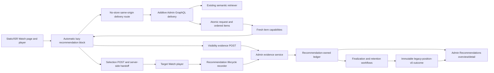

# Production Semantic Recommendation Tracer - Plan

## Goal Capsule

- **Objective:** Deliver feat-368 as the first production semantic recommendation chain from an automatic Watch block through a finalized, versioned outcome that an authorized operator can reconcile in Admin.
- **Authority:** The canonical recommendation plan's Product Contract, Planning Contract, and U1 are the source of truth. This focused plan resolves only U1 implementation constants and file-level sequencing; it does not reinterpret the program contract.
- **Scope:** Recommendation-owned delivery and minimal playback records, an additive versioned semantic response, the Watch recommendation block and lifecycle evidence, retention and health, and the Admin overview/request trace.
- **Stop conditions:** Stop if implementation would change `sceneRecommendations`, expand legacy Watch ledgers, introduce a non-semantic generator or learned ranker, create durable cross-visit profiling, put Admin UI in serving, or require recommendation work on the player-startup path.
- **Tail ownership:** The implementing agent owns the migration, generated GraphQL artifacts, focused and full affected-app gates, real-Postgres proof, constrained-browser Watch-to-Admin reconciliation, performance evidence, roadmap completion, formal review/compound, PR, and a running isolated local preview.

---

## Product Contract

### Preservation Statement

The canonical plan at `docs/plans/2026-08-18-2219-feat-watch-recommendation-learning-system-plan.md` remains unchanged and authoritative. This artifact preserves its exact U1 scope: R1-R15, R25, R41-R46; F1; AE1-AE4 and AE12; KTD1-KTD6 and KTD12-KTD16. Ticket-local KTD22-KTD28 below fill only planning-owned mechanisms that the canonical plan deliberately deferred.

### Summary

An eligible Watch route automatically renders a semantic recommendation block below the player without delaying playback. A fresh versioned envelope pins the semantic strategy and classifier, commits one request plus its complete ordered item set before minting attribution, and carries signed evidence through actual visibility, selection, target playback, finalization, and `legacy-position-v0`. Admin exposes aggregate health and a permission-gated request trace that distinguishes real zero activity from loss, lag, conflict, fallback, and overdue retention. Every accepted fact is provisional and learning-ineligible.

### Actors

- **A1. Anonymous viewer:** Uses Watch with one ephemeral recommendation session and no durable profile.
- **A2. Signed-in viewer:** Uses the same U1 recommendation path; account identity is not required for attribution and does not expand U1 persistence.
- **A5. Admin operator:** Reads aggregate health or, with the stronger permission, inspects a privacy-safe request trace.
- **A6. Recommendation runtime:** Retrieves semantic candidates, persists delivery and evidence, signs capabilities, and serves a reason-coded fallback.
- **A7. Finalization runtime:** Finalizes the minimal episode and appends a versioned outcome without owning the business facts.

### Requirements

The wording below is carried forward from the canonical plan.

**Production delivery and provenance**

- R1. The first live recommendation surface must render semantic recommendations below the production Watch player and carry the full evidence chain through its Admin proof.
- R2. Every recommendation response must identify its request, surface, strategy version, classifier version, and per-item candidate provenance through durable attribution carried into selection and playback.
- R3. Recommendation failure must never prevent the selected video from loading or playing, and the delivery plane must have a documented last-known-good fallback.
- R4. The Admin UI must remain outside the online recommendation serving path while the existing Admin backend may continue supplying Watch data through its public contracts.
- R5. Editorial content must support fixed authored order, ranking within an editor-approved pool, or pinned positions with personalized fill, and the selected policy must be visible rather than silently reordering authored narratives. U1 preserves this future authority but ships semantic-only candidates and does not reinterpret editorial blocks.

**Recommendation evidence and playback outcomes**

- R6. Acquisition, request, served item, eligible impression, selection, playback episode, content action, survey, integrity, experiment, and promotion facts must live in recommendation-owned normalized storage rather than extending the current Watch ledgers into generic event stores.
- R7. Canonical recommendation facts must use versioned contracts, stable identities, idempotent ingestion, bounded values, explicit retention, and deletion behavior.
- R8. Every click-bearing Watch surface must record its eligible visible impressions and selections with surface, block, placement, item, position, presentation, and available recommendation context.
- R9. Acquisition provenance, immediate discovery provenance, and candidate-generator provenance must remain independent so Google, a shared link, semantic search, and a later co-watch recommendation can all be represented in one journey. U1 records semantic generator provenance and does not add acquisition or search joins.
- R10. Playback evidence must preserve attempt, successful start, manual or automatic play, active foreground time, elapsed time, duration, progress, completion, and end reason as raw facts.
- R11. Playback evidence must separately preserve pause, forward and backward seek, skip, replay, startup delay, buffering, playback error, subtitle use, audio-language changes, and re-entry where the platform can measure them reliably. U1 creates the append-only seam and records only the minimal fact set needed for its comparator; U2 owns richer proxy evidence.
- R12. Content actions such as share, save, course-add, continuation, and reported value must remain separate outcomes rather than being collapsed into watch duration. U1 does not create those actions.
- R13. A finalized playback episode must produce a versioned `qualifiedView` decision and a continuous `viewQualityWeight` with contributing reasons while retaining every raw fact needed for recomputation. U1 publishes `legacy-position-v0` as an explicitly provisional comparator; later classifier work may supersede it without mutation.
- R14. Candidate generators and online ranking must consume bounded derived projections rather than querying raw playback events directly. U1's live semantic strategy reads no recommendation evidence.
- R15. Semantic-search evidence must join request, eligible result impression, selection, successful playback, finalized outcome, reformulation, and available mission actions without treating every query as durable personal taste. U1 establishes portable identities but does not join Watch Search storage.

**Semantic-only strategy**

- R25. The first production strategy must use semantic candidates only; every later generator begins in shadow and cannot affect viewers until its governed evaluation path permits exposure.

**Admin evidence and operating model**

- R41. A vertical slice is complete only when its canonical facts, derived result, and data-quality state are visible and reconcilable in the authorized Admin Recommendations area.
- R42. Admin Recommendations must expose request traces, funnels, surface and block performance, acquisition, search outcomes, playback outcome distributions, profile and co-watch projections, candidate overlap and contribution, ranking, slate composition, experiments, promotions, integrity, privacy, and ingestion health as their slices land. U1 exposes only the request trace, first funnel, semantic provenance, and U1 health.
- R43. The hybrid-promotion workflow must teach the operator through plain-language readiness, a recommended next action, impact preview, permanent-default confirmation, rollback controls, and an audit trail without requiring statistical expertise. U1 shows the pinned manifest and fallback but adds no promotion control.
- R44. Admin must distinguish zero activity from missing instrumentation, late outcomes, dropped or duplicate evidence, classifier lag, projection staleness, and insufficient experiment power. U1 implements the states it can truthfully know: zero, delivery/ingestion unavailable, rejection/loss-suspected, replay, conflict, late evidence, classifier lag, and retention overdue.
- R45. The initial architecture must use Postgres as the operational authority, pgvector for available embedding retrieval, and durable background workflows for finalization, projection, evaluation, and promotion while keeping those implementations replaceable behind stable seams.
- R46. Evidence ingestion and serving must be asynchronous where appropriate, batch-capable, partition-friendly, deletion-aware, and resilient on low-bandwidth Watch clients; queues, warehouses, feature stores, or specialized vector systems graduate only when a measured constraint identifies their purpose.

### Key Flow

- F1. **Semantic recommendation to verified outcome**
  - **Trigger:** A1 or A2 opens a production Watch page with an eligible below-player recommendation block.
  - **Actors:** A1 or A2, A5, A6, A7.
  - **Steps:** Forge serves semantic candidates, records eligible exposure and selection, preserves attribution into playback, finalizes the episode, derives versioned outcomes, and shows the reconciled trace in Admin.
  - **Outcome:** The first live strategy is available to viewers and measurable end to end; incremental viewer value remains unclaimed until evaluated against a comparator.
  - **Covers:** R1-R4, R6-R15, R41-R44.

### Acceptance Examples

- AE1. **Covers R1-R4, R6-R15, R41-R44.** Given a viewer sees the first semantic recommendation card and selects it, when playback starts and later ends, then Admin can reconcile the request, impression, selection, successful start, raw episode, classifier version, derived outcome, and any missing or late evidence.
- AE2. **Covers R8, R41-R44.** Given a recommendation is returned but remains below the viewport, when no visibility policy is satisfied, then it is not counted as an eligible impression and Admin distinguishes the returned candidate from an exposure.
- AE3. **Covers R9, R15.** Given a viewer arrives from Google, performs semantic search, selects a result, and later selects a co-watch recommendation, when the journey is inspected, then acquisition, search discovery, and co-watch candidate provenance remain separate and joinable. U1 must not create false joins while establishing the recommendation identities.
- AE4. **Covers R10-R13.** Given a viewer seeks past the current meaningful-playback position and exits, when the episode is finalized, then the raw seek and active-time facts remain visible and a classifier cannot claim equivalent active consumption merely from player position. U1 labels its position-only result `legacy-position-v0`; it does not claim active attention.
- AE12. **Covers R32-R34.** Given a learned re-ranker or exploration policy cannot load, when a recommendation is requested, then the request falls back to the last eligible deterministic strategy and the fallback is visible in Admin. In U1 the only eligible live manifest is semantic-only, so absence of that compatible manifest produces an explicit unavailable/empty state rather than another generator.

### Success Criteria

- One anonymous constrained-browser journey reconciles `request → ordered served item → eligible impression → selection → successful start → finalized outcome → legacy-position-v0 → Admin detail`.
- The same production Watch page loads and plays when delivery, evidence ingestion, or finalization is unavailable.
- `sceneRecommendations` retains its field-for-field and soft-empty compatibility behavior.
- Admin never presents stale/unhealthy instrumentation as genuine zero activity, and no trace exposes a raw token or session secret.
- All accepted U1 evidence remains `learningEligible=false` and no live candidate/ranker reads it.

### Scope Boundaries

- Semantic-only; no profiles, co-watch, editorial candidate integration, search joins, missions, surveys, integrity promotion, experiments, exploration, learned ranking, mobile, or TV.
- Recommendation-owned tables only; no new field or write in `WatchEvent`, `WatchSearchEvent`, or `SearchTrace`.
- One ephemeral session supports attribution only. It is not durable personalization, an account credential, or the existing Watch progress identity.
- The legacy meaningful-watch rule is a named comparator, not satisfaction, active attention, mission value, or permanent learning truth.
- Admin observes and verifies; it does not serve cards or sit on the Watch request path.

---

## Planning Contract

### Context and Research

**Repository patterns**

- `apps/admin/src/services/scene-recommendations.service.ts` and `scene-recommendations-retriever.ts` are the compatibility retrieval source. Preserve enriched-transcript pgvector provenance, requested locale, published/non-restricted playability, INNER playable-Dub/Mux admission, self/parent/child exclusion, best chunk per video, and the shared three-layer deduplication.
- `apps/admin/src/services/search-trace-*`, `src/workflows/searchTraceRetention.ts`, and `src/instrumentation.ts` establish bounded best-effort persistence, health, retention ledger, advisory-lock, and durable daily workflow patterns. Recommendation records remain separate.
- `apps/web/src/lib/content.ts` owns automatic Watch slots; `WatchSectionRenderer.tsx` owns exhaustive synthetic dispatch; `WatchPageClient.tsx` owns the player ref; `WatchEventRecorder.tsx` remains untouched as the legacy signed-in ledger.
- `apps/admin/src/app/dashboard/search/` supplies server-rendered overview/detail patterns. Recommendation reads move to a focused `recommendation-ops-data.ts`, not the already-large search ops module.
- `apps/admin/src/graphql/public-resolvers.regression.test.ts`, `schema.graphql`, and `packages/admin-graphql/src/admin-graphql-env.d.ts` are mandatory compatibility/generated-contract gates.

**Institutional learnings**

- `docs/solutions/architecture-patterns/admin-semantic-video-transcript-evidence-pattern.md` and `docs/solutions/platform/admin-scene-recommendations-r5-pattern.md` make transcript-backed compatibility load-bearing.
- `docs/solutions/platform/admin-search-trace-retention-pattern.md` supports short-lived sanitized raw traces plus independent health, while its older capture-disable behavior must be verified against current code rather than copied blindly.
- `docs/solutions/architecture-patterns/canonical-server-search-analytics-supplemental-rum-pattern.md` requires server facts to remain canonical and supplemental browser delivery to be bounded and non-blocking.
- `docs/solutions/logic-errors/pre-flight-correlation-ref-write-misattributes-telemetry-after-failure.md` requires request identity to attach to the successfully committed visible set, not a failed refresh.
- `docs/solutions/performance-issues/mapper-media-signature-atomic-bulk-upsert.md` requires a real-Postgres rollback proof for parent plus complete ordered children.

**Official guidance**

- Next.js 16 Route Handlers are the narrow dynamic BFF; `cookies()` is async, responses with capabilities are private/no-store, request bodies need application-owned streaming bounds, and stable `after()` is not a durability boundary.
- Prisma 6 nested parent/child writes provide one atomic delivery transaction; compound uniques enforce replay identity; short `Serializable` transitions use bounded `P2034` retry and handle `P2002` races explicitly.
- RFC 8725/7519 and NIST key guidance require algorithm allowlisting, explicit token types/audiences, required expiry and replay identity, allowlisted `kid`, and current plus verify-only overlap.
- OWASP CSRF, session, REST, and logging guidance requires exact same-origin validation, HttpOnly/SameSite cookies, bounded pre-parse input, and token/log redaction.
- Playwright 1.61 supports isolated anonymous/Admin contexts, cookie-seeded Admin auth, request/response assertions, network interception for degraded proof, and retained traces.

### Inherited Key Technical Decisions

The exact canonical KTD text remains authoritative. U1 implements these existing decisions without relabeling them:

- **KTD1:** Admin owns normalized recommendation Postgres records; legacy Watch ledgers remain compatibility inputs only.
- **KTD2:** Server-known facts are canonical; signed browser facts are supplemental, bounded, idempotent, replay/conflict aware, provisionally ineligible, same-origin, and token-redacted.
- **KTD3:** A versioned envelope wraps the existing semantic retriever while `sceneRecommendations` remains unchanged; only content/version candidate pools may be cached.
- **KTD4:** Watch inserts one automatic, lazy, reason-coded below-player semantic block through generated Admin GraphQL and a same-origin boundary.
- **KTD5:** A versioned surface registry and `IntersectionObserver` policy distinguish served/rendered/visible/selected and emit one eligible impression per exposure window.
- **KTD6:** Playback is append-only and workflow-finalized; `legacy-position-v0` is only a visible comparator and outcomes append immutable revisions.
- **KTD12:** Admin Recommendations is decision-first and uses distinct aggregate and trace permissions.
- **KTD13:** Durable workflows finalize/project after business truth exists; workflow state is not business truth.
- **KTD14:** Purpose, identity, retention, access, deletion, and restoration behavior are acceptance gates for every record.
- **KTD15:** Postgres/pgvector remain the U1 authority until measurements justify another system.
- **KTD16:** Watch performance, bounded delivery, accessibility, low-bandwidth behavior, and instrumentation-degraded operation are acceptance conditions.

### Ticket-Local Key Technical Decisions

- KTD22. **Version all U1 contracts, keep them intentionally small, and bound anonymous amplification before retrieval.** Use `semantic-recommendation-v1` for the envelope, `recommendation-evidence-v1` for browser facts, `watch-below-player-v1` for the surface and visibility policy, `semantic-transcript-pgvector-v1` for the bootstrap strategy manifest, and `legacy-position-v0` for the outcome. Serve at most six items. Bound a delivery response to 64 KiB and an evidence request to 8 KiB/16 events; reject declared or decoded-stream overflow before JSON parsing. A fresh retrieval gets a 1.5-second Admin budget and the lazy Watch boundary gets a 2-second budget. A compatible content-only pool may live for 60 seconds, but every request, item row, token, and outcome identity is fresh. Before retrieval or a delivery-ledger write, use one atomic TTL-backed Lua admission operation in the existing shared production Redis authority to admit at most one in-flight delivery per session, one seed/locale delivery per five seconds, 30 deliveries per session-hour, and the existing endpoint-level rate bucket; retain only one-way ephemeral bucket identifiers. Redis absence/unavailability fails attributed delivery closed in production before retrieval, while local development may use a process-local adapter with the same contract. Enforce per-token evidence-submission budgets, fact cardinality, and bounded episode facts independently of client event IDs. (planning-resolved from KTD2-KTD6, KTD15-KTD16 — chosen over open-ended DTOs, viewer-slate caching, and unbounded anonymous write amplification.)
- KTD23. **Use a two-stage capability with a server-side, tab-bound selection handoff.** The browser reaches only same-origin Web Route Handlers. A host-only `HttpOnly`, `SameSite=Lax`, production-`Secure` recommendation-session cookie carries a random ephemeral value for 24 hours and Admin stores only its digest. A random per-tab nonce may live in `sessionStorage` solely as a non-authoritative correlation label; duplicated tabs may initially copy it, so it is never a uniqueness authority. A ten-minute delivery capability remains only in client memory and permits one render, one impression, and one selection. Selection sends it in a bounded same-origin `fetch` body; Admin atomically commits selection plus a pending handoff/episode with a fresh server-generated claim nonce keyed to the session digest and target media. Web returns only that non-secret one-use claim nonce plus the server-derived canonical target; the selecting tab replaces its sessionStorage correlation value and navigates. A short client deadline fails open to the already-rendered, token-free canonical Watch href. The target client consumes the matching server-side handoff once with the session cookie, fresh claim nonce, and current media, then obtains an episode capability. No capability enters URLs, referrers, SSR HTML, DOM fields, persistent JavaScript-readable storage, logs, analytics, or retained browser artifacts. (planning-resolved from KTD2, KTD4-KTD6, KTD16 — chosen over query-string attribution, hidden form tokens, a shared latest-selection cookie, a copied tab nonce as authority, and one long-lived item token.)
- KTD24. **Use an independently rotatable HMAC keyring and explicit active/late validation horizons.** Admin accepts exactly one active signer and zero or more previous verify-only keys, with unique allowlisted `kid`s and decoded random key material of at least 256 bits; malformed, short, duplicate, or ambiguous configuration fails before serving. Only HS256, known `typ`, issuer, audience, `jti`, time claims, and every stored binding are accepted through the constant-time library verifier. Delivery capabilities have no late acceptance after ten minutes. Episode capabilities have a four-hour active window and a six-hour hard validation horizon: only declared terminal fact kinds may arrive after the active window, only when `occurredAt` is inside it and `receivedAt` is inside the hard horizon. Previous verify-only keys remain for the maximum hard horizon plus five minutes of skew. The shared serving-control row carries a bounded emergency revoked-`kid` set read on every issuance/verification path, so compromise revocation takes effect across replicas on their next request and records only a reason code; ordinary planned removal still follows a deploy. Production with no valid active key or overdue retention issues no attributed slate; Watch remains playable. Rotation is deploy old+new verify, switch the active signer, wait the hard horizon plus skew, then remove old. (planning-resolved from the ticket token lifecycle constraint, KTD2, KTD14, and RFC/NIST guidance.)
- KTD25. **Give each U1 record one request-root lifecycle.** A request receives one immutable `expiresAt` at creation; served items, impression, selection, episode, playback fact, outcome revision, and request-linked audit rows inherit it and cannot extend retention. Reads hide expired roots immediately. A daily advisory-locked purge deletes request roots in bounded batches under database cascades; the 29-day expiry has a 24-hour propagation SLA and a 30-day hard ceiling. Health becomes `retention_overdue` only when a root passes that SLA, a bounded run leaves roots beyond it, or no successful run exists for 36 hours—not merely because rows await the next scheduled run. Strategy manifests are operator/configuration truth and have no automatic expiry. Sanitized retention-run health and Admin trace-access audit rows retain 90 days and contain no request/session linkage after raw expiry. Purge, finalizers, and late workers share request-generation fencing so a deleted root cannot be recreated or republished. (planning-resolved from KTD1, KTD13-KTD15 and the existing search-trace ceiling — chosen over indefinite traces and child-extended retention.)
- KTD26. **Make health a truth table limited to durable evidence.** `zero_activity` is available only after a current DB probe succeeds, retention is healthy, and no rows exist in the selected window. Committed rejection/write-failure audits become `loss_suspected`; duplicate digests become `replay`; digest mismatches become `conflict`; terminal facts without an outcome or open episodes past their deadline become `classifier_lag`; accepted facts outside the active window become `late`; stale purge state becomes `retention_overdue`. A DB/dependency outage or interval without a durable success watermark is `unavailable_unknown`, never zero and never an exact loss count. Selection without impression and valid out-of-order facts remain visible facts, not manufactured loss. Admin displays counters, last durable success watermarks, oldest pending/overdue age, last purge, effective manifest, fallback reason, and latency separately. (planning-resolved from R41-R44 and KTD12-KTD14 — chosen over interpreting absence or an outage as zero.)
- KTD27. **Admin GraphQL is public-shaped but server-caller authenticated.** The additive delivery and state-changing fields keep Pothos public scope only because the Web consumer principal intentionally has zero permissions; every resolver body requires the server-only Web consumer bearer before retrieval or parsing business input. Browser origin/Fetch Metadata and streaming bounds are enforced at Web, while Admin independently re-enforces contract bounds, caller class, token authority, and stored bindings. Direct anonymous GraphQL calls and partner/workflow/fleet caller classes cannot create deliveries or evidence. No permissive CORS is added. (planning-resolved from KTD2-KTD4 and the repository bearer-as-passport pattern — chosen over direct browser GraphQL.)
- KTD28. **Bootstrap one immutable semantic manifest and control issuance through shared runtime state.** The migration registers `semantic-transcript-pgvector-v1` deterministically and creates a singleton recommendation serving-control row that points to the exact manifest. Every delivery reads this small Postgres control without page/viewer caching; disabling it stops issuance across all replicas without deleting history. `RECOMMENDATION_SEMANTIC_SERVING_ENABLED` remains a startup fail-closed ceiling, not the emergency mutable switch, and environment validation proves the selected manifest exists and is compatible before serving. N-1 applications ignore the additive rows, and local preview seeds/configures the same manifest/control rather than inventing a test-only strategy. (planning-resolved from KTD3-KTD4, KTD13, and AE12 — chosen over an implicit in-code strategy, environment-only runtime control, and an unowned active pointer.)

### High-Level Technical Design



The player and static Watch composition never wait on the delivery plane. Delivery identity is created only after the full slate commits and is not counted as issued until all item capabilities exist. Selection uses a body-bound, server-side handoff so attribution survives into the target player without entering URLs. Facts may arrive out of order; uniqueness and digests, not a mutable linear status, determine replay/conflict semantics.

### State and Failure Model

- **Request:** `prepared → issued|issuance_failed` with `served|fallback|empty|unavailable` result. The parent and ordered items commit as prepared, all capabilities mint, and a short second transaction marks issued before return. A signer/serialization preparation failure remains inspectable but cannot accept evidence; a transaction failure produces no partial request/item set.
- **Item:** ordered server fact, then optional render/impression/selection facts. Selection without impression remains valid and visible.
- **Evidence:** accepted provisional, idempotent replay, quarantined conflict, rejected binding/bounds, or accepted late. Server `receivedAt` is canonical; client `occurredAt` is bounded supplemental evidence.
- **Episode:** selection and pending episode commit together; the target claims the session/claim/media-bound handoff once. Facts receive a server-assigned monotonic episode sequence and append; they do not overwrite each other. Finalization is scheduled when the episode opens so a missing terminal fact still times out, and terminal facts may wake it sooner.
- **Outcome:** immutable revision with classifier, maximum committed fact-sequence watermark, deterministic ordered-input digest, reasons, qualified flag, nullable weight, and `learningEligible=false`. `legacy-position-v0` always leaves the continuous weight null. Uniqueness on episode/classifier/watermark/digest plus an episode fence prevents duplicate or regressive publication. Late evidence may create one monotonic `supersedes` revision for a new watermark.
- **Fallback:** fresh semantic → manifest-compatible cached content pool with locale/playability recheck → explicit empty/unavailable. Every branch creates an inspectable reason only when persistence safely succeeds.

### Sequencing and Rollout

1. Expand the schema and deploy compatible readers/services with serving disabled.
2. Generate the schema/client artifacts and prove compatibility plus real-Postgres atomicity.
3. Activate the no-store Watch boundary and automatic block only when the keyring, deterministic manifest registration/config, retention workflow, caller authentication, and health gate are ready.
4. Verify anonymous Watch-to-Admin locally with delivery healthy, then repeat with delivery/evidence failure while measuring player startup.
5. Keep the additive schema on application rollback; disable serving dynamically and retain request traces through the 29-day window. Contract/destructive cleanup belongs to a later ticket.

---

## Implementation Units

### U1. Recommendation-owned schema, migration, token profile, and lifecycle

- **Goal:** Establish the smallest normalized U1 ledger and safe operational lifecycle before any Watch writer is activated.
- **Requirements:** R2, R6-R14, R41-R46; AE1, AE4; KTD1-KTD2, KTD6, KTD12-KTD15, KTD22-KTD28.
- **Dependencies:** None.
- **Files:**
  - `apps/admin/prisma/schema.prisma`
  - `apps/admin/prisma/migrations/0052_production_semantic_recommendation_tracer/migration.sql`
  - `apps/admin/src/services/recommendations/contracts.ts`
  - `apps/admin/src/config/env.ts`
  - `apps/admin/.env.example`
  - `apps/admin/src/services/recommendations/manifest.service.ts`
  - `apps/admin/src/services/recommendations/token.service.ts`
  - `apps/admin/src/services/recommendations/retention.service.ts`
  - `apps/admin/src/services/recommendations/retention/job.ts`
  - `apps/admin/src/services/recommendations/health.ts`
  - `apps/admin/src/workflows/recommendationRetention.ts`
  - `apps/admin/src/instrumentation.ts`
  - focused unit/workflow tests and a new real-Postgres migration test beside the services
- **Approach:**
  1. Add separate models for strategy manifest, singleton serving control, request, served item, rendered fact, impression, selection, playback episode, playback fact, immutable outcome revision, bounded sanitized audit/conflict, retention run, and trace-access audit. Do not introduce one generic event table; Redis admission keys are ephemeral operational bounds, not recommendation records.
  2. Make request `expiresAt` the immutable retention root and encode complete ordered-item, one-render/impression/selection-per-token-kind, one-use handoff, event/digest conflict, fact-sequence, and outcome-revision invariants in Postgres. Store token `jti`/key version and canonical payload digests, never raw tokens or session cookie values. Store one conflict row per capability/event identity with a saturating attempt counter, and enforce fixed per-capability submission budgets before another conflict write.
  3. Add the KTD24 keyring parser/signer/verifier, active-versus-late validation policy, and deterministic contract classifiers with dependency injection for tests. Load per-environment keyring material only through Doppler-backed Admin environment variables with no production default or secret-bearing validation error; grant it only to the Admin runtime and scrub configuration/log output in tests.
  4. Register the KTD28 bootstrap manifest and singleton disabled-by-default serving control deterministically; validate the environment ceiling, controlled manifest, and bounded emergency revoked-key set without changing N-1 application behavior.
  5. Implement the KTD25 daily root purge, advisory-lock ledger, propagation-SLA/freshness check, generation fencing, and production serving gate through the existing workflow registration pattern. Trace-access audit rows use a nullable request foreign key with `ON DELETE SET NULL`; root purge atomically removes that link while retaining only bounded actor/reason/time fields and an independent 90-day expiry.
  6. Document every field's purpose, identity class, retention, access, deletion/cascade, and audit behavior beside the schema/service boundary.
- **Patterns to follow:** `SearchTrace` schema/lifecycle, `search-trace-retention.service.ts`, `search-trace-retention/job.ts`, `workflows/searchTraceRetention.ts`, `auth/seo-approval-assertion.ts`, and migration DB smoke conventions.
- **Test scenarios:**
  - The migration applies to an isolated real Postgres schema and enforces parent/child, order, per-capability cardinality, replay/conflict, fact sequence, handoff, and outcome-revision constraints.
  - One invalid served child rolls back the request and every item; no signer call occurs before commit.
  - Key configuration rejects short/duplicate/malformed material and multiple active signers. Current key signs/verifies, previous key verifies only through the hard horizon, and unknown/retired `kid`, `none`/wrong algorithm, type, issuer, audience, expiry/skew, late-window, or binding fails.
  - Same event identity/digest is idempotent; the same identity/different digest preserves the first fact and one bounded conflict row whose attempt counter saturates under concurrency; fixed delivery/episode submission budgets and the one-render/impression/selection capability limits cannot be bypassed with new event IDs or digests.
  - A late child cannot extend root expiry. Concurrent/bounded purge deletes roots without orphans, preserves manifest truth, records per-table counts/oldest overdue, clears trace-access request linkage atomically, and never reports health while roots exceed the propagation SLA; the retained audit row cannot be joined back to the deleted request/session.
  - The bootstrap manifest/control is idempotent, a missing/mismatched manifest, disabled shared control, or disabled environment ceiling issues nothing, a control or emergency revoked-key change stops issuance/verification across replicas on the next request, and N-1 readers ignore the additive records.
  - Missing keyring or overdue retention disables attributed serving in production but does not crash Admin or Watch health reads; configuration failures and structured logs never contain decoded or encoded key material.
- **Verification:** Real-Postgres proof shows no orphan/partial delivery; focused token, lifecycle, workflow, and health tests show the exact KTD24-KTD26 state transitions.

### U2. Additive versioned semantic delivery and evidence GraphQL

- **Goal:** Wrap the existing retriever in a trace-aware contract while leaving every compatibility caller unchanged.
- **Requirements:** R1-R4, R6-R9, R14-R15, R25, R41-R46; F1; AE1-AE3, AE12; KTD1-KTD5, KTD12-KTD16, KTD22-KTD28.
- **Dependencies:** U1.
- **Files:**
  - `apps/admin/src/services/scene-recommendations.service.ts`
  - `apps/admin/src/services/scene-recommendations-retriever.ts`
  - `apps/admin/src/services/recommendations/delivery.service.ts`
  - `apps/admin/src/services/recommendations/evidence.service.ts`
  - `apps/admin/src/services/recommendations/episode.service.ts`
  - `apps/admin/src/graphql/queries/recommendation-delivery.ts`
  - `apps/admin/src/graphql/mutations/recommendation-evidence.ts`
  - `apps/admin/src/graphql/schema.ts`
  - `apps/admin/src/graphql/public-resolvers.regression.test.ts`
  - `apps/admin/src/graphql/schema.test.ts`
  - `apps/admin/schema.graphql`
  - `packages/admin-graphql/src/operations/recommendations.ts`
  - `packages/admin-graphql/src/admin-graphql-env.d.ts`
  - focused retriever, delivery, evidence, resolver, schema, and compatibility tests
- **Approach:**
  1. Keep `sceneRecommendations` and its DTO untouched. Call the existing service from a separate `semanticRecommendationDelivery` operation that requires the KTD27 Web caller, supplies server context, pins the exact configured manifest, and returns the KTD22 envelope.
  2. Persist request plus the complete bounded ordered slate as `prepared` in one nested transaction, sign every item capability, then mark the request `issued` in a short transaction before return. Signer/issuance failure is visible and cannot accept evidence. Commit reason-coded empty/fallback requests when safe; return unavailable without partial attribution when persistence fails.
  3. Reuse only a content/version/locale candidate pool on fresh-retrieval failure, then re-run locale/playability admission before creating fresh delivery records.
  4. Add public-shaped but Web-caller-authenticated evidence/selection/episode operations. Selection plus the fresh server-generated claim nonce and pending episode/handoff commit atomically; only after commit may the caller receive navigation success. Service validation independently owns caller class, token/session/item/media/surface/kind authority, bounds, digest idempotency, and conflict quarantine; a copied tab correlation nonce grants no claim authority.
  5. Enforce KTD22 delivery cooldown/concurrency/rate gates before retriever or delivery transaction work through one atomic TTL-backed Lua operation in the existing production Redis authority, keyed by one-way session and seed/locale bucket digests. Atomically acquire an expiring in-flight lease, enforce the five-second cooldown and session-hour counter across replicas, and release/expire the lease on every success, empty, timeout, and failure path; the ordinary endpoint bucket remains an independent outer guard. Production Redis failure returns unavailable before retrieval, while the local adapter is test/dev only. Enforce render/impression/selection and playback cardinality plus fixed per-capability submission budgets even when a client invents fresh event IDs.
  6. Register new public fields explicitly and regenerate Admin SDL plus gql.tada introspection in the same change.
- **Patterns to follow:** existing scene recommendation resolver tests, Pothos modular `queryFields`/`mutationFields`, public-resolver manifest, shared operations package, and Prisma short transaction/retry patterns.
- **Test scenarios:**
  - Existing `sceneRecommendations` snapshot, soft-empty `VideoNotFoundError`, locale/playability, exclusions, deduplication, and list field types remain unchanged.
  - The new served envelope contains fresh request/item/token identities on repeated calls even when candidate content comes from a compatible cache; concurrent requests against separate app replicas prove the shared in-flight/cooldown/hour gates reject before retriever or delivery-table work, and leases recover after every terminal/failure path.
  - Missing embeddings, no candidates, retriever timeout, incompatible cached pool, persistence rejection, and manifest-disabled paths emit the intended reason without a partial slate.
  - Direct anonymous, partner, workflow, or fleet GraphQL callers cannot create a delivery/evidence row; the zero-permission Web consumer bearer can enter the service and still must satisfy every capability check.
  - Wrong session/tab/item/media/surface/strategy/event kind, cross-purpose token use, malformed timestamps, over-count batches, encoded/ambiguous or oversized bodies fail without a business fact.
  - Identical replay, conflict replay, selection without impression, and late/out-of-order accepted facts produce the KTD26 trace/health state.
  - Signer failure after the prepared commit and issuance-state failure produce no usable envelope; retry creates a fresh identity and prepared/failed rows remain distinguishable from issued slates.
  - Concurrent selection commits one selection plus one pending episode with a fresh claim nonce, then one matching handoff claim succeeds; copied-tab correlation nonces and same-target concurrency cannot collide or consume another tab's lineage, and no partial selection/episode pair survives.
  - Consumer bearer remains zero-permission; Admin overview/detail trace projections and trace GraphQL types expose no raw capability, session, embedding, or vector fields, while the delivery envelope exposes only its required opaque item capability.
- **Verification:** Generated artifacts are clean, compatibility tests are byte/shape stable, and focused GraphQL/service tests prove additive behavior and capability enforcement.

### U3. Automatic Watch block, no-store BFF, eligible impression, and tab-bound selection handoff

- **Goal:** Make the semantic baseline visible and selectable on production Watch without changing the cacheable page or legacy analytics.
- **Requirements:** R1-R9, R15, R25, R41-R46; F1; AE1-AE3, AE12; KTD2-KTD5, KTD12, KTD14-KTD16, KTD22-KTD28.
- **Dependencies:** U2.
- **Files:**
  - `apps/web/src/lib/content.ts`
  - `apps/web/src/lib/watch-blocks.ts`
  - `apps/web/src/lib/recommendations.ts`
  - `apps/web/src/lib/routes.ts`
  - `apps/web/src/components/watch/WatchSectionRenderer.tsx`
  - `apps/web/src/components/sections/VideoRecommendations.tsx`
  - `apps/web/src/components/recommendations/WatchSemanticRecommendations.tsx`
  - `apps/web/src/components/recommendations/useEligibleRecommendationImpression.ts`
  - `apps/web/src/app/api/recommendations/route.ts`
  - `apps/web/src/app/api/recommendations/evidence/route.ts`
  - `apps/web/src/app/api/recommendations/select/route.ts`
  - focused route, content-merge, renderer, component, observer, accessibility, and selection tests
- **Approach:**
  1. Add one route-owned, non-overridable synthetic recommendation slot after `WatchBody`. Keep authored/legacy `VideoRecommendationsBlock` compatibility behavior separate and prevent a second production semantic block.
  2. Render a lazy client container that sends a bounded same-origin POST to `/watch/api/recommendations` after the player shell is available. The Route Handler alone owns the KTD23 session cookie and KTD27 Web consumer credential; it is explicitly dynamic/private/no-store, and the state-creating delivery request uses the same origin, Fetch Metadata, content-type, encoding, and strict-body gate as later evidence routes.
  3. Keep the presentation component reusable for the demo while injecting production Watch routes, item identity, accessible labels, and client-memory selection behavior. Derive canonical Watch targets with the audio-language slug, never UI locale. A non-secret tab nonce is generated once per tab; it is correlation, not authorization.
  4. Emit one bounded, idempotent rendered fact only after a newly committed envelope mounts. Record one impression only after at least 50% of a card is intersecting for one continuous second while `document.visibilityState` is visible. Key the render/exposure ledger by request/item/surface-policy and reset it only when a newly committed envelope replaces the visible set.
  5. Derive the expected origin only from configured public origin. For browser POSTs require exact scheme/host/port Origin plus same-origin Fetch Metadata, reject missing/duplicate ambiguous headers and any `Content-Encoding`, accept only the route's exact media type, and enforce declared plus decoded-stream bounds before parsing. Decode with one shared strict bounded JSON helper that tokenizes the raw UTF-8 payload, rejects duplicate object keys at every depth, then returns the parsed value for schema validation; use it for evidence, selection, and playback routes. Selection keeps the delivery capability in memory and is single-flight per card: mark the chosen card busy, announce that it is opening, and ignore repeat pointer/keyboard activation until navigation. It posts the token with session/tab context, accepts only Admin's stored-item-derived canonical target and fresh non-secret claim nonce, replaces the selecting tab's sessionStorage correlation value, then navigates; a short client deadline uses the same state transition to fail open to the pre-rendered token-free href.
- **Patterns to follow:** synthetic Watch merge/dispatch, `api/language-options/route.ts`, bounded stream parsing from Admin's search sample route, existing recommendation cards, and success-owned correlation identity.
- **Test scenarios:**
  - Every eligible Watch composition includes exactly one semantic slot after `WatchBody`, including no-Experience and Experience-override routes; no authored recommendation-like block creates a duplicate live tracer.
  - The initial viewport/player renders before the recommendation request settles. Loading, ready, empty, fallback, unavailable, and instrumentation-degraded states retain stable layout and accessible text.
  - Mounting a newly committed envelope emits exactly one rendered fact; a below-viewport or hidden-document card creates no impression; 50%/one-second visibility creates exactly one; rerender/StrictMode remount duplicates neither fact; a new committed envelope resets the ledger.
  - Keyboard and pointer selection keep the token out of DOM fields, submit it only in the request body, create one server-side session/claim/media-bound handoff, navigate only to the server-derived target, and fail open to the trusted href on deadline.
  - While selection is pending, pointer/keyboard repeats cannot launch a second request; the card exposes an accessible busy/opening state and both server-success and deadline paths navigate exactly once.
  - Cross-origin/hostile same-site, missing/mismatched or duplicate Origin/Fetch Metadata headers, duplicate JSON object keys at any depth, any content encoding, invalid content type, misleading/chunked oversized bodies, excessive events, and malformed timestamps are rejected before forwarding.
  - Token values do not occur in hrefs, SSR/rendered HTML, DOM fields, persistent browser storage, structured logs, error bodies, analytics payloads, or retained QA artifacts; one non-secret correlation/claim nonce is the only sessionStorage value and selection replaces it rather than accumulating entries.
  - Repeated selections/tabs remain bounded by server-side pending-handoff limits and atomic one-use claims; duplicated tabs choosing the same target receive distinct claim nonces, cannot consume one another's handoff, and no browser cookie collection grows with handoffs.
  - The default demo recommendation link and existing component snapshot remain compatible.
- **Verification:** Focused Web tests prove automatic placement, actual exposure, token-safe selection, compatibility, degraded states, keyboard/screen-reader behavior, and no player-path dependency.

### U4. Target-player episode, durable finalization, and provisional outcome

- **Goal:** Carry a selected semantic item into real playback and append the first recomputable, versioned outcome.
- **Requirements:** R2-R3, R6-R14, R41-R46; F1; AE1, AE4; KTD2, KTD5-KTD6, KTD12-KTD16, KTD22-KTD28.
- **Dependencies:** U1-U3.
- **Files:**
  - `apps/web/src/components/watch/WatchPageClient.tsx`
  - `apps/web/src/components/recommendations/RecommendationPlaybackRecorder.tsx`
  - `apps/web/src/app/api/recommendations/playback/route.ts`
  - `apps/admin/src/services/recommendations/outcome.service.ts`
  - `apps/admin/src/workflows/recommendationEpisodeFinalization.ts`
  - `apps/admin/src/workflows/registry.ts`
  - focused recorder, route, state-machine, finalizer, workflow-dispatch, replay, and race tests
- **Approach:**
  1. Mount a separate recommendation recorder beside `WatchEventRecorder`; do not modify the legacy recorder or its signed-in semantics.
  2. On a target Watch route, read the fresh claim nonce from sessionStorage, immediately remove it after use, and claim only U2's matching one-use session/claim/media handoff to obtain an episode capability without delaying player construction. Buffer only the first bounded recorder facts in memory while that asynchronous claim settles so an early `playing` signal is not lost.
  3. Record attempt, manual-versus-automatic play initiation, successful `playing` (not preview activation/raw play), bounded position/duration/progress, seek from/to, bounded active-foreground milliseconds plus coverage/missingness, elapsed time, completion, end/pagehide/route-exit reason, and timeout as append-only facts with a server-assigned monotonic episode sequence. Browser delivery is best effort and bounded; UI/playback never waits for receipts.
  4. Schedule the fenced timeout finalizer when U2 opens the episode; terminal-fact commit may wake/re-dispatch it sooner. A ledger sweep reclaims committed episodes whose initial dispatch/attachment failed after a process restart.
  5. Under an episode-scoped Serializable/advisory fence, compute the maximum committed fact-sequence watermark and deterministic ordered-fact digest, then insert one immutable `legacy-position-v0` outcome unique by episode/classifier/watermark/digest. A later watermark may append one monotonic `supersedes` revision; an old retry cannot become latest, and a purged generation cannot publish.
  6. Keep `qualifiedView`, contributing reasons, missing terminal/start/active-time coverage, classifier version, and `learningEligible=false` visible without naming the result satisfaction. `legacy-position-v0` exposes `viewQualityWeight=null` with reason `continuous_weight_not_available`; canonical KTD6 defers the first continuous projection to `active-watch-proxy-v1` and U1 must not invent it.
- **Patterns to follow:** existing player-ref event wiring, recommendation-independent `WatchEventRecorder`, business-ledger-before-workflow dispatch, idempotent workflow registry, and immutable revision patterns.
- **Test scenarios:**
  - A valid matching handoff claims the already-opened episode once; wrong media/session/claim, expired, already-used, copied-tab, or concurrent-tab handoff cannot claim another episode.
  - `playing` that fires before handoff claim is buffered once and flushed after claim; overflow is bounded/observable and never blocks player state.
  - Preview activation does not count as start; successful target `playing` records one start; duplicates and out-of-order terminal/start facts remain idempotent/reconcilable.
  - Position ≥30 seconds or progress ≥25% yields the named legacy comparator only with a null continuous weight; seek facts, manual/automatic initiation, and measured active-foreground time/coverage remain visible, so seeking past a threshold never claims active attention.
  - End, route exit, hidden/pagehide fallback, missing terminal timeout, and allowed terminal evidence between active and hard horizons produce the correct facts; delivery/selection evidence has no late acceptance.
  - Concurrent finalizers, a fact arriving between read/insert, an old retry, and late evidence produce one monotonic outcome per watermark/digest and preserve superseded revisions.
  - Episode commit followed by dispatch failure/restart is recovered by the ledger sweep exactly once; purge racing a stale workflow prevents publication.
  - Admin/GraphQL/workflow failure never blocks target player availability, language switching, navigation, or legacy Watch recording.
- **Verification:** Focused Web/Admin workflow tests prove one selected-item lineage, successful-start semantics, immutable finalization, and fail-open player behavior.

### U5. Authorized Admin overview, request detail, permissions, and reconciliation

- **Goal:** Make the U1 evidence gate operationally understandable and auditable without exposing secrets or joining legacy ledgers.
- **Requirements:** R2-R4, R6-R15, R25, R41-R46; F1; AE1-AE4, AE12; KTD1-KTD6, KTD12-KTD15, KTD22-KTD28.
- **Dependencies:** U1-U4.
- **Files:**
  - `apps/admin/src/auth/permissions.ts`
  - `apps/admin/src/auth/permissions.test.ts`
  - `apps/admin/src/components/admin-nav.ts`
  - `apps/admin/src/i18n/messages.ts`
  - `apps/admin/src/app/dashboard/recommendations/recommendation-ops-data.ts`
  - `apps/admin/src/app/dashboard/recommendations/page.tsx`
  - `apps/admin/src/app/dashboard/recommendations/[requestId]/page.tsx`
  - `apps/admin/src/app/dashboard/recommendations/request-detail-panel.tsx`
  - focused data projection, permission, server-render, navigation, privacy, and accessibility tests
- **Approach:**
  1. Add separate aggregate-health and privacy-safe trace permissions to the exhaustive central matrix. Enforce the stronger trace permission in the detail loader/page and append a sanitized access-audit record.
  2. Build the overview from recommendation services only. Default to a bounded trailing 24-hour UTC window, allow bounded presets through the 29-day trace horizon, and keep zero/health labels explicitly scoped to that window. Separate prepared, issued, and issuance-failed requests; show served/rendered/impression/selection/start/finalized counts, fallback and latency, replay/conflict/committed-rejection/late/classifier lag, last durable success watermarks, oldest pending, retention/purge health, and explicit zero/unavailable-unknown truth states. Aggregate-only readers see bucketed summaries without request identifiers or links. Trace-authorized readers additionally see requests sorted by `(createdAt DESC, id DESC)`, cursor-paginated 50 at a time, with bounded filters for lifecycle state, fallback reason, and unhealthy evidence state and direct detail links.
  3. Build request detail as ordered items plus a fact timeline and immutable outcome revisions. Order episode facts by server-assigned sequence; order non-episode lifecycle facts by server receipt time then immutable ID. Display `occurredAt` as secondary evidence and badge facts whose occurrence order differs from receipt/sequence order. Show rendered state, the effective manifest, surface policy, fallback reason, classifier, manual/automatic initiation, active-foreground time/coverage, provisional learning state, and missing/out-of-order explanations.
  4. Redact token material, raw session identifiers, IPs, bearer keys, vectors, and unbounded semantic/debug text. Expose only normalized content identity and bounded provenance already present in the served item.
  5. Add the authorized navigation entry and complete English/Spanish message shapes.
- **Patterns to follow:** server-rendered search overview/detail, central permission tiers, `admin-nav.ts`, bounded data projections, and Admin status pills/tables.
- **Test scenarios:**
  - An aggregate reader can see overview health but cannot open a request trace; a trace reader can inspect detail; unauthorized reads redirect/deny server-side even with a crafted URL.
  - Aggregate-only output contains no request identifiers or links. Trace readers get stable `(createdAt, id)` cursor pagination, deterministic default/filter windows, and no duplicate/omitted rows across page boundaries.
  - A served request below viewport shows ordered items and no impression; selection without impression is explained rather than synthesized.
  - A complete request reconciles impression, selection, successful start, terminal fact, outcome/classifier, manifest/fallback, and provisional ineligibility.
  - The timeline remains deterministic when client occurrence and server receipt disagree: server sequence/receipt is primary, occurrence is secondary, and the out-of-order badge explains the difference.
  - Healthy current-probe/no-row windows say zero activity; DB-down/unknown intervals, stale retention, committed rejections, conflict, replay, late facts, and classifier backlog render their distinct KTD26 states without inventing exact failure counts during an outage.
  - Tokens, raw session/cookie values, vectors, raw transcript/debug payloads, and full user identifiers never enter the projection, page source, or access audit.
  - Overview/detail landmarks, headings, links, table semantics, wrapping, focus, and narrow viewport meet the repository accessibility floor.
- **Verification:** Focused Admin tests prove permission separation, privacy bounds, data-quality truth, and the complete U1 request trace.

### U6. End-to-end proof, operational docs, and ticket closure

- **Goal:** Prove the whole production-shaped chain and leave it supportable, reversible, and locally confirmable.
- **Requirements:** R1-R15, R25, R41-R46; F1; AE1-AE4, AE12; all inherited and ticket-local KTDs.
- **Dependencies:** U1-U5.
- **Files:**
  - `apps/admin/CLAUDE.md`
  - `apps/web/CLAUDE.md`
  - `CONCEPTS.md`
  - `docs/roadmap/content-discovery/feat-368-production-semantic-recommendation-tracer.md`
  - `docs/roadmap/README.md`
  - browser proof artifacts/report under the repository's existing test-output convention
- **Approach:**
  1. Document contract versions, key rotation/revocation, serving disable/fallback, retention/purge recovery, health interpretation, migration/rollback order, and local isolated preview setup.
  2. Add glossary entries for recommendation request, served item, capability, eligible impression, episode/outcome revision, manifest, and evidence-gate states.
  3. Run the complete affected-app, generated-artifact, Prisma, roadmap, accessibility, and browser verification contract.
  4. Use one isolated anonymous constrained Watch context and one cookie-seeded authorized Admin context; retain the matching request ID, screenshots, and an allowlisted/redacted network ledger containing URL, status, timing, and request ID only. Raw Playwright traces may be used transiently for debugging but must be deleted before PR because they retain bodies and cookies.
  5. Mark feat-368 complete and regenerate the roadmap only after every Definition of Done item passes.
- **Patterns to follow:** worktree preview guide, Playwright context isolation/auth cookies, frontend page-load performance verification, roadmap generator/linter, and compound learning workflow.
- **Test scenarios:**
  - Healthy journey: player available before lazy delivery; no impression below viewport; exactly one after visibility; keyboard selection through body POST plus server-derived navigation; target `playing`; terminal/finalization; matching Admin detail.
  - Degraded journey: stall/fail delivery and evidence routes independently; source and target players remain available and start; Admin reports unavailable/loss/lag rather than false zero.
  - Compatibility journey: the demo and direct `sceneRecommendations` caller retain current list/empty behavior.
  - Constrained viewport/network and reduced-motion/keyboard/screen-reader inspection produce no critical accessibility or player-start regression.
- **Verification:** Redacted network ledger, screenshots, request-ID reconciliation, timing evidence, an artifact secret scan, all repository gates, formal review, and formal compound complete before PR creation.

---

## System-Wide Impact

### Data Lifecycle and Privacy

| Record                               | Purpose and identity                                                                           | Retention                                                  | Access                                                   | Delete/rollback behavior                                                                                           |
| ------------------------------------ | ---------------------------------------------------------------------------------------------- | ---------------------------------------------------------- | -------------------------------------------------------- | ------------------------------------------------------------------------------------------------------------------ |
| Strategy manifest                    | Non-viewer immutable serving/config identity                                                   | Retire; no automatic expiry                                | Serving service; authorized Admin                        | Disable active pointer/serving; never cascade with viewer data                                                     |
| Request + served items               | One ephemeral-session semantic delivery and complete ordered slate, with prepared/issued state | Root expires at 29 days; purge within 24 hours             | Service; aggregate and trace readers at different detail | Root cascade raw evidence/episode/outcomes; child writes cannot extend expiry; app rollback leaves schema readable |
| Impression + selection               | Token-bound visibility and activation facts                                                    | 29 days                                                    | Service; trace reader; aggregate counts                  | Cascade with request/session digest; no legacy copy                                                                |
| Episode + playback facts + outcomes  | Minimal selected-item playback and versioned comparator                                        | 29 days                                                    | Service; trace reader; bounded aggregate                 | Cascade/fence finalizer; late worker cannot republish deleted generation                                           |
| Request-linked audit/conflict        | Sanitized replay, rejection, conflict reason                                                   | 29 days                                                    | Trace reader; health aggregate                           | Cascade with request; never stores raw token/session/IP                                                            |
| Retention-run and trace-access audit | Operational purge health and accountable privileged read                                       | 90 days, no raw request/session linkage after trace expiry | Authorized operations/security                           | Bounded purge; survives raw trace only in non-relinkable form                                                      |

### Interfaces and Compatibility

- Additive Admin GraphQL fields and generated client operations require the Web consumer caller inside resolver bodies; no `sceneRecommendations` modification.
- Static/ISR Watch content gains only a synthetic shell. Fresh viewer/session state stays behind dynamic `/watch/api/recommendations*` routes.
- Existing demo component/link behavior and legacy `WatchEventRecorder` remain intact.
- Public consumer bearer role remains zero-permission; capability validation is a separate service authority.
- Schema rollout is expand/activate; N-1 application remains compatible and rollback disables serving before any later schema contraction.

### Security and Abuse Boundaries

- Exact configured-origin/Fetch Metadata validation at Web, server-caller authentication at Admin, pre-retrieval anonymous concurrency/cooldown/rate gates, fixed token algorithms/types/audiences, allowlisted key IDs, active/late horizons, session/tab/item/media/surface/kind binding, one-use server handoffs, database semantic-cardinality/replay constraints, pre-parse decoded byte/event bounds, and canonical timestamp windows.
- Tokens are secret capabilities: client-memory/body-only transport and explicit URL/referrer/SSR HTML/DOM/persistent-storage/log/analytics/artifact tests. Admin stores only identifiers, digests, and key versions; the tab nonce is not authority.
- Privacy-safe rejection/audit is reason-coded; client-supplied actor, target, provenance, position, or strategy values never override stored facts.

### Performance and Reliability

- The recommendation block fetch begins after the player shell; no static Watch page data dependency is added.
- Delivery/evidence/finalization have bounded timeouts and do not gate playback. Selection adds one bounded same-origin POST followed by client navigation to the server-derived target; its short deadline fails open to the already-rendered canonical href.
- Measure source player-ready/start timing with delivery healthy and stalled, response bytes, Admin retrieval/transaction latency, route latency, and target startup. The branch must show no material player-start regression; any regression outside ordinary measurement noise blocks completion.
- Bounded facts and batches stay well below Fetch's aggregate keepalive ceiling; no unlimited offline queue or retry loop lands in U1.

### Operational and Rollout Notes

- Serving activation requires a strictly valid active keyring, the deterministic configured semantic manifest, current retention health, the Web consumer caller, applied migration, generated-contract parity, and the request-time serving switch.
- Key rotation: deploy old+new verify, change active signer, observe the six-hour hard validation horizon plus skew, remove old; compromise removal is immediate and makes outstanding tokens explicitly rejected.
- Kill/rollback: disable dynamic recommendation serving, preserve compatibility query/player, stop issuing tokens, let accepted episodes finalize where safe, retain traces until expiry, and investigate via Admin health.
- Retention recovery: keep serving disabled when raw purge is overdue, run the bounded job, verify oldest overdue is clear and a fresh success ledger exists, then re-enable.

### Risks and Mitigations

- **Telemetry forgery/replay:** purpose-specific signed capabilities plus stored binding, one fact per token/kind, bounded episode facts, and database event/digest uniqueness; rejected data never advances business state.
- **Navigation attribution leak:** client-memory body POST and a one-use server-side session/claim/media handoff; no query/DOM token; server-derived target and fail-open trusted href.
- **Partial delivery:** atomic parent+ordered-children preparation, complete token minting, then issued-state commit; only issued slates accept evidence, proven in real Postgres.
- **Silent semantic degradation:** explicit manifest/fallback/unavailable states and Admin counters; compatibility query remains independent.
- **False zero activity:** KTD26 truth table requires healthy dependencies/retention before zero is shown.
- **Classifier overclaim:** version/name/reasons and raw facts remain visible; all U1 outcomes stay provisional/ineligible.
- **Retention/privacy failure:** immutable 29-day root expiry, daily bounded purge within a 24-hour propagation SLA/30-day ceiling, cascade/fencing, and 90-day non-relinkable operational audit.
- **Player or low-bandwidth regression:** lazy boundary, hard response/request caps, no awaited telemetry in player callbacks, constrained-network browser timing.
- **Scope creep into the learning platform:** U1 services expose stable seams but no profile, projection, experiment, non-semantic generator, or live evidence consumer.

### Resolved During Planning

- The existing canonical plan is sufficiently complete; no additional brainstorm is required.
- Browser-to-Admin delivery uses Web as a same-origin BFF; no Admin credential or raw session secret reaches the browser.
- Selection-to-playback attribution uses a client-memory body POST plus a one-use server-side session/claim/media handoff and server-derived navigation.
- U1 constants, key overlap, health truth, caller authentication, manifest control, and record lifecycles are KTD22-KTD28.
- The automatic semantic slot is route-owned and non-overridable; authored recommendation schema remains compatibility/presentation territory and does not create a second live tracer.

### Open Questions

None block implementation. Measured latency noise, exact UI copy within existing localization tone, and index names consistent with Prisma-generated naming are implementation judgment, not product decisions.

---

## Verification Contract

### Focused Gates

| Gate                                     | Applies to | Done signal                                                                                         |
| ---------------------------------------- | ---------- | --------------------------------------------------------------------------------------------------- |
| Real-Postgres migration/transaction test | U1-U2      | Full request/item rollback, constraints, replay/conflict, and purge behavior pass against Postgres. |
| Admin token/service/GraphQL tests        | U1-U4      | Key lifecycle, bounds, compatibility, fallback, ingestion, episode, and outcome behavior pass.      |
| Web route/component/recorder tests       | U3-U4      | Lazy placement, impression policy, selection handoff, lifecycle, degraded behavior, and a11y pass.  |
| Admin dashboard/permission/privacy tests | U5         | Overview/detail truth table, permission separation, audit, and redaction pass.                      |
| Generated GraphQL drift                  | U2         | Admin SDL and admin-graphql introspection exactly match source.                                     |
| Roadmap generation/lint                  | U6         | Feature is complete and generated index is current.                                                 |

### Repository Gates

```bash
pnpm --filter @forge/admin prisma:generate
pnpm --filter @forge/admin schema:print
pnpm --filter @forge/admin-graphql generate
pnpm --filter @forge/admin test
pnpm --filter @forge/admin lint
pnpm --filter @forge/admin typecheck
pnpm --filter @forge/web test
pnpm --filter @forge/web lint
pnpm --filter @forge/web typecheck
pnpm --filter roadmap generate:readme
pnpm --filter roadmap lint
```

Run the new opt-in real-Postgres migration/integration suite against the isolated worktree database in addition to the default Admin test command.

### Browser Watch-to-Admin Gate

1. Start isolated Admin and Web with the copied worktree database, unique Admin cookie prefix/ports, active semantic manifest, local keyring, and serving enabled.
2. In a fresh anonymous constrained viewport/network context, open an eligible production Watch route and retain player-ready/start plus recommendation network timing.
3. Confirm the automatic block is below the viewport and Admin detail shows an issued ordered slate with no impression.
4. Scroll until one card satisfies `watch-below-player-v1`; assert one impression receipt and no duplicate after rerender/scroll.
5. Activate the card by keyboard through the in-memory body POST and server-derived navigation; confirm no token in URL/referrer/DOM/storage and the target player becomes available.
6. Start playback, produce terminal evidence, wait for the durable finalizer, and open authenticated Admin detail in a separate context.
7. Reconcile the same request ID, item order, impression, selection, start, episode facts, final outcome, classifier/manifest/fallback, provisional ineligibility, and healthy loss/lag/retention states.
8. Repeat with delivery and evidence routes stalled/failed; confirm source and target players still start and Admin does not report false zero activity.
9. Retain screenshots, an allowlisted/redacted network ledger, an artifact secret-scan result, and a compact browser QA report before opening the PR. Delete any raw debugging trace before commit/PR.

### Cross-System Reconciliation

- One prepared request has its complete contiguous ordered item set; only a fully signed/issued request can accept evidence.
- Eligible impressions never exceed issued items or one per token/item/policy after replay dedupe; selection without impression is visible.
- A claimed selection handoff maps atomically to exactly one request/item/session/tab/target episode.
- Starts and terminal facts have monotonic sequences; outcome watermarks/digests/revisions/classifier versions reconcile without duplicate or regressive publication.
- Conflict/replay/committed-rejection/late/lag/retention counters explain durable unhealthy gaps; an outage interval is unavailable-unknown and zero is used only under KTD26.
- No token/session secret occurs in URL, referrer, logs, persistent browser storage, SSR/DOM HTML, Admin projection, GraphQL trace, or retained browser artifact.

---

## Definition of Done

- Recommendation-owned schema, migration, lifecycle, retention workflow, and key rotation contract are implemented and real-Postgres verified.
- The additive versioned semantic envelope preserves the existing retriever and `sceneRecommendations` compatibility contract.
- Production Watch automatically renders one lazy semantic block, records actual eligible visibility, uses token-safe selection navigation, and never makes recommendation availability a player dependency.
- The selected target playback records a successful start and produces an immutable `legacy-position-v0` outcome with reasons and `learningEligible=false`.
- Authorized Admin overview/detail reconciles the entire sampled request and truthfully exposes fallback, latency, loss, lag, replay, conflict, retention, purge, and zero-activity state.
- Generated GraphQL/Prisma artifacts, focused suites, full Admin/Web tests, lint, typecheck, roadmap generation/lint, and formal review pass.
- A real constrained anonymous Watch-to-Admin browser flow and a degraded-player flow are retained as evidence before PR creation.
- Operational docs and `CONCEPTS.md` describe the new vocabulary, rotation, fallback, retention, health, rollback, and local preview.
- feat-368 is marked complete only after all gates pass; the branch is committed, pushed, opened as a PR to `main`, and the isolated local Admin/Web environment is left running for user confirmation.

---

## Sources and References

- `docs/roadmap/content-discovery/feat-368-production-semantic-recommendation-tracer.md`
- `docs/plans/2026-08-18-2219-feat-watch-recommendation-learning-system-plan.md`
- `CONCEPTS.md`
- `apps/admin/CLAUDE.md`, `apps/web/CLAUDE.md`, `packages/admin-graphql/CLAUDE.md`
- `docs/solutions/architecture-patterns/admin-semantic-video-transcript-evidence-pattern.md`
- `docs/solutions/platform/admin-scene-recommendations-r5-pattern.md`
- `docs/solutions/platform/admin-search-trace-retention-pattern.md`
- `docs/solutions/architecture-patterns/canonical-server-search-analytics-supplemental-rum-pattern.md`
- `docs/solutions/logic-errors/pre-flight-correlation-ref-write-misattributes-telemetry-after-failure.md`
- `docs/solutions/performance-issues/mapper-media-signature-atomic-bulk-upsert.md`
- [Next.js Route Handlers](https://nextjs.org/docs/app/api-reference/file-conventions/route)
- [Next.js cookies](https://nextjs.org/docs/app/api-reference/functions/cookies)
- [Next.js after](https://nextjs.org/docs/app/api-reference/functions/after)
- [Prisma 6 transactions](https://www.prisma.io/docs/orm/v6/prisma-client/queries/transactions)
- [Prisma compound constraints](https://docs.prisma.io/docs/orm/prisma-client/special-fields-and-types/working-with-composite-ids-and-constraints)
- [Pothos v4 queries and mutations](https://v4.pothos-graphql.dev/docs/guide/queries-and-mutations)
- [RFC 8725 JWT Best Current Practices](https://www.rfc-editor.org/rfc/rfc8725)
- [RFC 7519 JSON Web Token](https://www.rfc-editor.org/rfc/rfc7519)
- [OWASP CSRF Prevention Cheat Sheet](https://cheatsheetseries.owasp.org/cheatsheets/Cross-Site_Request_Forgery_Prevention_Cheat_Sheet.html)
- [OWASP REST Security Cheat Sheet](https://cheatsheetseries.owasp.org/cheatsheets/REST_Security_Cheat_Sheet.html)
- [Playwright authentication](https://playwright.dev/docs/auth)
- [Playwright network testing](https://playwright.dev/docs/network)
