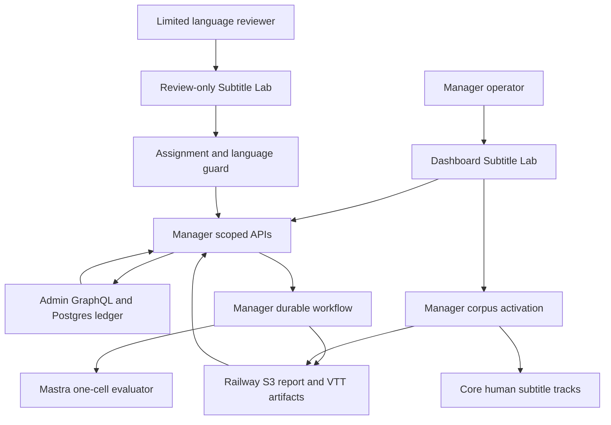
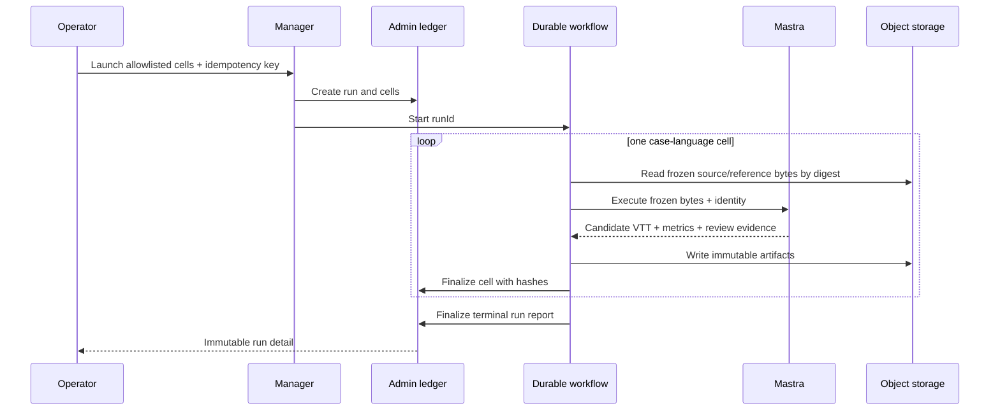
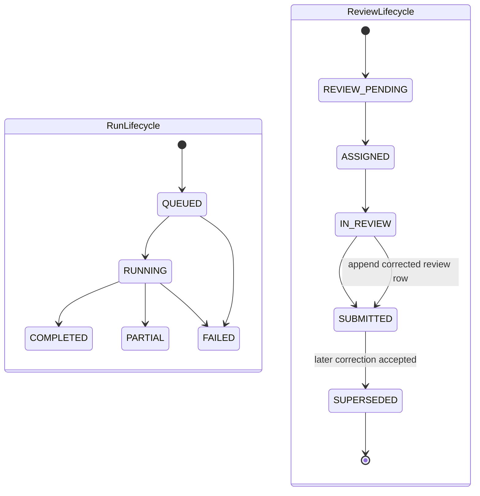

# Subtitle Quality Lab - Plan

## Goal Capsule

- **Objective:** Forge operators can run repeatable subtitle-translation evaluations in the cloud, and language-qualified contributors can review assigned results against human reference subtitles without gaining access to the rest of Manager.
- **Means:** Add an Admin-owned versioned evaluation ledger, a Manager durable orchestration and review surface, and a bounded Mastra cloud cell runner built on the existing offline evaluator (KTD1, KTD2, KTD3).
- **Authority:** Product requirements in this plan govern behavior. KTDs govern implementation. Existing package guides and security rules override unit-local preferences.
- **Execution profile:** Cross-app code change across Admin, Manager, Mastra, and generated Admin GraphQL contracts.
- **Stop conditions:** Do not deploy, publish subtitles, change the production subtitle model, promote a prompt, merge, push, or open a PR. Stop for any migration conflict, unresolvable generated-contract drift, or requirement for production credentials.
- **Tail ownership:** This session implements and reviews the local branch only. The user retains merge, deployment, reviewer provisioning, corpus approval, and production-promotion authority.

---

## Product Contract

### Summary

Build a Subtitle Quality Lab inside Manager. Operators launch a bounded cloud evaluation from a frozen human-reference corpus, inspect immutable reports, assign review cells, and compare a candidate run with a baseline. Limited contributors enter a separate review-only surface where video, source subtitles, human reference subtitles, and AI subtitles stay synchronized. Machine metrics and diffs accelerate scanning, while humans own meaning, naturalness, cultural, scripture, theology, reference-quality, and gold-standard judgments.

### Problem Frame

The current evaluator proves that Mastra can translate and score a frozen corpus, but it runs from a developer workstation and leaves human review in a JSON template. That makes evidence hard to repeat, assign, audit, and use for iterative prompt or workflow improvement. Manager authentication currently assumes every member is an operator, so adding contributors also creates a material authorization risk.

### Key Decisions

- **Cloud runs always create a durable report, including terminal failure reports.** (session-settled: user-directed — chosen over local-only evaluation: reports must be reviewable and comparable over time) Governs R1, R3, R4.
- **Contributors receive a separate language-scoped review experience.** (session-settled: user-directed — chosen over full Manager membership: contributors need limited access for many languages) Governs R7, R8, R9, R10.
- **Machine evidence reduces human work but cannot claim human approval.** (session-settled: user-directed — chosen over fully automatic quality approval: humans remain necessary for irreducible language and theology judgments) Governs R11, R12, R14.
- **Evaluation is isolated from publication and production promotion.** (session-settled: user-directed — chosen over an automatic feedback-to-production loop: the user explicitly retains merge and production authority) Governs R13, R15.

### Actors

- A1. **Operator:** An existing Manager operator who can manage the corpus projection, launch runs, create assignments, inspect all reports, and compare experiments.
- A2. **Language reviewer:** A limited Manager member with active grants for exact Admin language identities. This actor can only read and submit assigned review cells.
- A3. **Specialist reviewer:** A reviewer grant marked for scripture or theology escalation. This is a capability on A2, not a wider Manager role.
- A4. **Manager workflow:** The durable coordinator that creates run state before paid work, invokes Mastra, stores artifacts, and finalizes Admin evidence.
- A5. **Mastra runner:** The bounded provider-heavy executor that verifies frozen inputs, translates one cell, computes metrics, and prepares review evidence.

### Requirements

**Corpus and reproducible runs**

- R1. The Lab exposes a versioned gold-corpus projection derived from the five-case subtitle manifest and lock, with exact source/reference VTT byte snapshots, corpus identity, authority, and content hashes visible in run evidence.
- R2. Corpus cells and reviewer authorization use exact Admin `Language.id` plus stable `Language.slug`; BCP-47 remains display/runtime metadata and cannot authorize access.
- R3. An operator can launch only allowlisted corpus cases, target languages, model and prompt-policy identifiers, and bounded runtime settings with an idempotency key. V1 admits at most 20 cells, concurrency 1-3, 60-600 seconds per cell, two attempts per cell, two active runs per operator, and four active runs globally; deployment configuration may lower but not raise these source-controlled ceilings.
- R4. Every accepted launch creates an Admin run before Mastra dispatch and exactly one separate immutable terminal report even when configuration, process death, network, provider, translation, scoring, or artifact persistence fails.
- R5. Each terminal report records the corpus identity, source/reference digests, provider-request and response identities, requested and provider-resolved model revision when available, prompt and workflow-policy identities, code revision, determinism settings, runtime settings, usage, per-language metrics, artifact digests, reproducibility limits, and partial-failure detail.
- R6. An operator can compare one candidate run with one baseline over the same corpus cells, with per-language and per-collection descriptive deltas, sample counts, an explicit warning for unmatched cells, and an insufficient-evidence label for any aggregate below five cells or three collections. Comparisons name the declared changed axis and never claim causality from a single run pair.

**Restricted contributor workflow**

- R7. A reviewer account has `ManagerRole.REVIEWER` and one or more active language grants tied to Admin languages; each grant records bounded qualification evidence and which rubric dimensions the reviewer may judge. Access, qualification, and grant revocation are revalidated from Admin on every request.
- R8. Existing Manager dashboard pages and APIs remain operator-only after the reviewer role is introduced.
- R9. A reviewer can list and open only assignment rounds whose reviewer identity and exact target language match the current session and an active language grant.
- R10. Review report, video-context, source/reference text, and generated-artifact routes enforce the same assignment boundary and return a non-disclosing not-found response outside it.

**Review experience and learning**

- R11. The review page plays the video and displays synchronized source plus stable randomized Track A and Track B subtitle columns with click-to-seek, previous/next segment, and bounded segment looping; human/AI provenance is hidden until submission and remains named for operators.
- R12. Review segments align by connected time overlap and distinguish lexical/grapheme changes, timing deltas, and neutral Track-A/Track-B difference flags without labeling lexical difference alone as an error or revealing reference provenance. Directional human-reference and AI labels plus advisory semantic-risk flags appear only after submission.
- R13. A reviewer submits an append-only versioned V1 review: required 1-5 scores for meaning accuracy, target-language naturalness, and timing/readability; an optional scripture/theology score only for a qualified specialist; one verdict from `PASS`, `NEEDS_CHANGES`, `REFERENCE_QUESTIONABLE`, or `SPECIALIST_REVIEW`; allowlisted issue codes; critical-error flags; notes up to 4,000 characters; and up to 100 Track-A/Track-B-relative segment corrections of 1,000 characters each. Reviewer identity comes only from a short-lived Admin-verifiable interactive assertion bound to audience, assignment, method, body digest, nonce, and expiry; the service bearer alone cannot submit human evidence.
- R14. Machine assessments and automatic metrics stay separate from human reviews and never count as human approval, gold approval, or specialist approval.
- R15. Runs, assignments, reviews, comparisons, and corpus approval have no mutation path to published VideoSubtitle rows, production prompt labels, deployment, or merge state.
- R16. An operator can attach an append-only experiment narrative to a baseline/candidate pair: pre-run hypothesis, one declared changed axis, post-review conclusion, decision rationale, and follow-up action, without activating a prompt or publishing subtitles.
- R17. A `REFERENCE_QUESTIONABLE` verdict creates an operator-visible corpus issue and prevents the affected cell or version from receiving approved status until disposition; an accepted correction creates a new frozen corpus version.
- R18. A scripture/theology escalation creates a separate pending specialist assignment for a reviewer with the same active language grant and matching qualification, then records a separate append-only specialist submission.

### Key Flows

- F1. **Launch and finalize a run**
  - **Trigger:** A1 submits an allowlisted corpus selection and runtime configuration.
  - **Actors:** A1, A4, A5
  - **Steps:** Manager creates the run and cells idempotently, starts a durable workflow, executes bounded cells, stores artifacts, then finalizes an immutable report or terminal failure report.
  - **Outcome:** A queryable run exists with complete identity and evidence.
  - **Covered by:** R1, R2, R3, R4, R5
- F2. **Review an assigned cell**
  - **Trigger:** A2 opens the review-only queue.
  - **Actors:** A2, A3
  - **Steps:** Manager revalidates role and language grants, filters assignments, authorizes detail and artifact access, synchronizes the review player, and appends the interactive user's review.
  - **Outcome:** Human evidence is attached to the cell without widening Manager or publication access.
  - **Covered by:** R7, R8, R9, R10, R11, R12, R13, R14, R15
- F3. **Compare an experiment**
  - **Trigger:** A1 selects a baseline and candidate run.
  - **Actors:** A1
  - **Steps:** The Lab joins identical corpus cells, presents descriptive per-language deltas and human verdicts, separates unmatched or still-pending cells, and records the hypothesis, declared changed axis, conclusion, rationale, and next action.
  - **Outcome:** The operator retains a durable prompt/workflow learning record without promoting it automatically.
  - **Covered by:** R5, R6, R14, R15, R16
- F4. **Resolve reference and specialist questions**
  - **Trigger:** A2 submits a reference-questionable or specialist-review verdict.
  - **Actors:** A1, A2, A3
  - **Steps:** The Lab opens a corpus issue or specialist assignment, blocks affected approval while pending, and appends the operator disposition or specialist judgment without mutating the original review.
  - **Outcome:** High-stakes and reference-quality concerns have an auditable resolution path.
  - **Covered by:** R13, R17, R18

### Acceptance Examples

- AE1. **Covers R4.** Given a valid launch whose provider call times out after one cell completes, when the durable workflow terminates, then the run report records one completed cell, the failed cells, artifact inventory, and terminal partial or failed status.
- AE2. **Covers R7, R8, R9.** Given a Spanish reviewer with one assigned Spanish cell, when that reviewer requests a French cell or an existing Jobs API, then the server denies the request even if the reviewer supplies the target ID directly.
- AE3. **Covers R7, R10.** Given a reviewer whose Spanish grant was revoked after login, when the reviewer reloads the assignment or generated VTT, then the next request returns a non-disclosing not-found response.
- AE4. **Covers R11, R12.** Given a human reference with one cue aligned to two AI cues, when the reviewer selects the connected segment, then all overlapping text appears together and the video loops the combined time window.
- AE5. **Covers R13, R14.** Given a service bearer and a completed machine assessment, when either attempts to submit a human verdict, then no human review is created.
- AE6. **Covers R6.** Given baseline and candidate runs with different cell sets, when an operator compares them, then only matched cells contribute to deltas and unmatched cells are listed explicitly.
- AE7. **Covers R13.** Given a Manager service bearer without a live body-bound reviewer assertion, when it attempts to submit a verdict, then Admin creates no human review.
- AE8. **Covers R17, R18.** Given a reference-questionable or scripture/theology escalation, when it is submitted, then approval is blocked and the matching corpus issue or qualified-specialist assignment is visible to an operator.

### Success Criteria

- The packaged five-video corpus can run as individual cells in cloud-compatible code and produce a durable report projection.
- A limited reviewer can complete an assigned review without being able to access another language, another assignment, or the existing Manager dashboard APIs.
- An operator can scan run-level and per-language evidence, open a synchronized review, and compare a baseline with a candidate.
- Every tested failure path leaves an auditable terminal report instead of an orphaned running record.

### Scope Boundaries

**In scope**

- The packaged provisional five-video corpus and its four current target languages, represented as a versioned seed that can support additional language rows later.
- Operator run list/detail/launch/comparison and assignment controls.
- Reviewer queue/detail/submission with synchronized video and segment diffs.
- Versioned V1 human-review rubric, reference-issue disposition, specialist escalation, and experiment narratives.
- Local implementation, generated contracts, migration, automated tests, and browser QA.

**Deferred to Follow-Up Work**

- Automatic reviewer assignment, reviewer calibration, double review, adjudication, inter-rater agreement, hidden holdout management, repeated-run variance estimation, adaptive sampling, active learning, and scheduled regression gates. Until then, every report is labeled developmental/descriptive and must not claim generalization or causality.
- Native Mastra Dataset/Scorer/Experiment projection. The Lab's domain report remains authoritative for this slice.
- In-product Auth identity creation, invitations, email notifications, and contributor payments. Existing Auth/Admin identities are provisioned outside this feature.
- Full corpus authoring and arbitrary video import UI. This slice imports the packaged frozen manifest and lock.
- Production prompt activation, model-default changes, subtitle publication, deployment, merge, push, and PR creation.

---

## Planning Contract

### Key Technical Decisions

- KTD1. **Preserve the existing operator boundary and add a separate reviewer lane.** (session-settled: user-directed — chosen over admitting reviewers through the shared dashboard: limited accounts must not inherit operator access) `requireAuth()` and `authenticateRequest()` stay operator-only. Reviewer pages live outside the shared dashboard layout and use a distinct interactive-session guard that returns current language grants. Governs R7, R8, R9, R10.
- KTD2. **Admin owns normalized ledger state; Manager owns workflow and artifacts; Mastra owns execution and scoring.** (session-settled: user-approved — chosen over a Manager-only ledger: existing Forge ownership patterns keep durable truth and provider execution in their canonical services) Admin stores corpus versions, runs, cells, assignments, machine assessments, append-only human reviews, and comparison metadata. Manager stores immutable VTT/report bytes in Railway S3 and coordinates work. Mastra executes one bounded cell. Governs R1, R3, R4, R5, R13.
- KTD3. **Execute one case-language cell per Mastra request under a fenced lease.** A cell idempotency key binds run, case, exact target language, model, and workflow-policy digest. Reclaimable run/cell leases use generation and token fencing so retries or stale-run recovery cannot publish competing completions. This bounds request size, isolates partial failure, and prevents multi-language authorization or ownership from collapsing into aggregate state. Governs R2, R3, R4.
- KTD4. **Freeze executable identity and corpus bytes before dispatch.** Corpus activation copies exact source/reference VTT bytes into content-addressed immutable storage and pins manifest/lock digests, track identities, edition/cut identity, and object digests. Every run also pins prompt/workflow/code identities and allowlisted parameters. Corrections create a new corpus version or run. Governs R1, R3, R5.
- KTD5. **Keep mutable execution, immutable machine reports, and append-only human evidence separate.** The run and cell rows may change while leased execution is active. Terminalization creates exactly one report row. Human submissions append a review row, with supersession available for a later correction. Machine assessment rows cannot satisfy human-review state. Governs R4, R5, R13, R14.
- KTD6. **Serve content-addressed review evidence through assignment-aware Manager routes.** Store object keys and hashes in Admin, but do not expose raw S3 keys or long-lived signed URLs as authorization. Writes cannot overwrite an existing digest key. Every report/VTT/video-context request resolves the current actor and assignment first and returns private, no-store responses. Governs R9, R10.
- KTD7. **Align cues by connected time overlap and diff with locale-aware segmentation.** Reference-versus-AI text uses `Intl.Segmenter` word segmentation with grapheme fallback. Source-language text is context, not a lexical diff target. Text uses `dir="auto"` and bidi isolation. Governs R11, R12.
- KTD8. **Comparisons are read-only paired projections.** A comparison references two immutable terminal reports, enforces one declared changed-axis label, records every other identity difference, and computes descriptive deltas only for matching corpus case and exact language identities. It cannot claim causality or activate a candidate. Prompt experiments select an immutable allowlisted `promptPolicyId` inside an otherwise unchanged runner. Governs R6, R15, R16.
- KTD9. **Reviewer comparison is blind and assignment-stable.** A stored presentation seed randomizes human and AI tracks as A/B for the assignment round. Model, workflow, aggregate score, provenance, and semantic-risk labels are hidden until submission to limit anchoring; operators retain full provenance. Governs R11, R13, R14.
- KTD10. **Version the human rubric as data.** V1 scores meaning accuracy, naturalness, and timing/readability from 1 (unusable/meaningfully wrong) through 3 (usable with material edits) to 5 (publication-quality), with scripture/theology restricted to qualified specialists. Issue codes are `MISTRANSLATION`, `OMISSION`, `ADDITION`, `TERMINOLOGY`, `GRAMMAR`, `NATURALNESS`, `TONE_REGISTER`, `TIMING`, `LINE_BREAK`, `READING_SPEED`, `SCRIPTURE`, `THEOLOGY`, `REFERENCE_ERROR`, and `OTHER`; critical flags are meaning loss, harmful/offensive rendering, and scripture/theology risk. Reports always retain rubric version and per-dimension qualification. Governs R7, R13, R14, R18.
- KTD11. **Bind human authority and security changes to auditable interactive actors.** Admin mints short-lived reviewer assertions during session revalidation and independently rechecks nonce, membership, grant, qualification, assignment, request method, and body digest on submit. Grant, qualification, specialist capability, assignment, corpus approval, and revocation changes append actor/timestamp/request/reason audit events. Governs R7, R8, R9, R10, R13, R17, R18.

### High-Level Technical Design

The diagrams are directional implementation guidance. The requirements and KTDs remain authoritative.







### Output Structure

```text
apps/admin/
  prisma/migrations/0052_subtitle_quality_lab/
  src/services/subtitle-eval.service.ts
  src/graphql/types/managerSubtitleEval.ts
apps/manager/src/
  app/dashboard/subtitle-lab/
  app/subtitle-review/
  app/api/subtitle-lab/
  features/subtitle-lab/
  services/mastra-subtitle-eval.ts
  workflows/subtitleEval.ts
apps/mastra/src/
  evals/subtitle-translation/cloud-runner.ts
  mastra/workflows/subtitle-translation-eval.ts
```

### Assumptions

- Existing Auth users and Admin User rows are provisioned before a reviewer grant is created.
- Operator-managed grant creation can be exposed through the Lab only for existing Admin users; identity invitation remains external.
- The packaged corpus remains `provisional` until a qualified curator records edition/cut verification, video synchronization review, target-language correctness review, benchmark reuse authority, reviewer identities, and approval evidence. Provisional runs are developmental evidence and cannot be labeled an approved publication gate.
- Core media URLs are read only during Manager-owned corpus activation. Activation downloads each locked track, verifies raw and clipped digests, conditionally writes digest-keyed immutable objects, and records object identities in Admin. Cloud execution reads those exact snapshots and re-verifies their digests before paid model calls.
- Manager's existing Railway S3 configuration is the artifact backend in deployed environments and local temporary storage remains the development fallback.
- Reviewer interface chrome and rubric help are English-only in V1 but all strings remain localizable; subtitle content itself uses locale-aware and bidirectional-safe rendering.

### System-Wide Impact

- **Authorization:** Adding `REVIEWER` changes the Manager session union. All existing Manager API and dashboard entry points must remain explicitly operator-only before reviewer login is accepted.
- **Data lifecycle:** Machine reports and artifact identities are immutable. Human reviews append. Bulky report/VTT artifacts may be compacted later, but ledger identity and review records remain.
- **Language identity:** New foreign keys use Admin `Language.id`; cross-service payloads also carry exact slug/core identity. BCP-47 cannot be the access key.
- **GraphQL contracts:** Pothos changes require `apps/admin/schema.graphql` and `packages/admin-graphql` regeneration in the same change.
- **Cost and retries:** Paid calls are bounded per cell. Retries reuse the same cell idempotency identity and may only repeat failures classified as retryable.
- **Admission budgets:** Admin transactionally enforces the source ceilings from R3 plus configurable per-run and rolling 24-hour estimated-spend ceilings before dispatch. Missing production budget configuration fails closed; local development may use an explicit test budget.
- **Personal data:** Reviewer identity, notes, and corrections are personal data. Request bodies and free text are redacted from telemetry; the production-readiness handoff must set retention, pseudonymization/erasure, backup, and environment-isolation policy before deployment.
- **Accessibility and international text:** Review interaction must support keyboard navigation, visible focus, `dir="auto"`, bidi isolation, CJK/grapheme segmentation, and logical CSS properties.

### Risks and Dependencies

- A reviewer-role regression could expose unrelated Manager APIs. Mitigate with an operator/reviewer/service/revoked authorization matrix before UI work.
- A timeout after a paid call can duplicate cost. Mitigate with per-cell idempotency, fenced leases, and terminal-result replay semantics.
- Core VTT bytes can drift after the lock was prepared. Snapshot verified bytes into content-addressed storage at corpus activation and create a new corpus version for approved changes.
- Manager can die before its finalization path runs. Add a lease-aware stale-run recovery entry point that terminalizes unrecoverable cells and writes the single failure or partial report.
- Workflow dispatch itself can fail after run creation. Immediately terminalize that run through the same idempotent recovery service, and invoke the service from a bounded service-bearer scheduled route for abandoned leases.
- Large inline reports can overload Admin queries. Store bounded scalar summaries in list rows and lazy-load validated report detail plus S3 artifacts.
- Pothos nested relations can bypass root ABAC. Prefer service-shaped object projections and reapply assignment/language filters to every nested resolver.
- Video playback may be unavailable for a corpus case. Finalize the machine report and mark the review cell blocked with an operator-visible reason instead of dropping it.
- A visible five-case corpus can invite benchmark overfitting. Label V1 as a development benchmark, show sample/coverage counts, forbid causal/generalization claims, and defer protected holdouts plus repeated-run variance to follow-up work.

### Research Sources

- `docs/solutions/architecture-patterns/bounded-versioned-admin-owned-agent-job-audit-report.md`
- `docs/solutions/architecture-patterns/bind-eval-manifest-identity-to-execution-and-evidence.md`
- `docs/solutions/best-practices/language-identity-on-slug-not-bcp47-20260605.md`
- `docs/solutions/integration-issues/manager-agents-target-subtitle-contract-and-language-labels-20260412.md`
- `docs/solutions/graphql/pothos-relation-abac-filter-required-for-nested-types.md`
- `apps/manager/src/workflows/smartCrop.ts`
- `apps/manager/src/features/jobs/review-player/review-player-card.tsx`
- `apps/mastra/src/evals/subtitle-translation/runner.ts`
- `apps/admin/src/services/seo-experiment.service.ts`

---

## Implementation Units

### U1. Harden Manager access and add language reviewer grants

- **Goal:** Introduce reviewer identities without widening any existing Manager page or API.
- **Requirements:** R2, R7, R8, R9, R10
- **Dependencies:** None
- **Files:** `apps/admin/prisma/schema.prisma`, `apps/admin/prisma/migrations/0052_subtitle_quality_lab/migration.sql`, `apps/admin/src/auth/principal.ts`, `apps/admin/src/auth/permissions.ts`, `apps/admin/src/app/api/manager/session/route.ts`, `apps/admin/src/graphql/types/managerSession.ts`, `apps/manager/src/app/page.tsx`, `apps/manager/src/app/login/page.tsx`, `apps/manager/src/app/api/auth/callback/route.ts`, `apps/manager/src/app/api/auth/mock-login/route.ts`, `apps/manager/src/features/shell/manager-shell.tsx`, `apps/manager/src/lib/admin-manager-session.ts`, `apps/manager/src/lib/manager-session-cookie.ts`, `apps/manager/src/lib/auth.ts`, `apps/manager/src/lib/require-auth.ts`, and their tests
- **Approach:**
  1. Add `REVIEWER` and a language-grant relation keyed by Admin language identity, including active/revoked state, target/source proficiency evidence, rubric-dimension permissions, and specialist capability fields.
  2. Return current grant projections during Admin session validation.
  3. Keep current authentication helpers operator-only and add an interactive reviewer helper that exposes server-derived language grants.
  4. Pin the authorization matrix before any reviewer UI or endpoint is reachable; append actor-bound audit events for every grant, qualification, capability, assignment, corpus-approval, and revocation change.
  5. Route reviewer-compatible login, callback, mock-login, and root fallbacks to `/subtitle-review`, reject role-incompatible return targets, and hide the operator shell on the review-only route.
- **Patterns to follow:** Existing Manager session revalidation and Admin permission tests; KTD1.
- **Test scenarios:**
  - An operator session still passes every current Manager guard.
  - A reviewer session fails `authenticateRequest`, `requireAuth`, override actions, and representative Jobs, Coverage, SEO, Smart Crop, Shorts, and Agents API guards.
  - An active reviewer session returns exact language ID/slug grants and specialist capability.
  - A revoked membership or language grant stops authorizing on the next request.
  - BCP-47 collision fixtures cannot broaden a reviewer grant.
- **Verification:** Existing Manager access behavior is unchanged for operators and the full reviewer denial matrix passes.

### U2. Add the Admin subtitle evaluation ledger and GraphQL contract

- **Goal:** Persist reproducible corpus, run, cell, assignment, review, machine-assessment, and comparison state in Admin.
- **Requirements:** R1, R2, R4, R5, R6, R9, R13, R14, R15, R16, R17, R18
- **Dependencies:** U1
- **Files:** `apps/admin/prisma/schema.prisma`, `apps/admin/prisma/migrations/0052_subtitle_quality_lab/migration.sql`, `apps/admin/src/services/subtitle-eval.service.ts`, `apps/admin/src/services/subtitle-eval.service.test.ts`, `apps/admin/src/services/index.ts`, `apps/admin/src/graphql/types/managerSubtitleEval.ts`, `apps/admin/src/graphql/types/managerSubtitleEval.test.ts`, `apps/admin/src/graphql/schema.ts`, `apps/admin/schema.graphql`, `packages/admin-graphql/src/admin-graphql-env.d.ts`
- **Approach:**
  1. Add normalized records that separate mutable leased execution from one immutable terminal report, content-addressed artifact identity, versioned rubric, qualification, assignment/specialist rounds, reference issues, experiment narratives, audit events, and append-only human reviews per KTD2, KTD4, KTD5, KTD10, and KTD11.
  2. Import the packaged corpus manifest/lock as a deterministic versioned seed through an operator-only idempotent service operation.
  3. Expose scalar run pages, lazy detail, exact assignment-scoped reviewer reads, operator launch/finalization/assignment/corpus-issue mutations, interactive review submission, read-only paired comparisons, and append-only experiment narratives.
  4. Mint short-lived body-bound reviewer assertions during session revalidation; verify nonce, expiry, membership, grant, qualification, assignment, method, and body digest independently in Admin before append, then reject replay, duplicate, or supersession-invalid submissions.
  5. Transactionally apply active-run and configured rolling-spend admission limits before a launch is accepted.
- **Patterns to follow:** `SeoRun`, `SeoProposalVersion`, `SeoDecision`, `SeoExperiment`, manager SEO report projections, and the nested ABAC learning.
- **Test scenarios:**
  - Importing the same manifest/lock twice returns the same corpus version; changed hashes create a new version.
  - Creating a run twice with the same idempotency key returns one run and stable cells.
  - A terminal cell or report cannot be rewritten with different hashes.
  - A stale lease can be reclaimed only with a higher fence generation, and an older worker cannot finalize afterward.
  - Reviewer queries and mutations filter by reviewer ID, assignment, and exact active language grant at root and nested paths.
  - A service actor cannot create a human review without the interactive reviewer contract.
  - Superseding a review appends a row and preserves the previous submission.
  - A comparison records all identity differences, accepts exactly one declared changed axis, labels deltas descriptive, and excludes unmatched cells from deltas.
  - A reference-questionable verdict opens one corpus issue and blocks approval; a specialist verdict opens one qualification-compatible specialist round.
  - Service-bearer-only, expired, replayed, assignment-mismatched, or body-mismatched assertions cannot append a human review.
- **Verification:** Migration, Prisma client, Pothos schema, generated Admin GraphQL contract, and service/authorization tests agree.

### U3. Convert the offline evaluator into a bounded cloud cell runner

- **Goal:** Reuse production subtitle translation and existing metrics in a protected cloud-compatible Mastra endpoint.
- **Requirements:** R1, R2, R3, R4, R5, R12, R14
- **Dependencies:** None
- **Files:** `apps/mastra/src/evals/subtitle-translation/types.ts`, `apps/mastra/src/evals/subtitle-translation/runner.ts`, `apps/mastra/src/evals/subtitle-translation/cloud-runner.ts`, `apps/mastra/src/evals/subtitle-translation/cloud-runner.test.ts`, `apps/mastra/src/evals/subtitle-translation/review-evidence.ts`, `apps/mastra/src/evals/subtitle-translation/review-evidence.test.ts`, `apps/mastra/src/mastra/workflows/subtitle-translation-eval.ts`, `apps/mastra/src/mastra/workflows/subtitle-translation-eval.test.ts`, `apps/mastra/src/mastra/index.ts`
- **Approach:**
  1. Extract an in-memory one-cell execution seam while retaining the filesystem CLI adapter.
  2. Accept the bounded source/reference VTT bytes read from the activated content-addressed snapshots and verify their stored digests, manifest/lock identity, and selected track before invoking providers; cloud execution never refetches Core.
  3. Return a strict bounded envelope containing candidate VTT, automatic metrics, usage, identity attestation, and connected-overlap review segments.
  4. Protect the route with the existing service bearer, validate allowlisted input, and classify deterministic versus retryable failures.
- **Execution note:** Start with route-contract and one-to-many cue-alignment tests before refactoring the runner.
- **Patterns to follow:** Existing `forge-subtitle-enrichment`, offline search eval routes, and service bearer validation; KTD3 and KTD7.
- **Test scenarios:**
  - A locked case-language cell returns VTT, metrics, usage, identity hashes, and aligned review segments.
  - Unknown case, target language, model, or out-of-bound timeout/concurrency is rejected before provider execution.
  - Drifted source or reference bytes fail before a paid translation call.
  - One human cue overlapping two AI cues produces one connected review segment.
  - CJK, combining marks, emoji, and RTL strings produce stable grapheme-aware diffs.
  - Provider, scoring, and serialization failures return strict classified envelopes without publishing artifacts.
- **Verification:** The CLI evaluator retains its tests and the protected cloud route passes contract, auth, drift, alignment, and failure tests.

### U4. Add Manager durable orchestration, artifacts, and scoped APIs

- **Goal:** Turn operator launches into idempotent cloud runs that always finalize an Admin report and expose only authorized evidence.
- **Requirements:** R3, R4, R5, R9, R10, R15
- **Dependencies:** U1, U2, U3
- **Files:** `apps/manager/src/services/mastra-subtitle-eval.ts`, `apps/manager/src/services/mastra-subtitle-eval.test.ts`, `apps/manager/src/services/subtitle-eval-artifacts.ts`, `apps/manager/src/services/subtitle-eval-artifacts.test.ts`, `apps/manager/src/services/subtitle-corpus-activation.ts`, `apps/manager/src/services/subtitle-corpus-activation.test.ts`, `apps/manager/src/workflows/subtitleEval.ts`, `apps/manager/src/workflows/subtitleEval.test.ts`, `apps/manager/src/workflows/subtitleEvalRecovery.ts`, `apps/manager/src/workflows/subtitleEvalRecovery.test.ts`, `apps/manager/src/workflows/launchSubtitleEval.ts`, `apps/manager/src/features/subtitle-lab/subtitle-lab-admin-client.ts`, `apps/manager/src/features/subtitle-lab/subtitle-lab-contract.ts`, `apps/manager/src/app/api/scheduled/subtitle-eval-recovery/route.ts`, `apps/manager/src/app/api/subtitle-lab/runs/route.ts`, `apps/manager/src/app/api/subtitle-lab/runs/[runId]/route.ts`, `apps/manager/src/app/api/subtitle-lab/assignments/route.ts`, `apps/manager/src/app/api/subtitle-lab/reviews/route.ts`, `apps/manager/src/app/api/subtitle-lab/assignments/[assignmentId]/artifacts/[kind]/route.ts`, and their tests
- **Approach:**
  1. Activate a corpus by downloading each locked Core VTT, verifying raw/clipped digests, conditionally writing digest-keyed snapshots, and recording their immutable identities in Admin; create run/cells in Admin before starting the durable workflow.
  2. Execute cells with bounded parallelism and stable idempotency identities, persist content-addressed VTT/report artifacts without overwrite, and finalize every cell and run in `finally`-safe paths.
  3. Add fenced lease recovery that resumes retryable work or creates the single terminal partial/failure report for an abandoned run. Invoke it immediately when workflow dispatch rejects and from a service-bearer scheduled route over bounded stale-run pages.
  4. Keep operator launch, corpus, assignment, and comparison APIs on the operator guard.
  5. Keep queue/detail/review/artifact APIs on the interactive reviewer guard and resolve assignment authorization before returning private, no-store evidence.
- **Patterns to follow:** Smart Crop launch/workflow/finalization, Admin client Zod validation, storage artifact routes, KTD2, KTD3, and KTD6.
- **Test scenarios:**
  - Replaying one logical launch creates one Admin run and one workflow dispatch.
  - Partial provider failure stores successful VTTs and still finalizes a terminal report.
  - Artifact write failure is represented in the report and cannot leave the run indefinitely running.
  - Stale-run recovery creates one terminal report and rejects completion from an older fence generation.
  - Dispatch rejection and the scheduled recovery route terminalize abandoned work idempotently.
  - Operator/service/reviewer authorization is correct for every new route; service bearers cannot submit reviews.
  - Wrong reviewer, wrong language, revoked grant, and guessed assignment/artifact IDs return non-disclosing not-found responses.
- **Verification:** Workflow and route tests prove idempotency, terminal finalization, artifact integrity, and authorization before UI integration.

### U5. Build the shared synchronized subtitle review experience

- **Goal:** Let language reviewers scan and judge a cell efficiently while watching its video.
- **Requirements:** R9, R10, R11, R12, R13, R14
- **Dependencies:** U4
- **Files:** `apps/manager/src/app/subtitle-review/layout.tsx`, `apps/manager/src/app/subtitle-review/page.tsx`, `apps/manager/src/app/subtitle-review/[assignmentId]/page.tsx`, `apps/manager/src/features/subtitle-lab/reviewer-queue.tsx`, `apps/manager/src/features/subtitle-lab/subtitle-review-workspace.tsx`, `apps/manager/src/features/subtitle-lab/subtitle-review-workspace.test.tsx`, `apps/manager/src/features/subtitle-lab/subtitle-segment-diff.tsx`, `apps/manager/src/features/subtitle-lab/subtitle-segment-diff.test.tsx`, `apps/manager/src/features/subtitle-lab/subtitle-review-form.tsx`, `apps/manager/src/app/globals.css`
- **Approach:**
  1. Render a reviewer-only queue and a shared detail component that operators can also open.
  2. Reuse `@forge/video-player` and its player ref for click-to-seek, keyboard previous/next, and bounded segment loop.
  3. Display source plus assignment-stable Track A and Track B columns with neutral lexical and timing treatments, plus `dir="auto"` and bidi isolation; hide provenance, directional labels, aggregate scores, and semantic-risk labels until submission.
  4. Submit the KTD10 rubric with Track-A/Track-B-relative corrections and questionable-track controls; map to provenance server-side and hide model/prompt identity from reviewer presentation.
  5. Define queue loading/empty/error/assigned/submitted/blocked states; detail artifact/video/grant-revoked/not-found states; preserve entered work across retryable submit errors; disable duplicate pending submits; and reveal provenance on the post-submit receipt with an explicit append-only correction action.
  6. On wide screens keep video and source/A/B comparison visible together. On narrow screens keep video and selected-segment context persistent, switch source/A/B explicitly, use full-width controls, and avoid horizontal page scrolling.
  7. Provide non-color diff markers, semantic segment grouping, accessible Track-A/Track-B labels, and announced active-segment, validation-error, and provenance-reveal changes.
- **Patterns to follow:** Existing review player, Manager palette and component conventions, KTD7.
- **Test scenarios:**
  - Clicking a segment seeks to its start and loop mode pauses or returns at its end.
  - Keyboard controls traverse segments and expose accessible labels and focus.
  - One-to-many, missing-source, missing-reference, long-caption, RTL, CJK, and empty-risk states render without cue-index assumptions.
  - Lexical differences remain neutral evidence until the reviewer labels an issue.
  - Reopening an assignment preserves A/B ordering, different assignments may randomize it, and provenance is revealed only after successful submission.
  - Required rubric fields, critical-error flags, correction text bounds, double-submit idempotency, and reference escalation behave correctly.
  - Loading, empty, blocked, revoked, artifact/video failure, preserved retry, post-submit, correction, narrow-screen, non-color, and screen-reader states behave as specified.
- **Verification:** Component tests and browser QA show synchronized playback, scan-friendly diffs, international text handling, and a complete review submission.

### U6. Add the operator Lab dashboard, run reports, assignments, and comparisons

- **Goal:** Give operators one Manager panel for corpus state, launches, immutable reports, human progress, and prompt/workflow experiments.
- **Requirements:** R1, R3, R4, R5, R6, R13, R14, R15
- **Dependencies:** U4, U5
- **Files:** `apps/manager/src/app/dashboard/subtitle-lab/page.tsx`, `apps/manager/src/app/dashboard/subtitle-lab/runs/[runId]/page.tsx`, `apps/manager/src/features/subtitle-lab/subtitle-lab-dashboard.tsx`, `apps/manager/src/features/subtitle-lab/subtitle-lab-dashboard.test.tsx`, `apps/manager/src/features/subtitle-lab/subtitle-run-report.tsx`, `apps/manager/src/features/subtitle-lab/subtitle-run-comparison.tsx`, `apps/manager/src/features/subtitle-lab/subtitle-assignment-control.tsx`, `apps/manager/src/features/shell/manager-shell.tsx`, `apps/manager/src/app/globals.css`
- **Approach:**
  1. Add a Manager shell navigation entry and operator-only dashboard.
  2. Make corpus authority plus primary launch and active/recent runs the overview hierarchy; make run detail the report evidence, artifacts, human progress, assignments, corpus issues, and specialist state; keep comparison selection/detail distinct.
  3. Let operators assign eligible cells only to reviewers with matching active language grants.
  4. Compare baseline and candidate runs by matched cell, display declared changed axis, every other identity difference, coverage/sample labels, and unmatched cells, and provide no activation control.
  5. Append the experiment hypothesis, conclusion, rationale, and follow-up action, and let operators disposition reference issues or assign qualified specialists without mutating prior evidence.
- **Patterns to follow:** SEO run list/detail, Smart Crop review/action layout, current shell navigation, KTD8.
- **Test scenarios:**
  - Provisional corpus status and frozen hashes are visible before launch.
  - Invalid model, language, concurrency, or duplicate launch inputs cannot dispatch.
  - Partial and failed reports remain inspectable and distinguish machine evidence from human progress.
  - Assignment controls exclude mismatched, revoked, and ungranted reviewers.
  - Baseline comparison reports per-language deltas and excludes unmatched cells from aggregates.
- **Verification:** Operator component tests and browser QA cover launch, history, report, assignment, shared review, and comparison paths without a publication action.

### U7. Document operations and validate the cross-app contract

- **Goal:** Leave the feature reproducible, supportable, and safe to hand off without deploying it.
- **Requirements:** R1 through R18
- **Dependencies:** U1, U2, U3, U4, U5, U6
- **Files:** `apps/admin/CLAUDE.md`, `apps/manager/CLAUDE.md`, `apps/mastra/CLAUDE.md`, `apps/mastra/evals/subtitle-translation/README.md`, `docs/roadmap/media-generation/feat-397-subtitle-quality-lab.md`
- **Approach:**
  1. Document reviewer provisioning and qualification, language grants, body-bound reviewer assertions, corpus activation/certification, run lifecycle, failure recovery schedule, budgets, artifact and contributor-data retention, and the no-publication boundary.
  2. Regenerate Prisma and Admin GraphQL artifacts together.
  3. Run cross-app validation and browser QA, then record any production-only credential or provisioning steps for the user.
- **Patterns to follow:** Package-local runbooks and roadmap verification blocks.
- **Test scenarios:**
  - Test expectation: none -- this unit documents and validates behavior implemented in U1 through U6.
- **Verification:** Documentation matches the implemented contracts, all required generated files are current, scoped validation passes, and no deploy/merge/push/PR occurred.

---

## Verification Contract

| Gate                     | Applies to     | Command or evidence                                                                                                | Done signal                                                                                                                                               |
| ------------------------ | -------------- | ------------------------------------------------------------------------------------------------------------------ | --------------------------------------------------------------------------------------------------------------------------------------------------------- |
| Prisma generation        | U1, U2         | `pnpm --filter @forge/admin db:generate`                                                                           | New enum/models compile against generated client.                                                                                                         |
| Admin schema print       | U2             | `pnpm --filter @forge/admin schema:print`                                                                          | `apps/admin/schema.graphql` includes the Lab contract.                                                                                                    |
| Typed GraphQL generation | U2, U4         | `pnpm --filter @forge/admin-graphql generate`                                                                      | gql.tada output matches the printed schema and is not hand-edited.                                                                                        |
| Admin validation         | U1, U2         | `pnpm --filter @forge/admin test`, `pnpm --filter @forge/admin lint`, `pnpm --filter @forge/admin typecheck`       | Ledger, immutability, migration-facing types, and authorization matrix pass.                                                                              |
| Manager validation       | U1, U4, U5, U6 | `pnpm --filter @forge/manager test`, `pnpm --filter @forge/manager lint`, `pnpm --filter @forge/manager typecheck` | Workflow, routes, player/diff, and operator/reviewer boundaries pass.                                                                                     |
| Mastra validation        | U3             | `pnpm --filter @forge/mastra test`, `pnpm --filter @forge/mastra lint`, `pnpm --filter @forge/mastra typecheck`    | Offline CLI and cloud runner contracts both pass.                                                                                                         |
| Roadmap metadata         | U7             | `pnpm --filter roadmap lint`                                                                                       | `feat-397` and reverse dependency metadata are valid.                                                                                                     |
| Browser QA               | U5, U6         | Run the affected Manager routes locally with operator and reviewer fixtures                                        | Video seek/loop, diff scanning, review submit, report history, assignment, responsive layout, keyboard flow, and no page-loading regression are verified. |
| Repository hygiene       | All            | `git diff --check` and targeted generated-file review                                                              | No malformed diff, secret, downloaded corpus, `.env.local`, runtime report, or unrelated user file enters the change.                                     |

---

## Definition of Done

- U1 is done when reviewer identity and exact language grants exist, existing Manager surfaces stay operator-only, and revocation is effective on the next request.
- U2 is done when Admin can persist and query frozen corpus byte snapshots, leased mutable runs/cells, one immutable terminal report, assignment rounds, separate machine evidence, append-only human reviews, and paired comparisons through regenerated GraphQL contracts.
- U3 is done when one protected Mastra call can verify and execute a frozen case-language cell in cloud-compatible code while the offline CLI remains functional.
- U4 is done when Manager launches idempotently, stores content-addressed artifacts without overwrite, recovers stale leased runs, always creates exactly one terminal report, and enforces assignment authorization on every reviewer artifact route.
- U5 is done when an assigned reviewer can watch, navigate, compare, and submit a structured review across international text cases without seeing model/prompt identity.
- U6 is done when operators can see corpus state, launch bounded runs, inspect reports, assign matching reviewers, and compare a candidate with a baseline without any publication or activation action.
- U7 is done when docs, generated contracts, tests, type checks, lint, roadmap lint, browser QA, and repository-hygiene checks are complete.
- Abandoned experimental code and dead-end artifacts are removed from the diff.
- No production deployment, production data migration, reviewer provisioning, prompt promotion, subtitle publication, merge, push, PR, or main-branch change occurs.
