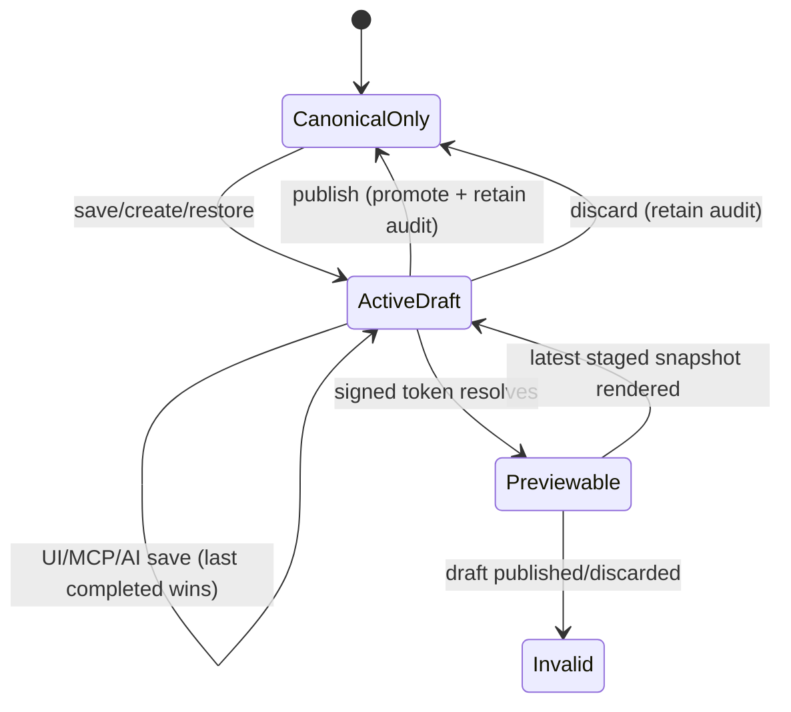

# Experience Draft Staging and Public Preview - Plan

## Goal Capsule

- **Objective:** Editors can prepare and preview changes to any language-specific Experience without changing the live page until they publish.
- **Product authority:** The user-approved scope in this plan governs draft isolation, preview visibility, collaboration, and publish behavior.
- **Open blockers:** None.

---

## Product Contract

### Summary

Every language-specific Experience can hold one shared staged draft while its published version remains live.
Editors can share an unlisted public preview of that draft, then publish or discard it independently of other languages.

### Problem Frame

The Experience editor currently writes saved changes directly to the canonical locale row.
When that row is already published, a save can change the public Experience before the editor deliberately publishes it.
This is particularly risky for a Homepage Experience because its content is the live home body for that language.

### Key Decisions

- **Published edits always use staging** (session-settled: user-directed — chosen over optional direct live editing: published Experiences should be protected by default). Governs R1, R5.
- **Drafts are language-specific** (session-settled: user-directed — chosen over one cross-language draft: each translated Experience is edited and published independently). Governs R2.
- **One shared draft uses last-save-wins collaboration** (session-settled: user-directed — chosen over personal drafts and conflict handling: the current editor group is small enough that overwrite protection is unnecessary). Governs R3, R4.
- **Preview is public but unlisted** (session-settled: user-directed — chosen over an authenticated-only preview: editors need a link they can share without login). Governs R9, R11.
- **Preview lifetime matches draft lifetime** (session-settled: user-directed — chosen over fixed-time expiry: the link should remain useful throughout the editing session). Governs R10.

### Actors

- A1. **Editor:** Saves and discards the shared draft and opens or shares its preview.
- A2. **Publisher:** Reviews the draft and promotes it to the live Experience under the existing publish permission.
- A3. **Preview visitor:** Opens an unlisted preview link without signing into Admin.
- A4. **Public visitor:** Continues to receive only the published Experience through ordinary routes and discovery surfaces.

### Requirements

**Draft isolation and collaboration**

- R1. Saving an already-published language-specific Experience must update its staged draft without changing the live canonical content or public-serving state.
- R2. Each language-specific Experience may have at most one active draft, and drafts for different languages of the same parent Experience must coexist independently.
- R3. Every permitted editor works on the same active draft for a language-specific Experience.
- R4. Draft saves use last-save-wins behavior without edit locks, merge handling, stale-save rejection, or overwrite warnings.
- R5. Fields whose save would affect the public Experience, including homepage designation, must remain staged until publish.
- R6. New unpublished Experiences remain unavailable to public consumers while their draft content evolves.

**Publish and discard**

- R7. Publishing must atomically preserve the prior live version in revision history, apply the complete active draft, and retire that draft.
- R8. Discarding must retire the active draft without changing the live version.

**Public preview**

- R9. An active draft must have an unguessable public preview URL that always renders its latest saved state and becomes invalid when the draft is published or discarded.
- R10. A preview URL has no independent time-to-live and remains valid for the lifetime of its language-specific draft.
- R11. Preview responses must be `noindex, nofollow` and must not appear in sitemaps, navigation, alternate-language discovery, structured data, or other bot-facing discovery surfaces.
- R12. Ordinary public Experience and Homepage routes must continue to render only published canonical content, even while a draft preview exists.

### Key Flows

- F1. Edit a published Experience
  - **Trigger:** A1 saves changes to a published language-specific Experience.
  - **Actors:** A1, A4
  - **Steps:** Admin creates or updates that Experience's active draft; ordinary public reads continue using the canonical published version.
  - **Outcome:** The editor's work is staged and the live page is unchanged.
  - **Covered by:** R1-R5, R12
- F2. Share a draft preview
  - **Trigger:** A1 opens or copies the preview link for an active draft.
  - **Actors:** A1, A3
  - **Steps:** The unguessable link resolves the active draft and renders its latest saved state with crawler suppression.
  - **Outcome:** A3 can review the draft without Admin access or public discovery.
  - **Covered by:** R9-R11
- F3. Publish a draft
  - **Trigger:** A2 publishes a language-specific Experience with an active draft.
  - **Actors:** A2, A4
  - **Steps:** The system atomically records the prior live version, promotes the draft, retires the draft, invalidates its preview, and refreshes affected public surfaces.
  - **Outcome:** Public visitors receive the new version only after publish completes.
  - **Covered by:** R7, R9, R12
- F4. Discard a draft
  - **Trigger:** A1 discards the active draft.
  - **Actors:** A1, A4
  - **Steps:** The system retires the draft and invalidates its preview without altering canonical content.
  - **Outcome:** The live Experience remains unchanged and no staged version remains.
  - **Covered by:** R8, R9, R12

### Acceptance Examples

- AE1. **Covers R1, R12.** Given an English Homepage Experience is published, when an editor changes its blocks and saves, then the ordinary English homepage still renders the prior published blocks.
- AE2. **Covers R2, R9.** Given English and Russian versions belong to the same parent Experience, when both are edited, then each language has its own active draft and preview link.
- AE3. **Covers R3, R4.** Given two editors save the same Russian draft in sequence, when the second save completes, then the shared draft reflects the second save without a conflict error.
- AE4. **Covers R7, R9.** Given a draft preview is valid, when a publisher publishes that draft, then the new content becomes live and the old preview URL no longer resolves the draft.
- AE5. **Covers R8, R9.** Given a published Experience has an active draft, when an editor discards it, then the live Experience is unchanged and the preview URL becomes invalid.
- AE6. **Covers R11.** Given a crawler or visitor opens a valid preview, then the response suppresses indexing and the preview is absent from sitemap and alternate-language discovery output.
- AE7. **Covers R5.** Given a published Experience is not the current homepage, when an editor stages `isHomepage = true`, then homepage resolution is unchanged until that draft publishes.
- AE8. **Covers R6.** Given a newly created Experience has never been published, when its draft is saved and previewed, then ordinary public queries and route discovery still cannot resolve it.
- AE9. **Covers R10.** Given an active draft preview link was created more than 60 days ago, when the draft remains active, then the same link still resolves its latest saved state.

### Scope Boundaries

- Multiple active, named, branched, or personal drafts for one language-specific Experience are out of scope.
- Approval stages beyond the existing edit and publish permissions are out of scope.
- Edit locks, merge handling, stale-save detection, and overwrite warnings are out of scope.
- Cross-language publish operations are out of scope.
- Fixed-time preview expiry is out of scope.

### Sources / Research

- `apps/admin/prisma/schema.prisma` documents the intended `ContentRevision` lifecycle and the `ExperienceLocale` publication model.
- `apps/admin/src/services/experience.service.ts` contains the current direct canonical update and publish behavior.
- `apps/admin/src/services/video-search-social.service.ts` provides an adjacent draft save, publish, and discard workflow.
- `apps/web/src/app/api/preview/route.ts` is a legacy global-secret preview entry and does not provide a per-draft token lifecycle.
- `docs/solutions/cms/admin-app-data-model-decisions.md` establishes canonical published rows plus staged `ContentRevision` drafts as the editorial model.

---

## Planning Contract

### Authority and Constraints

- The Product Contract above is the authority for behavior. The implementation may refine mechanics but must not weaken draft isolation, locale independence, last-save-wins, or preview invalidation.
- Existing published `ExperienceLocale` rows remain the canonical public source. An active `ContentRevision` with `entityType = ExperienceLocale`, the locale-row ID as `entityId`, and `status = DRAFT` is the sole staged aggregate.
- All Experience write surfaces—Admin UI, GraphQL, MCP, and persisted AI chat mutations—must call the same draft service. No interface may keep a direct canonical-update path.
- Ordinary public reads, route manifests, sitemaps, alternate-language links, and cached Watch data remain canonical-only.
- `Experience.isTemplate` is parent-scoped, so it cannot be staged independently in a locale draft. Locale draft inputs must not mutate it; post-creation template designation is deferred to a separate parent-level workflow.
- Active drafts are exempt from revision-retention pruning. Publishing and discarding transition a draft out of `DRAFT`; they do not hard-delete its audit record.

### Key Technical Decisions

- **KTD1 — Full effective-state snapshot.** Store a versioned, complete editable `ExperienceLocale` snapshot in `ContentRevision.snapshot`. The first partial save merges over canonical state; later partial saves merge over the active draft. This makes refreshes, MCP patches, and AI mutations converge on one deterministic staged state.
- **KTD2 — Serialized last-completed-save wins.** Lock the locale row and perform draft lookup/merge/write in one transaction. This protects the one-draft invariant during first-save races without optimistic-concurrency errors. The last transaction to complete becomes the shared draft.
- **KTD3 — Atomic promotion.** Publish locks the locale and exact active draft, validates the full snapshot, preserves canonical state as a historical revision, applies the snapshot, marks the locale published, and retires the draft in one transaction. Revalidation, route-manifest refresh, and webhooks happen only after commit.
- **KTD4 — Stable per-draft capability URL.** Generate a cryptographically random, unique capability token when the active draft is first created and retain it unchanged across saves. Store it only on `ContentRevision`, expose it only through permissioned editorial reads, and resolve it only while that exact revision remains an active ExperienceLocale draft under a non-archived parent. Publishing or discarding invalidates the link; a later draft receives a new token. This avoids coupling the user-promised draft lifetime to a rotating application secret.
- **KTD5 — Narrow public preview contract.** Add a token-only public GraphQL query returning a purpose-built public preview shape. Do not widen the existing permissioned Experience type or ordinary slug query.
- **KTD6 — Dedicated uncached Web route.** Render preview content through a separate dynamic/no-store route and cache identity. It must never enable global draft mode or feed draft content into canonical Watch caches.
- **KTD7 — Existing SEO draft compatibility.** The central draft gateway adopts the unique active revision even if an SEO materialization created it. On the first non-SEO mutation of a linked draft, mark that materialization `STALE` while retaining its immutable approved treatment in the SEO ledger. Activation-hash validation remains a post-publish experiment-activation gate; it is not a publication guard for a manually changed shared draft.
- **KTD8 — Backward-compatible unpublished content.** Existing unpublished canonical locale rows remain editable. New creation produces the minimal canonical unpublished row and immediately stages supplied editable content in the active revision; first publish promotes that draft.

### Lifecycle



### Effective State and Side Effects

| Operation                                 | Editable read                | Canonical write | Draft write                            | Public side effects                      |
| ----------------------------------------- | ---------------------------- | --------------- | -------------------------------------- | ---------------------------------------- |
| Load editor / MCP read / AI context       | Active draft over canonical  | No              | No                                     | None                                     |
| Save / MCP update / persisted AI mutation | Active draft over canonical  | No              | Create or replace complete snapshot    | None                                     |
| Restore historical revision               | Selected historical snapshot | No              | Create or replace active draft         | None                                     |
| Preview                                   | Active draft only            | No              | No                                     | `no-store`; no discovery output          |
| Publish                                   | Exact active draft           | Yes, atomically | Transition to historical/applied state | Revalidate and refresh only after commit |
| Discard                                   | Active draft                 | No              | Transition to discarded                | None                                     |

## Implementation Units

### Unit 1 — Central Experience Draft Aggregate

**Objective:** Replace direct locale mutation with one transactional draft lifecycle used by every caller.

**Primary files**

- `apps/admin/src/services/experience.service.ts`
- `apps/admin/src/services/experience.schemas.ts`
- `apps/admin/src/services/experience.service.test.ts`
- `apps/admin/prisma/schema.prisma` and migration only if implementation proves an additional persisted field is necessary

**Changes**

1. Define and validate a versioned full locale snapshot containing only locale-owned editable fields (slug, label, blocks, language/video-language data, homepage flag, and other existing locale fields). Exclude parent-owned `isTemplate`.
2. Add private transactional primitives to lock a locale, read canonical and active draft, merge partial input onto effective state, and create/update the single active revision.
3. Change `updateLocale` and `applyChatMutation` to stage through those primitives. Remove public revalidation and canonical mutation from saves.
4. Make `publishLocale` require an active draft and atomically: validate/backfill the complete snapshot; save prior canonical state as `HISTORICAL`; apply the draft; update publication metadata; and transition the draft out of `DRAFT` with `appliedAt`.
5. Add discard and restore-to-draft operations. Discard is idempotent when no active draft remains. Restoring a historical revision replaces/creates the active draft rather than changing live content.
6. Adapt create/create-locale flows so supplied content starts in the active draft while the canonical row remains unpublished. Preserve compatibility for pre-existing unpublished rows.
7. Keep any retention path from pruning active drafts. Preserve slug/homepage validation at promotion time, and leave the draft intact on validation failure.
8. Emit revalidation, manifest refresh, and webhooks only after a successful publish commit; invalidate both old and new public route identities when slug/homepage changes require it.
9. If a non-SEO save changes a draft linked to an SEO materialization, mark that materialization `STALE` in the same transaction. Publishing transitions the promoted draft to `HISTORICAL` with `appliedAt`; the prior canonical snapshot is `HISTORICAL` with no `appliedAt`, matching the existing revision model without adding a new status.

**Verification**

- Published save leaves canonical content and public side-effect spies unchanged.
- Partial saves merge over the effective snapshot; two locale drafts coexist; sequential saves resolve last-completed-wins.
- Publish is atomic, preserves the former canonical snapshot, retires the draft, and fires side effects after commit.
- Discard and restore-to-draft never mutate canonical state.
- New-content first publish and legacy unpublished-row compatibility pass.

### Unit 2 — Admin GraphQL and Editor Draft UX

**Objective:** Make the editor hydrate, save, preview, publish, discard, and inspect the shared active draft explicitly.

**Primary files**

- `apps/admin/src/graphql/types/experience.ts`
- `apps/admin/src/graphql/mutations/experience.ts`
- `apps/admin/src/app/dashboard/experiences/[id]/page.tsx`
- `apps/admin/src/app/dashboard/experiences/experience-editor.tsx`
- `apps/admin/src/app/dashboard/experiences/experience-editor.test.tsx`
- `apps/admin/schema.graphql`
- generated outputs under `packages/admin-graphql`

**Changes**

1. Expose canonical locale metadata and effective editable state without pretending the canonical relation itself is a draft. Include `hasDraft`, active revision metadata, and preview URL only on permissioned Admin reads.
2. Add typed save-draft, publish-active-draft, discard-draft, and restore-revision-to-draft mutations. Publishing with no active draft returns the established typed domain error.
3. Hydrate the editor from the effective snapshot so refresh retains staged content. Save only stages. Preview and Publish first save dirty form state and proceed only after that save succeeds, so the reviewed or promoted draft matches the visible editor. Discard requires confirmation that names the locale, states the shared draft will be retired while live content remains unchanged, disables confirmation while pending, and refreshes to canonical state after success.
4. Show concise shared-draft status and saved metadata. Do not add locks, collision warnings, or stale-save errors.
5. Remove `isTemplate` from locale save payloads and present it as non-editable context unless a separate parent mutation already exists.
6. Regenerate `apps/admin/schema.graphql` and `packages/admin-graphql` introspection/types; never hand-edit generated environment declarations.
7. Use distinct visible and accessible labels such as “Preview draft” and “View live,” announce that each opens a new tab, and preserve keyboard operation and focus behavior across save/confirmation states.

**Verification**

- Editor save/refresh shows staged state while ordinary public state remains unchanged; dirty Preview/Publish waits for a successful save.
- Preview, Publish, Discard, and revision restore invoke the correct lifecycle action and update UI state.
- Discard confirmation, pending/error behavior, and accessible draft/live controls are covered.
- English and Russian locale editors display independent draft metadata.
- GraphQL schema snapshots and generated typed-client checks pass.

### Unit 3 — MCP and AI Parity

**Objective:** Ensure automation and AI cannot bypass staging or observe a different editable state from Admin.

**Primary files**

- `apps/admin/src/services/experience-locale-mcp.service.ts`
- `apps/admin/src/services/experience-locale-mcp.service.test.ts`
- `apps/admin/src/services/experience-mcp.service.ts`
- `apps/admin/src/mcp/admin-mcp-tools.ts`
- `apps/admin/src/app/mcp/route.ts`
- `apps/admin/src/services/experience-ai/experience-ai-chat.service.ts`
- related MCP route, generation, and AI chat tests/actions identified by targeted references

**Changes**

1. Make MCP locale read/list/diff distinguish canonical, active draft, and effective editable state. MCP update stages a partial merge; publish promotes the active draft.
2. Add MCP discard and preview-URL discovery tools with schemas and route registration. Reject `isTemplate` in locale draft updates.
3. Make AI chat context read effective state and route persisted chat mutations through the central draft gateway. Remove its optimistic-concurrency rejection to honor last-save-wins.
4. Preserve one-shot/section generation as client suggestions where it is currently client-only; the subsequent Save stages those suggestions. Any server-persisted create/generate path must stage through the same gateway.
5. Keep client-only chat undo unsaved unless the existing flow explicitly persists it; persisted undo uses the same gateway.

**Verification**

- UI, GraphQL, MCP, and AI reads agree on effective content and draft metadata.
- Partial MCP and AI saves merge into the same active revision.
- MCP publish/discard/preview use the same lifecycle and permission boundaries.
- No direct `ExperienceLocale` canonical update remains in an Experience editing path outside promotion.

### Unit 4 — Public Preview Capability Resolver

**Objective:** Resolve a stable draft-lifetime capability without exposing drafts through ordinary public queries.

**Primary files**

- a focused token/resolver module under `apps/admin/src/services/`
- `apps/admin/src/graphql/types/experience.ts`
- Admin GraphQL query/schema tests
- `apps/admin/schema.graphql`
- generated `packages/admin-graphql` outputs

**Changes**

1. Add a nullable unique preview-token field and migration on `ContentRevision`. Issue at least 256 bits of cryptographic randomness once per active draft, preserve it across saves, and never reuse it for a later draft.
2. Resolve only an exact `DRAFT` revision for `ExperienceLocale` whose parent Experience is not archived; validate the stored snapshot before returning data. Unknown, malformed, published, or discarded tokens return not-found behavior with no canonical fallback.
3. Return a narrow public preview DTO sufficient for both ordinary Experience and Homepage composition. Do not include the bearer token or permissioned/internal revision data.
4. Avoid logging raw tokens and prevent the capability from appearing in list/read payloads intended for public consumers.

**Verification**

- The URL is stable across saves to one draft and reflects the latest snapshot.
- Publish/discard invalidates it; a later draft receives a different token.
- Malformed/tampered/foreign-entity/archived-parent cases do not disclose data.
- Existing public slug and Homepage queries remain canonical-only.

### Unit 5 — Web Preview Rendering and Crawler Suppression

**Objective:** Render the public capability through a dedicated uncached page with no discovery or canonical-cache contamination.

**Primary files**

- new route under `apps/web/src/app/preview/experience/[token]/`
- a focused uncached Admin GraphQL fetch helper under `apps/web/src/lib/`
- `apps/web/src/proxy.ts` or the narrow response-header configuration used by the app
- existing `ExperienceSectionRenderer` and Homepage composition modules/tests
- sitemap, URL-shape, and proxy tests affected by the new route

**Changes**

1. Add a dynamic `no-store` preview route outside ordinary Watch route admission and route-manifest grammar.
2. Render ordinary drafts with `ExperienceSectionRenderer`. For `isHomepage`, reuse the same Homepage projection/composition components while sourcing the body from the draft DTO rather than cached canonical reads.
3. Add persistent preview chrome outside the authored content that says “Draft preview,” identifies the locale, and says “Not live,” with accessible landmark/text semantics.
4. Set metadata robots to `noindex, nofollow`, response `X-Robots-Tag: noindex, nofollow, noarchive`, and `Referrer-Policy: no-referrer`. Emit no canonical, hreflang/alternates, JSON-LD, navigation registration, route manifest entry, sitemap URL, or client analytics event containing the preview URL.
5. Return not found for invalidated tokens. Never fall back to the published Experience.
6. Verify the preview fetch and render do not enter ISR/`unstable_cache` or change loading behavior of ordinary Experience/Homepage routes. Redact the token anywhere application logging or error telemetry records a request URL; document infrastructure log redaction as an operational follow-up if it is not repository-controlled.

**Verification**

- Ordinary and Homepage draft previews render the latest staged snapshot.
- Preview responses are uncached and contain crawler directives, no-referrer protection, and visible/accessibly announced draft context.
- Preview URLs remain absent from all sitemap/alternate/structured-data output.
- Canonical Watch pages retain their cache behavior and loading performance.

## Verification Contract

Run focused checks during each unit, then the complete touched-scope gate in this order (using actual package scripts discovered in `package.json`):

1. Format touched files before lint.
2. Focused Admin service, GraphQL, editor, MCP, AI, and preview tests.
3. Admin GraphQL schema generation/check and `packages/admin-graphql` generation/check.
4. Admin and typed-client typecheck/lint.
5. Focused Web preview, proxy/header, sitemap, URL-shape, ordinary Experience, and Homepage tests.
6. Web typecheck/lint and production build or the repository's closest CI-sensitive build check.
7. Browser QA with both Admin and Web running: published save/live isolation, refresh, shareable preview, two independent locales, publish invalidation, discard invalidation, ordinary Experience rendering, Homepage rendering, and crawler header inspection.
8. Review the final diff for generated-file integrity, accidental canonical-write paths, token leakage in application logs/analytics/error telemetry, and unintended public cache/discovery changes.

Representative commands (confirm scripts before execution):

```bash
pnpm --filter @forge/admin test -- src/services/experience.service.test.ts
pnpm --filter @forge/admin test -- src/services/experience-locale-mcp.service.test.ts
pnpm --filter @forge/admin typecheck
pnpm --filter @forge/admin lint
pnpm --filter @forge/admin-graphql generate
pnpm --filter @forge/admin-graphql typecheck
pnpm --filter @forge/web test -- src/app/preview src/proxy.test.ts src/lib/watch-sitemap.test.ts
pnpm --filter @forge/web typecheck
pnpm --filter @forge/web lint
```

## Definition of Done

- AE1–AE9 collectively cover R1–R12 and pass through service tests plus at least one end-to-end or browser-observed path.
- Every Experience editing surface persists via the central active-draft lifecycle; repository search finds no bypassing canonical update in save/generation/chat/MCP paths.
- Public canonical pages are unchanged until publish; publish and discard invalidate the draft capability immediately.
- Preview is unlisted, uncached, and crawler-suppressed at metadata and response-header layers.
- Per-locale independence and last-save-wins behavior are covered explicitly.
- Active drafts survive revision retention; historical and discarded revisions remain auditable.
- `isTemplate` cannot be changed through locale draft inputs.
- GraphQL schema and typed-client generated artifacts are updated through generators.
- Focused tests, typechecks, lint, build/performance-sensitive checks, and browser QA pass or any environmental blocker is documented with exact evidence.
- The roadmap ticket is marked complete, and durable implementation lessons are compounded into `docs/solutions/` or project rules.

## Risks and Deferred Work

- The shared draft means an SEO experiment materialization can be superseded by later manual edits; activation hash checks must continue to fail safely rather than publish unexpected content.
- A compromised preview URL remains a bearer capability until the draft is published or discarded; targeted link rotation is deferred because the settled product contract defines one URL for one draft lifetime.
- Homepage uniqueness across multiple Experience rows is existing behavior and is not redesigned here; promotion follows current deterministic selection/validation rules.
- Parent-level post-creation `isTemplate` editing requires a separate Experience-level staged or immediate administrative workflow.
- Multiple named drafts, approvals, edit presence, conflict resolution, and cross-language publishing remain explicitly deferred.
