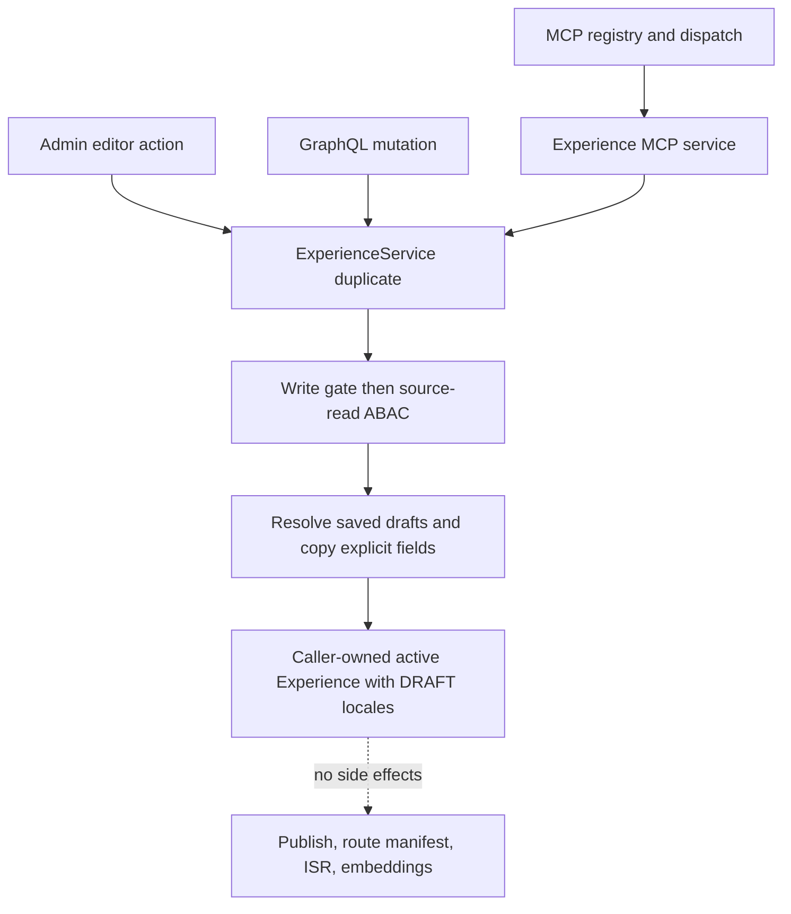

# Experience Duplication - Plan

## Goal Capsule

- **Objective:** Editors and delegated agents can create a safe working copy of any Experience they can read, through Admin, GraphQL, or MCP, without making the copy public.
- **Means:** All three surfaces delegate to one service mutation that copies authored locale content into a caller-owned active Experience while resetting every public and derived state field (KTD1, KTD2).
- **Authority:** The Product Contract below governs behavior. The roadmap ticket provides repository scope and verification context. Admin package conventions govern authorization, Pothos generation, and MCP registration.
- **Stop conditions:** Stop if implementation requires copying publication state, bypassing source read authorization, weakening destination write authorization, or introducing a separate duplication implementation for any surface.
- **Execution profile:** One feature PR. Implement in dependency order, with service behavior first and surface contracts second.
- **Tail ownership:** The implementing session owns tests, schema and gql.tada regeneration, focused browser verification, documentation, roadmap completion, and PR validation.

---

## Product Contract

### Summary

Add one Experience duplication capability shared by Admin, GraphQL, and MCP. A copy preserves the latest saved effective authored content, including active locale drafts, but is always a new caller-owned draft with no homepage, publication, embedding, revision, chat, or public-refresh state.

### Problem Frame

Experience authors can create and edit content but cannot safely branch an existing Experience into a working copy. Rebuilding multi-locale content by hand is slow and risks omitting fields. A copied published or homepage Experience must not inherit public visibility.

### Key Decisions

- **Duplication has Admin, GraphQL, and MCP parity.** (session-settled: user-directed — chosen over supporting only one operator surface: the user requires the same primary action in all three interfaces.) Governs R5, R6, R7.
- **Every duplicate is unpublished.** (session-settled: user-directed — chosen over preserving the source publication state: a copy must be safe to edit before a separate publish action.) Governs R3, R8.

### Requirements

**Shared copy behavior**

- R1. A principal with destination write permission can duplicate any Experience the principal can read, including another editor's content and an archived source when existing ABAC allows it.
- R2. The duplicate is a new active Experience owned by the caller and preserves the source's template classification.
- R3. Every source locale becomes a new locale with `DRAFT` status, no publication timestamp, and no homepage designation.
- R4. Each copied locale preserves its latest saved effective routing, title, SEO, OG, and block content—including an active saved draft when present—while receiving a distinguishable available copy slug no longer than the existing 200-character limit.

**Surface parity**

- R5. GraphQL exposes an authenticated `duplicateExperience(id: ID!): Experience!` mutation backed by the shared service.
- R6. MCP exposes `experience.duplicate` with strict `{experienceId}` input, both `experience:read` and `experience:create` scopes, and a result containing the source ID, copied canonical, copied locales, and editor URL.
- R7. The saved Admin Experience editor exposes a Duplicate action and navigates to the copied Experience in the currently selected locale when that locale exists on the copy.

**Safety and failure behavior**

- R8. Duplication does not copy embeddings or their provenance, locale or chat revision history, chat threads, identifiers, timestamps, archive state, or any other derived/public lifecycle state. It does not emit publish, ISR, route-manifest, or embedding side effects.
- R9. Destination write authorization runs before source lookup, then source read ABAC runs before copying. Missing, unreadable, zero-locale, and block-schema-invalid sources fail without creating a copy.
- R10. Admin duplication acts on the latest saved effective Experience. Unsaved changes across any authored field disable the action with an accessible save-first explanation; pending editor transitions disable it without claiming a save is required.

### Scope Boundaries

- Publishing remains a separate permissioned action. Duplication never asks for or infers permission to publish.
- Referenced videos, media, and asset IDs inside authored block JSON remain shared references. No underlying media record or byte is cloned.
- This work does not add a bulk-duplicate endpoint, source-to-copy lineage field, idempotency key, copy history, or automatic translation.
- Draft slugs are not database-unique. Copy suffix selection is deterministic against rows visible at request time; concurrent duplicate requests may choose the same draft slug, and the existing publish-time uniqueness gate remains authoritative.
- A canonical with zero locales is invalid for this operation. Reject it before the create call so no empty orphan copy is persisted.
- Repository-wide Compound Engineering policy edits are a separate policy deliverable and do not ship in the Experience feature PR.

### Acceptance Examples

- AE1. Given a published two-locale Experience with one homepage locale, duplicating it creates a caller-owned active Experience whose two locales preserve authored fields but are both non-homepage drafts with null publication timestamps.
- AE2. Given existing `hope-copy` and `hope-copy-2` rows for a locale, duplicating `hope` chooses the next available bounded suffix for that locale.
- AE3. Given a caller without write permission, duplication fails before the source query. Given a write-capable caller denied source read access, duplication fails before the create call.
- AE4. Given the same source and principal, Admin, GraphQL, and MCP reach the same shared mutation behavior and never emit public refresh or embedding work.
- AE5. Given unsaved Admin editor changes, Duplicate is disabled and exposes a keyboard- and screen-reader-discoverable explanation that the Experience must be saved first. Given another pending transition, Duplicate is disabled until that transition finishes without showing the save-first explanation.

---

## Planning Contract

### Key Technical Decisions

- KTD1. **The Experience service owns duplication.** `ExperienceService.duplicate` parses input, enforces coarse destination permission before any source probe, applies source read ABAC, and performs the single nested create. Thin GraphQL, MCP, and Admin adapters do not copy fields themselves.
- KTD2. **Copy through an explicit field allowlist.** Canonical `isTemplate` and each locale's latest saved effective authored fields are copied; an active locale draft overlays its canonical row but its revision record is not cloned. New-row defaults plus explicit resets own archive, homepage, status, and publication state. Omitted relations and embedding columns remain empty by construction.
- KTD3. **Copy slugs are deterministic best-effort draft labels.** Probe existing slugs per locale and select `-copy`, then `-copy-2`, with source truncation before the suffix. Do not add a database lock or broaden the partial published-slug uniqueness contract for this feature.
- KTD4. **Each public contract stays additive and generated artifacts stay derived.** Pothos adds one mutation, then `apps/admin/schema.graphql` and the admin gql.tada environment are regenerated from their owning sources. MCP extends the existing registry → dispatch → service pattern and reuses existing OAuth scopes.
- KTD5. **Admin duplicates only persisted state.** The client button invokes a server action only when the editor is clean, associates dirty-state helper text with the disabled control, distinguishes that state from unrelated pending work, handles a safe typed failure result, and routes to the copied locale without adding load-time effects or requests.

### Assumptions

- Preserving template classification is the safest lossless copy rule because template-only route blocks would otherwise become invalid or hidden. Instantiating a template as a normal Experience is a separate product action.
- Copying every locale, rather than only the selected locale, matches the user's “duplicate any Experience” request and avoids a surface-dependent partial copy.
- An available copy suffix is a human-facing draft label, not a concurrency or idempotency guarantee. Publish-time uniqueness remains the collision boundary.
- Generator-wide roadmap index drift unrelated to feat-405 is outside this feature unless it is required to keep the generated index internally consistent.

### High-Level Technical Design

The service is the only field-copy and lifecycle-reset owner. Surface adapters contribute only their transport-specific authentication, input, and result contracts.

### System-Wide Impact

- **Content lifecycle:** New rows are editable drafts and cannot enter public Experience queries until explicitly published.
- **Authorization:** Admin and GraphQL use existing admin permissions; MCP combines its two existing delegated scopes with service-layer ABAC.
- **Agent parity:** MCP exposes the same primitive action and shared workspace object as the UI and GraphQL API.
- **Contracts:** The GraphQL SDL and gql.tada introspection change additively. MCP tool discovery and onboarding documentation gain one tool.
- **Performance:** The Admin toolbar change adds no load-time request, effect, observer, or dynamic import. Database work occurs only after a user or agent invokes duplication.

### Risks and Mitigations

- **A copied field accidentally carries public state.** Use an explicit allowlist and assert every reset field in the multi-locale service test.
- **Transport implementations drift.** Route all adapters through `ExperienceService.duplicate` and keep registry-dispatch parity tests.
- **Internal errors leak through the server action.** Return allowlisted permission/not-found messages and a generic fallback instead of arbitrary Prisma messages.
- **Concurrent requests select the same draft slug.** Document the best-effort boundary; do not promise concurrency-safe draft uniqueness that the schema does not enforce.
- **Malformed source content creates an unusable copy.** Validate locale presence and every locale's block JSON against the existing block schema before the nested create, then prove no write occurs on either failure.

---

## Implementation Units

### U1. Shared duplication service

- **Goal:** Implement the complete authorized copy and lifecycle-reset behavior once.
- **Requirements:** R1, R2, R3, R4, R8, R9; AE1, AE2, AE3.
- **Dependencies:** none.
- **Files:** `apps/admin/src/services/experience.schemas.ts`, `apps/admin/src/services/experience.service.ts`, `apps/admin/src/services/experience.service.test.ts`.
- **Approach:**
  1. Validate the source ID and require destination write permission before loading it.
  2. Load the canonical with every locale, enforce source read ABAC, overlay each locale's active saved draft when present, and reject a zero-locale source or any effective locale whose block JSON fails the existing block schema before any write.
  3. Probe current locale slugs, derive bounded copy suffixes, and create the caller-owned canonical plus all locale drafts through an explicit allowlist (KTD2, KTD3).
  4. Leave archive, embedding provenance, revisions, chat relations, IDs, and timestamps out of the create payload.
- **Patterns to follow:** Existing create/update mutation ordering in `ExperienceService`; `canViewExperience` and `hasPermission`; the canonical/locale split in `apps/admin/prisma/schema.prisma`.
- **Test scenarios:**
  - Covers AE1. A published, homepage, template source with two locales copies every authored field and template classification; the new owner is the caller; every locale is a non-homepage draft with no publication timestamp.
  - Existing per-locale suffixes advance independently from `-copy` to `-copy-2`; a 200-character source slug is truncated before the suffix and the result remains within the limit.
  - A write-denied caller fails before source lookup; a read-denied source fails before slug lookup and create; a missing source returns the existing typed not-found behavior.
  - An archived source follows existing ABAC: permitted editor/admin reads can duplicate it, while the copy itself is active.
  - A zero-locale source and a source with malformed block JSON each fail before slug lookup and create, preventing an orphan or uneditable copy.
  - The create payload omits all embedding provenance and relations; publish webhook, route-manifest refresh, embedding dispatch, and revision/chat writes are not called.
- **Verification:** The service test suite proves the field matrix, authorization order, edge cases, and zero public side effects.

### U2. GraphQL duplication contract

- **Goal:** Expose the shared copy through the Admin GraphQL API and refresh generated contracts.
- **Requirements:** R5, R8, R9; AE4.
- **Dependencies:** U1.
- **Files:** `apps/admin/src/graphql/mutations/experience.ts`, `apps/admin/src/graphql/schema.test.ts`, `apps/admin/schema.graphql`, `packages/admin-graphql/src/admin-graphql-env.d.ts`.
- **Approach:** Add a non-null Pothos mutation with required ID input and the existing write scope. Delegate directly to U1, then regenerate SDL and gql.tada introspection in owning-source order (KTD1, KTD4).
- **Patterns to follow:** Existing Experience mutation resolvers and the generation flow in `packages/admin-graphql/CLAUDE.md`.
- **Test scenarios:**
  - Schema inspection exposes `duplicateExperience(id: ID!): Experience!` and no extra argument.
  - Resolver delegation passes the authenticated principal and source ID to the shared service.
  - The mutation retains the write permission gate while U1 supplies source read ABAC defense in depth.
  - Regenerated SDL and introspection contain the additive mutation and no unrelated hand edits.
- **Verification:** Schema tests, schema drift generation, admin-graphql generation, and both package typechecks pass.

### U3. MCP duplication primitive

- **Goal:** Give delegated agents the same draft-copy action with explicit scopes and a composable result.
- **Requirements:** R6, R8, R9; AE4.
- **Dependencies:** U1.
- **Files:** `apps/admin/src/mcp/admin-mcp-tools.ts`, `apps/admin/src/app/mcp/route.ts`, `apps/admin/src/app/mcp/route.test.ts`, `apps/admin/src/services/experience-mcp.service.ts`, `apps/admin/src/services/experience-mcp.service.test.ts`, `apps/admin/src/app/dashboard/mcp/page.tsx`, `apps/admin/src/app/dashboard/mcp/page.test.tsx`, `apps/admin/CLAUDE.md`, `plugins/jfp-admin/skills/forge-bulk-locale-factory/SKILL.md`.
- **Approach:** Register strict input and both existing scopes, add the dispatch branch, and make the Experience MCP service adapt U1's result into canonical, locale, source, and editor-link fields. Update agent-facing discovery and usage documentation (KTD1, KTD4).
- **Patterns to follow:** The existing `experience.create` and `experience.generate` registry → dispatch → service flow; registry-dispatch parity coverage.
- **Test scenarios:**
  - Tool discovery advertises `experience.duplicate`, strict `{experienceId}`, and exactly `experience:read` plus `experience:create`.
  - Invalid or extra input maps to the existing invalid-arguments JSON-RPC response; insufficient scope is rejected before dispatch.
  - Success returns the source ID, caller-owned canonical, every copied locale, and an editor URL targeting the first/selected available locale.
  - Missing and forbidden sources retain typed MCP errors; no publish, manifest, ISR, embedding, revision, or chat side effect fires.
  - Registry-dispatch parity and MCP onboarding/tool-count assertions remain green.
- **Verification:** MCP service and route suites prove action parity, scope enforcement, result shape, strict validation, and side-effect isolation.

### U4. Admin editor action and feature closeout

- **Goal:** Let an authorized editor duplicate the persisted Experience and continue editing the copy.
- **Requirements:** R7, R10; AE5.
- **Dependencies:** U1.
- **Files:** `apps/admin/src/app/dashboard/experiences/[id]/page.tsx`, `apps/admin/src/app/dashboard/experiences/experience-editor.tsx`, `apps/admin/src/app/dashboard/experiences/experience-editor.test.tsx`, `docs/roadmap/topic-experiences/feat-405-experience-duplication-admin-api-mcp.md`, `docs/roadmap/README.md`.
- **Approach:** Add a write-authorized server action that delegates to U1 and returns only safe action results. Render a toolbar button only when authorized. For dirty state, disable it and associate persistent save-first helper text through `aria-describedby`; for pending state, disable it without reusing the dirty explanation. Navigate to the copied Experience using the selected locale when possible (KTD5). Align the ticket's verification wording with preserved template classification and keep roadmap index edits scoped.
- **Patterns to follow:** Existing page-level Experience server actions, `startTransition` toolbar actions, toast handling, and route navigation.
- **Test scenarios:**
  - Authorized saved editor shows Duplicate; unauthorized editor does not receive the action.
  - A dirty editor disables Duplicate, exposes persistent save-first helper text, and associates it with the control for assistive technology.
  - A pending editor transition disables Duplicate without exposing the save-first explanation; duplication in progress provides an in-progress label or status.
  - One click invokes one action; success navigates to the copied Experience in the selected locale, with first-locale fallback.
  - Permission, missing-source, and unknown failures show safe messages and do not navigate.
  - Browser smoke confirms a multi-locale published source opens as a new draft, the source is unchanged, and the toolbar adds no load-time network activity.
- **Verification:** Component tests cover visibility and disabled state; focused browser testing covers click, redirect, copied state, source preservation, and absence of load-time work.

---

## Verification Contract

| Gate                           | Command or method                                                                                                                                                                                                                                                          | Proves                                                                                    |
| ------------------------------ | -------------------------------------------------------------------------------------------------------------------------------------------------------------------------------------------------------------------------------------------------------------------------- | ----------------------------------------------------------------------------------------- |
| Focused Admin suites           | `pnpm --filter @forge/admin test -- src/services/experience.service.test.ts src/services/experience-mcp.service.test.ts src/app/mcp/route.test.ts src/graphql/schema.test.ts src/app/dashboard/experiences/experience-editor.test.tsx src/app/dashboard/mcp/page.test.tsx` | Service behavior, API/MCP contracts, Admin rendering, and side-effect isolation           |
| Admin types                    | `pnpm --filter @forge/admin typecheck`                                                                                                                                                                                                                                     | Server action, Pothos, MCP, and editor types compose                                      |
| GraphQL artifacts              | `pnpm --filter @forge/admin schema:print` then `pnpm --filter @forge/admin-graphql generate`                                                                                                                                                                               | Committed SDL and gql.tada introspection match source                                     |
| GraphQL package types          | `pnpm --filter @forge/admin-graphql typecheck`                                                                                                                                                                                                                             | Generated client contract is consumable                                                   |
| Format and CI-sensitive checks | Repository formatter/diff check plus touched-scope lint where the baseline permits                                                                                                                                                                                         | Reviewable source and CI parity; record any reproducible baseline lint failure            |
| Admin browser smoke            | Duplicate a saved published multi-locale Experience from the editor, inspect the copy and source, and observe initial page requests                                                                                                                                        | User flow, redirect, draft/public reset, source immutability, and no load-time regression |
| MCP transport smoke            | List tools and call `experience.duplicate` with delegated read/create scopes                                                                                                                                                                                               | Real discovery, scope, dispatch, and structured result parity                             |

---

## Definition of Done

- U1 through U4 satisfy their requirements and enumerated test scenarios.
- Admin, GraphQL, and MCP all delegate to the same duplication service.
- Every duplicate is caller-owned, active, and unpublished; every copied locale is `DRAFT`, not homepage, and has no publication timestamp.
- Authored locale content and template classification are preserved; derived, historical, and public lifecycle state is absent.
- Zero-locale and block-schema-invalid source cases fail before create, and copy-slug best-effort concurrency semantics are documented.
- Repository-wide Compound Engineering policy changes are excluded from the feature PR and preserved for a separate policy-scoped delivery.
- SDL and gql.tada introspection are regenerated from source and both packages typecheck.
- Focused tests and browser/MCP smoke checks pass, or any repository-baseline failure is reproduced against the base branch and documented in the PR.
- Roadmap and MCP documentation match the shipped behavior without unrelated generated drift.
- Abandoned experiments, temporary dependency links, debug output, and dead code are removed from the final diff.
