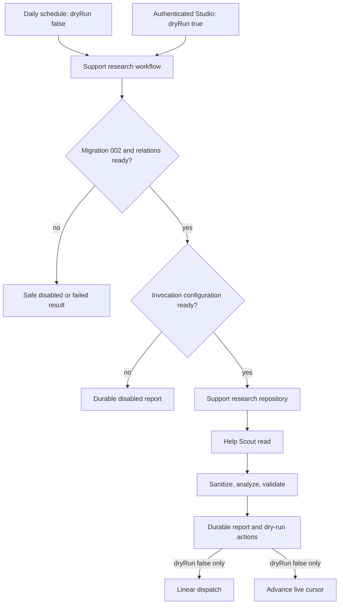
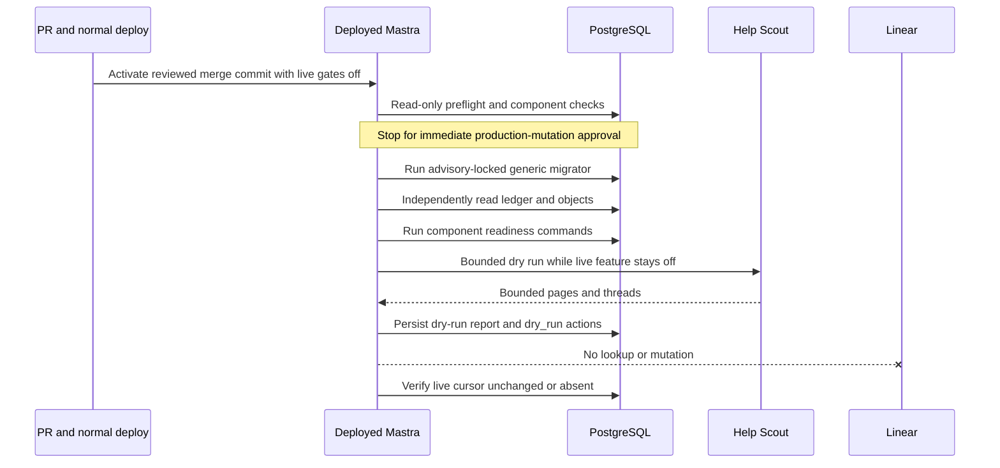

# Support Research Migration Readiness - Plan

## Goal Capsule

- **Objective:** Scheduled support research fails closed when its PostgreSQL schema is unavailable, and operators can prove a safe production dry run before any live dispatch.
- **Means:** Add component-scoped migration and relation readiness, keep the live feature gate false during operator dry runs, and strengthen the production runbook and evidence contract (KTD1-KTD6).
- **Authority:** The Product Contract owns behavior. The Planning Contract owns implementation and rollout mechanisms. Repository instructions and the support-research runbook govern execution.
- **Execution profile:** Complete and ship repository changes through the normal PR path. Treat production migration, provider use, and live dispatch as separate authorization boundaries.
- **Stop conditions:** Stop on migration-identity drift, partial or unledgered schema state, unexpected gate state, missing provider approval, a deployed revision without the readiness guard, or any evidence of Linear access during a dry run.
- **Tail ownership:** This plan owns the focused repository PR. The production operation resumes only after merge, deployment verification, and immediate explicit approval for the database mutation.

---

## Product Contract

### Summary

Make support research database readiness a release gate instead of an assumption. The scheduled workflow must return a safe terminal result before repository or upstream access when migration `002-support-research.sql` or any required relation is unavailable. Operators must be able to run a bounded Help Scout dry run while live scheduled dispatch remains disabled.

### Problem Frame

PR #1802 documented migration `002-support-research.sql` as the first production rollout step, but production enabled the schedule without applying it. Every visible scheduled run from 2026-08-11 through 2026-08-20 failed on PostgreSQL `42P01` for `support_research.cursors` before contacting Help Scout.

The missed operational step exposed two repository gaps. The workflow reached its repository before a component-scoped database check, and the runbook's dry-run path required the same feature gate that authorizes the independent `0 5 * * *` live schedule.

### Requirements

**Database readiness and failure isolation**

- R1. Readiness requires the exact version, filename, and SHA-256 identity of migration `002` plus all six support-research tables and six valid indexes of the expected PostgreSQL relation kinds.
- R2. Missing readiness returns a safe schedule- or Studio-visible terminal result before cursor, repository, Help Scout, model, validator, or Linear access.
- R3. The safe result is `disabled` when the live feature is disabled and `failed` when it is enabled, and it exposes reason codes without database details or customer content.
- R4. A read-only operator command exercises the same readiness predicate with bounded database timeouts, safe JSON output, and a nonzero unavailable exit.

**Dry-run and external-effect safety**

- R5. A freshly revalidated Mastra Gateway admin may submit `dryRun=true` while `SUPPORT_RESEARCH_ENABLED=false`, but genuine provider approval and all Help Scout, host, retention, and analysis configuration remain mandatory.
- R6. A dry run uses an explicit no-network Linear dependency, creates no live action state, and never advances the shared Help Scout cursor.
- R7. A dry run uses a unique operator idempotency key and a small conversation bound, and its evidence distinguishes the run window from the unchanged or absent live cursor.
- R8. Missing provider approval stops a dry run before Help Scout or model access; a database-mutation approval does not imply provider or data-processing approval.

**Delivery and production boundaries**

- R9. Repository changes reach production only through a reviewed PR and the normal main-branch deployment path; local `railway up` deployment is prohibited.
- R10. The deployed generic Mastra migrator is the only production write path and applies all pending migrations `001` through `003` in one advisory-locked transaction.
- R11. Production mutation requires an immediate explicit approval after a fresh read-only preflight of deployed revision, database identity, privileges, PgVector availability, schemas, ledger, relations, and all relevant gates; the attempt expires on a bounded migration timeout or any observed state change.
- R12. Migration completion requires independent readback of every deployed migration identity and every devotional, support-research, and Datadog object, including usable support-research indexes, followed by both component readiness commands.
- R13. Live dispatch remains disabled after migration and dry-run evidence until a separate approval authorizes it.
- R14. Production evidence and logs never expose credentials, raw customer content, or unsanitized support data.
- R15. The first approved operator path is admin-only and bounded; routine self-service dry runs remain unavailable until a durable aggregate budget and concurrency policy are designed separately.

### Key Decisions

- **Normal PR delivery governs code.** (session-settled: user-directed — chosen over direct local Railway deployment: production code must follow repository review and main-branch deployment controls.) Governs R9.
- **Production SQL waits for immediate approval.** (session-settled: user-directed — chosen over autonomous production mutation: the database change is an external-state boundary that requires a final verified preflight.) Governs R10-R12.
- **Dry-run evidence precedes live dispatch.** (session-settled: user-directed — chosen over enabling live dispatch from migration readiness alone: Help Scout reachability and zero Linear writes must be demonstrated first.) Governs R5-R8, R13.

### Acceptance Examples

- AE1. **Covers R1-R3.** Given migration `002` is absent and the feature is disabled, when the schedule fires, then the workflow returns `disabled` with `database_migration_unavailable` and makes zero repository or upstream calls.
- AE2. **Covers R1-R3.** Given the ledger identity matches but one required table or index is absent, when readiness runs, then it fails closed and names only the missing relation identifiers.
- AE3. **Covers R5-R8, R15.** Given the live feature is disabled, provider use is approved, and the schema is ready, when a freshly revalidated admin submits a bounded dry run, then it reaches Help Scout without any Linear network capability; a non-empty eligible source also completes one analysis.
- AE4. **Covers R6-R7.** Given a completed dry run, when evidence is read back, then the durable report identifies the dry-run window and every planned action is `dry_run`, while the live cursor remains byte-for-byte unchanged or absent.
- AE5. **Covers R8.** Given provider approval is false, when an operator submits a dry run, then it stops before Help Scout and the model even though the database is ready.
- AE6. **Covers R9-R13.** Given the focused PR is merged and its revision is active, when an approved operator migration succeeds, then exact ledger and object readback passes while all live gates remain false or unset.

### Scope Boundaries

#### In scope

- Component-scoped database readiness, workflow ordering, safe terminal results, operator CLI, disabled-live dry-run semantics, regression tests, roadmap traceability, and production runbook evidence.

#### Deferred to Follow-Up Work

- The production migration and bounded dry run resume after this PR is merged and deployed. They remain blocked on the immediate mutation approval and independently verified provider approval.
- Enabling the live schedule requires a separate post-dry-run authorization and is not part of this repository PR.
- Routine Studio dry-run self-service, durable per-operator attribution, and a database-backed aggregate dry-run budget require a follow-up design before the operator path can be widened beyond the one approval-bound production verification.

#### Outside this plan

- Editing historical migration SQL, inserting ledger rows manually, ad hoc production DDL, dropping successful schemas during rollback, Help Scout mutations, and changes to the existing Linear action policy.

---

## Planning Contract

### Key Technical Decisions

- KTD1. **Use an exact component readiness predicate.** Query the shared ledger for migration `002` by version, filename, and repository-pinned SHA-256. Verify every required table through `pg_class` and every required index through `pg_class` plus `pg_index.indisvalid`. This follows `apps/mastra/src/services/devotional/workspace/database.ts` without creating another ledger.
- KTD2. **Guard before every component dependency.** Supply readiness through the production workflow dependency seam and evaluate it before the first cursor read. Missing schema cannot persist a report, so the safe Mastra workflow result is the completion signal.
- KTD3. **Separate dry-run authorization from live enablement.** Apply `feature_disabled` only to non-dry runs. Provider approval and every read/analysis prerequisite remain mandatory for dry runs. A freshly revalidated Gateway admin is the only supported operator. The runtime supplies a no-network Linear dependency for dry runs. This removes the cron collision instead of relying on timing or lease keys that differ between dry and live runs.
- KTD4. **Keep the shared migrator atomic, bounded, and forward-only.** Use its one-client transaction and transaction-scoped advisory lock for migrations `001` through `003`. Apply transaction-local timeouts before the blocking lock, and require a new preflight and approval after timeout. Never apply `002` alone or rewrite successful history.
- KTD5. **Verify writes through independent reads.** Treat command success as write-path evidence only. Read back exact ledger identities, object kinds, index validity, component readiness, effective gates, and the active deployment through consumer-owned paths.
- KTD6. **Treat dry-run and live cursors as different evidence.** The report's `cursorStart` and `cursorEnd` describe the bounded run window. Only a non-dry finalization may advance `support_research.cursors`.

### High-Level Technical Design

### Invocation Gate Matrix

| Invocation                 | Live feature | Provider approved | Expected behavior                                                         |
| -------------------------- | -----------: | ----------------: | ------------------------------------------------------------------------- |
| Schedule or non-dry Studio |        false |            either | Disabled before upstream access                                           |
| Schedule or non-dry Studio |         true |             false | Disabled before upstream access                                           |
| Bounded dry run            |        false |             false | Disabled before Help Scout or model access                                |
| Bounded dry run            |        false |              true | May ingest and analyze; never Linear or live cursor advance               |
| Bounded dry run            |         true |              true | Same dry-run behavior, but production operations keep the live flag false |

### Assumptions

- The provider approval gate represents a documented privacy, retention, and data-processing decision. Operators do not toggle it merely to make a test pass.
- A cap-only `partial` dry run can prove provider connectivity, but only a `complete` run proves the selected bounded window was fully processed.
- On the current clean production bootstrap, the live Help Scout cursor remains absent after migration and after a dry run.

### Risks & Dependencies

- The new readiness CLI does not exist in the active production image until this PR merges and deploys. Production migration must wait for that revision.
- `to_regclass` proves name resolution, not index usability. Production readback must also verify expected object kind and `pg_index.indisvalid` for required indexes.
- Dry runs persist sanitized observations and reports. If privacy review fails, keep live dispatch disabled and use a reviewed repair or reanalysis path instead of ad hoc deletes.
- Reusing a completed idempotency key returns a no-op. Operators must record a unique key before launch and inspect the durable row before deciding whether a retry needs a new key.
- Help Scout Inbox API attachment-link changes and webhook deprecations do not affect this polling workflow, but bounded pagination and permissive response parsing remain required.
- Linear GraphQL may return HTTP 200 with an `errors` array. Repository tests must exercise the exact read/create response parsers and error handling without production requests. Any production Linear probe or mutation belongs to the later live-enable approval, never the dry run.
- An empty eligible Help Scout window proves authentication and pagination only. It does not prove the model path; live dispatch stays disabled until a non-empty approved dry run or separately accepted provider-path evidence exists.

---

## Implementation Units

### U1. Add component-scoped support-research database readiness

- **Goal:** Fail closed on missing or drifted migration history and incomplete support-research schema before any component dependency is touched.
- **Requirements:** R1-R4; AE1-AE2; KTD1-KTD2.
- **Dependencies:** None.
- **Files:** `apps/mastra/src/services/support-research/database-readiness.ts`, `apps/mastra/src/services/support-research/database-readiness.test.ts`, `apps/mastra/src/scripts/check-support-research-database-readiness.ts`, `apps/mastra/src/scripts/check-support-research-database-readiness.test.ts`, `apps/mastra/src/mastra/workflows/daily-support-research.ts`, `apps/mastra/src/mastra/workflows/daily-support-research.test.ts`, `apps/mastra/package.json`.
- **Approach:** Mirror the devotional component's exact migration identity and safe CLI patterns. Wire readiness through the production step before the cursor read. Keep the dependency optional only as a unit-test seam.
- **Execution note:** Preserve the exact production `42P01` failure shape as a regression and prove the unavailable path before changing workflow ordering.
- **Patterns to follow:** `apps/mastra/src/services/devotional/workspace/database.ts`, `apps/mastra/src/scripts/check-devotional-database-readiness.ts`, `apps/mastra/src/scripts/migrate-mastra-database.ts`.
- **Test scenarios:**
  1. Exact migration `002`, six tables of the expected relation kind, and six valid indexes return ready at version `2`.
  2. Missing, mismatched-name, or mismatched-checksum migration `002` returns unavailable.
  3. Each missing relation, wrong relation kind, or invalid required index returns incomplete schema without throwing.
  4. A query failure or absent shared ledger returns a safe unavailable result.
  5. The CLI returns safe JSON and exit `0` when ready, and safe JSON with nonzero exit when unavailable or rejected.
  6. Covers AE1. Missing readiness with the feature disabled returns `disabled` and calls no repository, Help Scout, model, validator, or Linear dependency.
  7. Missing readiness with the feature enabled returns `failed` with the same zero-call boundary.
- **Verification:** Readiness tests prove exact identity and full relation coverage. Workflow tests prove the guard precedes every component dependency. CLI tests prove bounded, secret-free operator behavior.

### U2. Authorize dry runs without enabling live dispatch

- **Goal:** Let an approved operator reach Help Scout and analysis while the scheduled live path remains disabled.
- **Requirements:** R5-R8, R13-R15; AE3-AE5; KTD3, KTD6.
- **Dependencies:** U1.
- **Files:** `apps/mastra/src/mastra/workflows/daily-support-research.ts`, `apps/mastra/src/mastra/workflows/daily-support-research.test.ts`, `apps/mastra-gateway/src/lib/devotional-access.ts`, `apps/mastra-gateway/src/lib/devotional-access.test.ts`, `apps/mastra-gateway/src/app/api/studio/[[...path]]/route.ts`, `docs/runbooks/support-research-agent.md`.
- **Approach:** Exclude `feature_disabled` from dry-run configuration reasons while retaining provider, Help Scout, allowlisted-host, retention, and analysis gates. Revalidate the current Studio access record and require the admin role for the support-research workflow path. Replace the live Linear client with an explicit throwing no-network implementation for dry runs.
- **Execution note:** Add the disabled-live dry-run tests before changing the readiness condition.
- **Patterns to follow:** The existing `dryRun` branches in `executeDailySupportResearch`, `PostgresSupportResearchRepository.finalizeRun`, and `enqueueAction`.
- **Test scenarios:**
  1. Covers AE3. `enabled=false`, `providerApproved=true`, and `dryRun=true` reaches fake Help Scout and analysis, plans dry-run actions, and succeeds with the throwing no-network Linear implementation.
  2. Covers AE4. The successful dry run leaves the repository's live cursor unchanged and reports `actionsCreated=0` with no action URLs.
  3. Covers AE5. `enabled=false`, `providerApproved=false`, and `dryRun=true` stops before Help Scout, model, validator, and Linear.
  4. `enabled=false` and `dryRun=false` remains disabled before upstream access.
  5. Dry-run Linear credentials may be absent without weakening any read, privacy, provider, or host prerequisite.
  6. A revoked, editor, or unauthenticated Studio session cannot launch the support-research workflow, while a freshly revalidated admin can.
  7. An empty eligible Help Scout window records connectivity evidence but remains inconclusive for provider-path verification.
- **Verification:** Paired dry/live workflow tests prove the live gate controls only non-dry dispatch and the provider gate controls every model-bearing invocation. Gateway tests prove fresh admin-only authorization for the operator path.

### U4. Bound the production migration attempt

- **Goal:** Prevent a migration approval from remaining valid through an unbounded advisory-lock or statement wait.
- **Requirements:** R10-R12; AE6; KTD4.
- **Dependencies:** U1.
- **Files:** `apps/mastra/src/scripts/migrate-mastra-database.ts`, `apps/mastra/src/scripts/migrate-devotional-database.test.ts`, `docs/runbooks/support-research-agent.md`.
- **Approach:** Apply transaction-local statement and lock wait bounds before requesting the advisory lock. A timeout rolls back, preserves the baseline, and requires the operator to repeat preflight and obtain new approval before retrying.
- **Patterns to follow:** The existing one-client `runDevotionalTransaction` boundary and the migrator's checksum-drift rollback tests.
- **Test scenarios:**
  1. Transaction-local timeouts are established after `begin` and before the advisory lock.
  2. A timeout rejects the migration, rolls back once, releases the client, and records no successful result.
  3. Normal migrations still apply or skip all numbered files under one transaction.
- **Verification:** Migrator tests prove ordering, rollback, and unchanged forward-only checksum behavior.

### U3. Make rollout evidence and ownership executable

- **Goal:** Prevent another deploy-success/migration-missing incident and preserve the production authorization boundaries in durable repository guidance.
- **Requirements:** R9-R14; AE6; KTD4-KTD6.
- **Dependencies:** U1-U2, U4.
- **Files:** `apps/mastra/AGENTS.md`, `apps/mastra/CLAUDE.md`, `docs/runbooks/support-research-agent.md`, `docs/roadmap/platform/feat-326-daily-support-user-research-agent.md`, `docs/roadmap/platform/feat-401-support-research-migration-readiness.md`, `docs/roadmap/README.md`.
- **Approach:** Document merge-and-deploy-before-migrate sequencing, generic migration `001` through `003`, independent object and index-validity readback, safe readiness commands, disabled-live dry-run evidence, provider approval as a separate gate, forward-only rollback, and final cursor/run reporting.
- **Patterns to follow:** `docs/plans/2026-08-11-001-fix-mastra-devotional-migration-readiness-plan.md`, `docs/solutions/best-practices/verify-infra-writes-via-independent-read-path-20260420.md`, `docs/solutions/deployment/railway-dashboard-override-shadows-railway-toml-20260429.md`.
- **Test scenarios:** Test expectation: none -- this unit changes operator and roadmap documentation, while U1-U2 carry the executable regression coverage.
- **Verification:** The runbook keeps all live gates false through migration and dry run, stops for immediate mutation approval, requires exact independent readback, and reports a dry-run result separately from the live cursor.

---

## Verification Contract

| Gate                                                              | Applies to                | Done signal                                                                                                                                                                                                           |
| ----------------------------------------------------------------- | ------------------------- | --------------------------------------------------------------------------------------------------------------------------------------------------------------------------------------------------------------------- |
| Focused Vitest for readiness CLI, workflow, gateway, and migrator | U1-U2, U4                 | Exact identity and index validity, missing-schema, disabled-live dry-run, provider denial, no-network Linear enforcement, admin revalidation, bounded migration wait, and cursor invariance scenarios pass.           |
| Full `@forge/mastra` Vitest suite                                 | U1-U2                     | No support-research or sibling workflow regression.                                                                                                                                                                   |
| `@forge/mastra` typecheck and ESLint                              | U1-U2                     | New dependency seams, result unions, and scripts satisfy package types and lint rules.                                                                                                                                |
| Repository format checks                                          | U1-U3                     | All changed TypeScript, JSON, and Markdown use repository formatting.                                                                                                                                                 |
| Production Studio build                                           | U1-U2                     | The workflow, script, and readiness module bundle in the production build.                                                                                                                                            |
| Branch-focused browser test                                       | U1-U3                     | `ce-test-browser mode:pipeline` either proves an affected browser flow or records a justified no-browser-applicability result.                                                                                        |
| PR CI                                                             | U1-U3                     | Required checks reach a decided passing state before merge readiness.                                                                                                                                                 |
| Approval-gated production verification                            | Deferred operational tail | Active deployed merge commit, exact migration and object readback, readiness CLIs, bounded Help Scout dry run, zero Linear evidence, and unchanged or absent live cursor are recorded without enabling live dispatch. |

---

## Definition of Done

- U1 is complete when exact migration and relation readiness fails closed before every repository or external dependency and the safe CLI exercises that predicate.
- U2 is complete when a bounded dry run can reach Help Scout with the live feature disabled, genuine provider approval remains mandatory, Linear clients are never called, and the live cursor does not advance.
- U3 is complete when roadmap and runbook guidance encode the deployed-revision, approval, migration, independent-readback, dry-run, rollback, and final-evidence boundaries.
- U4 is complete when the generic migrator bounds lock and statement waits and a timeout forces rollback plus renewed preflight and approval.
- The focused and full package tests, typecheck, lint, format, production build, browser-applicability pass, and PR checks succeed.
- The branch contains no abandoned experiment, generated-file drift, unrelated workspace changes, or uncommitted eligible review fix.
- The focused PR is open with the plan and roadmap traceability, while `feat-401` remains `in-progress` until the later production migration and dry run finish.

---

## Sources & Research

- `docs/roadmap/platform/feat-401-support-research-migration-readiness.md`
- `docs/plans/2026-08-01-001-feat-support-research-agent-plan.md`
- `docs/plans/2026-08-11-001-fix-mastra-devotional-migration-readiness-plan.md`
- `docs/solutions/architecture-patterns/support-research-evidence-ledger-pattern-20260801.md`
- `docs/solutions/best-practices/verify-infra-writes-via-independent-read-path-20260420.md`
- `docs/solutions/deployment/railway-dashboard-override-shadows-railway-toml-20260429.md`
- [node-postgres transactions](https://node-postgres.com/features/transactions)
- [PostgreSQL advisory locks](https://www.postgresql.org/docs/current/functions-admin.html#FUNCTIONS-ADVISORY-LOCKS)
- [PostgreSQL object information functions](https://www.postgresql.org/docs/current/functions-info.html)
- [Mastra schedules](https://mastra.ai/blog/introducing-schedules-for-agents-and-workflows)
- [Help Scout Inbox API changelog](https://developer.helpscout.com/mailbox-api/changelog/)
- [Linear API deprecations](https://linear.app/developers/deprecations)
