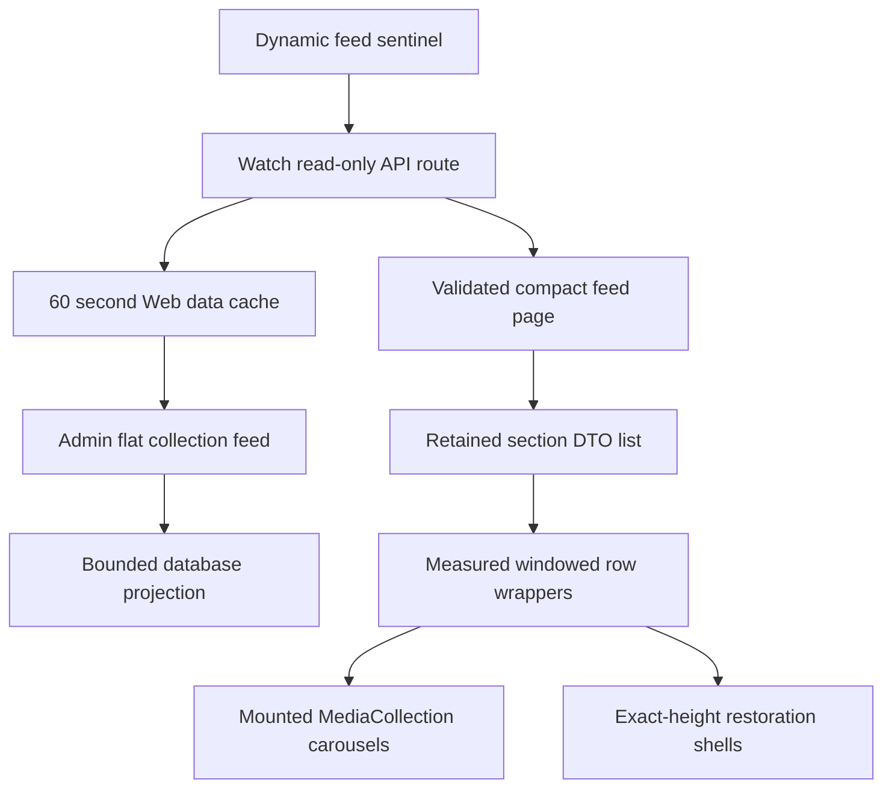
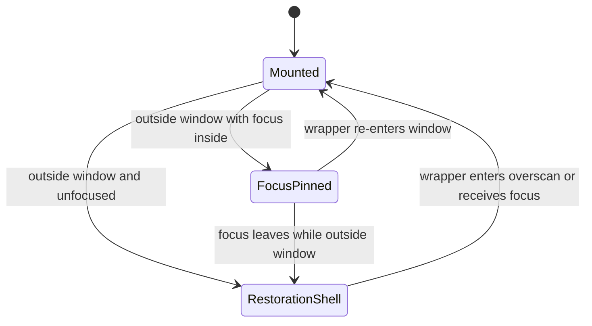

# Watch Infinite Feed Windowing - Plan

## Goal Capsule

- **Objective:** Keep the Watch homepage continuously explorable while mounted DOM and media work plateau, and while each feed page has bounded network volume and fixed-stage Admin query cost.
- **Means:** Unmount distant collection carousels into measured placeholders while retaining compact feed data, and replace the nested feed hydration path with a bounded read model delivered through the public Watch read boundary (KTD1, KTD2, KTD4, KTD5).
- **Authority:** The Product Contract owns viewer behavior. Session-settled decisions own the windowing posture. Current repository contracts own public routing, GraphQL generation, and visibility rules.
- **Execution profile:** Extend the uncommitted feat-405 implementation in one performance-hardening scope across Admin and Web.
- **Stop conditions:** Stop rather than guess if the production-like snapshot cannot prove the flat feed preserves current parent and child visibility, localization, language fallback, or canonical Watch routes.
- **Tail ownership:** Finish with focused tests, generated GraphQL artifacts, typechecks, a production build, mobile browser evidence, a PR, and CI through merge-ready state.

---

## Product Contract

### Summary

The dynamic collection feed will remain an uninterrupted discovery surface, but only nearby carousels will keep their interactive DOM mounted. Feed pages and cards will be bounded, cached briefly, and hydrated through a fixed-cost Admin projection so client windowing does not hide server-side overwork.

### Problem Frame

The current feat-405 prototype keeps every loaded carousel mounted. A production-like local session with 36 carousels reached about 11,320 DOM nodes, 3,941 event listeners, 82.6 MB of JavaScript heap, and hundreds of feed images. The growth is post-hydration rather than SSR work, but it is unbounded for a viewer who continues scrolling.

The current page also requests three parents with up to 24 children each through generic nested Video fields. The `children` resolver loads all relations before slicing, and each child's `preferredPlayableDub` can perform several Prisma queries. DOM unloading does not reduce this query and transfer cost.

### Key Decisions

- **Continuous exploration remains the primary experience** (session-settled: user-approved — chosen over a hard carousel limit or load-more stop: viewers should be able to keep discovering until the catalog is exhausted). Governs R1, R8.

### Requirements

**Discovery behavior**

- R1. The feed must continue loading distinct eligible collections near the viewport until Admin reports no next page.
- R2. The feed must exclude collections featured by authored homepage blocks and deduplicate every collection already retained by the client.
- R3. Loading, retry, successful append, and end-of-library states must remain visible and available through one polite status region without moving focus, and the canonical homepage footer must remain reachable before the dynamic discovery feed.

**Windowed rendering**

- R4. After the feed crosses its windowing threshold, distant carousels must be removed from the React and DOM trees while their compact section data and measured vertical space remain retained. Each unmounted row must keep a compact, focusable restoration shell so sequential keyboard and assistive navigation can remount it without losing its place.
- R5. Reverse scrolling must remount a carousel before it reaches the viewport without a visible vertical jump and must restore its saved horizontal carousel selection.
- R6. A carousel containing browser focus must remain mounted until focus leaves, even when it is outside the normal window.

**Bounded data and transport**

- R7. Each browser page request and each collection's card count must have validated client and server caps. A feed lifecycle classified by `(max-width: 767px)` or `(pointer: coarse)` uses two parents and eight cards per parent; all other lifecycles use three parents and 12 cards per parent. The profile is frozen until locale or language restarts the feed.
- R8. Browser pagination must use the public Watch read-only API boundary, keep the Admin bearer server-only, validate request and response shapes, prevent duplicate in-flight loads, and permit an explicit retry after a safe failure.
- R9. Admin must return a purpose-built, localized, card-ready feed projection whose database query count does not scale with the number of returned cards.
- R10. Repeated feed pages with the same locale, language, cursor, exclusions, and page size must share a short server cache without enabling public browser caching.

**Page and media performance**

- R11. The dynamic feed must perform no data request during SSR or initial hydration before its sentinel approaches the viewport.
- R12. Touch movement must not activate unoptimized animated Mux previews; keyboard focus and hover-capable pointer input must retain preview behavior.
- R13. Long-scroll verification must show that retained collection data can grow while mounted carousels, DOM nodes, listeners, and decoded images plateau within the configured render window.
- R14. The public route must stay behind the admitted `/watch/api/*` edge boundary, preserve a fixed no-store `429` with `Retry-After` when upstream admission rejects a request, and document the existing Cloudflare per-client/global limit as a release prerequisite rather than creating an unprotected bearer-backed proxy.

### Key Flows

- F1. **Downward discovery**
  - **Trigger:** The sentinel enters its preload margin.
  - **Steps:** The client requests one bounded page, validates it, removes duplicates, retains its compact DTOs, and advances the cursor.
  - **Outcome:** New nearby collections mount without adding previously featured collections.
  - **Covered by:** R1, R2, R7, R8, R10.
- F2. **Distant-row unloading and restoration**
  - **Trigger:** A measured carousel moves outside the asymmetric render window after the feed crosses the threshold.
  - **Steps:** The client saves its measured height and horizontal selection, unmounts the interactive subtree, retains an exact-height wrapper, and remounts when the wrapper re-enters overscan.
  - **Outcome:** Reverse scrolling restores the same collection and horizontal position without changing document geometry.
  - **Covered by:** R4, R5, R6, R13.
- F3. **Retry or completion**
  - **Trigger:** A page request fails or returns the final cursor.
  - **Steps:** A failure exposes a retry that issues a fresh GET; a terminal page stops observation and exposes the end state, while the footer stays ahead of the dynamic feed.
  - **Outcome:** The viewer can recover from a transient failure, while canonical footer navigation remains reachable before the discovery surface regardless of catalog length.
  - **Covered by:** R3, R8.

### Acceptance Examples

- AE1. **Long downward session**
  - **Given:** At least 30 eligible collections are available.
  - **When:** A mobile-width viewer loads all 30 by scrolling downward.
  - **Then:** All 30 DTOs remain available for restoration, but only the bounded nearby carousel window is mounted.
  - **Covers:** R1, R4, R13.
- AE2. **Rapid reverse scroll**
  - **Given:** Early carousels have been replaced by measured placeholders and one was horizontally advanced.
  - **When:** The viewer quickly scrolls upward.
  - **Then:** The early carousel remounts before it is visible, keeps the reserved height, and restores its saved snap.
  - **Covers:** R5.
- AE3. **Focused off-window card**
  - **Given:** Keyboard focus is inside a carousel that becomes outside the normal window.
  - **When:** Observer state updates.
  - **Then:** The carousel stays mounted until focus moves elsewhere.
  - **Covers:** R6.
- AE4. **Transient read failure**
  - **Given:** The public feed GET returns an HTTP, JSON, or shape error.
  - **When:** The viewer activates retry.
  - **Then:** The failed pending request is not reused, and a new validated request can append the next page once.
  - **Covers:** R8.
- AE5. **Duplicate-only page**
  - **Given:** A valid page contains only collection IDs already retained by the client but advances the cursor.
  - **When:** The page is processed.
  - **Then:** The cursor advances without a visible duplicate. The client drains at most three duplicate-only pages in one attempt, then preserves the advanced cursor and schedules another attempt after a yield while the sentinel remains eligible.
  - **Covers:** R1, R2, R8.
- AE6. **Touch-only exploration**
  - **Given:** The device has coarse pointer input and no hover capability.
  - **When:** The viewer swipes vertically and horizontally across feed cards.
  - **Then:** No Mux animated preview image is requested from pointer entry alone.
  - **Covers:** R12.
- AE7. **Responsive resize at depth**
  - **Given:** At least 30 collection DTOs are retained and distant rows are shells.
  - **When:** The viewport changes width or orientation.
  - **Then:** Off-window rows keep provisional shell heights, only the bounded active window remeasures, saved snaps clamp to the nearest valid snap, and the mount cap is never exceeded.
  - **Covers:** R4, R5, R13.

### Scope Boundaries

In scope are the uncommitted feat-405 Admin/Web feed, its database access paths and generated GraphQL contract, the dynamic carousel mount lifecycle, horizontal state restoration, the public read transport, short server caching, Mux hover activation, and long-session browser proof.

#### Deferred to Follow-Up Work

- Production observability dashboards and alert thresholds for feed latency or memory are deferred; this change will produce reproducible QA evidence and leave existing logging conventions intact.
- A general-purpose site-wide virtualizer is deferred. The implementation will remain specific to top-level dynamic collection rows.
- Image-source data defects in the production snapshot are not repaired here unless the new feed projection introduces them.

### Success Criteria

- A viewer can load and revisit at least 30 collections without losing content, focus safety, horizontal position, retry behavior, or footer reachability.
- At 30 or more retained collections, no more than 10 observer-managed dynamic media collection carousels are mounted at once; one focused row may remain mounted as a deliberate accessibility exception.
- Long-session DOM node count is at least 50% below the measured 11,320-node baseline at comparable depth, with no positive layout shift attributable to placeholder-to-carousel swaps.
- At 30 retained collections, listener count is at most 1,800, decoded dynamic-feed images are at most 120, and post-GC JavaScript heap is at most 60 MB; growth from 20 to 30 retained sections is at most 15 MB.
- The Admin feed page uses a bounded fixed-query read path instead of per-card `preferredPlayableDub` resolution.
- Initial SSR and hydration issue no dynamic-feed request and add no eager Mux animated preview work.

---

## Planning Contract

### Key Technical Decisions

- KTD1. **Use real DOM windowing with retained data and measured shells** (session-settled: user-directed — chosen over keeping every loaded carousel mounted or merely hiding old rows: unmounting releases React state, Embla instances, images, and listeners while retained DTOs support fast restoration). Governs R4, R5, R6, R13.
- KTD2. **Combine client windowing with backend and network bounding** (session-settled: user-approved — chosen over client-only virtualization: windowing cannot reduce nested Admin queries or transferred card data). Governs R7, R9, R10, R13.
- KTD3. **Use one feature-local observer and measured row wrappers.** A shared `IntersectionObserver` tracks always-mounted wrappers, `ResizeObserver` records mounted heights, and asymmetric overscan keeps more history above than future content below. Intersecting rows are ranked by distance with an upward bias and capped at 10 observer-managed mounts; a focused row may temporarily add one pinned mount. Width changes keep off-window heights as provisional estimates and remeasure only rows admitted to that same bounded window. No virtualizer dependency is needed.
- KTD4. **Replace nested Video traversal with a flat Admin feed read model.** Purpose-built public GraphQL node and item types will be backed by a bounded SQL/Prisma projection that selects parents, ranked children, localized copy, image metadata, and requested-language-to-primary-to-fallback playback choices in fixed query stages.
- KTD5. **Move browser paging to the admitted Watch GET boundary.** Repository production evidence shows public Watch page GETs may succeed while page-bound Server Action POSTs are rejected before Next.js. A force-dynamic `/watch/api/*` GET keeps credentials server-side and follows the established language-options route pattern.
- KTD6. **Cache server-to-server feed pages for 60 seconds.** The cache key includes locale, language, cursor, normalized exclusions, requested parent count, and cards per parent. Apollo remains `no-cache` inside the cached function, and Watch home/video tags support normal invalidation. The cache is retained because the initial and early cursor pages are shared by many viewers with the same authored exclusions; hit rate can be measured after release before broader caching is considered.
- KTD7. **Persist Embla snap indices, not native scroll offsets.** Embla moves carousel content with transforms, so optional MediaCollection props will restore `startIndex` and report `selectedScrollSnap()` without changing authored carousel behavior.

### High-Level Technical Design

The feed crosses three component boundaries while keeping the browser payload public and compact:

Each row follows a focus-safe mount lifecycle:

### Assumptions

- Small or coarse-pointer clients request two parents with eight cards each; other clients request three parents with 12 cards each.
- Windowing starts after nine retained collections, with approximately four viewport heights above and two below considered for the distance-ranked, 10-row mount cap.
- Viewport-width or orientation changes mark stored heights provisional. Off-window shells do not remount merely because geometry changed; admitted rows remeasure and replace their provisional heights.
- A flat Admin projection can preserve the current visible-parent, visible-child, localization, image, and playback fallback semantics against the production-like snapshot.
- The public browser response remains `private, no-store`; reuse occurs only in the Web server data cache.
- Normalized GET query parameters remain below an 8 KB serialized URL budget; invalid or oversized exclusion sets fail before Admin work.

### System-Wide Impact

- **Admin:** The public GraphQL shape changes from generic Video nodes to purpose-built feed nodes. The SDL and `@forge/admin-graphql` introspection artifact must change together.
- **Database:** Production-like `EXPLAIN ANALYZE` proves the bounded parent scan uses the primary key and the child ranking uses the existing migration-0035 ordered-relation index. No new migration is required.
- **Web:** The browser transport changes from a Server Action POST to a read-only GET. The feed remains client-initiated and absent from SSR.
- **Accessibility:** Focus ownership becomes a mount-lifecycle guard. Keyboard preview activation stays supported.
- **Operations:** Short cache reuse reduces repeated server work. Browser caching stays disabled, and existing Watch cache tags remain the invalidation authority.

### Risks and Mitigations

- **Placeholder geometry drift:** Responsive copy or images can change height after measurement. Invalidate measurements on viewport-width changes and keep ResizeObserver active while mounted.
- **Observer thrash during fast scrolling:** Separate the mount and unmount distances through asymmetric overscan, batch observer-driven state updates, and retain exact wrappers.
- **Playback fallback drift:** The flat read model could differ from `preferredPlayableDub`. Add service fixtures for exact requested language, primary fallback, longest fallback, missing playback, and restricted content before replacing the nested path.
- **Cache cardinality:** Exclusions are part of the key and can vary. Normalize and cap them before cache entry, and keep the existing 200-reference maximum.
- **Edge routing regression:** Route tests cannot prove Cloudflare ownership. Browser QA must record the real request method, URL, status, content type, and application response headers on the admitted route shape.
- **Public proxy abuse:** Valid query variation can bypass exact-page caching. Keep strict tuple/card/exclusion/URL caps, preserve upstream `429` and `Retry-After`, and require confirmation of Cloudflare per-client and global admission on the final `/watch/api/dynamic-collections` route before production release. This PR does not directly deploy or widen Cloudflare policy.

### Product Contract Preservation

Product Contract created directly from the user's request and session-settled decisions; no upstream requirements artifact was changed.

---

## Implementation Units

### U1. Build the bounded Admin feed read model

- **Goal:** Return localized, card-ready collection pages with fixed query stages and hard parent/card caps.
- **Requirements:** R2, R7, R9.
- **Dependencies:** None.
- **Files:** `apps/admin/src/services/video.service.ts`, `apps/admin/src/services/video.service.test.ts`, `apps/admin/src/graphql/types/video.ts`, `apps/admin/src/graphql/schema.test.ts`, `apps/admin/src/graphql/public-resolvers.regression.test.ts`, `apps/admin/schema.graphql`, `packages/admin-graphql/src/admin-graphql-env.d.ts`.
- **Approach:** Before editing, move feat-405 from `complete` back to `in-progress`. Replace generic Video nodes with purpose-built public feed node/item types per KTD4. Carry a validated `cardsPerParent` value of 8 or 12 through GraphQL and the service, select only visible collection parents and visible playable children, preserve deterministic cursor order, rank no more relations per parent than requested, resolve requested/primary/fallback playback in the bounded projection, and verify the existing database access paths rather than shipping an unneeded index.
- **Execution note:** Start with service tests that characterize the current visibility and playback fallback contract against representative rows before replacing nested resolution.
- **Patterns to follow:** `getWatchLanguageInventory` for transaction-local statement timeout and flat row grouping; `videoMuxPlaybackIdByIdAndLanguageSlug` for requested-to-primary fallback semantics; current `watchCollectionFeed` validation and cursor rules.
- **Test scenarios:**
  1. A page with more than the requested parent cap returns only the cap and a cursor with `hasNextPage=true`.
  2. A parent with more than 12 ordered children returns the first 12 eligible children in deterministic relation order.
     2a. An eight-card request performs the same fixed query stages and returns at most eight children per parent.
  3. Deleted, no-index, unpublished, or Watch-restricted parents and children do not appear.
  4. A requested-language playable dub wins; otherwise the primary-language playable dub wins; otherwise the deterministic longest playable fallback wins.
  5. Localized parent/card copy follows language locale, UI locale, and safe slug fallback order.
  6. Oversized exclusions and invalid cursors fail before the read query runs.
  7. Query instrumentation shows a page's query count is independent of returned card count.
- **Verification:** The focused Admin tests pass, and production-like `EXPLAIN ANALYZE` shows the candidate-parent scan and ordered-relation lookup remain bounded without a new migration.

### U2. Add the cached public Watch feed transport

- **Goal:** Deliver compact feed pages through a validated GET while keeping Admin credentials and cache storage server-side.
- **Requirements:** R1, R2, R3, R7, R8, R10, R11.
- **Dependencies:** U1.
- **Files:** `apps/web/src/app/api/dynamic-collections/route.ts`, `apps/web/src/app/api/dynamic-collections/route.test.ts`, `apps/web/src/lib/dynamic-collection-contract.ts`, `apps/web/src/lib/dynamic-collection-client.ts`, `apps/web/src/lib/dynamic-collection-client.test.ts`, `apps/web/src/lib/dynamic-collection-feed.ts`, `apps/web/src/lib/dynamic-collection-feed.test.ts`, `apps/web/src/lib/dynamic-collection-actions.ts`, `apps/web/src/lib/dynamic-collection-actions.test.ts`, `apps/web/src/lib/watch-cache-tags.ts`.
- **Approach:** Follow KTD5 and KTD6. Parse and normalize query parameters at the route boundary, including the allowed parent/card tuples, call the cached server-only Admin resolver, emit a compact validated JSON page with private no-store headers, and collapse failures to a fixed retryable response while preserving `429` and `Retry-After`. Replace the client Server Action import with a same-origin GET loader and remove the obsolete action once coverage passes. Use one `aria-live="polite"` status and `aria-busy` on the feed region for loading, append, retry, and completion feedback.
- **Patterns to follow:** `apps/web/src/app/api/language-options/route.ts` and its tests for public read ingress, safe failures, and no-store headers; `watch-home.ts` for tagged `unstable_cache`; existing feed mapper for route-safe card data.
- **Test scenarios:**
  1. A valid GET returns only the compact public DTO and private no-store headers.
  2. Invalid locale, language, cursor, parent/card tuple, exclusion cardinality, or serialized URL over 8 KB returns a safe client error without calling Admin.
  3. Admin, HTTP, JSON, and response-shape failures produce a retryable fixed failure without leaking credentials or internal messages.
  4. Identical normalized server inputs share the 60-second cached function while different cursor, locale, language, parent count, card count, or exclusions do not collide.
  5. The browser issues no feed GET before the sentinel callback and deduplicates concurrent attempts.
  6. Retrying after failure issues a fresh GET and appends one deduplicated page.
  7. A duplicate-only page that advances the cursor triggers a bounded continuation, while a non-advancing cursor terminates safely.
     7a. More than three consecutive duplicate-only pages yields and re-arms from the advanced cursor without a request burst or stall.
  8. A late response after locale/language change or component unmount is ignored and cannot mutate the new feed state.
- **Verification:** Route, loader, mapping, and cache tests pass; a browser trace shows GET under `/watch/api/*`, no page-bound POST, and no initial-load feed request.

### U3. Window carousel DOM and restore interaction state

- **Goal:** Bound mounted carousel DOM while retaining fast, stable reverse navigation.
- **Requirements:** R4, R5, R6, R13.
- **Dependencies:** U2.
- **Files:** `apps/web/src/components/sections/DynamicMediaCollection.tsx`, `apps/web/src/components/sections/DynamicMediaCollection.test.tsx`, `apps/web/src/components/sections/MediaCollection.tsx`, `apps/web/src/components/sections/MediaCollection.test.tsx`.
- **Approach:** Implement KTD1, KTD3, and KTD7. Keep section DTOs in the parent, maintain one observer over stable row wrappers, record non-zero heights with ResizeObserver, replace distant unfocused children with exact-height restoration shells, and store Embla selected snaps by collection ID in refs rather than scroll-driven React state. A shell is focusable, exposes the collection title and position, and remounts its row while retaining focus on the stable wrapper so the next sequential action enters the carousel. Responsive changes retain provisional off-window heights, remeasure only capped active rows, and clamp saved snaps to the nearest valid snap after Embla reinitializes.
- **Execution note:** Write observer/measurement lifecycle tests before browser tuning so threshold changes cannot hide correctness regressions.
- **Patterns to follow:** The repository's Android viewport-gated lazy-section wrapper for retained shells, hysteresis, and scroll refs; Embla's existing `setApi`/`startIndex` interface; Watch transcript on-demand DOM for real subtree cleanup.
- **Test scenarios:**
  1. The first nine retained sections remain mounted before windowing activates.
  2. An out-of-window measured row unmounts its MediaCollection and preserves the exact measured wrapper height.
  3. A placeholder entering upward overscan remounts before viewport intersection and does not change wrapper geometry.
  4. A carousel advanced to a later snap restores that snap after unmount and remount.
  5. An out-of-window row containing active focus stays mounted, then unmounts after focus leaves.
  6. A viewport-width change at 30 retained rows keeps stale off-window heights as provisional shells, does not exceed the cap, and restoration clamps an invalid saved snap.
  7. Thirty retained sections never produce more than 10 observer-managed mounted rows under controlled observer entries; one separately asserted focused row may remain pinned.
  8. Sequential keyboard focus can enter a restoration shell, remount that collection, and continue into its cards without losing focus.
- **Verification:** Component tests prove mount/unmount cleanup and state restoration; mobile browser QA shows bounded mounted carousels and no layout shift during downward or rapid upward scrolling.

### U4. Prevent touch-triggered animated preview work

- **Goal:** Keep unoptimized animated preview downloads out of touch scrolling while preserving deliberate hover and keyboard behavior.
- **Requirements:** R12.
- **Dependencies:** None.
- **Files:** `apps/web/src/components/watch/MuxHoverPreview.tsx`, `apps/web/src/components/watch/__tests__/MuxHoverPreview.test.tsx`.
- **Approach:** Activate pointer previews only for hover-capable mouse or pen input. Keep focus activation unchanged for keyboard users, and keep the existing lazy image mount and listener cleanup boundary.
- **Patterns to follow:** Existing `MuxHoverPreview` activation tests and Watch poster-first performance convention.
- **Test scenarios:**
  1. Touch pointer entry does not activate or render the animated image.
  2. Mouse pointer entry activates once and renders the animated image.
  3. Keyboard focus activates the preview without pointer capability.
  4. Unmount removes activation listeners and does not call stale load callbacks.
- **Verification:** Focused tests pass and a mobile resource trace shows no animated Mux image requests during touch-only feed scrolling.

### U5. Prove the long-session performance contract

- **Goal:** Produce browser evidence that the implementation improves the risk window without regressing initial load or discovery behavior.
- **Requirements:** R1 through R14.
- **Dependencies:** U1, U2, U3, U4.
- **Files:** `docs/roadmap/platform/feat-405-watch-infinite-collection-feed.md`, `docs/roadmap/README.md`.
- **Approach:** Run the production-like database snapshot locally at mobile and desktop widths. Record initial-load network work, load at least 30 collections, capture retained versus mounted counts, DOM nodes, listeners, decoded images, heap trend, and layout shifts, then reverse-scroll and exercise focus retention, horizontal restoration, retry, terminal state, and footer reachability.
- **Patterns to follow:** `docs/solutions/conventions/frontend-change-page-load-performance-verification.md` and the measured 36-carousel baseline recorded in the Problem Frame.
- **Test scenarios:**
  1. Initial navigation performs no dynamic-feed request before sentinel proximity.
  2. Downward scrolling loads distinct pages and plateaus mounted carousel/DOM counts after windowing activates.
  3. Rapid upward scrolling remounts early rows without a visible jump and restores saved horizontal selection.
  4. A focused off-window card remains mounted until blur.
  5. Retry recovers from one forced failure, the footer remains before the discovery feed, and the final page exposes the end state.
  6. Mobile touch scrolling downloads no animated Mux previews.
- **Verification:** The Success Criteria thresholds are recorded in the PR body with before/after measurements and the roadmap ticket returns to `complete`.

---

## Verification Contract

| Gate                     | Scope          | Command or evidence                                                                                                                                                                                                                                                                                                                         | Done signal                                                                                                                                                                                                                                                                      |
| ------------------------ | -------------- | ------------------------------------------------------------------------------------------------------------------------------------------------------------------------------------------------------------------------------------------------------------------------------------------------------------------------------------------- | -------------------------------------------------------------------------------------------------------------------------------------------------------------------------------------------------------------------------------------------------------------------------------- |
| Admin behavior           | U1             | `pnpm --filter @forge/admin exec vitest run src/services/video.service.test.ts src/graphql/schema.test.ts src/graphql/public-resolvers.regression.test.ts`                                                                                                                                                                                  | Flat feed visibility, fallback, caps, and schema tests pass.                                                                                                                                                                                                                     |
| Web behavior             | U2, U3, U4     | `pnpm --filter @forge/web exec vitest run src/components/sections/DynamicMediaCollection.test.tsx src/components/sections/MediaCollection.test.tsx src/components/watch/__tests__/MuxHoverPreview.test.tsx src/lib/dynamic-collection-feed.test.ts src/lib/dynamic-collection-client.test.ts src/app/api/dynamic-collections/route.test.ts` | Transport, caching seam, window lifecycle, snap restoration, focus, and pointer tests pass.                                                                                                                                                                                      |
| GraphQL contract         | U1             | `pnpm --filter @forge/admin schema:print` then `pnpm --filter @forge/admin-graphql generate`                                                                                                                                                                                                                                                | Committed SDL and gql.tada introspection match the new public feed types.                                                                                                                                                                                                        |
| Static correctness       | U1, U2, U3, U4 | Admin, admin-graphql, and Web typechecks plus scoped lint and formatting                                                                                                                                                                                                                                                                    | No type, lint, format, generated-artifact, or server/client boundary failures.                                                                                                                                                                                                   |
| Production build         | U1 through U4  | `pnpm --filter @forge/web build` and the repo's PR-focused Admin build gate                                                                                                                                                                                                                                                                 | Watch compiles in production mode with no route or client-bundle regression.                                                                                                                                                                                                     |
| Database plan            | U1             | Inspect `EXPLAIN ANALYZE` against the production-like snapshot using the existing schema                                                                                                                                                                                                                                                    | Candidate parent scan and ordered child ranking stay bounded, use the primary key plus existing relation index, and preserve fixture results.                                                                                                                                    |
| Initial-load performance | U2, U3, U4     | Mobile browser network/resource capture                                                                                                                                                                                                                                                                                                     | No feed request before sentinel proximity and no touch-triggered animated preview request.                                                                                                                                                                                       |
| Long-session performance | U3, U5         | Load 30+ collections and capture DOM, listener, decoded image, post-GC heap, CLS, and mounted-row counts, including a resize at depth                                                                                                                                                                                                       | Observer-managed carousels remain at or below 10; DOM nodes are at least 50% below baseline; listeners are at most 1,800; decoded dynamic-feed images are at most 120; heap is at most 60 MB with no more than 15 MB growth from 20 to 30 rows; shell swaps add no positive CLS. |
| Public admission         | U2             | Inspect the admitted `/watch/api/dynamic-collections` edge policy and exercise a synthetic upstream 429 locally                                                                                                                                                                                                                             | The route preserves fixed no-store 429 semantics and `Retry-After`; production release notes name Cloudflare per-client/global admission as a prerequisite if it cannot be proven from the repository.                                                                           |
| Reverse-navigation UX    | U3, U5         | Rapid upward scroll plus horizontal and keyboard scenarios                                                                                                                                                                                                                                                                                  | Early rows remount before visibility, keep height and snap, and never unmount focused content.                                                                                                                                                                                   |

---

## Definition of Done

- U1 is done when Admin returns the purpose-built bounded feed projection with fixed query stages, its database-plan tests pass, and generated GraphQL artifacts are current.
- U2 is done when the browser uses the admitted read-only GET boundary, all inputs and outputs are validated, credentials remain server-only, and identical pages share the 60-second server cache.
- U3 is done when distant carousels truly unmount, exact measured placeholders preserve geometry, reverse scrolling restores content and snap state, and focus prevents unsafe unmounting.
- U4 is done when touch scrolling cannot mount animated Mux previews while keyboard and hover-capable pointer activation still work.
- U5 is done when the production-like database/API evidence and windowing tests satisfy the bounded-work contract, retry/end/footer flows pass, any browser-policy skip is recorded explicitly, and feat-405 is marked complete.
- All abandoned experimental code, obsolete Server Action files, stale generated output, debug instrumentation, and temporary QA fixtures are removed from the final diff.
- The branch is pushed, the PR describes the before/after performance evidence and database-plan impact, and required CI is green or conclusively triaged to an unrelated failure.
