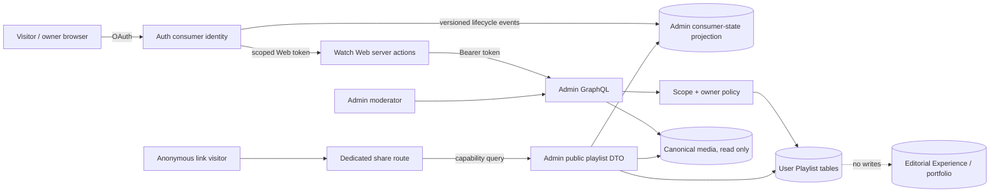
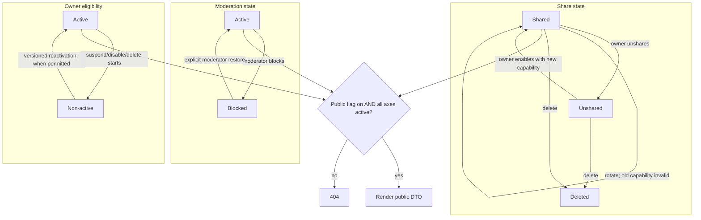
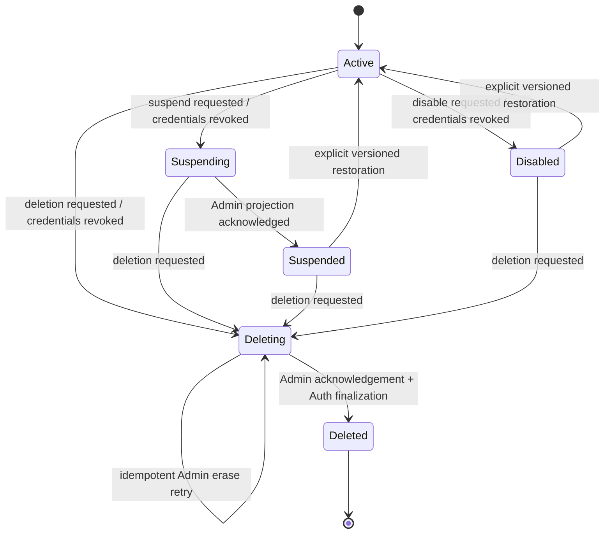
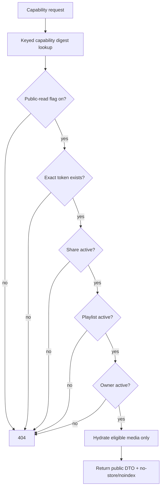

# Self-service User Playlists - Plan

## Goal Capsule

- **Objective:** A verified regular Watch user can assemble existing Jesus Film media into a personal, country-contextualized playlist Experience and share it through a durable unlisted link without changing editorial portfolio organization.
- **Product authority:** The Product Contract below governs account privilege, playlist composition, unlisted access, portfolio isolation, and launch safety.
- **Open blockers:** External rollout must name its first country/locale cohort and pass the identity-access, eligible-catalog, representative-task, and minimum-use gates in R30. Email/password authorship remains deferred until transactional verification exists; a country that cannot meet the verified-social identity threshold does not enter the V1 authoring cohort.

---

## Product Contract

### Summary

Watch visitors may self-register as regular consumers and create their own presentation Experiences from existing media. These User Playlists are isolated from editorial Experiences, collections, carousels, media ownership, search, embeddings, and public route organization. Each playlist is accessible to anyone who possesses its opaque link, but it is absent from discovery surfaces and explicitly marked not to be indexed.

### Problem Frame

Forge currently has consumer sign-in and user-owned watch progress, but new self-service accounts remain `INVITED` and cannot complete the Web OAuth flow. The only compositional Experience model is editorial and feeds canonical public organization. Reusing it for user content would overgrant consumers and risk portfolio/search contamination. Anonymous link sharing also introduces capability leakage, XSS/SSRF, object-ownership, resource-exhaustion, reputation, moderation, and account-erasure risks.

### Key Decisions

- **Visitors may create regular consumer accounts** (session-settled: user-directed — chosen over staff invitation-only access: country-local users need to curate for their communities). Governs R1-R3.
- **User Playlists are independent presentation aggregates** (session-settled: user-directed — chosen over mutating editorial Experiences or portfolio collections: user curation must not reorganize canonical media). Governs R4-R8.
- **Sharing is unlisted and crawler-readable** (session-settled: user-directed — chosen over public discovery or robots blocking: possession of the link should work like an unlisted YouTube playlist while crawlers can observe `noindex`). Governs R15-R20.

### Actors

- A1. **Visitor:** Signs up or signs in to Watch.
- A2. **Playlist owner:** Creates, composes, saves, shares, rotates, unshares, and deletes only their own playlists.
- A3. **Link visitor:** Opens a valid unlisted playlist without signing in and may report it.
- A4. **Moderator:** Reviews reports, blocks or restores a playlist, and records an auditable reason.
- A5. **Editorial user:** Continues to manage canonical Experiences and media with no authority inherited by regular consumers.
- A6. **Crawler:** May fetch an unlisted link and receives indexing suppression, but is not given a discovery path.

### Requirements

**Consumer account and privilege boundary**

- R1. A verified social-provider signup must produce an active human consumer eligible for the Web OAuth flow without creating an Admin user or editorial role.
- R2. Email/password and unverified-provider accounts may use ordinary account features but must not author playlists until their email is verified; role, status, scope, or account-kind input from the client must be ignored or rejected.
- R3. Playlist APIs require exact Web playlist scopes, active account status, correct issuer/audience/client/environment, and the authenticated subject; watch-event-only, TV, expired, suspended, disabled, or wrong-client tokens must not gain playlist authority. Auth must propagate a versioned consumer lifecycle to Admin. Projected `ACTIVE` leases renew at most every two minutes and expire after five minutes; any non-active, unknown, expired/stale, or deletion-in-progress state fails closed for mutations and public reads even when an earlier token remains valid.

**User-owned composition and portfolio isolation**

- R4. A User Playlist must be stored outside editorial `Experience`, `ExperienceLocale`, Collection, Carousel, Video, Media, embedding, manifest, and publication records.
- R5. Playlist blocks may reference existing media identity only and must never create, update, reorder, publish, archive, or delete canonical portfolio entities.
- R6. V1 composition supports bounded plain text, manual media collections, and video carousels populated from currently watch-visible existing videos; unknown or editorial-only block types and fields are rejected.
- R7. Arbitrary HTML, Markdown, CSS, scripts, embeds, iframes, external links, uploads, image/media/stream URLs, recommendations, quizzes, and Watch-home-only blocks are unavailable to regular users.
- R8. Media eligibility is rechecked on write and read. Withdrawn, deleted, restricted, territorially unavailable, or unplayable media is not exposed through a retained playlist reference. Web derives only the viewer country from trusted edge metadata and sends it to Admin in a short-lived integrity-protected context; unsigned, stale, direct-origin, or caller/playlist-supplied territory values are rejected. Missing trustworthy territory falls back only to globally eligible media. A write-time eligibility dependency failure rejects the entire save with a fixed retryable error and no version change; an anonymous read-time dependency failure returns a generic no-store HTTP 503 rather than masquerading as withdrawn/empty content or 404.

**Owner operations and abuse ceilings**

- R9. Every owner operation derives ownership from the verified token subject and applies the subject in the database predicate; no API accepts an owner identifier.
- R10. A different owner, an absent object, and a guessed identifier produce the same not-found-shaped result for reads and mutations.
- R11. Saves replace one validated snapshot atomically and reject a stale expected version without silently merging or overwriting ordered content.
- R12. Initial configurable limits are 20 playlists per account, 50 blocks per playlist, 100 items per block, 500 items total, a 120-character title, a 2,000-character description, and bounded request/batch sizes; exact-limit writes succeed and limit-plus-one writes fail atomically.
- R13. Playlist create/update/share/report operations have feature-specific per-subject and per-IP limits in addition to global GraphQL limits. The origin accepts traffic only through an authenticated/allowlisted edge path, strips untrusted forwarding headers, normalizes IPv4/IPv6 through a configured proxy chain, and falls back to a coarse global bucket when no trustworthy client IP exists.
- R14. A playlist carries one BCP-47 content locale plus optional ISO country metadata. The composer uses them to set media-search context, and the owner/public page displays the chosen country as creator-supplied context. Country never supplies entitlement, identity, discovery, geofencing, ranking, or automatic audience targeting.

**Unlisted sharing and anonymous rendering**

- R15. Creating a playlist requires both write and share scopes plus current R26 policy acceptance because creation also enables an anonymous capability. A new playlist receives an active, stable, cryptographically random capability and is accessible by its link immediately after a successful save; unsaved client state is never public. Persistence uses a keyed lookup digest plus separately envelope-encrypted recoverable ciphertext, and owner list responses never include the capability.
- R16. The owner may disable sharing or atomically rotate the capability. Unshare invalidates the current capability; a later explicit re-share always creates a fresh capability and never reactivates the old one. Old, disabled, deleted, moderated, suspended-owner, and globally-disabled capabilities return the same real HTTP 404.
- R17. Public reads select a purpose-built render DTO that may include the creator-selected locale/country label but omits owner identity, internal playlist ID, timestamps, moderation state, report data, and editorial fields.
- R18. Share pages are force-dynamic and `no-store`, use `Referrer-Policy: no-referrer`, redact capability paths across Cloudflare/Railway/origin/APM/application telemetry, and never use the capability to authorize mutations.
- R19. Share pages emit HTML `noindex, nofollow` metadata plus `X-Robots-Tag: noindex, nofollow, noarchive`, and are absent from sitemaps, canonical/hreflang output, structured data, navigation directories, public lists, search, and recommendations.
- R20. `robots.txt` must allow crawlers to fetch the share route so compliant crawlers can observe `noindex`; the UI explains that unlisted links are shareable, not private or secret.

**Moderation and lifecycle**

- R21. Every share page identifies the playlist as community-created and offers an accessible, rate-limited report flow with bounded categories and inert optional detail. A successful public read mints a short-lived, single-purpose report intent bound to the playlist digest and nonce; the report mutation never accepts the raw share capability and returns a uniform external result for accepted, duplicate, expired, invalid, or already-moderated submissions where feasible. Rate-limit IP material is a daily-keyed digest deleted within seven days; optional detail is encrypted under a dedicated key, visible only to explicit moderators, deleted within 30 days, and aged out of backups within 35 days; retained audit facts contain no reporter or owner identifier.
- R22. Moderators may block or restore a playlist and must record actor, reason, and timestamp without exposing reporter identity to the owner or leaking the raw capability in logs.
- R23. A public-read kill switch must make every playlist capability unavailable without affecting owner data, editorial Experiences, or ordinary Watch routes.
- R24. Suspended or disabled consumers cannot mutate and their public links are unavailable. Reactivating owner eligibility may restore an otherwise shared, moderation-active link, but it never clears a separate moderator block; an abuse block requires explicit moderator restoration.
- R25. Account deletion is an idempotent saga: Auth marks the subject `DELETING`, revokes sessions/grants, and blocks new writes; any Apple refresh credential is revoked with the existing failure-aborts-deletion policy; Admin atomically revokes capabilities, erases playlists, and detaches/pseudonymizes only the minimum retained moderation audit under an idempotency key; Auth deletes the identity only after durable acknowledgement. Raw reports, owner subject, and capability are not retained merely because an audit record is retained. Retries, partial failure, provider re-registration, or an Auth-finalization failure must never reactivate the subject or recreate access.
- R26. Playlist creation records acceptance of the current Terms, Privacy, and Community Guidelines versions before anonymous sharing is enabled.

**Experience and rollout**

- R27. Signed-in users have a discoverable “My playlists” entry independent of the unrelated download-account gate; signed-out visitors are returned only to a normalized relative allowlisted Watch path after OAuth. An email/password user who is not author-eligible sees an explicit V1 eligibility state and may securely link/re-authenticate with an allowlisted verified Google/Apple provider or return to Watch; the UI never promises an unavailable verification email.
- R28. The owner library supports list, create, edit, preview, copy link, unshare, re-share, rotate, and delete; the composer supports adding, removing, and reordering blocks and media with accessible keyboard and phone layouts. Preview and copy-link always represent the last successfully saved server snapshot, never dirty client state.
- R29. Patched Next.js and Better Auth versions must be locked before the feature flag can be enabled, and ordinary Watch routes must not gain playlist request-time work or lose cacheability. Cookie-authenticated owner mutations must be same-origin, non-GET, explicit-origin Server Actions behind trusted host normalization; authenticated Admin GraphQL remains server-only and rejects browser CORS access.
- R30. Before an external country/locale enters the authoring cohort, product and ministry owners must define a time-bounded pilot and record: verified Google/Apple completion rate for that audience; searchable eligible-media coverage; representative creator task completion against a production-like catalog; and minimum aggregate create, share, and successful-link-open counts plus structured creator interviews. Countries below the identity threshold route to the transactional email-verification follow-up; countries below catalog/task thresholds remain out of rollout. Metrics are cohort-level and privacy-minimized, with no user-level behavioral profile or public discovery.

### Key Flows

- F1. **Create a consumer account.** A1 chooses a verified social provider during Web OAuth; Auth creates or activates only a human consumer and returns a Web token with exact playlist scopes. A1 returns to the requested owner route. Covers R1-R3, R27.
- F2. **Compose and save.** A2 creates a playlist, accepts the current policies, searches existing videos, assembles supported blocks, and explicitly saves with an expected version. Admin validates schema, ownership, quotas, and media eligibility before atomically replacing the snapshot. Dirty local work stays private and is preserved on validation, network, or stale-version failure. Covers R4-R15, R26, R28.
- F3. **Open an unlisted link.** A3 presents the opaque capability. Admin resolves only an active, shared, unmoderated playlist owned by an active account and hydrates currently eligible media into a public DTO. Web returns a crawler-readable, no-store, noindex page. Covers R15-R20.
- F4. **Change link availability.** A2 confirms unshare or rotates; the prior capability becomes an indistinguishable 404 immediately while owner access remains. In the explicit unshared state Preview and Copy Link are disabled; Re-share creates a fresh active capability before those controls return. Covers R16, R18, R28.
- F5. **Report and moderate.** A successful A3 view receives a short-lived report intent; A3 submits bounded inert text with that intent. A4 records a reasoned block; the public route becomes 404 and A2 sees a generic moderation notice. Covers R21-R24.
- F6. **Delete account data.** A2 deletes the Auth account. Auth enters `DELETING`, revokes credentials, retries an idempotent Admin erase/pseudonymize operation to durable acknowledgement, and only then removes the identity. Covers R25.

### Acceptance Examples

- AE1. **Covers R1-R3.** Given a new verified Google or Apple user, when Web OAuth completes, then the user can create a playlist but cannot enter Admin or call editorial Experience mutations.
- AE2. **Covers R2, R27.** Given an unverified email/password user, when My Playlists or creation is opened, then no playlist is written and the page explains that V1 authoring requires a securely linked verified Google/Apple identity, offers that reauthentication path, and offers return to Watch without promising email delivery.
- AE3. **Covers R3, R9-R10.** Given User A owns a playlist, when User B or a TV token requests the owner list or replays A's identifiers for item read/update/reorder/share/delete, then list access is denied, identifier-bearing operations return not found, and A's content is unchanged.
- AE4. **Covers R4-R8.** Given a playlist save containing existing video IDs, then no editorial Experience, collection, carousel, media, video ordering, embedding, or route-manifest row changes.
- AE5. **Covers R6-R7.** Given a payload containing a valid collection plus raw HTML, an external URL, or an unknown block type, then the whole save is rejected atomically.
- AE6. **Covers R8.** Given a referenced video is later withdrawn, when owner or public content is loaded, then it is marked unavailable to the owner and omitted from public rendering.
- AE7. **Covers R11.** Given two editor tabs loaded version 4, when one saves version 5 and the second saves, then the second receives a stale-version result and version 5 is not overwritten.
- AE8. **Covers R12-R13.** Given an owner at a configured quota, the exact-limit write succeeds, the next write returns a bounded limit error, and changing a forwarded-IP header does not create a fresh limiter identity.
- AE9. **Covers R15-R17.** Given a valid share capability, an anonymous visitor receives the supported blocks but no owner, internal ID, timestamps, or moderation/report fields.
- AE10. **Covers R16.** Given a valid link, when its owner rotates it, the new link resolves and the prior link returns the same HTTP 404 as a random capability.
- AE11. **Covers R18-R20.** Given a crawler fetches a valid link, the HTML and response headers contain indexing suppression, robots permits the fetch, the link is absent from every sitemap, and the raw token is absent from logs and analytics.
- AE12. **Covers R21-R24.** Given a reported playlist, when a moderator blocks it, the public link becomes 404, the owner sees only a generic block reason/status, and ordinary Watch content is unaffected.
- AE13. **Covers R23.** Given the public-read kill switch is disabled, every share token returns 404 while owners may still access their stored drafts.
- AE14. **Covers R25.** Given an account with shared playlists, when deletion completes, all old capabilities are unavailable and no playlist remains attached to the deleted subject.
- AE15. **Covers R27-R29.** Given a low-width signed-in session, the owner can reach and operate My Playlists without the download flag, and ordinary homepage/video responses retain their prior cache and performance behavior.
- AE16. **Covers R3, R24-R25.** Given a previously valid token and share link, when the owner enters `SUSPENDING` or `DELETING`, then mutations and anonymous reads fail closed before final deletion, including during replayed or out-of-order lifecycle delivery.
- AE17. **Covers R15, R18.** Given a sentinel capability, when it is created, copied, viewed, rotated, and restored from backup, then only the keyed digest is searchable, ciphertext is recoverable only through an authorized owner reveal, and no telemetry layer contains the raw token.
- AE18. **Covers R21.** Given a valid playlist view, when forged, expired, replayed, cross-playlist, duplicate, or concurrent report intents are submitted, then they yield a uniform external response and bounded storage without revealing link validity.
- AE19. **Covers R11, R15, R28.** Given a dirty composer with a save in flight or failed, when the owner previews, copies, retries, or navigates away, then public access remains on the last successful snapshot, local edits are retained, and dirty navigation requires confirmation.
- AE20. **Covers R16, R28.** Given an unshared playlist, when the owner chooses Re-share, then a new capability is created and activated atomically, Preview and Copy Link become available only after success, and the previously invalidated link remains 404.
- AE21. **Covers R30.** Given a proposed external country/locale cohort, when provider completion or catalog/task readiness misses its predeclared threshold, then authoring remains disabled for that cohort and the recorded remediation points to identity verification or catalog readiness rather than broadening rollout.

### Scope Boundaries

- Admin/editor-created Experiences remain a separate product and data lifecycle.
- V1 has one owner and no collaboration, co-editors, followers, comments, likes, analytics, recommendations, public directory, search discovery, ranking, custom domains, or publishing into the official portfolio.
- V1 has no media upload, user-supplied media URL, arbitrary link, custom embed, raw HTML/Markdown, custom visual theme, or scripting surface.
- Country is creator-supplied visible context and a media-picker default only; locale/territory availability still comes from existing Watch media rules.
- Email/password playlist authorship is deferred until Forge has transactional verification email delivery; those accounts may sign in but remain ineligible to create shareable content.
- Mobile and TV may view the anonymous link through their browser behavior, but native playlist authoring/management and consumer API scopes are out of scope.
- No production deployment bypasses the normal PR-to-main and environment-configuration flow.
- Aggregate pilot measurement is allowed only for the R30 continuation decision; user-level behavioral analytics, creator profiling, and public discovery remain out of scope.

### Sources / Research

- `docs/solutions/cms/experience-locale-content-revision-draft-gateway.md` establishes the capability-link, public DTO, no-store, and noindex pattern.
- `docs/solutions/graphql/pothos-relation-abac-filter-required-for-nested-types.md` requires ownership/share predicates on root and nested data access.
- `docs/solutions/best-practices/watch-progress-history-user-isolation-pattern-20260702.md` establishes token-subject ownership for consumer data.
- `docs/solutions/auth/better-auth-firebase-migration-must-block-public-signup.md` establishes separation between public Auth signup and Admin enrollment.
- Official Next.js advisories require `next >= 16.2.11` for the affected line: [CSP nonce XSS](https://github.com/vercel/next.js/security/advisories/GHSA-ffhc-5mcf-pf4q), [proxy bypass](https://github.com/vercel/next.js/security/advisories/GHSA-6gpp-xcg3-4w24), [Server Function exposure](https://github.com/vercel/next.js/security/advisories/GHSA-955p-x3mx-jcvp), [SSRF](https://github.com/vercel/next.js/security/advisories/GHSA-p9j2-gv94-2wf4), and [Server Action DoS](https://github.com/vercel/next.js/security/advisories/GHSA-m99w-x7hq-7vfj).
- Better Auth security fixes and guidance: [official changelog](https://github.com/better-auth/better-auth/blob/main/packages/better-auth/CHANGELOG.md), [security guidance](https://better-auth.com/docs/reference/security), and [email/password verification](https://better-auth.com/docs/authentication/email-password).
- Object, property, and resource controls follow [OWASP API1](https://owasp.org/API-Security/editions/2023/en/0xa1-broken-object-level-authorization/), [API3](https://owasp.org/API-Security/editions/2023/en/0xa3-broken-object-property-level-authorization/), [API4](https://owasp.org/API-Security/editions/2023/en/0xa4-unrestricted-resource-consumption/), and [API6](https://owasp.org/API-Security/editions/2023/en/0xa6-unrestricted-access-to-sensitive-business-flows/).
- Crawler behavior follows [Google noindex guidance](https://developers.google.com/search/docs/crawling-indexing/block-indexing) and [robots.txt limitations](https://developers.google.com/search/docs/crawling-indexing/robots/intro).
- International UGC notice-and-action requirements need jurisdictional review; the implementation baseline follows [EU DSA Article 16](https://eur-lex.europa.eu/eli/reg/2022/2065/oj?locale=en).

---

## Planning Contract

### Authority and Constraints

- The Product Contract is authoritative. Implementation may refine mechanics but may not widen the consumer block/input surface, weaken exact-scope/ownership checks, reuse editorial persistence, or make shared playlists discoverable.
- The Auth subject is the sole owner identity. Admin remains the persistence and GraphQL authority; Web holds access tokens server-side and calls Admin through authenticated server actions.
- `noindex` suppresses compliant discovery but does not create secrecy. Product copy must describe the link as unlisted and redistributable.
- Feature-specific checks must occur in service/data boundaries even when Web proxy, Pothos scope auth, or a feature flag has already allowed the request.
- Version upgrades are a hard enablement dependency, not an unrelated cleanup.

### Assumptions

- A regular user is an Auth `HUMAN` consumer eligible for first-party Web access, not Admin `VIEWER`; Admin and Manager retain their app-local role checks.
- V1 activates verified Google/Apple identities. Email/password users remain non-authoring until a separate verified-email delivery path exists.
- A playlist is share-enabled at creation because “unlisted by default” means link-accessible but undiscoverable; the owner can unshare immediately.
- Saved content becomes visible at the same share link immediately; there is no draft/publish layer inside a User Playlist.
- One owner edits one playlist. Stale saves fail and preserve local UI state instead of using last-write-wins.
- Moderators are existing Admin users with a narrow playlist-moderation permission; regular users never receive this permission.
- Report/audit retention is policy-configured; account erasure removes the user identifier and capability while preserving only the minimum pseudonymous record required for abuse defense.
- Admin keeps a security projection of consumer lifecycle state because anonymous capability reads have no Auth token to introspect. Auth remains authoritative and its versioned transitions are monotonic.
- An on-demand Auth status call for every anonymous view was considered and rejected: it turns public availability into a synchronous cross-service dependency and still leaves no durable fail-closed deletion acknowledgement. The bounded lease projection is feature-local security infrastructure, not a replacement for unrelated account state consumers.
- The coordinated Next/Better Auth patch is intentionally part of the guarded feature branch because adding authenticated authoring and a capability route on the vulnerable baseline is not an acceptable intermediate state; feature flags keep the new behavior off while compatibility is verified.

### Key Technical Decisions

- **KTD1 — Separate aggregate** (session-settled: user-directed — chosen over reusing editorial `Experience`: R4-R8 require structural non-interference). Add `UserPlaylist`, `UserPlaylistReport`, and moderation audit persistence keyed by the Auth subject, with no relation to Admin `User` and no publication/search/embedding hooks.
- **KTD2 — Scope-carrying consumer principal.** Token authentication first validates integrity, issuer, audience, client/environment, activity, expiry, and subject, then carries immutable delegated client/environment/scope metadata on the principal. Each watch/playlist permission requires its exact scope; playlist permissions additionally require an allowed `jfp_web_*` client. TV/watch-event behavior remains valid, and `CONSUMER_BEARER` is not widened.
- **KTD3 — Verified-provider V1 activation.** Activate self-service consumer eligibility only after Better Auth validates an allowlisted Google/Apple callback and persists the provider-subject binding with a verified email result. Matching email alone never links accounts; existing-account linking follows explicit reauthentication policy. Client-supplied roles/status/scopes are never accepted, playlist scopes are minted from server-owned eligibility, and Admin access still requires an Admin database role. Email/password authoring stays gated until a mailer exists.
- **KTD4 — Bounded typed snapshot and closed renderer contract.** Persist a versioned JSON snapshot validated by a playlist-specific three-variant union. Store media identities, not presentation URLs; Admin returns a closed playlist DTO and Web renders it through an exhaustive playlist-specific adapter, reusing only safe low-level visual components. Editorial union expansion can never add a regular-user block implicitly.
- **KTD5 — SQL-level ABAC and optimistic concurrency.** Owner reads and mutations include both playlist ID and authenticated subject in one database predicate. Updates also require the expected version and increment it transactionally. Per-owner quota enforcement uses a locked quota/account row or equivalent serializable mechanism with bounded retry, rather than a racy count-then-create. User Playlists do not enter generic node/global-ID loaders or unfiltered Prisma relations.
- **KTD6 — Durable capability URL** (session-settled: user-directed — chosen over searchable slugs or authenticated viewing: R15-R20 require unlisted link access). Generate a unique 32-byte base64url token independent of the database ID. Persist an HMAC lookup digest under its own versioned Railway-secret key ring and AES-256-GCM ciphertext under a separate versioned key ring; bind playlist ID/token version as authenticated data and record key IDs/nonces. Reveal plaintext only through an explicitly authorized no-store owner action, never an owner list. Rotation atomically replaces digest/ciphertext, while runbooks add active keys, migrate/re-encrypt in bounded batches, retain old keys through backup retention, verify restore, then retire them.
- **KTD7 — Narrow public read with durable local lifecycle authority.** Auth persists each versioned owner-state transition and an outbox record in one transaction. A leased retry worker delivers signed, idempotent events to an Admin projection; Admin applies only monotonic versions. `ACTIVE` carries a renewable lease no longer than five minutes, refreshed at most every two minutes, so missing/stale/unknown/expired state fails closed. A bootstrap/reconciliation command seeds existing eligible subjects before authoring. Resolve a capability through share state, separate moderation state, projected owner state, and the kill switch. Recheck canonical Watch publication/locale/territory/playback eligibility in bounded batch queries using a short-lived integrity-protected Web-edge country context, adapt the DTO into safe renderer props, and return no generic relations or stored JSON.
- **KTD8 — Defense-in-depth abuse and request controls.** Web/edge enforces per-IP limits from trusted ingress; Admin enforces per-subject, per-capability/report-intent, quota, duplicate, and global ceilings because it normally sees Web egress. Any original-IP context crossing Web→Admin is authenticated and integrity-protected, never an unsigned forwarded header. Owner mutations require same-origin non-GET requests after trusted host/proxy normalization; direct-origin browser access and browser CORS to Admin are denied. When IP trust fails, use a coarse global bucket rather than caller input.
- **KTD9 — Moderation and erasure are launch scope.** A public read mints a short-lived single-purpose report intent; report writes consume/deduplicate the intent without accepting the raw capability. Admin block/restore audit, a public-read kill switch, and lifecycle enforcement ship before anonymous links. Routine lifecycle ingestion and destructive erasure use separate endpoints, audiences, credentials, and permissions. Account deletion is a retryable saga: durable `DELETING` plus session/grant revocation, idempotent Apple credential revocation, an erasure call matching the projected `DELETING` version and idempotency key, Admin erase/pseudonymize acknowledgement, then Auth identity finalization.
- **KTD10 — Security-gated rollout.** Upgrade Admin/Auth/Web to `next >= 16.2.11` and every Better Auth 1.6 package to the same patched stable release at or above 1.6.22. Keep authoring/public-read flags independently controllable until dependency, schema, adversarial, browser, and production-header gates pass.

### High-Level Technical Design

These sketches express boundaries and flow; exact names may adapt to package conventions during implementation.

#### Component architecture



#### Owner save protocol

```mermaid
sequenceDiagram
  participant O as Owner browser
  participant W as Web server action
  participant A as Admin playlist service
  participant M as Canonical media
  participant P as UserPlaylist
  O->>W: Save snapshot + expected version
  W->>A: Server-held scoped token + input
  A->>A: Verify client, scope, status, subject, limits
  A->>M: Validate referenced media eligibility (read only)
  A->>P: UPDATE where id + ownerSubject + version
  alt write succeeds
    P-->>O: Incremented version + share status
  else foreign/missing
    P-->>O: Not found
  else stale version
    P-->>O: Conflict; preserve local edits
  end
```

#### Independent public-availability axes



#### Consumer lifecycle and deletion saga



```mermaid
sequenceDiagram
  participant A as Auth
  participant D as Admin lifecycle/erasure endpoint
  participant P as Playlist storage
  A->>A: Persist DELETING; revoke sessions and grants
  A->>D: Erase(subject, lifecycle version, idempotency key)
  D->>P: Atomically revoke capabilities, erase playlists, pseudonymize retained audit
  P-->>D: Durable result for idempotency key
  D-->>A: Acknowledged
  A->>A: Finalize identity deletion
  Note over A,D: Any failure retries without returning the subject to ACTIVE
```

#### Anonymous authorization decision



#### Content data flow

```mermaid
flowchart LR
  Composer[Typed Web composer] --> Schema[Strict bounded input schema]
  Schema --> IDs[Canonical media ID eligibility check]
  IDs --> Snapshot[(Versioned playlist snapshot)]
  Snapshot --> Recheck[Read-time eligibility recheck]
  Recheck --> Hydrate[Public media hydration]
  Hydrate --> Adapter[Explicit safe renderer-prop adapter]
  Adapter --> Renderer[Exhaustive playlist renderer using safe low-level visuals]
  Renderer --> Page[Community-labeled unlisted page]
```



### Output Structure

```text
apps/auth/
  consumer activation + OAuth scope policy
apps/admin/
  prisma migration + playlist domain service
  scoped principal + GraphQL owner/public/moderation contracts
  internal account-erasure extension
apps/web/
  My Playlists library + focused composer
  unlisted playlist route + report flow + crawler headers
packages/admin-graphql/
  regenerated typed client contract
docs/roadmap/topic-experiences/
  feat-411 lifecycle record
```

## Implementation Units

### U1 — Patched Dependency and Feature-Flag Baseline

**Objective:** Remove known framework/auth vulnerabilities and create independent authoring/public-read controls before adding attack surface.

**Requirements:** R23, R29; KTD10.

**Primary files**

- `apps/admin/package.json`, `apps/auth/package.json`, `apps/web/package.json`
- `pnpm-lock.yaml`
- `apps/admin/src/config/env.ts`, `apps/web/src/env.ts`
- existing feature-flag definitions under `packages/feature-flags`
- dependency and environment tests identified by package-local guides

**Changes**

1. Upgrade Admin/Auth/Web to a single patched Next 16.2 release at or above 16.2.11, including compatible `eslint-config-next`, and upgrade `better-auth`, `@better-auth/expo`, `@better-auth/oauth-provider`, and `@better-auth/prisma-adapter` together to a stable 1.6 release at or above 1.6.22.
2. Review upgrade diffs for proxy, Server Actions, caching, auth redirects, rate-limit IP resolution, and image configuration; adopt current APIs instead of adding deprecated middleware/cache/image behavior.
3. Add separate authoring and anonymous-public-read flags plus an emergency public-read off switch. Admin/data-boundary flags are authoritative and fail closed when configuration is malformed; Web flags only hide or explain unavailable UX and never grant access.

**Test scenarios**

- Lockfile resolution contains no deployed Next version below 16.2.11 and all Better Auth family packages resolve to the same approved version.
- Existing Auth Web/TV OAuth, Admin login, Web proxy, Server Action, and image tests remain green after the upgrade.
- A disabled authoring flag denies owner mutations; a disabled public-read flag yields 404 for every capability while ordinary Watch routes remain available.

### U2 — Verified Consumer Activation and Exact Web Playlist Scope

**Objective:** Turn verified self-service identities into regular Web authors without widening staff or TV authority.

**Execution dependency:** Implement U3's Admin lifecycle projection, signed ingestion endpoint, and migration before enabling this unit's Auth outbox delivery; flags remain off until bootstrap reconciliation succeeds.

**Requirements:** R1-R3, R27; KTD2-KTD3.

**Primary files**

- `apps/auth/src/app/api/auth/[...all]/route.ts`
- `apps/auth/prisma/schema.prisma` and a forward-only lifecycle-outbox migration
- new `apps/auth/src/services/consumer-eligibility.service.ts`
- new Auth lifecycle outbox delivery/reconciliation services and tests
- `apps/auth/src/services/oauth-policy.service.ts`
- `apps/auth/src/domain/scopes.ts`, `apps/auth/src/domain/apps.ts`
- `apps/auth/src/auth/config.ts`, related Auth route/policy/seed tests
- `apps/web/src/auth/oauth-client.ts`, OAuth callback/login tests
- `apps/admin/src/auth/principal.ts`, `apps/admin/src/auth/web-user-token.ts`
- `apps/admin/src/auth/permissions.ts` and their tests

**Changes**

1. Add least-privilege Web playlist read/write/share scopes to the Auth registry, Web first-party seeds, and Web OAuth request. Never add editorial `experience:*` scopes.
2. Add a server-owned consumer eligibility domain service invoked from persisted Better Auth account/session lifecycle, not callback request fields. It activates new and already-linked `INVITED` human users only after an allowlisted Google/Apple provider binding and normalized verified-email result. Matching email alone never links an existing password/provider account; use the existing safe reauthentication/linking policy.
3. Audit every first-party app grant and callback so consumer activation cannot satisfy Admin/Manager access without their existing app-local role.
4. Retain introspected issuer, audience, client ID, environment, subject, active status, and scopes on the Admin principal. Gate playlist permissions on exact Web scope/client values; do not change watch-progress behavior for Web/TV tokens.
5. Persist every consumer state change and a versioned lifecycle outbox row in the same Auth transaction. Revoke current access/refresh token families before suspension/disable/deletion delivery, and deliver through a leased bounded-retry worker to U3's signed Admin lifecycle endpoint. Renew active leases at most every two minutes and alert/reconcile before their five-minute expiry.
6. Add a bootstrap/reconciliation command for already-linked eligible or inactive consumers; authoring stays disabled until Admin projection counts/versions reconcile.
7. Normalize and allowlist OAuth `returnTo` as a relative Watch path. Configure owner Server Actions for same-origin non-GET requests behind trusted host/proxy normalization; keep Admin tokens server-only and deny browser CORS to the authenticated owner contract.

**Test scenarios**

- Verified Google/Apple signup activates consumer Web access; unverified email/password signup can sign in but cannot mint/use playlist authority.
- An already-linked verified social user still in `INVITED` is safely activated by persisted lifecycle reconciliation; request/callback fields alone cannot trigger activation.
- Signup bodies containing admin/editor roles, `ACTIVE`, scopes, owner IDs, or unknown security fields cannot influence the stored identity or token.
- Exact Web audience/client/scope tokens pass; TV, watch-only, wrong issuer/audience/environment, expired, revoked, suspended, and disabled tokens fail.
- A consumer cannot enter Admin/Manager or invoke any existing editorial Experience/media/publish mutation.
- Pre-existing unverified accounts with the same email, mismatched provider subjects, callback replay, email change, malicious requested scopes, and encoded/protocol-relative `returnTo` values do not activate or redirect unsafely.
- Cross-site form/fetch, missing/forged Origin, Host/forwarded-host spoofing, and direct-origin owner writes are denied.
- State change plus outbox insertion is atomic; leased delivery retries safely after crash/timeout, and bootstrap/reconciliation covers existing subjects before authoring enablement.

### U3 — Isolated Playlist Aggregate, Validation, and Ownership Service

**Objective:** Persist user composition behind strict invariants without touching portfolio organization.

**Requirements:** R4-R14, R24-R26; KTD1, KTD4-KTD5, KTD8-KTD9.

**Primary files**

- `apps/admin/prisma/schema.prisma` and a new forward-only migration
- new `apps/admin/src/services/user-playlist.schemas.ts`
- new `apps/admin/src/services/user-playlist.service.ts` and focused tests
- new authenticated internal lifecycle-ingestion route/service and bootstrap tests
- `apps/admin/src/services/errors.ts`
- `apps/admin/src/graphql/types/blocks.ts` only for reusable read-time hydration helpers
- `apps/admin/src/services/index.ts`

**Changes**

1. Add playlist, report, moderation-audit, consumer-lifecycle projection, and per-owner quota persistence with owner subject, locale/country metadata, validated blocks JSON, version, keyed share-token digest, versioned encrypted token ciphertext, separate share/moderation state, acceptance versions, lifecycle version, timestamps, and indexes for owner listing/digest lookup. Land this projection and ingestion boundary before Auth emitters can deliver.
2. Define a strict discriminated union for Text, MediaCollection, and VideoCarousel with the R12 limits, no passthrough fields, no arbitrary URLs, and canonical media identifiers only.
3. Implement owner list/create/read/update/delete/share/unshare/rotate/reveal services whose predicates include the verified subject. Add version-conditional atomic updates and fixed not-found/conflict/limit errors. Reveal is separately authorized/no-store and owner lists never expose ciphertext or plaintext.
4. Validate referenced media as current public Watch content on write; recheck and hydrate only eligible media on owner/public reads. Missing items remain visible as warnings to owners and disappear from anonymous output.
5. Enforce aggregate and operation quotas through a locked quota row or equivalent serializable mechanism with bounded retry. Rotation changes digest/ciphertext atomically; define encryption-key rotation and backup-restoration verification. Add sanitized structured audit events without titles, descriptions, report detail, raw tokens, or capability paths.
6. Add a signed internal lifecycle endpoint that applies only monotonic versions idempotently, plus a separately authenticated erasure endpoint/audience that requires the matching projected `DELETING` version and idempotency key. Add bootstrap/reconciliation reads used by U2 and invariant tests/snapshots proving all playlist operations leave editorial and media organization untouched.

**Test scenarios**

- Create/save/list/delete succeeds for the verified owner and never accepts an owner field; a second subject receives not found for every identifier-bearing operation.
- Supported blocks round-trip in order; unknown fields/types, HTML/Markdown, link/URL fields, malformed Unicode, oversized text, too many blocks/items, and invalid media IDs reject the whole write.
- Exact configured limits pass and limit-plus-one fails without a partial row or version increment.
- Two writes with the same expected version yield one success and one conflict; the successful snapshot is preserved.
- Concurrent creates from quota-minus-one admit only the allowed count; concurrent rotate/unshare leaves exactly one intended capability state and no recoverable old token.
- Withdrawn/deleted/restricted media is warned for owner reads and omitted from public hydration.
- Write-time media lookup timeout/error leaves the snapshot/version unchanged; public hydration timeout/error produces a generic no-store 503, while only a successful eligibility query may omit withdrawn items or render a valid empty result.
- Backup restore and encryption-key rotation preserve authorized reveal/digest lookup without exposing plaintext; sentinel tokens never enter logs.
- Missing/stale/out-of-order/replayed lifecycle events fail closed; signed retry and bootstrap produce the expected projection without rolling a newer state backward.
- Expired active leases make public reads and mutations unavailable within five minutes of the last renewal, and lifecycle credentials cannot call the erasure endpoint.
- Portfolio tables, search/embedding jobs, manifests, and editorial webhooks receive no mutation or side effect.

### U4 — Owner, Public, Moderation GraphQL Contracts

**Objective:** Expose narrow typed entry points while preserving ownership and public-field boundaries.

**Requirements:** R3, R9-R13, R15-R25; KTD2, KTD5-KTD9.

**Primary files**

- new `apps/admin/src/graphql/types/user-playlist.ts`
- new `apps/admin/src/graphql/mutations/user-playlist.ts`
- `apps/admin/src/graphql/schema.ts` and classification/regression tests
- `apps/admin/src/graphql/plugins/rate-limit.ts`, `apps/admin/src/app/api/graphql/route.ts`
- `apps/admin/schema.graphql`
- generated outputs and operations in `packages/admin-graphql`

**Changes**

1. Add paginated owner list/read plus create/update/delete/share/unshare/rotate mutations gated by exact playlist permissions. Creation requires the composite write+share+policy-acceptance rule from R15/R26. Resolver input excludes owner, capability, moderation, and role fields.
2. Add a separately authorized, share-scope-gated, no-store owner capability-reveal operation; keep plaintext and ciphertext out of owner list/read types and telemetry.
3. Add a token-only public query returning a purpose-built DTO. Apply public-read flag, exact token, share state, moderation state, owner eligibility, and trusted viewer-country context before hydration; expose no Prisma relation that can bypass the predicate.
4. Add a public-read-issued short-lived report intent bound to playlist digest, expiry, and nonce. The anonymous report mutation accepts only this intent, consumes/deduplicates it transactionally, stores bounded inert detail encrypted under a report-only key, stores only rotating keyed IP digests, applies per-intent/playlist/IP/global ceilings, and returns a uniform external response.
5. Add Admin-only report-queue and block/restore GraphQL actions with actor/reason/timestamp audit; do not widen the regular-user type. U7 owns the moderator UI and operational workflow.
6. Add field-specific GraphQL rate/cost/depth/body/batch limits and Admin-side subject/capability/intent/global ceilings. Do not treat Web egress as the visitor IP, accept unsigned forwarded context, register User Playlist in generic node/global-ID loaders, or expose unfiltered Prisma relations.
7. Print `apps/admin/schema.graphql` and regenerate `packages/admin-graphql`; never hand-edit generated declarations.

**Test scenarios**

- Principal matrix covers anonymous, owner, other user, watch-only Web token, TV token, editor, moderator, and admin for every operation.
- Public query returns only the approved DTO; source-aware regression tests catch owner/internal/moderation/report/timestamp fields or unprotected nested resolvers.
- Capability reveal requires owner+share scope, is no-store, and never broadens owner list/read or telemetry fields.
- Invalid, rotated, unshared, deleted, blocked, suspended-owner, and kill-switched tokens return the same null/not-found contract.
- Report throttles, duplicate suppression, fixed validation errors, and direct-Admin/unsigned-forwarded-context bypass tests hold at boundaries.
- Forged, expired, replayed, cross-playlist, duplicate, and concurrent report intents produce uniform external behavior and bounded storage; hostile detail remains inert in Admin.
- Cross-owner global-ID attempts, alias/batch attacks, and nested-field traversal cannot bypass the root subject/share predicates.
- Generated schema/client operations typecheck and existing public resolver classification remains unchanged.

### U5 — My Playlists Library and Focused Composer

**Objective:** Give signed-in Watch users an accessible phone-first workflow to assemble existing media safely.

**Requirements:** R6-R8, R11-R16, R20, R26-R28; KTD4-KTD6.

**Primary files**

- `apps/web/src/components/watch/AccountControl.tsx` and tests
- new owner routes under `apps/web/src/app` following the authenticated History pattern
- new playlist server actions near `apps/web/src/lib/watch-event-actions.ts`
- new playlist library/composer components and tests under `apps/web/src/components`
- `apps/web/src/lib/search-actions.ts` and existing media result types
- Web locale message catalogs and generated locale outputs

**Changes**

1. Add “My playlists” to the signed-in account menu independently of the download-account gate and preserve `returnTo` through OAuth. For ineligible email/password users, render the explicit verified-provider link/reauth or return-to-Watch state from R27.
2. Build a dynamic owner library with pagination and explicit empty/loading/error/quota states. Confirm create/delete/unshare/rotate actions. An unshared row disables Preview and Copy Link and offers Re-share; Re-share creates and activates a fresh capability before enabling those controls, while the old capability remains invalid.
3. Build a focused composer for playlist metadata and the three supported block types. Use creator-selected locale/country as visible context and the media-search default, never entitlement. Reuse public Watch video search for an explicit video-only picker; store selected identity, not returned media URLs. Retained withdrawn/deleted/restricted/unplayable references preserve their position in an owner-only unavailable state without revealing restricted metadata, offer Remove and Replace, and block a save that would retain an invalid reference.
4. Use an explicit manual Save state machine: `clean`, `dirty`, `saving`, `saved`, `validation-error`, `network-error`, and `stale-conflict`. Preserve the local snapshot on every failure, guard navigation while dirty, and label Preview/Copy Link as the last successful save until a new save succeeds. A stale conflict keeps the local snapshot available for copy/retry without silently merging it.
5. Provide persistent Move up, Move down, and Remove controls alongside optional drag interaction. Announce the new ordinal position through a polite live region, retain focus on a moved block, move focus to the next logical control after removal, use at least 44-by-44-pixel touch targets, and stack controls without horizontal scrolling at phone widths.
6. Before creation and its first anonymous capability, show the exact versioned Terms, Privacy, and Community Guidelines links with an initially unchecked affirmative acceptance control. Cover pending and failure states; decline exits without creating a playlist. Record accepted versions atomically with creation and do not create or reveal a capability before success.
7. Keep the access token server-side and obtain plaintext share capabilities only through the separate no-store owner reveal. Never call authenticated Admin GraphQL directly from the browser or send share tokens to RUM. Owner Server Actions enforce same-origin/host checks, Web-ingress IP limits, and no GET state changes; any IP context forwarded to Admin is signed/integrity-protected.

**Test scenarios**

- Signed-out owner routes return through login to the intended page; signed-in users reach My Playlists even when download features are disabled.
- Ineligible email/password users see no broken verification promise and can safely link/re-authenticate with Google/Apple or return to Watch.
- Phone and desktop flows create a playlist, search/select existing videos, add/reorder/remove supported blocks, save, copy, unshare, rotate, and delete.
- Client and server show bounded validation/quota errors without echoing hostile content; unknown block controls cannot be constructed through normal UI.
- A stale save preserves the user's local snapshot and offers reload/retry; it never silently overwrites the newer server version.
- Clean/dirty/saving/saved/validation/network/conflict states are observable; dirty navigation is guarded and Preview/Copy Link never claims unsaved work is public.
- Withdrawn, deleted, restricted, and unplayable references render the privacy-safe unavailable state with working Remove/Replace actions and cannot be retained by a new save.
- Policy acceptance is affirmative and version-bound; decline or persistence failure creates neither playlist nor capability.
- Unshare disables Preview/Copy Link; Re-share creates a fresh capability and never revives the old one.
- Keyboard focus, names, persistent order controls, ordinal live announcements, post-remove focus, touch targets, phone stacking, pending states, error announcements, and destructive confirmations are accessible.
- Cross-site submissions, forged/missing Origin, direct-origin calls, browser-to-Admin CORS, and host-header confusion cannot invoke an owner mutation or reveal a capability.

### U6 — Dedicated Unlisted Share Route

**Objective:** Render a durable link-accessible playlist without discovery, token leakage, stale cache, or portfolio routing effects.

**Requirements:** R8, R15-R21, R23-R24, R29; KTD6-KTD7, KTD10.

**Primary files**

- new public route under `apps/web/src/app` adjacent to the preview route
- new `apps/web/src/lib/user-playlist.ts`
- `apps/web/src/components/sections/index.tsx` and safe shared renderers
- `apps/web/src/proxy.ts` and `apps/web/src/proxy.test.ts`
- `apps/web/src/app/robots.ts` and tests
- `apps/web/src/app/sitemap*.ts` and tests
- Web page, metadata, header, error, and performance tests

**Changes**

1. Add a reserved capability route that bypasses locale canonicalization without joining ordinary Experience resolution. Resolve locale from the public DTO, transform it through an explicit safe-prop adapter, and render only supported blocks; never spread stored JSON or GraphQL objects into editorial components.
2. Mark the route force-dynamic/revalidate-zero/force-no-store; add Web-ingress IP limits, derive a minimal country from authenticated edge metadata, and send country/audience/request ID/expiry to Admin under integrity protection. Reject unsigned/stale/direct-origin context and fall back only to globally eligible media when trustworthy country is unavailable.
3. Add HTML robots metadata, `X-Robots-Tag`, `Referrer-Policy: no-referrer`, restrictive framing/content headers, and a real not-found response for every unavailable state.
4. Keep the route allowed in robots while proving absence from sitemaps, hreflang/canonical metadata, JSON-LD, search, navigation, route manifests, and recommendations.
5. Put a compact public header before the ordered blocks: playlist title, creator-selected locale/country context, prominent community-created and unlisted/shareable notice, and a consistently placed Report action. On narrow screens the header wraps/stacks without hiding the notice or report action.
6. Give the report dialog explicit `idle`, `validation`, `submitting`, `uniform-success`, `retryable-network-error`, and `unavailable-intent` states. Show remaining characters, prevent duplicate submission, focus and trap the dialog accessibly, support Escape/Cancel with focus restoration, and use one externally identical completion message for accepted, duplicate, expired, invalid, and already-moderated submissions. Render all playlist/report/moderation text as inert text, never linkify it, and ensure outbound navigation cannot leak the token.
7. Render eligibility-dependency failures as a dedicated localized no-store HTTP 503 page with neutral retryable copy, a Retry action, focus on the error heading, and all valid-route noindex/no-referrer/token-redaction controls; keep it distinguishable from capability 404 states without leaking playlist validity.
8. Verify public-read flag and revocation at the data boundary on every request; introduce no shared/public cache until revocation-safe caching is separately designed.
9. Make Cloudflare/Railway/origin/APM access-log redaction and restrictive CSP/frame/content headers rollout gates, then probe every telemetry layer with a sentinel capability.

**Test scenarios**

- A valid capability renders hydrated text/collection/carousel content; invalid/rotated/unshared/deleted/blocked/suspended/kill-switched cases return identical HTTP 404 pages.
- Eligibility-dependency failure renders the localized retryable no-store 503 with accessible focus and the same privacy/indexing controls, never the capability 404 page.
- HTML and response headers include noindex/nofollow/noarchive/no-referrer/no-store controls for browser and crawler user agents.
- Robots permits the route, while all sitemap/discovery/canonical/hreflang/structured-data/search outputs omit it.
- The raw capability never appears in analytics events, application logs, report notifications, or referrers.
- Web-ingress IP throttles and Admin capability/intent/global ceilings remain effective when callers try direct Admin access or forge forwarded headers.
- Territory checks use only signed fresh edge country context; caller/playlist country cannot expose draft, preview, withdrawn, or out-of-territory media, and missing context yields globally eligible content only.
- Tag-like text, entity/double encoding, bidi controls, malformed Unicode, URL-shaped text, hostile report detail, and hostile canonical metadata remain inert through the safe-prop adapter and browser rendering.
- Public header hierarchy remains clear on phone widths, and report dialog validation/network/intent/duplicate paths preserve focus, detail, bounded submission, and uniform terminal disclosure.
- Ordinary homepage, video, Experience, search, and manifest behavior/caching are byte- or assertion-equivalent with and without playlist data.

### U7 — Moderation, Suspension, and Transactional Erasure

**Objective:** Make anonymous hosted content operable and revocable across abuse and account lifecycle events.

**Requirements:** R13, R16, R21-R26; KTD8-KTD9.

**Primary files**

- playlist report/moderation services and tests from U3
- new U7-owned Admin moderator route, components, and permission tests following Admin conventions
- `apps/auth/src/services/account-deletion.service.ts` and tests
- `apps/admin/src/app/api/internal/watch-progress/route.ts` and tests, renamed/generalized if necessary
- consumer suspension/token-introspection paths in Auth/Admin
- operational documentation under `docs/` identified by existing incident conventions

**Changes**

1. Complete anonymous/signed-in report submission, generic owner status, and report-detail privacy. Build a paginated moderation queue grouped by playlist with status and report-count filters, explicit empty/loading/error states, and a privacy-redacted detail view that handles retention-expired detail. Require a reason and confirmation for Block/Restore, announce success, and return focus to the updated queue row.
2. Add an authenticated Auth-to-Admin lifecycle contract for `ACTIVE`, `SUSPENDING`, `SUSPENDED`, `DISABLED`, `DELETING`, and `DELETED`. Transitions are idempotent, monotonic/versioned, replay-safe, persisted locally, leased for active state, and fail closed when stale/unknown/expired. Moderation remains a separate state axis, so reactivation never clears a block.
3. Replace the one-shot deletion hook with an idempotent saga: Auth durably enters `DELETING` and revokes sessions/grants; preserve the existing strict Apple refresh-token revocation step; call the separately credentialed erasure endpoint with matching lifecycle version/idempotency key; Admin acknowledges atomic capability revoke/playlist erase/audit pseudonymization; Auth finalizes identity deletion only after acknowledgement. Failure or retry cannot re-enable writes or duplicate retained data.
4. Restrict encrypted report detail to explicit moderators, delete raw detail within 30 days, rotate/delete IP digests within seven days, verify backup expiry within 35 days, and retain only non-identifying audit facts.
5. Document the report triage, emergency kill switch, retention/pseudonymization rule, restoration path, and legal-policy owner. Link current Terms/Privacy and a versioned Community Guidelines surface before enabling sharing.

**Test scenarios**

- Anonymous and signed-in reports are bounded/rate-limited, do not expose reporter identity or token validity, and create an auditable moderator queue item.
- Queue pagination/grouping/filters and empty/loading/error/expired-detail states are operable; confirmed Block/Restore requires a reason, announces completion, and returns focus predictably.
- Block makes public access 404 immediately; restore is explicit; reporter data is never shown to the owner.
- Suspension/disable blocks existing-token mutation and public reads; ordinary consumer history behavior follows its existing policy.
- Lifecycle replay, out-of-order delivery, unknown/stale state, partial failure, and already-issued tokens all fail closed; an explicit versioned restoration is required.
- Deletion retries between every saga step, concurrent create/update, replayed requests, Auth-finalization failure, and subject/provider re-registration never restore access or duplicate retained audit data.
- Apple revocation failure aborts before Admin erasure and retries idempotently without weakening the existing provider-credential guarantee.
- Kill-switch and restore runbook checks work without modifying or redeploying playlist data.
- Lifecycle and erasure credentials cannot call each other's endpoints; erase rejects a missing/mismatched `DELETING` version or idempotency key.
- Report-detail permission, encryption, keyed-IP retention, raw-detail deletion, backup expiry, and non-identifying audit retention are verified at their exact boundaries.

### U8 — Contract, Adversarial, Performance, and Rollout Verification

**Objective:** Prove the complete scope, document the operator boundary, and close the roadmap only after safe end-to-end behavior.

**Requirements:** R1-R30; all KTDs.

**Primary files**

- all focused tests named in U1-U7
- `apps/admin/src/graphql/public-resolvers.regression.test.ts`
- package and browser test configuration
- `docs/roadmap/topic-experiences/feat-411-self-service-user-playlists.md`
- new `docs/runbooks/user-playlist-sharing.md`
- a durable solution note under `docs/solutions/` created by `ce-compound`

**Changes**

1. Run the full principal/adversarial matrix, including role/owner/moderation injection, BOLA replay, TV non-escalation, hostile text/URL/unknown fields, token guessing/rotation, spoofed proxy headers, quotas, and portfolio non-interference.
2. Run package-focused format, lint, typecheck, unit/integration tests, schema generation checks, migration checks, and Web loading-performance verification.
3. Browser-test desktop and phone account entry, create/compose/save/share/view/report/unshare/rotate/delete, cross-user denial, moderation, crawler headers, and responsive/accessibility behavior.
4. Add a control-plane checklist owned by the Forge platform operator: Cloudflare origin restriction and Logpush/path exclusion or redaction, Railway proxy/access-log path suppression, Datadog/APM processor redaction, secret/key-ring custody and rotation, and permissioned sentinel queries at each layer. If any provider cannot prevent raw capability retention, keep public reads off and resolve that infrastructure boundary before launch.
5. Keep flags off until patched dependencies, migrations, OAuth seeds, lifecycle bootstrap reconciliation, Terms/Guidelines, moderation ownership, telemetry controls, and kill-switch configuration are deployed; then enable authoring before public reads and verify production HTML/headers as both browser and crawler.
6. Before naming any external cohort, produce the R30 readiness matrix with provider completion, searchable eligible-media coverage, and representative creator task results. Run a time-bounded pilot with privacy-minimized aggregate create/share/successful-open counts and structured creator interviews; record minimum continuation thresholds before the pilot and do not expand a cohort that misses them.
7. Update feat-411 to complete only when the Definition of Done is satisfied; create follow-up roadmap tickets for transactional email/password verification or native mobile/TV work rather than silently broadening this PR.

**Test scenarios**

- All package gates and generated-artifact checks pass from a clean checkout with no unrelated files staged.
- Browser smoke demonstrates the complete owner/link/moderator lifecycle at desktop and phone widths.
- Production-like probes confirm noindex/no-store/no-referrer headers, robots crawlability, sitemap absence, token redaction, immediate revocation, and unchanged ordinary Watch cache/performance.
- Feature rollback through flags removes authoring/public access without data loss or any change to editorial Experiences.

## Verification Contract

### Automated Gates

Run the exact package-local commands documented in each touched package guide, including at minimum:

```bash
pnpm --filter @forge/auth lint
pnpm --filter @forge/auth typecheck
pnpm --filter @forge/auth test
pnpm --filter @forge/admin schema:print
pnpm --filter @forge/admin lint
pnpm --filter @forge/admin typecheck
pnpm --filter @forge/admin test
pnpm --filter @forge/admin-graphql generate
pnpm --filter @forge/admin-graphql typecheck
pnpm --filter @forge/web lint
pnpm --filter @forge/web typecheck
pnpm --filter @forge/web test
pnpm format:check
```

Also run focused migration validation and the repo's PR-focused CI-sensitive checks for all touched workspaces. Generated GraphQL output must be regenerated by commands, never edited manually.

### Security Matrix

`Own` always means an ID-and-subject database predicate. `NF` means the same not-found shape as an absent object. Partial playlist scope sets authorize only their named column; no scope implies another.

| Principal / credential                                            | Owner list | Owner item read | Create                             | Compose/update/delete | Share/rotate/reveal | Capability read        | Report intent/write           | Moderate                     | Lifecycle/erase                        | Editorial writes               |
| ----------------------------------------------------------------- | ---------- | --------------- | ---------------------------------- | --------------------- | ------------------- | ---------------------- | ----------------------------- | ---------------------------- | -------------------------------------- | ------------------------------ |
| Anonymous                                                         | Deny       | NF              | Deny                               | NF                    | NF                  | Valid active link only | Valid short-lived intent only | Deny                         | Deny                                   | Deny                           |
| Verified Web + playlist read scope only                           | Own        | Own             | Deny                               | Deny                  | Deny                | Valid active link      | View may receive intent       | Deny                         | Deny                                   | Deny                           |
| Verified Web + playlist write scope only                          | Deny       | NF              | Deny                               | Own                   | Deny                | Valid active link      | View may receive intent       | Deny                         | Deny                                   | Deny                           |
| Verified Web + playlist share scope only                          | Deny       | NF              | Deny                               | Deny                  | Own                 | Valid active link      | View may receive intent       | Deny                         | Deny                                   | Deny                           |
| Verified Web + read/write/share scopes                            | Own        | Own             | Own with current policy acceptance | Own                   | Own                 | Valid active link      | View may receive intent       | Deny                         | Deny                                   | Deny                           |
| Unverified/watch-only Web or TV token                             | Deny       | NF              | Deny                               | NF                    | NF                  | Valid active link      | View may receive intent       | Deny                         | Deny                                   | Deny                           |
| Wrong issuer/audience/client/environment or expired/revoked token | Deny       | NF              | Deny                               | NF                    | NF                  | Valid active link      | View may receive intent       | Deny                         | Deny                                   | Deny                           |
| Raw capability bearer                                             | Deny       | NF              | Deny                               | NF                    | NF                  | Valid active link only | Must exchange view for intent | Deny                         | Deny                                   | Deny                           |
| Invalid/expired/replayed report intent                            | Deny       | NF              | Deny                               | NF                    | NF                  | Independent            | Uniform no-op/result          | Deny                         | Deny                                   | Deny                           |
| Editor without playlist-moderation permission                     | Deny       | NF              | Deny                               | NF                    | NF                  | Valid active link      | View may receive intent       | Deny                         | Deny                                   | Existing editorial policy only |
| Explicit playlist moderator                                       | Deny       | NF              | Deny                               | NF                    | NF                  | Valid active link      | Audited queue read            | Block/restore only           | Deny                                   | No new editorial authority     |
| Admin without/with explicit moderation permission                 | Deny       | NF              | Deny                               | NF                    | NF                  | Valid active link      | Queue only when explicit      | Deny / audited block-restore | Deny                                   | Existing editorial policy only |
| Auth lifecycle service principal                                  | Deny       | NF              | Deny                               | NF                    | NF                  | Deny                   | Deny                          | Deny                         | Versioned lifecycle only               | Deny                           |
| Auth erasure service principal                                    | Deny       | NF              | Deny                               | NF                    | NF                  | Deny                   | Deny                          | Deny                         | Matching-version idempotent erase only | Deny                           |

Every relevant row is also tested across playlist `shared`, `unshared`, `blocked`, `deleted`, and kill-switched states, and owner `active`, `suspending`, `suspended`, `disabled`, `deleting`, and `deleted` states. Public read and mutation fail closed for every combination except an active owner plus an eligible operation; restoration of owner eligibility never clears playlist moderation.

### Browser and Runtime Gates

- Desktop and phone: login return, My Playlists, policy acceptance, create, media search, unavailable-media replace/remove, accessible block reorder, save/dirty/error/conflict, copy link, anonymous view/503/retry, report dialog states, unshare/re-share, rotate, delete.
- Moderator: grouped/filtered report queue, empty/loading/error/expired-detail states, reasoned confirmed block, public 404, restore, announcement and focus return.
- Crawler: response HTML/headers, real 404s, robots allowance, sitemap exclusion, no canonical/hreflang/JSON-LD.
- Performance: compare ordinary home/video/Experience requests before and after; playlist code must not add request-time queries, hydration, or client bundles to unrelated routes.
- Revocation: repeat uncached and CDN/proxy-shaped requests after unshare, rotation, block, suspension, kill switch, and account deletion.

### Rollout Gate

1. Deploy patched dependencies, migrations, OAuth seed changes, and flags disabled.
2. Confirm moderation owner, Terms/Privacy/Community Guidelines versions, trusted-proxy settings, quotas, and public kill switch.
3. Enable verified-social authoring for an internal cohort and run the adversarial/browser matrix.
4. Enable anonymous public reads, probe headers with browser/crawler user agents, and verify immediate revocation.
5. Name the first external country/locale cohort only after its R30 identity-access and eligible-catalog/task readiness matrix passes predeclared thresholds.
6. Run the time-bounded pilot and expand only when its aggregate creation, sharing, successful-link-use, and structured creator-interview continuation criteria pass, while report volume, mutation throttles, error rate, storage growth, and public-read latency remain within predeclared operational thresholds.

## Risks and Mitigations

- **Capability leakage:** An unlisted URL can be copied or logged. Use high entropy, no-referrer, telemetry redaction, rotation/revocation, and clear non-private copy.
- **BOLA/TV privilege escalation:** Static `WEB_USER` permissions can overgrant. Retain exact token scopes/client identity and apply subject predicates at the database write/read.
- **Portfolio contamination:** Reusing Experience readers could silently surface UGC. Separate tables/services/types and add explicit non-interference tests.
- **XSS/SSRF/phishing:** Editorial block schemas accept trusted URLs and rich content. Use a separate strict union with text and media IDs only.
- **Spam/storage exhaustion:** Auth and GraphQL generic limits are insufficient. Layer verified identity, transactional quotas, per-subject/IP throttles, reporting, moderation, and flags.
- **Withdrawn media resurrection:** Stored IDs can outlive eligibility. Revalidate on every anonymous read and never persist/fetch caller-provided URLs.
- **Stale capability cache:** Cached content could survive revocation. Start force-dynamic/no-store and defer caching until invalidation is independently proven.
- **Legal/reputation exposure:** Unlisted content is still hosted on the Jesus Film domain. Ship report/takedown/audit, community labeling, acceptance versions, policy ownership, and a kill switch.
- **Framework vulnerabilities:** The current lockfile resolves vulnerable Next/Auth packages. Treat patched versions and lockfile proof as enablement preconditions.
- **Zero-value or inaccessible rollout:** A technically safe feature can still fail country-local creators through provider access or catalog gaps. Gate each cohort on identity completion, catalog/task readiness, aggregate pilot use, and creator interviews without building user-level profiles.

## Deferred to Follow-Up Work

- Transactional verification email delivery and email/password playlist authorship.
- Native mobile/TV playlist builders or authenticated management APIs.
- Collaboration, public discovery, recommendations, analytics, comments, likes, follows, custom themes, media uploads, arbitrary links/embeds, geofencing, and promotion into official editorial Experiences.
- Revocation-safe public caching; V1 remains dynamic/no-store.

## Definition of Done

- Verified self-service social users can complete Web OAuth and create/manage their own bounded playlists; unverified, TV, watch-only, suspended, disabled, and wrong-client identities cannot.
- User Playlist persistence, services, GraphQL types, and Web routes are separate from the editorial Experience/portfolio lifecycle and invariant tests prove non-interference.
- Owners can create, compose, save with conflict protection, copy, unshare, rotate, and delete from an accessible desktop/phone Web UI.
- Anonymous valid links render a narrow community-labeled DTO through a safe-prop adapter; invalid/revoked/deleted/blocked/non-active-owner/kill-switched links return indistinguishable real 404s.
- Capability lookup uses keyed digests plus envelope-encrypted authorized reveal; share pages are no-store/no-referrer/noindex/nofollow/noarchive, crawler-accessible, absent from discovery, and sentinel probes prove raw capabilities absent across edge-to-application telemetry.
- Serializable quotas, same-origin/trusted-proxy controls, media revalidation, single-purpose report intents, takedown/audit, versioned lifecycle propagation, deletion saga, Terms/Guidelines acceptance, and public-read kill switch are implemented and tested.
- Next and Better Auth resolve to the approved patched versions; Admin schema and `packages/admin-graphql` outputs are regenerated by commands.
- Auth/Admin/Admin GraphQL/Web focused format, lint, typecheck, test, migration, performance, adversarial, and browser gates pass.
- A named initial country/locale cohort has passed the predeclared provider-access, eligible-catalog, representative-task, aggregate-use, and creator-interview continuation criteria; failing cohorts remain disabled with a documented follow-up.
- The PR contains only feat-411 scope, follows normal landing flow, records durable learnings, and marks the roadmap ticket complete only after every gate above passes.
