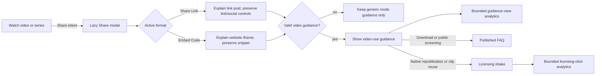

# feat: clarify Watch sharing, embedding, and reuse paths

## Goal Capsule

- **Objective:** Help Watch users who open Share understand the available sharing and film-reuse paths before they enter support, without changing media behavior or asserting new licensing policy.
- **Means:** Add concise, mode-specific guidance and approved help/licensing routes inside the existing Share modal, instrument the guidance with bounded analytics, preserve the existing video-route lazy boundary, and establish the equivalent intent-mounted boundary on series routes.
- **Authority:** The user brief and FGE-64 govern product scope; published Jesus Film Project guidance and the existing licensing intake form govern policy-bearing wording and routing; repository conventions govern implementation.
- **Stop conditions:** Do not send a Help Scout reply, decide a licensing request, invent legal policy, change Share/Embed/Download behavior, or deploy directly to production.

## Product Contract

### Summary

Clarify that Share Link and social buttons create a Watch-page link post, while Embed Code provides iframe HTML for a website. Name download/public screening, native social upload or republication, and clip reuse as distinct uses, and direct permission questions to the approved licensing intake path.

### Problem Frame

Help Scout #1645401 shows a ministry trying both Facebook Share and Embed Code for the Tagalog version of _Pilgrim's Progress_, expecting either control to upload the full film to Facebook. The production modal currently exposes correct link and iframe mechanics but does not explain their platform limits. Six independent FGE-64 support cases show the same gap around public screenings, republication, clip reuse, and third-party products; this repeated but non-urgent signal supports the roadmap's P2 priority.

The product can explain mechanics and route users to existing guidance. It cannot decide licensing policy or imply that a request will be approved.

### Requirements

- **R1. Link sharing:** The Share Link surface and Facebook/X actions must state that they share the current Watch-page link and do not upload the video file to the social platform.
- **R2. Website embedding:** The Embed Code surface must state that its iframe is for websites accepting custom HTML and cannot be pasted into an ordinary social-media post.
- **R3. Distinct use paths:** Video guidance must explicitly distinguish download and public screening, native social upload or republication, and clip reuse in another production from Share Link and Embed Code; series sharing must not imply that video-reuse guidance applies to a collection.
- **R4. Approved routing:** Published usage guidance must route to the existing Jesus Film Project FAQ, and native republication or clip-reuse permission questions must route to the approved licensing intake form without asserting an outcome.
- **R5. Behavior preservation:** Existing canonical share URLs, Facebook/X intents, iframe bytes, clipboard behavior, download behavior, modal ownership, and close/focus behavior must remain unchanged.
- **R6. Analytics privacy:** Record one guidance-view action per individual-video modal opening that presents valid guidance and a licensing-escalation click using low-cardinality fields only. The custom event name and payload must not contain titles, slugs, language, URLs, referrers, support content, or user identity; existing provider-level session behavior remains unchanged.
- **R7. Accessibility and responsive layout:** New explanations and links must remain within the dialog's scroll/focus tree, expose meaningful semantics and visible focus, meet the existing 44-pixel target convention, and remain reachable on desktop, narrow mobile, and 200% zoom.
- **R8. Localization:** New messages must remain in the existing projected `ShareModal` namespace across every shipped Watch catalog, preserve ICU/catalog parity, and retain accurate human-review or provisional translation provenance.
- **R9. Loading and rendering:** Video and series Watch routes must not render dialog/guidance nodes before intent, introduce hydration warnings, or move Share code into their initial-script path. Current-locale `ShareModal` messages may remain serialized in the RSC payload and must be measured. The modal-open interaction must add at most 0.01 layout shift.

### Key Decisions

- **Keep Share and Embed as their existing technical actions** `(session-settled: user-directed — chosen over native social upload: the user explicitly states that link posts and iframe embeds are the supported semantics)`. Governs R1, R2, R5.
- **Route permission questions instead of encoding a licensing decision** `(session-settled: user-directed — chosen over product-authored legal policy: the user requires approved copy or a responsible owner)`. Governs R3, R4.
- **Keep divergent residuals durable and out of this PR** `(session-settled: user-directed — chosen over silently broadening scope: the user explicitly requires tracker-backed residuals)`. Governs R3, R4, R5.

### Acceptance Examples

- **AE1:** A user choosing Facebook learns before leaving Watch that Facebook receives a link, and the existing `sharer.php?u=` destination remains unchanged.
- **AE2:** A user switching to Embed Code learns that the iframe belongs on an HTML-capable website, while Copy Code returns the unchanged snippet.
- **AE3:** A user considering a download or public screening can open the published usage guidance without being told a new permission rule.
- **AE4:** A user considering a full-film Facebook/YouTube upload or using a clip in another production sees that it is a separate use and can open the approved licensing intake form.
- **AE5:** Reopening a valid individual-video modal that presents video-use guidance produces another bounded guidance-view event; rerenders within one opening do not. A licensing click emits a bounded destination value and no content/user fields.
- **AE6:** Link-only series and embed-only fallback states retain useful, correctly associated guidance without exposing unavailable controls.
- **AE7:** A fully invalid share/embed identity retains the existing close-only state and emits no guidance-view event.
- **AE8:** A scenario review maps each of the five named intents to exactly one first destination: link post, website embed, published usage guidance, or licensing intake. User comprehension and support-deflection validation remain owned by FGE-93.

### Scope Boundaries

- In scope: the current Watch Share modal, its message catalog, focused tests, series-route lazy loading needed to prevent a bundle regression, analytics, and roadmap/Linear/PR evidence.
- Out of scope: native video uploads, media delivery, download/public-screening policy changes, licensing adjudication, Help Scout replies, new support forms, and production deployment.
- Existing FGE-53 remains the tracker for broader Share-modal semantics that are not required to make this guidance accessible.

### Deferred to Follow-Up Work

- [FGE-93](https://linear.app/jesus-film-project/issue/FGE-93/watchdiscovery-validate-reuse-guidance-comprehension-and-non-share) owns representative-user comprehension, support-deflection measurement, and evidence-supported reuse-guidance entry points for people who never open Share.

### Sources

- [Linear FGE-64](https://linear.app/jesus-film-project/issue/FGE-64/watchux-clarify-film-reuse-permissions-and-route-licensing-requests), including minimized direct evidence for Help Scout #1645401.
- [Production Tagalog Watch page](https://www.jesusfilm.org/watch/pilgrims-progress.html/tagalog.html), inspected with its current Share modal.
- [Jesus Film Project FAQ](https://www.jesusfilm.org/about/faq/), the published source for showing, clip, copy, broadcast, and link/embed guidance.
- [Approved licensing intake form](https://form.asana.com/?k=qIsNe5Cu3-v5qriWHzwH8Q&d=657768513276), verified live and supplied in existing licensing-support guidance.
- `docs/solutions/ui-bugs/watch-video-hero-share-action-placement.md`
- `docs/solutions/performance-issues/watch-staged-client-loading-20260611.md`
- `docs/solutions/conventions/frontend-change-page-load-performance-verification.md`
- `docs/solutions/ui-bugs/watch-modal-close-button-viewport-accessibility.md`
- `docs/solutions/ui-bugs/watch-collection-download-raw-next-intl-keys-missing-client-namespace.md`
- `docs/solutions/architecture-patterns/support-research-evidence-ledger-pattern-20260801.md`

## Planning Contract

### Key Technical Decisions

- **KTD1. Extend the existing lazy Share modal instead of creating a new route or owner.** This preserves `WatchPageClient`'s Standalone Watch Route identity and pause/resume lifecycle while satisfying R1-R5.
- **KTD2. Associate guidance with the active mode and gate video-use content explicitly.** Link/embed explanations follow the active field/panel via description IDs. An explicit `usageGuidanceScope` contract distinguishes individual video routes from series collections: standalone films and episodes use the video scope because native republication and clip reuse are relevant to both, while series use generic guidance. `playbackId` is not a content-type discriminator because real videos may lack one.
- **KTD3. Use existing external destinations as data-independent constants and the existing Watch GA event path.** The FAQ and licensing intake destinations are fixed public routes; analytics records only bounded static fields through the Google Analytics helper, never the URL or current content identity, and does not add the event to an identified Datadog RUM session.
- **KTD4. Move the series Share import behind the established dynamic, intent-mounted boundary.** Video routes already defer Share, but `SeriesPageClient` imports and mounts it eagerly. The dynamic renderer and `loadWatchInteraction("share")` preload/deduplication path must both resolve the same direct module; the loader is not the rendering boundary.
- **KTD5. Separate translated, provisional, and human-reviewed catalog paths.** New keys stay under `ShareModal`; scoped promotion targets only the manifest's machine-translated locales, `crk` and `mey-Latn` refresh from English as provisional catalogs, and any unapproved Russian/source-equivalent value is recorded under `pendingTranslationPaths` rather than being certified human-reviewed.

### High-Level Technical Design

The sketch is directional; implementation should reuse existing modal, loading, and analytics primitives rather than introduce a new subsystem.

### Assumptions

- The existing public FAQ is the approved general-use guidance destination, and the Asana form already used by support is the approved permission-request channel.
- Concise mechanical copy can be authored from observed product behavior; policy-bearing claims are limited to naming distinct uses and routing them for review.
- The scoped translation pipeline is preferred during implementation. If credentials are unavailable, source-equivalent values may ship only through the repository's explicit pending-translation mechanism; they cannot be marked translated or human-reviewed.
- A link-only series should mount only generic link guidance after Share intent; video-use guidance and its analytics remain disabled.
- Performance comparisons use immutable base `1f65d0af55f2c99df40a38a44053be5cb7463495` with the same production-build environment, route, locale, cache state, and browser profile.

### Sequencing

U1 establishes behavior and telemetry. U2 completes localization. U3 protects the series loading boundary. U4 validates the integrated user and performance flows and closes evidence.

### System-Wide Impact

- **Component ownership:** `WatchPageClient` remains the individual-video modal owner and explicitly selects video-use guidance for standalone films and episodes. `SeriesPageClient` remains the series owner, moves Share behind intent, and selects generic guidance.
- **Rendering lifecycle:** Closed guidance remains absent from video and series SSR HTML. New state is limited to the modal open edge; tab and clipboard reset behavior stays unchanged.
- **Client delivery:** `next/dynamic` owns the rendering split; `loadWatchInteraction("share")` owns intent preload/deduplication. Component and analytics code remain in one Share-containing resource. The existing projected messages add current-locale RSC bytes, so component-chunk timing and message-payload bytes require separate base/branch comparisons.
- **External navigation:** FAQ and licensing are ordinary external links with no prefetch, in-app fetch, credential, or response dependency. Destination failure leaves Watch behavior intact.
- **Telemetry:** New actions use the existing Watch Google Analytics path with bounded static fields and no Datadog action. Reporting remains non-load-bearing; a throwing analytics sink is swallowed and cannot block modal or link behavior.
- **Localization:** The existing `ShareModal` namespace projection remains the only message boundary. Catalog parity, ICU shape, provenance, and rendered LTR/RTL output move together.

### Risks & Dependencies

- **Licensing destination or wording changes after release.** Mitigation: keep destinations fixed and centralized in this bounded surface, cite the current published/approved sources, and route any policy revision through FGE-64 or its owner rather than improvising copy.
- **Additional copy makes mobile actions unreachable.** Mitigation: retain the single dialog scroll tree and viewport-fixed close control; browser-test 320×568, modern mobile, 200%, and 400% zoom through every terminal action.
- **Analytics double-counts or throws under rerender/provider behavior.** Mitigation: key the event to a closed-to-open presentation edge, reset on close, harden the GA helper against a throwing sink, and unit-test rerender, reopen, and failure sequences.
- **A dynamic import still enters the initial graph through an eager reference or unconditional mount.** Mitigation: remove the series static import, mount only on Share state, inspect the production chunk graph and request timing, and treat an initial Share request before its documented warm/intent window as a failure.
- **Catalog changes dominate page payload more than component code.** Mitigation: compare compressed initial HTML/RSC/message bytes separately from JS chunks and report the delta rather than hiding it in an aggregate Lighthouse score.
- **Translation credentials or external translation service are unavailable.** Mitigation: do not bypass parity/provenance controls; use only source-equivalent values explicitly recorded as pending, and preserve machine-review status when translation succeeds.

## Implementation Units

### U1. Add mode-specific guidance, approved routes, and analytics

- **Goal:** Make the five usage categories understandable inside the existing Share modal while preserving every current action.
- **Requirements:** R1-R7
- **Dependencies:** None
- **Files:** `apps/web/src/components/watch/ShareModal.tsx`, `apps/web/src/components/watch/__tests__/ShareModal.test.tsx`, `apps/web/src/components/GoogleAnalytics.tsx`, `apps/web/src/components/__tests__/GoogleAnalytics.test.tsx`
- **Execution note:** Add focused failing assertions for the guidance, destinations, and event payloads before changing the component.
- **Approach:** Add a visible description for each active mode and associate it with the existing tab panel/field. Show the link explanation before the social actions so it is read before departure. Add the explicit `usageGuidanceScope` prop for a compact video-use section immediately after the active link/embed control and before the modal footer, keeping its heading visible in the same scroll sequence as the primary action. Name download/public screening, native social republication, and clip reuse in distinct rows. Keep both external links inside the modal focus tree with localized new-tab semantics. Emit the view event on the closed-to-open edge only when valid video guidance is presented, and the licensing event at activation through the GA helper using bounded static fields. Make the helper swallow a throwing `gtag` implementation. Do not modify `apps/web/src/lib/share.ts`.
- **Patterns to follow:** Existing roving tabs and fallback modes in `ShareModal`; `reportGoogleAnalyticsEvent`; the shared viewport close button; `docs/solutions/ui-bugs/watch-modal-close-button-viewport-accessibility.md`.
- **Test scenarios:**
  1. Link mode visibly says Facebook/X/Copy Link share a Watch-page link without uploading the video.
  2. Embed mode visibly says the iframe is website HTML and does not work in an ordinary social post; its copied bytes are unchanged.
  3. The help section names download/public screening, native social republication, and clip reuse, linking the first to the FAQ and permission cases to the exact licensing form.
  4. Link-only video, embed-only video, series, and no-valid-identity states retain coherent context-appropriate guidance and expose only their existing actions; a fully invalid state emits no guidance event.
  5. New links use new-tab relations, visible focus, meaningful accessible names, and reachable target sizes; tab/tabpanel associations remain valid.
  6. One open edge emits the exact guidance event; rerendering does not duplicate it; closing and reopening emits again.
  7. Licensing activation emits the exact low-cardinality payload, and both events omit content, language, URL, support, and user fields.
  8. A throwing analytics sink does not escape, duplicate the event, break the modal, or prevent navigation.
- **Verification:** Focused Share tests prove copy, destinations, accessibility contracts, fallback modes, unchanged values, and exact analytics payloads.

### U2. Complete localized catalog coverage and provenance

- **Goal:** Make the guidance available on every Watch locale without misrepresenting translation review.
- **Requirements:** R8
- **Dependencies:** U1
- **Files:** `apps/web/messages/en.json`, `apps/web/messages/*.json`, `apps/web/scripts/ui-translation-policy.json`, `docs/i18n/watch-ui-provisional-catalogs.json`, `apps/web/src/i18n/__tests__/messages-parity.test.ts`, `apps/web/src/i18n/client-messages.test.ts`
- **Approach:** Add only the required `ShareModal` source keys. Refresh `crk` and `mey-Latn` through the provisional-catalog generator. Run scoped translation/promotion for the manifest's explicit machine-translated locale set rather than the default mixed queue. Record source-equivalent or machine-authored Russian paths as pending until a responsible owner reviews them. The namespace is already projected by `WATCH_CONTENT_CLIENT_MESSAGE_NAMESPACES`; add a focused assertion only if the existing projection test does not pin it. Limit catalog diffs to the new paths and provenance/generated manifests; runtime proof must show the selected locale, not unrelated locale strings, in the route payload.
- **Patterns to follow:** `apps/web/scripts/translate-ui-catalogs.mjs` and `docs/solutions/ui-bugs/watch-collection-download-raw-next-intl-keys-missing-client-namespace.md`.
- **Test scenarios:**
  1. Every catalog has the same new keys and valid ICU shape as English.
  2. A non-English LTR locale and an RTL locale receive rendered guidance rather than namespace-shaped raw keys.
  3. Machine-translated locales retain review-recommended provenance, and no new path is mislabeled locale-neutral or human-reviewed.
  4. A selected locale's guidance is serialized while a unique value from an unrelated locale is absent.
  5. `crk` and `mey-Latn` remain provisional after refresh, and Russian new paths are not represented as approved unless owner-reviewed copy is supplied.
- **Verification:** Catalog generation/checks, message parity, translation provenance, and client-message projection all pass.

### U3. Establish intent-mounted Share loading on series routes

- **Goal:** Keep the larger Share modal out of initial series-page code and DOM while preserving its state/identity behavior.
- **Requirements:** R5, R9
- **Dependencies:** U1
- **Files:** `apps/web/src/components/watch/SeriesPageClient.tsx`, `apps/web/src/components/watch/__tests__/SeriesPageClient.test.tsx`
- **Approach:** Mirror `WatchPageClient`: replace the eager Share import with the established dynamic renderer, call the unchanged direct-module loader best-effort on intent, and mount the modal only for the share state. Retain series title, description, poster, public language, and null playback ID, and select the generic usage-guidance scope. A guidance-only lazy leaf would leave the existing Share component/helpers in initial series JS and cannot satisfy R9, so the full modal is the minimum effective split.
- **Patterns to follow:** `WatchPageClient` modal chunk enabling and `loadWatchInteraction("share")`; the existing dynamic collection download in `SeriesPageClient`.
- **Test scenarios:**
  1. Initial series render has no Share modal DOM, Share-containing script, or Share-loader invocation.
  2. Share intent invokes the loader, opens the modal once loaded, and passes the existing series identity with no Embed tab and no video-use guidance/analytics.
  3. Closing returns modal activity to none; repeated open/close does not duplicate owners or stale identity.
- **Verification:** Focused series tests and production bundle/resource inspection prove the Share module is present initially on the base series route, absent initially on the branch series route, and requested at most once on intent. Branch series initial JS must not exceed base; cold click-to-dialog must remain within 100 ms of the branch video path locally and under 1 second on the chosen throttled profile.

### U4. Validate the integrated Watch flow and close durable evidence

- **Goal:** Prove behavior, accessibility, rendering, localization, browser compatibility, and page-load safety before shipping.
- **Requirements:** R1-R9
- **Dependencies:** U1, U2, U3
- **Files:** `docs/roadmap/platform/feat-412-watch-share-usage-guidance.md`, `docs/solutions/` (one new learning only if the result is durable and non-duplicative)
- **Approach:** Run focused and package-level checks, inspect production build chunks and SSR output, then exercise a playable standalone video and link-only series at desktop, mobile, and zoomed layouts. Compare initial transferred HTML/RSC and Share-resource timing against `origin/main`. Replace the roadmap's direct Help Scout link with the Linear evidence link so customer evidence remains centralized in Linear. Record only reproducible evidence; route any out-of-scope discrepancy to its existing or a new tracker.
- **Test scenarios:**
  1. Chromium desktop/mobile and 200% zoom keep copy, tabs, help links, actions, close control, and scrolling reachable with no overlap.
  2. Keyboard-only flow covers open, tab switching, external links, copy, Escape, and focus restoration.
  3. Firefox and WebKit automation cover link/embed guidance, new-tab hrefs, and responsive overflow where available.
  4. An English route, one non-English LTR route, and one RTL route render localized text without hydration warnings or raw keys.
  5. Cold standalone-video and series loads contain no rendered modal guidance nodes before intent; current-locale messages remain measurable in RSC; Share code follows intent timing; modal activation through settled dialog adds at most 0.01 layout shift.
  6. Facebook intent and iframe output match the base branch exactly.
- **Verification:** Focused tests, full web typecheck/lint/build, format/diff checks, cross-browser automation, and recorded before/after performance evidence pass before the roadmap item is marked complete and PR/Linear links are added.

## Verification Contract

- Run focused Share, series, canonical share, client-message, and catalog-parity tests.
- Run the complete `@forge/web` typecheck, lint, and production build with the documented production admin GraphQL endpoint.
- Run repository format and diff checks plus any CI-sensitive tests selected by the changed-file scope.
- Compare immutable base `1f65d0af55f2c99df40a38a44053be5cb7463495` and the branch under identical production conditions. Require zero new initial requests, no Share-containing initial script on branch video or series routes, at most 1 KiB transferred current-locale RSC growth, at most 10 KiB transferred Share-chunk growth attributable to guidance/telemetry, at most one Share request on first intent, and modal-window layout shift at or below 0.01.
- Confirm FAQ/licensing navigation and analytics requests occur only after their respective actions. Use Lighthouse as supporting evidence when available, not as a release gate; the targeted request, byte, latency, and layout-shift measurements own R9.
- Browser-test representative standalone video and series routes in Chromium at desktop and narrow mobile/200% zoom, and run Firefox/WebKit automation where the local harness supports it.
- Reject any result with raw translation keys, hydration/console errors, inaccessible actions, changed share/embed output, personal/free-text analytics, or a material page-loading regression.
- Open a PR through the normal branch workflow, keep Linear FGE-64 and feat-412 linked, and wait for CI's terminal decision. Do not deploy.

## Definition of Done

- R1-R9 and AE1-AE8 are covered by implementation and evidence.
- Existing Share, Embed, Download, canonical URL, clipboard, and modal lifecycle behavior is unchanged.
- All locale catalogs and provenance checks pass; any unreviewed translation remains explicitly provisional.
- Analytics payloads are exact, bounded, non-personal, and best-effort.
- SSR/hydration, lazy loading, current-locale RSC bytes, cold interaction latency, and modal-window CLS satisfy the Verification Contract gates.
- Focused, package, formatting, browser, and CI checks reach a terminal passing decision.
- The Help Scout evidence remains only in Linear; no customer reply is sent.
- The roadmap ticket is complete, PR and Linear links are current, and any divergent residual is filed in the appropriate tracker rather than added to this PR.
