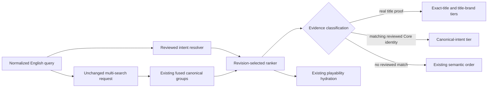
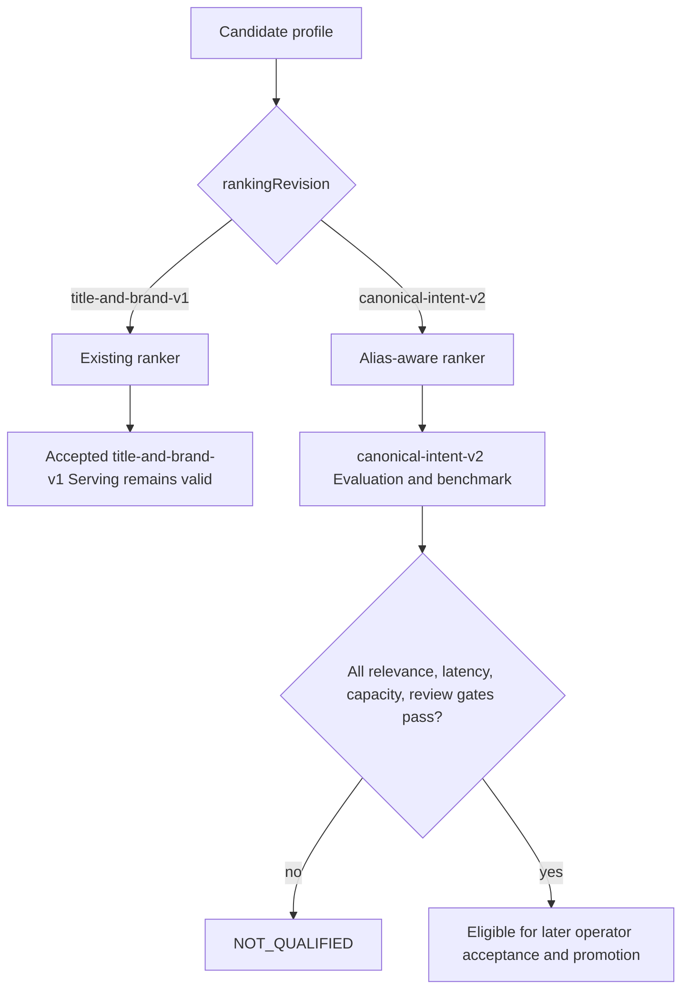

# Common Phrase Watch Search Ranking - Plan

## Goal Capsule

**Objective:** English Watch search returns the playable canonical children’s JESUS film first for reviewed children and kids intent phrases, while exact-title behavior and conceptual search remain stable.

**Means:** Add reviewed canonical-intent evidence to the existing Candidate result window and qualify it with a separate versioned intent-query evaluation track (KTD1, KTD3, KTD4).

**Authority hierarchy:** FGE-30 acceptance criteria; repository and `apps/admin` guidance; this plan; existing Candidate qualification and ranking contracts.

**Stop conditions:** Stop if the canonical target cannot be verified from current Core-backed catalog identity, if the change requires global availability reranking owned by FGE-25, or if existing Serving cannot remain on its accepted ranking revision until new evidence is qualified.

**Execution profile:** One Admin-only PR. No production deploy or Candidate promotion is part of this execution.

**Tail ownership:** LFG owns implementation, review, browser/API evidence, commit, push, PR creation, and CI babysitting.

---

## Product Contract

### Summary

Add a maintainable English canonical-intent mechanism so `Jesus for kids` and its reviewed children synonym recall and promote `The Story of Jesus for Children`. Add a code-versioned common-phrase evaluation set that judges entity identity, rank, playability, content type, and language. Report intent-query success separately from exact-title success.

### Problem Frame

Production currently returns `The Story of Jesus for Children` at rank 4 for `Jesus for kids`. The canonical film is playable in English, yet broader and less useful results appear first. Existing Candidate ranking handles exact title and brand intent, but it has no reviewed mapping from common seeker vocabulary to canonical content identity.

### Requirements

#### Canonical children intent

- R1. `Jesus for kids` must return the playable English `the-story-of-jesus-for-children` feature film at rank 1 in the new Candidate ranking revision.
- R2. `Jesus for children` must resolve through the same maintainable mechanism as R1 rather than a second query branch.
- R3. An unavailable semantic or topical result must not outrank the playable canonical alias owner for a reviewed intent phrase.
- R4. At least one named child-focused alternate must remain within the top five after the canonical result, without prescribing a brittle rank-2 order.

#### Ranking and recall safety

- R5. Canonical intent aliases must be declarative, language-scoped, collision-checked, and bound to stable canonical catalog identity.
- R6. Alias evidence must remain distinct from exact-title proof, whole-title matching, visible title metadata, and public result identity.
- R7. Exact-title behavior covered by FGE-14 must remain unchanged, including `JESUS` and multilingual title recall.
- R8. Queries with no reviewed alias must keep the existing title-and-brand or semantic ordering behavior.
- R9. The Candidate request must remain byte-equivalent at the retrieval boundary, add no HTTP round trip or logical subsearch, and retain existing bounded candidate, hydration, payload, and latency gates.

#### Evaluation and reporting

- R10. A code-versioned common-phrase set must cover children or kids, resurrection, forgiveness, prayer, anxiety, Christmas, prodigal son, who is Jesus, and life after death.
- R11. Every case must declare its caller track, expected canonical slug or slugs, acceptable alternates, maximum acceptable rank, allowed availability, content type, and language.
- R12. Intent-query success and exact-title success must be evaluated and reported separately at the distinct-case level; repeated benchmark attempts must not inflate either rate.
- R13. Candidate qualification must require the new children intent cases to pass while showing Current as the known failing control; the other common phrases establish reviewed non-regression baselines unless FGE-30 explicitly requires a stronger rank.
- R14. A configured evaluation revision that differs from the code-owned common-phrase revision must fail closed.

#### Safe rollout

- R15. The physical Candidate application revision must remain unchanged because this change does not alter schema, projection, or retrieval-field contracts.
- R16. `canonical-intent-v2` must require fresh qualification and must not invalidate the accepted `title-and-brand-v1` Serving path when the code deploys.
- R17. Evaluation may select the new ranking revision, while Serving must select only the revision recorded by its exact accepted qualification and configured serving identity.

### Reviewed Evaluation Matrix

All common-phrase rows use the `intent-query` track, English language, target-audio availability, and the maximum rank shown. The expected and alternate slugs are a reviewed 2026-08-21 production baseline; only the two children aliases introduce a stricter new qualification outcome.

| Phrase | Expected canonical slug(s) | Acceptable alternates | Maximum rank | Allowed content types | Qualification rule |
| --- | --- | --- | ---: | --- | --- |
| `Jesus for kids` / `Jesus for children` | `the-story-of-jesus-for-children` | none for the rank-1 assertion; `storyclubs-childhood-of-jesus` must remain within top 5 | 1 | `FEATURE_FILM` | Candidate must pass; Current is the failing control |
| `resurrection` | `31-was-jesus-resurrection-fake-news` | `3-the-meaning-of-the-resurrection--episode-3`, `episode-2-i-am-the-resurrection` | 3 | `EPISODE` | Candidate non-regression |
| `forgiveness` | `forgiveness` | `forgiveness-vertical`, `2-walking-in-forgiveness` | 3 | `EPISODE` | Candidate non-regression |
| `prayer` | `prayer-talking-to-god` | `9-prayer`, `41-what-is-prayer` | 3 | `EPISODE` | Candidate non-regression |
| `anxiety` | `day-3-anxiety` | `day-23-prayer-and-anxiety` | 2 | `EPISODE` | Candidate non-regression |
| `Christmas` | `a-supreme-christmas` | `22-what-is-the-meaning-of-christmas`, `21-what-is-the-origin-of-christmas`, `the-meaning-of-christmas--episode-3`, `the-unexpected-christmas--episode-2`, `origins-of-christmas--episode-1` | 10 | `SHORT_FILM`, `EPISODE` | Candidate non-regression |
| `prodigal son` | `the-prodigal` | `brothers`, `in-the-family` | 10 | `SHORT_FILM`, `EPISODE` | Candidate non-regression |
| `who is Jesus` | `who-is-jesus` | `who-is-jesusreally` | 2 | `EPISODE`, `SHORT_FILM` | Candidate non-regression |
| `life after death` | `3-life-after-death` | `fallingplates` | 2 | `EPISODE`, `SHORT_FILM` | Candidate non-regression |

The exact-title track is the existing benchmark cases whose slices contain `exact-title`. Its denominator is those distinct cases only: `jesus-japanese-mixed`, `jesus-chinese-native`, `jesus-chinese-traditional`, `jesus-japanese-native`, `jesus-russian-native`, `jesus-arabic-native`, and `jesus-latin-exact`. They continue to require the canonical `jesus` slug at their existing rank and requested-language contracts. `who is Jesus` remains an intent-query case because it belongs to FGE-30’s common-phrase set; it does not enter the exact-title denominator.

### Acceptance Examples

- AE1. Given English `canonical-intent-v2` ranking and query `Jesus for kids`, when the canonical-intent catalog matches a recalled group, then `the-story-of-jesus-for-children` is rank 1, `FEATURE_FILM`, and playable with English target audio. Covers R1, R3, R5, R6.
- AE2. Given `Jesus for children`, when the same catalog is resolved, then the same canonical entity is rank 1 and a reviewed child-focused alternate remains within the top five. Covers R2, R4.
- AE3. Given an unavailable semantically strong result and the playable configured canonical entity, when Candidate ranks the groups, then canonical-intent evidence wins without a global availability boost. Covers R3, R8.
- AE4. Given `JESUS` or a multilingual exact-title control, when no intent alias matches, then the existing exact-title request, verification, evidence tier, and rank remain unchanged. Covers R6, R7, R8.
- AE5. Given a conceptual query with no alias, when Candidate ranks it, then Semantic Mode preserves the existing deterministic order. Covers R8.
- AE6. Given 1,000 attempts of the same intent case with one inconsistent response, when the report is reduced, then that distinct case fails and contributes once to intent-query success. Covers R12.
- AE7. Given deployed code that supports `canonical-intent-v2` but Serving is pinned to accepted `title-and-brand-v1` evidence, when Serving resolves its profile, then it executes `title-and-brand-v1`; Evaluation can execute `canonical-intent-v2` for new qualification. Covers R16, R17.

### Success Criteria

- The focused Candidate service test proves the production failure shape changes from canonical rank 4 to rank 1.
- Existing exact-title, conceptual-query, deterministic-order, pagination, request-count, and qualification identity tests remain green.
- The benchmark report contains distinct Current and Candidate intent/exact-title judgments and retains its existing performance and evidence gates.

### Scope Boundaries

#### In scope

- Candidate-only canonical-intent recall and ranking for the reviewed English children phrases.
- Versioned common-phrase judgments and separate success reporting.
- Revision-safe Candidate Evaluation and Serving selection.
- Roadmap, operational qualification notes, and a durable solution record.

#### Out of scope

- Global availability reranking or hiding unavailable cards; FGE-25 owns that behavior.
- No-result UX; FGE-6 owns that behavior.
- Watch UI, accessibility, navigation, content presentation, or page layout changes.
- Core taxonomy changes, Prisma migrations, GraphQL schema changes, and generated client changes.
- Improving every common phrase to rank 1 in this PR.
- Direct production deployment, reindexing, qualification acceptance, or Serving promotion.

#### Deferred to Follow-Up Work

- Add reviewed canonical aliases for more languages or phrases only after their owners, playability expectations, and evaluation cases are approved.
- Tighten non-children common-phrase ranks through separately scoped ranking work if the new baselines expose failures.

### Assumptions

- The current Core-backed catalog exposes a stable canonical identity for `the-story-of-jesus-for-children`; implementation will verify it before adding the catalog entry.
- “Other relevant children content follows” means a named child-focused acceptable alternate appears within the top five.
- The nine required phrases need reviewed evaluation coverage, but only children or kids receives a new stricter rank-1 rule in FGE-30.

---

## Planning Contract

### Key Technical Decisions

- KTD1. Use a code-owned canonical-intent catalog keyed by normalized phrase and language, with stable canonical identity `core:1_cl-0-0`. Do not use `VideoLocale.searchTitle`, Core `Keyword`, or raw title fields as alias storage. Governs R2, R5, R6.
- KTD2. Resolve canonical intent only against canonical groups already returned by the unchanged exact/title/metadata/semantic request. Grant `CANONICAL_INTENT` to the matching stable Core identity without changing exact-title provenance or `wholeTitleMatch`; a missing target fails the intent evaluation instead of manufacturing a result. Governs R1, R3, R6-R9.
- KTD3. Add `canonical-intent-v2` while retaining executable `title-and-brand-v1` and `legacy-rrf`. The Candidate profile carries the selected ranking revision so Evaluation and Serving do not depend on one global implementation constant. Governs R8, R15-R17.
- KTD4. Keep evaluation judgments independent from the alias catalog. Identify expected public entities by slug and bind the code-owned judgment revision to qualification input. Governs R10, R11, R13, R14.
- KTD5. Reduce relevance success per distinct case and track. A case passes only if every measured attempt satisfies its entity, rank, availability, type, and language contract. Governs R12, R13.

### High-Level Technical Design

The request and every retrieval lane remain unchanged. `canonical-intent-v2` classifies only groups already present in the bounded fused window.

Candidate revision selection is explicit and qualification-bound.

### System-Wide Impact

- **Serving safety:** Candidate profile identity gains ranking revision ownership. Existing `title-and-brand-v1` qualification remains resolvable after the code change.
- **Search quality:** Only reviewed English alias queries enter the new evidence path. Unknown queries retain existing behavior.
- **Performance:** The same batched exact/title/metadata/semantic request shape remains. Qualification continues to enforce request, subsearch, response-byte, hydration, latency, RAM, disk, and interference bounds.
- **Operations:** A new ranking revision needs live Evaluation evidence after merge. This PR prepares and documents that path but cannot manufacture operational acceptance.
- **Consumers:** Public GraphQL and Watch response contracts do not change.

### Risks & Dependencies

- A stale or missing target identity could turn a reviewed alias into semantic fallback. Catalog tests and intent evaluation must fail closed and expose the failure.
- A global ranking constant could strand the currently accepted Serving profile. U2 makes selection profile-owned before `canonical-intent-v2` is used.
- Evaluation expectations derived from production aliases would be tautological. U3 keeps qrels in a separate module and uses public slugs.
- Real qualification and browser comparison depend on a deployed Evaluation profile, Typesense credentials, and reviewed external evidence. Local and CI work must report those as pending rather than fabricate them.
- Active FGE-70 reserves roadmap ID `feat-412`; this work will use `feat-413` and will not repair the unrelated duplicate `feat-411` files.

### Sources / Research

- Linear FGE-30 and related FGE-14/FGE-25 acceptance boundaries.
- `apps/admin/src/services/typesense-watch-search.service.ts` for the existing exact/title/metadata/semantic batch and fused canonical groups.
- `apps/admin/src/services/typesense-watch-search-ranking.ts` for categorical evidence tiers and semantic fallback.
- `apps/admin/src/services/typesense-watch-search-candidate-evaluation.service.ts` and `typesense-watch-search-profile.ts` for qualification-bound profile resolution.
- `apps/admin/src/scripts/watch-search-candidate-benchmark-cases.ts` and `benchmark-watch-search-candidate.ts` for current benchmark identity and performance gates.
- `docs/solutions/logic-errors/typesense-watch-search-rrf-brand-ranking-regression.md` and `docs/solutions/architecture-patterns/typesense-global-exact-title-recall-with-localized-tokenizers.md` for ranking and recall invariants.
- Production GraphQL evidence captured on 2026-08-21: `Jesus for kids` returned the canonical children’s film at rank 4 while all top results were playable.

---

## Implementation Units

### U5. Establish execution tracking

**Goal:** Create the repository and Linear execution records before production-code work starts.

**Requirements:** R1-R17.

**Dependencies:** None.

**Files:**

- Create `docs/roadmap/content-discovery/feat-413-rank-common-english-seeker-phrases.md` with `status: "in-progress"`.
- Update FGE-30 from Backlog to In Progress and record the plan path in a Linear comment.

**Approach:** Allocate `feat-413`, capture the exact issue scope and acceptance checks, and preserve bidirectional roadmap dependencies if any are added. Do not edit production code until both tracking records are in progress.

**Test scenarios:** Test expectation: none -- this unit establishes required tracking state before implementation.

**Verification:** The roadmap metadata validates, FGE-30 is In Progress, and both records point to the same one-PR scope.

### U1. Add canonical-intent evidence

**Goal:** Resolve reviewed English children phrases against the existing fused candidate window and rank verified canonical-intent evidence first.

**Requirements:** R1-R9; AE1-AE5.

**Dependencies:** U5.

**Files:**

- Create `apps/admin/src/services/typesense-watch-search-canonical-intents.ts`.
- Create `apps/admin/src/services/typesense-watch-search-canonical-intents.test.ts`.
- Modify `apps/admin/src/services/typesense-watch-search.service.ts`.
- Modify `apps/admin/src/services/typesense-watch-search.service.test.ts`.
- Modify `apps/admin/src/services/typesense-watch-search-ranking.ts`.
- Modify `apps/admin/src/services/typesense-watch-search-ranking.test.ts`.
- Modify privacy/diagnostic tests only if internal canonical-intent provenance enters existing private diagnostics.

**Approach:**

1. Define and validate a small immutable English catalog with `Jesus for kids` and `Jesus for children`, one normalized owner per phrase, and stable target identity.
2. Resolve the catalog after the existing language-query parsing step so language hints do not become alias text.
3. Pass the resolved target Core identity into `canonical-intent-v2` classification without changing any Typesense request.
4. Grant `CANONICAL_INTENT` only to the matching recalled canonical group and never set exact-title provenance or `wholeTitleMatch` from an alias.
5. Order `CANONICAL_INTENT` below real whole-title evidence and above title/brand semantic fill. Preserve existing semantic ordering for all non-matches.

**Execution note:** Add characterization tests for current rank-4 behavior and request counts before changing the service path.

**Patterns to follow:** Existing exact-title collision verification, immutable language alias catalogs, lexicographic evidence tiers, and deterministic pagination tests.

**Test scenarios:**

- Covers AE1. `Jesus for kids` promotes the already-recalled configured canonical entity by stable Core identity and ranks the playable feature film first.
- Covers AE2. `Jesus for children` uses the same resolver and leaves a named StoryClubs children result within the top five.
- Covers AE3. A higher-fused unavailable semantic group stays below the verified canonical-intent group without changing unrelated availability ordering.
- Covers AE4. `JESUS`, punctuation, multilingual exact titles, and hash-collision verification keep exact-title evidence and ordering.
- Covers AE5. `hope after divorce` and an unknown phrase retain existing Semantic Mode order.
- Duplicate normalized aliases for different owners, empty titles, unsupported languages, or unknown targets fail closed.
- Shuffled candidate input and paginated results produce the same final order.
- Alias and non-alias requests are byte-equivalent at the retrieval boundary and use the same HTTP-call and logical-subsearch count.

**Verification:** Focused resolver, ranker, and service suites prove identity, precedence, fallback, determinism, and bounded retrieval.

### U2. Make Candidate ranking revision profile-owned

**Goal:** Allow `canonical-intent-v2` to be evaluated without invalidating the accepted `title-and-brand-v1` Serving path.

**Requirements:** R15-R17; AE7.

**Dependencies:** U1.

**Files:**

- Modify `apps/admin/src/services/typesense-watch-search-candidate-identity.ts` and tests.
- Modify `apps/admin/src/services/typesense-watch-search-profile.ts` and tests.
- Modify `apps/admin/src/services/typesense-watch-search-candidate-evaluation.service.ts` and tests.
- Modify `apps/admin/src/services/typesense-watch-search-comparison.service.ts` and tests as needed.
- Modify `apps/admin/src/services/typesense-watch-search.service.ts` and tests.
- Modify `apps/admin/src/config/env.ts` and its tests if Serving needs an explicit validated ranking-revision selector.

**Approach:**

1. Retain `title-and-brand-v1` and `canonical-intent-v2` while keeping `watch-search-candidate/v2` as the physical application revision.
2. Carry a validated ranking revision on Candidate profiles and use it to select the service ranker.
3. Resolve Evaluation against `canonical-intent-v2` for benchmark work. Resolve Serving against its configured exact accepted revision, defaulting safely to `title-and-brand-v1` until operators intentionally change it.
4. Bind diagnostics, evaluation digests, leases, qualification lookup, and serving verification to the profile revision rather than an unrelated global constant.

**Patterns to follow:** Exact qualification identity, fail-closed profile resolution, immutable Candidate profiles, and separate application/ranking revision ownership.

**Test scenarios:**

- Covers AE7. A `title-and-brand-v1` accepted qualification still resolves and executes `title-and-brand-v1` after `canonical-intent-v2` support exists.
- Evaluation resolves `canonical-intent-v2` and diagnostics report `canonical-intent-v2`.
- A profile with an unknown or mismatched ranking revision fails closed.
- `title-and-brand-v1`, `canonical-intent-v2`, Current `legacy-rrf`, qrels, generation, and application identities cannot authorize one another accidentally.
- Ranking-only `canonical-intent-v2` does not require a new physical collection generation.

**Verification:** Profile, evaluation, identity, generation, promotion, and service suites demonstrate exact revision binding and deploy-safe coexistence.

### U3. Add versioned common-phrase judgments

**Goal:** Make FGE-30’s nine required intent cases executable and report intent success separately from exact-title success.

**Requirements:** R10-R14; AE6.

**Dependencies:** U1, U2.

**Files:**

- Create `apps/admin/src/scripts/watch-search-candidate-intent-eval-cases.ts`.
- Create `apps/admin/src/scripts/watch-search-candidate-intent-eval-cases.test.ts`.
- Modify `apps/admin/src/scripts/watch-search-candidate-benchmark-cases.ts` and tests.
- Modify `apps/admin/src/scripts/benchmark-watch-search-candidate.ts` and tests.
- Modify `apps/admin/src/services/typesense-watch-search-candidate-qualification.ts` and tests only where the report contract or qrels binding requires it.

**Approach:**

1. Encode the Reviewed Evaluation Matrix as independent slug-based judgments and preserve its explicit track assignments.
2. Extend the benchmark’s private response projection with only the fields required to judge those contracts.
3. Evaluate each attempt, reduce to one pass/fail outcome per distinct case and side, and report Current/Candidate plus intent/exact-title tracks separately from latency.
4. Require the children intent cases and existing exact-title controls to pass Candidate qualification. Treat Current’s children failure as the comparison baseline, not a gate failure.
5. Reject absent, duplicate, malformed, or revision-mismatched judgments before measurement.

**Patterns to follow:** Fail-closed Candidate identity, bounded diagnostic projections, independent qrels revisions, and existing slice-level latency reporting.

**Test scenarios:**

- All nine required phrase IDs exist exactly once, match the Reviewed Evaluation Matrix, and include every required field.
- Covers AE6. Repeated attempts reduce to one case outcome and any inconsistent attempt fails that case.
- Candidate children success passes at rank 1 with English target audio and `FEATURE_FILM`; wrong slug, rank, language, type, unavailable state, or missing playback fails with a precise reason.
- Current may fail the children intent case without blocking comparison execution; Candidate may not.
- Exact-title and intent-query counts and success rates remain separate.
- Configured qrels revision drift, duplicate slugs, invalid rank, empty alternates, or unknown track fails closed.
- Existing latency, request-count, payload-size, hydration, resource, interference, and operator-review gates remain unchanged.

**Verification:** Focused benchmark and qualification tests demonstrate independent correctness gates and unchanged performance accounting.

### U4. Record scope and rollout evidence

**Goal:** Leave an auditable issue, roadmap, operations, and solution trail without promoting or deploying the Candidate.

**Requirements:** R13-R17.

**Dependencies:** U1-U3, U5.

**Files:**

- Modify `docs/roadmap/content-discovery/feat-413-rank-common-english-seeker-phrases.md` to `status: "complete"` after verification.
- Modify `docs/operations/typesense-watch-search-production-readiness.md` if the ranking-revision selection or intent report adds an operator step.
- Create a focused `docs/solutions/` entry for the reusable canonical-intent and dual-ranking-revision pattern.
- Update FGE-30 and the PR with reciprocal links and evidence summaries.

**Approach:**

1. Complete the roadmap record after all acceptance and verification gates pass.
2. Document that post-merge Evaluation needs a live benchmark, reviewed qrels, capacity evidence, private comparison review, and exact `canonical-intent-v2` qualification before any later promotion.
3. Capture why aliases remain distinct from titles, keywords, availability, and public metadata, and why Serving and Evaluation need independent revision selection.
4. Move FGE-30 to the repository’s review status only after the PR exists and attach reciprocal links.

**Test scenarios:** Test expectation: none -- this unit records reviewed engineering and operational contracts; link and format checks provide verification.

**Verification:** Roadmap metadata is valid, links resolve, the solution has required frontmatter, and no wording claims a production deployment or live qualification pass.

---

## Verification Contract

Run the focused tests for every touched resolver, ranker, service, profile, evaluation, benchmark, identity, qualification, generation, and promotion module. Then run:

- `pnpm --filter @forge/admin typecheck`
- `pnpm --filter @forge/admin lint`
- `pnpm --filter @forge/admin test`
- Repository formatting for all touched files.
- `git diff --check`

Behavioral evidence must include:

- A deterministic service fixture matching production’s `Jesus for kids` rank-4 failure and the new rank-1 Candidate result.
- Exact-title and conceptual-query regression results.
- Unchanged HTTP and logical-subsearch counts plus existing latency and capacity gate tests.
- A production read-only GraphQL snapshot of the pre-change result order.
- Browser or API evidence from a runnable local/preview Candidate path if credentials and a compatible Evaluation generation exist. Otherwise record that live Evaluation comparison remains a post-merge qualification prerequisite; do not weaken the gate.

Frontend page-loading, SSR, hydration, media, and route performance checks are not applicable because no frontend files or public render path change. Candidate retrieval and service performance checks remain mandatory.

No GraphQL SDL or gql.tada generation is required unless implementation unexpectedly changes Pothos schema. If it does, stop and reassess scope before generating both required artifacts.

---

## Definition of Done

- Every R-ID is satisfied or explicitly deferred under Scope Boundaries.
- U1-U4 verification outcomes are green.
- The production failure is represented by a regression test and `canonical-intent-v2` returns the canonical children’s film first.
- Existing exact-title and conceptual search controls remain green.
- Common-phrase judgments cover all nine required topics and report distinct intent/exact-title success.
- Existing `title-and-brand-v1` Serving remains valid until `canonical-intent-v2` receives normal post-merge qualification and later operator promotion.
- No Typesense schema/application revision, Prisma migration, GraphQL contract, or frontend code changed.
- Roadmap status is complete; Linear and the open PR cross-link each other.
- Formatting, Admin typecheck, lint, tests, review, simplification, and browser/API evidence are complete in proportion to the available local/preview environment.
- Abandoned experiments, temporary probes, generated scratch output, and dead code are absent from the diff.
- One focused commit is pushed on a `codex/` branch, an open PR exists, and CI has reached a terminal pass/fail decision without direct deployment.
