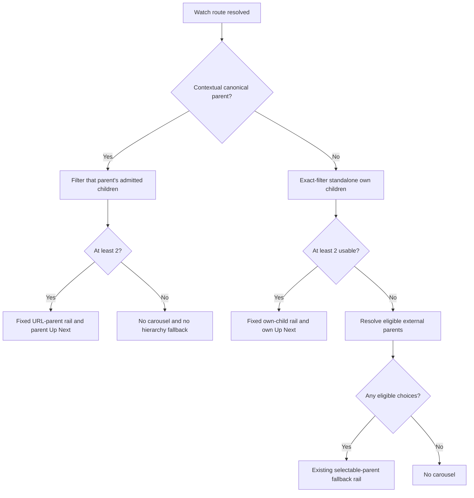

# Standalone Watch Carousel Source Priority - Plan

## Goal Capsule

- **Objective:** Make a Watch carousel follow the navigation context viewers chose: a collection named in the URL wins; otherwise a playable video's own usable children win; eligible external collections are the fallback.
- **Means:** Resolve the source hierarchy at the shared Watch merge seam, exact-filter standalone children for the selected audio language, and avoid loading parent choices when the own-child rail qualifies.
- **Authority:** The user-set hierarchy and safety constraints govern product behavior; this plan governs implementation; repository and package guides govern execution.
- **Execution profile:** Web-only behavior and documentation change with characterization-first tests, credential-free browser/runtime evidence, and worst-case payload validation.
- **Stop conditions:** Stop if the result requires Admin/schema/catalog mutation, weakens publication/rights/route admission, reclassifies playable films, changes media identity, forwards credentials, or deploys production.
- **Tail ownership:** The LFG caller owns implementation, validation, review, compounding, commit, PR, and terminal CI resolution. It must not deploy production or send a Help Scout reply.

---

## Product Contract

### Summary

Watch uses a mutually exclusive carousel-source hierarchy. A contextual URL-selected parent is authoritative. On a standalone playable-video URL, at least two usable own children produce a fixed own-child rail. Only when that rail does not qualify may eligible external parents become selectable contexts. This generic rule covers catalog-shaped films such as JESUS, Life of Jesus, and Book of Acts without title, slug, or document-ID exceptions.

Product Contract preservation: changed R1-R9 and R11-R14 — the user replaced the prior parent-first standalone selector design with the URL-first, own-first hierarchy and approved generic hybrid-film coverage, including Book of Acts.

### Problem Frame

The prior implementation appended a film's own chapters after eligible external parent contexts and kept the first external parent as the default. That makes intrinsic chapters secondary on a standalone URL and also leaves the shared merge capable of letting a hybrid child's own children override a collection explicitly named in a contextual URL. It serializes parent choices even when the standalone own-child rail should be the only visible context.

The catalog already contains the required relationships. A public, unauthenticated point-in-time survey found seven unique FEATURE_FILM routes with both external parents and at least two own children, including Life of Jesus (49), JESUS (61), and Book of Acts (73). Counts are evidence and performance fixtures, not implementation constants. This is a Web composition problem, not a catalog identity or content-type problem.

### Key Decisions

- **Honor the parent named in a contextual URL.** (session-settled: user-directed — chosen over allowing a hybrid selected video's children to replace the URL-selected collection: the URL is the viewer's explicit context.) Governs R1-R2.
- **Prefer a standalone video's own children.** (session-settled: user-directed — chosen over external-parent-first selection plus an appended own context: without a parent slug, the video's intrinsic hierarchy is the clearest context.) Governs R3-R6.
- **Use eligible external parents only as fallback.** (session-settled: user-directed — chosen over combining own and external contexts whenever own children qualify: the hierarchy should be mutually exclusive and predictable.) Governs R4-R5.
- **Apply one generic structural rule.** (session-settled: user-approved — chosen over Life-of-Jesus or Acts exceptions: the same hybrid-film shape appears across the catalog.) Governs R8 and R14.
- **Keep runtime evidence credential-free.** (session-settled: user-directed — chosen over authorization forwarding or a credential-bearing proxy: validation must preserve the public-data boundary.) Governs R13.
- **Keep the fix Web-only and identity-preserving.** (session-settled: user-directed — current Admin relations already carry the data; playback, canonical, Share, downloads, language, restrictions, and rights must not change.) Governs R6-R8.

### Requirements

**Source hierarchy**

- R1. On a contextual Watch route, use the URL-resolved canonical parent as the only carousel source even when the selected playable video owns children.
- R2. If that contextual parent's admitted children fall below the existing two-item usefulness threshold, render no sibling carousel; never fall through to the selected video's own children or another parent.
- R3. On a standalone playable-video route, render a fixed own-child carousel when at least two children are usable for the selected audio language.
- R4. Only when fewer than two standalone own children are usable may eligible external parents provide the existing selectable-parent carousel, preserving their established order and default.
- R5. Never combine a qualifying standalone own-child rail with external-parent choices in the same block or client payload.

**Admission, order, and navigation**

- R6. Preserve relation-owned child order and admit each standalone own child against the exact current parent/child/selected-audio-language route when exact manifest data is available; apply the two-item threshold after filtering.
- R7. Align carousel cards, contextual hrefs, and related-item JSON-LD with the resolved carousel hierarchy. On contextual routes, make Up Next follow the URL-selected canonical parent; on standalone routes, preserve the existing own-video Up Next behavior independently of any external-parent fallback selector. Preserve hero playback, media selection, full-film download sequence, canonical, Open Graph, Twitter, Share, language, and rights behavior.

**Safety and compatibility**

- R8. Apply the rule generically to qualifying playable videos, including catalog-shaped JESUS, Life of Jesus, and Book of Acts fixtures, without reclassifying them as SERIES/COLLECTION or changing the separate SeriesPage flow.
- R9. Preserve current manifest-outage fail-open behavior for already filtered own children; when a present legacy manifest cannot prove exact per-episode language admission, treat own admission as inconclusive and use the eligible-parent fallback.
- R14. Do not match content title, slug, or document ID, add Admin/schema operations, add a browser data request or dependency, or weaken publication, deletion, restriction, playability, slug, or route-admission gates.

**Delivery quality**

- R10. Add focused automated coverage for hierarchy, exact partial admission, thresholds, order, Up Next, structured data, navigation, identity invariants, and Series/Collection isolation.
- R11. Prove production-shaped standalone flows for Life of Jesus, JESUS, and Book of Acts using safe fixtures and public evidence without hard-coding live counts. Treat 73 as the current observed public-catalog maximum, not a permanent product ceiling.
- R12. Demonstrate that own-first removes redundant parent-choice serialization, adds no initial browser request or eager thumbnail loading, and keeps median warmed response and hydration measurements within 10% of the pinned baseline for the current observed 73-child maximum. Quantify raw/compressed payload growth even when timing remains inside budget.
- R13. Use only unauthenticated public GraphQL, public HTML, and safe local fixtures for runtime evidence; if those surfaces cannot expose the branch behavior honestly, record the exact durable limitation and complete every independent stage.

### Acceptance Examples

- AE1. Covers R1-R2, R7. Given a contextual URL selecting collection A and a hybrid child that owns chapters, the carousel, related ItemList, and Up Next use collection A; if A has fewer than two admitted children, the carousel and related ItemList omit a fallback, while contextual Up Next never switches into the child's own hierarchy.
- AE2. Covers R3-R7, R11. Given standalone Life of Jesus with 49 usable ordered chapters, the page renders one fixed 49-chapter rail with _Triumphal Entry and Results_ at relation position 30, no external-parent selector, and unchanged full-film identity.
- AE3. Covers R3-R8, R11-R12. Given standalone Book of Acts with 73 usable chapters, the same generic rule renders the own-child rail, keeps it a playable feature film, and adds no parent selector, data request, or eager 73-thumbnail load.
- AE4. Covers R4, R6-R7, R9. Given source own children 1/2/3 but exact admission only for 1 and 3, the standalone rail contains 1 and 3 in relation order; given only one exact admission or a present legacy manifest, the carousel falls back to ordered eligible parents while standalone Up Next retains its existing own-video behavior and does not follow the fallback selector.
- AE5. Covers R3, R9. Given the route manifest is unavailable, the existing restriction-filtered own children remain fail-open; two or more produce the fixed own-child rail. A later render with a present legacy manifest may intentionally select the external-parent fallback instead; both server-rendered outcomes are stable for their cache entry and never swap hierarchy after hydration.
- AE6. Covers R7-R8, R14. Choosing an own-child card navigates to the established contextual route and preserves playback/download/rights behavior; COLLECTION and SERIES records continue through SeriesPage unchanged.

### Scope Boundaries

#### In Scope

- Shared Web Watch carousel and Up Next source precedence.
- Standalone exact own-child projection and lazy external-parent fallback.
- Related ItemList semantics, route navigation, identity, browser, and performance proof.
- Updating `feat-416`, the superseded durable learning, and the roadmap index/lockfile artifacts already restored from the named recovery stash.

#### Deferred to Follow-Up Work

- The duplicate active `the-savior` public slug is a pre-existing catalog ambiguity. The generic resolver applies to the record returned by the existing slug lookup; catalog cleanup, if desired, needs a separate ticket.

#### Outside This Product's Identity

- Reclassifying a playable film because it owns chapters.
- Recreating, publishing, relabeling, or changing rights for content.
- Changing Acts, JESUS, or Life of Jesus data in Admin.
- Production deployment, credential forwarding, or Help Scout communication.

---

## Planning Contract

### Key Technical Decisions

- KTD1. **Put route-context priority at the shared merge seam.** (session-settled: user-directed — chosen over solving only the standalone page: contextual hybrid children must not override the URL-selected canonical parent.) In `buildSiblingCarouselBlock`, resolve `canonicalParent` first and terminally, then own children, then standalone `selectableParents`, then null. Implements R1-R5.
- KTD2. **Exact-filter standalone own children before resolving parents.** (session-settled: user-directed — chosen over appending a virtual parent after eager parent resolution: qualifying own children make parents irrelevant.) Use the current Watch snapshot for rendering/restriction truth and the exact manifest predicate for current-language route proof; only call/pass `selectableParentsForStandaloneVideo` below the own-child threshold. Implements R3-R6, R9, R14.
- KTD3. **Change only contextual Up Next precedence.** A contextual canonical parent is terminal for progression, so a hybrid child cannot jump into its own hierarchy when the URL names a parent. Standalone Up Next retains its existing own-video behavior; eligible parent choices remain carousel-only and do not drive standalone autoplay. Implements R1-R2 and R7 without adding selector-controlled progression.
- KTD4. **Reuse fixed-parent rendering and remove selector-only state from qualifying own rails.** Existing `SiblingCarousel` virtual-parent behavior can render a fixed own-child rail. Do not change component production code or navigation unless a failing focused test proves a gap. Implements R3-R5, R10, R12.
- KTD5. **Measure the current observed 73-child maximum without runtime loading.** The own rail can grow HTML/RSC versus `origin/main`, but own-first removes duplicate eligible-parent choices and must not add an API request, client initializer, effect, or eager thumbnail behavior. Record the observed maximum from the dated public survey rather than treating 73 as a permanent scale bound. Implements R11-R12.
- KTD6. **Keep browser/runtime proof inside public and fixture boundaries.** (session-settled: user-directed — chosen over credential forwarding or an authorization-bearing proxy.) Use anonymous public GraphQL/HTML and deterministic local fixtures, recording unavailable live proof as a limitation. Implements R13.
- KTD7. **Avoid content-identity exceptions.** (session-settled: user-approved — chosen over title/slug special cases.) Resolve from route shape and relationships only. Implements R8 and R14.

### Assumptions

- A missing manifest preserves the current fail-open own-child behavior because the snapshot has already passed content/restriction filtering; a present legacy manifest is different because it cannot establish exact selected-language episode routes and therefore triggers parent fallback.
- Live counts are point-in-time evidence. Tests use production-shaped 49/61/73 fixtures where useful but never branch on those numbers.
- The contextual canonical parent governs both the visible rail and Up Next; reaching the end never crosses into the selected video's own hierarchy. Standalone Up Next remains independent of the external-parent fallback carousel.
- Carousel-source admission and parent fallback resolve entirely during server rendering before the first client render. There is no client-side source-loading transition or post-hydration hierarchy swap to design or test.
- The duplicate `the-savior` slug does not change this generic Web rule and is not repaired in FGE-75.

### Risks & Dependencies

- **Context mismatch:** Carousel, ItemList, and contextual Up Next are separate existing consumers. Avoid a new resolver abstraction for this bounded change, but feed the same contextual and standalone cases through contract tests for all three so future drift fails visibly.
- **Admission drift:** The manifest is an indexed route gate, not a rendering payload. Keep restriction-filtered snapshot children authoritative and avoid per-child network lookups.
- **Identity leakage:** Never promote an external parent into standalone `canonicalParent` or derive canonical/Share/download/media identity from the carousel fallback.
- **Payload growth:** The current observed 73-child fixed rail can enlarge HTML/RSC. Keep thumbnails lazy, compare the same route/runtime against the final merge base, quantify raw/compressed growth, and fail if the five-run median warmed response or hydration measure regresses by more than 10%.
- **Concurrent Watch work:** Rebase carefully and preserve unrelated user changes; avoid production component edits without failing evidence.
- **Reversal:** Keep the hierarchy implementation and its contract tests in one reversible code commit before documentation closeout. An unexpected catalog-shape regression after merge triggers a normal revert PR of that code commit plus the corresponding roadmap/solution correction; do not add a runtime compatibility switch without new product authorization.

### Sources & Research

- `apps/web/src/lib/content.ts` — shared carousel and Up Next precedence seams.
- `apps/web/src/app/[locale]/[htmlLang]/[...rest]/page.tsx` — contextual versus standalone route composition and manifest admission.
- `apps/web/src/components/watch/SiblingCarousel.tsx` and `WatchPageClient.tsx` — fixed/selectable rendering and navigation contracts.
- `docs/solutions/logic-errors/standalone-watch-own-chapter-context-exact-manifest-admission.md` — exact per-child admission guidance; its old parent-first conclusion is superseded by this user decision.
- `docs/solutions/conventions/public-watch-url-two-segment-contract-20260608.md` — contextual navigation versus standalone identity.
- `docs/solutions/logic-errors/canonical-video-relation-order-download-prefixes.md` — preserve relation-owned download/order semantics after filtering.
- `docs/solutions/performance-issues/watch-static-locale-rewrite-route-manifest-admission-20260529.md` — keep the manifest an admission index, not a rendering resolver.
- `docs/solutions/logic-errors/tv-childcount-not-a-series-container-signal.md` — children do not reclassify a playable film.
- `docs/solutions/conventions/frontend-change-page-load-performance-verification.md` — frontend load evidence contract.
- [Linear FGE-75](https://linear.app/jesus-film-project/issue/FGE-75/watchbug-route-the-73-clip-acts-study-to-its-intended-collection) — support evidence and task identity.
- [Production Life of Jesus film](https://www.jesusfilm.org/watch/life-of-jesus-gospel-of-john.html) — current public control surface.

### High-Level Technical Design

---

## Implementation Units

### U1. Reopen the execution and durable decision records

- **Goal:** Make repository records describe the revised hierarchy before product edits.
- **Requirements:** R8, R10-R14.
- **Dependencies:** None.
- **Files:** `docs/roadmap/platform/feat-416-watch-life-of-jesus-chapter-context.md`, `docs/roadmap/README.md`, `pnpm-lock.yaml`, and `docs/solutions/logic-errors/standalone-watch-own-chapter-context-exact-manifest-admission.md`.
- **Approach:** Set `feat-416` to `in-progress`; replace parent-first/appended-selector and Acts-deferred language with the settled generic hierarchy while retaining exact-admission, order, identity, and safety guidance. Preserve restored index/lockfile changes from the named stash.
- **Verification:** The roadmap, plan, index, and durable learning agree on URL parent → standalone own → eligible parent fallback before U2 edits.

### U2. Implement the hierarchy and regression coverage

- **Goal:** Resolve carousel, ItemList, and Up Next from the correct route context without changing playback identity.
- **Requirements:** R1-R10 and R14; covers AE1-AE6.
- **Dependencies:** U1.
- **Files:** `apps/web/src/lib/content.ts`, its merge tests, the catch-all `page.tsx` and routing tests, `SiblingCarousel` tests, and navigation/structured-data tests only if characterization exposes a gap.
- **Approach:**
  1. Add failing shared-merge characterizations for contextual-parent authority, terminal below-threshold behavior, standalone-own priority, and parent fallback.
  2. Reorder `buildSiblingCarouselBlock` to canonical parent → own children → selectable parents → null, with each threshold terminal in its route context.
  3. Reorder `buildNextWatchItem` so contextual parent progression is authoritative, while preserving existing standalone own progression independently of external-parent carousel fallback.
  4. In the standalone page route, exact-project own children before computing eligible parents; if the own projection qualifies, pass it with no selectable parents. Preserve manifest-null fail-open and present-legacy fallback semantics.
  5. Replace appended-selector tests with fixed own-rail tests and retain identity/navigation/download assertions.
- **Test scenarios:** contextual hybrid parent wins; below-threshold contextual parent never switches hierarchies; standalone own wins with no parent payload; partial exact admission preserves gaps/order; one exact or legacy manifest falls back without making the selector control standalone Up Next; null manifest fail-opens; 49/61/73 fixtures share the generic path; identity/rights/download/playback remain unchanged; COLLECTION/SERIES stay isolated.
- **Verification:** Focused route/merge/carousel/navigation/structured-data suites pass and show no product-code change outside the required shared and route seams unless a failing test documents the need.

### U3. Validate, compound, and close the execution record

- **Goal:** Prove behavior and load posture, then leave durable records ready for PR review.
- **Requirements:** R5-R13; covers AE1-AE6.
- **Dependencies:** U2.
- **Files:** `docs/roadmap/platform/feat-416-watch-life-of-jesus-chapter-context.md` and the standalone exact-admission solution.
- **Approach:** Run focused tests and PR-sensitive static checks; compare a pinned `origin/main` baseline and branch using the same safe fixture/runtime; capture desktop and compact browser evidence for contextual and standalone routes when honestly available; verify fixed own rails, contextual rails, fallback selectors, card navigation, focus/keyboard behavior, screen-reader labels, touch targets, and the no-carousel state; quantify the current observed 73-child payload and request posture; record exact limitations; mark the roadmap complete only after independent gates pass. For each production-shaped fixture/evidence set, record the capture date, anonymous public GraphQL query or page source, retained relation/language/restriction fields, and observed order/count so catalog drift is distinguishable from an implementation regression.
- **Verification:** The ticket contains exact test, typecheck, lint, format, payload, browser/performance, safety, and PR evidence; no credential-bearing request, production deployment, or Help Scout message occurred.

---

## Verification Contract

Performance comparisons use the final merge-base SHA, identical runtime configuration and fixture data, five warmed runs per side, and the median. Pass requires zero new browser/Admin requests, zero newly eager chapter thumbnails, no new client initializer/effect, and no more than 10% regression in warmed response or measured hydration time; raw and gzip/brotli HTML/RSC changes are always reported. A public surface that cannot expose hydration or branch behavior is recorded as unavailable and is never converted into a pass.

| Gate                  | Scope                                                                                                          | Done signal                                                                                                                                                                                                       |
| --------------------- | -------------------------------------------------------------------------------------------------------------- | ----------------------------------------------------------------------------------------------------------------------------------------------------------------------------------------------------------------- |
| Focused behavior      | Catch-all routing, content merge, carousel, navigation, and structured data                                    | Hierarchy, threshold, partial admission, manifest fallback, identity, and Series/Collection isolation scenarios pass.                                                                                             |
| Web static checks     | `@forge/web` typecheck, lint, format, generated/payload-sensitive checks                                       | No TypeScript, lint, formatting, generated artifact, or payload-preflight failure.                                                                                                                                |
| Broader regression    | PR-focused Watch suites                                                                                        | No canonical, Share, playback, download, rights, language, or navigation regression.                                                                                                                              |
| Browser behavior      | Contextual hybrid control plus standalone Life of Jesus/Acts-shaped fixtures at desktop and compact widths     | Available credential-free evidence matches R1-R11 and covers keyboard, screen-reader labeling, focus, touch targets, and no-carousel behavior; unavailable live behavior is recorded as a limitation, not a pass. |
| Page-load performance | Final merge-base versus branch, identical runtime/fixture, five warmed runs, current observed 73-child maximum | No new browser/Admin request, initializer, or eager rail; raw/compressed growth is reported and median warmed response/hydration stays within 10% where that measure is honestly available.                       |
| Durable closeout      | `feat-416`, solution learning, plan, roadmap index, and restored `pnpm-lock.yaml` artifact                     | All describe or preserve the intended recovery state; ticket is complete with exact evidence and PR link.                                                                                                         |
| Shipping              | Existing branch and PR #2005                                                                                   | Final commits pushed; required CI reaches a terminal success or an honestly documented external blocker; no production deployment.                                                                                |

---

## Definition of Done

- U1 records the revised decision before U2 product edits.
- U2 satisfies R1-R10 and R14 with focused automated coverage.
- U3 satisfies R5-R13 with browser/performance evidence or exact credential-free limitations.
- Contextual URLs are authoritative; standalone own children are primary; external parents are fallback only.
- Life of Jesus, JESUS, and Book of Acts follow one structural rule with no title/slug/ID exception or film reclassification.
- Playback, canonical, Share, downloads, language, rights, restrictions, and relation order remain intact.
- The named recovery stash remains preserved.
- Simplification, review, compounding, final commits, push, PR update, and terminal CI resolution complete without credentials, production deployment, or Help Scout communication.
