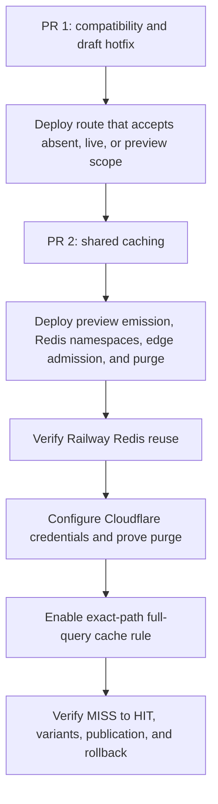
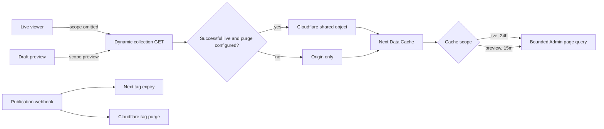

# Watch Infinite Feed Shared Cache - Plan

## Goal Capsule

- **Objective:** Editors can preview large Watch homepages without the infinite feed failing, and viewers reuse stable collection batches without repeated backend work.
- **Means:** Ship a compatibility-first hotfix, then add separate live and preview page caches with opt-in Cloudflare delivery and semantic purge (KTD1-KTD7).
- **Authority:** The session-settled decisions in KTD1-KTD4 govern cache granularity, origin storage, viewer independence, preview isolation, and edge admission.
- **Execution profile:** Two stacked application PRs through the normal PR-to-main workflow, followed by a separately authorized operational rollout.
- **Stop condition:** Do not enable the Cloudflare cache rule until Railway Redis reuse, purge credentials, edge variant isolation, and rollback behavior are verified.
- **Tail ownership:** Web operations owns Cloudflare activation, cache evidence, alerts, and rollback after the code PRs merge.

---

## Product Contract

### Summary

The live Watch homepage reuses deterministic collection-feed pages across viewers. Draft preview variants use a shorter isolated origin-cache namespace and never enter the public edge cache. Relevant publication events invalidate the Railway-backed Next Data Cache and attempt to purge the optional Cloudflare object.

### Problem Frame

The current 60-second Data Cache lifetime repeats Admin and PostgreSQL work for content that changes rarely. The public route is always browser `no-store`, so Cloudflare cannot absorb repeated live homepage reads. The authored exclusion collector also includes child slugs even though Admin applies slug exclusions to collection parents. Large drafts can exceed the route URL limit and show a retry state before Admin is called.

### Requirements

**Feed identity and delivery**

- R1. Every live viewer with the same locale, language, profile, cursor, and canonical authored exclusions receives the same cached feed page.
- R2. Cache complete bounded feed pages rather than the full catalog, individual collections, or individual cards.
- R3. Railway's Redis-backed Next Data Cache retains live pages for 24 hours and preview pages for no more than 15 minutes, with existing Watch home and video tags available for immediate invalidation.

**Draft reliability and compatibility**

- R4. Authored exclusions contain child media IDs and parent collection slugs without child video slugs.
- R5. The route accepts an absent scope as live and accepts explicit `live` or `preview` values, while live clients omit the default scope and preview clients send only `scope=preview`.
- R6. The new preview client behavior is deployed only after the compatibility route can accept the preview parameter.

**Edge safety and freshness**

- R7. Browsers continue to receive `no-store`, while Cloudflare may cache only successful live responses when cache-tag purge is fully configured.
- R8. Experience, video, and watch-setting webhooks attempt one bounded Cloudflare feed-tag purge without making local Next invalidation or webhook success depend on Cloudflare.
- R9. Errors, rate limits, invalid requests, and draft preview responses are never shared at the Cloudflare edge.
- R10. Production activation verifies shared Redis reuse, edge variant separation, publication freshness, webhook latency, observability, and a purge-first rollback path.

### Acceptance Examples

- AE1. **Covers R4.** Given a homepage with many authored child videos, the dynamic request includes their IDs but not their slugs and remains within the route budget.
- AE2. **Covers R1-R3.** Given two anonymous live viewers making an identical first-page request, both requests address one shared page variant rather than user-specific entries.
- AE3. **Covers R5-R7 and R9.** Given a draft preview, its request contains `scope=preview`, uses the preview origin namespace, and receives no Cloudflare cache header or tag.
- AE4. **Covers R8.** Given a relevant publication, Next tags expire and one configured Cloudflare purge is attempted; purge failure is logged without changing webhook success.
- AE5. **Covers R5-R6.** Given mixed deployment versions, an old live client can call the new route and a new live client can call the old route because neither requires the default live parameter.
- AE6. **Covers R10.** Given Cloudflare activation, the same live URL changes from `MISS` to `HIT`, a legitimate query variant remains isolated, and publication removes the stale object.

### Scope Boundaries

In scope are the Web request projection, backward-compatible cache-scope transport, Railway-backed Data Cache retention, Cloudflare response policy, semantic purge integration, tests, operating documentation, and roadmap reconciliation.

Admin SQL, GraphQL schema, generated GraphQL artifacts, per-card caching, full-catalog preloading, personalization, and direct production deployment remain out of scope.

### Success Criteria

- The reported draft no longer fails because unused child slugs inflate the request URL.
- Repeated identical live pages execute Admin work at most once per 24-hour fallback window unless semantic invalidation expires them sooner.
- No account, cookie, IP, geography, or user-agent input affects the cache identity.
- Rolling live deployment and rollback do not fail because of the new scope parameter.
- Production evidence proves shared Redis reuse before Cloudflare, then proves `MISS` to `HIT`, variant isolation, and fresh content after publication.

### Product Contract Preservation

Product Contract unchanged in intent. R5, R6, and R10 make rolling compatibility and operational safety explicit without changing the requested cache behavior.

---

## Planning Contract

### Key Technical Decisions

- KTD1. **Cache bounded feed pages.** Keep each mobile batch at two parents with up to eight cards and each desktop batch at three parents with up to twelve cards. Preserve one bounded Admin feed request per page. (session-settled: user-approved — chosen over loading the full catalog or caching individual cards: bounded page delivery preserves scroll-triggered loading and avoids SQL or cache fan-out.) Governs R1-R3.
- KTD2. **Use the existing Railway-backed Next Data Cache.** Keep origin caching in the current `unstable_cache` and Redis cache-handler path. Do not add viewer-specific or bespoke object caching. (session-settled: user-approved — chosen over a per-user or new object cache: the content is stable and identical across viewers.) Governs R1-R3.
- KTD3. **Separate live and preview namespaces.** Use distinct cache functions and include scope in the client feed lifecycle identity. (session-settled: user-approved — chosen over one shared live/draft namespace: preview traffic must not warm or expose the longer-lived live cache.) Governs R3, R5-R7, R9.
- KTD4. **Gate edge admission on purge capability.** Emit Cloudflare-specific freshness and the feed cache tag only for successful live responses when both purge credentials exist. (session-settled: user-approved — chosen over unconditional shared edge caching: long-lived edge objects require a publication-time invalidation path.) Governs R7-R9.
- KTD5. **Invalidate by semantic tag.** Attach the fixed Cloudflare feed-tag purge to the authenticated revalidation receiver after local path and tag invalidation. Bound failures and redact credentials. Governs R8, R10.
- KTD6. **Ship two stacked code PRs.** PR 1 introduces route compatibility and the draft URL fix. PR 2 introduces preview emission, separate cache lifetimes, edge admission, and purge. This avoids a new preview client calling an old route that rejects `scope`. Governs R5-R10.
- KTD7. **Activate Cloudflare after merge.** First prove Railway Redis reuse with the Cloudflare rule disabled. Then configure purge credentials, verify purge and origin headers, enable the exact-path rule, and collect edge evidence. Governs R10.

### High-Level Technical Design

### PR Topology and Sequencing

| PR                                        | Units | Independent deploy value                                                                                        | Merge condition                                                                                  |
| ----------------------------------------- | ----- | --------------------------------------------------------------------------------------------------------------- | ------------------------------------------------------------------------------------------------ |
| PR 1: compatibility and draft hotfix      | U1    | Fixes the observed draft URL failure and makes the route forward-compatible while edge caching remains disabled | Reconcile with `origin/main`, preserve upstream Watch homepage changes, and pass U1 verification |
| PR 2: shared cache and safe edge delivery | U2-U4 | Adds long-lived shared origin caching and opt-in edge caching after the transport contract is deployed          | PR 1 deployed; edge admission and purge remain in the same PR                                    |

Cloudflare activation is not a third code PR. It is a separately authorized operational stage after PR 2 deploys.

### Risks and Dependencies

- The branch is 15 commits behind `origin/main`. Execution must reconcile overlapping `WatchHomeExperiencePage` and roadmap changes without discarding the upstream language-globe work.
- The platform roadmap advanced while this branch was open. The implementation ticket was reconciled to the next valid platform ID, `feat-428`, with dependency references and generated totals repaired after synchronizing with `origin/main`.
- The cache handler falls back to process-local LRU when production `REDIS_URL` is missing or unusable. The operational gate must prove Redis-backed reuse across requests before claiming shared origin caching.
- The Cloudflare purge can add up to three seconds to Web revalidation inside Admin's five-second webhook budget. Pre-activation evidence must show end-to-end completion below that budget.
- A code rollback while the Cloudflare rule remains active can leave cached objects without the matching purge path. Rollback must disable the rule and purge the feed tag before reverting the Web code.
- Purge failure currently emits a warning. Activation requires a production-visible log check or alert for the fixed purge-failure event.

### Sources and Research

- `apps/web/cache-handler.mjs` defines Redis-backed Next Data Cache behavior and the process-local fallback.
- `apps/web/src/lib/dynamic-collection-feed.ts` and `apps/web/src/components/sections/DynamicMediaCollection.tsx` define bounded page production and scroll-triggered client delivery.
- `docs/solutions/performance-issues/watch-infinite-feed-bounds-server-and-dom-work.md` requires page-level caching, live/preview isolation, and atomic edge admission plus purge.
- `docs/solutions/best-practices/verify-infra-writes-via-independent-read-path-20260420.md` requires verifying infrastructure state through an independent read path.
- `docs/solutions/workflow-issues/deferred-verification-belongs-in-consuming-ticket-entry-conditions.md` requires explicit evidence gates for post-merge operational work.

---

## Implementation Units

### U1. Backward-compatible scope transport and canonical exclusions

- **Goal:** Fix the draft URL failure and deploy a scope-aware route before any preview client emits the new parameter.
- **Requirements:** R4-R6; AE1, AE5; KTD6.
- **Dependencies:** None.
- **Files:** `apps/web/src/lib/featured-collection-references.ts`, `apps/web/src/lib/featured-collection-references.test.ts`, `apps/web/src/lib/dynamic-collection-contract.ts`, `apps/web/src/lib/dynamic-collection-client.ts`, `apps/web/src/lib/dynamic-collection-client.test.ts`, `apps/web/src/app/api/dynamic-collections/route.ts`, and `apps/web/src/app/api/dynamic-collections/route.test.ts`.
- **Approach:** Keep parent collection slugs and child media IDs as separate authored-exclusion projections. Accept absent, `live`, and `preview` scope values at the route. Default absence to live. Serialize scope only for preview so a live client remains compatible with the previously deployed route.
- **Execution note:** Start with request-contract tests that prove old and new live request shapes before changing serialization.
- **Test scenarios:**
  1. Covers AE1. A media collection contributes its parent slug and child IDs but no child video slug.
  2. Nested authored blocks remain discoverable and dynamic blocks contribute no authored exclusions.
  3. A live input produces a request URL without `scope`.
  4. A preview input produces a request URL with exactly one `scope=preview` parameter.
  5. The route maps an absent scope and explicit `live` to live, and maps explicit `preview` to preview.
  6. Unknown or repeated scope parameters fail validation without adding cacheable response headers.
- **Verification:** PR 1 can deploy with no preview caller change and no Cloudflare cache admission.

### U2. End-to-end preview isolation and shared origin retention

- **Goal:** Reuse deterministic page batches across viewers while keeping draft traffic in a shorter cache namespace.
- **Requirements:** R1-R3, R5-R6; AE2, AE3; KTD1-KTD3, KTD6.
- **Dependencies:** U1 deployed.
- **Files:** `apps/web/src/app/(preview)/preview/experience/[token]/page.tsx`, `apps/web/src/app/(preview)/preview/experience/[token]/page.test.tsx`, `apps/web/src/components/home/WatchHomeExperiencePage.tsx`, `apps/web/src/components/sections/index.tsx`, `apps/web/src/components/sections/DynamicMediaCollection.tsx`, `apps/web/src/components/sections/DynamicMediaCollection.test.tsx`, `apps/web/src/lib/dynamic-collection-feed.ts`, and `apps/web/src/lib/dynamic-collection-feed.test.ts`.
- **Approach:** Thread preview scope through the existing section-rendering path. Include scope in the client feed identity so a scope change aborts and resets prior work. Select separate 24-hour live and 15-minute preview `unstable_cache` wrappers around the unchanged bounded Admin request.
- **Test scenarios:**
  1. Covers AE2. Identical live page inputs select the live shared cache wrapper with content-derived arguments only.
  2. Covers AE3. The draft page reaches the dynamic client with preview scope and selects the preview wrapper.
  3. Changing scope resets the feed lifecycle, aborts an in-flight request, and does not append the old scope's sections.
  4. Mobile and desktop profiles preserve the existing bounded parent and card limits.
- **Verification:** One page miss still produces one bounded Admin GraphQL request, and no viewer identity enters either cache key.

### U3. Atomic Cloudflare admission and semantic purge

- **Goal:** Cache successful live pages at Cloudflare without sharing previews, failures, or objects that cannot be purged after publication.
- **Requirements:** R7-R9; AE3, AE4; KTD4-KTD6.
- **Dependencies:** U1 deployed; U2 in the same PR.
- **Files:** `apps/web/src/lib/cloudflare-cache.ts`, `apps/web/src/lib/cloudflare-cache.test.ts`, `apps/web/src/app/api/dynamic-collections/route.ts`, `apps/web/src/app/api/dynamic-collections/route.test.ts`, `apps/web/src/app/api/revalidate/route.ts`, `apps/web/src/app/api/revalidate/route.test.ts`, `apps/web/src/env.ts`, and `apps/web/.env.example`.
- **Approach:** Use one configuration predicate for edge response headers and purge eligibility. Emit Cloudflare-only freshness and a fixed feed cache tag for successful live responses. Purge that tag after relevant authenticated local invalidation. Bound the request, redact diagnostics, and preserve webhook success on failure.
- **Test scenarios:**
  1. Missing or partial configuration skips edge admission and the purge request.
  2. A configured successful live response retains browser `no-store` and exposes Cloudflare freshness plus the fixed tag.
  3. Preview, invalid, rate-limited, and upstream-failed responses expose no shared edge policy.
  4. A configured purge sends one authenticated request to the fixed zone endpoint with the feed tag.
  5. HTTP failure, malformed response, network failure, and timeout return a bounded failure without exposing token or error details.
  6. Experience, video, and watch-setting webhooks invoke purge once; unrelated, unauthorized, and invalid payloads do not.
  7. Purge failure leaves local path and tag invalidation plus the webhook response successful.
- **Verification:** Edge cache admission cannot ship or activate without the matching semantic purge path.

### U4. Upstream reconciliation and operational rollout contract

- **Goal:** Preserve upstream changes and define evidence for shared-cache activation and rollback.
- **Requirements:** R10; AE6; KTD6-KTD7.
- **Dependencies:** U1-U3.
- **Files:** `apps/web/CLAUDE.md`, `docs/operations/web-production-readiness.md`, `docs/roadmap/README.md`, `docs/roadmap/platform/feat-405-watch-infinite-collection-feed.md`, the renamed platform roadmap ticket for this work, and `docs/plans/2026-08-25-2102-perf-watch-infinite-feed-shared-cache-plan.md`.
- **Approach:** Reconcile the stale base before shipping, allocate the next valid roadmap ID, update this plan's `origin` field, and document the cache identity, TTLs, invalidation behavior, required variables, Railway Redis check, Cloudflare activation order, purge observability, webhook budget, and purge-first rollback.
- **Test scenarios:** Test expectation: none -- this unit changes documentation and roadmap metadata rather than runtime behavior.
- **Verification:** The runbook requires direct-origin Redis evidence before Cloudflare, then origin-header, `MISS` to `HIT`, query-variant, post-publication freshness, latency, alerting, and rollback evidence.

---

## Verification Contract

| Gate                 | Scope                                           | Done signal                                                                                                                                                |
| -------------------- | ----------------------------------------------- | ---------------------------------------------------------------------------------------------------------------------------------------------------------- |
| Focused Vitest       | U1-U3 test files named above                    | Exclusions, scope compatibility, feed lifecycle, cache selection, edge headers, purge, and failure isolation pass                                          |
| Web unit suite       | `pnpm --filter @forge/web test`                 | No new failure is introduced; any pre-existing harness failure is recorded with evidence                                                                   |
| Web TypeScript       | `pnpm --filter @forge/web typecheck`            | Strict typecheck passes without Admin schema or generated type changes                                                                                     |
| Web lint             | `pnpm --filter @forge/web lint`                 | UI locale drift and ESLint checks pass                                                                                                                     |
| Formatting           | `pnpm format:check` and `git diff --check`      | Changed files are formatted and contain no whitespace errors                                                                                               |
| PR 1 deploy smoke    | Compatibility route and draft exclusion request | Live request omits scope; preview-capable route accepts all valid scope forms; large authored draft stays within the request budget                        |
| PR 2 origin smoke    | Railway Web with Cloudflare rule disabled       | Working `REDIS_URL` and namespace are verified, and identical page requests reuse the shared origin entry                                                  |
| Edge activation gate | Separately authorized production operation      | Direct-origin headers, purge, `MISS` to `HIT`, variant isolation, publish freshness, webhook latency, warning alert, and purge-first rollback are recorded |

No Admin schema, migration, SQL, or generated GraphQL validation is required because the existing bounded Admin feed contract does not change.

---

## Definition of Done

- U1 is complete when PR 1 fixes child-slug URL inflation, preserves old and new live request compatibility, and deploys before any preview client emits `scope=preview`.
- U2 is complete when live and preview use separate page-level origin caches with the required retention and viewer-independent identity.
- U3 is complete when edge admission and semantic purge share one configuration predicate, all non-live and failure responses remain edge-ineligible, and purge failure cannot fail publication revalidation.
- U4 is complete when the branch is reconciled with `origin/main`, the roadmap ID and totals are valid, and the operational runbook covers activation, observation, and rollback.
- Both code PRs preserve one bounded Admin request per feed page and introduce no Admin schema, SQL, or generated GraphQL changes.
- PR-focused tests, typecheck, lint, formatting, and diff checks pass for each PR.
- Abandoned experiments, duplicate cache paths, stale roadmap references, and unrelated generated changes are absent from both diffs.
- Production configuration changes occur only through separately authorized operations after both PRs merge through the normal PR-to-main flow.
